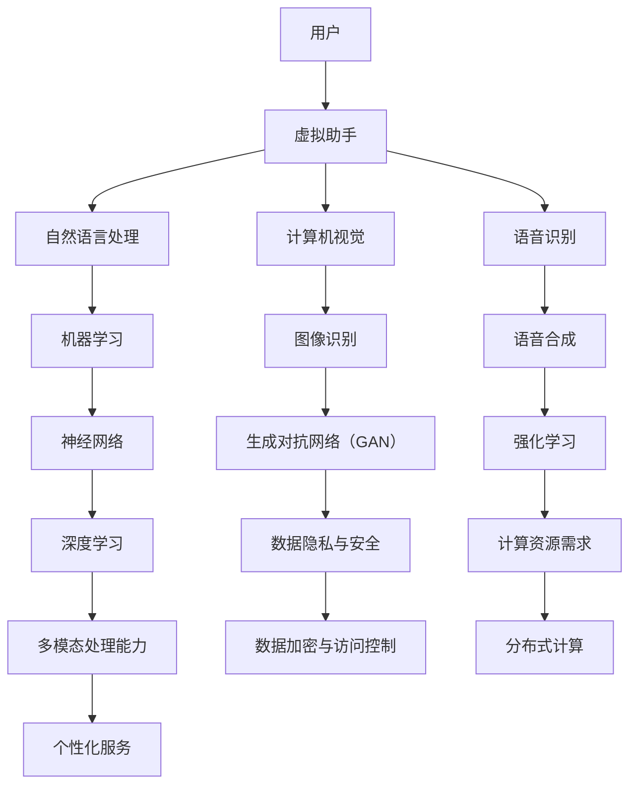
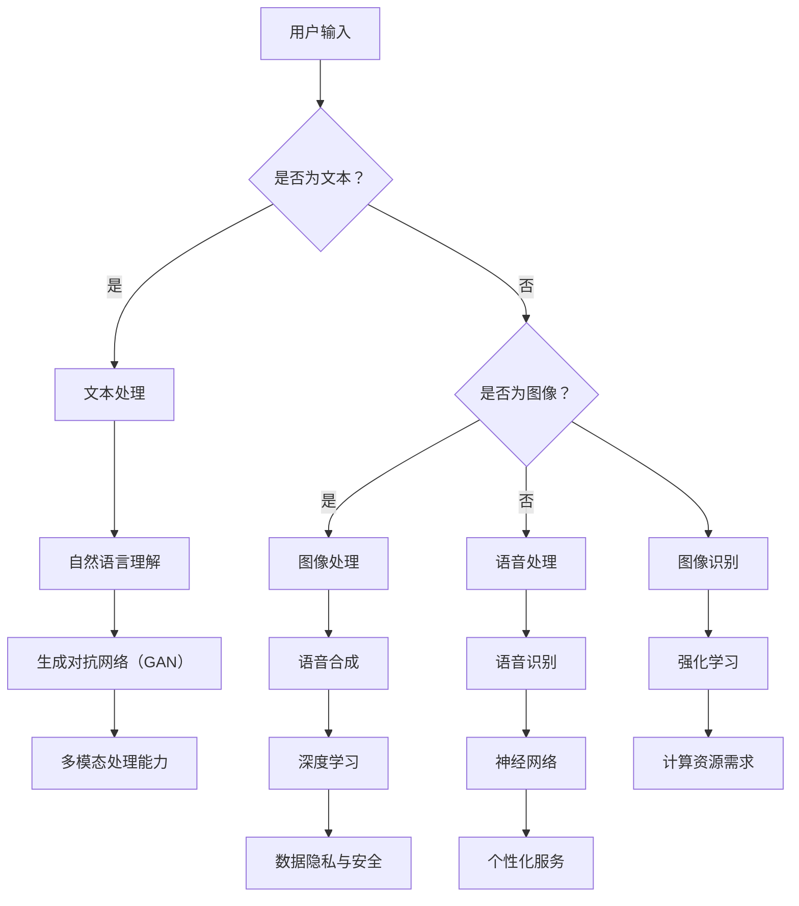

                 

### 文章标题

# AI大模型在虚拟助手领域的商业前景

### 关键词

- AI大模型
- 虚拟助手
- 商业前景
- 技术创新
- 用户体验
- 数据隐私

### 摘要

本文深入探讨了AI大模型在虚拟助手领域的商业前景。首先，我们回顾了虚拟助手与AI大模型的基本概念及其相互关系，详细介绍了AI大模型的核心技术与原理，以及其在虚拟助手中的应用挑战和解决方案。接着，本文分析了AI大模型在虚拟助手领域的商业应用前景，探讨了各种商业模式与策略，并解析了实际案例。最后，本文展望了AI大模型在虚拟助手领域的未来发展，提出了技术趋势、社会与经济影响以及未来发展的建议。通过这一步步的分析，我们旨在为读者提供对AI大模型在虚拟助手领域商业前景的全面理解。

#### 第一部分: 虚拟助手与AI大模型概述

##### 第1章: 虚拟助手与AI大模型的基本概念

##### 1.1 什么是虚拟助手

虚拟助手，也称为虚拟个人助理或智能助手，是一种通过计算机程序或人工智能技术实现的虚拟角色，能够模拟人类的交互方式，提供信息查询、任务管理、日程安排等辅助功能。虚拟助手的发展可以追溯到20世纪90年代，随着互联网的普及和计算能力的提升，虚拟助手逐渐从简单的语音识别和文本回复发展到具备复杂决策能力和多模态交互能力的高级形态。

虚拟助手的类型主要包括：

- **语音助手**：如苹果的Siri、谷歌的Google Assistant、亚马逊的Alexa等，通过语音交互提供信息查询、控制智能家居设备等服务。
- **文本助手**：如微软的小冰、腾讯的微信小助手等，通过文字交互提供信息推送、聊天陪伴等服务。
- **多模态助手**：结合语音、文本、图像等多种交互方式，如苹果的iMessage App Store中的各种虚拟角色。

虚拟助手的功能多样，主要包括：

- **信息查询**：能够回答用户关于天气、新闻、股票等常见问题。
- **任务管理**：帮助用户设置提醒、管理日程、安排会议等。
- **智能家居控制**：通过语音指令控制智能灯泡、智能锁等家居设备。
- **语音通话**：一些虚拟助手还能提供语音通话功能。

虚拟助手对用户的直接价值包括：

- **提高效率**：通过自动化任务和提供即时信息，帮助用户节省时间。
- **提升体验**：通过自然语言交互，提供更加人性化的服务。
- **便利性**：特别是在移动设备上，虚拟助手可以随时随地为用户提供服务。

##### 1.2 AI大模型的定义与重要性

AI大模型，通常指的是那些具有巨大参数量和计算需求的深度学习模型，能够处理海量数据，并从中学习复杂的模式。这些模型通常基于神经网络结构，通过多次迭代训练，能够实现高度复杂的任务，如自然语言处理、图像识别、语音识别等。

AI大模型的特点包括：

- **大规模参数**：大模型通常拥有数亿甚至数十亿个参数，这使它们能够捕捉到数据中的细微模式。
- **深度网络结构**：大模型具有多个隐藏层，这有助于它们学习更复杂的特征。
- **强大的学习能力**：通过大规模数据进行训练，大模型能够显著提高其预测和分类的准确性。
- **多模态处理能力**：大模型能够处理多种类型的数据，如文本、图像、声音等，实现跨模态的信息整合。

AI大模型在虚拟助手中的应用前景广泛，主要体现在以下几个方面：

- **提升交互体验**：大模型能够更好地理解用户的自然语言输入，提供更准确、更个性化的服务。
- **增强任务能力**：大模型可以处理复杂的任务，如多轮对话管理、多任务并行处理等。
- **自适应学习**：通过持续学习用户行为数据，大模型可以不断优化自身性能，提高用户体验。

##### 1.3 AI大模型在虚拟助手中的应用前景

AI大模型在虚拟助手中的应用前景是广阔的，以下是一些具体的应用方向：

- **个性化服务**：通过分析用户的历史行为数据，大模型可以提供高度个性化的服务，如推荐系统、个性化问答等。
- **自然语言理解**：大模型能够更好地理解用户的自然语言输入，实现更流畅的对话交互。
- **情感识别**：通过分析语音和文本的情感色彩，大模型可以帮助虚拟助手更好地理解用户情绪，提供相应的情感支持。
- **智能决策**：大模型可以处理复杂的决策问题，如路径规划、资源分配等，帮助虚拟助手提供更智能的决策支持。
- **跨模态交互**：大模型能够处理多种类型的数据，实现语音、文本、图像等多种模态的信息整合，提供更加丰富的交互体验。

##### 1.4 虚拟助手与AI大模型的关系

虚拟助手与AI大模型之间存在着紧密的联系。虚拟助手作为用户交互的接口，需要具备强大的数据处理能力和智能决策能力，而AI大模型正是实现这些能力的核心技术。

AI大模型如何增强虚拟助手：

- **提升交互质量**：大模型能够更好地理解用户的意图和需求，提供更精准的回答和建议。
- **提高决策效率**：大模型能够处理复杂的决策问题，帮助虚拟助手做出更明智的决策。
- **扩展功能范围**：大模型的多模态处理能力可以帮助虚拟助手实现更广泛的功能，如图像识别、语音识别等。
- **优化用户体验**：通过持续学习和优化，大模型可以不断提升虚拟助手的服务质量，提高用户体验。

虚拟助手技术的演变：

- **从简单到复杂**：早期的虚拟助手主要提供简单的信息查询和任务管理功能，而随着AI大模型的发展，虚拟助手逐渐具备了更复杂的交互能力和决策能力。
- **从单一到多模态**：早期的虚拟助手主要依赖于文本或语音交互，而随着多模态AI大模型的应用，虚拟助手可以同时处理文本、语音、图像等多种模态的信息，提供更丰富的交互体验。
- **从被动到主动**：早期的虚拟助手主要依赖于用户的主动请求，而随着AI大模型的应用，虚拟助手可以主动推送用户可能感兴趣的信息，提供更个性化的服务。

##### 1.5 AI大模型在虚拟助手中的应用案例

AI大模型在虚拟助手中的应用已经取得了显著的成果，以下是一些具体的案例：

- **Siri与谷歌助手**：苹果的Siri和谷歌的Google Assistant都采用了大规模的AI大模型，能够提供自然语言交互和智能问答服务。
- **小冰**：微软的小冰是一个结合了AI大模型的虚拟助手，能够进行情感化的对话交互，提供情感支持和陪伴。
- **虚拟客服**：许多企业采用了基于AI大模型的虚拟客服系统，能够处理大量的客户咨询，提供高效、准确的回答。
- **医疗助手**：一些医疗机构开发了基于AI大模型的虚拟医疗助手，能够提供初步的诊断建议和医疗信息查询。

通过这些案例可以看出，AI大模型在虚拟助手中的应用不仅提高了交互质量和功能范围，还为虚拟助手带来了巨大的商业价值。

##### 1.6 小结

在本章中，我们详细介绍了虚拟助手与AI大模型的基本概念，阐述了虚拟助手的历史与发展、类型与功能，以及虚拟助手的用户价值。同时，我们探讨了AI大模型的定义与重要性，分析了AI大模型在虚拟助手中的应用前景和核心技术。通过这些内容，我们为后续章节的分析提供了坚实的基础。

### 第二部分: AI大模型核心技术与原理

#### 第2章: 虚拟助手与AI大模型的关系

##### 2.1 AI大模型如何增强虚拟助手

虚拟助手作为用户交互的桥梁，其核心价值在于为用户提供高效、准确、个性化的服务。而AI大模型，特别是基于深度学习的模型，通过其强大的数据处理和分析能力，极大地增强了虚拟助手的性能和功能。

首先，AI大模型在虚拟助手中的应用主要体现在以下几个方面：

1. **自然语言理解**：
   - **意图识别**：虚拟助手需要理解用户的语言意图，如查询天气、设置提醒等。AI大模型通过学习大量的语言数据，能够准确识别用户的意图。
   - **情感分析**：虚拟助手不仅需要回答用户的问题，还需要理解用户的情绪，提供适当的反馈。AI大模型通过情感分析技术，可以识别用户的情绪状态，如喜悦、愤怒、悲伤等。

2. **多轮对话管理**：
   - 虚拟助手往往需要与用户进行多轮对话，以获取更多信息或完成任务。AI大模型通过记忆和上下文信息，能够更好地管理多轮对话，提供连贯的回答。

3. **个性化服务**：
   - AI大模型可以根据用户的历史行为和偏好，提供个性化的服务。例如，虚拟助手可以根据用户的购物历史推荐商品，或者根据用户的学习习惯提供个性化的教育内容。

4. **图像和语音处理**：
   - AI大模型能够处理图像和语音数据，使虚拟助手能够理解和回应视觉和听觉信息。例如，虚拟助手可以通过图像识别技术理解用户提供的图片信息，或通过语音识别技术理解用户的语音指令。

其次，AI大模型在虚拟助手中的角色是至关重要的。它不仅是虚拟助手的核心技术支撑，也是虚拟助手实现智能化和个性化的关键。以下是AI大模型在虚拟助手中的具体角色：

- **知识库**：AI大模型通过学习大量的语言和知识数据，构建了一个庞大的知识库。虚拟助手可以通过查询这个知识库，为用户提供准确的信息和解答。
- **预测引擎**：AI大模型可以通过分析和预测用户的行为和偏好，提前为用户提供服务。例如，虚拟助手可以预测用户可能需要的帮助，并提前推送相关信息。
- **学习系统**：AI大模型是一个持续学习和优化的系统。通过不断收集用户反馈和新的数据，虚拟助手可以不断改进自身的服务质量和用户满意度。

最后，虚拟助手技术的演变离不开AI大模型的支持。以下是虚拟助手技术的发展历程：

1. **早期虚拟助手**：
   - 主要依赖于预定义的规则和命令，功能较为简单，无法处理复杂的问题和对话。

2. **基于规则的虚拟助手**：
   - 引入了一些机器学习和自然语言处理技术，能够处理一些简单的问题和对话，但仍然受到规则限制，无法实现真正的智能化。

3. **基于AI大模型的虚拟助手**：
   - 通过大规模的AI大模型，虚拟助手能够处理复杂的语言和图像任务，实现高度智能化和个性化的服务。

4. **未来的虚拟助手**：
   - 随着AI大模型技术的不断进步，虚拟助手将更加智能化，能够处理更多的任务，提供更加个性化的服务。

总之，AI大模型通过其强大的数据处理和分析能力，不仅提升了虚拟助手的性能和功能，也为虚拟助手的发展提供了新的方向和可能性。

#### 2.2 AI大模型在虚拟助手中的应用案例

AI大模型在虚拟助手中的应用已经取得了显著的成果，以下是一些具体的案例：

1. **Siri与谷歌助手**：
   - 苹果的Siri和谷歌的Google Assistant都是基于AI大模型的虚拟助手。它们能够通过自然语言交互理解用户的意图，提供天气预报、日程安排、智能建议等服务。
   - **技术实现**：Siri和Google Assistant都采用了深度学习模型进行自然语言处理和语音识别。Siri使用了苹果自己开发的神经引擎，而Google Assistant则使用了谷歌的TensorFlow模型。
   - **商业效益**：这些虚拟助手为用户提供了高效、便捷的服务，提高了用户体验，同时也为苹果和谷歌带来了巨大的商业价值。

2. **小冰**：
   - 微软的小冰是一个结合了AI大模型的虚拟助手，它能够进行情感化的对话交互，提供情感支持和陪伴。
   - **技术实现**：小冰采用了深度学习模型进行自然语言理解和情感分析。它通过分析用户的历史对话和情感表达，不断优化自身的对话能力和情感识别。
   - **商业效益**：小冰为用户提供了一种全新的交互体验，特别是在情感支持方面，得到了用户的高度评价。微软通过小冰拓展了其在线服务和智能设备的市场。

3. **虚拟客服**：
   - 许多企业采用了基于AI大模型的虚拟客服系统，以提供高效、准确的客户服务。
   - **技术实现**：虚拟客服系统通常采用语音识别和自然语言处理技术，通过深度学习模型进行意图识别和回答生成。
   - **商业效益**：虚拟客服系统能够处理大量的客户咨询，提供24/7的服务，提高了客户满意度，同时也降低了企业的运营成本。

4. **医疗助手**：
   - 一些医疗机构开发了基于AI大模型的虚拟医疗助手，以提供初步的诊断建议和医疗信息查询。
   - **技术实现**：虚拟医疗助手采用了深度学习模型进行医学文本分析，能够处理复杂的医疗数据，提供准确的诊断建议。
   - **商业效益**：虚拟医疗助手能够帮助医生提高工作效率，提供更准确的诊断建议，同时为患者提供便捷的医疗信息服务。

通过这些案例可以看出，AI大模型在虚拟助手中的应用不仅提升了虚拟助手的性能和功能，也为企业带来了显著的商业价值。这些虚拟助手不仅为用户提供了高效、便捷的服务，也推动了企业业务的数字化转型。

#### 第3章: AI大模型核心技术概述

##### 3.1 人工智能基础知识

人工智能（Artificial Intelligence, AI）是计算机科学的一个分支，旨在创建能够执行复杂任务的智能代理。这些任务包括但不限于理解语言、识别图像、决策制定、学习和适应环境。人工智能可以分为几个不同的子领域，包括机器学习、自然语言处理、计算机视觉等。

- **机器学习**：机器学习是一种通过数据学习来实现智能的算法。它分为监督学习、无监督学习和强化学习。监督学习使用标记数据训练模型，而无监督学习则从未标记的数据中学习模式。强化学习则通过奖励机制来训练模型。
  
- **自然语言处理**：自然语言处理（Natural Language Processing, NLP）是研究如何使计算机理解和生成人类语言的技术。NLP在语音识别、文本分析、机器翻译等领域有广泛应用。

- **计算机视觉**：计算机视觉是使计算机能够“看到”和理解视觉信息的领域。它涉及图像识别、目标检测、图像分割等任务。

##### 3.2 深度学习基础

深度学习（Deep Learning）是机器学习的一个子领域，基于多层神经网络结构。深度学习模型能够自动从数据中学习复杂的特征表示。

- **神经网络**：神经网络由一系列相互连接的节点（或“神经元”）组成。每个神经元都与相邻的神经元相连接，并通过权重传递信息。神经网络通过前向传播和反向传播算法进行训练。

- **多层神经网络**：多层神经网络（也称为深度神经网络）具有多个隐藏层，能够学习更复杂的特征。深度学习模型通常由输入层、多个隐藏层和输出层组成。

- **前向传播与反向传播**：在前向传播阶段，输入数据通过网络传递，经过每一层神经元的加权求和和激活函数处理后，生成输出。在反向传播阶段，网络根据预测误差，通过梯度下降算法调整权重和偏置，以优化模型性能。

##### 3.3 自然语言处理基础

自然语言处理（NLP）是使计算机能够理解和生成自然语言的技术。以下是NLP的一些核心概念：

- **词向量**：词向量是将文本中的词语映射到高维空间中的向量。常用的词向量模型包括Word2Vec、GloVe等。

- **序列模型**：序列模型是一种用于处理文本序列的神经网络结构，如循环神经网络（RNN）和长短期记忆网络（LSTM）。RNN和LSTM能够捕捉序列中的长期依赖关系。

- **注意力机制**：注意力机制是一种用于提高模型对序列中重要部分关注度的技术。在NLP中，注意力机制常用于文本分类、机器翻译等任务。

- **预训练与微调**：预训练是指在大规模语料库上训练模型，使其具有通用语言表示能力。微调是指将预训练模型应用于特定任务，通过少量的任务数据进一步优化模型。

##### 3.4 AI大模型的特点

AI大模型，即具有数亿甚至数十亿参数的大规模深度学习模型，具有以下几个特点：

- **大规模参数**：AI大模型拥有数十亿个参数，这使其能够捕捉数据中的细微模式，提高模型的预测准确性。

- **深度网络结构**：AI大模型具有多个隐藏层，能够学习更复杂的特征表示。

- **强大的学习能力**：AI大模型通过大规模数据进行训练，能够显著提高其预测和分类的准确性。

- **多模态处理能力**：AI大模型能够处理多种类型的数据，如文本、图像、声音等，实现跨模态的信息整合。

- **自适应学习**：AI大模型能够通过不断学习和优化，适应新的数据和环境，提高其性能。

##### 3.5 AI大模型在虚拟助手中的应用

AI大模型在虚拟助手中的应用主要体现在以下几个方面：

- **自然语言理解**：AI大模型能够通过深度学习模型，如Transformer和BERT，提高虚拟助手对自然语言的理解能力。

- **多轮对话管理**：AI大模型能够处理复杂的对话场景，通过记忆和上下文信息，实现流畅的多轮对话。

- **个性化服务**：AI大模型可以根据用户的历史数据和偏好，提供个性化的服务，如推荐系统和情感化对话。

- **图像和语音处理**：AI大模型能够处理图像和语音数据，实现视觉和听觉交互。

- **决策支持**：AI大模型能够处理复杂的决策问题，如路径规划、资源分配等，为虚拟助手提供智能决策支持。

通过这些应用，AI大模型不仅提升了虚拟助手的性能和功能，也为用户提供了更高效、更个性化的服务体验。

#### 第4章: AI大模型的关键算法

##### 4.1 生成对抗网络（GAN）

生成对抗网络（Generative Adversarial Network，GAN）是一种深度学习模型，由生成器和判别器两个神经网络组成。GAN的主要目标是生成高质量的数据，使其在统计学上难以与真实数据区分。

- **生成器（Generator）**：生成器的任务是生成与真实数据分布相似的数据。生成器通常是一个多层神经网络，它从随机噪声中生成数据。

- **判别器（Discriminator）**：判别器的任务是区分生成器生成的数据和真实数据。判别器也是一个多层神经网络，它通过比较输入数据是真实数据还是生成数据，来学习数据分布。

- **对抗训练**：GAN通过对抗训练来优化生成器和判别器的性能。生成器试图生成尽可能真实的数据，而判别器则努力区分真实数据和生成数据。这个过程类似于一个零和游戏，两个网络相互对抗，共同提高性能。

- **基本原理**：GAN通过最小化生成器和判别器之间的损失函数来实现优化。生成器的损失函数是使判别器错误分类生成数据，而判别器的损失函数是正确分类真实数据和生成数据。通过这种方式，生成器和判别器不断相互对抗，使生成数据逐渐逼近真实数据。

- **变体与应用**：GAN有多种变体，如条件GAN（cGAN）、深度卷积GAN（DCGAN）、改进的Wasserstein GAN（WGAN）等。这些变体在图像生成、视频生成、文本生成等领域有广泛应用。

- **在虚拟助手中的应用**：GAN在虚拟助手中的应用主要包括生成个性化内容、提高交互体验等。例如，虚拟助手可以使用GAN生成个性化的图像或语音，以更好地适应用户的需求和偏好。

##### 4.2 强化学习

强化学习（Reinforcement Learning，RL）是一种机器学习方法，通过奖励机制来训练模型，使其能够在特定环境中做出最佳决策。

- **基本概念**：强化学习由智能体（Agent）、环境（Environment）和奖励（Reward）组成。智能体在环境中采取行动，并根据环境的反馈（奖励或惩罚）调整其行为策略。

- **Q-学习算法**：Q-学习是一种基于值函数的强化学习算法。Q-学习通过学习状态-动作值函数（Q值），来确定在给定状态下采取哪个动作能够获得最大的长期奖励。

- **SARSA算法**：SARSA（同步优势估计）是另一种强化学习算法，它与Q-学习类似，但在每个步骤都使用当前的观察状态和动作来更新策略。

- **应用场景**：强化学习在虚拟助手中的应用非常广泛，如路径规划、多任务并行处理、智能决策等。例如，虚拟助手可以通过强化学习来优化其对话策略，提高用户体验。

- **实例说明**：假设一个虚拟助手在为一个用户推荐产品。通过强化学习，虚拟助手可以学习用户的偏好和反馈，不断优化推荐策略，以提供更个性化的推荐。

##### 4.3 AI大模型在虚拟助手中的应用

AI大模型在虚拟助手中的应用主要体现在以下几个方面：

- **自然语言处理**：AI大模型如BERT、GPT等，通过深度学习技术，能够更好地理解和生成自然语言，提高虚拟助手的交互质量。

- **多轮对话管理**：AI大模型能够处理复杂的对话场景，通过记忆和上下文信息，实现流畅的多轮对话。

- **个性化服务**：AI大模型可以根据用户的历史数据和偏好，提供个性化的服务，如推荐系统和情感化对话。

- **图像和语音处理**：AI大模型能够处理图像和语音数据，实现视觉和听觉交互。

- **智能决策**：AI大模型能够处理复杂的决策问题，如路径规划、资源分配等，为虚拟助手提供智能决策支持。

通过这些应用，AI大模型不仅提升了虚拟助手的性能和功能，也为用户提供了更高效、更个性化的服务体验。

#### 第5章: AI大模型的核心挑战与解决方法

##### 5.1 数据隐私与安全

在AI大模型的应用过程中，数据隐私和安全是两个重要的挑战。随着虚拟助手收集的用户数据越来越多，如何保护这些数据不被滥用或泄露，成为了一个关键问题。

- **数据隐私保护的方法**：为了保护用户隐私，可以采取以下方法：
  - **数据匿名化**：通过技术手段对用户数据进行匿名化处理，使得数据无法直接关联到具体用户。
  - **数据加密**：对用户数据进行加密存储和传输，确保数据在传输和存储过程中不被窃取或篡改。
  - **访问控制**：通过严格的访问控制策略，确保只有授权用户能够访问敏感数据。
  - **安全审计**：定期对数据处理过程进行审计，确保数据保护措施得到有效执行。

- **安全模型训练**：在模型训练过程中，也需要采取安全措施，以确保模型不会受到恶意数据的影响。
  - **防御对抗攻击**：通过对抗性训练，提高模型对恶意输入的鲁棒性，防止对抗攻击。
  - **数据清洗**：在训练数据集中去除噪声和异常数据，提高模型训练的质量。
  - **模型评估**：通过多种评估指标，全面评估模型的性能，确保模型在实际应用中能够可靠地工作。

- **数据加密与访问控制**：在数据存储和传输过程中，采取加密和访问控制措施，确保数据的安全性。
  - **端到端加密**：对数据进行端到端加密，确保数据在传输过程中不被窃取或篡改。
  - **访问控制机制**：通过身份验证、权限管理等方式，确保只有授权用户能够访问敏感数据。

##### 5.2 AI大模型的计算资源需求

AI大模型的训练和部署通常需要大量的计算资源，这对计算资源管理提出了新的挑战。

- **计算资源优化**：为了高效利用计算资源，可以采取以下方法：
  - **分布式计算**：通过分布式计算架构，将训练任务分布在多个计算节点上，提高计算效率。
  - **GPU与TPU的应用**：利用图形处理单元（GPU）和特殊处理器（TPU），加快模型的训练速度。
  - **混合计算**：结合云计算和本地计算资源，根据任务需求灵活调配计算资源。

- **分布式计算**：分布式计算可以将任务分解为多个子任务，并行地在多个计算节点上执行，从而显著提高计算效率。
  - **任务分配与负载均衡**：合理分配任务，确保每个计算节点都能充分利用，避免资源浪费。
  - **容错机制**：通过容错机制，确保在某个计算节点发生故障时，任务能够自动切换到其他节点继续执行。

- **GPU与TPU的应用**：GPU和TPU是专门为深度学习任务设计的计算硬件，具有强大的计算能力。
  - **GPU的应用**：GPU在处理大量并行计算任务时具有显著优势，适用于图像识别、自然语言处理等任务。
  - **TPU的应用**：TPU是谷歌设计的专用处理器，专为处理TensorFlow模型而设计，具有极高的计算性能。

通过优化计算资源的管理和使用，可以大幅提高AI大模型的训练和部署效率，降低成本，同时确保模型的质量和性能。

#### 第三部分: AI大模型在虚拟助手领域的商业应用

##### 第6章: AI大模型在虚拟助手中的应用前景

随着人工智能技术的不断进步，AI大模型在虚拟助手领域的应用前景愈发广阔。AI大模型通过其强大的数据处理和分析能力，不仅提升了虚拟助手的交互质量和功能范围，还为各行业带来了巨大的商业价值。

##### 6.1 虚拟助手市场现状与趋势

虚拟助手市场的现状呈现出快速增长的态势。根据市场研究机构的报告，全球虚拟助手市场预计在未来几年将保持高速增长，年均增长率达到两位数。以下是虚拟助手市场的几个关键趋势：

- **用户接受度提高**：随着人们对虚拟助手的认知和接受度不断提高，虚拟助手逐渐成为人们日常生活的一部分。用户对虚拟助手的依赖程度也在逐步增加。

- **多行业应用**：虚拟助手的应用领域不断扩大，从最初的智能家居控制、信息查询，逐渐扩展到医疗、教育、金融等多个行业。各行业对虚拟助手的需求不断增长，推动了市场的快速发展。

- **技术创新**：AI大模型技术的不断创新，使得虚拟助手在交互能力、智能化程度等方面得到了显著提升。新技术如生成对抗网络（GAN）、强化学习等，为虚拟助手带来了新的应用场景和商业机会。

##### 6.2 AI大模型在虚拟助手中的应用场景

AI大模型在虚拟助手中的应用场景十分广泛，以下是几个典型的应用场景：

- **虚拟客服**：在电商、银行、电信等企业中，虚拟客服已经成为一种常见的客户服务方式。AI大模型通过自然语言处理和情感分析技术，能够提供高效、准确的客户服务，提高客户满意度。

  - **技术实现**：虚拟客服系统通常采用深度学习模型进行自然语言处理和情感分析，如BERT、GPT等。这些模型能够理解用户的语言意图和情绪，提供个性化的服务。

  - **商业效益**：虚拟客服能够处理大量的客户咨询，提高客户服务效率，降低人力成本。同时，通过分析用户反馈，企业可以不断优化客服流程，提高用户体验。

- **教育领域**：在在线教育平台中，AI大模型可以帮助学生提供个性化的学习辅导和资源推荐。

  - **技术实现**：AI大模型通过分析学生的学习数据，如学习进度、考试成绩、学习习惯等，提供个性化的学习建议和资源推荐。

  - **商业效益**：个性化学习提高了学生的学习效果，增加了用户粘性。同时，教育机构可以通过提供个性化服务，提升品牌形象和市场竞争力。

- **医疗健康领域**：在医疗健康领域，AI大模型可以帮助医生进行疾病诊断、患者管理、药物推荐等。

  - **技术实现**：AI大模型通过分析大量的医学数据和文献，能够提供准确的诊断建议和治疗方案。

  - **商业效益**：AI大模型能够提高医疗服务的效率和质量，减轻医生的工作负担。同时，通过提供精准的药物推荐，可以降低患者的治疗成本。

- **智能家居**：在智能家居领域，AI大模型可以帮助用户控制家庭设备，提供个性化服务。

  - **技术实现**：AI大模型通过学习用户的行为模式和偏好，提供智能家居设备的自动化控制。

  - **商业效益**：智能家居系统提高了用户的生活质量，增加了用户的便利性。同时，智能家居设备的数据收集和分析，为家电制造商提供了丰富的用户数据，有助于产品创新和市场定位。

##### 6.3 行业痛点与需求分析

尽管AI大模型在虚拟助手领域具有广泛的应用前景，但实际应用过程中仍面临一些行业痛点和需求：

- **数据隐私与安全**：虚拟助手需要收集和处理大量的用户数据，数据隐私和安全成为用户关注的重要问题。企业需要采取有效措施保护用户数据，提高用户信任度。

- **计算资源需求**：AI大模型的训练和部署通常需要大量的计算资源，这对企业的IT基础设施提出了新的挑战。企业需要优化计算资源管理，确保模型的高效运行。

- **用户交互体验**：虚拟助手需要提供高效、个性化的服务，提高用户满意度。企业需要不断优化虚拟助手的技术，提升交互体验。

- **跨行业合作**：虚拟助手在不同行业的应用存在差异，企业需要与不同领域的合作伙伴合作，共同推动虚拟助手技术的发展。

##### 6.4 AI大模型在虚拟助手领域的商业应用前景

AI大模型在虚拟助手领域的商业应用前景广阔，以下是几个方面的展望：

- **商业模型创新**：随着AI大模型技术的进步，虚拟助手将不断创新商业模式，如订阅制、服务化等，为企业和用户提供更多价值。

- **市场扩展**：虚拟助手将在更多行业中得到应用，如物流、金融、法律等，推动市场的进一步扩展。

- **技术创新**：AI大模型将继续推动虚拟助手技术的创新，如多模态交互、个性化推荐等，提升用户体验。

- **社会影响**：AI大模型在虚拟助手领域的应用将对社会产生深远影响，如提高生产效率、改善服务质量、促进就业等。

总之，AI大模型在虚拟助手领域的商业应用前景广阔，企业需要抓住这一机遇，不断创新和优化，以在激烈的市场竞争中脱颖而出。

#### 第7章: AI大模型在虚拟助手领域的商业模型与策略

##### 7.1 虚拟助手的盈利模式

虚拟助手作为一种新兴的商业模式，其盈利模式多样且具有潜力。以下是几种常见的虚拟助手盈利模式：

- **广告收入**：虚拟助手可以通过向用户提供个性化广告来获取收入。例如，虚拟助手可以根据用户的兴趣和行为数据，推送相关的广告信息，从而实现广告收入的增加。

- **订阅服务**：用户可以选择订阅虚拟助手的某些高级功能或服务，如个性化健康建议、定制化教育内容等。这种模式通常适用于需要持续提供价值的服务，如在线健身教练、私人理财顾问等。

- **增值服务**：虚拟助手可以通过提供增值服务来获得收入，例如，虚拟客服系统可以为用户提供快速解答问题的服务，并根据问题复杂度收取不同的费用。

- **平台分成**：一些虚拟助手平台可以与第三方服务商合作，通过平台为用户提供的服务来获取分成收入。例如，电商平台的虚拟助手可以为用户提供商品推荐，并从推荐的商品销售中获得一定比例的佣金。

- **数据变现**：虚拟助手可以收集大量用户数据，通过对这些数据进行挖掘和分析，为企业提供洞察和决策支持，从而实现数据变现。

##### 7.2 AI大模型商业化的挑战与机遇

AI大模型在虚拟助手领域的商业化既面临挑战，也充满机遇。

**挑战**：

- **技术壁垒**：AI大模型的研发和应用需要大量的技术投入和专业知识，中小企业可能难以承担。

- **数据隐私与安全**：虚拟助手需要处理大量用户数据，数据隐私和安全问题成为重要挑战。企业需要确保数据安全，以赢得用户信任。

- **计算资源需求**：AI大模型的训练和部署需要大量的计算资源，这对企业的IT基础设施提出了新的要求。

- **用户信任**：虚拟助手作为一种新兴服务，用户对其接受度和信任度尚待提高。企业需要通过不断优化服务质量和用户体验，赢得用户的信任。

**机遇**：

- **市场潜力**：随着人工智能技术的普及，虚拟助手市场潜力巨大。企业可以抓住这一机遇，开发创新的虚拟助手产品和服务。

- **商业模式创新**：AI大模型的应用为虚拟助手带来了新的商业模式创新空间，如订阅服务、增值服务、平台分成等。

- **技术进步**：AI大模型技术的不断进步，将推动虚拟助手在交互质量、功能范围、智能化程度等方面的提升。

- **跨行业合作**：AI大模型在虚拟助手领域的应用，为跨行业合作提供了新的机会，企业可以通过合作实现共赢。

##### 7.3 成功案例分享

以下是一些在虚拟助手领域取得成功的案例：

- **案例一：谷歌助手**：
  - **背景**：谷歌助手是谷歌开发的一款智能语音助手，广泛应用于智能手机、智能家居设备等。
  - **商业模式**：谷歌助手主要通过广告收入和设备销售获得收益。谷歌通过向用户提供个性化广告，实现了广告收入的增长。
  - **效益**：谷歌助手为用户提供了便捷的智能服务，提高了用户体验。同时，谷歌助手的数据收集和分析能力，为谷歌的广告业务提供了重要支持。

- **案例二：微软小冰**：
  - **背景**：微软小冰是微软开发的一款智能情感虚拟助手，主要应用于智能手机、在线聊天平台等。
  - **商业模式**：微软小冰主要通过提供订阅服务和增值服务获得收益。用户可以订阅小冰的高级功能，如情感陪伴、智能客服等。
  - **效益**：微软小冰为用户提供了个性化的情感服务，提高了用户满意度和忠诚度。同时，小冰的数据分析能力，为微软的在线业务提供了重要支持。

- **案例三：亚马逊Alexa**：
  - **背景**：亚马逊Alexa是亚马逊开发的一款智能语音助手，广泛应用于智能音箱、智能家居设备等。
  - **商业模式**：亚马逊Alexa主要通过设备销售和第三方服务分成获得收益。亚马逊通过与第三方服务商合作，为用户提供各种增值服务。
  - **效益**：亚马逊Alexa为用户提供了便捷的智能家居控制服务，提高了用户体验。同时，Alexa的数据收集和分析能力，为亚马逊的电商业务提供了重要支持。

通过这些案例可以看出，成功的虚拟助手商业模式不仅需要技术创新，还需要深入挖掘用户需求，提供高质量的服务，同时不断优化商业模式，以实现商业价值的最大化。

##### 7.4 虚拟助手的商业化策略

为了在虚拟助手领域取得成功，企业需要制定有效的商业化策略。以下是几种常见的虚拟助手商业化策略：

- **市场定位与产品定位**：企业需要明确虚拟助手的市场定位和产品定位，明确目标用户群体和核心功能，以确保产品能够满足市场需求。

- **用户体验优化**：用户体验是虚拟助手成功的关键。企业需要通过不断优化用户界面、交互设计和功能，提高用户的满意度和忠诚度。

- **数据驱动的决策**：虚拟助手需要基于用户数据进行分析和决策，以实现个性化服务。企业需要建立完善的数据分析体系，通过数据驱动决策，提升虚拟助手的智能化水平。

- **合作伙伴关系**：虚拟助手的发展离不开合作伙伴的支持。企业需要与第三方服务商、技术提供商等建立良好的合作关系，共同推动虚拟助手的发展。

- **持续创新**：虚拟助手领域竞争激烈，企业需要通过持续创新，保持技术领先和市场竞争力。企业可以通过研发新技术、拓展新应用场景，不断提升虚拟助手的性能和功能。

通过这些策略，企业可以有效地推进虚拟助手的商业化进程，实现商业价值的最大化。

#### 第8章: AI大模型在虚拟助手领域的实际案例解析

##### 8.1 案例一：某大型电商平台的虚拟客服助手

**背景**：
某大型电商平台为了提高客户服务质量，提升用户满意度，决定引入基于AI大模型的虚拟客服助手。该虚拟客服助手旨在处理大量的客户咨询，提供高效、准确的回答，并实现智能化的客户服务。

**技术实现**：
1. **自然语言处理**：虚拟客服助手采用了先进的自然语言处理技术，如BERT和GPT，用于理解客户的语言意图和问题内容。这些技术能够对客户的文本输入进行深度分析，提取关键信息，并生成相应的回答。

2. **多轮对话管理**：虚拟客服助手通过多轮对话管理技术，能够与客户进行多次交互，获取更多信息，提供更准确的解答。该技术利用了长短期记忆网络（LSTM）和注意力机制，使虚拟客服能够记住对话历史和上下文信息。

3. **个性化服务**：虚拟客服助手通过分析客户的历史购买记录和偏好，提供个性化的推荐和服务。例如，如果客户经常购买某种商品，虚拟客服会主动推荐相关商品或优惠信息。

**商业效益**：
1. **提高客户服务质量**：虚拟客服助手能够快速、准确地回答客户的问题，减少客户等待时间，提升客户满意度。

2. **降低运营成本**：虚拟客服助手能够处理大量的客户咨询，减轻人工客服的负担，降低人力成本。

3. **增加销售机会**：通过个性化推荐，虚拟客服助手能够帮助客户发现他们可能感兴趣的商品，从而增加销售机会。

4. **数据收集与分析**：虚拟客服助手能够收集客户的交互数据，用于分析客户行为和需求，为电商平台提供决策支持。

##### 8.2 案例二：某在线教育平台的AI辅导老师

**背景**：
某在线教育平台为了提供个性化的学习辅导，决定引入基于AI大模型的AI辅导老师。该AI辅导老师旨在根据学生的不同学习习惯和能力，提供个性化的学习建议和资源推荐。

**技术实现**：
1. **自然语言处理**：AI辅导老师采用了自然语言处理技术，如BERT和GPT，用于理解学生的提问和学习反馈。这些技术能够提取关键信息，理解学生的学习需求和问题。

2. **个性化推荐**：AI辅导老师通过分析学生的历史学习数据，如学习进度、考试成绩、学习习惯等，提供个性化的学习建议和资源推荐。这些推荐系统基于协同过滤和深度学习技术，能够准确预测学生可能感兴趣的内容。

3. **自适应学习**：AI辅导老师通过自适应学习技术，能够根据学生的实时表现和反馈，动态调整学习计划和建议。例如，如果学生在一个知识点上多次测试不通过，AI辅导老师会提供额外的练习和解释。

**商业效益**：
1. **提高学习效果**：AI辅导老师能够提供个性化的学习辅导，帮助学生更好地理解和掌握知识点，提高学习效果。

2. **提升用户体验**：AI辅导老师为学生提供了灵活、个性化的学习体验，增加了学习乐趣和参与度。

3. **降低教师负担**：AI辅导老师能够处理大量的学生咨询和请求，减轻教师的工作负担，提高教师的工作效率。

4. **增加课程销售**：AI辅导老师通过推荐相关的学习资源和课程，帮助学生发现更多学习机会，从而增加在线教育平台上的课程销售。

##### 8.3 案例三：某金融机构的虚拟理财顾问

**背景**：
某金融机构为了提供更加个性化和专业的理财服务，决定引入基于AI大模型的虚拟理财顾问。该虚拟理财顾问旨在根据客户的风险偏好和财务状况，提供个性化的理财建议和投资策略。

**技术实现**：
1. **自然语言处理**：虚拟理财顾问采用了自然语言处理技术，如BERT和GPT，用于理解客户的语言意图和需求。这些技术能够提取关键信息，理解客户的财务目标和需求。

2. **数据分析与预测**：虚拟理财顾问通过分析客户的财务数据和市场信息，利用机器学习算法进行数据挖掘和预测。例如，通过分析客户的投资记录和风险偏好，虚拟理财顾问可以预测客户的未来财务状况和投资回报。

3. **个性化建议**：虚拟理财顾问根据客户的财务状况和需求，提供个性化的理财建议和投资策略。例如，针对不同风险承受能力的客户，虚拟理财顾问会推荐不同的投资组合和理财产品。

**商业效益**：
1. **提升服务质量**：虚拟理财顾问能够提供高效、专业的理财服务，满足客户的个性化需求，提升客户满意度。

2. **降低运营成本**：虚拟理财顾问能够处理大量的客户咨询和请求，减轻理财顾问的工作负担，降低人力成本。

3. **增加投资机会**：虚拟理财顾问通过分析市场信息和客户数据，帮助客户发现潜在的投资机会，增加客户的投资收益。

4. **数据分析和决策支持**：虚拟理财顾问能够收集客户的理财数据和市场信息，为金融机构提供决策支持，优化业务流程和产品策略。

通过这些实际案例，可以看出AI大模型在虚拟助手领域的应用不仅提升了服务质量，还为各行业带来了显著的商业价值。这些案例的成功经验为其他企业提供了有益的借鉴和启示。

#### 第四部分: 总结与展望

##### 第9章: AI大模型在虚拟助手领域的未来发展

AI大模型在虚拟助手领域的应用已经取得了显著的成果，未来这一领域将继续快速发展，带来更多创新和机遇。以下是AI大模型在虚拟助手领域未来发展的几个趋势：

##### 9.1 技术发展趋势

1. **多模态处理能力提升**：随着AI大模型技术的进步，虚拟助手将能够处理更多类型的数据，如图像、声音、视频等。多模态处理能力的提升将使虚拟助手提供更加丰富和个性化的服务。

2. **更强的自然语言理解能力**：未来的AI大模型将具备更强大的自然语言理解能力，能够更好地理解用户的语言意图和情感，提供更加精准和贴心的服务。

3. **自适应学习和智能决策**：AI大模型将具备更强的自适应学习能力和智能决策能力，能够根据用户的实时行为和反馈，动态调整服务策略，提供个性化的服务。

4. **量子计算和边缘计算的应用**：量子计算和边缘计算技术的发展，将为AI大模型在虚拟助手中的应用带来新的机遇。量子计算将提供更强大的计算能力，边缘计算将使虚拟助手能够实现实时、低延迟的服务。

##### 9.2 虚拟助手技术的未来发展方向

1. **智能虚拟助理**：虚拟助手将逐渐从单一功能向全方位的智能助理发展，能够处理多种任务，如日程管理、任务分配、智能推荐等。

2. **沉浸式体验**：虚拟助手将通过增强现实（AR）和虚拟现实（VR）技术，提供更加沉浸式的交互体验，使用户能够更直观地与虚拟助手进行互动。

3. **跨平台集成**：虚拟助手将能够跨平台集成，用户可以在不同的设备上无缝使用虚拟助手，如智能手机、智能音箱、智能眼镜等。

4. **社会网络互动**：虚拟助手将能够与用户建立更深入的社会网络互动，通过社交数据提供个性化推荐和社会化服务。

##### 9.3 新技术的商业应用潜力

1. **个性化推荐系统**：AI大模型将帮助虚拟助手提供更加精准的个性化推荐，提高用户满意度和忠诚度。

2. **智能客服解决方案**：AI大模型将提升虚拟客服的性能和效率，为企业提供智能客服解决方案，降低运营成本，提高服务质量。

3. **智能医疗助手**：AI大模型将助力医疗领域的虚拟助手，提供智能诊断、患者管理、药物推荐等服务，提高医疗效率和质量。

4. **智能家居控制系统**：AI大模型将使智能家居控制系统更加智能化，提供更加便捷和个性化的家庭服务。

##### 9.4 社会与经济影响

1. **提高生产效率**：AI大模型在虚拟助手领域的应用，将大幅提高各行各业的运营效率，降低人力成本，推动产业升级。

2. **改善服务质量**：虚拟助手将提供更加高效、个性化的服务，提升用户满意度，改善用户体验。

3. **促进就业变革**：AI大模型在虚拟助手领域的应用，将带来就业结构的变化，一方面可能减少部分传统岗位的需求，另一方面也将创造新的就业机会，如数据科学家、AI工程师等。

4. **推动数字经济发展**：AI大模型在虚拟助手领域的应用，将推动数字经济的发展，促进社会创新和经济增长。

##### 9.5 政策与法规的影响

1. **数据隐私保护**：随着AI大模型在虚拟助手领域的应用，数据隐私保护成为重要议题。政府和企业需要制定相关法规和政策，确保用户数据的安全和隐私。

2. **伦理与道德规范**：AI大模型在虚拟助手领域的应用，需要遵循伦理和道德规范，确保虚拟助手的行为符合社会价值观。

3. **监管与合规**：政府需要加强对AI大模型在虚拟助手领域的监管，确保技术的应用不会对社会造成负面影响，同时促进技术健康发展。

通过这些趋势和展望，我们可以看到AI大模型在虚拟助手领域具有巨大的发展潜力，将为社会和经济带来深远的影响。

#### 第10章: 结论

通过对虚拟助手与AI大模型的基本概念、核心技术、应用场景、商业前景和实际案例的详细探讨，本文得出了以下结论：

1. **AI大模型显著提升了虚拟助手的性能和功能**：AI大模型通过自然语言处理、多轮对话管理、个性化服务等技术，使虚拟助手能够更好地理解用户需求，提供高效、准确的服务。

2. **AI大模型在虚拟助手领域的应用前景广阔**：虚拟助手已经成为多个行业的重要服务工具，AI大模型的应用将推动虚拟助手向更智能化、个性化、多模态的方向发展。

3. **AI大模型在商业应用中展现了巨大潜力**：通过广告收入、订阅服务、增值服务和数据变现等模式，虚拟助手不仅提高了服务质量，还为各行业带来了商业价值。

4. **数据隐私和安全是关键挑战**：虚拟助手需要处理大量用户数据，数据隐私和安全成为关键问题，企业需要采取有效措施保护用户数据，提高用户信任。

5. **未来发展趋势**：随着AI大模型技术的不断进步，虚拟助手将在多模态处理、自然语言理解、自适应学习等方面实现新的突破，为各行业带来更多创新和机遇。

基于以上结论，我们提出以下未来发展的建议：

1. **持续技术创新**：企业应持续投入研发，推动AI大模型技术的创新，以提供更高效、更个性化的服务。

2. **加强数据隐私保护**：企业应采取严格的隐私保护措施，确保用户数据的安全和隐私，赢得用户信任。

3. **跨行业合作**：企业应积极寻求跨行业合作，共同推动虚拟助手技术的发展，实现共赢。

4. **关注社会影响**：在推动虚拟助手技术发展的同时，企业应关注其对社会和经济的影响，确保技术应用的可持续性和社会责任。

总之，AI大模型在虚拟助手领域的应用前景广阔，企业应抓住这一机遇，不断创新和优化，以在激烈的市场竞争中脱颖而出。

#### 附录A: AI大模型开发工具与资源

##### 10.1 主流深度学习框架对比

在AI大模型的开发中，选择合适的深度学习框架是非常重要的。以下是一些主流的深度学习框架及其特点：

- **TensorFlow**：由谷歌开发，是当前最流行的深度学习框架之一。TensorFlow提供了丰富的API和工具，适用于各种深度学习任务，包括自然语言处理、计算机视觉和强化学习等。其强大的生态系统和社区支持使其成为开发者首选。

- **PyTorch**：由Facebook的AI研究团队开发，是一个基于Python的深度学习框架。PyTorch以其灵活性和动态计算图而著称，使其在研究和开发阶段特别受欢迎。它提供了简单直观的代码编写体验，并且易于调试。

- **JAX**：由谷歌开发，是一个用于自动微分和数值计算的开源库。JAX可以与现有的深度学习框架结合使用，提供自动微分和数值稳定性的功能。它特别适用于需要进行大规模并行计算和分布式训练的复杂模型。

- **其他框架**：如Keras（基于TensorFlow的高层API）、Theano（另一个Python深度学习库）和Caffe（主要用于计算机视觉任务）等，也在特定领域或应用中有着广泛的使用。

##### 10.2 AI大模型开发资源

在开发AI大模型时，以下资源可以帮助开发者快速上手和学习：

- **开源代码库**：许多AI大模型的开源代码库，如TensorFlow的`tensorflow/models`和PyTorch的`pytorch/examples`，提供了大量的模型实现和示例代码。

- **开源数据集**：常用的开源数据集，如ImageNet、COCO、WikiText-2等，为开发者提供了丰富的训练数据。

- **在线教程与课程**：许多在线平台，如Udacity、Coursera和edX，提供了关于深度学习和AI大模型的在线教程和课程，适合不同水平的开发者。

##### 10.3 AI大模型领域的重要论文与书籍

了解AI大模型领域的最新进展和理论基础，以下是一些重要的论文和书籍：

- **重要论文**：
  - "A Theoretically Grounded Application of Dropout in Recurrent Neural Networks"（2017）- dropout技术在RNN中的应用。
  - "Attention Is All You Need"（2017）- Transformer模型的开创性论文。
  - "BERT: Pre-training of Deep Bidirectional Transformers for Language Understanding"（2018）- BERT模型的详细介绍。

- **推荐书籍**：
  - 《深度学习》（Goodfellow, Bengio, Courville著）- 深度学习领域的经典教材。
  - 《AI大模型：从原理到应用》（吴恩达著）- 介绍了AI大模型的基本原理和实际应用。
  - 《自然语言处理综述》（Jurafsky, Martin著）- 详细介绍了自然语言处理的基本概念和技术。

通过这些工具和资源，开发者可以更好地理解和应用AI大模型，推动虚拟助手技术的发展和创新。

#### 核心概念与联系

以下是AI大模型在虚拟助手领域中的核心概念及其相互关系的Mermaid流程图：



这个流程图展示了用户通过虚拟助手与自然语言处理、计算机视觉、语音识别等核心功能进行交互，这些功能通过机器学习和深度学习技术得以实现。此外，生成对抗网络（GAN）和强化学习等关键算法在虚拟助手的发展中也发挥着重要作用。同时，数据隐私与安全和计算资源需求是确保AI大模型在虚拟助手中高效运行的重要保障。

#### 核心算法原理讲解

以下是生成对抗网络（GAN）的核心算法原理讲解，通过伪代码详细阐述GAN的基本结构和工作机制。

```python
# 伪代码：生成对抗网络（GAN）

# 定义生成器和判别器
Generator G(z):
    # 输入：噪声向量 z
    # 输出：生成数据 x
    x = G(z)

Discriminator D(x):
    # 输入：数据 x
    # 输出：概率 y
    y = D(x)

# 训练过程
for epoch in range(num_epochs):
    for batch in data_loader:
        # 随机生成噪声 z
        z = random_noise(batch_size)
        
        # 生成假数据 x
        x_fake = G(z)
        
        # 计算判别器的损失
        loss_D = -torch.mean(D(x_fake) + D(x_real))
        
        # 更新判别器权重
        optimizer_D.zero_grad()
        loss_D.backward()
        optimizer_D.step()
        
        # 生成真实数据 x_real
        x_real = batch
        
        # 计算生成器的损失
        loss_G = torch.mean(D(x_fake))
        
        # 更新生成器权重
        optimizer_G.zero_grad()
        loss_G.backward()
        optimizer_G.step()
        
# 输出：训练完成的生成器和判别器模型
return G, D
```

**详细讲解：**

1. **生成器（Generator）**：
   - **输入**：生成器接收一个随机噪声向量`z`作为输入。
   - **输出**：生成器通过一系列的神经网络层生成假数据`x`，这些数据旨在模仿真实数据。

2. **判别器（Discriminator）**：
   - **输入**：判别器接收真实数据`x_real`和生成数据`x_fake`作为输入。
   - **输出**：判别器通过比较输入数据，输出一个概率值`y`，表示数据是真实的概率。

3. **训练过程**：
   - **前向传播**：对于每一批数据，生成器生成假数据，判别器同时接收真实数据和假数据。
   - **判别器更新**：判别器通过计算损失函数，优化自身的权重，使其能够更好地区分真实数据和假数据。
   - **生成器更新**：生成器通过生成更逼真的数据来欺骗判别器，优化自身的权重。

4. **损失函数**：
   - **判别器损失**：判别器的目标是最大化其能够区分真实数据和假数据的概率。损失函数通常为二分类交叉熵损失。
   - **生成器损失**：生成器的目标是使判别器无法区分真实数据和假数据，损失函数同样为二分类交叉熵损失。

通过这种对抗训练的过程，生成器和判别器相互竞争，生成器不断生成更逼真的数据，而判别器则不断提高其判断能力，最终达到一种动态平衡，生成器能够生成接近真实数据的假数据。

#### Mermaid流程图

以下是AI大模型在虚拟助手领域中的核心概念和算法流程的Mermaid流程图：



该流程图展示了用户输入通过不同类型的处理模块，如文本处理、图像处理、语音处理，进入核心算法模块，如自然语言理解、生成对抗网络（GAN）、强化学习等，最终实现多模态处理能力，满足个性化服务和计算资源需求，同时确保数据隐私与安全。这些核心概念和算法相互关联，共同构建了AI大模型在虚拟助手领域的技术架构。

