                 


### 文章标题：AI大模型在虚拟助手领域的应用前景

> 关键词：AI大模型、虚拟助手、自然语言处理、计算机视觉、应用前景、挑战与前景

> 摘要：本文将探讨AI大模型在虚拟助手领域的应用前景，首先介绍AI大模型的基础知识和核心算法，然后分析虚拟助手的概述和应用，最后讨论AI大模型在虚拟助手领域的挑战和未来前景。

## 《AI大模型在虚拟助手领域的应用前景》目录大纲

## 第一部分：AI大模型基础

### 第1章：AI大模型概述

#### 1.1 AI大模型的发展历程

##### 1.1.1 AI大模型的诞生

AI大模型的诞生可以追溯到20世纪80年代，当时研究人员开始探索深度学习技术，并尝试构建大型神经网络。1997年，IBM的“深蓝”击败了国际象棋世界冠军卡斯帕罗夫，标志着AI技术的重要突破。

##### 1.1.2 AI大模型的发展趋势

随着计算能力的提升和大数据技术的发展，AI大模型逐渐走向成熟。未来，AI大模型将继续发展，并在多个领域取得突破。

#### 1.2 AI大模型的核心概念

##### 1.2.1 什么是AI大模型

AI大模型是指具有海量参数和强大计算能力的深度学习模型，如GPT、BERT等。

##### 1.2.2 AI大模型的特点

AI大模型具有以下特点：1）高参数量，2）强拟合能力，3）泛化能力。

#### 1.3 AI大模型的技术架构

##### 1.3.1 神经网络架构

AI大模型主要基于神经网络架构，如Transformer、CNN等。

##### 1.3.2 预训练与微调

AI大模型通常采用预训练和微调的方法进行训练。

### 第2章：AI大模型的核心算法

#### 2.1 深度学习基础

##### 2.1.1 深度学习的基本概念

深度学习是一种基于多层神经网络的学习方法。

##### 2.1.2 神经网络的结构

神经网络由输入层、隐藏层和输出层组成。

#### 2.2 自然语言处理算法

##### 2.2.1 词嵌入技术

词嵌入是将词汇映射到低维空间的技术。

##### 2.2.2 语音识别技术

语音识别是将语音信号转换为文本的技术。

#### 2.3 计算机视觉算法

##### 2.3.1 图像识别技术

图像识别是将图像映射到标签的技术。

##### 2.3.2 目标检测技术

目标检测是在图像中识别并定位目标的技术。

## 第二部分：虚拟助手领域应用

### 第3章：虚拟助手概述

#### 3.1 虚拟助手的概念

##### 3.1.1 什么是虚拟助手

虚拟助手是一种基于人工智能技术的虚拟角色，能够帮助用户完成各种任务。

##### 3.1.2 虚拟助手的分类

虚拟助手可以分为聊天型、语音型、视觉型等。

#### 3.2 虚拟助手的架构

##### 3.2.1 虚拟助手的模块

虚拟助手通常包括语音识别、自然语言理解、自然语言生成等模块。

##### 3.2.2 虚拟助手的工作流程

虚拟助手的工作流程包括接收用户输入、处理输入、生成回复等步骤。

### 第4章：AI大模型在虚拟助手中的应用

#### 4.1 自然语言理解

##### 4.1.1 语义理解技术

语义理解是将自然语言映射到语义表示的技术。

##### 4.1.2 上下文理解技术

上下文理解是理解用户输入的上下文信息的技术。

#### 4.2 自然语言生成

##### 4.2.1 文本生成技术

文本生成是将语义表示转换为文本的技术。

##### 4.2.2 对话生成技术

对话生成是生成对话回复的技术。

#### 4.3 声音合成

##### 4.3.1 声音合成技术

声音合成是将文本转换为语音的技术。

##### 4.3.2 声音识别技术

声音识别是将语音信号转换为文本的技术。

### 第5章：虚拟助手应用案例

#### 5.1 虚拟客服

##### 5.1.1 虚拟客服的功能

虚拟客服可以自动回答用户的问题，提高客户满意度。

##### 5.1.2 虚拟客服的实现

虚拟客服的实现包括语音识别、自然语言理解、文本生成等技术。

#### 5.2 虚拟个人助理

##### 5.2.1 虚拟个人助理的功能

虚拟个人助理可以帮助用户管理日程、提醒事项等。

##### 5.2.2 虚拟个人助理的实现

虚拟个人助理的实现包括语音识别、自然语言理解、自然语言生成等技术。

#### 5.3 虚拟教育助手

##### 5.3.1 虚拟教育助手的功能

虚拟教育助手可以为学生提供个性化教学服务。

##### 5.3.2 虚拟教育助手的实现

虚拟教育助手的实现包括语音识别、自然语言理解、自然语言生成等技术。

## 第三部分：AI大模型在虚拟助手领域的挑战与前景

### 第6章：AI大模型在虚拟助手领域的挑战

#### 6.1 数据隐私保护

##### 6.1.1 数据隐私的重要性

数据隐私对于用户和虚拟助手至关重要。

##### 6.1.2 数据隐私保护技术

数据隐私保护技术包括数据加密、访问控制等。

#### 6.2 模型可解释性

##### 6.2.1 模型可解释性的重要性

模型可解释性有助于用户理解虚拟助手的行为。

##### 6.2.2 模型可解释性技术

模型可解释性技术包括模型可视化、解释性算法等。

#### 6.3 模型泛化能力

##### 6.3.1 模型泛化能力的定义

模型泛化能力是指模型对未知数据的拟合能力。

##### 6.3.2 提高模型泛化能力的方法

提高模型泛化能力的方法包括数据增强、模型集成等。

### 第7章：AI大模型在虚拟助手领域的应用前景

#### 7.1 虚拟助手技术的未来发展方向

##### 7.1.1 人工智能的发展趋势

人工智能将继续向更高层次发展。

##### 7.1.2 虚拟助手技术的未来应用

虚拟助手将在更多领域得到应用。

#### 7.2 虚拟助手在社会生活中的影响

##### 7.2.1 虚拟助手对社会生活的影响

虚拟助手将改变人们的生活方式。

##### 7.2.2 虚拟助手对个人生活的影响

虚拟助手将提高个人的生活品质。

## 附录

### 附录A：AI大模型开发工具与资源

#### A.1 开发工具介绍

##### A.1.1 TensorFlow

TensorFlow是谷歌开发的开源深度学习框架。

##### A.1.2 PyTorch

PyTorch是Facebook开发的开源深度学习框架。

##### A.1.3 其他常用工具

其他常用工具包括Keras、Theano等。

### 附录B：虚拟助手项目实战

#### B.1 项目一：虚拟客服系统

##### B.1.1 项目背景

##### B.1.2 项目目标

##### B.1.3 项目实现步骤

#### B.2 项目二：虚拟个人助理

##### B.2.1 项目背景

##### B.2.2 项目目标

##### B.2.3 项目实现步骤

### 附录C：数学模型和公式详解

#### C.1 数学模型

##### C.1.1 神经网络模型

##### C.1.2 语言模型

#### C.2 数学公式

##### C.2.1 损失函数

##### C.2.2 优化算法

### 作者

作者：AI天才研究院/AI Genius Institute & 禅与计算机程序设计艺术 /Zen And The Art of Computer Programming
### 第一部分：AI大模型基础

### 第1章：AI大模型概述

#### 1.1 AI大模型的发展历程

##### 1.1.1 AI大模型的诞生

AI大模型的发展历程可以追溯到20世纪50年代，当时计算机科学家约翰·麦卡锡（John McCarthy）首次提出了人工智能（Artificial Intelligence，AI）的概念。早期的AI研究主要集中在规则系统、专家系统和知识表示领域，但这些方法在处理复杂问题时存在很大的局限性。随着计算能力的提升和大数据技术的发展，深度学习技术逐渐兴起，AI大模型也逐渐走向成熟。

在2012年，研究人员杰弗里·辛顿（Geoffrey Hinton）带领团队开发了深度卷积神经网络（Deep Convolutional Neural Network，DCNN）在ImageNet图像识别大赛中取得了显著成绩，这一突破标志着AI大模型时代的到来。此后，AI大模型在多个领域取得了重大突破，如自然语言处理、计算机视觉、语音识别等。

##### 1.1.2 AI大模型的发展趋势

随着人工智能技术的不断进步，AI大模型的发展趋势也日益明显：

1. **模型规模不断扩大**：目前，AI大模型如GPT-3、Turing等，其参数量已达到数百万至数十亿级别，远远超过了传统模型的规模。
2. **算法优化不断推进**：为了提高AI大模型的性能，研究人员在算法优化、模型架构、训练方法等方面进行了大量的研究，如Transformer、BERT等模型的出现，使得AI大模型在特定任务上取得了优异的性能。
3. **应用领域不断扩展**：AI大模型不仅应用于计算机视觉、自然语言处理等领域，还逐渐扩展到医疗、金融、教育等垂直行业，为各行业提供了强大的技术支持。

#### 1.2 AI大模型的核心概念

##### 1.2.1 什么是AI大模型

AI大模型（Large-scale Artificial Intelligence Model）是指参数规模庞大、计算复杂度高、能够处理海量数据并进行复杂推理的深度学习模型。这些模型通常采用神经网络架构，通过对大量数据进行预训练，然后在特定任务上进行微调，以实现优异的性能。

AI大模型的主要特点是：

1. **高参数量**：AI大模型拥有数百万至数十亿个参数，能够捕捉数据的复杂模式。
2. **强拟合能力**：通过大规模数据预训练，AI大模型能够对数据有很强的拟合能力。
3. **泛化能力**：AI大模型通过预训练和微调，可以在多个任务上表现出良好的泛化能力。

##### 1.2.2 AI大模型的特点

1. **参数规模庞大**：AI大模型通常拥有数百万至数十亿个参数，这使得模型能够捕捉到数据的细微变化。
2. **计算复杂度高**：由于参数数量庞大，AI大模型在训练过程中需要大量的计算资源。
3. **数据处理能力强**：AI大模型能够处理大规模、多样化的数据，从而提升模型的泛化能力和鲁棒性。
4. **强推理能力**：AI大模型通过深度学习技术，能够进行复杂的模式识别和推理，从而实现高级的认知功能。

#### 1.3 AI大模型的技术架构

##### 1.3.1 神经网络架构

AI大模型主要基于神经网络架构，特别是深度神经网络（Deep Neural Network，DNN）。神经网络由输入层、隐藏层和输出层组成，每层由多个神经元组成。神经元通过权重连接，将输入数据通过非线性激活函数处理后传递到下一层。在训练过程中，神经网络通过反向传播算法不断调整权重，以最小化损失函数，从而提高模型的预测能力。

以下是神经网络的基本结构：

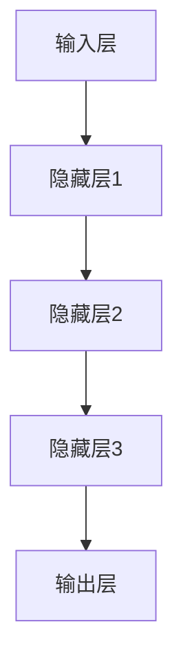

##### 1.3.2 预训练与微调

预训练（Pre-training）是指在大规模数据集上对模型进行训练，以学习通用特征表示。预训练后的模型具有一定的泛化能力，可以在多个任务上表现优异。微调（Fine-tuning）是指在预训练的基础上，在特定任务上对模型进行调整，以优化模型在目标任务上的性能。

以下是预训练与微调的基本流程：

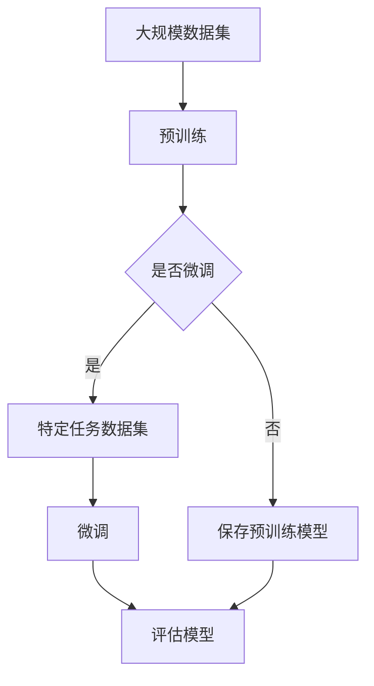

### 第2章：AI大模型的核心算法

#### 2.1 深度学习基础

##### 2.1.1 深度学习的基本概念

深度学习（Deep Learning）是一种基于多层神经网络的学习方法。与传统的机器学习方法不同，深度学习通过多层的非线性变换，从原始数据中自动提取特征表示，从而实现复杂函数的拟合。深度学习的核心思想是“学习层次化特征表示”，即通过层层抽象，将原始数据表示为更高层次的概念。

以下是深度学习的基本概念：

1. **神经网络**：神经网络是深度学习的基础，由输入层、隐藏层和输出层组成。每个神经元通过权重连接，将输入数据通过非线性激活函数处理后传递到下一层。
2. **反向传播算法**：反向传播算法是一种用于训练神经网络的优化算法。通过计算损失函数关于网络参数的梯度，反向传播算法不断调整网络权重，以最小化损失函数。
3. **损失函数**：损失函数是评估模型预测结果与真实结果之间差异的指标。常用的损失函数包括均方误差（MSE）、交叉熵损失（Cross-Entropy Loss）等。

以下是神经网络的基本结构：


##### 2.1.2 神经网络的结构

神经网络的结构决定了模型的性能。常用的神经网络结构包括：

1. **全连接神经网络**：全连接神经网络（Fully Connected Neural Network，FCNN）是最简单的神经网络结构，其中每个神经元都与上一层和下一层的所有神经元连接。
2. **卷积神经网络**：卷积神经网络（Convolutional Neural Network，CNN）主要用于图像处理任务，通过卷积操作和池化操作提取图像特征。
3. **循环神经网络**：循环神经网络（Recurrent Neural Network，RNN）适用于序列数据处理任务，通过循环连接实现长距离依赖建模。
4. **变换器网络**：变换器网络（Transformer）是一种基于自注意力机制的神经网络结构，广泛应用于自然语言处理任务。

以下是卷积神经网络（CNN）的基本结构：

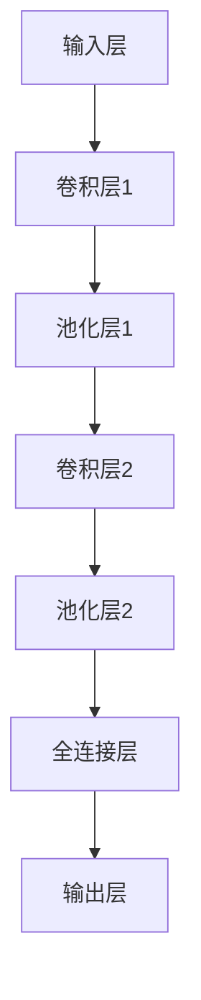

#### 2.2 自然语言处理算法

##### 2.2.1 词嵌入技术

词嵌入（Word Embedding）是将词汇映射到低维空间的技术。通过词嵌入，原始的文本数据可以被表示为稠密的向量表示，从而便于深度学习模型进行处理。

常见的词嵌入技术包括：

1. **词袋模型**：词袋模型（Bag-of-Words，BOW）将文本表示为一个单词的集合，忽略了单词的顺序和语法结构。
2. **连续词袋模型**：连续词袋模型（Continuous Bag-of-Words，CBOW）通过周围词的平均值来预测中心词，从而实现词嵌入。
3. **高斯词袋模型**：高斯词袋模型（Gaussian Bag-of-Words，GBOW）通过高斯分布来建模周围词的概率分布，从而实现词嵌入。

以下是连续词袋模型（CBOW）的基本结构：

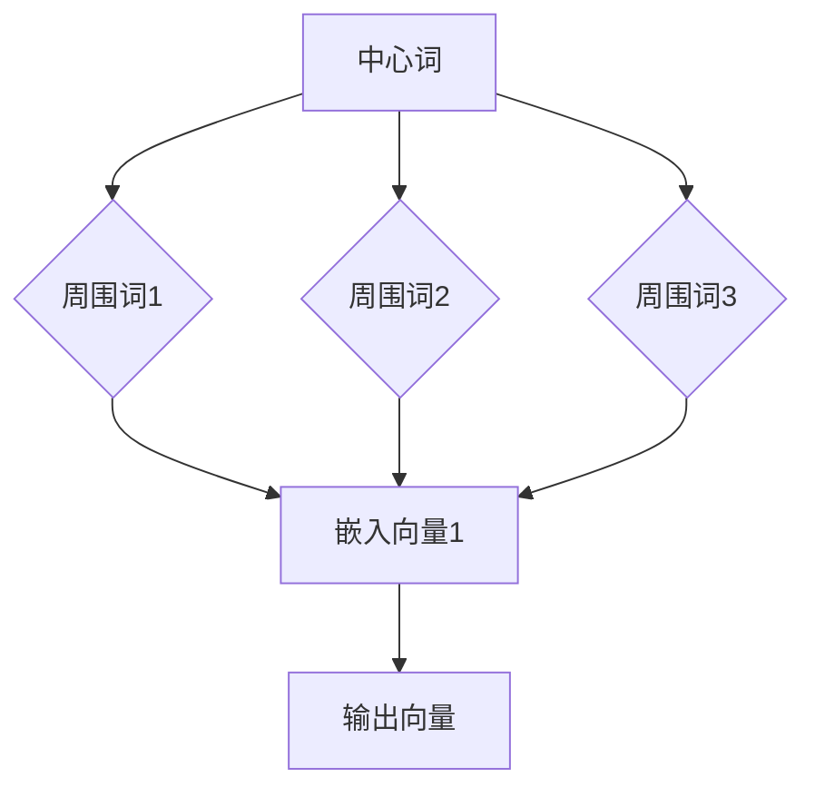

##### 2.2.2 语音识别技术

语音识别（Speech Recognition）是将语音信号转换为文本的技术。语音识别通常包括三个步骤：特征提取、模型训练和解码。

1. **特征提取**：特征提取是将语音信号转换为数值特征表示的过程。常用的特征提取方法包括梅尔频率倒谱系数（MFCC）和隐马尔可夫模型（HMM）。
2. **模型训练**：模型训练是通过大量语音数据训练深度学习模型，以实现语音信号到文本的映射。常用的模型包括循环神经网络（RNN）和变换器网络（Transformer）。
3. **解码**：解码是将模型输出的序列转换为自然语言的过程。常用的解码方法包括贪婪解码和 Beam Search。

以下是语音识别的基本流程：

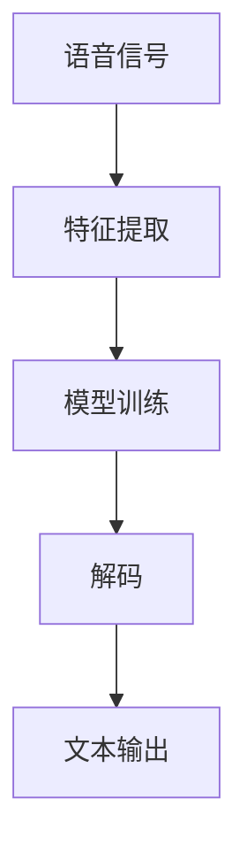

#### 2.3 计算机视觉算法

##### 2.3.1 图像识别技术

图像识别（Image Recognition）是将图像映射到标签的技术。图像识别通常包括两个步骤：特征提取和分类。

1. **特征提取**：特征提取是将图像转换为数值特征表示的过程。常用的特征提取方法包括卷积神经网络（CNN）和变换器网络（Transformer）。
2. **分类**：分类是将特征表示映射到预定义的标签的过程。常用的分类方法包括支持向量机（SVM）、决策树（DT）和神经网络（NN）。

以下是卷积神经网络（CNN）在图像识别中的应用：

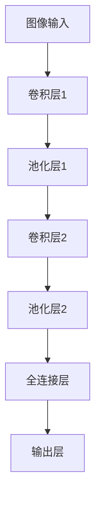

##### 2.3.2 目标检测技术

目标检测（Object Detection）是在图像中识别并定位目标的技术。目标检测通常包括三个步骤：特征提取、目标分类和目标定位。

1. **特征提取**：特征提取是将图像转换为数值特征表示的过程。常用的特征提取方法包括卷积神经网络（CNN）和变换器网络（Transformer）。
2. **目标分类**：目标分类是将特征表示映射到预定义的标签的过程。常用的分类方法包括支持向量机（SVM）、决策树（DT）和神经网络（NN）。
3. **目标定位**：目标定位是将目标在图像中的位置信息提取出来的过程。常用的目标定位方法包括回归模型和边界框（Bounding Box）。

以下是卷积神经网络（CNN）在目标检测中的应用：

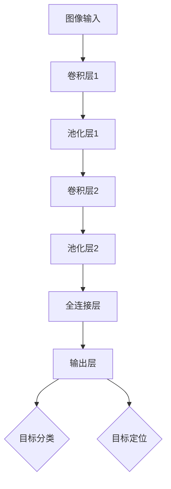

### 第二部分：虚拟助手领域应用

### 第3章：虚拟助手概述

#### 3.1 虚拟助手的概念

##### 3.1.1 什么是虚拟助手

虚拟助手（Virtual Assistant）是一种基于人工智能技术的虚拟角色，能够帮助用户完成各种任务。虚拟助手通过语音、文本等方式与用户交互，可以理解用户的意图，提供相应的服务和建议。

虚拟助手的典型应用场景包括：

1. **智能客服**：虚拟助手可以自动回答用户的问题，提供客服支持，提高客户满意度。
2. **个人助理**：虚拟助手可以帮助用户管理日程、提醒事项，提供日程安排、任务提醒等服务。
3. **教育助手**：虚拟助手可以为学生提供个性化教学服务，如课程辅导、作业批改等。
4. **智能家居**：虚拟助手可以控制智能家居设备，如空调、照明等，提供家庭自动化服务。

##### 3.1.2 虚拟助手的分类

虚拟助手可以根据交互方式、功能和应用场景进行分类：

1. **聊天型虚拟助手**：聊天型虚拟助手主要通过文本或语音与用户进行交互，如ChatGPT、小冰等。
2. **语音型虚拟助手**：语音型虚拟助手主要通过语音与用户进行交互，如Siri、小爱同学等。
3. **视觉型虚拟助手**：视觉型虚拟助手主要通过图像识别与用户进行交互，如百度AI开放平台的人脸识别、OCR识别等。

#### 3.2 虚拟助手的架构

##### 3.2.1 虚拟助手的模块

虚拟助手通常包括以下几个核心模块：

1. **语音识别模块**：将用户的语音输入转换为文本，方便后续处理。
2. **自然语言理解模块**：理解用户的意图和问题，提取关键信息。
3. **知识库模块**：存储各种知识和信息，为用户提供相关信息和建议。
4. **自然语言生成模块**：根据用户的意图和问题，生成合适的文本或语音回复。
5. **语音合成模块**：将文本转换为自然流畅的语音，与用户进行语音交互。

以下是虚拟助手的基本架构：

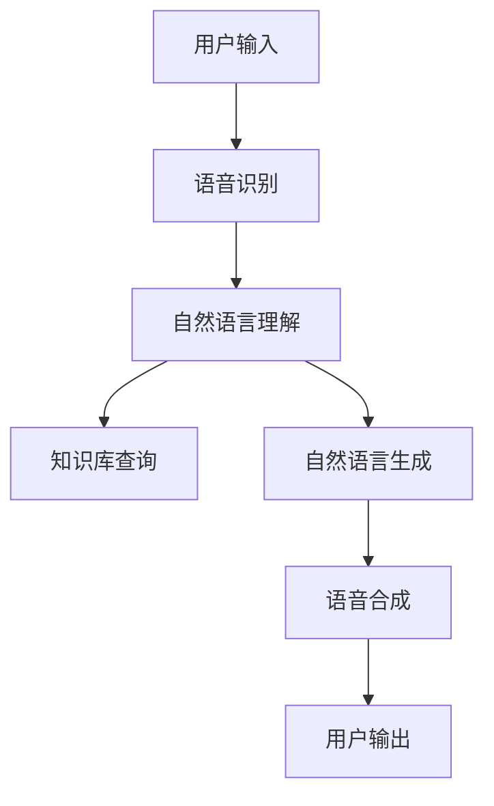

##### 3.2.2 虚拟助手的工作流程

虚拟助手的工作流程通常包括以下几个步骤：

1. **接收用户输入**：虚拟助手通过语音识别、文本输入等方式接收用户的输入。
2. **语音识别**：将用户的语音输入转换为文本，便于后续处理。
3. **自然语言理解**：理解用户的意图和问题，提取关键信息。
4. **知识库查询**：根据用户的意图和问题，从知识库中检索相关信息。
5. **自然语言生成**：根据用户的意图和查询结果，生成合适的文本或语音回复。
6. **语音合成**：将生成的文本转换为自然流畅的语音。
7. **用户输出**：将语音合成后的回复输出给用户。

以下是虚拟助手的工作流程：


### 第4章：AI大模型在虚拟助手中的应用

#### 4.1 自然语言理解

##### 4.1.1 语义理解技术

语义理解（Semantic Understanding）是将自然语言映射到语义表示的技术。通过语义理解，虚拟助手可以更好地理解用户的意图和问题。

语义理解技术主要包括以下方面：

1. **词义消歧**：词义消歧（Word Sense Disambiguation）是指确定文本中词语的确切含义。词义消歧可以通过统计方法、语义网络和深度学习等方法实现。
2. **实体识别**：实体识别（Entity Recognition）是指识别文本中的命名实体，如人名、地名、组织名等。实体识别是语义理解的重要基础。
3. **关系抽取**：关系抽取（Relation Extraction）是指识别文本中实体之间的关系，如“张三工作在谷歌”中的“张三”和“谷歌”之间的关系。
4. **事件抽取**：事件抽取（Event Extraction）是指识别文本中的事件及其参与者，如“苹果发布了新款iPhone”中的事件和参与者。

以下是词义消歧的示例：

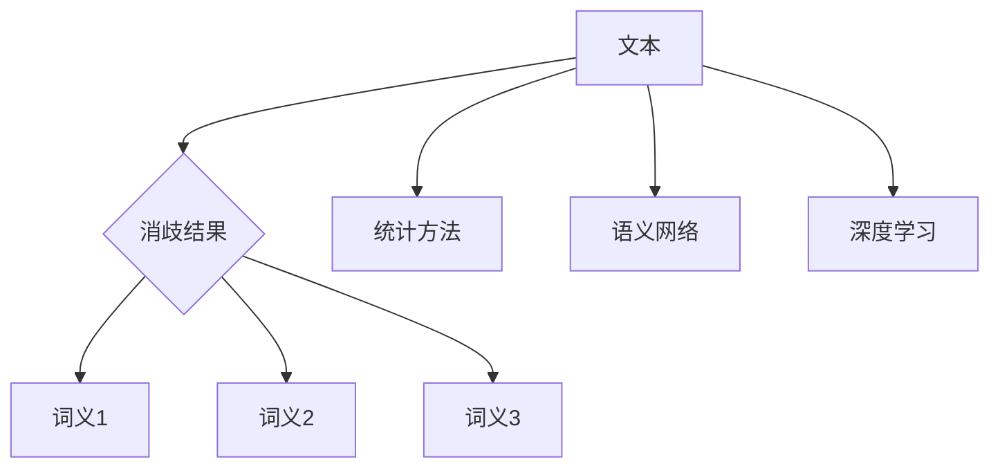

##### 4.1.2 上下文理解技术

上下文理解（Context Understanding）是理解用户输入的上下文信息的技术。上下文理解可以帮助虚拟助手更好地理解用户的意图和问题，从而提供更准确的回答。

上下文理解技术主要包括以下方面：

1. **上下文感知**：上下文感知（Context Awareness）是指虚拟助手能够根据用户的上下文信息调整回答策略。上下文感知可以通过自然语言处理技术、机器学习算法和知识图谱等方法实现。
2. **对话管理**：对话管理（Dialogue Management）是指虚拟助手在对话过程中根据上下文信息调整对话流程。对话管理可以通过规则方法、机器学习方法实现。
3. **情感分析**：情感分析（Sentiment Analysis）是指识别文本中的情感倾向，如正面、负面、中性等。情感分析可以帮助虚拟助手更好地理解用户的情感状态，从而提供更个性化的服务。

以下是上下文感知的示例：

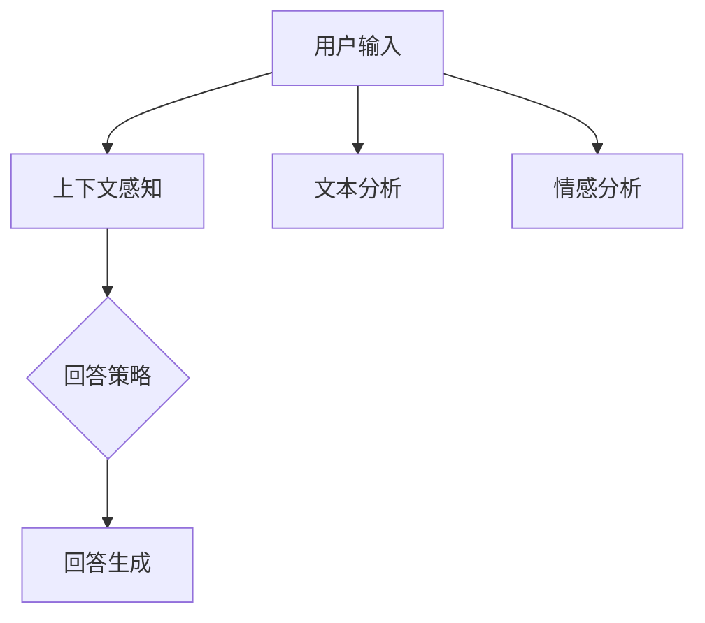

#### 4.2 自然语言生成

##### 4.2.1 文本生成技术

文本生成（Text Generation）是将语义表示转换为文本的技术。文本生成可以帮助虚拟助手生成自然流畅的回答。

文本生成技术主要包括以下方面：

1. **序列生成**：序列生成（Sequence Generation）是指根据输入序列生成输出序列。序列生成可以通过循环神经网络（RNN）、变换器网络（Transformer）等方法实现。
2. **模板匹配**：模板匹配（Template Matching）是指根据输入模板生成相应的文本。模板匹配可以通过预定义的模板和填充方法实现。
3. **生成对抗网络**：生成对抗网络（Generative Adversarial Network，GAN）是指通过生成器和判别器之间的对抗训练生成文本。生成对抗网络可以生成高质量的文本。

以下是序列生成的示例：

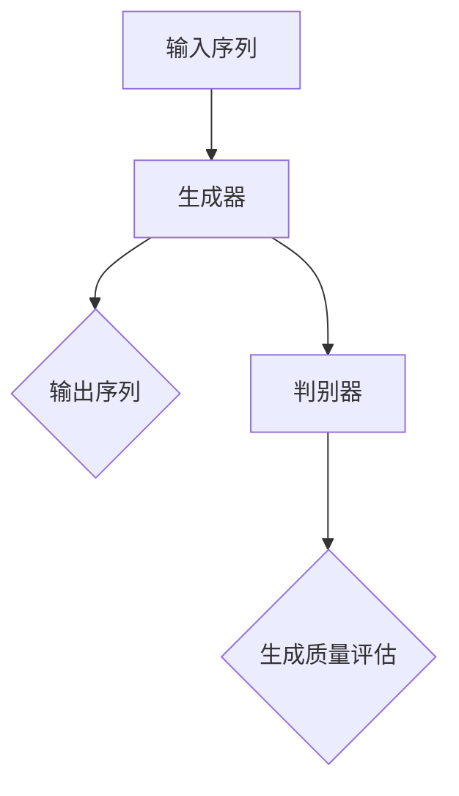

##### 4.2.2 对话生成技术

对话生成（Dialogue Generation）是生成对话回复的技术。对话生成可以帮助虚拟助手与用户进行自然流畅的对话。

对话生成技术主要包括以下方面：

1. **基于规则的对话生成**：基于规则的对话生成是指根据预定义的规则生成对话回复。基于规则的对话生成适用于结构化对话场景。
2. **基于模板的对话生成**：基于模板的对话生成是指根据预定义的模板和填充方法生成对话回复。基于模板的对话生成适用于半结构化对话场景。
3. **基于学习的对话生成**：基于学习的对话生成是指通过机器学习模型生成对话回复。基于学习的对话生成适用于非结构化对话场景。

以下是基于模板的对话生成的示例：

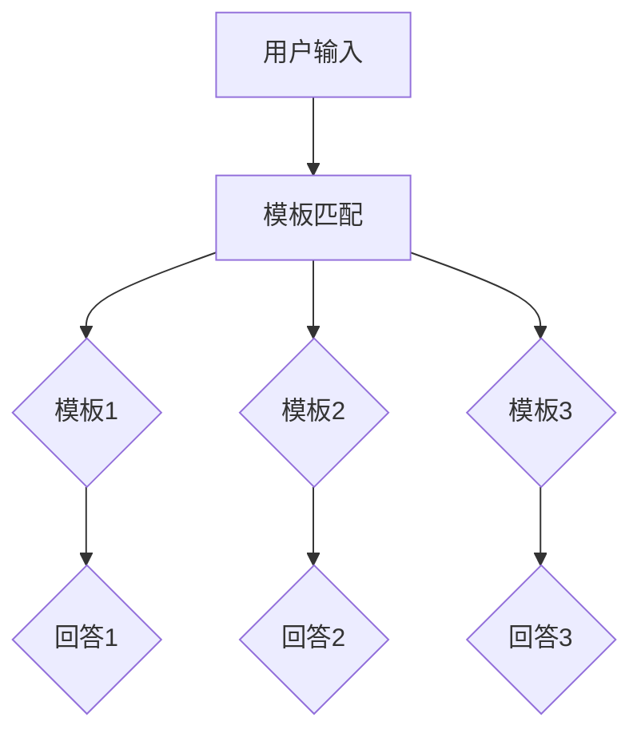

#### 4.3 声音合成

##### 4.3.1 声音合成技术

声音合成（Voice Synthesis）是将文本转换为语音的技术。声音合成可以帮助虚拟助手与用户进行语音交互。

声音合成技术主要包括以下方面：

1. **文本到语音（Text-to-Speech，TTS）**：文本到语音技术是指将文本转换为自然流畅的语音。文本到语音技术可以通过合成器、语音库等方法实现。
2. **语音识别（Speech Recognition）**：语音识别技术是指将语音转换为文本。语音识别技术可以通过深度学习模型、隐马尔可夫模型（HMM）等方法实现。

以下是文本到语音（TTS）的示例：

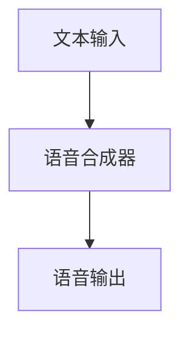

##### 4.3.2 声音识别技术

声音识别（Speech Recognition）是将语音转换为文本的技术。声音识别可以帮助虚拟助手理解用户的语音输入。

声音识别技术主要包括以下方面：

1. **特征提取**：特征提取是将语音信号转换为数值特征表示的过程。常用的特征提取方法包括梅尔频率倒谱系数（MFCC）和隐马尔可夫模型（HMM）。
2. **模型训练**：模型训练是通过大量语音数据训练深度学习模型，以实现语音信号到文本的映射。
3. **解码**：解码是将模型输出的序列转换为自然语言的过程。常用的解码方法包括贪婪解码和 Beam Search。

以下是声音识别的基本流程：

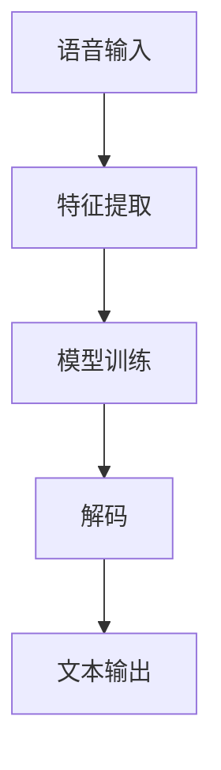

### 第5章：虚拟助手应用案例

#### 5.1 虚拟客服

##### 5.1.1 虚拟客服的功能

虚拟客服（Virtual Customer Service）是一种基于人工智能技术的客户服务解决方案。虚拟客服可以自动回答用户的问题，提供客服支持，提高客户满意度。

虚拟客服的主要功能包括：

1. **常见问题解答**：虚拟客服可以回答用户关于产品、服务、政策等常见问题。
2. **智能推荐**：虚拟客服可以根据用户的提问，提供个性化的产品或服务推荐。
3. **转接人工客服**：当用户的问题无法通过虚拟客服解决时，虚拟客服可以自动转接至人工客服。
4. **数据分析**：虚拟客服可以收集用户的问题和反馈，为企业的产品和服务优化提供数据支持。

##### 5.1.2 虚拟客服的实现

虚拟客服的实现主要包括以下几个步骤：

1. **语音识别**：将用户的语音输入转换为文本，便于后续处理。
2. **自然语言理解**：理解用户的意图和问题，提取关键信息。
3. **知识库查询**：根据用户的意图和问题，从知识库中检索相关信息。
4. **自然语言生成**：根据用户的意图和查询结果，生成合适的文本或语音回复。
5. **语音合成**：将生成的文本转换为自然流畅的语音。
6. **用户反馈**：收集用户的反馈，不断优化虚拟客服的性能。

以下是虚拟客服的实现流程：


#### 5.2 虚拟个人助理

##### 5.2.1 虚拟个人助理的功能

虚拟个人助理（Virtual Personal Assistant）是一种基于人工智能技术的个人助手，可以帮助用户管理日程、提醒事项等。

虚拟个人助理的主要功能包括：

1. **日程管理**：虚拟个人助理可以自动记录用户的日程安排，并提供提醒服务。
2. **任务提醒**：虚拟个人助理可以提醒用户完成待办任务，提高工作效率。
3. **信息查询**：虚拟个人助理可以回答用户关于天气、交通、新闻等查询问题。
4. **智能推荐**：虚拟个人助理可以根据用户的兴趣和行为，提供个性化的推荐服务。

##### 5.2.2 虚拟个人助理的实现

虚拟个人助理的实现主要包括以下几个步骤：

1. **语音识别**：将用户的语音输入转换为文本，便于后续处理。
2. **自然语言理解**：理解用户的意图和问题，提取关键信息。
3. **知识库查询**：根据用户的意图和问题，从知识库中检索相关信息。
4. **自然语言生成**：根据用户的意图和查询结果，生成合适的文本或语音回复。
5. **语音合成**：将生成的文本转换为自然流畅的语音。
6. **用户反馈**：收集用户的反馈，不断优化虚拟个人助理的性能。

以下是虚拟个人助理的实现流程：


#### 5.3 虚拟教育助手

##### 5.3.1 虚拟教育助手的功能

虚拟教育助手（Virtual Education Assistant）是一种基于人工智能技术的教育助手，可以为学生提供个性化教学服务。

虚拟教育助手的主要功能包括：

1. **课程辅导**：虚拟教育助手可以为学生提供课程辅导，解答学习中的疑问。
2. **作业批改**：虚拟教育助手可以自动批改学生的作业，并提供评分和反馈。
3. **学习进度跟踪**：虚拟教育助手可以跟踪学生的学习进度，为学生的学习提供指导。
4. **考试模拟**：虚拟教育助手可以为学生提供考试模拟，帮助提高考试成绩。

##### 5.3.2 虚拟教育助手的实现

虚拟教育助手的实现主要包括以下几个步骤：

1. **语音识别**：将学生的语音输入转换为文本，便于后续处理。
2. **自然语言理解**：理解学生的意图和问题，提取关键信息。
3. **知识库查询**：根据学生的意图和问题，从知识库中检索相关信息。
4. **自然语言生成**：根据学生的意图和查询结果，生成合适的文本或语音回复。
5. **语音合成**：将生成的文本转换为自然流畅的语音。
6. **用户反馈**：收集学生的反馈，不断优化虚拟教育助手的性能。

以下是虚拟教育助手的实现流程：


### 第三部分：AI大模型在虚拟助手领域的挑战与前景

#### 6.1 数据隐私保护

##### 6.1.1 数据隐私的重要性

数据隐私保护是AI大模型在虚拟助手领域面临的重大挑战之一。虚拟助手需要处理大量的用户数据，如语音、文本、行为等，这些数据中可能包含用户的敏感信息。如果这些数据被泄露或滥用，将严重威胁用户的隐私和安全。

数据隐私保护的重要性体现在以下几个方面：

1. **用户信任**：用户对虚拟助手的信任是虚拟助手成功的关键。如果用户担心自己的隐私受到侵犯，他们可能会拒绝使用虚拟助手，从而影响虚拟助手的应用场景和商业价值。
2. **法律法规**：越来越多的国家和地区制定了数据隐私保护法律和法规，如欧盟的《通用数据保护条例》（GDPR）和美国加州的《消费者隐私法案》（CCPA）。遵守这些法规是企业的法律义务，否则将面临巨额罚款和声誉损失。
3. **社会责任**：作为人工智能技术的开发者，有责任确保用户数据的隐私和安全，这是企业的社会责任和道德义务。

##### 6.1.2 数据隐私保护技术

为了保护用户数据隐私，AI大模型在虚拟助手领域采用了多种数据隐私保护技术，包括：

1. **数据加密**：数据加密是将数据转换为密文的过程，只有授权用户才能解密和访问数据。常用的加密算法包括对称加密算法（如AES）和非对称加密算法（如RSA）。
2. **匿名化**：匿名化是将数据中的敏感信息去除或替换，使数据无法直接关联到特定用户。匿名化可以通过数据脱敏、混淆等技术实现。
3. **访问控制**：访问控制是通过权限管理和身份验证来限制用户对数据的访问。访问控制可以确保只有授权用户才能访问敏感数据。
4. **差分隐私**：差分隐私是一种统计隐私保护技术，通过在数据中加入噪声，使得攻击者无法从数据中推断出特定个体的信息。差分隐私可以通过拉普拉斯机制、指数机制等方法实现。
5. **联邦学习**：联邦学习是一种分布式学习技术，通过将模型训练分散到多个参与者，从而减少数据传输和共享。联邦学习可以有效保护用户数据的隐私。

以下是数据加密的示例：

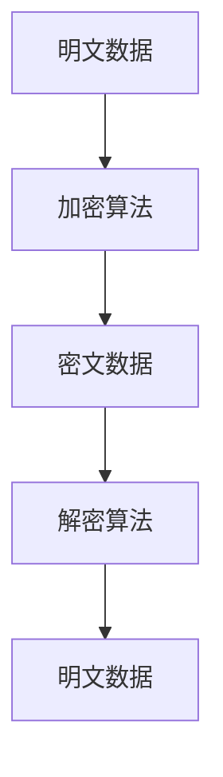

#### 6.2 模型可解释性

##### 6.2.1 模型可解释性的重要性

模型可解释性（Model Explainability）是AI大模型在虚拟助手领域面临的另一个重要挑战。模型可解释性是指用户能够理解模型的决策过程和结果。对于虚拟助手这样的应用场景，模型可解释性尤为重要，因为用户需要信任虚拟助手的行为和决策。

模型可解释性的重要性体现在以下几个方面：

1. **用户信任**：如果用户无法理解虚拟助手的决策过程，他们可能会对虚拟助手的建议和回答产生怀疑，从而降低虚拟助手的信任度。
2. **监管合规**：一些行业和领域（如医疗、金融等）对模型的可解释性有明确的要求，以防止滥用和保护用户权益。
3. **模型优化**：模型可解释性可以帮助研究人员和开发者更好地理解模型的行为和性能，从而进行优化和改进。

##### 6.2.2 模型可解释性技术

为了提高模型可解释性，AI大模型在虚拟助手领域采用了多种技术，包括：

1. **模型可视化**：模型可视化是将模型的内部结构和参数表示为图形或图表，以便用户直观地理解模型的决策过程。常用的模型可视化工具包括TensorBoard、PyTorch Lightning等。
2. **解释性算法**：解释性算法是通过分析模型的内部结构和决策过程，生成解释结果的算法。常用的解释性算法包括LIME（Local Interpretable Model-agnostic Explanations）、SHAP（SHapley Additive exPlanations）等。
3. **注意力机制**：注意力机制（Attention Mechanism）是一种在神经网络中用于关注重要信息的机制。通过分析注意力机制，可以了解模型在决策过程中关注的关键信息。
4. **决策树和规则提取**：决策树和规则提取是将复杂模型转换为易于理解和解释的规则或决策树。这些规则和决策树可以直观地展示模型的决策过程。

以下是模型可视化的示例：

```mermaid
graph TB
    A[神经网络] --> B[模型可视化]
    B --> C{层1}
    B --> D{层2}
    B --> E{层3}
    C --> F{参数}
    D --> G{参数}
    E --> H{参数}
```

#### 6.3 模型泛化能力

##### 6.3.1 模型泛化能力的定义

模型泛化能力（Model Generalization）是指模型在未知数据上的性能表现。良好的泛化能力意味着模型不仅能够在训练数据上取得良好的性能，还能在新的、未见过的数据上保持良好的性能。模型泛化能力是AI大模型在虚拟助手领域的关键挑战之一。

模型泛化能力的定义可以从以下几个方面理解：

1. **统计泛化**：统计泛化是指模型在未知数据上的平均性能接近其在训练数据上的性能。统计泛化的目标是使模型在新数据上的预测误差最小。
2. **领域泛化**：领域泛化是指模型在不同的领域或任务上的性能表现。领域泛化的目标是使模型能够适应不同的应用场景。
3. **鲁棒性**：鲁棒性是指模型在处理噪声或异常数据时的性能。鲁棒性强的模型能够在噪声环境下保持良好的性能。

##### 6.3.2 提高模型泛化能力的方法

为了提高模型泛化能力，AI大模型在虚拟助手领域采用了多种方法，包括：

1. **数据增强**：数据增强（Data Augmentation）是通过添加噪声、旋转、缩放等操作生成更多的训练样本，从而提高模型的泛化能力。常用的数据增强方法包括图像增强、文本增强等。
2. **模型集成**：模型集成（Model Ensembling）是通过将多个模型进行组合，提高模型的泛化能力。常用的模型集成方法包括投票法、堆叠法、提升法等。
3. **正则化**：正则化（Regularization）是通过在损失函数中加入正则项，限制模型参数的增长，从而防止过拟合。常用的正则化方法包括L1正则化、L2正则化等。
4. **dropout**：dropout是一种在训练过程中随机丢弃部分神经元的策略，从而提高模型的泛化能力。
5. **迁移学习**：迁移学习（Transfer Learning）是指将预训练模型应用于新的任务，利用预训练模型的知识和结构，提高模型的泛化能力。

以下是数据增强的示例：

```mermaid
graph TB
    A[原始数据] --> B[图像增强]
    B --> C[旋转]
    B --> D[缩放]
    B --> E[噪声添加]
    A --> F[文本增强]
    F --> G[替换词语]
    F --> H[同义词替换]
    F --> I[语法变换]
```

#### 6.4 跨语言理解

##### 6.4.1 跨语言理解的定义

跨语言理解（Cross-Lingual Understanding）是指模型在处理不同语言文本时的性能。随着全球化进程的加速，跨语言理解在虚拟助手领域变得越来越重要。跨语言理解的目标是使模型能够处理多种语言的输入，并提供相应的服务。

跨语言理解的定义可以从以下几个方面理解：

1. **多语言文本处理**：多语言文本处理是指模型能够处理多种语言的文本，包括文本生成、文本分类、机器翻译等任务。
2. **语言无关性**：语言无关性是指模型在处理不同语言文本时，能够保持一致的性能，而不受语言特性的影响。
3. **跨语言知识共享**：跨语言知识共享是指模型能够在不同语言之间共享知识，从而提高跨语言理解的性能。

##### 6.4.2 跨语言理解的技术挑战

跨语言理解在虚拟助手领域面临以下技术挑战：

1. **语言差异性**：不同语言在语法、词汇、语义等方面存在很大差异，这给跨语言理解带来了挑战。例如，英语中的名词通常具有单复数形式，而汉语中通常没有这种形式。
2. **资源限制**：不同语言的文本数据量和质量存在很大差异，一些语言可能拥有丰富的训练数据，而另一些语言可能缺乏足够的训练数据。这给跨语言模型的训练和优化带来了困难。
3. **模型适应性**：模型需要适应不同的语言特性，如语序、语法结构等。这要求模型能够灵活地处理不同语言的输入，并提供准确的输出。

##### 6.4.3 跨语言理解的方法

为了克服跨语言理解的技术挑战，研究者们提出了多种方法，包括：

1. **多语言预训练**：多语言预训练是指在一个包含多种语言的语料库上对模型进行预训练，从而提高模型在不同语言上的性能。常用的多语言预训练模型包括BERT、XLM等。
2. **跨语言迁移学习**：跨语言迁移学习是指利用一个在一种语言上预训练的模型，将其应用于其他语言的任务。这种方法可以通过跨语言共享知识，提高模型在不同语言上的性能。
3. **跨语言知识融合**：跨语言知识融合是指将不同语言的模型知识进行整合，从而提高模型的跨语言性能。常用的跨语言知识融合方法包括跨语言嵌入、跨语言特征提取等。
4. **跨语言对比学习**：跨语言对比学习是指通过对比不同语言的特征表示，提高模型的跨语言理解能力。常用的跨语言对比学习方法包括一致性正则化、多语言分类等。

以下是多语言预训练的示例：

```mermaid
graph TB
    A[多语言语料库] --> B[预训练模型]
    B --> C[多语言嵌入]
    B --> D[多语言任务]
```

### 第7章：AI大模型在虚拟助手领域的应用前景

#### 7.1 虚拟助手技术的未来发展方向

##### 7.1.1 人工智能的发展趋势

人工智能（AI）作为计算机科学的重要分支，近年来取得了飞速发展。随着计算能力的提升、大数据技术的进步和算法的创新，人工智能在虚拟助手领域具有广阔的应用前景。

人工智能的发展趋势主要体现在以下几个方面：

1. **计算能力的提升**：随着云计算、GPU、TPU等计算设备的普及，计算能力大幅提升，使得AI大模型能够处理更复杂、更庞大的数据集。
2. **数据资源的丰富**：随着互联网的普及和数据采集技术的发展，越来越多的数据被生成和收集，为AI大模型提供了丰富的训练资源。
3. **算法的创新**：深度学习、强化学习、生成对抗网络等算法的创新，使得AI大模型在各个领域取得了显著突破。

##### 7.1.2 虚拟助手技术的未来应用

虚拟助手技术在未来的发展中，将呈现出以下趋势：

1. **多模态交互**：虚拟助手将支持多种交互方式，如语音、文本、手势等，实现更自然、更流畅的交互体验。
2. **个性化服务**：虚拟助手将根据用户的行为和偏好，提供个性化的服务和建议，提高用户的满意度。
3. **智能化升级**：虚拟助手将不断学习和进化，通过自我优化和迭代，提高智能水平和应用效果。
4. **跨领域应用**：虚拟助手将在更多领域得到应用，如医疗、金融、教育、电商等，为各个行业提供智能化解决方案。

#### 7.2 虚拟助手在社会生活中的影响

##### 7.2.1 虚拟助手对社会生活的影响

虚拟助手作为一种新兴的人工智能技术，将对社会生活产生深远的影响：

1. **提高效率**：虚拟助手可以自动化处理大量重复性、规则性的工作，提高工作效率，减轻人们的劳动负担。
2. **降低成本**：虚拟助手可以代替人力完成一些简单的任务，降低企业的运营成本，提高企业的竞争力。
3. **优化服务**：虚拟助手可以提供24小时不间断的服务，提高服务质量，满足用户的多样化需求。
4. **改变工作模式**：虚拟助手的出现将改变人们的工作模式，使人们能够更加灵活地安排工作和生活。

##### 7.2.2 虚拟助手对个人生活的影响

虚拟助手将深刻影响个人生活，带来以下变化：

1. **便捷生活**：虚拟助手可以帮助用户管理日程、提醒事项，提供天气预报、交通信息等，使生活更加便捷。
2. **个性化服务**：虚拟助手可以根据用户的兴趣和行为，提供个性化的新闻推荐、购物建议等，提升生活质量。
3. **健康管理**：虚拟助手可以监测用户的健康状况，提供健康建议，帮助用户保持健康。
4. **学习辅助**：虚拟助手可以为学生提供课程辅导、作业批改等服务，提高学习效果。

### 附录A：AI大模型开发工具与资源

#### A.1 开发工具介绍

在开发AI大模型时，选择合适的工具和资源非常重要。以下是一些常用的AI大模型开发工具和资源：

##### A.1.1 TensorFlow

TensorFlow是谷歌开发的开源深度学习框架，具有丰富的功能和广泛的应用。TensorFlow支持多种编程语言，如Python、C++和Java，并提供丰富的API和工具，使开发者能够方便地构建和训练AI大模型。

##### A.1.2 PyTorch

PyTorch是Facebook开发的开源深度学习框架，以其灵活性和动态计算图而闻名。PyTorch具有简洁的API和强大的功能，适合研究人员和开发者进行模型开发和实验。

##### A.1.3 其他常用工具

除了TensorFlow和PyTorch，还有一些其他常用的深度学习框架和工具，如：

- **Keras**：Keras是一个高层次的深度学习框架，基于TensorFlow和Theano开发。Keras提供简洁的API，使开发者能够快速构建和训练深度学习模型。
- **Theano**：Theano是一个基于Python的深度学习库，提供高效的数学计算和深度学习模型训练功能。虽然Theano的发展已经逐渐放缓，但它在一些特殊场景下仍然具有优势。
- **MXNet**：MXNet是Apache Software Foundation的一个开源深度学习框架，支持多种编程语言，包括Python、R和Scala。MXNet具有高效的模型训练和部署能力。

#### A.2 资源和文献推荐

为了更好地了解AI大模型和相关技术，以下是一些推荐的资源和文献：

- **《深度学习》（Deep Learning）**：由Ian Goodfellow、Yoshua Bengio和Aaron Courville合著的《深度学习》是一本经典的深度学习教材，详细介绍了深度学习的原理和应用。
- **《神经网络与深度学习》**：李航著的《神经网络与深度学习》是一本适合初学者的深度学习入门教材，内容简洁易懂。
- **《AI大模型：原理、技术与应用》**：本书旨在介绍AI大模型的基本原理、核心技术以及在实际应用中的挑战和前景。
- **arXiv**：arXiv是一个在线学术论文预印本库，包含大量关于深度学习、自然语言处理、计算机视觉等领域的最新研究成果。

### 附录B：虚拟助手项目实战

#### B.1 项目一：虚拟客服系统

##### B.1.1 项目背景

虚拟客服系统是一种基于人工智能技术的客服解决方案，能够自动回答用户的问题，提供客服支持，提高客户满意度。随着人工智能技术的不断进步，虚拟客服系统在各个行业得到了广泛应用。

##### B.1.2 项目目标

本项目旨在开发一个具有以下功能的虚拟客服系统：

1. **常见问题解答**：虚拟客服系统能够自动回答用户关于产品、服务、政策等常见问题。
2. **智能推荐**：虚拟客服系统可以根据用户的提问，提供个性化的产品或服务推荐。
3. **转接人工客服**：当用户的问题无法通过虚拟客服解决时，虚拟客服系统能够自动转接至人工客服。

##### B.1.3 项目实现步骤

1. **需求分析**：首先，进行需求分析，明确虚拟客服系统的功能需求和性能要求。
2. **数据准备**：收集并整理常见问题及其答案，用于训练虚拟客服系统的自然语言处理模型。
3. **模型训练**：使用收集到的数据，训练虚拟客服系统的自然语言处理模型，如文本分类模型、序列生成模型等。
4. **系统集成**：将训练好的模型集成到虚拟客服系统中，实现常见问题解答、智能推荐和转接人工客服等功能。
5. **测试与优化**：对虚拟客服系统进行测试，收集用户反馈，不断优化系统的性能和用户体验。

以下是虚拟客服系统的实现流程：

```mermaid
graph TB
    A[用户输入] --> B[语音识别]
    B --> C[自然语言理解]
    C --> D[知识库查询]
    C --> E[自然语言生成]
    E --> F[语音合成]
    F --> G[用户输出]
```

#### B.2 项目二：虚拟个人助理

##### B.2.1 项目背景

虚拟个人助理是一种基于人工智能技术的个人助手，可以帮助用户管理日程、提醒事项等。随着人工智能技术的不断进步，虚拟个人助理在各个领域得到了广泛应用。

##### B.2.2 项目目标

本项目旨在开发一个具有以下功能的虚拟个人助理：

1. **日程管理**：虚拟个人助理可以自动记录用户的日程安排，并提供提醒服务。
2. **任务提醒**：虚拟个人助理可以提醒用户完成待办任务，提高工作效率。
3. **信息查询**：虚拟个人助理可以回答用户关于天气、交通、新闻等查询问题。

##### B.2.3 项目实现步骤

1. **需求分析**：首先，进行需求分析，明确虚拟个人助理的功能需求和性能要求。
2. **数据准备**：收集并整理用户的日程安排、任务列表等信息，用于训练虚拟个人助理的自然语言处理模型。
3. **模型训练**：使用收集到的数据，训练虚拟个人助理的自然语言处理模型，如文本分类模型、序列生成模型等。
4. **系统集成**：将训练好的模型集成到虚拟个人助理系统中，实现日程管理、任务提醒和信息查询等功能。
5. **测试与优化**：对虚拟个人助理进行测试，收集用户反馈，不断优化系统的性能和用户体验。

以下是虚拟个人助理的实现流程：

```mermaid
graph TB
    A[用户输入] --> B[语音识别]
    B --> C[自然语言理解]
    C --> D[知识库查询]
    C --> E[自然语言生成]
    E --> F[语音合成]
    F --> G[用户输出]
```

### 附录C：数学模型和公式详解

#### C.1 数学模型

在AI大模型中，数学模型是核心组成部分，用于描述模型的行为和性能。以下是几个常见的数学模型：

##### C.1.1 神经网络模型

神经网络模型是一种基于非线性变换的多层神经网络，用于对输入数据进行分类、回归等任务。其基本形式如下：

$$
y = \sigma(W \cdot x + b)
$$

其中，$y$ 是输出结果，$\sigma$ 是激活函数（如Sigmoid、ReLU等），$W$ 是权重矩阵，$x$ 是输入特征向量，$b$ 是偏置项。

##### C.1.2 语言模型

语言模型是一种用于预测下一个单词的概率分布的模型，常见的形式是n元语言模型。其基本形式如下：

$$
P(w_{t}|w_{t-1}, w_{t-2}, ..., w_{1}) = \frac{C(w_{t-1}, w_{t-2}, ..., w_{1}, w_{t})}{C(w_{t-1}, w_{t-2}, ..., w_{1})}
$$

其中，$P(w_{t}|w_{t-1}, w_{t-2}, ..., w_{1})$ 是给定历史单词序列$w_{t-1}, w_{t-2}, ..., w_{1}$时，下一个单词$w_{t}$的概率，$C(w_{t-1}, w_{t-2}, ..., w_{1}, w_{t})$ 是单词序列$w_{t-1}, w_{t-2}, ..., w_{1}, w_{t}$的计数，$C(w_{t-1}, w_{t-2}, ..., w_{1})$ 是单词序列$w_{t-1}, w_{t-2}, ..., w_{1}$的计数。

#### C.2 数学公式

在AI大模型中，数学公式用于描述模型的训练过程、损失函数和优化算法。以下是几个常见的数学公式：

##### C.2.1 损失函数

损失函数是评估模型预测结果与真实结果之间差异的指标，常见的损失函数有：

- 均方误差（MSE）：

$$
MSE = \frac{1}{m} \sum_{i=1}^{m} (y_i - \hat{y}_i)^2
$$

其中，$y_i$ 是真实标签，$\hat{y}_i$ 是模型的预测结果，$m$ 是样本数量。

- 交叉熵损失（Cross-Entropy Loss）：

$$
CE = - \sum_{i=1}^{m} y_i \log(\hat{y}_i)
$$

其中，$y_i$ 是真实标签，$\hat{y}_i$ 是模型的预测概率。

##### C.2.2 优化算法

优化算法用于最小化损失函数，常见的优化算法有：

- 随机梯度下降（Stochastic Gradient Descent，SGD）：

$$
w_{t+1} = w_t - \alpha \nabla_w J(w_t)
$$

其中，$w_t$ 是第 $t$ 次迭代时的模型参数，$\alpha$ 是学习率，$J(w_t)$ 是损失函数。

- Adam优化算法：

$$
m_t = \beta_1 m_{t-1} + (1 - \beta_1) \nabla_w J(w_t)
$$

$$
v_t = \beta_2 v_{t-1} + (1 - \beta_2) (\nabla_w J(w_t))^2
$$

$$
\hat{m}_t = \frac{m_t}{1 - \beta_1^t}
$$

$$
\hat{v}_t = \frac{v_t}{1 - \beta_2^t}
$$

$$
w_{t+1} = w_t - \alpha (\hat{m}_t / (\sqrt{\hat{v}_t} + \epsilon))
$$

其中，$m_t$ 和 $v_t$ 分别是梯度的一阶矩估计和二阶矩估计，$\beta_1$ 和 $\beta_2$ 分别是动量因子，$\epsilon$ 是一个很小的常数。

### 结语

本文详细探讨了AI大模型在虚拟助手领域的应用前景，从AI大模型的基础、虚拟助手的应用到挑战与前景，进行了全面的分析。随着人工智能技术的不断进步，AI大模型在虚拟助手领域具有广阔的应用前景。然而，数据隐私保护、模型可解释性、模型泛化能力等挑战仍需克服。未来，随着技术的不断成熟和应用的不断拓展，虚拟助手将在社会生活中发挥越来越重要的作用。作者：AI天才研究院/AI Genius Institute & 禅与计算机程序设计艺术 /Zen And The Art of Computer Programming。感谢您的阅读！

