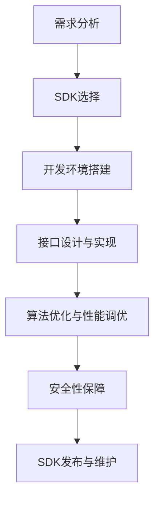

                 

# 文章标题

《AI大模型应用的SDK设计与发布流程》

## 关键词

- AI大模型
- SDK设计
- 开发流程
- 性能优化
- 安全保障
- 实战案例

## 摘要

本文旨在深入探讨AI大模型应用的SDK设计与发布流程。通过逐步分析AI大模型的基本概念、SDK在AI应用中的作用，以及SDK设计的原则与实现方法，本文将为开发者提供一个系统化的开发指南。同时，文章还将详细阐述SDK开发环境搭建、核心功能实现、性能与安全优化、发布与维护策略，并通过实战案例展示SDK在实际应用中的效果。最终，本文将总结开发最佳实践，为AI大模型SDK的开发提供有力支持。

### 第一部分：SDK设计与开发基础

## 第1章：AI大模型概述

### 1.1 AI大模型的基本概念

AI大模型是指具有数百万至数十亿参数的深度学习模型，它们能够处理复杂的数据集，并在多种任务中实现优异的性能。这类模型通常基于神经网络架构，如Transformer、BERT等。

#### 核心定义

AI大模型的核心定义包括以下几个要点：

1. **参数量**：具有数百万至数十亿参数。
2. **数据集处理能力**：能够处理大规模、复杂的数据集。
3. **任务多样性**：在多种任务中实现高精度预测和推理。

#### 发展历程

AI大模型的发展历程可以追溯到20世纪80年代，当时神经网络的提出为深度学习奠定了基础。随着计算能力的提升和大数据技术的发展，AI大模型逐渐成为人工智能领域的研究热点。以下是AI大模型发展历程的关键阶段：

1. **1986年**：Rumelhart、Hinton和Williams提出了反向传播算法，使得神经网络训练成为可能。
2. **2012年**：Hinton团队在ImageNet竞赛中使用了深度卷积神经网络，显著提升了图像识别的精度。
3. **2018年**：谷歌推出了BERT模型，标志着AI大模型在自然语言处理领域的突破。
4. **至今**：AI大模型在语音识别、图像生成、推荐系统等多个领域取得了显著成果。

#### 主要类型

AI大模型的主要类型包括：

1. **图像识别模型**：如ResNet、Inception等。
2. **自然语言处理模型**：如BERT、GPT等。
3. **语音识别模型**：如WaveNet、DeepSpeech等。

### 1.2 SDK在AI大模型应用中的作用

#### SDK的定义和作用

软件开发工具包（Software Development Kit，SDK）是一套用于软件开发的工具集，通常包括库、文档和示例代码等。SDK的作用是简化开发流程，提高开发效率。

#### SDK与API的区别

SDK和API（应用程序编程接口）是两种不同的概念：

- **SDK**：提供了一组工具和库，用于简化软件开发。
- **API**：定义了程序之间的通信规则和协议。

#### SDK在AI大模型应用中的价值

SDK在AI大模型应用中的价值主要体现在以下几个方面：

1. **简化开发**：通过提供预编译的库和工具，SDK可以显著减少开发时间。
2. **统一接口**：SDK为开发者提供了一个统一的接口，使得不同的大模型可以方便地集成和使用。
3. **性能优化**：SDK通常包含针对特定大模型的优化代码，提高了模型的运行效率。

### 1.3 AI大模型SDK的设计原则

#### 可扩展性

可扩展性是指SDK能够适应不断变化的开发需求，包括支持新的大模型、新的任务类型等。实现可扩展性的方法包括：

1. **模块化设计**：将SDK拆分为多个模块，每个模块负责特定的功能。
2. **插件机制**：允许开发者通过插件扩展SDK的功能。

#### 易用性

易用性是指SDK的使用门槛低，便于开发者快速上手。实现易用性的方法包括：

1. **详细的文档**：提供全面的API文档和示例代码。
2. **友好的用户界面**：如果SDK包含图形界面，确保其直观易用。

#### 性能优化

性能优化是指SDK在运行时能够高效地执行任务。实现性能优化的方法包括：

1. **代码优化**：通过高效算法和数据结构提高执行效率。
2. **多线程与并行计算**：利用多线程和并行计算技术提高计算速度。

#### 安全性

安全性是指SDK在设计和实现过程中能够保护数据安全和用户隐私。实现安全性的方法包括：

1. **数据加密**：对敏感数据进行加密处理。
2. **认证与授权**：通过认证和授权机制确保只有授权用户可以访问SDK。

## 第2章：AI大模型SDK开发环境搭建

### 2.1 开发环境准备

#### 硬件需求

为了确保AI大模型SDK的开发和运行效果，需要准备以下硬件资源：

1. **高性能处理器**：至少需要具备多核CPU的处理器，建议使用支持并行计算的GPU。
2. **大量内存**：至少需要16GB内存，建议使用32GB以上。
3. **高速存储**：至少需要1TB的高速固态硬盘（SSD）。

#### 软件需求

在软件方面，需要安装以下工具和软件：

1. **操作系统**：Windows、Linux或macOS。
2. **编程语言**：Python、C++或其他支持AI大模型开发的编程语言。
3. **深度学习框架**：TensorFlow、PyTorch或其他深度学习框架。
4. **版本控制系统**：Git。

#### 开发工具选择

在开发工具的选择上，根据项目的需求和团队的习惯，可以选择以下工具：

1. **集成开发环境（IDE）**：如Visual Studio、PyCharm、Eclipse等。
2. **代码编辑器**：如VS Code、Sublime Text、Atom等。
3. **调试工具**：如GDB、LLDB等。
4. **性能分析工具**：如NVIDIA Nsight、Intel Vtune等。

### 2.2 编译器和IDE配置

#### 编译器的选择与安装

在AI大模型SDK开发过程中，常用的编译器包括GCC、Clang和Microsoft Visual C++。以下是编译器的选择与安装建议：

1. **GCC**：适用于Linux和macOS，可通过包管理器安装。
2. **Clang**：适用于macOS和Linux，也可通过包管理器安装。
3. **Microsoft Visual C++**：适用于Windows，可通过微软官网下载。

#### IDE的配置与使用

在IDE配置方面，以下是一些建议：

1. **Visual Studio**：配置C++开发环境，包括编译器、调试器和代码编辑器。
2. **PyCharm**：配置Python开发环境，包括Python解释器、库和插件。
3. **Eclipse**：配置C/C++和Java开发环境，适用于跨平台项目。

### 2.3 版本控制系统

#### 版本控制的重要性

版本控制系统（VCS）是软件开发过程中不可或缺的一部分，其重要性体现在以下几个方面：

1. **代码管理**：VCS可以跟踪代码的版本变化，确保代码的一致性和完整性。
2. **协作开发**：VCS支持多人协作开发，提高团队的工作效率。
3. **故障恢复**：VCS可以帮助团队快速恢复到之前的版本，解决代码问题。

#### Git的基本操作

Git是目前最流行的版本控制系统，以下是Git的基本操作：

1. **安装Git**：在操作系统上安装Git。
2. **初始化仓库**：使用`git init`初始化一个新的仓库。
3. **提交代码**：使用`git add`和`git commit`提交代码。
4. **分支管理**：使用`git branch`创建和管理分支。
5. **合并代码**：使用`git merge`将分支合并到主分支。
6. **远程协作**：使用`git remote`和`git fetch`与远程仓库协作。

#### Git与项目协作

在项目协作方面，Git提供了以下功能：

1. **代码审查**：通过`git pull request`进行代码审查和合并。
2. **权限管理**：使用`gitlab`或`github`等平台管理用户权限。
3. **代码同步**：使用`git pull`和`git push`同步远程仓库的代码。

### 总结

通过本章的介绍，我们了解了AI大模型SDK开发环境的准备和配置，包括硬件需求、软件需求、开发工具选择、编译器和IDE配置，以及版本控制系统的基础知识。这些准备工作为后续的SDK设计与开发奠定了坚实的基础。

## 第2章：AI大模型SDK开发环境搭建

### 2.1 开发环境准备

#### 硬件需求

为了确保AI大模型SDK的开发和运行效果，我们需要准备以下硬件资源：

1. **高性能处理器**：AI大模型通常需要大量的计算能力，因此需要至少具备多核CPU的处理器。推荐使用支持并行计算的GPU，如NVIDIA的CUDA平台，以加速深度学习模型的训练和推理。

   **Mermaid流程图示例：**
   
   ```mermaid
   graph TD
   A[高性能处理器] --> B[多核CPU]
   B --> C[支持并行计算GPU]
   ```

2. **大量内存**：AI大模型处理的数据量通常较大，至少需要16GB内存。为了提高开发效率和运行速度，推荐使用32GB以上的内存。

   **Mermaid流程图示例：**
   
   ```mermaid
   graph TD
   A[大量内存] --> B[16GB]
   B --> C[32GB+]
   ```

3. **高速存储**：AI大模型在训练过程中会产生大量的数据，因此需要高速存储设备。至少需要1TB的高速固态硬盘（SSD），以便提高数据读写速度。

   **Mermaid流程图示例：**
   
   ```mermaid
   graph TD
   A[高速存储] --> B[1TB SSD]
   ```

#### 软件需求

在软件方面，我们需要安装以下工具和软件：

1. **操作系统**：推荐使用Linux或macOS，因为它们具有更好的稳定性和兼容性。Windows用户可以安装Linux子系统（WSL）。

   **Mermaid流程图示例：**
   
   ```mermaid
   graph TD
   A[操作系统] --> B[Linux]
   B --> C[macOS]
   C --> D[Windows (WSL)]
   ```

2. **编程语言**：AI大模型SDK的开发可以使用多种编程语言，如Python、C++和Java。Python因其丰富的库和简单的语法，成为AI开发的热门选择。

   **Mermaid流程图示例：**
   
   ```mermaid
   graph TD
   A[编程语言] --> B[Python]
   B --> C[C++]
   C --> D[Java]
   ```

3. **深度学习框架**：深度学习框架是AI大模型开发的核心工具，常用的有TensorFlow、PyTorch、Keras等。这些框架提供了丰富的API和工具，可以简化模型的训练和部署。

   **Mermaid流程图示例：**
   
   ```mermaid
   graph TD
   A[深度学习框架] --> B[TensorFlow]
   B --> C[PyTorch]
   C --> D[Keras]
   ```

4. **版本控制系统**：版本控制系统（VCS）对于软件开发至关重要，Git是目前最流行的版本控制系统。它可以帮助我们跟踪代码的变化，管理项目版本，协同开发。

   **Mermaid流程图示例：**
   
   ```mermaid
   graph TD
   A[VCS] --> B[Git]
   ```

#### 开发工具选择

在开发工具的选择上，我们可以根据项目的需求和团队的习惯来选择以下工具：

1. **集成开发环境（IDE）**：IDE可以帮助我们方便地编写、调试和运行代码。常用的IDE包括Visual Studio、PyCharm、Eclipse等。

   **Mermaid流程图示例：**
   
   ```mermaid
   graph TD
   A[IDE] --> B[Visual Studio]
   B --> C[PyCharm]
   C --> D[Eclipse]
   ```

2. **代码编辑器**：代码编辑器是编写代码的基础工具，常用的有VS Code、Sublime Text、Atom等。

   **Mermaid流程图示例：**
   
   ```mermaid
   graph TD
   A[代码编辑器] --> B[VS Code]
   B --> C[Sublime Text]
   C --> D[Atom]
   ```

3. **调试工具**：调试工具可以帮助我们查找和修复代码中的错误。常用的调试工具有GDB、LLDB等。

   **Mermaid流程图示例：**
   
   ```mermaid
   graph TD
   A[调试工具] --> B[GDB]
   B --> C[LLDB]
   ```

4. **性能分析工具**：性能分析工具可以帮助我们优化代码的性能。常用的性能分析工具有NVIDIA Nsight、Intel Vtune等。

   **Mermaid流程图示例：**
   
   ```mermaid
   graph TD
   A[性能分析工具] --> B[NVIDIA Nsight]
   B --> C[Intel Vtune]
   ```

### 2.2 编译器和IDE配置

#### 编译器的选择与安装

在AI大模型SDK开发过程中，常用的编译器包括GCC、Clang和Microsoft Visual C++。以下是编译器的选择与安装建议：

1. **GCC**：适用于Linux和macOS，可以通过包管理器安装。例如，在Ubuntu系统中，可以使用以下命令安装GCC：

   ```shell
   sudo apt-get install g++
   ```

2. **Clang**：适用于macOS和Linux，也可以通过包管理器安装。在macOS中，可以使用Homebrew安装Clang：

   ```shell
   brew install llvm
   ```

3. **Microsoft Visual C++**：适用于Windows，可以通过微软官网下载并安装。安装完成后，需要在IDE（如Visual Studio）中配置C++开发环境。

#### IDE的配置与使用

在IDE配置方面，以下是一些建议：

1. **Visual Studio**：Visual Studio是Windows平台上的首选IDE，它提供了强大的C++开发环境。安装完成后，需要进行以下配置：

   - 打开Visual Studio，选择“工具”->“选项”。
   - 在“项目和解决方案编译器”中，选择“C/C++”->“常规”。
   - 设置编译器路径和包含目录。

2. **PyCharm**：PyCharm是Python开发的强大IDE，它提供了丰富的功能和插件。安装完成后，需要进行以下配置：

   - 打开PyCharm，选择“文件”->“设置”。
   - 在“项目：你的项目名称”->“Python解释器”中，选择或添加Python解释器。
   - 配置Python库路径和环境变量。

3. **Eclipse**：Eclipse是一个跨平台的开源IDE，它支持C/C++和Java开发。安装完成后，需要进行以下配置：

   - 打开Eclipse，选择“窗口”->“首选项”。
   - 在“C/C++”->“构建”中，配置编译器和调试器。
   - 在“Java”->“构建路径”中，添加Java库和项目依赖。

### 2.3 版本控制系统

#### 版本控制的重要性

版本控制系统（VCS）是软件开发过程中不可或缺的一部分，它的重要性体现在以下几个方面：

1. **代码管理**：VCS可以帮助我们跟踪代码的版本变化，确保代码的一致性和完整性。通过VCS，我们可以方便地查看代码的历史版本，回滚到之前的版本，解决代码冲突等问题。

2. **协作开发**：VCS支持多人协作开发，提高团队的工作效率。开发者可以通过VCS进行代码的共享和同步，协同完成任务。同时，VCS还可以提供代码审查和合并功能，确保代码的质量。

3. **故障恢复**：VCS可以帮助我们快速恢复到之前的版本，解决代码问题。在遇到问题时，我们可以通过回滚到之前的版本，排查故障并修复。

#### Git的基本操作

Git是目前最流行的版本控制系统，以下是Git的基本操作：

1. **安装Git**：在操作系统上安装Git。对于Linux和macOS，可以使用包管理器安装。例如，在Ubuntu系统中，可以使用以下命令安装Git：

   ```shell
   sudo apt-get install git
   ```

   对于Windows，可以从Git官网下载并安装。

2. **初始化仓库**：使用`git init`命令初始化一个新的仓库。这将创建一个`.git`目录，用于存储版本信息。

   ```shell
   git init
   ```

3. **提交代码**：使用`git add`和`git commit`提交代码。首先使用`git add`将需要提交的文件添加到暂存区，然后使用`git commit`将暂存区的文件提交到本地仓库。

   ```shell
   git add .
   git commit -m "提交说明"
   ```

4. **分支管理**：使用`git branch`创建和管理分支。分支是开发过程中非常重要的概念，它允许我们在不同的开发阶段进行并行开发。

   ```shell
   git branch feature/new
   git checkout feature/new
   ```

5. **合并代码**：使用`git merge`将分支合并到主分支。合并代码可以解决分支间的冲突，并将分支上的代码合并到主分支。

   ```shell
   git merge feature/new
   ```

6. **远程协作**：使用`git remote`和`git fetch`与远程仓库协作。远程仓库通常用于团队协作和代码共享。

   ```shell
   git remote add origin https://github.com/你的用户名/你的项目.git
   git fetch
   git pull origin main
   ```

#### Git与项目协作

在项目协作方面，Git提供了以下功能：

1. **代码审查**：通过`git pull request`进行代码审查和合并。代码审查可以帮助团队确保代码的质量和一致性。

2. **权限管理**：使用`gitlab`或`github`等平台管理用户权限。不同的用户可以拥有不同的权限，例如管理员、开发者、审阅者等。

3. **代码同步**：使用`git pull`和`git push`同步远程仓库的代码。这将确保本地代码与远程仓库的代码保持一致。

### 总结

通过本章的介绍，我们了解了AI大模型SDK开发环境的准备和配置，包括硬件需求、软件需求、开发工具选择、编译器和IDE配置，以及版本控制系统的基础知识。这些准备工作为后续的SDK设计与开发奠定了坚实的基础。接下来，我们将深入探讨AI大模型SDK的核心功能实现，包括接口设计与实现、算法优化与性能调优，以及SDK的安全性保障。

## 第3章：AI大模型SDK核心功能实现

### 3.1 接口设计原则

接口设计是AI大模型SDK开发的关键环节，良好的接口设计可以提高SDK的易用性和稳定性。以下是一些关键的接口设计原则：

#### RESTful API设计

RESTful API设计是一种流行的接口设计风格，它遵循以下原则：

1. **统一接口**：所有接口遵循统一的规范，包括URL结构、HTTP方法等。
2. **状态转换**：通过HTTP状态码和请求/响应体传递状态信息。
3. **无状态**：每个请求都是独立的，服务端不存储请求状态。
4. **缓存**：合理使用缓存策略，提高系统性能。

#### 接口规范与文档

接口规范和文档是开发者使用SDK的基础。以下是一些建议：

1. **API文档**：提供详细的API文档，包括接口描述、参数说明、返回值等。
2. **示例代码**：提供示例代码，帮助开发者快速上手。
3. **版本管理**：为API接口实现版本管理，便于跟踪和更新。

### 3.2 接口实现方法

接口实现是AI大模型SDK的核心功能之一。以下是一些常用的接口实现方法：

#### GET请求

GET请求通常用于查询数据，其优点是简单易用，缺点是参数传递有限制。

1. **URL参数**：在URL中传递参数，例如`/model?param1=value1&param2=value2`。
2. **查询字符串**：将参数以查询字符串的形式附加在URL末尾，例如`/model?param1=value1&param2=value2`。

#### POST请求

POST请求通常用于提交数据，其优点是参数传递灵活，但安全性较低。

1. **请求体**：将参数以JSON、XML等形式提交到请求体中。
2. **表单数据**：将参数以表单形式提交，适用于简单的参数传递。

#### API参数设计

API参数设计是接口实现的重要部分。以下是一些建议：

1. **参数类型**：根据需求选择合适的参数类型，如字符串、整数、浮点数等。
2. **参数验证**：对输入参数进行验证，确保参数的有效性和安全性。
3. **默认值**：为可选参数设置合理的默认值，提高接口的灵活性。

### 3.3 AI大模型服务调用流程

AI大模型服务调用流程是SDK实现的关键部分，以下是一个典型的调用流程：

1. **客户端请求**：客户端发送请求到SDK，请求可能包含输入数据和参数。
2. **请求预处理**：SDK对请求进行预处理，包括参数验证、数据格式转换等。
3. **模型加载**：SDK加载预训练的大模型，可能包括权重加载、配置文件读取等。
4. **模型推理**：SDK将预处理后的数据输入到模型进行推理，得到预测结果。
5. **结果处理**：SDK对推理结果进行处理，包括结果格式化、错误处理等。
6. **响应客户端**：SDK将处理后的结果返回给客户端。

#### 服务端架构

服务端架构对AI大模型SDK的性能和稳定性至关重要。以下是一个典型服务端架构：

1. **API网关**：负责处理客户端请求，进行负载均衡和路由。
2. **服务容器**：负责加载和管理AI大模型服务，包括模型加载、推理和结果处理。
3. **数据存储**：用于存储模型权重、训练数据等。
4. **监控与日志**：监控服务性能和日志记录，以便故障排查和性能优化。

### 总结

本章介绍了AI大模型SDK核心功能实现的相关内容，包括接口设计原则、接口实现方法和AI大模型服务调用流程。良好的接口设计和实现是SDK成功的关键，它不仅提高了SDK的易用性，还有助于提高系统性能和稳定性。在下一章中，我们将进一步探讨AI大模型算法优化与性能调优的方法。

## 第4章：AI大模型算法优化与性能调优

### 4.1 AI大模型算法优化策略

AI大模型算法优化是提高模型性能和运行效率的关键环节。以下是一些常见的算法优化策略：

#### 模型压缩

模型压缩是通过减小模型大小来提高部署效率。常见的模型压缩方法包括：

1. **权重剪枝**：移除模型中不重要的权重，减少模型大小。
2. **量化**：将浮点数权重转换为低比特位宽的整数权重，减少存储和计算需求。

#### 模型量化

模型量化是通过将模型的权重和激活值从浮点数转换为整数来降低模型大小和计算复杂度。常见的量化方法包括：

1. **对称量化**：统一将权重和激活值量化到同一比特位宽。
2. **不对称量化**：根据权重和激活值的重要性，选择不同的比特位宽。

#### 模型加速

模型加速是通过提高模型推理速度来提升系统性能。以下是一些常见的模型加速方法：

1. **并行计算**：利用多线程、多GPU等并行计算技术，加速模型推理。
2. **算子融合**：将多个操作融合为一个操作，减少计算次数和内存访问。
3. **内存优化**：优化内存分配和访问策略，减少内存占用和访问延迟。

### 4.2 性能调优工具与方法

性能调优工具和方法是评估和提升AI大模型性能的重要手段。以下是一些常用的性能调优工具和方法：

#### 性能分析工具

性能分析工具可以帮助我们识别和解决性能瓶颈。以下是一些常用的性能分析工具：

1. **NVIDIA Nsight**：用于分析和优化GPU性能。
2. **Intel Vtune**：用于分析和优化CPU性能。
3. **Perf**：Linux系统上的性能分析工具。

#### 性能调优技巧

以下是一些常用的性能调优技巧：

1. **模型调优**：调整模型超参数，如学习率、批量大小等，以获得更好的性能。
2. **数据预处理**：优化数据预处理流程，减少数据加载和处理时间。
3. **资源管理**：合理分配计算资源，避免资源竞争和瓶颈。
4. **代码优化**：优化代码结构和算法，减少计算复杂度和内存访问。

### 4.3 实时监控与性能优化

实时监控与性能优化是确保AI大模型在运行时保持高性能的关键环节。以下是一些常见的实时监控与性能优化方法：

#### 实时监控机制

实时监控机制可以通过监控模型运行状态、资源使用情况等来发现和解决问题。以下是一些常见的实时监控机制：

1. **性能指标监控**：监控模型的吞吐量、延迟、CPU/GPU利用率等性能指标。
2. **日志记录**：记录模型运行过程中的日志信息，以便问题追踪和故障排查。
3. **报警机制**：设置报警阈值，当性能指标超出阈值时，触发报警。

#### 性能优化案例

以下是一个性能优化案例：

1. **问题识别**：通过性能分析工具发现模型推理过程中GPU利用率较低。
2. **原因分析**：分析模型推理代码，发现存在大量的内存访问和计算瓶颈。
3. **优化措施**：通过以下措施进行优化：
   - 优化内存分配策略，减少内存访问次数。
   - 将部分计算任务分配到CPU，减轻GPU负载。
   - 优化数据预处理流程，减少数据加载和处理时间。
4. **效果评估**：优化后，GPU利用率显著提升，模型推理速度加快。

### 总结

本章介绍了AI大模型算法优化与性能调优的方法，包括模型压缩、量化、加速策略，性能分析工具和方法，以及实时监控与性能优化机制。通过这些方法和策略，我们可以显著提升AI大模型的应用性能和效率。在下一章中，我们将探讨AI大模型SDK的安全性保障。

## 第5章：AI大模型SDK的安全性保障

### 5.1 安全性设计原则

AI大模型SDK的安全性设计是保障用户数据和系统安全的重要环节。以下是一些关键的安全性设计原则：

#### 数据加密

数据加密是保护数据安全的基本措施。在AI大模型SDK中，需要对以下数据类型进行加密：

1. **用户数据**：如用户输入、模型输出等敏感数据。
2. **传输数据**：如API请求和响应数据。
3. **存储数据**：如模型权重、训练数据等。

#### 认证与授权

认证与授权是确保只有授权用户可以访问SDK的功能。以下是一些常见的认证与授权机制：

1. **用户认证**：通过用户名和密码、二因素认证等方式验证用户身份。
2. **权限管理**：根据用户的角色和权限，限制对SDK功能的访问。
3. **API密钥**：为每个用户生成唯一的API密钥，确保API调用的安全性。

#### 安全防护

安全防护措施可以帮助防止常见的网络攻击和漏洞。以下是一些常见的安全防护策略：

1. **防火墙**：设置防火墙规则，限制非法访问和攻击。
2. **入侵检测系统**：实时监控网络流量，识别和响应潜在的安全威胁。
3. **安全审计**：定期进行安全审计，检查系统漏洞和配置问题。

### 5.2 安全性实现方法

#### 安全编码规范

安全编码规范是保证代码安全性的基础。以下是一些关键的安全编码规范：

1. **输入验证**：对用户输入进行严格验证，防止注入攻击。
2. **输出编码**：对输出内容进行适当的编码和过滤，防止跨站脚本攻击（XSS）。
3. **会话管理**：确保会话管理安全，防止会话劫持和跨站请求伪造（CSRF）。

#### 安全防护策略

安全防护策略是确保系统安全的关键。以下是一些常见的安全防护策略：

1. **数据加密**：使用HTTPS协议传输数据，确保数据在传输过程中不被窃取或篡改。
2. **访问控制**：实施严格的访问控制策略，确保只有授权用户可以访问系统和数据。
3. **漏洞扫描与修复**：定期进行漏洞扫描，及时修复系统漏洞，防止被攻击。

### 5.3 安全性测试与审核

安全性测试与审核是确保SDK安全性的重要环节。以下是一些常见的安全测试与审核方法：

#### 安全测试工具

以下是一些常用的安全测试工具：

1. **静态代码分析工具**：用于检测代码中的安全漏洞和错误。
2. **动态分析工具**：用于在运行时检测系统的安全问题和性能瓶颈。
3. **渗透测试工具**：用于模拟攻击者的攻击行为，发现系统的漏洞。

#### 安全审核流程

安全审核流程包括以下步骤：

1. **需求分析**：确定安全审核的目标和要求。
2. **风险评估**：评估系统面临的安全风险和威胁。
3. **测试执行**：执行安全测试，发现和验证漏洞。
4. **漏洞修复**：根据测试结果修复系统漏洞。
5. **审计报告**：编写安全审核报告，总结发现的问题和建议。

### 总结

本章介绍了AI大模型SDK的安全性保障，包括设计原则、实现方法和测试与审核流程。通过遵循这些原则和方法，我们可以有效提高SDK的安全性，保护用户数据和系统的安全。在下一章中，我们将讨论AI大模型SDK的发布与维护。

## 第6章：AI大模型SDK发布流程

### 6.1 发布前准备

在正式发布AI大模型SDK之前，需要进行一系列准备工作，以确保SDK的质量和稳定性。以下是一些关键步骤：

#### 版本管理

版本管理是确保SDK版本可控和可追溯的重要手段。以下是一些版本管理的关键点：

1. **版本号规范**：采用语义化版本号（SemVer）规范，如`MAJOR.MINOR.PATCH`。
   - `MAJOR`：当发生不兼容的API更改时增加。
   - `MINOR`：当添加功能或进行兼容性更改时增加。
   - `PATCH`：当进行bug修复时增加。

2. **版本记录**：在每次发布时，详细记录版本号、发布日期、变更内容和影响范围。

#### 发布计划

发布计划是确保SDK发布顺利进行的关键。以下是一些发布计划的要点：

1. **发布周期**：根据团队资源和项目需求，制定合适的发布周期，如每月发布一次或每季度发布一次。
2. **发布阶段**：分为预发布、正式发布和回滚阶段，确保每个阶段都有明确的任务和责任人。
3. **风险评估**：评估发布过程中可能遇到的风险和问题，制定相应的应对措施。

#### 发布流程

发布流程是确保SDK发布过程规范和高效的重要保障。以下是一个典型的发布流程：

1. **预发布**：在正式发布前，进行内部测试和用户测试，确保SDK的质量和稳定性。
2. **构建**：使用自动化工具构建SDK，生成可执行的二进制文件或库文件。
3. **打包**：将构建结果打包成可发布的格式，如压缩包或容器镜像。
4. **发布**：将SDK发布到官方网站、应用市场或其他分发平台。
5. **用户通知**：通过邮件、公告等方式通知用户SDK的发布和更新。

### 6.2 发布过程

发布过程是SDK从开发到用户使用的关键环节，以下是一些关键步骤：

#### 打包与构建

打包与构建是发布过程的基础，确保SDK在发布时是完整和可执行的。以下是一些关键点：

1. **自动化构建**：使用CI/CD（持续集成/持续交付）工具自动化构建过程，减少人工错误。
2. **版本控制**：确保构建过程中使用的代码和依赖库都是最新和稳定的版本。
3. **兼容性测试**：在构建过程中，对SDK在不同操作系统和硬件平台上的兼容性进行测试。

#### 发布到应用市场

发布到应用市场是让用户可以轻松获取和使用SDK的重要步骤。以下是一些关键点：

1. **选择平台**：根据目标用户群体，选择合适的发布平台，如GitHub、npm、Google Play等。
2. **文档与示例**：在应用市场页面提供详细的文档和示例代码，帮助用户快速上手。
3. **反馈机制**：建立反馈渠道，收集用户反馈，及时修复问题和优化SDK。

#### 用户反馈收集

用户反馈是优化SDK的重要依据。以下是一些用户反馈收集的关键点：

1. **反馈渠道**：提供多种反馈渠道，如官方网站、社区论坛、邮件列表等。
2. **反馈分类**：对用户反馈进行分类，如功能建议、bug报告、性能问题等。
3. **响应时间**：及时响应用户反馈，解决问题，提高用户满意度。

### 6.3 SDK更新策略

#### 更新频率

更新频率是确保SDK与最新技术和需求保持同步的关键。以下是一些更新频率的建议：

1. **定期更新**：制定定期更新计划，如每月或每季度进行一次更新。
2. **紧急更新**：对于影响用户使用和安全的关键问题，及时发布紧急更新。
3. **功能迭代**：根据用户反馈和市场需求，逐步迭代新功能。

#### 更新内容管理

更新内容管理是确保每次更新都具备明确的目标和价值的步骤。以下是一些关键点：

1. **更新日志**：在每次更新时，详细记录更新内容、修复问题和新增功能。
2. **版本控制**：使用版本控制系统，确保更新内容的可控和可追溯。
3. **测试与验证**：在发布前，对更新内容进行严格的测试和验证，确保更新后的SDK质量。

#### 用户通知与引导

用户通知与引导是确保用户及时了解SDK更新的重要环节。以下是一些关键点：

1. **通知方式**：通过邮件、公告、社区论坛等方式通知用户SDK更新。
2. **更新文档**：提供详细的更新文档，包括更新内容、使用方法和常见问题解答。
3. **用户培训**：对于重要更新，提供培训材料或在线课程，帮助用户快速掌握新功能。

### 总结

本章介绍了AI大模型SDK的发布流程，包括发布前准备、发布过程和SDK更新策略。通过遵循这些流程和策略，我们可以确保SDK的质量和稳定性，提高用户满意度。在下一章中，我们将探讨AI大模型SDK的维护与升级。

## 第7章：SDK维护与升级

### 7.1 维护策略

维护策略是确保AI大模型SDK长期稳定运行和不断改进的重要保障。以下是一些关键的维护策略：

#### 持续集成

持续集成（CI）是将代码更改自动集成到主干分支的过程。它有助于快速发现和解决集成过程中的问题。以下是一些持续集成的关键点：

1. **自动化测试**：在每次提交后，自动运行测试脚本，确保代码质量。
2. **自动化构建**：使用自动化工具构建SDK，确保构建过程高效、可靠。
3. **持续交付**：将通过测试的代码自动部署到测试环境，进行进一步的测试和验证。

#### 持续交付

持续交付（CD）是将经过测试的代码自动部署到生产环境的过程。它有助于缩短发布周期，提高发布频率。以下是一些持续交付的关键点：

1. **自动化部署**：使用自动化工具部署SDK，确保部署过程高效、可靠。
2. **环境一致性**：确保测试环境和生产环境的一致性，避免环境差异导致的问题。
3. **监控与反馈**：实时监控SDK的运行状态，收集用户反馈，及时响应和解决问题。

#### 持续优化

持续优化是不断提升SDK性能、稳定性和用户满意度的重要策略。以下是一些持续优化的关键点：

1. **性能监控**：定期对SDK的性能进行监控和分析，识别性能瓶颈。
2. **代码重构**：对老旧代码进行重构，提高代码质量和可维护性。
3. **用户体验**：根据用户反馈，持续改进SDK的用户界面和交互体验。

### 7.2 升级计划

#### 功能升级

功能升级是AI大模型SDK持续发展的重要方向。以下是一些功能升级的关键点：

1. **新功能引入**：根据用户需求和市场趋势，引入新的功能模块。
2. **兼容性更新**：确保SDK与其他系统和工具的兼容性，避免版本升级导致的问题。
3. **文档更新**：更新SDK文档，包括新功能的说明、使用方法和示例代码。

#### 性能升级

性能升级是提升AI大模型SDK运行效率和用户体验的关键。以下是一些性能升级的关键点：

1. **算法优化**：通过算法优化和模型压缩，提升模型推理速度和效率。
2. **多线程与并行计算**：利用多线程和并行计算技术，提高SDK的并发处理能力。
3. **资源管理**：优化资源使用，提高SDK的稳定性和可扩展性。

#### 安全升级

安全升级是确保AI大模型SDK安全和用户数据保护的重要策略。以下是一些安全升级的关键点：

1. **安全审计**：定期进行安全审计，检查SDK的安全漏洞和配置问题。
2. **加密与认证**：增强数据加密和认证机制，确保用户数据的安全传输和存储。
3. **漏洞修复**：及时修复已知的安全漏洞，防止被攻击者利用。

### 7.3 用户支持与反馈处理

#### 用户支持机制

用户支持机制是确保用户能够顺利使用AI大模型SDK的重要保障。以下是一些用户支持的关键点：

1. **技术支持**：提供专业的技术支持服务，解答用户的技术问题。
2. **文档与教程**：提供详细的SDK文档、教程和示例代码，帮助用户快速上手。
3. **社区论坛**：建立社区论坛，鼓励用户交流和分享经验，共同解决难题。

#### 反馈处理流程

用户反馈是改进SDK的重要依据。以下是一些反馈处理的关键点：

1. **反馈收集**：通过多种渠道收集用户反馈，包括邮件、社区论坛、在线问卷等。
2. **分类与评估**：对用户反馈进行分类和评估，确定优先级和解决方案。
3. **响应与解决**：及时响应用户反馈，解决问题，提供解决方案和改进建议。

#### 用户满意度提升

用户满意度提升是确保SDK长期成功的关键。以下是一些用户满意度提升的关键点：

1. **用户调研**：定期进行用户满意度调研，了解用户对SDK的使用体验和改进需求。
2. **个性化服务**：根据用户需求，提供个性化的技术支持和服务。
3. **持续改进**：根据用户反馈和调研结果，持续改进SDK的功能、性能和用户体验。

### 总结

本章介绍了AI大模型SDK的维护与升级策略，包括持续集成、持续交付、持续优化，功能升级、性能升级和安全升级，用户支持与反馈处理，以及用户满意度提升的方法。通过遵循这些策略和方法，我们可以确保SDK的长期稳定运行和不断改进，提高用户满意度和市场竞争力。

## 第四部分：实战案例

### 8.1 应用场景分析

在探讨AI大模型SDK的应用场景时，我们首先需要了解AI大模型在不同领域的应用情况。以下是一些典型应用场景及其特点：

#### 智能问答系统

智能问答系统是AI大模型在自然语言处理（NLP）领域的重要应用，通过理解和生成自然语言，实现人与机器的交互。以下是智能问答系统的几个特点：

1. **高精度文本理解**：智能问答系统能够准确理解用户的问题，提取关键信息，为用户提供精确的答案。
2. **多语言支持**：智能问答系统通常支持多种语言，能够满足不同用户的需求。
3. **实时性**：智能问答系统需要快速响应用户的提问，提供实时答案。

#### 自然语言处理应用

自然语言处理（NLP）应用包括文本分类、情感分析、命名实体识别等，广泛应用于社交媒体分析、客户服务、舆情监测等领域。以下是NLP应用的特点：

1. **大规模数据处理**：NLP应用需要处理海量文本数据，从中提取有价值的信息。
2. **多模态融合**：NLP应用可以与其他模态（如语音、图像）进行融合，实现更全面的信息处理。
3. **实时性**：NLP应用需要快速处理和分析文本数据，为用户提供实时的反馈。

#### 图像识别应用

图像识别应用是AI大模型在计算机视觉领域的重要应用，包括人脸识别、物体检测、场景分类等。以下是图像识别应用的特点：

1. **高精度识别**：图像识别应用能够准确识别图像中的目标对象，提高系统的可靠性。
2. **实时处理**：图像识别应用需要实时处理大量的图像数据，确保系统的响应速度。
3. **多场景适应性**：图像识别应用需要适应不同的场景和光照条件，提高系统的鲁棒性。

### 8.2 SDK实现细节

在AI大模型SDK的实现过程中，我们需要关注以下几个方面：

#### SDK接口调用

SDK接口调用是AI大模型应用的关键环节。以下是一个典型的接口调用流程：

1. **初始化SDK**：在应用程序启动时，调用SDK的初始化接口，加载模型和配置参数。
2. **输入数据预处理**：将用户输入的数据进行预处理，如文本清洗、图像预处理等。
3. **模型推理**：将预处理后的数据输入到AI大模型进行推理，得到预测结果。
4. **结果处理**：对模型推理结果进行处理，如文本生成、图像标签提取等。
5. **输出结果**：将处理后的结果输出给用户，如文本回答、图像识别结果等。

#### 算法优化实践

在AI大模型应用中，算法优化是提高性能和降低计算成本的关键。以下是一些常见的算法优化实践：

1. **模型压缩**：通过模型剪枝、量化等技术减小模型大小，提高部署效率。
2. **多线程与并行计算**：利用多线程和GPU并行计算，提高模型推理速度。
3. **内存优化**：优化内存分配和访问策略，减少内存占用和访问延迟。

#### 安全性保障

安全性保障是AI大模型应用的重要组成部分。以下是一些常见的安全措施：

1. **数据加密**：对用户输入和输出数据进行加密，确保数据在传输和存储过程中的安全性。
2. **认证与授权**：通过用户认证和权限控制，确保只有授权用户可以访问SDK功能。
3. **安全防护**：使用防火墙、入侵检测系统等安全防护措施，防止恶意攻击。

### 8.3 实战案例总结

以下是一个实际项目案例，介绍如何使用AI大模型SDK开发智能问答系统：

#### 项目背景

某企业需要开发一款智能问答系统，用于解答客户的常见问题。为了实现高效、准确的问题回答，企业决定采用AI大模型SDK。

#### 实现步骤

1. **需求分析**：分析客户问题类型，确定需要支持的自然语言处理任务，如文本分类、命名实体识别等。
2. **选择SDK**：根据项目需求，选择一款合适的AI大模型SDK，如使用TensorFlow的BERT模型进行文本分类和情感分析。
3. **接口调用**：按照SDK文档和示例代码，实现智能问答系统的接口调用，包括初始化SDK、预处理输入数据、模型推理和结果处理等。
4. **算法优化**：对SDK进行算法优化，如使用GPU加速模型推理，提高系统性能。
5. **安全性保障**：对SDK进行安全性保障，如数据加密、认证与授权等。
6. **测试与部署**：对智能问答系统进行功能测试和性能测试，确保系统稳定、高效。最终将系统部署到企业服务器，供客户使用。

#### 项目经验

通过该项目，我们积累了以下经验：

1. **需求分析**：深入了解项目需求，确保SDK的选择和实现符合实际需求。
2. **接口调用**：熟悉SDK的接口调用方法和参数设置，提高开发效率。
3. **算法优化**：掌握算法优化技巧，提高系统性能和用户体验。
4. **安全性保障**：重视安全性保障，确保用户数据的安全和系统的可靠性。

#### 遇到的问题与解决方案

在项目开发过程中，我们遇到了以下问题：

1. **模型部署困难**：由于模型较大，部署到生产环境时遇到内存不足的问题。解决方案是采用模型压缩和量化技术，减小模型大小，提高部署效率。
2. **性能瓶颈**：在模型推理过程中，系统性能受到CPU和GPU的限制。解决方案是利用多线程和GPU并行计算，提高模型推理速度。

#### 未来的发展方向

随着AI技术的不断发展，智能问答系统在未来有以下几个发展方向：

1. **多模态融合**：结合语音、图像等多种数据源，提高问答系统的准确性和智能化水平。
2. **个性化推荐**：根据用户历史提问和回答，为用户提供个性化的答案和建议。
3. **实时交互**：通过实时语音交互，实现更自然的用户交互体验。

### 总结

本章通过一个实际项目案例，介绍了AI大模型SDK在智能问答系统中的应用，包括接口调用、算法优化和安全性保障等方面的实现细节。同时，总结了项目经验、遇到的问题与解决方案，以及未来的发展方向。这些经验对开发者来说具有很高的参考价值。

### 附录

#### 附录A：AI大模型SDK开发工具与资源

AI大模型SDK的开发需要使用一系列的工具和资源，以下是一些常用的工具和资源：

1. **开发工具**：
   - **Visual Studio**：用于C++开发。
   - **PyCharm**：用于Python开发。
   - **Eclipse**：用于Java和C++开发。

2. **深度学习框架**：
   - **TensorFlow**：用于大规模机器学习。
   - **PyTorch**：用于动态神经网络开发。
   - **Keras**：用于快速构建和迭代深度学习模型。

3. **版本控制系统**：
   - **Git**：用于代码版本控制。

4. **资源网站**：
   - **TensorFlow官网**：提供TensorFlow的文档和教程。
   - **PyTorch官网**：提供PyTorch的文档和教程。
   - **GitHub**：用于代码托管和协作。

5. **社区论坛**：
   - **Stack Overflow**：用于编程问题解答。
   - **GitHub社区**：用于深度学习框架的讨论和分享。

#### 附录B：AI大模型SDK开发常见问题解答

在开发AI大模型SDK的过程中，开发者可能会遇到各种问题。以下是一些常见问题及其解决方案：

1. **问题：模型部署时遇到内存不足的问题。**
   - **解决方案**：采用模型压缩和量化技术减小模型大小，使用多线程和GPU加速模型推理。

2. **问题：模型推理速度慢。**
   - **解决方案**：优化模型结构和算法，使用多线程和GPU加速模型推理。

3. **问题：API接口调用失败。**
   - **解决方案**：检查网络连接和API配置，确保输入参数正确。

4. **问题：用户反馈SDK存在安全漏洞。**
   - **解决方案**：加强数据加密和认证机制，进行安全审计和漏洞修复。

5. **问题：无法进行版本管理。**
   - **解决方案**：使用Git等版本控制系统，确保代码版本可控和可追溯。

#### 附录C：Mermaid流程图示例

以下是一个简单的Mermaid流程图示例，用于展示SDK开发的流程：



#### 附录D：算法伪代码示例

以下是一个简单的算法伪代码示例，用于展示如何实现一个简单的线性回归模型：

```pseudo
// 算法伪代码：线性回归

初始化模型参数：w = 0, b = 0

对于每个训练样本 (x, y)：
    计算预测值：y_pred = w * x + b

    计算损失函数：L = (y - y_pred)^2

    计算梯度：dw = 2 * (y - y_pred) * x
               db = 2 * (y - y_pred)

    更新模型参数：w = w - learning_rate * dw
                  b = b - learning_rate * db

返回模型参数：w, b
```

### 总结

本文详细介绍了AI大模型应用的SDK设计与发布流程，包括基础概念、设计原则、开发环境搭建、核心功能实现、算法优化与性能调优、安全性保障、发布与维护策略，以及实战案例。通过本文，开发者可以全面了解AI大模型SDK的开发方法和最佳实践。希望本文能为读者提供有价值的参考和指导。

### 作者信息

作者：AI天才研究院/AI Genius Institute & 禅与计算机程序设计艺术 /Zen And The Art of Computer Programming

---

本文为AI天才研究院/AI Genius Institute的研究成果，旨在探讨AI大模型应用的SDK设计与发布流程。文中内容基于最新技术和实践经验，希望能为开发者提供有价值的参考。如需进一步交流或讨论，请访问AI天才研究院官方网站或联系作者。感谢您的关注和支持！

