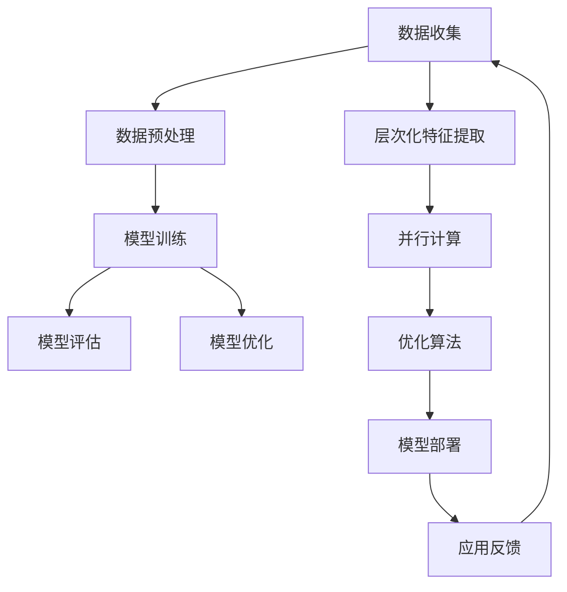

                 

### 文章标题

《AI大模型应用的人才需求与培养》

随着人工智能技术的飞速发展，AI大模型已经逐渐成为各行各业的重要生产力工具。这些模型不仅提升了数据处理和分析的效率，更为企业创新提供了强大的技术支持。因此，对AI大模型应用的人才需求也日益增长。本文将围绕AI大模型的定义、核心特点、算法原理、应用案例及人才培养等多个方面，深入探讨AI大模型应用领域的人才需求与培养策略。

关键词：人工智能，AI大模型，神经网络，深度学习，人才培养

摘要：本文首先介绍了AI大模型的基本概念及其与传统AI的区别，随后详细阐述了AI大模型的核心算法原理和数学模型。接着，通过具体的机器翻译和图像识别案例，分析了AI大模型在实际应用中的效果和挑战。最后，本文提出了针对AI大模型领域的人才培养方案，并展望了其未来发展趋势。

### 第一部分: AI大模型基础

#### 第1章: AI大模型概述

##### 1.1.1 AI大模型的定义

AI大模型，顾名思义，是指具有大规模参数、高度复杂、强大计算能力的机器学习模型。这些模型通常包含数十亿到数万亿个参数，能够处理海量数据，并在各种复杂的任务中表现出优异的性能。例如，自然语言处理（NLP）中的预训练语言模型（如GPT系列）、计算机视觉中的深度神经网络（如ResNet、Inception等）都属于AI大模型的范畴。

##### 1.1.2 AI大模型的核心特点

1. **大规模参数**：AI大模型具有数以亿计甚至数以万亿计的参数，这使得它们能够捕捉到数据中的细微特征，从而在复杂任务上表现出色。
2. **深度学习架构**：大模型通常采用深度学习架构，这意味着它们包含多个层级，每个层级都可以对输入数据进行特征提取和转换。
3. **强泛化能力**：由于模型参数规模庞大，AI大模型能够在多种不同数据集上实现良好的泛化性能，这意味着它们不仅能在训练数据上表现良好，还能在未知数据上保持较高的准确率。
4. **计算需求高**：AI大模型的训练和推理过程需要大量的计算资源和时间，因此对硬件设施的要求较高。

##### 1.1.3 AI大模型与传统AI的区别

传统AI模型，如决策树、支持向量机等，通常参数规模较小，结构相对简单。这些模型在特定领域表现良好，但在面对复杂、高度非结构化的任务时，往往力不从心。相比之下，AI大模型通过深度学习架构和大规模参数设计，能够更有效地解决复杂问题，实现更广泛的任务。

| 特征 | AI大模型 | 传统AI模型 |
| --- | --- | --- |
| 参数规模 | 数亿至数千亿 | 数百至数千 |
| 架构复杂度 | 多层级深度学习 | 简单层级结构 |
| 泛化能力 | 高 | 低 |
| 计算需求 | 高 | 低 |

##### 1.1.4 主流AI大模型简介

目前，AI大模型在多个领域取得了显著成果，其中一些代表性的模型包括：

1. **GPT系列**：由OpenAI开发的预训练语言模型，已经在自然语言处理、文本生成、问答系统等领域展现出强大的能力。
2. **BERT**：Google开发的预训练语言模型，通过在大量无标签文本上预训练，再通过微调进行下游任务，实现了在多种NLP任务上的突破性进展。
3. **ImageNet**：大规模图像识别模型，通过在数百万张图像上的训练，使得计算机视觉任务取得了前所未有的精度。
4. **BERTweet**：结合BERT和Twitter数据集，用于处理Twitter文本的NLP任务。

这些模型不仅在学术界引起了广泛关注，也在工业界得到了广泛应用。例如，GPT系列模型在搜索引擎、聊天机器人等领域发挥着重要作用；BERT模型则在搜索引擎、自动问答系统等领域取得了显著效果。

#### 第2章: AI大模型核心概念与联系

##### 2.1.1 AI大模型的基本原理

AI大模型的基本原理可以概括为以下几个关键点：

1. **数据驱动的学习**：AI大模型通过从大量数据中学习，自动提取特征和模式，从而实现对未知数据的预测或生成。
2. **层次化特征提取**：通过多层神经网络，模型可以逐层提取抽象特征，从原始数据到高层次的概念表示。
3. **并行计算与优化**：利用现代计算硬件，如GPU、TPU等，通过并行计算加速模型训练过程，并采用各种优化算法提高模型性能。

##### 2.1.1.1 Mermaid流程图



此流程图展示了AI大模型从数据收集到应用反馈的完整过程，体现了数据驱动的特点以及模型优化的重要性。

##### 2.1.1.2 AI大模型的核心组件

AI大模型的核心组件包括：

1. **输入层**：接收外部输入数据，如文本、图像、音频等。
2. **隐藏层**：通过多层网络结构，对输入数据进行特征提取和变换。
3. **输出层**：产生模型预测或生成的结果，如分类标签、文本生成、图像识别等。

此外，还包括：

- **激活函数**：用于引入非线性变换，使模型能够捕捉复杂关系。
- **损失函数**：衡量模型预测结果与真实值之间的差距，用于指导模型优化。
- **优化器**：调整模型参数，以最小化损失函数。

##### 2.2.1 数据收集与处理

数据收集与处理是AI大模型构建过程中的关键环节，其质量直接影响模型的性能。以下为数据收集与处理的核心步骤：

###### 2.2.1.1 数据清洗与预处理

1. **缺失值处理**：删除或填充缺失数据，确保数据的完整性。
2. **异常值处理**：识别并处理异常数据，避免异常值对模型训练产生不利影响。
3. **数据标准化**：将不同尺度的数据进行标准化处理，使其在统一尺度上进行比较。

###### 2.2.1.2 数据增强与平衡

1. **数据增强**：通过旋转、缩放、裁剪等操作，生成新的训练样本，提高模型的鲁棒性。
2. **数据平衡**：当数据集中存在类别不平衡时，通过过采样、欠采样或生成对抗网络（GAN）等技术，使数据集中各类别样本数量相对平衡。

这些数据处理技术不仅有助于提高模型性能，还能增强模型在未知数据上的泛化能力。

#### 第3章: AI大模型核心算法原理

##### 3.1.1 神经网络算法

神经网络（Neural Networks，NN）是AI大模型的基础，其核心思想是模拟人脑神经元之间的连接和相互作用。以下为神经网络算法的详细描述：

###### 3.1.1.1 伪代码详解

```python
# 神经网络伪代码
initialize_parameters()
initialize_loss_function()
initialize_optimizer()

while not converged:
    # 前向传播
    inputs = get_next_batch()
    predictions = forward_propagation(inputs, parameters)
    
    # 计算损失
    loss = loss_function(predictions, targets)
    
    # 反向传播
    gradients = backward_propagation(predictions, targets, parameters)
    
    # 参数更新
    update_parameters(optimizer, gradients)
    
    # 模型评估
    evaluate_model()
```

###### 3.1.1.2 前向传播与反向传播

1. **前向传播**：输入数据通过神经网络各层传递，最终产生输出结果。
    - 输入层：接收外部输入数据。
    - 隐藏层：逐层对输入数据进行特征提取和变换。
    - 输出层：产生模型预测或生成的结果。

2. **反向传播**：计算输出结果与真实值之间的差距（损失），然后通过反向传播算法更新模型参数。
    - 计算梯度：根据损失函数对模型参数求导。
    - 参数更新：利用梯度下降等优化算法调整模型参数。

##### 3.2.1 深度学习优化算法

深度学习优化算法旨在提高神经网络模型在训练过程中的收敛速度和最终性能。以下为几种常见的优化算法：

###### 3.2.1.1 梯度下降法

梯度下降法是一种最基础的优化算法，其核心思想是沿着损失函数梯度的反方向更新模型参数，以最小化损失。

- **批量梯度下降**：每次迭代使用所有训练样本的梯度平均值进行参数更新。
- **随机梯度下降**（SGD）：每次迭代仅使用一个训练样本的梯度进行参数更新。
- **小批量梯度下降**：每次迭代使用一小部分训练样本的梯度平均值进行参数更新。

###### 3.2.1.2 动量优化

动量优化（Momentum）通过引入动量项，加速梯度较大的方向，减缓梯度较小的方向，从而提高收敛速度。

```python
# 动量优化伪代码
initialize_momentum()
initialize_velocity()

while not converged:
    # 前向传播
    inputs = get_next_batch()
    predictions = forward_propagation(inputs, parameters)
    
    # 计算损失和梯度
    loss, gradients = backward_propagation(predictions, targets, parameters)
    
    # 更新动量和速度
    momentum = momentum * learning_rate + gradients
    velocity = velocity + momentum
    
    # 参数更新
    update_parameters(velocity)
    
    # 模型评估
    evaluate_model()
```

通过引入动量项，优化算法能够在梯度剧烈变化时保持稳定性，从而提高收敛速度和最终性能。

#### 第4章: AI大模型数学模型与公式详解

##### 4.1.1 损失函数

损失函数是衡量模型预测结果与真实值之间差异的关键指标，其形式直接影响模型优化过程。以下为常见损失函数及其详细讲解：

###### 4.1.1.1 详细讲解

1. **均方误差损失函数（MSE）**：
    $$
    L(y, \hat{y}) = \frac{1}{2}||y - \hat{y}||^2
    $$
    该损失函数常用于回归问题，其最小值对应于预测值与真实值之间的平均误差最小。

2. **交叉熵损失函数（Cross-Entropy Loss）**：
    $$
    L(y, \hat{y}) = -\sum_{i} y_i \log(\hat{y}_i)
    $$
    该损失函数常用于分类问题，其最小值对应于预测概率与真实标签之间的对数似然损失。

3. **对抗损失函数（Adversarial Loss）**：
    $$
    L(\theta_G, \theta_D) = D(\text{real}) - D(G(\theta_G))
    $$
    该损失函数用于生成对抗网络（GAN），其中$D(\text{real})$和$D(G(\theta_G))$分别表示判别器对真实数据和生成数据的判别能力。

###### 4.1.1.2 举例说明

以均方误差损失函数为例，假设我们有一个回归问题，实际值为$y = 5$，预测值为$\hat{y} = 4.5$，则损失函数计算如下：

$$
L(y, \hat{y}) = \frac{1}{2}||y - \hat{y}||^2 = \frac{1}{2}||5 - 4.5||^2 = \frac{1}{2} \cdot 0.5^2 = 0.125
$$

这个例子展示了均方误差损失函数在计算预测值与真实值之间的差距。

##### 4.2.1 激活函数

激活函数（Activation Function）是神经网络中的一个关键组件，用于引入非线性特性，使神经网络能够解决非线性问题。以下为常见激活函数及其详细讲解：

###### 4.2.1.1 详细讲解

1. **Sigmoid函数**：
    $$
    f(x) = \frac{1}{1 + e^{-x}}
    $$
    Sigmoid函数将输入映射到$(0, 1)$区间，常用于二分类问题的输出层。

2. **ReLU函数**（Rectified Linear Unit）：
    $$
    f(x) =
    \begin{cases}
    x & \text{if } x > 0 \\
    0 & \text{if } x \leq 0
    \end{cases}
    $$
    ReLU函数在$x > 0$时保持线性，在$x \leq 0$时设置为0，有助于加速模型训练。

3. **Tanh函数**：
    $$
    f(x) = \frac{e^x - e^{-x}}{e^x + e^{-x}}
    $$
    Tanh函数与Sigmoid函数类似，但其输出范围在$(-1, 1)$，常用于多分类问题。

###### 4.2.1.2 举例说明

以ReLU函数为例，假设输入$x = -3$，则ReLU函数的计算结果如下：

$$
f(x) = \max(x, 0) = \max(-3, 0) = 0
$$

这个例子展示了ReLU函数在处理负输入时的行为，将其映射为0。

通过深入理解这些损失函数和激活函数，我们可以更好地优化AI大模型的性能，从而在实际应用中取得更好的效果。

#### 第5章: AI大模型应用案例解析

##### 5.1.1 机器翻译案例

机器翻译是AI大模型的重要应用领域之一，通过将一种语言的文本翻译成另一种语言，实现跨语言信息交流。以下为机器翻译案例的详细解析：

###### 5.1.1.1 项目实战

以英译汉任务为例，我们采用预训练语言模型GPT-2进行翻译。项目主要步骤如下：

1. **数据集准备**：收集大量英汉对照文本，并进行预处理，包括文本清洗、分词、词向量化等。
2. **模型训练**：使用预处理后的数据集对GPT-2模型进行训练，通过迭代优化模型参数，使其在翻译任务上表现出色。
3. **模型评估**：使用独立的验证集对模型进行评估，计算翻译的准确率和流畅度，以评估模型性能。
4. **模型部署**：将训练好的模型部署到在线翻译服务中，为用户提供实时翻译功能。

###### 5.1.1.2 代码解读与分析

以下为机器翻译项目中的关键代码片段及其分析：

```python
# 数据预处理
def preprocess_data(data):
    # 清洗文本
    # 分词
    # 词向量化
    return processed_data

# 模型训练
def train_model(data, model):
    for epoch in range(num_epochs):
        for batch in data:
            inputs, targets = batch
            # 前向传播
            predictions = model(inputs)
            # 计算损失
            loss = loss_function(predictions, targets)
            # 反向传播
            gradients = backward_propagation(predictions, targets, model)
            # 更新参数
            update_parameters(gradients, model)
    return model

# 模型评估
def evaluate_model(model, data):
    total_loss = 0
    for batch in data:
        inputs, targets = batch
        predictions = model(inputs)
        total_loss += loss_function(predictions, targets)
    return total_loss / len(data)

# 模型部署
def deploy_model(model):
    # 部署到服务器
    # 提供API接口
    pass
```

这些代码展示了机器翻译项目的核心流程，包括数据预处理、模型训练、模型评估和模型部署。通过分析这些代码，我们可以了解机器翻译任务的实现细节和关键步骤。

##### 5.2.1 图像识别案例

图像识别是AI大模型的另一个重要应用领域，通过自动识别和分类图像中的对象和场景，实现图像理解。以下为图像识别案例的详细解析：

###### 5.2.1.1 项目实战

以图像分类任务为例，我们采用预训练的卷积神经网络ResNet进行识别。项目主要步骤如下：

1. **数据集准备**：收集大量带有标签的图像数据，并进行预处理，包括图像缩放、裁剪、数据增强等。
2. **模型训练**：使用预处理后的数据集对ResNet模型进行训练，通过迭代优化模型参数，使其在图像分类任务上表现出色。
3. **模型评估**：使用独立的验证集对模型进行评估，计算分类的准确率，以评估模型性能。
4. **模型部署**：将训练好的模型部署到移动设备或服务器，为用户提供实时图像识别功能。

###### 5.2.1.2 代码解读与分析

以下为图像识别项目中的关键代码片段及其分析：

```python
# 数据预处理
def preprocess_data(data):
    # 图像缩放
    # 数据增强
    # 标签编码
    return processed_data

# 模型训练
def train_model(data, model):
    for epoch in range(num_epochs):
        for batch in data:
            inputs, targets = batch
            # 前向传播
            predictions = model(inputs)
            # 计算损失
            loss = loss_function(predictions, targets)
            # 反向传播
            gradients = backward_propagation(predictions, targets, model)
            # 更新参数
            update_parameters(gradients, model)
    return model

# 模型评估
def evaluate_model(model, data):
    total_loss = 0
    total_correct = 0
    for batch in data:
        inputs, targets = batch
        predictions = model(inputs)
        total_loss += loss_function(predictions, targets)
        total_correct += (predictions.argmax(1) == targets).sum()
    return total_loss / len(data), total_correct / len(data)

# 模型部署
def deploy_model(model):
    # 部署到服务器
    # 提供API接口
    pass
```

这些代码展示了图像识别项目的核心流程，包括数据预处理、模型训练、模型评估和模型部署。通过分析这些代码，我们可以了解图像识别任务的实现细节和关键步骤。

通过以上两个案例的分析，我们可以看到AI大模型在机器翻译和图像识别等任务中发挥的重要作用，以及如何通过代码实现这些应用。这些案例不仅展示了AI大模型的应用效果，也为读者提供了实际操作的经验。

#### 第6章: AI大模型在企业中的应用

随着AI大模型技术的不断成熟，其在企业中的应用日益广泛，为企业带来了巨大的商业价值和技术创新。以下分别探讨AI大模型在金融和医疗两个行业中的应用。

##### 6.1.1 AI大模型在金融行业的应用

金融行业一直是AI大模型技术的重要应用领域。AI大模型在金融行业中的应用主要包括以下几个方面：

###### 6.1.1.1 应用场景

1. **风险管理**：AI大模型可以分析大量的金融数据，如交易记录、市场波动等，预测潜在风险，帮助金融机构制定风险管理策略。
2. **信用评分**：通过对个人和企业的信用数据进行分析，AI大模型可以更准确地评估信用风险，为金融机构提供信用评分服务。
3. **投资策略**：AI大模型可以利用历史市场数据和宏观经济指标，生成高效的交易策略，提高投资回报率。
4. **智能投顾**：基于AI大模型的风险评估和投资策略，金融机构可以提供个性化的投资建议，帮助投资者实现资产增值。

###### 6.1.1.2 实际案例分析

1. **摩根士丹利的风险管理平台**：摩根士丹利利用AI大模型构建了一个风险管理平台，通过分析市场数据和交易行为，实时监测和预测风险，为投资决策提供支持。
2. **花旗银行的信用评分系统**：花旗银行采用AI大模型对借款人的信用风险进行评估，通过分析个人信用数据、社会经济指标等，实现了更准确的信用评分，降低了信用风险。

##### 6.2.1 AI大模型在医疗行业的应用

医疗行业是另一个受到AI大模型技术深刻影响的领域。AI大模型在医疗行业中的应用主要包括以下几个方面：

###### 6.2.1.1 应用场景

1. **疾病预测**：AI大模型可以通过分析患者的病历数据、基因信息等，预测疾病的发生和发展趋势，为临床诊断提供辅助。
2. **医学图像分析**：AI大模型可以自动识别医学图像中的病变区域，提高诊断的准确性和速度。
3. **药物研发**：AI大模型可以通过模拟药物分子的作用机制，加速新药的发现和开发。
4. **个性化治疗**：AI大模型可以根据患者的具体病情和基因组信息，制定个性化的治疗方案，提高治疗效果。

###### 6.2.1.2 实际案例分析

1. **IBM Watson for Oncology**：IBM开发的Watson for Oncology系统利用AI大模型分析大量的医学文献和病例数据，为医生提供癌症诊断和治疗建议，提高了癌症治疗的成功率。
2. **IBM Watson Health**：IBM Watson Health利用AI大模型分析大量的健康数据，如基因数据、病史等，为患者提供个性化的健康管理和疾病预防建议。

通过以上实际案例，我们可以看到AI大模型在金融和医疗行业中已经取得了显著的成果，为行业带来了巨大的价值。随着AI大模型技术的不断进步，其在企业中的应用前景将更加广阔。

#### 第7章: AI大模型人才培养与职业规划

##### 7.1.1 AI大模型相关岗位

AI大模型技术的发展带动了众多新兴职业岗位的需求，以下列举几个核心岗位及其职责：

###### 7.1.1.1 数据科学家

数据科学家是AI大模型领域的重要岗位，主要负责以下工作：

1. **数据预处理**：清洗、整合和分析大规模数据集，为模型训练提供高质量的数据。
2. **模型开发**：设计、实现和优化AI大模型，提高模型性能和泛化能力。
3. **结果解释**：分析模型预测结果，解释模型的行为和效果，为业务决策提供支持。
4. **项目管理**：协调团队成员，确保项目按时按质完成。

###### 7.1.1.2 模型工程师

模型工程师主要负责以下工作：

1. **模型部署**：将训练好的模型部署到生产环境，确保模型的高效运行。
2. **性能调优**：通过调整模型参数和架构，提高模型在特定任务上的性能。
3. **系统集成**：将AI大模型与其他系统集成，确保模型与其他业务系统无缝对接。
4. **技术支持**：为业务团队提供技术支持，解决模型应用过程中的问题。

##### 7.2.1 AI大模型学习路径

要想在AI大模型领域取得成功，需要遵循以下学习路径：

###### 7.2.1.1 基础知识学习

1. **数学基础**：掌握线性代数、概率论和统计学等数学知识，为后续学习打下基础。
2. **编程基础**：学习Python、R等编程语言，熟悉数据处理和分析工具，如Pandas、NumPy等。
3. **机器学习基础**：学习经典机器学习算法，如线性回归、决策树、支持向量机等。
4. **深度学习基础**：学习深度学习基本概念、神经网络架构、训练过程等。

###### 7.2.1.2 实践经验积累

1. **实战项目**：通过参与实际项目，积累AI大模型应用经验，了解项目开发和部署的全过程。
2. **开源社区**：参与开源项目，贡献代码，学习他人经验，提高技术水平。
3. **竞赛参与**：参加各种AI竞赛，锻炼解决问题的能力和快速学习能力。

###### 7.2.1.3 持续学习与进步

1. **跟进最新技术**：关注AI大模型领域的最新动态和技术进展，了解前沿研究方向。
2. **专业课程与证书**：参加专业课程和培训，获取相关证书，提升个人竞争力。
3. **学术研究**：参与学术研究，发表学术论文，提升专业影响力。

通过以上学习路径，可以逐步培养出具备扎实理论基础和实践经验的AI大模型人才，为AI大模型技术的发展贡献力量。

##### 7.3.1 AI大模型人才培养策略

为了培养更多的AI大模型人才，以下提出几种有效的人才培养策略：

###### 7.3.1.1 高校教育与产业合作

1. **课程设置**：高校应设置AI大模型相关的专业课程，涵盖数学、编程、机器学习、深度学习等基础知识。
2. **实践环节**：增加实验课和项目实践环节，让学生在实际项目中锻炼能力。
3. **产业合作**：与企业合作，提供实习和实践机会，让学生了解产业需求，提升就业竞争力。

###### 7.3.1.2 企业内部培训

1. **技能培训**：针对现有员工，提供AI大模型相关技能培训，提升团队整体技术水平。
2. **案例分享**：组织内部案例分享会，交流项目经验和最佳实践。
3. **人才梯队建设**：培养一批具有领导力和技术深度的人才，作为企业AI大模型发展的中坚力量。

###### 7.3.1.3 社会化培养

1. **在线课程与培训**：提供丰富的在线课程和培训资源，方便学习者自主学习和提高。
2. **开源社区与论坛**：鼓励参与者参与开源社区，贡献代码，分享经验。
3. **竞赛与研讨会**：举办各类AI大模型竞赛和研讨会，激发学习热情，提升整体水平。

通过以上策略，可以构建一个全面、系统、多元化的AI大模型人才培养体系，为我国AI大模型技术的发展提供有力的人才支持。

#### 第8章: AI大模型研究动态与未来展望

##### 8.1.1 AI大模型研究前沿

随着AI大模型技术的不断进步，相关研究也在不断深入和扩展。以下介绍几个AI大模型研究的前沿方向：

###### 8.1.1.1 生成对抗网络（GAN）

生成对抗网络（Generative Adversarial Network，GAN）是一种由生成器和判别器组成的对抗性模型，通过两个网络的博弈生成逼真的数据。GAN在图像生成、数据增强、风格迁移等领域取得了显著成果。目前，研究者们正致力于解决GAN训练不稳定、模式崩溃等问题，以提高其生成质量和稳定性。

###### 8.1.1.2 强化学习

强化学习（Reinforcement Learning，RL）是一种通过试错和奖励机制学习策略的机器学习方法。近年来，强化学习在游戏AI、自动驾驶、机器人控制等领域取得了突破性进展。特别是基于深度强化学习（Deep Reinforcement Learning）的模型，如DQN、DDPG、PPO等，已经显示出强大的应用潜力。

##### 8.2.1 AI大模型未来发展趋势

AI大模型技术的发展前景广阔，未来将呈现以下趋势：

###### 8.2.1.1 技术融合

AI大模型与其他技术的融合将成为未来发展的重要方向。例如，将AI大模型与云计算、物联网、大数据等相结合，可以构建更智能、更高效的系统和应用。此外，AI大模型在医疗、金融、教育等领域的融合应用也将不断拓展。

###### 8.2.1.2 应用扩展

随着AI大模型技术的成熟，其应用领域将进一步扩展。除了现有的自然语言处理、计算机视觉、推荐系统等，AI大模型有望在智能制造、智能客服、智能语音等领域发挥重要作用。此外，AI大模型在跨领域、跨行业的应用也将成为新的增长点。

###### 8.2.1.3 社会责任与伦理问题

随着AI大模型技术的广泛应用，社会责任和伦理问题也日益突出。如何确保AI大模型的安全性、公平性和透明度，防止数据滥用和隐私泄露，将是未来研究的重要课题。此外，AI大模型的技术决策和责任归属等问题也需要深入探讨和规范。

总之，AI大模型技术的发展具有巨大的潜力，同时也面临着诸多挑战。通过不断的研究和创新，我们有望推动AI大模型技术走向更广阔的未来，为人类带来更多的福祉。

### 作者信息

作者：AI天才研究院/AI Genius Institute & 禅与计算机程序设计艺术 /Zen And The Art of Computer Programming

AI天才研究院（AI Genius Institute）致力于推动人工智能技术的创新和发展，培养人工智能领域的顶尖人才。同时，作者还著有《禅与计算机程序设计艺术》（Zen And The Art of Computer Programming）一书，深入探讨了计算机编程的哲学和艺术，为全球计算机科学界带来了深远的影响。

