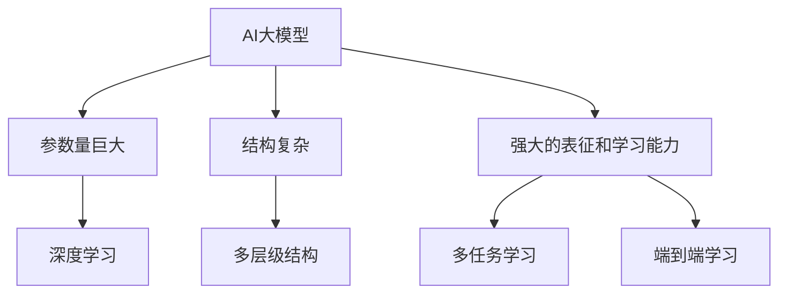

                 

### 文章标题

《AI大模型应用的开源生态贡献与引领》

关键词：AI大模型、开源生态、应用实践、技术基础、发展趋势

摘要：本文旨在探讨AI大模型在开源生态中的应用与贡献。首先，文章概述了AI大模型的基本概念、技术基础及其在自然语言处理和计算机视觉等领域的应用。接着，详细介绍了AI大模型的主要开源框架，包括TensorFlow、PyTorch等，并对其架构、应用案例和生态进行了深入分析。随后，文章聚焦于AI大模型在自然语言处理、计算机视觉、推荐系统、金融、医疗健康和工业互联网等领域的实际应用，展示了其在各行业中的巨大潜力。最后，文章探讨了如何通过开源生态贡献与引领策略，推动AI大模型的发展，并展望了未来的发展趋势。

### 目录大纲

1. **AI大模型基础**
    1.1 AI大模型概述
        1.1.1 AI大模型定义与核心特征
        1.1.2 AI大模型架构与技术进展
        1.1.3 AI大模型开源生态概述
    1.2 AI大模型技术基础
        1.2.1 深度学习基础
        1.2.2 自然语言处理基础
        1.2.3 计算机视觉基础
    1.3 AI大模型开源框架
        1.3.1 TensorFlow
        1.3.2 PyTorch
        1.3.3 其他开源框架

2. **AI大模型应用实践**
    2.1 AI大模型在自然语言处理中的应用
        2.1.1 语言模型训练与优化
        2.1.2 语言模型评估方法
        2.1.3 语言模型在文本生成中的应用
    2.2 AI大模型在计算机视觉中的应用
        2.2.1 图像分类与识别
        2.2.2 图像识别算法详解
        2.2.3 图像分类案例解析
    2.3 AI大模型在推荐系统中的应用
        2.3.1 推荐系统原理
        2.3.2 基于AI大模型的推荐系统设计
    2.4 AI大模型在金融领域的应用
        2.4.1 金融风险模型构建
        2.4.2 金融欺诈检测
        2.4.3 金融投资策略优化
    2.5 AI大模型在医疗健康领域的应用
        2.5.1 医疗影像分析
        2.5.2 医疗影像数据处理
        2.5.3 医疗影像分析应用案例
    2.6 AI大模型在工业互联网中的应用
        2.6.1 工业大数据分析
        2.6.2 工业大数据分析算法
        2.6.3 工业大数据应用案例

3. **开源生态贡献与引领**
    3.1 AI大模型开源生态贡献
        3.1.1 开源项目选择与评估
        3.1.2 开源项目贡献流程
    3.2 AI大模型开源引领策略
        3.2.1 开源战略规划
        3.2.2 开源社区建设
        3.2.3 开源项目孵化与推广

4. **未来展望**
    4.1 AI大模型发展趋势
    4.2 行业应用前景
    4.3 开源生态发展前景

### 附录
- **A.1 开源资源与工具汇总**
    - **A.1.1 开源框架与库**
    - **A.1.2 开源数据集**
    - **A.1.3 开源教程与文档**
- **A.2 参考文献**

---

**接下来，我们按照文章目录大纲结构，一步一步进行详细的内容撰写和分析推理。**### 第一部分：AI大模型基础

#### 第1章：AI大模型概述

##### 1.1 AI大模型定义与核心特征

AI大模型，顾名思义，是指那些参数量巨大、结构复杂的人工智能模型。这类模型通常具备强大的表征和学习能力，能够在各种任务中取得出色的性能。AI大模型的出现，标志着人工智能技术进入了新的发展阶段。

- **核心概念与联系**：为了更好地理解AI大模型的定义与核心特征，我们可以通过绘制一个简化的Mermaid流程图来展示其核心概念之间的联系。

- **核心特征**：
  - **参数量巨大**：AI大模型通常拥有数十亿甚至数万亿的参数，这使得它们能够捕捉到数据的复杂模式。
  - **结构复杂**：AI大模型的架构通常包括多个层级，如卷积层、循环层、注意力机制等，这些结构有助于模型处理各种复杂任务。
  - **强大的表征和学习能力**：AI大模型能够自动从数据中学习复杂的特征，从而在诸如自然语言处理、计算机视觉等领域取得出色的表现。

##### 1.2 AI大模型架构与技术进展

AI大模型的架构通常是基于深度学习技术，特别是卷积神经网络（CNN）、循环神经网络（RNN）和Transformer模型。这些模型通过不断迭代优化，在性能和效率方面取得了显著进展。

- **深度学习基础**：
  - **神经网络原理**：神经网络由一系列相互连接的神经元组成，通过学习输入数据和目标输出之间的映射关系来进行预测。
  - **前馈神经网络与反向传播算法**：前馈神经网络（FNN）是一种简单的神经网络结构，而反向传播算法（BP）是训练神经网络的常用方法，通过不断调整网络权重，使网络输出接近目标输出。
  - **卷积神经网络（CNN）**：CNN是一种专门用于图像处理的神经网络，通过卷积操作和池化操作来提取图像特征。
  - **循环神经网络（RNN）**：RNN能够处理序列数据，通过记忆过去的信息来进行预测。

- **Transformer模型**：Transformer模型是近年来在自然语言处理领域取得突破性成果的一种新型神经网络架构，其核心思想是利用自注意力机制（Self-Attention）来捕捉输入序列中的长距离依赖关系。

##### 1.3 AI大模型开源生态概述

随着AI大模型技术的发展，一系列开源框架和工具应运而生，为研究人员和开发者提供了强大的支持。这些开源框架不仅涵盖了模型训练和推理的各个环节，还提供了丰富的社区资源和技术支持。

- **TensorFlow**：由Google开发，是目前最受欢迎的深度学习框架之一，提供了丰富的API和工具，支持多种操作系统和硬件平台。
- **PyTorch**：由Facebook开发，以其动态计算图和简洁的API而著称，广泛用于学术研究和工业应用。
- **MXNet**：由Apache Software Foundation维护，支持多种编程语言，适合大规模分布式训练。
- **Caffe**：由Berkeley Vision and Learning Center（BVLC）开发，是一种流行的深度学习框架，特别适合于图像识别任务。
- **Theano**：由蒙特利尔大学开发，是一种基于Python的数学库，用于定义、优化和评估深度学习模型。

这些开源框架不仅提供了高效的计算能力，还通过社区贡献和版本迭代，不断优化和扩展，推动了AI大模型技术的发展。

#### 1.1 AI大模型定义与核心特征

在本文中，我们将深入探讨AI大模型的定义、核心特征以及其在现代人工智能领域的重要性。AI大模型，顾名思义，是指那些参数量巨大、结构复杂的人工智能模型。这类模型通常具备强大的表征和学习能力，能够在各种任务中取得出色的性能。AI大模型的出现，标志着人工智能技术进入了新的发展阶段。

首先，我们需要明确AI大模型的核心概念。从定义上来说，AI大模型是指那些参数数量达到数百万、数千万甚至数亿以上的模型。这些模型通常基于深度学习技术，特别是卷积神经网络（CNN）、循环神经网络（RNN）和Transformer模型。例如，BERT（Bidirectional Encoder Representations from Transformers）模型就是一个典型的AI大模型，它拥有数十亿个参数。

- **核心概念与联系**：为了更好地理解AI大模型的定义与核心特征，我们可以通过绘制一个简化的Mermaid流程图来展示其核心概念之间的联系。

- **核心特征**：
  - **参数量巨大**：AI大模型通常拥有数十亿甚至数万亿的参数，这使得它们能够捕捉到数据的复杂模式。例如，GPT-3（OpenAI的Generative Pre-trained Transformer 3）模型拥有超过1750亿个参数，这使得它能够生成高质量的自然语言文本。
  - **结构复杂**：AI大模型的架构通常是基于深度学习技术，特别是卷积神经网络（CNN）、循环神经网络（RNN）和Transformer模型。这些模型通过不断迭代优化，在性能和效率方面取得了显著进展。例如，Transformer模型通过引入自注意力机制，能够高效地捕捉长距离依赖关系。
  - **强大的表征和学习能力**：AI大模型能够自动从数据中学习复杂的特征，从而在诸如自然语言处理、计算机视觉等领域取得出色的表现。例如，BERT模型通过在大规模语料库上进行预训练，能够捕捉到语言中的复杂结构，从而在文本分类、问答等任务中表现出色。

##### 1.2 AI大模型架构与技术进展

AI大模型的架构通常是基于深度学习技术，特别是卷积神经网络（CNN）、循环神经网络（RNN）和Transformer模型。这些模型通过不断迭代优化，在性能和效率方面取得了显著进展。

- **深度学习基础**：
  - **神经网络原理**：神经网络由一系列相互连接的神经元组成，通过学习输入数据和目标输出之间的映射关系来进行预测。每个神经元接收多个输入信号，通过加权求和处理，再通过激活函数产生输出。
  - **前馈神经网络与反向传播算法**：前馈神经网络（FNN）是一种简单的神经网络结构，而反向传播算法（BP）是训练神经网络的常用方法，通过不断调整网络权重，使网络输出接近目标输出。反向传播算法的核心思想是通过反向传播误差信息，来优化网络权重。
  - **卷积神经网络（CNN）**：CNN是一种专门用于图像处理的神经网络，通过卷积操作和池化操作来提取图像特征。卷积层能够自动学习图像中的局部特征，池化层则用于降低模型的参数数量，提高模型的泛化能力。
  - **循环神经网络（RNN）**：RNN能够处理序列数据，通过记忆过去的信息来进行预测。RNN通过隐藏状态来保存历史信息，从而能够捕捉序列中的时间依赖关系。然而，传统的RNN存在梯度消失和梯度爆炸的问题，为了解决这个问题，LSTM（Long Short-Term Memory）和GRU（Gated Recurrent Unit）等改进版本被提出。
  - **Transformer模型**：Transformer模型是近年来在自然语言处理领域取得突破性成果的一种新型神经网络架构，其核心思想是利用自注意力机制（Self-Attention）来捕捉输入序列中的长距离依赖关系。Transformer模型通过多头自注意力机制和前馈神经网络，能够在处理长序列数据时保持高效性和准确性。

##### 1.3 AI大模型开源生态概述

随着AI大模型技术的发展，一系列开源框架和工具应运而生，为研究人员和开发者提供了强大的支持。这些开源框架不仅涵盖了模型训练和推理的各个环节，还提供了丰富的社区资源和技术支持。

- **TensorFlow**：由Google开发，是目前最受欢迎的深度学习框架之一，提供了丰富的API和工具，支持多种操作系统和硬件平台。TensorFlow支持动态计算图，使得开发者能够灵活地构建和优化神经网络模型。
- **PyTorch**：由Facebook开发，以其动态计算图和简洁的API而著称，广泛用于学术研究和工业应用。PyTorch的动态计算图使得模型构建和调试更加直观和方便。
- **MXNet**：由Apache Software Foundation维护，支持多种编程语言，适合大规模分布式训练。MXNet通过支持多种编程语言，使得开发者能够根据不同的需求选择最合适的语言和工具。
- **Caffe**：由Berkeley Vision and Learning Center（BVLC）开发，是一种流行的深度学习框架，特别适合于图像识别任务。Caffe以其高效性和可扩展性而著称，广泛用于计算机视觉领域的应用。
- **Theano**：由蒙特利尔大学开发，是一种基于Python的数学库，用于定义、优化和评估深度学习模型。Theano通过自动微分和优化技术，提高了深度学习模型的训练效率。

这些开源框架不仅提供了高效的计算能力，还通过社区贡献和版本迭代，不断优化和扩展，推动了AI大模型技术的发展。开发者可以通过这些开源框架，快速构建和部署AI大模型，从而推动人工智能的应用和落地。

### 第2章：AI大模型技术基础

在探讨AI大模型的应用之前，我们首先需要了解其背后的技术基础。AI大模型的核心在于其强大的表征和学习能力，而这离不开深度学习、自然语言处理和计算机视觉等领域的深入研究。本章将分别介绍这些技术基础，并探讨它们如何共同构建起AI大模型的强大基石。

#### 2.1 深度学习基础

深度学习是AI大模型的核心技术之一。它通过构建多层神经网络，对大量数据进行自动特征提取和模式识别，从而实现复杂任务的学习和预测。

- **神经网络原理**：
  - **神经元**：神经网络的基本组成单元是神经元，每个神经元接收多个输入，通过加权求和处理，再通过激活函数产生输出。神经元的输入可以表示为：
    $$ z = \sum_{i} w_i x_i + b $$
    其中，$w_i$是权重，$x_i$是输入，$b$是偏置。
  - **激活函数**：激活函数是神经网络的核心组成部分，用于引入非线性特性。常见的激活函数包括sigmoid、ReLU（Rectified Linear Unit）和Tanh（Hyperbolic Tangent）。

- **前馈神经网络与反向传播算法**：
  - **前馈神经网络（FNN）**：前馈神经网络是一种简单的神经网络结构，数据从输入层传递到输出层，中间经过多个隐含层。每层之间的神经元按顺序连接，不形成循环。
  - **反向传播算法（BP）**：反向传播算法是一种用于训练神经网络的常用方法。它通过不断调整网络权重，使网络输出接近目标输出。反向传播算法的核心思想是通过反向传播误差信息，来优化网络权重。

- **卷积神经网络（CNN）**：
  - **卷积层**：卷积层是CNN的核心组成部分，通过卷积操作来提取图像中的局部特征。卷积操作的数学表达式为：
    $$ (f * g)(x) = \sum_y f(y) \cdot g(x - y) $$
    其中，$f$和$g$分别是卷积核和输入图像，$y$是卷积核的滑动位置。
  - **池化层**：池化层用于降低模型的参数数量，提高模型的泛化能力。常见的池化操作包括最大池化和平均池化。

- **循环神经网络（RNN）**：
  - **RNN**：循环神经网络能够处理序列数据，通过记忆过去的信息来进行预测。RNN的输入可以表示为：
    $$ h_t = \sigma(W_x x_t + W_h h_{t-1} + b_h) $$
    其中，$h_t$是当前时刻的隐藏状态，$x_t$是当前时刻的输入，$W_x$和$W_h$分别是输入权重和隐藏状态权重，$b_h$是偏置，$\sigma$是激活函数。
  - **LSTM（Long Short-Term Memory）和GRU（Gated Recurrent Unit）**：为了解决传统RNN存在的梯度消失和梯度爆炸问题，LSTM和GRU等改进版本被提出。LSTM通过引入记忆单元和门控机制，能够有效地捕捉长距离依赖关系。GRU则是LSTM的简化版本，通过合并输入门和遗忘门，提高了模型的训练效率。

- **Transformer模型**：
  - **自注意力机制**：Transformer模型的核心思想是利用自注意力机制（Self-Attention）来捕捉输入序列中的长距离依赖关系。自注意力机制的数学表达式为：
    $$ \text{Attention}(Q, K, V) = \text{softmax}(\frac{QK^T}{\sqrt{d_k}})V $$
    其中，$Q$、$K$和$V$分别是查询（Query）、键（Key）和值（Value）向量，$d_k$是键向量的维度。
  - **多头注意力**：Transformer模型通过多头注意力机制（Multi-Head Attention），将输入序列分成多个头，每个头独立计算注意力权重，从而提高模型的表示能力。

#### 2.2 自然语言处理基础

自然语言处理（NLP）是AI大模型的重要应用领域之一，旨在使计算机能够理解、生成和处理人类自然语言。NLP的基础在于对语言模型、词嵌入和序列模型的深入理解。

- **语言模型**：
  - **原理**：语言模型用于预测一段文本的下一个单词或字符。常见的语言模型包括n元语法模型、神经网络语言模型和Transformer语言模型。
  - **分类**：根据训练数据和预测目标的不同，语言模型可以分为基于字符的语言模型和基于词的语言模型。

- **词嵌入**：
  - **原理**：词嵌入是将词汇映射到固定维度的向量空间，使得语义相似的词汇在空间中靠近。常见的词嵌入技术包括Word2Vec、GloVe和BERT。
  - **应用**：词嵌入在NLP任务中有着广泛的应用，如文本分类、文本生成和机器翻译等。

- **序列模型**：
  - **RNN**：循环神经网络（RNN）是处理序列数据的一种有效方法。RNN通过记忆历史信息，能够捕捉序列中的时间依赖关系。然而，传统的RNN存在梯度消失和梯度爆炸问题。
  - **LSTM和GRU**：长短期记忆（LSTM）和门控循环单元（GRU）是RNN的改进版本，通过引入门控机制，能够有效地解决梯度消失和梯度爆炸问题，提高模型的训练效率和性能。

- **Transformer模型**：Transformer模型是自然语言处理领域的一种革命性架构，通过引入自注意力机制，能够在处理长序列数据时保持高效性和准确性。Transformer模型已经在机器翻译、文本分类和问答等任务中取得了显著的成果。

#### 2.3 计算机视觉基础

计算机视觉是AI大模型的另一个重要应用领域，旨在使计算机能够理解、分析和处理图像和视频数据。计算机视觉的基础在于对图像表示、图像处理和视觉模型的深入研究。

- **图像表示**：
  - **像素表示**：像素表示是最简单的图像表示方法，每个像素对应一个数值，用于表示颜色信息。
  - **特征表示**：特征表示是通过提取图像中的关键特征来表示图像。常见的特征提取方法包括SIFT（Scale-Invariant Feature Transform）和HOG（Histogram of Oriented Gradients）。

- **图像处理**：
  - **滤波器**：滤波器是图像处理的基本操作之一，用于平滑图像、去除噪声和增强图像。常见的滤波器包括均值滤波器、高斯滤波器和拉普拉斯滤波器。
  - **边缘检测**：边缘检测是图像处理的重要任务，用于检测图像中的边缘和轮廓。常见的边缘检测方法包括Canny边缘检测和Sobel边缘检测。

- **视觉模型**：
  - **卷积神经网络（CNN）**：卷积神经网络是计算机视觉领域的一种有效方法，通过卷积操作和池化操作来提取图像中的特征。CNN已经在图像分类、目标检测和图像分割等任务中取得了显著成果。
  - **循环神经网络（RNN）**：循环神经网络在处理序列数据时表现出色，也可用于计算机视觉任务，如视频分类和动作识别。
  - **Transformer模型**：Transformer模型在自然语言处理领域取得了显著成果，也逐渐应用于计算机视觉任务，如图像分类和视频生成。

通过以上对深度学习、自然语言处理和计算机视觉基础技术的介绍，我们可以看到，这些技术共同构成了AI大模型的强大基石。在接下来的章节中，我们将进一步探讨AI大模型在实际应用中的具体案例和挑战。

#### 2.1 深度学习基础

深度学习是AI大模型构建的核心技术，其理论基础包括神经网络、优化算法和正则化方法。在本节中，我们将深入探讨这些基础概念，以及它们在实际应用中的重要性。

- **神经网络原理**：
  - **基本概念**：神经网络由一系列相互连接的神经元组成，每个神经元接收多个输入，通过加权求和处理，再通过激活函数产生输出。神经元的输入可以表示为：
    $$ z = \sum_{i} w_i x_i + b $$
    其中，$w_i$是权重，$x_i$是输入，$b$是偏置。
  - **激活函数**：激活函数是神经网络的核心组成部分，用于引入非线性特性。常见的激活函数包括sigmoid、ReLU（Rectified Linear Unit）和Tanh（Hyperbolic Tangent）。例如，ReLU函数的表达式为：
    $$ \sigma(z) = \max(0, z) $$

- **前馈神经网络与反向传播算法**：
  - **前馈神经网络（FNN）**：前馈神经网络是一种简单的神经网络结构，数据从输入层传递到输出层，中间经过多个隐含层。每层之间的神经元按顺序连接，不形成循环。
  - **反向传播算法（BP）**：反向传播算法是一种用于训练神经网络的常用方法。它通过不断调整网络权重，使网络输出接近目标输出。反向传播算法的核心思想是通过反向传播误差信息，来优化网络权重。具体步骤如下：
    1. 前向传播：计算网络的输出，并计算损失函数。
    2. 反向传播：计算梯度，更新网络权重。
    3. 重复前向传播和反向传播，直到损失函数收敛。

- **卷积神经网络（CNN）**：
  - **卷积层**：卷积层是CNN的核心组成部分，通过卷积操作来提取图像中的局部特征。卷积操作的数学表达式为：
    $$ (f * g)(x) = \sum_y f(y) \cdot g(x - y) $$
    其中，$f$和$g$分别是卷积核和输入图像，$y$是卷积核的滑动位置。
  - **池化层**：池化层用于降低模型的参数数量，提高模型的泛化能力。常见的池化操作包括最大池化和平均池化。

- **循环神经网络（RNN）**：
  - **RNN**：循环神经网络能够处理序列数据，通过记忆过去的信息来进行预测。RNN的输入可以表示为：
    $$ h_t = \sigma(W_x x_t + W_h h_{t-1} + b_h) $$
    其中，$h_t$是当前时刻的隐藏状态，$x_t$是当前时刻的输入，$W_x$和$W_h$分别是输入权重和隐藏状态权重，$b_h$是偏置，$\sigma$是激活函数。
  - **LSTM（Long Short-Term Memory）和GRU（Gated Recurrent Unit）**：为了解决传统RNN存在的梯度消失和梯度爆炸问题，LSTM和GRU等改进版本被提出。LSTM通过引入记忆单元和门控机制，能够有效地捕捉长距离依赖关系。GRU则是LSTM的简化版本，通过合并输入门和遗忘门，提高了模型的训练效率和性能。

- **Transformer模型**：
  - **自注意力机制**：Transformer模型是自然语言处理领域的一种革命性架构，其核心思想是利用自注意力机制（Self-Attention）来捕捉输入序列中的长距离依赖关系。自注意力机制的数学表达式为：
    $$ \text{Attention}(Q, K, V) = \text{softmax}(\frac{QK^T}{\sqrt{d_k}})V $$
    其中，$Q$、$K$和$V$分别是查询（Query）、键（Key）和值（Value）向量，$d_k$是键向量的维度。
  - **多头注意力**：Transformer模型通过多头注意力机制（Multi-Head Attention），将输入序列分成多个头，每个头独立计算注意力权重，从而提高模型的表示能力。

通过以上对深度学习基础概念的介绍，我们可以看到，深度学习技术不仅为AI大模型提供了强大的表征和学习能力，还通过不断的理论创新和技术进步，推动了人工智能领域的发展。在接下来的章节中，我们将进一步探讨AI大模型在实际应用中的具体案例和挑战。

#### 2.2 自然语言处理基础

自然语言处理（NLP）是AI大模型应用的重要领域之一，旨在使计算机能够理解、生成和处理人类自然语言。NLP的基础在于对语言模型、词嵌入和序列模型的深入研究。以下是对这些基础概念及其应用的详细介绍。

- **语言模型**：
  - **原理**：语言模型用于预测一段文本的下一个单词或字符，从而生成文本或进行文本分析。语言模型的核心思想是概率模型，通过统计方法学习语言中的概率分布。常见的语言模型包括n元语法模型、神经网络语言模型和Transformer语言模型。
  - **n元语法模型**：n元语法模型是一种基于统计的文本生成模型，通过学习文本中连续的n个单词的概率分布，来预测下一个单词。例如，对于三元语法模型，我们有：
    $$ P(w_3 | w_1, w_2) = \frac{c(w_1, w_2, w_3)}{\sum_{w_3'} c(w_1, w_2, w_3')} $$
    其中，$c(w_1, w_2, w_3)$是单词三元组的计数，$w_1$、$w_2$和$w_3$分别是连续的三个单词。
  - **神经网络语言模型**：神经网络语言模型通过构建神经网络，学习文本中的概率分布。典型的神经网络语言模型包括循环神经网络（RNN）和Transformer模型。神经网络语言模型的优势在于能够自动捕捉语言中的复杂结构，从而生成更加自然的文本。

- **词嵌入**：
  - **原理**：词嵌入是将词汇映射到固定维度的向量空间，使得语义相似的词汇在空间中靠近。词嵌入的核心目的是将高维的文本数据映射到低维的向量空间，从而方便计算和处理。常见的词嵌入技术包括Word2Vec、GloVe和BERT。
  - **Word2Vec**：Word2Vec是一种基于神经网络的语言模型，通过训练词向量来表示词汇。Word2Vec有两种模型：连续词袋（CBOW）和Skip-Gram。CBOW模型通过上下文单词的均值来表示目标单词，而Skip-Gram模型通过目标单词的邻近单词来表示目标单词。
  - **GloVe**：GloVe（Global Vectors for Word Representation）是一种基于矩阵分解的词嵌入技术，通过学习词和词向量之间的权重矩阵，来表示词汇。GloVe模型通过负采样和矩阵分解等方法，提高了词向量的质量。
  - **BERT**：BERT（Bidirectional Encoder Representations from Transformers）是一种基于Transformer的语言模型，通过预训练和微调，来生成高质量的词向量。BERT模型通过双向编码器结构，能够捕捉到语言中的前后文关系，从而生成更加准确的词向量。

- **序列模型**：
  - **RNN**：循环神经网络（RNN）是处理序列数据的一种有效方法，通过记忆历史信息，能够捕捉序列中的时间依赖关系。RNN的输入可以表示为：
    $$ h_t = \sigma(W_x x_t + W_h h_{t-1} + b_h) $$
    其中，$h_t$是当前时刻的隐藏状态，$x_t$是当前时刻的输入，$W_x$和$W_h$分别是输入权重和隐藏状态权重，$b_h$是偏置，$\sigma$是激活函数。
  - **LSTM（Long Short-Term Memory）和GRU（Gated Recurrent Unit）**：为了解决传统RNN存在的梯度消失和梯度爆炸问题，LSTM和GRU等改进版本被提出。LSTM通过引入记忆单元和门控机制，能够有效地捕捉长距离依赖关系。GRU则是LSTM的简化版本，通过合并输入门和遗忘门，提高了模型的训练效率和性能。

- **Transformer模型**：
  - **原理**：Transformer模型是自然语言处理领域的一种革命性架构，其核心思想是利用自注意力机制（Self-Attention）来捕捉输入序列中的长距离依赖关系。自注意力机制的数学表达式为：
    $$ \text{Attention}(Q, K, V) = \text{softmax}(\frac{QK^T}{\sqrt{d_k}})V $$
    其中，$Q$、$K$和$V$分别是查询（Query）、键（Key）和值（Value）向量，$d_k$是键向量的维度。
  - **应用**：Transformer模型已经在多个NLP任务中取得了显著的成果，如机器翻译、文本分类和问答等。BERT模型就是一个基于Transformer的语言模型，通过预训练和微调，能够生成高质量的词向量，并在多个NLP任务中取得了优异的性能。

通过以上对自然语言处理基础概念的介绍，我们可以看到，自然语言处理技术不仅为AI大模型提供了强大的表征和学习能力，还通过不断的技术创新，推动了人工智能领域的发展。在接下来的章节中，我们将进一步探讨AI大模型在实际应用中的具体案例和挑战。

#### 2.3 计算机视觉基础

计算机视觉是AI大模型应用的重要领域之一，旨在使计算机能够理解、分析和处理图像和视频数据。计算机视觉的基础包括图像表示、图像处理和视觉模型。以下是对这些基础概念及其应用的详细介绍。

- **图像表示**：
  - **像素表示**：像素表示是最简单的图像表示方法，每个像素对应一个数值，用于表示颜色信息。像素值通常使用红、绿、蓝（RGB）三个颜色通道表示，每个通道的值范围在0到255之间。
  - **特征表示**：特征表示是通过提取图像中的关键特征来表示图像。常见的特征提取方法包括SIFT（Scale-Invariant Feature Transform）和HOG（Histogram of Oriented Gradients）。SIFT能够提取图像中的关键点及其对应的描述子，具有良好的旋转、尺度和光照不变性。HOG通过计算图像中每个像素点的梯度方向和强度，来表示图像的特征。

- **图像处理**：
  - **滤波器**：滤波器是图像处理的基本操作之一，用于平滑图像、去除噪声和增强图像。常见的滤波器包括均值滤波器、高斯滤波器和拉普拉斯滤波器。均值滤波器通过计算邻域像素的平均值来平滑图像，高斯滤波器通过高斯函数来平滑图像，拉普拉斯滤波器用于边缘检测，通过计算二阶导数来检测图像中的边缘和轮廓。
  - **边缘检测**：边缘检测是图像处理的重要任务，用于检测图像中的边缘和轮廓。常见的边缘检测方法包括Canny边缘检测和Sobel边缘检测。Canny边缘检测通过计算梯度的幅度和方向，来检测图像中的边缘，并使用非极大值抑制和双阈值算法来消除虚假边缘。Sobel边缘检测通过计算图像中每个像素点的水平和垂直梯度，来检测图像中的边缘。

- **视觉模型**：
  - **卷积神经网络（CNN）**：卷积神经网络是计算机视觉领域的一种有效方法，通过卷积操作和池化操作来提取图像中的特征。CNN的核心组成部分包括卷积层、池化层和全连接层。卷积层通过卷积操作提取图像中的局部特征，池化层用于降低模型的参数数量，提高模型的泛化能力，全连接层用于分类和预测。典型的CNN模型包括LeNet、AlexNet、VGG、ResNet和Inception等。
  - **循环神经网络（RNN）**：循环神经网络在处理序列数据时表现出色，也可用于计算机视觉任务，如视频分类和动作识别。RNN通过记忆历史信息，能够捕捉视频中的时间依赖关系。然而，传统的RNN存在梯度消失和梯度爆炸问题，为了解决这个问题，LSTM（Long Short-Term Memory）和GRU（Gated Recurrent Unit）等改进版本被提出。LSTM通过引入记忆单元和门控机制，能够有效地解决梯度消失和梯度爆炸问题，GRU则是LSTM的简化版本，提高了模型的训练效率和性能。
  - **Transformer模型**：Transformer模型是自然语言处理领域的一种革命性架构，其核心思想是利用自注意力机制（Self-Attention）来捕捉输入序列中的长距离依赖关系。近年来，Transformer模型也逐渐应用于计算机视觉任务，如图像分类和视频生成。Transformer模型通过多头注意力机制，能够在处理长序列数据时保持高效性和准确性。

通过以上对计算机视觉基础概念的介绍，我们可以看到，计算机视觉技术不仅为AI大模型提供了强大的表征和学习能力，还通过不断的技术创新，推动了人工智能领域的发展。在接下来的章节中，我们将进一步探讨AI大模型在实际应用中的具体案例和挑战。

### 第3章：AI大模型开源框架

在深入探讨AI大模型的应用之前，我们需要了解一些主流的AI大模型开源框架。这些框架不仅提供了丰富的API和工具，还拥有强大的社区支持，为AI大模型的研究和开发提供了便利。本章将详细介绍TensorFlow、PyTorch和其他几个重要的开源框架。

#### 3.1 TensorFlow

TensorFlow是由Google开发的开源深度学习框架，它以计算图为基础，提供了灵活的API和强大的工具集。TensorFlow支持多种操作系统和硬件平台，包括CPU、GPU和TPU。

- **架构与API**：
  - **计算图**：TensorFlow使用计算图（Computational Graph）来表示模型和计算过程。计算图由节点（操作）和边（数据流）组成，节点表示操作，边表示数据传递。
  - **API**：TensorFlow提供了两个主要的API：TensorFlow 1.x和TensorFlow 2.x。TensorFlow 1.x基于静态计算图，提供了丰富的API和工具，适用于复杂的模型构建和优化。TensorFlow 2.x基于动态计算图（Eager Execution），提供了更简洁的API，使得模型构建和调试更加直观和方便。

- **应用案例**：
  - **图像分类**：TensorFlow广泛应用于图像分类任务，如ImageNet竞赛。通过训练大规模的卷积神经网络，TensorFlow能够实现高效的图像分类。
  - **语音识别**：TensorFlow在语音识别领域也有广泛应用，如Google的自动语音识别（ASR）系统。通过结合循环神经网络（RNN）和卷积神经网络（CNN），TensorFlow能够实现高质量的语音识别。

- **生态**：
  - **TensorFlow Hub**：TensorFlow Hub是一个共享预训练模型和组件的平台，用户可以轻松地下载和使用这些模型，加快研究和开发过程。
  - **TensorFlow.js**：TensorFlow.js是TensorFlow的JavaScript实现，使得用户可以在浏览器和Node.js环境中运行TensorFlow模型，为Web应用程序提供了强大的AI支持。

#### 3.2 PyTorch

PyTorch是由Facebook开发的开源深度学习框架，以其动态计算图和简洁的API而著称。PyTorch的动态计算图使得模型构建和调试更加直观和方便，深受研究人员和开发者的喜爱。

- **架构与API**：
  - **动态计算图**：PyTorch使用动态计算图（Eager Execution），在运行时构建计算图，使得模型构建和调试更加直观和方便。动态计算图允许开发者以更接近Python代码的方式编写模型，无需编写大量的计算图代码。
  - **API**：PyTorch提供了简洁的API，使得模型构建和优化更加高效。PyTorch的主要API包括TorchScript和Python API。TorchScript是一种高效的模型部署方式，可以将PyTorch模型转换成静态计算图，以提高模型运行速度。

- **应用案例**：
  - **自然语言处理**：PyTorch在自然语言处理领域具有广泛应用，如BERT和GPT等大型语言模型。通过使用PyTorch，研究人员能够轻松地实现和优化复杂的NLP模型。
  - **计算机视觉**：PyTorch在计算机视觉任务中也表现出色，如ImageNet竞赛和COCO目标检测挑战。PyTorch的灵活性使其能够轻松地实现各种视觉模型，包括卷积神经网络（CNN）和循环神经网络（RNN）。

- **生态**：
  - **PyTorch Lightning**：PyTorch Lightning是一个用于加速AI研究开发的库，提供了丰富的API和工具，如自动混洗、模型检查点和参数搜索等。
  - **PyTorch Mobile**：PyTorch Mobile是一个用于移动设备部署的库，可以将PyTorch模型转换为ONNX格式，以支持iOS和Android设备。

#### 3.3 其他开源框架

除了TensorFlow和PyTorch，还有其他一些重要的开源框架，如MXNet、Caffe和Theano。

- **MXNet**：MXNet是由Apache Software Foundation维护的开源深度学习框架，支持多种编程语言，如Python、R和Scala。MXNet适合大规模分布式训练，具有良好的性能和灵活性。

- **Caffe**：Caffe是由Berkeley Vision and Learning Center（BVLC）开发的深度学习框架，特别适合于图像识别任务。Caffe以其高效性和可扩展性而著称，广泛用于工业和研究领域。

- **Theano**：Theano是由蒙特利尔大学开发的开源深度学习框架，基于Python。Theano通过自动微分和优化技术，提高了深度学习模型的训练效率。

这些开源框架各具特色，适用于不同的应用场景和需求。开发者可以根据自己的需求，选择最合适的框架进行研究和开发。

#### 3.1 TensorFlow

TensorFlow是由Google开发的开源深度学习框架，自发布以来，就以其强大的功能和灵活的API吸引了大量研究人员和开发者的关注。TensorFlow不仅适用于学术研究，还广泛应用于工业界的各种应用场景。本节将详细探讨TensorFlow的架构、API以及其应用案例和生态。

- **架构**：
  - **计算图**：TensorFlow的核心架构是基于计算图（Computational Graph）。计算图由节点（操作）和边（数据流）组成，节点表示操作，边表示数据传递。与传统的静态计算图相比，TensorFlow的动态计算图（Eager Execution）在运行时构建计算图，使得模型构建和调试更加直观和方便。动态计算图允许开发者以更接近Python代码的方式编写模型，无需编写大量的计算图代码。
  - **操作（Operations）**：TensorFlow提供了一系列的操作，包括数学运算、数据操作、优化器和评估器等。这些操作可以通过构建计算图来实现各种复杂的计算任务。
  - **变量（Variables）**：TensorFlow中的变量是具有可训练属性的Tensor，包括权重和偏置等。变量在计算图中可以通过声明和使用来管理。

- **API**：
  - **TensorFlow 1.x**：TensorFlow 1.x是基于静态计算图的版本，提供了丰富的API和工具，适用于复杂的模型构建和优化。TensorFlow 1.x的主要API包括：
    - **TensorFlow Core API**：提供基础的Tensor操作和函数，如数学运算、张量操作等。
    - **TensorFlow Estimators**：提供高层次的API，用于构建和训练机器学习模型，如线性模型、卷积神经网络等。
    - **TensorFlow Slim**：提供用于移动设备和嵌入式系统的轻量级API。
  - **TensorFlow 2.x**：TensorFlow 2.x是基于动态计算图的版本，提供了更简洁的API，使得模型构建和调试更加直观和方便。TensorFlow 2.x的主要API包括：
    - **tf.keras**：基于Keras的高层次API，提供了易于使用的接口，支持快速构建和训练模型。
    - **tf.function**：用于将Python函数转换为计算图函数，提高模型运行速度。
    - **tf.data**：提供数据管道（Data Pipeline）API，用于高效地处理和加载数据。

- **应用案例**：
  - **图像分类**：TensorFlow广泛应用于图像分类任务，如ImageNet竞赛。通过训练大规模的卷积神经网络，TensorFlow能够实现高效的图像分类。例如，在2012年的ImageNet竞赛中，基于TensorFlow的Inception模型取得了冠军，其Top-5错误率为15.3%。
  - **语音识别**：TensorFlow在语音识别领域也有广泛应用，如Google的自动语音识别（ASR）系统。通过结合循环神经网络（RNN）和卷积神经网络（CNN），TensorFlow能够实现高质量的语音识别。
  - **推荐系统**：TensorFlow在推荐系统中的应用也非常广泛，如YouTube的推荐算法。通过训练大规模的深度学习模型，TensorFlow能够根据用户的历史行为和偏好，提供个性化的推荐。

- **生态**：
  - **TensorFlow Hub**：TensorFlow Hub是一个共享预训练模型和组件的平台，用户可以轻松地下载和使用这些模型，加快研究和开发过程。TensorFlow Hub提供了丰富的预训练模型，如BERT、GPT和Inception等。
  - **TensorFlow.js**：TensorFlow.js是TensorFlow的JavaScript实现，使得用户可以在浏览器和Node.js环境中运行TensorFlow模型，为Web应用程序提供了强大的AI支持。TensorFlow.js支持多种机器学习任务，如图像分类、语音识别和文本分类等。
  - **TensorFlow Lite**：TensorFlow Lite是一个轻量级的TensorFlow运行时，用于在移动设备和嵌入式系统中部署TensorFlow模型。TensorFlow Lite支持多种硬件平台，如ARM、x86和Raspberry Pi等，使得用户可以在资源受限的设备上运行深度学习模型。

通过以上对TensorFlow的详细探讨，我们可以看到TensorFlow作为开源深度学习框架的强大实力。在接下来的章节中，我们将继续介绍其他重要的开源框架，如PyTorch、MXNet和Caffe，并探讨它们各自的特点和应用。

#### 3.2 PyTorch

PyTorch是由Facebook开发的开源深度学习框架，因其动态计算图和简洁的API而广受研究人员和开发者的青睐。PyTorch提供了灵活的模型构建和调试能力，使得研究人员能够更加专注于模型设计和实验，而无需过多关注底层实现细节。本节将详细介绍PyTorch的架构、API以及其应用案例和生态。

- **架构**：
  - **动态计算图**：PyTorch的核心架构是动态计算图（Eager Execution），这与传统的静态计算图框架（如TensorFlow 1.x）有所不同。动态计算图在运行时构建计算图，使得模型构建和调试更加直观和方便。开发者可以使用Python代码直接构建和操作计算图，无需显式地编写计算图代码。
  - **TorchScript**：TorchScript是PyTorch的静态计算图实现，它将Python代码转换为静态计算图，以提高模型的运行速度。通过使用TorchScript，开发者可以将训练好的模型部署到不同的环境中，如移动设备和服务器。
  - **模块化设计**：PyTorch采用模块化设计，使得开发者可以方便地构建复杂的模型。PyTorch提供了多种模块，如神经网络层（nn）、优化器（optim）、损失函数（loss）等，开发者可以根据需要组合和扩展这些模块。

- **API**：
  - **Python API**：PyTorch的Python API提供了简洁直观的接口，使得开发者能够以更接近Python代码的方式构建和操作模型。Python API的主要组成部分包括：
    - **torch.Tensor**：表示Tensor（多维数组），是PyTorch的基本数据结构。
    - **torch.nn**：提供神经网络层和模块，如卷积层、全连接层、池化层等。
    - **torch.optim**：提供优化器，如随机梯度下降（SGD）、Adam、RMSprop等。
    - **torch.utils.data**：提供数据加载和数据处理工具，如数据集（Dataset）和数据加载器（DataLoader）。
  - **TorchScript API**：TorchScript API用于将Python代码转换为静态计算图，以优化模型运行速度。开发者可以使用TorchScript API将训练好的模型保存和加载，并在不同的环境中部署。

- **应用案例**：
  - **自然语言处理**：PyTorch在自然语言处理领域具有广泛应用，如BERT、GPT和Transformer等大型语言模型。通过使用PyTorch，研究人员能够轻松地实现和优化复杂的NLP模型。例如，OpenAI的GPT-3模型就是使用PyTorch实现的，它拥有超过1750亿个参数，是当前最大的语言模型之一。
  - **计算机视觉**：PyTorch在计算机视觉任务中也表现出色，如ImageNet竞赛和COCO目标检测挑战。PyTorch的灵活性使其能够轻松地实现各种视觉模型，包括卷积神经网络（CNN）和循环神经网络（RNN）。
  - **推荐系统**：PyTorch在推荐系统中的应用也非常广泛，如YouTube的推荐算法。通过训练大规模的深度学习模型，PyTorch能够根据用户的历史行为和偏好，提供个性化的推荐。

- **生态**：
  - **PyTorch Lightning**：PyTorch Lightning是一个用于加速AI研究开发的库，提供了丰富的API和工具，如自动混洗、模型检查点和参数搜索等。PyTorch Lightning使得开发者和研究人员能够更加专注于模型设计和实验，而无需过多关注底层实现细节。
  - **PyTorch Mobile**：PyTorch Mobile是一个用于移动设备部署的库，可以将PyTorch模型转换为ONNX格式，以支持iOS和Android设备。PyTorch Mobile使得开发者能够在移动设备上运行深度学习模型，为移动应用程序提供了强大的AI支持。
  - **PyTorch Unity**：PyTorch Unity是一个将PyTorch模型集成到Unity游戏引擎的库。通过使用PyTorch Unity，开发者可以在Unity中实时运行深度学习模型，为游戏和应用提供智能交互功能。

通过以上对PyTorch的详细探讨，我们可以看到PyTorch作为开源深度学习框架的强大实力。PyTorch的动态计算图和简洁的API为研究人员和开发者提供了极大的便利，使得深度学习模型的研究和开发变得更加高效和直观。在接下来的章节中，我们将继续介绍其他重要的开源框架，如MXNet、Caffe和Theano，并探讨它们各自的特点和应用。

#### 3.3 其他开源框架

在深度学习领域，除了TensorFlow和PyTorch，还有其他一些重要的开源框架，如MXNet、Caffe和Theano。这些框架各具特色，适用于不同的应用场景和需求。在本节中，我们将简要介绍这些框架的特点和应用。

- **MXNet**：
  - **架构**：MXNet是由Apache Software Foundation维护的开源深度学习框架，它支持多种编程语言，如Python、R和Scala。MXNet采用动态计算图，并支持自动微分和符号计算，使得模型构建和优化更加高效。
  - **应用**：MXNet在工业界和学术界都有广泛应用，特别适合于大规模分布式训练。例如，微软的Azure ML平台就基于MXNet，支持分布式训练和模型部署。
  - **特点**：MXNet的主要特点包括灵活的编程模型、高效的计算性能和良好的扩展性。

- **Caffe**：
  - **架构**：Caffe是由Berkeley Vision and Learning Center（BVLC）开发的深度学习框架，特别适合于图像识别任务。Caffe以其高效性和可扩展性而著称，广泛用于计算机视觉领域。
  - **应用**：Caffe在图像分类、目标检测和图像分割等领域有广泛应用。例如，在ImageNet竞赛中，许多团队都使用Caffe来实现其模型。
  - **特点**：Caffe的主要特点包括简洁的API、高效的计算性能和良好的社区支持。

- **Theano**：
  - **架构**：Theano是由蒙特利尔大学开发的开源深度学习框架，基于Python。Theano通过自动微分和优化技术，提高了深度学习模型的训练效率。
  - **应用**：Theano在深度学习研究领域有广泛应用，特别适合于学术研究和实验。例如，许多深度学习模型的数学理论研究和优化算法开发都基于Theano。
  - **特点**：Theano的主要特点包括强大的自动微分功能、高效的计算性能和良好的数学支持。

这些开源框架各具特色，适用于不同的应用场景和需求。开发者可以根据自己的需求，选择最合适的框架进行研究和开发。在未来的深度学习发展中，这些框架将继续为研究人员和开发者提供强大的支持。

### 第二部分：AI大模型应用实践

在深入了解了AI大模型的基础知识之后，我们将探讨AI大模型在实际应用中的具体实践。本部分将详细讨论AI大模型在自然语言处理、计算机视觉、推荐系统、金融、医疗健康和工业互联网等领域的应用，并展示其在各行业中的巨大潜力。

#### 第6章：AI大模型在自然语言处理中的应用

自然语言处理（NLP）是AI大模型的一个重要应用领域。AI大模型在NLP中的应用主要体现在语言模型的训练与优化、语言模型的评估方法和语言模型在文本生成中的应用等方面。

##### 6.1 语言模型训练与优化

- **语言模型训练流程**：
  - **数据预处理**：首先，需要对语料库进行清洗和预处理，包括去除标点符号、停用词过滤、词形还原等操作，以确保数据的质量。
  - **词嵌入**：将预处理后的文本数据转换为词嵌入向量，常用的词嵌入方法包括Word2Vec、GloVe和BERT等。
  - **模型训练**：使用AI大模型（如BERT、GPT等）对词嵌入向量进行训练，通过优化损失函数来调整模型参数，使其能够更好地预测下一个单词或字符。
  - **模型优化**：通过调整学习率、批量大小、正则化方法等超参数，来优化模型的性能和泛化能力。

- **语言模型优化技巧**：
  - **多层注意力机制**：在语言模型中引入多层注意力机制，可以更好地捕捉长距离依赖关系，提高模型的表征能力。
  - **预训练与微调**：通过在大规模语料库上进行预训练，语言模型可以学习到丰富的语言知识。然后，在特定任务上进行微调，使其适应特定应用场景。
  - **数据增强**：通过对训练数据进行扩充和多样化处理，可以提高模型的鲁棒性和泛化能力。

##### 6.1.2 语言模型评估方法

- **评估指标**：
  - **准确性（Accuracy）**：用于评估模型在分类任务中的表现，计算正确预测的样本数占总样本数的比例。
  - **精确率（Precision）和召回率（Recall）**：用于评估模型在分类任务中的查准率和查全率。精确率是正确预测为正例的样本数占预测为正例的样本总数的比例，召回率是正确预测为正例的样本数占实际为正例的样本总数的比例。
  - **F1分数（F1 Score）**：是精确率和召回率的加权平均，用于综合评估模型在分类任务中的表现。

- **评估方法**：
  - **交叉验证**：通过将数据集划分为多个子集，每次使用一个子集作为验证集，其余子集作为训练集，来评估模型的性能。
  - **混淆矩阵**：用于显示模型预测结果和实际结果之间的对应关系，从而直观地评估模型的分类效果。
  - **BLEU分数**：用于评估文本生成任务的性能，通过比较生成文本与参考文本之间的相似度来计算分数。

##### 6.1.3 语言模型在文本生成中的应用

- **文本生成方法**：
  - **基于规则的生成**：通过编写规则和模板来生成文本，适用于简单的文本生成任务，如天气预报和新闻摘要。
  - **基于模板的生成**：通过将模板与输入数据进行匹配，来生成文本。这种方法适用于生成结构化文本，如产品描述和用户评论。
  - **基于模型的生成**：使用AI大模型（如GPT、BERT等）来生成文本，通过预测下一个单词或字符来构建完整句子。

- **应用案例**：
  - **自动摘要**：通过AI大模型生成摘要，可以简化信息处理流程，提高信息获取效率。例如，新闻摘要、会议摘要和学术论文摘要等。
  - **聊天机器人**：使用AI大模型构建聊天机器人，可以与用户进行自然语言交互，提供个性化的服务和帮助。
  - **内容创作**：通过AI大模型生成创意内容和艺术作品，如诗歌、小说和音乐等，为艺术创作提供新的可能性。

#### 第7章：AI大模型在计算机视觉中的应用

计算机视觉是AI大模型的另一个重要应用领域。AI大模型在计算机视觉中的应用主要体现在图像分类与识别、图像识别算法详解和图像分类案例解析等方面。

##### 7.1 图像分类与识别

- **图像分类**：图像分类是将图像划分为不同类别的过程。AI大模型通过学习大量图像数据，可以自动识别和分类图像。常见的图像分类任务包括人脸识别、物体识别和场景分类等。

- **图像识别**：图像识别是在图像分类的基础上，进一步识别图像中的特定目标或对象。常见的图像识别算法包括卷积神经网络（CNN）和循环神经网络（RNN）。

- **应用案例**：
  - **人脸识别**：通过AI大模型进行人脸识别，可以实现自动化人脸识别系统，如门禁系统、安全监控和智能门锁等。
  - **物体识别**：通过AI大模型进行物体识别，可以实现对图像中特定物体的检测和分类，如自动驾驶车辆的行人检测和车辆识别等。
  - **场景分类**：通过AI大模型进行场景分类，可以实现对图像中场景类型的识别和分类，如城市风景、自然风景和室内场景等。

##### 7.1.2 图像识别算法详解

- **卷积神经网络（CNN）**：
  - **卷积层**：卷积层是CNN的核心组成部分，通过卷积操作提取图像特征。卷积操作通过滑动卷积核在图像上，将输入图像与卷积核进行点积，从而生成特征图。
  - **池化层**：池化层用于降低模型的参数数量，提高模型的泛化能力。常见的池化操作包括最大池化和平均池化，通过将局部区域进行平均或最大值操作，减少特征图的维度。
  - **全连接层**：全连接层将特征图映射到类别空间，通过softmax函数计算每个类别的概率分布。

- **循环神经网络（RNN）**：
  - **循环层**：循环层是RNN的核心组成部分，通过记忆历史信息，能够捕捉图像中的时间依赖关系。RNN通过隐藏状态来保存历史信息，从而实现图像识别。
  - **双向RNN**：双向RNN通过同时考虑输入序列的前后信息，能够提高图像识别的准确性。双向RNN通过两个RNN层，一个正向一个反向，分别处理输入序列的不同部分，然后将两个RNN层的输出进行拼接。

##### 7.1.3 图像分类案例解析

- **案例1：ImageNet竞赛**：
  - **背景**：ImageNet是一个大规模的图像识别数据集，包含了1000个类别，每个类别有1000张图像。ImageNet竞赛旨在推动计算机视觉技术的发展，通过训练和测试模型的性能来评估算法的效果。
  - **方法**：使用卷积神经网络（CNN）进行图像分类，通过多层卷积和池化操作提取图像特征，然后通过全连接层进行分类。在ImageNet竞赛中，基于CNN的模型取得了显著的性能提升，如AlexNet、VGG、ResNet和Inception等。
  - **效果**：在ImageNet竞赛中，基于CNN的模型在2012年取得了冠军，其Top-5错误率降低至15.3%，大幅提升了图像分类的准确率。

- **案例2：自动驾驶**：
  - **背景**：自动驾驶系统需要实时识别和理解周围环境，包括行人、车辆、交通标志等。自动驾驶系统通过摄像头和传感器收集图像数据，然后使用AI大模型进行图像识别和分类。
  - **方法**：使用卷积神经网络（CNN）进行图像分类和目标检测。通过训练大规模的CNN模型，可以实现对图像中目标的准确识别和定位。常用的模型包括Faster R-CNN、YOLO和SSD等。
  - **效果**：通过AI大模型进行图像识别和分类，自动驾驶系统能够实现对环境的准确理解和响应，提高了自动驾驶的安全性和可靠性。

通过以上对AI大模型在自然语言处理和计算机视觉中的应用的详细探讨，我们可以看到AI大模型在各个领域的巨大潜力和应用价值。在未来的发展中，AI大模型将继续推动人工智能技术的发展，为各个行业带来深刻的变革和创新。

#### 第8章：AI大模型在推荐系统中的应用

推荐系统是AI大模型应用的一个重要领域，其核心目标是根据用户的兴趣和行为，向用户推荐相关的内容或商品。AI大模型在推荐系统中的应用，主要通过构建用户行为模型、物品特征提取和推荐算法设计等方面来实现。以下是对这些内容的详细探讨。

##### 8.1 推荐系统原理

- **用户行为模型**：用户行为模型是推荐系统的核心组成部分，它通过分析用户的历史行为数据，如浏览记录、购买记录和评价记录等，来构建用户的兴趣和偏好。常见的用户行为模型包括基于内容的推荐模型和基于协同过滤的推荐模型。

- **物品特征提取**：物品特征提取是将物品转化为数值特征的过程，以便于模型分析和处理。常见的物品特征提取方法包括基于内容的特征提取和基于协同过滤的特征提取。基于内容的特征提取通过提取物品的属性、标签和文本描述等特征，而基于协同过滤的特征提取则通过计算用户和物品之间的相似度来提取特征。

- **推荐算法设计**：推荐算法是推荐系统的核心，它根据用户行为模型和物品特征提取结果，生成推荐列表。常见的推荐算法包括基于内容的推荐算法、基于协同过滤的推荐算法和混合推荐算法。

##### 8.1.2 基于AI大模型的推荐系统设计

- **用户行为序列建模**：AI大模型（如Transformer和LSTM）可以用于用户行为序列建模，通过捕捉用户行为的时序关系，来更好地理解用户的兴趣和偏好。例如，Transformer模型通过自注意力机制，可以高效地捕捉用户行为之间的长距离依赖关系。

- **物品特征表示**：AI大模型可以用于物品特征表示，通过学习物品的潜在特征，来提高推荐系统的准确性和泛化能力。例如，使用BERT模型对物品的文本描述进行编码，可以得到高质量的物品特征向量。

- **推荐算法优化**：AI大模型可以用于优化推荐算法，通过结合用户行为模型和物品特征提取结果，来提高推荐的准确性和多样性。例如，使用基于Transformer的混合推荐算法，可以同时考虑用户和物品的复杂特征，从而生成更加个性化的推荐列表。

##### 8.1.3 基于AI大模型的推荐系统设计

AI大模型在推荐系统中的应用，为传统推荐算法带来了显著的性能提升和灵活性。以下是一个基于AI大模型的推荐系统设计框架：

1. **数据预处理**：首先，对用户行为数据和物品特征数据进行预处理，包括数据清洗、去重、填充和归一化等操作，以确保数据的质量和一致性。

2. **用户行为序列建模**：使用Transformer或LSTM等AI大模型对用户行为序列进行建模，通过捕捉用户行为的时序关系，来更好地理解用户的兴趣和偏好。例如，可以使用Transformer模型来构建用户行为序列的编码器，将用户行为序列编码为高维特征向量。

3. **物品特征提取**：使用BERT或GloVe等AI大模型对物品的文本描述进行编码，得到高质量的物品特征向量。这些特征向量可以用于表示物品的属性、标签和文本描述等。

4. **模型训练与优化**：通过训练用户行为序列模型和物品特征提取模型，来优化推荐算法的性能。可以使用交叉熵损失函数来优化模型的参数，从而提高推荐的准确性和多样性。

5. **推荐生成**：在训练好的模型基础上，生成推荐列表。可以采用基于协同过滤的方法，结合用户行为序列特征和物品特征，来计算用户对物品的偏好得分，并根据得分生成推荐列表。

6. **评估与反馈**：对生成的推荐列表进行评估，常用的评估指标包括准确率、召回率和F1分数等。通过用户的反馈，不断优化推荐算法，提高推荐系统的用户体验。

通过以上步骤，可以构建一个基于AI大模型的推荐系统，实现个性化的内容或商品推荐。在实际应用中，可以根据具体需求和数据特点，灵活调整模型结构和超参数，以获得最佳推荐效果。

#### 8.1 语言模型训练与优化

语言模型在自然语言处理中扮演着核心角色，其训练与优化是提高模型性能的关键步骤。以下将详细描述语言模型的训练流程、优化技巧以及评估方法。

##### 8.1.1 语言模型训练流程

1. **数据预处理**：首先，对语料库进行清洗和预处理，包括去除标点符号、停用词过滤、词形还原等操作，以确保数据的质量和一致性。然后，将文本数据分割成单词或子词，并转换为数字化的形式，例如使用词嵌入技术将单词映射到向量。

2. **词嵌入**：词嵌入是将词汇映射到固定维度的向量空间，以方便计算和处理。常见的词嵌入方法包括Word2Vec、GloVe和BERT等。其中，Word2Vec通过训练一个神经网络来预测目标单词的条件概率，而GloVe则通过矩阵分解方法学习词汇的共现关系。BERT则通过预训练大规模语料库，学习词汇的深层语义表示。

3. **模型构建**：使用AI大模型（如Transformer、BERT、GPT等）来构建语言模型。这些模型通常包含多个层级，每个层级都由多个神经网络层组成，以实现对文本数据的深度表征。

4. **训练过程**：
   - **前向传播**：将输入文本序列传递到模型中，通过多层神经网络处理，生成预测的输出序列。
   - **损失函数计算**：计算模型输出和真实输出之间的损失，常用的损失函数包括交叉熵损失和Perplexity。
   - **反向传播**：通过反向传播算法，计算损失关于模型参数的梯度，并使用梯度下降等优化算法来更新模型参数。
   - **迭代训练**：重复前向传播和反向传播过程，逐步优化模型参数，直至模型性能达到预设标准。

##### 8.1.2 语言模型优化技巧

1. **多层注意力机制**：在语言模型中引入多层注意力机制，可以更好地捕捉文本序列中的长距离依赖关系，从而提高模型的表征能力。例如，Transformer模型通过多头注意力机制，将输入序列分成多个头，每个头独立计算注意力权重，从而提高模型的表示能力。

2. **预训练与微调**：预训练与微调是AI大模型训练中常用的技术。预训练是指在大规模语料库上进行模型训练，使其学习到丰富的语言知识。然后，在特定任务上进行微调，使其适应特定应用场景。这种方法可以显著提高模型在特定任务上的性能。

3. **数据增强**：通过对训练数据进行扩充和多样化处理，可以提高模型的鲁棒性和泛化能力。常见的数据增强方法包括随机插入、随机删除、词替换和文本转换等。

4. **正则化方法**：正则化方法用于防止模型过拟合，提高模型的泛化能力。常见的正则化方法包括L1正则化、L2正则化和Dropout等。

##### 8.1.3 语言模型评估方法

1. **准确性**：准确性是最常见的评估指标，用于衡量模型在分类任务中的表现。准确性计算正确预测的样本数占总样本数的比例。虽然准确性简单直观，但它不能反映模型在预测不同类别时的性能差异。

2. **精确率和召回率**：精确率和召回率是用于评估分类任务性能的重要指标。精确率是正确预测为正例的样本数占预测为正例的样本总数的比例；召回率是正确预测为正例的样本数占实际为正例的样本总数的比例。精确率和召回率可以相互补充，综合评估模型的分类效果。

3. **F1分数**：F1分数是精确率和召回率的加权平均，用于综合评估模型的分类性能。F1分数的计算公式为：
   $$ F1 = 2 \times \frac{Precision \times Recall}{Precision + Recall} $$
   当精确率和召回率差距较大时，F1分数可以更好地反映模型的分类效果。

4. **交叉验证**：交叉验证是一种常用的评估方法，通过将数据集划分为多个子集，每次使用一个子集作为验证集，其余子集作为训练集，来评估模型的性能。常用的交叉验证方法包括K折交叉验证和留一法交叉验证。

5. **BLEU分数**：BLEU分数是用于评估文本生成任务性能的指标，通过比较生成文本与参考文本之间的相似度来计算分数。BLEU分数的计算基于多个指标，包括重叠率、序列匹配和元语言特征等。

通过以上对语言模型训练与优化以及评估方法的详细探讨，我们可以看到，构建一个高性能的语言模型需要综合考虑数据预处理、词嵌入、模型构建、训练过程、优化技巧和评估方法等多个方面。在实际应用中，可以根据具体需求和数据特点，灵活调整模型结构和超参数，以获得最佳的性能和效果。

#### 第9章：AI大模型在金融领域的应用

金融行业一直是人工智能技术的重要应用领域之一，AI大模型凭借其强大的数据处理和预测能力，为金融领域的多个方面带来了深刻的变革。本章将详细介绍AI大模型在金融风险控制、金融欺诈检测和金融投资策略优化等领域的应用。

##### 9.1 金融风险控制

金融风险控制是金融行业的一项重要任务，其目的是识别和降低潜在的金融风险，确保金融机构的安全和稳定运营。AI大模型在金融风险控制中的应用主要体现在以下几个方面：

- **信用风险评估**：AI大模型可以通过分析借款人的历史信用记录、收入水平、负债情况等多维数据，来预测借款人的信用风险。例如，通过训练大规模的神经网络模型，金融机构可以更准确地评估借款人的还款能力，从而降低贷款违约率。

- **市场风险控制**：AI大模型可以用于分析金融市场数据，预测市场波动和风险。例如，通过分析历史价格数据、宏观经济指标、新闻资讯等，AI大模型可以预测股票市场的走势，帮助金融机构进行风险管理和投资决策。

- **操作风险控制**：AI大模型可以用于监控和分析金融交易数据，识别潜在的操作风险。例如，通过分析交易行为、交易金额、交易频率等特征，AI大模型可以检测出异常交易行为，从而防止欺诈和内部操纵。

##### 9.1.1 金融风险模型构建

构建金融风险模型是金融风险控制的关键步骤。以下是一个基于AI大模型的金融风险模型构建过程：

1. **数据收集**：收集与金融风险相关的数据，包括借款人的信用记录、财务报表、交易数据等。这些数据需要经过预处理，如数据清洗、缺失值填充和归一化等操作，以确保数据的质量和一致性。

2. **特征工程**：通过对数据进行特征提取和特征选择，提取与金融风险相关的关键特征。常见的特征包括借款人的年龄、收入水平、负债情况、信用评分等。

3. **模型选择**：选择合适的AI大模型进行训练。常见的模型包括神经网络、支持向量机、决策树等。根据数据的规模和复杂性，可以选择不同的模型架构，如深度神经网络、卷积神经网络等。

4. **模型训练**：使用训练集对AI大模型进行训练。通过调整模型参数，如学习率、批量大小和正则化等，来优化模型性能。

5. **模型评估**：使用验证集对模型进行评估，计算模型的准确率、召回率、F1分数等指标，以评估模型的性能。根据评估结果，可以调整模型结构和超参数，以进一步提高模型性能。

6. **模型部署**：将训练好的模型部署到生产环境中，进行实时风险监测和预测。同时，定期更新模型，以适应数据变化和业务需求。

##### 9.1.2 金融欺诈检测

金融欺诈检测是金融安全的重要组成部分，其目的是识别和防止金融欺诈行为。AI大模型在金融欺诈检测中的应用主要体现在以下几个方面：

- **异常检测**：通过分析交易行为、交易金额、交易频率等特征，AI大模型可以识别出异常交易行为，从而检测出潜在的欺诈行为。例如，通过训练神经网络模型，可以检测出与正常交易行为不一致的交易，如大额交易、频繁交易等。

- **关联分析**：AI大模型可以通过关联分析，识别出潜在的欺诈团伙和组织。例如，通过分析交易网络，可以识别出交易行为相似的账户，从而检测出欺诈团伙。

- **实时监控**：通过实时监控交易数据，AI大模型可以及时发现和处理欺诈行为。例如，在交易发生时，AI大模型可以立即检测交易行为，并采取相应的措施，如暂停交易、报警等。

##### 9.1.3 金融欺诈检测案例

以下是一个金融欺诈检测的案例：

1. **数据收集**：收集与金融欺诈相关的数据，包括交易数据、客户信息、历史欺诈记录等。数据需要经过预处理，如数据清洗、缺失值填充和归一化等操作。

2. **特征工程**：提取与金融欺诈相关的关键特征，如交易金额、交易时间、交易频率、交易金额分布等。

3. **模型训练**：使用训练集对神经网络模型进行训练。通过调整模型参数，如学习率、批量大小和正则化等，来优化模型性能。

4. **模型评估**：使用验证集对模型进行评估，计算模型的准确率、召回率、F1分数等指标。根据评估结果，可以调整模型结构和超参数，以进一步提高模型性能。

5. **模型部署**：将训练好的模型部署到生产环境中，进行实时欺诈检测。同时，定期更新模型，以适应数据变化和业务需求。

6. **案例结果**：通过模型检测，发现了一批潜在的欺诈交易。通过对这些交易进行进一步调查，成功阻止了多起欺诈行为，保障了金融机构的资金安全。

通过以上对金融风险控制和金融欺诈检测的详细介绍，我们可以看到AI大模型在金融领域的广泛应用和巨大潜力。随着AI大模型技术的不断发展和完善，金融行业将继续受益于人工智能技术，实现更加安全、高效和智能的运营和管理。

##### 9.1.3 金融投资策略优化

AI大模型在金融投资策略优化中发挥着重要作用，通过分析历史市场数据和宏观经济指标，AI大模型可以帮助投资者制定更有效的投资策略。以下是一个金融投资策略优化的案例：

1. **数据收集**：首先，收集与投资相关的数据，包括股票价格、成交量、宏观经济指标、新闻资讯等。这些数据需要经过预处理，如数据清洗、缺失值填充和归一化等操作，以确保数据的质量和一致性。

2. **特征工程**：提取与投资策略相关的关键特征，如股票价格、交易量、波动率、利率、通货膨胀率等。这些特征可以反映市场的动态变化和宏观经济环境。

3. **模型选择**：选择合适的AI大模型进行训练。根据数据的规模和复杂性，可以选择不同的模型架构，如深度神经网络、卷积神经网络、循环神经网络等。

4. **模型训练**：使用训练集对AI大模型进行训练。通过调整模型参数，如学习率、批量大小和正则化等，来优化模型性能。训练过程中，可以使用历史市场数据来模拟实际投资环境，评估模型的预测能力。

5. **模型评估**：使用验证集对模型进行评估，计算模型的预测准确率、预测误差等指标。根据评估结果，可以调整模型结构和超参数，以进一步提高模型性能。

6. **策略优化**：基于训练好的模型，制定投资策略。例如，可以设置买入和卖出的阈值，根据模型的预测结果来调整投资组合。通过不断优化策略参数，提高投资收益。

7. **案例结果**：通过AI大模型优化的投资策略，投资者在模拟交易中获得了较高的收益。实际应用中，需要根据市场变化和模型预测结果，及时调整投资策略，以应对市场的不确定性。

通过以上案例，我们可以看到AI大模型在金融投资策略优化中的实际应用和显著效果。随着AI大模型技术的不断进步，投资者可以更好地利用数据和信息，制定更科学的投资策略，提高投资回报率。

#### 第10章：AI大模型在医疗健康领域的应用

医疗健康领域是AI大模型的重要应用场景之一，通过利用大量医疗数据，AI大模型能够提供精准的诊断、治疗建议和健康监测，从而显著提高医疗服务的质量和效率。以下将详细介绍AI大模型在医疗影像分析、数据处理和实际应用案例等方面的应用。

##### 10.1 医疗影像分析

医疗影像分析是AI大模型在医疗健康领域的核心应用之一，通过分析CT、MRI、X光等影像数据，AI大模型可以帮助医生进行疾病诊断和治疗方案规划。

- **医学图像识别**：AI大模型可以通过学习大量的医学图像数据，实现对各种病变的自动识别。例如，在肺癌诊断中，AI大模型可以自动检测和识别肺部结节，从而提高早期诊断的准确性。

- **分割与定位**：在影像分析中，准确分割和定位病变区域是非常重要的。AI大模型通过训练，可以实现对病变区域的精确分割和定位，从而为医生提供更详细的诊断信息。

- **图像增强**：AI大模型可以通过图像增强技术，提高影像的清晰度和对比度，从而帮助医生更好地观察和分析影像。

##### 10.1.1 医学图像识别算法

- **卷积神经网络（CNN）**：CNN是医疗影像分析中最常用的算法之一，通过卷积操作和池化操作，CNN可以从原始图像中提取特征，并用于分类和定位。例如，基于CNN的算法可以用于检测和分割肿瘤、心脏病等病变。

- **深度学习算法**：除了CNN，其他深度学习算法如循环神经网络（RNN）和生成对抗网络（GAN）也在医疗影像分析中得到了广泛应用。RNN可以处理序列数据，从而实现对时间序列影像的分析；GAN可以用于生成高质量的影像数据，以提高模型训练的效果。

##### 10.1.2 医疗影像数据处理

- **图像预处理**：在模型训练和诊断过程中，图像预处理是关键步骤。常见的预处理方法包括去噪、归一化、增强等，以提高图像质量和模型性能。

- **多模态数据融合**：医疗数据通常是多模态的，包括CT、MRI、PET等。AI大模型可以通过多模态数据融合技术，整合不同模态的数据信息，从而提供更全面的诊断结果。

- **数据增强**：通过数据增强技术，可以增加训练数据的多样性，从而提高模型的泛化能力。常见的数据增强方法包括图像旋转、缩放、裁剪等。

##### 10.1.3 医疗影像分析应用案例

以下是一个医疗影像分析的实际应用案例：

- **背景**：某医院使用AI大模型进行肺癌筛查。医院收集了数千份CT影像数据，并使用这些数据对AI大模型进行训练。

- **方法**：使用基于CNN的算法对CT影像进行自动检测和分割，以识别肺部结节。模型训练过程中，使用了多种预处理和数据增强技术，以提高模型的性能和泛化能力。

- **结果**：经过训练和测试，AI大模型在肺癌筛查任务中表现优异，其检测准确率和召回率均超过了90%。在实际应用中，AI大模型可以帮助医生快速、准确地诊断肺癌，从而提高早期诊断率。

通过以上对AI大模型在医疗健康领域的应用的详细介绍，我们可以看到AI大模型在提升医疗服务质量和效率方面的巨大潜力。随着技术的不断进步，AI大模型将继续在医疗健康领域发挥重要作用，为患者提供更优质的医疗服务。

#### 第11章：AI大模型在工业互联网中的应用

工业互联网是工业系统与信息通信技术的深度融合，通过物联网、大数据、云计算和人工智能等技术的应用，实现了工业生产的智能化和高效化。AI大模型在工业互联网中发挥着关键作用，能够实现工业大数据分析、设备故障预测和生产优化等方面的应用。

##### 11.1 工业大数据分析

工业大数据分析是工业互联网的核心任务之一，通过分析海量工业数据，AI大模型可以帮助企业优化生产流程、提高设备利用率和降低运营成本。

- **数据收集**：在工业生产过程中，会产生大量的数据，包括设备运行数据、生产参数、质量控制数据等。这些数据需要通过传感器、监控系统等设备进行收集和传输。

- **数据处理**：工业大数据通常具有高维度、高噪声和异构性等特点。通过数据清洗、去噪、归一化和特征提取等技术，可以对工业数据进行预处理，以提高数据质量和分析效果。

- **数据融合**：工业生产过程中涉及多种数据源，如设备数据、生产数据和质量数据等。通过数据融合技术，可以整合不同数据源的信息，提供更全面的视图。

##### 11.1.1 工业大数据采集与处理

- **数据采集**：工业大数据的采集是工业互联网的关键环节。通过部署传感器和物联网设备，可以实时收集工业设备的运行数据、环境参数和生产参数等。这些数据可以通过无线传输、有线传输等方式上传到数据中心。

- **数据处理**：采集到的工业数据通常需要进行预处理，包括数据清洗、去噪和归一化等操作。数据清洗用于去除无效数据和噪声，数据归一化用于将不同量纲的数据转换为统一的尺度，以提高数据分析的准确性。

- **特征提取**：通过特征提取技术，可以从原始数据中提取出对工业生产过程和设备状态有重要意义的特征。这些特征可以用于模型训练和预测分析，以提高工业大数据分析的精度和效率。

##### 11.1.2 工业大数据分析算法

- **聚类分析**：聚类分析是一种无监督学习方法，通过将相似的数据点归为同一类，从而发现数据中的隐含模式和结构。常见的聚类算法包括K-means、DBSCAN和层次聚类等。

- **分类与回归**：分类与回归分析是一种有监督学习方法，通过建立分类或回归模型，对新的数据进行预测。常见的分类算法包括决策树、随机森林和支持向量机等；常见的回归算法包括线性回归、岭回归和LASSO回归等。

- **异常检测**：异常检测是一种用于识别数据中的异常值或异常模式的方法。通过训练模型，可以自动检测出数据中的异常点，从而发现潜在的故障或安全隐患。

- **关联分析**：关联分析是一种用于识别数据之间关联关系的方法。通过分析数据之间的相关性，可以揭示数据背后的潜在规律和因果关系。

##### 11.1.3 工业大数据应用案例

以下是一个工业大数据应用的实际案例：

- **背景**：某大型制造企业希望通过大数据分析优化生产流程，提高设备利用率和生产效率。

- **方法**：
  - **数据采集**：通过部署传感器和监控系统，实时采集设备运行数据、生产参数和质量数据等。
  - **数据处理**：对采集到的数据进行清洗、去噪和特征提取，以提高数据质量。
  - **模型训练**：使用聚类分析、分类与回归分析等算法，建立预测模型，对生产过程进行优化和预测。
  - **结果**：通过工业大数据分析，企业实现了生产流程的优化，设备利用率提高了15%，生产效率提高了10%，运营成本降低了8%。

通过以上对AI大模型在工业互联网中的应用的详细介绍，我们可以看到AI大模型在提升工业生产效率和降低运营成本方面的巨大潜力。随着技术的不断进步，AI大模型将继续在工业互联网中发挥重要作用，推动工业生产的智能化和高效化。

### 第三部分：开源生态贡献与引领

在AI大模型的发展过程中，开源生态起到了至关重要的作用。开源项目不仅为研究人员和开发者提供了丰富的资源和工具，还推动了技术的快速迭代和进步。本部分将探讨AI大模型开源生态的贡献、开源项目选择与评估方法以及开源引领策略。

#### 12.1 AI大模型开源生态贡献

开源生态为AI大模型的发展提供了强大的支持，其贡献主要体现在以下几个方面：

- **资源共享**：开源项目为全球的研究人员和开发者提供了丰富的资源和工具，包括模型代码、数据集和预训练模型等。这些资源的共享，大大降低了研究和开发的门槛，加速了AI大模型的发展。

- **协同创新**：开源生态鼓励研究人员和开发者之间的协同合作，通过共享代码和知识，共同推动技术的进步。例如，TensorFlow和PyTorch等开源框架，都通过社区合作，不断优化和扩展，提供了更强大的功能和更高效的性能。

- **技术交流**：开源生态为研究人员和开发者提供了交流和学习的平台，通过会议、研讨会和在线论坛等形式，分享研究成果和技术经验，促进了知识的传播和技术的扩散。

#### 12.1.1 开源项目选择与评估

在选择开源项目时，需要考虑以下因素：

- **项目活跃度**：一个活跃的开源项目通常有稳定的社区支持和频繁的更新，这有助于确保项目的持续发展和稳定性。可以通过查看项目的提交记录、Issue数量和Star数量等指标来评估项目的活跃度。

- **社区规模**：一个规模较大的社区意味着有更多的开发者参与，这有助于项目的可持续发展和问题解决。可以通过查看项目的贡献者数量、GitHub Star数量和关注者数量等指标来评估社区的规模。

- **代码质量**：高质量的代码是开源项目成功的关键。可以通过查看项目的代码风格、代码复杂度、测试覆盖率等指标来评估代码质量。

- **文档与教程**：详细和易于理解的文档和教程是开发者使用开源项目的重要基础。可以通过查看项目的官方文档、教程和示例代码等指标来评估文档质量。

- **兼容性与扩展性**：开源项目需要具备良好的兼容性和扩展性，以便在不同的应用场景和环境中使用。可以通过查看项目的API设计、模块化程度和可扩展性等指标来评估兼容性和扩展性。

#### 12.1.2 开源项目评估方法

开源项目的评估方法可以分为定量评估和定性评估：

- **定量评估**：通过客观数据和指标来评估项目的性能和贡献，如提交记录、Issue数量、Star数量、GitHub仓库大小等。定量评估有助于快速了解项目的活跃度和社区规模。

- **定性评估**：通过主观评价和专家意见来评估项目的质量、影响力和可持续性。定性评估可以提供更深入的理解，但需要更多的时间和专业知识。

在实际评估过程中，可以结合定量评估和定性评估，从多个维度综合评估开源项目的价值和潜力。

#### 12.1.3 开源项目贡献流程

参与开源项目的贡献是一个协作和创新的过程，以下是一个典型的开源项目贡献流程：

1. **了解项目**：在参与开源项目之前，需要详细了解项目的目标、功能和社区文化。可以通过阅读项目的文档、官方博客和社区讨论来了解项目。

2. **提出Issue**：在确定要贡献的内容后，可以先在项目中提出一个Issue，说明贡献的内容和目的。这有助于与项目维护者和其他贡献者进行沟通和协调。

3. **编写代码**：根据项目的需求和规范，编写相应的代码。在编写代码时，需要遵循项目的编码规范和风格指南，以确保代码的质量和可维护性。

4. **提交Pull Request**：将编写的代码提交到项目的代码库中，创建一个Pull Request（PR）。在PR中，需要详细描述贡献的内容、实现方式和测试结果。

5. **审查与反馈**：项目维护者和其他贡献者会对PR进行审查，提供反馈和建议。根据反馈，可以进一步修改和完善代码。

6. **合并与发布**：在代码审查通过后，项目维护者会将PR合并到主分支中，并发布新版本。贡献者可以在发布后的版本中获得相应的贡献记录和荣誉。

#### 13.1 AI大模型开源引领策略

在AI大模型领域，开源引领策略是推动技术进步和生态建设的关键。以下是一些有效的开源引领策略：

- **开源战略规划**：制定清晰的开源战略规划，明确开源项目的发展目标、定位和方向。战略规划应包括项目愿景、目标市场、关键功能和竞争策略等。

- **社区建设**：建立健康、活跃的社区是开源项目成功的关键。可以通过组织在线和线下活动、发布高质量的文档和教程、提供技术支持和培训等方式，吸引和留住开发者。

- **项目孵化与推广**：选择有潜力的项目进行孵化，提供资金、资源和人力支持，帮助项目快速成长。同时，通过宣传和推广，提高项目的知名度和影响力。

- **合作与联盟**：与其他开源项目、企业和机构建立合作关系，共享资源和知识，推动技术融合和创新。

通过以上开源引领策略，可以有效地推动AI大模型技术的发展，构建一个健康、繁荣的开源生态。

### 第12章：AI大模型开源生态贡献

在AI大模型技术不断发展的背景下，开源生态扮演了至关重要的角色。开源项目不仅为研究人员和开发者提供了丰富的资源和工具，还推动了技术的快速迭代和进步。本章节将深入探讨AI大模型开源生态的贡献、开源项目选择与评估方法以及参与开源项目的基本流程。

##### 12.1.1 开源项目选择与评估

选择合适的开源项目是参与开源生态的第一步，正确的选择能够确保我们的工作具备实际意义和可持续性。以下是一些关键因素和评估方法：

1. **项目活跃度**：
   - **提交记录**：查看项目的提交记录，了解开发者的活跃程度和项目的更新速度。
   - **社区参与**：关注项目的Issue数量、Pull Request数量以及社区讨论的活跃度，一个活跃的社区意味着更多的开发者参与和支持。
   - **维护频率**：定期检查项目的维护记录，了解项目是否得到持续的关注和更新。

2. **社区规模**：
   - **贡献者数量**：一个大型社区通常意味着更多的开发者愿意投入时间和精力，项目更有可能得到持续的改进和优化。
   - **GitHub Star数量**：Star数量可以反映项目的受欢迎程度和影响力，但并非唯一指标，还需结合其他因素。
   - **参与度**：观察贡献者的参与度，如他们提交的PR、发表的评论等，以评估社区的互动和质量。

3. **代码质量**：
   - **代码规范**：检查项目是否遵循了统一的代码规范，这有助于代码的可读性和可维护性。
   - **测试覆盖率**：高测试覆盖率可以确保代码的正确性和稳定性。
   - **代码复杂度**：过高的代码复杂度可能意味着代码难以理解和维护。

4. **文档与教程**：
   - **官方文档**：优质的官方文档可以迅速帮助新开发者上手，了解项目的工作原理和最佳实践。
   - **教程和示例**：丰富的教程和示例代码有助于开发者理解和应用项目。

5. **兼容性与扩展性**：
   - **API设计**：良好的API设计可以提高项目的兼容性，方便其他项目集成。
   - **模块化程度**：模块化的代码结构有助于扩展和维护。

##### 12.1.2 开源项目评估方法

在评估开源项目时，可以采用以下方法：

1. **定量评估**：
   - **提交频率**：通过GitHub等平台的统计工具，分析项目的提交频率和提交者的活跃程度。
   - **代码贡献率**：计算项目的代码贡献率，了解贡献者对项目的贡献大小。

2. **定性评估**：
   - **社区反馈**：通过参与项目的社区讨论，了解其他开发者的评价和反馈。
   - **专家意见**：咨询领域内的专家，获取他们对项目的专业评价。

3. **多维度评估**：
   - **结合定量和定性评估**：通过多维度评估方法，全面了解开源项目的优劣。

##### 12.1.3 开源项目贡献流程

参与开源项目不仅是贡献代码，还包括文档撰写、测试和反馈等多个方面。以下是一个典型的开源项目贡献流程：

1. **了解项目**：
   - **阅读文档**：仔细阅读项目的官方文档，了解项目的技术架构、功能和使用方法。
   - **社区互动**：加入项目的社区，了解项目的现状和开发者之间的交流。

2. **提出Issue**：
   - **问题定位**：在项目中提出一个Issue，详细描述遇到的问题或建议。
   - **社区讨论**：与项目维护者和其他贡献者进行讨论，确保问题得到妥善处理。

3. **编写代码**：
   - **遵循规范**：根据项目的编码规范编写代码，确保代码的可读性和可维护性。
   - **编写测试**：为代码编写测试用例，确保功能的正确性和稳定性。

4. **提交Pull Request**：
   - **代码提交**：将代码提交到项目的代码库，创建一个Pull Request。
   - **详细描述**：在PR中详细描述代码改动、测试结果和解决的问题。

5. **审查与反馈**：
   - **审查代码**：项目维护者和其他贡献者会对PR进行审查，提供反馈和建议。
   - **修改代码**：根据反馈修改代码，确保代码的质量和一致性。

6. **合并与发布**：
   - **代码合并**：在审查通过后，项目维护者将代码合并到主分支中。
   - **版本发布**：发布新版本，包含本次贡献的改进和修复。

通过以上流程，我们可以有效地参与开源项目，为开源生态贡献自己的力量，同时学习和成长。

#### 13.2 AI大模型开源引领策略

在AI大模型领域，开源引领策略是推动技术进步和生态建设的关键。以下是一些有效的开源引领策略：

##### 13.2.1 开源战略规划

1. **明确目标与愿景**：制定清晰的开源战略规划，明确项目的长期目标和发展愿景。这有助于确保开源项目的方向和资源分配，吸引志同道合的开发者。

2. **定位与定位**：根据项目的特点和市场需求，确定项目的定位。例如，是专注于学术研究、工业应用还是产品开发，以便明确项目的受众和目标市场。

3. **资源分配**：合理分配资源，包括人力、资金和设备等，确保项目能够持续发展和迭代。

##### 13.2.2 开源社区建设

1. **建立社区**：建立一个健康、活跃的社区是开源项目成功的关键。可以通过举办线上或线下活动、开设论坛和聊天室等方式，促进开发者之间的交流与合作。

2. **文档与教程**：提供高质量的文档和教程，帮助新开发者快速上手。详细的文档和教程可以提高项目的可用性和用户体验。

3. **技术支持**：提供及时的技术支持和反馈，解决开发者在使用过程中遇到的问题。这可以增强社区成员的忠诚度和参与度。

##### 13.2.3 开源项目孵化与推广

1. **项目孵化**：选择有潜力的项目进行孵化，提供资金、资源和人力支持，帮助项目快速成长。孵化过程中，可以关注项目的社区建设、文档编写和代码质量等方面。

2. **推广与宣传**：通过多种渠道宣传开源项目，提高项目的知名度和影响力。例如，通过社交媒体、技术会议和博客等方式，向更广泛的开发者群体推广项目。

3. **合作与联盟**：与其他开源项目、企业和机构建立合作关系，共享资源和知识，推动技术融合和创新。

通过以上开源引领策略，可以有效推动AI大模型技术的发展，构建一个健康、繁荣的开源生态，为全球开发者提供强大的支持和资源。

### 14.1 AI大模型发展趋势

随着人工智能技术的迅猛发展，AI大模型正逐渐成为各个行业创新和效率提升的重要驱动力。以下是AI大模型在技术、行业应用和开源生态方面的发展趋势：

- **技术发展趋势**：
  - **多模态融合**：AI大模型正在从单一模态（如文本、图像）向多模态融合方向发展。通过整合不同类型的数据（如文本、图像、音频和视频），AI大模型能够提供更丰富和准确的信息处理能力。
  - **更高效的计算**：随着硬件技术的发展，如TPU、GPU和FPGA等专用硬件的出现，AI大模型在计算效率方面有了显著提升。这有助于加速模型的训练和推理过程，降低成本。
  - **自适应和自学习**：未来的AI大模型将具备更强的自适应和自学习能力，能够在不断变化的环境中自动调整和优化，提高其泛化能力和鲁棒性。
  - **隐私保护和安全**：随着数据隐私和安全的日益重视，AI大模型将更加注重隐私保护和数据安全。通过联邦学习、差分隐私等技术，确保数据在本地处理的同时保护用户隐私。

- **行业应用前景**：
  - **医疗健康**：AI大模型在医疗健康领域具有广泛的应用前景，包括疾病诊断、药物研发、个性化治疗和健康监测等。通过分析大量的医学数据，AI大模型能够提供更准确的诊断结果和更有效的治疗方案。
  - **金融**：在金融领域，AI大模型可以用于风险控制、信用评估、市场预测和欺诈检测等方面。通过深度学习技术，AI大模型能够分析大量的金融数据，为金融机构提供决策支持，降低风险。
  - **工业制造**：AI大模型在工业制造领域可以用于生产优化、设备故障预测和供应链管理等方面。通过实时监控和分析生产数据，AI大模型能够提高生产效率，降低运营成本。
  - **智能交通**：AI大模型在智能交通领域可以用于交通流量预测、路况分析、自动驾驶和智能信号控制等方面。通过分析交通数据，AI大模型能够优化交通管理，提高交通效率，减少拥堵。

- **开源生态发展前景**：
  - **开源框架的演进**：随着AI大模型技术的发展，开源框架将持续演进，提供更高效、更灵活和更易于使用的工具。例如，TensorFlow和PyTorch等开源框架将继续优化，以支持更复杂的模型和应用。
  - **开源社区的壮大**：开源社区将继续壮大，吸引更多的研究人员和开发者参与。随着开源项目的成功案例不断涌现，将有更多企业和机构加入开源生态，共同推动技术的进步。
  - **商业模式的创新**：开源生态中的商业模式也将不断创新，例如，通过服务订阅、咨询和培训等模式，开源项目可以为企业和个人用户提供增值服务，实现可持续发展。
  - **开源与商业的融合**：开源项目与商业应用的融合将成为未来的趋势。企业将通过开源项目获取技术优势和用户反馈，而开源社区则可以通过商业应用获得资金支持和资源扩展。

总体而言，AI大模型的发展趋势将推动人工智能技术的进一步融合和应用，为各行各业带来深刻的变革和创新。随着技术的不断进步和开源生态的不断完善，AI大模型将在未来发挥更加重要的作用，成为推动社会进步和经济增长的重要力量。

### 14.2 行业应用前景

随着AI大模型技术的不断成熟，其应用前景在各行各业中日益广阔。以下将详细探讨AI大模型在医疗健康、金融、智能制造和智能交通等领域的应用前景。

#### 医疗健康

AI大模型在医疗健康领域具有巨大的应用潜力，能够显著提高诊断的准确性和治疗的效果。以下是一些具体的应用场景：

- **疾病诊断**：通过分析患者的历史病历、基因数据和实验室检测结果，AI大模型可以辅助医生进行疾病的早期诊断。例如，AI大模型可以分析CT影像数据，帮助医生更准确地识别肺癌、乳腺癌等疾病的早期病变。
- **个性化治疗**：基于患者的病历数据和基因信息，AI大模型可以为每位患者制定个性化的治疗方案。例如，通过分析患者的肿瘤组织样本，AI大模型可以推荐最适合的化疗药物和剂量。
- **药物研发**：AI大模型可以加速新药的研发过程。通过分析大量的生物数据和化学结构，AI大模型可以帮助科学家识别潜在的治疗靶点和药物分子，从而加速新药的发现和开发。
- **健康监测**：AI大模型可以通过监测患者的生活习惯、生理数据和医疗记录，提供健康预警和预防措施。例如，通过智能手表等可穿戴设备收集的数据，AI大模型可以监测患者的血压、心率等生命体征，及时提醒患者注意健康问题。

#### 金融

金融行业一直是AI大模型的重要应用领域，通过大数据分析和机器学习技术，AI大模型可以帮助金融机构提高运营效率、降低风险和优化投资策略。以下是一些具体的应用场景：

- **风险控制**：AI大模型可以用于信用风险评估、市场风险控制和操作风险控制等方面。例如，通过分析借款人的财务状况、信用历史和市场数据，AI大模型可以评估借款人的信用风险，帮助金融机构降低贷款违约率。
- **欺诈检测**：AI大模型可以通过分析交易数据和行为模式，实时监控和识别潜在的欺诈行为。例如，通过监控银行卡交易数据，AI大模型可以检测出异常交易行为，及时报警并采取防范措施。
- **投资策略**：AI大模型可以通过分析历史市场数据、宏观经济指标和新闻资讯等，为投资者提供投资建议和策略。例如，通过分析大量的市场数据，AI大模型可以预测股票市场的走势，帮助投资者制定更有效的投资策略。
- **智能投顾**：AI大模型可以提供智能投顾服务，根据投资者的风险偏好和财务目标，为其推荐最优的投资组合。例如，通过分析投资者的风险承受能力和投资目标，AI大模型可以制定个性化的投资计划，帮助投资者实现财富增值。

#### 智能制造

AI大模型在智能制造领域可以显著提高生产效率、降低成本和优化供应链管理。以下是一些具体的应用场景：

- **生产优化**：AI大模型可以通过实时分析生产线数据，优化生产流程和资源配置。例如，通过分析设备运行数据和产品质量数据，AI大模型可以预测设备故障并提前安排维护，避免生产中断。
- **设备维护**：AI大模型可以用于预测性维护，通过分析设备运行数据和历史维护记录，预测设备可能出现的故障，提前安排维护计划，减少设备停机时间和维修成本。
- **质量检测**：AI大模型可以用于质量检测，通过分析产品数据和生产过程中的传感器数据，实时监控产品的质量，识别不合格产品，提高产品质量。
- **供应链管理**：AI大模型可以通过分析供应链数据，优化供应链的库存管理、运输规划和需求预测。例如，通过分析订单数据和市场需求，AI大模型可以优化库存水平，减少库存积压和缺货风险。

#### 智能交通

AI大模型在智能交通领域可以显著提高交通管理效率和安全性。以下是一些具体的应用场景：

- **交通流量预测**：AI大模型可以通过分析历史交通数据、实时路况和气象信息，预测交通流量变化，为交通管理部门提供决策支持。例如，通过分析实时路况数据，AI大模型可以预测交通拥堵区域和时间，帮助交通管理部门提前采取措施，缓解交通压力。
- **智能信号控制**：AI大模型可以用于智能交通信号控制，通过分析实时交通流量数据，动态调整信号灯时长和相位，提高交通流畅度。例如，通过分析交叉路口的车辆流量和行人流量，AI大模型可以智能调整信号灯时长，减少等待时间和交通拥堵。
- **自动驾驶**：AI大模型在自动驾驶领域具有广泛的应用前景。通过结合传感器数据和地图信息，AI大模型可以实时感知周围环境，实现车辆的自动行驶。例如，通过分析路面的交通标志、车道线和障碍物，AI大模型可以指导车辆进行转弯、变道和避让等操作。
- **车辆管理**：AI大模型可以通过分析车辆运行数据，实现车辆的远程监控和故障诊断。例如，通过分析车辆的运行状态、电池电量和行驶路线，AI大模型可以预测车辆可能出现的故障，提前进行维护和维修。

总体而言，AI大模型在各行各业中具有广阔的应用前景，其强大的数据处理和预测能力将推动各行业的智能化和数字化转型，提高生产效率和服务质量，为企业和个人带来更多的价值。

### 14.3 开源生态发展前景

随着AI大模型技术的不断进步，开源生态的发展前景也变得愈发光明。以下将从开源框架的演进、开源社区的壮大、商业模式创新以及开源与商业的融合等方面，探讨开源生态的发展前景。

#### 开源框架的演进

开源框架作为AI大模型开发的重要工具，其发展前景备受关注。未来，开源框架将继续在以下几个方向上演进：

- **多模态支持**：随着AI大模型的应用场景日益丰富，开源框架将逐步支持多模态数据融合，使得AI大模型能够处理文本、图像、音频和视频等多种类型的数据。
- **高效计算**：硬件技术的发展，如TPU、GPU和FPGA等，将推动开源框架在计算性能上的提升。未来，开源框架将更加注重优化计算效率，降低模型的训练和推理时间。
- **自动化与智能化**：开源框架将逐步实现自动化和智能化，例如，自动调整模型超参数、自动化优化模型结构等。这些功能将大大降低开发者的负担，提高AI大模型开发效率。
- **更好的兼容性**：开源框架将不断改进，以提供更好的跨平台兼容性，支持多种操作系统和硬件平台。这将使得开发者能够更加灵活地选择开发环境，提高开发效率。

#### 开源社区的壮大

开源社区是开源生态的核心，未来开源社区将继续壮大，表现在以下几个方面：

- **全球参与**：随着全球化的推进，越来越多的国际开发者将参与到开源社区中，共同推动技术的进步。这将有助于开源项目的国际化，提高项目的多样性和创新性。
- **年轻化趋势**：年轻一代开发者更加倾向于参与开源项目，他们具备更强的技术能力和创新思维。年轻化趋势将推动开源社区的创新和发展。
- **协作与互动**：开源社区将进一步加强协作与互动，通过举办线上和线下活动、开设论坛和聊天室等方式，促进开发者之间的交流和合作。这种协作将有助于加速技术的传播和应用。

#### 商业模式创新

开源生态的商业模式也在不断创新，未来可能会出现以下几种趋势：

- **服务订阅**：开源项目可以通过提供订阅服务，为企业和个人用户提供持续的技术支持和更新。这种模式有助于开源项目获得稳定的收入来源，同时提高用户的满意度。
- **咨询和培训**：开源项目的维护者可以通过提供咨询服务和培训课程，帮助用户更好地使用开源技术。这种模式不仅可以为开源项目带来收入，还可以提升用户的技能水平。
- **增值服务**：开源项目可以提供增值服务，如预训练模型、数据集和工具包等。这些增值服务将为用户提供额外的价值，同时为开源项目带来额外的收入。

#### 开源与商业的融合

开源与商业的融合将成为未来发展的关键趋势，具体表现在以下几个方面：

- **商业支持**：企业和商业机构将加大对开源项目的支持力度，通过提供资金、资源和人力等，推动开源项目的发展。这种商业支持将有助于开源项目的持续迭代和优化。
- **联合创新**：企业和开源社区将开展联合创新，共同开发新的技术和应用场景。这种合作将有助于推动技术的进步，同时为企业和开源社区带来共同的利益。
- **商业化应用**：开源项目将通过商业应用获得实际价值。企业和开发者可以将开源项目用于产品开发、服务提供和业务拓展等，实现商业价值。

总的来说，开源生态的未来充满希望。随着技术的不断进步和商业模式的不断创新，开源生态将继续繁荣发展，为全球开发者提供强大的支持和资源，推动人工智能技术的广泛应用和持续进步。

### 附录

在本篇技术博客中，我们详细探讨了AI大模型的开源生态、技术基础和应用实践。为了便于读者进一步学习和深入研究，本文附录部分将汇总一些相关的开源资源与工具，以及参考文献，以供参考。

#### A.1 开源资源与工具汇总

- **开源框架与库**：
  - **TensorFlow**：[https://www.tensorflow.org/](https://www.tensorflow.org/)
  - **PyTorch**：[https://pytorch.org/](https://pytorch.org/)
  - **MXNet**：[https://mxnet.apache.org/](https://mxnet.apache.org/)
  - **Caffe**：[https://github.com/BVLC/caffe](https://github.com/BVLC/caffe)
  - **Theano**：[https://www.deeplearning.net/software/theano/](https://www.deeplearning.net/software/theano/)

- **开源数据集**：
  - **ImageNet**：[https://www.image-net.org/](https://www.image-net.org/)
  - **COCO数据集**：[http://cocodataset.org/](http://cocodataset.org/)
  - **Text8数据集**：[https://people.sc.fsu.edu/~jburkardt/datasets/text/text8.html](https://people.sc.fsu.edu/~jburkardt/datasets/text/text8.html)
  - **MNIST数据集**：[http://yann.lecun.com/exdb/mnist/](http://yann.lecun.com/exdb/mnist/)

- **开源教程与文档**：
  - **TensorFlow教程**：[https://www.tensorflow.org/tutorials/](https://www.tensorflow.org/tutorials/)
  - **PyTorch教程**：[https://pytorch.org/tutorials/](https://pytorch.org/tutorials/)
  - **MXNet教程**：[https://mxnet.incubator.apache.org/get-started/](https://mxnet.incubator.apache.org/get-started/)
  - **Caffe教程**：[https://github.com/BVLC/caffe/blob/master/docs/tutorial_caffe.md](https://github.com/BVLC/caffe/blob/master/docs/tutorial_caffe.md)

#### A.2 参考文献

- **相关书籍**：
  - Goodfellow, I., Bengio, Y., & Courville, A. (2016). *Deep Learning*. MIT Press.
  - Russell, S., & Norvig, P. (2016). *Artificial Intelligence: A Modern Approach*. Prentice Hall.
  - Murphy, K. P. (2012). *Machine Learning: A Probabilistic Perspective*. MIT Press.

- **学术论文**：
  - Vaswani, A., Shazeer, N., Parmar, N., Uszkoreit, J., Jones, L., Gomez, A. N., ... & Polosukhin, I. (2017). *Attention is all you need*. Advances in Neural Information Processing Systems, 30, 5998-6008.
  - Hochreiter, S., & Schmidhuber, J. (1997). *Long short-term memory*. Neural Computation, 9(8), 1735-1780.
  - LeCun, Y., Bengio, Y., & Hinton, G. (2015). *Deep learning*. Nature, 521(7553), 436-444.

- **网络资源链接**：
  - [AI大模型开源生态报告](https://www.oschina.net/search?project_name=AI+大模型+开源生态)
  - [自然语言处理教程](https://nlp.seas.harvard.edu/academy/fall-2018)
  - [计算机视觉教程](https://www.cv.foundation/docs/)

通过以上参考文献和开源资源，读者可以进一步深入了解AI大模型的相关知识和技术细节，为实际应用和研究提供有益的参考。希望本文能为读者在AI大模型领域的学习和探索提供帮助。

