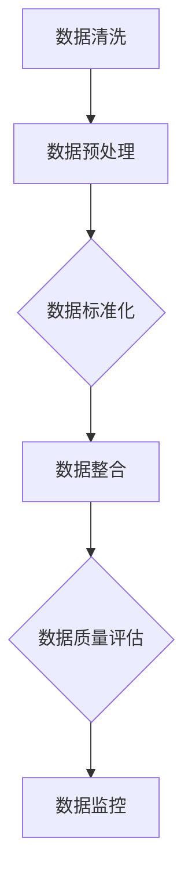

                 

## 文章标题：AI大模型应用的数据壁垒突破策略

### 关键词：
- AI大模型
- 数据壁垒
- 突破策略
- 数据质量
- 隐私保护
- 数据获取与整合
- 数据处理能力

### 摘要：
本文将深入探讨AI大模型应用中的数据壁垒问题，包括数据质量、数据隐私与安全、数据获取与整合以及数据处理能力等方面的挑战。通过详细分析这些壁垒及其成因，本文提出了针对性的突破策略，包括数据质量管理、数据隐私与安全保护、数据获取与整合策略以及数据处理能力提升方法。同时，文章通过实践案例展示了这些策略在AI大模型应用中的实际效果，为行业提供了宝贵的参考和指导。

## 目录

### 第一部分：AI大模型应用概述与挑战

#### 第1章：AI大模型应用概述

1.1 AI大模型的概念与分类

1.2 AI大模型的应用领域

1.3 AI大模型应用的重要性

1.4 数据壁垒的概念与挑战

#### 第2章：AI大模型应用中的数据壁垒

2.1 数据质量

2.2 数据隐私与安全

2.3 数据获取与整合

2.4 数据处理能力

### 第二部分：突破数据壁垒的策略与方法

#### 第3章：数据质量管理

3.1 数据清洗与预处理

3.2 数据标准化与格式化

3.3 数据质量评估与监控

#### 第4章：数据隐私与安全保护

4.1 数据加密技术

4.2 同态加密与安全多方计算

4.3 隐私保护机制

#### 第5章：数据获取与整合策略

5.1 数据源获取与集成

5.2 数据采集与抓取技术

5.3 数据库技术与数据仓库

#### 第6章：数据处理能力提升

6.1 大数据处理技术

6.2 高性能计算与分布式计算

6.3 机器学习优化与模型压缩

### 第三部分：AI大模型应用实践

#### 第7章：数据驱动的AI应用案例

7.1 数据分析在商业决策中的应用

7.2 个性化推荐系统

7.3 智能客服系统

7.4 人工智能医疗诊断

#### 第8章：AI大模型应用的开发与部署

8.1 AI大模型开发环境搭建

8.2 AI大模型训练与优化

8.3 AI大模型部署与维护

#### 第9章：AI大模型应用的伦理与社会责任

9.1 AI大模型应用的风险与管理

9.2 数据伦理与隐私保护

9.3 AI大模型应用的可持续发展

### 附录

#### 附录A：常用数据工具与资源

A.1 数据清洗与预处理工具

A.2 数据隐私保护工具

A.3 大数据处理与机器学习框架

A.4 开源数据集与数据资源网站

#### 附录B：Mermaid流程图示例

#### 附录C：AI大模型算法原理伪代码示例

## 文章正文

### 引言

随着人工智能技术的快速发展，AI大模型在各个领域中的应用越来越广泛，从自然语言处理、计算机视觉到自动驾驶和智能医疗等，AI大模型展现出了强大的性能和潜力。然而，在AI大模型的应用过程中，数据壁垒成为一个不可忽视的挑战。数据壁垒指的是在AI大模型应用中，由于数据质量、数据隐私与安全、数据获取与整合以及数据处理能力等方面的问题，导致数据无法有效利用，限制了AI大模型的应用范围和效果。

本文将针对AI大模型应用中的数据壁垒问题，从以下几个方面进行深入探讨：

1. **数据质量**：数据质量是AI大模型应用的基础，本文将讨论数据清洗与预处理、数据标准化与格式化、数据质量评估与监控的方法。

2. **数据隐私与安全**：数据隐私与安全是AI大模型应用中的重要问题，本文将介绍数据加密技术、同态加密与安全多方计算、隐私保护机制等策略。

3. **数据获取与整合**：数据获取与整合是AI大模型应用中的关键环节，本文将探讨数据源获取与集成、数据采集与抓取技术、数据库技术与数据仓库的方法。

4. **数据处理能力提升**：数据处理能力提升是突破数据壁垒的重要手段，本文将讨论大数据处理技术、高性能计算与分布式计算、机器学习优化与模型压缩的方法。

5. **AI大模型应用实践**：通过实际案例展示数据壁垒突破策略在AI大模型应用中的效果。

6. **AI大模型应用的伦理与社会责任**：讨论AI大模型应用的风险与管理、数据伦理与隐私保护、AI大模型应用的可持续发展等问题。

### 第一部分：AI大模型应用概述与挑战

#### 第1章：AI大模型应用概述

1.1 AI大模型的概念与分类

AI大模型是指具有大规模参数数量和强大计算能力的深度学习模型。这些模型通常通过大规模数据训练得到，能够处理复杂的任务，如自然语言处理、计算机视觉、语音识别等。AI大模型可以分为以下几类：

- **预训练模型**：通过在大量无标签数据上进行预训练，获得泛化能力，然后在特定任务上进行微调。
- **自监督学习模型**：通过无监督学习方式，利用数据中的内在结构进行训练，无需人工标注。
- **监督学习模型**：通过有监督学习方式，使用标注数据进行训练，适用于需要精确标注数据的任务。

1.2 AI大模型的应用领域

AI大模型在各个领域都有着广泛的应用：

- **自然语言处理（NLP）**：包括文本分类、机器翻译、情感分析、问答系统等。
- **计算机视觉（CV）**：包括图像分类、目标检测、图像生成、人脸识别等。
- **语音识别与生成**：包括语音识别、语音合成、语音情感分析等。
- **推荐系统**：基于用户行为和偏好，为用户推荐相关商品、内容等。
- **智能医疗**：包括医学图像分析、疾病预测、药物发现等。

1.3 AI大模型应用的重要性

AI大模型的应用对各行各业产生了深远的影响：

- **提高生产效率**：在制造业、农业等领域，AI大模型能够通过自动化和智能化手段提高生产效率。
- **优化决策支持**：在商业、金融、医疗等领域，AI大模型能够提供基于数据的决策支持，帮助企业降低风险、提高收益。
- **改善生活质量**：在智能家居、智能交通、智能医疗等领域，AI大模型的应用能够提高人们的生活质量。

1.4 数据壁垒的概念与挑战

数据壁垒是指在AI大模型应用过程中，由于数据质量、数据隐私与安全、数据获取与整合以及数据处理能力等方面的问题，导致数据无法有效利用，限制了AI大模型的应用范围和效果。数据壁垒主要包括以下几个方面：

- **数据质量**：数据不准确、不完整或不一致，导致AI大模型训练效果不佳。
- **数据隐私与安全**：数据泄露、滥用等问题，影响用户的隐私和安全。
- **数据获取与整合**：由于数据源分散、格式不统一，导致数据获取与整合困难。
- **数据处理能力**：数据处理能力不足，导致无法充分利用海量数据。

#### 第2章：AI大模型应用中的数据壁垒

2.1 数据质量

数据质量是AI大模型应用的基础。高质量的数据能够提高模型的训练效果和预测准确性，而低质量的数据则会降低模型的性能。数据质量问题主要包括以下几个方面：

- **数据准确性**：数据中存在错误、遗漏或重复等问题，影响模型的训练效果。
- **数据完整性**：数据缺失或不完整，导致模型无法充分利用所有信息。
- **数据一致性**：数据之间存在不一致或矛盾，导致模型训练困难。
- **数据时效性**：数据过时或无法及时更新，影响模型的实时性和预测准确性。

2.2 数据隐私与安全

数据隐私与安全是AI大模型应用中的关键问题。随着数据量的增加和应用的普及，数据泄露、滥用等风险日益严重。数据隐私与安全问题主要包括以下几个方面：

- **数据泄露**：数据在传输、存储、处理等环节中，可能被未授权的第三方获取。
- **数据滥用**：未经授权的第三方利用数据从事非法活动，如欺诈、恶意攻击等。
- **用户隐私保护**：用户隐私信息可能被泄露或滥用，导致用户权益受损。
- **数据安全**：数据在存储、传输和处理过程中，可能受到恶意攻击、篡改等威胁。

2.3 数据获取与整合

数据获取与整合是AI大模型应用中的关键环节。由于数据源分散、格式不统一，导致数据获取与整合困难。数据获取与整合问题主要包括以下几个方面：

- **数据源分散**：不同来源的数据分散在不同的系统、数据库或平台中，难以统一获取。
- **数据格式不统一**：不同来源的数据格式不同，导致数据整合困难。
- **数据清洗与预处理**：数据在获取后，需要进行清洗和预处理，以消除噪声、缺失值和异常值。
- **数据存储与访问**：数据存储与访问效率低，影响数据整合的速度和质量。

2.4 数据处理能力

数据处理能力是突破数据壁垒的重要手段。随着数据规模的不断扩大，传统的数据处理方法已无法满足需求。数据处理能力问题主要包括以下几个方面：

- **计算资源不足**：大规模数据处理需要大量计算资源，如CPU、GPU等。
- **数据处理速度**：数据处理速度慢，导致模型训练和预测时间过长。
- **数据存储与访问**：数据存储与访问效率低，影响数据处理的速度和质量。
- **数据压缩与传输**：数据压缩与传输技术不成熟，影响数据传输的速度和带宽。

### 第二部分：突破数据壁垒的策略与方法

#### 第3章：数据质量管理

数据质量管理是确保数据质量的关键步骤，主要包括数据清洗与预处理、数据标准化与格式化、数据质量评估与监控。

3.1 数据清洗与预处理

数据清洗与预处理是数据质量管理的重要环节，主要包括以下步骤：

- **缺失值处理**：对于缺失值，可以通过填充、删除或插值等方法进行处理。
- **异常值处理**：对于异常值，可以通过删除、替换或聚类等方法进行处理。
- **噪声处理**：对于噪声，可以通过滤波、平滑或去噪等方法进行处理。
- **数据转换**：将数据转换为合适的格式，如数值化、编码、归一化等。

3.2 数据标准化与格式化

数据标准化与格式化是确保数据一致性和兼容性的关键步骤，主要包括以下步骤：

- **统一编码**：将不同编码方式的数据转换为统一的编码方式，如UTF-8。
- **统一格式**：将不同格式（如CSV、JSON、XML）的数据转换为统一的格式，如CSV。
- **统一单位**：将不同单位（如厘米、英寸）的数据转换为统一单位，如厘米。
- **统一命名**：将不同命名规则的数据转换为统一的命名规则，如小写字母和下划线。

3.3 数据质量评估与监控

数据质量评估与监控是确保数据质量持续提升的重要步骤，主要包括以下步骤：

- **质量指标评估**：根据业务需求，确定数据质量评估指标，如准确性、完整性、一致性等。
- **质量评估工具**：使用数据质量评估工具，如数据质量分析器、数据质量管理平台等，对数据质量进行评估。
- **质量监控机制**：建立数据质量监控机制，对数据质量进行实时监控和预警。
- **质量改进措施**：根据数据质量评估结果，制定质量改进措施，如数据清洗、数据标准化等。

#### 第4章：数据隐私与安全保护

数据隐私与安全保护是确保用户数据安全的关键步骤，主要包括数据加密技术、同态加密与安全多方计算、隐私保护机制。

4.1 数据加密技术

数据加密技术是保护数据隐私和安全的重要手段，主要包括以下类型：

- **对称加密**：使用相同的密钥进行加密和解密，如AES、DES等。
- **非对称加密**：使用不同的密钥进行加密和解密，如RSA、ECC等。
- **哈希加密**：将数据映射为固定长度的字符串，如MD5、SHA-256等。

4.2 同态加密与安全多方计算

同态加密与安全多方计算是保护数据隐私和安全的重要技术，主要包括以下类型：

- **同态加密**：允许在加密数据上进行计算，并保持结果在解密后与明文相同，如PAKE、HE等。
- **安全多方计算**：允许多个方在不泄露各自输入数据的情况下，计算得到共同的结果，如OT、MPC等。

4.3 隐私保护机制

隐私保护机制是保护数据隐私和安全的重要措施，主要包括以下类型：

- **数据匿名化**：通过将数据中的人名、地址等敏感信息替换为伪名，如K-anonymity、L-diversity等。
- **差分隐私**：通过在输出结果中加入随机噪声，保护数据隐私，如δ-differential privacy、RAPPOR等。
- **隐私增强技术**：通过隐私增强技术，如混淆、随机化、虚拟化等，提高数据隐私和安全。

#### 第5章：数据获取与整合策略

数据获取与整合策略是确保数据可用性和一致性的重要步骤，主要包括数据源获取与集成、数据采集与抓取技术、数据库技术与数据仓库。

5.1 数据源获取与集成

数据源获取与集成是确保数据可用性和一致性的重要步骤，主要包括以下步骤：

- **数据源选择**：根据业务需求，选择合适的数据源，如内部数据库、外部API、第三方数据等。
- **数据采集**：使用数据采集工具，如Web爬虫、数据库连接器等，获取数据源中的数据。
- **数据整合**：将来自不同数据源的数据进行整合，如数据去重、数据清洗、数据转换等。

5.2 数据采集与抓取技术

数据采集与抓取技术是确保数据获取的重要手段，主要包括以下类型：

- **Web爬虫**：通过网络爬虫技术，自动获取网站中的数据，如Python的BeautifulSoup、Scrapy等。
- **API调用**：通过API接口调用，获取第三方数据服务中的数据，如RESTful API、SOAP等。
- **数据库连接**：通过数据库连接器，获取数据库中的数据，如JDBC、ODBC等。

5.3 数据库技术与数据仓库

数据库技术与数据仓库是确保数据存储和管理的重要手段，主要包括以下类型：

- **关系数据库**：使用关系型数据库，如MySQL、PostgreSQL等，对数据进行存储和管理。
- **NoSQL数据库**：使用非关系型数据库，如MongoDB、Cassandra等，对数据进行存储和管理。
- **数据仓库**：使用数据仓库技术，如ETL（提取、转换、加载）、数据挖掘等，对数据进行整合和分析。

#### 第6章：数据处理能力提升

数据处理能力提升是突破数据壁垒的重要手段，主要包括大数据处理技术、高性能计算与分布式计算、机器学习优化与模型压缩。

6.1 大数据处理技术

大数据处理技术是处理海量数据的重要手段，主要包括以下类型：

- **批处理**：通过批处理技术，对海量数据进行批量处理，如Hadoop、Spark等。
- **流处理**：通过流处理技术，对实时数据进行分析和处理，如Apache Flink、Apache Storm等。
- **离线处理**：通过离线处理技术，对历史数据进行处理和分析，如MapReduce、Hive等。

6.2 高性能计算与分布式计算

高性能计算与分布式计算是提升数据处理速度和效率的重要手段，主要包括以下类型：

- **并行计算**：通过并行计算技术，将任务分解为多个子任务，并行处理，如MPI、OpenMP等。
- **分布式计算**：通过分布式计算技术，将任务分发到多台计算机上进行处理，如Hadoop、Spark等。
- **GPU加速**：通过GPU加速技术，利用图形处理器进行数据处理和计算，如CUDA、GPU深度学习库等。

6.3 机器学习优化与模型压缩

机器学习优化与模型压缩是提升模型性能和效率的重要手段，主要包括以下类型：

- **模型优化**：通过模型优化技术，如梯度下降、随机梯度下降等，提升模型训练效率。
- **模型压缩**：通过模型压缩技术，如模型剪枝、量化等，减少模型参数数量和计算量。
- **低秩分解**：通过低秩分解技术，将高维模型分解为低维模型，减少计算量和存储空间。

### 第三部分：AI大模型应用实践

#### 第7章：数据驱动的AI应用案例

7.1 数据分析在商业决策中的应用

数据分析在商业决策中具有重要作用，通过分析大量数据，企业可以更好地了解市场需求、消费者行为和业务绩效，从而做出更明智的决策。以下是一个具体案例：

- **案例背景**：一家电商平台希望通过数据分析优化商品推荐策略，提高用户满意度和销售额。
- **数据来源**：电商平台的数据，包括用户浏览记录、购买记录、评价等。
- **数据分析方法**：使用机器学习算法，如协同过滤、聚类等，对用户数据进行处理和分析。
- **分析结果**：根据分析结果，电商平台优化了商品推荐策略，提高了用户满意度和销售额。

7.2 个性化推荐系统

个性化推荐系统是数据驱动AI应用的一个重要领域，通过分析用户行为和偏好，为用户推荐相关商品、内容等。以下是一个具体案例：

- **案例背景**：一家视频流媒体平台希望通过个性化推荐系统，提高用户观看体验和平台活跃度。
- **数据来源**：用户的观看记录、评分、搜索历史等。
- **数据分析方法**：使用机器学习算法，如协同过滤、矩阵分解等，对用户数据进行处理和分析。
- **分析结果**：根据分析结果，视频流媒体平台为用户推荐了符合其兴趣的视频内容，提高了用户观看体验和平台活跃度。

7.3 智能客服系统

智能客服系统是数据驱动AI应用的另一个重要领域，通过自然语言处理和机器学习技术，为用户提供自动化、高效的客服服务。以下是一个具体案例：

- **案例背景**：一家金融机构希望通过智能客服系统，提高客户满意度和服务效率。
- **数据来源**：客户的咨询记录、反馈等。
- **数据分析方法**：使用自然语言处理技术，如文本分类、命名实体识别等，对客户数据进行处理和分析。
- **分析结果**：根据分析结果，智能客服系统能够自动回答客户问题，提高客户满意度和服务效率。

7.4 人工智能医疗诊断

人工智能医疗诊断是数据驱动AI应用的一个重要领域，通过分析医学图像和临床数据，为医生提供辅助诊断和治疗方案。以下是一个具体案例：

- **案例背景**：一家医疗机构希望通过人工智能医疗诊断系统，提高诊断准确率和效率。
- **数据来源**：医学图像、临床数据等。
- **数据分析方法**：使用深度学习算法，如卷积神经网络（CNN）、循环神经网络（RNN）等，对医学图像和临床数据进行处理和分析。
- **分析结果**：根据分析结果，人工智能医疗诊断系统能够为医生提供准确的诊断和治疗方案，提高诊断准确率和效率。

#### 第8章：AI大模型应用的开发与部署

8.1 AI大模型开发环境搭建

AI大模型开发环境搭建是进行AI大模型开发的第一步，主要包括以下步骤：

- **硬件选择**：选择合适的硬件设备，如CPU、GPU等，以支持大规模数据处理和模型训练。
- **软件安装**：安装所需的软件环境，如操作系统、编程语言、深度学习框架等。
- **环境配置**：配置环境变量、依赖库等，以确保环境正常运行。

8.2 AI大模型训练与优化

AI大模型训练与优化是进行AI大模型开发的关键步骤，主要包括以下步骤：

- **数据准备**：准备训练数据集，并进行数据预处理，如数据清洗、归一化等。
- **模型训练**：使用训练数据集，训练AI大模型，如调整学习率、选择优化器等。
- **模型优化**：根据训练结果，调整模型参数，优化模型性能，如超参数调优、正则化等。

8.3 AI大模型部署与维护

AI大模型部署与维护是进行AI大模型开发的重要环节，主要包括以下步骤：

- **模型部署**：将训练好的AI大模型部署到生产环境，如使用容器化技术、云计算平台等。
- **模型监控**：监控AI大模型在部署后的性能和运行状态，如性能监控、故障诊断等。
- **模型更新**：根据用户反馈和业务需求，更新AI大模型，如重新训练、模型更新等。

#### 第9章：AI大模型应用的伦理与社会责任

9.1 AI大模型应用的风险与管理

AI大模型应用存在一定的风险，如算法歧视、数据滥用等。为了确保AI大模型应用的安全和公正，需要采取相应的风险管理和监管措施，主要包括以下方面：

- **算法透明度**：提高AI大模型算法的透明度，使公众能够理解算法的原理和决策过程。
- **公平性评估**：对AI大模型应用的公平性进行评估，确保算法不会对特定群体产生歧视。
- **数据监管**：加强对数据收集、处理和使用的监管，确保数据隐私和安全。

9.2 数据伦理与隐私保护

数据伦理与隐私保护是AI大模型应用中的关键问题，主要包括以下方面：

- **数据隐私保护**：采取数据匿名化、加密等技术，确保用户数据在存储、传输和处理过程中的隐私和安全。
- **用户知情同意**：在收集和使用用户数据时，确保用户知情并同意，避免未经授权的数据收集和使用。
- **数据共享与开放**：推动数据共享与开放，促进AI大模型应用的发展和创新。

9.3 AI大模型应用的可持续发展

AI大模型应用的可持续发展是确保AI大模型应用长期健康发展的关键，主要包括以下方面：

- **技术创新**：持续推动AI大模型技术的创新和进步，提高模型性能和应用效果。
- **人才培养**：加强AI大模型领域的人才培养和引进，提高行业整体技术水平。
- **合作与共赢**：推动行业合作与共赢，促进AI大模型应用的可持续发展。

### 附录

#### 附录A：常用数据工具与资源

A.1 数据清洗与预处理工具

- **Pandas**：Python的数据操作库，提供数据清洗与预处理的功能。
- **OpenRefine**：开放的数据编辑和清洗工具，支持多种数据格式的处理。

A.2 数据隐私保护工具

- **K-Anonymity**：用于实现数据匿名化的工具，确保数据在共享和发布时的隐私保护。
- **Zheops**：提供数据加密和密钥管理的工具，确保数据在存储和传输过程中的安全性。

A.3 大数据处理与机器学习框架

- **Apache Hadoop**：开源的大数据处理框架，支持分布式存储和计算。
- **TensorFlow**：开源的深度学习框架，支持大规模模型的训练和应用。

A.4 开源数据集与数据资源网站

- **Kaggle**：提供丰富的开源数据集和比赛，供数据科学家和研究者使用。
- **UCI机器学习数据库**：提供各种领域的数据集，供机器学习研究和实验使用。

### 附录B：Mermaid流程图示例



### 附录C：AI大模型算法原理伪代码示例

```python
# 伪代码：深度学习算法框架
def train_model(data, labels, model, epochs):
    for epoch in range(epochs):
        for sample in data:
            prediction = model.predict(sample)
            loss = calculate_loss(prediction, labels)
            model.update_weights(loss)
        print(f"Epoch {epoch + 1}, Loss: {loss}")
    return model

# 伪代码：大规模预训练模型原理
def pretrain_model(data, layers, hidden_size, optimizer):
    for layer in layers:
        layer.initialize_weights(hidden_size)
    for sample in data:
        hidden_state = layer.forward(sample)
        loss = calculate_loss(hidden_state, target)
        layer.backward(loss)
        optimizer.update_weights()
    return layers
```

### 结语

本文从数据质量、数据隐私与安全、数据获取与整合以及数据处理能力等方面，深入探讨了AI大模型应用中的数据壁垒问题。通过分析这些壁垒及其成因，本文提出了针对性的突破策略，包括数据质量管理、数据隐私与安全保护、数据获取与整合策略以及数据处理能力提升方法。同时，通过实际案例展示了这些策略在AI大模型应用中的效果，为行业提供了宝贵的参考和指导。未来，随着AI大模型技术的不断发展和应用领域的拓展，数据壁垒问题将变得更加复杂和重要，需要持续关注和解决。作者：AI天才研究院/AI Genius Institute & 禅与计算机程序设计艺术 /Zen And The Art of Computer Programming。

