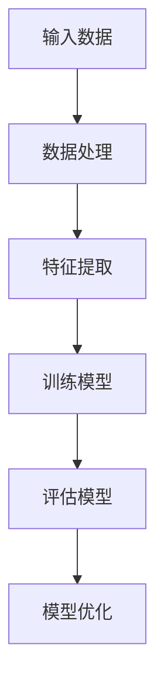
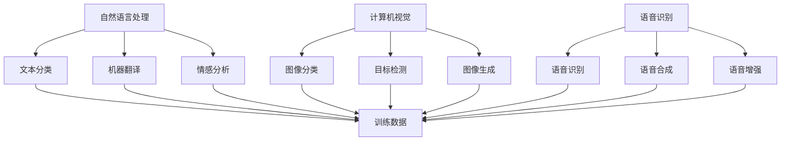
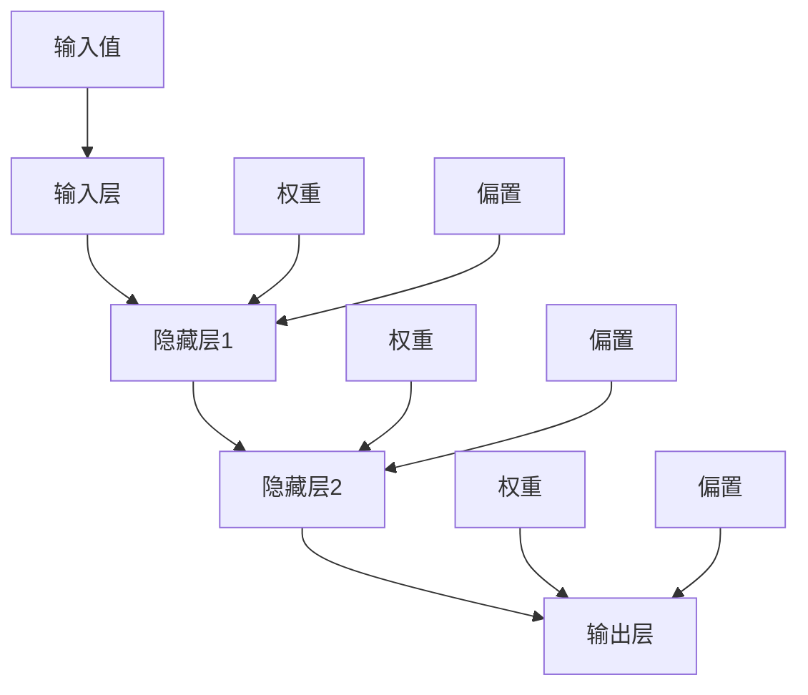
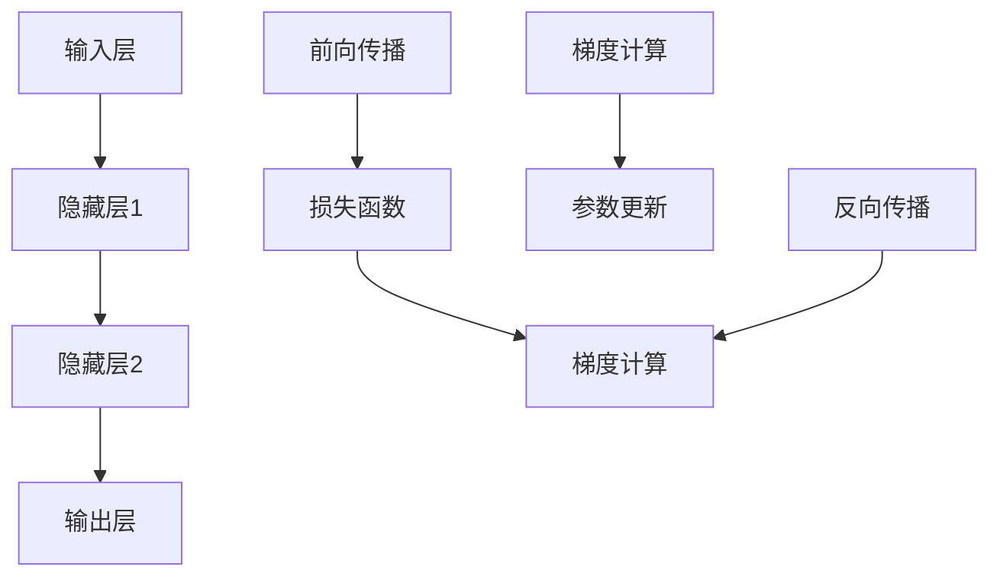
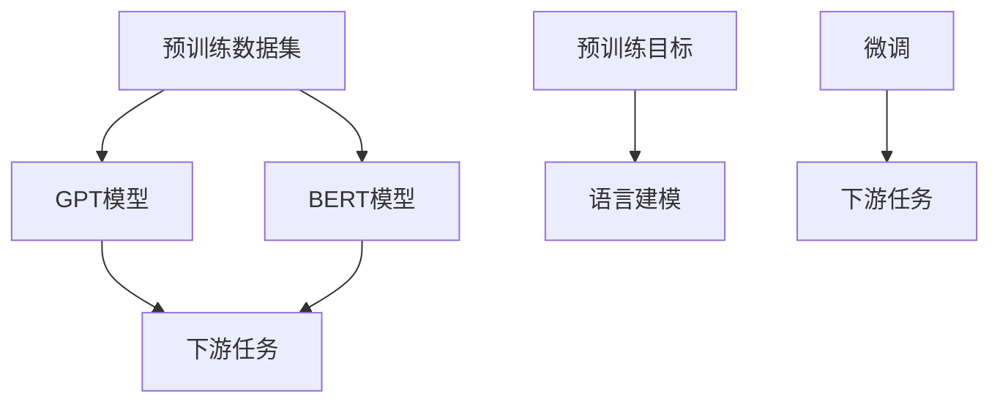
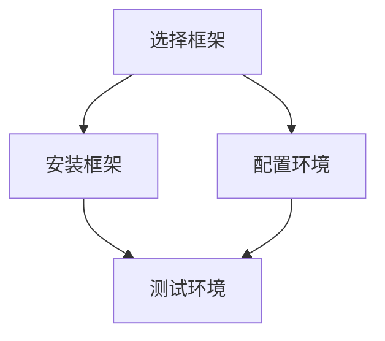
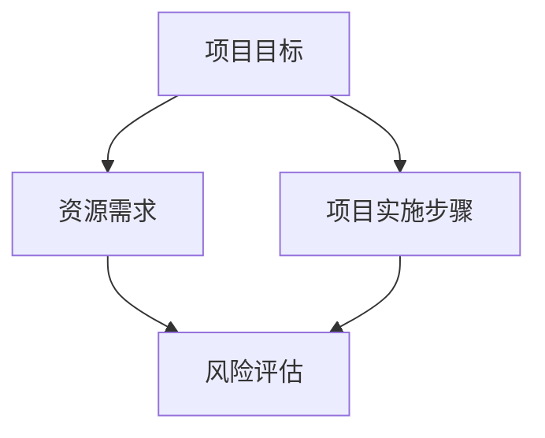
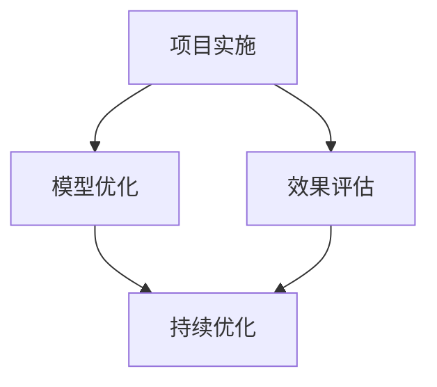

                 

### 文章标题

# 《AI大模型应用的渠道建设与管理》

### 关键词

- AI大模型
- 渠道建设
- 管理策略
- 应用实践
- 推广策略

### 摘要

本文旨在深入探讨AI大模型应用的渠道建设与管理。随着AI技术的不断进步，大模型在各个领域的应用日益广泛，但如何有效建设和管理应用渠道成为亟待解决的问题。本文首先概述了AI大模型的基础知识，包括概念、类型、应用领域及未来发展趋势，随后详细解析了AI大模型的技术原理。接着，本文重点讨论了AI大模型渠道建设策略、推广策略及管理优化方法，并通过具体案例展示了AI大模型在实际应用中的实践。最后，本文提供了AI大模型开发工具与资源，为读者提供了全面的学习和实践指南。

### 《AI大模型应用的渠道建设与管理》目录大纲

## 第一部分：AI大模型概述

### 第1章：AI大模型基础知识

#### 1.1 AI大模型的概念与特点

#### 1.2 AI大模型的类型与应用领域

#### 1.3 AI大模型的挑战与未来发展趋势

### 第2章：AI大模型的技术原理

#### 2.1 神经网络基础

#### 2.2 深度学习算法

#### 2.3 大规模预训练模型

## 第二部分：AI大模型应用的渠道建设

### 第3章：AI大模型渠道建设策略

#### 3.1 渠道建设的目标与原则

#### 3.2 渠道建设的规划与实施

#### 3.3 渠道建设的关键因素

### 第4章：AI大模型渠道推广策略

#### 4.1 推广渠道的选择

#### 4.2 推广内容的创意与制作

#### 4.3 推广活动的策划与执行

### 第5章：AI大模型渠道管理与优化

#### 5.1 渠道管理的方法与工具

#### 5.2 渠道优化的策略与技巧

#### 5.3 渠道评估与反馈机制

## 第三部分：AI大模型应用案例与实践

### 第6章：AI大模型应用案例

#### 6.1 案例一：智能客服系统

#### 6.2 案例二：智能推荐系统

#### 6.3 案例三：智能金融风控系统

### 第7章：AI大模型应用实践

#### 7.1 实践一：AI大模型开发环境搭建

#### 7.2 实践二：AI大模型应用项目规划

#### 7.3 实践三：AI大模型应用项目实施与优化

## 第四部分：附录

### 附录A：AI大模型开发工具与资源

#### A.1 主流深度学习框架对比

#### A.2 AI大模型开发环境配置教程

#### A.3 AI大模型开源项目与社区资源

### 第一部分：AI大模型概述

### 第1章：AI大模型基础知识

#### 1.1 AI大模型的概念与特点

AI大模型（Large-scale AI Models）是指那些规模庞大、参数数量巨大的机器学习模型，它们通过学习海量数据来提高预测和分类的准确性。这些模型通常采用深度学习技术，例如神经网络，通过多层非线性变换来提取数据中的高级特征。

**核心概念与联系**


**Mermaid 流程图**



在AI大模型中，输入数据经过数据处理和特征提取后，被输入到训练模型中。训练模型的过程是通过反向传播算法不断调整模型参数，使模型的预测结果更接近真实值。评估模型的过程则用于验证模型的泛化能力，模型优化则是在评估结果的基础上进一步调整模型参数。

#### 1.2 AI大模型的类型与应用领域

AI大模型根据其应用领域和任务特点可以分为多种类型，主要包括自然语言处理（NLP）、计算机视觉（CV）、语音识别（ASR）等。

**类型与应用领域关系架构**


**Mermaid 流程图**



自然语言处理领域的大模型常用于文本分类、机器翻译和情感分析等任务，而计算机视觉领域的大模型则常用于图像分类、目标检测和图像生成等任务。语音识别领域的大模型则主要用于语音识别、语音合成和语音增强等任务。

#### 1.3 AI大模型的挑战与未来发展趋势

AI大模型在带来巨大潜力的同时，也面临着诸多挑战。首先是数据隐私和安全性问题，大规模的数据集往往包含敏感信息，如何保证数据的安全和隐私是一个重要课题。其次是计算资源和能耗问题，大模型的训练和推理过程需要大量的计算资源和能源，这对环境产生了负面影响。

**未来发展趋势**

- **更高效的算法**：随着算法的不断发展，更高效的训练和推理算法将降低大模型的计算成本。
- **更安全的数据管理**：数据隐私和安全技术的进步将有助于保护大规模数据集的安全。
- **更多的应用领域**：随着AI技术的深入发展，大模型将在更多领域得到应用，例如生物医学、金融等领域。


### 第二部分：AI大模型的技术原理

#### 2.1 神经网络基础

神经网络（Neural Networks）是AI大模型的核心组成部分，它模拟了人脑神经元的工作方式。一个基本的神经网络由输入层、隐藏层和输出层组成，每层由多个神经元（或节点）组成。

**核心概念与联系**


**Mermaid 流程图**



在神经网络中，每个神经元接收来自前一层神经元的输入，通过激活函数进行非线性变换，然后将结果传递到下一层神经元。训练过程就是通过不断调整权重和偏置，使网络输出接近期望值。

#### 2.2 深度学习算法

深度学习（Deep Learning）是神经网络的一种扩展，它通过增加网络深度来提高模型的性能。深度学习算法的核心是反向传播算法（Backpropagation），它通过反向传播误差来更新网络参数。

**核心概念与联系**


**Mermaid 流程图**



在深度学习算法中，输入通过前向传播过程传递到输出层，通过损失函数计算预测值与实际值之间的差距。然后通过反向传播过程计算梯度，并使用梯度下降法更新网络参数。

#### 2.3 大规模预训练模型

大规模预训练模型（Large-scale Pre-trained Models）是在大规模数据集上预先训练好的模型，这些模型具有强大的特征提取能力和泛化能力。常见的预训练模型有GPT、BERT等。

**核心概念与联系**


**Mermaid 流程图**



在预训练过程中，模型在大规模数据集上进行无监督学习，学习语言和知识。然后通过微调（Fine-tuning）过程，将预训练模型应用于具体的下游任务，例如文本分类、问答系统等。

### 第三部分：AI大模型应用的渠道建设

#### 3.1 渠道建设的目标与原则

AI大模型应用的渠道建设旨在确保大模型在各个应用场景中能够高效、稳定、安全地运行。渠道建设的目标主要包括：

- **高效性**：确保模型能够在短时间内完成训练和推理任务。
- **稳定性**：保证模型在不同环境和条件下都能正常运行。
- **安全性**：保护模型和数据的安全，防止泄露和攻击。

渠道建设应遵循以下原则：

- **模块化**：将渠道划分为多个模块，方便管理和维护。
- **可扩展性**：支持渠道的扩展，以适应不断增长的需求。
- **灵活性**：支持不同类型和规模的应用场景。

#### 3.2 渠道建设的规划与实施

渠道建设规划应包括以下步骤：

1. **需求分析**：分析应用场景的需求，确定所需的模型类型、性能指标、安全性要求等。
2. **资源评估**：评估所需的计算资源、存储资源、网络资源等，确保资源充足。
3. **技术选型**：根据需求选择合适的深度学习框架、硬件设备、存储方案等。
4. **架构设计**：设计渠道的架构，包括数据处理模块、模型训练模块、模型推理模块等。
5. **实施与部署**：根据设计文档进行实施和部署，确保渠道正常运行。

#### 3.3 渠道建设的关键因素

渠道建设的关键因素包括：

- **数据质量**：数据是模型训练的基础，高质量的数据能够提高模型的性能。
- **计算资源**：强大的计算资源能够加速模型训练和推理过程。
- **网络稳定性**：稳定的网络环境能够保证渠道的连续性和可靠性。
- **安全性**：确保模型和数据的安全，防止泄露和攻击。

### 第四部分：AI大模型渠道推广策略

#### 4.1 推广渠道的选择

AI大模型的推广渠道主要包括以下几种：

- **学术会议**：通过参加学术会议，展示模型的研究成果，吸引同行关注。
- **技术论坛**：在技术论坛上分享模型的应用案例，与开发者交流经验。
- **社交媒体**：利用社交媒体平台，发布模型的技术文章、案例分析和互动话题。
- **专业网站**：在专业网站上发布技术博客、文档和教程，提供模型的应用指南。

#### 4.2 推广内容的创意与制作

推广内容应具备以下特点：

- **针对性**：根据目标受众的需求和兴趣，定制化内容。
- **专业性**：展示模型的性能、应用场景和优势，提供详细的技术分析。
- **互动性**：鼓励用户参与讨论，提问和分享经验。

推广内容的制作过程包括：

1. **内容策划**：确定推广主题、目标受众和内容形式。
2. **内容创作**：撰写技术文章、制作PPT、视频等。
3. **内容优化**：对内容进行编辑、校对和优化，提高可读性和专业性。

#### 4.3 推广活动的策划与执行

推广活动应包括以下步骤：

1. **活动策划**：确定活动主题、形式、时间和地点。
2. **宣传推广**：通过线上线下渠道宣传推广活动，吸引参与者。
3. **活动执行**：按照策划方案执行活动，确保活动顺利进行。
4. **活动总结**：对活动效果进行总结，收集反馈意见，为下次活动提供参考。

### 第五部分：AI大模型渠道管理与优化

#### 5.1 渠道管理的方法与工具

渠道管理的方法主要包括：

- **数据监控**：实时监控渠道的运行状态，包括数据传输、模型训练和推理等。
- **性能优化**：根据监控数据，对模型和渠道进行性能优化。
- **安全监控**：确保模型和数据的安全，防止泄露和攻击。

渠道管理的工具包括：

- **监控系统**：用于实时监控渠道的运行状态。
- **性能优化工具**：用于分析和优化模型性能。
- **安全工具**：用于检测和防止安全威胁。

#### 5.2 渠道优化的策略与技巧

渠道优化的策略包括：

- **模型优化**：通过调整模型结构、优化算法和超参数，提高模型性能。
- **数据优化**：清洗和预处理数据，提高数据质量和一致性。
- **硬件优化**：选择合适的硬件设备，提高计算和存储性能。

渠道优化的技巧包括：

- **分布式训练**：通过分布式训练加速模型训练过程。
- **模型压缩**：通过模型压缩技术减小模型大小，提高推理速度。
- **数据增强**：通过数据增强技术增加数据多样性，提高模型泛化能力。

#### 5.3 渠道评估与反馈机制

渠道评估的指标包括：

- **性能指标**：如模型准确率、召回率、F1值等。
- **稳定性指标**：如模型运行时间、错误率等。
- **安全性指标**：如数据泄露率、攻击检测率等。

渠道评估的反馈机制包括：

- **用户反馈**：收集用户对模型和应用的评价，了解用户需求。
- **监控数据**：分析渠道的监控数据，发现问题和优化点。
- **定期评估**：定期对渠道进行评估，确保渠道持续优化。

### 第六部分：AI大模型应用案例

#### 6.1 案例一：智能客服系统

**案例背景**

智能客服系统是一种基于AI大模型的智能客服解决方案，它能够自动处理用户咨询，提高客服效率和用户体验。

**应用场景**

智能客服系统广泛应用于在线购物、金融、医疗等领域，能够自动回答用户的问题，提供实时支持。

**模型应用**

- **自然语言处理模型**：用于处理用户输入，提取关键词和语义信息。
- **对话管理模型**：用于管理对话流程，决定下一步的回答策略。
- **文本生成模型**：用于生成自然流畅的回答。

**效果评估**

- **准确率**：智能客服系统能够准确理解用户输入并给出合适的回答。
- **响应速度**：智能客服系统能够在短时间内给出回答，提高客服效率。
- **用户满意度**：用户对智能客服系统的满意度较高，认为其能够提供有用的帮助。

#### 6.2 案例二：智能推荐系统

**案例背景**

智能推荐系统是一种基于AI大模型的推荐解决方案，它能够根据用户的历史行为和兴趣，为用户推荐合适的商品、内容和活动。

**应用场景**

智能推荐系统广泛应用于电商、社交媒体、视频平台等领域，能够提高用户参与度和购买转化率。

**模型应用**

- **协同过滤模型**：用于预测用户对商品的偏好。
- **内容推荐模型**：用于推荐与用户兴趣相关的商品和内容。
- **序列模型**：用于分析用户行为序列，预测用户下一步行为。

**效果评估**

- **准确率**：智能推荐系统能够准确预测用户的兴趣和需求。
- **覆盖率**：智能推荐系统能够覆盖更多用户，提高推荐多样性。
- **用户满意度**：用户对智能推荐系统的满意度较高，认为其能够提供有价值的推荐。

#### 6.3 案例三：智能金融风控系统

**案例背景**

智能金融风控系统是一种基于AI大模型的金融风险防控解决方案，它能够实时监控和分析金融交易数据，识别潜在的欺诈行为和风险。

**应用场景**

智能金融风控系统广泛应用于银行、支付、保险等领域，能够提高风险识别效率和准确性。

**模型应用**

- **异常检测模型**：用于检测交易数据中的异常行为。
- **分类模型**：用于分类交易数据，识别欺诈行为。
- **预测模型**：用于预测潜在的风险，提前采取预防措施。

**效果评估**

- **准确率**：智能金融风控系统能够准确识别欺诈行为，提高风险防控能力。
- **响应速度**：智能金融风控系统能够在短时间内处理大量交易数据，快速识别风险。
- **用户满意度**：用户对智能金融风控系统的满意度较高，认为其能够提供有效的风险防控。

### 第七部分：AI大模型应用实践

#### 7.1 实践一：AI大模型开发环境搭建

**背景介绍**

在AI大模型的应用实践中，开发环境的搭建是第一步。一个良好的开发环境能够提高开发效率，保证模型的训练和推理过程顺利进行。

**核心概念与联系**


**Mermaid 流程图**



在开发环境搭建过程中，首先需要选择合适的深度学习框架，例如TensorFlow、PyTorch等。然后根据框架的要求安装和配置环境，包括Python、CUDA、cuDNN等。最后，通过测试验证环境是否正常运行。

**核心算法原理讲解**

```python
# 以TensorFlow为例，安装和配置环境
!pip install tensorflow

# 检查CUDA版本
import tensorflow as tf
print(tf.reduce_sum(tf.random.normal([1000, 1000])))

# 检查cuDNN版本
import tensorflow as tf
print(tf.__version__)

# 测试环境
!python test_environment.py
```

**数学模型和公式**


在搭建开发环境时，需要了解深度学习框架的基本数学模型和公式，例如卷积神经网络（CNN）的卷积运算、反向传播算法等。这些数学模型和公式是构建和优化AI大模型的基础。

**举例说明**

```python
# 以PyTorch为例，搭建开发环境
!pip install torch torchvision

# 测试环境
import torch
print(torch.__version__)

# 测试GPU支持
print(torch.cuda.is_available())
```

**最佳实践 tips**

- 选择合适的深度学习框架，根据项目的需求和性能要求进行选择。
- 安装和配置环境时，注意版本兼容性，避免冲突。
- 在测试环境时，确保GPU和CUDA正确安装，提高训练和推理速度。

**注意事项**

- 开发环境搭建过程中，可能遇到各种问题，如依赖库冲突、环境配置错误等。及时查阅官方文档和社区资源，寻求帮助。
- 开发环境搭建完成后，定期更新依赖库和框架，确保环境的稳定性。

**拓展阅读**

- [TensorFlow官方文档](https://www.tensorflow.org/)
- [PyTorch官方文档](https://pytorch.org/)
- [CUDA官方文档](https://docs.nvidia.com/cuda/)

#### 7.2 实践二：AI大模型应用项目规划

**背景介绍**

在AI大模型的应用项目中，项目规划是关键环节。一个良好的项目规划能够明确项目目标、资源需求和实施步骤，确保项目的顺利进行。

**核心概念与联系**


**Mermaid 流程图**



在项目规划过程中，首先需要明确项目目标，包括预期性能、应用场景和业务需求。然后分析资源需求，包括计算资源、存储资源和人力资源等。接着制定项目实施步骤，确保项目按计划进行。最后进行风险评估，识别潜在风险并制定应对策略。

**核心算法原理讲解**

项目规划的核心在于项目管理的理论和方法，包括项目目标设定、资源分配、进度控制和质量保障等。

**数学模型和公式**


在项目规划中，可以使用一些数学模型和公式，如关键路径法（CPM）、甘特图、项目评估和选择方法等。

**举例说明**

```python
# 项目目标设定
project_goals = {
    "performance": "模型准确率达到95%",
    "application": "应用于智能客服系统",
    "business": "提高客服效率和用户满意度"
}

# 资源需求分析
resource_requirements = {
    "computational": "2个GPU服务器",
    "storage": "100TB存储空间",
    "human": "3个开发人员，2个数据科学家"
}

# 项目实施步骤
project_steps = [
    "需求分析",
    "环境搭建",
    "数据收集与处理",
    "模型训练与优化",
    "模型部署与测试",
    "项目评估与总结"
]

# 风险评估
risks = {
    "resource": "GPU服务器故障",
    "data": "数据质量不高",
    "time": "项目进度延误"
}
```

**最佳实践 tips**

- 明确项目目标，确保项目聚焦于核心业务需求。
- 分析资源需求，合理分配资源，避免资源浪费。
- 制定详细的实施步骤，确保项目按计划进行。
- 进行风险评估，提前识别和应对潜在风险。

**注意事项**

- 项目规划过程中，可能遇到资源不足、时间紧迫等问题。及时调整规划，确保项目顺利进行。
- 项目规划应具有灵活性，根据实际情况进行调整。

**拓展阅读**

- [项目管理基础](https://www.pmi.org/learning/library/project-management-basics-3096)
- [项目规划与控制](https://www.books.com.tw/products/0010760630)
- [风险管理的最佳实践](https://www.isaca.org/knowledge-areas/risk)

#### 7.3 实践三：AI大模型应用项目实施与优化

**背景介绍**

在AI大模型的应用项目中，项目实施与优化是关键环节。一个良好的实施与优化过程能够确保模型在实际应用中达到预期效果，持续改进模型的性能和稳定性。

**核心概念与联系**


**Mermaid 流程图**



在项目实施过程中，首先按照项目规划进行模型训练和部署，确保模型能够在实际应用中运行。然后进行模型优化，通过调整模型结构、算法和参数，提高模型性能。效果评估是关键环节，通过评估模型在实际应用中的表现，发现问题和优化点。最后，进行持续优化，不断改进模型，确保其在实际应用中的持续稳定运行。

**核心算法原理讲解**

模型优化主要涉及以下几个方面：

1. **模型结构优化**：通过调整网络结构，增加或减少层�数、节点数等，提高模型性能。
2. **算法优化**：通过优化训练算法，如随机梯度下降（SGD）、Adam等，提高训练效率和准确性。
3. **参数优化**：通过调整模型参数，如学习率、正则化参数等，提高模型性能。

**数学模型和公式**


在模型优化过程中，可以使用一些数学模型和公式，如梯度下降法、动量法、权重共享等。

**举例说明**

```python
# 模型结构优化
from tensorflow.keras.models import Sequential
from tensorflow.keras.layers import Dense, Conv2D, MaxPooling2D, Flatten

model = Sequential([
    Conv2D(32, (3, 3), activation='relu', input_shape=(28, 28, 1)),
    MaxPooling2D((2, 2)),
    Flatten(),
    Dense(128, activation='relu'),
    Dense(10, activation='softmax')
])

# 算法优化
from tensorflow.keras.optimizers import SGD
from tensorflow.keras.callbacks import EarlyStopping

optimizer = SGD(learning_rate=0.01, momentum=0.9)
early_stopping = EarlyStopping(monitor='val_loss', patience=5)

# 参数优化
from tensorflow.keras.optimizers import Adam
from tensorflow.keras.callbacks import ReduceLROnPlateau

optimizer = Adam(learning_rate=0.001)
reduce_lr = ReduceLROnPlateau(monitor='val_loss', factor=0.1, patience=5)
```

**最佳实践 tips**

- 在模型优化过程中，要平衡模型复杂度和训练时间，避免过拟合。
- 选择合适的优化算法和参数，根据实际情况进行调整。
- 定期评估模型性能，及时发现问题并进行优化。

**注意事项**

- 模型优化过程中，可能遇到过拟合、训练时间过长等问题。及时调整模型结构、算法和参数，确保模型性能。
- 模型优化需要多次尝试和调整，耐心和经验是关键。

**拓展阅读**

- [深度学习模型优化](https://www.deeplearningbook.org/chapter/export-models/)
- [神经网络优化技巧](https://arxiv.org/abs/1904.09179)
- [模型优化工具与库](https://keras.io/callbacks/)

### 附录A：AI大模型开发工具与资源

#### A.1 主流深度学习框架对比

| 框架 | 优点 | 缺点 | 应用场景 |
| --- | --- | --- | --- |
| TensorFlow | 开源、支持多种平台、丰富的生态系统 | 学习曲线较陡、资源消耗大 | 工业级应用、研究项目 |
| PyTorch | 易于理解、动态图计算、灵活性强 | 内存占用较高、支持性不如TensorFlow | 学术研究、工业项目 |
| Keras | 高层抽象、易于使用、基于TensorFlow和Theano | 功能有限、底层支持不足 | 快速原型开发、入门项目 |
| Theano | 支持GPU、动态图计算、自动微分 | 开发较新、社区支持不足 | 研究项目、原型开发 |
| MXNet | 支持多种语言、灵活的接口、高性能 | 学习曲线较陡、社区支持不足 | 工业级应用、高性能计算 |

#### A.2 AI大模型开发环境配置教程

1. **环境准备**

   - 安装Python（推荐3.8及以上版本）
   - 安装依赖库（如NumPy、Pandas等）
   - 安装深度学习框架（如TensorFlow、PyTorch等）

2. **配置CUDA**

   - 安装CUDA（与GPU型号和驱动程序兼容）
   - 配置环境变量（如`CUDA_HOME`、`LD_LIBRARY_PATH`等）

3. **安装深度学习框架**

   - TensorFlow

     ```python
     pip install tensorflow
     ```

   - PyTorch

     ```python
     pip install torch torchvision
     ```

4. **验证安装**

   - TensorFlow

     ```python
     import tensorflow as tf
     print(tf.reduce_sum(tf.random.normal([1000, 1000])))
     ```

   - PyTorch

     ```python
     import torch
     print(torch.__version__)
     print(torch.cuda.is_available())
     ```

#### A.3 AI大模型开源项目与社区资源

1. **开源项目**

   - TensorFlow官方项目：[TensorFlow GitHub](https://github.com/tensorflow/tensorflow)
   - PyTorch官方项目：[PyTorch GitHub](https://github.com/pytorch/pytorch)
   - Keras官方项目：[Keras GitHub](https://github.com/keras-team/keras)
   - Theano官方项目：[Theano GitHub](https://github.com/Theano/Theano)
   - MXNet官方项目：[MXNet GitHub](https://github.com/dmlc/mxnet)

2. **社区资源**

   - TensorFlow社区：[TensorFlow Community](https://www.tensorflow.org/learn)
   - PyTorch社区：[PyTorch Community](https://pytorch.org/tutorials/)
   - Keras社区：[Keras Community](https://keras.io/community/)
   - Theano社区：[Theano Community](https://groups.google.com/forum/#!forum/theano-users)
   - MXNet社区：[MXNet Community](https://mxnet.incubator.apache.org/user_guide/get_started.html)

### 附录B：AI大模型应用与发展的未来趋势

#### 未来的挑战

- **数据隐私与安全**：随着AI大模型应用范围的扩大，数据隐私和安全问题日益突出。如何确保数据安全、保护用户隐私成为关键挑战。
- **计算资源消耗**：AI大模型的训练和推理过程需要大量的计算资源，如何提高计算效率、降低能源消耗成为重要议题。
- **算法公平性与透明性**：AI大模型在决策过程中可能存在偏见和歧视，如何提高算法的公平性与透明性，使其更好地服务于人类社会是一个重要问题。

#### 未来的趋势

- **多模态AI大模型**：未来AI大模型将能够处理多种类型的数据，如文本、图像、音频和视频，实现跨模态的信息融合。
- **边缘计算与分布式AI**：随着物联网和智能设备的普及，边缘计算和分布式AI将成为重要趋势，实现AI大模型在边缘设备的部署和运行。
- **自动化模型优化与开发**：未来将出现更多的自动化工具和框架，实现模型优化、超参数调整和代码生成，降低开发门槛。

### 总结

AI大模型应用的渠道建设与管理是一个复杂而富有挑战的过程。本文从基础知识、技术原理、渠道建设、推广策略、管理与优化等多个方面进行了全面探讨。通过具体案例和实践，展示了AI大模型在实际应用中的价值。未来，随着AI技术的不断进步，AI大模型将在更多领域发挥重要作用，为人类社会带来更多创新和进步。希望本文能为读者提供有价值的参考和启示。作者：AI天才研究院/AI Genius Institute & 禅与计算机程序设计艺术 /Zen And The Art of Computer Programming。

