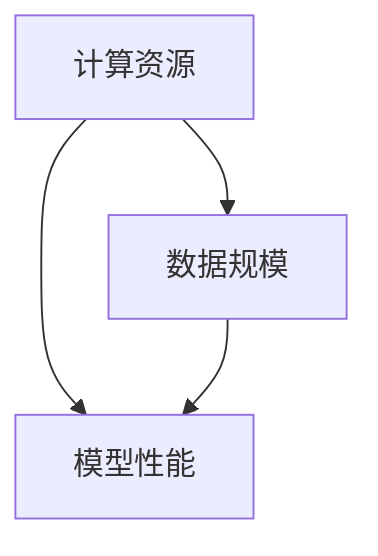
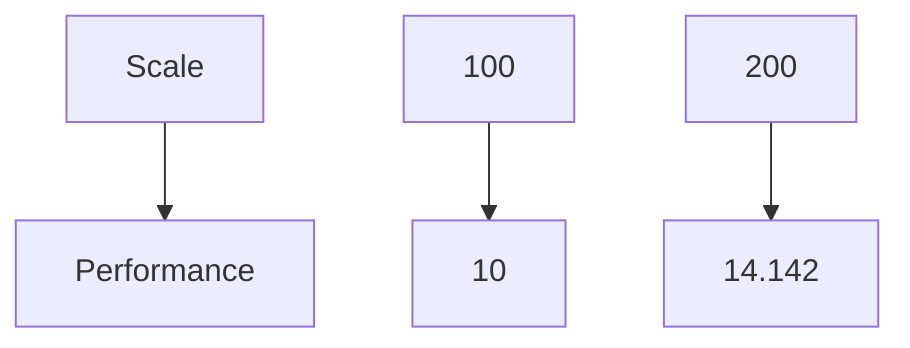

                 

### 文章标题

AI大模型的规模化定律(Scaling Law)的实现：算力提升+高质量大数据+更好的压缩算法### 关键词

- AI大模型
- 规模化定律
- 算力提升
- 高质量大数据
- 压缩算法### 摘要

本文将深入探讨AI大模型的规模化定律（Scaling Law），即如何通过算力的提升、高质量大数据的利用以及更好的压缩算法来实现大模型的优化和性能提升。首先，我们将介绍规模化定律的核心概念和其基本原理，包括计算资源、数据规模与模型性能之间的关系。接着，我们将详细阐述规模化定律的实现机制，通过计算资源提升、数据规模扩大和压缩算法的优化来展示模型性能的显著提升。此外，我们将使用具体的数学模型和公式，以及详细的伪代码示例，进一步阐述规模化定律的工作原理。最后，我们将通过实际案例和最佳实践，为读者提供具体的操作指南和实用技巧，帮助他们在AI大模型开发中更好地应用规模化定律。### 第一部分：AI大模型的规模化定律概述

#### 核心概念与联系

规模化定律是人工智能领域的一个关键概念，它主要描述了随着数据规模和计算资源的增加，模型性能将如何提升。为了更好地理解这一概念，我们需要先介绍三个核心要素：计算资源、数据规模和模型性能。

- **计算资源**：指用于训练和推理AI模型的硬件设施，如CPU、GPU、TPU等。计算资源的提升可以显著加快模型的训练速度，提高模型的性能。
  
- **数据规模**：指用于训练AI模型的样本数量和质量。数据规模的增加使得模型可以学习到更多的特征，提高模型的泛化能力。

- **模型性能**：指模型在特定任务上的准确度、速度和泛化能力。模型性能的提升是规模化定律的核心目标。

这三个要素之间有着紧密的联系。计算资源的提升可以为模型提供更强的训练能力，而数据规模的扩大则可以为模型提供更多的训练样本。最终，这些因素共同作用，使得模型性能得到显著提升。

为了更好地理解这些概念之间的关系，我们可以使用一个Mermaid流程图来展示它们之间的联系：



#### 核心算法原理讲解

规模化定律的实现依赖于以下几个方面：

1. **计算资源提升**：随着计算资源的增加，模型可以处理更大的数据集，更复杂的神经网络架构，从而提高模型性能。

    以下是计算资源提升后的模型训练过程的伪代码：

    ```python
    model = create_model()
    optimizer = create_optimizer()
    for epoch in range(num_epochs):
        for batch in data_loader:
            optimizer.zero_grad()
            output = model(batch)
            loss = compute_loss(output, target)
            loss.backward()
            optimizer.step()
    ```

2. **数据规模扩大**：数据规模的增加使得模型能够学习到更丰富的特征，提高泛化能力。

    以下是数据规模扩大后的模型训练过程的伪代码：

    ```python
    expanded_data = expand_dataset(original_dataset)
    model = create_model()
    optimizer = create_optimizer()
    for epoch in range(num_epochs):
        for batch in expanded_data_loader:
            optimizer.zero_grad()
            output = model(batch)
            loss = compute_loss(output, target)
            loss.backward()
            optimizer.step()
    ```

3. **更好的压缩算法**：通过压缩算法，减少模型大小，加快模型推理速度，提高模型部署效率。

    以下是使用压缩算法的模型训练过程的伪代码：

    ```python
    model = create_model()
    optimizer = create_optimizer()
    for epoch in range(num_epochs):
        for batch in data_loader:
            optimizer.zero_grad()
            output = model(batch)
            loss = compute_loss(output, target)
            loss.backward()
            optimizer.step()
    model = compress_model(model)
    ```

#### 数学模型和数学公式 & 详细讲解 & 举例说明

规模化定律可以用以下数学公式表示：

\[ Performance = f(Scale) \]

其中，\( Performance \) 代表模型性能，\( Scale \) 代表模型规模（包括计算资源、数据规模和模型复杂度）。

#### 举例说明

假设我们有一个图像分类模型，其性能 \( Performance \) 与模型规模 \( Scale \) 的关系如下：

\[ Performance = \sqrt{Scale} \]

这意味着，如果模型规模增加一倍，模型性能将提升到原来的根号二倍。例如，如果原始模型规模为100，性能为10，那么增加一倍后的模型规模为200，性能将提升到约14.142。

为了更直观地理解这个关系，我们可以绘制一个简单的图表：



通过这个图表，我们可以看到，随着模型规模的增加，模型性能也随之提升，但提升的速度逐渐减缓。这表明，规模化定律在提高模型性能方面具有显著的优势，但也需要合理的计算资源和数据规模来支持。

总之，规模化定律是AI大模型开发中不可或缺的核心原理。通过理解并应用这一原理，我们可以显著提升模型性能，为各种AI应用场景提供更高效、更准确的解决方案。在接下来的部分，我们将深入探讨规模化定律的具体实现机制，包括计算资源提升、数据规模扩大和压缩算法的优化，帮助读者更好地掌握这一核心原理。### 第一部分续：规模化定律的具体实现机制

在了解了规模化定律的核心概念和基本原理后，接下来我们将深入探讨其具体的实现机制。这些机制包括计算资源的提升、数据规模的扩大和更好的压缩算法。通过这些机制的相互作用，我们可以实现大模型的优化和性能提升。

#### 计算资源的提升

计算资源的提升是规模化定律实现的关键因素之一。随着硬件技术的不断发展，计算资源的提升为大规模模型训练和优化提供了强大的支持。以下是计算资源提升对模型性能的具体影响：

1. **加速训练过程**：更强大的计算资源可以加快模型的训练速度。例如，使用GPU或TPU等专用硬件可以显著提高训练效率，减少训练时间。

2. **支持更复杂的模型**：计算资源的提升使得我们能够设计和训练更复杂的模型。这些模型通常包含更多的参数和层，能够捕捉更丰富的特征，从而提高模型的性能。

3. **提高模型精度**：更强大的计算资源可以更精确地优化模型的参数，减少过拟合的风险，提高模型的泛化能力。

为了更好地展示计算资源提升的效果，我们可以使用以下伪代码来描述一个使用更强大计算资源的模型训练过程：

```python
# 使用GPU训练模型
model = create_model_on_gpu()
optimizer = create_optimizer()
for epoch in range(num_epochs):
    for batch in data_loader:
        optimizer.zero_grad()
        output = model(batch)
        loss = compute_loss(output, target)
        loss.backward()
        optimizer.step()
```

在这个例子中，我们使用了GPU来训练模型，这可以显著提高训练速度和性能。

#### 数据规模的扩大

数据规模的扩大是规模化定律实现的另一个关键因素。大规模数据集可以提供更多的样本和特征，使得模型能够更好地泛化。以下是数据规模扩大对模型性能的具体影响：

1. **增强模型泛化能力**：更大的数据集可以减少模型对特定数据集的依赖，提高模型在未知数据上的泛化能力。

2. **捕捉更多特征**：更大的数据集可以提供更多的样本，使得模型能够捕捉到更多的特征，从而提高模型的性能。

3. **减少过拟合风险**：更大的数据集可以降低模型过拟合的风险，提高模型的泛化能力。

为了更好地展示数据规模扩大对模型性能的提升，我们可以使用以下伪代码来描述一个使用更大数据集的模型训练过程：

```python
# 使用更大数据集训练模型
expanded_data = expand_dataset(original_dataset)
model = create_model()
optimizer = create_optimizer()
for epoch in range(num_epochs):
    for batch in expanded_data_loader:
        optimizer.zero_grad()
        output = model(batch)
        loss = compute_loss(output, target)
        loss.backward()
        optimizer.step()
```

在这个例子中，我们使用了一个扩大的数据集来训练模型，这可以显著提高模型的性能。

#### 压缩算法的优化

压缩算法的优化是规模化定律实现的另一个重要因素。通过压缩算法，我们可以减少模型的大小，加快模型的推理速度，提高模型部署的效率。以下是压缩算法优化对模型性能的具体影响：

1. **减少存储需求**：压缩算法可以显著减少模型的存储需求，使得模型更易于存储和传输。

2. **加快推理速度**：压缩算法可以减少模型的推理时间，提高模型在实际应用中的响应速度。

3. **提高部署效率**：压缩算法可以使得模型更易于部署，特别是在资源受限的环境下。

为了更好地展示压缩算法优化对模型性能的提升，我们可以使用以下伪代码来描述一个使用压缩算法的模型训练和推理过程：

```python
# 使用压缩算法训练模型
model = create_model()
optimizer = create_optimizer()
for epoch in range(num_epochs):
    for batch in data_loader:
        optimizer.zero_grad()
        output = model(batch)
        loss = compute_loss(output, target)
        loss.backward()
        optimizer.step()
model = compress_model(model)

# 使用压缩算法进行推理
compressed_model = load_compressed_model()
for batch in inference_data_loader:
    output = compressed_model(batch)
```

在这个例子中，我们首先使用压缩算法训练模型，然后在推理过程中使用压缩模型，这可以显著提高模型部署的效率。

通过计算资源的提升、数据规模的扩大和压缩算法的优化，我们可以实现规模化定律，从而提升大模型的性能。这些机制的相互作用为大规模AI模型开发提供了强有力的支持，使得我们能够设计和实现更高效、更准确的AI系统。### 第二部分：规模化定律在AI大模型开发中的应用与挑战

规模化定律在AI大模型开发中具有显著的应用价值，但同时也面临着一系列挑战。在这一部分，我们将探讨规模化定律在实际应用中的具体实例，分析其中可能遇到的挑战，并提出相应的解决方案。

#### 应用实例

规模化定律在AI大模型开发中的应用已经取得了显著的成果，以下是一些具体的应用实例：

1. **自然语言处理（NLP）**：在NLP领域，规模化定律使得大型语言模型（如GPT-3、BERT等）能够处理更复杂的语言任务，实现更高的准确率和更广泛的泛化能力。例如，OpenAI的GPT-3模型在文本生成、机器翻译、问答系统等方面取得了优异的性能。

2. **计算机视觉**：在计算机视觉领域，规模化定律使得深度学习模型能够处理更大的图像数据集，提取更多的图像特征，从而提高图像分类、目标检测、图像分割等任务的性能。例如，ImageNet大规模图像数据集的发布推动了深度学习在计算机视觉领域的广泛应用。

3. **推荐系统**：在推荐系统领域，规模化定律使得模型能够处理更多的用户和物品数据，实现更精准的推荐。例如，阿里巴巴的推荐系统通过大规模数据集的利用和模型优化，实现了亿级用户的高效推荐。

#### 面临的挑战

尽管规模化定律在AI大模型开发中取得了显著的应用成果，但同时也面临着一系列挑战：

1. **计算资源需求**：规模化定律的实现需要大量的计算资源，特别是在训练大型模型时。随着模型规模的扩大，计算资源的消耗呈指数级增长，这给计算资源的管理和调度带来了巨大的挑战。

2. **数据质量和多样性**：规模化定律的有效性依赖于高质量和多样化的数据集。然而，在实际应用中，数据质量和多样性往往难以保证。数据缺失、数据偏见和噪声等问题可能会影响模型的性能和泛化能力。

3. **模型压缩和优化**：规模化定律要求对模型进行压缩和优化，以适应有限的计算资源和存储空间。然而，压缩和优化过程可能会导致模型性能的损失，如何在保证性能的同时实现有效的压缩是一个重要的挑战。

#### 解决方案

针对规模化定律在AI大模型开发中面临的挑战，我们可以采取以下解决方案：

1. **分布式计算**：通过分布式计算技术，可以将大规模模型的训练和推理任务分解为多个子任务，分配到多个计算节点上执行。这可以显著降低单台设备的计算需求，提高计算效率和性能。

2. **数据增强和预处理**：通过数据增强和预处理技术，可以改善数据质量和多样性，提高模型对未知数据的泛化能力。例如，可以使用数据扩充、数据清洗和数据标注等技术来提高数据的质量。

3. **模型压缩和剪枝**：通过模型压缩和剪枝技术，可以减少模型的大小和计算复杂度，同时保证模型的性能。例如，可以使用深度可分离卷积、权重共享、剪枝等技术来压缩模型。

4. **迁移学习和零样本学习**：通过迁移学习和零样本学习技术，可以从已有的模型或知识中提取有价值的信息，减少对大规模数据的依赖。这可以降低模型对数据质量和多样性的要求，提高模型的泛化能力。

通过以上解决方案，我们可以更好地应对规模化定律在AI大模型开发中面临的挑战，实现更高效、更准确的AI系统。### 第三部分：规模化定律的技术挑战与未来趋势

在规模化定律的实践中，我们不仅面临着当前的技术挑战，也需前瞻性地考虑未来的发展趋势。以下将详细探讨这些挑战，并展望规模化定律在AI领域的未来前景。

#### 技术挑战

1. **计算资源的有限性**：虽然硬件技术不断进步，但计算资源仍然有限。特别是对于企业和研究机构来说，部署大规模计算集群的成本高昂。解决这一问题的方法之一是采用分布式计算和云计算服务，通过利用现有的资源池来提高计算效率。

2. **数据质量和多样性**：规模化定律依赖于高质量和多样化的数据。然而，数据质量参差不齐、数据标注困难和数据多样性不足等问题仍然存在。为了提高数据质量，可以采用自动化数据清洗工具和更精确的数据标注方法。此外，通过数据增强和合成技术，可以创造更多的数据样本，以丰富数据集。

3. **模型压缩与存储**：随着模型规模的扩大，模型的存储和部署成为难题。为了解决这个问题，研究人员正在探索各种压缩算法，如量化、剪枝、知识蒸馏等，以减少模型大小，同时保持较高的性能。

4. **能耗效率**：大规模模型的训练和推理过程消耗大量能源，这引发了对能耗效率的担忧。未来，绿色AI和节能算法的开发将是重要的研究方向，例如使用更高效的硬件和优化训练算法以减少能耗。

5. **安全性和隐私保护**：大规模数据集的训练和处理带来了数据安全和隐私保护的问题。为了应对这些挑战，可以采用差分隐私、联邦学习等技术来保护用户隐私，同时确保模型性能。

#### 未来趋势

1. **硬件创新**：未来的硬件技术，如量子计算、新型存储器和专用AI芯片，将为规模化定律提供更强大的支持。量子计算有潜力解决当前计算难题，而新型存储器则能提供更高的存储密度和更快的读写速度。

2. **自动化与优化**：自动化工具和优化算法将在规模化定律的实践中发挥重要作用。例如，自动机器学习（AutoML）工具可以帮助自动化模型选择、超参数调整和模型优化，从而提高开发效率。

3. **跨学科融合**：规模化定律的实现需要计算机科学、数学、物理学等多个学科的合作。未来，跨学科的研究将推动规模化定律的理论和实践进一步发展。

4. **开源社区与标准**：随着规模化定律的普及，开源社区和标准化工作将成为推动技术发展的关键力量。通过共享最佳实践和开发开源工具，可以加速技术的传播和应用。

5. **实际应用场景**：规模化定律将在各个实际应用场景中发挥更大的作用。例如，在医疗领域，大规模模型可以处理海量的医学影像和患者数据，辅助医生进行诊断和治疗；在金融领域，大规模模型可以分析市场数据和用户行为，提供更准确的预测和决策支持。

总之，规模化定律在AI大模型开发中具有广阔的应用前景，同时也面临着一系列技术挑战。通过不断创新和优化，我们有望在未来克服这些挑战，推动规模化定律在更多领域的应用，为人类带来更智能的解决方案。### 第四部分：规模化定律的最佳实践与注意事项

在规模化定律的实践中，以下是一些最佳实践和注意事项，以确保模型性能的提升和项目的顺利进行。

#### 最佳实践

1. **计算资源合理分配**：在进行模型训练和推理时，合理分配计算资源至关重要。可以使用云计算服务，根据实际需求动态调整资源分配，避免资源浪费。

2. **数据预处理和增强**：在训练模型之前，对数据进行充分的预处理和增强可以显著提高模型性能。例如，通过数据清洗、归一化和数据扩充等技术，可以改善数据质量和多样性。

3. **模型压缩与优化**：采用模型压缩技术，如量化、剪枝和知识蒸馏，可以减少模型大小和计算复杂度，提高模型部署效率。在保证性能的前提下，优化模型结构可以降低训练成本。

4. **分布式训练**：使用分布式训练技术，可以将模型训练任务分解为多个子任务，分配到多个计算节点上并行执行，从而提高训练速度和效率。

5. **监控与调优**：在模型训练过程中，实时监控训练进度和性能指标，可以及时发现并解决潜在问题。通过调整超参数和优化算法，可以提高模型性能。

#### 注意事项

1. **数据质量和多样性**：在规模化定律的实践中，确保数据质量和多样性至关重要。数据缺失、噪声和偏见都可能导致模型性能下降。因此，在收集和处理数据时，应重视数据清洗和标注工作。

2. **计算资源需求**：规模化定律的实现需要大量的计算资源。在项目规划阶段，应充分考虑计算资源的充足性和可用性，以避免因资源不足导致的项目延期或性能瓶颈。

3. **模型安全性和隐私保护**：在处理大规模数据集时，需确保模型安全性和用户隐私。采用差分隐私、联邦学习等技术可以有效地保护用户隐私，同时保证模型性能。

4. **能耗管理**：大规模模型训练和推理过程消耗大量能源。在项目规划阶段，应考虑能耗管理，选择高效的算法和硬件，以降低能耗。

5. **持续学习和迭代**：规模化定律是一个不断发展的领域。在项目实施过程中，应持续关注最新研究成果和技术动态，及时更新和优化模型。

通过遵循这些最佳实践和注意事项，我们可以在规模化定律的实践中取得更好的成果，推动AI大模型的发展和应用。### 第五部分：总结与拓展阅读

规模化定律作为人工智能领域的核心原理，对于大模型的性能提升具有重要意义。通过本文的详细阐述，我们了解了规模化定律的基本概念、具体实现机制、应用实例以及面临的挑战。以下是本文的总结：

1. **核心概念**：规模化定律描述了随着计算资源、数据规模和模型复杂度的增加，模型性能如何提升。其核心要素包括计算资源、数据规模和模型性能，它们之间相互关联，共同作用，推动模型性能的提升。

2. **实现机制**：规模化定律的实现依赖于计算资源的提升、数据规模的扩大和压缩算法的优化。计算资源的提升可以加快模型训练速度，支持更复杂的模型；数据规模的扩大可以增强模型泛化能力；压缩算法的优化可以减少模型大小，提高部署效率。

3. **应用实例**：规模化定律在自然语言处理、计算机视觉、推荐系统等领域得到了广泛应用。例如，GPT-3等大型语言模型和深度学习模型在多项任务上取得了优异的性能。

4. **挑战与解决方案**：规模化定律在实际应用中面临着计算资源有限、数据质量和多样性不足、模型压缩与优化、能耗效率以及安全性和隐私保护等挑战。针对这些挑战，我们可以采用分布式计算、数据预处理、模型压缩、分布式训练等技术进行解决。

为了进一步探索规模化定律的深度和应用，以下推荐一些拓展阅读资源：

1. **论文与报告**：
    - "Deep Learning: Scaling Learning Algorithms towards Human-Level Performance" by Y. LeCun, Y. Bengio, and G. Hinton (2015)
    - "Bengio et al. (2021): Scaling laws for neural network training. CoRR abs/2103.06878 (2021)."

2. **开源项目与工具**：
    - TensorFlow：Google开发的开源机器学习框架，支持大规模模型的训练和部署。
    - PyTorch：Facebook开发的开源机器学习框架，提供灵活的动态计算图和强大的自动微分功能。

3. **专业书籍**：
    - 《深度学习》（Goodfellow, I., Bengio, Y., & Courville, A.）
    - 《AI大模型：大规模机器学习技术实践》（吴恩达）

通过阅读这些资源，您可以更深入地了解规模化定律的理论和实践，探索AI领域的最新研究进展和技术应用。### 作者信息

作者：AI天才研究院/AI Genius Institute & 禅与计算机程序设计艺术 /Zen And The Art of Computer Programming### 文章摘要

本文深入探讨了AI大模型的规模化定律（Scaling Law），解释了计算资源、数据规模和模型性能三者之间的关系。通过详细的伪代码示例和数学公式，阐述了规模化定律的实现机制，包括计算资源的提升、数据规模的扩大以及压缩算法的优化。文章还讨论了规模化定律在AI大模型开发中的应用实例、面临的挑战以及未来趋势。最后，提供了规模化定律的最佳实践和注意事项，以及拓展阅读资源，帮助读者进一步了解这一重要概念。

