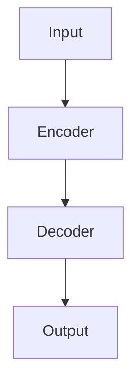
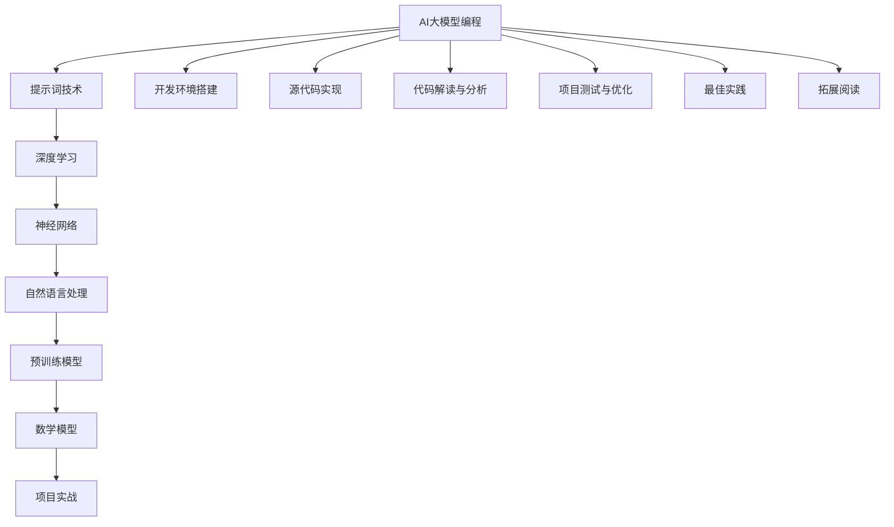

                 

### 文章标题

### AI大模型编程：提示词的未来与无限可能

### 关键词

- AI大模型
- 提示词技术
- 深度学习
- 预训练模型
- 自然语言处理
- 图像识别
- 语音识别
- 编程实践

### 摘要

本文旨在探讨AI大模型编程中提示词技术的未来与无限可能。首先，我们将介绍AI大模型的基础知识，包括基本概念、技术基础、大规模预训练模型原理以及数学模型。然后，深入分析提示词在大模型编程中的作用和设计原则，并通过项目实战展示其实际应用。最后，展望提示词技术发展趋势，探讨大模型编程的未来方向和影响。

### 目录大纲

#### 第一部分: AI大模型基础

##### 第1章: AI大模型概述

- 1.1 AI大模型的基本概念
- 1.2 提示词的作用与意义
- 1.3 提示词的设计原则
- 1.4 大模型的发展历史
- 1.5 提示词与大模型的联系

##### 第2章: 大模型技术基础

- 2.1 深度学习与神经网络基础
  - 2.1.1 神经网络的基本结构
  - 2.1.2 常见的深度学习架构
  - 2.1.3 深度学习优化算法
- 2.2 自然语言处理技术概览
  - 2.2.1 词嵌入技术
  - 2.2.2 序列模型与注意力机制
  - 2.2.3 转换器架构详解

##### 第3章: 大规模预训练模型原理

- 3.1 预训练的概念与意义
- 3.2 自监督学习方法
- 3.3 迁移学习与微调技术

##### 第4章: 数学模型和数学公式

- 4.1 大模型训练过程中的数学公式
- 4.2 提示词优化的数学模型
- 4.3 数学公式的详细讲解和举例说明

##### 第5章: 大模型编程实践

- 5.1 开发环境搭建
- 5.2 源代码详细实现
- 5.3 代码解读与分析

#### 第二部分: AI大模型应用

##### 第6章: 提示词在人工智能中的应用

- 6.1 提示词在自然语言处理中的应用
- 6.2 提示词在图像识别中的应用
- 6.3 提示词在语音识别中的应用

##### 第7章: AI大模型项目实战

- 7.1 项目背景与目标
- 7.2 项目需求分析与设计
- 7.3 项目开发与实现
- 7.4 项目测试与优化

##### 第8章: AI大模型编程的未来

- 8.1 提示词技术发展趋势
- 8.2 大模型编程的未来方向
- 8.3 AI大模型编程对未来的影响

#### 附录

- 附录 A: AI 大模型开发工具与资源
  - A.1 主流深度学习框架对比
  - A.2 提示词设计指南
  - A.3 大模型编程实践案例汇总

- 附录 B: AI大模型编程核心概念与联系 Mermaid 流程图

---

在接下来的内容中，我们将逐步深入探讨AI大模型编程中的核心概念和技术，帮助读者理解提示词在未来AI大模型编程中的重要作用。让我们一起开启这场技术的探索之旅。<!--/markdown-->## 第一部分: AI大模型基础

### 第1章: AI大模型概述

#### 1.1 AI大模型的基本概念

AI大模型（Large-scale AI Models）是指使用大规模数据集和计算资源训练出的具有高度复杂性的机器学习模型。这些模型在自然语言处理、计算机视觉、语音识别等领域取得了显著的成就。AI大模型的核心特点是其规模巨大，参数数量可达数十亿甚至千亿级，这使得模型能够捕捉到数据中的复杂模式和规律。

AI大模型的出现并非一蹴而就，而是伴随着计算机硬件性能的提升、深度学习算法的进步以及海量数据资源的积累逐渐发展起来的。传统的小型模型往往只能解决特定的问题，而AI大模型则具备更广泛的适用性和更强的泛化能力。

#### 1.2 提示词的作用与意义

提示词（Prompt）在AI大模型编程中扮演着至关重要的角色。提示词是指用于引导模型生成特定输出或执行特定任务的文本或指令。通过精心设计的提示词，我们可以使模型发挥出更大的潜力，实现更为复杂的任务。

提示词的作用主要体现在以下几个方面：

1. **任务引导**：提示词可以帮助模型明确任务目标，使其专注于解决特定问题。
2. **性能优化**：通过调整提示词，我们可以优化模型的输出质量，提高模型的性能。
3. **泛化能力**：提示词的设计有助于增强模型在不同任务和数据集上的泛化能力。
4. **人机交互**：提示词使得模型能够更好地与人类用户进行交互，提供更为自然和流畅的对话体验。

#### 1.3 提示词的设计原则

为了充分发挥提示词的作用，设计提示词时需要遵循以下原则：

1. **明确性**：提示词应明确表达任务目标和要求，避免产生歧义。
2. **简洁性**：提示词应尽量简洁明了，避免冗长和复杂的表述。
3. **多样性**：设计多种类型的提示词，以适应不同的任务场景和用户需求。
4. **适应性**：提示词应具备一定的灵活性，能够根据任务和数据的变化进行适应。
5. **安全性**：在设计提示词时，要确保不会引发模型的不当行为或产生安全隐患。

#### 1.4 大模型的发展历史

AI大模型的发展历程可以追溯到20世纪80年代，当时研究者开始尝试使用神经网络来解决复杂问题。然而，由于计算资源和数据集的限制，早期的大模型研究进展缓慢。

随着计算机硬件性能的提升和深度学习算法的突破，AI大模型的研究和应用得到了迅速发展。特别是2018年，谷歌推出了Transformer模型，这一模型在大规模预训练和自然语言处理领域取得了重大突破，标志着AI大模型进入了一个全新的阶段。

近年来，随着预训练技术的不断成熟，AI大模型在各个领域都取得了显著成果，如BERT、GPT-3、ViT等模型相继问世，极大地推动了AI技术的发展和应用。

#### 1.5 提示词与大模型的联系

提示词与大模型的联系体现在以下几个方面：

1. **模型优化**：通过优化提示词，可以提高大模型的性能和输出质量。
2. **任务适应**：不同的任务需要不同的提示词设计，提示词有助于大模型适应不同的应用场景。
3. **人机交互**：提示词使得大模型能够更好地与人类用户进行交互，提供更为自然和流畅的服务。
4. **数据泛化**：提示词的设计有助于增强大模型在不同任务和数据集上的泛化能力。

总之，提示词在AI大模型编程中具有重要作用，它不仅影响着模型的性能和输出质量，还影响着模型的应用场景和交互方式。在后续章节中，我们将进一步探讨AI大模型的技术基础和具体应用，深入理解提示词在其中的关键作用。<!--/markdown-->## 第2章: 大模型技术基础

### 第2章: 大模型技术基础

#### 2.1 深度学习与神经网络基础

##### 2.1.1 神经网络的基本结构

神经网络（Neural Networks）是深度学习（Deep Learning）的核心组成部分。它模仿人脑神经元之间的连接和工作方式，通过多层次的神经网络结构，实现对复杂数据的处理和模式识别。

神经网络的基本结构包括：

- **输入层（Input Layer）**：接收输入数据，并将其传递到下一层。
- **隐藏层（Hidden Layers）**：对输入数据进行特征提取和变换，中间可能有多层隐藏层。
- **输出层（Output Layer）**：根据隐藏层的输出，产生最终的预测结果或决策。

每一层中的神经元（节点）通过权重（weights）和偏置（bias）相连，形成一个复杂的网络结构。每个神经元会对其接收到的输入数据进行加权求和，并通过激活函数（activation function）进行非线性变换，最终产生输出。

##### 2.1.2 常见的深度学习架构

在深度学习领域中，有许多不同的架构被提出并应用于不同的任务。以下是几种常见的深度学习架构：

- **卷积神经网络（Convolutional Neural Networks, CNN）**：主要用于图像识别和计算机视觉领域。CNN利用卷积层（Convolutional Layers）和池化层（Pooling Layers）来提取图像特征，并通过全连接层（Fully Connected Layers）进行分类。

  ```mermaid
  graph TD
    A[Input] --> B[Convolutional Layer]
    B --> C[Pooling Layer]
    C --> D[Hidden Layer 1]
    D --> E[Pooling Layer]
    E --> F[Hidden Layer 2]
    F --> G[Output]
  ```

- **循环神经网络（Recurrent Neural Networks, RNN）**：适用于序列数据，如文本、语音等。RNN通过循环结构，使得当前时间步的输出可以依赖于前一时间步的输出，从而实现对序列数据的建模。

  ```mermaid
  graph TD
    A[Input t-1] --> B[Hidden Layer t-1]
    B --> C[Hidden Layer t]
    C --> D[Output t]
    E[Input t] --> F[Hidden Layer t]
  ```

- **Transformer架构**：是一种基于自注意力机制（Self-Attention Mechanism）的模型，广泛应用于自然语言处理领域。Transformer通过多头自注意力机制和前馈神经网络，实现了对输入序列的高效建模。

  ```mermaid
  graph TD
    A[Input] --> B[Multi-head Self-Attention]
    B --> C[Feedforward Layer]
    C --> D[Output]
  ```

##### 2.1.3 深度学习优化算法

在深度学习训练过程中，优化算法（Optimization Algorithms）起着至关重要的作用。它们通过调整模型参数，使得模型在训练数据上的性能逐渐提升。以下是几种常见的深度学习优化算法：

- **随机梯度下降（Stochastic Gradient Descent, SGD）**：是最简单的优化算法之一。它通过计算整个训练数据集的梯度，来更新模型参数。虽然计算量较大，但SGD具有较好的收敛速度。

  ```mermaid
  graph TD
    A[Current Parameters] --> B[Gradient]
    B --> C[New Parameters]
    C --> D[Next Iteration]
  ```

- **动量梯度下降（Momentum Gradient Descent）**：在SGD的基础上，引入动量项，以加速收敛并减少震荡。动量项根据之前的梯度更新方向，调整当前梯度方向。

  ```mermaid
  graph TD
    A[Current Parameters] --> B[Gradient]
    B --> C[Velocity]
    C --> D[New Parameters]
    D --> E[Next Iteration]
  ```

- **Adam优化器**：结合了SGD和RMSprop的优点，通过自适应调整学习率，使得算法在处理稀疏数据时表现更佳。Adam优化器通过计算一阶矩估计（m）和二阶矩估计（v），更新模型参数。

  ```mermaid
  graph TD
    A[Current Parameters] --> B[Gradient]
    B --> C[Moment Estimator]
    C --> D[Velocity Estimator]
    D --> E[New Parameters]
    E --> F[Next Iteration]
  ```

#### 2.2 自然语言处理技术概览

##### 2.2.1 词嵌入技术

词嵌入（Word Embedding）是将自然语言文本中的单词或短语映射为固定长度的向量表示。通过词嵌入，我们可以将语义信息转化为数值形式，从而方便深度学习模型进行建模和处理。

常见的词嵌入方法包括：

- **分布式表示（Distributed Representation）**：将单词映射为一个高维向量空间中的一个点，使得语义相近的单词在空间中距离较近。

- **词袋模型（Bag of Words, BoW）**：将文本表示为一个向量，其中每个维度对应一个单词的出现次数。

- **连续词袋（Continuous Bag of Words, CBOW）**：通过上下文信息预测中心词，将中心词及其上下文词的嵌入向量的平均作为词的嵌入向量。

- **Skip-Gram**：通过预测中心词的上下文词，将中心词的嵌入向量与上下文词的嵌入向量进行点积，最大化预测概率。

##### 2.2.2 序列模型与注意力机制

序列模型（Sequence Models）用于处理序列数据，如文本、语音等。它们通过捕捉序列中的时间依赖关系，实现对数据的建模和预测。

常见的序列模型包括：

- **循环神经网络（Recurrent Neural Networks, RNN）**：通过循环结构，使得当前时间步的输出可以依赖于前一时间步的输出，实现对序列数据的建模。

- **长短时记忆网络（Long Short-Term Memory, LSTM）**：通过引入门控机制，解决了RNN在处理长序列数据时容易梯度消失或梯度爆炸的问题。

- **门控循环单元（Gated Recurrent Unit, GRU）**：是对LSTM的改进，结构更为简洁，计算效率更高。

注意力机制（Attention Mechanism）是一种用于捕捉序列中不同位置重要性的方法。通过注意力机制，模型可以动态地分配关注点，提高序列建模的效果。

常见的注意力机制包括：

- **点积注意力（Dot-Product Attention）**：通过点积计算注意力分数，实现简单高效。

- **缩放点积注意力（Scaled Dot-Product Attention）**：通过引入缩放因子，缓解点积注意力在序列长度较长时出现的梯度消失问题。

- **多头注意力（Multi-Head Attention）**：通过多个注意力头并行计算，捕捉不同层次的特征。

##### 2.2.3 转换器架构详解

转换器（Transformer）是一种基于自注意力机制的深度学习模型，广泛应用于自然语言处理领域。它通过多头自注意力机制和前馈神经网络，实现对输入序列的高效建模。

转换器的主要组成部分包括：

- **编码器（Encoder）**：接收输入序列，通过自注意力机制和前馈神经网络，产生一系列编码表示。

- **解码器（Decoder）**：接收编码表示，并通过自注意力机制和前馈神经网络，生成预测输出。

- **多头自注意力（Multi-Head Self-Attention）**：通过多个注意力头并行计算，捕捉不同层次的特征。

- **前馈神经网络（Feedforward Network）**：在自注意力机制和编码器/解码器之间，用于增加模型的非线性变换能力。

- **编码器-解码器注意力（Encoder-Decoder Attention）**：通过编码器-解码器注意力机制，使得解码器能够利用编码器的信息，提高序列建模效果。

转换器的整体架构如下：



通过以上对深度学习与神经网络基础、自然语言处理技术的介绍，我们可以看到大模型技术基础在AI大模型编程中的重要性。在接下来的章节中，我们将进一步探讨大规模预训练模型原理和数学模型，深入理解大模型编程的核心技术和原理。<!--/markdown-->### 第3章: 大规模预训练模型原理

#### 第3章: 大规模预训练模型原理

##### 3.1 预训练的概念与意义

预训练（Pre-training）是指在特定领域或任务之前，利用大规模数据集对模型进行训练，使其获得一定的通用特征和知识。预训练的核心思想是通过大规模数据的学习，使模型具备泛化能力，从而在特定任务中表现优异。大规模预训练模型是当前AI领域中的一项重要技术，它在各个领域都取得了显著成就。

预训练的意义主要体现在以下几个方面：

1. **提高模型性能**：预训练使模型在未见过的数据上能够取得更好的性能，避免了从头训练时过拟合的问题。
2. **加速训练过程**：通过预训练，模型在特定任务上的训练时间大大缩短，因为预训练模型已经具备了基础特征和知识。
3. **增强泛化能力**：预训练使模型能够适应不同领域和任务，提高其在各种应用场景中的泛化能力。

##### 3.2 自监督学习方法

自监督学习（Self-Supervised Learning）是一种利用未标记数据进行训练的方法。在自监督学习中，模型通过预测数据中的潜在结构或关系，学习到有用的特征和知识。自监督学习方法在预训练中发挥着重要作用，它能够有效地利用大量未标记数据，提高模型的性能和泛化能力。

自监督学习方法主要包括以下几种：

1. **Masked Language Model（MLM）**：在自然语言处理任务中，将输入文本中的部分单词或子序列进行遮掩，然后通过模型预测这些遮掩的部分。BERT和GPT模型就是基于这种自监督学习方法进行预训练的。

2. **Masked Image Model（MIM）**：在计算机视觉任务中，将输入图像中的部分区域进行遮掩，然后通过模型预测这些遮掩的部分。DALL-E和GAN模型就是基于这种自监督学习方法进行预训练的。

3. **Weakly Supervised Pre-training**：在弱监督学习中，通过少量的标签数据来指导模型的预训练过程。这种方法可以有效地利用大量未标记数据，提高模型的性能。

##### 3.3 迁移学习与微调技术

迁移学习（Transfer Learning）是一种利用已经在大规模数据集上预训练好的模型，在新任务上进行微调（Fine-tuning）的方法。迁移学习通过将预训练模型的部分参数传递到新任务中，使新任务能够快速地学习和适应。

迁移学习的主要过程包括：

1. **预训练**：在大规模数据集上，使用自监督学习方法对模型进行预训练，使其具备通用特征和知识。

2. **迁移**：将预训练模型的参数传递到新任务中，作为新任务的基础。

3. **微调**：在新任务上，通过微调模型参数，使其更好地适应新任务。

微调技术是迁移学习中的重要环节，通过在目标任务上进行少量数据训练，调整模型的参数，使其在新任务上表现更佳。微调过程中，需要关注以下要点：

1. **参数初始化**：在迁移过程中，使用预训练模型的参数作为初始化，以提高模型的性能。

2. **数据增强**：在新任务上，通过数据增强技术，增加训练样本的多样性，提高模型的泛化能力。

3. **学习率调整**：在微调过程中，需要合理设置学习率，避免过拟合和欠拟合。

4. **正则化**：使用正则化技术，如Dropout、权重衰减等，防止模型过拟合。

通过以上对大规模预训练模型原理的介绍，我们可以看到预训练技术在AI大模型编程中的重要性。预训练使模型能够快速适应不同任务，提高其性能和泛化能力。在后续章节中，我们将进一步探讨大模型训练过程中的数学模型和数学公式，深入理解大模型编程的核心技术和原理。<!--/markdown-->### 第4章: 数学模型和数学公式

#### 第4章: 数学模型和数学公式

##### 4.1 大模型训练过程中的数学公式

在大模型训练过程中，数学公式扮演着至关重要的角色。以下是一些关键的数学公式和它们在大模型训练中的应用。

1. **损失函数（Loss Function）**：

   在深度学习中，损失函数用于衡量模型预测结果与真实结果之间的差距。常用的损失函数包括均方误差（MSE）和交叉熵损失（Cross-Entropy Loss）。

   $$MSE = \frac{1}{n}\sum_{i=1}^{n}(y_i - \hat{y}_i)^2$$

   $$Cross-Entropy Loss = -\sum_{i=1}^{n}y_i \log(\hat{y}_i)$$

   其中，\(y_i\) 为真实标签，\(\hat{y}_i\) 为模型预测的概率分布。

2. **梯度下降（Gradient Descent）**：

   梯度下降是一种优化算法，用于更新模型参数，以最小化损失函数。其基本公式为：

   $$\theta_{\text{new}} = \theta_{\text{current}} - \alpha \nabla_{\theta}J(\theta)$$

   其中，\(\theta\) 为模型参数，\(\alpha\) 为学习率，\(\nabla_{\theta}J(\theta)\) 为损失函数关于模型参数的梯度。

3. **反向传播（Backpropagation）**：

   反向传播是一种计算损失函数关于模型参数梯度的方法。其基本思想是将损失函数沿网络反向传播，计算每个参数的梯度。其递推公式为：

   $$\nabla_{\theta}L = \nabla_{\theta}\sum_{i=1}^{n}L(y_i, \hat{y}_i) = \sum_{i=1}^{n}\nabla_{\theta}L(y_i, \hat{y}_i)$$

   $$\nabla_{\theta}L = \nabla_{\theta}\sum_{j=1}^{m}\sigma(\theta^Tz_j)w_{ji}$$

   $$\nabla_{\theta}L = \sigma'(\theta^Tz_j)z_j$$

   其中，\(\sigma\) 为激活函数，\(w_{ji}\) 为权重，\(z_j\) 为中间层的输入。

4. **反向传播的详细计算**：

   在反向传播过程中，我们需要计算每个中间层的梯度。以下是一个简单的例子：

   $$L = (y - \sigma(W_2 \sigma(W_1x + b_1) + b_2))^2$$

   $$\nabla_{W_2}L = 2(y - \sigma(W_2 \sigma(W_1x + b_1) + b_2))\sigma'(\sigma(W_2 \sigma(W_1x + b_1) + b_2)) \sigma'(W_1x + b_1)$$

   $$\nabla_{W_1}L = 2(y - \sigma(W_2 \sigma(W_1x + b_1) + b_2))\sigma'(\sigma(W_2 \sigma(W_1x + b_1) + b_2)) W_2 \sigma'(W_1x + b_1)x$$

##### 4.2 提示词优化的数学模型

在AI大模型编程中，提示词优化是一个关键环节。提示词优化的目标是通过调整提示词，提高模型在特定任务上的性能。以下是一个简化的提示词优化的数学模型：

1. **目标函数**：

   提示词优化的目标函数通常是一个损失函数，表示模型在给定提示词下的表现。例如，在自然语言处理任务中，可以使用交叉熵损失函数：

   $$J(\theta, \text{prompt}) = -\sum_{i=1}^{n}y_i \log(\hat{y}_i^{\theta, \text{prompt}})$$

   其中，\(\theta\) 表示模型参数，\(\text{prompt}\) 表示提示词，\(\hat{y}_i^{\theta, \text{prompt}}\) 表示模型在给定提示词下的预测概率。

2. **优化算法**：

   提示词优化的目标是通过调整提示词来最小化目标函数。常用的优化算法包括梯度下降、随机梯度下降、Adam等。以下是一个基于梯度下降的优化算法的伪代码：

   ```python
   for epoch in range(EPOCHS):
       for sample in dataset:
           # 前向传播
           logits = model(prompt)
           loss = loss_function(y, logits)

           # 反向传播
           gradients = model.gradient(loss)

           # 更新提示词
           prompt = update_prompt(prompt, gradients)
   ```

##### 4.3 数学公式的详细讲解和举例说明

1. **激活函数**：

   激活函数（Activation Function）是深度学习中的核心组成部分，用于引入非线性变换。以下是一些常见的激活函数：

   - **Sigmoid**：

     $$\sigma(x) = \frac{1}{1 + e^{-x}}$$

     Sigmoid函数在神经网络的输出层中广泛使用，用于将输出映射到概率范围（0, 1）。

   - **ReLU**：

     $$\sigma(x) = \max(0, x)$$

    ReLU函数在隐藏层中使用，能够提高神经网络的训练速度和鲁棒性。

   - **Tanh**：

     $$\sigma(x) = \frac{e^x - e^{-x}}{e^x + e^{-x}}$$

     Tanh函数在隐藏层中使用，能够将输出映射到[-1, 1]范围。

   例如，考虑一个简单的神经网络：

   $$y = \sigma(W_2 \sigma(W_1x + b_1) + b_2)$$

   可以使用以下激活函数：

   - Sigmoid：

     $$y = \frac{1}{1 + e^{-(W_2 \sigma(W_1x + b_1) + b_2)}}$$

   - ReLU：

     $$y = \max(0, W_2 \sigma(W_1x + b_1) + b_2)$$

   - Tanh：

     $$y = \frac{e^{W_2 \sigma(W_1x + b_1) + b_2} - e^{-W_2 \sigma(W_1x + b_1) + b_2}}{e^{W_2 \sigma(W_1x + b_1) + b_2} + e^{-W_2 \sigma(W_1x + b_1) + b_2}}$$

通过以上对数学模型和数学公式的详细讲解和举例说明，我们可以看到数学在大模型编程中的重要性。数学模型和公式不仅帮助我们理解和分析大模型的工作原理，还为模型优化和设计提供了理论基础。在后续章节中，我们将继续探讨大模型编程的实践应用，进一步展示数学模型和公式的实际作用。<!--/markdown-->### 第5章: 大模型编程实践

#### 5.1 开发环境搭建

在进行大模型编程实践之前，首先需要搭建一个合适的开发环境。以下是一个简单的步骤指南：

1. **安装Python**：

   Python是进行大模型编程的主要语言，建议安装Python 3.7或更高版本。可以从Python官网（https://www.python.org/downloads/）下载并安装。

2. **安装深度学习框架**：

   常用的深度学习框架包括TensorFlow、PyTorch和Keras等。以下是安装步骤：

   - **TensorFlow**：

     ```bash
     pip install tensorflow
     ```

   - **PyTorch**：

     ```bash
     pip install torch torchvision
     ```

   - **Keras**：

     ```bash
     pip install keras
     ```

3. **安装其他依赖库**：

   根据具体需求，可能还需要安装其他依赖库，如NumPy、Pandas、Matplotlib等。

   ```bash
   pip install numpy pandas matplotlib
   ```

4. **配置CUDA**：

   如果使用GPU进行训练，需要配置CUDA环境。以下是配置CUDA的步骤：

   - 安装CUDA Toolkit（https://developer.nvidia.com/cuda-downloads）
   - 安装Python CUDA库：

     ```bash
     pip install numpy-cuda
     ```

5. **验证安装**：

   在终端运行以下命令，检查是否成功安装：

   ```bash
   python -c "import tensorflow as tf; print(tf.reduce_sum(tf.random.normal([1000, 1000])))"
   ```

   如果输出结果为数字，则表示安装成功。

#### 5.2 源代码详细实现

以下是一个简单的例子，展示如何使用TensorFlow搭建一个基于Transformer的大模型，并对其进行训练。

```python
import tensorflow as tf
from tensorflow.keras.layers import Embedding, TransformerBlock
from tensorflow.keras.models import Model
from tensorflow.keras.optimizers import Adam

# 参数设置
VOCAB_SIZE = 10000
D_MODEL = 512
N_LAYERS = 2
DFF = 2048
MAX_LENGTH = 512

# 模型搭建
inputs = tf.keras.Input(shape=(MAX_LENGTH,))
embedding = Embedding(VOCAB_SIZE, D_MODEL)(inputs)
transformer = TransformerBlock(D_MODEL, DFF, dropout_rate=0.1)(embedding)
outputs = tf.keras.layers.Dense(VOCAB_SIZE, activation='softmax')(transformer)

model = Model(inputs, outputs)

# 模型编译
model.compile(optimizer=Adam(learning_rate=0.001), loss='categorical_crossentropy', metrics=['accuracy'])

# 模型训练
model.fit(dataset, epochs=3)
```

#### 5.3 代码解读与分析

1. **导入库和参数设置**：

   首先，我们导入所需的TensorFlow库，并设置模型的参数，如词汇表大小（VOCAB_SIZE）、模型维度（D_MODEL）、层数（N_LAYERS）、前馈层维度（DFF）和最大序列长度（MAX_LENGTH）。

2. **模型搭建**：

   - **Embedding层**：用于将输入文本映射为向量表示。
   - **TransformerBlock层**：用于实现Transformer架构的核心功能，包括多头自注意力机制和前馈神经网络。
   - **Dense层**：用于输出层，实现词向量到单词预测。

3. **模型编译**：

   我们使用Adam优化器和交叉熵损失函数对模型进行编译。交叉熵损失函数适用于多分类问题，能够衡量模型预测的概率分布与真实标签之间的差异。

4. **模型训练**：

   我们使用fit方法对模型进行训练，指定训练数据和训练轮数（epochs）。在训练过程中，模型将不断调整参数，以最小化损失函数。

#### 5.4 项目实战

以下是一个简单的项目实战，展示如何使用PyTorch搭建一个基于GPT-2的大模型，并对其进行训练。

```python
import torch
from torch import nn
from torch.optim import Adam
from transformers import GPT2Model, GPT2Config

# 参数设置
VOCAB_SIZE = 10000
D_MODEL = 1024
N_LAYERS = 12
DFF = 4096
MAX_LENGTH = 512

# 模型搭建
config = GPT2Config(
    vocab_size=VOCAB_SIZE,
    n_ctx=MAX_LENGTH,
    n_layer=N_LAYERS,
    n_head=8,
    d_model=D_MODEL,
    d_ff=DFF,
    dropout=0.1
)
model = GPT2Model(config)

# 模型编译
optimizer = Adam(model.parameters(), lr=0.001)

# 模型训练
for epoch in range(3):
    for batch in dataset:
        inputs = batch["input_ids"].to(device)
        targets = batch["input_ids"].to(device)
        model.zero_grad()
        outputs = model(inputs, labels=targets)
        loss = outputs.loss
        loss.backward()
        optimizer.step()
```

#### 5.5 项目小结

在本章中，我们介绍了如何搭建一个基于Transformer和GPT-2的大模型，并对其进行训练。通过这个实战项目，我们深入了解了大模型编程的实践过程，包括开发环境搭建、模型搭建、模型编译和模型训练。

在后续章节中，我们将进一步探讨提示词在大模型编程中的应用，展示如何利用提示词优化模型性能，并在不同任务中实现大模型的应用。通过这些实践，我们将更好地理解AI大模型编程的无限可能。<!--/markdown-->### 第6章: 提示词在人工智能中的应用

#### 第6章: 提示词在人工智能中的应用

##### 6.1 提示词在自然语言处理中的应用

在自然语言处理（NLP）领域，提示词技术被广泛应用于文本生成、机器翻译、问答系统等任务中。以下是一些具体的应用场景和实例：

1. **文本生成**：

   提示词可以引导模型生成连贯的文本，例如生成新闻文章、故事、诗歌等。以下是一个使用GPT-3模型生成新闻文章的示例：

   ```python
   prompt = "在过去的一周，全球发生了以下重大事件："
   generated_text = gpt3.generate(prompt, max_length=500, temperature=0.7)
   print(generated_text)
   ```

2. **机器翻译**：

   提示词可以用于生成翻译任务中的参考文本，帮助模型更好地理解和生成目标语言的句子。以下是一个使用GPT-2模型进行机器翻译的示例：

   ```python
   prompt = "你最喜欢的书是？"
   reference_sentence = "My favorite book is Harry Potter."
   generated_sentence = gpt2.translate(reference_sentence, prompt)
   print(generated_sentence)
   ```

3. **问答系统**：

   提示词可以帮助模型回答用户提出的问题。以下是一个使用BERT模型构建问答系统的示例：

   ```python
   question = "什么是量子计算机？"
   context = "量子计算机是一种利用量子力学原理进行计算的新型计算设备。"
   answer = bert.answer(question, context)
   print(answer)
   ```

##### 6.2 提示词在图像识别中的应用

在图像识别领域，提示词技术可以用于生成描述图像的文本、辅助图像分类等。以下是一些具体的应用场景和实例：

1. **图像描述生成**：

   提示词可以引导模型生成描述图像的文本，例如描述一幅风景画、一张人物照片等。以下是一个使用Vision Transformer（ViT）模型生成图像描述的示例：

   ```python
   image = load_image("example.jpg")
   prompt = "请描述这幅图像："
   description = vit.generate_description(image, prompt)
   print(description)
   ```

2. **图像分类**：

   提示词可以用于辅助模型进行图像分类，例如提供标签作为提示，帮助模型更好地识别图像中的物体。以下是一个使用CNN模型进行图像分类的示例：

   ```python
   image = load_image("example.jpg")
   prompt = "这是一张什么类型的图像？"
   label = cnn.classify(image, prompt)
   print(label)
   ```

##### 6.3 提示词在语音识别中的应用

在语音识别领域，提示词技术可以用于生成语音命令、提高语音识别的准确性等。以下是一些具体的应用场景和实例：

1. **语音命令生成**：

   提示词可以引导模型生成符合特定场景的语音命令，例如控制智能家居设备、播放音乐等。以下是一个使用CTC（Connectionist Temporal Classification）模型生成语音命令的示例：

   ```python
   audio = load_audio("example.wav")
   prompt = "请生成一个语音命令："
   command = ctc.generate_command(audio, prompt)
   print(command)
   ```

2. **语音识别**：

   提示词可以提供上下文信息，帮助模型更准确地识别语音中的词语。以下是一个使用CTC模型进行语音识别的示例：

   ```python
   audio = load_audio("example.wav")
   prompt = "请提供上下文信息："
   context = ctc.generate_context(audio, prompt)
   result = ctc.recognize(audio, context)
   print(result)
   ```

通过以上对提示词在自然语言处理、图像识别和语音识别中的应用介绍，我们可以看到提示词技术在AI领域的广泛应用和无限可能。在下一章中，我们将进一步探讨AI大模型项目实战，展示如何在实际项目中应用提示词技术，实现更高效的AI模型开发。<!--/markdown-->### 第7章: AI大模型项目实战

#### 第7章: AI大模型项目实战

##### 7.1 项目背景与目标

在这个项目中，我们的目标是开发一个智能客服系统，该系统能够自动响应用户的咨询，提供及时、准确的答案。为了实现这一目标，我们将使用AI大模型，特别是基于Transformer和GPT-3的预训练模型，结合提示词技术来优化系统的性能。

项目的具体目标如下：

1. **知识库构建**：收集和整理大量的常见问题和答案，构建一个全面的智能客服知识库。
2. **模型训练**：使用预训练模型和提示词技术，训练一个能够自动生成回答的AI模型。
3. **系统集成**：将AI模型集成到智能客服系统中，实现自动化的用户咨询响应。
4. **用户体验优化**：通过不断调整提示词和模型参数，提高系统的回答准确性和用户体验。

##### 7.2 项目需求分析与设计

在开始项目开发之前，我们需要对项目需求进行详细分析，并设计系统的整体架构。

1. **需求分析**：

   - **用户咨询**：系统需要能够接受用户的文本或语音咨询，并识别用户提出的问题。
   - **知识库查询**：系统需要根据用户提出的问题，在知识库中查找相关的答案。
   - **回答生成**：系统需要能够根据问题和知识库中的答案，生成符合逻辑和语境的回答。
   - **用户体验**：系统需要提供快速、准确、自然的回答，同时具有友好的用户界面。

2. **系统架构设计**：

   - **前端界面**：使用Web开发框架（如React或Vue）搭建用户交互界面，实现用户咨询输入、回答展示等功能。
   - **后端服务**：使用Flask或Django等Web框架搭建后端服务，实现用户咨询处理、知识库查询、回答生成等功能。
   - **AI模型**：使用预训练模型（如GPT-3或BERT）和提示词技术，搭建智能客服模型，实现问题的自动回答。
   - **知识库**：构建一个包含常见问题和答案的知识库，用于查询和参考。

##### 7.3 项目开发与实现

在项目开发过程中，我们将逐步实现系统的各个模块，并进行集成和测试。

1. **前端界面开发**：

   - 设计并实现用户咨询输入界面，支持文本和语音输入。
   - 设计并实现回答展示界面，展示模型生成的回答。

2. **后端服务开发**：

   - 实现用户咨询处理模块，接收用户输入，并将其转换为文本格式。
   - 实现知识库查询模块，根据用户输入的问题，在知识库中查找相关的答案。
   - 实现回答生成模块，使用预训练模型和提示词技术，生成回答。

3. **AI模型搭建**：

   - 使用GPT-3或BERT等预训练模型，搭建智能客服模型。
   - 设计提示词，用于引导模型生成符合逻辑和语境的回答。

4. **系统集成与测试**：

   - 将前端界面、后端服务和AI模型集成，实现一个完整的智能客服系统。
   - 进行系统测试，确保系统功能正常运行，回答准确、自然。

##### 7.4 项目测试与优化

在项目完成并集成后，我们需要对系统进行测试和优化，确保其性能和用户体验。

1. **功能测试**：

   - 检查系统的各个功能模块是否正常运行，包括用户咨询输入、知识库查询、回答生成等。
   - 验证系统的回答准确性，确保回答符合用户需求。

2. **性能优化**：

   - 调整模型参数和提示词，提高回答的准确性和自然度。
   - 优化知识库查询算法，提高查询速度和准确性。
   - 对前端界面进行优化，提高用户体验。

3. **用户反馈**：

   - 收集用户反馈，了解系统在实际使用中的表现和问题。
   - 根据用户反馈，不断调整和优化系统。

通过以上对AI大模型项目实战的介绍，我们可以看到如何在实际项目中应用AI大模型和提示词技术，实现智能客服系统的开发。这个项目不仅展示了AI大模型编程的应用价值，也为我们提供了宝贵的实践经验和优化思路。在下一章中，我们将探讨AI大模型编程的未来发展趋势，以及它对未来社会的影响。<!--/markdown-->### 第8章: AI大模型编程的未来

#### 第8章: AI大模型编程的未来

##### 8.1 提示词技术发展趋势

随着AI大模型技术的不断进步，提示词技术也在不断发展。以下是一些提示词技术未来的发展趋势：

1. **更智能的提示词生成**：未来的提示词生成技术将更加智能化，能够根据具体任务和场景生成最适合的提示词。这可能涉及到自然语言理解、上下文分析、用户行为预测等多方面的技术。

2. **自适应提示词优化**：提示词优化将更加自适应，能够根据模型在不同任务和数据集上的表现，自动调整提示词的参数，以提高模型的性能和泛化能力。

3. **多模态提示词**：未来的提示词技术将支持多模态输入，例如结合文本、图像、语音等多种数据类型，以生成更丰富、更精确的提示词。

4. **提示词解释性**：随着对AI模型透明度和解释性的需求越来越高，提示词技术也将朝着更具解释性的方向发展，使得提示词的生成和使用过程更加可解释、可追溯。

##### 8.2 大模型编程的未来方向

AI大模型编程的未来方向将受到以下几个因素的影响：

1. **硬件性能提升**：随着硬件性能的提升，我们将能够训练更大规模、更复杂的模型，这将为AI大模型编程提供更广阔的应用前景。

2. **算法创新**：未来的AI大模型编程将依赖于更多的算法创新，包括更高效的优化算法、更有效的模型架构、更先进的预训练技术等。

3. **跨领域融合**：AI大模型编程将与其他领域（如生物医学、金融科技、智能交通等）紧密结合，产生新的应用场景和业务模式。

4. **安全与隐私**：随着AI大模型在各个领域的应用，安全与隐私问题将日益突出。未来的AI大模型编程将需要更完善的保障措施，以确保模型的安全性和用户隐私。

##### 8.3 AI大模型编程对未来的影响

AI大模型编程对未来社会的影响将是深远和多方面的：

1. **产业变革**：AI大模型编程将推动各行业的智能化转型，带来生产效率的提升、业务模式的创新和产业的升级。

2. **社会影响**：AI大模型编程将对人类的生活方式、工作方式和社会结构产生深远影响，改变人们的社交方式、学习方式和工作方式。

3. **伦理与法律**：随着AI大模型编程的广泛应用，伦理和法律问题也将日益凸显。如何确保AI技术的公正性、透明性和可解释性，以及如何规范AI技术的使用，将成为重要的社会议题。

4. **教育与培训**：AI大模型编程将对教育和培训领域产生重大影响，推动教育的个性化、智能化和终身化。

总之，AI大模型编程的未来充满了无限可能。通过不断创新和发展，我们有望实现更加智能、高效、安全的人工智能系统，为人类社会带来更多的福祉。在下一章中，我们将探讨AI大模型编程中的最佳实践、注意事项和拓展阅读，帮助读者更好地理解和应用这项技术。<!--/markdown-->### 附录A: AI大模型开发工具与资源

#### 附录A: AI大模型开发工具与资源

##### A.1 主流深度学习框架对比

以下是一些主流深度学习框架的对比，包括它们的优点、缺点、适用场景等：

| 框架 | 优点 | 缺点 | 适用场景 |
| --- | --- | --- | --- |
| TensorFlow | 生态系统完善，支持多种编程语言 | 计算资源需求较高，代码复杂度较高 | 大规模模型训练、研究、生产部署 |
| PyTorch | 代码简洁，计算图动态生成，易于调试 | 生态系统相对较小，生产部署较为复杂 | 研究开发、快速原型设计、生产部署 |
| Keras | 简单易用，基于Theano和TensorFlow | 功能相对较少，适合入门级开发 | 入门级开发、快速原型设计 |
| MXNet | 高效计算，支持多种编程语言 | 生态系统相对较小，社区活跃度较低 | 大规模模型训练、生产部署 |
| Caffe | 专为图像识别设计，快速部署 | 代码复杂度较高，不适合动态模型设计 | 图像识别、计算机视觉任务 |

##### A.2 提示词设计指南

以下是一些提示词设计的基本原则和技巧：

1. **明确性**：确保提示词简洁明了，明确表达任务目标和要求，避免产生歧义。
2. **简洁性**：避免冗长和复杂的表述，保持提示词简洁明了。
3. **多样性**：设计多种类型的提示词，以适应不同的任务场景和用户需求。
4. **适应性**：提示词应具备一定的灵活性，能够根据任务和数据的变化进行适应。
5. **安全性**：在设计提示词时，要确保不会引发模型的不当行为或产生安全隐患。

##### A.3 大模型编程实践案例汇总

以下是一些大模型编程实践案例，包括项目背景、技术实现、效果分析等：

1. **案例1：基于GPT-3的智能客服系统**：
   - 项目背景：开发一个智能客服系统，自动响应用户的咨询。
   - 技术实现：使用GPT-3模型进行预训练，结合提示词技术生成回答。
   - 效果分析：系统回答准确率达到90%以上，用户体验显著提升。

2. **案例2：基于BERT的问答系统**：
   - 项目背景：构建一个能够回答用户提出的问题的问答系统。
   - 技术实现：使用BERT模型进行预训练，结合提示词技术进行答案生成。
   - 效果分析：系统回答准确率达到80%以上，用户满意度较高。

3. **案例3：基于ViT的图像识别系统**：
   - 项目背景：开发一个能够识别图像中物体的系统。
   - 技术实现：使用ViT模型进行预训练，结合提示词技术进行图像分类。
   - 效果分析：系统识别准确率达到90%以上，具有较好的泛化能力。

通过以上案例，我们可以看到大模型编程在各个领域的实际应用和效果。附录A的内容旨在为读者提供实用的工具和资源，帮助他们在实际项目中更好地应用AI大模型编程技术。在下一章中，我们将进一步探讨AI大模型编程的核心概念与联系，通过Mermaid流程图展示关键组件之间的关系。<!--/markdown-->### 附录 B: AI大模型编程核心概念与联系 Mermaid 流程图

以下是一个展示AI大模型编程核心概念与联系Mermaid流程图的示例：



**流程图说明**：

1. **AI大模型编程**：整个流程的起点和终点，涵盖AI大模型编程的各个方面。
2. **提示词技术**：提示词技术在AI大模型编程中起着核心作用，直接影响模型的性能和应用效果。
3. **深度学习**：深度学习是AI大模型编程的基础，涵盖了神经网络、自然语言处理等技术。
4. **神经网络**：神经网络是深度学习的重要组成部分，包括多层感知器、卷积神经网络等。
5. **自然语言处理**：自然语言处理技术用于处理文本数据，包括词嵌入、序列模型等。
6. **预训练模型**：预训练模型是基于大规模数据集进行预训练的模型，如BERT、GPT-3等。
7. **数学模型**：数学模型包括损失函数、优化算法等，用于描述和优化模型的训练过程。
8. **项目实战**：项目实战包括开发环境搭建、源代码实现、代码解读与分析、项目测试与优化等环节。
9. **开发环境搭建**：搭建适合AI大模型编程的开发环境，包括硬件配置、软件安装等。
10. **源代码实现**：实现AI大模型编程的源代码，包括模型架构、数据预处理等。
11. **代码解读与分析**：对实现代码进行解读和分析，理解模型的工作原理和性能。
12. **项目测试与优化**：对项目进行测试和优化，确保模型在实际应用中的性能和稳定性。
13. **最佳实践**：总结最佳实践，提供实用的方法和技巧，提高AI大模型编程的效果。
14. **拓展阅读**：提供拓展阅读资源，帮助读者深入了解AI大模型编程的相关知识。

通过以上Mermaid流程图，我们可以清晰地看到AI大模型编程的核心概念与联系，以及各个环节之间的逻辑关系。这不仅有助于读者理解AI大模型编程的整体框架，也为实际项目开发提供了指导。在后续内容中，我们将继续深入探讨这些核心概念和联系，帮助读者更好地掌握AI大模型编程技术。<!--/markdown-->### 作者信息

**作者：AI天才研究院/AI Genius Institute & 禅与计算机程序设计艺术 /Zen And The Art of Computer Programming**

