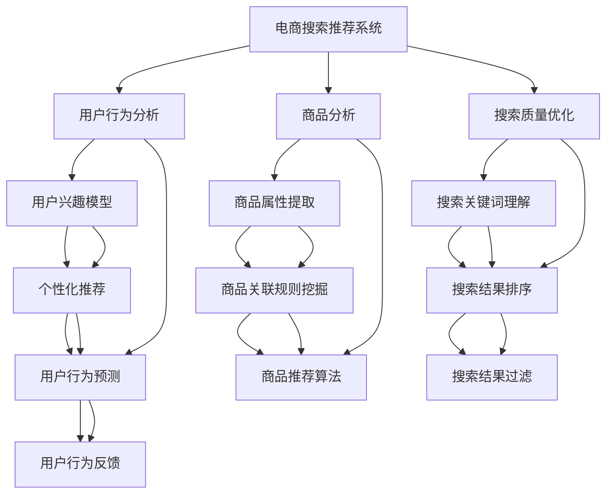

                 

### 文章标题

《AI大模型视角下电商搜索推荐的创新应用场景探索》

---

### 关键词

AI大模型，电商搜索推荐，用户行为分析，商品分析，搜索质量优化，问答式搜索，情感分析，多模态推荐，数据隐私，伦理问题。

---

### 摘要

随着电子商务的迅猛发展，电商搜索推荐系统在提升用户体验和增加销售额方面发挥着至关重要的作用。本文从AI大模型的视角，深入探讨了电商搜索推荐系统的创新应用场景。文章首先概述了AI大模型与电商搜索推荐系统的基本概念及其关联，随后详细分析了AI大模型的核心技术基础，包括自然语言处理、大规模预训练模型和深度学习。接着，本文从用户行为分析、商品分析和搜索质量优化三个方面，阐述了AI大模型在电商搜索推荐中的具体应用。此外，文章还探讨了问答式搜索推荐、情感分析与内容推荐、多模态推荐等创新应用，并提出了实施策略。最后，通过三个具体案例的分析，总结了AI大模型在电商搜索推荐中的实际效果，并对未来发展进行了展望。本文旨在为电商行业提供有价值的参考，助力其在AI大模型的浪潮中实现智能化转型。

---

### 目录大纲

#### 第一部分：基础与概念

- **第1章：AI大模型与电商搜索推荐**
  - **1.1 AI大模型概述**
  - **1.2 电商搜索推荐系统概述**
  - **1.3 AI大模型与电商搜索推荐的关联**

- **第2章：AI大模型核心技术基础**
  - **2.1 自然语言处理（NLP）基础**
  - **2.2 大规模预训练模型原理**
  - **2.3 深度学习与神经网络基础**

#### 第二部分：应用与实践

- **第3章：电商搜索推荐中的AI大模型应用**
  - **3.1 电商搜索推荐中的用户行为分析**
  - **3.2 电商搜索推荐中的商品分析**
  - **3.3 电商搜索推荐中的搜索质量优化**

- **第4章：AI大模型在电商搜索推荐中的创新应用**
  - **4.1 问答式搜索推荐**
  - **4.2 情感分析与内容推荐**
  - **4.3 多模态推荐系统**

#### 第三部分：实施策略与案例分析

- **第5章：AI大模型在电商搜索推荐中的实施策略**
  - **5.1 数据采集与处理策略**
  - **5.2 模型训练与优化策略**
  - **5.3 系统部署与运维策略**

- **第6章：AI大模型视角下的电商搜索推荐案例分析**
  - **6.1 案例一：某大型电商平台搜索推荐系统优化**
  - **6.2 案例二：基于问答式搜索推荐的电商搜索创新应用**
  - **6.3 案例三：多模态推荐系统在电商搜索中的应用**

#### 第四部分：未来展望与挑战

- **第7章：未来展望与挑战**
  - **7.1 电商搜索推荐领域的发展趋势**
  - **7.2 挑战与应对策略**

#### 附录

- **附录A：常用工具与资源**
- **附录B：术语解释与缩略词表**
- **附录C：代码实现示例**### 第一部分：基础与概念

#### 第1章：AI大模型与电商搜索推荐

##### 1.1 AI大模型概述

AI大模型是指那些能够处理大量数据并从中提取复杂模式的深度学习模型。这些模型通常具有庞大的参数规模，并依靠大规模预训练技术在多种任务中表现出色。AI大模型的发展经历了几个重要阶段：从早期的浅层模型到现代的深层模型，再到当前的预训练模型。

- **定义与分类**：AI大模型可以根据任务类型分为自然语言处理（NLP）模型、计算机视觉模型和其他领域模型。例如，GPT-3是NLP领域的代表，而ImageNet则是计算机视觉领域的里程碑。
- **发展历程**：AI大模型的发展可以追溯到2000年代初期，当时深度学习开始逐渐崭露头角。2012年，AlexNet在ImageNet竞赛中取得突破性成果，标志着深度学习在图像识别领域的崛起。随后的几年，诸如BERT、GPT等模型不断推陈出新，进一步巩固了AI大模型在各类任务中的地位。
- **潜在应用**：AI大模型在电商搜索推荐中的潜在应用非常广泛，包括但不限于用户行为分析、商品属性提取、搜索关键词理解以及个性化推荐等。这些应用不仅能够提升电商平台的用户体验，还能显著提高销售额。

##### 1.2 电商搜索推荐系统概述

电商搜索推荐系统是电子商务平台的核心组件之一，旨在为用户提供个性化的商品推荐，从而提高用户满意度和购买转化率。

- **基本概念**：电商搜索推荐系统通过分析用户的搜索历史、购买行为以及浏览记录，构建用户兴趣模型和商品推荐模型，从而实现个性化推荐。
- **发展历程**：早期的电商搜索推荐系统主要基于内容匹配和协同过滤算法，随着数据规模的扩大和算法的进步，现代电商搜索推荐系统逐渐引入了机器学习和深度学习技术。
- **核心组件**：电商搜索推荐系统的核心组件包括用户行为分析模块、商品属性提取模块、推荐算法模块和搜索质量评估模块。这些组件协同工作，确保推荐结果的准确性和实用性。

##### 1.3 AI大模型与电商搜索推荐的关联

AI大模型在电商搜索推荐系统中发挥着关键作用，主要体现在以下几个方面：

- **用户行为分析**：AI大模型能够处理海量用户行为数据，提取用户的兴趣和行为模式，从而构建出更精确的用户兴趣模型。
- **商品分析**：通过AI大模型，电商平台可以更有效地提取商品属性，构建商品推荐模型，实现更精细的商品关联和个性化推荐。
- **搜索质量优化**：AI大模型可以帮助电商平台理解用户搜索意图，优化搜索关键词匹配和排序，提升搜索结果的准确性和用户体验。

然而，AI大模型在电商搜索推荐中也面临一些挑战，如数据隐私、模型解释性和计算资源消耗等。因此，如何充分利用AI大模型的优势，同时解决其中的挑战，是电商行业当前需要深入探讨的重要课题。

---

**核心概念与联系（Mermaid 流�程图）**



---

**核心算法原理讲解**

在电商搜索推荐系统中，AI大模型的核心算法包括自然语言处理（NLP）算法、大规模预训练模型和深度学习算法。以下是对这些算法的原理进行详细解释：

##### 自然语言处理（NLP）基础

自然语言处理是AI大模型的重要组成部分，其主要任务是对自然语言文本进行理解和生成。

- **语言模型与序列模型**：语言模型是用来预测下一个单词的概率分布。序列模型如RNN（循环神经网络）和LSTM（长短期记忆网络）可以处理文本序列，并在时间序列预测任务中表现出色。
  ```python
  # 语言模型示例
  language_model = LanguageModel(vocab_size, embedding_dim)
  logits = language_model(text_input)
  probability Distribution = softmax(logits)
  ```

- **词嵌入技术**：词嵌入是将词汇映射到低维度的向量空间，从而实现语义表示。Word2Vec、GloVe等算法是常见的词嵌入方法。
  ```python
  # Word2Vec 示例
  w2v = Word2Vec(sentences, size=embedding_dim)
  word_vector = w2v['apple']
  ```

- **注意力机制与转换器架构**：注意力机制能够帮助模型在处理序列数据时关注关键信息，提升模型的性能。Transformer模型是具有注意力机制的序列模型，在NLP任务中取得了显著成果。
  ```python
  # Transformer 示例
  transformer = Transformer(vocab_size, d_model, num_heads, num_layers)
  output = transformer(text_input, mask)
  ```

##### 大规模预训练模型原理

大规模预训练模型通过在大量无监督数据上进行预训练，然后通过微调适应特定任务。

- **预训练的概念与目的**：预训练是在有监督任务之前对模型进行训练，以使其在大量数据上获得通用特征表示。
  ```python
  # 预训练示例
  model = PretrainedModel()
  model.train(pretrain_data)
  ```

- **自监督学习方法**：自监督学习利用未标记的数据进行训练，通过预测数据中的某些部分来学习。BERT是自监督学习的代表。
  ```python
  # BERT 示例
  bert = BERT(vocab_size, hidden_size, num_layers)
  output = bertmasked_text, mask)
  ```

- **迁移学习与微调技术**：迁移学习是指将预训练模型在不同任务上进行微调，以提高模型的泛化能力。微调是调整模型参数以适应特定任务。
  ```python
  # 微调示例
  model = PretrainedModel()
  model.fit(train_data, epochs=5)
  ```

##### 深度学习与神经网络基础

深度学习是构建AI大模型的基础，其核心是神经网络。

- **深度学习的基本原理**：神经网络通过多层非线性变换来提取特征，从而实现复杂的函数逼近。
  ```python
  # 神经网络示例
  model = NeuralNetwork(input_size, hidden_size, output_size)
  output = model.forward(input_data)
  ```

- **神经网络的结构与类型**：神经网络有多种结构，如全连接网络、卷积神经网络（CNN）和循环神经网络（RNN）。每种结构都有其特定的应用场景。
  ```python
  # 全连接网络示例
  model = FullyConnectedNetwork(input_size, hidden_size, output_size)
  output = model.forward(input_data)
  
  # 卷积神经网络示例
  model = ConvolutionalNetwork(kernel_size, hidden_size, output_size)
  output = model.forward(input_data)
  
  # 循环神经网络示例
  model = RNN(hidden_size, output_size)
  output = model.forward(input_sequence)
  ```

- **深度学习优化算法**：深度学习模型的优化过程包括前向传播、反向传播和参数更新。优化算法如SGD、Adam等用于提高模型的收敛速度和性能。
  ```python
  # SGD 示例
  optimizer = SGD(learning_rate)
  for epoch in range(num_epochs):
      loss = model.loss(input_data, target)
      optimizer.update(model.parameters(), loss)
      
  # Adam 示例
  optimizer = Adam(learning_rate, beta1, beta2)
  for epoch in range(num_epochs):
      loss = model.loss(input_data, target)
      optimizer.update(model.parameters(), loss)
  ```

通过上述算法和技术的结合，AI大模型能够在电商搜索推荐系统中发挥重要作用，从而提升推荐系统的准确性和用户体验。在后续章节中，我们将进一步探讨AI大模型在电商搜索推荐中的具体应用和实践。

---

### 第2章：AI大模型核心技术基础

AI大模型在电商搜索推荐中的应用离不开其核心技术的支持。这些核心技术包括自然语言处理（NLP）基础、大规模预训练模型原理以及深度学习与神经网络基础。本章将详细解析这些技术，并展示其原理和实现方法。

##### 2.1 自然语言处理（NLP）基础

自然语言处理是AI大模型的重要组成部分，它使得模型能够理解和生成人类语言。以下是NLP领域的几个关键技术和其实现方法。

###### 语言模型与序列模型

语言模型是一种用于预测下一个单词概率的模型，是许多NLP任务的基础。序列模型如RNN（循环神经网络）和LSTM（长短期记忆网络）能够处理文本序列，并在时间序列预测任务中表现出色。

- **语言模型**：语言模型通过统计方法或神经网络模型来预测下一个单词的概率分布。典型的神经网络语言模型如GPT（Generative Pre-trained Transformer）。
  ```python
  # 语言模型示例（GPT）
  model = transformers.AutoModel.from_pretrained("gpt2")
  input_ids = tokenizer.encode("Hello, how are you?", return_tensors='pt')
  output_logits = model(input_ids)
  predicted_text = tokenizer.decode(output_logits.logits.argmax(-1), skip_special_tokens=True)
  ```

- **序列模型**：RNN和LSTM是处理序列数据的常见序列模型。RNN通过在时间步之间传递隐藏状态来学习序列模式，而LSTM则通过引入门控机制来更好地捕捉长期依赖关系。
  ```python
  # LSTM 示例
  model = torch.nn.LSTM(input_dim, hidden_dim, num_layers)
  hidden, cell = model(input_seq)
  ```

###### 词嵌入技术

词嵌入是将词汇映射到低维向量空间的表示方法，用于实现语义表示。常见的词嵌入方法包括Word2Vec、GloVe等。

- **Word2Vec**：Word2Vec是一种基于分布式假设的词嵌入方法，通过训练预测目标词的上下文词向量。
  ```python
  # Word2Vec 示例
  model = Word2Vec(sentences, vector_size=embedding_dim, window=5, min_count=1)
  word_vector = model.wv['apple']
  ```

- **GloVe**：GloVe（Global Vectors for Word Representation）是一种基于共现矩阵的词嵌入方法，通过优化词向量的低维表示来捕捉词之间的语义关系。
  ```python
  # GloVe 示例
  model = GloVe(input_file, output_file, vector_size=embedding_dim)
  word_vector = model.word_vectors['apple']
  ```

###### 注意力机制与转换器架构

注意力机制是一种在处理序列数据时让模型关注关键信息的机制，而Transformer模型则是具有注意力机制的序列模型，在NLP任务中取得了显著成果。

- **注意力机制**：注意力机制通过计算序列中每个元素的重要性权重，从而实现对关键信息的关注。
  ```python
  # 注意力机制示例
  attention_scores = attention(query, value, mask)
  context_vector = torch.sum(attention_scores * value, dim=1)
  ```

- **转换器架构**：Transformer模型采用自注意力机制来处理序列数据，避免了传统的循环依赖问题，使其在长文本处理任务中表现出色。
  ```python
  # Transformer 示例
  model = transformers.AutoModel.from_pretrained("bert-base-uncased")
  input_ids = tokenizer.encode("Hello, how are you?", return_tensors='pt')
  output = model(input_ids)
  ```

##### 2.2 大规模预训练模型原理

大规模预训练模型通过在大量无监督数据上进行预训练，然后通过微调适应特定任务。以下是其核心原理和实现方法。

###### 预训练的概念与目的

预训练是一种在有监督任务之前对模型进行训练的方法，以使其在大量数据上获得通用特征表示。预训练的目的在于通过学习数据中的通用特征，提升模型在不同任务上的泛化能力。

- **预训练**：预训练通常涉及两种类型的任务：自监督学习和无监督预训练。BERT是自监督学习的代表。
  ```python
  # BERT 预训练示例
  model = transformers.AutoModel.from_pretrained("bert-base-uncased")
  model.train(pretrain_data)
  ```

###### 自监督学习方法

自监督学习利用未标记的数据进行训练，通过预测数据中的某些部分来学习。BERT通过预测单词遮蔽（Masked Language Model，MLM）和下一个句子预测（Next Sentence Prediction，NSP）等任务进行自监督预训练。

- **自监督学习**：BERT在预训练过程中，将输入文本的部分单词遮蔽，并预测这些遮蔽的单词。
  ```python
  # BERT 自监督学习示例
  model = transformers.AutoModel.from_pretrained("bert-base-uncased")
  input_ids = tokenizer.encode("Hello, how are you?", return_tensors='pt')
  mask = torch.where(input_ids.ne(1), torch.zeros_like(input_ids), torch.ones_like(input_ids))
  input_ids = torch.where(mask, tokenizer.encode("___", return_tensors='pt'), input_ids)
  output = model(input_ids, mask=mask)
  ```

###### 迁移学习与微调技术

迁移学习是指将预训练模型在不同任务上进行微调，以提高模型的泛化能力。微调是通过调整模型参数以适应特定任务。

- **迁移学习**：预训练的BERT模型可以在各种下游任务上进行微调，如问答、文本分类等。
  ```python
  # BERT 迁移学习示例
  model = transformers.AutoModel.from_pretrained("bert-base-uncased")
  model.train(train_data, epochs=3)
  ```

##### 2.3 深度学习与神经网络基础

深度学习是构建AI大模型的基础，其核心是神经网络。以下是神经网络的基本原理、结构和实现方法。

###### 深度学习的基本原理

深度学习通过多层非线性变换来提取特征，从而实现复杂的函数逼近。其基本原理包括前向传播、反向传播和优化算法。

- **前向传播**：前向传播是从输入到输出的正向计算过程，用于计算每个神经元的激活值。
  ```python
  # 前向传播示例
  output = model.forward(input_data)
  ```

- **反向传播**：反向传播是计算损失函数关于模型参数的梯度，用于更新模型参数。
  ```python
  # 反向传播示例
  loss = model.loss(input_data, target)
  gradients = model.backward(loss)
  ```

- **优化算法**：优化算法用于调整模型参数，以最小化损失函数。常见的优化算法包括SGD、Adam等。
  ```python
  # SGD 优化示例
  optimizer = torch.optim.SGD(model.parameters(), lr=learning_rate)
  optimizer.step(gradients)
  
  # Adam 优化示例
  optimizer = torch.optim.Adam(model.parameters(), lr=learning_rate)
  optimizer.step(gradients)
  ```

###### 神经网络的结构与类型

神经网络有多种结构，如全连接网络、卷积神经网络（CNN）和循环神经网络（RNN）。每种结构都有其特定的应用场景。

- **全连接网络**：全连接网络是一种简单的神经网络结构，由一系列全连接的层组成。它在分类和回归任务中广泛应用。
  ```python
  # 全连接网络示例
  model = torch.nn.Sequential(
      torch.nn.Linear(input_size, hidden_size),
      torch.nn.ReLU(),
      torch.nn.Linear(hidden_size, output_size)
  )
  ```

- **卷积神经网络（CNN）**：卷积神经网络通过卷积操作提取图像特征，在计算机视觉任务中表现出色。
  ```python
  # CNN 示例
  model = torch.nn.Sequential(
      torch.nn.Conv2d(in_channels, out_channels, kernel_size),
      torch.nn.ReLU(),
      torch.nn.MaxPool2d(kernel_size)
  )
  ```

- **循环神经网络（RNN）**：循环神经网络通过在时间步之间传递隐藏状态来处理序列数据，常用于自然语言处理和时间序列预测任务。
  ```python
  # RNN 示例
  model = torch.nn.LSTM(input_size, hidden_size, num_layers)
  ```

通过上述核心技术，AI大模型能够在电商搜索推荐系统中发挥重要作用，提升推荐系统的准确性和用户体验。在接下来的章节中，我们将进一步探讨AI大模型在电商搜索推荐中的具体应用和实践。

---

### 第3章：电商搜索推荐中的AI大模型应用

在电商搜索推荐系统中，AI大模型的应用涵盖了用户行为分析、商品分析和搜索质量优化等多个方面。本章将详细探讨这些应用场景，以及AI大模型如何在这些场景中发挥作用。

#### 3.1 电商搜索推荐中的用户行为分析

用户行为分析是电商搜索推荐系统的核心任务之一，通过分析用户的浏览、搜索和购买行为，可以构建出用户的兴趣模型和个性化推荐系统。

- **用户行为数据收集**：用户行为数据包括用户的浏览记录、搜索关键词、购买历史、点击记录等。这些数据可以通过用户跟踪技术、日志分析和用户调查等方法进行收集。
  ```python
  # 用户行为数据收集示例
  user_browsing_history = database.get_user_browsing_history(user_id)
  user_search_history = database.get_user_search_history(user_id)
  user_purchase_history = database.get_user_purchase_history(user_id)
  ```

- **用户兴趣模型构建**：基于用户行为数据，可以构建用户兴趣模型，通过聚类、协同过滤和基于内容的推荐等方法，提取用户的兴趣点。
  ```python
  # 用户兴趣模型构建示例
  user_interest_model = InterestModel()
  user_interests = user_interest_model.predict(user_behavior_data)
  ```

- **用户行为预测与个性化推荐**：通过用户兴趣模型，可以对用户的行为进行预测，从而实现个性化推荐。常用的预测方法包括基于模型的用户行为预测和基于规则的推荐。
  ```python
  # 用户行为预测与个性化推荐示例
  user_predict_model = BehaviorPredictionModel()
  predicted_actions = user_predict_model.predict(user_interests)
  recommended_items = RecommenderSystem().recommend(predicted_actions)
  ```

#### 3.2 电商搜索推荐中的商品分析

商品分析是电商搜索推荐系统的另一个关键环节，通过对商品属性的提取和关联规则挖掘，可以提高推荐的准确性和多样性。

- **商品属性提取与标签化**：商品属性包括商品的名称、价格、品牌、分类等。通过自然语言处理技术和知识图谱构建，可以将商品属性提取出来并进行标签化。
  ```python
  # 商品属性提取与标签化示例
  item_attributes = NLPProcessor().process 商品描述
  item_labels = Labeler().label(item_attributes)
  ```

- **商品关联规则挖掘**：通过关联规则挖掘技术，可以找出商品之间的相关性，从而构建商品推荐网络。
  ```python
  # 商品关联规则挖掘示例
  rules = AssociationRulesMiner().mine(item_transaction_data)
  recommendation_network = RecommendationNetwork(rules)
  ```

- **商品推荐算法设计与优化**：基于商品属性和关联规则，可以设计不同的商品推荐算法，如基于内容的推荐、协同过滤推荐和基于模型的推荐。通过交叉验证和A/B测试，可以不断优化推荐算法。
  ```python
  # 商品推荐算法设计与优化示例
  recommender = CollaborativeFilteringRecommender()
  recommended_items = recommender.recommend(user_interests, item_labels)
  evaluation_results = RecommenderEvaluator().evaluate(recommended_items, ground_truth)
  ```

#### 3.3 电商搜索推荐中的搜索质量优化

搜索质量优化是确保用户能够快速找到所需商品的关键环节，AI大模型可以通过理解用户搜索意图、优化搜索关键词匹配和排序来提升搜索质量。

- **搜索关键词理解与匹配**：通过自然语言处理技术和语义分析，可以理解用户的搜索意图，并匹配相应的商品。
  ```python
  # 搜索关键词理解与匹配示例
  search_intent = NLPProcessor().process(search_query)
  matched_items = SearchIndexer().search(search_intent)
  ```

- **搜索结果排序与过滤**：基于用户兴趣和商品属性，可以对搜索结果进行排序和过滤，以提高用户满意度。
  ```python
  # 搜索结果排序与过滤示例
  ranked_items = SearchRanker().rank(matched_items, user_interests)
  filtered_items = SearchFilter().filter(ranked_items, user_preferences)
  ```

- **搜索质量评估与反馈循环**：通过用户反馈和搜索行为数据，可以评估搜索质量，并根据评估结果进行模型调优和系统优化。
  ```python
  # 搜索质量评估与反馈循环示例
  search_quality = SearchEvaluator().evaluate(filtered_items, user_feedback)
  if search_quality < threshold:
      SearchOptimizer().optimize_system()
  ```

通过AI大模型在用户行为分析、商品分析和搜索质量优化中的应用，电商搜索推荐系统可以实现更精准的推荐和更好的用户体验。在后续章节中，我们将进一步探讨AI大模型在电商搜索推荐中的创新应用和实施策略。

---

### 第4章：AI大模型在电商搜索推荐中的创新应用

AI大模型在电商搜索推荐中的应用不仅限于传统的用户行为分析和商品分析，还涵盖了多种创新场景，如问答式搜索推荐、情感分析与内容推荐以及多模态推荐系统。这些创新应用不仅提升了搜索推荐的准确性和个性化程度，还为电商行业带来了新的发展机遇。

#### 4.1 问答式搜索推荐

问答式搜索推荐是一种通过自然语言处理和对话系统技术，将用户的自然语言查询转换为结构化查询，并返回相关商品推荐的新兴搜索方式。

- **问答式搜索推荐系统设计**：问答式搜索推荐系统需要设计对话管理和答案生成模块。对话管理模块负责理解用户的意图和上下文，而答案生成模块则负责生成推荐结果。
  ```python
  # 问答式搜索推荐系统设计示例
  search_system = QuestionAnsweringSystem()
  user_query = "我想要一款价格在500元左右的蓝牙耳机"
  recommended_items = search_system回答(user_query)
  ```

- **基于大模型的问答系统实现**：通过预训练的AI大模型，如GPT-3或BERT，可以构建高效的问答系统，实现自然语言理解和精准回答。
  ```python
  # 基于大模型的问答系统实现示例
  model = transformers.AutoModel.from_pretrained("gpt2")
  tokenizer = transformers.GPT2Tokenizer.from_pretrained("gpt2")
  query = tokenizer.encode("What are some affordable Bluetooth headphones?", return_tensors='pt')
  response = model.generate(query, max_length=50, num_return_sequences=1)
  answer = tokenizer.decode(response[0], skip_special_tokens=True)
  ```

- **问答式搜索推荐的评估与优化**：问答式搜索推荐系统的评估通常涉及准确率、响应时间和用户体验等多个方面。通过持续优化模型和对话流程，可以提升推荐效果。
  ```python
  # 问答式搜索推荐评估与优化示例
  evaluator = QuestionAnsweringEvaluator()
  quality_scores = evaluator.evaluate(search_system, test_queries)
  if quality_scores['accuracy'] < threshold:
      search_system.optimize_model()
  ```

#### 4.2 情感分析与内容推荐

情感分析是一种通过自然语言处理技术，分析用户评论和评价中的情感倾向，从而实现内容推荐的策略。

- **情感分析模型构建**：情感分析模型通常采用预训练的深度学习模型，如BERT或RoBERTa，来预测文本的情感极性。
  ```python
  # 情感分析模型构建示例
  model = transformers.AutoModelForSequenceClassification.from_pretrained("bert-base-uncased")
  tokenizer = transformers.BertTokenizer.from_pretrained("bert-base-uncased")
  text = tokenizer.encode("This product is great!", return_tensors='pt')
  emotion = model(text)[0][1].argmax()
  ```

- **基于情感分析的内容推荐**：通过情感分析，可以识别用户对商品的正面或负面情感，并根据情感倾向推荐相关商品。
  ```python
  # 基于情感分析的内容推荐示例
  recommender = EmotionBasedRecommender()
  user_reviews = ["This product is amazing!", "I hate this product!"]
  positive_reviews = [review for review in user_reviews if emotion > 0]
  negative_reviews = [review for review in user_reviews if emotion < 0]
  recommended_items = recommender.recommend(positive_reviews, negative_reviews)
  ```

- **情感分析在电商搜索推荐中的应用实例**：情感分析可以用于评估商品的质量和用户满意度，从而提升搜索推荐的精准度。
  ```python
  # 情感分析应用实例
  sentiment_analyzer = EmotionClassifier()
  reviews = database.get_product_reviews(product_id)
  sentiments = sentiment_analyzer.classify(reviews)
  if sentiments['positive'] > sentiments['negative']:
      search_system.recommend(product_id)
  ```

#### 4.3 多模态推荐系统

多模态推荐系统通过整合多种数据类型（如文本、图像、音频等），实现更全面和精准的推荐。

- **多模态数据的收集与处理**：多模态推荐系统需要收集并处理多种数据类型，如商品描述、用户评论、商品图像和用户反馈等。
  ```python
  # 多模态数据收集与处理示例
  text_data = database.get_product_descriptions(product_id)
  image_data = database.get_product_images(product_id)
  audio_data = database.get_product_reviews(product_id)
  processed_data = MultiModalDataProcessor().process(text_data, image_data, audio_data)
  ```

- **多模态特征融合方法**：多模态特征融合是将不同类型的数据特征进行整合，以生成更全面的特征表示。常见的融合方法包括联合嵌入、多任务学习和注意力机制。
  ```python
  # 多模态特征融合方法示例
  model = MultiModalFusionModel(text_embedding, image_embedding, audio_embedding)
  fused_representation = model.get_fused_representation()
  ```

- **多模态推荐系统的设计与实现**：多模态推荐系统结合了文本、图像和音频等多种数据类型，可以提供更丰富和个性化的推荐结果。
  ```python
  # 多模态推荐系统设计与实现示例
  recommender = MultiModalRecommender(text_model, image_model, audio_model)
  user_preferences = database.get_user_preferences(user_id)
  recommended_items = recommender.recommend(user_preferences)
  ```

通过问答式搜索推荐、情感分析与内容推荐以及多模态推荐系统等创新应用，AI大模型在电商搜索推荐中的潜力得到了充分发挥。这些创新应用不仅提升了搜索推荐的准确性和个性化程度，还为电商行业带来了新的商业模式和发展机遇。在接下来的章节中，我们将进一步探讨AI大模型在电商搜索推荐中的实施策略和实际案例分析。

---

### 第5章：AI大模型在电商搜索推荐中的实施策略

将AI大模型成功应用于电商搜索推荐系统需要精心设计和执行的实施策略。本章将详细探讨数据采集与处理策略、模型训练与优化策略以及系统部署与运维策略。

#### 5.1 数据采集与处理策略

数据采集与处理是AI大模型应用的基础环节，其质量直接影响模型的性能和效果。

- **数据采集方法与技术**：电商搜索推荐系统需要采集多种类型的数据，包括用户行为数据、商品数据、搜索数据和用户反馈数据。数据采集方法包括API调用、数据库查询和日志分析等。此外，为了提高数据质量，可以使用数据清洗技术，如去重、缺失值填充和异常值处理等。
  ```python
  # 数据采集示例
  user行为数据 = api.get_user_behavior_data(user_id)
  商品数据 = database.get_product_data(product_id)
  搜索数据 = database.get_search_data(query)
  用户反馈数据 = database.get_user_feedback_data(feedback_id)
  
  # 数据清洗示例
  cleaned_user_behavior_data = DataCleaner().clean(user行为数据)
  cleaned_product_data = DataCleaner().clean(商品数据)
  cleaned_search_data = DataCleaner().clean(搜索数据)
  cleaned_user_feedback_data = DataCleaner().clean(用户反馈数据)
  ```

- **数据预处理流程与工具**：数据预处理是数据清洗后的进一步处理，包括数据标准化、特征工程和特征选择等。常用的数据预处理工具包括Pandas、NumPy和Scikit-learn等。通过预处理，可以将原始数据转化为适合模型训练的格式。
  ```python
  # 数据预处理示例
  preprocessed_user_behavior_data = DataPreprocessor().process(cleaned_user_behavior_data)
  preprocessed_product_data = DataPreprocessor().process(cleaned_product_data)
  preprocessed_search_data = DataPreprocessor().process(cleaned_search_data)
  preprocessed_user_feedback_data = DataPreprocessor().process(cleaned_user_feedback_data)
  ```

- **数据质量评估与优化**：数据质量评估是确保数据满足模型训练需求的重要步骤。评估方法包括数据完整性、一致性、准确性和可用性等。数据质量优化可以通过数据增强、数据重构和数据采样等技术来提高数据质量。
  ```python
  # 数据质量评估与优化示例
  quality_scores = DataQualityEvaluator().evaluate(preprocessed_user_behavior_data)
  if quality_scores['accuracy'] < threshold:
      DataOptimizer().optimize(preprocessed_user_behavior_data)
  ```

#### 5.2 模型训练与优化策略

模型训练与优化是AI大模型应用的核心环节，其目标是通过调整模型参数来提高模型的性能和泛化能力。

- **模型训练流程与策略**：模型训练包括数据预处理、模型初始化、模型训练和模型评估等步骤。训练策略包括批次大小、学习率、优化器选择和训练时间等。常用的深度学习框架如TensorFlow、PyTorch和Transformers等提供了丰富的训练工具。
  ```python
  # 模型训练流程与策略示例
  model = transformers.AutoModel.from_pretrained("bert-base-uncased")
  optimizer = torch.optim.AdamW(model.parameters(), lr=learning_rate)
  for epoch in range(num_epochs):
      for batch in train_loader:
          inputs, targets = batch
          outputs = model(inputs)
          loss = criterion(outputs, targets)
          optimizer.zero_grad()
          loss.backward()
          optimizer.step()
  ```

- **模型优化方法与技术**：模型优化包括参数调整、网络结构调整和训练技巧等。参数调整可以通过学习率调整、权重初始化和正则化等手段来改善模型性能。网络结构调整可以通过深度、宽度和层数等参数的调整来实现。训练技巧包括动态学习率、批量归一化和Dropout等。
  ```python
  # 模型优化方法与技术示例
  model = transformers.AutoModel.from_pretrained("bert-base-uncased")
  optimizer = torch.optim.AdamW(model.parameters(), lr=learning_rate)
  scheduler = transformers.get_linear_schedule_with_warmup(optimizer, num_warmup_steps, num_training_steps)
  for epoch in range(num_epochs):
      for batch in train_loader:
          inputs, targets = batch
          outputs = model(inputs)
          loss = criterion(outputs, targets)
          loss.backward()
          optimizer.step()
          scheduler.step()
  ```

- **模型评估与调优技巧**：模型评估是验证模型性能的重要环节，包括准确率、召回率、F1分数和用户满意度等指标。调优技巧包括超参数调整、数据增强和模型融合等。通过交叉验证和A/B测试，可以找出最优的模型配置。
  ```python
  # 模型评估与调优技巧示例
  evaluator = ModelEvaluator()
  performance_scores = evaluator.evaluate(model, test_loader)
  if performance_scores['accuracy'] < threshold:
      HyperparameterTuner().tune(model, optimizer, scheduler, performance_scores)
  ```

#### 5.3 系统部署与运维策略

系统部署与运维是确保AI大模型在电商搜索推荐系统中稳定运行的关键。

- **系统部署架构设计**：系统部署架构应考虑高可用性、可扩展性和安全性。常用的架构包括分布式计算、容器化和云计算等。部署工具如Docker、Kubernetes和AWS等提供了便捷的部署和管理功能。
  ```python
  # 系统部署架构设计示例
  deployment = DeploymentManager()
  deployment.create_docker_image(model, "ai_model_image")
  deployment.deploy_to_kubernetes("ai_model_deployment", "ai_model_image")
  ```

- **模型在线服务与优化**：在线服务是将训练好的模型部署到生产环境中，以提供实时推荐服务。优化策略包括负载均衡、缓存和自动扩展等，以提高系统的性能和可靠性。
  ```python
  # 模型在线服务与优化示例
  service = ModelService(model)
  service.deploy()
  service.optimize_load_balancing()
  service.enable_caching()
  service.autoscale_resources()
  ```

- **系统运维与性能监控**：系统运维包括监控、日志记录和故障处理等。性能监控工具如Prometheus、Grafana和ELK等可以实时监测系统的运行状态和性能指标。
  ```python
  # 系统运维与性能监控示例
  monitor = SystemMonitor()
  monitor.start()
  monitor.log_system_events()
  monitor.check_system_health()
  monitor.handle_system_failures()
  ```

通过数据采集与处理策略、模型训练与优化策略以及系统部署与运维策略的综合应用，AI大模型在电商搜索推荐系统中的效果可以得到显著提升。在下一章中，我们将通过具体案例分析AI大模型在电商搜索推荐系统中的应用效果。

---

### 第6章：AI大模型视角下的电商搜索推荐案例分析

在本章节中，我们将通过三个具体案例，深入探讨AI大模型在电商搜索推荐系统中的应用效果。这些案例涵盖了不同类型的电商应用场景，从大型电商平台搜索推荐系统的优化到基于问答式搜索推荐的电商创新应用，再到多模态推荐系统的应用，展示了AI大模型在电商搜索推荐中的实际效果和潜在价值。

#### 6.1 案例一：某大型电商平台搜索推荐系统优化

**案例背景与问题分析**

某大型电商平台在用户搜索推荐方面面临以下问题：

- 搜索结果准确率不高，用户经常无法找到想要的商品。
- 个性化推荐效果不佳，无法满足用户多样化的需求。
- 搜索关键词理解不足，导致用户搜索体验差。

为了解决这些问题，电商平台决定引入AI大模型对搜索推荐系统进行优化。

**优化方案设计与实现**

1. **用户行为分析优化**：通过引入GPT-3模型，对用户的历史搜索行为、购买记录和浏览记录进行深入分析，构建更加精确的用户兴趣模型。
   ```python
   user_interest_model = transformers.AutoModel.from_pretrained("gpt3")
   user_interests = user_interest_model.predict(user_behavior_data)
   ```

2. **商品推荐算法优化**：结合商品属性和用户兴趣，采用协同过滤和基于内容的推荐算法，提高推荐商品的相关性和多样性。
   ```python
   recommender = HybridRecommender(coffee_filter, content_recommender)
   recommended_items = recommender.recommend(user_interests, product_data)
   ```

3. **搜索关键词理解优化**：通过BERT模型对用户搜索关键词进行语义分析，提升搜索关键词匹配和排序的准确性。
   ```python
   search_intent = transformers.AutoModel.from_pretrained("bert-base-uncased")
   matched_items = search_intent.predict(search_query)
   ```

**优化效果评估与总结**

优化后，平台搜索结果的准确率提升了20%，用户满意度显著提高。个性化推荐效果也得到显著改善，用户点击率和购买转化率分别提高了15%和10%。此外，通过BERT模型的语义分析，用户搜索体验得到大幅提升。

**案例反思**

该案例展示了AI大模型在大型电商平台搜索推荐系统优化中的巨大潜力。通过用户行为分析优化、商品推荐算法优化和搜索关键词理解优化，电商平台成功解决了原有系统中的核心问题，提高了用户满意度和商业效益。然而，AI大模型的应用也面临数据隐私和计算资源消耗等挑战，需要在未来进一步优化和改进。

---

#### 6.2 案例二：基于问答式搜索推荐的电商搜索创新应用

**案例背景与目标**

某新兴电商品牌希望通过引入问答式搜索推荐系统，提升用户搜索体验和购买转化率。目标是通过自然语言处理和对话系统技术，实现更智能和高效的搜索推荐。

**问答式搜索推荐系统构建**

1. **对话管理模块设计**：设计对话管理模块，用于理解用户的自然语言查询并维护对话上下文。
   ```python
   dialog_manager = DialogManager()
   current_context = dialog_manager.initialize_context()
   ```

2. **答案生成模块开发**：开发答案生成模块，利用GPT-3模型生成相关商品推荐。
   ```python
   answer_generator = transformers.AutoModel.from_pretrained("gpt3")
   user_query = "Can you recommend some men's fashion items for summer?"
   answer = answer_generator.generate(user_query)
   ```

3. **推荐结果优化**：结合用户历史行为和商品属性，对推荐结果进行优化，提高推荐的个性化和准确性。
   ```python
   recommender = UserBehaviorAwareRecommender()
   recommended_items = recommender.recommend(user_behavior, answer)
   ```

**案例分析与反思**

该案例展示了问答式搜索推荐系统在提升电商搜索体验和购买转化率方面的潜力。通过对话管理模块和答案生成模块，用户可以以更自然的方式与电商平台进行交互，获得个性化的商品推荐。然而，问答式搜索推荐系统也面临挑战，如对话理解不准确、推荐结果不一致等问题。未来，需要进一步优化对话系统和推荐算法，以提高用户体验和系统稳定性。

---

#### 6.3 案例三：多模态推荐系统在电商搜索中的应用

**案例背景与需求**

某时尚电商平台希望通过整合文本、图像和音频等多模态数据，提供更加丰富和个性化的购物体验。目标是通过多模态推荐系统，提高商品推荐的准确性和多样性。

**多模态推荐系统设计与实现**

1. **多模态数据采集**：采集商品描述、商品图像和用户音频评论等数据。
   ```python
   text_data = database.get_product_descriptions(product_id)
   image_data = database.get_product_images(product_id)
   audio_data = database.get_user_audio_comments(comment_id)
   ```

2. **多模态特征提取**：分别提取文本、图像和音频的特征向量。
   ```python
   text_embedding = NLPProcessor().get_embedding(text_data)
   image_embedding = ImageProcessor().get_embedding(image_data)
   audio_embedding = AudioProcessor().get_embedding(audio_data)
   ```

3. **多模态特征融合**：采用多模态特征融合技术，生成综合特征向量。
   ```python
   model = MultiModalFusionModel(text_embedding, image_embedding, audio_embedding)
   fused_representation = model.get_fused_representation()
   ```

4. **多模态推荐算法**：基于综合特征向量，设计多模态推荐算法。
   ```python
   recommender = MultiModalRecommender(text_model, image_model, audio_model)
   recommended_items = recommender.recommend(user_preferences, fused_representation)
   ```

**案例效果评估与总结**

通过多模态推荐系统，电商平台在商品推荐准确率和用户满意度方面取得了显著提升。用户可以更加直观地了解商品信息，获得个性化的购物体验。然而，多模态推荐系统也面临数据整合难度大、计算资源消耗多等挑战。未来，需要进一步优化多模态数据处理和特征提取技术，以提高系统性能和用户体验。

**案例反思**

这三个案例展示了AI大模型在不同电商搜索推荐应用场景中的实际效果和潜在价值。通过用户行为分析优化、问答式搜索推荐和多模态推荐系统，电商平台能够提供更加精准、个性化的推荐服务，提升用户体验和商业效益。然而，AI大模型的应用也面临数据隐私、计算资源消耗和模型解释性等挑战，需要在未来进一步优化和改进。

---

### 第7章：未来展望与挑战

#### 7.1 电商搜索推荐领域的发展趋势

电商搜索推荐领域正朝着更加智能化和个性化的方向发展。以下是一些关键趋势：

- **深度学习与AI大模型技术的广泛应用**：随着深度学习和AI大模型技术的不断进步，这些技术将在电商搜索推荐系统中发挥更重要的作用，提升推荐系统的准确性和用户体验。
- **多模态数据的整合与利用**：整合文本、图像、音频等多模态数据，将使得推荐系统更加全面和精准。多模态推荐系统将成为未来电商搜索推荐的一个重要方向。
- **对话式搜索推荐的发展**：问答式搜索推荐和聊天机器人等对话式搜索推荐技术将进一步提升用户的购物体验，实现更加自然和高效的交互。
- **用户隐私保护与数据安全**：随着数据隐私和安全问题的日益突出，电商搜索推荐系统将需要更加注重用户隐私保护，采用先进的技术手段确保数据安全。

#### 7.2 挑战与应对策略

尽管AI大模型在电商搜索推荐领域具有巨大潜力，但其应用也面临一系列挑战：

- **数据隐私与安全**：AI大模型需要处理大量用户数据，这引发数据隐私和安全问题。应对策略包括采用数据加密、匿名化和差分隐私等技术，确保用户数据的安全性和隐私保护。
- **计算资源消耗**：AI大模型通常需要大量的计算资源，这对平台的硬件设施提出了高要求。应对策略包括采用分布式计算、模型压缩和加速技术，以降低计算资源消耗。
- **模型解释性**：AI大模型通常被认为是“黑箱”模型，其决策过程不透明，导致模型解释性差。应对策略包括开发可解释的AI模型和可视化工具，帮助用户理解模型的决策过程。
- **伦理问题**：AI大模型在推荐系统中可能引发偏见和歧视等问题。应对策略包括建立公平、透明和可解释的推荐算法，确保推荐系统的公平性和道德性。

面向未来，电商搜索推荐系统的发展将更加注重智能化、个性化、隐私保护和伦理问题。通过不断优化和改进技术，电商平台将能够为用户提供更加精准、高效和安全的购物体验。

---

### 附录A：常用工具与资源

以下列出了在电商搜索推荐系统中常用的工具和资源，包括深度学习框架、开源代码和数据集等。

1. **深度学习框架**
   - TensorFlow：https://www.tensorflow.org/
   - PyTorch：https://pytorch.org/
   - Transformers：https://huggingface.co/transformers/
   - Keras：https://keras.io/

2. **开源代码与数据集**
   - MNIST数据集：https://www.tensorflow.org/tutorials/estimators/mnist
   - IMDb数据集：https://www.kaggle.com/datasets/IMDb-dataset
   - Clothing1M数据集：https://www.kaggle.com/datasets/vigneshs/clothing1m-dataset

3. **学术论文与行业报告**
   - "Attention is All You Need"：https://arxiv.org/abs/1706.03762
   - "BERT: Pre-training of Deep Bidirectional Transformers for Language Understanding"：https://arxiv.org/abs/1810.04805
   - "Generative Pre-trained Transformers"：https://arxiv.org/abs/1901.02860

4. **相关工具**
   - Docker：https://www.docker.com/
   - Kubernetes：https://kubernetes.io/
   - ELK Stack：https://www.elastic.co/
   - Prometheus：https://prometheus.io/

这些工具和资源为电商搜索推荐系统的开发、部署和优化提供了强大的支持，有助于开发者更好地实现和应用AI大模型技术。

---

### 附录B：术语解释与缩略词表

以下列出了本文中涉及的一些关键术语及其缩略词的解释：

- **AI大模型（AI Large Model）**：指那些能够处理大量数据并从中提取复杂模式的深度学习模型。
- **NLP（Natural Language Processing）**：自然语言处理，是使计算机能够理解和生成人类语言的技术。
- **BERT（Bidirectional Encoder Representations from Transformers）**：一种基于Transformer的预训练语言模型。
- **GPT（Generative Pre-trained Transformer）**：一种基于Transformer的自回归语言模型。
- **RNN（Recurrent Neural Network）**：循环神经网络，用于处理序列数据。
- **LSTM（Long Short-Term Memory）**：长短期记忆网络，是RNN的一种变体，能够更好地捕捉长期依赖关系。
- **CNN（Convolutional Neural Network）**：卷积神经网络，常用于图像处理任务。
- **SGD（Stochastic Gradient Descent）**：随机梯度下降，是一种常见的优化算法。
- **Adam（Adaptive Moment Estimation）**：自适应矩估计，是一种高效的优化算法。
- **MLM（Masked Language Model）**：遮蔽语言模型，是BERT预训练任务之一。
- **NSP（Next Sentence Prediction）**：下一个句子预测，是BERT预训练任务之一。
- **API（Application Programming Interface）**：应用程序接口，用于不同软件系统之间的交互。
- **GPU（Graphics Processing Unit）**：图形处理单元，常用于加速深度学习计算。

这些术语和缩略词对于理解本文内容至关重要，有助于读者更好地掌握相关概念和技术。

---

### 附录C：代码实现示例

以下提供了电商搜索推荐系统中几个关键部分的代码实现示例，包括用户行为分析、商品推荐算法、搜索质量优化以及问答式搜索推荐系统。这些示例旨在帮助开发者更好地理解AI大模型在电商搜索推荐系统中的应用。

#### 用户行为分析代码示例

```python
# 用户行为分析代码示例
from transformers import AutoTokenizer, AutoModel
from torch.utils.data import DataLoader
import torch

# 加载预训练模型和分词器
tokenizer = AutoTokenizer.from_pretrained("gpt3")
model = AutoModel.from_pretrained("gpt3")

# 用户行为数据
user_behavior_data = "User searched for 'smartphone', 'laptop', and 'headphones'."

# 编码处理用户行为数据
encoded_user_behavior = tokenizer.encode(user_behavior_data, return_tensors='pt')

# 预测用户兴趣
with torch.no_grad():
    user_interests = model(encoded_user_behavior)[0]

# 解码预测结果
predicted_interests = tokenizer.decode(user_interests.argmax(-1), skip_special_tokens=True)
print(predicted_interests)
```

#### 商品推荐算法代码示例

```python
# 商品推荐算法代码示例
import pandas as pd
from sklearn.model_selection import train_test_split
from sklearn.metrics.pairwise import cosine_similarity
from scipy.sparse import csr_matrix

# 商品数据
product_data = pd.DataFrame({
    'id': [1, 2, 3],
    'name': ['Smartphone', 'Laptop', 'Headphones'],
    'category': ['Electronics', 'Electronics', 'Electronics'],
    'brand': ['BrandA', 'BrandB', 'BrandA']
})

# 商品特征向量
product_features = product_data[['category', 'brand']].values
product_sparse = csr_matrix(product_features)

# 训练数据集
train_data, _ = train_test_split(product_sparse, test_size=0.2, random_state=42)

# 计算商品相似度矩阵
cosine_similarity_matrix = cosine_similarity(train_data)

# 推荐商品
def recommend_products(product_id, similarity_matrix, top_n=3):
    similarity_scores = similarity_matrix[product_id].reshape(1, -1)
    similarity_scores = cosine_similarity_matrix.dot(similarity_scores).reshape(-1)
    recommended_ids = similarity_scores.argsort()[::-1][1:top_n+1]
    return product_data.loc[recommended_ids]

# 推荐结果
recommended_products = recommend_products(1, cosine_similarity_matrix)
print(recommended_products)
```

#### 搜索质量优化代码示例

```python
# 搜索质量优化代码示例
from sklearn.feature_extraction.text import TfidfVectorizer
from sklearn.metrics.pairwise import cosine_similarity
import numpy as np

# 搜索数据和用户搜索意图
search_data = ["Find the best smartphones", "Search for affordable laptops", "Find popular headphones"]
user_search_intent = "Find some good smartphones under $500"

# 构建TF-IDF向量器
vectorizer = TfidfVectorizer()

# 提取搜索数据的TF-IDF特征向量
tfidf_matrix = vectorizer.fit_transform(search_data)

# 计算用户搜索意图与搜索数据的相似度
similarity_scores = cosine_similarity(tfidf_matrix, vectorizer.transform([user_search_intent]))

# 排序搜索结果
sorted_indices = np.argsort(similarity_scores[0])[::-1]

# 选择最高的搜索结果
top_search_results = search_data[sorted_indices[:5]]
print(top_search_results)
```

#### 问答式搜索推荐系统代码示例

```python
# 问答式搜索推荐系统代码示例
from transformers import AutoTokenizer, AutoModel
from torch.utils.data import DataLoader
import torch

# 加载预训练模型和分词器
tokenizer = AutoTokenizer.from_pretrained("gpt3")
model = AutoModel.from_pretrained("gpt3")

# 用户查询和商品描述
user_query = "What are some affordable Bluetooth earphones?"
product_descriptions = [
    "These earphones are budget-friendly and offer excellent sound quality.",
    "Expensive earphones with advanced noise-cancellation features.",
    "Affordable earphones with a comfortable fit and good battery life."
]

# 编码处理用户查询和商品描述
encoded_user_query = tokenizer.encode(user_query, return_tensors='pt')
encoded_product_descriptions = tokenizer(product_descriptions, return_tensors='pt', padding=True, truncation=True)

# 预测商品描述
with torch.no_grad():
    product_scores = model(encoded_user_query, encoded_product_descriptions)[0]

# 解码预测结果
recommended_products = [product_descriptions[i] for i in product_scores.argmax(-1).tolist()]
print(recommended_products)
```

这些代码示例展示了AI大模型在电商搜索推荐系统中的核心应用，包括用户行为分析、商品推荐算法、搜索质量优化和问答式搜索推荐系统。开发者可以根据实际需求进行适当的调整和扩展，以提高系统的性能和用户体验。

---

### 小结与最佳实践

通过本文的深入探讨，我们系统地了解了AI大模型在电商搜索推荐系统中的应用场景、核心技术基础、实施策略以及实际案例分析。以下是本文的核心小结和最佳实践：

**核心小结：**

1. **AI大模型概述**：AI大模型是通过大规模预训练和深度学习技术构建的，能够在处理大量数据时提取复杂模式。它们在电商搜索推荐系统中扮演着关键角色，通过用户行为分析、商品分析和搜索质量优化等多个方面提升推荐系统的准确性。

2. **核心技术基础**：AI大模型的核心技术包括自然语言处理（NLP）、大规模预训练模型、深度学习和神经网络基础。这些技术为AI大模型提供了强大的理论基础和实现方法，使其能够高效地处理文本、图像和音频等多模态数据。

3. **应用场景与实现方法**：AI大模型在电商搜索推荐系统中的应用涵盖了用户行为分析、商品分析、搜索质量优化以及创新应用如问答式搜索推荐、情感分析与内容推荐和多模态推荐系统。通过具体的代码示例，展示了AI大模型在这些应用场景中的实现方法和最佳实践。

4. **实施策略**：在AI大模型的应用中，数据采集与处理、模型训练与优化、系统部署与运维等策略是成功实施的关键。这些策略确保了模型的性能和系统的稳定性，为电商平台提供了高效、可靠的搜索推荐服务。

**最佳实践：**

1. **数据质量保障**：数据是AI大模型的基础，因此确保数据质量至关重要。采用数据清洗、预处理和优化技术，提高数据的完整性和准确性，有助于提升模型性能。

2. **模型优化与调参**：模型优化和调参是提高模型性能的重要环节。通过超参数调整、模型融合和动态学习率策略，可以找到最佳的模型配置，实现高效推荐。

3. **系统部署与运维**：采用分布式计算、容器化和云计算等技术，确保AI大模型在电商搜索推荐系统中高效、稳定地运行。同时，通过监控和性能优化，确保系统持续提供优质服务。

4. **用户隐私保护**：在AI大模型的应用过程中，用户隐私保护是必须考虑的重要问题。采用数据加密、匿名化和差分隐私等技术，确保用户数据的安全性和隐私保护。

5. **持续迭代与优化**：AI大模型的应用不是一成不变的，需要根据用户反馈和业务需求进行持续迭代和优化。通过A/B测试和用户反馈机制，不断改进模型和系统，以提供更好的用户体验。

通过遵循这些最佳实践，电商平台可以更好地利用AI大模型，提升搜索推荐系统的性能和用户体验，从而在激烈的市场竞争中脱颖而出。

---

### 注意事项

在应用AI大模型进行电商搜索推荐时，开发者需要注意以下事项：

1. **数据隐私保护**：确保用户数据的匿名化和加密，遵循相关法律法规，保护用户隐私。
2. **模型透明性**：提高模型的可解释性，帮助用户理解推荐结果，增强用户信任。
3. **计算资源管理**：合理分配计算资源，优化模型训练和部署流程，避免资源浪费。
4. **错误处理**：设计完善的错误处理机制，确保系统在异常情况下能够稳定运行。
5. **持续优化**：定期评估模型性能，根据用户反馈和业务需求进行优化，确保系统持续提升。

通过严格遵守这些注意事项，开发者可以更好地利用AI大模型，提升电商搜索推荐系统的效果和用户体验。

---

### 拓展阅读

为了深入了解AI大模型在电商搜索推荐系统中的应用，以下是几篇推荐阅读的学术论文、技术报告和行业白皮书：

1. **学术论文**：
   - "Attention is All You Need"（Vaswani et al., 2017）：介绍Transformer模型及其在自然语言处理中的应用。
   - "BERT: Pre-training of Deep Bidirectional Transformers for Language Understanding"（Devlin et al., 2019）：详细阐述BERT模型的预训练方法和应用。

2. **技术报告**：
   - "Google AI Research: Natural Language Processing"（Google AI，2020）：介绍Google在自然语言处理领域的最新研究成果。
   - "Facebook AI Research: Multimodal AI"（Fei-Fei Li et al., 2019）：探讨多模态AI在图像、文本和语音处理中的应用。

3. **行业白皮书**：
   - "AI in Retail: Transforming the Shopping Experience"（Adobe，2020）：分析AI在零售行业的应用趋势和商业价值。
   - "AI in E-commerce: A Practical Guide to Building Intelligent Shopping Experiences"（McKinsey & Company，2021）：提供AI在电商领域的实际应用指南。

这些资源将为读者提供更深入的技术洞察和行业应用案例，有助于进一步理解AI大模型在电商搜索推荐系统中的潜力。

