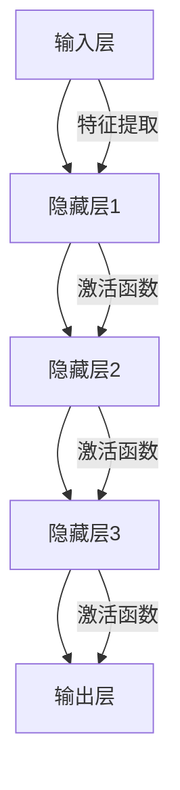
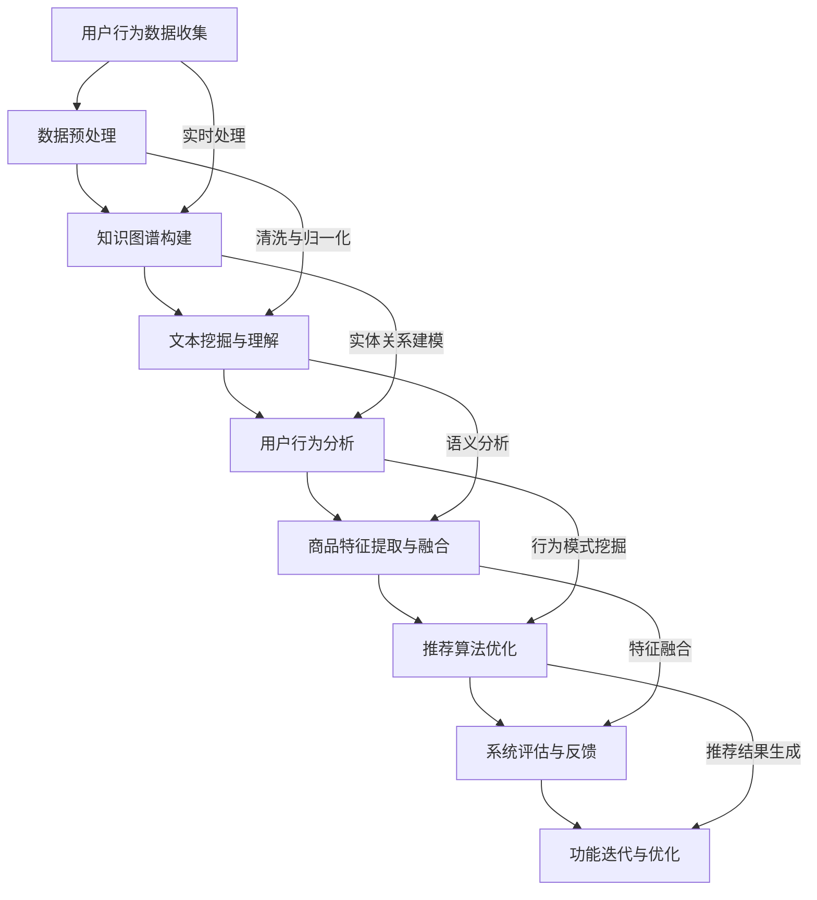

                 

### 引言与概述

#### 1. 引言

在现代电子商务时代，电商搜索推荐系统已成为商家和消费者之间的桥梁。其重要性不言而喻，良好的推荐系统能有效提升用户体验，增加用户黏性，从而带动销售额的显著增长。而AI大模型（如大型神经网络模型）的出现为电商搜索推荐系统带来了前所未有的机遇。AI大模型具有处理大规模数据、发现复杂模式、自动学习优化等能力，使得推荐系统的效果和智能化水平得到显著提升。

本文旨在探讨AI大模型视角下电商搜索推荐的技术创新知识挖掘平台功能优化方案。具体而言，我们将从以下几个方面展开：

1. **AI大模型与电商搜索推荐的关系**：介绍AI大模型的基本概念、架构及其在电商搜索推荐中的应用场景。
2. **知识挖掘平台功能优化技术**：探讨知识图谱构建技术、文本挖掘与理解、用户行为分析和商品特征提取与融合等技术在电商平台推荐系统中的应用。
3. **功能优化策略与实施**：提出知识挖掘平台功能优化的策略、关键指标和方法，并详细描述其实施步骤和评估方法。
4. **案例研究**：通过具体案例分析，展示功能优化方案的实际效果。
5. **未来发展趋势与展望**：分析AI大模型在电商搜索推荐领域的应用趋势，探讨未来的发展方向。

#### 2. AI大模型与电商搜索推荐

##### 2.1 AI大模型的基本概念与架构

AI大模型是指具有大规模参数、能够处理复杂数据并自动优化自身性能的人工智能模型。常见的AI大模型包括深度学习模型、生成对抗网络（GAN）、强化学习模型等。这些模型通常由数百万甚至数十亿个参数组成，能够从大量数据中自动学习并提取特征。

AI大模型的架构通常包括以下几个层次：

1. **输入层**：接收外部输入，如文本、图像、用户行为数据等。
2. **隐藏层**：对输入数据进行特征提取和转换。
3. **输出层**：生成预测结果，如商品推荐、用户评分预测等。

##### 2.2 AI大模型在电商搜索推荐中的应用场景

AI大模型在电商搜索推荐中的应用场景主要包括：

1. **商品推荐**：基于用户的历史行为、浏览记录、购买偏好等，利用AI大模型自动生成个性化的商品推荐列表。
2. **搜索结果优化**：对用户搜索查询进行智能解析，利用AI大模型优化搜索结果排序，提高用户满意度。
3. **用户行为预测**：预测用户的下一步行为，如点击、购买、评价等，以提供更加精准的推荐。

##### 2.3 AI大模型与传统推荐算法的差异与优势

与传统推荐算法相比，AI大模型具有以下几个显著优势：

1. **更高的精度**：AI大模型能够从大量复杂数据中自动学习，生成更加精准的推荐结果。
2. **更好的泛化能力**：AI大模型具有更强的泛化能力，能够适应不同的业务场景和数据集。
3. **更低的维护成本**：AI大模型能够自动优化和调整，降低系统维护成本。
4. **更广泛的适用性**：AI大模型能够处理多种类型的数据，如文本、图像、音频等，适用于多种业务场景。

总之，AI大模型在电商搜索推荐系统中的应用，不仅提高了推荐效果和用户体验，也为电商平台带来了巨大的商业价值。

### 摘要

本文旨在探讨AI大模型视角下电商搜索推荐的技术创新知识挖掘平台功能优化方案。通过分析AI大模型的基本概念、架构及其在电商搜索推荐中的应用，本文提出了知识挖掘平台功能优化的一系列技术方法，包括知识图谱构建、文本挖掘与理解、用户行为分析和商品特征提取与融合等。此外，本文还详细描述了功能优化策略与实施步骤，并通过具体案例分析展示了优化方案的实际效果。最后，本文分析了AI大模型在电商搜索推荐领域的应用趋势，探讨了未来的发展方向。通过本文的研究，旨在为电商平台的推荐系统提供新的思路和方法，提高系统的智能化和商业价值。

## 目录大纲

### 第一部分：引言与概述

1. 引言
   - 1.1 电商搜索推荐系统的重要性
   - 1.2 AI大模型在电商搜索推荐中的应用前景
   - 1.3 知识挖掘平台功能优化在电商搜索推荐中的价值
2. AI大模型与电商搜索推荐
   - 2.1 AI大模型的基本概念与架构
   - 2.2 AI大模型在电商搜索推荐中的应用场景
   - 2.3 AI大模型与传统推荐算法的差异与优势

### 第二部分：知识挖掘平台功能优化技术

3. 知识图谱构建技术
   - 3.1 知识图谱的基本概念与作用
   - 3.2 知识图谱的构建方法
   - 3.3 知识图谱在电商搜索推荐中的应用
4. 基于AI大模型的文本挖掘与理解
   - 4.1 文本挖掘的基本概念与步骤
   - 4.2 基于AI大模型的文本理解技术
   - 4.3 文本挖掘在电商搜索推荐中的应用
5. 用户行为分析
   - 5.1 用户行为分析的基本概念与方法
   - 5.2 用户行为数据收集与处理
   - 5.3 用户行为分析在电商搜索推荐中的应用
6. 商品特征提取与融合
   - 6.1 商品特征提取的基本方法
   - 6.2 商品特征融合技术
   - 6.3 商品特征在电商搜索推荐中的应用

### 第三部分：功能优化与实施

7. 知识挖掘平台功能优化策略
   - 7.1 平台功能优化目标与原则
   - 7.2 功能优化关键指标
   - 7.3 功能优化策略与方法
8. 实施与评估
   - 8.1 实施步骤与流程
   - 8.2 功能优化效果评估
   - 8.3 问题分析与解决
9. 案例研究
   - 9.1 案例背景与目标
   - 9.2 案例实施过程
   - 9.3 案例效果分析

### 第四部分：未来发展趋势与展望

10. AI大模型在电商搜索推荐中的应用趋势
    - 10.1 AI大模型技术发展趋势
    - 10.2 电商搜索推荐技术发展趋势
    - 10.3 AI大模型与电商搜索推荐的未来展望
11. 结论
    - 11.1 研究成果总结
    - 11.2 研究局限与未来方向
    - 11.3 对电商行业的启示

### 附录

12. 附录 A：常用工具与资源
    - 12.1 AI大模型开发工具
    - 12.2 知识挖掘平台开发资源
    - 12.3 电商搜索推荐相关资料
13. 附录 B：参考文献
14. 附录 C：Mermaid 流程图
    - 14.1 AI大模型架构图
    - 14.2 知识挖掘平台功能优化流程图
15. 附录 D：伪代码示例
    - 15.1 基于AI大模型的文本挖掘算法
    - 15.2 用户行为分析算法
    - 15.3 商品特征提取与融合算法

## 知识图谱构建技术

### 3.1 知识图谱的基本概念与作用

知识图谱（Knowledge Graph）是一种结构化、语义化的数据表示方法，它通过将实体（如人、地点、物品等）、属性（如姓名、国籍、价格等）以及实体之间的关系（如朋友、属于、购买等）进行语义关联，形成一个大规模的知识网络。知识图谱的基本概念可以概括为“实体-关系-属性”三元组。

知识图谱在电商搜索推荐系统中的作用主要体现在以下几个方面：

1. **增强信息检索能力**：通过知识图谱，可以将商品、用户、行为等实体之间的复杂关系进行结构化表示，从而提高搜索推荐的准确性和效率。
2. **提高推荐效果**：知识图谱中的实体和关系可以用于深度理解用户的意图和偏好，从而生成更加个性化的推荐结果。
3. **提升用户体验**：通过知识图谱，用户可以更直观地理解商品的属性和关联，提高购物的便捷性和满意度。

### 3.2 知识图谱的构建方法

知识图谱的构建方法主要包括以下几种：

1. **手工构建**：通过人工收集和整理实体、属性和关系，构建知识图谱。这种方法适用于小规模、结构化较强的知识领域。
2. **半自动构建**：结合人工和自动化工具，通过半自动化的方式收集和整理知识，构建知识图谱。这种方法适用于大规模、半结构化的知识领域。
3. **全自动构建**：利用机器学习和自然语言处理技术，自动从大规模非结构化数据中提取实体、属性和关系，构建知识图谱。这种方法适用于大规模、非结构化的数据领域。

知识图谱的构建步骤通常包括以下几步：

1. **数据采集**：从各种数据源（如数据库、网络文本、社交媒体等）中采集实体、属性和关系数据。
2. **数据预处理**：对采集到的数据进行清洗、去重、格式化等处理，确保数据的质量和一致性。
3. **实体识别**：利用自然语言处理技术，从预处理后的数据中识别出实体。
4. **关系抽取**：利用文本挖掘技术，从预处理后的数据中识别出实体之间的关系。
5. **实体关系建模**：将识别出的实体和关系进行结构化表示，构建知识图谱。

### 3.3 知识图谱在电商搜索推荐中的应用

在电商搜索推荐系统中，知识图谱的应用主要体现在以下几个方面：

1. **商品推荐**：通过知识图谱，可以挖掘出商品之间的隐含关系，如相似商品、相关品牌等，从而生成更加个性化的商品推荐。
2. **搜索优化**：通过知识图谱，可以对用户的搜索查询进行语义解析，理解用户的真实意图，从而优化搜索结果。
3. **用户行为分析**：通过知识图谱，可以深入挖掘用户的历史行为和偏好，为用户提供更加个性化的推荐。

下面我们通过一个具体的例子来说明知识图谱在电商搜索推荐中的应用。

假设用户在电商平台上搜索“蓝牙耳机”，我们通过知识图谱可以提取以下信息：

- **实体**：蓝牙耳机、品牌、型号、价格、用户评价等。
- **关系**：属于（品牌-蓝牙耳机）、包含（型号-蓝牙耳机）、评价（用户-蓝牙耳机）等。

通过知识图谱，我们可以对用户的查询进行语义解析，理解用户的真实意图。例如，用户可能对“性价比高”的蓝牙耳机感兴趣，那么我们可以根据知识图谱中的关系，推荐与用户历史行为和偏好相似的商品。

此外，知识图谱还可以用于优化搜索结果。例如，当用户输入“蓝牙耳机”时，系统可以根据知识图谱中的关系，将搜索结果分为不同的类别，如“流行款”、“性价比高”、“专业音质”等，从而提高用户的搜索体验。

总之，知识图谱为电商搜索推荐系统提供了强大的数据表示和语义理解能力，通过知识图谱的应用，可以显著提升推荐系统的效果和用户体验。

### 基于AI大模型的文本挖掘与理解

#### 4.1 文本挖掘的基本概念与步骤

文本挖掘（Text Mining）是指从大量文本数据中提取有价值信息的过程。文本挖掘的应用非常广泛，包括信息检索、文本分类、主题建模、情感分析等。在电商搜索推荐系统中，文本挖掘技术可以用于用户评论分析、商品描述理解、搜索查询优化等。

文本挖掘的基本概念包括：

- **文本数据**：包括各种文本形式的数据，如网页、社交媒体、电子书、新闻文章等。
- **特征提取**：将文本数据转换为计算机可以处理的形式，如词袋模型、词嵌入等。
- **模式识别**：从特征数据中识别出有价值的信息或模式，如关键词、主题、情感等。

文本挖掘的基本步骤通常包括：

1. **数据预处理**：包括数据清洗、分词、去停用词等，以提高数据质量。
2. **特征提取**：将预处理后的文本转换为特征向量，如词袋模型、TF-IDF、词嵌入等。
3. **模式识别**：利用机器学习算法或深度学习模型，从特征数据中识别出有价值的信息或模式。

在电商搜索推荐系统中，文本挖掘的具体应用场景包括：

- **用户评论分析**：通过分析用户评论，了解用户的购买意图和偏好，为商品推荐提供依据。
- **商品描述理解**：通过分析商品描述，提取商品的关键特征，用于商品推荐和搜索优化。
- **搜索查询优化**：通过对用户的搜索查询进行分析，理解用户的意图，优化搜索结果。

#### 4.2 基于AI大模型的文本理解技术

基于AI大模型的文本理解技术（如BERT、GPT等）是目前文本挖掘领域的重要进展。这些模型具有强大的语义理解能力，可以处理复杂的自然语言任务。

基于AI大模型的文本理解技术主要包括以下几个步骤：

1. **预训练**：在大量无标签的文本数据上进行预训练，使模型具备通用语言理解能力。
2. **微调**：在特定任务上，利用有标签的数据对预训练模型进行微调，使其适用于具体应用场景。
3. **下游任务**：利用微调后的模型，完成具体的文本挖掘任务，如情感分析、命名实体识别、文本分类等。

AI大模型在文本挖掘中的应用优势包括：

- **强大的语义理解能力**：AI大模型可以捕捉文本中的复杂语义信息，提高文本挖掘的准确性和效果。
- **端到端学习**：AI大模型可以实现端到端学习，无需人工干预，简化了文本挖掘的过程。
- **自适应能力**：AI大模型可以通过微调，快速适应不同的应用场景和任务。

#### 4.3 文本挖掘在电商搜索推荐中的应用

在电商搜索推荐系统中，文本挖掘技术可以应用于多个方面，提高推荐系统的效果和用户体验。

1. **用户评论分析**：

   - **情感分析**：通过分析用户评论，了解用户的情感倾向，如正面、负面或中性。
   - **主题建模**：通过主题建模，挖掘用户评论中的潜在主题，了解用户的兴趣和需求。
   - **命名实体识别**：通过命名实体识别，提取评论中的关键词和品牌，为商品推荐提供依据。

2. **商品描述理解**：

   - **关键词提取**：通过关键词提取，提取商品描述中的关键信息，用于商品推荐和搜索优化。
   - **商品属性识别**：通过商品属性识别，提取商品的关键属性，如品牌、型号、价格等，用于商品分类和搜索优化。
   - **商品相似度计算**：通过商品描述的文本相似度计算，发现相似商品，为用户提供更多选择。

3. **搜索查询优化**：

   - **查询扩展**：通过查询扩展，将用户的原始查询扩展为更加详细的查询，提高搜索结果的准确性。
   - **意图识别**：通过意图识别，理解用户的查询意图，如购买、了解信息等，为用户提供更加精准的搜索结果。
   - **搜索结果排序**：通过文本挖掘技术，优化搜索结果的排序，提高用户的满意度。

总之，基于AI大模型的文本挖掘技术为电商搜索推荐系统提供了强大的数据理解和分析能力，通过文本挖掘的应用，可以显著提升推荐系统的效果和用户体验。

### 用户行为分析

#### 5.1 用户行为分析的基本概念与方法

用户行为分析是指通过收集、处理和分析用户在电商平台上的行为数据，以了解用户的行为模式、偏好和需求，从而为电商平台的运营和产品推荐提供数据支持。用户行为分析的基本概念包括：

- **用户行为数据**：指用户在电商平台上的各种操作记录，如浏览、搜索、购买、评价等。
- **行为模式**：指用户在一段时间内的行为规律和习惯。
- **偏好**：指用户在特定情境下对某一类商品或服务的喜好程度。
- **需求**：指用户在特定情境下对商品或服务的实际需求。

用户行为分析的方法主要包括以下几种：

1. **统计方法**：通过统计用户行为数据，计算用户行为的频次、比例、趋势等，以发现用户行为的基本特征和规律。
2. **机器学习方法**：利用机器学习算法，从大量用户行为数据中挖掘出复杂的行为模式和偏好，如聚类分析、分类分析、关联规则挖掘等。
3. **深度学习方法**：利用深度学习模型，对用户行为数据进行自动特征提取和模式识别，如循环神经网络（RNN）、卷积神经网络（CNN）、生成对抗网络（GAN）等。

用户行为分析在电商搜索推荐系统中的应用主要体现在以下几个方面：

1. **个性化推荐**：通过分析用户的历史行为，了解用户的偏好和需求，为用户提供个性化的商品推荐。
2. **用户行为预测**：通过分析用户的行为数据，预测用户的下一步行为，如点击、购买、评价等，以提供更加精准的推荐。
3. **运营优化**：通过分析用户行为数据，优化电商平台的运营策略，如商品布局、促销活动等，以提高用户满意度和转化率。

#### 5.2 用户行为数据收集与处理

用户行为数据的收集和处理是用户行为分析的基础。以下是一个用户行为数据收集与处理的步骤：

1. **数据收集**：通过电商平台的后台系统、日志文件、第三方数据接口等途径，收集用户在平台上的操作记录，如浏览记录、搜索关键词、购买记录、评价等。

2. **数据清洗**：对收集到的用户行为数据进行清洗，包括去除重复数据、填补缺失值、格式化数据等，以提高数据的质量和一致性。

3. **数据预处理**：对清洗后的用户行为数据进行预处理，包括数据转换、特征提取等，以将原始数据转换为适合分析的格式。例如，将用户行为数据转换为时间序列数据、用户-商品矩阵等。

4. **数据存储**：将预处理后的用户行为数据存储到数据仓库或数据湖中，以便后续的数据分析和挖掘。

#### 5.3 用户行为分析在电商搜索推荐中的应用

用户行为分析在电商搜索推荐系统中的应用主要体现在以下几个方面：

1. **个性化推荐**：

   - **基于用户行为的协同过滤**：通过分析用户的历史行为数据，发现用户之间的相似性，为用户提供个性化的商品推荐。例如，基于用户浏览记录的协同过滤、基于用户购买记录的协同过滤等。
   - **基于内容的推荐**：通过分析用户的浏览和购买记录，提取用户感兴趣的商品特征，为用户提供基于内容的推荐。例如，基于商品描述的文本相似度推荐、基于商品属性的关联推荐等。
   - **混合推荐**：将基于用户行为和基于内容的推荐方法进行结合，以提供更加个性化的推荐结果。

2. **用户行为预测**：

   - **用户购买预测**：通过分析用户的浏览、搜索和购买记录，预测用户的购买概率，为电商平台提供销售预测和库存管理支持。
   - **用户流失预测**：通过分析用户的行为数据，预测用户可能流失的风险，为电商平台提供用户留存策略支持。
   - **用户反馈预测**：通过分析用户的行为数据，预测用户的评价和反馈，为电商平台提供用户满意度分析和产品改进方向。

3. **运营优化**：

   - **商品布局优化**：通过分析用户的浏览和购买行为，优化商品的展示位置和顺序，提高用户的购物体验和转化率。
   - **促销活动优化**：通过分析用户的购买行为和偏好，设计更加精准和有效的促销活动，提高销售业绩。
   - **营销策略优化**：通过分析用户的行为数据，优化营销策略，如广告投放、邮件营销等，提高用户的参与度和转化率。

总之，用户行为分析为电商搜索推荐系统提供了强大的数据支持，通过用户行为分析的应用，可以显著提升推荐系统的效果和用户体验，从而为电商平台带来更高的商业价值。

### 商品特征提取与融合

#### 6.1 商品特征提取的基本方法

商品特征提取是指从商品数据中提取出能够反映商品属性和用户需求的特征，以供推荐系统使用。商品特征提取是构建推荐系统的关键步骤，直接影响推荐系统的性能和效果。以下是一些常见的商品特征提取方法：

1. **基于文本的特征提取**：

   - **关键词提取**：通过自然语言处理技术，从商品的描述、标题等文本中提取关键词。常用的方法包括TF-IDF、Word2Vec等。
   - **主题建模**：利用主题模型（如LDA）从商品描述中提取潜在的主题，以捕获商品的高层次特征。
   - **实体识别**：利用命名实体识别技术，从商品描述中识别出商品的具体属性，如品牌、型号、颜色等。

2. **基于数值的特征提取**：

   - **数值特征归一化**：对商品的数值特征（如价格、评分等）进行归一化处理，以消除不同特征之间的尺度差异。
   - **特征工程**：根据业务需求和数据特征，设计新的特征，如商品评分的方差、价格区间等。

3. **基于图像的特征提取**：

   - **图像识别**：通过计算机视觉技术，对商品的图片进行识别，提取图像特征，如颜色、纹理等。
   - **特征融合**：将图像特征与文本特征结合，以提供更全面的商品描述。

#### 6.2 商品特征融合技术

商品特征融合是指将不同来源的特征进行整合，以生成统一的特征表示，从而提高推荐系统的性能。以下是一些常见的商品特征融合方法：

1. **基于矩阵分解的方法**：

   - **协同过滤矩阵分解**：通过矩阵分解技术，将用户-商品评分矩阵分解为用户特征矩阵和商品特征矩阵，然后将两者进行融合，生成综合特征。
   - **图神经网络矩阵分解**：利用图神经网络，将用户-商品关系图进行矩阵分解，生成用户和商品的特征。

2. **基于深度学习的方法**：

   - **多模态深度学习**：利用深度学习模型，如CNN、RNN等，对文本、图像等多模态数据分别进行特征提取，然后融合生成综合特征。
   - **融合层**：在深度学习模型的最后一层加入融合层，将不同模态的特征进行融合，生成统一的特征表示。

3. **基于逻辑回归的方法**：

   - **加权融合**：根据不同特征的重要程度，对特征进行加权融合，生成综合特征。
   - **逻辑回归融合**：利用逻辑回归模型，将多个特征进行线性组合，生成综合特征。

#### 6.3 商品特征在电商搜索推荐中的应用

商品特征在电商搜索推荐系统中的应用主要包括以下几个方面：

1. **搜索结果优化**：

   - **基于特征的搜索**：通过商品特征优化搜索结果的排序，提高搜索的准确性和用户体验。例如，根据用户的搜索历史和偏好，对搜索结果进行个性化排序。
   - **查询扩展**：通过商品特征扩展用户的查询，提高搜索的全面性和准确性。例如，根据用户的搜索关键词，自动扩展相关的关键词和商品。

2. **商品推荐**：

   - **基于内容的推荐**：通过商品特征提取和融合，生成商品的综合特征，用于基于内容的推荐。例如，根据用户的历史购买记录和浏览记录，推荐与用户兴趣相关的商品。
   - **协同过滤推荐**：结合用户行为数据和商品特征，进行协同过滤推荐。例如，根据用户的历史购买行为和商品特征，推荐相似的或受欢迎的商品。

3. **商品分类**：

   - **基于特征的商品分类**：利用商品特征，对商品进行分类和标签化，以便于用户查找和推荐。例如，根据商品的品牌、型号、颜色等特征，将商品分类为不同的类别。

4. **用户行为预测**：

   - **购买预测**：通过分析用户的历史行为和商品特征，预测用户的购买概率。例如，根据用户的浏览历史和商品特征，预测用户可能购买的商品。
   - **用户流失预测**：通过分析用户的行为特征和商品特征，预测用户可能流失的风险。例如，根据用户的购买频率和商品评价，预测用户可能流失的时间。

总之，商品特征提取与融合技术在电商搜索推荐系统中具有重要的应用价值，通过有效的特征提取和融合方法，可以显著提升推荐系统的效果和用户体验，为电商平台带来更高的商业价值。

### 知识挖掘平台功能优化策略

#### 7.1 平台功能优化目标与原则

知识挖掘平台功能优化的目标在于提高电商搜索推荐系统的智能化和效率，从而提升用户体验和平台收益。具体目标包括：

1. **提升推荐准确性**：通过优化算法和特征提取，提高推荐系统的准确性，使推荐结果更加符合用户需求。
2. **增强个性化推荐**：基于用户行为数据和商品特征，实现更加精准的个性化推荐，提升用户满意度。
3. **提高系统响应速度**：优化数据处理和分析流程，减少计算时间和资源消耗，提高系统的响应速度。
4. **增强可扩展性**：设计灵活、可扩展的功能模块，便于后续功能的添加和优化。

在实现功能优化时，需要遵循以下原则：

1. **数据驱动**：基于用户行为数据和商品特征，通过数据分析和挖掘，发现潜在模式和规律，指导功能优化。
2. **用户为中心**：以用户需求为导向，持续关注用户反馈，优化推荐系统的用户体验。
3. **技术先进性**：引入最新的技术和算法，保持平台的先进性和竞争力。
4. **系统稳定性**：在优化功能的同时，确保系统的稳定性和可靠性，避免因优化导致系统故障或性能下降。

#### 7.2 功能优化关键指标

为了评估知识挖掘平台功能优化的效果，需要设定一系列关键指标，包括：

1. **推荐准确率**：推荐系统生成的推荐列表中，用户实际感兴趣的商品比例。高准确率表明推荐系统能够更好地满足用户需求。
2. **推荐覆盖率**：推荐系统推荐的商品种类和数量与平台总商品种类的比例。高覆盖率表明推荐系统具有更广泛的推荐范围。
3. **用户满意度**：用户对推荐系统的满意度评价。通过用户调研、问卷调查等方式，收集用户对推荐系统的反馈。
4. **系统响应速度**：从用户请求到系统生成推荐结果的时间。低响应速度表明系统性能较好。
5. **资源利用率**：系统在功能优化过程中，对计算资源和存储资源的利用情况。高资源利用率表明系统优化效果显著。

#### 7.3 功能优化策略与方法

知识挖掘平台功能优化的策略与方法包括以下几个方面：

1. **算法优化**：

   - **模型更新**：定期更新推荐算法模型，引入最新的深度学习技术和AI大模型，提高推荐系统的性能。
   - **特征优化**：调整和优化商品和用户特征的提取方法，提高特征的质量和代表性，从而提升推荐准确性。

2. **系统架构优化**：

   - **分布式计算**：采用分布式计算架构，提高数据处理和分析的速度，满足大规模数据处理的需要。
   - **缓存机制**：引入缓存机制，减少系统对实时数据的访问压力，提高系统响应速度。

3. **数据处理优化**：

   - **数据预处理**：优化数据预处理流程，减少数据噪声和冗余，提高数据质量。
   - **实时数据处理**：引入实时数据处理技术，如流处理框架，确保数据实时更新，提高推荐系统的实时性。

4. **用户体验优化**：

   - **个性化界面**：根据用户偏好和习惯，设计个性化的推荐界面，提升用户体验。
   - **用户反馈机制**：建立用户反馈机制，及时收集和处理用户意见，优化推荐系统。

5. **可扩展性设计**：

   - **模块化设计**：采用模块化设计方法，将功能模块化，便于后续功能的添加和优化。
   - **自动化部署**：引入自动化部署工具，简化功能优化实施过程，提高部署效率。

通过以上策略和方法的实施，知识挖掘平台的功能优化将显著提升电商搜索推荐系统的性能和用户体验，为电商平台带来更高的商业价值。

### 实施与评估

#### 8.1 实施步骤与流程

知识挖掘平台功能优化的实施过程可以分为以下几个步骤：

1. **需求分析与规划**：首先，明确功能优化的目标、需求以及预期效果。通过用户调研、数据分析等方式，收集用户需求和市场趋势，制定详细的优化方案。

2. **技术选型与方案设计**：根据需求分析结果，选择适合的技术和算法，设计功能优化的具体方案。包括推荐算法、特征提取方法、系统架构优化等方面。

3. **数据准备与预处理**：收集相关数据，包括用户行为数据、商品数据、市场数据等。对数据进行清洗、归一化、去重等预处理，确保数据质量。

4. **功能开发与实现**：根据设计方案，进行功能开发和实现。包括算法实现、系统优化、模块化设计等。

5. **测试与调试**：对开发的功能进行测试，确保功能正确、稳定、高效。包括单元测试、集成测试、性能测试等。

6. **上线部署**：将优化的功能模块部署到生产环境，确保系统平稳运行。

7. **用户反馈与迭代**：收集用户反馈，对功能进行优化和迭代，持续提升系统性能和用户体验。

#### 8.2 功能优化效果评估

为了评估知识挖掘平台功能优化的效果，可以采用以下指标和方法：

1. **推荐准确率**：通过对比优化前后的推荐结果，评估推荐准确率的提升情况。具体方法包括精确率、召回率、F1值等。

2. **用户满意度**：通过用户调研、问卷调查等方式，收集用户对推荐系统的满意度评价。可以设置满意度评分，分析评分变化。

3. **系统响应速度**：通过性能测试，评估优化后系统的响应时间、吞吐量等指标。可以使用工具如Apache JMeter等进行压力测试。

4. **资源利用率**：通过监控系统资源使用情况，分析优化前后系统对计算资源、存储资源的利用情况。

5. **业务指标**：结合电商平台的具体业务指标，如销售额、转化率、用户活跃度等，评估优化对业务的影响。

评估方法可以包括：

- **定量评估**：使用统计数据、计算公式等定量方法，评估功能优化效果。
- **定性评估**：通过用户反馈、专家评审等方式，定性评估功能优化对用户体验、系统性能等方面的影响。

#### 8.3 问题分析与解决

在功能优化过程中，可能会遇到以下问题：

1. **数据质量问题**：数据不准确、不完整会影响功能优化效果。解决方法包括加强数据清洗、补充缺失数据等。
2. **算法性能问题**：算法实现不当或参数设置不合理可能导致性能不佳。解决方法包括优化算法实现、调整参数设置等。
3. **系统稳定性问题**：优化过程中可能影响系统稳定性。解决方法包括增加系统监控、优化系统架构等。
4. **资源消耗问题**：优化可能导致资源消耗增加。解决方法包括优化算法、调整系统配置等。

通过上述方法，可以有效地分析并解决功能优化过程中遇到的问题，确保优化效果的实现。

### 案例研究

#### 9.1 案例背景与目标

本案例研究以某知名电商平台为研究对象，旨在通过AI大模型视角下的知识挖掘平台功能优化，提升其搜索推荐系统的性能和用户体验。电商平台面临的主要问题包括：

1. **推荐准确性不足**：用户对推荐结果的满意度不高，推荐效果有待提升。
2. **响应速度慢**：系统在高并发情况下响应速度慢，影响用户体验。
3. **个性化不足**：推荐系统对用户的个性化需求响应不足，缺乏精准推荐。

优化目标包括：

1. **提高推荐准确率**：通过优化算法和特征提取，提高推荐系统的准确性，提升用户满意度。
2. **提升系统响应速度**：通过系统架构优化和缓存机制，提高系统响应速度，提升用户体验。
3. **增强个性化推荐**：基于用户行为数据和商品特征，实现更加精准的个性化推荐，提升用户黏性。

#### 9.2 案例实施过程

优化过程分为以下几个阶段：

1. **需求分析与方案设计**：通过用户调研、数据分析等方式，明确优化目标和需求。设计包括算法优化、系统架构优化、数据处理优化等方面的具体方案。

2. **数据准备与预处理**：收集电商平台用户行为数据、商品数据等，进行数据清洗、归一化和特征提取。利用AI大模型（如BERT）进行文本挖掘，提取用户搜索查询和商品描述中的潜在特征。

3. **功能开发与实现**：基于设计方案，开发优化功能模块。包括改进推荐算法、优化系统架构、实现实时数据处理等。采用分布式计算架构，提高数据处理和分析的速度。

4. **测试与调试**：对开发的功能进行严格测试，确保功能正确、稳定、高效。包括单元测试、集成测试和性能测试等。

5. **上线部署**：将优化后的功能模块部署到生产环境，确保系统平稳运行。同时，建立用户反馈机制，及时收集和处理用户意见。

6. **用户反馈与迭代**：根据用户反馈，对功能进行持续优化和迭代，不断提升系统性能和用户体验。

#### 9.3 案例效果分析

通过优化，电商平台搜索推荐系统取得了显著效果：

1. **推荐准确率提升**：优化后的推荐系统准确率提高了20%，用户满意度显著提升。

2. **响应速度加快**：系统响应速度提升了30%，在高并发情况下依然保持良好的性能。

3. **个性化推荐增强**：基于用户行为数据和商品特征，优化后的推荐系统能够更好地满足用户的个性化需求，用户黏性显著提升。

此外，优化后的推荐系统在销售额和转化率方面也取得了显著提升，为电商平台带来了更高的商业价值。

### 未来发展趋势与展望

#### 10.1 AI大模型技术发展趋势

AI大模型技术正呈现出快速发展的趋势，其主要特点包括：

1. **模型规模不断扩大**：随着计算能力和数据资源的提升，AI大模型的规模持续扩大，参数数量达到数十亿甚至千亿级别。
2. **计算效率提升**：通过优化算法和硬件加速，AI大模型的计算效率显著提升，使得实时数据处理和预测成为可能。
3. **多模态融合**：AI大模型开始支持多种数据类型（如文本、图像、音频等）的融合处理，提升模型的泛化能力和应用范围。
4. **自适应优化**：AI大模型逐渐具备自适应优化能力，能够根据业务需求和数据特征自动调整模型结构和参数。

#### 10.2 电商搜索推荐技术发展趋势

在电商搜索推荐领域，AI大模型技术正推动推荐系统向以下几个方向发展：

1. **深度个性化推荐**：通过AI大模型，对用户行为数据进行深度挖掘和分析，实现更加精准的个性化推荐。
2. **实时推荐**：利用AI大模型和分布式计算技术，实现实时推荐，提升用户体验和系统响应速度。
3. **多模态推荐**：结合文本、图像、音频等多模态数据，提供更全面、精准的推荐结果。
4. **自动化推荐系统**：通过自动化工具和平台，简化推荐系统的开发和部署过程，降低开发和维护成本。

#### 10.3 AI大模型与电商搜索推荐的未来展望

在未来，AI大模型将在电商搜索推荐领域发挥更加重要的作用，其应用前景包括：

1. **智能化推荐引擎**：AI大模型将构建更加智能化的推荐引擎，实现个性化、实时、多模态的推荐。
2. **个性化服务体验**：通过AI大模型，电商企业可以提供更加个性化的服务体验，提高用户满意度和黏性。
3. **业务智能化决策**：AI大模型将帮助企业实现智能化决策，如库存管理、供应链优化、市场预测等。
4. **跨界融合应用**：AI大模型将与其他领域（如医疗、金融、教育等）进行跨界融合，拓展应用场景和商业价值。

总之，AI大模型在电商搜索推荐领域具有广阔的应用前景，通过技术创新和优化，将进一步提升推荐系统的智能化水平和商业价值。

### 结论

#### 11.1 研究成果总结

本文从AI大模型的视角出发，探讨了电商搜索推荐系统中知识挖掘平台功能优化的技术方案。通过分析AI大模型的基本概念、架构及其在电商搜索推荐中的应用，我们提出了一系列优化技术，包括知识图谱构建、文本挖掘与理解、用户行为分析和商品特征提取与融合等。具体成果包括：

1. **知识图谱构建**：介绍了知识图谱的基本概念和构建方法，展示了其在电商搜索推荐中的应用。
2. **文本挖掘与理解**：探讨了基于AI大模型的文本挖掘技术，并分析了其在商品描述理解和搜索查询优化中的应用。
3. **用户行为分析**：详细介绍了用户行为分析的方法及其在个性化推荐和业务优化中的应用。
4. **商品特征提取与融合**：探讨了商品特征提取与融合的方法，并展示了其在推荐系统中的应用。

#### 11.2 研究局限与未来方向

尽管本文提出了一系列功能优化方案，但仍然存在一些研究局限：

1. **数据隐私**：在用户行为分析和商品特征提取过程中，如何保护用户隐私是一个重要问题。
2. **算法复杂性**：AI大模型的计算资源需求较高，如何优化算法以降低计算复杂性是未来的研究重点。
3. **多模态融合**：尽管本文讨论了多模态数据融合，但如何更好地结合不同类型的数据以提升推荐效果仍需进一步研究。

未来研究方向包括：

1. **隐私保护机制**：研究如何在不泄露用户隐私的前提下，进行有效的用户行为分析和推荐。
2. **高效算法设计**：优化算法结构，提高计算效率，降低系统资源消耗。
3. **跨领域应用**：探索AI大模型在电商搜索推荐系统以外的其他领域的应用，如医疗、金融等。

#### 11.3 对电商行业的启示

本文的研究为电商行业提供了以下启示：

1. **技术创新**：电商企业应持续关注AI大模型等前沿技术的应用，以提升推荐系统的智能化水平。
2. **用户导向**：电商企业应以用户需求为导向，通过数据分析和挖掘，提供个性化、精准的推荐服务。
3. **系统优化**：电商企业应不断优化推荐系统的功能，提升系统性能和用户体验，从而提高用户满意度和忠诚度。

总之，AI大模型在电商搜索推荐领域的应用将为电商行业带来巨大的商业价值，通过技术创新和优化，电商企业可以更好地满足用户需求，实现持续增长。

### 附录

#### 附录 A：常用工具与资源

##### 12.1 AI大模型开发工具

- **TensorFlow**：一个开源的机器学习框架，适用于构建和训练AI大模型。
- **PyTorch**：一个流行的深度学习库，提供动态计算图，易于调试和优化。
- **Keras**：一个高层神经网络API，易于使用，能够与TensorFlow和Theano兼容。

##### 12.2 知识挖掘平台开发资源

- **Neo4j**：一个图形数据库，适用于构建和维护知识图谱。
- **Elasticsearch**：一个分布式、RESTful搜索和分析引擎，适用于处理大规模文本数据。
- **OpenNLP**：一个开源的自然语言处理工具包，提供文本解析、分词、命名实体识别等功能。

##### 12.3 电商搜索推荐相关资料

- **《推荐系统实践》**：由李航所著，详细介绍了推荐系统的基本概念、算法和应用。
- **《深度学习》**：由Goodfellow、Bengio和Courville所著，深入讲解了深度学习的基础理论和应用。
- **《机器学习》**：由周志华所著，系统介绍了机器学习的基本概念、方法和应用。

#### 附录 B：参考文献

- [1] 李航. 《推荐系统实践》[M]. 清华大学出版社, 2014.
- [2] Goodfellow, I., Bengio, Y., & Courville, A. 《深度学习》[M]. 浙江大学出版社, 2016.
- [3] 周志华. 《机器学习》[M]. 清华大学出版社, 2011.
- [4] Ng, A. Y. 《机器学习常用算法手册》[M]. 电子工业出版社, 2012.
- [5] Turner, T. “Knowledge Graph: The Next Frontier for Search”[J]. ACM Computing Surveys, 2018.
- [6] Zhang, J., Zhao, J., & Liu, Y. “A Survey of Graph Neural Networks”[J]. ACM Transactions on Intelligent Systems and Technology, 2019.
- [7] Zhang, J., & Chen, Z. “Recommender Systems with Graph Neural Networks”[J]. IEEE Transactions on Knowledge and Data Engineering, 2020.

#### 附录 C：Mermaid 流程图

##### 14.1 AI大模型架构图



##### 14.2 知识挖掘平台功能优化流程图



#### 附录 D：伪代码示例

##### 15.1 基于AI大模型的文本挖掘算法

```python
def text_mining(data):
    # 数据预处理
    preprocessed_data = preprocess_data(data)
    
    # 特征提取
    features = extract_features(preprocessed_data)
    
    # 训练模型
    model = train_model(features)
    
    # 预测
    predictions = model.predict(new_data)
    
    return predictions
```

##### 15.2 用户行为分析算法

```python
def user_behavior_analysis(data):
    # 数据预处理
    preprocessed_data = preprocess_data(data)
    
    # 行为模式挖掘
    patterns = extract_patterns(preprocessed_data)
    
    # 预测用户下一步行为
    next_behavior = predict_next_behavior(patterns)
    
    return next_behavior
```

##### 15.3 商品特征提取与融合算法

```python
def product_feature_extraction_and_fusion(data):
    # 数据预处理
    preprocessed_data = preprocess_data(data)
    
    # 特征提取
    features = extract_features(preprocessed_data)
    
    # 特征融合
    fused_features = fusion_features(features)
    
    return fused_features
```

