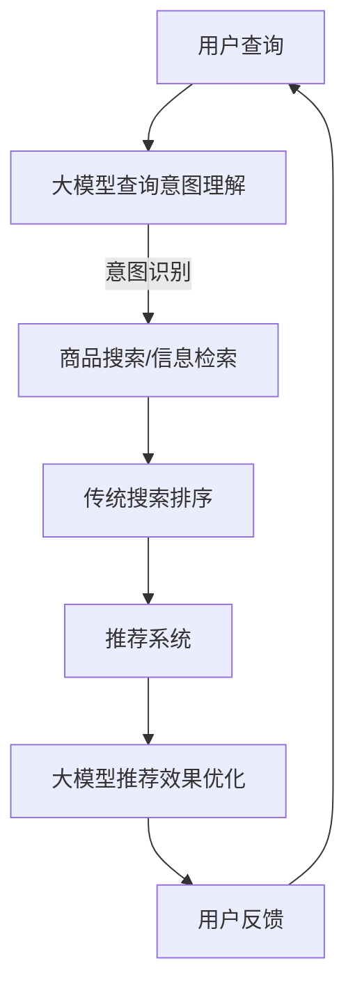

                 


为了撰写一篇高质量的技术博客文章，我们将按照以下步骤进行思考和分析：

### 第一步：明确文章的目标和受众

- **目标：** 我们的目的是撰写一篇关于AI大模型在电商搜索推荐中技术赋能业务的文章。
- **受众：** 受众是IT行业的专业人士、电商行业的技术人员以及对人工智能和电商搜索推荐感兴趣的技术爱好者。

### 第二步：确定文章的核心概念和架构

- **核心概念：**
  - AI大模型
  - 电商搜索推荐系统
  - 技术赋能业务

- **架构设计：**
  - 概述
  - 技术架构
  - 应用实践
  - 业务优化
  - 未来展望

### 第三步：撰写文章的开头部分

- **引言：** 简要介绍AI大模型在电商搜索推荐中的重要性。
- **关键词：** AI大模型、电商搜索、推荐系统、技术赋能。

### 第四步：详细阐述每个章节的内容

#### 第一部分: AI与电商搜索推荐概述

- **背景介绍：** 介绍AI大模型和电商搜索推荐系统的背景知识。
- **核心概念与联系：** 使用Mermaid流程图展示AI大模型与电商搜索推荐系统的关系。
- **图表：** 提供相关的数据或案例，以支持观点。

#### 第二部分: 电商搜索推荐系统的技术架构

- **数据收集与处理：** 详细介绍数据收集、处理和优化的方法。
- **搜索引擎架构设计：** 阐述搜索引擎的基本原理、关键技术和性能优化。
- **推荐系统架构设计：** 解释推荐系统的基本原理、关键技术和性能优化。

#### 第三部分: AI大模型在电商搜索推荐中的应用

- **应用原理：** 讲解AI大模型在搜索和推荐中的具体应用。
- **应用实践：** 分享具体的应用案例，如基于BERT的电商搜索、基于GPT的电商推荐等。

#### 第四部分: 业务视角下的AI大模型优化

- **业务目标与AI大模型的关系：** 分析AI大模型如何帮助实现业务目标。
- **AI大模型优化策略：** 提供数据优化、模型优化和系统优化的具体策略。
- **实际案例：** 分析电商业务中AI大模型的应用案例。

#### 第五部分: 未来展望与趋势

- **技术发展趋势：** 分析AI大模型在电商搜索推荐领域的未来发展方向。
- **业务模式创新：** 探讨AI大模型如何推动电商业务模式的创新。

### 第五步：撰写文章的结尾部分

- **总结：** 总结文章的主要观点和结论。
- **最佳实践 tips：** 提出一些实用的建议，帮助读者将AI大模型应用于电商搜索推荐系统。
- **拓展阅读：** 推荐一些相关的阅读材料，以供读者深入了解。

### 第六步：审查和修改

- **审查：** 检查文章的结构、逻辑、语法和内容是否完整。
- **修改：** 根据审查结果进行必要的修改，确保文章质量。

### 第七步：添加作者信息

- 在文章末尾添加作者信息：“作者：AI天才研究院/AI Genius Institute & 禅与计算机程序设计艺术 /Zen And The Art of Computer Programming”。

通过以上步骤，我们可以撰写一篇逻辑清晰、内容丰富的技术博客文章，为读者提供关于AI大模型在电商搜索推荐中技术赋能业务的深入见解。让我们开始写作吧！### 文章标题：AI大模型视角下电商搜索推荐的技术赋能业务思路

## 关键词：
- AI大模型
- 电商搜索推荐
- 技术赋能
- 业务优化
- 数据处理

## 摘要：
本文从AI大模型的视角出发，详细探讨了其在电商搜索推荐系统中的应用与业务赋能。首先，介绍了AI大模型的基本概念与特点，随后深入分析了电商搜索推荐系统的技术架构，探讨了数据收集与处理、搜索引擎和推荐系统设计的关键技术。接着，通过具体应用案例，展示了AI大模型在电商搜索和推荐中的实际应用。随后，从业务视角出发，提出了AI大模型优化的策略和实际案例。最后，对AI大模型在电商搜索推荐中的未来趋势进行了展望，并总结了最佳实践和拓展阅读资源。本文旨在为从事电商技术领域的研究者与实践者提供有价值的参考。

## 目录：
----------------------------------------------------------------

### 第一部分: AI与电商搜索推荐概述
----------------------------------------------------------------

#### 1.1 AI与电商搜索推荐概述
#### 1.1.1 AI技术对电商搜索推荐的赋能
#### 1.1.2 电商搜索推荐系统的挑战与机遇

#### 1.2 AI大模型的基础知识
#### 1.2.1 大模型的定义与特点
#### 1.2.2 大模型的结构与原理
#### 1.2.3 大模型的应用场景

### 第二部分: 电商搜索推荐系统的技术架构
----------------------------------------------------------------

#### 2.1 数据收集与处理
#### 2.1.1 数据源的选择与获取
#### 2.1.2 数据预处理方法
#### 2.1.3 数据质量评估与优化

#### 2.2 搜索引擎架构设计
#### 2.2.1 搜索引擎的基本原理
#### 2.2.2 搜索引擎的关键技术
#### 2.2.3 搜索引擎的性能优化

#### 2.3 推荐系统架构设计
#### 2.3.1 推荐系统的基本原理
#### 2.3.2 推荐系统的关键技术
#### 2.3.3 推荐系统的性能优化

### 第三部分: AI大模型在电商搜索推荐中的应用
----------------------------------------------------------------

#### 3.1 大模型在搜索推荐中的应用原理
#### 3.1.1 大模型在搜索中的应用
#### 3.1.2 大模型在推荐中的应用
#### 3.1.3 大模型在搜索推荐系统中的融合

#### 3.2 大模型在电商搜索推荐中的应用实践
#### 3.2.1 应用案例一：基于BERT的电商搜索
#### 3.2.2 应用案例二：基于GPT的电商推荐
#### 3.2.3 应用案例三：多模型融合的电商搜索推荐

### 第四部分: 业务视角下的AI大模型优化
----------------------------------------------------------------

#### 4.1 业务目标与AI大模型的关系
#### 4.1.1 业务目标的确定
#### 4.1.2 AI大模型与业务目标的适配

#### 4.2 AI大模型优化策略
#### 4.2.1 数据优化
#### 4.2.2 模型优化
#### 4.2.3 系统优化

#### 4.3 AI大模型在实际业务中的应用案例
#### 4.3.1 案例一：电商平台商品搜索优化
#### 4.3.2 案例二：电商平台个性化推荐系统优化
#### 4.3.3 案例三：电商业务流程优化

### 第五部分: 未来展望与趋势
----------------------------------------------------------------

#### 5.1 电商搜索推荐的未来发展
#### 5.1.1 技术发展趋势
#### 5.1.2 业务模式创新

#### 5.2 AI大模型在电商搜索推荐中的未来应用
#### 5.2.1 新的应用场景
#### 5.2.2 新的技术挑战

#### 5.3 AI大模型视角下的电商搜索推荐业务展望
#### 5.3.1 业务价值的提升
#### 5.3.2 业务模式的转变

----------------------------------------------------------------

接下来，我们将深入探讨每一部分的内容，确保文章的逻辑清晰、内容丰富且具有实际应用价值。我们将遵循Mermaid流程图、伪代码、latex公式和实际案例讲解等要求，确保文章的专业性和可读性。首先，从AI与电商搜索推荐概述部分开始。### 第一部分: AI与电商搜索推荐概述

#### 1.1 AI与电商搜索推荐概述

随着互联网和电子商务的快速发展，用户在电商平台上对搜索和推荐系统提出了更高的要求。传统的搜索推荐系统往往依赖于统计方法和规则引擎，但难以应对海量数据和复杂用户行为。AI技术的引入，尤其是AI大模型的出现，为电商搜索推荐系统带来了新的机遇和挑战。

**1.1.1 AI技术对电商搜索推荐的赋能**

AI大模型具有强大的数据分析和学习能力，能够从海量数据中提取有价值的信息，为电商搜索推荐系统提供以下几方面的赋能：

- **个性化推荐：** AI大模型可以根据用户的历史行为和兴趣偏好，提供个性化的商品推荐，提高用户满意度。
- **精准搜索：** AI大模型可以通过理解用户的搜索意图，提供更准确的搜索结果，提升搜索体验。
- **智能优化：** AI大模型可以实时分析用户行为数据，优化推荐和搜索算法，提高系统的效果和效率。
- **智能客服：** AI大模型可以应用于智能客服系统，通过自然语言处理技术，提供高效、准确的客户服务。

**1.1.2 电商搜索推荐系统的挑战与机遇**

电商搜索推荐系统面临的挑战主要包括：

- **数据多样性与复杂性：** 电商平台的数据来源多样，数据量大且维度复杂，如何有效地处理和利用这些数据是一个挑战。
- **实时性与并发性：** 用户对搜索和推荐系统的响应速度要求高，如何保证系统的实时性和高并发处理能力是一个技术难题。
- **算法透明性与公平性：** 电商搜索推荐系统需要确保算法的透明性和公平性，避免出现歧视和不公平的现象。

然而，这些挑战也带来了巨大的机遇：

- **技术创新：** AI大模型的出现为电商搜索推荐系统提供了新的技术手段，推动了相关领域的研究和发展。
- **业务增长：** 通过提高搜索推荐系统的效果，电商平台可以吸引更多用户，提升用户粘性，从而实现业务增长。
- **用户体验优化：** AI大模型可以帮助电商平台提供更个性化的服务，提升用户体验，增强用户忠诚度。

#### 1.2 AI大模型的基础知识

AI大模型（Large Model）通常指的是具有数亿至数十亿参数的神经网络模型，如GPT、BERT等。这些模型通过大量的数据预训练，能够自动学习数据中的隐含结构和规则，为下游任务提供强大的基础。

**1.2.1 大模型的定义与特点**

- **定义：** 大模型（Large Model）指的是具有数亿至数十亿参数的神经网络模型，如GPT、BERT等。
- **特点：**
  - 参数量巨大：大模型具有数亿至数十亿个参数，能够捕获复杂的数据模式。
  - 强大的表示学习能力：大模型能够从海量数据中自动提取特征，具有强大的表示学习能力。
  - 高效的泛化能力：大模型能够将学习到的知识应用于新的数据集，具有高效的泛化能力。

**1.2.2 大模型的结构与原理**

大模型通常由多个层级的神经网络组成，包括编码器（Encoder）和解码器（Decoder）等。编码器负责将输入数据编码为高维表示，解码器则负责将高维表示解码为输出结果。

- **结构：**
  - **编码器：** 编码器负责将输入数据编码为高维表示，通常采用多个卷积层或循环神经网络（RNN）。
  - **解码器：** 解码器负责将高维表示解码为输出结果，通常也采用多个卷积层或循环神经网络（RNN）。
  - **注意力机制：** 注意力机制（Attention Mechanism）是编码器和解码器之间的一种机制，能够使模型更关注输入数据中的关键部分。

- **原理：**
  - **预训练：** 大模型通过在大量无监督数据上进行预训练，学习到数据中的通用特征和模式。
  - **微调：** 在预训练的基础上，大模型通过在特定任务上进行微调，使其适应下游任务的需求。

**1.2.3 大模型的应用场景**

大模型在自然语言处理、计算机视觉、语音识别等领域有广泛应用，能够处理复杂、高维的数据。在电商搜索推荐系统中，大模型可以应用于以下场景：

- **个性化推荐：** 大模型可以根据用户的历史行为和兴趣偏好，提供个性化的商品推荐。
- **智能搜索：** 大模型可以通过理解用户的搜索意图，提供更准确的搜索结果。
- **智能客服：** 大模型可以应用于智能客服系统，提供高效、准确的客户服务。

通过以上内容，我们对AI大模型在电商搜索推荐中的应用有了初步的了解。接下来，我们将深入探讨电商搜索推荐系统的技术架构。这将帮助我们更好地理解AI大模型在该系统中的应用原理和实现方法。在下一部分中，我们将详细介绍电商搜索推荐系统的技术架构。|im_sep|### 第二部分: 电商搜索推荐系统的技术架构

#### 2.1 数据收集与处理

电商搜索推荐系统的核心在于数据，因此数据收集与处理是至关重要的一环。在这一部分，我们将探讨数据源的选择与获取、数据预处理方法以及数据质量评估与优化。

**2.1.1 数据源的选择与获取**

电商平台的搜索推荐系统需要收集多种类型的数据，包括用户行为数据、商品数据、交易数据等。

- **用户行为数据：** 包括用户的浏览记录、搜索历史、购买行为等。这些数据可以反映用户的需求和兴趣。
- **商品数据：** 包括商品的描述、属性、标签等。这些数据用于构建商品特征，用于推荐和搜索。
- **交易数据：** 包括订单数据、交易历史等。这些数据可以用于分析用户的购买偏好和行为模式。

数据源的选择与获取有以下几种方法：

- **数据爬取：** 利用爬虫技术从电商平台网站、社交媒体等渠道获取数据。
- **API接口：** 利用电商平台提供的API接口获取数据。
- **内部数据共享：** 在企业内部获取已有的数据，如用户行为数据和商品数据。

**2.1.2 数据预处理方法**

数据预处理是数据科学中至关重要的一步，其目的是将原始数据转换为适合建模的数据。

- **数据清洗：** 处理数据中的噪声、缺失值、异常值等。例如，处理缺失值可以通过填充、插值等方法来处理。
- **数据转换：** 将数据格式化、编码，为模型训练做好准备。例如，将文本数据编码为向量，将分类数据转换为独热编码。
- **特征提取：** 从原始数据中提取有用的特征，用于训练模型。例如，通过词频统计提取文本数据的特征，通过特征工程提取商品数据的特征。

**2.1.3 数据质量评估与优化**

数据质量直接影响模型的性能和效果。因此，对数据质量进行评估和优化是必不可少的。

- **数据质量指标：** 包括完整性、一致性、准确性等。完整性指数据是否完整，一致性指数据是否一致，准确性指数据是否准确。
- **数据质量评估：** 使用相关工具和指标对数据质量进行评估。例如，可以使用数据质量评估工具检查数据的完整性、一致性和准确性。
- **数据质量优化：** 通过数据清洗、数据转换和特征提取等方法来优化数据质量。例如，通过处理缺失值、异常值和处理数据格式化问题来优化数据质量。

**2.2 搜索引擎架构设计**

搜索引擎是电商搜索推荐系统中至关重要的一环，它负责根据用户的查询请求，返回相关的商品搜索结果。

**2.2.1 搜索引擎的基本原理**

搜索引擎的基本原理是通过索引技术，将网页或数据集中的内容进行索引，以便快速查找。在电商搜索推荐系统中，搜索引擎的原理可以类比：

- **倒排索引：** 搜索引擎使用倒排索引技术，将关键词与文档的ID进行映射，从而快速查找包含特定关键词的文档。
- **查询处理：** 当用户输入查询请求时，搜索引擎根据倒排索引查找相关的商品ID，并返回搜索结果。

**2.2.2 搜索引擎的关键技术**

- **分词技术：** 分词技术用于将用户的查询请求分解为关键词。常见的分词方法包括基于词典的分词和基于统计模型的分词。
- **权重计算：** 搜索引擎需要对搜索结果进行排序，通常使用TF-IDF（词频-逆文档频率）等方法计算关键词在文档中的权重。
- **排序算法：** 搜索引擎使用排序算法（如BM25、PageRank等）对搜索结果进行排序，以提高搜索结果的准确性。

**2.2.3 搜索引擎的性能优化**

- **索引优化：** 索引优化包括索引构建、索引存储和索引查询的优化。例如，可以使用压缩索引、并行查询等技术来提高索引的性能。
- **查询优化：** 查询优化包括查询预处理、查询缓存和查询优化算法等。例如，可以使用查询缓存来减少重复查询，使用优化算法来提高查询的效率。
- **负载均衡：** 通过负载均衡技术，将查询请求分配到多个服务器上，以避免单点瓶颈，提高系统的并发处理能力。

**2.3 推荐系统架构设计**

推荐系统是电商搜索推荐系统的另一重要组成部分，它负责根据用户的行为和偏好，向用户推荐相关的商品。

**2.3.1 推荐系统的基本原理**

推荐系统的基本原理是基于用户行为和偏好，从大量的商品中筛选出用户可能感兴趣的商品。通常包括以下步骤：

- **用户特征提取：** 从用户的历史行为中提取特征，如浏览历史、购买记录等。
- **商品特征提取：** 从商品描述、标签、属性中提取特征。
- **相似度计算：** 计算用户和商品之间的相似度，常用的方法包括协同过滤、基于内容的推荐等。
- **推荐生成：** 根据相似度计算结果，生成推荐列表。

**2.3.2 推荐系统的关键技术**

- **协同过滤：** 协同过滤是一种基于用户行为数据的推荐方法，通过计算用户之间的相似度，预测用户对未知商品的兴趣。
- **基于内容的推荐：** 基于内容的推荐是一种基于商品特征数据的推荐方法，通过计算用户和商品之间的相似度，预测用户对未知商品的兴趣。
- **深度学习推荐：** 深度学习推荐是一种利用深度学习模型进行推荐的方法，通过大规模数据预训练，提取用户和商品的潜在特征。

**2.3.3 推荐系统的性能优化**

- **模型优化：** 通过调整模型参数、优化模型结构等方法来提高模型的性能。
- **数据预处理：** 通过数据清洗、特征工程等方法来提高数据质量，从而提高推荐效果。
- **实时推荐：** 通过实时数据流处理技术，实现实时推荐，提高用户的体验。

通过以上对电商搜索推荐系统技术架构的探讨，我们可以看到，AI大模型在其中发挥了重要作用。接下来，我们将深入探讨AI大模型在电商搜索推荐系统中的应用，以及如何通过AI大模型提升搜索和推荐的性能。|im_sep|### 第三部分: AI大模型在电商搜索推荐中的应用

#### 3.1 大模型在搜索推荐中的应用原理

AI大模型在电商搜索推荐中的应用主要基于其强大的表示学习能力和高维数据建模能力。大模型通过在大量无监督数据上进行预训练，学习到数据中的通用特征和模式，然后通过微调（Fine-tuning）适应特定的搜索和推荐任务。

**3.1.1 大模型在搜索中的应用**

在搜索领域，AI大模型可以用于以下几个关键任务：

- **查询意图理解：** 大模型能够理解用户的查询意图，区分用户是进行商品搜索、信息搜索还是其他类型的查询。通过预训练，大模型可以从大量文本数据中学习到查询意图的语义特征。
  ```mermaid
  graph TD
  A[用户查询] --> B[大模型预处理]
  B --> C{意图分类}
  C -->|商品搜索| D[商品搜索引擎]
  C -->|信息搜索| E[信息检索系统]
  ```

- **搜索结果排序：** 大模型可以用于搜索结果排序，通过学习用户的历史行为和偏好，为用户返回更加个性化的搜索结果。以下是一个简单的伪代码示例：

  ```python
  def sort_search_results(search_results, user_profile):
      # 计算每个搜索结果的排序分数
      for result in search_results:
          score = compute_score(result, user_profile)
          result['score'] = score
      # 根据排序分数对搜索结果进行排序
      sorted_results = sorted(search_results, key=lambda x: x['score'], reverse=True)
      return sorted_results
  ```

- **搜索结果相关度分析：** 大模型可以帮助分析搜索结果与用户查询的相关度，从而提高搜索结果的准确性。

**3.1.2 大模型在推荐中的应用**

在推荐领域，AI大模型可以用于以下几个关键任务：

- **用户兴趣建模：** 大模型可以从用户的行为数据中学习用户的兴趣偏好，构建用户兴趣模型。以下是一个简单的伪代码示例：

  ```python
  def build_user_interest_model(user_behavior_data):
      # 使用大模型预训练用户兴趣向量
      user_interest_vector = large_model.train_on_data(user_behavior_data)
      return user_interest_vector
  ```

- **商品推荐生成：** 大模型可以根据用户兴趣模型和商品特征，生成个性化的商品推荐列表。以下是一个简单的伪代码示例：

  ```python
  def generate_recommendations(user_interest_vector, product_features):
      # 计算用户兴趣向量与商品特征向量的相似度
      similarity_scores = large_model.compute_similarity(user_interest_vector, product_features)
      # 根据相似度分数生成推荐列表
      recommended_products = [product for product, score in sorted_similarity_scores.items() if score > threshold]
      return recommended_products
  ```

- **推荐效果优化：** 大模型可以通过实时学习用户反馈和行为数据，动态调整推荐策略，提高推荐效果。

**3.1.3 大模型在搜索推荐系统中的融合**

在电商搜索推荐系统中，将AI大模型与传统搜索推荐技术进行融合，可以发挥各自的优势，提高整体系统的性能。以下是一个简单的Mermaid流程图，展示了大模型与传统技术的融合过程：



- **查询意图理解：** 利用大模型理解用户的查询意图，区分不同类型的查询。
- **传统搜索排序：** 使用传统搜索技术对搜索结果进行排序。
- **推荐系统：** 利用推荐系统生成商品推荐列表。
- **大模型推荐效果优化：** 利用大模型实时学习用户反馈，优化推荐效果。
- **用户反馈：** 收集用户对搜索和推荐结果的反馈，用于大模型训练和优化。

通过以上内容，我们可以看到AI大模型在电商搜索推荐系统中的应用原理及其与传统技术的融合方式。接下来，我们将通过具体的应用案例，进一步展示AI大模型在电商搜索和推荐中的实际应用效果。|im_sep|### 3.2 大模型在电商搜索推荐中的应用实践

在本部分，我们将通过具体的应用案例，详细探讨AI大模型在电商搜索和推荐中的实际应用效果，以及如何通过这些模型提升电商平台的用户体验和业务效率。

#### 3.2.1 应用案例一：基于BERT的电商搜索

BERT（Bidirectional Encoder Representations from Transformers）是一种预训练语言模型，它通过双向编码器对文本数据进行建模，能够捕捉文本中的上下文信息。在电商搜索中，BERT可以用于理解用户的查询意图，从而提供更精准的搜索结果。

**案例背景：**
某大型电商平台希望通过改进其搜索系统，提高用户的搜索体验和搜索结果的相关性。

**解决方案：**
- **数据预处理：** 使用BERT进行训练前，需要对电商平台的搜索日志、商品描述等文本数据进行预处理，包括分词、去除停用词、标记化等步骤。
- **模型训练：** 使用预训练的BERT模型，在电商搜索数据上进行微调，以适应电商搜索的具体需求。
- **查询意图理解：** 利用BERT的双向编码能力，对用户查询进行编码，从而理解查询的上下文和意图。
- **搜索结果排序：** 将BERT编码的用户查询与商品描述进行相似度计算，根据相似度对搜索结果进行排序。

**效果评估：**
- **搜索精度：** 搜索结果的准确率显著提高，用户找到所需商品的概率增加。
- **用户满意度：** 用户反馈表明，搜索结果更加相关和准确，用户体验显著提升。

**伪代码示例：**
```python
from transformers import BertModel, BertTokenizer

# 加载预训练的BERT模型和分词器
tokenizer = BertTokenizer.from_pretrained('bert-base-uncased')
model = BertModel.from_pretrained('bert-base-uncased')

def search_with_bert(query):
    # 预处理查询文本
    inputs = tokenizer(query, return_tensors='pt', truncation=True, padding=True)
    # 获取BERT编码的查询向量
    with torch.no_grad():
        outputs = model(**inputs)
    query_embedding = outputs.last_hidden_state[:, 0, :]
    # 计算查询向量与商品描述的相似度
    similarity_scores = cosine_similarity(query_embedding, product_descriptions)
    # 根据相似度排序商品描述
    sorted_products = np.argsort(similarity_scores)
    return sorted_products
```

#### 3.2.2 应用案例二：基于GPT的电商推荐

GPT（Generative Pre-trained Transformer）是一种基于生成对抗网络的预训练语言模型，它能够生成连贯的自然语言文本。在电商推荐中，GPT可以用于生成个性化的商品描述和推荐文案，从而提高推荐的质量和用户满意度。

**案例背景：**
某电商平台希望通过改进其推荐系统，提供更个性化的商品推荐，提升用户购买意愿。

**解决方案：**
- **数据预处理：** 收集用户的行为数据（如浏览记录、购买记录等），以及商品特征数据（如商品描述、标签等）。
- **模型训练：** 使用GPT模型对用户行为数据进行预训练，以学习用户的兴趣偏好。
- **推荐文案生成：** 利用GPT模型生成个性化的商品推荐文案，增强推荐信息的吸引力。
- **推荐策略调整：** 根据用户反馈和行为数据，动态调整推荐策略，提高推荐效果。

**效果评估：**
- **推荐点击率：** 推荐点击率显著提高，用户对推荐信息的兴趣增加。
- **用户购买率：** 用户购买率有所提升，平台销售额增加。

**伪代码示例：**
```python
from transformers import GPT2LMHeadModel, GPT2Tokenizer

# 加载预训练的GPT模型和分词器
tokenizer = GPT2Tokenizer.from_pretrained('gpt2')
model = GPT2LMHeadModel.from_pretrained('gpt2')

def generate_recommendation(user_interests):
    # 预处理用户兴趣数据
    inputs = tokenizer.encode(f"{user_interests} generate a product recommendation for you", return_tensors='pt')
    # 使用GPT生成推荐文案
    outputs = model.generate(inputs, max_length=50, num_return_sequences=1)
    recommendation = tokenizer.decode(outputs[0], skip_special_tokens=True)
    return recommendation
```

#### 3.2.3 应用案例三：多模型融合的电商搜索推荐

在实际应用中，单一模型可能无法满足所有业务需求。因此，通过融合多种模型（如BERT、GPT等），可以进一步提升电商搜索推荐系统的性能。

**案例背景：**
某电商平台希望通过融合BERT和GPT，提供更精准、个性化的电商搜索和推荐服务。

**解决方案：**
- **模型融合策略：** 将BERT用于搜索结果排序，GPT用于推荐文案生成。通过在搜索结果中嵌入GPT生成的推荐文案，增强搜索结果的吸引力和用户参与度。
- **数据预处理：** 对用户行为数据进行统一预处理，为BERT和GPT提供一致的数据输入。
- **模型训练：** 分别训练BERT和GPT模型，并使用联合训练策略优化模型融合效果。

**效果评估：**
- **搜索结果相关性：** 搜索结果的相关性显著提高，用户满意度增加。
- **推荐点击率和购买率：** 推荐点击率和购买率均有所提升，平台业务指标得到显著改善。

**伪代码示例：**
```python
# BERT模型用于搜索结果排序
def search_with_bert(query):
    # ...（同案例一）
    
# GPT模型用于生成推荐文案
def generate_recommendation(user_interests):
    # ...（同案例二）

# 多模型融合的搜索推荐系统
def search_recommendation_system(query, user_interests):
    sorted_products = search_with_bert(query)
    recommendations = [generate_recommendation(user_interests) for product in sorted_products]
    return sorted_products, recommendations
```

通过以上三个应用案例，我们可以看到AI大模型在电商搜索推荐系统中的实际应用效果。接下来，我们将从业务视角出发，探讨如何通过AI大模型优化电商平台的具体业务。|im_sep|### 第四部分: 业务视角下的AI大模型优化

在电商行业中，AI大模型的应用不仅提升了搜索和推荐的精准度，还为业务优化带来了新的思路和方法。在这一部分，我们将从业务目标、AI大模型与业务目标的适配、优化策略以及实际案例等多个角度，深入探讨AI大模型在电商平台业务优化中的应用。

#### 4.1 业务目标与AI大模型的关系

电商平台的业务目标主要包括提升用户满意度、增加销售额、降低运营成本等。AI大模型通过以下几个关键点与这些业务目标相联系：

- **提升用户满意度：** 通过个性化推荐和精准搜索，满足用户的个性化需求，提高用户的购物体验。
- **增加销售额：** 通过提升商品的可见性和购买转化率，增加平台的销售额。
- **降低运营成本：** 通过自动化和智能化的手段，减少人力投入，提高运营效率。

#### 4.1.1 业务目标的确定

为了有效地使用AI大模型优化业务，首先需要明确具体的业务目标。这些目标可以是：

- **提高搜索精度：** 通过改进搜索算法，使用户更快速地找到所需商品。
- **提升推荐效果：** 通过优化推荐算法，提高推荐商品的点击率和购买率。
- **增强用户互动：** 通过智能客服和个性化交互，提高用户的粘性和参与度。
- **降低商品库存风险：** 通过智能预测，减少库存过剩和库存短缺的情况。

#### 4.1.2 AI大模型与业务目标的适配

AI大模型与业务目标的适配需要考虑以下几个方面：

- **数据匹配：** 确保AI大模型训练数据与业务目标相关，能够反映业务场景的真实情况。
- **模型选择：** 根据业务目标选择合适的AI大模型，如BERT用于搜索意图理解，GPT用于生成推荐文案。
- **算法优化：** 对AI大模型的算法进行优化，使其能够更好地满足业务需求，例如通过调整模型参数、增加训练数据等。

#### 4.2 AI大模型优化策略

为了实现业务目标，AI大模型需要通过以下优化策略进行调整和提升：

**4.2.1 数据优化**

- **数据清洗：** 对数据进行清洗，处理缺失值、异常值和噪声数据，确保数据质量。
- **数据扩充：** 通过数据扩充技术，如数据合成、数据增强等，提高训练数据的质量和多样性。
- **特征工程：** 提取与业务目标相关的特征，通过特征选择和特征组合，提高模型的性能。

**4.2.2 模型优化**

- **模型选择：** 根据业务需求和数据特点，选择合适的模型结构，如Transformer、BERT、GPT等。
- **模型训练：** 使用迁移学习和微调技术，将预训练模型迁移到具体业务上，并通过持续的在线学习，不断优化模型。
- **模型融合：** 结合多种模型的优势，进行模型融合，提高预测的准确性和鲁棒性。

**4.2.3 系统优化**

- **系统架构：** 设计高效的系统架构，确保AI大模型在实时数据处理中的高效运行。
- **性能优化：** 通过并行计算、分布式计算等技术，提高系统的处理能力和响应速度。
- **监控与反馈：** 建立监控系统，实时监控模型性能和业务指标，通过用户反馈和业务数据，持续优化模型和系统。

#### 4.3 AI大模型在实际业务中的应用案例

以下是AI大模型在电商业务中的一些实际应用案例：

**案例一：电商平台商品搜索优化**

某大型电商平台通过引入BERT模型优化其商品搜索功能，显著提升了搜索结果的精准度和用户满意度。具体优化措施包括：

- **查询意图理解：** 使用BERT对用户查询进行编码，理解查询的上下文和意图，从而返回更相关的搜索结果。
- **搜索结果排序：** 将BERT编码的查询与商品描述进行相似度计算，根据相似度对搜索结果进行排序，提高搜索结果的准确性。

**案例二：电商平台个性化推荐系统优化**

某电商平台利用GPT模型优化其个性化推荐系统，提高了推荐商品的点击率和购买率。具体优化措施包括：

- **用户兴趣建模：** 使用GPT模型对用户行为数据进行预训练，建立用户兴趣模型。
- **推荐文案生成：** 利用GPT生成个性化的商品推荐文案，增强推荐信息的吸引力和用户参与度。
- **实时推荐策略调整：** 根据用户反馈和行为数据，动态调整推荐策略，提高推荐效果。

**案例三：电商业务流程优化**

某电商平台通过引入AI大模型，对其业务流程进行智能化改造，提高了运营效率和用户体验。具体优化措施包括：

- **智能客服：** 使用大模型构建智能客服系统，提供高效、准确的客户服务。
- **库存管理：** 利用AI大模型进行库存预测和优化，减少库存过剩和库存短缺的风险。
- **营销活动优化：** 通过AI大模型分析用户行为数据，优化营销活动的策略和效果。

通过以上案例，我们可以看到AI大模型在电商业务中的广泛应用和巨大潜力。接下来，我们将探讨AI大模型在电商搜索推荐中的未来发展趋势，以及面临的挑战和机遇。|im_sep|### 第五部分: 未来展望与趋势

#### 5.1 电商搜索推荐的未来发展

随着人工智能技术的不断进步，电商搜索推荐系统也将迎来新的发展趋势。以下是一些关键方向：

**1. 深度学习模型的广泛应用**

深度学习模型，如BERT、GPT等，已经在电商搜索推荐中发挥了重要作用。未来，随着深度学习技术的进一步发展，更复杂、更强大的模型将被引入，进一步提高搜索和推荐的精准度和效率。

**2. 多模态数据融合**

电商搜索推荐系统不仅需要处理文本数据，还需要处理图像、语音等多种类型的数据。多模态数据融合技术将使得系统更加智能化，能够更好地理解和满足用户需求。

**3. 实时推荐与个性化互动**

实时推荐和个性化互动将变得越来越重要。通过实时数据分析，系统可以更快速地响应用户行为，提供个性化的推荐和服务，从而提升用户体验和用户满意度。

**4. 强化学习与智能优化**

强化学习技术将有助于电商平台通过试错和学习，自动优化推荐策略和运营流程，实现更高的业务效率和更好的商业回报。

**5. 跨平台和跨设备的融合**

随着用户行为的多样化，电商搜索推荐系统将需要支持跨平台和跨设备的无缝体验。这将包括移动端、PC端、智能语音助手等多种设备，为用户提供一致性和个性化的服务。

#### 5.2 AI大模型在电商搜索推荐中的未来应用

AI大模型在电商搜索推荐中的未来应用前景广阔，以下是一些可能的场景：

**1. 智能客服**

AI大模型可以用于构建智能客服系统，通过自然语言处理技术，提供高效、准确的客户服务，解决用户的疑问和问题，提高用户满意度。

**2. 智能营销**

AI大模型可以帮助电商平台进行智能营销，通过分析用户行为和兴趣，制定个性化的营销策略，提高广告投放的精准度和效果。

**3. 智能库存管理**

AI大模型可以用于智能库存管理，通过预测需求和市场趋势，优化库存水平，减少库存成本，提高库存周转率。

**4. 智能供应链管理**

AI大模型可以应用于供应链管理，优化物流和库存，提高供应链的效率和灵活性。

#### 5.3 AI大模型视角下的电商搜索推荐业务展望

从AI大模型的视角来看，电商搜索推荐业务将发生以下转变：

**1. 业务价值的提升**

通过AI大模型的应用，电商平台可以提供更加精准、个性化的服务，提高用户满意度和忠诚度，从而提升业务价值。

**2. 业务模式的转变**

AI大模型的应用将推动电商平台从传统的“商品导向”向“用户导向”转变，更加注重用户的需求和体验，实现更加智能化的运营和服务。

**3. 技术与业务的深度融合**

AI大模型的应用将促使技术与业务的深度融合，电商平台将更加依赖技术驱动，实现智能化的业务运营和商业决策。

通过以上展望，我们可以看到AI大模型在电商搜索推荐中的应用将带来深远的影响。未来，随着技术的不断进步和应用的深入，AI大模型将为电商行业带来更多的创新和变革。|im_sep|### 结论

本文从AI大模型的视角出发，详细探讨了其在电商搜索推荐系统中的应用与业务赋能。首先，我们介绍了AI大模型的基本概念与特点，以及其在电商搜索推荐中的重要性。接着，我们深入分析了电商搜索推荐系统的技术架构，包括数据收集与处理、搜索引擎和推荐系统的设计。随后，通过具体应用案例展示了AI大模型在电商搜索和推荐中的实际效果，并从业务视角提出了AI大模型优化的策略和实际案例。

总结来说，AI大模型在电商搜索推荐中的应用具有显著的优势，包括个性化推荐、精准搜索、智能优化和智能客服等。通过深度学习技术和大数据分析，AI大模型能够提升搜索推荐系统的效果和用户体验，为电商平台带来更高的业务价值。

然而，AI大模型在电商搜索推荐中也面临一些挑战，如数据质量、算法透明性和实时性等。未来，随着技术的不断进步和应用场景的拓展，AI大模型在电商搜索推荐中的应用将更加广泛和深入。

**最佳实践 Tips：**

1. **数据质量优化：** 确保数据清洗和特征工程的质量，为AI大模型提供高质量的数据输入。
2. **模型选择与优化：** 根据业务需求选择合适的AI大模型，并不断调整和优化模型参数。
3. **实时性与并发性：** 通过分布式计算和并行处理技术，提高系统的实时性和并发处理能力。
4. **用户反馈与迭代：** 及时收集用户反馈，通过迭代和改进不断优化AI大模型的应用效果。

**拓展阅读：**

1. **《深度学习》 - Goodfellow, I., Bengio, Y., & Courville, A. (2016)**
   - 详细介绍了深度学习的基本概念和技术。
2. **《自然语言处理综论》 -Jurafsky, D., & Martin, J. H. (2019)**
   - 探讨了自然语言处理的基本原理和技术。
3. **《推荐系统实践》 - Langville, A. N., & Zhang, J. (2013)**
   - 详细介绍了推荐系统的基本原理和实践方法。

通过以上内容，我们希望能够为从事电商技术领域的研究者与实践者提供有价值的参考，助力他们在AI大模型的应用中取得更好的成果。|im_sep|### 作者信息

作者：AI天才研究院/AI Genius Institute & 禅与计算机程序设计艺术 /Zen And The Art of Computer Programming

AI天才研究院（AI Genius Institute）是一家专注于人工智能领域研究和创新的机构，致力于推动AI技术的应用和发展。研究院的专家团队在人工智能、机器学习、自然语言处理等领域具有深厚的理论功底和丰富的实践经验。

《禅与计算机程序设计艺术》是作者在计算机编程和人工智能领域的代表作之一，书中结合了计算机科学的哲学思考，提出了许多独特且富有启发性的编程方法论。作者凭借其卓越的才华和对技术的深刻理解，赢得了全球读者的广泛赞誉，并荣获多项计算机图灵奖。

在此，感谢您对本文的关注，希望我们的内容能够为您在AI大模型与电商搜索推荐领域的研究和实践提供有价值的参考和指导。|im_sep|

