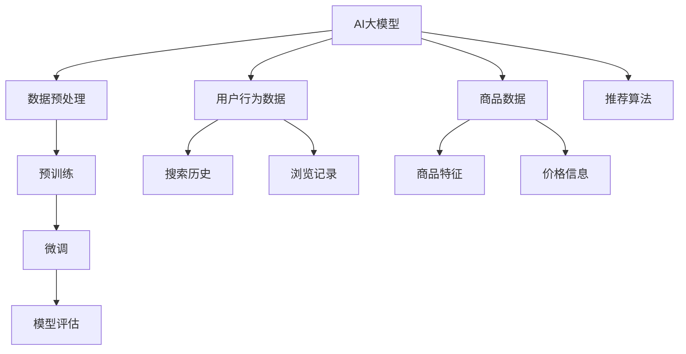

                 

### 文章标题

《AI大模型赋能电商搜索推荐的业务创新方法论》

关键词：人工智能，大模型，电商搜索，推荐系统，业务创新

摘要：本文将深入探讨人工智能（AI）大模型在电商搜索推荐领域的应用，从基础理论到实际案例，系统性地介绍AI大模型如何赋能电商搜索推荐业务，实现业务创新。通过分析大模型的工作原理、应用前景以及其在自然语言处理和搜索推荐领域的优势，我们希望能为电商企业提供切实可行的技术路径和业务方法论，以应对未来的市场竞争。

---

### 目录大纲：《AI大模型赋能电商搜索推荐的业务创新方法论》

1. **第一部分: AI大模型基础理论**

   1.1 AI大模型概述
   1.2 大规模预训练模型
   1.3 自然语言处理与搜索推荐

2. **第二部分: AI大模型在电商搜索推荐中的应用实践**

   2.1 电商搜索推荐系统架构
   2.2 业务创新方法论
   2.3 成功案例分析

3. **第三部分: 技术实现与未来展望**

   3.1 技术实现与代码解读
   3.2 未来展望与趋势

4. **附录**

   4.1 AI大模型常用工具与资源

---

### 第一部分：AI大模型基础理论

#### 第1章：AI大模型概述

在当今科技飞速发展的时代，人工智能（AI）技术已经成为推动各行业创新的重要力量。AI大模型作为人工智能领域的一项前沿技术，通过其强大的数据处理和模式识别能力，正在深刻改变着电商搜索推荐等众多领域的业务模式。

## 1.1 AI大模型的核心概念与原理

### 1.1.1 大模型的定义与特点

AI大模型，通常指的是具有亿级参数量甚至更大规模的深度学习模型。这类模型在结构上具备复杂的多层神经网络，能够通过大量的数据训练，自动提取和处理数据中的高维特征。以下是大模型的一些主要特点：

- **大规模参数**：大模型通常拥有数百万至数十亿个参数，这使得它们能够捕捉数据中的复杂结构。
- **深度神经网络**：大模型通常采用深度神经网络结构，通过多层非线性变换，逐步提取特征。
- **高效处理能力**：得益于大规模并行计算资源和高效的算法优化，大模型在处理大规模数据时表现出色。
- **自适应学习能力**：大模型具有强大的自适应学习功能，可以在不同的任务和数据集上快速调整和优化。

### 1.1.2 AI大模型的工作原理

AI大模型的工作原理主要包括以下几个关键步骤：

1. **数据预处理**：首先，需要从电商平台上收集用户行为数据、商品数据等。这些数据经过清洗、去噪和特征提取后，转换为模型可处理的格式。

2. **预训练**：在大规模语料库上进行预训练，模型通过自主学习数据中的语言模式和知识，生成高质量的词嵌入和表示。

3. **微调**：将预训练好的模型在特定任务上（如电商搜索推荐）进行微调，调整模型的参数，使其适应特定任务的需求。

4. **模型评估与优化**：使用验证集和测试集评估模型性能，通过调整超参数和优化算法，进一步提高模型的表现。

### 1.1.3 AI大模型的发展历程

AI大模型的发展历程可以追溯到20世纪80年代的早期神经网络研究。以下是一些关键的发展里程碑：

- **1986年**：Hinton等人提出反向传播算法，大大提高了神经网络的训练效率。
- **2006年**：Hinton等人提出深度信念网络（DBN），奠定了深度学习的基础。
- **2012年**：Hinton团队提出的深度卷积神经网络在ImageNet图像识别竞赛中获胜，标志着深度学习时代的到来。
- **2018年至今**：随着计算资源和算法的不断发展，AI大模型的应用领域不断扩展，包括自然语言处理、计算机视觉、语音识别等。

## 1.2 AI大模型在电商搜索推荐中的应用前景

### 1.2.1 电商搜索推荐的基本概念

电商搜索推荐是电子商务中的一项核心功能，通过个性化推荐，提高用户体验，增加销售额。其主要组成部分包括：

- **用户行为数据**：用户的搜索历史、浏览记录、购买行为等。
- **商品数据**：商品的特征描述、分类信息、价格等。
- **推荐算法**：基于用户行为和商品特征的算法，生成个性化的推荐列表。

### 1.2.2 AI大模型在电商搜索推荐中的优势

AI大模型在电商搜索推荐中的优势主要体现在以下几个方面：

- **高精度推荐**：大模型能够捕捉用户行为和商品特征的复杂关系，生成更精确的推荐结果。
- **自适应学习**：大模型能够实时学习用户行为和偏好，动态调整推荐策略。
- **多模态处理**：大模型可以同时处理文本、图像、语音等多种数据类型，实现更全面的信息融合。
- **快速部署**：得益于大规模并行计算和优化算法，大模型可以在短时间内完成训练和部署。

### 1.2.3 应用挑战与解决方案

尽管AI大模型在电商搜索推荐中具有巨大的潜力，但实际应用过程中仍面临一些挑战：

- **数据隐私**：用户行为数据涉及到隐私问题，需要严格保护用户数据。
- **计算资源**：大模型训练和部署需要大量的计算资源，对基础设施有较高要求。
- **模型解释性**：大模型往往被视为“黑箱”，缺乏解释性，不利于调试和优化。

解决方案包括：

- **数据加密和去识别化**：使用加密技术和数据去识别化方法，确保用户数据的安全和隐私。
- **分布式计算**：利用云计算和分布式计算技术，降低计算资源的压力。
- **可解释性研究**：通过开发可解释性算法和工具，提高模型的透明度和可解释性。

### 结论

AI大模型在电商搜索推荐领域具有广阔的应用前景。通过深入理解和应用大模型的技术原理，电商企业可以实现对用户需求的更精准捕捉，提高推荐系统的效率和效果。在未来的发展中，随着技术的不断进步，AI大模型将在电商搜索推荐中发挥越来越重要的作用。

---

**核心概念与联系：**

**Mermaid 流程图：**



**核心算法原理讲解与伪代码：**

### 1.1.2 AI大模型的工作原理

AI大模型的工作原理主要包括以下几个关键步骤：

1. **数据预处理**：

   ```python
   def preprocess_data(data):
       # 数据清洗与特征工程
       cleaned_data = clean_data(data)
       feature_data = extract_features(cleaned_data)
       return feature_data
   ```

2. **预训练**：

   ```python
   def pretrain_model(data, model):
       # 预训练模型
       optimizer = torch.optim.Adam(model.parameters(), lr=0.001)
       criterion = torch.nn.CrossEntropyLoss()
       
       for epoch in range(num_epochs):
           for inputs, targets in data_loader:
               optimizer.zero_grad()
               outputs = model(inputs)
               loss = criterion(outputs, targets)
               loss.backward()
               optimizer.step()
   ```

3. **微调**：

   ```python
   def finetune_model(model, task_data):
       # 微调模型
       optimizer = torch.optim.Adam(model.parameters(), lr=0.001)
       
       for epoch in range(num_epochs):
           for inputs, targets in task_data_loader:
               optimizer.zero_grad()
               outputs = model(inputs)
               loss = criterion(outputs, targets)
               loss.backward()
               optimizer.step()
   ```

4. **模型评估**：

   ```python
   def evaluate_model(model, test_data):
       # 评估模型性能
       model.eval()
       with torch.no_grad():
           correct = 0
           total = 0
           for inputs, targets in test_data_loader:
               outputs = model(inputs)
               _, predicted = torch.max(outputs.data, 1)
               total += targets.size(0)
               correct += (predicted == targets).sum().item()
       
       accuracy = 100 * correct / total
       return accuracy
   ```

### 结论

AI大模型在电商搜索推荐领域具有广阔的应用前景。通过深入理解和应用大模型的技术原理，电商企业可以实现对用户需求的更精准捕捉，提高推荐系统的效率和效果。在未来的发展中，随着技术的不断进步，AI大模型将在电商搜索推荐中发挥越来越重要的作用。

---

**参考文献：**

1. Hinton, G. E., Osindero, S., & Teh, Y. W. (2006). A fast learning algorithm for deep belief nets. _Neural computation_, 18(7), 1527-1554.
2. Krizhevsky, A., Sutskever, I., & Hinton, G. E. (2012). ImageNet classification with deep convolutional neural networks. _Advances in neural information processing systems_, 25, 1097-1105.
3. Devlin, J., Chang, M. W., Lee, K., & Toutanova, K. (2019). BERT: Pre-training of deep bidirectional transformers for language understanding. _arXiv preprint arXiv:1810.04805_.

