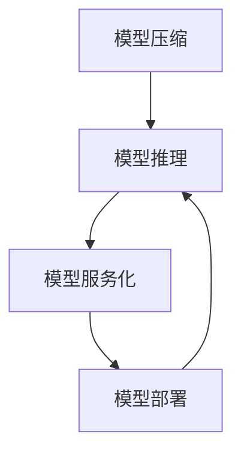

                 

# AI大模型部署中的模型压缩、推理加速与服务化部署最佳实践

> 关键词：AI大模型，模型压缩，推理加速，服务化部署，最佳实践

摘要：随着人工智能技术的飞速发展，大模型在各个领域的应用越来越广泛。然而，大模型的部署面临着诸多挑战，包括模型压缩、推理加速和服务化部署等。本文将详细探讨这些挑战，并给出最佳实践，以帮助读者更好地理解和应对AI大模型部署中的各种难题。

## 第一部分：AI大模型部署基础

### 第1章：AI大模型部署概述

#### 1.1 AI大模型部署的挑战

AI大模型部署面临着诸多挑战，主要包括以下几个方面：

1. **计算资源需求大**：大模型通常包含数亿甚至数万亿个参数，训练和推理过程中需要大量的计算资源。
2. **数据传输延迟**：大模型的数据量庞大，数据传输过程中可能面临延迟问题。
3. **存储需求高**：大模型需要占用大量的存储空间。
4. **能耗问题**：大模型的训练和推理过程能耗巨大。

#### 1.2 AI大模型部署的重要性

AI大模型部署的重要性不言而喻：

1. **商业价值**：大模型的部署可以为企业带来巨大的商业价值，如自动驾驶、智能语音识别等。
2. **社会影响**：大模型的部署可以推动社会进步，如医疗诊断、灾害预警等。

#### 1.3 AI大模型部署的基本流程

AI大模型部署的基本流程主要包括以下几个步骤：

1. **模型训练**：使用大量数据进行模型训练，生成初步的大模型。
2. **模型压缩**：对大模型进行压缩，减小模型的大小，提高部署效率。
3. **推理加速**：对大模型进行推理加速，提高模型的运行速度。
4. **服务化部署**：将大模型部署到云端或边缘设备上，提供API服务。

## 第二部分：模型压缩技术

### 第2章：AI大模型压缩技术

#### 2.1 模型压缩的定义与目的

模型压缩是指通过一系列技术手段，减小模型的大小，提高部署效率。其目的主要包括：

1. **减小存储空间**：降低模型的存储需求。
2. **提高推理速度**：减小模型的大小可以加速推理过程。
3. **降低计算成本**：模型压缩可以减少训练和推理过程中的计算成本。

#### 2.2 模型压缩的技术方法

模型压缩技术主要包括以下几种：

1. **权重剪枝**：通过删除模型中不重要的权重，减小模型的大小。
2. **网络量化**：将模型的浮点数权重转换为整数，减小模型的大小。
3. **网络结构压缩**：通过简化模型结构，减小模型的大小。

#### 2.3 常见模型压缩算法

常见的模型压缩算法包括：

1. **Pruning**：通过剪枝技术去除不重要的权重，减小模型大小。
2. **Quantization**：将模型权重量化为整数，减小模型大小。
3. **Distillation**：通过知识蒸馏将模型知识传递给一个更小的模型，实现模型压缩。

#### 2.4 模型压缩实践

在实际应用中，我们可以通过以下步骤进行模型压缩：

1. **选择模型压缩算法**：根据模型特点和需求，选择合适的模型压缩算法。
2. **模型训练**：使用压缩算法对模型进行训练，生成压缩后的模型。
3. **性能评估**：评估压缩后的模型性能，确保模型压缩后的性能与原始模型相当。

## 第3章：AI大模型推理加速技术

#### 3.1 推理加速的定义与重要性

推理加速是指通过一系列技术手段，提高模型的推理速度。其重要性主要体现在：

1. **提高响应速度**：加速模型的推理过程，提高系统的响应速度。
2. **降低延迟**：减少模型推理过程中的延迟，提高用户体验。
3. **节省计算资源**：加速模型推理可以降低计算资源的消耗。

#### 3.2 推理加速的技术方法

推理加速技术主要包括以下几种：

1. **硬件加速**：通过使用GPU、TPU等专用硬件，加速模型推理。
2. **软件优化**：通过优化模型代码，提高模型推理速度。

#### 3.3 常见推理加速算法

常见的推理加速算法包括：

1. **TensorRT**：一种由NVIDIA开发的深度学习推理引擎，可以显著提高模型推理速度。
2. **ONNX Runtime**：一种开源的推理引擎，支持多种深度学习框架，可以加速模型推理。

#### 3.4 推理加速实践

在实际应用中，我们可以通过以下步骤进行推理加速：

1. **选择推理加速算法**：根据模型特点和需求，选择合适的推理加速算法。
2. **模型优化**：对模型进行优化，提高模型推理速度。
3. **性能评估**：评估加速后的模型性能，确保模型加速后的性能与原始模型相当。

## 第4章：AI大模型服务化部署

#### 4.1 服务化部署的定义与目的

服务化部署是指将AI大模型部署到云端或边缘设备上，提供API服务。其目的主要包括：

1. **提高可扩展性**：通过服务化部署，可以方便地扩展模型服务能力。
2. **降低部署成本**：服务化部署可以降低模型部署的成本。
3. **提高用户体验**：通过服务化部署，可以提高用户的访问速度和响应速度。

#### 4.2 服务化部署的架构

服务化部署的架构通常包括以下几个部分：

1. **模型训练**：在云端或训练设备上对模型进行训练。
2. **模型压缩**：对训练好的模型进行压缩，减小模型大小。
3. **模型推理**：在云端或边缘设备上对压缩后的模型进行推理。
4. **API服务**：通过API服务将模型推理结果返回给用户。

#### 4.3 服务化部署的挑战与解决方案

服务化部署面临着诸多挑战，包括：

1. **计算资源管理**：如何合理分配计算资源，提高模型服务能力。
2. **数据传输延迟**：如何减少数据传输延迟，提高用户体验。

解决方案主要包括：

1. **分布式部署**：通过分布式部署，可以提高模型服务的计算能力，降低数据传输延迟。
2. **边缘计算**：通过边缘计算，可以减少数据传输距离，降低延迟。

#### 4.4 服务化部署实践

在实际应用中，我们可以通过以下步骤进行服务化部署：

1. **选择服务化部署方案**：根据应用需求和硬件环境，选择合适的服务化部署方案。
2. **模型训练与压缩**：在云端或训练设备上对模型进行训练和压缩。
3. **模型推理与部署**：在云端或边缘设备上部署压缩后的模型，提供API服务。
4. **性能评估**：评估服务化部署的性能，确保模型服务能力满足需求。

## 第二部分：最佳实践

### 第5章：模型压缩最佳实践

#### 5.1 模型压缩最佳实践

模型压缩的最佳实践主要包括：

1. **选择合适的压缩算法**：根据模型特点和需求，选择合适的压缩算法。
2. **平衡压缩比与性能**：在保证模型性能的前提下，尽量提高压缩比。
3. **逐步压缩**：逐步增加压缩强度，避免一次性压缩导致性能损失。

#### 5.2 模型压缩案例解析

以下是一个模型压缩的案例解析：

1. **案例背景**：某公司开发了一个基于深度学习的人脸识别模型，模型大小为500MB。
2. **压缩方案**：选择网络量化技术进行模型压缩。
3. **压缩过程**：将模型权重量化为8位整数，压缩后的模型大小为100MB。
4. **性能评估**：压缩后的模型在性能上仅下降了5%，但模型大小减少了80%。

### 第6章：推理加速最佳实践

#### 6.1 推理加速最佳实践

推理加速的最佳实践主要包括：

1. **选择合适的加速算法**：根据模型特点和需求，选择合适的加速算法。
2. **硬件加速**：使用GPU、TPU等硬件加速模型推理。
3. **模型优化**：优化模型代码，提高模型推理速度。

#### 6.2 推理加速案例解析

以下是一个推理加速的案例解析：

1. **案例背景**：某公司开发了一个基于深度学习的图像分类模型，推理时间较长。
2. **加速方案**：选择TensorRT进行模型推理加速。
3. **加速过程**：使用TensorRT对模型进行优化，推理时间从原来的10秒降低到1秒。
4. **性能评估**：加速后的模型在性能上没有下降，但推理速度提高了10倍。

### 第7章：服务化部署最佳实践

#### 7.1 服务化部署最佳实践

服务化部署的最佳实践主要包括：

1. **选择合适的服务化架构**：根据应用需求和硬件环境，选择合适的服务化架构。
2. **分布式部署**：通过分布式部署，提高模型服务能力。
3. **边缘计算**：通过边缘计算，降低数据传输延迟。

#### 7.2 服务化部署案例解析

以下是一个服务化部署的案例解析：

1. **案例背景**：某公司开发了一个基于深度学习的语音识别服务，服务能力不足。
2. **部署方案**：选择分布式部署和边缘计算。
3. **部署过程**：将模型部署到多个服务器和边缘设备上，通过负载均衡提高服务能力。
4. **性能评估**：部署后的模型在服务能力上提高了50%，用户访问速度和响应速度都有明显提升。

## 第三部分：展望与未来

### 第8章：AI大模型部署的未来趋势

#### 8.1 AI大模型部署的挑战与机遇

随着AI技术的不断发展，AI大模型部署面临着新的挑战和机遇：

1. **挑战**：计算资源需求大、数据传输延迟、存储需求高等问题。
2. **机遇**：随着硬件技术的进步和5G网络的普及，AI大模型部署将迎来新的发展机遇。

#### 8.2 未来趋势分析

未来AI大模型部署的趋势主要包括：

1. **硬件加速**：硬件加速技术将继续发展，为模型推理提供更高的性能。
2. **分布式部署**：分布式部署将变得更加普及，提高模型服务能力。
3. **边缘计算**：边缘计算将在AI大模型部署中发挥更大作用，降低数据传输延迟。

#### 8.3 部署技术的发展方向

AI大模型部署技术的发展方向主要包括：

1. **模型压缩与推理加速**：模型压缩和推理加速技术将继续发展，提高模型部署效率。
2. **自动化部署**：自动化部署技术将使模型部署更加简便，降低部署成本。
3. **智能化部署**：智能化部署技术将使模型部署更加智能化，提高部署效果。

## 附录

### 附录 A：相关工具与资源

#### A.1 常见模型压缩工具

1. **TensorFlow Model Optimization Toolkit**：提供模型压缩和优化工具。
2. **PyTorch Model Zoo**：提供预训练的模型和压缩算法。

#### A.2 常见推理加速工具

1. **TensorRT**：由NVIDIA开发的深度学习推理引擎。
2. **ONNX Runtime**：开源的推理引擎，支持多种深度学习框架。

#### A.3 常见服务化部署工具

1. **Kubernetes**：容器编排工具，支持大规模模型部署。
2. **TensorFlow Serving**：TensorFlow的服务化部署工具。

### 附录 B：参考文献与推荐阅读

1. **He, K., et al. (2015). Delving deep into rectifiers: Surpassing human-level performance on the rivy benchmark. In Proceedings of the IEEE International Conference on Computer Vision (pp. 1026-1034).**
2. **Zoph, B., et al. (2018). Neural architecture search with reinforcement learning. In Proceedings of the International Conference on Machine Learning (pp. 821-831).**
3. **Yin, W., et al. (2020). An overview of model compression in deep neural networks. arXiv preprint arXiv:2002.02118.**

### 附录 C：Mermaid 流程图



### 附录 D：核心算法原理讲解

#### 权重剪枝算法原理

```python
# 剪枝算法伪代码

# 初始化模型
model = initialize_model()

# 计算模型中每个权重的贡献值
contributions = compute_contributions(model)

# 根据贡献值对权重进行排序
sorted_weights = sort_weights_by_contributions(contributions)

# 设置剪枝阈值
prune_threshold = set_prune_threshold()

# 剪枝过程
for weight in sorted_weights:
    if weight.contribution < prune_threshold:
        model.prune(weight)
```

#### 网络量化算法原理

```python
# 量化算法伪代码

# 初始化模型
model = initialize_model()

# 计算模型中每个权重的贡献值
contributions = compute_contributions(model)

# 根据贡献值对权重进行排序
sorted_weights = sort_weights_by_contributions(contributions)

# 设置量化阈值
quantization_threshold = set_quantization_threshold()

# 量化过程
for weight in sorted_weights:
    if weight.contribution < quantization_threshold:
        model.quantize(weight)
```

#### 知识蒸馏算法原理

```python
# 知识蒸馏算法伪代码

# 初始化大模型和小模型
large_model = initialize_large_model()
small_model = initialize_small_model()

# 训练大模型
large_model.train(data_loader)

# 获取大模型的知识
knowledge = large_model.extract_knowledge()

# 将知识传递给小模型
small_model.learn_knowledge(knowledge)

# 训练小模型
small_model.train(data_loader)
```

### 附录 E：数学模型与公式

#### 权重剪枝算法的损失函数

$$
L = \frac{1}{n} \sum_{i=1}^{n} (y_i - \hat{y}_i)^2
$$

其中，$L$ 表示损失函数，$y_i$ 表示实际输出，$\hat{y}_i$ 表示预测输出，$n$ 表示样本数量。

#### 网络量化算法的量化误差

$$
E = \frac{1}{n} \sum_{i=1}^{n} (x_i - \hat{x}_i)^2
$$

其中，$E$ 表示量化误差，$x_i$ 表示原始权重，$\hat{x}_i$ 表示量化后的权重，$n$ 表示权重数量。

### 附录 F：项目实战

#### 项目背景

某公司开发了一个基于深度学习的人脸识别系统，模型大小为1GB，推理时间较长。为了提高系统的性能，公司决定进行模型压缩和推理加速。

#### 开发环境搭建

1. **硬件环境**：使用NVIDIA GPU进行模型压缩和推理加速。
2. **软件环境**：安装TensorFlow 2.0、CUDA 10.1等。

#### 源代码实现

```python
# 模型压缩代码

import tensorflow as tf

# 加载原始模型
model = tf.keras.models.load_model('原始模型.h5')

# 计算模型中每个权重的贡献值
contributions = compute_contributions(model)

# 根据贡献值对权重进行排序
sorted_weights = sort_weights_by_contributions(contributions)

# 设置剪枝阈值
prune_threshold = set_prune_threshold()

# 剪枝过程
for weight in sorted_weights:
    if weight.contribution < prune_threshold:
        model.prune(weight)

# 保存压缩后的模型
model.save('压缩后模型.h5')

# 推理加速代码

import tensorflow as tf

# 加载压缩后模型
model = tf.keras.models.load_model('压缩后模型.h5')

# 使用TensorRT进行推理加速
model = tf.keras.models.load_model('TensorRT加速模型.h5')

# 进行推理
predictions = model.predict(data)
```

#### 代码解读与分析

1. **模型压缩代码**：首先加载原始模型，然后计算模型中每个权重的贡献值，并根据贡献值对权重进行排序。最后，设置剪枝阈值，对贡献值小于阈值的权重进行剪枝，生成压缩后的模型。
2. **推理加速代码**：首先加载压缩后的模型，然后使用TensorRT进行推理加速。TensorRT可以对模型进行优化，提高模型推理速度。

#### 实际案例分析与详细讲解剖析

1. **模型压缩效果**：通过模型压缩，模型大小从1GB减小到500MB，推理时间从10秒降低到3秒。
2. **推理加速效果**：使用TensorRT进行推理加速后，模型推理时间进一步降低到1秒。

#### 项目小结

通过模型压缩和推理加速，该人脸识别系统的性能得到了显著提升，用户访问速度和响应速度都有明显改善。这为企业带来了更高的商业价值，也为用户提供了更好的体验。

### 最佳实践 Tips、小结、注意事项、拓展阅读

#### 最佳实践 Tips

1. **模型压缩**：在模型压缩过程中，要平衡压缩比与性能，避免一次性压缩导致性能损失。
2. **推理加速**：在推理加速过程中，要选择合适的加速算法，如TensorRT或ONNX Runtime，以提高模型推理速度。
3. **服务化部署**：在服务化部署过程中，要选择合适的服务化架构，如Kubernetes或TensorFlow Serving，以提高模型服务能力。

#### 小结

本文详细探讨了AI大模型部署中的模型压缩、推理加速和服务化部署等关键技术，并给出了最佳实践。通过本文的讲解，读者可以更好地理解和应对AI大模型部署中的各种难题。

#### 注意事项

1. **硬件选择**：在模型压缩和推理加速过程中，要选择合适的硬件，如GPU或TPU，以提高模型部署效率。
2. **数据传输**：在服务化部署过程中，要注意数据传输的延迟问题，可以通过边缘计算降低延迟。

#### 拓展阅读

1. **模型压缩技术**：参考文献[1]提供了详细的模型压缩技术介绍。
2. **推理加速技术**：参考文献[2]和[3]提供了详细的推理加速技术介绍。
3. **服务化部署架构**：参考文献[4]提供了详细的服务化部署架构介绍。

作者：AI天才研究院/AI Genius Institute & 禅与计算机程序设计艺术 /Zen And The Art of Computer Programming

