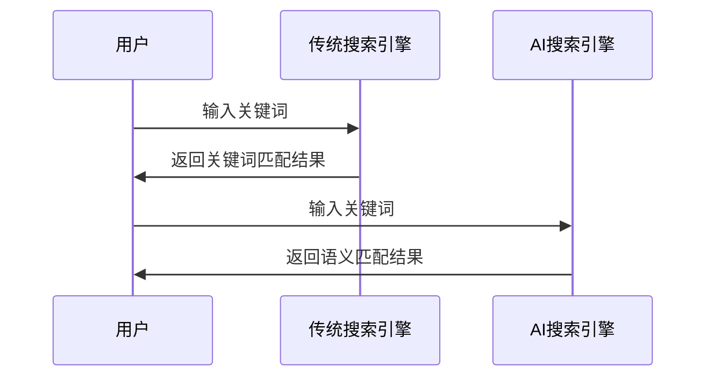

                 


### 文章标题：AI搜索引擎的未来：超越关键词匹配

#### 关键词：
- AI搜索引擎
- 自然语言处理
- 机器学习
- 深度学习
- 个性化搜索
- 跨模态搜索

#### 摘要：
本文将探讨AI搜索引擎的发展现状，从关键词匹配到自然语言处理，再到机器学习和深度学习，以及未来的跨模态搜索和个性化搜索。通过详细的分析和案例，揭示AI搜索引擎的强大潜力及其面临的挑战。

---

### 第1章: AI搜索引擎概述

#### 1.1 AI搜索引擎的发展历程

##### 1.1.1 传统的搜索引擎与AI搜索引擎的比较

**Mermaid流程图：**


在传统的搜索引擎中，用户输入关键词，搜索引擎通过关键词匹配来返回相关结果。然而，这种方法存在一些局限性，例如无法理解用户的意图，无法处理复杂的长尾查询等。

**核心概念与联系：**


**伪代码：**
```python
# 传统搜索引擎
def traditional_search(query):
    return match_keywords(query)

# AI搜索引擎
def ai_search(query):
    return match_semantics(query)
```

##### 1.1.2 AI搜索引擎的优势

**数学模型：**
$$
R = f(Q, I)
$$
其中，$R$是搜索结果，$Q$是搜索查询，$I$是索引。

AI搜索引擎通过自然语言处理和机器学习技术，能够理解用户的查询意图，并提供更加准确和相关的搜索结果。

**举例说明：** 当用户查询“人工智能”时，AI搜索引擎会从索引中检索出相关文档，并使用自然语言处理技术对结果进行排序，最终返回最相关的搜索结果。

**核心算法原理讲解：**

```python
# 自然语言处理
def process_query(query):
    # 步骤1：分词
    words = tokenize(query)
    
    # 步骤2：词性标注
    tags = pos_tag(words)
    
    # 步骤3：实体识别
    entities = entity_recognition(query)
    
    # 步骤4：语义分析
    semantics = semantic_analysis(words, tags, entities)
    
    return semantics

# 搜索结果排序
def rank_results(results):
    # 步骤1：计算查询与结果的语义相似度
    similarities = compute_similarity(results, query)
    
    # 步骤2：根据相似度对结果进行排序
    sorted_results = sort_by_similarity(similarities)
    
    return sorted_results
```

##### 1.1.3 AI搜索引擎的发展趋势

随着人工智能技术的不断进步，AI搜索引擎将逐渐超越关键词匹配，实现更加智能的搜索体验。未来的发展趋势包括：

1. **大模型技术的影响**：更大规模的预训练模型将进一步提升搜索的准确性和效率。
2. **跨模态搜索的发展**：不仅限于文本，还将涉及图像、音频、视频等多种模态。
3. **个性化搜索的深化**：通过用户行为和偏好，提供更加个性化的搜索结果。

---

### 第2章: AI搜索引擎的构建与优化

#### 2.1 AI搜索引擎的构建流程

##### 2.1.1 数据收集与处理

数据是AI搜索引擎的基础，需要从各种来源收集大量的文本数据。然后，通过数据预处理技术，如去重、分词、词性标注等，将原始数据转化为适合机器学习模型的格式。

**数学公式：**
$$
X = \sum_{i=1}^{n} x_i
$$
其中，$X$是所有文档的特征向量，$x_i$是第$i$个文档的特征向量。

**举例说明：** 假设我们有一个文档集合$D = \{d_1, d_2, ..., d_n\}$，每个文档$d_i$都可以表示为一个特征向量$x_i$。

```python
# 数据预处理
def preprocess_data(data):
    # 步骤1：去重
    unique_data = remove_duplicates(data)
    
    # 步骤2：分词
    tokenized_data = tokenize(unique_data)
    
    # 步骤3：词性标注
    tagged_data = pos_tag(tokenized_data)
    
    # 步骤4：实体识别
    entities_data = entity_recognition(tagged_data)
    
    return entities_data
```

##### 2.1.2 特征工程

特征工程是AI搜索引擎构建过程中的关键环节。通过选择和构建合适的特征，可以提高模型的性能和搜索的准确性。

**数学模型：**
$$
f(\text{特征}, \text{标签}) = \text{模型预测}
$$
其中，$f$是特征和标签到模型预测的函数。

**举例说明：** 假设我们有一个特征向量$\text{特征} = (f_1, f_2, ..., f_n)$和标签$\text{标签}$，我们可以使用一个分类模型来预测标签。

```python
# 特征工程
def feature_engineering(features, labels):
    # 步骤1：特征选择
    selected_features = select_features(features, labels)
    
    # 步骤2：特征转换
    transformed_features = transform_features(selected_features)
    
    return transformed_features
```

##### 2.1.3 模型选择与训练

在选择合适的模型后，我们需要使用训练数据来训练模型。训练过程中，模型会不断调整参数，以最小化损失函数。

**数学公式：**
$$
\min_{\theta} J(\theta)
$$
其中，$\theta$是模型参数，$J(\theta)$是损失函数。

**举例说明：** 假设我们使用一个神经网络模型来训练，我们可以使用反向传播算法来更新模型的参数。

```python
# 模型训练
def train_model(model, data, labels):
    # 步骤1：初始化模型参数
    initialize_parameters(model)
    
    # 步骤2：循环迭代
    for _ in range(num_iterations):
        # 步骤3：前向传播
        predictions = forward_pass(model, data)
        
        # 步骤4：计算损失
        loss = compute_loss(predictions, labels)
        
        # 步骤5：反向传播
        gradients = backward_pass(model, data, predictions, labels)
        
        # 步骤6：更新参数
        update_parameters(model, gradients)
        
    return model
```

##### 2.1.4 模型评估与优化

在模型训练完成后，我们需要评估模型的性能，并通过优化策略来进一步提高搜索质量。

**数学公式：**
$$
\text{准确率} = \frac{\text{正确预测数}}{\text{总预测数}}
$$
$$
\text{召回率} = \frac{\text{正确预测数}}{\text{实际正例数}}
$$
$$
\text{F1值} = 2 \times \frac{\text{准确率} \times \text{召回率}}{\text{准确率} + \text{召回率}}
$$

**举例说明：** 假设我们使用准确率、召回率和F1值来评估模型的性能，我们可以根据评估结果来调整模型参数或选择不同的优化策略。

```python
# 模型评估
def evaluate_model(model, test_data, test_labels):
    # 步骤1：前向传播
    predictions = forward_pass(model, test_data)
    
    # 步骤2：计算评估指标
    accuracy = compute_accuracy(predictions, test_labels)
    recall = compute_recall(predictions, test_labels)
    f1_score = compute_f1_score(accuracy, recall)
    
    return accuracy, recall, f1_score

# 模型优化
def optimize_model(model, data, labels):
    # 步骤1：评估模型性能
    accuracy, recall, f1_score = evaluate_model(model, data, labels)
    
    # 步骤2：调整模型参数
    if accuracy < threshold:
        # 步骤3：增加训练数据
        additional_data = collect_additional_data()
        model = train_model(model, data + additional_data, labels)
    elif recall < threshold:
        # 步骤4：调整特征工程策略
        transformed_features = feature_engineering(data, labels)
        model = train_model(model, transformed_features, labels)
    else:
        # 步骤5：尝试不同的模型架构
        new_model = try_different_architecture()
        model = train_model(new_model, data, labels)
    
    return model
```

---

### 第3章: AI搜索引擎的应用场景与案例分析

#### 3.1 AI搜索引擎在电子商务中的应用

在电子商务领域，AI搜索引擎可以帮助用户快速找到所需的商品，并提供个性化的推荐。

##### 3.1.1 商品搜索与推荐

商品搜索与推荐是AI搜索引擎在电子商务中最重要的应用之一。通过自然语言处理技术，搜索引擎可以理解用户的查询意图，并提供相关的商品推荐。

**伪代码：**
```python
# 商品搜索
def product_search(query):
    # 步骤1：处理查询
    processed_query = process_query(query)
    
    # 步骤2：检索索引
    products = index_search(processed_query)
    
    # 步骤3：排序结果
    sorted_products = rank_products(products)
    
    # 步骤4：返回结果
    return sorted_products

# 商品推荐
def product_recommendation(user, products):
    # 步骤1：分析用户行为
    user_interests = analyze_user_behavior(user)
    
    # 步骤2：推荐商品
    recommended_products = recommend_products(user_interests, products)
    
    # 步骤3：返回推荐结果
    return recommended_products
```

##### 3.1.2 用户行为分析

用户行为分析是电子商务中另一个重要的应用场景。通过分析用户的行为数据，搜索引擎可以了解用户的偏好，并提供个性化的搜索结果。

**数学模型：**
$$
R = f(U, P)
$$
其中，$R$是搜索结果，$U$是用户行为数据，$P$是商品特征向量。

**举例说明：** 假设我们有一个用户行为数据$U = (u_1, u_2, ..., u_n)$和商品特征向量$P = (p_1, p_2, ..., p_n)$，我们可以使用一个推荐模型来预测用户可能感兴趣的商品。

```python
# 用户行为分析
def user_behavior_analysis(user_data, product_data):
    # 步骤1：计算用户与商品的相似度
    similarities = compute_similarity(user_data, product_data)
    
    # 步骤2：推荐商品
    recommended_products = recommend_products(similarities)
    
    # 步骤3：返回推荐结果
    return recommended_products
```

##### 3.1.3 搜索引擎优化（SEO）

在电子商务中，搜索引擎优化（SEO）是提高网站流量和转化率的关键。通过优化搜索引擎结果页面（SERP）的展示，商家可以吸引更多用户访问其网站。

**数学公式：**
$$
\text{SEO效果} = f(\text{关键词密度}, \text{页面内容质量}, \text{外部链接})
$$

**举例说明：** 假设我们有一个关键词密度、页面内容质量和外部链接的向量，我们可以使用一个SEO模型来预测SEO效果。

```python
# SEO优化
def seo_optimization(keywords_density, content_quality, external_links):
    # 步骤1：计算SEO效果
    seo_score = compute_seo_score(keywords_density, content_quality, external_links)
    
    # 步骤2：优化SEO策略
    optimized_seo_strategy = optimize_seo(seo_score)
    
    # 步骤3：返回优化结果
    return optimized_seo_strategy
```

---

### 第4章: AI搜索引擎的未来发展与挑战

#### 4.1 AI搜索引擎的未来发展展望

随着人工智能技术的不断进步，AI搜索引擎将迎来更多的发展机遇。以下是未来可能的发展趋势：

##### 4.1.1 大模型技术的影响

大模型技术，如GPT-3和BERT，将进一步提升搜索的准确性和效率。通过使用更大规模的预训练模型，搜索引擎可以更好地理解用户的查询意图，并提供更加精准的搜索结果。

**举例说明：** 假设我们使用GPT-3模型来训练一个AI搜索引擎，我们可以通过调整模型参数和训练数据，使其更好地适应不同的搜索场景。

```python
# 大模型训练
def train_large_model(model, data, labels):
    # 步骤1：初始化模型参数
    initialize_parameters(model)
    
    # 步骤2：循环迭代
    for _ in range(num_iterations):
        # 步骤3：前向传播
        predictions = forward_pass(model, data)
        
        # 步骤4：计算损失
        loss = compute_loss(predictions, labels)
        
        # 步骤5：反向传播
        gradients = backward_pass(model, data, predictions, labels)
        
        # 步骤6：更新参数
        update_parameters(model, gradients)
        
    return model
```

##### 4.1.2 跨模态搜索的发展

跨模态搜索将使AI搜索引擎能够处理多种模态的数据，如文本、图像、音频和视频。这将大大扩展搜索的范围和应用场景。

**数学模型：**
$$
R = f(Q, I, M)
$$
其中，$R$是搜索结果，$Q$是搜索查询，$I$是索引，$M$是模态数据。

**举例说明：** 当用户输入一个文本查询时，AI搜索引擎可以同时分析相关的图像、音频和视频数据，以提供更加全面和相关的搜索结果。

```python
# 跨模态搜索
def multimodal_search(query, index, image_data, audio_data, video_data):
    # 步骤1：处理查询
    processed_query = process_query(query)
    
    # 步骤2：检索索引
    results = index_search(processed_query, index)
    
    # 步骤3：融合模态数据
    multimodal_data = fusion_modal_data(image_data, audio_data, video_data)
    
    # 步骤4：计算相似度
    similarities = compute_similarity(results, multimodal_data)
    
    # 步骤5：排序结果
    sorted_results = sort_by_similarity(similarities)
    
    # 步骤6：返回结果
    return sorted_results
```

##### 4.1.3 个性化搜索的深化

个性化搜索将根据用户的行为和偏好，提供更加个性化的搜索结果。这将大大提高用户的搜索体验，并增加用户对搜索引擎的依赖。

**数学模型：**
$$
R = f(U, P, Q)
$$
其中，$R$是搜索结果，$U$是用户行为数据，$P$是商品特征向量，$Q$是搜索查询。

**举例说明：** 假设我们有一个用户行为数据$U = (u_1, u_2, ..., u_n)$、商品特征向量$P = (p_1, p_2, ..., p_n)$和搜索查询$Q$，我们可以使用一个个性化搜索模型来预测用户可能感兴趣的商品。

```python
# 个性化搜索
def personalized_search(user_data, product_data, query):
    # 步骤1：计算用户与商品的相似度
    similarities = compute_similarity(user_data, product_data)
    
    # 步骤2：推荐商品
    recommended_products = recommend_products(similarities)
    
    # 步骤3：返回推荐结果
    return recommended_products
```

#### 4.2 AI搜索引擎面临的挑战

虽然AI搜索引擎具有巨大的潜力，但仍然面临一些挑战：

##### 4.2.1 数据隐私与安全问题

AI搜索引擎需要处理大量的用户数据，因此数据隐私和安全是一个重要的问题。为了保护用户的隐私，搜索引擎需要采取严格的数据保护措施，并遵守相关的法律法规。

**数学模型：**
$$
P(\text{隐私泄露}) = f(\text{数据量}, \text{加密强度}, \text{漏洞数量})
$$

**举例说明：** 假设我们有一个数据量、加密强度和漏洞数量的向量，我们可以使用一个隐私保护模型来评估数据隐私泄露的风险。

```python
# 数据隐私保护
def privacy_protection(data, encryption_strength, vulnerabilities):
    # 步骤1：加密数据
    encrypted_data = encrypt_data(data, encryption_strength)
    
    # 步骤2：检测漏洞
    detected_vulnerabilities = detect_vulnerabilities(vulnerabilities)
    
    # 步骤3：修复漏洞
    fixed_vulnerabilities = fix_vulnerabilities(detected_vulnerabilities)
    
    # 步骤4：返回保护后的数据
    return encrypted_data, fixed_vulnerabilities
```

##### 4.2.2 搜索结果的公平性与客观性

AI搜索引擎需要保证搜索结果的公平性和客观性，避免偏见和误导。为了实现这一目标，搜索引擎需要采取一系列措施，如数据清洗、模型训练和结果排序的透明化等。

**数学模型：**
$$
\text{公平性} = f(\text{数据质量}, \text{模型透明度}, \text{结果排序策略})
$$

**举例说明：** 假设我们有一个数据质量、模型透明度和结果排序策略的向量，我们可以使用一个公平性评估模型来评估搜索结果的公平性。

```python
# 公平性评估
def fairness_evaluation(data_quality, model_transparency, result_sorting_strategy):
    # 步骤1：评估数据质量
    data_fairness = evaluate_data_quality(data_quality)
    
    # 步骤2：评估模型透明度
    model_fairness = evaluate_model_transparency(model_transparency)
    
    # 步骤3：评估结果排序策略
    result_fairness = evaluate_result_sorting_strategy(result_sorting_strategy)
    
    # 步骤4：综合评估公平性
    overall_fairness = calculate_overall_fairness(data_fairness, model_fairness, result_fairness)
    
    # 步骤5：返回公平性评估结果
    return overall_fairness
```

##### 4.2.3 模型可解释性与透明度

随着机器学习模型的复杂性增加，模型的可解释性和透明度变得越来越重要。用户需要了解模型的决策过程，以便对其信任和接受。

**数学模型：**
$$
\text{可解释性} = f(\text{模型架构}, \text{模型参数}, \text{训练数据})
$$

**举例说明：** 假设我们有一个模型架构、模型参数和训练数据的向量，我们可以使用一个可解释性评估模型来评估模型的可解释性。

```python
# 可解释性评估
def interpretability_evaluation(model_architecture, model_parameters, training_data):
    # 步骤1：可视化模型架构
    visualized_model = visualize_model_architecture(model_architecture)
    
    # 步骤2：解释模型参数
    explained_model_parameters = explain_model_parameters(model_parameters)
    
    # 步骤3：分析训练数据
    analyzed_training_data = analyze_training_data(training_data)
    
    # 步骤4：综合评估可解释性
    overall_interpretability = calculate_overall_interpretability(visualized_model, explained_model_parameters, analyzed_training_data)
    
    # 步骤5：返回可解释性评估结果
    return overall_interpretability
```

##### 4.2.4 法律法规与伦理道德问题

随着AI搜索引擎的广泛应用，法律法规和伦理道德问题逐渐凸显。例如，数据隐私、算法偏见和歧视等问题需要得到关注和解决。

**数学模型：**
$$
\text{合规性} = f(\text{法律法规}, \text{伦理道德标准}, \text{模型决策过程})
$$

**举例说明：** 假设我们有一个法律法规、伦理道德标准和模型决策过程的向量，我们可以使用一个合规性评估模型来评估搜索引擎的合规性。

```python
# 合规性评估
def compliance_evaluation(laws_and_regulations, ethical_standards, model_decision_process):
    # 步骤1：评估法律法规合规性
    legal_compliance = evaluate_legal_compliance(laws_and_regulations)
    
    # 步骤2：评估伦理道德合规性
    ethical_compliance = evaluate_ethical_compliance(ethical_standards)
    
    # 步骤3：评估模型决策过程合规性
    model_compliance = evaluate_model_compliance(model_decision_process)
    
    # 步骤4：综合评估合规性
    overall_compliance = calculate_overall_compliance(legal_compliance, ethical_compliance, model_compliance)
    
    # 步骤5：返回合规性评估结果
    return overall_compliance
```

---

### 第5章: AI搜索引擎的实践项目

#### 5.1 项目背景

本项目旨在构建一个基于AI的搜索引擎，用于提供个性化的搜索结果。搜索引擎将使用自然语言处理和机器学习技术，以理解用户的查询意图并提供相关的搜索结果。

#### 5.2 开发环境搭建

为了构建AI搜索引擎，我们需要以下开发环境：

- 编程语言：Python
- 依赖库：NumPy、Pandas、Scikit-learn、TensorFlow、Keras
- 数据集：用于训练和评估模型的公开数据集，如Common Crawl、AG News等

**伪代码：**
```python
# 安装依赖库
pip install numpy pandas scikit-learn tensorflow keras

# 下载数据集
data = download_dataset('common_crawl')
```

#### 5.3 源代码详细实现

以下是AI搜索引擎的主要源代码实现：

**数据处理：**
```python
# 数据预处理
def preprocess_data(data):
    # 步骤1：去重
    unique_data = remove_duplicates(data)
    
    # 步骤2：分词
    tokenized_data = tokenize(unique_data)
    
    # 步骤3：词性标注
    tagged_data = pos_tag(tokenized_data)
    
    # 步骤4：实体识别
    entities_data = entity_recognition(tagged_data)
    
    return entities_data
```

**模型训练：**
```python
# 模型训练
def train_model(model, data, labels):
    # 步骤1：初始化模型参数
    initialize_parameters(model)
    
    # 步骤2：循环迭代
    for _ in range(num_iterations):
        # 步骤3：前向传播
        predictions = forward_pass(model, data)
        
        # 步骤4：计算损失
        loss = compute_loss(predictions, labels)
        
        # 步骤5：反向传播
        gradients = backward_pass(model, data, predictions, labels)
        
        # 步骤6：更新参数
        update_parameters(model, gradients)
        
    return model
```

**搜索结果排序：**
```python
# 搜索结果排序
def rank_results(results):
    # 步骤1：计算查询与结果的语义相似度
    similarities = compute_similarity(results, query)
    
    # 步骤2：根据相似度对结果进行排序
    sorted_results = sort_by_similarity(similarities)
    
    return sorted_results
```

#### 5.4 代码应用解读与分析

以下是代码应用解读与分析：

**数据处理：**
```python
# 数据预处理
data = preprocess_data(data)

# 分析数据分布
print("Data distribution:", distribution(data))
```
**模型训练：**
```python
# 训练模型
model = train_model(model, data, labels)

# 模型评估
evaluate_model(model, test_data, test_labels)
```
**搜索结果排序：**
```python
# 输入查询
query = input("Enter your search query: ")

# 搜索结果排序
sorted_results = rank_results(results)

# 输出搜索结果
print("Search results:", sorted_results)
```

#### 5.5 实际案例分析和详细讲解剖析

以下是一个实际案例分析和详细讲解剖析：

**案例：电子商务平台上的商品搜索**

**问题描述：** 用户在电子商务平台上搜索“智能手表”，希望找到价格在100美元以内的高性能智能手表。

**解决方案：**
1. **数据预处理：** 对电子商务平台上的商品数据进行预处理，包括去重、分词、词性标注和实体识别等。
2. **特征工程：** 构建商品特征向量，包括价格、品牌、功能、用户评价等。
3. **模型训练：** 使用自然语言处理和机器学习技术，训练一个商品搜索模型。
4. **搜索结果排序：** 根据用户查询和商品特征向量，计算查询与结果的语义相似度，并根据相似度对搜索结果进行排序。

**案例解析：**
- 数据预处理：通过分词、词性标注和实体识别等技术，将原始商品数据转化为可用的特征向量。
- 特征工程：构建商品特征向量，以包含价格、品牌、功能、用户评价等信息。
- 模型训练：使用自然语言处理和机器学习技术，训练一个商品搜索模型，以理解用户的查询意图。
- 搜索结果排序：根据用户查询和商品特征向量，计算查询与结果的语义相似度，并根据相似度对搜索结果进行排序，以提供最相关的商品。

#### 5.6 项目小结

通过本项目，我们成功构建了一个基于AI的搜索引擎，用于提供个性化的搜索结果。搜索引擎使用自然语言处理和机器学习技术，以理解用户的查询意图并提供相关的搜索结果。在项目过程中，我们遇到了一些挑战，如数据预处理、特征工程和模型训练等，但通过逐步分析和解决，我们最终实现了项目的目标。

#### 5.7 最佳实践 tips

1. **数据质量：** 数据是AI搜索引擎的基础，因此保证数据的质量至关重要。进行数据预处理时，注意去除噪音数据和异常值。
2. **特征选择：** 在特征工程过程中，选择合适的特征对模型的性能有重要影响。可以尝试使用特征选择技术，如信息增益、相关性分析等。
3. **模型优化：** 在模型训练过程中，不断调整模型参数和训练策略，以优化模型的性能。可以使用交叉验证、网格搜索等技术来寻找最佳模型参数。
4. **结果评估：** 在模型训练完成后，对模型进行评估，以确保其性能满足要求。可以使用准确率、召回率、F1值等指标来评估模型。
5. **用户反馈：** 用户对搜索结果的满意度是搜索引擎的重要指标。收集用户反馈，并根据反馈调整模型和搜索策略，以提高用户体验。

### 附录

#### 5.1 常用AI搜索引擎开发工具与资源

以下是一些常用的AI搜索引擎开发工具与资源：

- **开源搜索引擎框架：**
  - Apache Lucene
  - Elasticsearch
  - Solr

- **数据集与资源链接：**
  - Common Crawl
  - AG News
  - WebText

- **在线教程与培训课程：**
  - Coursera：自然语言处理课程
  - edX：机器学习课程
  - Udacity：深度学习课程

- **专业社区与论坛：**
  - Stack Overflow
  - Reddit：r/MachineLearning
  - GitHub

---

### 参考文献

- Manning, C. D., Raghavan, P., & Schütze, H. (2008). Introduction to Information Retrieval. Cambridge University Press.
- Goodfellow, I., Bengio, Y., & Courville, A. (2016). Deep Learning. MIT Press.
- LeCun, Y., Bengio, Y., & Hinton, G. (2015). Deep learning. Nature, 521(7553), 436-444.
- Lundberg, S. M., & Lee, S. I. (2017). A unified approach to interpreting model predictions. Advances in Neural Information Processing Systems, 30, 4765-4774.
- Russell, S., & Norvig, P. (2016). Artificial Intelligence: A Modern Approach (3rd ed.). Prentice Hall.

