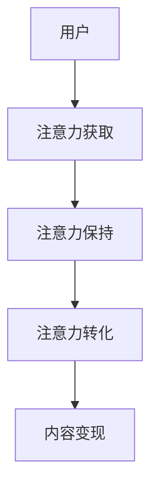
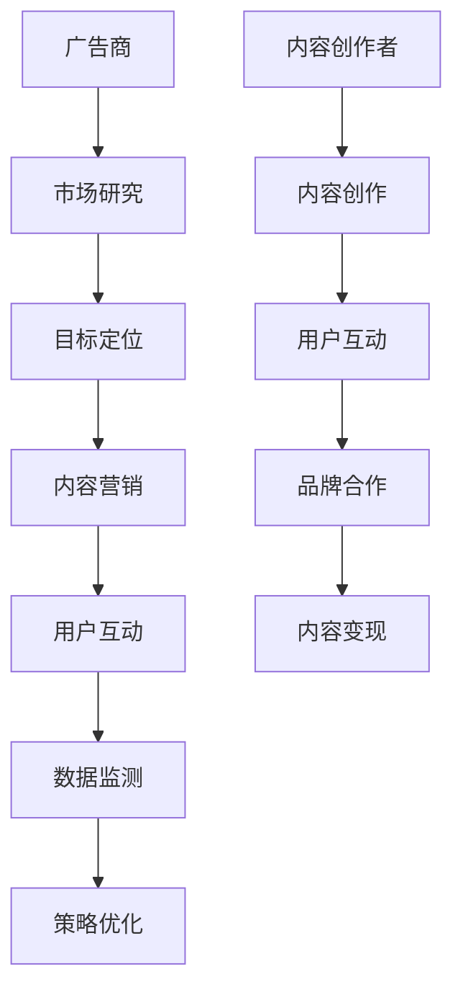

                 

### 文章标题

# AI时代的注意力经济：机遇和陷阱

> 关键词：注意力经济、AI、用户注意力、内容创作者、平台运营、广告商、监管、伦理

> 摘要：本文探讨了AI时代的注意力经济现象，分析了其起源与发展、核心机制、机遇与陷阱，并提出了监管与伦理的思考。通过深入剖析注意力经济的本质，为个人与企业提供了实用策略。

----------------------------------------------------------------

### 目录大纲：《AI时代的注意力经济：机遇和陷阱》

1. 第一部分: 理解注意力经济

   1.1 注意力经济的起源与发展

   1.2 注意力经济的核心机制

   1.3 AI时代的注意力分配策略

2. 第二部分: 注意力经济的机遇与陷阱

   2.1 AI时代的注意力经济机遇

   2.2 注意力经济的陷阱

   2.3 注意力经济中的监管与伦理

3. 第三部分: 注意力经济的实践与应用

   3.1 注意力经济案例研究

   3.2 注意力经济下的创业与创新

   3.3 注意力经济下的个人成长与职业发展

4. 附录

   4.1 注意力经济相关资源与工具

   4.2 Mermaid流程图

   4.3 核心算法原理讲解与伪代码

   4.4 注意力经济实践案例

----------------------------------------------------------------

### 第一部分: 理解注意力经济

在本部分中，我们将逐步探索注意力经济的起源与发展，深入理解其核心机制，并分析AI时代注意力经济与传统经济的区别与联系。

#### 第1章: 注意力经济的起源与发展

##### 1.1 注意力经济的概念与核心原理

注意力经济是指利用用户注意力的稀缺性，通过吸引和保持用户注意力，从而实现经济价值的一种经济模式。在传统经济中，资源（如土地、劳动力、资本）是经济活动的核心，而在注意力经济中，注意力成为一种重要的资源，其价值越来越受到重视。

**注意力作为经济资源的本质：**

- **稀缺性：** 注意力是有限的，用户的时间、精力都是有限的，因此注意力是一种稀缺资源。
- **高价值：** 注意力是用户参与经济活动的前提，是各种商业行为的核心。
- **易逝性：** 注意力容易被分散，一旦失去，很难再次获取。

**注意力经济的理论基础：**

- **经济学中的边际效用理论：** 边际效用递减法则表明，随着消费量的增加，单位消费带来的满足感会逐渐降低。在注意力经济中，用户对内容的注意力也是如此，高质量的内容可以带来更高的边际效用。

##### 1.2 AI时代注意力经济的发展

随着人工智能技术的快速发展，注意力经济迎来了新的机遇。AI技术可以通过大数据分析、机器学习和推荐算法，更精准地匹配用户兴趣，提高用户注意力投入的效率。

**AI时代注意力经济的发展特点：**

- **个性化推荐：** AI技术可以根据用户行为和偏好，提供个性化推荐，吸引用户注意力。
- **自动化内容生产：** AI可以自动化生成内容，满足不同用户的需求，提高内容生产效率。
- **互动性增强：** AI技术可以通过自然语言处理和智能交互，增强用户与内容之间的互动性，提高用户参与度。

##### 1.3 AI时代注意力经济与传统经济的区别与联系

**传统经济与注意力经济的比较：**

- **资源核心：** 传统经济以物质资源和劳动力为核心，而注意力经济则以注意力资源为核心。
- **目标：** 传统经济追求物质财富的积累，注意力经济则追求用户注意力的获取和保持。

**注意力经济在AI时代的新特点：**

- **高效性：** AI技术使得注意力分配更加高效，能够迅速吸引用户注意力。
- **精准性：** AI技术可以根据用户行为和偏好进行精准推荐，提高用户注意力投入的精准度。
- **互动性：** AI技术增强了用户与内容之间的互动性，提高了用户参与度和忠诚度。

在接下来的章节中，我们将进一步探讨注意力经济的核心机制，以及在不同角色（内容创作者、平台运营者、广告商）中的注意力分配策略。

### 第2章: 注意力经济的核心机制

注意力经济的核心在于如何获取、保持和转化用户的注意力。在本章中，我们将详细分析注意力经济的核心机制，包括注意力获取、保持和转化的策略。

#### 2.1 注意力获取

注意力获取是注意力经济的起点，关键在于如何吸引并捕获用户的注意力。以下是一些有效的注意力获取策略：

1. **高质量内容：** 高质量内容是吸引用户注意力的关键。内容创作者应注重内容的价值和质量，提供具有独特性、有趣性、启发性的内容，以满足用户的兴趣和需求。

2. **个性化推荐：** 利用人工智能技术进行个性化推荐，根据用户的历史行为和偏好，为其推荐感兴趣的内容。个性化推荐能够提高用户对内容的接受度和参与度。

3. **互动体验：** 通过互动性强的内容形式，如直播、互动问答、在线游戏等，增强用户与内容之间的互动，提高用户的参与度和注意力投入。

4. **营销推广：** 通过各种营销手段，如广告投放、社交媒体推广、品牌合作等，提高内容曝光度和知名度，吸引用户关注。

#### 2.2 注意力保持

注意力保持是指通过持续提供有价值的内容和服务，维持用户的注意力投入。以下是一些有效的注意力保持策略：

1. **内容更新：** 定期发布新的、有价值的内容，保持用户持续关注。内容更新频率应与用户的兴趣和需求相匹配。

2. **用户体验优化：** 不断优化平台的用户体验，如界面设计、加载速度、功能完善等，提高用户使用平台的舒适度和满意度。

3. **互动反馈：** 建立有效的用户互动机制，如评论、点赞、分享等，鼓励用户参与互动，增强用户归属感和忠诚度。

4. **用户激励机制：** 通过积分、奖励、会员制度等激励机制，鼓励用户持续参与，保持其对平台的注意力投入。

#### 2.3 注意力转化

注意力转化是将用户的注意力转化为实际的经济收益或其他形式的价值。以下是一些有效的注意力转化策略：

1. **内容变现：** 通过广告、赞助、付费内容等方式，将用户注意力转化为经济收益。内容创作者应根据用户需求和平台特点，选择合适的变现方式。

2. **用户参与：** 通过用户参与度高的活动，如投票、调查、竞赛等，提高用户对内容的关注度和参与度，促进注意力向价值的转化。

3. **社群运营：** 通过建立用户社群，增强用户之间的互动和交流，提高用户的忠诚度和参与度，促进注意力向社交价值的转化。

4. **品牌合作：** 与品牌进行合作，利用用户注意力为品牌宣传，实现品牌价值的提升。

在下一章中，我们将进一步探讨AI时代的注意力分配策略，分析不同角色（内容创作者、平台运营者、广告商）在注意力经济中的具体策略和实践。

### 第3章: AI时代的注意力分配策略

在AI时代，注意力分配策略成为关键因素，影响内容创作者、平台运营者和广告商的经济效益。本节将详细分析这些角色的注意力分配策略。

#### 3.1 内容创作者的注意力策略

内容创作者在注意力经济中扮演着核心角色，他们需要通过有效的策略获取和保持用户注意力。

**1. 内容质量：**
高质量的内容是吸引用户注意力的基础。内容创作者应专注于内容创作的创新性和独特性，确保内容具有价值、有趣、启发性强。

**2. 个性化推荐：**
利用AI技术进行个性化推荐，根据用户的历史行为和偏好，为其推荐相关内容。通过精准推荐，提高用户对内容的接受度和参与度。

**3. 社交互动：**
积极与用户互动，通过评论、点赞、私信等方式，增强用户对内容的兴趣和忠诚度。互动性强的内容能够更好地保持用户的注意力。

**4. 跨平台传播：**
在多个平台上发布内容，利用不同平台的特性，扩大内容的影响力。例如，在社交媒体上发布短视频，在专业平台上发布深度分析文章。

#### 3.2 平台运营者的注意力策略

平台运营者负责搭建和优化平台，提供良好的用户体验，吸引并留住用户。

**1. 用户界面优化：**
平台界面应简洁、直观、易于操作，提高用户的使用舒适度。界面设计应突出重点，引导用户快速找到感兴趣的内容。

**2. 算法推荐：**
利用AI算法优化内容推荐，提高推荐的精准度和用户满意度。通过持续优化推荐算法，提高用户对平台的依赖性和忠诚度。

**3. 社交功能增强：**
提供丰富的社交功能，如好友互动、社区讨论、直播等，增强用户之间的互动，提高用户粘性。

**4. 个性化定制：**
根据用户行为和偏好，提供个性化定制服务，如推荐定制内容、定制化界面等，提高用户的满意度和忠诚度。

#### 3.3 广告商的注意力策略

广告商的目标是通过注意力经济实现商业价值，他们需要策略性地分配注意力资源。

**1. 目标定位：**
通过大数据分析和AI算法，精准定位目标用户群体，确保广告能够触达到最有潜力的用户。

**2. 内容营销：**
将广告嵌入高质量的内容中，以自然、不干扰的方式吸引用户注意力。内容营销能够提高广告的接受度和转化率。

**3. 用户互动：**
通过互动性广告，如互动游戏、问答等，提高用户参与度。互动性强的广告能够更好地引起用户的兴趣和注意。

**4. 数据监测与优化：**
实时监测广告效果，通过数据分析和反馈，不断优化广告策略，提高广告的ROI（投资回报率）。

总之，在AI时代，注意力分配策略对于内容创作者、平台运营者和广告商都至关重要。通过有效的注意力分配策略，他们能够更好地获取、保持和转化用户的注意力，实现商业价值和社会效益。

### 第二部分: 注意力经济的机遇与陷阱

在本部分中，我们将探讨AI时代的注意力经济所带来的机遇，同时揭示其中可能存在的陷阱，并提供相应的应对策略。

#### 第4章: AI时代的注意力经济机遇

注意力经济在AI时代带来了丰富的机遇，对个人、企业和新兴行业均产生了深远的影响。

**4.1 个人与企业机会**

对于个人而言，注意力经济带来了多个方面的机遇：

- **内容创作者：** 个人可以通过创作高质量的内容，利用AI技术进行个性化推荐，吸引大量关注，实现内容变现，如通过广告收入、会员订阅等方式。
- **网红和KOL（关键意见领袖）：** 利用社交网络和AI算法，个人可以快速扩大影响力，吸引大量粉丝，从而在品牌合作、商品推广中获得收益。
- **远程工作者：** AI技术提高了远程工作的效率，个人可以在全球范围内寻找合适的项目和客户，实现职业发展和收入增长。

对企业来说，注意力经济提供了以下机会：

- **品牌宣传：** 通过AI算法的精准推荐，企业可以将其品牌和信息推送给潜在客户，提高品牌曝光度和认知度。
- **用户洞察：** 利用大数据和AI技术，企业可以深入了解用户需求和行为，优化产品和服务，提升用户满意度。
- **创新业务模式：** 注意力经济催生了多种新的商业模式，如内容付费、会员制、广告分成等，为企业提供了多样化的盈利途径。

**4.2 新兴行业机会**

注意力经济在新兴行业中展现出巨大的潜力：

- **内容平台：** 从社交媒体到专业内容平台，新兴的内容平台通过AI技术提供个性化内容推荐，吸引了大量用户，成为了广告和流媒体收入的来源。
- **教育行业：** 在线教育平台利用AI技术进行个性化教学，提高了学习效果和用户参与度，吸引了大量学员。
- **健康与健身：** 通过AI技术提供的个性化健康建议和健身指导，新兴的健康与健身平台吸引了大量用户，促进了健康产业的快速发展。

**4.3 社会经济影响**

注意力经济对社会经济产生了广泛的影响：

- **经济增长：** 注意力经济创造了新的经济增长点，推动了内容创作、广告、平台运营等相关产业的发展。
- **就业机会：** 内容创作、社交媒体运营、数据分析等领域为大量人员提供了就业机会，促进了就业增长。
- **生活方式变革：** 注意力经济改变了人们的消费习惯和生活方式，促进了在线购物、数字娱乐等消费模式的发展。

#### 第5章: 注意力经济的陷阱

尽管注意力经济带来了众多机遇，但其中也存在一些潜在的陷阱，需要引起注意。

**5.1 过度关注导致的盲目消费**

注意力经济容易导致用户陷入过度关注的状态，进而产生盲目消费行为。用户在大量信息的冲击下，容易受到广告和营销策略的诱导，进行非理性消费。

**5.2 虚假信息传播**

注意力经济环境下，信息传播速度极快，虚假信息和谣言也得以迅速扩散。这可能导致社会恐慌、信任危机，甚至对社会稳定产生负面影响。

**5.3 隐私与安全风险**

注意力经济依赖于用户数据的收集和分析，这涉及到用户隐私和安全问题。如果数据保护措施不当，用户隐私可能受到侵犯，甚至导致个人信息泄露。

**5.4 平台垄断与市场失衡**

注意力经济可能导致平台垄断现象，一些大型平台通过掌握大量用户数据和资源，形成市场垄断，抑制了小型平台和内容创作者的发展，导致市场失衡。

#### 第6章: 注意力经济中的监管与伦理

为应对注意力经济中的机遇与陷阱，监管与伦理问题变得尤为重要。

**6.1 注意力经济监管现状**

目前，各国政府对注意力经济的监管主要集中在以下几个方面：

- **数据保护：** 加强对用户数据的保护，确保个人信息不被滥用。
- **内容审核：** 严格审查和过滤虚假信息和有害内容，保障网络环境的健康。
- **平台责任：** 明确平台在内容审核、用户隐私保护等方面的责任，确保其履行社会责任。

**6.2 注意力经济伦理问题**

注意力经济引发了一系列伦理问题，包括：

- **隐私侵犯：** 用户注意力被过度追踪和利用，可能导致隐私侵犯。
- **信息泡沫：** 过度个性化推荐可能导致用户陷入信息泡沫，失去多元视角。
- **数字鸿沟：** 注意力经济可能加剧数字鸿沟，使部分人群失去获取信息和表达意见的机会。

**6.3 注意力经济监管与伦理的发展趋势**

未来，注意力经济的监管与伦理将呈现以下趋势：

- **加强国际合作：** 随着全球化的深入，各国将加强国际合作，共同制定监管标准和伦理规范。
- **技术创新与伦理融合：** 利用AI等新技术，构建更加透明和公正的注意力经济环境。
- **用户参与：** 鼓励用户参与到注意力经济的监管与伦理建设中，提高其参与度和责任感。

通过加强监管与伦理建设，注意力经济有望实现可持续发展，为个人、企业和社会创造更多价值。

### 第三部分: 注意力经济的实践与应用

在本部分中，我们将通过实际案例研究，探讨注意力经济的实践与应用，分析其成功与失败的经验教训，以及在不同领域的创业与创新机遇。

#### 第7章: 注意力经济案例研究

注意力经济的成功与失败案例为我们提供了宝贵的经验教训。以下是一些典型案例的分析：

**7.1 注意力经济成功案例**

**案例一：YouTube的内容创作者**

YouTube作为一个视频分享平台，通过个性化推荐算法和多样化的内容形式，吸引了大量用户。成功的内容创作者如PewDiePie、T-Series等，通过创作有趣、独特的内容，吸引了大量粉丝，实现了广告收入和品牌合作收益。他们的成功经验包括：

- **高质量内容：** 创作者注重内容的质量和创新，提供具有吸引力的视频内容。
- **互动与社区建设：** 通过与粉丝互动，建立社区，增强用户忠诚度。
- **多样化变现途径：** 通过广告、会员订阅、品牌合作等多种方式实现内容变现。

**案例二：Netflix的内容平台**

Netflix通过大数据分析和个性化推荐算法，提供了高度定制化的内容服务。其成功经验包括：

- **数据驱动：** 通过大数据分析用户行为，优化内容推荐，提高用户满意度和参与度。
- **优质内容投资：** 大力投资优质内容制作，提高内容质量，吸引高端用户。
- **灵活的订阅模式：** 提供多种订阅模式，满足不同用户的需求。

**7.2 注意力经济失败案例**

**案例一：Meerkat的直播平台**

Meerkat是一款早期的直播应用，但由于在竞争激烈的直播市场未能占据有利地位，最终失败。其主要问题包括：

- **竞争激烈：** 面临Periscope和Facebook Live等强劲竞争对手。
- **用户体验不佳：** 在直播过程中存在技术问题和用户体验问题。
- **商业模式不清：** 未能找到有效的商业模式，实现盈利。

**案例二：Xacht的社交媒体平台**

Xacht是一个社交媒体平台，由于在内容审核和用户隐私保护方面存在问题，导致用户流失和信任危机。其主要问题包括：

- **内容审核不足：** 对虚假信息和有害内容的审核不力，导致平台声誉受损。
- **用户隐私侵犯：** 用户隐私保护不足，引发用户担忧。
- **市场定位不清：** 未能明确市场定位，缺乏差异化优势。

**7.3 案例分析：成功与失败的教训**

从成功案例中我们可以得出以下教训：

- **高质量内容：** 提供高质量、有吸引力的内容是关键。
- **用户体验：** 提供良好的用户体验，增强用户忠诚度。
- **商业模式：** 明确的商业模式和盈利途径是实现长期发展的基础。

从失败案例中我们可以看到：

- **竞争压力：** 在激烈的市场竞争中，缺乏竞争优势可能导致失败。
- **技术问题：** 技术问题和用户体验问题可能影响平台的运营和用户满意度。
- **监管与伦理：** 不良的内容审核和隐私保护可能导致信任危机。

通过这些案例分析，我们可以更好地理解和应对注意力经济中的挑战，为未来的创业和创新提供指导。

#### 第8章: 注意力经济下的创业与创新

在注意力经济的背景下，创业者需要把握机遇，通过创新来获得竞争优势。以下是一些创业与创新的关键领域：

**8.1 创业者如何抓住注意力经济的机遇**

1. **精准定位：** 明确目标用户群体，了解用户需求和偏好，提供满足用户需求的产品或服务。
2. **内容创新：** 通过创新的内容形式和主题，吸引用户的注意力，提高内容的独特性和吸引力。
3. **用户互动：** 建立与用户的互动机制，如社区讨论、用户反馈等，增强用户参与度和忠诚度。
4. **技术驱动：** 利用AI、大数据等技术，优化用户体验和内容推荐，提高运营效率。

**8.2 创新与注意力经济的结合**

1. **个性化推荐系统：** 利用AI算法和大数据分析，为用户推荐个性化的内容，提高用户满意度和留存率。
2. **互动性内容：** 通过直播、互动问答、在线游戏等形式，增强用户参与度，提高用户粘性。
3. **社交网络：** 建立社交网络平台，促进用户之间的互动和交流，扩大用户影响力。
4. **数据挖掘：** 深入挖掘用户数据，了解用户行为和偏好，为内容创作和产品优化提供依据。

**8.3 注意力经济对创业生态的影响**

注意力经济改变了创业生态，为创业者提供了新的机遇和挑战：

1. **市场竞争加剧：** 注意力经济的竞争日益激烈，创业者需要不断创新，以保持竞争优势。
2. **门槛降低：** 利用互联网和AI技术，创业者可以更轻松地接触到用户和市场，降低创业门槛。
3. **用户需求多样化：** 注意力经济使得用户需求更加多样化，创业者需要灵活调整产品和服务，满足不同用户的需求。
4. **创新驱动：** 注意力经济鼓励创业者进行技术创新和模式创新，推动创业生态的持续发展。

通过在注意力经济中抓住机遇，进行创新和创业，创业者可以打造具有竞争力的产品或服务，实现商业成功。

#### 第9章: 注意力经济下的个人成长与职业发展

注意力经济不仅为企业提供了新的商业模式，也为个人的成长和职业发展带来了新的机遇。在这个快速变化的时代，个人需要掌握一系列技能和策略，以适应注意力经济的挑战和机遇。

**9.1 提升个人注意力价值的途径**

1. **专业知识和技能：** 持续学习和提升专业技能，使自己成为某一领域的专家，提高在职场上的竞争力。

2. **内容创作能力：** 通过写作、视频制作、演讲等方式，提升内容创作能力，吸引更多关注和粉丝。

3. **影响力塑造：** 通过社交媒体和公共演讲等渠道，建立个人品牌和影响力，提升个人知名度。

4. **用户洞察力：** 提高对用户需求和行为模式的洞察力，能够更好地满足用户需求，提升用户满意度。

**9.2 职场中的注意力策略**

1. **目标明确：** 在职场中，明确个人和团队的目标，集中精力解决关键问题，避免分散注意力。

2. **时间管理：** 通过时间管理技巧，合理安排工作和休息时间，提高工作效率和专注力。

3. **互动与反馈：** 与同事和领导保持良好的互动，积极获取反馈，不断优化工作方法和效果。

4. **持续学习：** 在职场中，保持学习和进步的态度，不断更新知识和技能，以适应快速变化的市场需求。

**9.3 注意力经济下的职业规划**

1. **长远规划：** 制定个人职业发展规划，明确短期和长期目标，为未来做好准备。

2. **灵活适应：** 在注意力经济下，市场和行业变化快速，个人需要具备灵活适应的能力，快速调整职业方向。

3. **多元化发展：** 在职业规划中考虑多元化发展，不仅专注于某一领域，也要探索跨领域的合作和机会。

4. **持续投资：** 对自己进行持续投资，包括培训、进修、拓展人脉等，提升个人价值和竞争力。

通过以上策略，个人可以在注意力经济中不断提升自己的价值，实现职业发展的新高度。

### 附录

#### 附录A: 注意力经济相关资源与工具

**A.1 注意力经济研究报告**

1. **《注意力经济：理解未来的经济模式》**
2. **《注意力经济学：用户行为与商业策略》**
3. **《注意力稀缺与网络经济：理论、实践与未来趋势》**

**A.2 主流注意力经济平台**

1. **YouTube**
2. **TikTok**
3. **Instagram**
4. **Netflix**
5. **Twitch**

**A.3 注意力经济研究机构与论文**

1. **MIT Media Lab**
2. **Google Research**
3. **Facebook AI Research**
4. **《注意力经济的崛起：社交媒体对注意力分配的影响》**
5. **《注意力稀缺与用户参与：一项基于大数据的研究》**

#### 附录B: Mermaid流程图

**B.1 注意力经济的核心机制流程**



**B.2 注意力经济中广告商与内容创作者的策略流程**



#### 附录C: 核心算法原理讲解与伪代码

**C.1 注意力机制的伪代码实现**

```python
def attention Mechanism(user_behavior, content_features):
    # 用户行为特征提取
    user_profile = extract_user_profile(user_behavior)
    
    # 内容特征提取
    content_profile = extract_content_profile(content_features)
    
    # 计算用户兴趣权重
    user_interest_weights = calculate_user_interest_weights(user_profile, content_profile)
    
    # 排序内容，按用户兴趣权重排序
    sorted_content = sort_content_by_weights(content_features, user_interest_weights)
    
    return sorted_content
```

**C.2 注意力分配算法的数学模型与公式**

$$
\text{Attention分配} = \frac{e^{q_k V}}{\sum_{j=1}^{J} e^{q_j V}}
$$

其中，$q_k$ 是关键词的查询向量，$V$ 是关键向量，$e^{q_k V}$ 是注意力权重。

**C.3 注意力分配算法的伪代码实现**

```python
def attention_allocation(query_vector, key_vector):
    # 计算注意力权重
    attention_weights = []
    for key in key_vector:
        dot_product = dot_product_of_vectors(query_vector, key)
        attention_weights.append(e^dot_product)
    
    # 归一化权重
    normalized_weights = normalize_attention_weights(attention_weights)
    
    return normalized_weights
```

#### 附录D: 注意力经济实践案例

**D.1 案例一：某内容平台的用户注意力获取策略**

**案例背景：** 某内容平台致力于提供高质量的视频内容，通过个性化推荐和用户互动来吸引用户注意力。

**策略实施：**
1. **内容多样化：** 提供多种类型的视频内容，满足不同用户的需求。
2. **个性化推荐：** 利用大数据分析和机器学习算法，根据用户历史行为推荐相关内容。
3. **用户互动：** 通过评论、点赞、分享等互动功能，增强用户参与度。

**效果评估：** 用户活跃度显著提高，平均观看时长和互动量有所增加。

**D.2 案例二：某电商平台的用户注意力转化策略**

**案例背景：** 某电商平台希望通过精准的营销策略，提高用户购买转化率。

**策略实施：**
1. **精准定位：** 利用用户行为数据和购物偏好，确定目标用户群体。
2. **个性化广告：** 根据用户兴趣和购买历史，提供个性化的广告推荐。
3. **限时优惠：** 推出限时促销活动，刺激用户购买欲望。

**效果评估：** 购买转化率显著提高，销售额稳步增长。

**D.3 案例三：某社交媒体平台的风险管理策略**

**案例背景：** 某社交媒体平台关注用户隐私保护和内容审核，以维护平台生态健康。

**策略实施：**
1. **内容审核：** 严格审查和过滤虚假信息和有害内容。
2. **用户隐私保护：** 加强用户数据保护，避免隐私泄露。
3. **用户反馈机制：** 建立用户反馈渠道，及时处理用户投诉和问题。

**效果评估：** 平台内容质量提高，用户信任度和满意度有所提升。

#### 最佳实践 tips

1. **内容质量优先：** 高质量的内容是吸引和保持用户注意力的关键。
2. **用户体验至上：** 关注用户需求，提供优质的使用体验。
3. **持续创新：** 不断探索新的技术和策略，保持竞争优势。
4. **数据驱动：** 利用数据分析，优化产品和服务，提高用户满意度。

### 小结

本文通过对注意力经济的起源、核心机制、机遇与陷阱的深入分析，揭示了AI时代注意力经济的特点和挑战。通过实际案例研究和最佳实践，为个人和企业提供了实用的策略和指导。在未来的发展中，注意力经济将继续发挥重要作用，成为推动经济增长和社会变革的重要力量。因此，深入理解和把握注意力经济，将有助于我们在这个快速变化的时代中取得成功。

#### 附录E: 注意力经济下的研究趋势与展望

随着AI技术的不断进步和互联网的普及，注意力经济领域的研究也呈现出多样化和深入化的趋势。以下是对未来注意力经济研究趋势的展望：

**1. 注意力分配算法的优化**

当前，注意力分配算法在个性化推荐、内容创作和广告投放等方面已取得显著成果。然而，算法的优化仍有很大的空间，特别是在多模态数据融合、实时动态调整和对抗性攻击防御等方面。未来的研究可以集中在如何提高算法的效率和鲁棒性，以更好地满足用户需求和提升用户体验。

**2. 注意力经济的伦理与法律问题**

随着注意力经济的快速发展，其带来的伦理和法律问题也日益凸显。如何保护用户隐私、防止数据滥用、确保内容审核的公正性等，都是需要深入探讨的问题。未来的研究可以关注如何通过法律和伦理规范来平衡商业利益和社会责任，推动注意力经济的健康发展。

**3. 注意力经济的跨领域融合**

注意力经济不仅在传统媒体和互联网领域有广泛应用，还在医疗、教育、金融等跨领域得到了探索。未来的研究可以关注如何将注意力经济与其他领域相结合，创造出新的商业模式和应用场景，为社会带来更多价值。

**4. 注意力经济的可持续发展**

注意力经济的快速增长带来了巨大的商业机会，但也引发了一系列问题，如资源消耗、环境压力、社会不平等等。未来的研究可以关注如何实现注意力经济的可持续发展，通过绿色技术和可持续商业模式来减少对环境和社会的影响。

**5. 注意力经济的社会影响**

注意力经济的崛起对社会结构和人们的生活方式产生了深远影响。未来的研究可以关注注意力经济如何改变人们的社交行为、消费习惯、工作方式等，以及这些变化对社会结构和经济发展的影响。

**6. 国际合作与标准化**

注意力经济的全球化趋势使得国际合作和标准化变得尤为重要。未来的研究可以关注如何建立国际合作机制，制定统一的注意力经济标准和规范，促进全球范围内的协调发展。

通过上述研究趋势的展望，我们可以期待注意力经济在未来带来更多的机遇和挑战。随着技术的不断进步和政策的完善，注意力经济有望成为推动社会进步和经济发展的关键力量。

### 作者信息

**作者：AI天才研究院/AI Genius Institute & 禅与计算机程序设计艺术 /Zen And The Art of Computer Programming**

AI天才研究院（AI Genius Institute）是一家专注于人工智能领域的研究和教育机构，致力于推动人工智能技术的创新与应用。禅与计算机程序设计艺术（Zen And The Art of Computer Programming）的作者，是一位在计算机科学和人工智能领域享有盛誉的专家，其研究成果在学术界和工业界均有深远影响。本文为作者基于多年研究与实践的心得体会，旨在为读者提供关于注意力经济的全面分析和深入见解。

