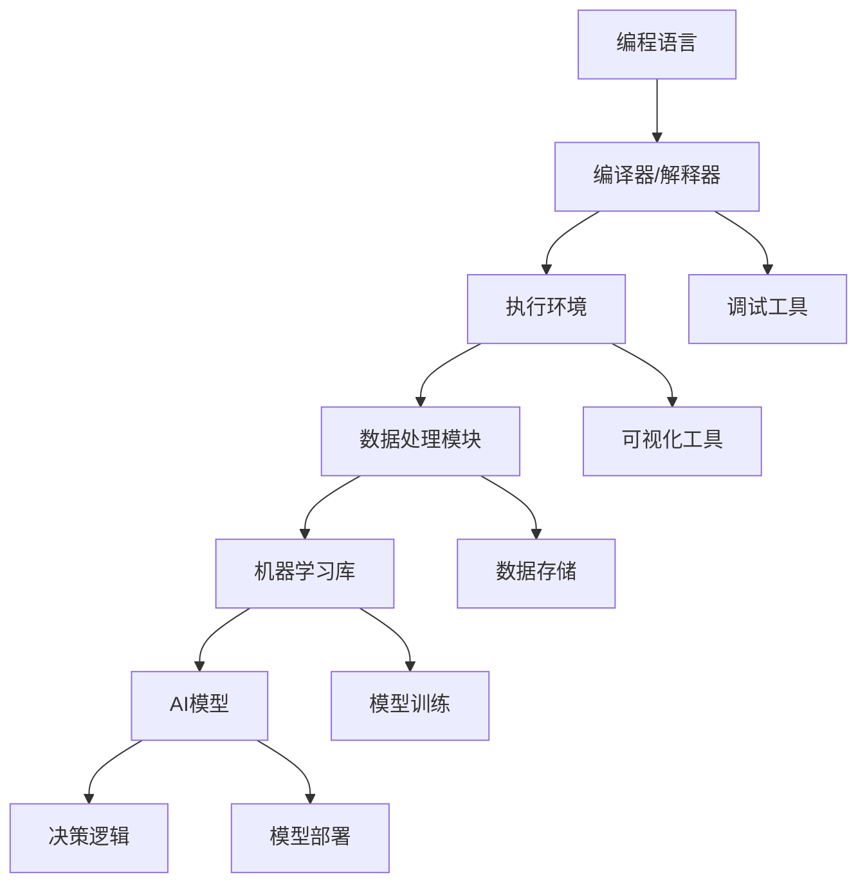

                 

## 文章标题：AI时代的编程语言发展新趋势

### 关键词：人工智能、编程语言、新趋势、AI编程语言、机器学习、自然语言处理、深度学习

> **摘要**：本文将深入探讨AI时代的编程语言发展新趋势。随着人工智能技术的迅猛发展，编程语言也在不断演进，以适应AI领域的复杂性和多样性。本文首先概述了AI时代编程语言的定义与特征，然后详细分析了AI编程语言的发展历程、核心概念与联系，以及核心算法原理。通过本文的阅读，读者将全面了解AI编程语言的现状和未来发展方向，为未来的编程实践提供有益的指导。

### 第一部分：AI时代的编程语言发展新趋势

#### 第1章：AI时代的编程语言概述

## 1.1 AI时代编程语言的定义与特征

### 1.1.1 AI时代的来临

人工智能（AI）的快速发展正深刻改变着我们的世界。从简单的自动化任务到复杂的决策支持系统，AI的应用已经渗透到各个领域。随着计算能力的提升和数据资源的丰富，人工智能迎来了前所未有的发展机遇。然而，AI的实现离不开高效的编程语言，这促使了AI编程语言的诞生与发展。

### 1.1.2 编程语言的演变趋势

编程语言的发展历程可以追溯到20世纪中期。从早期的机器语言和汇编语言，到高级语言如C、Java和Python，编程语言在不断地演化和进步。随着计算机科学和人工智能领域的发展，编程语言也在不断适应新的需求，提供更强大的功能和更简洁的语法。AI编程语言正是这一趋势下的产物，它们具有以下特征：

1. **自动化程度高**：AI编程语言能够自动处理复杂的任务，如代码生成、错误检测和优化。
2. **适应性强**：AI编程语言能够适应不同的应用场景和需求，具有高度的可扩展性和灵活性。
3. **高效性**：AI编程语言提供了高效的执行环境，能够快速处理大量数据，支持实时计算。
4. **互操作性**：AI编程语言能够与其他编程语言和工具无缝集成，实现跨平台开发。

### 1.1.3 AI编程语言的关键特征

AI编程语言的关键特征主要包括以下几个方面：

1. **基于机器学习**：AI编程语言通常内置了机器学习库和算法，支持深度学习、监督学习、无监督学习和强化学习等多种学习方式。
2. **支持数据处理**：AI编程语言提供了丰富的数据处理功能，包括数据清洗、数据转换、数据分析和可视化。
3. **支持自然语言处理**：AI编程语言能够处理自然语言文本，支持文本分类、文本生成、情感分析和语音识别等任务。
4. **支持图形处理**：AI编程语言提供了图形处理库，支持计算机视觉和图像处理任务。
5. **支持实时计算**：AI编程语言能够实现实时数据分析和决策，支持实时计算和实时响应。

## 1.2 人工智能编程语言的发展历程

### 1.2.1 早期人工智能编程语言

早期的人工智能编程语言主要集中在符号推理和知识表示方面。其中，Lisp语言被认为是人工智能领域的奠基性语言，它在20世纪50年代被发明，并广泛应用于早期的人工智能研究和应用。Lisp语言的特点是高度动态性、函数式编程和符号处理能力，使其在符号推理和知识表示方面表现出色。

### 1.2.2 现代AI编程语言的兴起

随着人工智能技术的不断进步，现代AI编程语言逐渐崭露头角。Python、R、Julia和Java等语言在人工智能领域得到了广泛应用。Python以其简洁易学的语法和丰富的库资源成为人工智能开发的首选语言。R语言在统计学和数据分析领域具有强大的功能，尤其在生物信息学和金融工程中表现出色。Julia语言则以其高性能和易用性吸引了大量人工智能开发者。Java语言则在企业级应用和云计算领域有着广泛的应用。

### 1.2.3 AI编程语言的分类

根据人工智能应用的不同需求，AI编程语言可以分为以下几类：

1. **通用编程语言**：如Python、Java、C++等，它们具有广泛的适用性和强大的功能，能够支持各种人工智能应用。
2. **专用编程语言**：如MATLAB、R、Prolog等，它们在特定领域具有优势，如数据科学、统计学和知识表示。
3. **硬件加速编程语言**：如CUDA、OpenCL等，它们能够利用GPU和其他硬件加速器，实现高性能计算和机器学习。
4. **领域特定编程语言**：如TensorFlow、PyTorch、Keras等，它们专门用于机器学习和深度学习应用，提供了丰富的库和工具。

## 1.3 AI编程语言在软件开发中的应用场景

### 1.3.1 自动化与优化

AI编程语言在自动化和优化方面具有显著优势。通过机器学习和深度学习算法，AI编程语言能够自动识别和优化软件开发过程中的各种任务，如代码生成、性能优化、测试和调试等。例如，使用AI编程语言可以实现自动化代码生成，提高开发效率，减少人为错误。

### 1.3.2 数据分析与处理

数据分析与处理是人工智能的重要应用领域。AI编程语言提供了丰富的数据处理功能，包括数据清洗、数据转换、数据分析和可视化等。例如，Python和R语言在数据分析领域具有广泛的应用，通过其内置的库和工具，可以轻松实现复杂数据分析任务。

### 1.3.3 机器学习模型的构建与优化

机器学习模型的构建与优化是人工智能的核心任务。AI编程语言提供了丰富的机器学习库和算法，支持各种机器学习任务，如分类、回归、聚类和异常检测等。通过AI编程语言，开发者可以快速构建和优化机器学习模型，实现智能化决策和支持。

#### 第2章：AI编程语言核心概念与联系

## 2.1 Mermaid流程图：AI编程语言架构

为了更好地理解AI编程语言的核心概念与联系，我们使用Mermaid流程图来展示其整体架构。以下是AI编程语言架构的Mermaid流程图：



### 2.1.1 AI编程语言工作原理

在AI编程语言的工作原理中，编译器/解释器是关键组件。编译器将源代码编译成机器码，而解释器则逐行解释并执行源代码。编译器和解释器的选择取决于编程语言的特点和目标平台。例如，Python使用解释器，而C++使用编译器。

执行环境是指编程语言运行的环境，包括操作系统、硬件平台和库函数等。不同的AI编程语言可能有不同的执行环境要求，例如，Python需要Python解释器，而MATLAB需要MATLAB环境。

数据处理模块负责处理输入数据，包括数据清洗、数据转换、数据分析和数据可视化等。数据处理模块通常是AI编程语言的核心功能之一，因为数据是人工智能的基础。

机器学习库是AI编程语言的重要组成部分，提供了各种机器学习算法和工具，如分类、回归、聚类和异常检测等。机器学习库通常包括预训练模型、数据预处理工具和模型评估指标等。

AI模型是机器学习库的核心输出，用于对数据进行预测和决策。AI模型可以是简单的线性模型，也可以是复杂的深度学习模型。模型的质量和性能直接影响AI系统的效果。

决策逻辑是指AI系统在处理输入数据时所做的决策，包括分类、排序、推荐等。决策逻辑通常基于AI模型的结果，并结合业务规则和用户偏好进行优化。

调试工具和可视化工具是AI编程语言的辅助组件，用于调试和优化AI系统。调试工具可以帮助开发者识别和修复代码错误，而可视化工具可以展示数据和分析结果，帮助开发者更好地理解AI系统的工作原理。

### 2.2 AI编程语言的核心概念

AI编程语言的核心概念包括编译器/解释器、执行环境、数据处理模块、机器学习库、AI模型、决策逻辑、调试工具和可视化工具等。以下是这些核心概念的简要说明：

1. **编译器/解释器**：编译器将源代码编译成机器码，而解释器逐行解释并执行源代码。不同的AI编程语言可能有不同的编译器/解释器。
2. **执行环境**：执行环境是编程语言运行的环境，包括操作系统、硬件平台和库函数等。不同的AI编程语言可能有不同的执行环境要求。
3. **数据处理模块**：数据处理模块负责处理输入数据，包括数据清洗、数据转换、数据分析和数据可视化等。数据处理模块通常是AI编程语言的核心功能之一。
4. **机器学习库**：机器学习库提供了各种机器学习算法和工具，如分类、回归、聚类和异常检测等。机器学习库通常包括预训练模型、数据预处理工具和模型评估指标等。
5. **AI模型**：AI模型是机器学习库的核心输出，用于对数据进行预测和决策。AI模型可以是简单的线性模型，也可以是复杂的深度学习模型。
6. **决策逻辑**：决策逻辑是指AI系统在处理输入数据时所做的决策，包括分类、排序、推荐等。决策逻辑通常基于AI模型的结果，并结合业务规则和用户偏好进行优化。
7. **调试工具**：调试工具可以帮助开发者识别和修复代码错误。
8. **可视化工具**：可视化工具可以展示数据和分析结果，帮助开发者更好地理解AI系统的工作原理。

### 2.3 AI编程语言与现有编程语言的关系

AI编程语言与现有编程语言存在一定的关系。一方面，AI编程语言通常基于现有的编程语言，继承了现有编程语言的优势和特点。另一方面，AI编程语言在功能、性能和生态系统方面具有独特的优势，为开发者提供了更强大的工具和平台。

AI编程语言与现有编程语言的区别主要体现在以下几个方面：

1. **功能**：AI编程语言提供了丰富的机器学习库和算法，支持各种人工智能应用。现有编程语言通常不具备这些功能。
2. **性能**：AI编程语言通常具有高效的执行环境，能够快速处理大量数据。现有编程语言可能需要更长的执行时间和更高的资源消耗。
3. **生态系统**：AI编程语言拥有丰富的库和工具，支持跨平台开发。现有编程语言可能在某些领域或平台具有更强大的生态系统。

AI编程语言与现有编程语言的关系可以概括为互补与融合。AI编程语言为开发者提供了更便捷、高效的开发工具，而现有编程语言则为AI编程语言提供了更广泛的生态系统和支持。

#### 第3章：AI编程语言核心算法原理讲解

## 3.1 机器学习算法基础

### 3.1.1 监督学习算法

监督学习算法是一种常见的机器学习算法，它通过对已知数据进行训练，从而预测未知数据的标签。以下是监督学习算法的伪代码：

```python
def supervised_learning(input_data, output_data):
    # 训练模型
    model = train_model(input_data, output_data)
    # 预测
    predictions = model.predict(new_data)
    return predictions
```

在监督学习算法中，输入数据是特征向量，输出数据是标签。训练模型的过程是通过学习输入和输出之间的映射关系，从而构建出一个能够预测未知数据的模型。预测新数据的过程则是将新数据的特征向量输入模型，得到预测的标签。

### 3.1.2 无监督学习算法

无监督学习算法是一种不依赖于已知标签的机器学习算法，它通过对未知数据进行处理，从而发现数据中的结构和模式。以下是两种常见的无监督学习算法：聚类和降维。

1. **聚类算法**

聚类算法将数据分为多个类别，使得同一类别的数据之间的相似度较高，不同类别之间的相似度较低。以下是一种简单的聚类算法——K-均值算法的伪代码：

```python
def k_means_clustering(input_data, k):
    # 初始化聚类中心
    centroids = initialize_centroids(input_data, k)
    # 循环迭代
    while not converged:
        # 分配数据到最近的聚类中心
        clusters = assign_data_to_clusters(input_data, centroids)
        # 更新聚类中心
        centroids = update_centroids(clusters, k)
    return clusters
```

2. **降维算法**

降维算法通过减少数据的维度，从而降低计算复杂度和数据存储需求。以下是一种常见的降维算法——主成分分析（PCA）的伪代码：

```python
def pca(input_data, num_components):
    # 计算协方差矩阵
    covariance_matrix = calculate_covariance_matrix(input_data)
    # 计算特征值和特征向量
    eigenvalues, eigenvectors = calculate_eigenvalues_and_eigenvectors(covariance_matrix)
    # 选择前num_components个特征向量
    principal_components = select_principal_components(eigenvectors, num_components)
    # 将数据投影到新的低维空间
    projected_data = project_data_to_new_space(input_data, principal_components)
    return projected_data
```

### 3.1.3 强化学习算法

强化学习算法是一种通过与环境交互来学习决策策略的机器学习算法。它主要关注如何从环境中获取奖励信号，并通过策略迭代来优化决策。以下是强化学习算法的伪代码：

```python
def reinforcement_learning(state, action, reward, next_state):
    # 更新Q值
    Q_value = Q_value + learning_rate * (reward + discount * max(Q_value NEXT_STATE) - Q_value)
    # 更新策略
    policy = update_policy(state, action, Q_value)
    return policy
```

在强化学习算法中，状态（state）、动作（action）、奖励（reward）和下一个状态（next_state）是核心概念。算法的核心思想是通过不断地更新Q值（Q_value）来优化策略（policy），从而在长期获得最大的奖励。

## 3.2 自然语言处理算法讲解

### 3.2.1 词嵌入算法

词嵌入算法是将自然语言文本中的词语映射到高维向量空间的一种技术。它能够捕捉词语的语义关系，从而在文本分类、情感分析和文本生成等领域发挥重要作用。以下是一种常见的词嵌入算法——Word2Vec的伪代码：

```python
def word_embedding(vocabulary, embedding_size):
    # 初始化词向量
    embedding_matrix = initialize_embedding_matrix(vocabulary, embedding_size)
    # 训练词向量
    embeddings = train_word_embedding(vocabulary, embedding_matrix)
    return embeddings
```

在Word2Vec算法中，词向量（embedding）是通过训练得到的，训练过程通常采用梯度下降法来优化损失函数。词向量具有以下特点：

1. **语义相似性**：语义相似的词语在向量空间中的距离较近。
2. **分布相似性**：词语的分布特征在向量空间中得以保留。
3. **维度可调性**：可以通过调整嵌入维度来平衡语义相似性和分布相似性。

### 3.2.2 序列到序列模型

序列到序列（Seq2Seq）模型是一种用于处理序列数据的深度学习模型，广泛应用于机器翻译、语音识别和文本生成等领域。以下是序列到序列模型的伪代码：

```python
def seq2seq_model(input_sequence, target_sequence):
    # 编码器解码器框架
    encoder = Encoder(input_sequence)
    decoder = Decoder(target_sequence)
    
    # 编码器编码输入序列
    encoded_sequence = encoder.encode(input_sequence)
    
    # 解码器解码编码后的序列
    decoded_sequence = decoder.decode(encoded_sequence)
    
    return decoded_sequence
```

在序列到序列模型中，编码器（Encoder）和解码器（Decoder）是核心组件。编码器将输入序列编码为固定长度的向量，解码器则将编码后的向量解码为输出序列。序列到序列模型通过训练大量的对齐对（alignment pairs）来优化编码器和解码器的参数，从而提高模型的性能。

通过以上对机器学习算法和自然语言处理算法的讲解，我们可以看到AI编程语言在算法实现和应用方面具有显著的优势。这些算法的实现和优化需要依赖AI编程语言提供的强大功能和高效工具。随着人工智能技术的不断发展，AI编程语言将继续在算法研究和应用中发挥重要作用。

