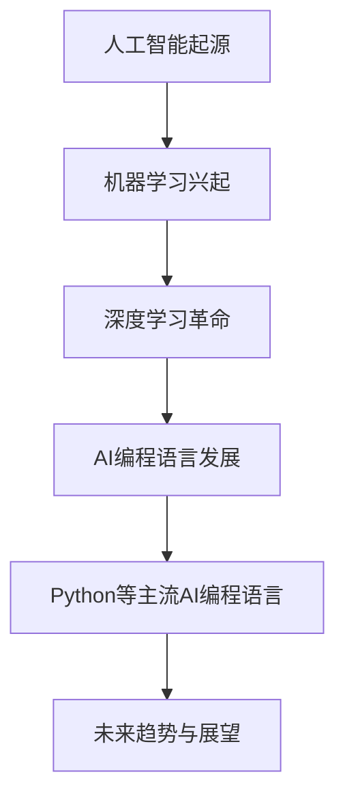

                 


### 文章标题: AI编程语言：提示词的革命与变革

关键词：AI编程语言，提示词，编程范式，语言模型，数学模型，项目实战

摘要：本文将深入探讨AI编程语言的概念、核心特性、发展历程以及其在各个领域的应用。通过分析AI编程语言中的核心概念原理和数学模型，我们揭示了AI编程语言背后的逻辑和技术原理。同时，通过实际案例的实战，展示了AI编程语言在图像识别、时间序列分析等领域的应用和潜力。文章旨在为读者提供对AI编程语言的全面理解和实践指导。

### 第一部分: AI编程语言基础

#### 第1章: AI编程语言概述

##### 1.1 AI编程语言的定义与背景

AI编程语言，指的是专门为人工智能开发而设计的编程语言。它们与传统编程语言有所不同，更加强调自适应性和动态性，能够更好地支持人工智能算法的实现和优化。

AI编程语言的起源可以追溯到20世纪50年代，当时计算机科学刚刚起步，研究人员开始探索如何让计算机进行更复杂的任务。随着机器学习和深度学习技术的发展，AI编程语言逐渐成为一个独立的领域。

##### 1.1.1 AI编程语言的概念

AI编程语言不仅仅是一种编程工具，更是一种思维方式。它要求开发者具备一定的数学和统计学知识，能够理解并利用人工智能算法的原理。

##### 1.1.2 AI编程语言的发展历程

AI编程语言的发展历程可以分为几个阶段：

1. **早期探索阶段（1950-1960年）**：这个时期，研究人员开始尝试将数学和计算机科学的知识应用于人工智能领域。

2. **符号推理阶段（1960-1980年）**：在这个阶段，符号推理成为AI编程语言的主要特点，例如Lisp语言。

3. **专家系统阶段（1980-1990年）**：专家系统成为AI编程语言的主要形式，例如Prolog语言。

4. **机器学习阶段（1990年至今）**：随着机器学习和深度学习技术的发展，AI编程语言逐渐演变为支持这些技术的工具。

##### 1.1.3 AI编程语言的重要性

AI编程语言的重要性体现在以下几个方面：

1. **降低AI开发的门槛**：AI编程语言为非计算机专业背景的开发者提供了更友好的开发环境。

2. **提高AI开发的效率**：AI编程语言提供了丰富的库和框架，可以帮助开发者更快地实现复杂的人工智能算法。

3. **促进AI技术的普及**：AI编程语言的普及，使得更多的人能够参与到人工智能的研究和应用中。

##### 1.2 AI编程语言的核心特性

AI编程语言具有以下几个核心特性：

1. **自适应性与动态性**：AI编程语言能够根据不同的环境和需求，自动调整自身的结构和行为。

2. **提示词驱动的编程范式**：提示词（Prompts）是AI编程语言的重要特性，它们能够引导程序执行特定的任务。

3. **语言模型与预训练**：AI编程语言通常依赖于强大的语言模型，这些模型通过预训练可以获得良好的性能。

##### 1.3 主流AI编程语言介绍

目前，主流的AI编程语言包括Python、Julia和R等。每种语言都有其独特的优点和适用场景。

1. **Python**：Python是AI编程语言中的佼佼者，其简洁易用的语法使其成为许多开发者首选的语言。Python拥有丰富的库和框架，如TensorFlow和PyTorch，支持各种AI算法的实现。

2. **Julia**：Julia是一种高性能的AI编程语言，特别适合处理大型数据集和复杂计算。Julia的动态类型系统和多线程支持使其在AI领域具有很大的潜力。

3. **R语言**：R语言在数据科学和统计领域有着广泛的应用，其强大的统计分析功能和丰富的库使其成为许多数据科学家和研究人员的首选。

此外，还有其他一些AI编程语言，如Prolog、Lisp等，它们也在特定领域有着重要的应用。

##### 1.4 AI编程语言的发展趋势与未来展望

AI编程语言的发展趋势主要体现在以下几个方面：

1. **编程语言融合与集成**：不同编程语言的融合和集成，使得开发者能够更加灵活地选择和使用不同的语言特性。

2. **端到端编程与自动化**：端到端编程和自动化技术的应用，使得AI开发的复杂度降低，开发效率提高。

3. **开源生态与社区发展**：开源生态和社区的发展，为AI编程语言提供了丰富的资源和合作机会，推动了技术的进步。

#### Mermaid 流程图：AI编程语言发展历程



### 第2章: AI编程语言核心概念原理

#### 2.1 AI编程语言中的核心概念

##### 2.1.1 数据类型与变量

AI编程语言中的数据类型和变量是编程的基础。常见的有整数、浮点数、字符串等。变量则是用于存储数据的基本单元，例如：

```python
x = 10  # 整数变量
y = 3.14  # 浮点数变量
name = "Alice"  # 字符串变量
```

##### 2.1.2 控制流程与循环结构

控制流程和循环结构是程序设计的重要部分，用于控制程序执行的顺序和流程。常见的控制流程包括条件语句和循环语句，例如：

```python
# 条件语句
if x > 10:
    print("x 大于10")
else:
    print("x 小于等于10")

# 循环结构
for i in range(10):
    print(i)
```

##### 2.1.3 函数与模块

函数是用于执行特定任务的自包含代码块，模块则是用于组织和管理代码的工具。例如：

```python
# 定义函数
def greet(name):
    print("Hello, " + name)

# 调用函数
greet("Alice")

# 使用模块
import math
result = math.sqrt(16)
print(result)
```

##### 2.1.4 面向对象编程

面向对象编程是一种编程范式，它将程序看作由对象组成的集合，每个对象都有属性和方法。面向对象编程的核心概念包括类、对象、继承和多态。例如：

```python
# 定义类
class Dog:
    def __init__(self, name, age):
        self.name = name
        self.age = age
    
    def bark(self):
        print("Woof!")

# 创建对象
dog = Dog("Buddy", 5)

# 调用方法
dog.bark()
```

#### 2.2 提示词驱动的编程范式

提示词（Prompts）是AI编程语言中的一个重要概念，它们用于引导程序执行特定的任务。提示词可以是简单的关键词或复杂的自然语言描述，例如：

```python
# 提示词示例
prompt = "预测明天的天气"
```

提示词驱动的编程范式使得开发者可以更灵活地定义和执行任务，而不必关心具体的实现细节。例如：

```python
# 提示词驱动的代码
def execute_prompt(prompt):
    if prompt == "预测明天的天气":
        weather = get_weather Tomorrow
        print(weather)
    else:
        print("未知任务")

# 调用提示词驱动的代码
execute_prompt("预测明天的天气")
```

#### 2.3 语言模型与预训练

语言模型是AI编程语言的核心组件，它用于理解和生成自然语言文本。预训练是语言模型训练的重要步骤，通过在大规模语料库上进行预训练，语言模型可以获得良好的性能。例如：

```python
# 伪代码：基于语言模型的编程框架设计
function program_with_language_model(prompt):
    model = load_pretrained_language_model()
    generated_code = model.generate_code(prompt)
    return generated_code
```

#### 2.3.1 语言模型的原理与构成

语言模型是基于统计学和机器学习的方法，用于预测下一个词或字符的概率分布。常见的语言模型包括n-gram模型、循环神经网络（RNN）和变换器（Transformer）等。例如：

```latex
P(w_{t} | w_{t-1}, w_{t-2}, ..., w_{1}) = \frac{C(w_{t-1}, w_{t})}{C(w_{t-1})}
```

其中，$w_{t}$ 表示当前词，$w_{t-1}$ 表示前一个词，$C(w_{t-1}, w_{t})$ 表示词对的计数。

#### 2.3.2 预训练与微调技术

预训练是指在大型语料库上进行预训练，使语言模型获得通用语言知识和文本理解能力。微调技术则是在特定任务上进行微调，使语言模型能够适应特定的应用场景。例如：

```python
# 伪代码：预训练与微调
model = train_pretrained_language_model(corpus)
model = fine_tune_language_model(model, task_specific_corpus)
```

#### 2.3.3 主流语言模型的优缺点分析

目前，主流的语言模型包括GPT、BERT和T5等。每种模型都有其独特的优点和适用场景。

1. **GPT**：GPT（Generative Pre-trained Transformer）是一种基于变换器的语言模型，具有强大的文本生成能力。其优点是生成文本的自然性和多样性，缺点是计算资源消耗大。

2. **BERT**：BERT（Bidirectional Encoder Representations from Transformers）是一种双向变换器模型，主要用于文本分类和实体识别等任务。其优点是能够在预训练过程中获取双向上下文信息，缺点是对计算资源的要求较高。

3. **T5**：T5（Text-to-Text Transfer Transformer）是一种通用的变换器模型，其优点是能够在多种任务上实现良好的性能，缺点是训练时间较长。

#### 2.3.4 语言模型在AI编程中的应用

语言模型在AI编程中的应用非常广泛，例如：

1. **代码生成**：基于语言模型，可以自动生成代码，提高开发效率。

2. **代码补全**：基于语言模型，可以预测程序员下一步可能编写的代码，帮助程序员减少错误和提高效率。

3. **代码审查**：基于语言模型，可以自动识别代码中的错误和潜在的安全隐患。

### 第3章: AI编程语言中的数学模型

#### 3.1 数学基础

AI编程语言中的数学模型依赖于一系列数学基础知识，包括线性代数、微积分、概率论与数理统计等。

##### 3.1.1 线性代数基本概念

线性代数是数学的基础学科之一，它研究向量空间、矩阵和线性变换等概念。在AI编程语言中，线性代数的基本概念如下：

1. **向量**：向量是具有大小和方向的量，通常表示为行向量或列向量。

2. **矩阵**：矩阵是二维数组，用于表示线性变换或系统方程。

3. **矩阵运算**：包括矩阵的加法、减法、乘法、转置等运算。

4. **线性变换**：线性变换是一种将向量映射到另一个向量空间的变换，通常由矩阵表示。

##### 3.1.2 微积分基础

微积分是数学的一个重要分支，它研究函数的极限、导数、积分等概念。在AI编程语言中，微积分的基本概念如下：

1. **极限**：极限是函数在某一点附近的行为，用于描述函数的连续性和变化趋势。

2. **导数**：导数是函数在某一点处的斜率，用于描述函数的变化速率。

3. **积分**：积分是函数在一个区间上的累积和，用于计算面积、体积等。

##### 3.1.3 概率论与数理统计

概率论与数理统计是研究随机现象的数学工具。在AI编程语言中，概率论与数理统计的基本概念如下：

1. **概率分布**：概率分布是描述随机变量取值的概率分布情况。

2. **期望与方差**：期望是随机变量的平均值，方差是随机变量波动程度的度量。

3. **假设检验**：假设检验是用于判断某个假设是否成立的方法。

#### 3.2 机器学习与深度学习中的数学模型

机器学习与深度学习是AI编程语言的核心技术，其数学模型涉及多个方面。以下是一些重要的数学模型：

##### 3.2.1 神经网络模型

神经网络是一种模拟人脑神经元连接结构的计算模型，它由多个层组成，包括输入层、隐藏层和输出层。每个层中的神经元通过权重和偏置进行连接，通过反向传播算法进行训练。

神经网络的数学模型可以表示为：

$$
f(x) = \sigma(\sum_{i=1}^{n} w_i \cdot x_i + b)
$$

其中，$x$ 表示输入向量，$w_i$ 表示权重，$b$ 表示偏置，$\sigma$ 表示激活函数，如Sigmoid函数或ReLU函数。

##### 3.2.2 损失函数与优化算法

损失函数是衡量模型预测值与实际值之间差异的函数，用于指导模型训练。常见的损失函数包括均方误差（MSE）、交叉熵损失等。

优化算法是用于最小化损失函数的方法，常见的优化算法有梯度下降、Adam等。

##### 3.2.3 集成学习方法

集成学习方法是一种将多个模型进行组合，以提高预测性能的方法。常见的集成学习方法有Bagging、Boosting等。

##### 3.2.4 强化学习中的数学模型

强化学习是一种通过奖励和惩罚信号来学习决策策略的方法。在强化学习中，常用的数学模型包括马尔可夫决策过程（MDP）和价值函数。

马尔可夫决策过程（MDP）可以表示为：

$$
\begin{align*}
    & \mathcal{M} = \langle S, A, R, P, \gamma \rangle \\
    & s_t \in S, a_t \in A, R(s_t, a_t) \in R, p(s_{t+1} | s_t, a_t) \in P, 0 \leq \gamma \leq 1
\end{align*}
$$

其中，$S$ 表示状态集合，$A$ 表示动作集合，$R$ 表示奖励函数，$P$ 表示状态转移概率，$\gamma$ 表示折扣因子。

价值函数是用于评估状态和动作的值，常见的价值函数有Q值和V值。

$$
V^*(s) = \sum_{a \in A} \gamma^T Q^*(s, a)
$$

#### 3.3 数学模型在AI编程中的应用

数学模型在AI编程中的应用非常广泛，包括数据预处理与特征工程、模型训练与评估、模型优化与调参等。

##### 3.3.1 数据预处理与特征工程

数据预处理是AI编程语言中的关键步骤，包括数据清洗、归一化、标准化等操作。特征工程则是通过选择和构造特征，提高模型的预测性能。

##### 3.3.2 模型训练与评估

模型训练是使用训练数据对模型进行调整，使其能够更好地拟合数据。模型评估则是通过测试数据对模型进行评估，常用的评估指标包括准确率、召回率、F1分数等。

##### 3.3.3 模型优化与调参

模型优化是通过调整模型的参数，提高模型的性能。常见的调参方法有网格搜索、随机搜索等。

### 第4章: AI编程语言的项目实战

#### 4.1 开发环境搭建

在进行AI编程语言的项目实战之前，需要搭建合适的开发环境。以下是使用Python、Julia和R语言搭建开发环境的步骤：

##### 4.1.1 Python开发环境的配置

1. **安装Python**：从Python官方网站下载并安装Python。

2. **配置Python环境变量**：将Python安装路径添加到系统环境变量中。

3. **安装pip**：使用以下命令安装pip。

   ```bash
   python -m pip install --upgrade pip
   ```

4. **安装常用库**：使用pip安装常用的库，如NumPy、Pandas、TensorFlow等。

   ```bash
   pip install numpy pandas tensorflow
   ```

##### 4.1.2 Julia的安装与配置

1. **安装Julia**：从Julia官方网站下载并安装Julia。

2. **配置Julia环境变量**：将Julia安装路径添加到系统环境变量中。

3. **安装Julia包**：使用以下命令安装常用的Julia包。

   ```julia
   julia
   import Pkg
   Pkg.add("DataFrames")
   Pkg.add("MLBase")
   ```

##### 4.1.3 R语言的安装与集成

1. **安装R语言**：从R语言官方网站下载并安装R语言。

2. **配置R语言环境变量**：将R语言安装路径添加到系统环境变量中。

3. **安装R包**：使用以下命令安装常用的R包。

   ```R
   install.packages("ggplot2")
   install.packages("caret")
   ```

#### 4.2 实际案例一：使用Python进行图像识别

图像识别是AI编程语言的一个重要应用领域。以下是一个使用Python进行图像识别的案例：

##### 4.2.1 数据集的准备与处理

1. **下载数据集**：从Kaggle或ImageNet等网站下载图像数据集。

2. **数据预处理**：对图像进行归一化、缩放、裁剪等处理，以便模型能够更好地学习。

   ```python
   import cv2
   import numpy as np

   image = cv2.imread("image.jpg")
   image = cv2.resize(image, (224, 224))
   image = image / 255.0
   image = np.expand_dims(image, axis=0)
   ```

##### 4.2.2 使用TensorFlow实现卷积神经网络

1. **导入库**：导入所需的库。

   ```python
   import tensorflow as tf
   from tensorflow.keras.models import Sequential
   from tensorflow.keras.layers import Conv2D, Flatten, Dense
   ```

2. **构建模型**：构建一个简单的卷积神经网络。

   ```python
   model = Sequential([
       Conv2D(32, (3, 3), activation="relu", input_shape=(224, 224, 3)),
       Flatten(),
       Dense(10, activation="softmax")
   ])
   ```

3. **编译模型**：编译模型并设置优化器和损失函数。

   ```python
   model.compile(optimizer="adam", loss="categorical_crossentropy", metrics=["accuracy"])
   ```

4. **训练模型**：使用训练数据集训练模型。

   ```python
   model.fit(x_train, y_train, epochs=10, batch_size=32)
   ```

##### 4.2.3 模型训练与评估

1. **评估模型**：使用测试数据集评估模型性能。

   ```python
   test_loss, test_acc = model.evaluate(x_test, y_test)
   print("Test accuracy:", test_acc)
   ```

##### 4.2.4 代码解读与分析

在这个案例中，我们使用了TensorFlow库来实现卷积神经网络（CNN）进行图像识别。首先，我们导入所需的库，然后构建一个简单的CNN模型。接着，我们编译模型并使用训练数据集进行训练。最后，我们使用测试数据集评估模型的性能。

#### 4.3 实际案例二：使用Julia进行时间序列分析

时间序列分析是AI编程语言的另一个重要应用领域。以下是一个使用Julia进行时间序列分析的案例：

##### 4.3.1 时间序列数据的处理

1. **导入库**：导入所需的库。

   ```julia
   using DataFrames
   using Statistics
   using LinearAlgebra
   ```

2. **读取数据**：从CSV文件中读取时间序列数据。

   ```julia
   data = DataFrame(CSV.read("time_series_data.csv"))
   ```

3. **数据预处理**：对数据进行归一化处理。

   ```julia
   data normalized = (data .- mean(data)) ./ std(data)
   ```

##### 4.3.2 使用ARIMA模型进行预测

1. **构建ARIMA模型**：使用LinearAlgebra包中的ARIMA函数构建ARIMA模型。

   ```julia
   arima_model = ARIMA(normalized[:, 1], order=(1, 1, 1))
   ```

2. **训练模型**：使用训练数据集训练ARIMA模型。

   ```julia
   arima_fit = fit(arima_model, data)
   ```

3. **预测**：使用训练好的模型进行预测。

   ```julia
   forecast = predict(arima_fit, 10)
   ```

##### 4.3.3 代码解读与分析

在这个案例中，我们使用了Julia语言和ARIMA模型对时间序列数据进行分析。首先，我们导入所需的库并读取数据。然后，我们对数据进行预处理，包括归一化和标准化。接着，我们使用ARIMA模型对数据进行建模和预测。最后，我们使用预测结果进行分析和解读。

### 项目小结

通过本案例的实战，我们展示了AI编程语言在图像识别和时间序列分析领域的应用。在图像识别案例中，我们使用了Python和TensorFlow库来实现卷积神经网络进行图像分类。在时间序列分析案例中，我们使用了Julia和ARIMA模型对时间序列数据进行预测。这些案例展示了AI编程语言在数据分析和处理方面的强大功能。

### 最佳实践 tips

1. **选择合适的开发环境**：根据项目需求，选择合适的AI编程语言和开发工具。

2. **合理的数据预处理**：数据预处理是模型训练成功的关键，包括归一化、标准化、缺失值处理等。

3. **模型调参与优化**：通过调整模型的参数，可以提高模型的性能和预测精度。

4. **代码复用与模块化**：编写可复用的代码和模块，可以提高开发效率和维护性。

### 注意事项

1. **计算资源**：AI编程语言通常需要较高的计算资源，确保有足够的计算能力。

2. **代码安全性**：确保代码的安全性和可靠性，避免潜在的安全漏洞。

3. **数据隐私**：在处理敏感数据时，注意保护用户隐私和数据安全。

### 拓展阅读

1. **《深度学习》（Goodfellow, I., Bengio, Y., & Courville, A.）**：这是一本经典的深度学习教材，详细介绍了深度学习的数学基础、模型和算法。

2. **《统计学习基础》（Hastie, T., Tibshirani, R., & Friedman, J.）**：这本书介绍了统计学习的基础知识，包括线性回归、逻辑回归、决策树等模型。

3. **《Python数据科学手册》（McKinney, W.）**：这本书介绍了Python在数据科学中的应用，包括数据处理、统计分析、机器学习等。

### 作者信息

作者：AI天才研究院/AI Genius Institute & 禅与计算机程序设计艺术 /Zen And The Art of Computer Programming

