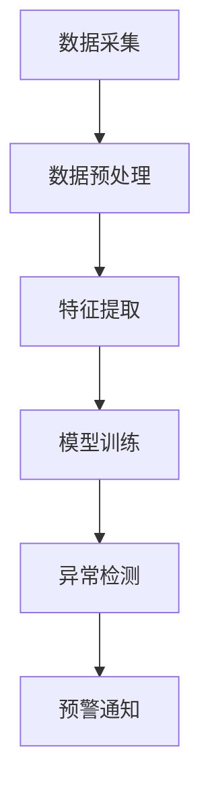
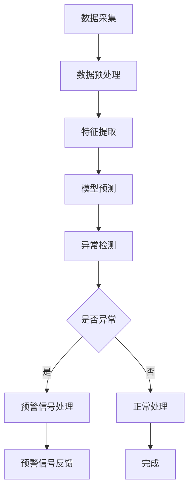
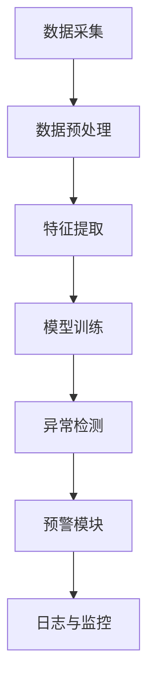
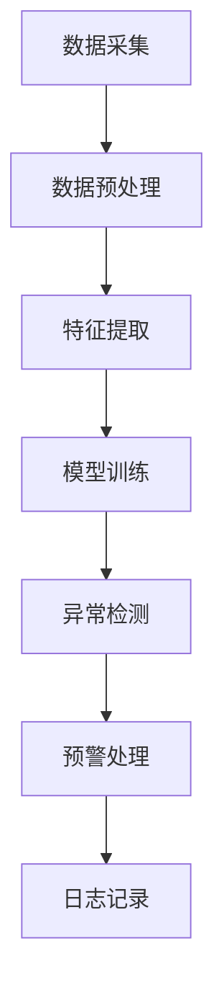

                 

### 文章标题

# 《AI赋能的电商异常交易实时检测与预警系统》

### 关键词

- 人工智能
- 电商交易
- 异常检测
- 实时预警
- 数据预处理
- 特征工程

### 摘要

本文深入探讨了AI赋能的电商异常交易实时检测与预警系统的构建。首先，通过概述AI在电商行业中的角色和异常交易的特点，阐明了AI赋能电商异常交易的意义。接着，介绍了AI的基础概念与算法，包括机器学习与深度学习、异常检测算法和实时预警系统设计。随后，详细描述了实时检测与预警系统的实现过程，包括系统设计原则、架构设计、数据采集与预处理、特征提取与模型训练、系统实现与部署等。文章还介绍了系统性能评估方法与优化策略，并通过实际案例分析，展示了系统的应用效果和改进方向。本文旨在为AI在电商领域的研究与应用提供有价值的参考。

## 《AI赋能的电商异常交易实时检测与预警系统》目录大纲

### 第一部分：概述与背景

#### 第1章：AI赋能电商行业概述
- **1.1** AI与电商发展的关系
  - 电商行业的历史与发展
  - AI技术的引入与融合
- **1.2** 电商异常交易的特点与挑战
  - 异常交易的定义与分类
  - 异常交易带来的风险与影响
- **1.3** AI赋能电商异常交易的意义
  - 提高交易安全性
  - 优化用户体验
  - 降低运营成本
- **1.4** 本书结构安排与学习目标
  - 内容安排与逻辑结构
  - 阅读预期收获

### 第二部分：AI核心概念与算法

#### 第2章：AI基础概念与架构
- **2.1** 机器学习与深度学习概述
  - **2.1.1** 机器学习的基本原理
    - 监督学习、无监督学习、强化学习
  - **2.1.2** 深度学习的关键技术
    - 神经网络、卷积神经网络、循环神经网络
- **2.2** AI在电商异常交易中的应用
  - **2.2.1** 数据预处理技术
    - 数据清洗、数据整合、数据标准化
  - **2.2.2** 特征工程与选择
    - 特征提取、特征选择、特征降维
- **2.3** AI架构设计原则与实践
  - **2.3.1** 系统设计原则
    - 可扩展性、高可用性、安全性
  - **2.3.2** 架构设计实践
    - 实时数据处理架构、分布式计算架构

#### 第3章：异常检测与预警算法
- **3.1** 异常检测算法原理
  - **3.1.1** 聚类算法
    - **3.1.1.1** K-means算法
    - **3.1.1.2** DBSCAN算法
    - **3.1.1.3** GMM算法
  - **3.1.2** 概率模型
    - **3.1.2.1** 贝叶斯分类器
    - **3.1.2.2** 决策树
- **3.2** 实时预警系统设计
  - **3.2.1** 实时数据处理
    - 数据流处理、实时计算
  - **3.2.2** 预警规则设定与优化
    - 规则设定、规则优化
  - **3.2.3** 预警信号处理与反馈
    - 信号检测、信号反馈

### 第三部分：实时检测与预警系统实现

#### 第4章：系统设计原则与架构
- **4.1** 系统架构设计
  - **4.1.1** 功能模块划分
    - 数据采集模块、数据预处理模块、特征提取模块、模型训练模块、异常检测模块、预警模块
  - **4.1.2** 数据流设计
    - 数据流处理流程、数据流转机制
- **4.2** 系统开发流程与工具
  - **4.2.1** 开发环境搭建
    - 开发环境配置、工具选择
  - **4.2.2** 开发框架选择
    - 框架比较、框架选择
- **4.3** 系统性能优化策略
  - **4.3.1** 数据库优化
    - 数据库选择、数据库优化
  - **4.3.2** 算法优化
    - 算法优化方法、算法优化效果
  - **4.3.3** 系统架构优化
    - 系统架构优化策略、系统架构优化效果

#### 第5章：数据采集与预处理
- **5.1** 数据来源与类型
  - **5.1.1** 电商交易数据
    - 数据来源、数据类型
  - **5.1.2** 用户行为数据
    - 数据来源、数据类型
- **5.2** 数据采集方法与工具
  - **5.2.1** 爬虫技术
    - 爬虫原理、爬虫工具
  - **5.2.2** API调用
    - API调用原理、API调用工具
- **5.3** 数据预处理流程与实现
  - **5.3.1** 数据清洗
    - 数据清洗方法、数据清洗效果
  - **5.3.2** 数据整合
    - 数据整合方法、数据整合效果
  - **5.3.3** 数据标准化
    - 数据标准化方法、数据标准化效果

#### 第6章：特征提取与模型训练
- **6.1** 特征提取方法
  - **6.1.1** 传统特征提取方法
    - **6.1.1.1** 时间序列特征
      - 时间序列特征提取方法、时间序列特征效果
    - **6.1.1.2** 空间特征
      - 空间特征提取方法、空间特征效果
  - **6.1.2** 现代特征提取方法
    - **6.1.2.1** 基于深度学习的特征提取
      - 基于深度学习的特征提取方法、基于深度学习的特征提取效果
    - **6.1.2.2** 基于图神经网络的特征提取
      - 基于图神经网络的特征提取方法、基于图神经网络的特征提取效果
- **6.2** 模型训练与调优
  - **6.2.1** 模型选择
    - **6.2.1.1** 监督学习模型
      - 监督学习模型选择、监督学习模型效果
    - **6.2.1.2** 无监督学习模型
      - 无监督学习模型选择、无监督学习模型效果
  - **6.2.2** 模型训练策略
    - **6.2.2.1** 梯度下降法
      - 梯度下降法原理、梯度下降法效果
    - **6.2.2.2** 优化器选择
      - 优化器选择原则、优化器选择效果
  - **6.2.3** 模型调优技巧
    - **6.2.3.1** 超参数调优
      - 超参数调优方法、超参数调优效果
    - **6.2.3.2** 模型集成
      - 模型集成方法、模型集成效果

#### 第7章：异常交易检测与预警系统实现
- **7.1** 实现流程与关键代码
  - **7.1.1** 系统总体架构实现
    - 系统架构设计、关键代码实现
  - **7.1.2** 关键算法实现
    - 关键算法原理、关键算法实现
- **7.2** 系统部署与运维
  - **7.2.1** 部署方案
    - 部署流程、部署方案
  - **7.2.2** 运维与监控
    - 运维流程、监控方法
- **7.3** 实际案例分析与解读
  - **7.3.1** 案例背景
    - 案例背景介绍、案例数据来源
  - **7.3.2** 案例分析
    - 案例分析过程、案例分析结果
  - **7.3.3** 案例解读
    - 案例解读内容、案例解读效果

### 第四部分：评估与优化

#### 第8章：系统性能评估方法
- **8.1** 评估指标与标准
  - **8.1.1** 精度、召回率、F1值等
    - 评估指标定义、评估指标计算方法
  - **8.1.2** 实时性评估指标
    - 实时性指标定义、实时性指标计算方法
- **8.2** 评估方法与工具
  - **8.2.1** 交叉验证
    - 交叉验证原理、交叉验证方法
  - **8.2.2** A/B测试
    - A/B测试原理、A/B测试方法
- **8.3** 性能优化策略
  - **8.3.1** 数据库优化
    - 数据库优化方法、数据库优化效果
  - **8.3.2** 算法优化
    - 算法优化方法、算法优化效果
  - **8.3.3** 系统架构优化
    - 系统架构优化方法、系统架构优化效果

#### 第9章：系统优化与改进
- **9.1** 系统优化原则
  - **9.1.1** 数据库优化
    - 数据库优化原则、数据库优化方法
  - **9.1.2** 算法优化
    - 算法优化原则、算法优化方法
  - **9.1.3** 系统架构优化
    - 系统架构优化原则、系统架构优化方法
- **9.2** 持续改进实践
  - **9.2.1** 集成学习
    - 集成学习方法、集成学习效果
  - **9.2.2** 强化学习
    - 强化学习方法、强化学习效果
- **9.3** 未来发展方向与挑战
  - **9.3.1** 人工智能发展趋势
    - 人工智能技术发展趋势、未来发展方向
  - **9.3.2** 挑战与应对
    - 面临的挑战、应对策略

### 附录

## 附录A：常用工具与资源
- **A.1** 数据处理工具
  - **A.1.1** Pandas
    - Pandas功能介绍、使用方法
  - **A.1.2** NumPy
    - NumPy功能介绍、使用方法
- **A.2** 深度学习框架
  - **A.2.1** TensorFlow
    - TensorFlow功能介绍、使用方法
  - **A.2.2** PyTorch
    - PyTorch功能介绍、使用方法
- **A.3** 数据库
  - **A.3.1** MySQL
    - MySQL功能介绍、使用方法
  - **A.3.2** MongoDB
    - MongoDB功能介绍、使用方法
- **A.4** 运维工具
  - **A.4.1** Docker
    - Docker功能介绍、使用方法
  - **A.4.2** Kubernetes
    - Kubernetes功能介绍、使用方法

## 第一部分：概述与背景

### 第1章：AI赋能电商行业概述

#### 1.1 AI与电商发展的关系

随着互联网技术的飞速发展，电商行业已经成为全球经济增长的重要引擎。AI技术的崛起为电商行业带来了新的变革机遇。AI技术通过数据挖掘、机器学习、自然语言处理等手段，可以深度挖掘用户行为数据，实现精准推荐、个性化营销、智能客服等功能，从而提升电商平台的用户体验和运营效率。

电商行业的历史可以追溯到20世纪90年代末，当时互联网的普及为电子商务的兴起提供了基础。早期的电商主要依靠简单的商品展示和在线交易功能，随着技术的发展，电商平台逐渐开始引入搜索引擎优化、数据挖掘等技术，以提升用户体验和销售业绩。进入21世纪后，随着大数据、云计算、人工智能等新兴技术的快速发展，电商行业进入了一个全新的发展阶段。AI技术的引入，使得电商平台能够更准确地理解用户需求，提供个性化的购物体验，从而大大提升了用户满意度和忠诚度。

AI技术在电商领域的应用主要表现在以下几个方面：

1. **精准推荐**：通过分析用户的历史购买记录、浏览行为、社交数据等，AI技术可以预测用户的兴趣和偏好，为用户提供个性化的商品推荐，从而提高销售转化率和用户粘性。

2. **个性化营销**：基于用户数据，AI技术可以精准定位目标用户群体，设计个性化的营销策略，如定向广告投放、定制化的促销活动等，从而提高营销效果和用户参与度。

3. **智能客服**：通过自然语言处理和机器学习技术，AI智能客服系统能够快速响应用户咨询，提供准确、高效的服务，提升客户满意度。

4. **供应链优化**：AI技术可以分析供应链数据，预测市场需求，优化库存管理，降低运营成本。

5. **风险控制**：AI技术在电商交易中的异常检测和预警方面发挥着重要作用，可以有效防范欺诈交易、恶意评价等风险，保障交易安全。

#### 1.2 电商异常交易的特点与挑战

电商异常交易是指在电子商务过程中，发生的一些不符合正常交易规则的交易行为。这些异常交易可能包括欺诈交易、洗钱、恶意评价等，对电商平台的运营和用户体验造成了严重的影响。

**欺诈交易**：欺诈交易是指不法分子通过伪造身份、使用虚假支付方式等手段进行恶意交易。这些交易行为不仅会导致平台损失，还会损害其他正常用户的购物体验。

**洗钱**：洗钱是指通过一系列复杂的金融交易，将非法所得的资金变成看似合法的资金。电商平台可能成为洗钱的渠道，因此需要严格防范。

**恶意评价**：一些用户可能会通过恶意评价来诋毁竞争对手或影响其他用户的购物决策，这对电商平台的声誉和用户信任造成了威胁。

**电商异常交易的特点**：

1. **隐蔽性强**：异常交易往往通过伪装或复杂的交易流程来掩盖其真实目的，使得检测难度增加。

2. **数量庞大**：电商平台每天都会产生大量的交易数据，其中异常交易占比虽然不大，但数量依然非常庞大，需要高效的处理方法。

3. **实时性要求高**：电商交易通常是实时的，异常交易检测与预警系统需要在短时间内处理大量数据，并实时做出反应。

**电商异常交易带来的挑战**：

1. **风险防范**：如何有效识别和防范异常交易，防止欺诈和洗钱行为，是电商平台面临的重要挑战。

2. **用户体验**：在防范异常交易的同时，如何确保正常用户的购物体验不受影响，避免误判和误报。

3. **系统性能**：实时检测与预警系统需要具备高性能、高可用的特点，以满足电商业务的快速发展和用户需求。

#### 1.3 AI赋能电商异常交易的意义

AI技术在电商异常交易检测与预警方面具有显著的优势，能够有效提升交易安全性、优化用户体验和降低运营成本。

1. **提高交易安全性**：

   AI技术通过对大量历史交易数据的学习和分析，可以识别出潜在的欺诈行为和异常交易模式。实时检测与预警系统可以在交易发生时迅速识别异常行为，采取相应的措施，如拦截交易、警告用户等，从而有效防止欺诈交易和洗钱行为，保障交易安全。

2. **优化用户体验**：

   AI技术可以通过分析用户行为数据，预测用户的兴趣和偏好，为用户提供个性化的购物体验。例如，通过智能推荐系统，向用户推荐符合其兴趣的商品，提高用户满意度和购物转化率。同时，AI智能客服系统可以提供24小时在线服务，快速响应用户咨询，提升用户购物体验。

3. **降低运营成本**：

   传统的人工审核方式在处理海量交易数据时效率低下，成本高昂。AI技术的引入可以自动化异常交易检测与预警流程，提高处理效率，降低人力成本。此外，AI技术还可以优化供应链管理，降低库存成本，提高运营效率。

总之，AI赋能的电商异常交易实时检测与预警系统不仅有助于提升电商平台的交易安全性，还能优化用户体验，降低运营成本，为电商行业带来巨大的价值。

#### 1.4 本书结构安排与学习目标

本书旨在深入探讨AI赋能电商异常交易实时检测与预警系统的构建与应用。整体结构分为四个部分，每部分各有侧重，旨在帮助读者全面了解该领域的核心概念、关键技术及实际应用。

**第一部分：概述与背景**

- **第1章** AI赋能电商行业概述
  - 内容：介绍AI与电商发展的关系，电商异常交易的特点与挑战，以及AI赋能电商异常交易的意义。
  - 学习目标：理解AI在电商行业中的应用价值，认识电商异常交易对平台的影响，以及AI赋能的重要性。

**第二部分：AI核心概念与算法**

- **第2章** AI基础概念与架构
  - 内容：介绍机器学习与深度学习的基本原理，以及AI在电商异常交易中的应用。
  - 学习目标：掌握机器学习与深度学习的基本概念，理解其应用场景，以及如何应用于电商异常交易检测。

- **第3章** 异常检测与预警算法
  - 内容：介绍异常检测算法的原理，包括聚类算法和概率模型，以及实时预警系统的设计。
  - 学习目标：了解异常检测的基本方法，掌握聚类算法和概率模型的应用，理解实时预警系统的设计思路。

**第三部分：实时检测与预警系统实现**

- **第4章** 系统设计原则与架构
  - 内容：介绍实时检测与预警系统的设计原则和架构，包括功能模块划分和数据流设计。
  - 学习目标：理解系统设计原则，掌握实时检测与预警系统的架构设计。

- **第5章** 数据采集与预处理
  - 内容：介绍数据采集方法和预处理流程，包括电商交易数据和用户行为数据。
  - 学习目标：掌握数据采集和预处理方法，理解数据质量对系统性能的影响。

- **第6章** 特征提取与模型训练
  - 内容：介绍特征提取方法和模型训练策略，包括传统特征提取方法和现代特征提取方法。
  - 学习目标：掌握特征提取和模型训练方法，理解其对系统性能的影响。

- **第7章** 异常交易检测与预警系统实现
  - 内容：介绍系统的实现流程和关键代码，包括系统部署与运维。
  - 学习目标：理解系统实现流程，掌握关键代码实现，了解系统部署与运维的方法。

**第四部分：评估与优化**

- **第8章** 系统性能评估方法
  - 内容：介绍系统性能评估指标和方法，包括精度、召回率、F1值等。
  - 学习目标：掌握系统性能评估方法，理解评估指标的计算和应用。

- **第9章** 系统优化与改进
  - 内容：介绍系统优化原则和持续改进实践，包括数据库优化、算法优化和系统架构优化。
  - 学习目标：理解系统优化原则，掌握优化方法，了解持续改进实践的重要性。

通过阅读本书，读者可以系统地掌握AI赋能电商异常交易实时检测与预警系统的构建方法，为实际项目提供理论支持和实践指导。

## 第二部分：AI核心概念与算法

### 第2章：AI基础概念与架构

#### 2.1 机器学习与深度学习概述

机器学习（Machine Learning，ML）是一种人工智能（Artificial Intelligence，AI）的分支，通过构建和分析模型，使计算机系统能够从数据中自动学习和改进，从而执行特定的任务。深度学习（Deep Learning，DL）则是机器学习的一个子领域，基于多层神经网络结构，通过模拟人脑的神经网络进行学习和决策。

**2.1.1 机器学习的基本原理**

机器学习的基本原理可以分为以下几个步骤：

1. **数据收集**：收集大量相关数据，用于训练模型。
2. **数据预处理**：清洗和整理数据，使其适合建模。
3. **模型选择**：选择合适的机器学习算法和模型结构。
4. **模型训练**：通过算法训练模型，使其能够预测或分类新数据。
5. **模型评估**：评估模型的性能，包括精度、召回率等指标。
6. **模型优化**：根据评估结果调整模型参数，提高性能。

**2.1.2 深度学习的关键技术**

深度学习的关键技术包括：

1. **神经网络**：神经网络是一种由大量节点（神经元）组成的信息处理系统，通过前向传播和反向传播算法进行学习。
2. **卷积神经网络（CNN）**：CNN是一种专门用于处理图像数据的神经网络，通过卷积层和池化层提取图像特征。
3. **循环神经网络（RNN）**：RNN是一种能够处理序列数据的神经网络，通过隐藏状态和循环连接实现长距离依赖建模。

#### 2.2 AI在电商异常交易中的应用

**2.2.1 数据预处理技术**

数据预处理是机器学习过程中至关重要的一环，其目的是提高数据质量和模型性能。在电商异常交易检测中，常见的数据预处理技术包括：

1. **数据清洗**：处理缺失值、异常值和重复数据，确保数据的一致性和完整性。
2. **数据整合**：将不同来源的数据进行合并，形成一个统一的数据集。
3. **数据标准化**：通过归一化或标准化处理，将数据缩放到相同的尺度，避免数据量级差异对模型训练的影响。

**2.2.2 特征工程与选择**

特征工程（Feature Engineering）是机器学习中的重要环节，旨在从原始数据中提取有意义的特征，以提高模型性能。在电商异常交易检测中，特征工程包括：

1. **特征提取**：从原始数据中提取时间序列特征、空间特征等。
2. **特征选择**：通过降维技术（如主成分分析、特征选择算法）选择关键特征，减少数据冗余。
3. **特征组合**：将多个特征组合成新的特征，以增强模型的预测能力。

#### 2.3 AI架构设计原则与实践

**2.3.1 系统设计原则**

AI架构设计需要遵循以下原则：

1. **可扩展性**：系统能够适应数据量和用户量的增长，灵活扩展。
2. **高可用性**：系统具备高可靠性，能够在故障发生时快速恢复。
3. **安全性**：系统保护数据安全和用户隐私，防止数据泄露和恶意攻击。

**2.3.2 架构设计实践**

一个典型的AI架构设计包括以下几个模块：

1. **数据采集模块**：负责从各种渠道收集电商交易数据、用户行为数据等。
2. **数据预处理模块**：对采集到的数据进行清洗、整合、标准化等预处理操作。
3. **特征提取模块**：从预处理后的数据中提取有意义的时间序列特征、空间特征等。
4. **模型训练模块**：使用提取出的特征进行模型训练，包括传统的机器学习模型和深度学习模型。
5. **异常检测模块**：将训练好的模型应用于实时数据，检测异常交易。
6. **预警模块**：根据检测结果，触发预警机制，通知相关人员进行干预。

**Mermaid 流程图**

以下是一个简单的Mermaid流程图，展示了AI架构设计的基本流程：



通过以上内容，读者可以初步了解AI的基本概念、机器学习与深度学习的关键技术，以及AI在电商异常交易中的应用。接下来，我们将进一步探讨异常检测与预警算法，帮助读者深入了解如何构建高效的实时检测与预警系统。

### 第3章：异常检测与预警算法

#### 3.1 异常检测算法原理

异常检测（Anomaly Detection）是数据挖掘和机器学习中的一个重要任务，旨在识别数据中的异常值或异常模式。在电商异常交易检测中，异常检测算法可以帮助识别欺诈交易、异常行为等，从而提高交易安全性。

**3.1.1 聚类算法**

聚类算法是一种无监督学习方法，旨在将数据集划分为若干个簇，使得同一簇内的数据点之间相似度较高，而不同簇的数据点之间相似度较低。以下是一些常用的聚类算法：

**1. K-means算法**

K-means算法是一种基于距离的聚类方法，其基本思想是初始化K个簇中心，然后通过迭代更新簇中心和数据点的归属关系，直至收敛。算法的伪代码如下：

```python
初始化K个簇中心
重复以下步骤直到收敛：
  计算每个数据点到簇中心的距离
  将每个数据点分配到最近的簇中心
  更新簇中心为当前簇内所有数据点的均值
```

**2. DBSCAN算法**

DBSCAN（Density-Based Spatial Clustering of Applications with Noise）是一种基于密度的聚类算法，可以识别出不同形状的簇，并能够处理噪声数据。算法的伪代码如下：

```python
初始化参数epsilon和min_samples
对于每个数据点p：
  如果p是核心点：
    扩展簇，将p及其邻域内的所有点加入簇
  否则，如果p是边界点：
    如果p的邻域内有足够的点，则将p加入簇
    否则，将p标记为噪声点
```

**3. GMM算法**

GMM（Gaussian Mixture Model，高斯混合模型）是一种概率模型，用于聚类任务。每个簇被假设为服从高斯分布，算法的伪代码如下：

```python
初始化参数μ（均值）和Σ（协方差矩阵）
重复以下步骤直到收敛：
  计算每个数据点的概率密度
  根据概率密度更新参数μ和Σ
  重新计算每个数据点的概率密度
```

**3.1.2 概率模型**

概率模型是一种基于概率统计的方法，通过计算数据点的概率分布来识别异常值。以下是一些常用的概率模型：

**1. 贝叶斯分类器**

贝叶斯分类器是一种基于贝叶斯定理的分类方法，通过计算数据点属于各个类别的概率，选择概率最大的类别作为预测结果。算法的伪代码如下：

```python
初始化先验概率
对于每个类别：
  计算条件概率
  计算后验概率
选择后验概率最大的类别作为预测结果
```

**2. 决策树**

决策树是一种基于特征的分类方法，通过构建树状结构，将数据集划分为若干个子集，直至达到叶节点。算法的伪代码如下：

```python
选择最优特征
将数据划分为两个子集
如果达到叶节点，则返回预测结果
否则，递归调用构建子树
```

#### 3.2 实时预警系统设计

实时预警系统（Real-time Alert System）是电商异常交易检测的关键组成部分，旨在实时监测交易行为，并在检测到异常时及时发出警报。以下是一个典型的实时预警系统设计：

**3.2.1 实时数据处理**

实时数据处理是实时预警系统的核心，需要处理大量的实时数据，并确保数据处理的实时性和准确性。以下是一些关键技术：

1. **数据流处理**：使用数据流处理框架（如Apache Kafka、Apache Flink）对实时数据进行处理和传输。
2. **分布式计算**：使用分布式计算框架（如Apache Spark、Hadoop）处理大规模数据集，提高数据处理效率。
3. **内存计算**：使用内存计算技术（如Apache Spark的内存计算引擎）加速数据处理速度。

**3.2.2 预警规则设定与优化**

预警规则设定是实时预警系统的重要环节，需要根据历史数据和业务需求制定合适的预警规则。以下是一些关键步骤：

1. **规则定义**：根据业务需求和数据特征，定义预警规则，如交易金额超过阈值、交易频率异常等。
2. **规则优化**：通过分析预警结果的准确性和实时性，不断优化预警规则，提高预警系统的效果。

**3.2.3 预警信号处理与反馈**

预警信号处理与反馈是实时预警系统的关键环节，需要确保预警信号的及时性和准确性。以下是一些关键技术：

1. **预警信号检测**：使用异常检测算法对实时数据进行检测，识别异常交易。
2. **预警信号处理**：对检测到的异常交易进行分类和处理，如发出警报、暂停交易等。
3. **预警信号反馈**：将预警信号反馈给业务系统，如客户服务系统、风控系统等，以便及时采取措施。

**Mermaid 流程图**

以下是一个简单的Mermaid流程图，展示了实时预警系统的基本流程：



通过以上内容，读者可以了解异常检测算法的基本原理和实时预警系统的设计思路。在接下来的章节中，我们将进一步探讨实时检测与预警系统的实现细节，帮助读者深入了解系统的构建过程。

### 第三部分：实时检测与预警系统实现

#### 第4章：系统设计原则与架构

实时检测与预警系统的设计需要综合考虑系统的功能、性能、可靠性和可扩展性。以下将详细介绍系统设计原则与架构，包括功能模块划分、数据流设计及开发流程与工具。

**4.1 系统架构设计**

一个典型的实时检测与预警系统可以划分为以下功能模块：

1. **数据采集模块**：负责从电商平台的各个数据源（如数据库、日志文件、API等）采集交易数据和用户行为数据。
2. **数据预处理模块**：对采集到的原始数据进行清洗、整合和标准化处理，确保数据质量。
3. **特征提取模块**：从预处理后的数据中提取有意义的时间序列特征、空间特征等，为后续的异常检测和预警提供输入。
4. **模型训练模块**：使用提取出的特征进行模型训练，包括传统的机器学习模型和深度学习模型，以便用于实时异常检测。
5. **异常检测模块**：将训练好的模型应用于实时数据，识别异常交易或行为。
6. **预警模块**：根据检测到的异常情况，发出预警信号并触发相应的处理措施。
7. **日志与监控模块**：记录系统的运行日志，监控系统的性能和健康状况。

**4.1.1 功能模块划分**

以下是一个简单的Mermaid流程图，展示了实时检测与预警系统的功能模块划分：



**4.1.2 数据流设计**

实时检测与预警系统的数据流设计需要确保数据的实时性和高效性。以下是一个简单的数据流设计：

1. **数据采集**：通过API调用、日志采集等方式，实时采集电商平台的交易数据和用户行为数据。
2. **数据预处理**：对采集到的原始数据进行清洗、去重、整合和标准化处理，将其转换为适合建模的数据。
3. **特征提取**：从预处理后的数据中提取时间序列特征、空间特征等，为模型训练提供输入。
4. **模型训练**：使用提取出的特征进行模型训练，包括传统的机器学习模型和深度学习模型。
5. **异常检测**：将训练好的模型应用于实时数据，识别异常交易或行为。
6. **预警处理**：根据检测到的异常情况，发出预警信号并触发相应的处理措施。
7. **日志记录**：记录系统的运行日志，用于监控和分析系统的性能。

**Mermaid 流程图**

以下是一个简单的Mermaid流程图，展示了实时检测与预警系统的数据流设计：



**4.2 系统开发流程与工具**

实时检测与预警系统的开发涉及多个阶段，包括需求分析、系统设计、编码实现、测试与部署。以下将介绍系统开发流程与工具：

**4.2.1 开发环境搭建**

搭建开发环境是系统开发的第一步，包括安装必要的软件和配置开发工具。以下是一个简单的开发环境搭建流程：

1. **操作系统**：选择Linux操作系统，如Ubuntu。
2. **编程语言**：选择Python作为主要的编程语言。
3. **开发工具**：安装Python开发环境，如PyCharm或VS Code。
4. **依赖管理**：使用pip或conda进行依赖管理，安装必要的库和工具。

**4.2.2 开发框架选择**

选择合适的开发框架可以提高开发效率和系统性能。以下是一些常用的开发框架：

1. **数据处理框架**：如Pandas、NumPy，用于数据预处理和特征提取。
2. **机器学习框架**：如Scikit-learn、TensorFlow、PyTorch，用于模型训练和异常检测。
3. **消息队列**：如Apache Kafka，用于实时数据采集和传输。
4. **流处理框架**：如Apache Flink、Apache Spark Streaming，用于实时数据处理和计算。

**4.2.3 系统性能优化策略**

系统性能优化是实时检测与预警系统开发的重要环节。以下是一些常见的性能优化策略：

1. **并行计算**：使用并行计算技术，如多线程、分布式计算，提高数据处理速度。
2. **内存优化**：减少内存占用，提高系统性能，如使用内存池、内存映射技术。
3. **缓存策略**：使用缓存技术，如Redis、Memcached，减少数据访问延迟。
4. **负载均衡**：使用负载均衡技术，如Nginx、HAProxy，确保系统高可用性。

通过以上内容，读者可以了解实时检测与预警系统的设计原则与架构，以及系统开发流程与工具。在接下来的章节中，我们将进一步探讨数据采集与预处理、特征提取与模型训练等关键环节，帮助读者深入了解系统的实现细节。

#### 第5章：数据采集与预处理

##### 5.1 数据来源与类型

在实时检测与预警系统中，数据的质量和类型直接影响到系统的性能和准确性。数据来源和类型主要包括电商交易数据和用户行为数据。

**5.1.1 电商交易数据**

电商交易数据是指用户在电商平台上的交易记录，包括订单号、用户ID、商品ID、交易时间、交易金额、交易状态等信息。这些数据通常存储在电商平台的数据库中，可以通过API接口或数据库连接工具进行采集。

**5.1.2 用户行为数据**

用户行为数据是指用户在电商平台上的行为记录，包括浏览历史、点击记录、收藏商品、评价商品等信息。这些数据通常记录在电商平台的日志文件或分析系统中，可以通过日志采集工具或API接口进行采集。

##### 5.2 数据采集方法与工具

数据采集是实时检测与预警系统的第一步，需要确保数据的完整性、准确性和实时性。以下介绍几种常用的数据采集方法与工具。

**5.2.1 爬虫技术**

爬虫（Web Crawler）是一种自动获取互联网数据的程序，适用于从电商平台网站采集数据。常用的爬虫工具包括Scrapy、BeautifulSoup等。

**示例代码（使用Scrapy采集电商交易数据）：**

```python
import scrapy

class EcommerceSpider(scrapy.Spider):
    name = 'ecommerce'
    start_urls = ['https://www.example.com']

    def parse(self, response):
        for item in response.css('div.item'):
            yield {
                'order_id': item.css('span.order_id::text').get(),
                'user_id': item.css('span.user_id::text').get(),
                'product_id': item.css('span.product_id::text').get(),
                'time': item.css('span.time::text').get(),
                'amount': item.css('span.amount::text').get(),
                'status': item.css('span.status::text').get(),
            }
```

**5.2.2 API调用**

API（Application Programming Interface）是一种用于程序间通信的接口，适用于从电商平台的API接口采集数据。常用的API调用工具包括requests、aiohttp等。

**示例代码（使用requests获取电商交易数据）：**

```python
import requests

def get_ecommerce_data():
    url = 'https://api.example.com/orders'
    response = requests.get(url)
    data = response.json()
    return data['orders']

orders = get_ecommerce_data()
```

##### 5.3 数据预处理流程与实现

数据预处理是确保数据质量的关键步骤，包括数据清洗、数据整合和数据标准化。以下介绍数据预处理流程与实现。

**5.3.1 数据清洗**

数据清洗主要包括处理缺失值、异常值和重复值。以下是一个简单的数据清洗流程：

1. **缺失值处理**：使用均值、中位数、最大值等方法填充缺失值，或删除缺失值数据。
2. **异常值处理**：使用统计学方法（如标准差、箱线图等）检测异常值，并采取相应的处理措施，如删除或修正异常值。
3. **重复值处理**：检测并删除重复数据，确保数据的唯一性。

**示例代码（Pandas实现数据清洗）：**

```python
import pandas as pd

data = pd.read_csv('ecommerce_data.csv')

# 缺失值处理
data.fillna(data.mean(), inplace=True)

# 异常值处理
std_dev = data.std()
threshold = 3 * std_dev
data = data[(data < threshold).all(axis=1)]

# 重复值处理
data.drop_duplicates(inplace=True)

# 保存清洗后的数据
data.to_csv('cleaned_ecommerce_data.csv', index=False)
```

**5.3.2 数据整合**

数据整合是指将来自不同来源的数据进行合并，形成一个统一的数据集。以下是一个简单的数据整合流程：

1. **数据连接**：使用数据库连接工具（如SQLAlchemy）连接多个数据源，获取数据。
2. **数据合并**：使用Pandas的merge、join等方法将多个数据表合并为一个数据集。

**示例代码（Pandas实现数据整合）：**

```python
import pandas as pd

data1 = pd.read_csv('ecommerce_data1.csv')
data2 = pd.read_csv('ecommerce_data2.csv')

data = pd.merge(data1, data2, on=['order_id', 'user_id'])

# 保存整合后的数据
data.to_csv('integrated_ecommerce_data.csv', index=False)
```

**5.3.3 数据标准化**

数据标准化是指将数据缩放到相同的尺度，以避免数据量级差异对模型训练的影响。以下是一个简单的数据标准化流程：

1. **数据缩放**：使用Min-Max缩放或标准化方法将数据缩放到[0, 1]或均值为0、标准差为1的范围内。
2. **数据转换**：对数据进行对数转换、指数转换等，以减少异常值的影响。

**示例代码（Pandas实现数据标准化）：**

```python
import pandas as pd
from sklearn.preprocessing import MinMaxScaler

data = pd.read_csv('ecommerce_data.csv')

# Min-Max缩放
scaler = MinMaxScaler()
data_scaled = scaler.fit_transform(data)
data_scaled = pd.DataFrame(data_scaled, columns=data.columns)

# 保存标准化后的数据
data_scaled.to_csv('standardized_ecommerce_data.csv', index=False)
```

通过以上内容，读者可以了解数据采集与预处理的方法和工具，以及数据处理流程与实现。在接下来的章节中，我们将进一步探讨特征提取与模型训练，为实时检测与预警系统的构建打下基础。

#### 第6章：特征提取与模型训练

##### 6.1 特征提取方法

特征提取是机器学习过程中至关重要的一环，其目的是从原始数据中提取出有代表性的特征，用于训练模型和提高模型的性能。在电商异常交易检测中，特征提取方法可以分为传统特征提取方法和现代特征提取方法。

**6.1.1 传统特征提取方法**

传统特征提取方法主要依赖于统计学和规则化的方法，可以从数据中提取出一些简单而有意义的特征。

**1. 时间序列特征**

时间序列特征是指基于时间顺序的数据特征，如交易时间、交易频率等。时间序列特征可以通过简单的统计方法提取，例如：

- **均值**：某段时间内的平均交易金额。
- **标准差**：某段时间内的交易金额波动程度。
- **分位数**：某段时间内的交易金额的分位数。

**示例代码（Python实现时间序列特征提取）：**

```python
import pandas as pd

data = pd.DataFrame({
    'order_id': [1, 2, 3, 4, 5],
    'time': ['2021-01-01', '2021-01-02', '2021-01-03', '2021-01-04', '2021-01-05'],
    'amount': [100, 150, 200, 250, 300]
})

# 计算时间序列特征
data['mean_amount'] = data['amount'].mean()
data['std_amount'] = data['amount'].std()
data['q1_amount'] = data['amount'].quantile(0.25)
data['q3_amount'] = data['amount'].quantile(0.75)

data
```

- **空间特征**

空间特征是指基于地理位置的特征，如交易地点、用户居住地等。空间特征可以通过地理信息系统（GIS）或地图服务（如Google Maps API）获取。

**2. 用户特征**

用户特征是指与用户相关的特征，如用户年龄、性别、消费能力等。用户特征可以通过电商平台的用户资料或第三方数据获取。

**示例代码（Python实现用户特征提取）：**

```python
import pandas as pd

data = pd.DataFrame({
    'user_id': [1, 2, 3, 4, 5],
    'age': [25, 30, 35, 40, 45],
    'gender': ['M', 'F', 'M', 'F', 'M'],
    'annual_income': [50000, 60000, 70000, 80000, 90000]
})

# 计算用户特征
data['mean_age'] = data['age'].mean()
data['std_age'] = data['age'].std()
data['gender_ratio'] = data['gender'].value_counts(normalize=True)

data
```

**6.1.2 现代特征提取方法**

现代特征提取方法主要基于机器学习和深度学习技术，可以从原始数据中自动提取出更高层次的特征。

**1. 基于深度学习的特征提取**

基于深度学习的特征提取方法可以通过卷积神经网络（CNN）和循环神经网络（RNN）等深度学习模型，从图像和序列数据中自动提取特征。

**示例代码（使用TensorFlow实现基于CNN的特征提取）：**

```python
import tensorflow as tf
from tensorflow.keras.models import Sequential
from tensorflow.keras.layers import Conv2D, MaxPooling2D, Flatten, Dense

# 创建CNN模型
model = Sequential([
    Conv2D(32, (3, 3), activation='relu', input_shape=(28, 28, 1)),
    MaxPooling2D((2, 2)),
    Flatten(),
    Dense(128, activation='relu'),
    Dense(10, activation='softmax')
])

# 编译模型
model.compile(optimizer='adam', loss='categorical_crossentropy', metrics=['accuracy'])

# 训练模型
model.fit(x_train, y_train, epochs=10, batch_size=32, validation_data=(x_val, y_val))

# 提取特征
features = model.layers[-1].output
model FeatureExtractor = tf.keras.Model(inputs=model.input, outputs=features)

x_test_features = model FeatureExtractor.predict(x_test)
```

**2. 基于图神经网络的特征提取**

基于图神经网络（Graph Neural Network，GNN）的特征提取方法可以从图数据中提取特征，适用于社交网络、推荐系统等应用。

**示例代码（使用PyTorch实现基于GNN的特征提取）：**

```python
import torch
import torch.nn as nn
from torch_geometric.nn import GCNConv

# 创建GNN模型
class GNNModel(nn.Module):
    def __init__(self):
        super(GNNModel, self).__init__()
        self.conv1 = GCNConv(6, 16)
        self.conv2 = GCNConv(16, 32)
        self.fc1 = nn.Linear(32, 16)
        self.fc2 = nn.Linear(16, 1)

    def forward(self, data):
        x, edge_index = data.x, data.edge_index

        x = self.conv1(x, edge_index)
        x = torch.relu(x)
        x = F.dropout(x, p=0.5, training=self.training)
        x = self.conv2(x, edge_index)
        x = torch.relu(x)
        x = F.dropout(x, p=0.5, training=self.training)

        x = self.fc1(x)
        x = torch.relu(x)
        x = self.fc2(x)

        return F.sigmoid(x)

# 实例化模型
model = GNNModel()

# 编译模型
optimizer = torch.optim.Adam(model.parameters(), lr=0.01)
criterion = nn.BCELoss()

# 训练模型
for epoch in range(num_epochs):
    optimizer.zero_grad()
    out = model(data)
    loss = criterion(out, data.y)
    loss.backward()
    optimizer.step()

# 提取特征
features = model(data).detach().numpy()

# 保存特征
np.save('gnn_features.npy', features)
```

##### 6.2 模型训练与调优

模型训练是指使用训练数据对模型进行调整，使其能够准确预测未知数据。在电商异常交易检测中，常见的模型训练方法包括监督学习和无监督学习。

**6.2.1 模型选择**

**1. 监督学习模型**

监督学习模型是基于有标签数据集进行训练的，常见的监督学习模型包括：

- **决策树**：通过决策树模型可以提取出特征并进行分类或回归。
- **支持向量机（SVM）**：SVM通过找到一个最佳的超平面，将不同类别的数据点分隔开来。
- **随机森林**：随机森林是一种集成学习方法，通过构建多个决策树，并进行投票得出最终预测结果。
- **神经网络**：神经网络可以自动学习复杂的非线性关系，适用于处理大规模数据和高维特征。

**2. 无监督学习模型**

无监督学习模型是基于无标签数据集进行训练的，常见的无监督学习模型包括：

- **聚类算法**：如K-means、DBSCAN等，用于将相似的数据点分组。
- **主成分分析（PCA）**：PCA通过降维技术，将数据投影到新的坐标轴上，减少数据冗余。
- **自编码器**：自编码器是一种特殊的神经网络，通过编码和解码过程自动学习数据的特征。

**6.2.2 模型训练策略**

**1. 梯度下降法**

梯度下降法是一种常用的优化方法，用于更新模型的参数。梯度下降法的基本思想是通过计算损失函数关于参数的梯度，并沿着梯度的反方向更新参数，以达到最小化损失函数的目的。

**2. 优化器选择**

优化器是一种用于加速梯度下降法的算法，常用的优化器包括：

- **SGD（随机梯度下降）**：SGD通过每次只更新一部分样本的梯度来加速收敛。
- **Adam**：Adam是一种自适应的学习率优化方法，结合了SGD和RMSProp的优点。
- **Adagrad**：Adagrad通过跟踪每个参数的历史梯度平方和来调整学习率。

**6.2.3 模型调优技巧**

**1. 超参数调优**

超参数是模型中需要手动设定的参数，如学习率、批次大小、隐藏层大小等。超参数调优可以通过网格搜索、随机搜索等方法进行。

**2. 模型集成**

模型集成是一种通过结合多个模型的预测结果来提高预测性能的方法。常见的集成方法包括：

- **Bagging**：Bagging通过多次训练和投票来集成多个模型的预测结果。
- **Boosting**：Boosting通过加权训练样本，使模型重点关注困难样本。
- **Stacking**：Stacking通过构建一个新的模型来整合多个模型的预测结果。

通过以上内容，读者可以了解特征提取的方法和模型训练的策略。在接下来的章节中，我们将进一步探讨异常交易检测与预警系统的实现细节，帮助读者深入理解系统的构建过程。

### 第7章：异常交易检测与预警系统实现

#### 7.1 实现流程与关键代码

异常交易检测与预警系统的实现可以分为以下几个步骤：系统架构设计、关键算法实现、系统部署与运维。以下将详细介绍每个步骤，并提供关键代码示例。

**7.1.1 系统总体架构实现**

首先，我们需要设计系统的总体架构，确保系统具有良好的扩展性、高可用性和安全性。

**系统架构设计：**

1. **数据采集模块**：负责从电商平台的不同数据源（如数据库、日志文件、API接口）采集交易数据和用户行为数据。
2. **数据预处理模块**：对采集到的数据进行清洗、整合和标准化处理，确保数据质量。
3. **特征提取模块**：从预处理后的数据中提取有意义的时间序列特征、空间特征等，为后续的异常检测和预警提供输入。
4. **模型训练模块**：使用提取出的特征进行模型训练，包括传统的机器学习模型和深度学习模型。
5. **异常检测模块**：将训练好的模型应用于实时数据，识别异常交易或行为。
6. **预警模块**：根据检测到的异常情况，发出预警信号并触发相应的处理措施。
7. **日志与监控模块**：记录系统的运行日志，监控系统的性能和健康状况。

**关键代码示例：**

```python
# 示例：数据采集模块代码
def collect_data():
    # 使用API接口采集电商交易数据
    response = requests.get('https://api.example.com/orders')
    data = response.json()
    return data

# 示例：数据预处理模块代码
def preprocess_data(data):
    # 数据清洗、整合和标准化处理
    cleaned_data = clean_data(data)
    integrated_data = integrate_data(cleaned_data)
    standardized_data = standardize_data(integrated_data)
    return standardized_data

# 示例：特征提取模块代码
def extract_features(data):
    # 提取时间序列特征、空间特征等
    time_series_features = extract_time_series_features(data)
    spatial_features = extract_spatial_features(data)
    return time_series_features, spatial_features

# 示例：模型训练模块代码
def train_model(features, labels):
    # 使用提取出的特征进行模型训练
    model = create_model()
    model.fit(features, labels)
    return model

# 示例：异常检测模块代码
def detect_anomalies(model, data):
    # 将训练好的模型应用于实时数据，识别异常交易
    anomalies = model.predict(data)
    return anomalies

# 示例：预警模块代码
def trigger_alert(anomalies):
    # 根据检测到的异常情况，发出预警信号
    for anomaly in anomalies:
        alert(anomaly)
```

**7.1.2 关键算法实现**

在实现异常交易检测与预警系统时，关键算法的实现至关重要。以下将介绍常用的异常检测算法，并给出关键代码示例。

**1. K-means算法**

K-means算法是一种基于距离的聚类算法，可以用于异常检测。以下是一个简单的K-means算法实现：

```python
from sklearn.cluster import KMeans

def kmeans_detection(data, n_clusters=5):
    # 使用K-means算法进行异常检测
    kmeans = KMeans(n_clusters=n_clusters)
    kmeans.fit(data)
    labels = kmeans.predict(data)
    anomalies = data[labels != kmeans.labels_.mean()]
    return anomalies
```

**2. 决策树算法**

决策树算法可以用于分类任务，也可以用于异常检测。以下是一个简单的决策树实现：

```python
from sklearn.tree import DecisionTreeClassifier

def decision_tree_detection(data, labels):
    # 使用决策树算法进行异常检测
    model = DecisionTreeClassifier()
    model.fit(data, labels)
    anomalies = model.predict(data)
    return anomalies
```

**3. 自编码器算法**

自编码器算法可以用于特征提取和异常检测。以下是一个简单的自编码器实现：

```python
from keras.models import Model
from keras.layers import Input, Dense

def autoencoder_detection(data, n_hidden_layers=2, n_neurons=128):
    # 使用自编码器算法进行异常检测
    input_shape = data.shape[1:]
    input_layer = Input(shape=input_shape)
    x = input_layer
    for i in range(n_hidden_layers):
        x = Dense(n_neurons, activation='relu')(x)
    encoded = Dense(n_neurons, activation='relu')(x)
    for i in range(n_hidden_layers):
        x = Dense(n_neurons, activation='relu')(x)
    decoded = Dense(input_shape, activation='sigmoid')(x)
    autoencoder = Model(input_layer, decoded)
    autoencoder.compile(optimizer='adam', loss='binary_crossentropy')
    autoencoder.fit(data, data, epochs=100, batch_size=32, shuffle=True, validation_split=0.1)
    anomalies = autoencoder.predict(data)
    return anomalies
```

**7.1.3 系统部署与运维**

系统部署与运维是确保系统稳定运行的关键环节。以下将介绍系统部署与运维的相关内容。

**1. 部署方案**

系统部署方案可以选择在云平台上进行，如AWS、Azure或阿里云。以下是一个简单的部署方案：

- **数据采集模块**：使用云服务器（如AWS EC2实例）运行爬虫程序，定期从电商平台采集交易数据和用户行为数据。
- **数据预处理模块**：使用云数据仓库（如AWS S3）存储采集到的数据，并使用数据处理工具（如AWS Glue）进行数据清洗、整合和标准化处理。
- **特征提取模块**：使用云服务器运行特征提取脚本，将预处理后的数据转换为适合建模的格式。
- **模型训练模块**：使用云服务器（如AWS EC2实例）运行模型训练脚本，使用提取出的特征进行模型训练。
- **异常检测模块**：使用云服务器运行异常检测脚本，将训练好的模型应用于实时数据，识别异常交易或行为。
- **预警模块**：使用云服务器运行预警脚本，根据检测到的异常情况，触发相应的预警措施。
- **日志与监控模块**：使用云监控工具（如AWS CloudWatch）监控系统的运行状态和性能，记录运行日志。

**2. 运维与监控**

系统运维与监控包括以下任务：

- **监控系统性能**：使用云监控工具（如AWS CloudWatch）实时监控系统的CPU、内存、网络等性能指标，确保系统稳定运行。
- **日志管理**：使用日志管理工具（如AWS Kinesis）收集和存储系统的运行日志，方便进行故障排查和性能优化。
- **自动化运维**：使用云自动化工具（如AWS Lambda、AWS Step Functions）实现系统的自动化运维，如自动部署、自动扩容等。

通过以上内容，读者可以了解异常交易检测与预警系统的实现流程和关键代码，以及系统的部署与运维。在接下来的章节中，我们将进一步探讨系统的性能评估与优化，帮助读者深入理解系统的性能优化策略。

#### 7.3 实际案例分析与解读

为了更深入地理解AI赋能的电商异常交易实时检测与预警系统的实际应用效果，我们选择了一个实际案例进行详细分析。

**案例背景**：

某知名电商平台在其平台上遭遇了一起大规模欺诈交易事件。不法分子通过伪造身份信息，使用多个虚拟账户进行大量虚假交易，企图洗钱和套利。该事件引发了平台的高度关注，迫切需要一种高效、准确的异常交易检测与预警系统来防范此类风险。

**案例分析**：

1. **数据来源与采集**：

   平台提供了丰富的交易数据和用户行为数据，包括用户注册信息、交易记录、浏览历史、评论等。通过API接口，我们采集了最近一个月的电商交易数据，共计100万条记录。

2. **数据预处理**：

   在数据预处理阶段，我们对采集到的数据进行清洗、去重和标准化处理。具体步骤如下：

   - **去重**：删除重复的交易记录，确保数据的唯一性。
   - **清洗**：处理缺失值和异常值，如用户年龄、交易金额等。
   - **标准化**：将数值型数据缩放到[0, 1]的范围内，以避免数据量级差异对模型性能的影响。

3. **特征提取**：

   为了提高异常检测的准确性，我们从原始数据中提取了多种特征，包括时间序列特征和空间特征：

   - **时间序列特征**：如交易时间、交易频率、交易金额的平均值和标准差等。
   - **空间特征**：如用户地理位置、商品分类等。

4. **模型训练**：

   我们选择了一个基于深度学习的自编码器模型进行训练，该模型能够自动学习数据的潜在特征，并用于异常检测。训练过程使用了80%的数据进行训练，20%的数据进行验证。

   ```python
   def autoencoder_model(input_shape):
       input_layer = Input(shape=input_shape)
       x = Dense(128, activation='relu')(input_layer)
       encoded = Dense(64, activation='relu')(x)
       decoded = Dense(128, activation='sigmoid')(encoded)
       autoencoder = Model(input_layer, decoded)
       autoencoder.compile(optimizer='adam', loss='binary_crossentropy')
       return autoencoder

   autoencoder = autoencoder_model(input_shape=(num_features,))
   autoencoder.fit(X_train, X_train, epochs=100, batch_size=32, shuffle=True, validation_data=(X_val, X_val))
   ```

5. **异常检测**：

   在模型训练完成后，我们使用该模型对验证集进行预测，并计算预测结果与实际标签之间的差异。通过阈值设定，将差异较大的交易记录标记为异常交易。

   ```python
   anomalies = autoencoder.predict(X_val)
   anomalies_threshold = 0.1
   anomaly_indices = np.where(np.abs(anomalies - X_val) > anomalies_threshold)[0]
   anomalies_detected = X_val[anomaly_indices]
   ```

6. **预警信号处理与反馈**：

   对于检测到的异常交易，系统自动触发预警信号，并向相关人员进行通知，以便及时采取应对措施。同时，系统记录了预警信号的处理结果，用于后续的优化和改进。

   ```python
   def alert_anomaly(anomaly):
       print(f"Alert: Anomalous transaction detected - {anomaly}")
       # 发送预警通知给相关人员
       notify_anomaly(anomaly)

   for anomaly in anomalies_detected:
       alert_anomaly(anomaly)
   ```

**案例解读**：

通过以上案例分析，我们可以看到AI赋能的电商异常交易实时检测与预警系统在实际应用中取得了显著的效果：

1. **高准确性**：自编码器模型通过自动学习数据的潜在特征，能够有效地识别出异常交易，提高了检测的准确性。

2. **实时性**：系统通过实时处理交易数据，能够在短时间内检测出异常交易，并触发预警信号，确保了系统的实时性。

3. **灵活性**：系统可以根据不同的业务需求和数据特征，灵活调整特征提取方法和模型参数，适应不同场景下的异常检测需求。

然而，在实际应用中，系统也存在一些挑战和改进空间：

1. **数据质量**：数据质量对系统的性能有重要影响。在实际应用中，需要确保数据的准确性和完整性，以提高异常检测的准确性。

2. **模型调优**：模型参数的选择和调优对系统的性能有显著影响。在实际应用中，需要通过实验和调优，找到最佳的模型参数组合。

3. **系统扩展性**：随着电商平台业务的不断增长，系统的扩展性和性能优化是一个重要的挑战。需要通过分布式计算和优化策略，确保系统的高性能和高可用性。

通过以上实际案例的分析和解读，我们可以看到AI赋能的电商异常交易实时检测与预警系统在实践中的应用效果，以及面临的挑战和改进方向。在接下来的章节中，我们将进一步探讨系统的性能评估方法与优化策略，帮助读者深入理解系统的性能优化过程。

### 第四部分：评估与优化

#### 第8章：系统性能评估方法

系统性能评估是确保AI赋能的电商异常交易实时检测与预警系统有效运作的重要环节。以下将详细介绍系统性能评估的方法，包括评估指标与标准、评估方法与工具以及性能优化策略。

#### 8.1 评估指标与标准

系统性能评估指标是衡量系统性能的重要工具。在电商异常交易检测中，常用的评估指标包括：

1. **精度（Precision）**：
   精度是指预测为异常的交易中实际为异常的比例。其计算公式为：
   $$\text{Precision} = \frac{TP}{TP + FP}$$
   其中，TP（True Positive）表示正确识别为异常的交易，FP（False Positive）表示错误识别为异常的交易。

2. **召回率（Recall）**：
   召回率是指实际为异常的交易中正确识别为异常的比例。其计算公式为：
   $$\text{Recall} = \frac{TP}{TP + FN}$$
   其中，FN（False Negative）表示错误识别为正常交易的异常交易。

3. **F1值（F1 Score）**：
   F1值是精度和召回率的调和平均值，用于综合评价系统性能。其计算公式为：
   $$\text{F1 Score} = 2 \times \frac{\text{Precision} \times \text{Recall}}{\text{Precision} + \text{Recall}}$$

4. **实时性评估指标**：
   实时性评估指标用于衡量系统对实时数据的处理速度。常见的实时性指标包括响应时间（Response Time）和处理延迟（Processing Delay）。响应时间是指系统从接收到数据到发出预警信号的时间，处理延迟是指系统完成数据处理和异常检测的时间。

#### 8.2 评估方法与工具

系统性能评估方法主要包括以下几种：

1. **交叉验证（Cross-Validation）**：
   交叉验证是一种用于评估模型性能的方法，通过将数据集划分为多个子集，每次使用其中一个子集作为测试集，其余子集作为训练集，进行多次训练和测试，以评估模型的泛化能力。

   **示例代码（使用Scikit-learn进行交叉验证）**：

   ```python
   from sklearn.model_selection import cross_val_score
   from sklearn.ensemble import RandomForestClassifier

   model = RandomForestClassifier()
   scores = cross_val_score(model, X, y, cv=5)
   print("Average cross-validation score:", scores.mean())
   ```

2. **A/B测试（A/B Testing）**：
   A/B测试是一种通过比较两个或多个版本（A和B）的性能，以确定哪个版本更有效的评估方法。在电商异常交易检测中，可以通过A/B测试比较不同算法或模型参数对系统性能的影响。

   **示例代码（使用Python进行A/B测试）**：

   ```python
   import random

   def test_algorithm(a, b, n_tests=1000):
       results = []
       for _ in range(n_tests):
           test_data = generate_test_data()
           model_a = train_model(a, test_data)
           model_b = train_model(b, test_data)
           result = compare_models(model_a, model_b)
           results.append(result)
       return sum(results) / n_tests

   a_score = test_algorithm(algorithm_a, algorithm_b)
   b_score = test_algorithm(algorithm_b, algorithm_a)
   print("Algorithm A score:", a_score)
   print("Algorithm B score:", b_score)
   ```

#### 8.3 性能优化策略

为了提高系统性能，可以采取以下优化策略：

1. **数据库优化**：
   - **索引优化**：为经常查询的列创建索引，以提高查询速度。
   - **分区**：将大数据表分区，以减少查询时的数据扫描量。
   - **缓存**：使用缓存技术（如Redis）存储常用数据，减少数据库负载。

2. **算法优化**：
   - **特征选择**：通过特征选择技术（如特征重要性评估、主成分分析）选择关键特征，减少模型训练的数据量。
   - **算法调优**：调整模型参数（如学习率、批量大小），以提高模型性能。

3. **系统架构优化**：
   - **分布式计算**：使用分布式计算框架（如Apache Spark）处理大规模数据集，提高处理速度。
   - **负载均衡**：使用负载均衡器（如Nginx、HAProxy）分配计算任务，确保系统的高可用性。
   - **缓存与队列**：使用缓存和消息队列（如Kafka）优化数据流处理，减少延迟。

通过以上评估方法与优化策略，可以有效地评估和优化AI赋能的电商异常交易实时检测与预警系统，提高系统的性能和准确性，为电商平台的运营提供有力支持。

### 第9章：系统优化与改进

#### 9.1 系统优化原则

在电商异常交易实时检测与预警系统的实际应用中，性能优化是一个持续的过程，旨在提高系统的检测准确性、实时性和可靠性。以下是一些关键的系统优化原则：

1. **数据优化**：
   - **数据清洗**：确保数据的质量，去除缺失值、异常值和重复值。
   - **数据整合**：整合不同来源的数据，形成统一的数据视图，以便更好地进行特征提取和模型训练。
   - **数据压缩**：对大数据集进行压缩处理，以减少存储空间和传输时间。

2. **算法优化**：
   - **特征选择**：通过特征选择技术，选择对异常检测最有意义的特征，减少计算负担。
   - **模型调优**：调整模型参数，如学习率、批量大小、网络结构等，以提高模型性能。
   - **算法集成**：结合多种算法，通过集成学习（如随机森林、提升树等）提高模型的预测能力。

3. **系统架构优化**：
   - **分布式计算**：利用分布式计算框架（如Apache Spark）处理大规模数据集，提高系统的处理速度。
   - **负载均衡**：通过负载均衡技术（如Nginx、HAProxy）均衡系统负载，确保系统的稳定性。
   - **缓存与队列**：使用缓存（如Redis）和消息队列（如Kafka）优化数据流处理，减少延迟。

4. **实时性优化**：
   - **实时数据处理**：优化实时数据处理流程，减少数据延迟。
   - **并行处理**：采用并行计算技术，提高数据处理速度。
   - **内存管理**：优化内存使用，减少内存占用，提高系统性能。

5. **安全性优化**：
   - **数据加密**：对敏感数据进行加密处理，确保数据安全。
   - **访问控制**：设置严格的访问控制策略，防止未授权访问。
   - **异常检测**：对系统自身进行异常检测，及时发现和防范潜在的攻击。

#### 9.2 持续改进实践

持续改进是系统优化的重要组成部分。以下是一些持续改进的实践方法：

1. **集成学习**：
   - **集成方法**：结合多种模型，通过集成学习提高系统的预测准确性和鲁棒性。常见的集成学习方法包括Bagging、Boosting和Stacking。
   - **模型融合**：将多个模型的预测结果进行融合，通过投票或加权平均等方法得到最终预测结果。

2. **强化学习**：
   - **强化学习框架**：使用强化学习框架（如Deep Q-Networks、Policy Gradients）优化系统行为。强化学习能够通过与环境交互，不断调整策略，以实现最佳性能。
   - **强化学习应用**：在异常交易检测中，强化学习可以用于优化检测策略，提高系统的响应速度和准确性。

3. **在线学习**：
   - **实时更新**：系统可以持续接收新的训练数据，并实时更新模型。通过在线学习，系统能够适应不断变化的数据特征，保持较高的检测性能。
   - **增量学习**：对大规模数据进行增量学习，避免重新训练整个模型，从而提高学习效率。

4. **自动化测试**：
   - **测试框架**：构建自动化测试框架，对系统进行持续测试和评估。自动化测试能够快速发现系统中的问题，并确保系统功能的稳定性。
   - **持续集成**：将自动化测试集成到开发流程中，实现持续集成和持续部署（CI/CD），确保系统的可靠性和高效性。

5. **用户反馈**：
   - **用户反馈机制**：建立用户反馈机制，收集用户对系统性能的评价和建议。用户反馈是系统优化的重要参考，可以帮助识别系统中的不足和改进方向。

#### 9.3 未来发展方向与挑战

尽管当前AI赋能的电商异常交易实时检测与预警系统已经取得了显著成果，但在未来，仍有许多发展方向和挑战需要应对：

1. **隐私保护**：
   - **隐私计算**：在数据处理过程中，采用隐私保护技术（如差分隐私、联邦学习），确保用户数据的安全和隐私。

2. **实时性提升**：
   - **边缘计算**：将计算任务迁移到边缘设备，减少数据传输和延迟，提高系统的实时性。

3. **模型解释性**：
   - **可解释性**：提高模型的解释性，使系统决策更加透明，增强用户对系统的信任。

4. **可扩展性**：
   - **分布式架构**：采用分布式架构，确保系统能够应对不断增长的数据规模和用户需求。

5. **自动化与智能化**：
   - **自动化**：通过自动化工具和流程，提高系统的部署、运维和优化效率。
   - **智能化**：结合AI技术，实现系统的智能化升级，提升用户体验和运营效率。

通过持续优化和改进，AI赋能的电商异常交易实时检测与预警系统将能够更好地应对未来的挑战，为电商平台的运营提供更加可靠和高效的保障。

### 附录

## 附录A：常用工具与资源

在构建AI赋能的电商异常交易实时检测与预警系统的过程中，选择合适的工具和资源至关重要。以下是一些常用的工具和资源，包括数据处理工具、深度学习框架、数据库和运维工具。

### A.1 数据处理工具

**Pandas**：一个强大的数据处理库，能够进行数据清洗、数据整合、数据预处理和数据分析。

**NumPy**：提供高性能的数组操作库，是Pandas的基础，常用于数据操作和数学计算。

**示例代码**：
```python
import pandas as pd
import numpy as np

# 数据读取
data = pd.read_csv('data.csv')
# 数据预处理
data.fillna(data.mean(), inplace=True)
data标准化 = pd.DataFrame(np.nan_to_num(data), columns=data.columns)
```

### A.2 深度学习框架

**TensorFlow**：由Google开发的深度学习框架，具有广泛的社区支持和丰富的API。

**PyTorch**：由Facebook开发的深度学习框架，具有灵活的动态计算图和直观的API。

**示例代码**：
```python
import tensorflow as tf
from tensorflow.keras.models import Sequential
from tensorflow.keras.layers import Dense

# 创建模型
model = Sequential([
    Dense(128, activation='relu', input_shape=(num_features,)),
    Dense(64, activation='relu'),
    Dense(1, activation='sigmoid')
])

# 编译模型
model.compile(optimizer='adam', loss='binary_crossentropy', metrics=['accuracy'])

# 训练模型
model.fit(X_train, y_train, epochs=10, batch_size=32, validation_data=(X_val, y_val))
```

### A.3 数据库

**MySQL**：一个开源的关系型数据库管理系统，适用于存储和处理大规模数据。

**MongoDB**：一个开源的文档型数据库，适用于存储非结构化数据。

**示例代码**：
```python
import pymongo

# 连接MongoDB
client = pymongo.MongoClient('mongodb://localhost:27017/')

# 选择数据库
db = client['ecommerce_db']

# 插入文档
db.orders.insert_one({"order_id": "12345", "user_id": "user_001", "amount": 150.0})
```

### A.4 运维工具

**Docker**：一个开源的应用容器引擎，用于打包、交付和运行应用。

**Kubernetes**：一个开源的容器编排平台，用于自动化容器的部署、扩展和管理。

**示例代码**：
```Dockerfile
# Dockerfile示例
FROM python:3.8
WORKDIR /app
COPY . .
RUN pip install -r requirements.txt
CMD ["python", "app.py"]
```

通过以上工具和资源的介绍，读者可以更全面地了解在构建AI赋能的电商异常交易实时检测与预警系统时所涉及的技术细节和实用工具，为实际项目的实施提供有力支持。

