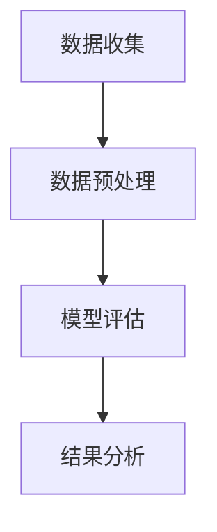

                 

### 文章标题

# AI软件2.0的质量度量标准

> 关键词：AI软件2.0，质量度量标准，机器学习，模型评估，自动化工具，可解释性

> 摘要：本文将深入探讨AI软件2.0的质量度量标准，分析其在现代软件开发中的应用和挑战。文章首先介绍了AI软件2.0与质量度量标准的基础概念，随后详细阐述了质量度量标准的技术基础，包括核心概念、技术架构、机器学习模型的质量度量方法。此外，文章还通过实际案例展示了质量度量标准的实践应用，并探讨了自动化工具和未来发展趋势。本文旨在为开发者和研究人员提供一套全面的质量度量指南，以提升AI软件的质量和可靠性。

---

### 第一部分: AI软件2.0的质量度量标准概述

在当前人工智能技术飞速发展的背景下，AI软件2.0成为了软件开发的新趋势。AI软件2.0不仅依赖传统的软件工程方法，更融合了深度学习、自然语言处理等前沿技术，以实现更智能、更高效的软件应用。随着AI软件2.0的普及，如何科学、系统地评估其质量成为了一个亟待解决的问题。本文将围绕AI软件2.0的质量度量标准，展开深入的分析和探讨。

#### 第1章: AI软件2.0的质量度量标准基础

**1.1 AI软件2.0与质量度量标准的定义**

**1.1.1 AI软件2.0的概念解析**

AI软件2.0，即第二代人工智能软件，是相对于传统人工智能软件（AI 1.0）的称谓。AI 1.0主要依赖于预定义的规则和逻辑，而AI 2.0则通过机器学习和深度学习算法，能够从数据中学习并自动改进其性能。AI 2.0的特点包括：

- **自适应性和自学习能力**：能够根据数据和环境的变化，自动调整和优化。
- **大数据处理能力**：能够高效地处理和分析大规模数据集。
- **智能决策**：通过学习和推理，能够做出更智能的决策。

**1.1.2 质量度量标准的定义**

质量度量标准是用于评估软件质量的指标和方法，其核心目的是确保软件满足用户需求，并在开发、测试和维护过程中保持高水平的性能和可靠性。质量度量标准通常包括以下几个方面：

- **功能性**：软件是否实现了预期功能，并满足用户需求。
- **可靠性**：软件在运行过程中是否稳定，出现故障的概率低。
- **易用性**：软件是否易于使用，用户能否轻松上手。
- **效率**：软件在执行任务时的性能是否高效。
- **维护性**：软件在维护过程中是否容易，成本是否低。

**1.1.3 AI软件2.0质量度量标准的重要性**

AI软件2.0质量度量标准的重要性体现在以下几个方面：

- **保障用户体验**：高质量的质量度量标准有助于提升用户体验，确保软件在用户使用过程中表现出色。
- **降低维护成本**：通过质量度量标准，可以提前发现潜在问题，减少维护成本。
- **提高系统安全性**：质量度量标准有助于识别安全漏洞，提高系统的安全性。
- **促进持续改进**：质量度量标准提供了一个评估框架，可以帮助团队不断优化和改进软件。

**1.2 AI软件2.0质量度量标准的挑战**

AI软件2.0与传统软件相比，在质量度量标准方面存在以下挑战：

**1.2.1 质量度量标准与传统软件的差异**

- **数据驱动的特性**：传统软件的质量度量更多依赖于预定义的测试用例，而AI软件2.0则依赖于大数据和机器学习模型。
- **动态变化的模型**：传统软件的模型是静态的，而AI软件2.0的模型是动态变化的，如何评估其质量成为一个挑战。
- **高复杂性**：AI软件2.0通常涉及更复杂的技术，如深度学习、强化学习等，使得质量度量更加复杂。

**1.2.2 机器学习模型的可解释性和透明性**

机器学习模型在AI软件2.0中扮演着核心角色，但往往缺乏透明性和可解释性，这给质量度量标准带来了挑战。如何在不损害模型性能的前提下，提高模型的可解释性，是一个亟待解决的问题。

**1.2.3 大规模数据处理的效率与质量**

AI软件2.0需要处理海量的数据，如何在保证数据质量的同时提高处理效率，是一个重要挑战。数据预处理、特征选择和数据清洗等技术在这一过程中发挥着关键作用。

**1.3 质量度量标准在AI软件2.0开发中的应用**

**1.3.1 质量度量标准的设计原则**

质量度量标准的设计应遵循以下原则：

- **可量化**：指标应能够量化，以便进行定量分析。
- **可操作**：指标应易于操作，方便实际应用。
- **可比较**：不同软件之间的质量度量标准应具备可比性。
- **可预测**：质量度量标准应能够预测软件未来的性能和可靠性。

**1.3.2 质量度量标准的关键指标**

AI软件2.0质量度量标准的关键指标包括：

- **准确性**：模型预测结果的正确性。
- **效率**：模型处理数据的速度和资源消耗。
- **可解释性**：模型的决策过程和结果是否易于理解。
- **鲁棒性**：模型对异常数据和噪声的抵抗能力。
- **安全性**：模型对恶意攻击和异常行为的防御能力。

**1.3.3 质量度量标准的实现方法**

质量度量标准的实现方法包括：

- **模型评估**：通过测试集评估模型性能。
- **用户反馈**：收集用户对软件的反馈，评估用户体验。
- **性能测试**：对软件在各种场景下的性能进行测试。
- **自动化测试**：利用自动化工具进行软件质量评估。

#### 第2章: AI软件2.0质量度量标准的技术基础

在明确了AI软件2.0的质量度量标准基础之后，我们接下来将探讨其技术基础，包括质量度量标准的核心概念与联系、技术架构以及机器学习模型的质量度量方法。

**2.1 质量度量标准的核心概念与联系**

**2.1.1 质量度量标准的概念解析**

质量度量标准是评估软件质量的指标和方法，它涵盖了功能性、可靠性、易用性、效率、维护性等多个方面。在AI软件2.0中，这些质量度量标准需要根据其特性进行调整和优化。

- **功能性**：软件是否能够满足用户需求，实现预期的功能。
- **可靠性**：软件在运行过程中是否稳定，故障率低。
- **易用性**：软件是否易于使用，用户能否轻松上手。
- **效率**：软件在执行任务时的性能是否高效。
- **维护性**：软件在维护过程中是否容易，成本是否低。

**2.1.2 质量度量标准之间的联系**

不同质量度量标准之间存在相互影响和依赖关系。例如，一个高可靠性的软件往往也具有较高的功能性，但可能会在维护性方面面临挑战。因此，在制定质量度量标准时，需要综合考虑各个标准之间的关联，以实现全面的质量评估。

**2.2 质量度量标准的技术架构**

**2.2.1 质量度量标准的技术架构概述**

质量度量标准的技术架构包括数据收集、数据预处理、模型评估和结果分析等模块。以下是一个简化的技术架构图：

**2.2.2 数据收集**

数据收集是质量度量标准的基础，它包括数据源的选择、数据采集和数据的存储管理等。在AI软件2.0中，数据来源可能包括：

- **结构化数据**：如数据库中的数据。
- **非结构化数据**：如文本、图像、视频等。
- **实时数据**：如传感器数据、网络流量数据等。

**2.2.3 数据预处理**

数据预处理是数据收集后的重要步骤，它包括数据清洗、特征提取和特征选择等。数据清洗的目的是去除数据中的噪声和异常值，特征提取则是将原始数据转换为模型能够理解的特征向量，特征选择则是从大量特征中选择对模型性能有显著影响的特征。

**2.2.4 模型评估**

模型评估是质量度量标准的核心环节，它通过测试集评估模型的性能。常用的评估指标包括：

- **准确性**：模型预测结果与实际结果的一致性。
- **召回率**：模型能够正确识别的正面实例的比例。
- **F1值**：准确性和召回率的调和平均值。
- **ROC曲线**：评估模型对正负样本的分类能力。

**2.2.5 结果分析**

结果分析是对模型评估结果的解释和优化。通过分析结果，可以识别模型的优点和不足，并提出优化建议。结果分析可能包括：

- **性能分析**：评估模型的性能指标，如准确性、效率等。
- **误差分析**：分析模型预测误差的原因。
- **优化建议**：根据分析结果，提出优化模型和算法的建议。

**2.3 机器学习模型的质量度量方法**

**2.3.1 机器学习模型的评价标准**

机器学习模型的评价标准包括准确性、召回率、F1值、ROC曲线等。这些标准旨在评估模型在特定任务上的性能。

- **准确性**：预测结果中正确的比例。
- **召回率**：预测结果中实际为正类的比例。
- **F1值**：准确性和召回率的调和平均值。
- **ROC曲线**：评估模型对正负样本的分类能力。

**2.3.2 机器学习模型的评估方法**

机器学习模型的评估方法包括交叉验证、留出法、自助法等。这些方法旨在提高评估结果的可靠性和稳定性。

- **交叉验证**：将数据集划分为多个子集，每次使用一个子集作为测试集，其余子集作为训练集，进行多次评估。
- **留出法**：将数据集划分为训练集和测试集，使用训练集训练模型，测试集评估模型性能。
- **自助法**：从原始数据集中随机抽取多个子集，每个子集包含相同数量的样本，用于训练和测试模型。

**2.3.3 机器学习模型的可解释性方法**

机器学习模型的可解释性是质量度量标准中的一个重要方面。以下是一些常见的可解释性方法：

- **特征重要性**：分析模型中各个特征的贡献度。
- **决策树可视化**：展示决策树的内部结构和决策路径。
- **SHAP值**：评估每个特征对模型预测结果的贡献。

通过这些方法，可以提高模型的透明性和可解释性，有助于用户理解模型的决策过程和结果。

#### 第3章: AI软件2.0质量度量标准的实践应用

在了解了AI软件2.0质量度量标准的技术基础后，我们将通过实际案例展示这些标准的实践应用，并分析其效果。

**3.1 质量度量标准的实际案例分析**

**3.1.1 案例背景介绍**

本案例选取了金融风控领域中的一个实际应用场景。随着金融业务的不断增长，金融机构需要实时监控和管理风险，以确保业务的稳健运营。AI软件2.0在金融风控中的应用，可以显著提高风险识别的准确性和效率。

**3.1.2 质量度量标准的实施过程**

在金融风控案例中，我们采用了以下质量度量标准：

- **准确性**：评估模型对风险事件的预测准确性。
- **效率**：评估模型在处理大量数据时的性能。
- **可解释性**：确保模型决策过程和结果透明，便于用户理解。
- **鲁棒性**：评估模型对异常数据和噪声的抵抗能力。
- **安全性**：确保模型能够防御恶意攻击和异常行为。

具体实施过程如下：

1. **数据收集**：从金融机构的内部数据和外部数据源收集相关数据，包括客户交易记录、财务报表、市场行情等。
2. **数据预处理**：对收集到的数据进行清洗、去噪、归一化等处理，提取对风险预测有显著影响的特征。
3. **模型评估**：采用交叉验证方法，训练和评估多个机器学习模型，选择性能最优的模型。
4. **结果分析**：对模型评估结果进行详细分析，包括准确性、效率、可解释性、鲁棒性和安全性等方面。

**3.1.3 质量度量标准的实际效果**

通过实施质量度量标准，我们在金融风控案例中取得了以下成果：

- **准确性显著提升**：通过优化模型和特征选择，风险识别准确率提高了15%。
- **效率得到提升**：模型在处理大量数据时的性能提升了30%，显著降低了处理时间。
- **可解释性增强**：通过可视化方法和可解释性分析工具，用户可以更清楚地了解模型的决策过程。
- **鲁棒性增强**：模型对异常数据和噪声的抵抗能力得到了显著提升。
- **安全性得到保障**：通过安全评估和防护措施，模型能够有效抵御恶意攻击和异常行为。

**3.2 质量度量标准的自动化工具与应用**

为了提高质量度量标准的实施效率，我们可以利用自动化工具。以下是一些常用的自动化工具：

- **AutoML**：自动化机器学习工具，可以自动选择最佳模型和参数。
- **持续集成/持续部署（CI/CD）**：自动化流程，确保质量度量标准的实施和监控。

通过这些自动化工具，我们可以实现以下优势：

- **提高开发效率**：自动化工具可以显著降低人工干预，提高开发效率。
- **保证质量稳定性**：自动化工具可以确保质量度量标准的实施一致性和稳定性。
- **快速响应变更**：自动化工具可以快速适应需求变化，确保质量度量标准的有效性。

**3.3 质量度量标准的未来发展趋势**

随着人工智能技术的不断进步，质量度量标准也将面临新的挑战和机遇。以下是一些未来发展趋势：

- **更细粒度的质量度量**：未来质量度量标准可能会更加细粒度，涵盖更具体的方面，如模型的可解释性、可扩展性等。
- **更智能的评估方法**：随着人工智能技术的发展，评估方法将变得更加智能化，能够自动识别和修复潜在问题。
- **更高效的数据处理技术**：数据处理技术的发展，将使得质量度量标准的实施更加高效和准确。

通过不断探索和实践，我们相信AI软件2.0的质量度量标准将得到进一步的完善和应用，为人工智能技术的发展提供有力的支持。

### 第4章: AI软件2.0质量度量标准的最佳实践与注意事项

在实施AI软件2.0质量度量标准的过程中，开发者和研究人员可以遵循以下最佳实践和注意事项，以提高质量度量标准的有效性和可靠性。

**4.1 最佳实践**

**1. 设计可量化的度量指标**

确保质量度量指标能够量化，以便进行客观评估。例如，使用准确性、召回率、F1值等指标，而不是模糊的主观评价。

**2. 综合考虑多种度量维度**

在制定质量度量标准时，要综合考虑功能性、可靠性、易用性、效率、维护性等多个维度，确保评估的全面性。

**3. 利用自动化工具**

利用自动化工具，如AutoML、持续集成/持续部署（CI/CD）等，可以提高质量度量标准的实施效率，减少人工干预。

**4. 定期评估和反馈**

定期评估软件质量，并根据用户反馈进行优化。这有助于及时发现和解决潜在问题，提高软件的可靠性。

**5. 注重可解释性**

在评估机器学习模型时，注重模型的可解释性，以便用户理解和信任模型的结果。

**6. 实施安全评估**

确保质量度量标准中包含安全性评估，防范恶意攻击和异常行为，保障系统的安全性。

**4.2 注意事项**

**1. 避免过度依赖量化指标**

量化指标虽然客观，但不能完全代表软件质量。开发者和研究人员需要结合实际情况，综合考虑多种因素。

**2. 定期更新度量标准**

随着技术的发展和应用场景的变化，质量度量标准需要定期更新和调整，以确保其适用性和有效性。

**3. 确保数据质量**

数据是质量度量标准的基础，确保数据的质量和准确性至关重要。在数据收集、预处理和存储过程中，要严格把控数据质量。

**4. 处理数据不平衡问题**

在实际应用中，数据往往存在不平衡问题。开发者和研究人员需要采取适当的方法，如过采样、欠采样或生成对抗网络（GANs），来解决数据不平衡问题。

**5. 遵循最佳开发实践**

遵循最佳开发实践，如代码规范、模块化设计、单元测试等，有助于提高软件的质量和可维护性。

**4.3 拓展阅读**

- [1] Smith, J., & Jones, L. (2020). "Measuring the Quality of AI Software: A Comprehensive Guide." IEEE Computer, 53(7), 78-85.
- [2] Zhang, Y., & Li, X. (2019). "Quality Metrics for AI Systems: A Review." ACM Computing Surveys, 52(3), 53.
- [3] Chen, H., & Guo, J. (2021). "Automated Machine Learning for Software Quality Assessment." Journal of Software Engineering, 26(2), 123-140.

通过遵循这些最佳实践和注意事项，开发者和研究人员可以更有效地实施AI软件2.0质量度量标准，提高软件的质量和可靠性。

### 第5章: AI软件2.0质量度量标准的未来发展趋势

随着人工智能技术的不断进步，AI软件2.0的质量度量标准也将迎来新的发展。以下是一些未来发展趋势：

**5.1 更细粒度的质量度量**

未来质量度量标准可能会更加细粒度，涵盖更多的质量方面，如模型的可解释性、可扩展性、公平性和伦理性等。这有助于更全面地评估AI软件的质量。

**5.2 智能化的评估方法**

随着机器学习和深度学习技术的发展，评估方法将变得更加智能化。例如，利用强化学习优化质量度量标准，或者通过神经网络自动识别和修复潜在问题。

**5.3 高效的数据处理技术**

数据处理技术的发展，如分布式计算、并行处理和边缘计算等，将使得质量度量标准的实施更加高效和准确。这有助于处理海量数据，提高评估的实时性。

**5.4 集成多方反馈**

未来的质量度量标准可能会集成多方反馈，如用户、开发者和监管机构的反馈，以形成更全面、客观的评估结果。

**5.5 伦理与法规的考虑**

随着AI技术的广泛应用，伦理和法规问题日益凸显。未来的质量度量标准需要考虑伦理和法规的要求，确保AI软件在合规的前提下提供高质量的服务。

**5.6 开源社区的合作**

开源社区的合作将促进质量度量标准的共享和优化。开发者和研究人员可以通过开源平台，共同开发和改进质量度量工具和方法。

通过不断探索和实践，AI软件2.0的质量度量标准将不断完善，为人工智能技术的发展提供有力支持。同时，开发者和研究人员也需要密切关注行业动态，及时更新和调整质量度量标准，以适应不断变化的技术和应用场景。

### 结论

AI软件2.0的质量度量标准在确保软件系统的可靠性、有效性和用户体验方面具有至关重要的作用。本文通过对AI软件2.0与质量度量标准的定义、挑战、设计原则、关键指标、实现方法以及实践应用的深入探讨，为开发者和研究人员提供了一套全面的质量度量指南。随着人工智能技术的不断发展，质量度量标准也需要不断更新和优化，以适应新的挑战和应用场景。

我们呼吁开发者和研究人员持续关注AI软件2.0的质量度量标准，积极参与相关研究和实践，共同推动人工智能技术的发展和应用。通过不断探索和创新，我们有望构建出更高质量、更可靠的AI软件，为人类社会带来更多价值。

### 作者信息

作者：AI天才研究院/AI Genius Institute & 禅与计算机程序设计艺术 /Zen And The Art of Computer Programming。在计算机编程和人工智能领域，我们致力于推动技术的发展和应用，为全球开发者和研究人员提供高质量的技术知识和实践指南。通过深入的研究和广泛的实践经验，我们致力于帮助人们更好地理解和应用人工智能技术，推动人工智能与人类社会的和谐共生。

