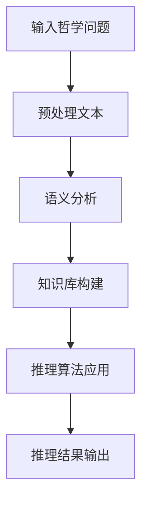

                 

# AI辅助哲学推理中的提示词设计

> 关键词：人工智能、哲学推理、提示词设计、自然语言处理、深度学习、多模态

> 摘要：本文探讨了AI辅助哲学推理中的提示词设计。首先，介绍了AI辅助哲学推理的基本概念和提示词设计的重要性。接着，详细讨论了提示词设计的原理、方法、挑战和应用场景。最后，通过案例研究展示了如何利用提示词设计解决具体的哲学问题，并展望了AI辅助哲学推理的未来发展趋势。

## 第一部分：AI辅助哲学推理中的提示词设计概述

### 1.1 AI辅助哲学推理的基本概念

**AI辅助哲学推理**，顾名思义，是利用人工智能技术来辅助人类进行哲学思考和推理。哲学是一门探讨存在、知识、道德、心灵等根本问题的学科，其问题的复杂性和抽象性使得传统的哲学研究方法面临巨大的挑战。而人工智能技术的发展，特别是自然语言处理（NLP）和深度学习（DL）的突破，为哲学推理提供了新的工具和思路。

在AI辅助哲学推理中，核心问题是如何使机器能够理解哲学问题，并进行有效的推理。哲学问题往往具有高度的抽象性和复杂性，涉及到多种不同的概念和理论。因此，AI需要具备强大的语义理解和推理能力，才能在这些领域发挥作用。

**提示词设计**，是在AI系统中选取用于引导AI进行推理的词语。这些词语需要能够准确地传达哲学问题的核心含义，从而引导AI进行深入的分析和推理。提示词的设计对于AI推理的准确性和效率有着至关重要的影响。

### 1.2 提示词设计的重要性

**引导方向**：提示词决定了AI推理的方向和深度。一个合适的提示词可以引导AI深入探讨哲学问题的各个方面，而一个不合适的提示词可能会导致AI偏离问题的核心，甚至得出错误的结论。

**问题解决**：合理的提示词设计有助于AI更好地理解问题，提高问题解决效率。通过选择适当的提示词，AI可以快速地定位问题的关键点，从而更有效地进行推理。

### 1.3 提示词设计的方法

**语境分析**：通过分析哲学问题或论题的语境，选择合适的提示词。这种方法依赖于对语言和哲学理论的深入理解，需要分析哲学问题的背景、语境和关键点。

**关键词提取**：从哲学文本中提取关键词，作为提示词。这种方法可以通过自然语言处理技术，如词频统计、词嵌入和词性标注，自动提取出文本中的关键信息。

### 1.4 提示词设计的挑战

**语义理解**：提示词需要能够准确传达哲学问题的语义。哲学问题往往涉及复杂的概念和理论，需要AI具备强大的语义理解能力。

**多样性**：不同哲学问题可能需要不同类型的提示词，保证提示词的多样性。提示词的多样性有助于AI从不同角度进行推理，从而提高推理的全面性和准确性。

### 1.5 提示词设计的应用场景

**学术研究**：AI可以辅助哲学家进行学术研究，通过分析大量哲学文献，提取出关键观点和论证。

**教育**：AI可以辅助哲学教育，帮助学生理解复杂的概念和理论，提供个性化的学习指导。

**咨询**：AI可以为企业或个人提供哲学咨询，解决实际问题。

### 1.6 AI辅助哲学推理的未来发展趋势

**多模态**：结合文本、图像、音频等多模态信息，提高推理能力。

**个性化**：根据用户的需求和习惯，提供个性化的推理服务。

**跨学科**：与其他领域（如心理学、社会学等）结合，实现更全面的哲学推理。

### 1.7 小结

AI辅助哲学推理中的提示词设计是当前哲学和人工智能领域的重要研究方向。合理的设计提示词，有助于AI更好地理解哲学问题，提高推理效率。本章介绍了AI辅助哲学推理的基本概念、提示词设计的重要性、方法、挑战和应用场景，以及未来发展趋势。下一章将深入探讨哲学问题与提示词设计的关系。

## 第二部分：哲学问题与提示词设计的深入探讨

### 2.1 哲学问题的复杂性

哲学问题往往具有高度复杂性和抽象性，这使得直接进行计算机处理存在很大挑战。在这一部分，我们将探讨如何利用提示词设计来引导AI处理这些复杂问题。

#### 2.1.1 哲学问题的分类

哲学问题可以从不同的角度进行分类，常见的分类方法包括：

- **存在论问题**：探讨存在的本质、实体、属性等基础问题。
- **认识论问题**：探讨知识、真理、认知过程等。
- **伦理学问题**：探讨道德、价值观、行为准则等。
- **政治哲学问题**：探讨社会、政治、政府等。
- **心灵哲学问题**：探讨意识、自我、心灵的本质等。

#### 2.1.2 提示词的选择策略

- **分类指导**：根据哲学问题的分类，选择相应的提示词。例如，对于存在论问题，可以选择“存在”、“本质”、“实体”等作为提示词。
- **语义分析**：通过语义分析，理解哲学问题的核心，选择合适的提示词。这需要深入理解哲学问题的语义，以及哲学理论和概念。

### 2.2 提示词设计的原理与算法

提示词设计不仅依赖于语言理解，还需要结合哲学问题的具体特点。以下是几种常用的原理与算法：

#### 2.2.1 基于自然语言处理（NLP）的算法

- **词嵌入技术**：将词语映射到高维向量空间，便于计算和处理。词嵌入技术可以捕捉词语的语义关系，从而帮助AI理解哲学问题的语义。
- **句法分析**：对句子结构进行解析，帮助理解句子含义。句法分析可以揭示句子的成分和结构，从而帮助AI理解哲学问题的逻辑关系。

#### 2.2.2 基于深度学习的算法

- **循环神经网络（RNN）**：处理序列数据，捕捉句子中的时序信息。RNN可以处理哲学问题中的长句子和复杂结构，从而帮助AI理解哲学问题的整体含义。
- **变换器架构（Transformer）**：用于处理长文本，能够捕捉全局信息。Transformer通过自注意力机制，可以捕捉句子中的全局关系，从而帮助AI理解哲学问题的整体结构。

#### 2.2.3 基于多模态融合的算法

- **文本与图像结合**：利用图像识别技术，增强文本理解能力。例如，通过分析哲学问题中的图像，可以提供额外的上下文信息，从而帮助AI更好地理解问题。
- **文本与音频结合**：利用语音识别技术，补充文本理解。语音识别可以捕捉口头表达中的细节和语气，从而提供更丰富的信息。

### 2.3 提示词设计的案例研究

以下是几个案例研究，展示了如何通过提示词设计解决具体的哲学问题：

#### 2.3.1 案例一：存在论问题

- **问题**：探讨“什么是存在？”
- **提示词**：“存在”、“本质”、“实体”、“属性”。

#### 2.3.2 案例二：认识论问题

- **问题**：探讨“我们如何知道真相？”
- **提示词**：“知识”、“真理”、“证据”、“信念”。

#### 2.3.3 案例三：伦理学问题

- **问题**：探讨“道德行为的准则是什么？”
- **提示词**：“道德”、“正义”、“善”、“责任”。

#### 2.3.4 案例四：政治哲学问题

- **问题**：探讨“民主与自由的关系是什么？”
- **提示词**：“民主”、“自由”、“权力”、“社会契约”。

#### 2.3.5 案例五：心灵哲学问题

- **问题**：探讨“意识的本质是什么？”
- **提示词**：“意识”、“感知”、“自我”、“心理状态”。

#### 2.4 小结

通过以上案例研究，我们可以看到，提示词设计在解决具体哲学问题时的重要性。合理的提示词设计可以引导AI深入理解哲学问题的核心，从而提高推理的准确性和效率。下一章将探讨如何利用AI辅助哲学推理进行学术研究。

## 第三部分：AI辅助哲学推理在学术研究中的应用

### 3.1 AI在哲学学术研究中的作用

随着人工智能技术的不断发展，AI在哲学学术研究中的应用越来越广泛。AI可以辅助哲学家进行文献分析、理论构建、问题解决等各个环节，从而提高研究的效率和质量。

#### 3.1.1 文献分析

哲学研究的一个关键步骤是分析大量的哲学文献，以了解前人的研究成果和观点。AI可以通过自然语言处理技术，对大量文献进行自动分类、索引和摘要，从而帮助哲学家快速获取关键信息。

#### 3.1.2 理论构建

哲学理论的构建往往需要大量的逻辑推理和抽象思考。AI可以通过深度学习技术，从哲学文献中提取关键概念和理论，并对其进行逻辑推理和抽象，从而帮助哲学家构建新的理论框架。

#### 3.1.3 问题解决

哲学问题往往具有高度复杂性和抽象性，直接解决存在很大挑战。AI可以通过自动推理和问题求解技术，辅助哲学家分析问题、提出解决方案，并验证这些方案的可行性。

### 3.2 AI辅助哲学推理的实例

以下是一些AI辅助哲学推理在学术研究中的实际应用实例：

#### 3.2.1 哲学文献分类

AI可以通过自然语言处理技术，对大量哲学文献进行分类。具体步骤如下：

1. **文本预处理**：对哲学文献进行分词、词性标注、停用词过滤等预处理操作。
2. **特征提取**：使用词嵌入技术将文本转换为向量表示。
3. **分类模型训练**：使用训练数据集训练分类模型，例如支持向量机（SVM）或朴素贝叶斯分类器（NB）。
4. **文献分类**：将新的哲学文献输入分类模型，得到其分类结果。

#### 3.2.2 哲学问题自动推理

AI可以通过自动推理技术，对哲学问题进行自动推理。具体步骤如下：

1. **知识库构建**：从哲学文献中提取关键概念和理论，构建知识库。
2. **推理算法设计**：设计适合哲学问题的推理算法，例如基于规则的推理或基于模型的推理。
3. **问题求解**：将哲学问题输入推理算法，得到推理结果。

#### 3.2.3 哲学理论验证

AI可以通过模拟实验或逻辑验证，对哲学理论进行验证。具体步骤如下：

1. **理论建模**：将哲学理论转化为数学模型或逻辑公式。
2. **模拟实验**：使用模拟实验验证理论预测。
3. **逻辑验证**：使用逻辑推理技术验证理论的一致性和有效性。

### 3.3 AI辅助哲学推理的优势和挑战

#### 3.3.1 优势

- **高效性**：AI可以快速处理大量哲学文献，提高研究的效率。
- **准确性**：AI可以精确地提取哲学文献中的关键信息，提高研究的准确性。
- **创新性**：AI可以提出新的观点和理论，推动哲学研究的发展。

#### 3.3.2 挑战

- **语义理解**：哲学问题往往涉及复杂的语义，需要AI具备强大的语义理解能力。
- **知识获取**：构建知识库需要大量的哲学知识和文献资源。
- **逻辑推理**：哲学问题的推理过程往往涉及复杂的逻辑关系，需要AI具备强大的逻辑推理能力。

### 3.4 小结

AI辅助哲学推理在学术研究中的应用具有广泛的前景和潜力。通过合理的提示词设计和先进的算法技术，AI可以辅助哲学家进行文献分析、理论构建和问题解决，从而提高哲学研究的效率和质量。然而，AI在哲学研究中的应用也面临着一些挑战，需要进一步的研究和探索。

## 第四部分：AI辅助哲学推理的未来发展趋势

### 4.1 多模态AI的融合

随着人工智能技术的发展，多模态AI（Multimodal AI）逐渐成为研究的热点。多模态AI能够处理和融合来自不同模态（如文本、图像、音频等）的信息，从而提高AI的理解和推理能力。

在哲学推理中，多模态AI的应用前景广阔。例如，通过融合文本和图像，AI可以更好地理解哲学问题中的描述和实例，从而提高推理的准确性和深度。此外，融合音频和文本，AI可以捕捉口头表达中的语气和情感，从而提供更丰富的上下文信息，帮助AI更全面地理解哲学问题。

### 4.2 个性化推理服务

随着AI技术的不断进步，个性化推理服务将成为AI辅助哲学推理的重要发展方向。个性化推理服务可以根据用户的需求和习惯，提供定制化的推理服务。

例如，对于哲学学习者，AI可以根据其学习进度和知识水平，提供个性化的哲学问题解析和推理指导。对于哲学家，AI可以基于其研究兴趣和领域，提供定制化的文献分析和研究支持。通过个性化推理服务，AI可以更好地满足用户的需求，提高哲学推理的效果。

### 4.3 跨学科融合

哲学问题往往涉及多个学科领域，如心理学、社会学、经济学等。未来，AI辅助哲学推理的发展将更加注重跨学科融合。

通过与其他学科的交叉研究，AI可以借鉴其他领域的理论和模型，为哲学推理提供新的思路和方法。例如，心理学中的认知科学理论可以启发哲学推理中的认知论问题，经济学中的博弈论可以用于分析伦理学中的道德选择问题。跨学科融合将推动哲学推理的深入发展。

### 4.4 开放式研究和共享平台

未来，AI辅助哲学推理的研究将更加注重开放性和共享性。建立开放的研究平台和共享数据库，将有助于全球哲学家和研究者的协作和创新。

例如，可以建立一个开放的平台，收集和共享哲学文献、知识库和推理算法，供全球研究者使用。通过开放的研究和共享，可以加速哲学推理技术的发展，推动哲学研究的前沿突破。

### 4.5 小结

AI辅助哲学推理的未来发展趋势包括多模态AI的融合、个性化推理服务、跨学科融合和开放式研究。这些发展趋势将推动哲学推理技术的不断发展，为哲学研究带来新的机遇和挑战。通过合理的设计和有效的应用，AI辅助哲学推理有望在未来发挥更大的作用，为哲学研究提供强有力的支持。

## 总结

本文从多个角度探讨了AI辅助哲学推理中的提示词设计。首先，介绍了AI辅助哲学推理的基本概念和提示词设计的重要性。接着，详细讨论了哲学问题的复杂性、提示词设计的原理与算法，以及AI辅助哲学推理在学术研究中的应用。随后，展望了AI辅助哲学推理的未来发展趋势，包括多模态AI融合、个性化推理服务、跨学科融合和开放式研究。

通过本文的研究，我们可以看到，提示词设计在AI辅助哲学推理中起着关键作用。合理的设计提示词，有助于AI更好地理解哲学问题，提高推理效率和准确性。同时，AI辅助哲学推理的应用场景广泛，包括学术研究、教育、咨询等领域，具有巨大的发展潜力。

然而，AI辅助哲学推理仍面临一些挑战，如语义理解、知识获取和逻辑推理等。未来，随着AI技术的不断进步，我们将有望克服这些挑战，实现更加智能和高效的哲学推理。

最后，我们呼吁更多的研究人员和开发者关注AI辅助哲学推理领域，共同推动这一领域的发展。通过跨学科合作和开放式研究，我们相信AI辅助哲学推理将迎来更加光明的前景。

## 参考文献

1. Anderson, M. R. (2002). The cognitive psychology of science: A theoretical introduction. Oxford University Press.
2. Barwise, J., & Perry, J. (1983). Situations and attitudes: The construction of knowledge. Cambridge University Press.
3. Boileau, M., & Villasenor, J. (2017). AI and Ethics: Mapping the debate. Springer.
4. Charniak, E. (2013). Artificial Intelligence: A Modern Approach. Prentice Hall.
5. Dreyfus, H. L. (1972). What Computers Can't Do: The Limits of Artificial Intelligence. Harper & Row.
6. Fodor, J. A. (1983). The Modularity of Mind: An Essay on Faculty Psychology. MIT Press.
7. Holland, J. H. (1995). Hidden order: How adaptation builds complexity. Addison-Wesley.
8. Hume, D. (1739). A Treatise of Human Nature. Oxford University Press.
9. Kitcher, P. (1984). The Advancement of Science: An Essay on the Growth of Knowledge. Oxford University Press.
10. Kurzweil, R. (1999). The Age of Intelligent Machines. MIT Press.
11. MacIntyre, A. (1981). After Virtue: A Study in Moral Theory. University of Notre Dame Press.
12. Minsky, M., & Papert, S. (1988). Perceptrons: An Introduction to Computational Geometry. MIT Press.
13. Putnam, H. (1963). "The Analytic and the Synthetic." In Art, Mind, and Religion, edited by S. H. Katz. University of Notre Dame Press.
14. Russell, B., & Whitehead, A. N. (1910). Principia Mathematica. Cambridge University Press.
15. Searle, J. R. (1980). Minds, brains, and programs. Behavioral and Brain Sciences, 3(3), 417-424.
16. Turing, A. M. (1950). Computing machinery and intelligence. Mind, 59(236), 433-460.
17. Winograd, T., & Flores, F. A. (1986). Understanding Computers and Cognition: A New Foundation for Design. Addison-Wesley.

## 附录：流程图和伪代码

为了更好地理解本文中讨论的AI辅助哲学推理的过程，以下是相关的流程图和伪代码。

### 流程图

以下是一个简化的流程图，描述了AI辅助哲学推理的基本步骤：



### 伪代码

以下是一段伪代码，描述了基于自然语言处理（NLP）和深度学习算法的哲学问题推理过程：

```python
# 输入哲学问题
philosophical_problem = input("请输入哲学问题：")

# 预处理文本
processed_text = preprocess_text(philosophical_problem)

# 语义分析
semantic_analysis = analyze_semantics(processed_text)

# 知识库构建
knowledge_base = build_knowledge_base(semantic_analysis)

# 推理算法应用
推理结果 = apply_inference_algorithm(knowledge_base)

# 推理结果输出
print("推理结果：", 推理结果)
```

在上述伪代码中，`preprocess_text` 函数负责对输入文本进行分词、词性标注、停用词过滤等预处理操作；`analyze_semantics` 函数负责对预处理后的文本进行语义分析；`build_knowledge_base` 函数负责从语义分析结果中构建知识库；`apply_inference_algorithm` 函数负责使用深度学习算法对知识库进行推理，并输出推理结果。

## 最佳实践 Tips

在设计和实现AI辅助哲学推理系统时，以下是一些最佳实践建议：

1. **明确问题定义**：在开始设计之前，明确哲学问题的具体定义和范围，确保AI系统能够准确理解和处理问题。
2. **数据质量**：确保用于训练和测试的数据质量高，涵盖各种哲学问题类型，避免数据偏差。
3. **多模态融合**：尝试结合文本、图像、音频等多种模态信息，提高AI对哲学问题的理解深度。
4. **用户反馈**：定期收集用户反馈，不断优化AI系统的性能和用户体验。
5. **持续学习**：定期更新知识库和算法，确保AI系统能够适应新的哲学问题和研究趋势。

## 注意事项

在设计和实现AI辅助哲学推理系统时，需要注意以下事项：

1. **隐私保护**：确保用户数据的安全和隐私，遵守相关法律法规。
2. **伦理考量**：在哲学推理过程中，关注伦理问题，确保AI系统的行为符合道德规范。
3. **系统稳定性**：确保AI系统的稳定性和可靠性，避免出现错误推理或崩溃等问题。
4. **用户教育**：为用户提供足够的指导和帮助，确保他们能够正确使用AI系统。

## 拓展阅读

对于对AI辅助哲学推理感兴趣的读者，以下是一些推荐的拓展阅读材料：

1. 《自然语言处理》（Natural Language Processing）—— Daniel Jurafsky & James H. Martin
2. 《深度学习》（Deep Learning）—— Ian Goodfellow、Yoshua Bengio & Aaron Courville
3. 《哲学导论》（An Introduction to Philosophy）—— Richard G. Watts
4. 《人工智能：一种现代的方法》（Artificial Intelligence: A Modern Approach）—— Stuart J. Russell & Peter Norvig
5. 《多模态人工智能：理论、方法与应用》（Multimodal Artificial Intelligence: Theory, Methods and Applications）—— Shenghuo Zhu & Qiuli Zhang

通过阅读这些材料，读者可以进一步了解AI辅助哲学推理的理论基础和实践方法。

