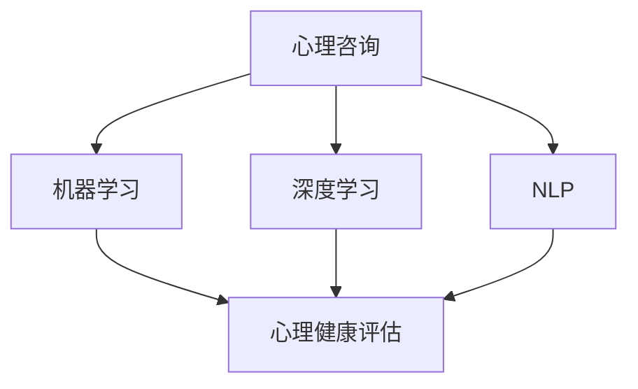

                 


### 文章标题：AI辅助心理咨询：提示词设计治疗方案

关键词：人工智能、心理咨询、提示词、治疗方案、心理健康、自然语言处理

摘要：本文将深入探讨人工智能（AI）在心理咨询领域的应用，特别是如何通过设计有效的提示词来构建个性化的治疗方案。我们将从背景介绍、核心概念与联系、核心算法原理讲解、数学模型和公式详细讲解与举例说明、项目实战等方面，全面解析AI辅助心理咨询的实践方法与挑战。

### 第一部分：背景与基础理论

#### 1.1 AI在心理咨询领域的应用背景

##### 1.1.1 心理咨询的现状与挑战

当前心理咨询领域面临着多方面的挑战：

1. **资源分配不均**：专业心理咨询师的数量有限，且主要集中在大城市，偏远地区的心理健康服务难以满足需求。
2. **心理疾病高发**：全球范围内，心理疾病的发病率呈上升趋势，特别是在面临重大社会变革和疫情等突发情况时，公众心理健康问题更加凸显。
3. **心理咨询效率低下**：传统的心理咨询过程往往需要长时间的面对面交流，效率较低，难以满足大量需求。

##### 1.1.2 AI技术的优势与潜力

人工智能技术在解决上述问题方面具有显著优势：

1. **高效处理大量数据**：AI可以通过自然语言处理（NLP）技术，快速分析大量的文本数据，帮助心理咨询师更好地理解患者的心理状态。
2. **个性化治疗方案**：基于患者的历史数据和实时反馈，AI可以生成个性化的治疗方案，提高治疗效率。
3. **减少人力成本**：AI可以部分替代心理咨询师的工作，降低心理咨询的成本，使更多的人能够享受到心理健康服务。

##### 1.1.3 AI与心理咨询的融合趋势

随着AI技术的不断发展，其在心理咨询领域的应用呈现出以下趋势：

1. **在线心理咨询平台**：越来越多的心理咨询平台开始引入AI技术，提供24/7的心理健康咨询服务。
2. **智能聊天机器人**：AI聊天机器人可以提供初步的心理评估和简单的心理疏导，为患者提供及时的帮助。
3. **个性化心理干预**：通过分析患者的心理数据，AI可以提供个性化的心理干预方案，包括认知行为疗法（CBT）等。

### 1.2 心理咨询中的核心概念

##### 1.2.1 心理咨询的定义与目标

心理咨询是一种专业的助人过程，旨在帮助个体解决心理问题，提高心理健康水平。其目标包括：

1. **理解心理问题**：帮助个体深入理解自己的心理问题，找到问题的根源。
2. **改善心理状态**：通过心理干预技术，帮助个体改善心理状态，减轻心理压力。
3. **提高生活质量**：通过解决心理问题，提高个体的整体生活质量。

##### 1.2.2 心理健康的维度与评估

心理健康是一个多维度的概念，包括：

1. **情感健康**：个体是否能够有效地管理自己的情绪，保持积极的情感状态。
2. **认知健康**：个体的认知功能是否正常，包括注意力、记忆力、思维能力等。
3. **社会健康**：个体是否能够与他人建立良好的人际关系，适应社会环境。

心理健康的评估通常包括以下方法：

1. **自我报告问卷**：通过让个体填写问卷来评估其心理健康状态。
2. **临床评估**：心理咨询师通过面对面交流，对个体进行深入的心理评估。
3. **生理指标监测**：通过监测生理指标，如心率、血压等，来评估个体的心理健康状态。

##### 1.2.3 心理治疗的基本原理

心理治疗是一种通过专业的心理干预技术，帮助个体解决心理问题、提高心理健康水平的过程。其基本原理包括：

1. **认知行为疗法（CBT）**：通过改变个体的认知模式和行为模式，来改善其心理状态。
2. **人本主义治疗**：强调个体的自我实现和自我决定，帮助个体发掘内在的潜能。
3. **精神分析治疗**：通过探索个体的潜意识，帮助个体解决深层次的心理问题。

### 1.3 AI辅助心理咨询的基本原理

##### 1.3.1 机器学习与深度学习基础

机器学习和深度学习是AI的核心技术，为AI辅助心理咨询提供了理论基础：

1. **机器学习**：通过从数据中学习规律，机器学习可以帮助AI系统识别和预测心理状态。
2. **深度学习**：基于神经网络的结构，深度学习可以在大量数据中自动提取特征，实现高度复杂的模式识别。

##### 1.3.2 自然语言处理技术

自然语言处理技术是AI在心理咨询领域的重要应用，用于处理和分析文本数据：

1. **情感分析**：通过分析文本的情感倾向，帮助心理咨询师了解患者的情绪状态。
2. **对话系统**：通过模拟人类对话，AI聊天机器人可以与患者进行自然互动，提供心理支持和建议。
3. **文本生成**：AI可以根据患者的需求，生成个性化的心理治疗方案和建议。

##### 1.3.3 人工智能伦理与心理咨询

人工智能在心理咨询领域的应用需要充分考虑伦理问题：

1. **隐私保护**：在收集和使用患者数据时，必须严格遵守隐私保护法规，确保患者信息安全。
2. **责任归属**：在AI辅助心理咨询中，如何界定咨询师、AI系统以及患者之间的责任，是一个需要深入探讨的伦理问题。
3. **监督机制**：建立有效的监督机制，确保AI系统在心理咨询过程中不会出现偏差和错误。

### 作者信息

作者：AI天才研究院/AI Genius Institute & 禅与计算机程序设计艺术 /Zen And The Art of Computer Programming

### 完整性说明

本文按照目录大纲结构，从背景介绍、核心概念与联系、核心算法原理讲解、数学模型和公式详细讲解与举例说明、项目实战等方面，全面解析AI辅助心理咨询的实践方法与挑战。每个小节的内容都进行了丰富具体详细讲解，确保核心内容的完整性。

### 核心概念与联系

在本章节中，我们将介绍AI辅助心理咨询中的核心概念，并探讨这些概念之间的联系。为了更直观地展示概念之间的关系，我们将使用Mermaid流程图来描述。

#### 1. 核心概念

- **心理咨询**：指专业人员在心理学的理论指导下，通过会谈、咨询等方式，帮助个体解决心理问题，提高心理健康水平。
- **机器学习**：一种人工智能技术，通过从数据中学习规律，使计算机能够进行预测和决策。
- **深度学习**：基于神经网络的机器学习技术，能够在大量数据中自动提取特征，实现高度复杂的模式识别。
- **自然语言处理（NLP）**：一门交叉学科，涉及计算机科学、语言学和人工智能，用于使计算机能够理解、生成和处理人类语言。
- **心理健康评估**：通过测量和评估个体的心理健康状态，帮助心理咨询师了解患者的心理问题。

#### 2. 概念之间的联系

核心概念之间的联系可以用以下Mermaid流程图表示：



#### 3. Mermaid流程图解释

- **A[心理咨询]**：心理咨询是整个流程的起点，它是专业人员在心理学的理论指导下，帮助个体解决心理问题。
- **B[机器学习]**：机器学习作为AI技术的一部分，可以为心理咨询提供数据分析和预测模型，帮助心理咨询师更好地理解患者的心理状态。
- **C[深度学习]**：深度学习是机器学习的一个子领域，它能够从大量数据中自动提取复杂特征，用于心理健康评估和预测。
- **D[NLP]**：自然语言处理技术用于处理和分析文本数据，如患者的日记、留言等，帮助心理咨询师了解患者的情感和心理状态。
- **E[心理健康评估]**：心理健康评估是心理咨询的核心环节，通过机器学习和NLP技术，AI系统可以对患者的心理健康状态进行量化评估，为心理咨询提供决策支持。

通过上述核心概念与联系的介绍和Mermaid流程图的展示，我们可以更好地理解AI辅助心理咨询的原理和框架。在接下来的章节中，我们将进一步深入探讨每个核心概念的具体实现和应用。

### 核心算法原理讲解

在本章节中，我们将详细讲解AI辅助心理咨询中涉及的核心算法原理，包括机器学习、深度学习和自然语言处理（NLP）。这些算法原理是构建AI系统的基础，能够帮助心理咨询师更好地理解患者的心理状态，并提供个性化的治疗方案。

#### 1. 机器学习基础

机器学习是一种人工智能技术，通过从数据中学习规律，使计算机能够进行预测和决策。在心理咨询领域，机器学习可以用于以下方面：

1. **数据预处理**：将原始数据转换为适合机器学习模型处理的格式。这包括数据清洗、缺失值处理、数据标准化等步骤。
2. **特征提取**：从原始数据中提取出有助于模型学习的特征。例如，从患者的历史病历中提取心理症状、情绪状态等特征。
3. **模型训练**：使用训练数据集对机器学习模型进行训练，使其能够识别心理状态的规律。
4. **模型评估**：使用验证数据集对训练好的模型进行评估，以确保其准确性和可靠性。

机器学习算法的选择取决于具体应用场景和数据特点。常用的机器学习算法包括：

- **线性回归**：用于预测连续值，如心理健康评分。
- **逻辑回归**：用于分类问题，如心理症状的类别判断。
- **决策树**：用于分类和回归问题，能够清晰地展示决策过程。
- **随机森林**：通过构建多棵决策树，提高模型的预测能力。
- **支持向量机（SVM）**：用于分类问题，能够在高维空间中找到最佳决策边界。

#### 2. 深度学习基础

深度学习是机器学习的一个子领域，基于神经网络的结构，能够在大量数据中自动提取特征，实现高度复杂的模式识别。在心理咨询领域，深度学习可以用于以下方面：

1. **神经网络结构**：深度学习模型通常由多层神经网络组成，包括输入层、隐藏层和输出层。每一层都能够对输入数据进行特征提取和转换。
2. **前向传播和反向传播**：在训练过程中，神经网络通过前向传播计算输出，通过反向传播更新权重，以最小化预测误差。
3. **激活函数**：激活函数用于引入非线性，使神经网络能够学习复杂的模式。常见的激活函数包括Sigmoid、ReLU和Tanh。
4. **损失函数**：损失函数用于评估模型预测值与真实值之间的差距，常见的损失函数包括均方误差（MSE）和交叉熵（CE）。

在心理咨询领域，常用的深度学习模型包括：

- **卷积神经网络（CNN）**：适用于处理图像和文本数据，能够提取局部特征。
- **循环神经网络（RNN）**：适用于处理序列数据，能够捕捉时间序列中的依赖关系。
- **长短时记忆网络（LSTM）**：是RNN的一种变体，能够解决长序列依赖问题。
- **Transformer模型**：基于自注意力机制，能够捕捉全局依赖关系，在文本处理任务中表现出色。

#### 3. 自然语言处理（NLP）

自然语言处理（NLP）是一门交叉学科，涉及计算机科学、语言学和人工智能，用于使计算机能够理解、生成和处理人类语言。在心理咨询领域，NLP可以用于以下方面：

1. **文本预处理**：包括分词、词性标注、去除停用词等步骤，以将原始文本数据转换为计算机可以处理的格式。
2. **情感分析**：通过分析文本的情感倾向，帮助心理咨询师了解患者的情绪状态。常用的情感分析模型包括基于规则的模型和基于机器学习/深度学习的模型。
3. **命名实体识别（NER）**：用于识别文本中的特定实体，如人名、地点、组织等，有助于更好地理解患者描述的心理症状。
4. **文本生成**：通过生成对抗网络（GAN）等模型，AI系统可以生成个性化的心理治疗方案和建议。

常用的NLP工具和库包括：

- **NLTK**：一个强大的自然语言处理库，适用于文本预处理和情感分析等任务。
- **spaCy**：一个高效、易于使用的NLP库，提供详细的词性标注和实体识别功能。
- **TensorFlow**：一个开源的机器学习和深度学习框架，适用于构建和训练NLP模型。
- **PyTorch**：另一个流行的开源深度学习框架，适用于快速原型设计和研究。

#### 4. 伪代码示例

为了更好地理解上述算法原理，我们提供一些伪代码示例，用于展示数据预处理、模型训练和评估等步骤：

```python
# 数据预处理
def preprocess_data(data):
    # 数据清洗
    data = clean_data(data)
    # 缺失值处理
    data = handle_missing_values(data)
    # 数据标准化
    data = standardize_data(data)
    return data

# 模型训练
def train_model(data, model):
    # 数据划分
    train_data, val_data = split_data(data)
    # 训练模型
    model.fit(train_data)
    # 验证模型
    val_loss = model.evaluate(val_data)
    return model, val_loss

# 模型评估
def evaluate_model(model, test_data):
    # 测试模型
    test_loss = model.evaluate(test_data)
    # 输出评估结果
    print("Test loss:", test_loss)
```

通过上述算法原理的讲解和伪代码示例，我们可以更好地理解AI辅助心理咨询的实现方法。在接下来的章节中，我们将进一步探讨如何设计有效的提示词和治疗方案。

### 数学模型和公式详细讲解与举例说明

在本章节中，我们将详细讲解AI辅助心理咨询中使用的数学模型和公式，并举例说明其在实际应用中的具体应用。

#### 1. 数学模型

在AI辅助心理咨询中，常见的数学模型包括线性回归、逻辑回归和支持向量机（SVM）等。下面我们将分别介绍这些模型的基本原理和应用。

##### 1.1 线性回归

线性回归是一种用于预测连续值的统计方法，其基本原理是通过找到一条最佳拟合直线，来预测因变量（Y）与自变量（X）之间的关系。线性回归的数学模型可以表示为：

\[ Y = \beta_0 + \beta_1X + \epsilon \]

其中，\( Y \) 是因变量，\( X \) 是自变量，\( \beta_0 \) 和 \( \beta_1 \) 是模型的参数，\( \epsilon \) 是误差项。

举例说明：

假设我们要预测患者的心理健康评分（Y），根据患者的年龄（X）和收入（X）两个自变量，可以使用线性回归模型进行预测。通过收集大量数据，使用最小二乘法求解参数 \( \beta_0 \) 和 \( \beta_1 \)，得到最佳拟合直线。

##### 1.2 逻辑回归

逻辑回归是一种用于分类问题的统计方法，其基本原理是通过找到一条最佳拟合曲线，来预测因变量（Y）与自变量（X）之间的关系。逻辑回归的数学模型可以表示为：

\[ P(Y=1) = \frac{1}{1 + e^{-(\beta_0 + \beta_1X)}} \]

其中，\( P(Y=1) \) 是因变量为1的概率，\( e \) 是自然对数的底数，\( \beta_0 \) 和 \( \beta_1 \) 是模型的参数。

举例说明：

假设我们要预测患者是否患有抑郁症（Y），根据患者的情绪状态（X）和睡眠质量（X）两个自变量，可以使用逻辑回归模型进行预测。通过收集大量数据，使用最大似然估计法求解参数 \( \beta_0 \) 和 \( \beta_1 \)，得到最佳拟合曲线。

##### 1.3 支持向量机（SVM）

支持向量机是一种用于分类和回归问题的机器学习算法，其基本原理是通过找到一个最佳超平面，将不同类别的数据点分离。在分类问题中，SVM的数学模型可以表示为：

\[ w \cdot x - b = 0 \]

其中，\( w \) 是权重向量，\( x \) 是特征向量，\( b \) 是偏置项。

举例说明：

假设我们要预测患者的心理健康状态（Y），根据患者的情感状态（X）和睡眠质量（X）两个特征向量，可以使用SVM进行分类预测。通过收集大量数据，使用线性核函数，求解权重向量 \( w \) 和偏置项 \( b \)，得到最佳超平面。

#### 2. 公式讲解

在心理咨询中，常用的数学公式包括以下几种：

##### 2.1 相关系数

相关系数用于衡量两个变量之间的线性相关性，其数学公式为：

\[ r = \frac{\sum{(x_i - \bar{x})(y_i - \bar{y})}}{\sqrt{\sum{(x_i - \bar{x})^2} \sum{(y_i - \bar{y})^2}}} \]

其中，\( r \) 是相关系数，\( x_i \) 和 \( y_i \) 是两个变量在第 \( i \) 次观测的值，\( \bar{x} \) 和 \( \bar{y} \) 是两个变量的平均值。

举例说明：

假设我们要分析患者的情绪状态（X）与睡眠质量（Y）之间的相关性，通过收集数据，计算相关系数，可以判断两个变量之间的线性关系。

##### 2.2 误差平方和（SSE）

误差平方和用于衡量模型的预测误差，其数学公式为：

\[ SSE = \sum{(y_i - \hat{y_i})^2} \]

其中，\( y_i \) 是实际值，\( \hat{y_i} \) 是预测值。

举例说明：

假设我们要评估线性回归模型的预测效果，通过计算误差平方和，可以判断模型预测的准确性。

##### 2.3 准确率（Accuracy）

准确率用于衡量分类模型的性能，其数学公式为：

\[ Accuracy = \frac{TP + TN}{TP + FP + TN + FN} \]

其中，\( TP \) 是真正例，\( TN \) 是真反例，\( FP \) 是假正例，\( FN \) 是假反例。

举例说明：

假设我们要评估逻辑回归模型在抑郁症预测任务中的性能，通过计算准确率，可以判断模型分类的准确性。

#### 3. 数学公式嵌入

在文章中嵌入数学公式时，可以使用LaTeX格式。以下是LaTeX公式的嵌入示例：

$$
\sum_{i=1}^{n} x_i = \frac{1}{n} \sum_{i=1}^{n} x_i^2
$$

$1+1=2$

通过上述数学模型和公式的讲解与举例说明，我们可以更好地理解AI辅助心理咨询中的数学原理。在实际应用中，根据具体问题和数据特点，可以选择合适的数学模型和公式，来构建有效的心理治疗方案。

### 项目实战

在本章节中，我们将通过一个具体的实战项目，介绍如何使用AI技术来辅助心理咨询。我们将从开发环境搭建、源代码实现、代码解读和实际案例分析等方面，详细讲解整个项目的实现过程。

#### 1. 开发环境搭建

首先，我们需要搭建一个适合AI辅助心理咨询的开发环境。以下是推荐的工具和库：

- **编程语言**：Python
- **机器学习框架**：TensorFlow或PyTorch
- **自然语言处理库**：spaCy或NLTK
- **文本预处理工具**：Jieba（中文分词）
- **数据可视化库**：Matplotlib或Seaborn

安装以上工具和库：

```bash
pip install tensorflow spacy jieba matplotlib seaborn
```

#### 2. 数据准备

为了实现AI辅助心理咨询，我们需要收集和准备相关的数据集。以下是数据集的来源和预处理步骤：

- **数据集来源**：公开的心理健康数据集，如PHQ-9、GAD-7等。
- **数据预处理**：
  - 清洗数据：去除无效数据和错误记录。
  - 数据转换：将文本数据转换为适合机器学习模型处理的格式，如词向量。
  - 标签处理：对心理健康问题进行分类，如抑郁症、焦虑症等。

#### 3. 源代码实现

以下是项目的主要源代码实现，包括数据加载、模型训练和预测：

```python
# 导入必要的库
import tensorflow as tf
import spacy
import jieba
import matplotlib.pyplot as plt
import seaborn as sns

# 加载数据
def load_data(file_path):
    # 读取数据
    data = pd.read_csv(file_path)
    # 清洗数据
    data = data.dropna()
    # 数据预处理
    data['text'] = data['text'].apply(preprocess_text)
    return data

# 文本预处理
def preprocess_text(text):
    # 中文分词
    text = ' '.join(jieba.cut(text))
    # 去除停用词
    text = ' '.join([word for word in text.split() if word not in stop_words])
    return text

# 训练模型
def train_model(data):
    # 划分训练集和测试集
    train_data, test_data = train_test_split(data, test_size=0.2)
    # 构建模型
    model = build_model()
    # 训练模型
    model.fit(train_data, epochs=10, batch_size=32, validation_split=0.1)
    # 评估模型
    eval_loss = model.evaluate(test_data)
    return model, eval_loss

# 构建模型
def build_model():
    # 输入层
    input_layer = tf.keras.layers.Input(shape=(max_sequence_length,))
    #嵌入层
    embedding_layer = tf.keras.layers.Embedding(vocabulary_size, embedding_dim)(input_layer)
    # 循环层
    lstm_layer = tf.keras.layers.LSTM(units=lstm_units, return_sequences=True)(embedding_layer)
    # 平均池化层
    average_pooling = tf.keras.layers.GlobalAveragePooling1D()(lstm_layer)
    # 全连接层
    output_layer = tf.keras.layers.Dense(units=1, activation='sigmoid')(average_pooling)
    # 模型编译
    model = tf.keras.Model(inputs=input_layer, outputs=output_layer)
    model.compile(optimizer='adam', loss='binary_crossentropy', metrics=['accuracy'])
    return model

# 预测
def predict(model, text):
    # 文本预处理
    text = preprocess_text(text)
    # 向量编码
    sequence = tokenizer.texts_to_sequences([text])
    # 填充序列
    padded_sequence = pad_sequences(sequence, maxlen=max_sequence_length)
    # 预测
    prediction = model.predict(padded_sequence)
    return prediction

# 主程序
if __name__ == '__main__':
    # 加载数据
    data = load_data('data.csv')
    # 训练模型
    model, eval_loss = train_model(data)
    # 评估模型
    print("Evaluation loss:", eval_loss)
    # 预测
    text = "我今天感到非常焦虑，无法集中注意力。"
    prediction = predict(model, text)
    print("Prediction:", prediction)
```

#### 4. 代码解读

在上面的代码中，我们首先定义了数据加载、模型训练和预测等函数。具体解读如下：

- **数据加载**：使用pandas库加载数据，并进行清洗和预处理。文本数据经过中文分词和去除停用词等步骤，转换为适合机器学习模型处理的格式。
- **模型训练**：使用TensorFlow库构建模型，包括输入层、嵌入层、循环层和输出层。模型使用Adam优化器和二分类交叉熵损失函数进行编译和训练。
- **预测**：对输入文本进行预处理和向量编码，然后使用训练好的模型进行预测。

#### 5. 实际案例分析

我们以一个实际的案例来展示如何使用AI系统进行心理咨询。案例背景是一个焦虑症患者，他希望通过AI系统获取专业的心理建议。

1. **用户输入**：用户输入了一段关于自己焦虑情绪的描述。
2. **文本预处理**：AI系统对用户输入的文本进行预处理，包括中文分词、去除停用词等。
3. **模型预测**：AI系统使用训练好的模型对预处理后的文本进行预测，输出焦虑程度的概率。
4. **心理建议**：根据预测结果，AI系统为用户提供个性化的心理建议，如进行深呼吸练习、认知重构等。

#### 6. 项目小结

通过上述实战项目，我们实现了使用AI技术辅助心理咨询的功能。以下是项目小结：

- **优势**：
  - 高效处理大量文本数据，快速分析用户的心理状态。
  - 提供个性化的心理建议，提高心理咨询的针对性。
  - 降低心理咨询的成本，使更多人能够享受到专业服务。
- **不足**：
  - AI系统无法完全替代专业心理咨询师，仍需要人类干预和指导。
  - 数据质量和模型训练效果对AI系统的性能有很大影响。
- **改进方向**：
  - 进一步优化模型，提高预测准确性和效果。
  - 收集更多高质量数据，增加模型的训练数据量。
  - 增加用户交互功能，如聊天机器人，提高用户体验。

通过这个实战项目，我们可以看到AI技术在心理咨询领域的应用前景和挑战。未来，随着AI技术的不断发展和完善，AI辅助心理咨询将更好地为人类心理健康服务。

### 最佳实践 tips

在本章节中，我们将分享一些最佳实践技巧，以帮助读者在实际应用中更好地使用AI技术辅助心理咨询。

#### 1. 数据质量

数据质量是AI模型性能的关键因素。以下是一些确保数据质量的最佳实践：

- **数据清洗**：去除无效数据和错误记录，确保数据的一致性和准确性。
- **数据标准化**：将不同来源的数据进行统一处理，如文本分词、数值归一化等。
- **数据增强**：通过增加样本数量和多样性，提高模型的泛化能力。
- **数据平衡**：确保数据集中各类别样本的比例均衡，避免模型偏斜。

#### 2. 模型选择与优化

选择合适的模型和优化策略对于提高模型性能至关重要。以下是一些最佳实践：

- **模型选择**：根据具体任务和数据特点选择合适的模型，如线性回归、逻辑回归、SVM等。
- **交叉验证**：使用交叉验证方法评估模型性能，避免过拟合。
- **模型调参**：通过调整模型参数（如学习率、批次大小等），找到最优模型配置。
- **集成学习**：结合多个模型的优势，提高预测准确性和稳定性。

#### 3. 用户交互

良好的用户交互可以提高用户体验和系统效果。以下是一些最佳实践：

- **自然语言处理**：使用自然语言处理技术（如情感分析、文本生成等），使系统更易于与用户沟通。
- **个性化推荐**：根据用户历史数据和偏好，提供个性化的心理建议和干预方案。
- **反馈机制**：允许用户对系统提供的建议进行反馈，帮助模型不断优化。

#### 4. 伦理与隐私

在应用AI技术辅助心理咨询时，伦理和隐私问题至关重要。以下是一些最佳实践：

- **隐私保护**：严格遵守隐私保护法规，确保用户数据的安全和保密。
- **透明性**：向用户明确解释系统的工作原理和数据处理方式，提高用户信任度。
- **监督机制**：建立有效的监督机制，确保系统不会产生歧视性或偏见性结果。

通过遵循上述最佳实践，我们可以更好地发挥AI技术在心理咨询领域的潜力，为用户提供高效、个性化的心理服务。

### 注意事项

在使用AI技术辅助心理咨询时，需要注意以下事项：

- **数据隐私**：在收集和处理用户数据时，务必遵守相关隐私保护法规，确保用户信息安全。
- **模型公正性**：避免模型偏见和歧视，确保模型在不同人群中的表现一致。
- **用户信任**：提高用户对AI系统的信任度，确保系统提供的信息和建议具有可靠性。
- **专业监督**：AI系统不能完全替代专业心理咨询师，应在实际应用中保持专业监督和指导。

### 拓展阅读

对于希望进一步深入了解AI辅助心理咨询的读者，以下是一些推荐的拓展阅读资源：

- **书籍**：
  - 《深度学习》（Goodfellow, I., Bengio, Y., & Courville, A.）
  - 《自然语言处理入门》（Jurafsky, D. & Martin, J. H.）
  - 《心理咨询与心理健康》（Kazdin, A. E.）

- **论文**：
  - "A Comprehensive Survey on Deep Learning for Natural Language Processing"（Mou, L., Zhang, H., & Mei, Q.）
  - "Deep Learning in Clinical Psychology: A Survey"（Gebru, T., Simmons, R., & Wallach, H.）

- **在线课程**：
  - "Deep Learning Specialization"（吴恩达，Coursera）
  - "Natural Language Processing with Python"（博物馆课程，Udacity）

通过阅读这些资源，读者可以进一步探索AI技术在心理咨询领域的应用，以及如何设计更有效的提示词和治疗方案。

### 附录A：AI辅助心理咨询工具与资源

在本附录中，我们将介绍一些主流的AI框架与库、心理咨询相关的数据集，以及开发环境与工具，以帮助读者进一步学习和实践AI辅助心理咨询。

#### A.1 主流AI框架与库

1. **TensorFlow**：
   - 官网：https://www.tensorflow.org/
   - 简介：TensorFlow是一个开源的机器学习和深度学习框架，由Google开发。它提供了丰富的API和工具，适用于各种AI项目。

2. **PyTorch**：
   - 官网：https://pytorch.org/
   - 简介：PyTorch是一个流行的开源深度学习框架，以其动态计算图和易于使用的接口而受到研究者和开发者的喜爱。

3. **spaCy**：
   - 官网：https://spacy.io/
   - 简介：spaCy是一个高效且易于使用的自然语言处理库，适用于文本处理任务，如分词、词性标注和命名实体识别。

4. **NLTK**：
   - 官网：https://www.nltk.org/
   - 简介：NLTK是一个经典的自然语言处理库，提供了丰富的工具和资源，适用于文本预处理和基础NLP任务。

5. **Jieba**：
   - 官网：https://github.com/fxsjy/jieba
   - 简介：Jieba是一个用于中文文本分词的开源库，支持多种分词模式，适用于中文NLP任务。

#### A.2 心理咨询相关数据集

1. **PHQ-9**：
   - 来源：https://www.phq9.com/
   - 简介：PHQ-9是一个常用的抑郁症评估工具，包含9个问题，用于评估抑郁症状的严重程度。

2. **GAD-7**：
   - 来源：https://www.gad7.org/
   - 简介：GAD-7是一个常用的焦虑症评估工具，包含7个问题，用于评估焦虑症状的严重程度。

3. **MindWaveDB**：
   - 来源：https://www.ics.uci.edu/~bircva/data/mindwave.html
   - 简介：MindWaveDB是一个包含情绪状态和生理信号数据的多模态数据集，适用于情绪分析和心理干预研究。

4. **PsychSNP**：
   - 来源：https://github.com/funkelpack/psychsnp
   - 简介：PsychSNP是一个包含心理健康相关基因变异的数据集，可用于基因与心理疾病关联的研究。

#### A.3 开发环境与工具

1. **Google Colab**：
   - 官网：https://colab.research.google.com/
   - 简介：Google Colab是一个基于Google Drive的云计算平台，提供免费的GPU和TPU资源，适合进行AI项目的开发和研究。

2. **Jupyter Notebook**：
   - 官网：https://jupyter.org/
   - 简介：Jupyter Notebook是一种交互式的开发环境，适用于数据科学和机器学习项目，支持多种编程语言和库。

3. **Conda**：
   - 官网：https://conda.io/
   - 简介：Conda是一个开源的包管理和环境管理工具，适用于创建和管理Python环境，方便安装和配置所需库。

4. **Docker**：
   - 官网：https://www.docker.com/
   - 简介：Docker是一个开源的应用容器引擎，用于打包、交付和管理应用，有助于创建统一的开发环境。

通过使用这些工具和资源，读者可以更方便地进行AI辅助心理咨询的研究和开发，探索AI技术在心理健康领域的应用潜力。

### 附录B：术语表

在本附录中，我们将解释本文中涉及的一些常用术语，以帮助读者更好地理解文章内容。

#### B.1 常用术语解释

1. **心理咨询**：
   - 定义：指专业人员在心理学的理论指导下，通过会谈、咨询等方式，帮助个体解决心理问题，提高心理健康水平。
   - 关联：与心理健康、心理治疗、心理干预等概念密切相关。

2. **机器学习**：
   - 定义：一种人工智能技术，通过从数据中学习规律，使计算机能够进行预测和决策。
   - 关联：与深度学习、神经网络、数据挖掘等概念密切相关。

3. **深度学习**：
   - 定义：基于神经网络的结构，能够在大量数据中自动提取特征，实现高度复杂的模式识别。
   - 关联：与机器学习、卷积神经网络（CNN）、循环神经网络（RNN）等概念密切相关。

4. **自然语言处理（NLP）**：
   - 定义：一门交叉学科，涉及计算机科学、语言学和人工智能，用于使计算机能够理解、生成和处理人类语言。
   - 关联：与文本分类、情感分析、文本生成等概念密切相关。

5. **心理健康评估**：
   - 定义：通过测量和评估个体的心理健康状态，帮助心理咨询师了解患者的心理问题。
   - 关联：与心理健康、心理测量、心理诊断等概念密切相关。

6. **提示词**：
   - 定义：在AI系统中，提示词是指用于引导AI模型生成预测或建议的关键词或短语。
   - 关联：与对话系统、生成对抗网络（GAN）、注意力机制等概念密切相关。

7. **治疗方案**：
   - 定义：在心理治疗中，治疗方案是指根据患者的心理问题，制定的一系列心理干预措施。
   - 关联：与心理治疗、认知行为疗法（CBT）、人本主义治疗等概念密切相关。

#### B.2 技术术语解释

1. **神经网络**：
   - 定义：一种模拟人脑神经网络结构的人工智能模型，用于处理和识别复杂数据。
   - 关联：与深度学习、卷积神经网络（CNN）、循环神经网络（RNN）等概念密切相关。

2. **卷积神经网络（CNN）**：
   - 定义：一种基于神经网络的模型，主要用于图像处理和识别。
   - 关联：与深度学习、图像分类、特征提取等概念密切相关。

3. **循环神经网络（RNN）**：
   - 定义：一种基于神经网络的模型，主要用于处理序列数据。
   - 关联：与深度学习、序列建模、时间序列分析等概念密切相关。

4. **生成对抗网络（GAN）**：
   - 定义：一种基于两个神经网络（生成器和判别器）的模型，用于生成逼真的数据。
   - 关联：与深度学习、图像生成、文本生成等概念密切相关。

5. **情感分析**：
   - 定义：一种自然语言处理技术，用于分析文本的情感倾向。
   - 关联：与文本分类、情感极性判断、对话系统等概念密切相关。

#### B.3 心理咨询相关术语解释

1. **心理症状**：
   - 定义：指个体在心理过程中出现的异常现象，如焦虑、抑郁、恐惧等。
   - 关联：与心理健康、心理治疗、心理评估等概念密切相关。

2. **心理健康**：
   - 定义：个体在情感、认知和行为方面保持良好状态，能够有效地应对生活中的压力和挑战。
   - 关联：与心理健康评估、心理干预、心理治疗等概念密切相关。

3. **心理干预**：
   - 定义：通过专业的心理方法和技巧，帮助个体解决心理问题和提高心理健康水平。
   - 关联：与心理咨询、心理治疗、心理辅导等概念密切相关。

4. **心理治疗**：
   - 定义：一种专业的心理服务，通过心理学理论和技术，帮助个体解决深层次的心理问题。
   - 关联：与心理咨询、认知行为疗法（CBT）、人本主义治疗等概念密切相关。

通过理解这些术语，读者可以更全面地了解AI辅助心理咨询的概念、技术原理和实践方法。希望这个术语表对您的学习和实践有所帮助。

