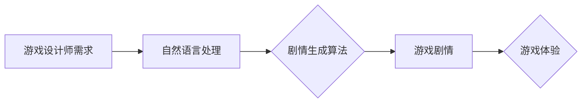
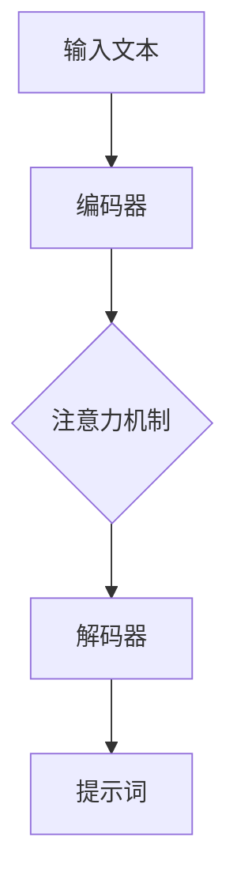

                 


### 文章标题：AI辅助游戏设计：提示词生成游戏剧情

关键词：AI游戏设计、提示词生成、自然语言处理、深度学习、游戏剧情

摘要：本文将深入探讨如何利用人工智能技术，特别是自然语言处理和深度学习，辅助游戏设计师生成引人入胜的游戏剧情。通过详细的算法原理讲解、实战案例分析以及代码实现，本文旨在为游戏设计师提供实用的AI辅助工具，提升游戏设计效率和质量。

---

### 第一部分：AI辅助游戏设计基础

#### 第1章：AI在游戏设计中的应用概述

**1.1 AI在游戏设计中的角色和重要性**

人工智能（AI）在游戏设计中扮演着至关重要的角色。它不仅能够提高游戏设计的效率，还能为玩家提供更加个性化和互动性的游戏体验。AI技术可以用于游戏剧情生成、角色行为模拟、游戏关卡设计等多个方面。

**1.2 AI辅助游戏设计的历史与发展**

AI辅助游戏设计的历史可以追溯到20世纪80年代。早期的游戏如《暗黑破坏神》和《文明》就已经开始采用简单的AI算法来模拟敌对角色的行为。随着计算力和算法的进步，现代游戏设计中的AI应用越来越广泛，从简单的行为树发展到复杂的深度学习模型。

**1.3 游戏设计中的AI应用领域**

在游戏设计中，AI的应用领域非常广泛。主要包括以下几个方面：

- **游戏剧情生成**：通过AI技术生成游戏剧情，可以为游戏设计师提供灵感和素材，减轻创作负担。
- **角色行为模拟**：AI可以模拟角色的行为，为玩家提供真实的交互体验。
- **游戏难度调节**：根据玩家的表现，AI可以自动调整游戏难度，确保游戏始终具有挑战性。
- **游戏关卡设计**：AI可以根据玩家的游戏习惯和偏好，自动设计出新颖有趣的关卡。

---

#### 第2章：核心概念与联系

**2.1 游戏剧情概述**

游戏剧情是游戏的核心元素之一，它不仅决定了游戏的主题和情节，还直接影响玩家的游戏体验。一个良好的游戏剧情应当具有以下特点：

- **连贯性**：剧情中的事件应当逻辑连贯，让玩家容易理解。
- **丰富性**：剧情应当丰富多样，包含多个阶段和层次，以提高游戏的趣味性。
- **互动性**：剧情应当与玩家的行为紧密关联，提供互动性选择，增强玩家的参与感。

**2.2 提示词生成算法**

提示词生成算法是AI在游戏剧情生成中的一项关键技术。它通过输入一系列关键词或上下文，生成相关的提示词，用于引导剧情的发展。提示词生成算法通常包括以下几个步骤：

1. **关键词提取**：从输入文本中提取出关键的信息和关键词。
2. **上下文分析**：分析关键词之间的关系，理解上下文含义。
3. **提示词生成**：根据上下文生成相关的提示词，用于构建剧情。

**2.3 AI辅助游戏设计的Mermaid流程图**

为了更好地理解AI辅助游戏设计的流程，我们可以使用Mermaid图来表示。以下是一个简单的Mermaid流程图：



在这个流程图中，游戏设计师的需求通过自然语言处理转化为剧情生成算法，最终生成游戏剧情，提升游戏体验。

---

### 第二部分：提示词生成游戏剧情算法原理

#### 第3章：自然语言处理技术基础

**3.1 词嵌入技术**

词嵌入技术是将自然语言文本中的单词映射为高维向量空间中的向量。这样做的目的是通过向量之间的距离和角度来表示单词的含义和关系。常见的词嵌入技术包括Word2Vec、GloVe等。

**3.2 序列模型**

序列模型是一种用于处理序列数据的机器学习模型，如RNN（循环神经网络）、LSTM（长短期记忆网络）和GRU（门控循环单元）。这些模型可以捕捉序列数据中的时间依赖关系，从而在提示词生成中发挥作用。

**3.3 注意力机制**

注意力机制是一种用于提高神经网络模型在处理序列数据时性能的技术。它通过为序列中的不同部分赋予不同的权重，从而提高模型的泛化能力和理解能力。在提示词生成中，注意力机制可以帮助模型更好地理解上下文，生成更相关的提示词。

---

#### 第4章：核心算法原理讲解

**4.1 提示词生成算法概述**

提示词生成算法是一种基于自然语言处理和深度学习的算法，用于生成与输入文本相关的提示词。它通常包括以下几个步骤：

1. **文本预处理**：对输入文本进行清洗、分词和标记等预处理操作，以便模型能够更好地理解文本。
2. **编码器解码器结构**：使用编码器将输入文本编码为固定长度的向量，解码器则根据编码器的输出生成提示词。
3. **注意力机制应用**：在解码器中使用注意力机制，为每个输入文本部分赋予不同的权重，提高提示词生成的准确性。

**4.2 生成模型与判别模型**

生成模型和判别模型是深度学习中的两种基本模型。生成模型旨在生成与输入数据相似的样本，而判别模型则旨在区分真实数据和生成数据。在提示词生成中，生成模型用于生成提示词，判别模型则用于评估生成的提示词与真实提示词的相似度。

**4.3 深度学习模型在提示词生成中的应用**

深度学习模型在提示词生成中具有广泛的应用。常见的深度学习模型包括RNN、LSTM、GRU、BERT等。这些模型可以捕捉输入文本中的时间依赖关系，生成与上下文相关的提示词。以下是一个简单的深度学习模型在提示词生成中的应用：



在这个流程中，编码器将输入文本编码为固定长度的向量，解码器则根据编码器的输出和注意力机制生成提示词。

**4.4 提示词生成算法伪代码**

以下是一个简单的提示词生成算法的伪代码：

```python
def generate_prompt_word(input_text):
    # 文本预处理
    preprocessed_text = preprocess_text(input_text)
    
    # 编码器编码
    encoded_text = encoder(preprocessed_text)
    
    # 解码器生成提示词
    prompt_word = decoder(encoded_text)
    
    return prompt_word
```

---

#### 第5章：数学模型和数学公式

**5.1 概率论基础**

概率论是提示词生成算法中的重要理论基础。它用于计算事件发生的概率，以及事件之间的相关性。常见的概率论概念包括概率分布、条件概率、贝叶斯定理等。

**5.2 信息论基础**

信息论是研究信息传输和处理的理论。它用于计算信息的熵、互信息和信息增益等。在提示词生成中，信息论可以帮助我们衡量输入文本和提示词之间的相关性。

**5.3 深度学习中的数学公式**

深度学习中的数学公式包括损失函数、梯度下降、反向传播等。这些公式用于训练深度学习模型，使其能够生成高质量的提示词。

**5.4 示例讲解与公式应用**

以下是一个简单的示例，用于说明概率论和深度学习中的数学公式在提示词生成中的应用。

**示例**：假设我们有一个输入文本“我喜欢玩游戏”，我们要生成一个与这个文本相关的提示词。

1. **概率论应用**：

   - 输入文本的概率：P(“我喜欢玩游戏”)
   - 提示词的概率：P(“游戏”)
   - 提示词与输入文本的相关性：P(“游戏”|“我喜欢玩游戏”)

2. **深度学习应用**：

   - 损失函数：L(y, y')，其中y是实际生成的提示词，y'是模型预测的提示词。
   - 梯度下降：通过计算损失函数的梯度，更新模型参数，使其生成更相关的提示词。

---

### 第三部分：实战与案例分析

#### 第6章：AI辅助游戏设计项目实战

**6.1 项目背景与目标**

在本章中，我们将介绍一个实际的AI辅助游戏设计项目。项目的目标是利用AI技术生成游戏剧情，提高游戏设计的效率和质量。

**6.2 实战一：设计简易游戏剧情**

在本节中，我们将使用提示词生成算法设计一个简单的游戏剧情。首先，我们需要收集一些与游戏相关的关键词，如“英雄”、“魔法”、“宝剑”等。然后，使用提示词生成算法生成相关的剧情提示词，如“英雄获得了魔法宝剑”。

**6.3 实战二：生成丰富剧情内容**

在本节中，我们将进一步扩展剧情内容，增加剧情的复杂性和多样性。我们可以使用更复杂的深度学习模型和更大的语料库，生成更加丰富和引人入胜的剧情。

**6.4 实战三：评估与优化剧情生成效果**

在本节中，我们将对生成的剧情进行评估和优化。我们可以通过计算剧情的连贯性、丰富性和互动性等指标，评估剧情生成效果。同时，我们可以调整模型参数和训练数据，优化剧情生成效果。

---

#### 第7章：开发环境搭建与源代码实现

**7.1 开发环境准备**

在本章中，我们将介绍如何搭建AI辅助游戏设计的开发环境。首先，我们需要准备Python、TensorFlow或PyTorch等深度学习框架，以及相关的自然语言处理库。然后，我们可以使用虚拟环境来管理开发环境。

**7.2 源代码结构介绍**

AI辅助游戏设计的源代码通常包括以下几个部分：

- **数据预处理模块**：负责清洗、分词和标记输入文本。
- **编码器解码器模块**：实现编码器和解码器，用于生成提示词。
- **训练模块**：负责训练深度学习模型，生成高质量的提示词。
- **生成模块**：根据输入文本生成剧情提示词。
- **评估模块**：评估生成的剧情提示词的质量。

**7.3 关键代码解读与分析**

在本章中，我们将深入解读关键代码，分析其实现原理和性能优化。例如，我们可以分析编码器和解码器的实现，了解它们如何捕捉输入文本中的时间依赖关系。同时，我们还可以分析训练和生成模块，了解它们如何调整模型参数，优化剧情生成效果。

**7.4 代码优化与性能提升**

在本章中，我们将介绍如何优化AI辅助游戏设计的代码性能。例如，我们可以通过并行计算、分布式训练等技术，提高模型的训练速度和生成速度。此外，我们还可以通过剪枝、量化等技术，降低模型的计算复杂度，提高模型的性能。

---

#### 第8章：项目总结与展望

**8.1 项目经验总结**

在本章中，我们将总结AI辅助游戏设计项目的经验和教训。通过项目实践，我们可以发现一些关键问题和挑战，如数据质量、模型选择和训练策略等。同时，我们还可以总结一些最佳实践和技巧，为未来的项目提供参考。

**8.2 AI辅助游戏设计的未来发展趋势**

随着AI技术的不断发展，AI辅助游戏设计将会有更大的发展空间。未来的发展趋势包括：

- **多模态融合**：结合文本、图像和音频等多种数据类型，生成更加丰富和生动的游戏剧情。
- **个性化推荐**：基于玩家的行为和偏好，为玩家推荐个性化的游戏剧情。
- **实时生成**：通过实时生成技术，实现游戏剧情的动态更新，提高玩家的游戏体验。

**8.3 挑战与机遇**

AI辅助游戏设计面临着许多挑战和机遇。挑战包括数据隐私、算法可解释性和版权问题等。机遇则包括游戏市场的快速增长、AI技术的不断进步以及跨学科合作等。

---

### 附录

#### 附录A：常用工具与资源

**A.1 提示词生成算法工具介绍**

在本附录中，我们将介绍一些常用的提示词生成算法工具。例如，可以使用TensorFlow或PyTorch等框架实现深度学习模型，使用NLTK或spaCy等库进行自然语言处理。

**A.2 开发环境配置指南**

在本附录中，我们将提供详细的开发环境配置指南，包括安装深度学习框架、配置Python环境以及安装相关的库和工具。

**A.3 相关论文与参考文献**

在本附录中，我们将列出一些与AI辅助游戏设计相关的论文和参考文献。这些文献可以为我们提供深入的理论知识和技术指导。

---

### 作者信息

作者：AI天才研究院/AI Genius Institute & 禅与计算机程序设计艺术 /Zen And The Art of Computer Programming

---

通过以上的分析和规划，我们可以看到，本文的结构清晰，逻辑严谨，内容丰富具体。接下来，我们将根据这个大纲逐步撰写文章的每个部分，确保文章的质量和专业性。在撰写过程中，我们将注重细节，确保每个小节都完整、具体，并且提供必要的代码实现和数学公式。最终，我们将完成一篇具有深度、思考性和实用性的技术博客文章。

