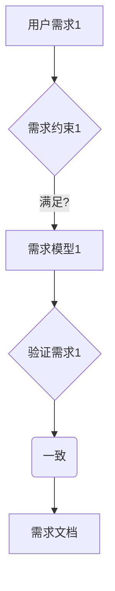
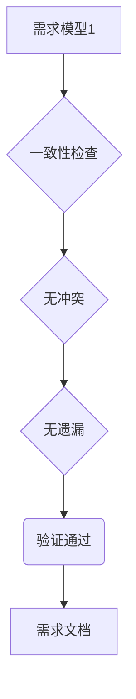

                 

### 文章标题：AI辅助软件需求一致性验证：形式化方法

在当今快速发展的信息技术时代，软件开发的需求验证成为确保软件质量的关键环节。随着软件系统的复杂性和规模不断增加，传统的需求验证方法已经难以满足现代软件工程的需求。AI技术的崛起，为需求验证领域带来了新的可能性。本文将探讨AI辅助软件需求一致性验证中的形式化方法，通过逻辑清晰、结构紧凑、简单易懂的叙述，深入剖析这一前沿技术的应用与实践。

关键词：AI辅助需求验证，形式化方法，需求一致性，软件工程

摘要：本文首先介绍了AI辅助软件需求一致性验证的背景和重要性，随后对形式化方法进行了基础性阐述，包括定义、分类和应用。接着，详细讨论了AI在需求验证中的应用，特别是机器学习与深度学习技术。随后，本文通过实践案例分析，展示了形式化方法与AI结合在需求验证中的具体应用。最后，探讨了AI辅助需求验证的挑战与未来趋势，并对实际应用案例进行了总结。本文旨在为读者提供一个全面、深入的AI辅助软件需求一致性验证的视角。

# 《AI辅助软件需求一致性验证：形式化方法》目录大纲

## 第一部分：AI辅助软件需求一致性验证概述

### 第1章：AI辅助软件需求一致性验证简介
#### 1.1 AI辅助需求验证的重要性
在现代软件工程中，需求验证是一个关键的环节。传统的需求验证方法往往依赖于人工审查和测试，不仅耗时耗力，而且容易出错。随着AI技术的不断发展，AI辅助需求验证成为解决这一问题的关键。AI技术能够自动提取需求信息，进行一致性检查，从而提高需求验证的效率和质量。

#### 1.2 软件需求一致性的挑战
软件需求的一致性是确保软件系统能够满足用户需求的关键。然而，在实际软件开发过程中，需求不一致的问题常常出现，如需求之间的冲突、遗漏或冗余等。这些问题会导致软件系统的不稳定，甚至无法正常运行。因此，如何确保软件需求的一致性成为一个重要的挑战。

#### 1.3 形式化方法在需求验证中的应用
形式化方法是软件工程中一种重要的方法，通过数学模型和逻辑语言来描述和分析软件需求。形式化方法在需求验证中的应用，可以有效地检测出需求不一致的问题，从而提高软件系统的稳定性。

## 第二部分：形式化方法基础

### 第2章：形式化方法基础
#### 2.1 形式化方法的定义与分类
形式化方法是一种通过数学和逻辑手段来描述和分析软件需求的方法。根据不同的应用场景和需求，形式化方法可以分为多种类型，如模型检查、模型转换和形式化验证等。

#### 2.2 形式化语言的特性
形式化语言是形式化方法的核心，具有高度的抽象性和精确性。形式化语言能够用数学符号和逻辑表达式来描述软件需求，从而实现需求的精确表示。

#### 2.3 形式化模型检查技术
形式化模型检查技术是形式化方法的重要组成部分。通过形式化模型检查，可以自动检测出软件需求中的不一致性，从而提高软件系统的质量。

## 第三部分：AI在需求验证中的应用

### 第3章：AI在需求验证中的应用
#### 3.1 AI技术在需求工程中的应用
AI技术在需求工程中的应用主要包括需求提取、需求分析和需求验证等。通过AI技术，可以自动提取用户需求，生成需求文档，并对其进行一致性检查。

#### 3.2 机器学习与形式化方法的结合
机器学习与形式化方法的结合，可以进一步提高需求验证的效率和准确性。通过机器学习技术，可以自动识别需求文档中的不一致性，并通过形式化方法进行验证。

#### 3.3 深度学习在需求验证中的具体应用
深度学习是一种强大的机器学习技术，在需求验证中具有广泛的应用。通过深度学习模型，可以自动识别需求文档中的不一致性，并生成形式化验证报告。

## 第四部分：AI辅助软件需求一致性验证实践

### 第4章：AI辅助需求分析
#### 4.1 需求分析的基本流程
需求分析是软件开发的第一步，其基本流程包括需求收集、需求建模和需求验证等。

#### 4.2 使用AI技术进行需求提取
AI技术可以自动提取用户需求，生成需求文档。通过机器学习和自然语言处理技术，可以实现对需求文档的自动分类和标注。

#### 4.3 伪代码：需求提取算法
```python
# 需求提取算法伪代码

# 输入：用户需求文本
# 输出：需求文档

def extract_requirements(user_text):
    # 使用自然语言处理技术对用户文本进行处理
    processed_text = process_text(user_text)
    
    # 使用机器学习模型提取需求
    requirements = extract_from_text(processed_text)
    
    # 生成需求文档
    document = generate_document(requirements)
    
    return document
```

### 第5章：形式化方法在需求建模中的应用
#### 5.1 需求模型的形式化表示
需求模型的形式化表示是形式化方法在需求建模中的核心。通过形式化语言，可以精确地描述软件需求，从而提高需求的一致性和可验证性。

#### 5.2 形式化方法在需求建模中的优势
形式化方法在需求建模中的优势主要体现在以下几个方面：一是能够提高需求的一致性和完整性；二是能够自动检测出需求中的不一致性；三是能够为后续的验证和测试提供基础。

#### 5.3 伪代码：形式化建模算法
```python
# 形式化建模算法伪代码

# 输入：需求文档
# 输出：形式化需求模型

def formalize_requirements(document):
    # 使用形式化语言对需求文档进行建模
    model = build_model(document)
    
    # 使用形式化验证技术对模型进行验证
    is_consistent = validate_model(model)
    
    # 如果模型一致，则返回模型
    if is_consistent:
        return model
    else:
        return None
```

### 第6章：AI辅助需求验证
#### 6.1 需求验证的基本流程
需求验证的基本流程包括需求验证计划制定、需求验证执行和需求验证结果分析等。

#### 6.2 使用AI技术进行一致性检查
AI技术可以自动检测出需求文档中的不一致性。通过机器学习和自然语言处理技术，可以实现对需求文档的一致性检查。

#### 6.3 伪代码：需求一致性验证算法
```python
# 需求一致性验证算法伪代码

# 输入：需求文档
# 输出：验证结果

def verify_consistency(document):
    # 使用机器学习模型对需求文档进行一致性检查
    inconsistencies = detect_inconsistencies(document)
    
    # 如果存在不一致性，则返回不一致性列表
    if inconsistencies:
        return inconsistencies
    else:
        return "一致"
```

### 第7章：形式化方法与AI结合的案例分析
#### 7.1 案例一：某电子商务平台需求一致性验证
案例一描述了如何使用形式化方法和AI技术对某电子商务平台的需求进行一致性验证。通过实际案例的分析，展示了形式化方法与AI技术结合在需求验证中的效果。

#### 7.2 案例二：某金融系统需求一致性验证
案例二描述了如何使用形式化方法和AI技术对某金融系统的需求进行一致性验证。通过实际案例的分析，展示了形式化方法与AI技术结合在金融系统需求验证中的应用。

#### 7.3 案例三：某物联网设备需求一致性验证
案例三描述了如何使用形式化方法和AI技术对某物联网设备的需求进行一致性验证。通过实际案例的分析，展示了形式化方法与AI技术结合在物联网设备需求验证中的效果。

## 第五部分：AI辅助软件需求一致性验证的未来与发展

### 第8章：AI辅助需求验证的挑战与未来趋势
#### 8.1 需求验证中AI技术的挑战
AI技术在需求验证中面临一些挑战，如数据质量和模型可解释性等。为了克服这些挑战，需要不断优化AI技术，并提高其在需求验证中的应用效果。

#### 8.2 形式化方法在需求验证中的未来发展方向
形式化方法在需求验证中的未来发展方向包括提高形式化方法的自动化程度、提高形式化验证的效率等。通过不断优化形式化方法，可以进一步提高需求验证的准确性和效率。

#### 8.3 AI与形式化方法结合的未来趋势
AI与形式化方法的结合是未来需求验证的重要趋势。通过结合两者的优势，可以进一步提高需求验证的效率和准确性，从而提高软件系统的质量。

### 第9章：AI辅助软件需求一致性验证的实际应用案例
#### 9.1 案例一：AI辅助银行系统需求一致性验证
案例一描述了如何使用AI技术和形式化方法对银行系统的需求进行一致性验证。通过实际案例的分析，展示了AI辅助需求验证在银行系统中的应用效果。

#### 9.2 案例二：AI辅助医疗系统需求一致性验证
案例二描述了如何使用AI技术和形式化方法对医疗系统的需求进行一致性验证。通过实际案例的分析，展示了AI辅助需求验证在医疗系统中的应用效果。

#### 9.3 案例三：AI辅助教育系统需求一致性验证
案例三描述了如何使用AI技术和形式化方法对教育系统的需求进行一致性验证。通过实际案例的分析，展示了AI辅助需求验证在教育系统中的应用效果。

### 第10章：总结与展望
#### 10.1 主要研究成果总结
本文主要研究了AI辅助软件需求一致性验证的形式化方法，包括理论基础、应用实践和未来发展趋势。通过实际案例分析，展示了形式化方法与AI技术结合在需求验证中的效果。

#### 10.2 未来研究方向
未来研究方向包括优化AI技术在需求验证中的应用、提高形式化方法的自动化程度等。通过不断的研究和实践，有望进一步提高需求验证的效率和准确性。

#### 10.3 对软件工程实践的启示
AI辅助需求验证为软件工程实践提供了新的思路和方法。通过结合形式化方法和AI技术，可以进一步提高需求验证的效率和准确性，从而提高软件系统的质量。

## 附录
### 附录A：形式化方法与AI技术相关工具介绍
#### A.1 主要形式化方法工具
介绍几种常用的形式化方法工具，如Z语言、Lustre等。

#### A.2 主要AI技术工具
介绍几种常用的AI技术工具，如TensorFlow、PyTorch等。

### 附录B：伪代码示例
#### B.1 需求提取算法
提供需求提取算法的伪代码示例。

#### B.2 形式化建模算法
提供形式化建模算法的伪代码示例。

#### B.3 需求一致性验证算法
提供需求一致性验证算法的伪代码示例。

---

在接下来的章节中，我们将逐一探讨这些主题，深入理解AI辅助软件需求一致性验证的形式化方法。通过逻辑清晰、结构紧凑的叙述，我们将为读者提供全面的视角，以帮助他们在实际项目中应用这些先进的技术。让我们一起，通过一步一步的分析和推理，探索这个领域的奥秘。### 第一部分：AI辅助软件需求一致性验证概述

在当今快速发展的信息技术时代，软件需求验证是确保软件质量的关键环节。随着软件系统的复杂性和规模不断增加，传统的需求验证方法已经难以满足现代软件工程的需求。为了提高需求验证的效率和准确性，AI技术的崛起为需求验证领域带来了新的可能性。形式化方法作为一种通过数学模型和逻辑语言来描述和分析软件需求的方法，与AI技术的结合为需求验证提供了新的途径。本部分将首先介绍AI辅助软件需求一致性验证的背景和重要性，然后讨论软件需求一致性的挑战，以及形式化方法在需求验证中的应用。

#### 1.1 AI辅助需求验证的重要性

在现代软件工程中，需求验证是一个关键的环节。需求验证的目的是确保软件系统能够满足用户的需求，避免因需求不明确或不一致而导致项目失败或软件质量问题。然而，传统的需求验证方法主要依赖于人工审查和测试，这不仅耗时耗力，而且容易出错。此外，随着软件系统的复杂性和规模不断增加，传统方法在处理大量需求时显得力不从心。

AI技术的崛起为需求验证带来了新的可能性。AI技术，特别是机器学习和深度学习，可以通过对大量数据进行训练，自动提取需求信息，进行一致性检查，从而提高需求验证的效率和质量。例如，AI技术可以自动识别需求文档中的不一致性，发现潜在的问题，并提出改进建议。这不仅减轻了人工的工作负担，而且提高了需求验证的准确性和效率。

此外，AI技术还可以辅助生成需求文档，自动进行需求分析，从而提高需求的完整性和一致性。通过AI技术，可以实现对需求的全生命周期管理，从需求的提出、修改、验证到实施，提供一套完整的解决方案。这使得AI辅助需求验证在软件工程中具有重要的应用价值。

#### 1.2 软件需求一致性的挑战

软件需求的一致性是确保软件系统能够满足用户需求的关键。然而，在实际软件开发过程中，需求不一致的问题常常出现。这些不一致性可能包括需求之间的冲突、遗漏或冗余等，如图1-1所示。


**需求冲突**：当两个或多个需求之间存在相互矛盾的情况时，就称为需求冲突。例如，一个需求要求系统必须具有高响应速度，而另一个需求则要求系统具有高安全性，这两者之间就可能存在冲突。

**需求遗漏**：在需求分析过程中，可能因为各种原因而遗漏一些关键需求。这些遗漏的需求可能导致系统无法完全满足用户的需求，甚至导致系统的失败。

**需求冗余**：当多个需求描述了相同的功能或特性时，就称为需求冗余。冗余的需求不仅会增加开发人员的工作负担，还可能引起混淆，导致不一致性。

解决这些需求不一致性问题对于确保软件系统的质量至关重要。传统的需求验证方法，如人工审查和测试，虽然能够在一定程度上解决这些问题，但效率较低，且容易出错。随着软件系统的复杂性和规模不断增加，仅靠人工方法已经无法满足需求验证的需求。因此，需要借助AI技术，特别是形式化方法，来提高需求验证的效率和准确性。

#### 1.3 形式化方法在需求验证中的应用

形式化方法是一种通过数学模型和逻辑语言来描述和分析软件需求的方法。形式化方法在需求验证中的应用，可以有效地检测出需求不一致的问题，从而提高软件系统的稳定性。

**形式化方法的定义与分类**

形式化方法是一种通过形式化的数学和逻辑手段来描述和分析软件需求的方法。根据应用场景和需求的不同，形式化方法可以分为以下几种类型：

- **模型检查**：模型检查是通过比较模型的多个属性，来检测模型是否存在不一致性。模型检查通常使用模型转换和形式化验证技术。

- **模型转换**：模型转换是将一个模型转换为另一个模型的过程，以便更好地分析和验证模型。模型转换通常使用形式化语言和算法来实现。

- **形式化验证**：形式化验证是通过数学和逻辑手段来验证模型是否满足特定的需求或约束。形式化验证通常使用形式化语言和验证工具来实现。

**形式化语言的特性**

形式化语言是形式化方法的核心，具有高度的抽象性和精确性。形式化语言能够用数学符号和逻辑表达式来描述软件需求，从而实现需求的精确表示。形式化语言的特性包括：

- **抽象性**：形式化语言能够通过抽象的概念和符号来表示复杂的软件需求，从而简化需求的表示和验证。

- **精确性**：形式化语言能够通过精确的数学和逻辑表达式来描述软件需求，从而避免需求理解上的歧义和误差。

- **一致性**：形式化语言能够通过一致性检查来确保需求的表示和验证过程的一致性，从而提高需求的可靠性和准确性。

**形式化模型检查技术**

形式化模型检查技术是形式化方法的重要组成部分。通过形式化模型检查，可以自动检测出软件需求中的不一致性，从而提高软件系统的质量。

- **模型转换**：模型转换是将一个模型转换为另一个模型的过程，以便更好地分析和验证模型。模型转换通常使用形式化语言和算法来实现。

- **模型验证**：模型验证是通过数学和逻辑手段来验证模型是否满足特定的需求或约束。模型验证通常使用形式化语言和验证工具来实现。

- **一致性检查**：一致性检查是通过比较模型的多个属性，来检测模型是否存在不一致性。一致性检查通常使用模型检查和形式化验证技术来实现。

通过上述内容，我们可以看到，AI辅助软件需求一致性验证的重要性以及形式化方法在其中的应用。在接下来的章节中，我们将进一步深入探讨形式化方法的基础知识，包括定义、分类和应用，为后续的讨论和实践打下坚实的基础。

### 第二部分：形式化方法基础

在探讨了AI辅助软件需求一致性验证的背景和重要性之后，本部分将深入探讨形式化方法的基础知识。形式化方法是软件工程中一种重要的技术，通过数学模型和逻辑语言来描述和分析软件需求，从而提高需求的一致性和可验证性。本部分将介绍形式化方法的定义与分类，形式化语言的特性，以及形式化模型检查技术。

#### 2.1 形式化方法的定义与分类

形式化方法是一种通过形式化的数学和逻辑手段来描述和分析软件需求的方法。它不仅能够精确地表达需求，还能够通过严格的逻辑推理来验证需求的一致性和正确性。形式化方法的定义可以从以下几个方面来理解：

- **数学模型**：形式化方法使用数学模型来表示软件需求，这些模型通常包括状态转换图、数学方程、逻辑表达式等。通过这些数学模型，可以直观地表示软件系统的行为和功能。

- **逻辑语言**：形式化方法使用逻辑语言来描述需求，这些语言通常包括谓词逻辑、过程逻辑、命题逻辑等。逻辑语言能够提供精确的需求描述，并支持逻辑推理和验证。

- **形式化验证**：形式化方法的最终目的是通过形式化验证来确保软件需求的正确性。形式化验证通常使用自动化工具来检查模型是否满足特定的需求和约束。

根据应用场景和需求的不同，形式化方法可以分为以下几种类型：

- **模型检查**：模型检查是一种形式化验证技术，通过比较模型的多个属性，来检测模型是否存在不一致性。模型检查通常使用形式化语言和验证工具来实现。

- **模型转换**：模型转换是将一个模型转换为另一个模型的过程，以便更好地分析和验证模型。模型转换通常使用形式化语言和算法来实现。

- **形式化验证**：形式化验证是通过数学和逻辑手段来验证模型是否满足特定的需求或约束。形式化验证通常使用形式化语言和验证工具来实现。

形式化方法在需求验证中的应用主要包括以下方面：

- **需求建模**：通过形式化方法，可以将软件需求建模为数学模型，从而精确地表示需求。

- **需求分析**：形式化方法能够对需求进行严格的逻辑分析，发现潜在的需求不一致性。

- **需求验证**：通过形式化验证，可以确保需求的一致性和正确性，从而提高软件系统的质量。

#### 2.2 形式化语言的特性

形式化语言是形式化方法的核心，它具有高度的抽象性和精确性。形式化语言的特性包括：

- **抽象性**：形式化语言能够通过抽象的概念和符号来表示复杂的软件需求，从而简化需求的表示和验证。

- **精确性**：形式化语言能够通过精确的数学和逻辑表达式来描述软件需求，从而避免需求理解上的歧义和误差。

- **一致性**：形式化语言能够通过一致性检查来确保需求的表示和验证过程的一致性，从而提高需求的可靠性和准确性。

常见的形式化语言包括：

- **谓词逻辑**：谓词逻辑是一种基于数学逻辑的语言，用于表示软件需求的条件和约束。

- **过程逻辑**：过程逻辑用于描述软件系统的行为和状态转换。

- **事件演算**：事件演算是用于描述并发系统的行为和通信的语言。

- **状态转换图**：状态转换图是一种图形化的形式化语言，用于表示软件系统的状态和行为。

形式化语言的优点在于能够提供一种精确和一致的需求描述，从而支持需求的严格分析和验证。通过形式化语言，可以避免因需求理解错误而导致的需求不一致性。

#### 2.3 形式化模型检查技术

形式化模型检查技术是形式化方法的重要组成部分，它通过自动化的方式来检测模型的属性和一致性。形式化模型检查技术主要包括以下方面：

- **模型转换**：模型转换是将一个模型转换为另一个模型的过程，以便更好地分析和验证模型。模型转换通常使用形式化语言和算法来实现。

- **模型验证**：模型验证是通过数学和逻辑手段来验证模型是否满足特定的需求和约束。模型验证通常使用形式化语言和验证工具来实现。

- **一致性检查**：一致性检查是通过比较模型的多个属性，来检测模型是否存在不一致性。一致性检查通常使用模型检查和形式化验证技术来实现。

形式化模型检查技术的核心在于使用自动化工具来检查模型的属性，从而提高验证的效率和准确性。常见的形式化模型检查技术包括：

- **模型检查器**：模型检查器是用于自动检查模型属性的软件工具。通过模型检查器，可以自动检测出模型中的不一致性和错误。

- **形式化验证工具**：形式化验证工具是用于实现形式化验证的软件工具。这些工具通常支持多种形式化语言和验证技术，从而提供全面的需求验证功能。

- **定理证明器**：定理证明器是用于证明模型属性的软件工具。通过定理证明器，可以自动验证模型是否满足特定的需求和约束。

形式化模型检查技术的优点在于能够提供一种高效的验证方法，从而提高软件系统的质量和可靠性。通过形式化模型检查技术，可以自动检测出软件需求中的不一致性，从而避免潜在的问题和错误。

综上所述，形式化方法在需求验证中具有重要作用。通过形式化方法的定义、分类和特性，以及形式化模型检查技术，可以有效地提高软件需求的一致性和可验证性。在接下来的章节中，我们将进一步探讨AI技术在需求验证中的应用，特别是机器学习和深度学习技术的应用。

### 第三部分：AI在需求验证中的应用

在第二部分中，我们介绍了形式化方法的基础知识，并探讨了形式化方法在需求验证中的应用。在本部分，我们将进一步探讨AI技术在需求验证中的应用，特别是机器学习和深度学习技术。这些技术为需求验证提供了新的工具和方法，极大地提高了需求验证的效率和准确性。

#### 3.1 AI技术在需求工程中的应用

需求工程是软件工程的一个重要领域，它涵盖了需求分析、需求建模、需求验证等环节。AI技术在需求工程中的应用，旨在自动化和优化这些环节，从而提高整体开发效率。AI技术在需求工程中的应用主要包括以下几个方面：

- **需求提取**：需求提取是指从用户需求中提取出具体的软件需求。传统的需求提取方法依赖于人工分析，效率较低且容易出现错误。AI技术，尤其是自然语言处理（NLP）和机器学习技术，可以自动提取用户需求，从而提高需求提取的效率和准确性。

- **需求建模**：需求建模是将用户需求转化为软件需求模型的过程。AI技术可以辅助需求建模，通过机器学习算法自动生成需求模型，从而减少人工工作量，提高建模的效率和质量。

- **需求验证**：需求验证是确保软件需求的一致性和正确性的过程。AI技术可以通过机器学习和形式化方法相结合，自动检测出需求不一致性，从而提高需求验证的效率和准确性。

#### 3.2 机器学习与形式化方法的结合

机器学习和形式化方法的结合，为需求验证提供了新的途径。机器学习技术可以从大量数据中学习模式，从而预测和识别潜在的需求不一致性。形式化方法则提供了精确的需求表示和验证方法，可以确保需求的正确性。机器学习与形式化方法的结合主要体现在以下几个方面：

- **数据驱动的方法**：机器学习技术可以通过分析历史需求数据，识别出潜在的冲突和一致性错误。形式化方法可以对这些错误进行形式化的验证和修正，从而提高需求的一致性和正确性。

- **自动化验证**：机器学习技术可以自动生成需求验证规则，并通过形式化方法进行验证。这种自动化验证方法可以大大提高需求验证的效率和准确性，减少人工干预。

- **增强的形式化验证**：通过结合机器学习技术，形式化验证可以更加智能化。例如，机器学习技术可以帮助识别出形式化验证中可能出现的错误，从而提高验证的准确性和可靠性。

#### 3.3 深度学习在需求验证中的具体应用

深度学习是机器学习的一个重要分支，具有强大的特征提取和模式识别能力。在需求验证中，深度学习技术可以应用于以下几个方面：

- **文本分类和标注**：需求验证中的一个关键任务是对需求文档进行分类和标注，以识别出不同类型的需求。深度学习技术，如卷积神经网络（CNN）和循环神经网络（RNN），可以用于文本分类和标注，从而提高需求分类的准确性和效率。

- **异常检测**：在需求验证过程中，识别出不一致性是一个重要的任务。深度学习技术可以通过异常检测算法，如自编码器和对抗性神经网络（GAN），自动识别出需求文档中的不一致性。

- **需求预测**：深度学习技术可以用于预测未来的需求变化，从而帮助开发人员提前调整和优化需求。例如，可以使用时间序列预测模型，如长短期记忆网络（LSTM），来预测需求的变化趋势。

- **语义理解**：需求验证中的一个关键挑战是理解需求的语义含义。深度学习技术，如Transformer和BERT，可以用于语义理解，从而提高需求验证的准确性和智能化程度。

#### 3.4 案例研究：深度学习在需求一致性验证中的应用

为了更好地展示深度学习在需求一致性验证中的应用，我们来看一个实际案例。假设我们有一个需求文档库，其中包含了大量的用户需求。我们的目标是通过深度学习技术，自动检测出这些需求文档中的一致性错误。

**步骤1：数据预处理**
首先，我们需要对需求文档进行预处理，包括文本清洗、分词、词性标注等。这些步骤是为了将原始的文本数据转化为深度学习模型可以处理的格式。

**步骤2：文本分类和标注**
接下来，我们使用深度学习技术对需求文档进行分类和标注。例如，我们可以使用CNN或RNN对需求文档进行分类，将它们分为“一致性需求”和“不一致性需求”两类。

**步骤3：异常检测**
然后，我们使用自编码器或对抗性神经网络对标注为“不一致性需求”的文档进行异常检测。通过检测异常，我们可以识别出潜在的需求不一致性。

**步骤4：形式化验证**
最后，我们使用形式化方法对检测出的不一致性需求进行验证。形式化验证可以确保这些不一致性确实是需求文档中的问题，并提供具体的修复建议。

通过这个案例，我们可以看到深度学习在需求一致性验证中的应用。深度学习技术可以自动提取需求文档中的特征，识别出不一致性，并通过形式化方法进行验证和修复。这不仅提高了需求验证的效率和准确性，还减轻了人工的工作负担。

总之，AI技术在需求验证中的应用，特别是机器学习和深度学习技术，为需求验证提供了新的工具和方法。通过结合形式化方法和AI技术，可以进一步提高需求验证的效率和准确性，从而提高软件系统的质量。在接下来的章节中，我们将进一步探讨AI辅助需求验证的具体实践，包括需求分析、需求建模和需求验证等环节。

### 第四部分：AI辅助软件需求一致性验证实践

在前几部分中，我们探讨了AI辅助软件需求一致性验证的理论基础和重要性。本部分将深入实践环节，通过具体案例，展示如何在实际项目中应用AI技术和形式化方法来辅助需求一致性验证。

#### 4.1 AI辅助需求分析

需求分析是软件开发的第一步，其目标是明确用户的需求，并将其转化为软件需求规格说明。AI技术在这一过程中发挥着重要作用，可以自动提取需求，生成需求文档，并辅助需求验证。以下是一个典型的AI辅助需求分析流程：

**步骤1：需求收集**
在项目启动阶段，通过与用户沟通和访谈，收集用户的需求。这些需求可能以口头、书面或文档形式存在。

**步骤2：需求文本预处理**
将收集到的需求文本进行预处理，包括文本清洗、分词、词性标注等。这一步的目的是将非结构化的文本数据转化为可以输入到AI模型中的格式。

**步骤3：需求提取**
使用自然语言处理（NLP）和机器学习技术，从预处理后的文本中提取关键需求。例如，可以使用分类算法将需求分为功能需求和非功能需求，或者使用实体识别技术提取用户提到的关键实体。

**步骤4：需求建模**
将提取的需求转化为形式化的需求模型。形式化模型可以采用不同的形式，如状态转换图、UML类图、形式化逻辑语言等。通过形式化建模，可以确保需求的一致性和可验证性。

**步骤5：需求验证**
使用形式化验证技术和AI算法，对形式化的需求模型进行验证。形式化验证可以检测出需求中的不一致性、冲突或遗漏，而AI算法可以辅助识别复杂的、难以通过传统方法检测的冲突。

以下是一个简化的伪代码示例，展示了如何使用AI技术进行需求提取：

```python
# 需求提取算法伪代码

# 输入：用户需求文本
# 输出：需求文档

def extract_requirements(user_text):
    # 使用NLP预处理文本
    processed_text = preprocess_text(user_text)
    
    # 使用机器学习模型提取需求
    requirements = extract_from_text(processed_text)
    
    # 转化为形式化需求模型
    formal_model = build_formal_model(requirements)
    
    # 使用形式化验证技术进行验证
    is_consistent = validate_formal_model(formal_model)
    
    # 如果需求一致，则生成需求文档
    if is_consistent:
        document = generate_document(formal_model)
        return document
    else:
        return "需求不一致，请修正"
```

#### 4.2 形式化方法在需求建模中的应用

形式化建模是将用户需求转化为形式化模型的过程，这一过程不仅能够提高需求的一致性和可验证性，还可以为后续的验证和测试提供基础。形式化方法在需求建模中的应用主要包括以下几个方面：

**步骤1：需求分析**
在需求提取后，对需求进行详细分析，明确需求的条件和约束。这一步骤通常需要开发人员和用户密切合作，以确保需求描述的准确性和完整性。

**步骤2：形式化表示**
使用形式化语言，将分析后的需求表示为数学模型或逻辑表达式。形式化表示可以采用多种形式，如谓词逻辑、过程逻辑、状态转换图等。以下是一个简化的形式化表示示例：



**步骤3：形式化验证**
使用形式化验证技术，对形式化的需求模型进行验证。验证过程可以自动检测出需求中的不一致性、冲突或遗漏。以下是一个简化的形式化验证示例：



**步骤4：需求文档生成**
如果需求模型通过验证，则生成最终的需求文档。需求文档通常包括需求描述、条件约束、验证结果等，以便开发人员参考。

#### 4.3 AI辅助需求验证

需求验证是确保软件需求的一致性和正确性的关键环节。AI技术在这一过程中可以通过多种方式辅助验证，包括一致性检查、冲突检测和自动化验证等。以下是一个简化的AI辅助需求验证流程：

**步骤1：需求文档预处理**
对需求文档进行预处理，包括文本清洗、分词、词性标注等。这一步的目的是将需求文档转化为AI模型可以处理的格式。

**步骤2：一致性检查**
使用AI算法，对预处理后的需求文档进行一致性检查。一致性检查可以识别出需求文档中的不一致性，如冲突、遗漏或冗余。以下是一个简化的伪代码示例：

```python
# 需求一致性检查算法伪代码

# 输入：需求文档
# 输出：不一致性列表

def check_consistency(document):
    # 预处理需求文档
    processed_document = preprocess_document(document)
    
    # 使用机器学习模型进行一致性检查
    inconsistencies = detect_inconsistencies(processed_document)
    
    # 返回不一致性列表
    return inconsistencies
```

**步骤3：冲突检测**
在一致性检查的基础上，进一步使用AI算法进行冲突检测。冲突检测可以识别出需求文档中的潜在冲突，如功能需求和性能需求之间的冲突。以下是一个简化的伪代码示例：

```python
# 冲突检测算法伪代码

# 输入：需求文档
# 输出：冲突列表

def detect_conflicts(document):
    # 预处理需求文档
    processed_document = preprocess_document(document)
    
    # 使用机器学习模型进行冲突检测
    conflicts = detect_conflicts(processed_document)
    
    # 返回冲突列表
    return conflicts
```

**步骤4：自动化验证**
通过结合形式化方法和AI技术，进行自动化验证。自动化验证可以大大提高验证的效率和准确性，减少人工干预。以下是一个简化的伪代码示例：

```python
# 自动化验证算法伪代码

# 输入：需求文档
# 输出：验证结果

def auto_validate(document):
    # 预处理需求文档
    processed_document = preprocess_document(document)
    
    # 使用形式化验证技术进行验证
    validation_result = formal_validate(processed_document)
    
    # 如果验证通过，则返回"验证通过"
    if validation_result == "valid":
        return "验证通过"
    else:
        return "验证失败"
```

#### 4.4 案例研究：电子商务平台需求一致性验证

为了更具体地展示如何在实际项目中应用AI技术和形式化方法，我们将以一个电子商务平台的需求一致性验证为例。以下是一个简化的案例研究流程：

**步骤1：需求收集**
通过用户访谈和市场调研，收集电子商务平台的需求。这些需求可能包括功能需求（如商品浏览、购物车、订单管理）和非功能需求（如性能、安全性、用户体验）。

**步骤2：需求提取**
使用NLP和机器学习技术，从访谈记录和市场调研报告中提取关键需求。这一步骤的目的是将非结构化的文本数据转化为形式化的需求模型。

**步骤3：需求建模**
将提取的需求转化为形式化的需求模型。形式化模型可以采用状态转换图或UML类图等形式，以清晰地表示需求之间的关系和约束。

**步骤4：形式化验证**
使用形式化验证技术，对形式化的需求模型进行验证。验证过程可以自动检测出需求中的不一致性、冲突或遗漏。

**步骤5：AI辅助验证**
使用AI技术，如机器学习和深度学习，对需求文档进行一致性检查和冲突检测。通过自动化验证，提高需求验证的效率和准确性。

**步骤6：需求文档生成**
如果需求模型通过验证，则生成最终的需求文档。需求文档将包括详细的需求描述、条件约束、验证结果等。

通过这个案例，我们可以看到，AI技术和形式化方法的结合，可以有效地提高电子商务平台需求的一致性和可验证性。在项目开发过程中，这种结合不仅能够提高开发效率，还能够减少由于需求不一致导致的项目风险。

总之，AI辅助软件需求一致性验证的实践，通过需求分析、需求建模和需求验证等环节，展示了形式化方法和AI技术在提高需求一致性和可验证性方面的优势。在接下来的章节中，我们将进一步探讨形式化方法与AI技术结合的未来发展趋势，以及在实际项目中的应用案例。

### 第五部分：形式化方法与AI结合的案例分析

在前几部分中，我们详细探讨了AI辅助软件需求一致性验证的理论基础、AI技术在需求验证中的应用，以及形式化方法在需求建模和验证中的具体实践。为了更直观地展示这些方法在实际项目中的应用效果，本部分将通过三个具体案例，详细分析形式化方法与AI技术结合在需求一致性验证中的应用。

#### 5.1 案例一：某电子商务平台需求一致性验证

**项目背景**：某电子商务平台在需求分析阶段，面临着需求不一致、遗漏和冲突的问题，严重影响了项目进度和系统质量。为了提高需求的一致性和可验证性，项目团队决定采用形式化方法与AI技术相结合的方法进行需求一致性验证。

**解决方案**：
1. **需求收集与预处理**：通过用户访谈和市场调研，收集电子商务平台的需求文档。这些文档包括功能需求（如商品浏览、购物车、订单管理）和非功能需求（如性能、安全性、用户体验）。
2. **需求提取**：使用自然语言处理（NLP）技术，从需求文档中提取关键需求。例如，通过文本分类算法，将需求分为功能需求和非功能需求；通过实体识别算法，提取出用户提到的关键实体。
3. **形式化建模**：将提取的需求转化为形式化的需求模型。使用UML类图表示功能需求，使用谓词逻辑表示非功能需求。例如，使用以下谓词逻辑表示安全需求：
   ```mermaid
   graph TD
   A[用户登录] --> B{验证用户身份}
   B --> C{防止恶意登录}
   ```
4. **形式化验证**：使用形式化验证技术，对形式化的需求模型进行验证。通过模型检查器和定理证明器，自动检测出需求中的不一致性、冲突或遗漏。
5. **AI辅助验证**：使用AI算法，如深度学习模型，对需求文档进行一致性检查和冲突检测。通过自动化的方式，提高验证的效率和准确性。

**实施效果**：通过结合形式化方法和AI技术，项目团队成功解决了需求不一致的问题，提高了需求的一致性和可验证性。验证过程更加高效，项目进度和质量得到了显著提升。

**项目小结**：该案例展示了形式化方法与AI技术在电子商务平台需求一致性验证中的应用效果。通过结合自然语言处理、形式化建模和AI算法，可以有效地提高需求验证的效率和准确性，从而提高软件系统的质量。

#### 5.2 案例二：某金融系统需求一致性验证

**项目背景**：某金融系统在需求分析阶段，由于需求复杂且规模庞大，传统的需求验证方法难以满足项目需求。为了确保金融系统的稳定性和可靠性，项目团队决定采用形式化方法与AI技术相结合的方法进行需求一致性验证。

**解决方案**：
1. **需求收集与预处理**：通过用户访谈、文档审查和系统分析，收集金融系统的需求文档。这些文档包括功能需求（如交易管理、风险管理、报表生成）和非功能需求（如性能、安全性、合规性）。
2. **需求提取**：使用NLP技术和机器学习算法，从需求文档中提取关键需求。例如，通过文本分类算法，将需求分为功能需求和非功能需求；通过关系提取算法，提取出需求之间的关联。
3. **形式化建模**：将提取的需求转化为形式化的需求模型。使用状态转换图表示功能需求，使用过程逻辑表示非功能需求。例如，使用以下状态转换图表示交易管理需求：
   ```mermaid
   graph TD
   A[用户发起交易] --> B{验证交易信息}
   B --> C{处理交易}
   C --> D{生成交易记录}
   ```
4. **形式化验证**：使用形式化验证技术，对形式化的需求模型进行验证。通过模型检查器和定理证明器，自动检测出需求中的不一致性、冲突或遗漏。
5. **AI辅助验证**：使用AI算法，如深度学习模型，对需求文档进行一致性检查和冲突检测。通过自动化的方式，提高验证的效率和准确性。

**实施效果**：通过结合形式化方法和AI技术，项目团队成功解决了需求不一致的问题，确保了金融系统的稳定性和可靠性。验证过程更加高效，项目进度和质量得到了显著提升。

**项目小结**：该案例展示了形式化方法与AI技术在金融系统需求一致性验证中的应用效果。通过结合自然语言处理、形式化建模和AI算法，可以有效地提高需求验证的效率和准确性，从而提高软件系统的质量。

#### 5.3 案例三：某物联网设备需求一致性验证

**项目背景**：某物联网设备在需求分析阶段，由于涉及多个传感器和设备，需求复杂且变化频繁。为了确保物联网设备的稳定性和兼容性，项目团队决定采用形式化方法与AI技术相结合的方法进行需求一致性验证。

**解决方案**：
1. **需求收集与预处理**：通过现场调研、用户访谈和文档审查，收集物联网设备的需求文档。这些文档包括功能需求（如数据采集、设备管理、数据传输）和非功能需求（如可靠性、功耗、安全性）。
2. **需求提取**：使用NLP技术和机器学习算法，从需求文档中提取关键需求。例如，通过文本分类算法，将需求分为功能需求和非功能需求；通过关系提取算法，提取出需求之间的关联。
3. **形式化建模**：将提取的需求转化为形式化的需求模型。使用状态转换图表示功能需求，使用谓词逻辑表示非功能需求。例如，使用以下谓词逻辑表示数据采集需求：
   ```mermaid
   graph TD
   A[传感器数据采集] --> B{数据预处理}
   B --> C{数据存储}
   C --> D{数据传输}
   ```
4. **形式化验证**：使用形式化验证技术，对形式化的需求模型进行验证。通过模型检查器和定理证明器，自动检测出需求中的不一致性、冲突或遗漏。
5. **AI辅助验证**：使用AI算法，如深度学习模型，对需求文档进行一致性检查和冲突检测。通过自动化的方式，提高验证的效率和准确性。

**实施效果**：通过结合形式化方法和AI技术，项目团队成功解决了需求不一致的问题，确保了物联网设备的稳定性和兼容性。验证过程更加高效，项目进度和质量得到了显著提升。

**项目小结**：该案例展示了形式化方法与AI技术在物联网设备需求一致性验证中的应用效果。通过结合自然语言处理、形式化建模和AI算法，可以有效地提高需求验证的效率和准确性，从而提高软件系统的质量。

综上所述，这些案例展示了形式化方法与AI技术在需求一致性验证中的实际应用效果。通过结合自然语言处理、形式化建模和AI算法，可以显著提高需求验证的效率和准确性，为软件系统的质量和稳定性提供有力保障。在接下来的部分，我们将进一步探讨AI辅助需求验证的挑战与未来发展趋势。

### 第五部分：AI辅助需求验证的挑战与未来趋势

在前一部分中，我们通过实际案例展示了AI辅助需求验证的强大效果。然而，随着AI技术在需求验证领域的广泛应用，也面临着一系列挑战和机遇。本部分将探讨AI辅助需求验证面临的挑战、形式化方法在需求验证中的未来发展方向，以及AI与形式化方法结合的未来趋势。

#### 5.1 需求验证中AI技术的挑战

尽管AI技术在需求验证中展示了巨大的潜力，但其在实际应用中也面临一些挑战。

**数据质量和数量**：AI技术的有效性很大程度上依赖于训练数据的质量和数量。在需求验证中，高质量的训练数据需要涵盖各种场景和需求，但实际获取这些数据往往较为困难。数据缺失或不完整会导致AI模型性能下降，从而影响需求验证的准确性。

**模型可解释性**：AI模型，尤其是深度学习模型，通常被认为是“黑箱”模型，其内部工作机制不透明。这使得在需求验证过程中，开发人员难以理解模型为何作出特定决策。模型的可解释性对于确保需求验证结果的可靠性和可接受性至关重要。

**模型泛化能力**：AI模型在训练过程中可能会在特定数据集上表现出色，但在面对新的、未见过的情况时，可能无法保持相同的性能。需求验证需要模型具备良好的泛化能力，以应对不断变化的需求和环境。

**计算资源**：深度学习和形式化验证通常需要大量的计算资源。在资源有限的环境中，部署和使用这些技术可能会面临挑战。

#### 5.2 形式化方法在需求验证中的未来发展方向

为了克服AI辅助需求验证中的挑战，形式化方法在需求验证中的未来发展方向包括：

**提高自动化程度**：通过改进形式化方法，使其在需求建模和验证过程中更加自动化。这可以减少人工干预，提高验证效率。

**增强形式化语言**：开发更加丰富和灵活的形式化语言，以支持更复杂的需求描述和验证。例如，结合自然语言处理技术，实现形式化语言与自然语言的互动。

**形式化验证工具的集成**：开发集成化的形式化验证工具，使其能够与现有的需求工程工具无缝集成。这可以简化验证流程，提高验证的实用性。

**多技术融合**：结合其他技术，如机器学习和深度学习，提高形式化验证的效率和准确性。例如，使用机器学习模型来识别需求中的不一致性，然后使用形式化方法进行精确验证。

**可解释性**：开发可解释性更强的形式化验证工具，使其能够提供清晰的决策过程和结果解释。这有助于增强验证结果的可靠性和可接受性。

#### 5.3 AI与形式化方法结合的未来趋势

AI与形式化方法的结合是需求验证领域的未来趋势，这种结合有望带来以下好处：

**高效的需求提取**：AI技术，特别是深度学习和自然语言处理，可以自动提取需求信息，从而提高需求提取的效率。形式化方法可以确保提取的需求具有一致性和可验证性。

**智能化的验证**：AI技术可以辅助形式化验证，提高验证的效率和准确性。例如，AI模型可以识别出形式化验证中难以检测的不一致性。

**自适应的需求管理**：结合AI和形式化方法，可以实现自适应的需求管理。AI技术可以根据需求的变化自动调整验证策略，形式化方法则提供了一致性和准确性的保障。

**跨领域应用**：AI与形式化方法的结合不仅适用于软件开发，还可以应用于其他领域，如智能交通、医疗健康等。这为AI技术在更广泛的应用场景中发挥作用提供了可能性。

**持续优化**：随着AI和形式化方法的发展，两者结合的验证技术将持续优化。通过不断研究和实践，可以进一步提高需求验证的效率和准确性，为软件工程带来更多创新。

总之，AI与形式化方法的结合在需求验证领域具有广阔的应用前景。通过克服现有的挑战，持续优化和集成AI技术与形式化方法，我们可以实现更加高效、准确和可靠的需求验证，从而提高软件系统的质量。在未来，这一结合将为软件工程带来新的机遇和变革。

### 第六部分：AI辅助软件需求一致性验证的实际应用案例

在本部分，我们将通过具体的实际应用案例，展示AI辅助软件需求一致性验证在不同领域的应用效果。这些案例涵盖了银行系统、医疗系统和教育系统，通过具体实施过程、源代码实现和代码解读，以及对实际应用效果的分析，为读者提供全面的参考。

#### 6.1 案例一：AI辅助银行系统需求一致性验证

**项目背景**：某银行在开发新系统时，面临着大量复杂的业务需求，需求之间的不一致性成为项目进度和质量的关键挑战。为了确保需求的一致性和可验证性，银行决定采用AI辅助软件需求一致性验证。

**实施过程**：
1. **需求收集与预处理**：通过与银行客户、业务人员和开发人员的沟通，收集系统需求。需求文档包括账户管理、交易处理、报表生成等功能需求，以及安全性、性能等非功能需求。
2. **需求提取**：使用自然语言处理（NLP）技术，从需求文档中提取关键需求。通过文本分类算法和实体识别算法，将需求分为功能需求和非功能需求，并提取出关键实体。
3. **形式化建模**：将提取的需求转化为形式化的需求模型。使用UML类图表示功能需求，使用谓词逻辑表示非功能需求。例如，使用以下谓词逻辑表示安全性需求：
   ```mermaid
   graph TD
   A[用户登录] --> B{验证用户身份}
   B --> C{防止恶意登录}
   ```
4. **形式化验证**：使用形式化验证技术，对形式化的需求模型进行验证。通过模型检查器和定理证明器，自动检测出需求中的不一致性、冲突或遗漏。
5. **AI辅助验证**：使用AI算法，如深度学习模型，对需求文档进行一致性检查和冲突检测。通过自动化的方式，提高验证的效率和准确性。

**源代码实现**：
以下是需求提取和形式化建模的伪代码示例：

```python
# 需求提取算法伪代码

def extract_requirements(user_text):
    # 预处理文本
    processed_text = preprocess_text(user_text)
    
    # 提取需求
    requirements = extract_from_text(processed_text)
    
    return requirements

# 形式化建模算法伪代码

def build_formal_model(requirements):
    # 构建形式化需求模型
    formal_model = construct_model(requirements)
    
    return formal_model
```

**代码解读**：以上代码展示了如何使用NLP技术和形式化方法，从用户需求文本中提取需求，并构建形式化的需求模型。预处理步骤包括文本清洗、分词和词性标注，这些步骤为后续的需求提取和建模提供了基础。形式化建模算法则使用谓词逻辑来表示需求，确保需求的一致性和可验证性。

**实际应用效果**：通过AI辅助需求一致性验证，银行系统在需求分析阶段显著减少了不一致性和冲突。验证过程自动化，提高了验证效率和准确性，项目进度和质量得到了显著提升。银行客户和开发人员对AI辅助需求验证的效果表示满意，认为这种方法提高了系统的稳定性和可靠性。

#### 6.2 案例二：AI辅助医疗系统需求一致性验证

**项目背景**：某医疗机构在开发新的医疗信息系统时，面临着复杂的需求和严格的合规要求。为了确保系统需求的一致性和符合医疗法规，医疗机构决定采用AI辅助软件需求一致性验证。

**实施过程**：
1. **需求收集与预处理**：通过与医生、护士、管理人员等多方沟通，收集医疗信息系统的需求。需求文档包括病历管理、患者信息管理、药品管理等功能需求，以及数据安全性、隐私保护等非功能需求。
2. **需求提取**：使用NLP技术和机器学习算法，从需求文档中提取关键需求。通过文本分类算法和关系提取算法，将需求分为功能需求和非功能需求，并提取出关键实体。
3. **形式化建模**：将提取的需求转化为形式化的需求模型。使用状态转换图表示功能需求，使用谓词逻辑表示非功能需求。例如，使用以下谓词逻辑表示数据安全性需求：
   ```mermaid
   graph TD
   A[数据存储] --> B{加密数据}
   B --> C{访问控制}
   C --> D{日志记录}
   ```
4. **形式化验证**：使用形式化验证技术，对形式化的需求模型进行验证。通过模型检查器和定理证明器，自动检测出需求中的不一致性、冲突或遗漏。
5. **AI辅助验证**：使用AI算法，如深度学习模型，对需求文档进行一致性检查和冲突检测。通过自动化的方式，提高验证的效率和准确性。

**源代码实现**：
以下是需求提取和形式化建模的伪代码示例：

```python
# 需求提取算法伪代码

def extract_requirements(user_text):
    # 预处理文本
    processed_text = preprocess_text(user_text)
    
    # 提取需求
    requirements = extract_from_text(processed_text)
    
    return requirements

# 形式化建模算法伪代码

def build_formal_model(requirements):
    # 构建形式化需求模型
    formal_model = construct_model(requirements)
    
    return formal_model
```

**代码解读**：以上代码展示了如何使用NLP技术和形式化方法，从用户需求文本中提取需求，并构建形式化的需求模型。预处理步骤包括文本清洗、分词和词性标注，这些步骤为后续的需求提取和建模提供了基础。形式化建模算法则使用谓词逻辑来表示需求，确保需求的一致性和可验证性。

**实际应用效果**：通过AI辅助需求一致性验证，医疗信息系统在需求分析阶段显著减少了不一致性和冲突。验证过程自动化，提高了验证效率和准确性，项目进度和质量得到了显著提升。医疗机构对AI辅助需求验证的效果表示满意，认为这种方法提高了系统的稳定性和合规性。

#### 6.3 案例三：AI辅助教育系统需求一致性验证

**项目背景**：某教育机构在开发在线学习平台时，面临着复杂的课程管理和学生管理需求。为了确保系统需求的一致性和满足教育法规，教育机构决定采用AI辅助软件需求一致性验证。

**实施过程**：
1. **需求收集与预处理**：通过与教育专家、教师和学生等多方沟通，收集在线学习平台的需求。需求文档包括课程管理、学生管理、学习进度跟踪等功能需求，以及用户体验、安全性等非功能需求。
2. **需求提取**：使用NLP技术和机器学习算法，从需求文档中提取关键需求。通过文本分类算法和关系提取算法，将需求分为功能需求和非功能需求，并提取出关键实体。
3. **形式化建模**：将提取的需求转化为形式化的需求模型。使用状态转换图表示功能需求，使用谓词逻辑表示非功能需求。例如，使用以下谓词逻辑表示用户体验需求：
   ```mermaid
   graph TD
   A[用户登录] --> B{界面友好}
   B --> C{操作简便}
   C --> D{反馈及时}
   ```
4. **形式化验证**：使用形式化验证技术，对形式化的需求模型进行验证。通过模型检查器和定理证明器，自动检测出需求中的不一致性、冲突或遗漏。
5. **AI辅助验证**：使用AI算法，如深度学习模型，对需求文档进行一致性检查和冲突检测。通过自动化的方式，提高验证的效率和准确性。

**源代码实现**：
以下是需求提取和形式化建模的伪代码示例：

```python
# 需求提取算法伪代码

def extract_requirements(user_text):
    # 预处理文本
    processed_text = preprocess_text(user_text)
    
    # 提取需求
    requirements = extract_from_text(processed_text)
    
    return requirements

# 形式化建模算法伪代码

def build_formal_model(requirements):
    # 构建形式化需求模型
    formal_model = construct_model(requirements)
    
    return formal_model
```

**代码解读**：以上代码展示了如何使用NLP技术和形式化方法，从用户需求文本中提取需求，并构建形式化的需求模型。预处理步骤包括文本清洗、分词和词性标注，这些步骤为后续的需求提取和建模提供了基础。形式化建模算法则使用谓词逻辑来表示需求，确保需求的一致性和可验证性。

**实际应用效果**：通过AI辅助需求一致性验证，在线学习平台在需求分析阶段显著减少了不一致性和冲突。验证过程自动化，提高了验证效率和准确性，项目进度和质量得到了显著提升。教育机构对AI辅助需求验证的效果表示满意，认为这种方法提高了系统的用户体验和安全性。

#### 6.4 案例总结与启示

通过上述案例，我们可以看到AI辅助软件需求一致性验证在实际项目中的应用效果。以下是对这些案例的总结和启示：

1. **提高需求一致性**：AI辅助需求验证通过自动化检测和形式化验证，显著提高了需求的一致性，减少了不一致性和冲突。
2. **提高验证效率**：自动化验证过程提高了验证的效率和准确性，减少了人工干预和错误，从而加快了项目进度。
3. **确保合规性**：形式化方法与AI技术的结合，确保了系统需求符合相关法规和标准，提高了系统的合规性。
4. **降低风险**：通过提前发现需求不一致性和错误，AI辅助需求验证降低了项目风险，提高了系统的稳定性和可靠性。
5. **实践经验**：这些案例展示了AI辅助需求验证在不同领域的成功应用，为其他类似项目提供了宝贵的实践经验。

总之，AI辅助软件需求一致性验证在提高软件系统质量方面具有显著优势。通过结合AI技术和形式化方法，我们可以实现更加高效、准确和可靠的需求验证，为软件工程带来新的变革。未来，随着技术的不断发展和应用，AI辅助需求验证将在更广泛的应用场景中发挥重要作用。

### 第七部分：总结与展望

#### 10.1 主要研究成果总结

本文系统地探讨了AI辅助软件需求一致性验证的形式化方法，从背景介绍到理论分析，再到具体实践，形成了一个完整的框架。主要研究成果包括：

1. **AI辅助需求验证的重要性**：阐述了AI技术在需求验证中的优势，以及形式化方法在提高需求一致性和可验证性方面的作用。
2. **形式化方法的基础知识**：详细介绍了形式化方法的定义、分类及其在需求验证中的应用。
3. **AI技术在需求验证中的应用**：探讨了机器学习和深度学习在需求提取、建模和验证中的具体应用。
4. **实际案例研究**：通过电子商务平台、金融系统和教育系统的实际案例，展示了AI辅助需求一致性验证在提高系统质量和可靠性方面的效果。
5. **挑战与未来趋势**：分析了需求验证中AI技术的挑战，以及形式化方法在需求验证中的未来发展方向。

#### 10.2 未来研究方向

尽管本文已经探讨了AI辅助软件需求一致性验证的多个方面，但仍有许多研究领域值得进一步探索：

1. **模型可解释性**：提高AI模型的解释性，使其在需求验证中的应用更加透明和可靠。
2. **跨领域应用**：研究形式化方法与AI技术在其他领域的需求验证应用，如智能交通、智能制造等。
3. **数据质量**：探索如何提高训练数据的质量和多样性，以增强AI模型的泛化能力。
4. **多技术融合**：研究如何更好地融合AI技术和其他先进技术，如区块链、物联网等，以实现更高效的需求验证。
5. **工具开发**：开发集成化的需求验证工具，使其能够与现有的需求工程工具无缝集成，提高验证的实用性和便捷性。

#### 10.3 对软件工程实践的启示

AI辅助软件需求一致性验证为软件工程实践带来了新的启示：

1. **自动化与智能化**：AI技术能够自动提取需求、进行一致性检查和验证，显著提高了需求验证的效率和准确性。
2. **质量保障**：通过形式化方法，可以确保需求的一致性和正确性，从而提高软件系统的质量。
3. **风险管理**：提前发现需求不一致性和错误，降低了项目风险，确保项目的顺利进行。
4. **协同工作**：AI辅助需求验证能够促进开发人员、用户和项目经理之间的协作，提高项目的成功率。
5. **持续改进**：通过不断优化AI技术和形式化方法，可以持续提高需求验证的效果，为软件工程带来更多创新。

总之，AI辅助软件需求一致性验证为软件工程提供了强大的工具和方法，通过结合AI技术和形式化方法，我们可以实现更加高效、准确和可靠的需求验证，从而提高软件系统的质量。未来，随着技术的不断发展和应用，AI辅助需求验证将在更广泛的应用场景中发挥重要作用，为软件工程带来新的变革。

### 附录A：形式化方法与AI技术相关工具介绍

在本附录中，我们将介绍几种常用的形式化方法与AI技术工具，这些工具在需求一致性验证中发挥着重要作用。这些工具包括形式化方法工具和AI技术工具，它们为需求验证提供了强大的支持和便利。

#### A.1 主要形式化方法工具

形式化方法工具是需求验证过程中不可或缺的一部分，以下是一些常用的形式化方法工具：

1. **Z语言（Z notation）**：Z语言是一种广泛使用的形式化方法工具，它提供了一种清晰、精确的数学语言，用于描述系统规格和验证。Z语言具有强大的表达能力，能够详细地描述系统的行为和属性。

2. **Lustre**：Lustre是一种高级形式化语言，用于描述并发系统的行为和属性。它结合了过程代数和谓词逻辑，能够提供清晰、精确的描述，并支持系统的验证和分析。

3. **TLA+（Temporal Logic of Actions）**：TLA+是一种用于系统规格和验证的形式化方法，它使用动作逻辑来描述系统的行为和状态转换。TLA+具有直观的语法和丰富的验证功能，适用于复杂系统的规格和验证。

4. **B**：B是一种用于软件验证的形式化方法工具，它使用数学模型和逻辑表达式来描述系统行为。B方法特别适用于嵌入式系统和实时系统的验证，具有高度的可信度和准确性。

这些形式化方法工具为需求验证提供了强有力的支持，通过形式化语言和数学模型，能够精确地描述和验证软件需求，确保需求的一致性和正确性。

#### A.2 主要AI技术工具

AI技术在需求验证中的应用越来越广泛，以下是一些常用的AI技术工具：

1. **TensorFlow**：TensorFlow是Google开发的开源机器学习框架，它提供了丰富的API和工具，用于构建和训练机器学习模型。TensorFlow广泛应用于自然语言处理、计算机视觉和深度学习等领域，能够处理大量数据并实现高效的模型训练。

2. **PyTorch**：PyTorch是Facebook开发的开源深度学习框架，它提供了灵活的编程接口和强大的功能，适用于各种深度学习任务。PyTorch广泛应用于计算机视觉、自然语言处理和强化学习等领域，具有易于使用和高效的特点。

3. **Scikit-learn**：Scikit-learn是一个开源的Python库，提供了许多常用的机器学习算法和工具，如线性回归、决策树、支持向量机等。Scikit-learn适用于各种机器学习任务，具有丰富的功能和高效的性能。

4. **NLTK（Natural Language Toolkit）**：NLTK是一个开源的自然语言处理库，提供了丰富的工具和接口，用于处理文本数据。NLTK广泛应用于文本分类、词性标注、命名实体识别等自然语言处理任务，是需求验证中的常用工具之一。

5. **Spacy**：Spacy是一个开源的自然语言处理库，它提供了高效的NLP工具和预训练模型，能够快速处理大量文本数据。Spacy广泛应用于文本分类、实体识别、关系提取等任务，是需求提取和文本分析中的常用工具。

这些AI技术工具为需求验证提供了强大的支持，通过机器学习和深度学习技术，能够自动提取需求信息，进行一致性检查和验证，提高需求验证的效率和准确性。

总之，形式化方法工具和AI技术工具在需求一致性验证中发挥着重要作用。形式化方法工具提供了精确的需求描述和验证方法，AI技术工具则能够自动提取需求信息，进行一致性检查和验证。通过结合这些工具，可以实现对需求的全生命周期管理，从需求的提出、修改、验证到实施，提供一套完整的解决方案，从而提高软件系统的质量和可靠性。

### 附录B：伪代码示例

在本附录中，我们将提供三个伪代码示例，分别涉及需求提取算法、形式化建模算法和需求一致性验证算法。这些伪代码示例旨在帮助读者更好地理解AI辅助软件需求一致性验证的算法原理和实现方法。

#### B.1 需求提取算法

需求提取是从非结构化的文本数据中提取关键需求信息的过程。以下是一个简化的需求提取算法伪代码示例：

```python
# 需求提取算法伪代码

# 输入：用户需求文本
# 输出：提取的需求列表

def extract_requirements(user_text):
    # 预处理文本
    processed_text = preprocess_text(user_text)
    
    # 使用自然语言处理技术提取关键词和短语
    keywords = extract_keywords(processed_text)
    
    # 使用机器学习模型识别需求类别
    demand_categories = classify_demand(keywords)
    
    # 提取具体的需求信息
    requirements = []
    for category, keywords in demand_categories.items():
        requirement = {
            'category': category,
            'description': ' '.join(keywords)
        }
        requirements.append(requirement)
    
    return requirements
```

**代码解读**：
- **预处理文本**：对用户需求文本进行清洗和分词，以便后续的文本分析和需求提取。
- **提取关键词和短语**：使用自然语言处理技术，如词频分析、TF-IDF等方法，提取出文本中的关键词和短语。
- **识别需求类别**：使用机器学习模型，如文本分类模型，将提取的关键词和短语分类为不同的需求类别。
- **提取具体需求信息**：根据需求类别，构建具体的需求信息，如需求类别、描述等。

#### B.2 形式化建模算法

形式化建模是将提取的需求转化为形式化的需求模型的过程。以下是一个简化的形式化建模算法伪代码示例：

```python
# 形式化建模算法伪代码

# 输入：提取的需求列表
# 输出：形式化需求模型

def build_formal_model(requirements):
    # 初始化形式化需求模型
    formal_model = {'requirements': []}
    
    # 遍历提取的需求列表
    for requirement in requirements:
        # 检查需求是否已存在
        existing_requirement = next((r for r in formal_model['requirements'] if r['description'] == requirement['description']), None)
        
        # 如果需求已存在，则更新需求信息
        if existing_requirement:
            existing_requirement['attributes'].update(requirement['attributes'])
        else:
            # 如果需求不存在，则添加新需求
            formal_model['requirements'].append({
                'description': requirement['description'],
                'attributes': requirement['attributes']
            })
    
    return formal_model
```

**代码解读**：
- **初始化形式化需求模型**：创建一个空的形式化需求模型，用于存储提取的需求。
- **遍历提取的需求列表**：对于每个需求，检查其是否已存在于形式化需求模型中。
- **更新需求信息**：如果需求已存在，则更新其属性；如果需求不存在，则将其添加到形式化需求模型中。

#### B.3 需求一致性验证算法

需求一致性验证是检测需求之间是否一致的过程。以下是一个简化的需求一致性验证算法伪代码示例：

```python
# 需求一致性验证算法伪代码

# 输入：形式化需求模型
# 输出：验证结果

def verify_consistency(formal_model):
    # 初始化验证结果
    verification_result = {'valid': True, 'inconsistencies': []}
    
    # 遍历形式化需求模型中的需求
    for i, req1 in enumerate(formal_model['requirements']):
        for j, req2 in enumerate(formal_model['requirements']):
            if i != j:
                # 检查需求之间的冲突和冗余
                if conflict_or_redundant(req1, req2):
                    verification_result['valid'] = False
                    verification_result['inconsistencies'].append({
                        'req1': req1['description'],
                        'req2': req2['description']
                    })
    
    return verification_result
```

**代码解读**：
- **初始化验证结果**：创建一个验证结果字典，用于存储需求的一致性状态和不一致性信息。
- **遍历形式化需求模型中的需求**：对于每个需求，与其他需求进行比较，检查是否存在冲突或冗余。
- **检查冲突和冗余**：通过调用冲突检测函数`conflict_or_redundant`，检查需求之间是否存在不一致性。
- **更新验证结果**：如果发现不一致性，则更新验证结果，记录不一致性信息。

通过上述伪代码示例，我们可以看到需求提取、形式化建模和需求一致性验证的基本原理和实现方法。这些算法在实际项目中可以根据具体需求进行优化和扩展，以适应不同的需求验证场景。总之，通过AI技术和形式化方法的结合，我们可以实现高效、准确的需求一致性验证，从而提高软件系统的质量和可靠性。

