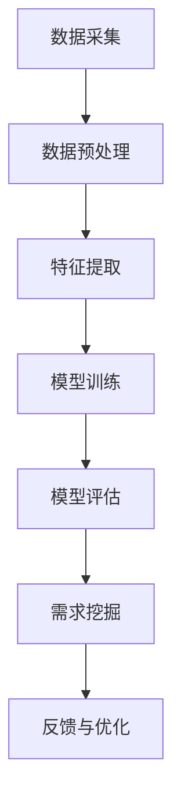

                 

### 文章标题：AI辅助软件需求挖掘：从隐式到显式

> 关键词：AI辅助、软件需求挖掘、隐式需求、显式需求、自然语言处理、数据挖掘、机器学习

> 摘要：本文旨在探讨AI辅助软件需求挖掘的方法和策略，从隐式需求到显式需求的转变，详细解析AI技术在需求挖掘中的应用，以及其在企业实践中的成功案例。文章分为四个部分，首先介绍AI辅助软件需求挖掘的背景和重要性，接着分析需求挖掘的演变和挑战，然后深入探讨AI辅助需求挖掘的核心概念与架构，最后展望其未来发展趋势和伦理影响。

### 第一部分：背景与概述

#### 1.1 软件需求挖掘的定义与挑战

软件需求挖掘（Software Requirements Mining）是指从用户、市场、技术等多个维度收集、分析并理解用户需求的过程。在软件开发过程中，准确的需求挖掘是确保项目成功的关键。

- **定义**：软件需求挖掘是将用户需求从非结构化或部分结构化的数据源中提取出来，形成结构化的需求规格说明书的过程。

- **挑战**：

  - **需求变更频繁**：用户需求往往是不稳定的，随着项目的进行可能会不断变更。

  - **非结构化数据**：大部分用户需求存在于文档、聊天记录、电子邮件等非结构化数据中，提取和处理这些数据是一项挑战。

  - **资源限制**：传统需求挖掘依赖于人工分析，需要大量的时间和人力资源。

#### 1.2 AI技术在软件需求挖掘中的应用

AI技术的迅速发展，为软件需求挖掘提供了新的途径。以下几种AI技术被广泛应用于需求挖掘：

- **机器学习**：通过训练模型，从大量数据中自动发现规律和模式，从而提取用户需求。

- **自然语言处理（NLP）**：用于处理和分析文本数据，提取用户意图和需求。

- **数据挖掘**：通过统计分析，发现用户需求背后的趋势和关系。

#### 1.3 AI辅助软件需求挖掘的价值与未来趋势

- **价值**：

  - 提高需求挖掘的效率和质量。

  - 降低成本，减少人力依赖。

  - 更好地理解和满足用户需求。

- **未来趋势**：

  - AI技术将更加智能化、自动化，需求挖掘将更加精准。

  - 需求挖掘工具将更加多样化，支持不同类型的数据源。

### 第二部分：从隐式到显式：需求挖掘的演变

#### 2.1 隐式需求与显式需求的区别

- **隐式需求**：用户没有明确表达的需求，通常需要通过数据分析、行为观察等方式挖掘。

- **显式需求**：用户明确表达的需求，通常通过问卷、访谈等方式获取。

#### 2.2 隐式需求挖掘的挑战

- **数据质量**：依赖大量高质量的数据，数据收集困难。

- **算法复杂性**：需要设计复杂的算法来处理大量的非结构化数据。

#### 2.3 显式需求挖掘的方法与工具

- **问卷调查**：通过设计问卷，收集用户需求。

- **访谈法**：与用户进行深入访谈，获取详细需求。

- **需求建模工具**：如用户故事地图、用例图等，帮助整理和表达需求。

### 第三部分：AI辅助需求挖掘的技术基础

#### 3.1 数据采集与预处理

- **数据源**：用户行为数据、用户反馈、市场报告等。

- **预处理**：数据清洗、数据转换、数据归一化等。

#### 3.2 特征工程

- **特征提取**：从原始数据中提取出有助于需求挖掘的特征。

- **特征选择**：选择对需求挖掘最有用的特征。

#### 3.3 机器学习模型的选择与应用

- **分类模型**：用于识别文本数据中的需求类别。

- **聚类模型**：用于发现文本数据中的潜在需求。

- **预测模型**：用于预测未来的需求趋势。

#### 3.4 AI辅助需求挖掘的流程与框架

- **需求采集**：通过问卷调查、用户反馈等方式收集需求。

- **需求预处理**：对采集到的需求进行清洗、转换和归一化。

- **特征提取与选择**：提取和选择有助于需求挖掘的特征。

- **模型训练与评估**：训练机器学习模型，并对模型进行评估和优化。

- **需求预测与挖掘**：利用训练好的模型进行需求预测和挖掘。

### 第四部分：AI辅助需求挖掘的实践应用

#### 4.1 企业软件需求挖掘的挑战与解决方案

- **挑战**：需求变更频繁、数据质量不佳、人工分析效率低下。

- **解决方案**：采用AI技术辅助需求挖掘，提高效率和质量。

#### 4.2 AI辅助需求挖掘在不同行业中的应用案例

- **金融行业**：通过AI技术分析用户交易数据，挖掘潜在需求。

- **医疗行业**：通过AI技术分析病历和患者反馈，提高诊断和治疗方案的质量。

- **教育行业**：通过AI技术分析学生学习数据，提供个性化的学习方案。

#### 4.3 企业AI辅助需求挖掘的最佳实践

- **数据驱动**：以数据为核心，充分利用用户行为数据和反馈。

- **持续迭代**：不断收集用户反馈，优化需求挖掘模型。

- **跨部门协作**：建立跨部门的需求挖掘团队，协同工作。

### 第五部分：项目实战：AI辅助需求挖掘的实际操作

#### 5.1 项目背景与目标

- **背景**：某电商公司希望通过AI技术分析用户行为，挖掘潜在需求。

- **目标**：提高用户满意度，增加销售额。

#### 5.2 数据收集与处理

- **数据源**：用户浏览记录、购买记录、用户评价等。

- **预处理**：数据清洗、数据转换、数据归一化等。

#### 5.3 模型选择与训练

- **模型**：采用深度学习模型，如卷积神经网络（CNN）。

- **训练**：使用处理后的数据训练模型。

#### 5.4 模型评估与优化

- **评估**：使用验证集评估模型性能。

- **优化**：调整模型参数，优化模型性能。

#### 5.5 项目总结与反思

- **总结**：AI技术有效提高了需求挖掘的效率和准确性。

- **反思**：需要持续优化模型，以适应不断变化的市场需求。

### 第六部分：AI辅助需求挖掘的未来展望

#### 6.1 技术挑战

- **数据隐私**：如何保护用户隐私成为一大挑战。

- **算法公平性**：避免算法偏见，确保公平性。

#### 6.2 应用挑战

- **行业特定需求**：不同行业的需求挖掘具有独特性。

- **用户体验**：如何提高用户的参与度和满意度。

#### 6.3 未来发展方向

- **智能化**：随着AI技术的进步，需求挖掘将更加智能化。

- **跨领域应用**：AI需求挖掘将在更多行业和领域得到应用。

### 第七部分：AI辅助需求挖掘的伦理与社会影响

#### 7.1 伦理问题

- **用户隐私**：如何保护用户的隐私权。

- **算法偏见**：如何避免算法偏见，确保公平性。

#### 7.2 社会影响

- **就业影响**：AI技术是否会替代人工需求挖掘。

- **社会信任**：如何建立用户对AI技术的信任。

#### 7.3 道德责任与对策

- **企业责任**：企业应如何履行道德责任。

- **政策法规**：政府应如何制定相关政策和法规。

### 附录：AI辅助需求挖掘工具与资源

#### 附录 A：常用的AI需求挖掘工具

- **自然语言处理工具**：如NLTK、spaCy、Stanford NLP等。

- **数据挖掘与分析工具**：如RapidMiner、Orange、DataRobot等。

- **开源库与框架**：如TensorFlow、PyTorch、Scikit-learn等。

#### 附录 B：参考文献与进一步阅读

- **基础教材与论文**：

  - **《人工智能：一种现代的方法》**（Russell & Norvig）

  - **《深度学习》**（Goodfellow、Bengio & Courville）

- **案例研究与应用文章**：

  - **《AI在金融行业的应用》**（Journal of Business Research）

  - **《医疗领域的AI应用》**（Journal of Medical Internet Research）

- **最新进展与未来趋势研究**：

  - **《人工智能的未来》**（Kevin Kelly）

  - **《AI时代的社会变革》**（Shoshana Zuboff）

### 附录 C：AI辅助需求挖掘的技术架构图

### 作者信息

作者：AI天才研究院/AI Genius Institute & 禅与计算机程序设计艺术 /Zen And The Art of Computer Programming

### 结束语

AI辅助软件需求挖掘正在逐步改变传统的软件开发模式，提高需求挖掘的效率和准确性。随着技术的不断进步，AI辅助需求挖掘将在更多行业和领域得到应用，成为推动产业发展的重要力量。同时，我们也需要关注其伦理和社会影响，确保其在可持续发展中发挥积极作用。在未来的发展中，AI辅助需求挖掘将更加智能化、自动化，为用户提供更加个性化的服务。

