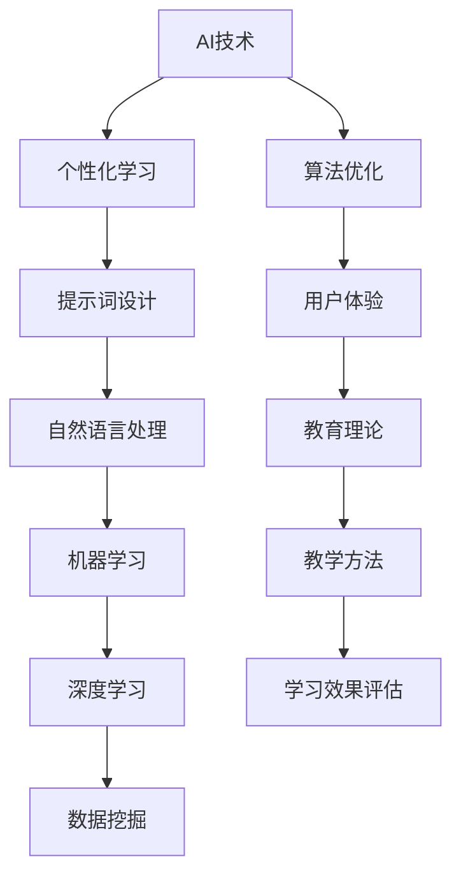

                 


### 《AI驱动的个性化学习中的提示词设计》

关键词：AI、个性化学习、提示词设计、自然语言处理、机器学习、深度学习、数据挖掘

摘要：本文旨在探讨AI驱动的个性化学习中的提示词设计，从AI与个性化学习基础、提示词设计原理、个性化学习场景下的提示词设计、提示词设计实践与优化等四个方面，详细阐述了提示词设计在AI驱动的个性化学习中的重要性、原理、方法和技术手段。文章通过流程图、伪代码、数学公式和实例分析，为读者提供了全面的指导。

### 目录大纲

1. **文章标题**  
2. **关键词**  
3. **摘要**  
4. **目录大纲**  
5. **第一部分：AI与个性化学习基础**  
   6. **第1章：AI与个性化学习的概述**  
      7. 1.1 AI技术在教育领域的应用  
      8. 1.2 个性化学习的理念与实践  
      9. 1.3 提示词设计的重要性与作用  
   10. **第2章：AI基础知识**  
      11. 2.1 机器学习与深度学习基础  
      12. 2.2 自然语言处理技术  
      13. 2.3 数据分析基础  
   14. **第二部分：提示词设计原理**  
      15. **第3章：提示词设计的原则与方法**  
      16. **第4章：提示词设计的技术手段**  
   17. **第三部分：个性化学习场景下的提示词设计**  
      18. **第5章：K-12教育中的提示词设计**  
      19. **第6章：高等教育与职业培训中的提示词设计**  
      20. **第7章：在线教育平台中的提示词设计**  
   21. **第四部分：提示词设计实践与优化**  
      22. **第8章：提示词设计的实践案例**  
      23. **第9章：提示词设计中的挑战与未来方向**  
   24. **附录**  
      25. **附录A：提示词设计工具与资源**

### 核心概念与联系

下面是AI驱动的个性化学习中的提示词设计相关的核心概念和它们之间的联系，通过Mermaid流程图展示：



### 核心算法原理讲解

#### 2.1.1 提示词生成算法

提示词生成是AI驱动的个性化学习中的关键步骤。下面使用伪代码详细阐述一种基于Transformer的提示词生成算法：

```python
// 输入：学习目标，用户偏好
// 输出：生成提示词序列

function generatePrompt(goal, preferences):
    1. 初始化模型参数
    2. 加载预训练的Transformer模型
    3. 构建输入序列：
        input_sequence = "学习目标： " + goal + "，用户偏好： " + preferences
    4. 将输入序列编码为嵌入向量
    5. 通过Transformer模型进行前向传递
    6. 获取生成的提示词序列
    7. 对生成的序列进行后处理，去除冗余信息
    8. 返回提示词序列

// 调用示例
generated_prompt = generatePrompt("学习英语语法", "喜欢互动式学习")
```

#### 2.1.2 损失函数

提示词生成过程中，常用的损失函数是交叉熵损失（Cross-Entropy Loss）。其数学公式如下：

$$
Loss = -\sum_{i=1}^{N} y_i \log(p_i)
$$

其中，$y_i$ 是第 $i$ 个单词的标签（0或1），$p_i$ 是模型预测的第 $i$ 个单词的概率。

#### 2.1.3 模型优化

在训练过程中，我们使用梯度下降（Gradient Descent）算法来优化模型参数。其数学公式为：

$$
\theta_{\text{new}} = \theta_{\text{old}} - \alpha \cdot \nabla_{\theta} Loss
$$

其中，$\theta_{\text{old}}$ 是旧的模型参数，$\theta_{\text{new}}$ 是新的模型参数，$\alpha$ 是学习率，$\nabla_{\theta} Loss$ 是损失函数对模型参数的梯度。

### 第一部分：AI与个性化学习基础

#### 第1章：AI与个性化学习的概述

##### 1.1 AI技术在教育领域的应用

人工智能在教育领域的应用主要包括个性化学习、智能评测、教育资源优化等。个性化学习通过分析学生的学习行为和知识水平，为学生提供个性化的学习方案，从而提高学习效果。智能评测利用人工智能技术对学生的知识掌握情况进行实时评估，为学生提供针对性的反馈。教育资源优化则通过对教育资源的智能分配和管理，提高教育资源的利用效率。

##### 1.2 个性化学习的理念与实践

个性化学习是一种以学生为中心的教育理念，旨在满足学生的个性化需求，提高学生的学习效果。个性化学习的实践主要包括以下方面：

1. **学习需求分析**：通过对学生的学习行为、知识水平、兴趣爱好等进行分析，了解学生的学习需求。
2. **学习方案设计**：根据学生的学习需求，设计个性化的学习方案，包括学习内容、学习方法、学习资源等。
3. **学习过程监控**：实时监控学生的学习过程，了解学生的学习状态，及时调整学习方案。
4. **学习效果评估**：对学生的学习效果进行评估，以检验个性化学习的有效性。

##### 1.3 提示词设计的重要性与作用

提示词设计在AI驱动的个性化学习中起着重要作用。提示词是指用于引导学生学习的一系列关键词或短语，通过设计合适的提示词，可以更好地激发学生的学习兴趣，提高学习效果。具体来说，提示词设计的作用包括：

1. **引导学习**：提示词可以帮助学生明确学习目标，引导学生有针对性地进行学习。
2. **激发兴趣**：设计有趣的提示词可以激发学生的学习兴趣，提高学习积极性。
3. **辅助理解**：提示词可以作为学生理解学习内容的重要线索，帮助学生更好地掌握知识。
4. **反馈与评估**：提示词设计还可以作为学生学习效果评估的重要依据，帮助教师了解学生的学习状况。

### 第二部分：AI基础知识

#### 第2章：AI基础知识

##### 2.1 机器学习与深度学习基础

机器学习是人工智能的核心技术之一，它通过构建模型，从数据中自动发现规律和模式。深度学习是机器学习的一个子领域，它使用多层神经网络对数据进行建模和分析。

##### 2.2 自然语言处理技术

自然语言处理（NLP）是人工智能的重要分支，它研究如何让计算机理解和处理自然语言。NLP技术包括文本分析、语义分析、语言生成等。

##### 2.3 数据分析基础

数据分析是AI应用的重要环节，它通过统计方法和数据分析技术，从大量数据中提取有价值的信息。数据分析基础包括数据预处理、数据可视化、统计分析等方法。

### 第二部分：提示词设计原理

#### 第3章：提示词设计的原则与方法

##### 3.1 提示词设计的核心要素

提示词设计的核心要素包括：

1. **明确性**：提示词应明确具体，避免模糊不清。
2. **相关性**：提示词应与学生学习的知识内容紧密相关。
3. **引导性**：提示词应具有引导性，引导学生深入思考和探索。
4. **趣味性**：提示词应有趣味性，激发学生的学习兴趣。

##### 3.2 提示词设计的步骤与流程

提示词设计的步骤与流程包括：

1. **需求分析**：分析学生的学习需求，确定提示词设计的目标。
2. **内容设计**：根据需求分析，设计具体的提示词内容。
3. **形式设计**：确定提示词的形式，如文字、图片、音频等。
4. **测试与优化**：对设计的提示词进行测试，收集反馈并进行优化。

##### 3.3 提示词设计的常见问题与解决方案

提示词设计常见的问题包括：

1. **过于复杂**：解决方案：简化提示词，使其更加通俗易懂。
2. **缺乏引导性**：解决方案：增加引导性语句，引导学生深入思考。
3. **趣味性不足**：解决方案：增加趣味性元素，如故事、游戏等。

### 第4章：提示词设计的技术手段

##### 4.1 自然语言生成技术

自然语言生成技术（NLG）是提示词设计的重要技术手段。NLG技术通过模型生成自然语言文本，可以自动生成高质量的提示词。

##### 4.2 提示词的情感与语气

提示词的情感与语气对学生的学习效果有很大影响。设计提示词时，应注意调整其情感和语气，使其更加亲切、友好。

##### 4.3 提示词的个性化调整

个性化调整是提升提示词效果的重要手段。通过分析学生的学习数据和偏好，可以设计出更加个性化的提示词。

### 第三部分：个性化学习场景下的提示词设计

#### 第5章：K-12教育中的提示词设计

##### 5.1 K-12教育中的个性化学习需求

K-12教育阶段的个性化学习需求包括：

1. **学科知识掌握**：学生需要掌握各学科的基本知识。
2. **学习方法培养**：学生需要掌握有效的学习方法。
3. **兴趣激发**：学生需要培养对学科的兴趣。

##### 5.2 不同年级的提示词设计策略

不同年级的提示词设计策略如下：

1. **小学阶段**：以趣味性和互动性为主，引导学生主动学习。
2. **初中阶段**：增加引导性和挑战性，激发学生的思考和探究欲望。
3. **高中阶段**：注重知识点的深入理解和应用，提高学生的分析能力和解题能力。

##### 5.3 实际案例与应用

以某在线教育平台为例，该平台针对K-12教育阶段的学生设计了以下提示词：

1. **小学阶段**：“小侦探，发现数学的奥秘！”
2. **初中阶段**：“挑战数学难题，成为数学大师！”
3. **高中阶段**：“掌握核心知识点，备战高考！”

这些提示词通过趣味性和引导性，有效激发了学生的学习兴趣，提高了学习效果。

### 第6章：高等教育与职业培训中的提示词设计

##### 6.1 高等教育与职业培训中的个性化学习特点

高等教育与职业培训中的个性化学习特点包括：

1. **学习目标明确**：学生有明确的学习目标，如掌握专业知识、提高职业技能等。
2. **学习需求多样化**：学生的需求多样化，包括理论学习、实践操作、技能提升等。
3. **学习方式灵活**：学生可以选择线上学习、线下学习、自主学习、合作学习等。

##### 6.2 提示词设计在专业课程中的应用

提示词设计在专业课程中的应用包括：

1. **知识点讲解**：“掌握这个知识点，为你的专业学习打下基础！”
2. **实践操作**：“动手实践，提升你的专业技能！”
3. **案例分析**：“通过案例学习，深入理解专业理论！”

##### 6.3 实际案例与应用

以某高校的计算机专业课程为例，该课程针对不同年级的学生设计了以下提示词：

1. **一年级**：“探索计算机科学的奇妙世界！”
2. **二年级**：“深入学习计算机基础知识，为编程能力打下基础！”
3. **三年级**：“实践编程项目，提升你的编程技能！”

这些提示词通过引导性和趣味性，激发了学生的学习兴趣，提高了学习效果。

### 第7章：在线教育平台中的提示词设计

##### 7.1 在线教育平台的发展与现状

在线教育平台的发展与现状如下：

1. **市场规模**：在线教育市场规模逐年扩大，用户数量不断增加。
2. **技术进步**：在线教育平台不断引入新技术，提高教学效果和用户体验。
3. **用户需求**：用户对在线教育平台的需求不断提高，特别是个性化学习和互动性学习。

##### 7.2 提示词设计在平台中的功能与应用

提示词设计在在线教育平台中的功能与应用包括：

1. **课程推荐**：“推荐符合你兴趣和需求的课程！”
2. **学习进度提醒**：“你的学习进度已超过80%，继续加油！”
3. **学习任务提醒**：“完成今天的任务，迎接新的挑战！”

##### 7.3 实际案例与应用

以某知名在线教育平台为例，该平台针对用户设计了以下提示词：

1. **新用户欢迎**：“欢迎来到我们的在线教育平台，让我们一起开启学习之旅！”
2. **课程推荐**：“推荐你喜欢的课程，快来学习吧！”
3. **学习进度提醒**：“你已经完成了50%的课程，加油，继续前进！”

这些提示词通过引导性和趣味性，吸引了用户参与学习，提高了学习效果。

### 第四部分：提示词设计实践与优化

#### 第8章：提示词设计的实践案例

##### 8.1 提示词设计在不同领域的实际应用

提示词设计在不同领域的实际应用如下：

1. **教育领域**：用于个性化学习、知识点讲解、学习任务提醒等。
2. **医疗领域**：用于病情诊断、健康指导、药物说明等。
3. **金融领域**：用于投资建议、理财产品推荐、风险提示等。

##### 8.2 提示词设计的优化策略

提示词设计的优化策略包括：

1. **用户反馈**：收集用户对提示词的反馈，了解用户需求和偏好。
2. **数据分析**：通过数据分析，优化提示词的生成和调整策略。
3. **模型优化**：使用更先进的算法和模型，提高提示词的质量。

##### 8.3 实际案例与分析

以某在线教育平台为例，该平台通过以下策略优化提示词设计：

1. **用户反馈**：定期收集用户对提示词的反馈，并根据反馈调整提示词。
2. **数据分析**：分析用户的学习行为和偏好，优化提示词的生成和推送策略。
3. **模型优化**：引入更先进的自然语言生成模型，提高提示词的自然性和准确性。

这些优化策略有效提高了提示词的设计质量，提高了用户的学习效果。

### 第9章：提示词设计中的挑战与未来方向

##### 9.1 提示词设计中的常见挑战

提示词设计中的常见挑战包括：

1. **个性化需求满足**：如何满足不同用户的个性化需求。
2. **数据隐私保护**：如何保护用户的隐私数据。
3. **模型可靠性**：如何保证模型的稳定性和可靠性。

##### 9.2 提示词设计的未来发展趋势

提示词设计的未来发展趋势包括：

1. **个性化与智能化**：进一步满足用户的个性化需求，提高提示词的智能化水平。
2. **跨领域应用**：拓展提示词设计在不同领域的应用。
3. **隐私保护与合规**：加强数据隐私保护和合规性。

##### 9.3 未来技术的可能影响与应对策略

未来技术的发展可能对提示词设计产生以下影响：

1. **大数据与人工智能**：大数据和人工智能技术的进步将提高提示词生成的质量和效率。
2. **区块链**：区块链技术可能为数据隐私保护提供新的解决方案。

应对策略包括：

1. **技术更新**：持续跟进新技术，提高提示词设计的技术水平。
2. **合规性管理**：加强数据隐私保护和合规性管理，确保提示词设计的合法性和安全性。

### 附录

#### 附录A：提示词设计工具与资源

以下是一些常用的提示词设计工具与资源：

1. **工具**：
   - OpenAI GPT-3：一款强大的自然语言生成工具。
   - Dialogflow：一款对话设计工具，可用于生成聊天机器人。
   - ChatGLM：一款基于GLM模型的语言生成工具。

2. **开源库与框架**：
   - Hugging Face Transformers：一款流行的Transformer模型开源库。
   - NLTK：一款自然语言处理工具包。
   - spaCy：一款高效的自然语言处理库。

3. **研究论文与报告**：
   - "A Neural Conversational Model"：介绍GPT-3模型的论文。
   - "Improving Language Understanding by Generative Pre-Training"：介绍GPT模型的论文。
   - "Natural Language Processing with Deep Learning"：介绍深度学习在自然语言处理中的应用的书籍。

作者：AI天才研究院/AI Genius Institute & 禅与计算机程序设计艺术 /Zen And The Art of Computer Programming

