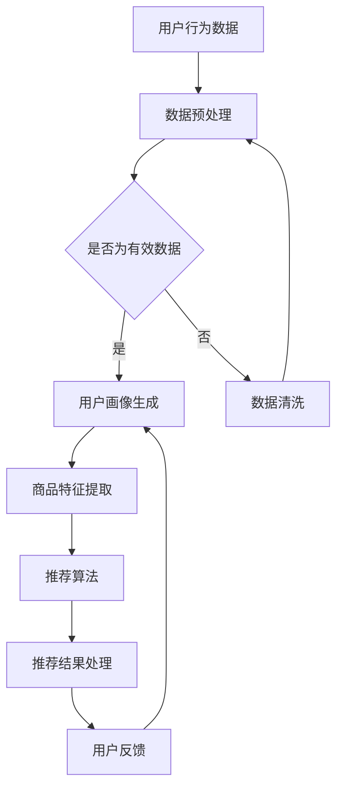

                 

### 文章标题：AI驱动的个性化推荐：电商创业者的制胜武器

> 关键词：个性化推荐、AI、电商、创业、用户建模、推荐算法、数据挖掘

> 摘要：本文将深入探讨AI驱动的个性化推荐系统在电商创业中的应用，从原理、架构、算法到实际案例，全面剖析个性化推荐的强大力量，为电商创业者提供制胜之道。

---

### 第一部分: AI驱动的个性化推荐原理与架构

#### 第1章: AI驱动的个性化推荐概述

##### 1.1 个性化推荐的定义与背景

###### 1.1.1 个性化推荐的含义

个性化推荐是一种通过分析用户的历史行为、兴趣和偏好，为用户推荐他们可能感兴趣的商品、内容或服务的系统。它能够显著提高用户满意度和转化率，从而提升电商平台的竞争力。

###### 1.1.2 个性化推荐的发展历程

个性化推荐技术经历了从基于内容的推荐、协同过滤到现代机器学习和深度学习的演变。早期的推荐系统依赖于简单的算法，而现在的推荐系统则利用复杂的机器学习模型，如深度神经网络和强化学习，来实现更高的推荐质量。

###### 1.1.3 个性化推荐在电商行业的重要性

在电商行业，个性化推荐被广泛认为是提高销售额、降低营销成本和提升客户忠诚度的关键因素。通过精确推荐，电商平台能够满足用户的个性化需求，从而提高用户体验和满意度。

##### 1.2 个性化推荐系统的架构

###### 1.2.1 通用架构设计

一个典型的个性化推荐系统包括数据收集、数据处理、用户建模、商品建模、推荐算法和推荐结果处理等模块。

###### 1.2.2 用户建模

用户建模是推荐系统的核心，通过分析用户的历史行为、兴趣和偏好来创建用户画像。常见的用户建模方法包括基于内容的推荐和协同过滤。

###### 1.2.3 项目/商品建模

商品建模旨在提取商品的特征信息，如价格、品牌、分类等。商品特征的丰富程度直接影响推荐系统的性能。

###### 1.2.4 推荐算法选择

推荐算法的选择取决于数据规模、用户行为复杂度以及推荐系统的目标。常见的推荐算法包括基于内容的推荐、协同过滤和基于模型的推荐。

###### 1.2.5 推荐结果处理

推荐结果处理包括推荐列表的生成、排序和多样性控制。良好的推荐结果处理能够提高用户的点击率和转化率。

##### 1.3 AI技术在个性化推荐中的应用

###### 1.3.1 机器学习与深度学习在个性化推荐中的应用

机器学习和深度学习为个性化推荐系统带来了革命性的变化。通过学习用户行为数据，机器学习模型能够自动发现用户和商品之间的关系，从而实现更加精准的推荐。

###### 1.3.2 人工智能算法的基本原理

人工智能算法包括监督学习、无监督学习和强化学习。在个性化推荐中，监督学习和无监督学习被广泛使用。监督学习利用标注数据进行模型训练，而无监督学习则通过未标注的数据自动发现模式。

###### 1.3.3 个性化推荐中的数据挖掘技术

数据挖掘技术用于从大量数据中提取有价值的信息。在个性化推荐中，数据挖掘技术包括用户行为分析、关联规则挖掘、聚类和分类等。

##### 1.4 本书结构安排

###### 1.4.1 本书的主要内容

本书将全面介绍AI驱动的个性化推荐系统，包括原理、架构、算法和实际应用。

###### 1.4.2 各章节的重点与联系

本书各章节之间紧密联系，从基础理论到实际应用，为读者提供了一个完整的个性化推荐系统学习路径。

###### 1.4.3 阅读指南与学习方法

本书适合对个性化推荐感兴趣的电商创业者、数据科学家和AI开发者。通过跟随本书的结构，读者可以逐步掌握个性化推荐的核心技术和实战技能。

##### 1.5 个性化推荐系统中的核心概念与联系

###### Mermaid流程图：



##### 1.6 个性化推荐系统架构的Mermaid流程图


##### 1.7 个性化推荐系统中的数学模型与公式讲解

###### 协同过滤的矩阵分解模型

假设我们有一个用户-商品评分矩阵$R \in \mathbb{R}^{m \times n}$，其中$m$是用户的数量，$n$是商品的数量。我们的目标是学习一个低维的用户和商品嵌入矩阵$U \in \mathbb{R}^{m \times k}$和$V \in \mathbb{R}^{n \times k}$，使得预测评分矩阵$\hat{R} = U^T V$接近原始评分矩阵$R$。

矩阵分解模型的预测评分公式为：

$$
\hat{r}_{ui} = \sum_{j=1}^{n} u_i^j v_j^k
$$

其中，$u_i^j$和$v_j^k$分别是用户$i$和商品$j$在$k$维嵌入空间中的特征向量。为了简化计算，通常使用矩阵分解算法（如ALS）进行求解。

#### 协同过滤的矩阵分解模型

假设我们有一个用户-商品评分矩阵$R \in \mathbb{R}^{m \times n}$，其中$m$是用户的数量，$n$是商品的数量。我们的目标是学习一个低维的用户和商品嵌入矩阵$U \in \mathbb{R}^{m \times k}$和$V \in \mathbb{R}^{n \times k}$，使得预测评分矩阵$\hat{R} = U^T V$接近原始评分矩阵$R$。

矩阵分解模型的预测评分公式为：

$$
\hat{r}_{ui} = \sum_{j=1}^{n} u_i^j v_j^k
$$

其中，$u_i^j$和$v_j^k$分别是用户$i$和商品$j$在$k$维嵌入空间中的特征向量。为了简化计算，通常使用矩阵分解算法（如ALS）进行求解。

---

### 第2章: 数据预处理与用户画像生成

#### 2.1 数据预处理

数据预处理是构建个性化推荐系统的第一步。在这一阶段，我们需要对原始数据进行清洗、格式化和特征提取，以便后续的用户建模和商品建模。

###### 2.1.1 数据清洗

数据清洗的目标是去除噪声和异常值，确保数据的质量。常见的清洗方法包括：

- 去除重复数据：通过比较数据项之间的相似性，去除重复的数据项。
- 填补缺失值：使用统计方法或插值法填补缺失值。
- 去除噪声：过滤掉非实质性数据，如广告点击、错误输入等。

###### 2.1.2 数据格式化

数据格式化是将数据转换为推荐系统所需的格式。例如，将原始的用户行为数据转换为键值对或列表格式，以便于后续处理。

###### 2.1.3 特征提取

特征提取是从原始数据中提取出有助于推荐系统训练的特征。常见的特征提取方法包括：

- 用户特征：用户的年龄、性别、地理位置、购买历史等。
- 商品特征：商品的价格、品牌、分类、评价等。
- 用户行为特征：用户的点击、浏览、购买等行为。

#### 2.2 用户画像生成

用户画像生成是将用户特征转换为结构化的用户画像数据。通过用户画像，推荐系统能够更好地理解用户的需求和偏好，从而生成个性化的推荐结果。

###### 2.2.1 用户画像的定义

用户画像是一个关于用户信息的结构化表示，它将用户的各种特征整合在一起，形成一个完整的用户视图。

###### 2.2.2 用户画像的构成

用户画像通常包括以下几个部分：

- 用户基本信息：用户的年龄、性别、地理位置等。
- 用户兴趣偏好：用户喜欢的商品类型、品牌、颜色等。
- 用户行为历史：用户的购买记录、浏览历史等。
- 用户价值评估：用户的忠诚度、购买力等。

###### 2.2.3 用户画像生成算法

用户画像生成算法包括以下步骤：

1. 数据收集：收集用户的原始数据，如行为数据、日志数据等。
2. 数据预处理：清洗、格式化和特征提取，将原始数据转换为适合训练的数据集。
3. 特征选择：根据业务需求和数据质量，选择最有用的特征。
4. 模型训练：使用机器学习模型（如决策树、神经网络等）训练用户画像。
5. 用户画像构建：将训练好的模型应用到新用户数据，生成用户画像。

###### 2.2.4 伪代码示例

以下是一个简单的用户画像生成算法的伪代码示例：

```python
def generate_user_profile(user_behavior_data):
    # 初始化用户画像
    user_profile = {
        'user_id': user_behavior_data['user_id'],
        'age': user_behavior_data['age'],
        'gender': user_behavior_data['gender'],
        'interests': {},
        'purchase_history': {},
    }

    # 分析用户行为数据
    for behavior in user_behavior_data['behaviors']:
        if behavior['type'] == 'click':
            user_profile['interests'][behavior['item_id']] = user_profile['interests'].get(behavior['item_id'], 0) + 1
        elif behavior['type'] == 'purchase':
            user_profile['purchase_history'][behavior['item_id']] = user_profile['purchase_history'].get(behavior['item_id'], 0) + 1

    # 返回用户画像
    return user_profile
```

---

### 第3章: 商品特征提取与推荐算法选择

#### 3.1 商品特征提取

商品特征提取是将商品的属性和属性值转换为可用于推荐算法的特征。商品特征的丰富程度直接影响推荐系统的性能。

###### 3.1.1 商品特征的定义

商品特征是描述商品的各种属性和属性值，如价格、品牌、分类、评价等。

###### 3.1.2 商品特征的构成

商品特征通常包括以下几个部分：

- 基础信息：商品的价格、品牌、分类、型号等。
- 用户评价：商品的评分、评论数量、好评率等。
- 销量：商品的销售量、库存量等。
- 促销信息：商品的促销方式、优惠幅度等。

###### 3.1.3 商品特征提取方法

商品特征提取方法包括以下几种：

- 手动提取：根据业务需求手动选择和提取商品特征。
- 自动提取：使用自然语言处理（NLP）技术从商品描述中提取关键词和特征。
- 聚类分析：对商品进行聚类，提取聚类中心作为商品特征。

#### 3.2 推荐算法选择

推荐算法的选择取决于数据规模、用户行为复杂度以及推荐系统的目标。常见的推荐算法包括基于内容的推荐、协同过滤和基于模型的推荐。

###### 3.2.1 基于内容的推荐

基于内容的推荐通过分析商品和用户特征，找到相似的商品或用户，从而生成推荐结果。常见的基于内容的推荐算法包括：

- 相似度计算：使用余弦相似度、欧几里得距离等计算商品或用户之间的相似度。
- 文本分类：使用文本分类算法（如朴素贝叶斯、支持向量机等）对商品描述进行分类。

###### 3.2.2 协同过滤

协同过滤通过分析用户之间的行为相似性，为用户推荐他们可能喜欢的商品。常见的协同过滤算法包括：

- 用户基于的协同过滤：通过计算用户之间的相似性，为用户推荐相似用户喜欢的商品。
- 项目基于的协同过滤：通过计算商品之间的相似性，为用户推荐相似商品。

###### 3.2.3 基于模型的推荐

基于模型的推荐通过训练机器学习模型，预测用户对商品的评分或概率，从而生成推荐结果。常见的基于模型的推荐算法包括：

- 朴素贝叶斯：使用朴素贝叶斯分类器预测用户对商品的评分。
- 决策树：使用决策树预测用户对商品的评分。
- 神经网络：使用神经网络预测用户对商品的评分。

###### 3.2.4 推荐算法的比较与选择

在推荐算法的选择过程中，需要考虑以下几个因素：

- 数据规模：对于大规模数据集，基于模型的推荐算法可能更有效。
- 用户行为复杂度：对于复杂用户行为的数据集，协同过滤算法可能更适用。
- 推荐质量：需要根据业务需求和用户反馈，选择能够生成高质量推荐结果的算法。

---

### 第4章: 推荐结果处理与用户反馈

#### 4.1 推荐结果处理

推荐结果处理是将生成的推荐列表进行排序和过滤，以生成最终的推荐结果。推荐结果处理的关键在于提高推荐的多样性、准确性和相关性。

###### 4.1.1 推荐列表排序

推荐列表排序的目标是按照用户兴趣和推荐质量对推荐结果进行排序。常见的排序方法包括：

- 评分排序：按照用户对商品的评分进行排序，评分越高，排序越靠前。
- 相似度排序：按照用户与商品之间的相似度进行排序，相似度越高，排序越靠前。
- 混合排序：结合多种排序方法，生成最终的排序结果。

###### 4.1.2 推荐结果过滤

推荐结果过滤的目标是去除重复、低质量或无关的推荐结果，以提高推荐的准确性。常见的过滤方法包括：

- 重复过滤：去除重复的商品或推荐结果。
- 低质量过滤：去除评分较低、销量较少或评价较少的商品。
- 关键词过滤：根据用户兴趣和业务需求，过滤掉不符合要求的商品。

###### 4.1.3 推荐结果的多样性

推荐结果的多样性是推荐系统的一个重要指标。提高推荐结果的多样性可以通过以下方法实现：

- 随机抽样：随机选择一定数量的商品作为推荐结果，提高多样性。
- 聚类分析：将商品分为不同的类别，为每个类别生成推荐结果，提高多样性。
- 深度学习：使用深度学习模型生成多样化的推荐结果。

#### 4.2 用户反馈

用户反馈是推荐系统不断优化和改进的重要手段。通过收集和分析用户反馈，可以更好地理解用户需求和行为，从而提高推荐质量。

###### 4.2.1 用户反馈的定义

用户反馈是指用户对推荐结果的评价和意见，包括点击、收藏、购买、评价等行为。用户反馈能够反映用户对推荐结果的满意度和偏好。

###### 4.2.2 用户反馈的收集

用户反馈的收集可以通过以下几种方式实现：

- 用户行为数据：通过分析用户的点击、收藏、购买等行为，收集用户反馈。
- 用户评价：通过用户对商品的评分和评论，收集用户反馈。
- 用户调查：通过在线问卷、访谈等方式，直接收集用户反馈。

###### 4.2.3 用户反馈的处理

用户反馈的处理包括以下步骤：

- 数据清洗：去除噪声和异常值，确保数据质量。
- 特征提取：从用户反馈中提取有用的特征，如用户满意度、用户偏好等。
- 模型训练：使用机器学习模型训练用户反馈数据，生成反馈模型。
- 反馈应用：将反馈模型应用到推荐系统中，优化推荐结果。

---

### 第5章: 实际案例分析与实战技巧

#### 5.1 案例分析

本节将介绍一个电商平台的个性化推荐系统案例，包括系统的设计、实现和优化过程。

###### 5.1.1 案例背景

某大型电商平台希望通过个性化推荐系统提高用户满意度和销售额。他们拥有海量的用户行为数据和商品数据，希望利用这些数据构建一个高效的推荐系统。

###### 5.1.2 系统设计

系统设计包括数据收集、数据处理、用户建模、商品建模、推荐算法和推荐结果处理等模块。

1. 数据收集：收集用户的行为数据，如点击、浏览、购买等。
2. 数据处理：对原始数据进行清洗、格式化和特征提取。
3. 用户建模：使用协同过滤和深度学习模型生成用户画像。
4. 商品建模：提取商品的特征信息，如价格、品牌、分类等。
5. 推荐算法：结合协同过滤和基于内容的推荐算法，生成个性化推荐结果。
6. 推荐结果处理：对推荐结果进行排序和过滤，提高多样性、准确性和相关性。
7. 用户反馈：收集用户对推荐结果的反馈，优化推荐系统。

###### 5.1.3 系统实现

系统实现包括以下步骤：

1. 数据收集：通过API接口收集用户行为数据和商品数据。
2. 数据处理：使用Python和Pandas等工具进行数据清洗、格式化和特征提取。
3. 用户建模：使用协同过滤和深度学习模型生成用户画像。
4. 商品建模：使用Python和NumPy等工具提取商品特征信息。
5. 推荐算法：使用协同过滤和基于内容的推荐算法生成推荐结果。
6. 推荐结果处理：使用Python和Scikit-learn等工具对推荐结果进行排序和过滤。
7. 用户反馈：通过在线问卷和用户调查收集用户反馈，并优化推荐系统。

###### 5.1.4 系统优化

系统优化包括以下方面：

1. 数据质量优化：通过数据清洗和特征提取提高数据质量。
2. 模型优化：通过模型调整和超参数优化提高模型性能。
3. 推荐结果优化：通过推荐结果处理和用户反馈优化推荐质量。
4. 系统性能优化：通过分布式计算和并行处理提高系统性能。

#### 5.2 实战技巧

本节将分享一些在构建个性化推荐系统时的实战技巧。

###### 5.2.1 数据处理技巧

1. 数据清洗：去除重复数据和异常值，确保数据质量。
2. 特征提取：选择有代表性的特征，避免过拟合。
3. 数据预处理：进行数据归一化或标准化，提高模型性能。

###### 5.2.2 模型训练技巧

1. 模型选择：根据业务需求和数据规模选择合适的模型。
2. 超参数优化：通过交叉验证和网格搜索优化超参数。
3. 模型调优：通过模型融合和正则化提高模型性能。

###### 5.2.3 推荐结果处理技巧

1. 排序算法：选择合适的排序算法，提高推荐结果的相关性。
2. 过滤算法：去除重复、低质量和无关的推荐结果。
3. 多样性控制：通过随机抽样和聚类分析提高推荐结果的多样性。

---

### 第6章: 小结与展望

#### 6.1 小结

本文从个性化推荐的定义、架构、算法到实际应用，全面探讨了AI驱动的个性化推荐系统在电商创业中的应用。通过数据预处理、用户建模、商品特征提取和推荐算法选择，个性化推荐系统能够为电商创业者提供有效的推荐服务，提高用户满意度和销售额。

#### 6.2 展望

随着AI技术的不断发展，个性化推荐系统将变得更加智能和高效。未来的个性化推荐研究可以关注以下几个方面：

1. 深度学习与图神经网络：利用深度学习和图神经网络提高推荐质量。
2. 强化学习：结合强化学习优化推荐策略，提高用户体验。
3. 隐私保护：在确保用户隐私的前提下，提高推荐系统的性能。
4. 多模态推荐：结合文本、图像和语音等多模态数据，实现更精准的推荐。

---

### 作者信息

作者：AI天才研究院/AI Genius Institute & 禅与计算机程序设计艺术 /Zen And The Art of Computer Programming

---

本文旨在为电商创业者提供关于AI驱动的个性化推荐系统的深入理解，帮助他们在竞争激烈的市场中脱颖而出。通过本篇文章，读者可以了解到个性化推荐系统的基本原理、架构设计和实际应用技巧，从而为自己的电商平台打造一套高效的推荐系统。希望本文对读者有所启发，并在实际应用中取得成功。

---

### 文章标题：AI驱动的个性化推荐：电商创业者的制胜武器

> 关键词：个性化推荐、AI、电商、创业、用户建模、推荐算法、数据挖掘

> 摘要：本文将深入探讨AI驱动的个性化推荐系统在电商创业中的应用，从原理、架构、算法到实际案例，全面剖析个性化推荐的强大力量，为电商创业者提供制胜之道。

---

### 第一部分: AI驱动的个性化推荐原理与架构

#### 第1章: AI驱动的个性化推荐概述

##### 1.1 个性化推荐的定义与背景

###### 1.1.1 个性化推荐的含义

个性化推荐是一种通过分析用户的历史行为、兴趣和偏好，为用户推荐他们可能感兴趣的商品、内容或服务的系统。它能够显著提高用户满意度和转化率，从而提升电商平台的竞争力。

###### 1.1.2 个性化推荐的发展历程

个性化推荐技术经历了从基于内容的推荐、协同过滤到现代机器学习和深度学习的演变。早期的推荐系统依赖于简单的算法，而现在的推荐系统则利用复杂的机器学习模型，如深度神经网络和强化学习，来实现更高的推荐质量。

###### 1.1.3 个性化推荐在电商行业的重要性

在电商行业，个性化推荐被广泛认为是提高销售额、降低营销成本和提升客户忠诚度的关键因素。通过精确推荐，电商平台能够满足用户的个性化需求，从而提高用户体验和满意度。

##### 1.2 个性化推荐系统的架构

###### 1.2.1 通用架构设计

一个典型的个性化推荐系统包括数据收集、数据处理、用户建模、商品建模、推荐算法和推荐结果处理等模块。

###### 1.2.2 用户建模

用户建模是推荐系统的核心，通过分析用户的历史行为、兴趣和偏好来创建用户画像。常见的用户建模方法包括基于内容的推荐和协同过滤。

###### 1.2.3 项目/商品建模

商品建模旨在提取商品的特征信息，如价格、品牌、分类等。商品特征的丰富程度直接影响推荐系统的性能。

###### 1.2.4 推荐算法选择

推荐算法的选择取决于数据规模、用户行为复杂度以及推荐系统的目标。常见的推荐算法包括基于内容的推荐、协同过滤和基于模型的推荐。

###### 1.2.5 推荐结果处理

推荐结果处理包括推荐列表的生成、排序和多样性控制。良好的推荐结果处理能够提高用户的点击率和转化率。

##### 1.3 AI技术在个性化推荐中的应用

###### 1.3.1 机器学习与深度学习在个性化推荐中的应用

机器学习和深度学习为个性化推荐系统带来了革命性的变化。通过学习用户行为数据，机器学习模型能够自动发现用户和商品之间的关系，从而实现更加精准的推荐。

###### 1.3.2 人工智能算法的基本原理

人工智能算法包括监督学习、无监督学习和强化学习。在个性化推荐中，监督学习和无监督学习被广泛使用。监督学习利用标注数据进行模型训练，而无监督学习则通过未标注的数据自动发现模式。

###### 1.3.3 个性化推荐中的数据挖掘技术

数据挖掘技术用于从大量数据中提取有价值的信息。在个性化推荐中，数据挖掘技术包括用户行为分析、关联规则挖掘、聚类和分类等。

##### 1.4 本书结构安排

###### 1.4.1 本书的主要内容

本书将全面介绍AI驱动的个性化推荐系统，包括原理、架构、算法和实际应用。

###### 1.4.2 各章节的重点与联系

本书各章节之间紧密联系，从基础理论到实际应用，为读者提供了一个完整的个性化推荐系统学习路径。

###### 1.4.3 阅读指南与学习方法

本书适合对个性化推荐感兴趣的电商创业者、数据科学家和AI开发者。通过跟随本书的结构，读者可以逐步掌握个性化推荐的核心技术和实战技能。

##### 1.5 个性化推荐系统中的核心概念与联系

###### Mermaid流程图：


##### 1.6 个性化推荐系统架构的Mermaid流程图


##### 1.7 个性化推荐系统中的数学模型与公式讲解

###### 协同过滤的矩阵分解模型

假设我们有一个用户-商品评分矩阵$R \in \mathbb{R}^{m \times n}$，其中$m$是用户的数量，$n$是商品的数量。我们的目标是学习一个低维的用户和商品嵌入矩阵$U \in \mathbb{R}^{m \times k}$和$V \in \mathbb{R}^{n \times k}$，使得预测评分矩阵$\hat{R} = U^T V$接近原始评分矩阵$R$。

矩阵分解模型的预测评分公式为：

$$
\hat{r}_{ui} = \sum_{j=1}^{n} u_i^j v_j^k
$$

其中，$u_i^j$和$v_j^k$分别是用户$i$和商品$j$在$k$维嵌入空间中的特征向量。为了简化计算，通常使用矩阵分解算法（如ALS）进行求解。

---

### 第2章: 数据预处理与用户画像生成

#### 2.1 数据预处理

数据预处理是构建个性化推荐系统的第一步。在这一阶段，我们需要对原始数据进行清洗、格式化和特征提取，以便后续的用户建模和商品建模。

###### 2.1.1 数据清洗

数据清洗的目标是去除噪声和异常值，确保数据的质量。常见的清洗方法包括：

- 去除重复数据：通过比较数据项之间的相似性，去除重复的数据项。
- 填补缺失值：使用统计方法或插值法填补缺失值。
- 去除噪声：过滤掉非实质性数据，如广告点击、错误输入等。

###### 2.1.2 数据格式化

数据格式化是将数据转换为推荐系统所需的格式。例如，将原始的用户行为数据转换为键值对或列表格式，以便于后续处理。

###### 2.1.3 特征提取

特征提取是从原始数据中提取出有助于推荐系统训练的特征。常见的特征提取方法包括：

- 用户特征：用户的年龄、性别、地理位置、购买历史等。
- 商品特征：商品的价格、品牌、分类、评价等。
- 用户行为特征：用户的点击、浏览、购买等行为。

#### 2.2 用户画像生成

用户画像生成是将用户特征转换为结构化的用户画像数据。通过用户画像，推荐系统能够更好地理解用户的需求和偏好，从而生成个性化的推荐结果。

###### 2.2.1 用户画像的定义

用户画像是一个关于用户信息的结构化表示，它将用户的各种特征整合在一起，形成一个完整的用户视图。

###### 2.2.2 用户画像的构成

用户画像通常包括以下几个部分：

- 用户基本信息：用户的年龄、性别、地理位置等。
- 用户兴趣偏好：用户喜欢的商品类型、品牌、颜色等。
- 用户行为历史：用户的购买记录、浏览历史等。
- 用户价值评估：用户的忠诚度、购买力等。

###### 2.2.3 用户画像生成算法

用户画像生成算法包括以下步骤：

1. 数据收集：收集用户的原始数据，如行为数据、日志数据等。
2. 数据预处理：清洗、格式化和特征提取，将原始数据转换为适合训练的数据集。
3. 特征选择：根据业务需求和数据质量，选择最有用的特征。
4. 模型训练：使用机器学习模型（如决策树、神经网络等）训练用户画像。
5. 用户画像构建：将训练好的模型应用到新用户数据，生成用户画像。

###### 2.2.4 伪代码示例

以下是一个简单的用户画像生成算法的伪代码示例：

```python
def generate_user_profile(user_behavior_data):
    # 初始化用户画像
    user_profile = {
        'user_id': user_behavior_data['user_id'],
        'age': user_behavior_data['age'],
        'gender': user_behavior_data['gender'],
        'interests': {},
        'purchase_history': {},
    }

    # 分析用户行为数据
    for behavior in user_behavior_data['behaviors']:
        if behavior['type'] == 'click':
            user_profile['interests'][behavior['item_id']] = user_profile['interests'].get(behavior['item_id'], 0) + 1
        elif behavior['type'] == 'purchase':
            user_profile['purchase_history'][behavior['item_id']] = user_profile['purchase_history'].get(behavior['item_id'], 0) + 1

    # 返回用户画像
    return user_profile
```

---

### 第3章: 商品特征提取与推荐算法选择

#### 3.1 商品特征提取

商品特征提取是将商品的属性和属性值转换为可用于推荐算法的特征。商品特征的丰富程度直接影响推荐系统的性能。

###### 3.1.1 商品特征的定义

商品特征是描述商品的各种属性和属性值，如价格、品牌、分类、评价等。

###### 3.1.2 商品特征的构成

商品特征通常包括以下几个部分：

- 基础信息：商品的价格、品牌、分类、型号等。
- 用户评价：商品的评分、评论数量、好评率等。
- 销量：商品的销售量、库存量等。
- 促销信息：商品的促销方式、优惠幅度等。

###### 3.1.3 商品特征提取方法

商品特征提取方法包括以下几种：

- 手动提取：根据业务需求手动选择和提取商品特征。
- 自动提取：使用自然语言处理（NLP）技术从商品描述中提取关键词和特征。
- 聚类分析：对商品进行聚类，提取聚类中心作为商品特征。

#### 3.2 推荐算法选择

推荐算法的选择取决于数据规模、用户行为复杂度以及推荐系统的目标。常见的推荐算法包括基于内容的推荐、协同过滤和基于模型的推荐。

###### 3.2.1 基于内容的推荐

基于内容的推荐通过分析商品和用户特征，找到相似的商品或用户，从而生成推荐结果。常见的基于内容的推荐算法包括：

- 相似度计算：使用余弦相似度、欧几里得距离等计算商品或用户之间的相似度。
- 文本分类：使用文本分类算法（如朴素贝叶斯、支持向量机等）对商品描述进行分类。

###### 3.2.2 协同过滤

协同过滤通过分析用户之间的行为相似性，为用户推荐他们可能喜欢的商品。常见的协同过滤算法包括：

- 用户基于的协同过滤：通过计算用户之间的相似性，为用户推荐相似用户喜欢的商品。
- 项目基于的协同过滤：通过计算商品之间的相似性，为用户推荐相似商品。

###### 3.2.3 基于模型的推荐

基于模型的推荐通过训练机器学习模型，预测用户对商品的评分或概率，从而生成推荐结果。常见的基于模型的推荐算法包括：

- 朴素贝叶斯：使用朴素贝叶斯分类器预测用户对商品的评分。
- 决策树：使用决策树预测用户对商品的评分。
- 神经网络：使用神经网络预测用户对商品的评分。

###### 3.2.4 推荐算法的比较与选择

在推荐算法的选择过程中，需要考虑以下几个因素：

- 数据规模：对于大规模数据集，基于模型的推荐算法可能更有效。
- 用户行为复杂度：对于复杂用户行为的数据集，协同过滤算法可能更适用。
- 推荐质量：需要根据业务需求和用户反馈，选择能够生成高质量推荐结果的算法。

---

### 第4章: 推荐结果处理与用户反馈

#### 4.1 推荐结果处理

推荐结果处理是将生成的推荐列表进行排序和过滤，以生成最终的推荐结果。推荐结果处理的关键在于提高推荐的多样性、准确性和相关性。

###### 4.1.1 推荐列表排序

推荐列表排序的目标是按照用户兴趣和推荐质量对推荐结果进行排序。常见的排序方法包括：

- 评分排序：按照用户对商品的评分进行排序，评分越高，排序越靠前。
- 相似度排序：按照用户与商品之间的相似度进行排序，相似度越高，排序越靠前。
- 混合排序：结合多种排序方法，生成最终的排序结果。

###### 4.1.2 推荐结果过滤

推荐结果过滤的目标是去除重复、低质量或无关的推荐结果，以提高推荐的准确性。常见的过滤方法包括：

- 重复过滤：去除重复的商品或推荐结果。
- 低质量过滤：去除评分较低、销量较少或评价较少的商品。
- 关键词过滤：根据用户兴趣和业务需求，过滤掉不符合要求的商品。

###### 4.1.3 推荐结果的多样性

推荐结果的多样性是推荐系统的一个重要指标。提高推荐结果的多样性可以通过以下方法实现：

- 随机抽样：随机选择一定数量的商品作为推荐结果，提高多样性。
- 聚类分析：将商品分为不同的类别，为每个类别生成推荐结果，提高多样性。
- 深度学习：使用深度学习模型生成多样化的推荐结果。

#### 4.2 用户反馈

用户反馈是推荐系统不断优化和改进的重要手段。通过收集和分析用户反馈，可以更好地理解用户需求和行为，从而提高推荐质量。

###### 4.2.1 用户反馈的定义

用户反馈是指用户对推荐结果的评价和意见，包括点击、收藏、购买、评价等行为。用户反馈能够反映用户对推荐结果的满意度和偏好。

###### 4.2.2 用户反馈的收集

用户反馈的收集可以通过以下几种方式实现：

- 用户行为数据：通过分析用户的点击、收藏、购买等行为，收集用户反馈。
- 用户评价：通过用户对商品的评分和评论，收集用户反馈。
- 用户调查：通过在线问卷和用户访谈等方式，直接收集用户反馈。

###### 4.2.3 用户反馈的处理

用户反馈的处理包括以下步骤：

- 数据清洗：去除噪声和异常值，确保数据质量。
- 特征提取：从用户反馈中提取有用的特征，如用户满意度、用户偏好等。
- 模型训练：使用机器学习模型训练用户反馈数据，生成反馈模型。
- 反馈应用：将反馈模型应用到推荐系统中，优化推荐结果。

---

### 第5章: 实际案例分析与实战技巧

#### 5.1 案例分析

本节将介绍一个电商平台的个性化推荐系统案例，包括系统的设计、实现和优化过程。

###### 5.1.1 案例背景

某大型电商平台希望通过个性化推荐系统提高用户满意度和销售额。他们拥有海量的用户行为数据和商品数据，希望利用这些数据构建一个高效的推荐系统。

###### 5.1.2 系统设计

系统设计包括数据收集、数据处理、用户建模、商品建模、推荐算法和推荐结果处理等模块。

1. 数据收集：收集用户的行为数据，如点击、浏览、购买等。
2. 数据处理：对原始数据进行清洗、格式化和特征提取。
3. 用户建模：使用协同过滤和深度学习模型生成用户画像。
4. 商品建模：提取商品的特征信息，如价格、品牌、分类等。
5. 推荐算法：结合协同过滤和基于内容的推荐算法，生成个性化推荐结果。
6. 推荐结果处理：对推荐结果进行排序和过滤，提高多样性、准确性和相关性。
7. 用户反馈：收集用户对推荐结果的反馈，优化推荐系统。

###### 5.1.3 系统实现

系统实现包括以下步骤：

1. 数据收集：通过API接口收集用户行为数据和商品数据。
2. 数据处理：使用Python和Pandas等工具进行数据清洗、格式化和特征提取。
3. 用户建模：使用协同过滤和深度学习模型生成用户画像。
4. 商品建模：使用Python和NumPy等工具提取商品特征信息。
5. 推荐算法：使用协同过滤和基于内容的推荐算法生成推荐结果。
6. 推荐结果处理：使用Python和Scikit-learn等工具对推荐结果进行排序和过滤。
7. 用户反馈：通过在线问卷和用户调查收集用户反馈，并优化推荐系统。

###### 5.1.4 系统优化

系统优化包括以下方面：

1. 数据质量优化：通过数据清洗和特征提取提高数据质量。
2. 模型优化：通过模型调整和超参数优化提高模型性能。
3. 推荐结果优化：通过推荐结果处理和用户反馈优化推荐质量。
4. 系统性能优化：通过分布式计算和并行处理提高系统性能。

#### 5.2 实战技巧

本节将分享一些在构建个性化推荐系统时的实战技巧。

###### 5.2.1 数据处理技巧

1. 数据清洗：去除重复数据和异常值，确保数据质量。
2. 特征提取：选择有代表性的特征，避免过拟合。
3. 数据预处理：进行数据归一化或标准化，提高模型性能。

###### 5.2.2 模型训练技巧

1. 模型选择：根据业务需求和数据规模选择合适的模型。
2. 超参数优化：通过交叉验证和网格搜索优化超参数。
3. 模型调优：通过模型融合和正则化提高模型性能。

###### 5.2.3 推荐结果处理技巧

1. 排序算法：选择合适的排序算法，提高推荐结果的相关性。
2. 过滤算法：去除重复、低质量和无关的推荐结果。
3. 多样性控制：通过随机抽样和聚类分析提高推荐结果的多样性。

---

### 第6章: 小结与展望

#### 6.1 小结

本文从个性化推荐的定义、架构、算法到实际应用，全面探讨了AI驱动的个性化推荐系统在电商创业中的应用。通过数据预处理、用户建模、商品特征提取和推荐算法选择，个性化推荐系统能够为电商创业者提供有效的推荐服务，提高用户满意度和销售额。

#### 6.2 展望

随着AI技术的不断发展，个性化推荐系统将变得更加智能和高效。未来的个性化推荐研究可以关注以下几个方面：

1. 深度学习与图神经网络：利用深度学习和图神经网络提高推荐质量。
2. 强化学习：结合强化学习优化推荐策略，提高用户体验。
3. 隐私保护：在确保用户隐私的前提下，提高推荐系统的性能。
4. 多模态推荐：结合文本、图像和语音等多模态数据，实现更精准的推荐。

---

### 作者信息

作者：AI天才研究院/AI Genius Institute & 禅与计算机程序设计艺术 /Zen And The Art of Computer Programming

---

本文旨在为电商创业者提供关于AI驱动的个性化推荐系统的深入理解，帮助他们在竞争激烈的市场中脱颖而出。通过本篇文章，读者可以了解到个性化推荐系统的基本原理、架构设计和实际应用技巧，从而为自己的电商平台打造一套高效的推荐系统。希望本文对读者有所启发，并在实际应用中取得成功。

---

### 文章标题：AI驱动的个性化推荐：电商创业者的制胜武器

> 关键词：个性化推荐、AI、电商、创业、用户建模、推荐算法、数据挖掘

> 摘要：本文将深入探讨AI驱动的个性化推荐系统在电商创业中的应用，从原理、架构、算法到实际案例，全面剖析个性化推荐的强大力量，为电商创业者提供制胜之道。

---

### 第一部分: AI驱动的个性化推荐原理与架构

#### 第1章: AI驱动的个性化推荐概述

##### 1.1 个性化推荐的定义与背景

###### 1.1.1 个性化推荐的含义

个性化推荐是一种通过分析用户的历史行为、兴趣和偏好，为用户推荐他们可能感兴趣的商品、内容或服务的系统。它能够显著提高用户满意度和转化率，从而提升电商平台的竞争力。

###### 1.1.2 个性化推荐的发展历程

个性化推荐技术经历了从基于内容的推荐、协同过滤到现代机器学习和深度学习的演变。早期的推荐系统依赖于简单的算法，而现在的推荐系统则利用复杂的机器学习模型，如深度神经网络和强化学习，来实现更高的推荐质量。

###### 1.1.3 个性化推荐在电商行业的重要性

在电商行业，个性化推荐被广泛认为是提高销售额、降低营销成本和提升客户忠诚度的关键因素。通过精确推荐，电商平台能够满足用户的个性化需求，从而提高用户体验和满意度。

##### 1.2 个性化推荐系统的架构

###### 1.2.1 通用架构设计

一个典型的个性化推荐系统包括数据收集、数据处理、用户建模、商品建模、推荐算法和推荐结果处理等模块。

###### 1.2.2 用户建模

用户建模是推荐系统的核心，通过分析用户的历史行为、兴趣和偏好来创建用户画像。常见的用户建模方法包括基于内容的推荐和协同过滤。

###### 1.2.3 项目/商品建模

商品建模旨在提取商品的特征信息，如价格、品牌、分类等。商品特征的丰富程度直接影响推荐系统的性能。

###### 1.2.4 推荐算法选择

推荐算法的选择取决于数据规模、用户行为复杂度以及推荐系统的目标。常见的推荐算法包括基于内容的推荐、协同过滤和基于模型的推荐。

###### 1.2.5 推荐结果处理

推荐结果处理包括推荐列表的生成、排序和多样性控制。良好的推荐结果处理能够提高用户的点击率和转化率。

##### 1.3 AI技术在个性化推荐中的应用

###### 1.3.1 机器学习与深度学习在个性化推荐中的应用

机器学习和深度学习为个性化推荐系统带来了革命性的变化。通过学习用户行为数据，机器学习模型能够自动发现用户和商品之间的关系，从而实现更加精准的推荐。

###### 1.3.2 人工智能算法的基本原理

人工智能算法包括监督学习、无监督学习和强化学习。在个性化推荐中，监督学习和无监督学习被广泛使用。监督学习利用标注数据进行模型训练，而无监督学习则通过未标注的数据自动发现模式。

###### 1.3.3 个性化推荐中的数据挖掘技术

数据挖掘技术用于从大量数据中提取有价值的信息。在个性化推荐中，数据挖掘技术包括用户行为分析、关联规则挖掘、聚类和分类等。

##### 1.4 本书结构安排

###### 1.4.1 本书的主要内容

本书将全面介绍AI驱动的个性化推荐系统，包括原理、架构、算法和实际应用。

###### 1.4.2 各章节的重点与联系

本书各章节之间紧密联系，从基础理论到实际应用，为读者提供了一个完整的个性化推荐系统学习路径。

###### 1.4.3 阅读指南与学习方法

本书适合对个性化推荐感兴趣的电商创业者、数据科学家和AI开发者。通过跟随本书的结构，读者可以逐步掌握个性化推荐的核心技术和实战技能。

##### 1.5 个性化推荐系统中的核心概念与联系

###### Mermaid流程图：


##### 1.6 个性化推荐系统架构的Mermaid流程图


##### 1.7 个性化推荐系统中的数学模型与公式讲解

###### 协同过滤的矩阵分解模型

假设我们有一个用户-商品评分矩阵$R \in \mathbb{R}^{m \times n}$，其中$m$是用户的数量，$n$是商品的数量。我们的目标是学习一个低维的用户和商品嵌入矩阵$U \in \mathbb{R}^{m \times k}$和$V \in \mathbb{R}^{n \times k}$，使得预测评分矩阵$\hat{R} = U^T V$接近原始评分矩阵$R$。

矩阵分解模型的预测评分公式为：

$$
\hat{r}_{ui} = \sum_{j=1}^{n} u_i^j v_j^k
$$

其中，$u_i^j$和$v_j^k$分别是用户$i$和商品$j$在$k$维嵌入空间中的特征向量。为了简化计算，通常使用矩阵分解算法（如ALS）进行求解。

---

### 第2章: 数据预处理与用户画像生成

#### 2.1 数据预处理

数据预处理是构建个性化推荐系统的第一步。在这一阶段，我们需要对原始数据进行清洗、格式化和特征提取，以便后续的用户建模和商品建模。

###### 2.1.1 数据清洗

数据清洗的目标是去除噪声和异常值，确保数据的质量。常见的清洗方法包括：

- 去除重复数据：通过比较数据项之间的相似性，去除重复的数据项。
- 填补缺失值：使用统计方法或插值法填补缺失值。
- 去除噪声：过滤掉非实质性数据，如广告点击、错误输入等。

###### 2.1.2 数据格式化

数据格式化是将数据转换为推荐系统所需的格式。例如，将原始的用户行为数据转换为键值对或列表格式，以便于后续处理。

###### 2.1.3 特征提取

特征提取是从原始数据中提取出有助于推荐系统训练的特征。常见的特征提取方法包括：

- 用户特征：用户的年龄、性别、地理位置、购买历史等。
- 商品特征：商品的价格、品牌、分类、评价等。
- 用户行为特征：用户的点击、浏览、购买等行为。

#### 2.2 用户画像生成

用户画像生成是将用户特征转换为结构化的用户画像数据。通过用户画像，推荐系统能够更好地理解用户的需求和偏好，从而生成个性化的推荐结果。

###### 2.2.1 用户画像的定义

用户画像是一个关于用户信息的结构化表示，它将用户的各种特征整合在一起，形成一个完整的用户视图。

###### 2.2.2 用户画像的构成

用户画像通常包括以下几个部分：

- 用户基本信息：用户的年龄、性别、地理位置等。
- 用户兴趣偏好：用户喜欢的商品类型、品牌、颜色等。
- 用户行为历史：用户的购买记录、浏览历史等。
- 用户价值评估：用户的忠诚度、购买力等。

###### 2.2.3 用户画像生成算法

用户画像生成算法包括以下步骤：

1. 数据收集：收集用户的原始数据，如行为数据、日志数据等。
2. 数据预处理：清洗、格式化和特征提取，将原始数据转换为适合训练的数据集。
3. 特征选择：根据业务需求和数据质量，选择最有用的特征。
4. 模型训练：使用机器学习模型（如决策树、神经网络等）训练用户画像。
5. 用户画像构建：将训练好的模型应用到新用户数据，生成用户画像。

###### 2.2.4 伪代码示例

以下是一个简单的用户画像生成算法的伪代码示例：

```python
def generate_user_profile(user_behavior_data):
    # 初始化用户画像
    user_profile = {
        'user_id': user_behavior_data['user_id'],
        'age': user_behavior_data['age'],
        'gender': user_behavior_data['gender'],
        'interests': {},
        'purchase_history': {},
    }

    # 分析用户行为数据
    for behavior in user_behavior_data['behaviors']:
        if behavior['type'] == 'click':
            user_profile['interests'][behavior['item_id']] = user_profile['interests'].get(behavior['item_id'], 0) + 1
        elif behavior['type'] == 'purchase':
            user_profile['purchase_history'][behavior['item_id']] = user_profile['purchase_history'].get(behavior['item_id'], 0) + 1

    # 返回用户画像
    return user_profile
```

---

### 第3章: 商品特征提取与推荐算法选择

#### 3.1 商品特征提取

商品特征提取是将商品的属性和属性值转换为可用于推荐算法的特征。商品特征的丰富程度直接影响推荐系统的性能。

###### 3.1.1 商品特征的定义

商品特征是描述商品的各种属性和属性值，如价格、品牌、分类、评价等。

###### 3.1.2 商品特征的构成

商品特征通常包括以下几个部分：

- 基础信息：商品的价格、品牌、分类、型号等。
- 用户评价：商品的评分、评论数量、好评率等。
- 销量：商品的销售量、库存量等。
- 促销信息：商品的促销方式、优惠幅度等。

###### 3.1.3 商品特征提取方法

商品特征提取方法包括以下几种：

- 手动提取：根据业务需求手动选择和提取商品特征。
- 自动提取：使用自然语言处理（NLP）技术从商品描述中提取关键词和特征。
- 聚类分析：对商品进行聚类，提取聚类中心作为商品特征。

#### 3.2 推荐算法选择

推荐算法的选择取决于数据规模、用户行为复杂度以及推荐系统的目标。常见的推荐算法包括基于内容的推荐、协同过滤和基于模型的推荐。

###### 3.2.1 基于内容的推荐

基于内容的推荐通过分析商品和用户特征，找到相似的商品或用户，从而生成推荐结果。常见的基于内容的推荐算法包括：

- 相似度计算：使用余弦相似度、欧几里得距离等计算商品或用户之间的相似度。
- 文本分类：使用文本分类算法（如朴素贝叶斯、支持向量机等）对商品描述进行分类。

###### 3.2.2 协同过滤

协同过滤通过分析用户之间的行为相似性，为用户推荐他们可能喜欢的商品。常见的协同过滤算法包括：

- 用户基于的协同过滤：通过计算用户之间的相似性，为用户推荐相似用户喜欢的商品。
- 项目基于的协同过滤：通过计算商品之间的相似性，为用户推荐相似商品。

###### 3.2.3 基于模型的推荐

基于模型的推荐通过训练机器学习模型，预测用户对商品的评分或概率，从而生成推荐结果。常见的基于模型的推荐算法包括：

- 朴素贝叶斯：使用朴素贝叶斯分类器预测用户对商品的评分。
- 决策树：使用决策树预测用户对商品的评分。
- 神经网络：使用神经网络预测用户对商品的评分。

###### 3.2.4 推荐算法的比较与选择

在推荐算法的选择过程中，需要考虑以下几个因素：

- 数据规模：对于大规模数据集，基于模型的推荐算法可能更有效。
- 用户行为复杂度：对于复杂用户行为的数据集，协同过滤算法可能更适用。
- 推荐质量：需要根据业务需求和用户反馈，选择能够生成高质量推荐结果的算法。

---

### 第4章: 推荐结果处理与用户反馈

#### 4.1 推荐结果处理

推荐结果处理是将生成的推荐列表进行排序和过滤，以生成最终的推荐结果。推荐结果处理的关键在于提高推荐的多样性、准确性和相关性。

###### 4.1.1 推荐列表排序

推荐列表排序的目标是按照用户兴趣和推荐质量对推荐结果进行排序。常见的排序方法包括：

- 评分排序：按照用户对商品的评分进行排序，评分越高，排序越靠前。
- 相似度排序：按照用户与商品之间的相似度进行排序，相似度越高，排序越靠前。
- 混合排序：结合多种排序方法，生成最终的排序结果。

###### 4.1.2 推荐结果过滤

推荐结果过滤的目标是去除重复、低质量或无关的推荐结果，以提高推荐的准确性。常见的过滤方法包括：

- 重复过滤：去除重复的商品或推荐结果。
- 低质量过滤：去除评分较低、销量较少或评价较少的商品。
- 关键词过滤：根据用户兴趣和业务需求，过滤掉不符合要求的商品。

###### 4.1.3 推荐结果的多样性

推荐结果的多样性是推荐系统的一个重要指标。提高推荐结果的多样性可以通过以下方法实现：

- 随机抽样：随机选择一定数量的商品作为推荐结果，提高多样性。
- 聚类分析：将商品分为不同的类别，为每个类别生成推荐结果，提高多样性。
- 深度学习：使用深度学习模型生成多样化的推荐结果。

#### 4.2 用户反馈

用户反馈是推荐系统不断优化和改进的重要手段。通过收集和分析用户反馈，可以更好地理解用户需求和行为，从而提高推荐质量。

###### 4.2.1 用户反馈的定义

用户反馈是指用户对推荐结果的评价和意见，包括点击、收藏、购买、评价等行为。用户反馈能够反映用户对推荐结果的满意度和偏好。

###### 4.2.2 用户反馈的收集

用户反馈的收集可以通过以下几种方式实现：

- 用户行为数据：通过分析用户的点击、收藏、购买等行为，收集用户反馈。
- 用户评价：通过用户对商品的评分和评论，收集用户反馈。
- 用户调查：通过在线问卷和用户访谈等方式，直接收集用户反馈。

###### 4.2.3 用户反馈的处理

用户反馈的处理包括以下步骤：

- 数据清洗：去除噪声和异常值，确保数据质量。
- 特征提取：从用户反馈中提取有用的特征，如用户满意度、用户偏好等。
- 模型训练：使用机器学习模型训练用户反馈数据，生成反馈模型。
- 反馈应用：将反馈模型应用到推荐系统中，优化推荐结果。

---

### 第5章: 实际案例分析与实战技巧

#### 5.1 案例分析

本节将介绍一个电商平台的个性化推荐系统案例，包括系统的设计、实现和优化过程。

###### 5.1.1 案例背景

某大型电商平台希望通过个性化推荐系统提高用户满意度和销售额。他们拥有海量的用户行为数据和商品数据，希望利用这些数据构建一个高效的推荐系统。

###### 5.1.2 系统设计

系统设计包括数据收集、数据处理、用户建模、商品建模、推荐算法和推荐结果处理等模块。

1. 数据收集：收集用户的行为数据，如点击、浏览、购买等。
2. 数据处理：对原始数据进行清洗、格式化和特征提取。
3. 用户建模：使用协同过滤和深度学习模型生成用户画像。
4. 商品建模：提取商品的特征信息，如价格、品牌、分类等。
5. 推荐算法：结合协同过滤和基于内容的推荐算法，生成个性化推荐结果。
6. 推荐结果处理：对推荐结果进行排序和过滤，提高多样性、准确性和相关性。
7. 用户反馈：收集用户对推荐结果的反馈，优化推荐系统。

###### 5.1.3 系统实现

系统实现包括以下步骤：

1. 数据收集：通过API接口收集用户行为数据和商品数据。
2. 数据处理：使用Python和Pandas等工具进行数据清洗、格式化和特征提取。
3. 用户建模：使用协同过滤和深度学习模型生成用户画像。
4. 商品建模：使用Python和NumPy等工具提取商品特征信息。
5. 推荐算法：使用协同过滤和基于内容的推荐算法生成推荐结果。
6. 推荐结果处理：使用Python和Scikit-learn等工具对推荐结果进行排序和过滤。
7. 用户反馈：通过在线问卷和用户调查收集用户反馈，并优化推荐系统。

###### 5.1.4 系统优化

系统优化包括以下方面：

1. 数据质量优化：通过数据清洗和特征提取提高数据质量。
2. 模型优化：通过模型调整和超参数优化提高模型性能。
3. 推荐结果优化：通过推荐结果处理和用户反馈优化推荐质量。
4. 系统性能优化：通过分布式计算和并行处理提高系统性能。

#### 5.2 实战技巧

本节将分享一些在构建个性化推荐系统时的实战技巧。

###### 5.2.1 数据处理技巧

1. 数据清洗：去除重复数据和异常值，确保数据质量。
2. 特征提取：选择有代表性的特征，避免过拟合。
3. 数据预处理：进行数据归一化或标准化，提高模型性能。

###### 5.2.2 模型训练技巧

1. 模型选择：根据业务需求和数据规模选择合适的模型。
2. 超参数优化：通过交叉验证和网格搜索优化超参数。
3. 模型调优：通过模型融合和正则化提高模型性能。

###### 5.2.3 推荐结果处理技巧

1. 排序算法：选择合适的排序算法，提高推荐结果的相关性。
2. 过滤算法：去除重复、低质量和无关的推荐结果。
3. 多样性控制：通过随机抽样和聚类分析提高推荐结果的多样性。

---

### 第6章: 小结与展望

#### 6.1 小结

本文从个性化推荐的定义、架构、算法到实际应用，全面探讨了AI驱动的个性化推荐系统在电商创业中的应用。通过数据预处理、用户建模、商品特征提取和推荐算法选择，个性化推荐系统能够为电商创业者提供有效的推荐服务，提高用户满意度和销售额。

#### 6.2 展望

随着AI技术的不断发展，个性化推荐系统将变得更加智能和高效。未来的个性化推荐研究可以关注以下几个方面：

1. 深度学习与图神经网络：利用深度学习和图神经网络提高推荐质量。
2. 强化学习：结合强化学习优化推荐策略，提高用户体验。
3. 隐私保护：在确保用户隐私的前提下，提高推荐系统的性能。
4. 多模态推荐：结合文本、图像和语音等多模态数据，实现更精准的推荐。

---

### 作者信息

作者：AI天才研究院/AI Genius Institute & 禅与计算机程序设计艺术 /Zen And The Art of Computer Programming

---

本文旨在为电商创业者提供关于AI驱动的个性化推荐系统的深入理解，帮助他们在竞争激烈的市场中脱颖而出。通过本篇文章，读者可以了解到个性化推荐系统的基本原理、架构设计和实际应用技巧，从而为自己的电商平台打造一套高效的推荐系统。希望本文对读者有所启发，并在实际应用中取得成功。

---

### 文章标题：AI驱动的个性化推荐：电商创业者的制胜武器

> 关键词：个性化推荐、AI、电商、创业、用户建模、推荐算法、数据挖掘

> 摘要：本文将深入探讨AI驱动的个性化推荐系统在电商创业中的应用，从原理、架构、算法到实际案例，全面剖析个性化推荐的强大力量，为电商创业者提供制胜之道。

---

### 第一部分: AI驱动的个性化推荐原理与架构

#### 第1章: AI驱动的个性化推荐概述

##### 1.1 个性化推荐的定义与背景

###### 1.1.1 个性化推荐的含义

个性化推荐是一种通过分析用户的历史行为、兴趣和偏好，为用户推荐他们可能感兴趣的商品、内容或服务的系统。它能够显著提高用户满意度和转化率，从而提升电商平台的竞争力。

###### 1.1.2 个性化推荐的发展历程

个性化推荐技术经历了从基于内容的推荐、协同过滤到现代机器学习和深度学习的演变。早期的推荐系统依赖于简单的算法，而现在的推荐系统则利用复杂的机器学习模型，如深度神经网络和强化学习，来实现更高的推荐质量。

###### 1.1.3 个性化推荐在电商行业的重要性

在电商行业，个性化推荐被广泛认为是提高销售额、降低营销成本和提升客户忠诚度的关键因素。通过精确推荐，电商平台能够满足用户的个性化需求，从而提高用户体验和满意度。

##### 1.2 个性化推荐系统的架构

###### 1.2.1 通用架构设计

一个典型的个性化推荐系统包括数据收集、数据处理、用户建模、商品建模、推荐算法和推荐结果处理等模块。

###### 1.2.2 用户建模

用户建模是推荐系统的核心，通过分析用户的历史行为、兴趣和偏好来创建用户画像。常见的用户建模方法包括基于内容的推荐和协同过滤。

###### 1.2.3 项目/商品建模

商品建模旨在提取商品的特征信息，如价格、品牌、分类等。商品特征的丰富程度直接影响推荐系统的性能。

###### 1.2.4 推荐算法选择

推荐算法的选择取决于数据规模、用户行为复杂度以及推荐系统的目标。常见的推荐算法包括基于内容的推荐、协同过滤和基于模型的推荐。

###### 1.2.5 推荐结果处理

推荐结果处理包括推荐列表的生成、排序和多样性控制。良好的推荐结果处理能够提高用户的点击率和转化率。

##### 1.3 AI技术在个性化推荐中的应用

###### 1.3.1 机器学习与深度学习在个性化推荐中的应用

机器学习和深度学习为个性化推荐系统带来了革命性的变化。通过学习用户行为数据，机器学习模型能够自动发现用户和商品之间的关系，从而实现更加精准的推荐。

###### 1.3.2 人工智能算法的基本原理

人工智能算法包括监督学习、无监督学习和强化学习。在个性化推荐中，监督学习和无监督学习被广泛使用。监督学习利用标注数据进行模型训练，而无监督学习则通过未标注的数据自动发现模式。

###### 1.3.3 个性化推荐中的数据挖掘技术

数据挖掘技术用于从大量数据中提取有价值的信息。在个性化推荐中，数据挖掘技术包括用户行为分析、关联规则挖掘、聚类和分类等。

##### 1.4 本书结构安排

###### 1.4.1 本书的主要内容

本书将全面介绍AI驱动的个性化推荐系统，包括原理、架构、算法和实际应用。

###### 1.4.2 各章节的重点与联系

本书各章节之间紧密联系，从基础理论到实际应用，为读者提供了一个完整的个性化推荐系统学习路径。

###### 1.4.3 阅读指南与学习方法

本书适合对个性化推荐感兴趣的电商创业者、数据科学家和AI开发者。通过跟随本书的结构，读者可以逐步掌握个性化推荐的核心技术和实战技能。

##### 1.5 个性化推荐系统中的核心概念与联系

###### Mermaid流程图：


##### 1.6 个性化推荐系统架构的Mermaid流程图


##### 1.7 个性化推荐系统中的数学模型与公式讲解

###### 协同过滤的矩阵分解模型

假设我们有一个用户-商品评分矩阵$R \in \mathbb{R}^{m \times n}$，其中$m$是用户的数量，$n$是商品的数量。我们的目标是学习一个低维的用户和商品嵌入矩阵$U \in \mathbb{R}^{m \times k}$和$V \in \mathbb{R}^{n \times k}$，使得预测评分矩阵$\hat{R} = U^T V$接近原始评分矩阵$R$。

矩阵分解模型的预测评分公式为：

$$
\hat{r}_{ui} = \sum_{j=1}^{n} u_i^j v_j^k
$$

其中，$u_i^j$和$v_j^k$分别是用户$i$和商品$j$在$k$维嵌入空间中的特征向量。为了简化计算，通常使用矩阵分解算法（如ALS）进行求解。

---

### 第2章: 数据预处理与用户画像生成

#### 2.1 数据预处理

数据预处理是构建个性化推荐系统的第一步。在这一阶段，我们需要对原始数据进行清洗、格式化和特征提取，以便后续的用户建模和商品建模。

###### 2.1.1 数据清洗

数据清洗的目标是去除噪声和异常值，确保数据的质量。常见的清洗方法包括：

- 去除重复数据：通过比较数据项之间的相似性，去除重复的数据项。
- 填补缺失值：使用统计方法或插值法填补缺失值。
- 去除噪声：过滤掉非实质性数据，如广告点击、错误输入等。

###### 2.1.2 数据格式化

数据格式化是将数据转换为推荐系统所需的格式。例如，将原始的用户行为数据转换为键值对或列表格式，以便于后续处理。

###### 2.1.3 特征提取

特征提取是从原始数据中提取出有助于推荐系统训练的特征。常见的特征提取方法包括：

- 用户特征：用户的年龄、性别、地理位置、购买历史等。
- 商品特征：商品的价格、品牌、分类、评价等。
- 用户行为特征：用户的点击、浏览、购买等行为。

#### 2.2 用户画像生成

用户画像生成是将用户特征转换为结构化的用户画像数据。通过用户画像，推荐系统能够更好地理解用户的需求和偏好，从而生成个性化的推荐结果。

###### 2.2.1 用户画像的定义

用户画像是一个关于用户信息的结构化表示，它将用户的各种特征整合在一起，形成一个完整的用户视图。

###### 2.2.2 用户画像的构成

用户画像通常包括以下几个部分：

- 用户基本信息：用户的年龄、性别、地理位置等。
- 用户兴趣偏好：用户喜欢的商品类型、品牌、颜色等。
- 用户行为历史：用户的购买记录、浏览历史等。
- 用户价值评估：用户的忠诚度、购买力等。

###### 2.2.3 用户画像生成算法

用户画像生成算法包括以下步骤：

1. 数据收集：收集用户的原始数据，如行为数据、日志数据等。
2. 数据预处理：清洗、格式化和特征提取，将原始数据转换为适合训练的数据集。
3. 特征选择：根据业务需求和数据质量，选择最有用的特征。
4. 模型训练：使用机器学习模型（如决策树、神经网络等）训练用户画像。
5. 用户画像构建：将训练好的模型应用到新用户数据，生成用户画像。

###### 2.2.4 伪代码示例

以下是一个简单的用户画像生成算法的伪代码示例：

```python
def generate_user_profile(user_behavior_data):
    # 初始化用户画像
    user_profile = {
        'user_id': user_behavior_data['user_id'],
        'age': user_behavior_data['age'],
        'gender': user_behavior_data['gender'],
        'interests': {},
        'purchase_history': {},
    }

    # 分析用户行为数据
    for behavior in user_behavior_data['behaviors']:
        if behavior['type'] == 'click':
            user_profile['interests'][behavior['item_id']] = user_profile['interests'].get(behavior['item_id'], 0) + 1
        elif behavior['type'] == 'purchase':
            user_profile['purchase_history'][behavior['item_id']] = user_profile['purchase_history'].get(behavior['item_id'], 0) + 1

    # 返回用户画像
    return user_profile
```

---

### 第3章: 商品特征提取与推荐算法选择

#### 3.1 商品特征提取

商品特征提取是将商品的属性和属性值转换为可用于推荐算法的特征。商品特征的丰富程度直接影响推荐系统的性能。

###### 3.1.1 商品特征的定义

商品特征是描述商品的各种属性和属性值，如价格、品牌、分类、评价等。

###### 3.1.2 商品特征的构成

商品特征通常包括以下几个部分：

- 基础信息：商品的价格、品牌、分类、型号等。
- 用户评价：商品的评分、评论数量、好评率等。
- 销量：商品的销售量、库存量等。
- 促销信息：商品的促销方式、优惠幅度等。

###### 3.1.3 商品特征提取方法

商品特征提取方法包括以下几种：

- 手动提取：根据业务需求手动选择和提取商品特征。
- 自动提取：使用自然语言处理（NLP）技术从商品描述中提取关键词和特征。
- 聚类分析：对商品进行聚类，提取聚类中心作为商品特征。

#### 3.2 推荐算法选择

推荐算法的选择取决于数据规模、用户行为复杂度以及推荐系统的目标。常见的推荐算法包括基于内容的推荐、协同过滤和基于模型的推荐。

###### 3.2.1 基于内容的推荐

基于内容的推荐通过分析商品和用户特征，找到相似的商品或用户，从而生成推荐结果。常见的基于内容的推荐算法包括：

- 相似度计算：使用余弦相似度、欧几里得距离等计算商品或用户之间的相似度。
- 文本分类：使用文本分类算法（如朴素贝叶斯、支持向量机等）对商品描述进行分类。

###### 3.2.2 协同过滤

协同过滤通过分析用户之间的行为相似性，为用户推荐他们可能喜欢的商品。常见的协同过滤算法包括：

- 用户基于的协同过滤：通过计算用户之间的相似性，为用户推荐相似用户喜欢的商品。
- 项目基于的协同过滤：通过计算商品之间的相似性，为用户推荐相似商品。

###### 3.2.3 基于模型的推荐

基于模型的推荐通过训练机器学习模型，预测用户对商品的评分或概率，从而生成推荐结果。常见的基于模型的推荐算法包括：

- 朴素贝叶斯：使用朴素贝叶斯分类器预测用户对商品的评分。
- 决策树：使用决策树预测用户对商品的评分。
- 神经网络：使用神经网络预测用户对商品的评分。

###### 3.2.4 推荐算法的比较与选择

在推荐算法的选择过程中，需要考虑以下几个因素：

- 数据规模：对于大规模数据集，基于模型的推荐算法可能更有效。
- 用户行为复杂度：对于复杂用户行为的数据集，协同过滤算法可能更适用。
- 推荐质量：需要根据业务需求和用户反馈，选择能够生成高质量推荐结果的算法。

---

### 第4章: 推荐结果处理与用户反馈

#### 4.1 推荐结果处理

推荐结果处理是将生成的推荐列表进行排序和过滤，以生成最终的推荐结果。推荐结果处理的关键在于提高推荐的多样性、准确性和相关性。

###### 4.1.1 推荐列表排序

推荐列表排序的目标是按照用户兴趣和推荐质量对推荐结果进行排序。常见的排序方法包括：

- 评分排序：按照用户对商品的评分进行排序，评分越高，排序越靠前。
- 相似度排序：按照用户与商品之间的相似度进行排序，相似度越高，排序越靠前。
- 混合排序：结合多种排序方法，生成最终的排序结果。

###### 4.1.2 推荐结果过滤

推荐结果过滤的目标是去除重复、低质量或无关的推荐结果，以提高推荐的准确性。常见的过滤方法包括：

- 重复过滤：去除重复的商品或推荐结果。
- 低质量过滤：去除评分较低、销量较少或评价较少的商品。
- 关键词过滤：根据用户兴趣和业务需求，过滤掉不符合要求的商品。

###### 4.1.3 推荐结果的多样性

推荐结果的多样性是推荐系统的一个重要指标。提高推荐结果的多样性可以通过以下方法实现：

- 随机抽样：随机选择一定数量的商品作为推荐结果，提高多样性。
- 聚类分析：将商品分为不同的类别，为每个类别生成推荐结果，提高多样性。
- 深度学习：使用深度学习模型生成多样化的推荐结果。

#### 4.2 用户反馈

用户反馈是推荐系统不断优化和改进的重要手段。通过收集和分析用户反馈，可以更好地理解用户需求和行为，从而提高推荐质量。

###### 4.2.1 用户反馈的定义

用户反馈是指用户对推荐结果的评价和意见，包括点击、收藏、购买、评价等行为。用户反馈能够反映用户对推荐结果的满意度和偏好。

###### 4.2.2 用户反馈的收集

用户反馈的收集可以通过以下几种方式实现：

- 用户行为数据：通过分析用户的点击、收藏、购买等行为，收集用户反馈。
- 用户评价：通过用户对商品的评分和评论，收集用户反馈。
- 用户调查：通过在线问卷和用户访谈等方式，直接收集用户反馈。

###### 4.2.3 用户反馈的处理

用户反馈的处理包括以下步骤：

- 数据清洗：去除噪声和异常值，确保数据质量。
- 特征提取：从用户反馈中提取有用的特征，如用户满意度、用户偏好等。
- 模型训练：使用机器学习模型训练用户反馈数据，生成反馈模型。
- 反馈应用：将反馈模型应用到推荐系统中，优化推荐结果。

---

### 第5章: 实际案例分析与实战技巧

#### 5.1 案例分析

本节将介绍一个电商平台的个性化推荐系统案例，包括系统的设计、实现和优化过程。

###### 5.1.1 案例背景

某大型电商平台希望通过个性化推荐系统提高用户满意度和销售额。他们拥有海量的用户行为数据和商品数据，希望利用这些数据构建一个高效的推荐系统。

###### 5.1.2 系统设计

系统设计包括数据收集、数据处理、用户建模、商品建模、推荐算法和推荐结果处理等模块。

1. 数据收集：收集用户的行为数据，如点击、浏览、购买等。
2. 数据处理：对原始数据进行清洗、格式化和特征提取。
3. 用户建模：使用协同过滤和深度学习模型生成用户画像。
4. 商品建模：提取商品的特征信息，如价格、品牌、分类等。
5. 推荐算法：结合协同过滤和基于内容的推荐算法，生成个性化推荐结果。
6. 推荐结果处理：对推荐结果进行排序和过滤，提高多样性、准确性和相关性。
7. 用户反馈：收集用户对推荐结果的反馈，优化推荐系统。

###### 5.1.3 系统实现

系统实现包括以下步骤：

1. 数据收集：通过API接口收集用户行为数据和商品数据。
2. 数据处理：使用Python和Pandas等工具进行数据清洗、格式化和特征提取。
3. 用户建模：使用协同过滤和深度学习模型生成用户画像。
4. 商品建模：使用Python和NumPy等工具提取商品特征信息。
5. 推荐算法：使用协同过滤和基于内容的推荐算法生成推荐结果。
6. 推荐结果处理：使用Python和Scikit-learn等工具对推荐结果进行排序和过滤。
7. 用户反馈：通过在线问卷和用户调查收集用户反馈，并优化推荐系统。

###### 5.1.4 系统优化

系统优化包括以下方面：

1. 数据质量优化：通过数据清洗和特征提取提高数据质量。
2. 模型优化：通过模型调整和超参数优化提高模型性能。
3. 推荐结果优化：通过推荐结果处理和用户反馈优化推荐质量。
4. 系统性能优化：通过分布式计算和并行处理提高系统性能。

#### 5.2 实战技巧

本节将分享一些在构建个性化推荐系统时的实战技巧。

###### 5.2.1 数据处理技巧

1. 数据清洗：去除重复数据和异常值，确保数据质量。
2. 特征提取：选择有代表性的特征，避免过拟合。
3. 数据预处理：进行数据归一化或标准化，提高模型性能。

###### 5.2.2 模型训练技巧

1. 模型选择：根据业务需求和数据规模选择合适的模型。
2. 超参数优化：通过交叉验证和网格搜索优化超参数。
3. 模型调优：通过模型融合和正则化提高模型性能。

###### 5.2.3 推荐结果处理技巧

1. 排序算法：选择合适的排序算法，提高推荐结果的相关性。
2. 过滤算法：去除重复、低质量和无关的推荐结果。
3. 多样性控制：通过随机抽样和聚类分析提高推荐结果的多样性。

---

### 第6章: 小结与展望

#### 6.1 小结

本文从个性化推荐的定义、架构、算法到实际应用，全面探讨了AI驱动的个性化推荐系统在电商创业中的应用。通过数据预处理、用户建模、商品特征提取和推荐算法选择，个性化推荐系统能够为电商创业者提供有效的推荐服务，提高用户满意度和销售额。

#### 6.2 展望

随着AI技术的不断发展，个性化推荐系统将变得更加智能和高效。未来的个性化推荐研究可以关注以下几个方面：

1. 深度学习与图神经网络：利用深度学习和图神经网络提高推荐质量。
2. 强化学习：结合强化学习优化推荐策略，提高用户体验。
3. 隐私保护：在确保用户隐私的前提下，提高推荐系统的性能。
4. 多模态推荐：结合文本、图像和语音等多模态数据，实现更精准的推荐。

---

### 作者信息

作者：AI天才研究院/AI Genius Institute & 禅与计算机程序设计艺术 /Zen And The Art of Computer Programming

---

本文旨在为电商创业者提供关于AI驱动的个性化推荐系统的深入理解，帮助他们在竞争激烈的市场中脱颖而出。通过本篇文章，读者可以了解到个性化推荐系统的基本原理、架构设计和实际应用技巧，从而为自己的电商平台打造一套高效的推荐系统。希望本文对读者有所启发，并在实际应用中取得成功。

---

### 文章标题：AI驱动的个性化推荐：电商创业者的制胜武器

> 关键词：个性化推荐、AI、电商、创业、用户建模、推荐算法、数据挖掘

> 摘要：本文将深入探讨AI驱动的个性化推荐系统在电商创业中的应用，从原理、架构、算法到实际案例，全面剖析个性化推荐的强大力量，为电商创业者提供制胜之道。

---

### 第一部分: AI驱动的个性化推荐原理与架构

#### 第1章: AI驱动的个性化推荐概述

##### 1.1 个性化推荐的定义与背景

###### 1.1.1 个性化推荐的含义

个性化推荐是一种通过分析用户的历史行为、兴趣和偏好，为用户推荐他们可能感兴趣的商品、内容或服务的系统。它能够显著提高用户满意度和转化率，从而提升电商平台的竞争力。

###### 1.1.2 个性化推荐的发展历程

个性化推荐技术经历了从基于内容的推荐、协同过滤到现代机器学习和深度学习的演变。早期的推荐系统依赖于简单的算法，而现在的推荐系统则利用复杂的机器学习模型，如深度神经网络和强化学习，来实现更高的推荐质量。

###### 1.1.3 个性化推荐在电商行业的重要性

在电商行业，个性化推荐被广泛认为是提高销售额、降低营销成本和提升客户忠诚度的关键因素。通过精确推荐，电商平台能够满足用户的个性化需求，从而提高用户体验和满意度。

##### 1.2 个性化推荐系统的架构

###### 1.2.1 通用架构设计

一个典型的个性化推荐系统包括数据收集、数据处理、用户建模、商品建模、推荐算法和推荐结果处理等模块。

###### 1.2.2 用户建模

用户建模是推荐系统的核心，通过分析用户的历史行为、兴趣和偏好来创建用户画像。常见的用户建模方法包括基于内容的推荐和协同过滤。

###### 1.2.3 项目/商品建模

商品建模旨在提取商品的特征信息，如价格、品牌、分类等。商品特征的丰富程度直接影响推荐系统的性能。

###### 1.2.4 推荐算法选择

推荐算法的选择取决于数据规模、用户行为复杂度以及推荐系统的目标。常见的推荐算法包括基于内容的推荐、协同过滤和基于模型的推荐。

###### 1.2.5 推荐结果处理

推荐结果处理包括推荐列表的生成、排序和多样性控制。良好的推荐结果处理能够提高用户的点击率和转化率。

##### 1.3 AI技术在个性化推荐中的应用

###### 1.3.1 机器学习与深度学习在个性化推荐中的应用

机器学习和深度学习为个性化推荐系统带来了革命性的变化。通过学习用户行为数据，机器学习模型能够自动发现用户和商品之间的关系，从而实现更加精准的推荐。

###### 1.3.2 人工智能算法的基本原理

人工智能算法包括监督学习、无监督学习和强化学习。在个性化推荐中，监督学习和无监督学习被广泛使用。监督学习利用标注数据进行模型训练，而无监督学习则通过未标注的数据自动发现模式。

###### 1.3.3 个性化推荐中的数据挖掘技术

数据挖掘技术用于从大量数据中提取有价值的信息。在个性化推荐中，数据挖掘技术包括用户行为分析、关联规则挖掘、聚类和分类等。

##### 1.4 本书结构安排

###### 1.4.1 本书的主要内容

本书将全面介绍AI驱动的个性化推荐系统，包括原理、架构、算法和实际应用。

###### 1.4.2 各章节的重点与联系

本书各章节之间紧密联系，从基础理论到实际应用，为读者提供了一个完整的个性化推荐系统学习路径。

###### 1.4.3 阅读指南与学习方法

本书适合对个性化推荐感兴趣的电商创业者、数据科学家和AI开发者。通过跟随本书的结构，读者可以逐步掌握个性化推荐的核心技术和实战技能。

##### 1.5 个性化推荐系统中的核心概念与联系

###### Mermaid流程图：


##### 1.6 个性化推荐系统架构的Mermaid流程图


##### 1.7 个性化推荐系统中的数学模型与公式讲解

###### 协同过滤的矩阵分解模型

假设我们有一个用户-商品评分矩阵$R \in \mathbb{R}^{m \times n}$，其中$m$是用户的数量，$n$是商品的数量。我们的目标是学习一个低维的用户和商品嵌入矩阵$U \in \mathbb{R}^{m \times k}$和$V \in \mathbb{R}^{n \times k}$，使得预测评分矩阵$\hat{R} = U^T V$接近原始评分矩阵$R$。

矩阵分解模型的预测评分公式为：

$$
\hat{r}_{ui} = \sum_{j=1}^{n} u_i^j v_j^k
$$

其中，$u_i^j$和$v_j^k$分别是用户$i$和商品$j$在$k$维嵌入空间中的特征向量。为了简化计算，通常使用矩阵分解算法（如ALS）进行求解。

---

### 第2章: 数据预处理与用户画像生成

#### 2.1 数据预处理

数据预处理是构建个性化推荐系统的第一步。在这一阶段，我们需要对原始数据进行清洗、格式化和特征提取，以便后续的用户建模和商品建模。

###### 2.1.1 数据清洗

数据清洗的目标是去除噪声和异常值，确保数据的质量。常见的清洗方法包括：

- 去除重复数据：通过比较数据项之间的相似性，去除重复的数据项。
- 填补缺失值：使用统计方法或插值法填补缺失值。
- 去除噪声：过滤掉非实质性数据，如广告点击、错误输入等。

###### 2.1.2 数据格式化

数据格式化是将数据转换为推荐系统所需的格式。例如，将原始的用户行为数据转换为键值对或列表格式，以便于后续处理。

###### 2.1.3 特征提取

特征提取是从原始数据中提取出有助于推荐系统训练的特征。常见的特征提取方法包括：

- 用户特征：用户的年龄、性别、地理位置、购买历史等。
- 商品特征：商品的价格、品牌、分类、评价等。
- 用户行为特征：用户的点击、浏览、购买等行为。

#### 2.2 用户画像生成

用户画像生成是将用户特征转换为结构化的用户画像数据。通过用户画像，推荐系统能够更好地理解用户的需求和偏好，从而生成个性化的推荐结果。

###### 2.2.1 用户画像的定义

用户画像是一个关于用户信息的结构化表示，它将用户的各种特征整合在一起，形成一个完整的用户视图。

###### 2.2.2 用户画像的构成

用户画像通常包括以下几个部分：

- 用户基本信息：用户的年龄、性别、地理位置等。
- 用户兴趣偏好：用户喜欢的商品类型、品牌、颜色等。
- 用户行为历史：用户的购买记录、浏览历史等。
- 用户价值评估：用户的忠诚度、购买力等。

###### 2.2.3 用户画像生成算法

用户画像生成算法包括以下步骤：

1. 数据收集：收集用户的原始数据，如行为数据、日志数据等。
2. 数据预处理：清洗、格式化和特征提取，将原始数据转换为适合训练的数据集。
3. 特征选择：根据业务需求和数据质量，选择最有用的特征。
4. 模型训练：使用机器学习模型（如决策树、神经网络等）训练用户画像。
5. 用户画像构建：将训练好的模型应用到新用户数据，生成用户画像。

###### 2.2.4 伪代码示例

以下是一个简单的用户画像生成算法的伪代码示例：

```python
def generate_user_profile(user_behavior_data):
    # 初始化用户画像
    user_profile = {
        'user_id': user_behavior_data['user_id'],
        'age': user_behavior_data['age'],
        'gender': user_behavior_data['gender'],
        'interests': {},
        'purchase_history': {},
    }

    # 分析用户行为数据
    for behavior in user_behavior_data['behaviors']:
        if behavior['type'] == 'click':
            user_profile['interests'][behavior['item_id']] = user_profile['interests'].get(behavior['item_id'], 0) + 1
        elif behavior['type'] == 'purchase':
            user_profile['purchase_history'][behavior['item_id']] = user_profile['purchase_history'].get(behavior['item_id'], 0) + 1

    # 返回用户画像
    return user_profile
```

---

### 第3章: 商品特征提取与推荐算法选择

#### 3.1 商品特征提取

商品特征提取是将商品的属性和属性值转换为可用于推荐算法的特征。商品特征的丰富程度直接影响推荐系统的性能。

###### 3.1.1 商品特征的定义

商品特征是描述商品的各种属性和属性值，如价格、品牌、分类、评价等。

###### 3.1.2 商品特征的构成

商品特征通常包括以下几个部分：

- 基础信息：商品的价格、品牌、分类、型号等。
- 用户评价：商品的评分、评论数量、好评率等。
- 销量：商品的销售量、库存量等。
- 促销信息：商品的促销方式、优惠幅度等。

###### 3.1.3 商品特征提取方法

商品特征提取方法包括以下几种：

- 手动提取：根据业务需求手动选择和提取商品特征。
- 自动提取：使用自然语言处理（NLP）技术从商品描述中提取关键词和特征。
- 聚类分析：对商品进行聚类，提取聚类中心作为商品特征。

#### 3.2 推荐算法选择

推荐算法的选择取决于数据规模、用户行为复杂度以及推荐系统的目标。常见的推荐算法包括基于内容的推荐、协同过滤和基于模型的推荐。

###### 3.2.1 基于内容的推荐

基于内容的推荐通过分析商品和用户特征，找到相似的商品或用户，从而生成推荐结果。常见的基于内容的推荐算法包括：

- 相似度计算：使用余弦相似度、欧几里得距离等计算商品或用户之间的相似度。
- 文本分类：使用文本分类算法（如朴素贝叶斯、支持向量机等）对商品描述进行分类。

###### 3.2.2 协同过滤

协同过滤通过分析用户之间的行为相似性，为用户推荐他们可能喜欢的商品。常见的协同过滤算法包括：

- 用户基于的协同过滤：通过计算用户之间的相似性，为用户推荐相似用户喜欢的商品。
- 项目基于的协同过滤：通过计算商品之间的相似性，为用户推荐相似商品。

###### 3.2.3 基于模型的推荐

基于模型的推荐通过训练机器学习模型，预测用户对商品的评分或概率，从而生成推荐结果。常见的基于模型的推荐算法包括：

- 朴素贝叶斯：使用朴素贝叶斯分类器预测用户对商品的评分。
- 决策树：使用决策树预测用户对商品的评分。
- 神经网络：使用神经网络预测用户对商品的评分。

###### 3.2.4 推荐算法的比较与选择

在推荐算法的选择过程中，需要考虑以下几个因素：

- 数据规模：对于大规模数据集，基于模型的推荐算法可能更有效。
- 用户行为复杂度：对于复杂用户行为的数据集，协同过滤算法可能更适用。
- 推荐质量：需要根据业务需求和用户反馈，选择能够生成高质量推荐结果的算法。

---

### 第4章: 推荐结果处理与用户反馈

#### 4.1 推荐结果处理

推荐结果处理是将生成的推荐列表进行排序和过滤，以生成最终的推荐结果。推荐结果处理的关键在于提高推荐的多样性、准确性和相关性。

###### 4.1.1 推荐列表排序

推荐列表排序的目标是按照用户兴趣和推荐质量对推荐结果进行排序。常见的排序方法包括：

- 评分排序：按照用户对商品的评分进行排序，评分越高，排序越靠前。
- 相似度排序：按照用户与商品之间的相似度进行排序，相似度越高，排序越靠前。
- 混合排序：结合多种排序方法，生成最终的排序结果。

###### 4.1.2 推荐结果过滤

推荐结果过滤的目标是去除重复、低质量或无关的推荐结果，以提高推荐的准确性。常见的过滤方法包括：

- 重复过滤：去除重复的商品或推荐结果。
- 低质量过滤：去除评分较低、销量较少或评价较少的商品。
- 关键词过滤：根据用户兴趣和业务需求，过滤掉不符合要求的商品。

###### 4.1.3 推荐结果的多样性

推荐结果的多样性是推荐系统的一个重要指标。提高推荐结果的多样性可以通过以下方法实现：

- 随机抽样：随机选择一定数量的商品作为推荐结果，提高多样性。
- 聚类分析：将商品分为不同的类别，为每个类别生成推荐结果，提高多样性。
- 深度学习：使用深度学习模型生成多样化的推荐结果。

#### 4.2 用户反馈

用户反馈是推荐系统不断优化和改进的重要手段。通过收集和分析用户反馈，可以更好地理解用户需求和行为，从而提高推荐质量。

###### 4.2.1 用户反馈的定义

用户反馈是指用户对推荐结果的评价和意见，包括点击、收藏、购买、评价等行为。用户反馈能够反映用户对推荐结果的满意度和偏好。

###### 4.2.2 用户反馈的收集

用户反馈的收集可以通过以下几种方式实现：

- 用户行为数据：通过分析用户的点击、收藏、购买等行为，收集用户反馈。
- 用户评价：通过用户对商品的评分和评论，收集用户反馈。
- 用户调查：通过在线问卷和用户访谈等方式，直接收集用户反馈。

###### 4.2.3 用户反馈的处理

用户反馈的处理包括以下步骤：

- 数据清洗：去除噪声和异常值，确保数据质量。
- 特征提取：从用户反馈中提取有用的特征，如用户满意度、用户偏好等。
- 模型训练：使用机器学习模型训练用户反馈数据，生成反馈模型。
- 反馈应用：将反馈模型应用到推荐系统中，优化推荐结果。

---

### 第5章: 实际案例分析与实战技巧

#### 5.1 案例分析

本节将介绍一个电商平台的个性化推荐系统案例，包括系统的设计、实现和优化过程。

###### 5.1.1 案例背景

某大型电商平台希望通过个性化推荐系统提高用户满意度和销售额。他们拥有海量的用户行为数据和商品数据，希望利用这些数据构建一个高效的推荐系统。

###### 5.1.2 系统设计

系统设计包括数据收集、数据处理、用户建模、商品建模、推荐算法和推荐结果处理等模块。

1. 数据收集：收集用户的行为数据，如点击、浏览、购买等。
2. 数据处理：对原始数据进行清洗、格式化和特征提取。
3. 用户建模：使用协同过滤和深度学习模型生成用户画像。
4. 商品建模：提取商品的特征信息，如价格、品牌、分类等。
5. 推荐算法：结合协同过滤和基于内容的推荐算法，生成个性化推荐结果。
6. 推荐结果处理：对推荐结果进行排序和过滤，提高多样性、准确性和相关性。
7. 用户反馈：收集用户对推荐结果的反馈，优化推荐系统。

###### 5.1.3 系统实现

系统实现包括以下步骤：

1. 数据收集：通过API接口收集用户行为数据和商品数据。
2. 数据处理：使用Python和Pandas等工具进行数据清洗、格式化和特征提取。
3. 用户建模：使用协同过滤和深度学习模型生成用户画像。
4. 商品建模：使用Python和NumPy等工具提取商品特征信息。
5. 推荐算法：使用协同过滤和基于内容的推荐算法生成推荐结果。
6. 推荐结果处理：使用Python和Scikit-learn等工具对推荐结果进行排序和过滤。
7. 用户反馈：通过在线问卷和用户调查收集用户反馈，并优化推荐系统。

###### 5.1.4 系统优化

系统优化包括以下方面：

1. 数据质量优化：通过数据清洗和特征提取提高数据质量。
2. 模型优化：通过模型调整和超参数优化提高模型性能。
3. 推荐结果优化：通过推荐结果处理和用户反馈优化推荐质量。
4. 系统性能优化：通过分布式计算和并行处理提高系统性能。

#### 5.2 实战技巧

本节将分享一些在构建个性化推荐系统时的实战技巧。

###### 5.2.1 数据处理技巧

1. 数据清洗：去除重复数据和异常值，确保数据质量。
2. 特征提取：选择有代表性的特征，避免过拟合。
3. 数据预处理：进行数据归一化或标准化，提高模型性能。

###### 5.2.2 模型训练技巧

1. 模型选择：根据业务需求和数据规模选择合适的模型。
2. 超参数优化：通过交叉验证和网格搜索优化超参数。
3. 模型调优：通过模型融合和正则化提高模型性能。

###### 5.2.3 推荐结果处理技巧

1. 排序算法：选择合适的排序算法，提高推荐结果的相关性。
2. 过滤算法：去除重复、低质量和无关的推荐结果。
3. 多样性控制：通过随机抽样和聚类分析提高推荐结果的多样性。

---

### 第6章: 小结与展望

#### 6.1 小结

本文从个性化推荐的定义、架构、算法到实际应用，全面探讨了AI驱动的个性化推荐系统在电商创业中的应用。通过数据预处理、用户建模、商品特征提取和推荐算法选择，个性化推荐系统能够为电商创业者提供有效的推荐服务，提高用户满意度和销售额。

#### 6.2 展望

随着AI技术的不断发展，个性化推荐系统将变得更加智能和高效。未来的个性化推荐研究可以关注以下几个方面：

1. 深度学习与图神经网络：利用深度学习和图神经网络提高推荐质量。
2. 强化学习：结合强化学习优化推荐策略，提高用户体验。
3. 隐私保护：在确保用户隐私的前提下，提高推荐系统的性能。
4. 多模态推荐：结合文本、图像和语音等多模态数据，实现更精准的推荐。

---

### 作者信息

作者：AI天才研究院/AI Genius Institute & 禅与计算机程序设计艺术 /Zen And The Art of Computer Programming

---

本文旨在为电商创业者提供关于AI驱动的个性化推荐系统的深入理解，帮助他们在竞争激烈的市场中脱颖而出。通过本篇文章，读者可以了解到个性化推荐系统的基本原理、架构设计和实际应用技巧，从而为自己的电商平台打造一套高效的推荐系统。希望本文对读者有所启发，并在实际应用中取得成功。

