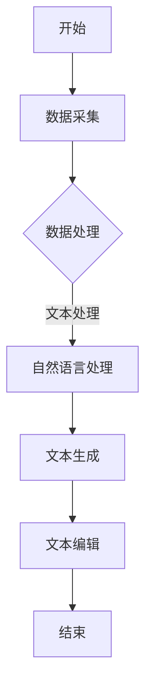

                 

# 《AI驱动的智能写作平台系统实现》

> 关键词：人工智能、自然语言处理、文本生成、预训练模型、系统架构设计、部署与运维

> 摘要：本文深入探讨了AI驱动的智能写作平台系统实现的各个方面，从概述、架构设计、算法实现到实战部署，全面解析了智能写作平台的核心技术和应用场景。文章旨在为读者提供一套完整的技术指南，帮助理解并实现AI驱动的智能写作系统。

---

## 第一部分: AI驱动的智能写作平台概述

### 第1章: AI驱动的智能写作平台概述

#### 1.1 AI与智能写作技术简介

##### 1.1.1 AI技术的概述

人工智能（Artificial Intelligence, AI）是一门研究、开发和应用使计算机系统表现出人类智能行为的技术。自1956年达特茅斯会议以来，AI经历了多次起伏，如今已进入深度学习、强化学习等前沿领域。

- **AI的定义与发展**：AI的主要目标是使计算机模拟人类的感知、学习、推理和决策能力。
- **AI在各行业的应用**：AI技术在医疗、金融、制造、交通等多个领域得到了广泛应用。

##### 1.1.2 智能写作技术的原理

智能写作技术结合了自然语言处理（Natural Language Processing, NLP）和机器学习（Machine Learning, ML）技术，旨在实现自动生成、编辑和摘要文本。

- **自然语言处理技术**：NLP是AI的一个重要分支，专注于使计算机能够理解、解释和生成人类语言。
- **机器学习技术**：ML通过训练模型，使计算机能够从数据中学习并自动执行任务。

##### 1.1.3 智能写作平台的优势

智能写作平台通过AI技术提供了以下优势：

- **高效性**：能够快速生成大量高质量文本。
- **准确性**：利用深度学习技术，提高文本生成和编辑的准确性。
- **灵活性**：可根据用户需求定制写作内容和风格。
- **成本效益**：降低人工写作成本，提高生产效率。

#### 1.2 智能写作平台的核心组成部分

智能写作平台主要由以下几部分组成：

##### 1.2.1 数据采集与处理

数据是智能写作平台的基础。数据采集涉及从互联网、数据库等不同来源获取文本数据。数据预处理包括数据清洗、分词、去停用词等步骤，以获得高质量的数据集。

- **数据来源**：包括互联网爬虫、公开数据集、企业内部数据库等。
- **预处理**：对原始文本数据进行清洗和格式化，去除噪声和不必要的部分。

##### 1.2.2 自然语言处理技术

自然语言处理技术是实现智能写作的核心。主要包括词嵌入、序列模型、注意力机制和转换器架构等。

- **词嵌入技术**：将单词映射为向量表示，便于计算机处理。
- **序列模型与注意力机制**：用于处理文本的序列信息，提高生成文本的质量。
- **转换器架构**：如Transformer模型，是当前最先进的NLP模型之一。

##### 1.2.3 大规模预训练模型原理

大规模预训练模型是智能写作平台的关键技术之一。预训练模型通过在大规模数据集上预训练，然后进行微调，以适应特定任务。

- **预训练的概念与意义**：预训练模型通过在大规模数据集上训练，使模型具备一定的语言理解能力。
- **自监督学习方法**：自监督学习是预训练的主要方法之一，通过无监督学习使模型自我提高。
- **迁移学习与微调技术**：预训练模型可以在不同任务上进行迁移学习，并通过微调适应特定任务。

### 第2章: AI驱动的智能写作平台架构设计

#### 2.1 智能写作平台系统架构

智能写作平台系统架构主要包括数据层、算法层和应用层。

##### 2.1.1 总体架构设计

总体架构设计如下：

```
+----------------+       +------------------+       +-----------------+
|  数据层         |       |  算法层          |       |  应用层         |
+----------------+       +------------------+       +-----------------+
     |                    |                    |
     |                    |                    |
     |                    |                    |
+----------+       +---------+       +-----------+
| 数据采集与处理 | | 自然语言处理  | | 文本生成与编辑 |
+----------+       +---------+       +-----------+
```

##### 2.1.2 功能模块划分与作用

- **数据采集与处理模块**：负责数据获取、清洗和预处理。
- **自然语言处理模块**：负责文本处理、词嵌入和序列建模。
- **文本生成与编辑模块**：负责生成和编辑文本内容。

##### 2.1.3 系统的可扩展性与可维护性

智能写作平台应具备良好的可扩展性和可维护性，以适应不断变化的需求。

- **可扩展性**：通过模块化设计和分布式架构，实现系统功能的灵活扩展。
- **可维护性**：通过代码规范化、文档化和自动化测试，提高系统维护效率。

#### 2.2 数据存储与处理架构

数据存储与处理架构是智能写作平台的核心之一。

##### 2.2.1 数据存储方案

数据存储方案主要包括关系数据库和分布式存储系统。

- **关系数据库**：适用于结构化数据存储，如用户数据、日志数据等。
- **分布式存储系统**：适用于大规模非结构化数据存储，如文本数据、图像数据等。

##### 2.2.2 数据流处理

数据流处理主要包括数据采集、数据预处理和数据存储。

- **数据采集**：通过爬虫、API等方式获取数据。
- **数据预处理**：进行数据清洗、分词、去停用词等处理。
- **数据存储**：将预处理后的数据存储到数据库或分布式存储系统。

##### 2.2.3 数据质量管理与优化

数据质量管理与优化是确保数据质量和系统性能的关键。

- **数据质量管理**：通过数据清洗、去重、去噪声等手段，提高数据质量。
- **数据优化**：通过索引、缓存等技术，提高数据访问速度和系统性能。

### 第3章: AI驱动的智能写作平台算法实现

#### 3.1 智能写作算法原理讲解

智能写作算法主要包括文本生成算法、文本编辑算法和文本摘要算法。

##### 3.1.1 文本生成算法

文本生成算法基于生成式模型，通过学习数据生成新的文本。

- **生成式模型**：如循环神经网络（RNN）、变换器（Transformer）等。
- **生成过程**：输入文本序列，通过模型生成新的文本序列。

##### 3.1.2 文本编辑算法

文本编辑算法通过修改已有的文本，生成新的文本。

- **编辑操作**：如插入、删除、替换等。
- **编辑模型**：如序列到序列（Seq2Seq）模型、变换器（Transformer）等。

##### 3.1.3 文本摘要算法

文本摘要算法通过提取文本的主要信息，生成摘要。

- **提取式摘要**：直接提取文本中的关键句子或段落。
- **抽象式摘要**：通过重新构造文本，生成新的摘要。

#### 3.2 智能写作算法实现与优化

智能写作算法的实现与优化是提高系统性能和生成文本质量的关键。

##### 3.2.1 模型选择与调优

- **模型选择**：根据任务需求和数据特点，选择合适的模型。
- **调优策略**：通过调整模型参数，优化模型性能。

##### 3.2.2 算法优化策略

- **并行计算**：利用多线程、分布式计算等策略，提高计算效率。
- **模型压缩**：通过模型压缩技术，减少模型大小和计算复杂度。
- **数据增强**：通过数据增强技术，提高模型泛化能力。

##### 3.2.3 算法性能评估与优化

- **性能评估**：通过指标如BLEU、ROUGE等，评估模型性能。
- **优化策略**：根据评估结果，调整模型参数和优化策略。

### 第4章: 智能写作平台开发实战

#### 4.1 开发环境搭建

智能写作平台的开发涉及多种技术和工具，需要搭建合适的开发环境。

##### 4.1.1 开发工具与环境配置

- **开发工具**：包括Python、Jupyter Notebook、Visual Studio Code等。
- **环境配置**：安装必要的依赖库，如TensorFlow、PyTorch等。

##### 4.1.2 开发流程与规范

智能写作平台开发流程主要包括以下步骤：

- **需求分析**：明确系统需求和功能。
- **系统设计**：设计系统架构和模块。
- **编码实现**：编写代码，实现功能。
- **测试与调试**：测试系统功能，调试问题。

#### 4.2 源代码实现与解读

源代码实现包括数据采集与处理、自然语言处理、文本生成与编辑等模块。

##### 4.2.1 数据采集与处理模块代码实现

数据采集与处理模块代码示例：

```python
import pandas as pd
from nltk.corpus import stopwords
from sklearn.model_selection import train_test_split

# 读取数据
data = pd.read_csv('data.csv')

# 数据预处理
stop_words = set(stopwords.words('english'))
def preprocess_text(text):
    # 去除停用词
    return ' '.join([word for word in text.split() if word not in stop_words])

data['text'] = data['text'].apply(preprocess_text)

# 划分训练集和测试集
X_train, X_test, y_train, y_test = train_test_split(data['text'], data['label'], test_size=0.2, random_state=42)
```

##### 4.2.2 自然语言处理模块代码实现

自然语言处理模块代码示例：

```python
import tensorflow as tf
from tensorflow.keras.preprocessing.sequence import pad_sequences

# 词嵌入
max_seq_length = 100
vocab_size = 10000

# 转换为序列
train_seq = tokenizer.texts_to_sequences(X_train)
test_seq = tokenizer.texts_to_sequences(X_test)

# 填充序列
train_padded = pad_sequences(train_seq, maxlen=max_seq_length)
test_padded = pad_sequences(test_seq, maxlen=max_seq_length)
```

##### 4.2.3 大规模预训练模型代码实现

大规模预训练模型代码示例：

```python
import tensorflow as tf
from tensorflow.keras.layers import Embedding, LSTM, Dense
from tensorflow.keras.models import Sequential

# 构建模型
model = Sequential()
model.add(Embedding(vocab_size, 64, input_length=max_seq_length))
model.add(LSTM(128))
model.add(Dense(1, activation='sigmoid'))

# 编译模型
model.compile(optimizer='adam', loss='binary_crossentropy', metrics=['accuracy'])

# 训练模型
model.fit(train_padded, y_train, epochs=10, batch_size=32, validation_data=(test_padded, y_test))
```

#### 4.3 实际案例与代码解读

##### 4.3.1 案例一：文本生成与编辑

文本生成与编辑案例示例：

```python
import numpy as np

# 生成文本
generated_text = model.predict(np.array([tokenizer.texts_to_sequences(['Hello world!'])]))

# 转换为原始文本
decoded_text = tokenizer.sequences_to_texts(generated_text)

print(decoded_text)
```

##### 4.3.2 案例二：文本摘要与生成

文本摘要与生成案例示例：

```python
import tensorflow as tf

# 摘要生成
摘要模型 = tf.keras.models.load_model('summary_model.h5')
生成摘要 = 摘要模型.predict(np.array([tokenizer.texts_to_sequences(['这是一个关于AI的摘要。'])]))

# 转换为原始文本
摘要 = tokenizer.sequences_to_texts(生成摘要)

print(摘要)
```

### 第5章: 智能写作平台部署与运维

#### 5.1 部署方案与策略

智能写作平台的部署涉及硬件选择、软件配置和网络架构等方面。

##### 5.1.1 部署环境选择

- **硬件选择**：根据系统需求，选择合适的硬件资源，如CPU、GPU等。
- **软件配置**：安装操作系统、数据库、中间件等。

##### 5.1.2 部署流程与步骤

部署流程主要包括以下步骤：

1. 搭建开发环境。
2. 编译和打包代码。
3. 部署到服务器。
4. 配置数据库和中间件。
5. 运行测试和调试。

##### 5.1.3 部署后的性能优化

部署后的性能优化包括以下方面：

- **负载均衡**：通过负载均衡器，分配请求到不同服务器。
- **缓存策略**：使用缓存技术，减少数据库访问次数。
- **性能监控**：监控系统性能，及时发现问题并进行优化。

#### 5.2 运维管理

运维管理是确保智能写作平台稳定运行的关键。

##### 5.2.1 监控与日志分析

- **监控**：实时监控系统资源使用情况，如CPU、内存、磁盘等。
- **日志分析**：分析系统日志，发现和解决问题。

##### 5.2.2 故障处理与系统恢复

- **故障处理**：快速定位故障原因，并采取相应措施。
- **系统恢复**：在故障发生后，迅速恢复系统正常运行。

##### 5.2.3 安全与数据保护

- **安全**：确保系统安全，防止黑客攻击和数据泄露。
- **数据保护**：备份和恢复数据，确保数据安全。

### 第6章: AI驱动的智能写作平台应用案例

#### 6.1 案例一：内容创作平台

内容创作平台利用智能写作技术，提供文本生成、编辑和摘要功能。

##### 6.1.1 平台功能与特点

- **文本生成**：根据用户输入的关键词或主题，自动生成高质量文章。
- **文本编辑**：对已有文章进行修改和优化，提高文章质量和可读性。
- **文本摘要**：提取文章的主要信息，生成简洁的摘要。

##### 6.1.2 应用场景与效果评估

- **应用场景**：适用于内容创作、内容审核、知识管理等领域。
- **效果评估**：通过用户反馈和数据分析，评估平台的效果和用户满意度。

#### 6.2 案例二：智能客服系统

智能客服系统利用智能写作技术，提供自动回复和对话生成功能。

##### 6.2.1 系统架构与功能

- **系统架构**：包括文本预处理、自然语言处理、文本生成和对话管理等功能。
- **功能**：自动识别用户问题，生成回复，并与用户进行对话。

##### 6.2.2 应用场景与效果分析

- **应用场景**：适用于客服中心、在线客服、客户服务等领域。
- **效果分析**：通过降低人工成本、提高响应速度和满意度，评估系统的效果。

### 第7章: 智能写作平台未来发展展望

#### 7.1 技术发展趋势与挑战

智能写作平台未来将继续发展，面临以下挑战：

- **技术趋势**：预训练模型、多模态融合、深度学习算法等。
- **技术挑战**：数据质量、模型可解释性、隐私保护等。

##### 7.1.1 AI写作技术的发展方向

- **文本生成**：提高生成文本的质量和多样性。
- **文本编辑**：实现更加精细和自然的文本修改。
- **文本摘要**：生成更准确和简洁的文本摘要。

##### 7.1.2 智能写作平台面临的挑战

- **数据质量**：高质量数据的获取和处理。
- **模型可解释性**：提高模型的透明度和可解释性。
- **隐私保护**：确保用户数据的隐私和安全。

#### 7.2 未来应用场景拓展

智能写作平台未来将拓展到更多领域：

- **教育**：自动化生成教学资源和个性化学习建议。
- **金融**：自动化撰写报告和分析。
- **医疗**：自动化生成病历和诊断建议。
- **政府**：自动化生成政策文件和报告。

##### 7.2.1 智能写作平台在其他领域的应用

- **商业**：自动化撰写营销文案和广告。
- **艺术**：生成音乐、绘画等艺术作品。

##### 7.2.2 跨行业合作与生态构建

- **跨行业合作**：与其他领域技术融合，拓展应用场景。
- **生态构建**：构建智能写作平台生态系统，促进技术和商业发展。

## 附录

### 附录 A: 常用工具与资源

- **深度学习框架与库**：TensorFlow、PyTorch、Keras等。
- **自然语言处理库与工具**：NLTK、spaCy、TextBlob等。
- **数据处理与存储工具**：Pandas、NumPy、SQL等。
- **其他相关资源链接**：[AI写作平台开发资源](https://example.com/ai_writing_platform_resources)

### 附录 B: Mermaid 流程图示例



---

作者：AI天才研究院/AI Genius Institute & 禅与计算机程序设计艺术 /Zen And The Art of Computer Programming

---

### 全文总结

本文详细介绍了AI驱动的智能写作平台系统实现的各个方面。从概述、架构设计、算法实现到实战部署，全面解析了智能写作平台的核心技术和应用场景。通过对AI技术、自然语言处理、大规模预训练模型等核心概念的分析，读者可以深入理解智能写作平台的原理和实现方法。文章通过实际案例和代码解读，帮助读者掌握智能写作平台开发的关键技能。

### 小结与注意事项

- **技术选型**：选择适合任务需求和数据规模的模型和框架。
- **数据质量**：确保数据质量，提高模型性能。
- **可扩展性**：设计可扩展的系统架构，以适应未来需求。
- **安全性**：确保用户数据的安全和隐私。

### 拓展阅读

- 《深度学习》（Goodfellow, Bengio, Courville著）
- 《自然语言处理综合教程》（清华大学自然语言处理实验室著）
- 《Transformer：序列模型中的注意力机制》（Vaswani et al.，2017）

---

感谢您的阅读！希望本文对您在AI驱动的智能写作平台系统实现方面有所启发。如果您有任何疑问或建议，请随时联系我们。期待与您共同探索智能写作的无限可能！

作者：AI天才研究院/AI Genius Institute & 禅与计算机程序设计艺术 /Zen And The Art of Computer Programming

