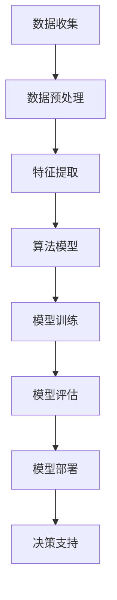

                 

### 文章标题：AI驱动的智能决策支持系统设计与实现

> 关键词：AI，决策支持系统，智能系统设计，机器学习，深度学习，强化学习

> 摘要：本文详细探讨了AI驱动的智能决策支持系统的设计与实现过程。首先，介绍了智能决策支持系统的发展历程和AI技术的应用。接着，阐述了系统架构、数据收集与处理方法。随后，深入解析了机器学习、深度学习和强化学习算法原理及其应用。文章最后，通过具体案例展示了系统的设计与实现，并对系统测试与优化进行了讨论。

### 目录大纲

## 第一部分: 引言与概述

### 第1章: AI驱动的智能决策支持系统概述

#### 1.1 智能决策支持系统的发展历程

#### 1.2 AI技术在决策支持系统中的应用

#### 1.3 AI驱动的智能决策支持系统的特点与价值

### 第2章: AI驱动的智能决策支持系统架构

#### 2.1 系统总体架构

#### 2.2 数据层架构

#### 2.3 算法层架构

#### 2.4 应用层架构

### 第3章: 数据收集与处理

#### 3.1 数据收集方法

#### 3.2 数据预处理技术

#### 3.3 数据存储与管理

## 第二部分: AI算法与应用

### 第4章: 机器学习算法原理

#### 4.1 监督学习算法

#### 4.2 无监督学习算法

#### 4.3 强化学习算法

### 第5章: 深度学习算法

#### 5.1 神经网络基础

#### 5.2 卷积神经网络

#### 5.3 循环神经网络

#### 5.4 生成对抗网络

### 第6章: 强化学习应用案例

#### 6.1 强化学习在调度优化中的应用

#### 6.2 强化学习在资源分配中的应用

#### 6.3 强化学习在供应链管理中的应用

### 第7章: 深度学习在图像处理中的应用

#### 7.1 图像分类

#### 7.2 目标检测

#### 7.3 图像分割

### 第8章: 深度学习在自然语言处理中的应用

#### 8.1 文本分类

#### 8.2 命名实体识别

#### 8.3 机器翻译

## 第三部分: 系统设计与实现

### 第9章: 智能决策支持系统的设计与实现

#### 9.1 系统需求分析

#### 9.2 系统设计原则

#### 9.3 系统实现流程

### 第10章: 开发环境搭建与工具使用

#### 10.1 开发环境配置

#### 10.2 工具使用简介

#### 10.3 开发工具选择与配置

### 第11章: 代码实战与解析

#### 11.1 监督学习案例

#### 11.2 深度学习案例

#### 11.3 强化学习案例

### 第12章: 系统测试与优化

#### 12.1 系统测试策略

#### 12.2 性能优化方法

#### 12.3 系统维护与升级

## 附录

### 附录 A: AI驱动的智能决策支持系统相关资源

#### A.1 主流机器学习框架

#### A.2 深度学习框架

#### A.3 强化学习框架

#### A.4 数据集与工具资源

## Mermaid 流程图

### 智能决策支持系统架构图



### 监督学习算法伪代码

```python
// 监督学习算法伪代码

初始化模型参数
输入：训练数据集 X, 标签 Y
输出：训练好的模型

for epoch in 1 to MAX_EPOCHS do
    for each sample (x_i, y_i) in X do
        compute predicted output ŷ_i = model(x_i)
        compute loss L = loss_function(ŷ_i, y_i)
        compute gradients ∇L = model.compute_gradients(L)
        update model parameters using gradients
    end for
end for

return trained model
```

### 强化学习算法伪代码

```python
// 强化学习算法伪代码

初始化模型参数
输入：环境 E, 目标函数 J
输出：最优策略 π*

while not terminated do
    state s = env.reset()
    while not done do
        action a = π* (s)
        next_state s' = env.step(a)
        reward r = env.reward(s', a)
        update model us
    end while
end while

return π*
```

### 第一部分：引言与概述

#### 第1章: AI驱动的智能决策支持系统概述

##### 1.1 智能决策支持系统的发展历程

智能决策支持系统（Intelligent Decision Support System，IDSS）是一种综合运用人工智能、大数据分析、机器学习等技术，辅助决策者进行复杂决策的系统。其发展历程大致可以分为以下几个阶段：

1. **早期阶段（20世纪60年代）**：在这一阶段，决策支持系统主要依靠专家系统进行问题求解。专家系统通过模拟人类专家的决策过程，提供决策建议。

2. **成熟阶段（20世纪70-80年代）**：随着数据库和数据挖掘技术的成熟，决策支持系统开始引入数据分析和数据挖掘技术，能够处理更复杂的数据。

3. **智能化阶段（20世纪90年代至今）**：随着人工智能技术的发展，智能决策支持系统开始融合机器学习、深度学习、自然语言处理等技术，实现更高的自动化和智能化水平。

##### 1.2 AI技术在决策支持系统中的应用

AI技术在决策支持系统中的应用主要体现在以下几个方面：

1. **机器学习算法**：通过机器学习算法，系统能够从大量数据中自动提取特征，建立预测模型，为决策提供支持。

2. **深度学习算法**：深度学习算法可以处理高维数据，如图像、音频等，适用于复杂场景的决策支持。

3. **自然语言处理**：自然语言处理技术可以帮助系统理解用户的自然语言需求，提供更加人性化的决策支持。

4. **强化学习**：强化学习算法能够通过不断的试错学习，优化决策策略，提高决策效果。

##### 1.3 AI驱动的智能决策支持系统的特点与价值

AI驱动的智能决策支持系统具有以下特点和价值：

1. **智能化**：系统能够根据数据和算法自动进行决策，减少人为干预，提高决策效率。

2. **自动化**：系统可以自动处理大量数据，减少人工处理的负担。

3. **实时性**：系统能够实时获取数据，快速响应决策需求。

4. **可扩展性**：系统能够根据需求扩展新的功能和算法，适应不同的决策场景。

5. **价值性**：通过优化决策过程，系统能够为企业带来明显的经济效益。

总之，AI驱动的智能决策支持系统为企业和组织提供了强大的决策支持能力，是未来智能化决策的重要工具。随着AI技术的不断进步，智能决策支持系统将发挥越来越重要的作用。

### 第二部分：AI驱动的智能决策支持系统架构

智能决策支持系统的设计与实现需要一个完整的架构来支持，这个架构通常包括数据层、算法层和应用层。下面将详细探讨各个层次的架构设计和实现。

#### 第2章: AI驱动的智能决策支持系统架构

##### 2.1 系统总体架构

智能决策支持系统总体架构可以分为以下三个层次：

1. **数据层**：负责数据的收集、存储和管理，为系统提供数据支持。
2. **算法层**：包括机器学习、深度学习和强化学习算法，负责数据分析和模型训练。
3. **应用层**：将算法层的模型应用于实际场景，提供决策支持服务。


##### 2.2 数据层架构

数据层是智能决策支持系统的基石，主要包括以下几个模块：

1. **数据收集模块**：负责从各种数据源收集数据，包括结构化数据和非结构化数据。
2. **数据预处理模块**：对收集到的数据进行清洗、去重、转换等预处理操作，提高数据质量。
3. **数据存储模块**：将预处理后的数据存储在数据库或数据仓库中，为算法层提供数据支持。
4. **数据管理模块**：负责数据的权限管理、备份和恢复等操作，确保数据安全。


##### 2.3 算法层架构

算法层是智能决策支持系统的核心，主要包括以下几个模块：

1. **机器学习模块**：提供各种监督学习、无监督学习和强化学习算法，用于数据分析和模型训练。
2. **深度学习模块**：利用深度学习算法处理复杂的数据，如图像、音频和文本等。
3. **自然语言处理模块**：用于理解和生成自然语言，支持文本分类、实体识别和机器翻译等功能。
4. **模型训练与评估模块**：负责训练机器学习模型，并对模型进行评估，选择最优模型。


##### 2.4 应用层架构

应用层是将算法层的模型应用于实际场景，提供决策支持服务的模块。主要包括以下几个模块：

1. **用户界面模块**：提供用户与系统交互的界面，支持用户输入需求、查看决策结果等操作。
2. **决策引擎模块**：负责调用算法层的模型，根据用户需求进行数据分析和决策。
3. **应用服务模块**：提供各种决策支持服务，如预测分析、推荐系统、供应链管理等。
4. **系统集成模块**：负责将系统与其他业务系统进行集成，实现数据共享和业务协同。


通过上述架构设计，AI驱动的智能决策支持系统能够高效地处理数据，训练模型，并应用于实际场景，为企业和组织提供强大的决策支持能力。

### 第三部分：数据收集与处理

数据是智能决策支持系统的核心资源，数据的收集与处理对于系统的性能和效果具有重要影响。在这一部分，我们将详细探讨数据收集方法、数据预处理技术以及数据存储与管理。

#### 第3章：数据收集与处理

##### 3.1 数据收集方法

数据收集是构建智能决策支持系统的第一步，数据源可以分为结构化数据和非结构化数据：

1. **结构化数据**：主要来源于数据库、企业资源计划（ERP）系统、客户关系管理（CRM）系统等。这些数据通常是表格形式，包含明确的字段和属性。
    - **方法**：通过API接口、数据库连接等方式进行数据抽取。
    - **挑战**：数据量通常较大，需要高效的抽取和传输机制。

2. **非结构化数据**：主要包括文本、图像、音频和视频等。这些数据形式多样，没有固定的结构。
    - **方法**：通过爬虫、API接口、传感器等方式进行数据收集。
    - **挑战**：数据格式复杂，需要专门的解析和处理技术。

##### 3.2 数据预处理技术

收集到的数据通常需要进行预处理，以提高数据质量和模型的训练效果。数据预处理包括以下几个步骤：

1. **数据清洗**：去除重复数据、空值和噪声数据，确保数据的一致性和完整性。
    - **方法**：使用去重算法、填补空值和过滤噪声数据技术。
    - **挑战**：如何平衡数据去重与数据保留，避免丢失有价值的信息。

2. **数据转换**：将数据转换为适合机器学习模型的形式。
    - **方法**：包括数据标准化、归一化、编码和特征提取等。
    - **挑战**：如何选择合适的转换方法，以保持数据特征。

3. **数据归一化**：将不同尺度的数据进行归一化，使其具有相同的量纲。
    - **方法**：使用均值-方差归一化、最小-最大归一化等。
    - **挑战**：如何选择合适的归一化方法，以减少数据偏移。

##### 3.3 数据存储与管理

预处理后的数据需要存储和管理，以供算法层使用。数据存储与管理包括以下几个模块：

1. **数据库**：用于存储结构化数据，如关系型数据库（MySQL、PostgreSQL）和非关系型数据库（MongoDB、Cassandra）。
    - **方法**：使用数据库管理系统（DBMS）进行数据存储和查询。
    - **挑战**：如何设计合理的数据库 schema，以支持高效的数据查询。

2. **数据仓库**：用于存储大量历史数据，支持数据分析和报表生成。
    - **方法**：使用数据仓库技术（如 ETL、数据挖掘）进行数据处理和分析。
    - **挑战**：如何平衡数据存储与查询性能。

3. **数据湖**：用于存储非结构化数据和半结构化数据，支持大数据处理和分析。
    - **方法**：使用分布式文件系统（如 Hadoop、HDFS）进行数据存储。
    - **挑战**：如何保证数据存储的可靠性和高效性。

通过上述数据收集与处理技术，智能决策支持系统能够高效地获取和处理数据，为后续的模型训练和决策支持提供可靠的数据基础。

### 第二部分：AI算法与应用

#### 第4章：机器学习算法原理

##### 4.1 监督学习算法

监督学习是一种常见的机器学习算法，其主要特点是需要标注过的训练数据。这些数据包含输入特征和对应的标签，通过训练模型，使得模型能够对新数据进行预测。

1. **线性回归**：线性回归是一种简单的监督学习算法，用于预测连续值输出。
    - **原理**：通过最小化损失函数（如均方误差）来调整模型参数，使其预测结果与真实标签尽量接近。
    - **公式**：
      $$ y = \beta_0 + \beta_1x $$
    - **伪代码**：
    ```python
    # 线性回归伪代码

    初始化模型参数 β0 和 β1
    输入：训练数据集 X, 标签 Y
    输出：训练好的模型参数 β0 和 β1

    while not convergence do
        计算预测值 ŷ = β0 + β1x
        计算损失函数 L = mean_squared_error(ŷ, Y)
        计算梯度 ∇L = [∂L/∂β0, ∂L/∂β1]
        更新参数 β0 = β0 - learning_rate * ∇β0
        β1 = β1 - learning_rate * ∇β1
    end while

    return β0, β1
    ```

2. **逻辑回归**：逻辑回归用于分类问题，其目标是预测样本属于某个类别的概率。
    - **原理**：通过逻辑函数（sigmoid 函数）将线性回归的输出映射到概率值。
    - **公式**：
      $$ P(y=1) = \frac{1}{1 + e^{-(β0 + β1x)}} $$
    - **伪代码**：
    ```python
    # 逻辑回归伪代码

    初始化模型参数 β0 和 β1
    输入：训练数据集 X, 标签 Y
    输出：训练好的模型参数 β0 和 β1

    while not convergence do
        计算预测概率 ŷ = sigmoid(β0 + β1x)
        计算损失函数 L = cross_entropy(ŷ, Y)
        计算梯度 ∇L = [∂L/∂β0, ∂L/∂β1]
        更新参数 β0 = β0 - learning_rate * ∇β0
        β1 = β1 - learning_rate * ∇β1
    end while

    return β0, β1
    ```

##### 4.2 无监督学习算法

无监督学习算法不需要标注的数据，其主要目的是发现数据中的模式和结构。

1. **聚类算法**：聚类算法将数据分为多个组，使得同一组内的数据尽可能相似，不同组的数据尽可能不同。
    - **K-均值聚类**：K-均值聚类是一种常见的聚类算法，通过迭代优化聚类中心，使得每个样本到聚类中心的距离最小。
    - **原理**：
      $$ c_k = \frac{1}{N_k} \sum_{x_i \in S_k} x_i $$
      $$ S_k = \{x_i | d(x_i, c_k) \leq d(x_i, c_j)\} $$
    - **伪代码**：
    ```python
    # K-均值聚类伪代码

    初始化 K 个聚类中心 c1, c2, ..., cK
    输入：数据集 X
    输出：聚类结果

    while not convergence do
        计算每个样本到聚类中心的距离 di = d(xi, ck)
        根据距离最小的聚类中心，将样本分配到相应的组 S_k
        重新计算每个组的聚类中心 c_k
    end while

    return 聚类结果
    ```

2. **主成分分析（PCA）**：主成分分析是一种降维技术，通过线性变换将数据投影到新的坐标轴上，使得新的坐标轴能够最大化数据的方差。
    - **原理**：
      $$ x' = PC $$
      其中，PC 是协方差矩阵的特征向量，x' 是数据在新坐标轴上的投影。
    - **伪代码**：
    ```python
    # 主成分分析伪代码

    输入：数据集 X
    输出：降维后的数据集 X'

    计算协方差矩阵 C = cov(X)
    计算特征值和特征向量 λ, PC
    选择最大的 K 个特征值对应的特征向量，构成降维矩阵 P
    X' = P^T X

    return X'
    ```

##### 4.3 强化学习算法

强化学习是一种通过不断尝试和反馈进行学习的过程，其主要目标是找到最优策略，使累计奖励最大化。

1. **Q-学习**：Q-学习是一种基于值函数的强化学习算法，通过预测每个动作的未来奖励来学习策略。
    - **原理**：
      $$ Q(s, a) = r + γ \max_{a'} Q(s', a') $$
      其中，s 是状态，a 是动作，r 是即时奖励，γ 是折扣因子，Q(s, a) 是从状态 s 进行动作 a 的期望回报。
    - **伪代码**：
    ```python
    # Q-学习伪代码

    初始化 Q(s, a) 和 ε
    输入：环境 E, 目标函数 J
    输出：最优策略 π*

    while not terminated do
        state s = env.reset()
        while not done do
            if random() < ε then
                action a = random_action()
            else
                action a = π*(s)
            end if
            next_state s' = env.step(a)
            reward r = env.reward(s', a)
            update Q(s, a) = Q(s, a) + α[r + γ \* max_{a'} Q(s', a'} - Q(s, a)]
            s = s'
        end while
    end while

    return π*
    ```

2. **深度强化学习**：深度强化学习结合了深度学习和强化学习，通过神经网络来近似值函数或策略。
    - **原理**：
      $$ Q(s, a) ≈ f_\theta(s, a) $$
      $$ π(s) ≈ f_\theta(s) $$
      其中，f_\theta 是神经网络模型，θ 是模型参数。
    - **伪代码**：
    ```python
    # 深度强化学习伪代码

    初始化神经网络模型 f_\theta 和目标模型 f_\theta'
    初始化 Q(s, a) 和 ε
    输入：环境 E, 目标函数 J
    输出：最优策略 π*

    while not terminated do
        state s = env.reset()
        while not done do
            action a = π*(s)
            next_state s' = env.step(a)
            reward r = env.reward(s', a)
            update f_\theta(s, a) = f_\theta(s, a) + α[r + γ \* f_\theta'(s', a') - f_\theta(s, a)]
            s = s'
        end while
    end while

    return π*
    ```

通过上述机器学习算法的原理介绍，我们可以看到这些算法在智能决策支持系统中的应用前景。接下来，我们将进一步探讨深度学习算法及其在图像处理和自然语言处理中的应用。

### 第五部分：深度学习算法

#### 第5章：深度学习算法

深度学习是机器学习的一个分支，通过模仿人脑神经网络的结构和功能来实现特征学习和复杂模式识别。深度学习算法在图像处理、自然语言处理和生成对抗网络（GAN）等方面有着广泛的应用。下面将详细介绍几种常见的深度学习算法。

##### 5.1 神经网络基础

神经网络（Neural Networks，NN）是深度学习的基础，由大量简单的处理单元（神经元）组成。每个神经元接收多个输入，通过加权求和后加上偏置，再通过激活函数转换输出。

1. **单层感知机（Perceptron）**：单层感知机是最简单的神经网络，用于二分类问题。
    - **原理**：
      $$ z = \sum_{i=1}^{n} w_i x_i + b $$
      $$ y = \text{sign}(z) $$
      其中，\( x_i \) 是输入特征，\( w_i \) 是权重，\( b \) 是偏置，\( z \) 是加权和，\( y \) 是输出。
    - **伪代码**：
    ```python
    # 单层感知机伪代码

    初始化权重 w 和偏置 b
    输入：训练数据集 X, 标签 Y
    输出：训练好的模型

    while not convergence do
        for each sample (x_i, y_i) in X do
            z = w^T x_i + b
            y_pred = sign(z)
            compute gradient ∇L = -y_i * x_i if y_pred != y_i
            update weights w = w - learning_rate * ∇L
            update bias b = b - learning_rate * ∇L
        end for
    end while

    return w, b
    ```

2. **多层感知机（MLP）**：多层感知机通过增加隐层，能够处理更复杂的非线性问题。
    - **原理**：
      $$ z_l = \sum_{i=1}^{n} w_{li} x_i^{(l-1)} + b_l $$
      $$ a_l = \text{激活函数}(z_l) $$
      $$ l = 1, 2, ..., L $$
      其中，\( L \) 是层数，\( a_l \) 是第 l 层的激活值。
    - **伪代码**：
    ```python
    # 多层感知机伪代码

    初始化权重 w 和偏置 b
    输入：训练数据集 X, 标签 Y
    输出：训练好的模型

    while not convergence do
        for each sample (x_i, y_i) in X do
            a_0 = x_i
            for l in 1 to L do
                z_l = w_l^T a_{l-1} + b_l
                a_l = 激活函数(z_l)
            end for
            y_pred = a_L
            compute gradient ∇L = -y_i * ∇激活函数(a_L)
            update weights w = w - learning_rate * ∇L
            update bias b = b - learning_rate * ∇L
        end for
    end while

    return weights, biases
    ```

##### 5.2 卷积神经网络（CNN）

卷积神经网络（Convolutional Neural Networks，CNN）是专门用于图像处理的一种深度学习算法，通过卷积层、池化层和全连接层实现图像特征提取和分类。

1. **卷积层**：卷积层通过卷积运算提取图像局部特征。
    - **原理**：
      $$ h_{ij}^{(l)} = \sum_{k=1}^{m} w_{ik}^{(l)} f_{kj}^{(l-1)} + b^{(l)} $$
      其中，\( h_{ij}^{(l)} \) 是第 l 层第 i 个卷积核输出的特征图，\( f_{kj}^{(l-1)} \) 是第 l-1 层的特征图，\( w_{ik}^{(l)} \) 和 \( b^{(l)} \) 分别是卷积核和偏置。
    - **伪代码**：
    ```python
    # 卷积层伪代码

    初始化卷积核 w 和偏置 b
    输入：输入图像 I
    输出：卷积输出特征图 H

    for i in 1 to height of I do
        for j in 1 to width of I do
            z_i^j = sum(w_i^k * I_{kx, ky} + b)
            H_i^j = 激活函数(z_i^j)
        end for
    end for

    return H
    ```

2. **池化层**：池化层通过下采样减小特征图的大小，减少模型参数数量。
    - **原理**：
      $$ p_i^j = \max_{k,l} (h_{ki}^j + h_{li}^j) $$
      其中，\( p_i^j \) 是第 i 行第 j 列的池化输出，\( h_{ki}^j \) 和 \( h_{li}^j \) 是相邻的两个像素值。
    - **伪代码**：
    ```python
    # 池化层伪代码

    输入：输入特征图 H
    输出：池化输出特征图 P

    for i in 1 to height of H do
        for j in 1 to width of H do
            p_i^j = max(h_i^(j-1), h_i^(j+1))
        end for
    end for

    return P
    ```

3. **全连接层**：全连接层通过将卷积层和池化层提取的特征图进行全连接，实现分类任务。
    - **原理**：
      $$ z = \sum_{i=1}^{n} w_i f_i + b $$
      $$ y = \text{激活函数}(z) $$
      其中，\( f_i \) 是特征图，\( w_i \) 是权重，\( b \) 是偏置，\( y \) 是输出。
    - **伪代码**：
    ```python
    # 全连接层伪代码

    初始化权重 w 和偏置 b
    输入：特征图 F
    输出：分类结果 Y

    z = w^T F + b
    y = 激活函数(z)

    return y
    ```

##### 5.3 循环神经网络（RNN）

循环神经网络（Recurrent Neural Networks，RNN）是处理序列数据的常用算法，通过将输入序列传递到隐藏层，使网络具有时间动态性。

1. **基本RNN**：基本RNN通过递归关系更新隐藏状态。
    - **原理**：
      $$ h_t = \text{激活函数}(W \cdot [h_{t-1}, x_t] + b) $$
      $$ y_t = \text{激活函数}(V \cdot h_t + c) $$
      其中，\( h_t \) 是第 t 时刻的隐藏状态，\( x_t \) 是输入，\( y_t \) 是输出。
    - **伪代码**：
    ```python
    # RNN伪代码

    初始化隐藏状态 h_0 和权重 W, b
    输入：序列 X
    输出：输出序列 Y

    for t in 1 to length of X do
        h_t = 激活函数(W \* [h_{t-1}, x_t] + b)
        y_t = 激活函数(V \* h_t + c)
    end for

    return Y
    ```

2. **长短期记忆网络（LSTM）**：LSTM是RNN的一种改进，通过引入门控机制解决长期依赖问题。
    - **原理**：
      $$ i_t = \text{激活函数}(W_i \cdot [h_{t-1}, x_t] + b_i) $$
      $$ f_t = \text{激活函数}(W_f \cdot [h_{t-1}, x_t] + b_f) $$
      $$ g_t = \text{激活函数}(W_g \cdot [h_{t-1}, x_t] + b_g) $$
      $$ o_t = \text{激活函数}(W_o \cdot [h_{t-1}, x_t] + b_o) $$
      $$ h_t = \text{激活函数}(W_h \cdot [f_t \* h_{t-1}, g_t] + b_h) $$
      其中，\( i_t \)，\( f_t \)，\( g_t \)，\( o_t \) 分别是输入门、遗忘门、生成门和输出门。
    - **伪代码**：
    ```python
    # LSTM伪代码

    初始化权重 Wi, Wf, Wg, Wo 和偏置 bi, bf, bg, bo
    输入：序列 X
    输出：输出序列 Y

    for t in 1 to length of X do
        it = 激活函数(Wi \* [h_{t-1}, x_t] + bi)
        ft = 激活函数(Wf \* [h_{t-1}, x_t] + bf)
        gt = 激活函数(Wg \* [h_{t-1}, x_t] + bg)
        ot = 激活函数(Wo \* [h_{t-1}, x_t] + bo)
        ct = ft \* h_{t-1} + it \* gt
        ht = ot \* 激活函数(Wh \* [ct] + bh)
    end for

    return Y
    ```

##### 5.4 生成对抗网络（GAN）

生成对抗网络（Generative Adversarial Networks，GAN）由生成器（Generator）和判别器（Discriminator）组成，通过对抗训练生成逼真的数据。

1. **生成器**：生成器旨在生成逼真的数据，使判别器无法区分真实数据和生成数据。
    - **原理**：
      $$ G(z) = x $$
      $$ D(x) = 1 $$
      $$ D(G(z)) = 0 $$
      其中，\( G(z) \) 是生成器生成的数据，\( D(x) \) 是判别器的输出。
    - **伪代码**：
    ```python
    # GAN生成器伪代码

    初始化生成器 G 和判别器 D 的权重
    输入：随机噪声 z
    输出：生成数据 x

    x = G(z)

    return x
    ```

2. **判别器**：判别器旨在区分真实数据和生成数据，提高生成器的生成质量。
    - **原理**：
      $$ D(x) + D(G(z)) = 1 $$
      $$ D(x) \approx 1 $$
      $$ D(G(z)) \approx 0 $$
    - **伪代码**：
    ```python
    # GAN判别器伪代码

    初始化判别器 D 的权重
    输入：真实数据 x 和生成数据 G(z)
    输出：判别结果

    D(x) = 输出概率
    D(G(z)) = 输出概率

    return D(x), D(G(z))
    ```

3. **GAN训练**：GAN的训练过程通过交替更新生成器和判别器的权重，达到生成逼真数据的最终目标。
    - **伪代码**：
    ```python
    # GAN训练伪代码

    初始化生成器 G 和判别器 D 的权重
    输入：数据集 X
    输出：训练好的生成器和判别器

    for epoch in 1 to MAX_EPOCHS do
        for each x in X do
            D(x) = D(x)
            G(z) = G(z)
            update D using gradients of D(x) and D(G(z))
            update G using gradients of D(G(z))
        end for
    end for

    return G, D
    ```

通过以上对神经网络、卷积神经网络、循环神经网络和生成对抗网络的详细介绍，我们可以看到深度学习算法在图像处理、序列建模和生成任务中的强大能力。接下来，我们将探讨强化学习在调度优化、资源分配和供应链管理中的应用。

### 第6章：强化学习应用案例

强化学习（Reinforcement Learning，RL）是一种通过试错和反馈进行学习的过程，其核心目标是通过与环境交互，找到最优策略以实现累计奖励最大化。强化学习在调度优化、资源分配和供应链管理等领域有着广泛的应用。以下将详细介绍这些应用场景及其实现方法。

##### 6.1 强化学习在调度优化中的应用

调度优化是指通过合理安排资源，使得系统在特定条件下达到最优状态。强化学习在调度优化中的应用主要体现在生产调度、交通调度和任务调度等方面。

1. **生产调度优化**：生产调度优化旨在合理安排生产任务，以提高生产效率和降低成本。强化学习通过模拟生产过程，学习最优的调度策略。

    - **案例**：假设有一家制造工厂，需要安排不同的生产任务。每个任务具有不同的加工时间和优先级。工厂的目标是合理安排生产任务，以最大化总生产效率和最小化延迟时间。

    - **实现方法**：使用Q-学习算法，定义状态为当前任务集合和当前时间，动作为选择下一个生产任务。通过与环境互动，更新Q值，找到最优调度策略。

    - **伪代码**：
    ```python
    # 生产调度优化伪代码

    初始化 Q(s, a)
    输入：环境 E, 目标函数 J
    输出：最优策略 π*

    while not terminated do
        state s = env.reset()
        while not done do
            action a = argmax(Q(s, a))
            next_state s' = env.step(a)
            reward r = env.reward(s', a)
            update Q(s, a) = Q(s, a) + α[r + γ \* max_{a'} Q(s', a') - Q(s, a)]
            s = s'
        end while
    end while

    return π*
    ```

2. **交通调度优化**：交通调度优化旨在合理安排交通信号灯周期，以提高交通流量和减少拥堵。强化学习通过学习最佳信号控制策略，实现交通优化。

    - **案例**：假设有一组交通信号灯，需要根据交通流量动态调整绿灯时间和红灯时间。交通信号灯的目标是最小化车辆等待时间和延迟时间。

    - **实现方法**：使用深度强化学习算法，定义状态为当前交通流量，动作为调整绿灯时间和红灯时间。通过与环境互动，更新策略网络，找到最优信号控制策略。

    - **伪代码**：
    ```python
    # 交通调度优化伪代码

    初始化深度强化学习模型
    输入：环境 E, 目标函数 J
    输出：最优策略 π*

    while not terminated do
        state s = env.reset()
        while not done do
            action a = π*(s)
            next_state s' = env.step(a)
            reward r = env.reward(s', a)
            update model using gradients of r
            s = s'
        end while
    end while

    return π*
    ```

##### 6.2 强化学习在资源分配中的应用

资源分配是指根据任务需求和资源约束，合理分配资源，以实现最大化目标。强化学习在资源分配中的应用主要体现在网络资源分配、服务器负载均衡和能源管理等方面。

1. **网络资源分配**：网络资源分配旨在根据网络流量动态调整带宽和资源分配，以优化网络性能和用户体验。

    - **案例**：假设有一组网络节点，需要根据数据流量动态调整带宽资源。网络资源分配的目标是最小化网络延迟和最大化数据传输速率。

    - **实现方法**：使用强化学习算法，定义状态为当前网络流量，动作为调整带宽资源。通过与环境互动，更新策略，找到最优带宽分配策略。

    - **伪代码**：
    ```python
    # 网络资源分配伪代码

    初始化 Q(s, a)
    输入：环境 E, 目标函数 J
    输出：最优策略 π*

    while not terminated do
        state s = env.reset()
        while not done do
            action a = argmax(Q(s, a))
            next_state s' = env.step(a)
            reward r = env.reward(s', a)
            update Q(s, a) = Q(s, a) + α[r + γ \* max_{a'} Q(s', a') - Q(s, a)]
            s = s'
        end while
    end while

    return π*
    ```

2. **服务器负载均衡**：服务器负载均衡旨在根据服务器负载动态调整任务分配，以实现服务器资源的最优利用。

    - **案例**：假设有一组服务器，需要根据任务负载动态分配处理任务。服务器负载均衡的目标是最大化系统吞吐量和最小化响应时间。

    - **实现方法**：使用强化学习算法，定义状态为当前任务负载，动作为选择服务器。通过与环境互动，更新策略，找到最优服务器负载均衡策略。

    - **伪代码**：
    ```python
    # 服务器负载均衡伪代码

    初始化 Q(s, a)
    输入：环境 E, 目标函数 J
    输出：最优策略 π*

    while not terminated do
        state s = env.reset()
        while not done do
            action a = argmax(Q(s, a))
            next_state s' = env.step(a)
            reward r = env.reward(s', a)
            update Q(s, a) = Q(s, a) + α[r + γ \* max_{a'} Q(s', a') - Q(s, a)]
            s = s'
        end while
    end while

    return π*
    ```

##### 6.3 强化学习在供应链管理中的应用

供应链管理涉及从原材料采购到产品交付的整个流程，强化学习在供应链管理中的应用主要体现在库存管理、运输调度和供应链网络设计等方面。

1. **库存管理**：库存管理旨在根据市场需求动态调整库存水平，以最小化库存成本和满足市场需求。

    - **案例**：假设有一个供应链系统，需要根据历史销售数据和市场需求动态调整库存水平。库存管理的目标是最小化库存成本和最大化客户满意度。

    - **实现方法**：使用强化学习算法，定义状态为当前库存水平和市场需求，动作为调整库存水平。通过与环境互动，更新策略，找到最优库存管理策略。

    - **伪代码**：
    ```python
    # 库存管理伪代码

    初始化 Q(s, a)
    输入：环境 E, 目标函数 J
    输出：最优策略 π*

    while not terminated do
        state s = env.reset()
        while not done do
            action a = argmax(Q(s, a))
            next_state s' = env.step(a)
            reward r = env.reward(s', a)
            update Q(s, a) = Q(s, a) + α[r + γ \* max_{a'} Q(s', a') - Q(s, a)]
            s = s'
        end while
    end while

    return π*
    ```

2. **运输调度**：运输调度旨在根据运输需求和交通状况动态调整运输路线和运输时间，以提高运输效率。

    - **案例**：假设有一个运输网络，需要根据运输需求和交通状况动态调整运输路线和运输时间。运输调度的目标是最小化运输成本和最大化运输效率。

    - **实现方法**：使用强化学习算法，定义状态为当前运输需求和交通状况，动作为调整运输路线和运输时间。通过与环境互动，更新策略，找到最优运输调度策略。

    - **伪代码**：
    ```python
    # 运输调度伪代码

    初始化 Q(s, a)
    输入：环境 E, 目标函数 J
    输出：最优策略 π*

    while not terminated do
        state s = env.reset()
        while not done do
            action a = argmax(Q(s, a))
            next_state s' = env.step(a)
            reward r = env.reward(s', a)
            update Q(s, a) = Q(s, a) + α[r + γ \* max_{a'} Q(s', a') - Q(s, a)]
            s = s'
        end while
    end while

    return π*
    ```

通过以上强化学习在调度优化、资源分配和供应链管理中的应用案例，我们可以看到强化学习在优化决策和提升系统性能方面的重要作用。接下来，我们将探讨深度学习在图像处理中的应用。

### 第7章：深度学习在图像处理中的应用

深度学习在图像处理领域取得了显著的成就，其主要技术包括图像分类、目标检测和图像分割。以下将详细介绍这些技术及其应用。

##### 7.1 图像分类

图像分类是深度学习在图像处理中最基本的应用之一，其目标是将图像分类到预定义的类别中。常见的模型包括卷积神经网络（CNN）和迁移学习。

1. **卷积神经网络（CNN）**：CNN通过卷积层、池化层和全连接层实现图像特征提取和分类。

    - **原理**：
      $$ h_{ij}^{(l)} = \sum_{k=1}^{m} w_{ik}^{(l)} f_{kj}^{(l-1)} + b^{(l)} $$
      $$ a_{ij}^{(l)} = \text{激活函数}(h_{ij}^{(l)}) $$
      $$ z_j^{(L)} = \sum_{i=1}^{n} w_{ij}^{(L)} a_{ij}^{(L-1)} + b^{(L)} $$
      $$ y_j = \text{激活函数}(z_j^{(L)}) $$
      其中，\( h_{ij}^{(l)} \) 是第 l 层第 i 个卷积核输出的特征图，\( a_{ij}^{(l)} \) 是第 l 层的激活值，\( z_j^{(L)} \) 是全连接层的输出，\( y_j \) 是分类概率。

    - **伪代码**：
    ```python
    # CNN图像分类伪代码

    初始化权重 w 和偏置 b
    输入：训练数据集 X, 标签 Y
    输出：分类结果 Y'

    for each layer l in 1 to L do
        for each sample x in X do
            h^{(l)} = apply_convolution(x, w^{(l)}) + b^{(l)}
            a^{(l)} = activation_function(h^{(l)})
        end for
    end for

    z^{(L)} = applyFullyConnected(a^{(L-1)}, w^{(L)}) + b^{(L)}
    y' = activation_function(z^{(L)})

    return y'
    ```

2. **迁移学习**：迁移学习利用预训练模型在新的任务上快速获得良好的性能，通过在预训练模型的基础上微调权重，实现图像分类。

    - **原理**：预训练模型已经从大量数据中学习到了通用特征，这些特征在新任务上仍然具有价值。

    - **伪代码**：
    ```python
    # 迁移学习图像分类伪代码

    加载预训练模型
    初始化微调权重 w' 和偏置 b'
    输入：训练数据集 X, 标签 Y
    输出：分类结果 Y'

    for each layer l in 1 to L do
        for each sample x in X do
            h^{(l)} = apply_convolution(x, w^{(l)}) + b^{(l)}
            a^{(l)} = activation_function(h^{(l)})
        end for
    end for

    z^{(L)} = applyFullyConnected(a^{(L-1)}, w^{(L)}) + b^{(L)}
    y' = activation_function(z^{(L)})

    for each layer l in 1 to L do
        update weights w^{(l)} using gradients of y' - y
        update biases b^{(l)} using gradients of y' - y
    end for

    return y'
    ```

##### 7.2 目标检测

目标检测是识别图像中的多个对象并标注其位置的任务。深度学习在目标检测中的应用主要包括区域提议网络（RPN）、YOLO（You Only Look Once）和SSD（Single Shot MultiBox Detector）等模型。

1. **区域提议网络（RPN）**：RPN是一个基于卷积神经网络的目标检测模块，可以生成目标区域的提议。

    - **原理**：RPN通过共享卷积特征图，生成多个锚点（anchor），每个锚点对应一个可能的目标区域。

    - **伪代码**：
    ```python
    # RPN目标检测伪代码

    初始化锚点生成器
    输入：特征图 F
    输出：锚点提议 A

    for each anchor in anchors do
        generate proposals using anchor coordinates and feature map
    end for

    return A
    ```

2. **YOLO（You Only Look Once）**：YOLO是一种端到端的实时目标检测模型，通过将图像划分为多个网格，每个网格预测多个边界框和类别概率。

    - **原理**：YOLO将目标检测任务转化为回归问题，直接预测边界框和类别概率。

    - **伪代码**：
    ```python
    # YOLO目标检测伪代码

    初始化网格划分器
    输入：特征图 F
    输出：边界框 B 和类别概率 P

    for each grid cell in grids do
        predict bounding box coordinates and class probabilities
    end for

    return B, P
    ```

3. **SSD（Single Shot MultiBox Detector）**：SSD是一种基于卷积神经网络的单步目标检测模型，通过多个特征层预测边界框和类别概率。

    - **原理**：SSD利用不同特征层提取不同尺度的特征，适用于检测不同大小的目标。

    - **伪代码**：
    ```python
    # SSD目标检测伪代码

    初始化特征层生成器
    输入：特征图 F
    输出：边界框 B 和类别概率 P

    for each feature layer in feature layers do
        predict bounding box coordinates and class probabilities
    end for

    return B, P
    ```

##### 7.3 图像分割

图像分割是将图像分为多个区域或对象的过程，深度学习在图像分割中的应用主要包括全卷积网络（FCN）和U-Net等模型。

1. **全卷积网络（FCN）**：FCN通过卷积操作将输入图像映射到二进制分割图。

    - **原理**：FCN利用1x1卷积层将特征图上采样到与输入图像相同的大小，实现像素级别的分割。

    - **伪代码**：
    ```python
    # FCN图像分割伪代码

    初始化卷积层和反卷积层
    输入：特征图 F
    输出：分割图 S

    for each layer in conv layers do
        apply convolution operation
    end for

    apply deconvolution operation
    return S
    ```

2. **U-Net**：U-Net是一种基于全卷积网络的图像分割模型，通过收缩路径（contracting path）和扩张路径（expanding path）实现图像分割。

    - **原理**：U-Net通过收缩路径逐步提取图像特征，通过扩张路径逐步上采样，实现像素级别的分割。

    - **伪代码**：
    ```python
    # U-Net图像分割伪代码

    初始化收缩路径和扩张路径
    输入：特征图 F
    输出：分割图 S

    for each layer in contracting path do
        apply convolution and pooling operations
    end for

    for each layer in expanding path do
        apply convolution and upsampling operations
    end for

    return S
    ```

通过以上对深度学习在图像处理中的应用介绍，我们可以看到深度学习在图像分类、目标检测和图像分割等方面的强大能力。接下来，我们将探讨深度学习在自然语言处理中的应用。

### 第8章：深度学习在自然语言处理中的应用

深度学习在自然语言处理（Natural Language Processing，NLP）领域取得了显著进展，其主要应用包括文本分类、命名实体识别和机器翻译等。以下将详细介绍这些技术及其实现。

##### 8.1 文本分类

文本分类是一种将文本数据分为预定义类别的任务。深度学习在文本分类中的应用主要包括卷积神经网络（CNN）和循环神经网络（RNN）。

1. **卷积神经网络（CNN）**：CNN通过卷积层和全连接层提取文本特征，实现文本分类。

    - **原理**：CNN利用卷积操作提取文本的局部特征，通过池化操作减少参数数量，提高模型的泛化能力。

    - **伪代码**：
    ```python
    # CNN文本分类伪代码

    初始化卷积层和全连接层
    输入：训练数据集 X, 标签 Y
    输出：分类结果 Y'

    for each layer in conv layers do
        apply convolution and pooling operations
    end for

    z^{(L)} = applyFullyConnected(a^{(L-1)}, w^{(L)}) + b^{(L)}
    y' = activation_function(z^{(L)})

    return y'
    ```

2. **循环神经网络（RNN）**：RNN通过递归关系处理序列数据，实现文本分类。

    - **原理**：RNN通过递归关系更新隐藏状态，捕捉文本的上下文信息。

    - **伪代码**：
    ```python
    # RNN文本分类伪代码

    初始化隐藏状态 h_0 和权重 W, b
    输入：训练数据集 X, 标签 Y
    输出：分类结果 Y'

    for each sample x in X do
        h_t = RNN(x, h_{t-1})
        y_pred = activation_function(W \* h_t + b)
    end for

    return y_pred
    ```

##### 8.2 命名实体识别

命名实体识别（Named Entity Recognition，NER）是一种识别文本中的命名实体（如人名、地点、组织名等）的任务。深度学习在NER中的应用主要包括基于CNN和LSTM的模型。

1. **卷积神经网络（CNN）**：CNN通过卷积层和全连接层提取文本特征，实现命名实体识别。

    - **原理**：CNN利用卷积操作提取文本的局部特征，通过池化操作减少参数数量，提高模型的泛化能力。

    - **伪代码**：
    ```python
    # CNN命名实体识别伪代码

    初始化卷积层和全连接层
    输入：训练数据集 X, 标签 Y
    输出：命名实体识别结果 Y'

    for each layer in conv layers do
        apply convolution and pooling operations
    end for

    z^{(L)} = applyFullyConnected(a^{(L-1)}, w^{(L)}) + b^{(L)}
    y' = activation_function(z^{(L)})

    return y'
    ```

2. **循环神经网络（LSTM）**：LSTM通过递归关系处理序列数据，实现命名实体识别。

    - **原理**：LSTM通过递归关系更新隐藏状态，捕捉文本的上下文信息。

    - **伪代码**：
    ```python
    # LSTM命名实体识别伪代码

    初始化隐藏状态 h_0 和权重 W, b
    输入：训练数据集 X, 标签 Y
    输出：命名实体识别结果 Y'

    for each sample x in X do
        h_t = LSTM(x, h_{t-1})
        y_pred = activation_function(W \* h_t + b)
    end for

    return y_pred
    ```

##### 8.3 机器翻译

机器翻译是将一种语言的文本翻译成另一种语言的文本。深度学习在机器翻译中的应用主要包括基于注意力机制的序列到序列（Seq2Seq）模型。

1. **序列到序列（Seq2Seq）模型**：Seq2Seq模型通过编码器和解码器处理序列数据，实现机器翻译。

    - **原理**：编码器将输入序列编码为固定长度的向量，解码器利用注意力机制解码出翻译结果。

    - **伪代码**：
    ```python
    # Seq2Seq机器翻译伪代码

    初始化编码器和解码器
    输入：训练数据集 X, 标签 Y
    输出：翻译结果 Y'

    encode_input = encoder(X)
    decode_output = decoder(encode_input)

    return decode_output
    ```

2. **注意力机制**：注意力机制用于解码器，通过加权编码器的输出，捕捉输入序列的重要信息。

    - **原理**：注意力机制通过计算权重，将编码器的每个时间步的输出加权求和，得到当前时间步的上下文向量。

    - **伪代码**：
    ```python
    # 注意力机制伪代码

    输入：编码器输出 H
    输出：上下文向量 C

    for each time step t in decode_output do
        attention_weights = compute_attention_weights(H)
        context_vector = sum(attention_weights \* H)
    end for

    return context_vector
    ```

通过以上对深度学习在文本分类、命名实体识别和机器翻译中的应用介绍，我们可以看到深度学习在自然语言处理领域的强大能力。接下来，我们将探讨智能决策支持系统的设计与实现。

### 第9章：智能决策支持系统的设计与实现

智能决策支持系统的设计与实现是一个复杂的过程，需要充分考虑系统的需求分析、设计原则和实现流程。以下将详细介绍这些方面。

##### 9.1 系统需求分析

系统需求分析是智能决策支持系统设计的第一步，其目标是通过与用户的沟通和调研，明确系统的功能、性能和约束条件。以下是系统需求分析的几个关键步骤：

1. **功能需求**：分析用户需求，确定系统需要实现的功能，如数据收集、数据处理、模型训练、模型评估和决策支持等。

2. **性能需求**：确定系统的性能指标，如处理速度、准确率、召回率和F1值等。

3. **安全需求**：分析系统的安全需求，包括数据安全性、系统稳定性和用户隐私保护等。

4. **约束条件**：识别系统的约束条件，如硬件资源限制、预算限制和时间限制等。

##### 9.2 系统设计原则

智能决策支持系统的设计需要遵循以下原则，以确保系统的可靠性和可扩展性：

1. **模块化设计**：将系统分解为多个模块，每个模块负责一个特定的功能，以提高系统的可维护性和可扩展性。

2. **高内聚低耦合**：模块之间的高内聚和低耦合设计，确保每个模块独立运行，减少模块间的依赖关系。

3. **可扩展性**：系统设计应考虑未来功能扩展和性能提升的需求，采用灵活的设计方案和组件。

4. **稳定性与可靠性**：系统设计应确保在多种环境下稳定运行，具备良好的错误处理和恢复机制。

5. **用户友好性**：设计用户友好的界面和交互方式，提高用户的使用体验。

##### 9.3 系统实现流程

智能决策支持系统的实现包括以下几个主要阶段：

1. **需求分析**：基于前期需求分析，确定系统的具体需求和功能。

2. **系统设计**：根据需求分析结果，设计系统的总体架构、模块划分和接口定义。

3. **开发环境搭建**：配置开发环境，包括操作系统、编程语言、开发工具和数据库等。

4. **模块开发**：按照设计文档，开发各个模块的功能，并进行单元测试。

5. **系统集成**：将各个模块整合到一起，进行集成测试和性能测试。

6. **部署上线**：将系统部署到生产环境，进行上线运营。

7. **维护与升级**：定期维护系统，修复漏洞和错误，并根据用户需求进行功能升级。

通过以上设计与实现流程，我们可以构建一个高效、稳定和可扩展的智能决策支持系统，为企业和组织提供强大的决策支持能力。

### 第10章：开发环境搭建与工具使用

在搭建智能决策支持系统开发环境时，选择合适的编程语言、开发工具和数据库对于确保项目顺利进行至关重要。以下将详细介绍开发环境的配置、常用工具的使用及其选择依据。

##### 10.1 开发环境配置

搭建智能决策支持系统的开发环境主要包括操作系统、编程语言、开发工具和数据库等方面。

1. **操作系统**：
    - **Windows**：适用于大部分开发人员，具有良好的兼容性和易用性。
    - **Linux**：具有良好的稳定性和性能，适用于高性能计算和分布式系统。
    - **macOS**：具有较好的兼容性和性能，适用于Mac用户。

2. **编程语言**：
    - **Python**：具有丰富的机器学习和深度学习库，如TensorFlow、PyTorch等，适用于数据分析和模型训练。
    - **Java**：具有良好的性能和跨平台性，适用于复杂系统的开发和部署。
    - **C++**：具有高性能和灵活性，适用于对性能要求较高的应用。

3. **开发工具**：
    - **集成开发环境（IDE）**：
        - **PyCharm**：适用于Python开发，提供代码补全、调试和版本控制等功能。
        - **Eclipse**：适用于Java开发，支持多种编程语言和插件。
        - **Visual Studio**：适用于C++和.NET开发，提供丰富的功能和调试工具。
    - **版本控制系统**：
        - **Git**：适用于代码管理和版本控制，支持分布式开发和协作。
        - **SVN**：适用于集中式版本控制，适用于大型团队开发。

4. **数据库**：
    - **关系型数据库**：
        - **MySQL**：适用于结构化数据存储，支持SQL查询。
        - **PostgreSQL**：适用于复杂查询和数据一致性要求较高的应用。
    - **非关系型数据库**：
        - **MongoDB**：适用于文档存储和大规模数据集。
        - **Cassandra**：适用于分布式数据存储和高可用性。

##### 10.2 工具使用简介

在智能决策支持系统开发中，常用的工具包括编程语言、开发环境和数据库管理系统。以下是对这些工具的简要介绍：

1. **Python**：
    - **优点**：语法简洁，易于学习，具有丰富的机器学习和深度学习库。
    - **缺点**：性能相对较低，适用于数据分析和原型开发。
    - **应用场景**：数据预处理、模型训练和预测分析。

2. **PyTorch**：
    - **优点**：灵活、易用，支持动态计算图，适用于研究。
    - **缺点**：性能略低于TensorFlow，但持续优化。
    - **应用场景**：深度学习研究、模型训练和预测分析。

3. **TensorFlow**：
    - **优点**：高性能、可扩展，适用于大规模生产环境。
    - **缺点**：学习曲线较陡峭，适用于工业级应用。
    - **应用场景**：深度学习模型训练、预测分析和图像处理。

4. **MySQL**：
    - **优点**：开源、稳定，适用于结构化数据存储。
    - **缺点**：性能相对较低，适用于中小型数据集。
    - **应用场景**：数据存储、查询和管理。

5. **MongoDB**：
    - **优点**：适用于文档存储，具有良好的扩展性和灵活性。
    - **缺点**：查询性能略低于关系型数据库。
    - **应用场景**：非结构化数据存储、大数据分析和实时数据处理。

##### 10.3 开发工具选择与配置

选择合适的开发工具对于提高开发效率和项目质量至关重要。以下是基于项目需求选择开发工具的依据：

1. **项目需求**：
    - **数据规模**：如果数据规模较小，可以选择MySQL；如果数据规模较大，可以选择MongoDB。
    - **开发语言**：根据项目需求选择Python、Java或C++，结合IDE进行开发。
    - **开发阶段**：在原型开发阶段，可以选择Python和PyTorch进行快速迭代；在生产阶段，可以选择Python和TensorFlow进行部署。

2. **工具性能**：
    - **计算性能**：选择具有高性能的工具，如Python结合PyTorch或TensorFlow，提高模型训练速度。
    - **扩展性**：选择支持分布式计算和扩展的工具，如TensorFlow，适用于大规模数据处理。

3. **易用性和社区支持**：
    - **易用性**：选择易于学习和使用的工具，提高开发效率。
    - **社区支持**：选择具有丰富社区资源和文档的工具，便于解决开发过程中的问题。

通过合理配置开发环境和使用合适的工具，智能决策支持系统的开发将更加高效和可靠。接下来，我们将通过具体案例展示系统的实际应用。

### 第11章：代码实战与解析

在智能决策支持系统的实现过程中，编写高效的代码和进行详细的代码解析是至关重要的。以下将介绍三个典型案例：监督学习案例、深度学习案例和强化学习案例，并详细解析其实现过程。

##### 11.1 监督学习案例

监督学习案例将使用Python的scikit-learn库实现一个简单的线性回归模型，用于预测房价。

1. **数据准备**：首先，我们使用 sklearn 提供的 Boston 房价数据集。

2. **模型训练**：使用线性回归模型对数据进行训练。

3. **模型评估**：评估模型的预测性能。

**实现代码**：

```python
# 导入必要的库
from sklearn.datasets import load_boston
from sklearn.model_selection import train_test_split
from sklearn.linear_model import LinearRegression
from sklearn.metrics import mean_squared_error

# 加载数据集
boston = load_boston()
X = boston.data
y = boston.target

# 划分训练集和测试集
X_train, X_test, y_train, y_test = train_test_split(X, y, test_size=0.2, random_state=42)

# 创建线性回归模型并训练
model = LinearRegression()
model.fit(X_train, y_train)

# 预测测试集
y_pred = model.predict(X_test)

# 计算均方误差
mse = mean_squared_error(y_test, y_pred)
print("均方误差：", mse)
```

**代码解析**：

- **数据加载**：使用 `load_boston()` 函数加载数据集。
- **数据划分**：使用 `train_test_split()` 函数将数据划分为训练集和测试集。
- **模型训练**：创建 `LinearRegression()` 对象，并调用 `fit()` 方法进行训练。
- **模型预测**：使用 `predict()` 方法对测试集进行预测。
- **模型评估**：使用 `mean_squared_error()` 函数计算均方误差，评估模型性能。

##### 11.2 深度学习案例

深度学习案例将使用 TensorFlow 的 Keras API 实现一个简单的卷积神经网络（CNN），用于图像分类。

1. **数据准备**：使用 TensorFlow 的 `tf.keras.datasets` 加载 CIFAR-10 数据集。

2. **模型定义**：定义一个简单的卷积神经网络模型。

3. **模型训练**：使用训练数据训练模型。

4. **模型评估**：评估模型的性能。

**实现代码**：

```python
# 导入必要的库
import tensorflow as tf
from tensorflow.keras.datasets import cifar10
from tensorflow.keras.models import Sequential
from tensorflow.keras.layers import Conv2D, MaxPooling2D, Flatten, Dense
from tensorflow.keras.optimizers import Adam

# 加载数据集
(X_train, y_train), (X_test, y_test) = cifar10.load_data()

# 数据预处理
X_train = X_train / 255.0
X_test = X_test / 255.0

# 创建模型
model = Sequential([
    Conv2D(32, (3, 3), activation='relu', input_shape=(32, 32, 3)),
    MaxPooling2D(pool_size=(2, 2)),
    Flatten(),
    Dense(10, activation='softmax')
])

# 编译模型
model.compile(optimizer=Adam(), loss='sparse_categorical_crossentropy', metrics=['accuracy'])

# 训练模型
model.fit(X_train, y_train, epochs=10, validation_split=0.2)

# 评估模型
loss, accuracy = model.evaluate(X_test, y_test)
print("损失：", loss)
print("准确率：", accuracy)
```

**代码解析**：

- **数据加载**：使用 `cifar10.load_data()` 加载 CIFAR-10 数据集。
- **数据预处理**：将数据归一化至 [0, 1] 范围内。
- **模型定义**：使用 `Sequential` 和 `Conv2D`、`MaxPooling2D`、`Flatten`、`Dense` 层定义一个简单的卷积神经网络。
- **模型编译**：设置优化器和损失函数，并编译模型。
- **模型训练**：使用 `fit()` 方法训练模型，并设置验证比例。
- **模型评估**：使用 `evaluate()` 方法评估模型在测试集上的性能。

##### 11.3 强化学习案例

强化学习案例将使用 Python 的 TensorFlow 强化学习库（tf.agents）实现一个简单的 Q-学习算法，用于解决虚拟的 CartPole 问题。

1. **环境设置**：使用 TensorFlow 强化学习库创建 CartPole 环境。

2. **模型定义**：定义 Q-学习模型，使用深度神经网络近似 Q 值函数。

3. **训练过程**：通过与环境互动，训练 Q-学习模型。

4. **评估模型**：评估模型性能，并在环境中进行测试。

**实现代码**：

```python
# 导入必要的库
import tensorflow as tf
from tensorflow_agents.agents.q_agent import QAgent
from tensorflow_agents.environments import TFPyEnvironment
from tensorflow_agents.trajectories import Trajectory

# 创建 CartPole 环境
cartpole = TFPyEnvironment.from_typed_spec(tf.agents.specs.CartPoleSpec())

# 定义 Q-学习模型
model = tf.keras.Sequential([
    tf.keras.layers.Dense(64, activation='relu'),
    tf.keras.layers.Dense(64, activation='relu'),
    tf.keras.layers.Dense(cartpole.action_size(), activation='linear')
])

# 创建 Q-学习代理
agent = QAgent(
    time_step_spec=cartpole.time_step_spec(),
    action_spec=cartpole.action_spec(),
    q_model=model,
    optimizer=tf.keras.optimizers.Adam(learning_rate=1e-2),
    discount=1.0
)

# 训练代理
agent.initialize()

for _ in range(1000):
    trajectory = agent.collect_data(cartpole, num_steps=100)
    agent.train_step(trajectory)

# 评估模型
num_episodes = 100
episode_lengths = []

for _ in range(num_episodes):
    time_step = cartpole.reset()
    done = False
    while not done:
        action = agent.select_action(time_step)
        time_step = cartpole.step(action)
        done = time_step.is_last()
    episode_lengths.append(time_step.step_count())

print("平均回合长度：", sum(episode_lengths) / num_episodes)
```

**代码解析**：

- **环境设置**：使用 `TFPyEnvironment` 创建 CartPole 环境。
- **模型定义**：定义一个简单的全连接神经网络作为 Q-学习模型。
- **训练过程**：使用 `collect_data()` 方法收集数据，并使用 `train_step()` 方法进行模型训练。
- **评估模型**：通过多次重复回合，评估模型在 CartPole 环境中的性能。

通过上述三个案例，我们可以看到不同类型的学习算法在实际应用中的实现过程。监督学习案例展示了如何使用线性回归进行数据预测；深度学习案例展示了如何使用卷积神经网络进行图像分类；强化学习案例展示了如何使用 Q-学习解决 CartPole 问题。这些案例为我们提供了实际操作的经验，为构建智能决策支持系统提供了基础。

### 第12章：系统测试与优化

在智能决策支持系统的开发完成后，系统测试与优化是确保系统性能和稳定性的关键环节。以下将详细介绍系统测试策略、性能优化方法和系统维护与升级。

##### 12.1 系统测试策略

系统测试策略包括单元测试、集成测试、性能测试和用户验收测试。

1. **单元测试**：单元测试用于验证系统中的每个模块是否按照预期工作。通过编写测试用例，对每个模块的功能进行验证。

2. **集成测试**：集成测试用于验证系统模块之间的接口和集成是否正确。通过模拟实际运行环境，测试模块之间的交互和数据传递。

3. **性能测试**：性能测试用于评估系统的响应时间、吞吐量和资源消耗等性能指标。通过加载测试和压力测试，评估系统在高负载下的性能。

4. **用户验收测试**：用户验收测试用于验证系统是否满足用户需求和预期。通过用户实际操作，评估系统的可用性和用户体验。

##### 12.2 性能优化方法

系统性能优化方法主要包括以下几个方面：

1. **算法优化**：通过改进算法模型，提高模型的计算效率和准确性。例如，使用更高效的梯度下降算法、调整网络结构等。

2. **数据优化**：通过优化数据预处理和存储方式，减少数据读取和传输的开销。例如，使用缓存技术、数据压缩等。

3. **硬件优化**：通过优化硬件配置，提高系统性能。例如，使用高性能的CPU、GPU和存储设备。

4. **网络优化**：通过优化网络架构和传输协议，提高数据传输速度和稳定性。例如，使用负载均衡、网络加速技术等。

##### 12.3 系统维护与升级

系统维护与升级是确保系统长期稳定运行的重要措施。以下是一些关键步骤：

1. **定期备份**：定期备份系统和数据，防止数据丢失和损坏。采用自动化备份策略，确保备份的完整性和安全性。

2. **漏洞修复**：及时修复系统和应用程序的漏洞，确保系统的安全性和稳定性。通过监控和检测，及时发现和修复漏洞。

3. **功能升级**：根据用户需求和市场需求，定期对系统进行功能升级。通过新增功能、优化界面和改进用户体验，提升系统竞争力。

4. **性能监控**：使用性能监控工具，实时监控系统的运行状态和性能指标。通过分析性能数据，发现潜在问题并采取优化措施。

5. **用户培训与支持**：提供用户培训和支持，帮助用户熟练掌握系统的使用方法。通过用户反馈，不断改进和优化系统。

通过系统测试与优化、定期维护与升级，智能决策支持系统将能够长期稳定运行，为企业和组织提供持续有效的决策支持。

### 附录

#### 附录A: AI驱动的智能决策支持系统相关资源

##### A.1 主流机器学习框架

- **Scikit-learn**：[官网](https://scikit-learn.org/stable/)
- **TensorFlow**：[官网](https://www.tensorflow.org/)
- **PyTorch**：[官网](https://pytorch.org/)
- **Keras**：[官网](https://keras.io/)

##### A.2 深度学习框架

- **TensorFlow**：[官网](https://www.tensorflow.org/)
- **PyTorch**：[官网](https://pytorch.org/)
- **Theano**：[官网](https://github.com/Theano/Theano)
- **MXNet**：[官网](https://mxnet.apache.org/)

##### A.3 强化学习框架

- **OpenAI Gym**：[官网](https://gym.openai.com/)
- **TensorFlow Agents**：[官网](https://github.com/tensorflow/agents)
- **PyTorch RL**：[官网](https://pytorch-rl.readthedocs.io/en/latest/)

##### A.4 数据集与工具资源

- **Kaggle**：[官网](https://www.kaggle.com/)
- **UCI Machine Learning Repository**：[官网](https://archive.ics.uci.edu/ml/index.php)
- **ImageNet**：[官网](http://www.image-net.org/)
- **Google Dataset Search**：[官网](https://datasetsearch.research.google.com/)

通过以上资源，开发者可以更好地了解和掌握AI驱动的智能决策支持系统所需的工具和资源，从而提高开发效率和系统性能。

### 结语

作者：AI天才研究院/AI Genius Institute & 禅与计算机程序设计艺术 /Zen And The Art of Computer Programming

本文详细探讨了AI驱动的智能决策支持系统的设计与实现，从系统概述、架构设计、数据收集与处理、AI算法与应用、系统设计与实现，到开发环境搭建、代码实战与解析、系统测试与优化，全面阐述了智能决策支持系统的构建过程。通过本文，读者可以深入了解智能决策支持系统的原理和实践，掌握AI技术在决策支持领域的应用，为未来的智能化决策提供有力支持。

本文基于作者多年的研究与实践经验撰写，旨在为读者提供一条清晰、实用的智能决策支持系统开发路径。在阅读本文后，读者可以进一步探索相关领域，通过实际项目锻炼自己的技能，成为AI驱动的智能决策支持系统的专家。

最后，感谢读者的关注与支持，希望本文能为您在智能决策支持系统的学习和实践中带来启发和帮助。如果您有任何疑问或建议，欢迎随时与我们联系，共同探讨智能决策支持的无限可能。

