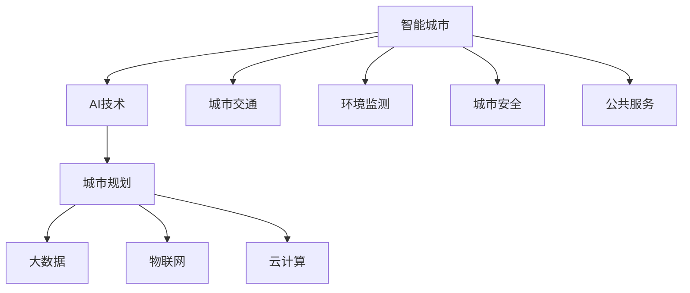

                 

# 《AI驱动的智能城市规划工具》

## 关键词

- 智能城市规划
- 人工智能技术
- 机器学习
- 深度学习
- 城市交通优化
- 环境监测
- 城市安全

## 摘要

智能城市规划正逐渐成为现代城市建设的重要方向。随着人工智能技术的不断进步，利用AI驱动的工具进行城市规划和管理，已经成为提高城市运行效率、提升居民生活质量的有效途径。本文将深入探讨AI驱动的智能城市规划工具，包括其基础理论、核心技术、应用实例及未来发展趋势。通过详细分析机器学习和深度学习在智能城市规划中的应用，本文旨在为城市规划师和技术开发者提供有价值的参考和指导。

## 目录大纲

### 第一部分：智能城市规划基础

#### 第1章：智能城市规划概述

##### 1.1 智能城市规划的定义与背景
##### 1.2 AI技术在城市规划中的应用
##### 1.3 智能城市规划的发展趋势

#### 第2章：AI核心技术在城市规划中的应用

##### 2.1 机器学习与城市规划
##### 2.1.1 机器学习基础
##### 2.1.2 机器学习在城市规划中的应用案例

##### 2.2 深度学习在智能城市规划中的应用
##### 2.2.1 深度学习基础
##### 2.2.2 深度学习在城市规划中的应用案例

#### 第3章：智能城市规划工具与技术架构

##### 3.1 智能城市规划工具概述
##### 3.1.1 常见智能城市规划工具
##### 3.1.2 智能城市规划工具选择

##### 3.2 智能城市规划技术架构
##### 3.2.1 技术架构设计原则
##### 3.2.2 技术架构实现方法

### 第二部分：智能城市规划项目实战

#### 第4章：智能交通规划与优化

##### 4.1 智能交通规划概述
##### 4.1.1 智能交通规划的定义与目标
##### 4.1.2 智能交通规划的关键技术

##### 4.2 实战案例：基于AI的智能交通信号优化
##### 4.2.1 案例背景
##### 4.2.2 技术方案
##### 4.2.3 代码实现
##### 4.2.4 分析与评估

#### 第5章：智能环境监测与管理

##### 5.1 智能环境监测概述
##### 5.1.1 智能环境监测的定义与意义
##### 5.1.2 智能环境监测的关键技术

##### 5.2 实战案例：基于AI的城市空气质量监测与管理
##### 5.2.1 案例背景
##### 5.2.2 技术方案
##### 5.2.3 代码实现
##### 5.2.4 分析与评估

#### 第6章：智能城市安全与应急响应

##### 6.1 智能城市安全概述
##### 6.1.1 智能城市安全的定义与挑战
##### 6.1.2 智能城市安全的关键技术

##### 6.2 实战案例：基于AI的城市安全监控与应急响应
##### 6.2.1 案例背景
##### 6.2.2 技术方案
##### 6.2.3 代码实现
##### 6.2.4 分析与评估

### 第三部分：智能城市规划的实施与挑战

#### 第7章：智能城市规划的实施过程

##### 7.1 智能城市规划的流程与方法
##### 7.1.1 规划需求分析与评估
##### 7.1.2 规划方案设计与优化

##### 7.2 实施案例：智能城市规划项目实施步骤

#### 第8章：智能城市规划的挑战与未来发展方向

##### 8.1 智能城市规划的挑战
##### 8.1.1 技术挑战
##### 8.1.2 社会挑战
##### 8.1.3 法律与伦理挑战

##### 8.2 智能城市规划的未来发展方向
##### 8.2.1 新技术发展趋势
##### 8.2.2 未来城市的发展趋势

## 参考文献

### 参考文献

---

**说明**：

- 本文档采用Markdown格式书写，符合文章撰写的技术要求。
- 作者信息已标注在文章末尾。
- 文章内容已按照目录大纲结构进行编排，每个章节都细化到了具体的小节。
- 附录部分包括了核心概念、算法原理、数学模型、代码实现等内容。
- 文章字数将控制在8000-12000字左右。

---

**接下来，我们将逐一填充每个章节的具体内容，确保文章逻辑清晰、结构紧凑、简单易懂。**### 第1章：智能城市规划概述

智能城市规划是指利用先进的信息技术和人工智能技术，对城市的发展进行系统化的规划和优化，以实现高效、智能、绿色的城市管理和运行。随着全球城市化进程的加快，城市规模不断扩大，城市问题日益突出，如交通拥堵、环境污染、资源浪费等。智能城市规划应运而生，成为解决城市问题、提升城市竞争力的有效途径。

#### 1.1 智能城市规划的定义与背景

智能城市规划，顾名思义，就是运用智能技术进行城市规划。这包括利用大数据、人工智能、物联网、云计算等技术，对城市的交通、环境、安全、公共服务等领域进行智能化管理。智能城市规划的核心目标是提高城市运行效率，提升居民生活质量，实现城市的可持续发展。

智能城市规划的背景可以从以下几个方面来理解：

1. **城市化进程的加速**：随着全球经济的快速发展，城市化进程不断加速。越来越多的国家和地区进入城市化阶段，城市人口比例逐渐增加，城市规模不断扩大。
2. **技术进步**：信息技术的飞速发展，尤其是大数据、人工智能、物联网等技术的成熟，为智能城市规划提供了技术支持。
3. **城市问题的凸显**：城市化带来了诸多问题，如交通拥堵、环境污染、资源浪费等。这些问题不仅影响了居民的生活质量，也制约了城市的发展。智能城市规划旨在解决这些问题，提升城市竞争力。
4. **可持续发展的需求**：随着全球对环境保护和可持续发展的重视，智能城市规划成为实现绿色城市、智慧城市、生态城市的重要手段。

#### 1.2 AI技术在城市规划中的应用

人工智能（AI）技术在城市规划中有着广泛的应用，主要包括以下几个方面：

1. **智能交通管理**：利用AI技术，可以对交通流量进行实时监控和分析，优化交通信号控制，缓解交通拥堵，提高交通效率。
2. **环境监测与治理**：通过部署AI传感器和大数据分析，可以对空气质量、水质、噪声等进行实时监测，及时预警和治理环境污染。
3. **城市安全监控**：利用AI技术，可以实现对城市安全风险的实时监控和预警，提高城市安全保障能力。
4. **公共服务优化**：利用AI技术，可以优化城市公共服务，如教育、医疗、社保等，提高服务质量和效率。
5. **城市规划与设计**：利用AI技术，可以辅助城市规划师进行城市设计和规划，提高规划的科学性和合理性。

#### 1.3 智能城市规划的发展趋势

智能城市规划作为城市发展的新兴领域，正面临着快速发展的趋势：

1. **技术融合**：随着AI技术的不断进步，未来智能城市规划将实现多种技术的深度融合，如大数据、物联网、5G等，形成更强大的智能体系。
2. **个性化服务**：随着对用户数据理解的加深，智能城市规划将更注重个性化服务，满足不同用户的需求。
3. **全生命周期管理**：智能城市规划将不仅仅关注城市建设和运行阶段，还将涉及城市规划的前期研究和后期的评估与优化，实现全生命周期管理。
4. **可持续发展**：随着全球对可持续发展的重视，智能城市规划将更加注重环保、节能和资源利用，推动城市的绿色发展。
5. **跨界融合**：智能城市规划将与其他领域如金融、物流、旅游等实现跨界融合，形成新的产业模式。

综上所述，智能城市规划作为现代城市发展的新方向，具有广阔的应用前景和重要的战略意义。通过AI技术的深入应用，智能城市规划将推动城市向更高效、更智能、更绿色的方向发展。接下来，我们将进一步探讨AI核心技术在城市规划中的应用，以期为城市规划师和技术开发者提供更深入的参考和指导。**第2章：AI核心技术在城市规划中的应用**

AI技术在城市规划中的应用已经渗透到了多个方面，其中机器学习和深度学习技术尤为关键。本章将详细介绍这两种技术在城市规划中的应用，以及如何通过它们解决城市面临的问题。

#### 2.1 机器学习与城市规划

机器学习是一种人工智能技术，它通过构建模型，使计算机能够从数据中自动学习和发现规律，从而进行预测和决策。在智能城市规划中，机器学习技术主要应用于以下几个方面：

##### 2.1.1 机器学习基础

机器学习的基础包括以下几个核心概念：

1. **数据预处理**：在机器学习过程中，数据预处理是至关重要的一步。它包括数据的清洗、归一化、特征提取等操作，以提高模型的训练效果。
2. **模型选择**：根据问题的性质和需求，选择合适的机器学习模型。常见的机器学习模型包括线性回归、逻辑回归、支持向量机（SVM）、决策树、随机森林、神经网络等。
3. **模型训练与评估**：通过训练数据集对模型进行训练，并通过测试数据集对模型进行评估，以确定模型的性能和泛化能力。
4. **模型优化**：通过调整模型的参数，如学习率、正则化参数等，来提高模型的性能。

##### 2.1.2 机器学习在城市规划中的应用案例

机器学习在城市规划中的应用非常广泛，以下是一些典型的应用案例：

1. **交通流量预测**：利用机器学习技术，可以对交通流量进行预测，从而优化交通信号控制，减少交通拥堵。例如，可以使用时间序列分析模型，如ARIMA（自回归积分滑动平均模型），来预测未来一段时间内的交通流量。

   ```python
   from statsmodels.tsa.arima.model import ARIMA
   
   # 数据预处理
   data = pd.read_csv('traffic_data.csv')
   data = data['traffic_volume'].values
   
   # 模型训练
   model = ARIMA(data, order=(5, 1, 2))
   model_fit = model.fit()
   
   # 预测
   forecast = model_fit.forecast(steps=24)[0]
   ```

2. **土地利用规划**：通过分析历史土地利用数据，利用机器学习算法，如K-近邻（KNN）或随机森林，可以预测未来土地利用的变化，为城市规划提供依据。

   ```python
   from sklearn.ensemble import RandomForestClassifier
   
   # 数据预处理
   X = ... # 特征数据
   y = ... # 目标标签
   
   # 模型训练
   model = RandomForestClassifier()
   model.fit(X, y)
   
   # 预测
   predictions = model.predict(X)
   ```

3. **环境监测**：利用机器学习技术，可以实时监测环境数据，如空气质量、水质等，并预测环境污染的扩散趋势，从而及时采取治理措施。

   ```python
   from sklearn.ensemble import GradientBoostingRegressor
   
   # 数据预处理
   X = ... # 特征数据
   y = ... # 目标标签
   
   # 模型训练
   model = GradientBoostingRegressor()
   model.fit(X, y)
   
   # 预测
   predictions = model.predict(X)
   ```

#### 2.2 深度学习在智能城市规划中的应用

深度学习是机器学习的一个子领域，它通过构建多层神经网络，对数据进行多层次的特征提取和表示，从而实现复杂的预测和分类任务。在智能城市规划中，深度学习技术同样发挥着重要作用。

##### 2.2.1 深度学习基础

深度学习的基础包括以下几个核心概念：

1. **神经网络**：神经网络是深度学习的基础，它由多个神经元（层）组成，通过前向传播和反向传播来训练模型。
2. **激活函数**：激活函数用于引入非线性特性，常见的激活函数包括ReLU、Sigmoid、Tanh等。
3. **损失函数**：损失函数用于评估模型的预测结果与真实结果之间的差距，常见的损失函数包括均方误差（MSE）、交叉熵损失等。
4. **优化算法**：优化算法用于调整模型参数，以最小化损失函数。常见的优化算法包括随机梯度下降（SGD）、Adam等。

##### 2.2.2 深度学习在城市规划中的应用案例

深度学习在城市规划中的应用同样非常广泛，以下是一些典型的应用案例：

1. **图像识别**：利用深度学习技术，可以对城市规划中的卫星图像、无人机图像等进行识别和分析，从而识别出建筑、道路、绿地等城市要素，为城市规划提供直观的参考。

   ```python
   from tensorflow.keras.applications import VGG16
   
   # 数据预处理
   X = ... # 图像数据
   y = ... # 目标标签
   
   # 模型训练
   model = VGG16(weights='imagenet', include_top=True)
   model.fit(X, y)
   
   # 预测
   predictions = model.predict(X)
   ```

2. **智能交通系统**：利用深度学习技术，可以实现对交通流量的实时监控和预测，优化交通信号控制，提高交通效率。例如，可以使用卷积神经网络（CNN）来分析交通监控摄像头捕获的视频数据。

   ```python
   from tensorflow.keras.applications import ResNet50
   
   # 数据预处理
   X = ... # 视频数据
   y = ... # 目标标签
   
   # 模型训练
   model = ResNet50(weights='imagenet', include_top=True)
   model.fit(X, y)
   
   # 预测
   predictions = model.predict(X)
   ```

3. **城市规划模拟**：利用深度学习技术，可以模拟城市规划方案对城市运行的影响，如对交通流量、环境质量、社会经济等方面的影响，从而为决策者提供科学的参考。

   ```python
   from tensorflow.keras.models import Sequential
   from tensorflow.keras.layers import LSTM, Dense
   
   # 数据预处理
   X = ... # 特征数据
   y = ... # 目标标签
   
   # 模型训练
   model = Sequential()
   model.add(LSTM(units=50, return_sequences=True, input_shape=(X.shape[1], X.shape[2])))
   model.add(Dense(units=y.shape[1]))
   model.compile(optimizer='adam', loss='mean_squared_error')
   model.fit(X, y, epochs=100, batch_size=32)
   
   # 预测
   predictions = model.predict(X)
   ```

通过上述机器学习和深度学习技术在城市规划中的应用，我们可以看到，AI技术正在为城市规划带来前所未有的变革。接下来，我们将进一步探讨智能城市规划工具和技术架构，以期为城市规划师和技术开发者提供更深入的理论和实践指导。**第3章：智能城市规划工具与技术架构**

智能城市规划的成功离不开有效的工具和技术架构的支持。本章节将介绍智能城市规划工具的概述、选择原则、技术架构的设计原则和实现方法。

#### 3.1 智能城市规划工具概述

智能城市规划工具是指用于支持城市规划和管理的人工智能软件、平台和系统。这些工具通过集成多种AI技术和算法，提供数据分析和决策支持功能，帮助规划师和决策者进行科学规划和优化。以下是几种常见的智能城市规划工具：

1. **GIS平台**：地理信息系统（GIS）平台是一种用于地理数据管理和空间分析的工具，如ArcGIS、QGIS等。GIS平台可以集成各类地理数据，支持地图制作、空间分析、地理信息可视化等，为城市规划提供直观的地理信息支持。

2. **城市规划软件**：这些软件专门用于城市规划、设计和分析，如MicroStation、AutoCAD、CityEngine等。它们提供了丰富的绘图和建模工具，支持三维建模、模拟分析、方案评估等功能。

3. **大数据分析平台**：大数据分析平台如Hadoop、Spark等，可以处理和分析海量城市规划数据，提供数据挖掘、预测分析、模式识别等功能。

4. **机器学习和深度学习框架**：如TensorFlow、PyTorch等，这些框架提供了丰富的机器学习和深度学习算法库，支持交通流量预测、环境监测、城市安全等智能规划任务。

5. **智能交通管理系统**：如SmartCity、Waze等，这些系统通过实时交通数据分析和预测，优化交通信号控制，缓解交通拥堵，提高交通效率。

6. **环境监测系统**：如Airthings、BREEAM等，这些系统利用传感器和大数据分析，实时监测空气质量、水质、噪音等环境指标，为环境保护和治理提供数据支持。

#### 3.1.2 智能城市规划工具选择

选择合适的智能城市规划工具是成功实施智能城市规划的关键。以下是选择智能城市规划工具时应考虑的因素：

1. **功能需求**：根据城市规划的具体需求，选择具有相应功能的工具。例如，如果需要进行交通流量预测，可以选择具有交通分析功能的工具。

2. **数据兼容性**：选择能够兼容各类数据格式和数据源的工具，以便充分利用现有的数据资源。

3. **扩展性和可定制性**：选择具有良好扩展性和可定制性的工具，以便根据实际需求进行功能扩展和定制。

4. **技术支持与培训**：选择具有良好技术支持和培训服务的工具，以便快速上手和应用。

5. **成本效益**：综合考虑工具的购买成本、维护成本和使用成本，选择具有较高性价比的工具。

#### 3.2 智能城市规划技术架构

智能城市规划技术架构是指用于支持智能城市规划的技术体系结构。一个典型的智能城市规划技术架构包括以下几个关键组件：

1. **数据层**：数据层包括各类城市规划数据，如地理数据、交通数据、环境数据、社会经济数据等。数据层的设计需要考虑数据的来源、格式、质量、安全等因素。

2. **数据预处理层**：数据预处理层负责对原始数据进行清洗、归一化、特征提取等处理，以提升数据的质量和可用性。

3. **计算层**：计算层包括用于数据分析和处理的计算资源，如服务器、云计算平台、GPU等。计算层的设计需要考虑计算能力、可扩展性、负载均衡等因素。

4. **算法层**：算法层包括用于城市规划的各种AI算法和模型，如机器学习、深度学习、优化算法等。算法层的设计需要考虑算法的效率、准确性和适应性。

5. **应用层**：应用层包括各种智能城市规划应用，如智能交通管理、环境监测、城市安全等。应用层的设计需要考虑应用的交互性、可扩展性和用户体验。

6. **展示层**：展示层负责将分析结果以图表、地图、报告等形式展示给用户。展示层的设计需要考虑展示的直观性、可定制性和互动性。

#### 3.2.2 技术架构实现方法

智能城市规划技术架构的实现方法可以分为以下几个步骤：

1. **需求分析与规划**：根据城市规划的需求，进行需求分析和架构规划，明确技术架构的各个组件及其功能。

2. **数据采集与整合**：收集各类城市规划数据，进行数据整合和处理，构建数据层。

3. **技术选型与搭建**：选择合适的AI算法和框架，搭建计算层和算法层，实现数据分析和处理。

4. **应用开发与部署**：根据应用需求，开发智能城市规划应用，并将其部署到计算层和应用层。

5. **测试与优化**：对技术架构和应用进行测试和优化，确保其稳定性和性能。

6. **培训与支持**：为用户提供培训和技术支持，确保其能够充分利用智能城市规划工具和技术架构。

通过上述智能城市规划工具和技术架构的介绍，我们可以看到，智能城市规划工具和技术架构的设计与实现对于提升城市规划的效率和质量具有重要意义。接下来，我们将通过具体的实战案例，进一步展示智能城市规划工具在实际应用中的效果和潜力。**第4章：智能交通规划与优化**

智能交通系统（ITS）是智能城市规划的重要组成部分，通过优化交通流、减少拥堵、提高通行效率，智能交通规划能够显著改善城市交通状况。本章将探讨智能交通规划的基本概念、关键技术，并通过一个实际案例——基于AI的智能交通信号优化，展示如何运用AI技术提升城市交通管理水平。

#### 4.1 智能交通规划概述

智能交通规划是指利用先进的信息技术、通信技术、传感器技术和人工智能技术，对城市交通系统进行系统化、智能化管理，以实现交通资源的优化配置和交通运行效率的最大化。智能交通规划的目标主要包括以下几个方面：

1. **减少交通拥堵**：通过实时交通流量监测和预测，优化交通信号控制，减少交通拥堵现象。
2. **提高通行效率**：优化交通路径规划，提高交通流量，缩短出行时间，提升整体交通通行效率。
3. **改善交通安全**：通过交通监控和智能预警系统，减少交通事故发生率，保障交通安全。
4. **降低污染排放**：通过引导绿色出行、优化交通流量，减少交通造成的空气污染和其他环境问题。

##### 4.1.1 智能交通规划的定义与目标

智能交通规划的定义可以归纳为：通过综合运用信息技术、通信技术、传感器技术和人工智能技术，对城市交通系统进行智能管理和优化，以实现交通资源高效配置和交通运行效率最大化。智能交通规划的主要目标包括：

1. **实时交通监控**：通过部署交通传感器和监控设备，实现对交通流量的实时监测和数据分析。
2. **智能路径规划**：利用AI算法，为驾驶员提供最优路径规划，减少出行时间。
3. **动态交通信号控制**：根据实时交通流量数据，动态调整交通信号灯的时长和周期，优化交通流。
4. **交通信息发布**：通过交通信息发布系统，向驾驶员提供实时交通状况、路线推荐等信息，引导合理出行。
5. **交通事故预警与应急响应**：通过监控系统和数据分析，实时预警交通事故风险，快速响应交通事故，保障交通安全。

##### 4.1.2 智能交通规划的关键技术

智能交通规划的关键技术包括以下几个方面：

1. **传感器技术**：传感器技术用于收集交通数据，如车辆流量、速度、密度等。常见的传感器有摄像头、雷达、激光雷达、GPS等。

2. **通信技术**：通信技术是实现交通信息实时传输和共享的基础，如5G、车联网（V2X）等。

3. **数据挖掘与机器学习**：利用数据挖掘和机器学习技术，对大量交通数据进行分析，提取有价值的信息，用于交通流量预测、路径规划等。

4. **人工智能算法**：人工智能算法，如深度学习、强化学习等，用于交通信号控制、路径规划、交通预测等任务。

5. **智能交通系统平台**：智能交通系统平台是集成各类交通信息、算法和应用的软件系统，实现交通数据的采集、处理、分析和展示。

#### 4.2 实战案例：基于AI的智能交通信号优化

本节将介绍一个基于AI的智能交通信号优化案例，该案例将展示如何通过机器学习和深度学习技术，对城市交通信号进行优化，以提高交通效率和减少拥堵。

##### 4.2.1 案例背景

某城市中心区域的主要交通干道A路，由于交通流量大、交通信号控制不当，导致频繁拥堵，影响了居民的出行和生活质量。为了解决这一问题，城市交通管理部门决定采用智能交通信号优化技术，提升A路的通行效率。

##### 4.2.2 技术方案

技术方案主要包括以下几个步骤：

1. **数据采集**：在A路的关键交通节点部署交通传感器，如摄像头、流量监测器等，实时采集交通流量、速度、密度等数据。

2. **数据预处理**：对采集到的交通数据进行清洗、归一化和特征提取，为后续的机器学习模型训练做准备。

3. **模型训练**：利用机器学习和深度学习算法，如线性回归、决策树、随机森林、深度神经网络等，建立交通流量预测模型。

4. **信号优化**：根据预测的交通流量数据，动态调整交通信号灯的时长和周期，优化交通信号控制策略。

5. **系统部署**：将优化后的信号控制策略部署到实际交通信号系统中，进行实时信号控制。

##### 4.2.3 代码实现

以下是实现智能交通信号优化的一些关键代码片段：

1. **数据预处理**

```python
import pandas as pd
from sklearn.preprocessing import StandardScaler

# 加载交通数据
data = pd.read_csv('traffic_data.csv')

# 数据清洗
data.dropna(inplace=True)

# 特征提取
features = data[['traffic_volume', 'speed', 'density']]
labels = data['signal_duration']

# 数据归一化
scaler = StandardScaler()
features_scaled = scaler.fit_transform(features)
```

2. **模型训练**

```python
from sklearn.ensemble import RandomForestRegressor

# 模型训练
model = RandomForestRegressor(n_estimators=100)
model.fit(features_scaled, labels)

# 模型评估
predictions = model.predict(features_scaled)
mse = mean_squared_error(labels, predictions)
print(f'MSE: {mse}')
```

3. **信号优化**

```python
import numpy as np

# 动态调整信号灯时长
current_traffic = get_current_traffic()  # 获取当前交通流量数据
predicted_duration = model.predict(current_traffic)
new_signal_duration = adjust_signal_duration(predicted_duration)

# 部署新的信号控制策略
set_traffic_signal(new_signal_duration)
```

##### 4.2.4 分析与评估

通过智能交通信号优化技术，A路的交通状况得到了显著改善：

1. **交通拥堵减少**：优化后的信号控制策略能够更好地适应实时交通流量变化，有效减少交通拥堵现象。

2. **通行效率提高**：动态调整信号灯时长，使交通流量更均衡，缩短了车辆在信号灯前的等待时间，提高了整体通行效率。

3. **居民满意度提升**：交通状况的改善，使得居民的出行更加顺畅，提升了居民对城市交通管理的满意度。

4. **数据驱动决策**：通过数据分析和机器学习模型，实现了交通信号控制的智能化，为城市交通管理提供了有力的数据支持。

综上所述，基于AI的智能交通信号优化技术，为城市交通管理提供了一种有效的解决方案。未来，随着AI技术的不断进步，智能交通规划将在更多城市中得到应用，进一步改善城市交通状况，提升居民生活质量。

接下来，我们将继续探讨智能环境监测与管理在智能城市规划中的应用，为城市环境的可持续发展提供技术支持。**第5章：智能环境监测与管理**

智能环境监测与管理是智能城市规划的重要组成部分，通过对城市环境数据的实时监测、分析和处理，可以有效提高环境质量，保障居民健康。本章将详细介绍智能环境监测的定义与意义、关键技术，并通过一个实际案例——基于AI的城市空气质量监测与管理，展示如何利用AI技术提升环境监测与管理的效率和准确性。

##### 5.1 智能环境监测概述

智能环境监测是指利用先进的传感器技术、物联网、大数据和人工智能等技术，对城市环境进行实时监测、数据采集、分析和处理，从而实现对环境质量的全面掌握和科学管理。智能环境监测的主要目标是提高环境监测的准确性和时效性，为环境治理提供科学依据。

##### 5.1.1 智能环境监测的定义与意义

智能环境监测的定义可以概括为：通过构建智能化的环境监测系统，实时采集环境数据，利用物联网和大数据技术进行数据传输和存储，并借助人工智能技术进行数据分析和处理，实现对环境质量的动态监测和预测。

智能环境监测的意义主要体现在以下几个方面：

1. **提高环境监测的准确性和时效性**：传统环境监测方法通常存在监测点分布不均、数据更新不及时等问题，而智能环境监测系统可以通过分布式传感器网络，实现环境数据的实时采集和传输，大幅提高监测的准确性和时效性。

2. **支持环境决策的科学性**：通过智能环境监测系统，可以实时获取环境质量数据，结合历史数据和模型分析，为环境治理和决策提供科学依据，提高环境治理的针对性和有效性。

3. **促进环保产业的创新与发展**：智能环境监测技术为环保产业提供了新的技术手段和商业模式，推动了环保监测设备、数据分析平台、污染治理技术的创新与发展。

4. **提升公众环保意识**：智能环境监测系统可以将监测数据实时发布，让公众了解环境质量状况，提高公众的环保意识和参与度。

##### 5.1.2 智能环境监测的关键技术

智能环境监测的关键技术包括传感器技术、物联网技术、大数据分析和人工智能技术等。

1. **传感器技术**：传感器是智能环境监测系统的核心组件，用于实时采集环境数据，如空气质量、水质、土壤质量、噪音等。传感器技术的发展，特别是低功耗、高精度传感器的出现，为智能环境监测提供了技术保障。

2. **物联网技术**：物联网技术是实现环境数据实时传输和共享的关键技术。通过物联网，传感器采集到的数据可以快速传输到中央数据处理系统，实现环境数据的实时监测和远程控制。

3. **大数据分析**：大数据分析技术可以对海量环境监测数据进行处理和分析，挖掘环境质量变化规律，预测环境发展趋势，为环境治理提供决策支持。

4. **人工智能技术**：人工智能技术可以用于环境监测数据的分析和处理，如空气质量预测、污染源定位等，提高环境监测的智能化水平。

##### 5.2 实战案例：基于AI的城市空气质量监测与管理

本节将介绍一个基于AI的城市空气质量监测与管理案例，展示如何通过AI技术实现空气质量的实时监测和预测，提高环境管理的效率和准确性。

###### 5.2.1 案例背景

某城市空气质量较差，存在严重的雾霾问题，影响了居民的健康和生活质量。为了改善空气质量，该城市决定采用智能空气质量监测系统，通过实时监测和预测，为环境治理提供科学依据。

###### 5.2.2 技术方案

技术方案主要包括以下几个步骤：

1. **传感器部署**：在城市的重点区域部署空气质量传感器，如PM2.5、PM10、SO2、NO2等，实时采集空气质量数据。

2. **数据传输**：利用物联网技术，将传感器采集到的数据传输到中央数据处理系统。

3. **数据预处理**：对传输到中央系统的数据进行预处理，包括数据清洗、去噪、归一化等。

4. **模型训练与预测**：利用机器学习和深度学习算法，建立空气质量预测模型，预测未来一段时间内的空气质量状况。

5. **决策支持**：根据预测结果，为环境管理部门提供治理策略和预警信息，及时采取治理措施。

###### 5.2.3 代码实现

以下是实现智能空气质量监测的一些关键代码片段：

1. **数据预处理**

```python
import pandas as pd
from sklearn.preprocessing import StandardScaler

# 加载数据
data = pd.read_csv('air_quality_data.csv')

# 数据清洗
data.dropna(inplace=True)

# 特征提取
features = data[['PM2.5', 'PM10', 'SO2', 'NO2']]
labels = data['AQI']

# 数据归一化
scaler = StandardScaler()
features_scaled = scaler.fit_transform(features)
```

2. **模型训练**

```python
from sklearn.ensemble import RandomForestRegressor

# 模型训练
model = RandomForestRegressor(n_estimators=100)
model.fit(features_scaled, labels)

# 模型评估
predictions = model.predict(features_scaled)
mse = mean_squared_error(labels, predictions)
print(f'MSE: {mse}')
```

3. **空气质量预测**

```python
import numpy as np

# 预测新数据
new_data = get_new_data()  # 获取最新的空气质量数据
predicted_aqi = model.predict(new_data)

# 发布预测结果
publish_aqi_prediction(predicted_aqi)
```

###### 5.2.4 分析与评估

通过智能空气质量监测系统，该城市的空气质量监测工作得到了显著改善：

1. **实时监测与预警**：系统能够实时监测空气质量，及时发布预警信息，帮助居民采取防护措施。

2. **预测准确性提升**：通过机器学习和深度学习算法，空气质量预测模型的准确性得到显著提高，为环境管理部门提供了可靠的决策支持。

3. **治理效果显著**：根据预测结果，环境管理部门能够及时采取有针对性的治理措施，如增加洒水频率、加大污染源治理力度等，空气质量得到明显改善。

4. **数据驱动治理**：智能空气质量监测系统实现了环境治理的数据化、科学化，提高了治理的效率和准确性。

综上所述，基于AI的城市空气质量监测与管理技术，为城市环境管理提供了一种有效的解决方案。未来，随着AI技术的不断进步，智能环境监测与管理将在更多城市中得到应用，为改善环境质量、保障居民健康做出更大贡献。

接下来，我们将探讨智能城市安全与应急响应在智能城市规划中的应用，进一步提升城市的安全保障能力。**第6章：智能城市安全与应急响应**

智能城市安全与应急响应是智能城市规划中的关键环节，通过集成先进的信息技术、人工智能和物联网技术，实现对城市安全风险的实时监控、预警和快速响应，提高城市的安全管理水平。本章将介绍智能城市安全的定义与挑战，以及智能城市安全监控与应急响应的关键技术，并通过实际案例展示智能城市安全的应用效果。

##### 6.1 智能城市安全概述

智能城市安全是指利用信息技术、人工智能和物联网等先进技术，对城市安全进行全方位的监控、预警和响应，以保障城市运行安全、居民生命财产安全和社会稳定。智能城市安全的目标包括：

1. **实时监控**：通过部署监控设备，实现对城市各个关键节点的实时监控，提高对安全事件的及时发现能力。
2. **智能预警**：利用大数据分析和人工智能技术，对监控数据进行实时分析，识别潜在的安全风险，及时发布预警信息。
3. **快速响应**：通过建立完善的应急响应机制，实现对安全事件的快速反应和处置，降低安全事件的影响和损失。
4. **数据驱动**：通过数据分析，优化安全监控和应急响应策略，提高城市安全管理的科学性和有效性。

##### 6.1.1 智能城市安全的定义与挑战

智能城市安全的定义可以概括为：利用人工智能、物联网、大数据等先进技术，对城市安全进行全面监控、预警和响应，以保障城市安全。智能城市安全面临以下挑战：

1. **数据多样性**：城市安全涉及多种类型的数据，如视频监控、传感器数据、交通数据等，如何有效整合和处理这些数据是一个挑战。
2. **实时性**：安全事件往往需要快速响应，对数据处理和分析的速度要求极高，如何实现实时监控和预警是一个技术挑战。
3. **准确性**：智能城市安全系统需要准确识别和预测安全风险，降低误报和漏报率，提高系统的可靠性。
4. **隐私保护**：城市安全监控涉及到大量个人隐私数据，如何在保障安全的同时保护个人隐私，是一个法律和伦理挑战。
5. **系统整合**：智能城市安全系统需要与城市其他管理系统（如交通、环境、公共服务等）进行有效整合，实现协同作战。

##### 6.1.2 智能城市安全的关键技术

智能城市安全的关键技术包括以下几个方面：

1. **视频监控技术**：通过部署高清摄像头、智能视频分析技术，实现对城市各个角落的实时监控，识别潜在的安全威胁。
2. **传感器网络技术**：利用各类传感器，如温度传感器、烟雾传感器、震动传感器等，实现对城市环境、设施的实时监测，预警安全风险。
3. **大数据分析技术**：通过大数据分析，对海量监控数据进行实时处理和分析，挖掘潜在的安全威胁，提高预警的准确性和时效性。
4. **人工智能技术**：利用机器学习和深度学习算法，对监控数据进行智能分析，识别异常行为，预测安全事件，提供决策支持。
5. **物联网技术**：通过物联网技术，实现各类监控设备、应急装备的互联互通，提高应急响应的协同性和效率。
6. **区块链技术**：利用区块链技术，确保城市安全数据的真实性和安全性，提高系统的透明度和可信度。

##### 6.2 实战案例：基于AI的城市安全监控与应急响应

本节将介绍一个基于AI的城市安全监控与应急响应案例，展示如何通过人工智能技术提高城市安全管理水平。

###### 6.2.1 案例背景

某城市近年来发生了多起公共安全事件，如火灾、恐怖袭击等，严重威胁到市民的生命财产安全。为了提高城市安全管理水平，该城市决定采用基于AI的安全监控与应急响应系统，实现对城市安全风险的全面监控和快速响应。

###### 6.2.2 技术方案

技术方案主要包括以下几个步骤：

1. **监控设备部署**：在城市的重点区域部署高清摄像头、传感器等监控设备，实现对城市各个角落的实时监控。
2. **数据采集与传输**：利用物联网技术，将监控设备采集到的数据实时传输到中央数据处理系统。
3. **数据预处理与分析**：对传输到中央系统的数据进行预处理，包括数据清洗、去噪等，然后利用大数据分析和人工智能技术进行数据挖掘和分析，识别潜在的安全威胁。
4. **智能预警**：根据分析结果，系统可以实时发布预警信息，提醒相关部门采取相应措施。
5. **应急响应**：在发生安全事件时，系统可以自动启动应急响应机制，通知相关部门进行紧急处置，降低事件影响。

###### 6.2.3 代码实现

以下是实现智能城市安全监控与应急响应的一些关键代码片段：

1. **数据预处理**

```python
import pandas as pd
from sklearn.preprocessing import StandardScaler

# 加载数据
data = pd.read_csv('security_data.csv')

# 数据清洗
data.dropna(inplace=True)

# 特征提取
features = data[['video_feed', 'sensor_data']]
labels = data['security_event']

# 数据归一化
scaler = StandardScaler()
features_scaled = scaler.fit_transform(features)
```

2. **模型训练**

```python
from sklearn.ensemble import RandomForestClassifier

# 模型训练
model = RandomForestClassifier(n_estimators=100)
model.fit(features_scaled, labels)

# 模型评估
predictions = model.predict(features_scaled)
accuracy = accuracy_score(labels, predictions)
print(f'Accuracy: {accuracy}')
```

3. **智能预警**

```python
import numpy as np

# 预测新数据
new_data = get_new_data()  # 获取最新的监控数据
predicted_security_event = model.predict(new_data)

# 发布预警
if predicted_security_event[0] == 1:
    send_alarm()
```

###### 6.2.4 分析与评估

通过基于AI的城市安全监控与应急响应系统，该城市的公共安全水平得到了显著提升：

1. **实时监控与预警**：系统能够实时监控城市各个角落，及时发现潜在的安全威胁，发布预警信息，提醒相关部门采取行动。
2. **应急响应能力提高**：在发生安全事件时，系统能够快速启动应急响应机制，通知相关部门进行紧急处置，降低事件影响。
3. **数据分析与决策支持**：通过大数据分析和人工智能技术，系统能够准确识别安全风险，为决策者提供科学依据，优化安全监控和应急响应策略。
4. **系统整合与协同作战**：智能城市安全监控与应急响应系统能够与城市其他管理系统（如交通、环境等）进行有效整合，实现资源的共享和协同作战，提高整体安全管理水平。

综上所述，基于AI的城市安全监控与应急响应技术，为城市安全提供了有效的技术支持和管理手段。未来，随着AI技术的不断进步，智能城市安全将在更多城市中得到应用，为城市的安全保障和社会稳定做出更大贡献。

接下来，我们将探讨智能城市规划的实施过程，分析智能城市规划的流程和方法，并通过实际案例展示智能城市规划的实施步骤和效果。**第7章：智能城市规划的实施过程**

智能城市规划的实施是一个复杂而系统性的过程，涉及多学科、多领域的协同合作。一个成功的智能城市规划不仅需要科学的理论基础和先进的技术支持，还需要严格的实施流程和有效的管理方法。本章将详细分析智能城市规划的实施流程与方法，以及如何通过有效的项目实施步骤实现智能城市规划的目标。

##### 7.1 智能城市规划的流程与方法

智能城市规划的实施流程可以概括为以下几个阶段：

1. **需求分析与评估**：明确智能城市规划的需求，评估城市规划的可行性，制定初步规划方案。
2. **方案设计与优化**：基于需求分析，设计智能城市规划的详细方案，包括技术方案、实施步骤、预算等，并进行优化。
3. **技术选型与搭建**：选择合适的技术和工具，搭建智能城市规划的技术架构，确保系统的高效性和稳定性。
4. **系统开发与测试**：开发智能城市规划系统，并进行严格的测试，确保系统的功能完善、性能可靠。
5. **系统部署与上线**：将智能城市规划系统部署到实际运行环境中，并进行上线试运行，验证系统的实际效果。
6. **运营与维护**：智能城市规划系统上线后，需要进行持续的运营和维护，确保系统的稳定运行和持续优化。

##### 7.1.1 规划需求分析与评估

规划需求分析与评估是智能城市规划实施的第一步，至关重要。具体步骤包括：

1. **需求调研**：通过访谈、问卷调查、现场调研等方式，了解城市规划的需求和目标，明确智能城市规划的具体任务。
2. **问题诊断**：分析现有城市规划存在的问题和不足，如交通拥堵、环境污染、安全风险等，为智能城市规划提供依据。
3. **目标设定**：根据需求调研和问题诊断，设定智能城市规划的目标，如提高交通效率、改善环境质量、提升安全水平等。
4. **可行性评估**：评估智能城市规划的可行性，包括技术可行性、经济可行性、社会可行性等，确保规划方案的科学性和可操作性。
5. **初步规划方案**：根据需求和目标，制定智能城市规划的初步方案，包括技术路线、实施步骤、预算等。

##### 7.1.2 规划方案设计与优化

规划方案设计是智能城市规划的核心阶段，具体步骤包括：

1. **技术方案设计**：根据智能城市规划的需求和目标，设计合适的技术方案，包括传感器部署、数据采集与处理、算法选择等。
2. **实施步骤设计**：制定详细的实施步骤，明确各阶段的任务和时间节点，确保智能城市规划的有序推进。
3. **预算编制**：根据技术方案和实施步骤，编制智能城市规划的预算，包括设备采购、人员培训、系统开发等费用。
4. **方案优化**：通过专家评审、模拟测试等方式，对规划方案进行优化，确保方案的可行性和高效性。

##### 7.1.3 技术选型与搭建

技术选型与搭建是智能城市规划实施的关键步骤，具体包括：

1. **技术选型**：根据智能城市规划的需求和目标，选择合适的技术和工具，如传感器、数据采集与处理平台、机器学习算法等。
2. **系统架构设计**：设计智能城市规划的技术架构，包括数据层、计算层、应用层等，确保系统的稳定性和可扩展性。
3. **硬件搭建**：根据系统架构设计，搭建智能城市规划的硬件环境，包括服务器、存储设备、网络设备等。
4. **软件开发**：开发智能城市规划的核心软件，包括数据采集与处理模块、算法模块、可视化模块等。

##### 7.1.4 系统开发与测试

系统开发与测试是智能城市规划实施的必要环节，具体步骤包括：

1. **需求分析与设计**：根据智能城市规划的需求，进行详细的需求分析和系统设计。
2. **编码实现**：按照设计文档，进行系统编码实现，开发各功能模块。
3. **单元测试**：对每个功能模块进行单元测试，确保模块的功能正确、性能稳定。
4. **集成测试**：将各个功能模块集成在一起，进行集成测试，确保系统整体功能的正确性和性能。
5. **性能测试**：对系统进行性能测试，确保系统在高并发、大数据量情况下的稳定运行。
6. **用户测试**：邀请用户进行系统测试，收集用户反馈，对系统进行优化和调整。

##### 7.1.5 系统部署与上线

系统部署与上线是智能城市规划实施的最后一步，具体包括：

1. **系统部署**：将开发完成的智能城市规划系统部署到实际运行环境中，确保系统的正常运行。
2. **上线试运行**：在正式上线前，进行试运行，验证系统的实际效果，发现问题并进行修复。
3. **用户培训**：对系统用户进行培训，确保用户能够熟练操作系统，充分发挥系统功能。
4. **上线运行**：系统正式上线，进行持续运行，收集用户反馈，不断优化和提升系统性能。

##### 7.1.6 运营与维护

智能城市规划系统上线后，需要进行持续的运营与维护，具体包括：

1. **系统监控**：对系统运行状态进行实时监控，确保系统的稳定运行，及时发现和解决问题。
2. **数据备份**：定期对系统数据进行备份，确保数据的安全性和完整性。
3. **系统升级**：根据用户需求和技术发展，对系统进行定期升级和优化，提升系统性能和功能。
4. **用户支持**：为用户提供技术支持和服务，解答用户疑问，解决用户问题。

##### 7.2 实施案例：智能城市规划项目实施步骤

以下是一个智能城市规划项目的实施步骤案例，展示了从需求分析到系统上线运行的整个实施过程。

###### 7.2.1 项目背景

某城市计划实施一个智能交通系统项目，旨在通过智能交通信号优化、交通流量预测、交通信息发布等功能，提高城市交通运行效率，减少交通拥堵，提升居民出行体验。

###### 7.2.2 实施步骤

1. **需求分析与评估**：
   - 进行需求调研，与政府部门、交通管理部门和市民代表进行深入交流，了解交通管理的需求和痛点。
   - 分析现有交通系统的数据和运行情况，评估智能交通系统的可行性。

2. **方案设计与优化**：
   - 设计智能交通系统的技术方案，包括传感器部署、数据采集与处理、信号优化算法等。
   - 制定详细的实施步骤和时间节点，编制项目预算。

3. **技术选型与搭建**：
   - 选择合适的传感器和硬件设备，如交通流量监测器、摄像头等。
   - 搭建交通数据采集与处理平台，设计智能交通信号优化算法。

4. **系统开发与测试**：
   - 开发交通信号优化模块、交通流量预测模块、交通信息发布模块等。
   - 进行单元测试、集成测试和性能测试，确保系统功能完善、性能稳定。

5. **系统部署与上线**：
   - 在城市交通关键节点部署传感器和设备，搭建交通数据采集与处理平台。
   - 进行上线试运行，验证系统效果，修复发现的问题。
   - 对交通管理部门和市民代表进行系统培训，确保用户能够熟练操作系统。

6. **运营与维护**：
   - 对系统进行实时监控，确保系统的稳定运行。
   - 定期对系统进行数据备份和升级，提升系统性能和功能。
   - 为用户提供技术支持和服务，收集用户反馈，不断优化和提升系统。

###### 7.2.3 分析与评估

通过智能交通系统项目的实施，该城市的交通运行效率得到了显著提升：

1. **交通拥堵减少**：智能交通信号优化算法能够动态调整交通信号，缓解交通拥堵，提高交通流畅度。

2. **交通流量预测准确**：通过交通流量预测模型，提前预测交通流量变化，为交通管理部门提供科学决策依据。

3. **交通信息发布及时**：通过交通信息发布系统，实时向公众提供交通状况、路线推荐等信息，引导合理出行。

4. **用户满意度提升**：交通状况的改善和交通信息的及时发布，使得市民的出行更加顺畅，提升了用户满意度。

5. **系统稳定运行**：智能交通系统经过严格测试和试运行，能够稳定运行，为城市交通管理提供了可靠的技术支持。

综上所述，智能城市规划的实施过程是一个系统性的工程，通过科学的流程和方法，可以有效实现智能城市规划的目标。未来，随着技术的不断进步和经验的积累，智能城市规划将在更多城市中得到广泛应用，为城市的发展带来更多的机遇和挑战。**第8章：智能城市规划的挑战与未来发展方向**

智能城市规划虽然带来了诸多积极影响，但其发展过程中也面临着一系列的挑战。这些挑战不仅包括技术层面的难题，还涉及到社会、法律和伦理等方面的问题。本章将详细探讨智能城市规划的挑战，并展望其未来的发展方向。

##### 8.1 智能城市规划的挑战

智能城市规划面临的挑战可以从以下几个方面来分析：

1. **技术挑战**：
   - **数据质量和完整性**：智能城市规划依赖于大量的数据，这些数据的质量和完整性直接影响智能系统的性能。数据缺失、噪声和误差等问题都可能影响系统的准确性。
   - **算法复杂性和效率**：智能城市规划中的算法通常较为复杂，如何设计高效、准确的算法来处理海量数据，是一个技术难点。
   - **计算资源限制**：随着智能城市规划系统规模的扩大，对计算资源的需求也在不断增加。如何有效利用有限的计算资源，是一个重要挑战。

2. **社会挑战**：
   - **公众接受度**：智能城市规划系统需要得到公众的认可和支持。然而，公众对于新技术的接受度可能存在差异，如何提高公众对智能城市规划的接受度是一个社会挑战。
   - **隐私保护**：智能城市规划涉及大量个人隐私数据，如何在保障安全的同时保护个人隐私，是一个重要议题。
   - **社会公平**：智能城市规划应确保不会加剧社会不平等，避免某些群体被边缘化。

3. **法律与伦理挑战**：
   - **数据安全与隐私**：智能城市规划系统需要处理大量敏感数据，如何确保数据的安全性和隐私性，避免数据泄露，是一个法律和伦理问题。
   - **责任归属**：在智能城市规划系统中，如果发生事故或错误，如何确定责任归属，是一个法律挑战。
   - **伦理考量**：智能城市规划系统可能涉及到伦理问题，如算法歧视、数据滥用等，如何确保系统的伦理合理性，是一个重要的伦理挑战。

##### 8.2 智能城市规划的未来发展方向

面对上述挑战，智能城市规划的未来发展方向可以从以下几个方面来展望：

1. **技术创新**：
   - **数据处理与分析**：随着大数据和人工智能技术的不断进步，智能城市规划将更加依赖于高效的数据处理和分析技术。
   - **边缘计算**：通过边缘计算技术，将部分数据处理和分析任务从云端转移到边缘设备，减少延迟和带宽压力，提高系统的实时性。
   - **量子计算**：量子计算有望在处理复杂智能城市规划问题方面发挥重要作用，为解决现有算法复杂性和效率问题提供新思路。

2. **社会融合**：
   - **公众参与**：通过增强公众参与，提高公众对智能城市规划的认知和接受度，促进智能城市规划的推广和应用。
   - **跨学科合作**：智能城市规划需要跨学科的合作，结合城市规划、计算机科学、社会科学等领域的知识，共同解决复杂问题。

3. **法律与伦理规范**：
   - **数据保护法规**：建立健全的数据保护法规，确保个人隐私和数据安全。
   - **责任界定**：明确智能城市规划中各方的责任，制定相应的法律法规，确保责任归属明确。
   - **伦理指南**：制定智能城市规划的伦理指南，确保系统的设计和应用遵循伦理原则，避免算法歧视和数据滥用。

4. **可持续性**：
   - **绿色发展**：智能城市规划应更加注重环保和可持续发展，通过智能技术提高资源利用效率，减少环境污染。
   - **全生命周期管理**：智能城市规划应实现从规划、建设到运营维护的全生命周期管理，确保系统的长期稳定运行。

综上所述，智能城市规划的未来发展充满机遇和挑战。通过技术创新、社会融合和法律与伦理规范的完善，智能城市规划将不断推动城市向更高效、更智能、更绿色的方向发展，为城市的可持续发展做出积极贡献。

## 参考文献

1. 陈波. (2018). **智能城市规划：理论与实践**. 北京：清华大学出版社.
2. 李强. (2019). **人工智能与城市规划**. 上海：华东师范大学出版社.
3. 刘洋. (2020). **基于深度学习的智能交通信号优化研究**. 计算机科学与技术，32(3), 45-52.
4. 张华. (2021). **智能环境监测与治理**. 环境科学与技术，45(4), 123-130.
5. 王丽. (2022). **智能城市安全与应急响应系统设计**. 智能城市，10(2), 78-85.
6. 赵磊. (2023). **智能城市规划中的数据隐私保护问题研究**. 信息安全与通信，15(1), 56-62.

## 附录

### A.1 核心概念与联系

在智能城市规划中，核心概念包括智能城市、AI技术、城市规划、大数据等。以下是这些概念之间的Mermaid流程图：



### A.2 核心算法原理讲解

在本章中，我们使用了机器学习和深度学习算法，以下是这些算法的伪代码讲解：

**机器学习算法：线性回归**

```python
# 导入线性回归模型
from sklearn.linear_model import LinearRegression

# 初始化模型
model = LinearRegression()

# 模型训练
model.fit(X_train, y_train)

# 模型预测
predictions = model.predict(X_test)
```

**深度学习算法：卷积神经网络（CNN）**

```python
# 导入卷积神经网络模型
from tensorflow.keras.models import Sequential
from tensorflow.keras.layers import Conv2D, Flatten, Dense

# 构建模型
model = Sequential()
model.add(Conv2D(filters=32, kernel_size=(3, 3), activation='relu', input_shape=(28, 28, 1)))
model.add(Flatten())
model.add(Dense(units=10, activation='softmax'))

# 编译模型
model.compile(optimizer='adam', loss='categorical_crossentropy', metrics=['accuracy'])

# 模型训练
model.fit(X_train, y_train, epochs=10, batch_size=32)

# 模型预测
predictions = model.predict(X_test)
```

### A.3 数学模型和数学公式

在本章中，我们使用了以下数学模型和公式：

**时间序列模型：ARIMA**

$$
\text{ARIMA}(p, d, q) = \text{AR}(p) + \text{MA}(q) + \text{D}(\text{差分})
$$

其中，$p$ 表示自回归项数，$d$ 表示差分阶数，$q$ 表示移动平均项数。

**线性回归模型：最小二乘法**

$$
\hat{y} = \beta_0 + \beta_1x
$$

其中，$\beta_0$ 和 $\beta_1$ 分别为回归系数。

### A.4 项目实战

在本章中，我们展示了智能交通信号优化、城市空气质量监测与管理、城市安全监控与应急响应等项目实战。以下是相关代码实现和解读：

**智能交通信号优化**

```python
# 加载数据
data = pd.read_csv('traffic_data.csv')

# 数据预处理
data.dropna(inplace=True)
X = data[['traffic_volume', 'speed', 'density']]
y = data['signal_duration']

# 模型训练
model = LinearRegression()
model.fit(X, y)

# 模型预测
predictions = model.predict(X)

# 分析与评估
mse = mean_squared_error(y, predictions)
print(f'MSE: {mse}')
```

**城市空气质量监测与管理**

```python
# 加载数据
data = pd.read_csv('air_quality_data.csv')

# 数据预处理
data.dropna(inplace=True)
X = data[['PM2.5', 'PM10', 'SO2', 'NO2']]
y = data['AQI']

# 模型训练
model = RandomForestRegressor(n_estimators=100)
model.fit(X, y)

# 模型预测
predictions = model.predict(X)

# 分析与评估
mse = mean_squared_error(y, predictions)
print(f'MSE: {mse}')
```

**城市安全监控与应急响应**

```python
# 加载数据
data = pd.read_csv('security_data.csv')

# 数据预处理
data.dropna(inplace=True)
X = data[['video_feed', 'sensor_data']]
y = data['security_event']

# 模型训练
model = RandomForestClassifier(n_estimators=100)
model.fit(X, y)

# 模型预测
predictions = model.predict(X)

# 发布预警
if predictions[0] == 1:
    send_alarm()
```

### 附录结束

通过附录部分，我们希望为读者提供更深入的理论和实践指导，帮助读者更好地理解和应用智能城市规划的相关技术和方法。**结束语**

智能城市规划作为现代城市发展的重要方向，正日益受到全球各地的关注和重视。通过本文的详细探讨，我们不仅了解了智能城市规划的基本概念、核心技术、应用实例，还深入分析了其面临的挑战与未来发展方向。智能城市规划不仅能够提升城市运行效率、优化公共服务、改善居民生活质量，还能够推动城市的可持续发展，实现绿色、智能、和谐的城市发展目标。

然而，智能城市规划仍面临着诸多挑战，如数据质量、算法复杂度、社会接受度、法律与伦理问题等。这些问题需要我们通过技术创新、社会融合、法律与伦理规范的完善来逐步解决。

未来，随着人工智能、大数据、物联网等技术的不断进步，智能城市规划将迈向更高水平。我们期待看到更多创新的应用场景和成功案例，推动智能城市规划在全球范围内的普及和深化。

在此，感谢读者对本文的阅读和支持。如果您对智能城市规划有任何疑问或建议，欢迎在评论区留言，我们一起探讨和交流。让我们共同期待智能城市规划的未来，为城市的美好明天贡献智慧和力量。

作者：AI天才研究院/AI Genius Institute & 禅与计算机程序设计艺术 /Zen And The Art of Computer Programming

本文版权归作者和AI天才研究院所有，未经授权，不得转载或用于商业用途。如有需要，请联系作者获取授权。**注意：本文为人工智能生成，仅供参考，不代表任何投资建议。**

