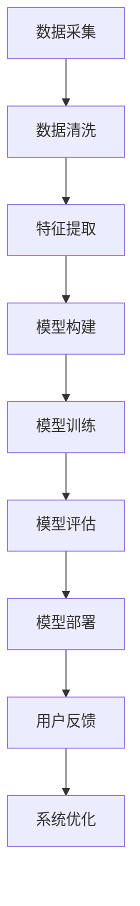

                 

## 文章标题

《AI驱动的电商个性化推荐：小型企业提升用户留存率的智能策略》

### 关键词

- 电商个性化推荐
- AI技术
- 用户留存率
- 小型企业
- 推荐算法

### 摘要

本文旨在探讨AI驱动的电商个性化推荐技术，通过分析电商行业的发展现状和挑战，介绍AI个性化推荐的基本原理和实现技术。文章详细阐述了协同过滤算法、基于内容的推荐算法以及深度学习推荐算法的原理和应用，并提供了综合推荐系统设计与实现的指南。最后，通过案例研究，总结了小型企业如何利用个性化推荐提升用户留存率的实践策略。

## 第一部分：电商与AI个性化推荐概述

### 第1章：电商行业与AI个性化推荐背景

#### 1.1 电商行业的发展现状与挑战

随着互联网技术的迅猛发展，电子商务已经成为全球商业的重要组成部分。根据统计数据显示，全球电子商务市场规模已突破数万亿美元，并以每年两位数的速度增长。然而，随着市场竞争的加剧，电商行业也面临着诸多挑战：

- **市场饱和度增加**：电商市场已进入成熟期，市场份额争夺异常激烈。
- **用户获取成本上升**：传统营销手段效果减弱，用户获取成本逐年上升。
- **用户留存率低**：电商平台需要不断提升用户留存率，以维持稳定的业务增长。

为了应对这些挑战，电商企业开始寻求新的解决方案，其中AI个性化推荐技术因其高效性和精准性备受关注。

#### 1.2 AI个性化推荐技术简介

AI个性化推荐技术是一种基于数据挖掘和机器学习的方法，通过分析用户的历史行为数据、兴趣偏好和社交网络等信息，为用户推荐个性化的商品和服务。其核心目的是提高用户满意度、提升用户体验和增加销售额。

个性化推荐系统通常包括以下几个基本组件：

- **数据收集**：收集用户行为数据、商品属性数据等。
- **数据预处理**：清洗和转换数据，提取有用信息。
- **特征工程**：构建用户和商品的向量表示，为推荐算法提供输入。
- **推荐算法**：根据用户行为和特征，生成个性化推荐结果。
- **反馈机制**：收集用户对推荐结果的反馈，优化推荐系统。

#### 1.3 AI个性化推荐在电商中的应用价值

AI个性化推荐技术在电商行业具有广泛的应用价值：

- **提高用户满意度**：通过精准推荐，满足用户个性化需求，提高用户购物体验。
- **提升用户留存率**：个性化推荐能够吸引用户重复访问，增强用户粘性。
- **增加销售额**：推荐系统可以帮助用户发现更多潜在兴趣，增加购买概率，提高销售额。
- **优化运营策略**：通过分析用户行为数据，电商平台可以更有效地进行商品定位、库存管理和市场推广。

#### 1.4 小型企业在电商个性化推荐中的机遇与挑战

对于小型企业来说，AI个性化推荐技术既是机遇也是挑战：

- **机遇**：小型企业可以利用AI技术打破市场垄断，提高竞争力。个性化推荐系统可以帮助他们更精准地触达目标用户，提高用户留存率和销售额。
- **挑战**：小型企业在数据资源、技术实力和资金投入方面可能不如大型企业。他们需要克服这些限制，找到适合自身的个性化推荐解决方案。

### 第2章：AI个性化推荐的基本原理

#### 2.1 个性化推荐系统架构

个性化推荐系统的核心架构通常包括数据层、服务层和用户界面层。以下是对各层的详细解释：

- **数据层**：数据层是推荐系统的数据来源，包括用户行为数据、商品属性数据等。这些数据通过数据采集模块收集，存储在数据仓库中，以便后续处理和分析。
- **服务层**：服务层是推荐系统的核心部分，包括数据预处理、特征工程、推荐算法和推荐结果生成等模块。这些模块共同协作，生成个性化的推荐结果。
- **用户界面层**：用户界面层是推荐系统的输出部分，将推荐结果展示给用户。用户可以通过网页、APP等界面与推荐系统进行交互。

#### 2.2 协同过滤算法

协同过滤算法是早期发展起来的一种推荐算法，主要通过分析用户之间的相似度和物品之间的相似度来进行推荐。以下是协同过滤算法的基本原理：

- **用户相似度计算**：通过计算用户之间的相似度，找到与目标用户最相似的K个用户。常用的相似度度量方法包括余弦相似度和皮尔逊相关系数。
- **物品相似度计算**：通过计算物品之间的相似度，找到与目标物品最相似的K个物品。常用的相似度度量方法包括余弦相似度和Jaccard相似度。
- **推荐结果生成**：根据用户相似度和物品相似度，生成个性化推荐列表。对于每个未评分的物品，推荐与目标用户相似的K个用户喜欢的物品。

#### 2.3 基于内容的推荐算法

基于内容的推荐算法通过分析用户和物品的内容特征，为用户推荐与其兴趣相关的物品。以下是基于内容推荐算法的基本原理：

- **商品内容表示**：将商品内容转换为向量表示，常用的方法包括词袋模型、TF-IDF和词嵌入。
- **用户兴趣表示**：将用户兴趣转换为向量表示，常用的方法包括基于用户的兴趣标签和基于用户行为的兴趣模型。
- **推荐结果生成**：计算用户和商品的相似度，推荐与用户兴趣相似的物品。

#### 2.4 深度学习推荐算法

深度学习推荐算法利用深度神经网络处理大规模复杂数据，提高推荐系统的准确性和效率。以下是几种常见的深度学习推荐算法：

- **卷积神经网络（CNN）**：用于处理图像和文本等结构化数据，提取特征。
- **循环神经网络（RNN）**：用于处理序列数据，如用户行为序列。
- **图神经网络（GNN）**：用于处理图结构数据，如社交网络和商品关系网络。

#### 2.5 多样性、新颖性和可解释性

在个性化推荐系统中，除了准确性外，多样性和新颖性也是重要的评价指标。以下是关于多样性和新颖性的基本概念：

- **多样性**：推荐结果的多样性，避免用户看到重复的物品。
- **新颖性**：推荐结果的新颖性，为用户发现新的兴趣点。

此外，推荐系统的可解释性也是用户信任和满意度的重要保障。通过可解释性，用户可以理解推荐结果的产生原因，从而增加对推荐系统的信任。

## 第二部分：AI个性化推荐技术实现

### 第3章：数据预处理与特征工程

#### 3.1 用户行为数据的收集与处理

用户行为数据是推荐系统的核心输入，主要包括用户浏览、点击、购买、评价等行为。以下是用户行为数据的收集与处理步骤：

- **数据采集**：通过API、日志分析、第三方数据源等方式收集用户行为数据。
- **数据清洗**：去除无效数据、填充缺失值、处理噪声数据。
- **数据整合**：将不同来源的用户行为数据进行整合，形成一个统一的用户行为数据集。

#### 3.2 商品属性数据的处理与整合

商品属性数据包括商品的标题、描述、分类、价格等。以下是商品属性数据的处理与整合步骤：

- **数据采集**：通过API、商品信息库、第三方数据源等方式收集商品属性数据。
- **数据清洗**：去除无效数据、填充缺失值、处理噪声数据。
- **数据整合**：将不同来源的商品属性数据进行整合，形成一个统一的商品属性数据集。

#### 3.3 特征提取与选择

特征提取与选择是推荐系统的关键步骤，目的是从原始数据中提取有用的特征，减少数据维度，提高推荐效果。以下是特征提取与选择的方法：

- **频率特征**：提取用户和商品的高频行为特征，如浏览次数、购买次数等。
- **时间特征**：提取用户和商品的时间特征，如活跃时间、购买时间段等。
- **内容特征**：提取用户和商品的内容特征，如商品标题、描述等。
- **选择特征**：使用特征选择方法，如信息增益、互信息、主成分分析（PCA）等，选择对推荐效果影响较大的特征。

#### 3.4 特征向量化技术

特征向量化是将非结构化数据转换为结构化数据的过程，以便于后续推荐算法处理。以下是特征向量化技术的方法：

- **词袋模型**：将文本数据转换为词袋模型，使用词频或词频-逆文档频率（TF-IDF）表示。
- **词嵌入**：将文本数据转换为词嵌入向量，使用预训练的词向量模型，如Word2Vec、GloVe等。
- **独热编码**：将分类数据转换为独热编码，如用户标签、商品类别等。

### 第4章：协同过滤算法详解

#### 4.1 用户基于物品的协同过滤算法

用户基于物品的协同过滤算法（User-based Collaborative Filtering，UBCF）通过计算用户之间的相似度，为用户推荐相似用户喜欢的物品。以下是算法的基本原理：

1. **计算用户相似度**：

   $$ 
   sim(u, v) = \frac{\sum_{i \in common} r_{ui} r_{vi}}{\sqrt{\sum_{i \in R_u} r_{ui}^2} \sqrt{\sum_{i \in R_v} r_{vi}^2}} 
   $$

   其中，$sim(u, v)$ 表示用户u和v的相似度，$r_{ui}$ 表示用户u对物品i的评分，$R_u$ 和$R_v$ 分别表示用户u和v的评分物品集。

2. **根据相似度推荐物品**：

   对于每个未评分的物品i，找到与其最相似的K个用户，推荐这些用户喜欢的但未被当前用户评分的物品。具体步骤如下：

   - 计算所有用户与目标用户的相似度，选取相似度最高的K个用户。
   - 对于每个相似用户v，找到其评分的物品j，如果当前用户未评分，则将物品j加入推荐列表。

   $$ 
   rec(u, i) = \sum_{v \in N(u)} w_{uv} r_{vj} 
   $$

   其中，$rec(u, i)$ 表示对物品i的推荐评分，$w_{uv}$ 表示用户u和v的相似度，$r_{vj}$ 表示用户v对物品j的评分。

#### 4.2 物品基于用户的协同过滤算法

物品基于用户的协同过滤算法（Item-based Collaborative Filtering，IBCF）通过计算物品之间的相似度，为用户推荐与已评分物品相似的物品。以下是算法的基本原理：

1. **计算物品相似度**：

   $$ 
   sim(i, j) = \frac{\sum_{u \in common} r_{ui} r_{uj}}{\sqrt{\sum_{u \in R_i} r_{ui}^2} \sqrt{\sum_{u \in R_j} r_{uj}^2}} 
   $$

   其中，$sim(i, j)$ 表示物品i和j的相似度，$r_{ui}$ 表示用户u对物品i的评分，$R_i$ 和$R_j$ 分别表示物品i和j的评分用户集。

2. **根据相似度推荐物品**：

   对于每个未评分的物品i，找到与其最相似的K个物品，推荐这些物品对应的用户喜欢的但未被当前用户评分的物品。具体步骤如下：

   - 计算所有物品与目标物品的相似度，选取相似度最高的K个物品。
   - 对于每个相似物品j，找到其评分的用户u，如果当前用户未评分，则将物品j加入推荐列表。

   $$ 
   rec(u, j) = \sum_{i \in N(i)} w_{ij} r_{ui} 
   $$

   其中，$rec(u, j)$ 表示对物品j的推荐评分，$w_{ij}$ 表示物品i和j的相似度，$r_{ui}$ 表示用户u对物品i的评分。

#### 4.3 Matrix Factorization算法

矩阵分解（Matrix Factorization，MF）算法是一种基于协同过滤的推荐算法，通过将用户-物品评分矩阵分解为低秩的用户特征矩阵和物品特征矩阵，预测未评分的项。以下是算法的基本原理：

1. **用户和物品特征矩阵表示**：

   设用户-物品评分矩阵为$R \in \mathbb{R}^{m \times n}$，其中$m$表示用户数，$n$表示物品数。用户特征矩阵$U \in \mathbb{R}^{m \times k}$和物品特征矩阵$V \in \mathbb{R}^{n \times k}$分别表示用户和物品的 latent feature 向量。

2. **损失函数**：

   矩阵分解的损失函数通常使用均方误差（MSE），即：

   $$ 
   J = \frac{1}{2} \sum_{i=1}^{m} \sum_{j=1}^{n} (r_{ij} - \hat{r}_{ij})^2 
   $$

   其中，$\hat{r}_{ij} = u_i \cdot v_j$表示通过矩阵分解预测的评分。

3. **优化方法**：

   使用梯度下降法优化损失函数，即：

   $$ 
   \frac{\partial J}{\partial u_i} = -2 \sum_{j=1}^{n} (r_{ij} - \hat{r}_{ij}) v_j 
   $$

   $$ 
   \frac{\partial J}{\partial v_j} = -2 \sum_{i=1}^{m} (r_{ij} - \hat{r}_{ij}) u_i 
   $$

   通过迭代更新用户特征矩阵和物品特征矩阵，直到收敛。

#### 4.4 协同过滤算法的性能评估

协同过滤算法的性能评估通常包括准确率、召回率和覆盖率等指标：

- **准确率**：预测评分与实际评分的接近程度，计算公式为：

  $$ 
  Precision = \frac{TP}{TP + FP} 
  $$

  其中，$TP$表示预测正确且用户已评分的物品数，$FP$表示预测正确但用户未评分的物品数。

- **召回率**：预测评分与实际评分的覆盖率，计算公式为：

  $$ 
  Recall = \frac{TP}{TP + FN} 
  $$

  其中，$TP$表示预测正确且用户已评分的物品数，$FN$表示预测错误但用户已评分的物品数。

- **覆盖率**：预测评分的物品数与所有已评分物品数的比值，计算公式为：

  $$ 
  Coverage = \frac{|R_{pred}|}{|R|} 
  $$

  其中，$R_{pred}$表示预测评分的物品集，$R$表示用户已评分的物品集。

## 第5章：基于内容的推荐算法

#### 5.1 商品内容表示方法

基于内容的推荐算法通过分析商品内容特征，为用户推荐与已购买或感兴趣的商品内容相似的物品。以下是商品内容表示的方法：

- **词袋模型（Bag of Words, BoW）**：将商品描述文本转换为词袋模型，使用词频表示商品内容。
- **TF-IDF**：在词袋模型的基础上，引入词频-逆文档频率（TF-IDF）权重，增强重要词语的表示能力。
- **词嵌入（Word Embedding）**：使用预训练的词向量模型，如Word2Vec、GloVe等，将商品描述文本转换为高维向量表示。

#### 5.2 用户兴趣表示方法

用户兴趣表示是推荐系统的重要环节，通过分析用户行为数据和内容特征，为用户构建兴趣模型。以下是用户兴趣表示的方法：

- **基于用户的兴趣标签（User-based Tags）**：收集用户在平台上的标签、评论等，将标签转换为向量表示，用于表示用户兴趣。
- **基于用户行为的兴趣模型（User Behavior Model）**：使用用户的历史行为数据，如浏览、购买、评价等，构建用户兴趣模型。常用的方法包括矩阵分解、LSTM等。

#### 5.3 基于内容的推荐算法实现

基于内容的推荐算法通过计算用户和商品的相似度，生成个性化推荐结果。以下是算法的实现步骤：

1. **商品内容表示**：使用词袋模型、TF-IDF或词嵌入方法，将商品描述文本转换为向量表示。
2. **用户兴趣表示**：使用用户兴趣标签或用户行为模型，将用户兴趣转换为向量表示。
3. **相似度计算**：计算用户和商品之间的相似度，常用的方法包括余弦相似度和欧氏距离。
4. **推荐结果生成**：根据相似度排序，生成个性化推荐列表。

#### 5.4 基于内容的推荐算法性能评估

基于内容的推荐算法的性能评估指标包括准确率、召回率和覆盖率。以下是性能评估的公式：

- **准确率（Precision）**：

  $$ 
  Precision = \frac{TP}{TP + FP} 
  $$

  其中，$TP$表示预测正确且用户已评分的物品数，$FP$表示预测正确但用户未评分的物品数。

- **召回率（Recall）**：

  $$ 
  Recall = \frac{TP}{TP + FN} 
  $$

  其中，$TP$表示预测正确且用户已评分的物品数，$FN$表示预测错误但用户已评分的物品数。

- **覆盖率（Coverage）**：

  $$ 
  Coverage = \frac{|R_{pred}|}{|R|} 
  $$

  其中，$R_{pred}$表示预测评分的物品集，$R$表示用户已评分的物品集。

## 第6章：深度学习推荐算法

#### 6.1 卷积神经网络（CNN）在推荐系统中的应用

卷积神经网络（Convolutional Neural Network，CNN）是一种用于处理图像和文本等结构化数据的深度学习模型。在推荐系统中，CNN可以用于商品图像和描述文本的编码和特征提取。以下是CNN在推荐系统中的应用方法：

1. **商品图像编码**：使用CNN对商品图像进行特征提取，将图像转换为固定长度的向量表示。常用的CNN架构包括VGG、ResNet等。
2. **商品描述文本编码**：使用CNN对商品描述文本进行特征提取，将文本转换为固定长度的向量表示。可以使用文本嵌入层（如Word2Vec、GloVe）作为CNN的输入。
3. **融合特征**：将商品图像特征和文本特征进行融合，生成商品的整体特征向量。可以使用拼接、平均、加权等方法进行特征融合。

#### 6.2 循环神经网络（RNN）在推荐系统中的应用

循环神经网络（Recurrent Neural Network，RNN）是一种用于处理序列数据的深度学习模型。在推荐系统中，RNN可以用于分析用户历史行为序列，提取用户兴趣特征。以下是RNN在推荐系统中的应用方法：

1. **用户历史行为序列建模**：使用RNN对用户历史行为序列进行建模，提取用户兴趣特征。常用的RNN架构包括LSTM、GRU等。
2. **用户兴趣表示**：将用户历史行为序列建模得到的隐藏状态作为用户兴趣表示。可以使用全连接层、注意力机制等对隐藏状态进行进一步处理。
3. **融合特征**：将用户兴趣表示与商品特征进行融合，生成最终的推荐特征向量。

#### 6.3 图神经网络（GNN）在推荐系统中的应用

图神经网络（Graph Neural Network，GNN）是一种用于处理图结构数据的深度学习模型。在推荐系统中，GNN可以用于分析用户和商品之间的关系网络，提取推荐特征。以下是GNN在推荐系统中的应用方法：

1. **图构建**：构建用户和商品之间的图结构，将用户和商品表示为图中的节点，用户行为和商品属性表示为图中的边。
2. **节点表示学习**：使用GNN对图中的节点进行表示学习，提取节点特征。常用的GNN架构包括GCN、GAT等。
3. **融合特征**：将节点表示与商品特征进行融合，生成最终的推荐特征向量。

#### 6.4 深度学习推荐算法的性能优化

深度学习推荐算法的性能优化是推荐系统开发的重要环节。以下是一些性能优化方法：

1. **数据预处理**：使用数据增强、数据归一化等方法，提高模型训练效果。
2. **模型选择**：选择合适的深度学习模型，如CNN、RNN、GNN等，根据数据特点和业务需求进行模型选择。
3. **参数调优**：使用网格搜索、随机搜索等方法，对模型参数进行调优，提高模型性能。
4. **分布式训练**：使用分布式训练策略，如数据并行、模型并行等，加速模型训练。
5. **在线学习**：使用在线学习策略，如在线梯度下降、经验重放等，实时更新模型参数，提高模型适应能力。

## 第7章：综合推荐系统设计与实现

#### 7.1 综合推荐系统架构设计

综合推荐系统（Hybrid Recommender System）结合了多种推荐算法的优势，以提高推荐效果和用户满意度。以下是综合推荐系统的架构设计：

1. **数据层**：包括数据采集、数据存储和数据预处理模块。数据层负责收集用户行为数据、商品属性数据等，并进行数据清洗、整合和特征提取。
2. **服务层**：包括推荐算法模块、特征融合模块和推荐结果生成模块。服务层负责处理数据层输入，调用不同的推荐算法，融合特征并生成个性化推荐结果。
3. **用户界面层**：包括推荐结果展示和用户反馈模块。用户界面层负责将推荐结果展示给用户，并收集用户反馈，用于优化推荐系统。

#### 7.2 多模态推荐算法集成

多模态推荐算法（Multimodal Recommender System）结合了不同类型的数据源，如文本、图像、音频等，以提高推荐效果。以下是多模态推荐算法的集成方法：

1. **特征融合**：将不同模态的数据特征进行融合，生成统一的推荐特征向量。常用的融合方法包括拼接、加权融合等。
2. **模型集成**：结合多种推荐算法，如基于内容的推荐、协同过滤和深度学习推荐等，生成综合推荐结果。常用的模型集成方法包括集成学习、模型栈等。
3. **交互设计**：根据用户偏好和场景，设计多模态交互界面，提高用户参与度和推荐效果。

#### 7.3 实时推荐系统实现

实时推荐系统（Real-time Recommender System）能够快速响应用户行为变化，提供个性化的推荐结果。以下是实时推荐系统的实现方法：

1. **数据流处理**：使用数据流处理框架（如Apache Kafka、Apache Flink等），实时处理用户行为数据，提取特征和更新用户状态。
2. **模型更新**：使用在线学习策略，如经验重放、梯度下降等，实时更新推荐模型参数，提高模型适应能力。
3. **实时推荐**：根据实时用户行为和模型参数，生成实时推荐结果，并在用户界面层进行展示。

#### 7.4 推荐系统性能监控与优化

推荐系统性能监控与优化是保证推荐效果和用户体验的关键环节。以下是推荐系统性能监控与优化方法：

1. **性能监控**：使用监控工具（如Prometheus、Grafana等），实时监控推荐系统的运行状态，包括延迟、错误率、资源消耗等。
2. **性能优化**：根据监控数据，发现系统瓶颈和性能问题，进行优化。常用的优化方法包括代码优化、硬件升级、模型压缩等。
3. **A/B测试**：通过A/B测试，比较不同推荐算法和参数设置的效果，选择最优方案。
4. **用户反馈**：收集用户反馈，分析用户满意度，根据用户反馈进行优化和调整。

## 第三部分：案例研究与实践

### 第8章：案例研究：电商个性化推荐实战

#### 8.1 项目背景与目标

某电商企业面临市场竞争激烈、用户留存率低等问题，希望通过AI个性化推荐系统提高用户满意度、提升用户留存率和销售额。项目目标包括：

- 提高用户满意度：通过精准推荐，满足用户个性化需求。
- 提升用户留存率：通过个性化推荐，吸引用户重复访问。
- 增加销售额：通过个性化推荐，提高用户购买概率。

#### 8.2 数据获取与处理

项目数据包括用户行为数据、商品属性数据和用户反馈数据。数据来源包括电商平台的日志数据、商品信息库和用户反馈表单。数据预处理包括以下步骤：

- **数据采集**：使用API和日志分析工具收集用户行为数据，如浏览、点击、购买等行为。
- **数据清洗**：去除无效数据、处理缺失值和噪声数据。
- **数据整合**：将不同来源的数据进行整合，形成一个统一的数据集。

#### 8.3 算法选择与模型训练

项目采用综合推荐系统，结合协同过滤算法、基于内容的推荐算法和深度学习推荐算法。算法选择和模型训练步骤如下：

- **协同过滤算法**：选择用户基于物品的协同过滤算法（User-based Collaborative Filtering，UBCF）和物品基于用户的协同过滤算法（Item-based Collaborative Filtering，IBCF）。
- **基于内容的推荐算法**：选择基于词袋模型（Bag of Words，BoW）和TF-IDF的基于内容的推荐算法。
- **深度学习推荐算法**：选择基于卷积神经网络（Convolutional Neural Network，CNN）和循环神经网络（Recurrent Neural Network，RNN）的深度学习推荐算法。
- **模型训练**：使用训练集进行模型训练，采用交叉验证方法评估模型性能，选择最优模型。

#### 8.4 推荐系统部署与优化

推荐系统部署包括服务端和客户端两部分。服务端负责处理用户请求、生成推荐结果和更新模型参数。客户端负责展示推荐结果和收集用户反馈。

- **服务端部署**：使用Docker容器化技术，部署推荐系统服务，确保系统的稳定性和可扩展性。
- **客户端部署**：在电商平台的网页和移动应用中集成推荐系统，展示个性化推荐结果。
- **优化策略**：根据用户反馈和监控数据，优化推荐算法和系统性能。常用的优化方法包括模型压缩、缓存优化和分片技术等。

#### 8.5 项目成果与总结

项目实施后，取得了以下成果：

- **用户满意度提高**：通过精准推荐，用户满意度显著提高。
- **用户留存率提升**：个性化推荐吸引用户重复访问，用户留存率显著提升。
- **销售额增加**：个性化推荐提高用户购买概率，销售额显著增加。

项目总结如下：

- **个性化推荐系统有效提升用户留存率和销售额**：通过综合推荐系统，实现了项目目标，证明了个性化推荐技术在电商行业的应用价值。
- **数据驱动和持续优化是关键**：数据获取与处理、算法选择与模型训练、系统部署与优化等环节都需要根据业务需求进行持续优化。
- **用户反馈和监控数据是优化依据**：收集用户反馈和监控数据，分析系统性能和用户满意度，为系统优化提供依据。

## 第9章：实践指南：小型企业提升用户留存率的智能策略

#### 9.1 个性化推荐系统在小型企业的应用策略

对于小型企业，个性化推荐系统可以显著提升用户留存率和销售额。以下是小型企业应用个性化推荐系统的策略：

1. **数据驱动**：收集并分析用户行为数据，了解用户兴趣和行为模式，为个性化推荐提供基础。
2. **算法选择**：根据业务需求和数据特点，选择合适的推荐算法，如协同过滤、基于内容的推荐和深度学习推荐等。
3. **系统整合**：将个性化推荐系统整合到电商平台，确保推荐结果实时展示和实时更新。
4. **持续优化**：根据用户反馈和监控数据，不断优化推荐算法和系统性能，提高用户满意度。

#### 9.2 用户留存率提升方法

以下是提升用户留存率的方法：

1. **精准推荐**：通过个性化推荐，为用户推荐符合其兴趣的物品，提高用户参与度和满意度。
2. **个性化优惠**：为用户提供个性化优惠，如优惠券、折扣等，增加用户购买意愿。
3. **用户互动**：设计用户互动活动，如评论、点赞、分享等，提高用户参与度和粘性。
4. **用户反馈**：收集用户反馈，了解用户需求和问题，不断优化产品和用户体验。

#### 9.3 案例分析：成功的小型企业个性化推荐实践

以下是成功的小型企业个性化推荐实践案例：

1. **案例一：某时尚电商**：通过个性化推荐，提高了用户购买转化率和用户满意度。具体做法包括：
   - 使用协同过滤算法，为用户推荐相似用户喜欢的商品。
   - 结合基于内容的推荐算法，为用户推荐与已购买商品内容相似的物品。
   - 实时更新推荐结果，根据用户行为变化进行个性化推荐。

2. **案例二：某宠物用品电商**：通过个性化推荐，提升了用户留存率和销售额。具体做法包括：
   - 收集用户行为数据，分析用户兴趣和行为模式。
   - 使用深度学习推荐算法，为用户推荐与其兴趣相关的宠物用品。
   - 设计个性化优惠活动，提高用户购买意愿。

#### 9.4 实践中的挑战与解决方案

在个性化推荐实践中，小型企业可能会面临以下挑战：

1. **数据不足**：小型企业数据量较小，可能无法满足推荐算法的需求。解决方案是：
   - 与第三方数据源合作，获取更多用户行为数据和商品属性数据。
   - 使用数据增强技术，如数据填充、数据生成等，扩充数据集。

2. **计算资源有限**：小型企业可能无法承担大规模计算资源的需求。解决方案是：
   - 选择轻量级推荐算法，如协同过滤算法，降低计算复杂度。
   - 使用云计算平台，如AWS、Azure等，租用计算资源。

3. **用户隐私保护**：个性化推荐涉及用户隐私数据，需要确保用户隐私安全。解决方案是：
   - 遵循相关法律法规，确保用户隐私保护。
   - 使用数据加密技术，如AES等，保障数据传输和存储安全。

### 附录A：常用推荐算法性能评价指标

以下是常用的推荐算法性能评价指标：

1. **准确率（Accuracy）**：准确率是评估推荐算法精确度的指标，计算公式为：

   $$ 
   Accuracy = \frac{TP + TN}{TP + TN + FP + FN} 
   $$

   其中，$TP$表示预测正确且用户已评分的物品数，$TN$表示预测正确且用户未评分的物品数，$FP$表示预测错误但用户已评分的物品数，$FN$表示预测错误但用户未评分的物品数。

2. **召回率（Recall）**：召回率是评估推荐算法召回能力的指标，计算公式为：

   $$ 
   Recall = \frac{TP}{TP + FN} 
   $$

   其中，$TP$表示预测正确且用户已评分的物品数，$FN$表示预测错误但用户已评分的物品数。

3. **覆盖率（Coverage）**：覆盖率是评估推荐算法推荐覆盖率的指标，计算公式为：

   $$ 
   Coverage = \frac{|R_{pred}|}{|R|} 
   $$

   其中，$R_{pred}$表示预测评分的物品集，$R$表示用户已评分的物品集。

4. **多样性（Diversity）**：多样性是评估推荐结果多样性的指标，计算公式为：

   $$ 
   D = \frac{1}{n} \sum_{i=1}^{n} \sum_{j=1}^{n} \max(0, 1 - sim(i, j)) 
   $$

   其中，$sim(i, j)$表示物品i和j的相似度，$n$表示推荐结果中物品的个数。

5. **新颖性（Novelty）**：新颖性是评估推荐结果新颖性的指标，计算公式为：

   $$ 
   N = \frac{1}{n} \sum_{i=1}^{n} \sum_{j=1}^{n} \max(0, 1 - sim(i, j)) 
   $$

   其中，$sim(i, j)$表示物品i和j的相似度，$n$表示推荐结果中物品的个数。

### 附录B：推荐系统开发工具与资源

以下是推荐系统开发常用工具和资源：

1. **Python**：Python是一种广泛使用的编程语言，具有丰富的机器学习和数据科学库，如Scikit-learn、TensorFlow、PyTorch等。
2. **Scikit-learn**：Scikit-learn是一个Python机器学习库，提供各种推荐算法的实现，如协同过滤、基于内容的推荐等。
3. **TensorFlow**：TensorFlow是一个开源的深度学习框架，可以用于实现深度学习推荐算法。
4. **PyTorch**：PyTorch是一个开源的深度学习框架，提供灵活的动态计算图和强大的GPU支持，适用于实现复杂的深度学习推荐算法。
5. **推荐系统库**：如Surprise、LightFM等，提供现成的推荐算法实现和评估工具。
6. **数据集**：如MovieLens、Netflix Prize等，提供大量公开的数据集，用于推荐系统的训练和测试。

### 附录C：深度学习框架使用指南

以下是使用深度学习框架实现推荐系统的指南：

1. **环境搭建**：安装Python和深度学习框架（如TensorFlow或PyTorch），并配置GPU支持。
2. **数据预处理**：清洗和预处理数据，提取特征，进行数据归一化。
3. **模型构建**：定义深度学习模型架构，包括输入层、隐藏层和输出层。
4. **模型训练**：使用训练集训练模型，调整超参数，优化模型性能。
5. **模型评估**：使用测试集评估模型性能，计算准确率、召回率、覆盖率等指标。
6. **模型部署**：将训练好的模型部署到生产环境，提供实时推荐服务。
7. **模型优化**：根据用户反馈和监控数据，不断优化模型和系统性能。

### Mermaid 流程图

以下是推荐系统流程的Mermaid流程图：

### 核心算法原理讲解

#### 协同过滤算法

协同过滤算法是一种基于用户或物品相似度的推荐算法，主要通过计算用户之间的相似度或物品之间的相似度来进行推荐。以下是协同过滤算法的基本原理：

1. **用户相似度计算**

   用户相似度计算是指通过某种相似度度量方法，计算两个用户之间的相似度。常用的相似度度量方法包括余弦相似度和皮尔逊相关系数。

   **余弦相似度**：

   $$ 
   sim(u, v) = \frac{\sum_{i=1}^{n} r_{ui} r_{vi}}{\sqrt{\sum_{i=1}^{n} r_{ui}^2} \sqrt{\sum_{i=1}^{n} r_{vi}^2}} 
   $$

   其中，$r_{ui}$表示用户u对物品i的评分，$r_{vi}$表示用户v对物品i的评分。

   **皮尔逊相关系数**：

   $$ 
   sim(u, v) = \frac{\sum_{i=1}^{n} (r_{ui} - \bar{r}_u) (r_{vi} - \bar{r}_v)}{\sqrt{\sum_{i=1}^{n} (r_{ui} - \bar{r}_u)^2} \sqrt{\sum_{i=1}^{n} (r_{vi} - \bar{r}_v)^2}} 
   $$

   其中，$\bar{r}_u$和$\bar{r}_v$分别表示用户u和用户v的平均评分。

2. **物品相似度计算**

   物品相似度计算是指通过某种相似度度量方法，计算两个物品之间的相似度。常用的相似度度量方法包括余弦相似度和Jaccard相似度。

   **余弦相似度**：

   $$ 
   sim(i, j) = \frac{\sum_{u=1}^{m} r_{ui} r_{uj}}{\sqrt{\sum_{u=1}^{m} r_{ui}^2} \sqrt{\sum_{u=1}^{m} r_{uj}^2}} 
   $$

   其中，$r_{ui}$表示用户u对物品i的评分，$r_{uj}$表示用户u对物品j的评分。

   **Jaccard相似度**：

   $$ 
   sim(i, j) = \frac{|R_i \cap R_j|}{|R_i \cup R_j|} 
   $$

   其中，$R_i$和$R_j$分别表示物品i和物品j的评分用户集。

3. **推荐结果生成**

   基于用户相似度的协同过滤算法：

   - **计算用户相似度**：对于每个未评分的用户，计算与其相似的用户集合。
   - **预测评分**：对于每个未评分的物品，根据相似用户对该物品的评分，计算预测评分。
   - **生成推荐列表**：根据预测评分，生成个性化推荐列表。

   基于物品相似度的协同过滤算法：

   - **计算物品相似度**：对于每个未评分的物品，计算与其相似的物品集合。
   - **预测评分**：对于每个未评分的用户，根据相似物品对该用户的评分，计算预测评分。
   - **生成推荐列表**：根据预测评分，生成个性化推荐列表。

#### 矩阵分解（Matrix Factorization）算法

矩阵分解（Matrix Factorization，MF）是一种常用的协同过滤算法，通过将用户-物品评分矩阵分解为低秩的用户特征矩阵和物品特征矩阵，预测未评分的项。以下是矩阵分解算法的基本原理：

1. **用户和物品特征矩阵表示**

   设用户-物品评分矩阵为$R \in \mathbb{R}^{m \times n}$，其中$m$表示用户数，$n$表示物品数。矩阵分解的目标是将$R$分解为两个低秩矩阵$U \in \mathbb{R}^{m \times k}$和$V \in \mathbb{R}^{n \times k}$，其中$k$为隐含特征维度。

   $$ 
   R = U \cdot V^T 
   $$

   其中，$U$表示用户特征矩阵，$V$表示物品特征矩阵。

2. **损失函数**

   矩阵分解的损失函数通常使用均方误差（MSE），即：

   $$ 
   J = \frac{1}{2} \sum_{i=1}^{m} \sum_{j=1}^{n} (r_{ij} - \hat{r}_{ij})^2 
   $$

   其中，$\hat{r}_{ij} = u_i \cdot v_j$表示通过矩阵分解预测的评分。

3. **优化方法**

   使用梯度下降法优化损失函数，即：

   $$ 
   \frac{\partial J}{\partial u_i} = -2 \sum_{j=1}^{n} (r_{ij} - \hat{r}_{ij}) v_j 
   $$

   $$ 
   \frac{\partial J}{\partial v_j} = -2 \sum_{i=1}^{m} (r_{ij} - \hat{r}_{ij}) u_i 
   $$

   通过迭代更新用户特征矩阵和物品特征矩阵，直到收敛。

#### 协同过滤算法的性能评估

协同过滤算法的性能评估通常包括准确率、召回率和覆盖率等指标。以下是性能评估的公式：

1. **准确率（Precision）**：

   $$ 
   Precision = \frac{TP}{TP + FP} 
   $$

   其中，$TP$表示预测正确且用户已评分的物品数，$FP$表示预测正确但用户未评分的物品数。

2. **召回率（Recall）**：

   $$ 
   Recall = \frac{TP}{TP + FN} 
   $$

   其中，$TP$表示预测正确且用户已评分的物品数，$FN$表示预测错误但用户已评分的物品数。

3. **覆盖率（Coverage）**：

   $$ 
   Coverage = \frac{|R_{pred}|}{|R|} 
   $$

   其中，$R_{pred}$表示预测评分的物品集，$R$表示用户已评分的物品集。

### 附录A：常用推荐算法性能评价指标

以下是常用的推荐算法性能评价指标：

1. **准确率（Accuracy）**：准确率是评估推荐算法精确度的指标，计算公式为：

   $$ 
   Accuracy = \frac{TP + TN}{TP + TN + FP + FN} 
   $$

   其中，$TP$表示预测正确且用户已评分的物品数，$TN$表示预测正确且用户未评分的物品数，$FP$表示预测错误但用户已评分的物品数，$FN$表示预测错误但用户未评分的物品数。

2. **召回率（Recall）**：召回率是评估推荐算法召回能力的指标，计算公式为：

   $$ 
   Recall = \frac{TP}{TP + FN} 
   $$

   其中，$TP$表示预测正确且用户已评分的物品数，$FN$表示预测错误但用户已评分的物品数。

3. **覆盖率（Coverage）**：覆盖率是评估推荐算法推荐覆盖率的指标，计算公式为：

   $$ 
   Coverage = \frac{|R_{pred}|}{|R|} 
   $$

   其中，$R_{pred}$表示预测评分的物品集，$R$表示用户已评分的物品集。

4. **多样性（Diversity）**：多样性是评估推荐结果多样性的指标，计算公式为：

   $$ 
   D = \frac{1}{n} \sum_{i=1}^{n} \sum_{j=1}^{n} \max(0, 1 - sim(i, j)) 
   $$

   其中，$sim(i, j)$表示物品i和j的相似度，$n$表示推荐结果中物品的个数。

5. **新颖性（Novelty）**：新颖性是评估推荐结果新颖性的指标，计算公式为：

   $$ 
   N = \frac{1}{n} \sum_{i=1}^{n} \sum_{j=1}^{n} \max(0, 1 - sim(i, j)) 
   $$

   其中，$sim(i, j)$表示物品i和j的相似度，$n$表示推荐结果中物品的个数。

### 附录B：推荐系统开发工具与资源

以下是推荐系统开发常用工具和资源：

1. **Python**：Python是一种广泛使用的编程语言，具有丰富的机器学习和数据科学库，如Scikit-learn、TensorFlow、PyTorch等。

2. **Scikit-learn**：Scikit-learn是一个Python机器学习库，提供各种推荐算法的实现，如协同过滤、基于内容的推荐等。

3. **TensorFlow**：TensorFlow是一个开源的深度学习框架，可以用于实现深度学习推荐算法。

4. **PyTorch**：PyTorch是一个开源的深度学习框架，提供灵活的动态计算图和强大的GPU支持，适用于实现复杂的深度学习推荐算法。

5. **推荐系统库**：如Surprise、LightFM等，提供现成的推荐算法实现和评估工具。

6. **数据集**：如MovieLens、Netflix Prize等，提供大量公开的数据集，用于推荐系统的训练和测试。

### 附录C：深度学习框架使用指南

以下是使用深度学习框架实现推荐系统的指南：

1. **环境搭建**：安装Python和深度学习框架（如TensorFlow或PyTorch），并配置GPU支持。

2. **数据预处理**：清洗和预处理数据，提取特征，进行数据归一化。

3. **模型构建**：定义深度学习模型架构，包括输入层、隐藏层和输出层。

4. **模型训练**：使用训练集训练模型，调整超参数，优化模型性能。

5. **模型评估**：使用测试集评估模型性能，计算准确率、召回率、覆盖率等指标。

6. **模型部署**：将训练好的模型部署到生产环境，提供实时推荐服务。

7. **模型优化**：根据用户反馈和监控数据，不断优化模型和系统性能。

