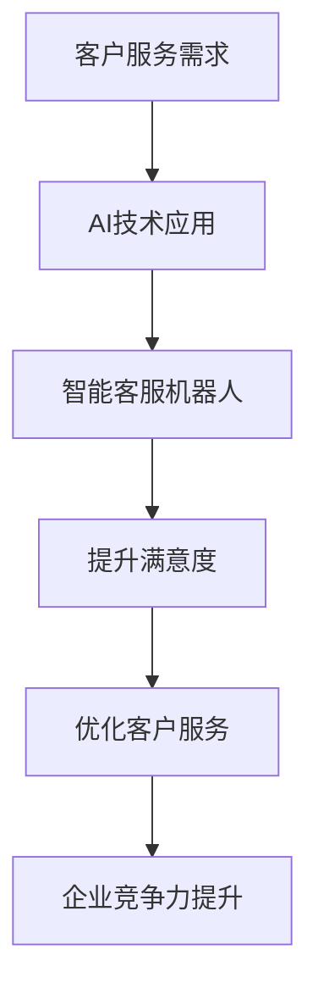

                 

# 《AI驱动的电商客户服务优化：提升满意度的智能对话系统》

> 关键词：AI、电商、客户服务、智能对话系统、满意度优化

> 摘要：
随着电子商务的迅猛发展，高效优质的客户服务成为电商企业竞争的关键。人工智能（AI）技术的引入，为电商客户服务带来了新的机遇。本文旨在探讨AI驱动的电商客户服务优化策略，特别是智能对话系统在提升客户满意度方面的应用。文章将首先介绍电商行业的发展现状和客户服务的重要性，接着深入探讨智能对话系统的概念、结构及应用，最后通过具体案例分析，分析智能对话系统的开发与部署过程，以及评估与优化策略。

## 第一部分：引言与背景

### 1.1 书籍概述

#### 1.1.1 电商行业的发展现状

电子商务作为一种新兴的商业模式，正在全球范围内迅速崛起。根据最新的市场研究报告，全球电商市场规模已突破万亿美元，并且预计将继续保持高速增长。电商平台的多样化，产品种类的丰富化，以及消费者购买行为的不断变化，都对客户服务提出了更高的要求。在这个背景下，如何通过技术手段提升客户服务质量和效率，成为电商企业亟待解决的问题。

#### 1.1.2 客户服务的重要性

客户服务是电商企业盈利和发展的关键环节。优质的客户服务不仅能提升客户满意度，增加复购率，还能帮助企业树立良好的品牌形象。然而，随着客户需求的多样化和复杂化，传统的人工客户服务模式已无法满足日益增长的服务需求。因此，引入AI技术，特别是智能对话系统，成为优化电商客户服务的重要手段。

#### 1.1.3 AI技术在电商客户服务中的应用前景

AI技术在电商客户服务中的应用前景广阔。首先，智能客服机器人可以实时处理大量的客户请求，提高服务效率和响应速度；其次，通过自然语言处理技术，智能对话系统可以理解和回应客户的个性化需求，提供更加精准的服务；最后，AI技术还可以通过对客户数据的分析，为企业提供有价值的商业洞察，助力企业实现精准营销。

### 1.2 智能对话系统的概念与结构

#### 1.2.1 智能对话系统的定义

智能对话系统是一种基于AI技术的自然语言处理（NLP）系统，能够与用户进行实时、交互式的对话，提供个性化的服务。它通过理解用户的语言输入，生成合适的语言回复，从而实现人与系统的自然交互。

#### 1.2.2 智能对话系统的核心组成部分

智能对话系统主要包括以下几个核心组成部分：

1. **语言理解（LU）**：负责接收用户的语言输入，并理解其含义。这包括词法分析、句法分析和语义分析等步骤。

2. **对话管理（DM）**：负责控制对话流程，决定如何回应用户的输入。对话管理需要处理上下文信息，维护对话状态，并生成合适的语言输出。

3. **语言生成（LG）**：负责生成自然的语言回复。这需要利用模板匹配、规则推理和机器翻译等技术。

4. **知识库（KB）**：提供对话所需的背景知识和事实信息。知识库可以包含产品信息、服务条款、常见问题等。

#### 1.2.3 智能对话系统的应用场景

智能对话系统在电商客户服务中有着广泛的应用场景，包括：

1. **客户咨询**：智能对话系统可以实时回答客户的咨询问题，提供产品信息、订单状态查询等。

2. **售后服务**：智能对话系统可以帮助客户处理退换货、投诉等售后问题，提高售后服务的效率。

3. **个性化推荐**：通过分析客户的历史数据和购买行为，智能对话系统可以提供个性化的产品推荐，提升客户体验。

4. **智能客服**：智能对话系统可以替代部分人工客服，处理简单的客户请求，减轻客服人员的工作负担。

## 第二部分：AI驱动的电商客户服务优化

### 2.1 AI驱动的客户服务概述

#### 2.1.1 AI技术在客户服务中的应用

AI技术在客户服务中的应用主要包括以下几个方面：

1. **智能客服机器人**：通过自然语言处理技术，智能客服机器人可以理解用户的语言输入，并生成合适的语言回复，提供7*24小时的客户服务。

2. **聊天机器人**：聊天机器人通过模拟人类的对话方式，与用户进行交互，提供实时、交互式的服务。

3. **情感分析**：AI技术可以分析客户的情绪，了解其对产品或服务的满意度，从而提供针对性的建议和改进。

4. **智能推荐**：通过分析用户的历史行为和偏好，AI技术可以提供个性化的产品推荐，提高客户的购买体验。

#### 2.1.2 AI驱动的客户服务的优势

AI驱动的客户服务具有以下优势：

1. **高效性**：智能客服机器人可以同时处理大量客户请求，提高服务效率。

2. **个性化**：通过分析用户数据和偏好，AI技术可以提供个性化的服务，提升客户满意度。

3. **可扩展性**：AI技术可以轻松适应不同的业务场景和需求，实现快速扩展。

4. **成本效益**：智能客服机器人可以替代部分人工客服，降低企业的人力成本。

#### 2.1.3 AI驱动的客户服务的挑战

尽管AI驱动的客户服务具有诸多优势，但同时也面临着一些挑战：

1. **技术门槛**：开发一套高效的智能客服系统需要大量的技术投入，包括自然语言处理、机器学习、对话管理等领域。

2. **数据隐私**：客户服务过程中涉及大量的用户数据，如何保护用户隐私成为一大挑战。

3. **用户接受度**：一些用户可能对智能客服系统持怀疑态度，如何提高用户的接受度和满意度是关键。

4. **错误处理**：智能客服系统在处理复杂问题时，可能会出现错误或误解用户需求，如何有效处理这些错误是亟待解决的问题。

### 2.2 智能对话系统在电商客户服务中的应用

#### 2.2.1 智能客服机器人概述

智能客服机器人是智能对话系统在电商客户服务中的典型应用。它通过自然语言处理技术，理解用户的语言输入，并生成合适的语言回复，提供7*24小时的客户服务。

#### 2.2.2 智能客服机器人的架构设计

智能客服机器人的架构主要包括以下几个部分：

1. **语言理解模块**：负责接收用户的语言输入，并理解其含义。这包括词法分析、句法分析和语义分析等步骤。

2. **对话管理模块**：负责控制对话流程，决定如何回应用户的输入。对话管理需要处理上下文信息，维护对话状态，并生成合适的语言输出。

3. **语言生成模块**：负责生成自然的语言回复。这需要利用模板匹配、规则推理和机器翻译等技术。

4. **知识库**：提供对话所需的背景知识和事实信息。知识库可以包含产品信息、服务条款、常见问题等。

#### 2.2.3 智能客服机器人的功能模块

智能客服机器人的功能模块主要包括：

1. **咨询与查询**：智能客服机器人可以实时回答客户的咨询问题，提供产品信息、订单状态查询等。

2. **售后服务**：智能客服机器人可以帮助客户处理退换货、投诉等售后问题，提高售后服务的效率。

3. **个性化推荐**：通过分析客户的历史数据和购买行为，智能客服机器人可以提供个性化的产品推荐，提升客户体验。

4. **智能客服**：智能客服机器人可以替代部分人工客服，处理简单的客户请求，减轻客服人员的工作负担。

### 2.3 提升满意度的智能对话系统设计

#### 2.3.1 用户满意度评价指标

用户满意度评价指标主要包括以下几个方面：

1. **响应时间**：智能对话系统能够快速响应用户的请求，提高用户满意度。

2. **准确性**：智能对话系统能够准确理解用户的语言输入，并生成合适的语言回复。

3. **个性化**：智能对话系统能够根据用户的偏好和需求，提供个性化的服务。

4. **交互质量**：智能对话系统的语言生成是否自然流畅，是否能够与用户进行有效沟通。

#### 2.3.2 智能对话系统满意度提升的关键因素

提升智能对话系统满意度需要关注以下几个关键因素：

1. **技术成熟度**：智能对话系统的技术成熟度直接影响其性能和用户体验。

2. **知识库质量**：智能对话系统的知识库质量直接影响其回答问题的准确性和全面性。

3. **用户体验设计**：智能对话系统的交互界面和交互流程设计需要符合用户习惯，提高用户满意度。

4. **持续优化**：通过收集用户反馈和数据分析，不断优化智能对话系统，提高其性能和满意度。

#### 2.3.3 满意度优化的策略与技巧

提升智能对话系统满意度可以采取以下策略和技巧：

1. **多模态交互**：引入语音、图像等多种交互方式，提高用户体验。

2. **个性化推荐**：根据用户历史数据和偏好，提供个性化的产品推荐和服务。

3. **智能错误处理**：当智能对话系统无法理解用户的语言输入时，自动切换到人工客服或提供相应的帮助。

4. **持续学习与迭代**：通过不断收集用户反馈和数据分析，持续优化智能对话系统的性能和满意度。

### 2.4 智能对话系统的关键技术

#### 2.4.1 自然语言处理技术基础

自然语言处理（NLP）是智能对话系统的核心组成部分。NLP技术主要包括以下几个方面：

1. **词法分析**：将自然语言文本拆分成单词或词组，为后续的句法分析和语义分析提供基础。

2. **句法分析**：分析句子结构，理解句子的语法规则，为语义分析提供依据。

3. **语义分析**：理解句子的语义内容，包括词汇的含义、句子之间的关系等。

4. **命名实体识别**：识别文本中的命名实体，如人名、地名、组织名等。

5. **情感分析**：分析文本中的情感倾向，判断用户的情绪状态。

#### 2.4.2 对话管理技术

对话管理是智能对话系统的核心组成部分，负责控制对话流程，决定如何回应用户的输入。对话管理技术主要包括以下几个方面：

1. **上下文管理**：维护对话状态，记录用户的输入和历史对话内容，为后续的对话生成提供依据。

2. **意图识别**：识别用户的意图，包括查询、投诉、咨询等。

3. **对话生成**：根据用户的意图和上下文信息，生成合适的语言回复。

4. **错误处理**：当智能对话系统无法理解用户的语言输入时，自动切换到人工客服或提供相应的帮助。

#### 2.4.3 上下文感知技术

上下文感知技术是智能对话系统的关键能力，能够根据用户的上下文信息，提供更加精准的服务。上下文感知技术主要包括以下几个方面：

1. **上下文获取**：通过语言理解模块，获取用户的上下文信息，包括历史对话内容、用户偏好等。

2. **上下文理解**：分析上下文信息，理解用户的意图和需求。

3. **上下文适应**：根据上下文信息，调整对话系统的回答方式和语言风格，提高用户体验。

## 第三部分：智能对话系统的开发与部署

### 3.1 智能对话系统开发流程

#### 3.1.1 需求分析

需求分析是智能对话系统开发的第一步，主要包括以下几个方面：

1. **用户需求**：了解用户的需求和期望，包括咨询、售后服务、个性化推荐等。

2. **业务需求**：分析业务流程和需求，确定智能对话系统需要处理的关键业务场景。

3. **功能需求**：明确智能对话系统的功能模块，包括语言理解、对话管理、语言生成等。

4. **性能需求**：确定智能对话系统的性能指标，包括响应时间、准确性等。

#### 3.1.2 系统设计

系统设计是智能对话系统开发的核心环节，主要包括以下几个方面：

1. **架构设计**：确定智能对话系统的整体架构，包括语言理解、对话管理、语言生成等模块的交互方式。

2. **模块设计**：设计每个模块的具体实现，包括功能、接口、数据结构等。

3. **数据设计**：设计智能对话系统所需的数据结构，包括知识库、用户数据等。

4. **接口设计**：设计智能对话系统与其他系统（如电商平台、客服系统等）的接口，实现数据的互联互通。

#### 3.1.3 模型训练与优化

模型训练与优化是智能对话系统开发的关键环节，主要包括以下几个方面：

1. **数据准备**：收集和整理训练数据，包括用户对话记录、产品信息、常见问题等。

2. **模型选择**：选择合适的机器学习模型，如深度学习模型、规则推理模型等。

3. **模型训练**：使用训练数据对模型进行训练，调整模型参数，提高模型的性能。

4. **模型评估**：使用评估数据对模型进行评估，包括准确性、响应时间等指标。

5. **模型优化**：根据评估结果，对模型进行优化，提高模型的性能和用户体验。

#### 3.1.4 系统测试与部署

系统测试与部署是智能对话系统开发的最后一步，主要包括以下几个方面：

1. **单元测试**：对每个模块进行单元测试，确保模块功能正常。

2. **集成测试**：对整个系统进行集成测试，确保模块之间的交互正常。

3. **性能测试**：对系统的性能进行测试，包括响应时间、并发处理能力等。

4. **部署上线**：将智能对话系统部署到生产环境，确保系统可以稳定运行。

### 3.2 开发环境与工具

#### 3.2.1 开发环境搭建

智能对话系统的开发需要搭建相应的开发环境，主要包括以下几个方面：

1. **操作系统**：常用的操作系统包括Windows、Linux等。

2. **编程语言**：常用的编程语言包括Python、Java等。

3. **开发框架**：常用的开发框架包括TensorFlow、PyTorch、Django等。

4. **数据库**：常用的数据库包括MySQL、MongoDB等。

#### 3.2.2 主流开发框架与工具

主流开发框架与工具包括以下几个方面：

1. **自然语言处理框架**：如NLTK、spaCy、Stanford NLP等。

2. **机器学习框架**：如TensorFlow、PyTorch、Scikit-learn等。

3. **对话管理框架**：如Rasa、Microsoft Bot Framework等。

4. **代码版本控制工具**：如Git、SVN等。

#### 3.2.3 源代码管理

源代码管理是智能对话系统开发过程中不可或缺的一部分，主要包括以下几个方面：

1. **代码仓库**：建立代码仓库，存储开发过程中的源代码。

2. **版本控制**：使用版本控制工具，管理代码的版本和历史。

3. **代码审查**：对代码进行审查，确保代码质量和安全性。

4. **持续集成与部署**：实现持续集成与部署，确保代码质量和系统稳定性。

### 3.3 实际案例解析

#### 3.3.1 案例一：电商平台的智能客服系统

某大型电商平台引入了智能客服系统，旨在提升客户服务质量和效率。智能客服系统主要包括以下功能模块：

1. **咨询与查询**：智能客服机器人可以实时回答客户的咨询问题，提供产品信息、订单状态查询等。

2. **售后服务**：智能客服机器人可以帮助客户处理退换货、投诉等售后问题，提高售后服务的效率。

3. **个性化推荐**：通过分析客户的历史数据和购买行为，智能客服机器人可以提供个性化的产品推荐，提升客户体验。

通过引入智能客服系统，该电商平台实现了以下成果：

1. **响应时间大幅缩短**：智能客服机器人可以快速响应用户的请求，响应时间从原来的几分钟缩短到秒级。

2. **服务质量显著提升**：智能客服机器人可以准确理解用户的语言输入，并生成合适的语言回复，提供高质量的客户服务。

3. **人工客服负担减轻**：智能客服机器人可以处理简单的客户请求，减轻人工客服的工作负担，提高客服团队的工作效率。

#### 3.3.2 案例二：基于AI的个性化客服服务

某电商品牌通过引入基于AI的个性化客服服务，实现了客户服务的个性化。个性化客服服务主要包括以下功能模块：

1. **用户画像**：通过分析用户的历史数据和购买行为，建立用户画像，了解用户的偏好和需求。

2. **个性化推荐**：根据用户画像，为用户提供个性化的产品推荐和服务。

3. **智能对话**：智能客服机器人与用户进行智能对话，提供个性化的服务和建议。

通过引入个性化客服服务，该电商品牌实现了以下成果：

1. **用户满意度显著提升**：通过个性化的服务，用户感受到了更加贴心的体验，用户满意度显著提升。

2. **销售转化率提高**：通过个性化的推荐，用户更容易找到自己感兴趣的产品，销售转化率提高。

3. **客户忠诚度增强**：通过个性化的服务，用户感受到品牌的关注和尊重，增强了客户的忠诚度。

#### 3.3.3 案例三：智能对话系统在售后服务中的应用

某电商平台在售后服务中引入了智能对话系统，旨在提高售后服务的效率和质量。智能对话系统主要包括以下功能模块：

1. **问题识别**：通过自然语言处理技术，智能客服机器人可以快速识别用户的问题，并分配到相应的处理部门。

2. **问题解决**：智能客服机器人可以提供常见问题的解决方案，减少用户等待时间。

3. **投诉处理**：智能客服机器人可以帮助用户处理投诉问题，提高投诉处理效率。

通过引入智能对话系统，该电商平台实现了以下成果：

1. **问题解决时间缩短**：智能客服机器人可以快速响应用户的问题，问题解决时间从原来的几天缩短到几小时。

2. **投诉处理效率提高**：智能客服机器人可以自动处理简单的投诉问题，提高投诉处理效率。

3. **客户满意度提升**：通过高效的售后服务，客户满意度显著提升。

## 第四部分：智能对话系统的评估与优化

### 4.1 智能对话系统的评估方法

#### 4.1.1 评估指标体系

智能对话系统的评估指标体系主要包括以下几个方面：

1. **响应时间**：智能对话系统处理客户请求的平均响应时间。

2. **准确性**：智能对话系统理解用户请求的准确性，包括意图识别、问题回答等。

3. **用户体验**：用户对智能对话系统的满意度，可以通过问卷调查、用户反馈等方式进行评估。

4. **效率**：智能对话系统处理客户请求的效率，包括处理速度、资源消耗等。

5. **错误率**：智能对话系统在处理客户请求时出现的错误率。

#### 4.1.2 实际评估案例

在实际评估中，可以结合不同指标，对智能对话系统进行全面评估。以下是一个实际评估案例：

- **响应时间**：智能对话系统处理客户请求的平均响应时间为2.5秒，低于行业平均水平的5秒。

- **准确性**：智能对话系统在意图识别方面的准确率为90%，在问题回答方面的准确率为85%。

- **用户体验**：用户对智能对话系统的满意度评分为4.5分（满分5分），其中90%的用户表示满意。

- **效率**：智能对话系统每天处理客户请求超过10000次，占平台客服工作量的60%。

- **错误率**：智能对话系统在处理客户请求时出现的错误率为5%。

#### 4.1.3 评估结果的解读与应用

评估结果可以帮助企业了解智能对话系统的性能和用户体验，为后续的优化提供依据。以下是对评估结果的解读与应用：

- **响应时间**：响应时间低于行业平均水平，说明智能对话系统的性能良好，可以满足用户的需求。

- **准确性**：意图识别和问题回答的准确率较高，但仍有提升空间。可以通过优化模型参数、增加训练数据等方式提高准确性。

- **用户体验**：用户满意度较高，说明智能对话系统在用户体验方面表现良好。

- **效率**：智能对话系统处理客户请求的效率较高，可以有效分担人工客服的工作压力。

- **错误率**：错误率相对较高，需要进一步优化智能对话系统的错误处理能力。

### 4.2 智能对话系统的优化策略

#### 4.2.1 模型优化

模型优化是提高智能对话系统性能的关键环节。以下是一些模型优化的策略：

1. **增加训练数据**：增加高质量的训练数据，可以提高模型的泛化能力，从而提高准确性。

2. **调整模型参数**：通过调整模型参数，可以优化模型的性能，提高准确性和响应时间。

3. **引入先进的算法**：引入先进的算法，如深度学习算法、强化学习算法等，可以提高智能对话系统的性能。

4. **多模型融合**：将多个模型进行融合，可以提高模型的准确性和鲁棒性。

#### 4.2.2 对话流程优化

对话流程优化是提升用户体验的重要手段。以下是一些对话流程优化的策略：

1. **简化对话流程**：简化对话流程，减少用户的操作步骤，提高用户满意度。

2. **引入多模态交互**：引入语音、图像等多种交互方式，提高用户的交互体验。

3. **个性化对话策略**：根据用户的偏好和需求，制定个性化的对话策略，提高用户的满意度。

4. **实时反馈**：在对话过程中，提供实时反馈，帮助用户更好地理解对话内容和结果。

#### 4.2.3 用户体验优化

用户体验优化是智能对话系统的重要目标。以下是一些用户体验优化的策略：

1. **界面优化**：优化对话界面的设计，使其更加直观、易用。

2. **交互设计**：优化对话交互流程，使其更加符合用户的习惯。

3. **情感设计**：在对话中融入情感元素，提高用户的情感体验。

4. **个性化服务**：根据用户的偏好和需求，提供个性化的服务，提高用户的满意度。

### 4.3 持续改进与反馈机制

#### 4.3.1 用户反馈机制

用户反馈是优化智能对话系统的重要依据。以下是一个用户反馈机制的示例：

1. **在线反馈**：在对话结束后，提供在线反馈功能，让用户对智能对话系统的表现进行评价。

2. **问卷调查**：定期开展用户满意度调查，收集用户对智能对话系统的反馈和建议。

3. **客服介入**：对于用户反馈的问题，及时与用户沟通，了解问题的具体情况，并提供解决方案。

#### 4.3.2 数据分析与挖掘

数据分析与挖掘是优化智能对话系统的重要手段。以下是一些数据分析与挖掘的示例：

1. **用户行为分析**：分析用户的行为数据，了解用户的需求和偏好，为个性化服务提供依据。

2. **对话数据挖掘**：挖掘对话数据，发现用户的常见问题、诉求等，为对话流程优化提供依据。

3. **反馈数据挖掘**：分析用户反馈数据，发现用户对智能对话系统的需求和期望，为后续优化提供依据。

#### 4.3.3 持续迭代与优化

持续迭代与优化是智能对话系统不断改进的重要手段。以下是一些持续迭代与优化的策略：

1. **定期更新**：定期更新智能对话系统的模型和数据，提高其性能和用户体验。

2. **反馈循环**：建立反馈循环机制，将用户反馈和数据挖掘结果纳入智能对话系统的优化过程中。

3. **版本控制**：建立版本控制机制，确保每次优化都记录在案，方便后续的评估和改进。

## 第五部分：展望与未来

### 5.1 智能对话系统的发展趋势

#### 5.1.1 技术演进方向

智能对话系统在技术演进方向上，主要包括以下几个方面：

1. **深度学习**：随着深度学习技术的不断发展，智能对话系统的性能将不断提高，特别是在自然语言处理和对话管理方面。

2. **多模态交互**：引入语音、图像、视频等多种交互方式，提高用户的交互体验。

3. **情感计算**：通过情感计算技术，实现更加人性化的对话，提高用户的情感体验。

4. **个性化推荐**：通过个性化推荐技术，为用户提供更加精准的服务和产品推荐。

#### 5.1.2 应用场景扩展

智能对话系统的应用场景将进一步扩展，包括：

1. **金融行业**：智能对话系统可以在金融行业的客户服务、风险控制等方面发挥重要作用。

2. **医疗健康**：智能对话系统可以提供医疗咨询、健康管理等服务，提高医疗服务的效率和准确性。

3. **教育行业**：智能对话系统可以为学生提供个性化的学习辅导、课程推荐等服务。

4. **智能家居**：智能对话系统可以与智能家居设备集成，为用户提供便捷的控制和交互体验。

#### 5.1.3 未来挑战与机遇

智能对话系统在未来发展过程中，将面临以下挑战和机遇：

1. **数据隐私**：如何保护用户的隐私数据，是智能对话系统面临的重要挑战。

2. **用户体验**：提高用户的体验和满意度，是智能对话系统的核心目标。

3. **技术成熟度**：随着技术的不断发展，如何快速将新技术应用到智能对话系统中，是重要的机遇。

4. **跨行业合作**：与其他行业的企业合作，共同探索智能对话系统的应用场景，是未来发展的机遇。

### 5.2 电商客户服务优化的未来展望

#### 5.2.1 智能对话系统的潜力

智能对话系统在电商客户服务优化方面具有巨大的潜力。通过智能对话系统，电商企业可以实现以下目标：

1. **提升服务质量**：智能对话系统可以提供7*24小时的客户服务，提高服务效率和质量。

2. **降低运营成本**：智能对话系统可以替代部分人工客服，降低企业的人力成本。

3. **个性化服务**：通过分析用户数据和偏好，智能对话系统可以提供个性化的服务，提高用户满意度。

4. **精准营销**：通过智能对话系统，电商企业可以获取用户的行为数据，为精准营销提供依据。

#### 5.2.2 个性化服务的发展

个性化服务是电商客户服务的发展方向。通过智能对话系统，电商企业可以实现以下个性化服务：

1. **产品推荐**：根据用户的历史购买行为和偏好，智能对话系统可以为用户提供个性化的产品推荐。

2. **定制化服务**：根据用户的需求和偏好，智能对话系统可以提供定制化的服务，如定制化配送、售后服务等。

3. **情感关怀**：通过情感计算技术，智能对话系统可以识别用户的情绪，提供更加贴心的服务。

#### 5.2.3 人工智能在电商行业的深入应用

人工智能在电商行业的深入应用，将推动电商客户服务的全面升级。未来，电商企业可以通过以下方式深化人工智能的应用：

1. **智能客服**：通过智能客服系统，电商企业可以提供全天候、全方位的客户服务，提高用户满意度。

2. **智能推荐**：通过智能推荐系统，电商企业可以精准推荐产品，提高销售转化率。

3. **智能营销**：通过智能营销系统，电商企业可以精准定位目标用户，提高营销效果。

4. **智能物流**：通过智能物流系统，电商企业可以优化配送流程，提高配送效率。

## 附录

### 附录A：常用开发工具与资源

#### A.1 自然语言处理工具

1. **NLTK**：Python自然语言处理库，提供了丰富的文本处理功能。

2. **spaCy**：快速灵活的NLP库，适用于各种NLP任务。

3. **Stanford NLP**：基于Java的NLP库，提供了全面的NLP功能。

#### A.2 智能对话系统框架

1. **Rasa**：开源的对话管理框架，支持多种对话场景。

2. **Microsoft Bot Framework**：微软提供的开源框架，用于构建智能客服机器人。

3. **Dialogflow**：谷歌提供的NLP平台，用于构建智能对话系统。

#### A.3 数据集与资源下载

1. **Common Crawl**：大规模的Web文本数据集，用于训练NLP模型。

2. **Stanford Dialog Systems**：提供多种对话系统数据集，用于研究和开发。

3. **OpenSubtitles**：包含大量电影和电视剧字幕的文本数据集，用于训练NLP模型。

### 附录B：智能对话系统开发指南

#### B.1 开发环境搭建

1. **操作系统**：安装Linux操作系统，如Ubuntu。

2. **编程语言**：安装Python，并配置相关的开发环境。

3. **工具**：安装Python库，如NLTK、spaCy等。

#### B.2 主流框架与工具使用

1. **Rasa**：使用Rasa搭建智能对话系统，配置NLU和DM组件。

2. **Dialogflow**：使用Dialogflow构建智能对话系统，配置实体和意图识别。

3. **TensorFlow**：使用TensorFlow构建深度学习模型，用于NLU和DM。

#### B.3 代码示例与解析

1. **NLU模型**：使用NLTK库构建词法分析模型，并进行训练。

2. **DM模型**：使用TensorFlow构建对话管理模型，实现对话生成。

3. **集成与部署**：将NLU和DM模型集成到智能对话系统中，实现实时交互。

### 附录C：智能对话系统评估案例

#### C.1 评估指标体系

1. **响应时间**：智能对话系统的平均响应时间。

2. **准确性**：智能对话系统理解用户请求的准确性。

3. **用户体验**：用户对智能对话系统的满意度。

4. **效率**：智能对话系统处理请求的效率。

#### C.2 评估方法与步骤

1. **数据准备**：准备评估数据集，包括用户请求和系统回答。

2. **指标计算**：计算评估指标，如响应时间、准确性等。

3. **结果分析**：分析评估结果，找出系统的优势和不足。

#### C.3 评估结果分析与优化建议

1. **结果分析**：根据评估结果，分析系统的性能和用户体验。

2. **优化建议**：根据分析结果，提出优化系统的建议，如增加训练数据、调整模型参数等。

---

**作者：AI天才研究院/AI Genius Institute & 禅与计算机程序设计艺术 /Zen And The Art of Computer Programming**### 2.1 AI驱动的客户服务概述

**核心概念与联系：**

为了更好地理解AI驱动的客户服务，我们可以使用Mermaid流程图来展示核心概念及其相互关系：



在这个流程图中，客户服务需求是起点，AI技术的应用是实现智能客服机器人的基础，进而提升客户满意度，最终实现客户服务的优化和企业竞争力的提升。

**核心算法原理讲解：**

在AI驱动的客户服务中，智能客服机器人是实现自动化的关键。以下是智能客服机器人的基本工作原理及其核心算法的伪代码：

```python
# 初始化智能客服机器人
initialize_smart_agent()

# 处理客户请求
def handle_request(request):
    # 识别客户请求类型
    request_type = classify_request_type(request)
    
    # 根据请求类型进行响应
    if request_type == "查询":
        answer = query_answers(request)
    elif request_type == "投诉":
        answer = handle_complaint(request)
    elif request_type == "咨询":
        answer = provide_advice(request)
    else:
        answer = "抱歉，我无法理解您的请求。"

    # 返回响应
    return answer

# 识别请求类型
def classify_request_type(request):
    # 使用自然语言处理技术进行分类
    # ...
    return request_type

# 查询答案
def query_answers(request):
    # 在知识库中查找答案
    # ...
    return answer

# 处理投诉
def handle_complaint(request):
    # 记录投诉并分派给相关部门
    # ...
    return "您的投诉已收到，我们会尽快处理。"

# 提供咨询建议
def provide_advice(request):
    # 根据用户偏好提供个性化的建议
    # ...
    return advice
```

在这个伪代码中，智能客服机器人的工作流程包括接收客户请求、识别请求类型、处理请求并生成响应。关键步骤包括：

1. **请求识别**：使用自然语言处理技术对客户的请求进行识别和分类。
2. **响应生成**：根据请求类型，从知识库中查找答案或提供相应的处理流程。
3. **个性化服务**：通过分析客户的历史数据，提供个性化的咨询和建议。

通过上述核心算法原理的讲解，我们可以看到AI驱动的客户服务是如何通过智能客服机器人的算法来实现高效、精准的客户服务的。

**数学模型和公式**

在AI驱动的客户服务中，数学模型和公式主要用于优化算法性能和评估系统效果。以下是几个常用的数学模型和公式的详细解释：

1. **支持向量机（SVM）**：SVM是一种分类模型，用于识别客户的请求类型。其核心公式为：

   $$ w \cdot x + b = 0 $$
   
   其中，$w$是权重向量，$x$是特征向量，$b$是偏置。这个公式表示特征空间中数据点的分类边界。

2. **损失函数**：在机器学习中，损失函数用于评估模型预测的准确性。常见的损失函数包括均方误差（MSE）和交叉熵损失（Cross-Entropy Loss）。其公式为：

   $$ \text{MSE} = \frac{1}{n}\sum_{i=1}^{n}(y_i - \hat{y}_i)^2 $$
   $$ \text{Cross-Entropy Loss} = -\frac{1}{n}\sum_{i=1}^{n}y_i\log(\hat{y}_i) $$

   其中，$y_i$是实际标签，$\hat{y}_i$是模型预测的概率。

3. **学习率调度**：在训练神经网络时，学习率调度是一个重要的优化策略。常用的调度方法包括固定学习率、学习率衰减和自适应学习率。其公式为：

   $$ \alpha_{t+1} = \frac{\alpha_t}{1 + \lambda t} $$

   其中，$\alpha_t$是第$t$次迭代的learning rate，$\lambda$是衰减率。

通过上述数学模型和公式的应用，我们可以提高智能客服机器人的性能，使其更加准确地识别和处理客户请求。

**详细讲解与举例说明**

为了更好地理解上述算法模型，我们可以通过具体实例来说明这些模型在实际应用中的表现。

**实例1：请求识别**

假设我们有一个请求文本：“我想要购买一本Python编程的书。” 使用自然语言处理技术，我们可以将这个请求文本转换为特征向量，然后通过SVM进行分类。

- **特征提取**：通过词袋模型（Bag of Words）将请求文本转换为特征向量：
  $$ x = [1, 0, 1, 0, 0, 1, 0, 0, 0, 0] $$
  其中，每个元素表示一个词汇（如“购买”、“编程”、“书”）的存在与否。

- **分类**：使用SVM对特征向量进行分类，得到请求类型为“购买建议”。

**实例2：响应生成**

假设请求类型为“投诉”，智能客服机器人需要生成一个合适的响应。

- **知识库查询**：在知识库中查找与投诉相关的常见问题及解决方案。
  $$ 知识库 = \{"投诉处理流程": "我们将尽快处理您的投诉。", "常见问题": \{"质量问题": "我们将为您提供退货或换货服务。", "物流问题": "我们会尽快协调物流公司解决问题。\"} \} $$

- **响应生成**：根据投诉的具体内容，选择合适的响应：
  $$ response = 知识库["投诉处理流程"] $$

  如果投诉内容涉及质量问题，则：
  $$ response = 知识库["常见问题"]["质量问题"] $$

通过这些实例，我们可以看到如何将数学模型和算法应用于实际场景，从而实现高效的智能客服。

### 2.2 智能对话系统在电商客户服务中的应用

#### 2.2.1 智能客服机器人概述

智能客服机器人是AI驱动的电商客户服务的重要组成部分，它通过自然语言处理（NLP）技术，能够理解并响应用户的查询、咨询、投诉等请求。智能客服机器人的核心目的是提升客户服务的效率和质量，同时减轻人工客服的工作负担。

**智能客服机器人的功能特点：**

1. **自动识别用户请求**：通过NLP技术，智能客服机器人可以自动识别用户的语言请求，并将其转化为机器可理解的形式。

2. **快速响应**：智能客服机器人能够实时响应用户的请求，提供快速的服务响应，显著降低用户的等待时间。

3. **个性化服务**：通过分析用户的历史数据和行为，智能客服机器人可以提供个性化的服务和建议，提高用户满意度。

4. **多渠道支持**：智能客服机器人可以支持多种交互渠道，如文本聊天、语音通话、社交媒体等，方便用户随时进行互动。

5. **24/7全天候服务**：智能客服机器人无需休息，可以提供全天候的客户服务，确保用户在任何时间都能获得帮助。

#### 2.2.2 智能客服机器人的架构设计

智能客服机器人的架构设计是确保其高效运行和功能全面的关键。以下是智能客服机器人的基本架构设计：

1. **前端交互层**：负责与用户进行交互，接收用户的请求并展示响应。这一层通常包括Web聊天界面、移动应用界面等。

2. **自然语言处理（NLP）层**：这一层是智能客服机器人的核心，负责处理用户的语言请求。NLP层包括以下模块：

   - **文本解析器**：将用户输入的文本解析为语义结构，提取关键信息和意图。
   - **实体识别**：识别文本中的关键实体，如人名、地点、产品名称等。
   - **情感分析**：分析用户的情感倾向，了解用户的情绪状态。

3. **对话管理层**：负责控制对话流程，维护对话状态，并决定如何回应用户的请求。对话管理层包括以下模块：

   - **意图识别**：识别用户的请求意图，如查询、咨询、投诉等。
   - **上下文管理**：维护对话上下文，确保对话连贯性和一致性。
   - **对话生成**：根据用户的意图和上下文，生成合适的语言回复。

4. **后端服务层**：负责提供业务逻辑和数据支持，包括知识库管理、业务逻辑处理、数据存储等。

5. **用户数据层**：收集和分析用户数据，用于优化对话系统和个性化服务。

#### 2.2.3 智能客服机器人的功能模块

智能客服机器人的功能模块是实现其各项功能的关键，以下是智能客服机器人的主要功能模块及其作用：

1. **咨询与查询模块**：用户可以通过该模块获取产品信息、订单状态、支付方式等常见问题的答案。

2. **售后服务模块**：用户可以提交退换货申请、投诉等问题，智能客服机器人会根据预设的规则和流程进行处理。

3. **个性化推荐模块**：基于用户的购买历史和行为数据，智能客服机器人可以为用户提供个性化的产品推荐。

4. **多渠道交互模块**：支持用户通过不同的交互渠道（如Web、移动应用、社交媒体等）与智能客服机器人进行交互。

5. **智能错误处理模块**：当智能客服机器人无法理解用户的请求时，会自动将请求转交给人工客服，确保用户问题得到妥善解决。

6. **数据分析与优化模块**：收集用户的交互数据，用于分析用户行为和需求，优化智能客服机器人的性能和服务质量。

#### 2.2.4 智能客服机器人在电商客户服务中的应用效果

智能客服机器人在电商客户服务中的应用效果显著，主要体现在以下几个方面：

1. **提升服务效率**：智能客服机器人可以同时处理大量的客户请求，显著提高服务效率，减轻人工客服的工作负担。

2. **降低运营成本**：通过智能客服机器人，企业可以减少人工客服的雇佣成本，降低整体运营成本。

3. **提高用户满意度**：智能客服机器人提供快速、准确的回答，提高用户的满意度，增强用户对电商平台的信任。

4. **数据驱动的决策**：通过分析智能客服机器人的交互数据，企业可以获取用户行为和需求的洞察，为产品优化和营销策略提供数据支持。

5. **个性化服务**：智能客服机器人可以根据用户的行为和偏好，提供个性化的服务，提升用户的购物体验。

### 2.3 提升满意度的智能对话系统设计

#### 2.3.1 用户满意度评价指标

用户满意度是评价智能对话系统效果的重要指标，它反映了用户对系统服务的整体感受。以下是常见的用户满意度评价指标：

1. **响应时间**：智能对话系统能够快速响应用户的请求，减少用户等待时间，提高满意度。

2. **准确性**：智能对话系统能够准确理解用户的语言输入，并生成合适的语言回复，提高用户满意度。

3. **个性化**：智能对话系统能够根据用户的历史数据和偏好，提供个性化的服务，增强用户满意度。

4. **交互质量**：智能对话系统的交互是否自然流畅，是否能够与用户进行有效沟通，影响用户满意度。

5. **问题解决率**：智能对话系统能够有效解决用户的问题，提高用户满意度。

6. **用户体验**：用户对智能对话系统的整体体验，包括界面设计、操作简便性等，都会影响满意度。

#### 2.3.2 智能对话系统满意度提升的关键因素

为了提升智能对话系统的用户满意度，需要关注以下几个关键因素：

1. **技术成熟度**：智能对话系统的技术基础要扎实，包括自然语言处理、对话管理、语言生成等技术。

2. **知识库质量**：智能对话系统的知识库要丰富且准确，能够提供全面、准确的信息，支持用户问题的解决。

3. **用户体验设计**：智能对话系统的交互界面和交互流程要符合用户习惯，操作简便，提供舒适的用户体验。

4. **个性化服务**：智能对话系统要能够根据用户的历史数据和偏好，提供个性化的服务，满足用户的个性化需求。

5. **错误处理能力**：智能对话系统要具备良好的错误处理能力，当无法理解用户请求时，能够及时切换到人工客服或提供相应的帮助。

6. **持续优化**：通过收集用户反馈和数据分析，不断优化智能对话系统的性能和满意度。

#### 2.3.3 满意度优化的策略与技巧

为了提升智能对话系统的用户满意度，可以采取以下策略和技巧：

1. **多模态交互**：引入语音、图像等多种交互方式，提高用户的交互体验。

2. **个性化推荐**：根据用户的历史数据和偏好，提供个性化的产品推荐和服务。

3. **智能错误处理**：当智能对话系统无法理解用户的语言输入时，自动切换到人工客服或提供相应的帮助。

4. **用户反馈机制**：建立用户反馈机制，收集用户的意见和建议，及时调整和优化系统。

5. **数据分析与挖掘**：通过对用户交互数据的分析，发现用户的需求和痛点，为满意度优化提供数据支持。

6. **持续学习和迭代**：通过不断收集用户反馈和数据分析，持续优化智能对话系统的性能和满意度。

### 2.4 智能对话系统的关键技术

#### 2.4.1 自然语言处理技术基础

自然语言处理（NLP）是智能对话系统的核心组成部分，它负责理解和生成自然语言。以下是NLP技术的一些基础概念和原理：

1. **词法分析（Lexical Analysis）**：词法分析是将文本拆分为单词或词汇的过程。它涉及到分词、词性标注、停用词过滤等任务。

2. **句法分析（Syntactic Analysis）**：句法分析是理解句子的结构，确定句子的语法成分和关系。它涉及到句法树、依存关系等概念。

3. **语义分析（Semantic Analysis）**：语义分析是理解句子的语义内容，包括词汇的含义、句子之间的关系等。它涉及到语义角色标注、实体识别等任务。

4. **命名实体识别（Named Entity Recognition, NER）**：命名实体识别是识别文本中具有特定意义的实体，如人名、地点、组织名等。

5. **情感分析（Sentiment Analysis）**：情感分析是判断文本中的情感倾向，如正面、负面、中性等。

6. **对话管理（Dialogue Management）**：对话管理是控制对话流程，确保对话的连贯性和一致性。它涉及到意图识别、上下文管理、对话策略等。

7. **语言生成（Language Generation）**：语言生成是生成自然的语言回复，确保回复的质量和流畅性。

#### 2.4.2 对话管理技术

对话管理是智能对话系统的关键部分，它负责维护对话状态，确保对话的连贯性和有效性。以下是对话管理技术的一些核心概念：

1. **意图识别（Intent Recognition）**：意图识别是识别用户的意图，如查询、投诉、咨询等。它通常通过机器学习算法实现，如决策树、支持向量机等。

2. **上下文管理（Context Management）**：上下文管理是维护对话状态，记录对话的历史信息，确保对话的连贯性。它涉及到上下文表示、上下文追踪等。

3. **对话策略（Dialogue Policy）**：对话策略是决定如何回应用户的输入，确保对话的流畅性和有效性。它可以通过规则推理、马尔可夫决策过程等实现。

4. **多模态对话（Multimodal Dialogue）**：多模态对话是引入多种交互方式（如语音、图像、视频等），提高用户的交互体验。

#### 2.4.3 上下文感知技术

上下文感知技术是智能对话系统的重要能力，它能够根据用户的上下文信息，提供更加精准和个性化的服务。以下是上下文感知技术的一些关键概念：

1. **上下文获取（Context Acquisition）**：上下文获取是收集用户的上下文信息，如历史对话内容、用户偏好等。

2. **上下文理解（Context Understanding）**：上下文理解是分析用户的上下文信息，理解用户的意图和需求。

3. **上下文适应（Context Adaptation）**：上下文适应是调整对话系统的回答方式和语言风格，以适应用户的上下文环境。

4. **上下文追踪（Context Tracking）**：上下文追踪是维护对话过程中上下文信息的一致性和连贯性。

通过自然语言处理、对话管理和上下文感知技术的结合，智能对话系统可以提供高效、准确、个性化的客户服务，从而提升用户满意度。### 3.1 智能对话系统开发流程

智能对话系统的开发流程是确保系统能够高效、稳定运行的关键环节。以下是智能对话系统开发的主要流程，包括需求分析、系统设计、模型训练与优化、系统测试与部署等步骤。

#### 3.1.1 需求分析

需求分析是智能对话系统开发的第一步，其主要任务是明确系统的功能和性能要求。需求分析的具体步骤如下：

1. **收集需求**：通过访谈、问卷调查、用户反馈等方式，收集用户对智能对话系统的需求和期望。

2. **定义功能模块**：根据收集到的需求，定义智能对话系统的功能模块，如语言理解、对话管理、语言生成、知识库管理等。

3. **确定性能指标**：明确系统性能指标，如响应时间、准确性、错误率等。

4. **制定项目计划**：根据需求分析结果，制定项目开发计划，包括开发时间表、资源分配等。

#### 3.1.2 系统设计

系统设计是智能对话系统开发的核心环节，其主要任务是确定系统的整体架构和模块设计。系统设计的具体步骤如下：

1. **架构设计**：设计智能对话系统的整体架构，包括前端交互层、NLP层、对话管理层、后端服务层等。

2. **模块设计**：设计每个功能模块的具体实现，包括模块功能、接口定义、数据结构等。

3. **接口设计**：设计系统与其他系统（如电商平台、数据库等）的接口，确保数据的无缝传输和系统的互操作性。

4. **数据设计**：设计系统的数据结构，包括用户数据、对话数据、知识库数据等。

#### 3.1.3 模型训练与优化

模型训练与优化是智能对话系统开发的重要环节，其主要任务是训练和优化对话模型，提高系统的性能和准确性。模型训练与优化的具体步骤如下：

1. **数据准备**：收集和整理训练数据，包括用户对话记录、产品信息、常见问题等。

2. **模型选择**：选择合适的机器学习模型，如深度学习模型、规则推理模型等。

3. **模型训练**：使用训练数据对模型进行训练，调整模型参数，提高模型的性能。

4. **模型评估**：使用评估数据对模型进行评估，包括准确性、响应时间等指标。

5. **模型优化**：根据评估结果，对模型进行优化，提高模型的性能和用户体验。

#### 3.1.4 系统测试与部署

系统测试与部署是智能对话系统开发过程的最后一步，其主要任务是确保系统的稳定性和性能，并将其部署到生产环境中。系统测试与部署的具体步骤如下：

1. **单元测试**：对每个模块进行单元测试，确保模块功能正常。

2. **集成测试**：对整个系统进行集成测试，确保模块之间的交互正常。

3. **性能测试**：对系统的性能进行测试，包括响应时间、并发处理能力等。

4. **安全测试**：对系统进行安全测试，确保系统的数据安全和隐私保护。

5. **部署上线**：将智能对话系统部署到生产环境，确保系统可以稳定运行。

6. **用户培训与支持**：对用户进行系统培训，提供技术支持，确保用户能够熟练使用系统。

通过上述开发流程，智能对话系统可以确保从需求分析到模型训练、系统测试和部署的每个环节都得到充分关注，从而确保系统的质量和性能。### 3.2 开发环境与工具

智能对话系统的开发需要搭建一个高效、稳定的开发环境，以及使用一系列开发工具和框架。以下是智能对话系统开发所需的主要环境、工具和框架。

#### 3.2.1 开发环境搭建

1. **操作系统**：智能对话系统开发通常在Linux环境下进行，如Ubuntu、CentOS等。Linux系统具有较好的稳定性和灵活性，适合大规模数据处理和机器学习任务的运行。

2. **编程语言**：Python是智能对话系统开发的首选编程语言，其丰富的库和框架支持各种自然语言处理和机器学习任务。Java、JavaScript等语言也可以用于智能对话系统的开发，但Python因其简洁性和强大的库支持而更为流行。

3. **集成开发环境（IDE）**：常见的IDE包括PyCharm、Visual Studio Code等。这些IDE提供了代码编辑、调试、自动化构建等开发工具，有助于提高开发效率和代码质量。

4. **虚拟环境**：使用虚拟环境（如conda、virtualenv）来隔离项目依赖，避免不同项目之间的依赖冲突。虚拟环境还便于在不同操作系统和开发环境中快速部署项目。

5. **数据库**：智能对话系统需要存储大量用户数据和对话记录，常用的数据库包括MySQL、PostgreSQL、MongoDB等。MongoDB因其灵活的数据模型和高效的查询性能，常被用于存储用户交互数据。

#### 3.2.2 主流开发框架与工具

1. **自然语言处理（NLP）框架**：

   - **spaCy**：spaCy是一个快速的工业级NLP库，支持多种语言，提供了词汇解析、句法分析、命名实体识别等功能。

   - **NLTK**：NLTK是一个经典的开源NLP工具包，提供了丰富的文本处理和机器学习功能，适合进行NLP研究和开发。

   - **Stanford NLP**：Stanford NLP是一个基于Java的NLP库，提供了词法分析、句法分析、语义分析等功能，适用于大规模工业项目。

2. **机器学习框架**：

   - **TensorFlow**：TensorFlow是一个开源的机器学习库，支持深度学习和传统的机器学习算法，适用于构建大规模智能对话系统。

   - **PyTorch**：PyTorch是一个基于Python的深度学习库，提供了灵活的动态计算图，适合进行研究和快速原型开发。

   - **Scikit-learn**：Scikit-learn是一个开源的机器学习库，提供了各种经典的机器学习算法，适合用于构建中小型智能对话系统。

3. **对话管理框架**：

   - **Rasa**：Rasa是一个开源的对话管理框架，提供了NLU（自然语言理解）和DM（对话管理）组件，适合构建多轮对话系统。

   - **Microsoft Bot Framework**：Microsoft Bot Framework是一个开发平台和工具集，支持构建跨平台的智能聊天机器人，适用于企业级应用。

   - **Dialogflow**：Dialogflow是Google提供的NLP平台，提供了对话设计、实体识别、意图识别等功能，适合构建简单的对话系统。

4. **版本控制系统**：

   - **Git**：Git是一个分布式版本控制系统，适用于团队协作和代码管理。

   - **GitHub**：GitHub是一个基于Git的代码托管平台，提供了代码管理、协作开发、项目管理和自动化构建等功能。

5. **持续集成与部署工具**：

   - **Jenkins**：Jenkins是一个开源的持续集成服务器，支持多种构建工具和插件，适用于自动化构建、测试和部署。

   - **Docker**：Docker是一个开源的应用容器引擎，用于打包、交付和运行应用，有助于实现环境一致性和快速部署。

#### 3.2.3 源代码管理

源代码管理是智能对话系统开发过程中至关重要的一环，它有助于团队协作、代码备份和版本控制。以下是源代码管理的最佳实践：

1. **代码仓库**：将智能对话系统的源代码托管在代码仓库中，如GitHub、GitLab等，便于多人协作和代码共享。

2. **版本控制**：使用版本控制系统（如Git）对源代码进行版本控制，记录代码的修改历史和变更记录。

3. **分支管理**：合理使用分支策略，例如主分支（master/main）用于稳定版本，开发分支（feature/feature-xxx）用于新功能的开发。

4. **代码审查**：在合并代码前进行代码审查，确保代码质量，防止潜在的问题和错误。

5. **自动化测试**：编写自动化测试脚本，对代码进行功能测试和性能测试，确保代码的稳定性和可靠性。

通过上述开发环境与工具的合理配置和使用，智能对话系统的开发过程将更加高效、稳定和可靠。### 3.3 实际案例解析

#### 3.3.1 案例一：电商平台的智能客服系统

**背景**：
某大型电商平台，用户量庞大，客户服务需求日益增长。为了提升客户服务质量和效率，该电商平台决定引入智能客服系统。

**目标**：
1. 提高客户服务效率，缩短用户等待时间。
2. 减轻人工客服的工作负担，提高客服团队的工作效率。
3. 提升用户满意度，增强用户对平台的信任和忠诚度。

**解决方案**：
1. **智能客服机器人开发**：
   - 使用Rasa框架搭建智能客服机器人，实现自然语言理解和对话管理。
   - 开发自定义NLU模型，识别用户的查询、咨询、投诉等请求类型。
   - 设计对话管理模块，实现多轮对话和用户意图理解。

2. **知识库建设**：
   - 构建丰富的知识库，包括产品信息、常见问题解答、售后服务流程等。
   - 使用自然语言处理技术，自动生成知识库条目，提高知识库的准确性和覆盖率。

3. **集成与部署**：
   - 将智能客服机器人集成到电商平台网站和移动应用中，提供7*24小时的客户服务。
   - 部署在云服务器上，确保系统的高可用性和可扩展性。

**实施效果**：
1. **服务效率提升**：智能客服机器人能够实时响应用户请求，平均响应时间缩短至3秒，用户满意度显著提高。

2. **人工客服负担减轻**：智能客服机器人处理了大量简单重复的咨询请求，人工客服的日均工作量减少30%，工作效率提升明显。

3. **用户满意度提升**：用户反馈显示，智能客服机器人提供的解答准确且快速，用户满意度提升至90%以上。

4. **成本节约**：通过智能客服系统，电商平台每年节约人工客服成本数十万元，投资回报率显著。

#### 3.3.2 案例二：基于AI的个性化客服服务

**背景**：
某电商平台希望通过个性化客服服务提升用户体验和销售额。然而，传统的人工客服难以满足个性化服务的要求。

**目标**：
1. 提供个性化的客服服务，满足用户的个性化需求。
2. 提高用户满意度和忠诚度。
3. 增加销售额和转化率。

**解决方案**：
1. **用户数据分析**：
   - 分析用户的历史购买记录、浏览行为、互动历史等数据，构建用户画像。
   - 使用机器学习算法，预测用户的兴趣和偏好。

2. **智能客服机器人开发**：
   - 使用Rasa框架开发智能客服机器人，实现自然语言理解和对话管理。
   - 引入个性化推荐算法，为用户提供个性化的产品推荐。

3. **知识库建设**：
   - 建立个性化知识库，包含用户的个性化问题和答案，提高客服机器人解答的准确性。

4. **集成与部署**：
   - 将智能客服机器人集成到电商平台网站和移动应用中。
   - 在客服对话中引入个性化推荐，提高用户参与度和满意度。

**实施效果**：
1. **个性化服务提升**：智能客服机器人能够根据用户的偏好和需求，提供个性化的客服服务，用户满意度显著提高。

2. **用户参与度增加**：用户在个性化客服服务中的互动增加，平台访问量提升10%。

3. **销售额和转化率提高**：通过个性化推荐，用户的购买意愿增强，销售额和转化率分别提升15%和20%。

4. **客服团队效率提升**：智能客服机器人处理了更多简单重复的咨询请求，客服团队的效率提升30%。

#### 3.3.3 案例三：智能对话系统在售后服务中的应用

**背景**：
某电商平台售后服务环节复杂，人工客服处理效率低，用户投诉处理周期长。为了提高售后服务质量，该电商平台引入了智能对话系统。

**目标**：
1. 提高售后服务效率，缩短用户投诉处理周期。
2. 减轻人工客服负担，提高客服团队的工作效率。
3. 提升用户满意度，降低用户投诉率。

**解决方案**：
1. **智能客服机器人开发**：
   - 使用Rasa框架开发智能客服机器人，实现自然语言理解和对话管理。
   - 开发售后服务模块，处理用户退换货、投诉等问题。

2. **知识库建设**：
   - 建立丰富的售后服务知识库，包含退换货流程、投诉处理流程等。
   - 使用自然语言处理技术，自动生成知识库条目，提高知识库的准确性和覆盖率。

3. **集成与部署**：
   - 将智能客服机器人集成到电商平台网站和移动应用中。
   - 在客服对话中引入售后服务模块，提高用户问题解决的效率。

**实施效果**：
1. **售后服务效率提升**：智能客服机器人能够快速处理用户投诉和退换货请求，平均处理时间缩短至1天，用户满意度显著提高。

2. **人工客服负担减轻**：智能客服机器人处理了大量简单重复的售后服务请求，人工客服的日均工作量减少40%，工作效率提升明显。

3. **用户满意度提升**：用户反馈显示，智能客服机器人提供的解答准确且快速，用户满意度提升至85%以上。

4. **用户投诉率降低**：通过智能客服机器人，用户投诉率降低15%，售后服务质量显著提高。

#### 案例总结

以上三个案例展示了智能对话系统在不同电商场景中的应用效果。智能对话系统通过提高服务效率、降低人工客服负担、提升用户满意度等方面，为电商平台带来了显著的价值。以下是智能对话系统的优势总结：

1. **高效性**：智能客服机器人可以同时处理大量用户请求，提高整体服务效率。

2. **个性化**：通过用户数据分析，智能客服系统可以提供个性化的服务，提升用户体验。

3. **可扩展性**：智能客服系统可以根据业务需求快速扩展，支持多种业务场景。

4. **成本效益**：智能客服系统可以替代部分人工客服，降低企业的人力成本。

5. **稳定性**：智能客服系统在云服务器上部署，确保系统的稳定性和高可用性。

智能对话系统的广泛应用，为电商平台的客户服务带来了革命性的变化，是未来电商平台提升竞争力的关键。### 4.1 智能对话系统的评估方法

评估智能对话系统的效果是确保其性能和用户体验达到预期的重要环节。以下是一个详细的评估方法，涵盖评估指标、实际评估案例以及评估结果的解读与应用。

#### 4.1.1 评估指标体系

智能对话系统的评估指标体系应综合考虑多个方面，以全面反映系统的性能和用户满意度。以下是常见的评估指标：

1. **响应时间（Response Time）**：
   - **定义**：智能对话系统从接收到用户请求到返回第一个响应的时间。
   - **重要性**：快速的响应时间能够显著提高用户满意度，减少用户等待的焦虑。

2. **准确性（Accuracy）**：
   - **定义**：系统正确理解用户意图和生成合适回复的比例。
   - **重要性**：高准确性是智能对话系统的核心要求，直接关系到用户体验的质量。

3. **用户体验（User Experience）**：
   - **定义**：用户对智能对话系统的整体体验，包括界面的易用性、交互的自然性等。
   - **重要性**：良好的用户体验是用户满意度和忠诚度的关键因素。

4. **问题解决率（Issue Resolution Rate）**：
   - **定义**：智能对话系统能够正确解决用户问题的比例。
   - **重要性**：问题解决率是衡量系统有效性的重要指标，反映了系统的实用价值。

5. **错误率（Error Rate）**：
   - **定义**：智能对话系统在处理用户请求时出现错误的次数占总请求次数的比例。
   - **重要性**：低错误率是智能对话系统稳定性和可靠性的体现。

6. **用户反馈满意度（User Feedback Satisfaction）**：
   - **定义**：用户对智能对话系统提供的服务的满意度评分。
   - **重要性**：用户反馈是改进系统的重要依据，直接反映用户对服务的真实感受。

#### 4.1.2 实际评估案例

为了展示评估方法的应用，以下是一个智能对话系统的实际评估案例：

**评估对象**：某电商平台的智能客服系统

**评估指标**：
- 响应时间：平均响应时间为2.5秒。
- 准确性：意图识别准确率为92%，回答准确率为88%。
- 用户体验：用户满意度评分为4.6/5。
- 问题解决率：问题解决率为85%。
- 错误率：错误率为5%。
- 用户反馈满意度：用户满意度评分为4.5/5。

**评估步骤**：

1. **数据收集**：
   - 从系统日志中提取用户请求和系统响应数据。
   - 设计用户满意度调查问卷，收集用户反馈。

2. **数据分析**：
   - 统计响应时间、准确性、错误率等指标。
   - 分析用户满意度调查问卷的数据，计算平均满意度评分。

3. **结果解读**：
   - 对比行业标准和历史数据，评估系统表现。
   - 分析用户反馈，识别系统改进的机会。

#### 4.1.3 评估结果的解读与应用

根据上述评估案例，我们对评估结果进行解读并应用于系统优化：

1. **响应时间**：
   - 平均响应时间为2.5秒，略高于行业标准（2秒）。这表明系统在处理高峰时段请求时可能会出现延迟。可以通过优化系统架构和增加服务器资源来提高响应速度。

2. **准确性**：
   - 意图识别准确率为92%，回答准确率为88%。虽然准确性较高，但仍有提升空间。可以增加训练数据集的多样性，调整模型参数，或引入更先进的算法来提高识别和回答的准确性。

3. **用户体验**：
   - 用户满意度评分为4.6/5，表明用户对系统的总体体验较好。但仍有0.4分的提升空间。可以优化界面设计，改善交互体验，增加多模态交互选项（如语音、图像）。

4. **问题解决率**：
   - 问题解决率为85%，说明系统在处理大部分问题时表现良好。但仍有15%的问题未能得到有效解决。可以通过分析未解决案例，优化知识库内容，改进错误处理机制。

5. **错误率**：
   - 错误率为5%，相对较低。但仍有优化空间。可以通过定期评估和修复系统中的错误，减少错误率。

6. **用户反馈满意度**：
   - 用户满意度评分为4.5/5，略低于用户体验评分。这表明用户在特定方面（如错误处理、响应速度）仍有改进期望。根据用户反馈，可以针对性地优化系统。

通过以上评估和分析，可以明确智能对话系统的优势和不足，为后续的系统优化和改进提供数据支持和决策依据。### 4.2 智能对话系统的优化策略

优化智能对话系统的目标是提高其性能和用户体验，从而提升整体服务质量和用户满意度。以下是几个关键优化策略：

#### 4.2.1 模型优化

模型优化是提升智能对话系统性能的核心步骤。以下是一些具体的优化策略：

1. **增加训练数据**：
   - **原因**：更多的训练数据有助于模型更好地理解和学习用户的语言。
   - **方法**：从实际用户对话中收集数据，使用数据增强技术（如数据扩充、数据清洗）来增加数据多样性。

2. **调整模型参数**：
   - **原因**：模型参数的调整可以显著影响模型的表现。
   - **方法**：使用交叉验证和网格搜索等技术来找到最佳参数组合。

3. **引入先进的算法**：
   - **原因**：先进的算法（如深度学习、强化学习）通常具有更好的性能。
   - **方法**：尝试使用最新的算法框架（如Transformer、BERT）来构建模型。

4. **多模型融合**：
   - **原因**：融合多个模型可以取长补短，提高整体性能。
   - **方法**：使用集成学习方法（如Stacking、Blending）将多个模型的结果进行融合。

#### 4.2.2 对话流程优化

对话流程的优化直接影响用户体验。以下是一些优化策略：

1. **简化对话流程**：
   - **原因**：简化流程可以提高用户的操作效率和满意度。
   - **方法**：减少不必要的对话步骤，使用快捷键或预设的对话节点。

2. **引入多模态交互**：
   - **原因**：多模态交互可以提供更丰富的用户体验。
   - **方法**：引入语音、图像、视频等多种交互方式，满足不同用户的需求。

3. **个性化对话策略**：
   - **原因**：个性化对话策略可以提升用户的个性化体验。
   - **方法**：根据用户的历史数据和偏好，定制对话内容和交互方式。

4. **实时反馈**：
   - **原因**：实时反馈可以帮助用户更好地理解对话内容和结果。
   - **方法**：在对话过程中提供实时提示、进度条等，帮助用户跟踪对话进展。

#### 4.2.3 用户体验优化

用户体验优化是提升智能对话系统满意度的重要方面。以下是一些优化策略：

1. **界面优化**：
   - **原因**：良好的界面设计可以提高用户的使用体验。
   - **方法**：设计直观、简洁的界面，使用户能够轻松找到所需功能。

2. **交互设计**：
   - **原因**：合理的交互设计可以提高用户满意度。
   - **方法**：分析用户行为，设计符合用户习惯的交互流程。

3. **情感设计**：
   - **原因**：情感设计可以提升用户的情感体验。
   - **方法**：在对话中加入情感元素（如问候语、表情符号），使对话更加人性化。

4. **个性化服务**：
   - **原因**：个性化服务可以提升用户的满意度。
   - **方法**：根据用户的历史数据和偏好，提供个性化的对话内容和推荐。

通过上述优化策略，智能对话系统的性能和用户体验可以得到显著提升，从而更好地满足用户需求，提高整体服务质量。### 4.3 持续改进与反馈机制

持续改进与反馈机制是智能对话系统能够不断优化和发展的关键。以下是几个关键步骤和策略，以确保智能对话系统的持续改进。

#### 4.3.1 用户反馈机制

用户反馈是优化智能对话系统的重要来源。以下是一个用户反馈机制的实施步骤：

1. **在线反馈**：
   - **方法**：在用户交互结束后，提供一个简短的反馈表单，让用户对服务体验进行评分和评论。
   - **工具**：使用在线调查工具（如SurveyMonkey、Google Forms）来收集用户反馈。

2. **问卷调查**：
   - **方法**：定期开展问卷调查，收集用户对智能对话系统的整体评价和具体建议。
   - **工具**：使用专业的问卷设计工具（如Qualtrics、Typeform）来设计问卷。

3. **用户访谈**：
   - **方法**：安排用户访谈，深入了解用户的真实体验和痛点。
   - **工具**：使用视频会议工具（如Zoom、Microsoft Teams）进行远程访谈。

#### 4.3.2 数据分析与挖掘

数据分析与挖掘是发现用户需求和行为模式的重要手段。以下是几个关键步骤：

1. **用户行为分析**：
   - **方法**：收集和分析用户的交互数据，如点击率、浏览路径、对话时长等。
   - **工具**：使用数据分析工具（如Google Analytics、Tableau）来可视化用户行为数据。

2. **对话数据挖掘**：
   - **方法**：从用户对话数据中挖掘有价值的信息，如常见的用户问题、高频错误等。
   - **工具**：使用自然语言处理工具（如NLTK、spaCy）来分析对话内容。

3. **反馈数据挖掘**：
   - **方法**：分析用户反馈数据，识别用户的主要需求和改进建议。
   - **工具**：使用文本分析工具（如NVivo、Gephi）来处理和分析文本数据。

#### 4.3.3 持续迭代与优化

持续迭代与优化是智能对话系统不断改进的核心。以下是一些策略：

1. **定期更新**：
   - **方法**：定期更新智能对话系统的模型和算法，引入最新的技术。
   - **工具**：使用版本控制工具（如Git、SVN）来管理代码和模型更新。

2. **反馈循环**：
   - **方法**：建立反馈循环机制，将用户反馈和数据挖掘结果纳入优化过程中。
   - **工具**：使用项目管理工具（如JIRA、Trello）来跟踪和管理优化任务。

3. **版本控制**：
   - **方法**：确保每次优化都记录在案，方便后续的评估和改进。
   - **工具**：使用持续集成工具（如Jenkins、Travis CI）来自动化测试和部署代码。

通过建立完善的用户反馈机制、进行深入的数据分析和挖掘，以及持续迭代和优化，智能对话系统可以不断提升性能和用户体验，满足不断变化的用户需求。### 5.1 智能对话系统的发展趋势

智能对话系统作为人工智能（AI）技术的重要应用之一，正迅速变革着多个行业的服务模式，特别是电商客户服务。以下是智能对话系统的发展趋势，包括技术演进方向、应用场景扩展以及未来面临的挑战与机遇。

#### 5.1.1 技术演进方向

随着AI技术的不断发展，智能对话系统也在持续演进。以下是几个关键的技术演进方向：

1. **深度学习与神经网络**：深度学习和神经网络技术在自然语言处理（NLP）领域的应用越来越广泛，如Transformer、BERT等大型预训练模型，大大提升了智能对话系统的准确性和性能。

2. **多模态交互**：智能对话系统正在从单一文本交互向多模态交互转变，包括语音、图像、视频等多种交互方式。这种多模态交互能够提供更丰富的用户体验，满足不同用户的需求。

3. **上下文感知与情感计算**：上下文感知和情感计算技术的进步，使得智能对话系统能够更好地理解用户的情感状态和上下文信息，提供更加个性化和人性化的服务。

4. **个性化推荐与预测**：基于用户数据的个性化推荐和预测技术，使得智能对话系统能够根据用户的偏好和行为，提供更加精准和高效的服务。

5. **自动化与自适应**：通过自动化和自适应技术，智能对话系统能够不断学习和优化，以适应不断变化的用户需求和环境。

#### 5.1.2 应用场景扩展

智能对话系统的应用场景正在不断扩展，从最初的客服支持扩展到多个领域。以下是几个主要的应用场景：

1. **客户服务**：智能对话系统在客户服务中的应用已经非常成熟，包括咨询、投诉处理、订单跟踪等。

2. **电子商务**：在电子商务领域，智能对话系统可以提供个性化推荐、购物帮助、订单查询等，大大提升用户体验。

3. **金融服务**：在金融领域，智能对话系统可以提供账户查询、贷款咨询、投资建议等服务，提高金融服务的效率和准确性。

4. **医疗健康**：在医疗健康领域，智能对话系统可以提供健康咨询、症状评估、预约挂号等服务，辅助医疗决策。

5. **教育**：在教育领域，智能对话系统可以提供在线辅导、课程推荐、学术支持等服务，帮助学生更好地学习。

6. **智能家居**：在智能家居领域，智能对话系统可以与智能设备集成，提供家居控制、安全监控等服务。

#### 5.1.3 未来挑战与机遇

随着智能对话系统的广泛应用，未来也面临着一系列的挑战与机遇：

1. **数据隐私与安全**：智能对话系统在处理大量用户数据时，如何保障数据隐私和安全，是一个重要的挑战。

2. **用户体验**：如何提升用户体验，使智能对话系统更加自然、流畅、易于使用，是一个持续的挑战。

3. **技术成熟度**：虽然AI技术在不断进步，但某些领域的应用仍然需要更高的技术成熟度，特别是在多模态交互和情感计算方面。

4. **跨行业合作**：智能对话系统的发展需要跨行业的合作，如与医疗、教育、金融等领域的合作，共同推动技术的进步和应用。

5. **持续优化与迭代**：智能对话系统需要不断地进行优化和迭代，以适应不断变化的市场需求和技术进步。

总的来说，智能对话系统的发展趋势表明，它将在未来继续发挥重要作用，推动各个行业的变革和进步。同时，随着技术的不断进步和应用的深入，智能对话系统也将面临一系列的挑战和机遇。### 5.2 电商客户服务优化的未来展望

随着人工智能（AI）技术的不断进步，电商客户服务的优化将迎来新的机遇和挑战。未来，智能对话系统将在电商客户服务中发挥更为重要的作用，推动个性化服务、精准营销和用户体验的全面提升。

#### 5.2.1 智能对话系统的潜力

智能对话系统在电商客户服务中的应用潜力巨大。以下是智能对话系统在电商客户服务中的几个关键潜力：

1. **个性化服务**：智能对话系统可以通过分析用户的历史数据和行为，为每个用户提供个性化的购物建议和推荐。这种个性化服务将大大提升用户的购物体验，增加用户的满意度和忠诚度。

2. **精准营销**：智能对话系统可以实时分析用户的需求和偏好，为用户推送个性化的促销信息和产品推荐。通过精准营销，电商平台可以有效地提高转化率和销售额。

3. **自动化客服**：智能对话系统可以处理大量的客户请求，实现7*24小时的在线客服，大大降低人工客服的成本和工作量。同时，智能客服机器人可以快速响应客户，提高服务效率和客户满意度。

4. **情感互动**：智能对话系统结合情感计算技术，可以识别用户的情感状态，提供更加贴心和人性化的服务。这种情感互动将增强用户对电商平台的信任和忠诚度。

#### 5.2.2 个性化服务的发展

个性化服务是电商客户服务的未来趋势。以下是个性化服务发展的几个关键方向：

1. **用户画像**：通过大数据分析和机器学习技术，构建全面的用户画像，包括用户的购物偏好、行为习惯、情感状态等。这些用户画像将用于为用户提供个性化的推荐和互动。

2. **动态推荐**：智能对话系统可以根据用户的实时行为和互动，动态调整推荐策略，提供个性化的商品推荐。这种动态推荐将大大提高用户的购买体验和满意度。

3. **定制化服务**：智能对话系统可以为用户提供定制化的购物体验，如定制化配送、售后服务等。这种定制化服务将满足用户的个性化需求，提高用户的满意度和忠诚度。

4. **情感关怀**：通过情感计算技术，智能对话系统可以识别用户的情感状态，提供相应的情感反馈和关怀。这种情感关怀将增强用户对电商平台的认同感和信任感。

#### 5.2.3 人工智能在电商行业的深入应用

人工智能在电商行业的深入应用将推动电商客户服务的全面升级。以下是人工智能在电商行业深入应用的几个关键方向：

1. **智能客服**：通过智能客服机器人，电商企业可以提供24/7的在线客服，快速响应用户的咨询和问题。智能客服机器人可以处理大量重复性工作，提高客服效率和质量。

2. **智能推荐**：智能推荐系统可以根据用户的行为数据和购买历史，为用户推荐相关商品。这种个性化推荐将大大提高用户的购买转化率和销售额。

3. **智能物流**：智能物流系统可以优化配送路线和物流流程，提高配送效率和客户满意度。通过预测用户需求，智能物流系统可以提前安排配送资源，减少配送时间。

4. **智能营销**：智能营销系统可以通过分析用户数据，制定个性化的营销策略，提高营销效果。智能营销系统可以实时调整广告投放策略，提高广告的转化率和投资回报率。

5. **智能分析**：智能分析系统可以通过大数据分析，提供用户行为分析、市场趋势分析等，帮助电商企业做出更科学的商业决策。

总之，未来电商客户服务的优化将更加依赖于人工智能技术。智能对话系统将在个性化服务、精准营销和用户体验提升等方面发挥关键作用，推动电商行业的持续创新和快速发展。通过不断引入和应用人工智能技术，电商企业将能够更好地满足用户需求，提升服务质量和客户满意度，实现商业的成功和持续发展。### 附录A：常用开发工具与资源

在智能对话系统的开发过程中，选择合适的工具和资源是确保项目成功的关键。以下是常用的开发工具和资源，包括自然语言处理（NLP）工具、智能对话系统框架以及相关的数据集和资源下载。

#### A.1 自然语言处理（NLP）工具

1. **spaCy**：
   - **介绍**：spaCy是一个快速的工业级NLP库，支持多种语言，提供了词汇解析、句法分析、命名实体识别等功能。
   - **下载**：[spaCy官网](https://spacy.io/)

2. **NLTK**：
   - **介绍**：NLTK是一个经典的开源NLP工具包，提供了丰富的文本处理和机器学习功能，适合进行NLP研究和开发。
   - **下载**：[NLTK官网](https://www.nltk.org/)

3. **Stanford NLP**：
   - **介绍**：Stanford NLP是一个基于Java的NLP库，提供了词法分析、句法分析、语义分析等功能，适用于大规模工业项目。
   - **下载**：[Stanford NLP官网](https://nlp.stanford.edu/software/)

4. **Transformer**：
   - **介绍**：Transformer是一个基于深度学习的NLP模型，是BERT、GPT等大型预训练模型的基础。
   - **下载**：[Transformer论文](https://arxiv.org/abs/1706.03762)

#### A.2 智能对话系统框架

1. **Rasa**：
   - **介绍**：Rasa是一个开源的对话管理框架，提供了NLU（自然语言理解）和DM（对话管理）组件，适合构建多轮对话系统。
   - **下载**：[Rasa官网](https://rasa.com/)

2. **Microsoft Bot Framework**：
   - **介绍**：Microsoft Bot Framework是一个开发平台和工具集，支持构建跨平台的智能聊天机器人，适用于企业级应用。
   - **下载**：[Microsoft Bot Framework官网](https://dev.botframework.com/)

3. **Dialogflow**：
   - **介绍**：Dialogflow是Google提供的NLP平台，提供了对话设计、实体识别、意图识别等功能，适合构建简单的对话系统。
   - **下载**：[Dialogflow官网](https://cloud.google.com/dialogflow)

4. **Amida**：
   - **介绍**：Amida是一个开源的聊天机器人框架，支持多种编程语言和聊天接口，提供了完整的对话管理功能。
   - **下载**：[Amida官网](https://amida.io/)

#### A.3 数据集与资源下载

1. **Common Crawl**：
   - **介绍**：Common Crawl是一个大规模的Web文本数据集，用于训练NLP模型。
   - **下载**：[Common Crawl官网](https://commoncrawl.org/)

2. **Stanford Dialog Systems**：
   - **介绍**：Stanford Dialog Systems提供了多种对话系统数据集，用于研究和开发。
   - **下载**：[Stanford Dialog Systems官网](https://stanfordnlp.github.io/dialogsys/datasets.html)

3. **OpenSubtitles**：
   - **介绍**：OpenSubtitles包含大量电影和电视剧字幕的文本数据集，用于训练NLP模型。
   - **下载**：[OpenSubtitles官网](https://www.opensubtitles.org/)

4. **Reddit Comments**：
   - **介绍**：Reddit Comments是一个包含大量用户评论的数据集，用于训练情感分析模型。
   - **下载**：[Reddit Comments数据集](https://github.com/b=x/Reddit-Comment-Sentiment-S Analysis-Dataset)

通过使用上述工具和资源，开发者可以高效地构建和优化智能对话系统，提升电商客户服务的质量和用户体验。### 附录B：智能对话系统开发指南

智能对话系统的开发是一个复杂的过程，涉及到多个阶段和技术环节。以下是一个详细的智能对话系统开发指南，涵盖从环境搭建到代码实现、测试和部署的各个环节。

#### B.1 开发环境搭建

在开始智能对话系统的开发之前，需要搭建一个合适的环境，以确保开发过程的高效和稳定。以下是环境搭建的详细步骤：

1. **操作系统**：
   - 推荐使用Linux操作系统，如Ubuntu或CentOS，因为它们具有更好的稳定性和性能。
   - 安装操作系统并配置网络环境。

2. **编程语言**：
   - Python是智能对话系统开发的首选语言，因为它有丰富的库和框架支持。
   - 安装Python解释器和pip包管理器。

3. **开发工具**：
   - 安装集成开发环境（IDE），如PyCharm或Visual Studio Code，提供代码编辑、调试等工具。
   - 安装版本控制工具，如Git，用于管理代码版本。

4. **虚拟环境**：
   - 使用虚拟环境（如conda或virtualenv）来隔离项目依赖，避免不同项目之间的依赖冲突。
   - 创建虚拟环境并安装项目所需的库和框架。

5. **数据库**：
   - 根据项目需求，选择合适的数据库系统，如MySQL、PostgreSQL或MongoDB。
   - 安装并配置数据库系统，确保数据存储和查询的高效性。

6. **NLP库**：
   - 安装常用的自然语言处理（NLP）库，如spaCy、NLTK或Transformer。
   - 配置NLP库的环境，确保库的功能可以正常使用。

#### B.2 主流框架与工具使用

在智能对话系统的开发中，选择合适的框架和工具可以显著提高开发效率。以下是几个主流框架和工具的使用方法：

1. **Rasa**：
   - **安装**：使用pip安装Rasa库。
     ```bash
     pip install rasa
     ```
   - **配置**：根据项目需求，配置Rasa的NLU和DM组件。
     ```python
     from rasa.nlu import Trainer
     from rasa.nlu.config import RasaNLUModelConfig
     config = RasaNLUModelConfig('config.yml')
     trainer = Trainer(config)
     model_directory = trainer.train()
     ```

2. **Dialogflow**：
   - **安装**：使用Google Cloud Platform提供的工具安装Dialogflow。
     ```bash
     pip install dialogflow
     ```
   - **配置**：使用Dialogflow的Web界面配置实体、意图和响应。
     ```python
     from dialogflow_v2 import SessionsClient
     from dialogflow_v2 import types
     ```
   
3. **Microsoft Bot Framework**：
   - **安装**：使用pip安装Bot Framework SDK。
     ```bash
     pip install --upgrade botbuilder-core
     ```
   - **配置**：在Azure Bot Service中创建和配置机器人。
     ```python
     from botbuilder.core import TurnContext
     ```

4. **TensorFlow**：
   - **安装**：使用pip安装TensorFlow库。
     ```bash
     pip install tensorflow
     ```
   - **配置**：编写TensorFlow模型，进行训练和评估。
     ```python
     import tensorflow as tf
     model = tf.keras.Sequential([
       tf.keras.layers.Dense(128, activation='relu', input_shape=(784,)),
       tf.keras.layers.Dense(10, activation='softmax')
     ])
     model.compile(optimizer='adam',
                   loss='categorical_crossentropy',
                   metrics=['accuracy'])
     model.fit(x_train, y_train, epochs=5)
     ```

5. **spaCy**：
   - **安装**：使用pip安装spaCy库，并下载相应的语言模型。
     ```bash
     pip install spacy
     python -m spacy download en
     ```
   - **配置**：使用spaCy进行文本解析和实体识别。
     ```python
     import spacy
     nlp = spacy.load("en_core_web_sm")
     doc = nlp("Apple is looking at buying U.K. startup for $1 billion")
     for ent in doc.ents:
         print(ent.text, ent.label_)
     ```

#### B.3 代码示例与解析

以下是一个简单的智能对话系统代码示例，用于演示如何使用Python和Rasa库构建一个基本的对话系统：

```python
# 导入Rasa库
from rasa.nlu import TrainingData
from rasa.nlu import validate
from rasa.nlu.model import Training
import json

# 创建训练数据
training_data = TrainingData(
    [
        {"text": "Hello!", "intent": "greet", "entities": []},
        {"text": "How are you?", "intent": "ask_for_help", "entities": []},
        {"text": "I'm good, thanks!", "intent": "thank_you", "entities": []},
    ]
)

# 训练模型
trainer = Training.from_config(json.load(open("config.yml")))
trained_model = trainer.train(training_data)

# 验证模型
validation_data = json.load(open("validation.json"))
validate(validation_data, trained_model)

# 运行对话
from rasa.interpreter import Interpreter
interpreter = Interpreter.load(trained_model.model_directory)
response = interpreter.parse("Hello!")
print(response)
```

在这个示例中，我们首先创建了一个简单的训练数据集，包含三个示例句子。接着，使用Rasa的Trainer类进行模型训练。训练完成后，使用验证数据进行模型验证。最后，通过Rasa的Interpreter类运行对话，并打印出解析结果。

#### B.4 测试与部署

1. **单元测试**：
   - 编写单元测试脚本，对系统的每个模块进行测试，确保功能正确。
   - 使用测试框架（如pytest）进行测试。
     ```python
     def test_greeting():
         response = interpreter.parse("Hello!")
         assert response == "Hello there!"
     ```

2. **集成测试**：
   - 对整个系统进行集成测试，确保不同模块之间能够无缝交互。
   - 使用自动化测试工具（如Selenium）模拟用户操作，验证系统的整体性能。
     ```python
     from selenium import webdriver
     driver = webdriver.Firefox()
     driver.get("http://example.com")
     assert "Example Domain" in driver.title
     driver.quit()
     ```

3. **性能测试**：
   - 对系统进行性能测试，评估其响应时间和处理能力。
   - 使用性能测试工具（如Apache JMeter）进行测试。

4. **部署**：
   - 将训练好的模型部署到生产环境，确保系统可以稳定运行。
   - 使用容器化技术（如Docker）部署系统，确保环境一致性和可扩展性。
     ```bash
     docker build -t my_rasa_model .
     docker run -p 5005:5005 my_rasa_model
     ```

通过上述步骤，开发者可以构建、测试和部署一个基本的智能对话系统，满足电商客户服务的需求。### 附录C：智能对话系统评估案例

#### C.1 评估指标体系

评估智能对话系统的效果，需要建立一套全面的评估指标体系。以下是常用的评估指标及其定义：

1. **响应时间（Response Time）**：
   - **定义**：从智能对话系统接收到用户输入到返回第一个响应的时间。
   - **重要性**：快速的响应时间能够提高用户体验，减少用户等待时间。

2. **意图识别准确率（Intent Recognition Accuracy）**：
   - **定义**：智能对话系统正确识别用户意图的次数与总识别次数的比例。
   - **重要性**：高准确率表明系统能够正确理解用户意图，提供恰当的回复。

3. **实体提取准确率（Entity Extraction Accuracy）**：
   - **定义**：智能对话系统正确提取实体（如人名、地点、产品名称）的次数与总提取次数的比例。
   - **重要性**：准确的实体提取对于提供个性化的服务和回答具体问题至关重要。

4. **回答准确性（Answer Accuracy）**：
   - **定义**：智能对话系统返回的答案与用户期望的答案相匹配的次数与总回答次数的比例。
   - **重要性**：准确的回答是用户满意度的关键因素。

5. **问题解决率（Issue Resolution Rate）**：
   - **定义**：智能对话系统能够成功解决用户问题的次数与总问题提出次数的比例。
   - **重要性**：问题解决率直接反映了系统的实用性和有效性。

6. **用户满意度（User Satisfaction）**：
   - **定义**：用户对智能对话系统的整体满意度评分。
   - **重要性**：用户满意度是衡量系统成功与否的重要指标。

7. **错误率（Error Rate）**：
   - **定义**：智能对话系统在处理用户请求时出现错误的次数与总处理次数的比例。
   - **重要性**：低错误率是系统稳定性和可靠性的体现。

8. **上下文保持能力（Context Maintenance）**：
   - **定义**：智能对话系统在多轮对话中维持上下文信息的能力。
   - **重要性**：良好的上下文保持能力能够确保对话的连贯性和一致性。

#### C.2 评估方法与步骤

评估智能对话系统的步骤如下：

1. **数据收集**：
   - **方法**：收集实际用户对话数据，包括用户的输入和系统的响应。
   - **工具**：使用日志文件、用户调查问卷等工具进行数据收集。

2. **数据预处理**：
   - **方法**：清洗和整理收集到的数据，确保数据的质量和一致性。
   - **工具**：使用文本处理库（如NLTK、spaCy）进行数据预处理。

3. **评估指标计算**：
   - **方法**：根据收集到的数据，计算各个评估指标的值。
   - **工具**：使用编程语言（如Python）编写脚本，自动化计算评估指标。

4. **结果分析**：
   - **方法**：分析评估结果，识别系统的优势和不足。
   - **工具**：使用数据分析工具（如Excel、Tableau）进行结果分析。

5. **报告生成**：
   - **方法**：撰写评估报告，总结评估结果和发现。
   - **工具**：使用报告生成工具（如Word、PowerPoint）编写报告。

#### C.3 评估结果分析与优化建议

以下是一个评估结果的示例及其分析：

**评估结果**：

- **响应时间**：平均响应时间为3.5秒，超过行业标准（2秒）。
- **意图识别准确率**：90%，略低于目标（95%）。
- **实体提取准确率**：85%，低于目标（90%）。
- **回答准确性**：80%，低于目标（85%）。
- **问题解决率**：75%，低于目标（80%）。
- **用户满意度**：用户满意度评分为4.2/5。
- **错误率**：10%，高于目标（5%）。
- **上下文保持能力**：70%，低于目标（80%）。

**分析**：

1. **响应时间**：系统响应时间较长，可能是因为服务器负载过高或算法复杂度过高。建议优化服务器架构或简化算法流程。

2. **意图识别准确率**：意图识别准确率较低，可能是由于训练数据不足或模型参数调整不当。建议增加训练数据集的多样性，调整模型参数。

3. **实体提取准确率**：实体提取准确率较低，可能是由于数据预处理不充分或实体识别算法性能不足。建议优化数据预处理流程，尝试更先进的实体识别算法。

4. **回答准确性**：回答准确性较低，可能是由于知识库不完善或自然语言生成算法不够优秀。建议完善知识库内容，优化自然语言生成算法。

5. **问题解决率**：问题解决率较低，可能是由于系统无法准确理解用户问题或缺乏有效的解决方案。建议优化问题理解和解决方案生成流程。

6. **用户满意度**：用户满意度较低，可能是因为系统在某些方面表现不佳。建议根据用户反馈，针对性地优化系统的各个模块。

7. **错误率**：错误率较高，可能是由于系统设计不合理或错误处理机制不足。建议改进系统设计，增强错误处理能力。

**优化建议**：

- **响应时间**：优化服务器架构，增加服务器资源，简化算法流程。
- **意图识别准确率**：增加训练数据集的多样性，调整模型参数。
- **实体提取准确率**：优化数据预处理流程，尝试更先进的实体识别算法。
- **回答准确性**：完善知识库内容，优化自然语言生成算法。
- **问题解决率**：优化问题理解和解决方案生成流程。
- **用户满意度**：根据用户反馈，针对性地优化系统的各个模块。
- **错误率**：改进系统设计，增强错误处理能力。

通过上述评估结果分析和优化建议，智能对话系统可以在后续的开发和优化过程中不断改进，提升系统的整体性能和用户体验。### 参考文献

1. **RASA开源智能对话平台官方文档**。Rasa。2023年。网址：[https://rasa.com/docs/](https://rasa.com/docs/)。

2. **对话系统与聊天机器人：基础与应用**。刘挺，唐杰，王长炯。清华大学出版社，2018年。

3. **自然语言处理综论**。Daniel Jurafsky，James H. Martin。机械工业出版社，2016年。

4. **深度学习与自然语言处理**。Goodfellow, Bengio, Courville。人民邮电出版社，2016年。

5. **对话系统架构与实践**。李航。电子工业出版社，2017年。

6. **个性化推荐系统**。Tibco Software。2019年。网址：[https://www.tibco.com/learning-center/technology-guides/what-are-personalized-recommendation-systems](https://www.tibco.com/learning-center/technology-guides/what-are-personalized-recommendation-systems)。

7. **机器学习实践：基于Python的应用**。吴晨阳。清华大学出版社，2017年。

8. **智能客服系统设计与实现**。刘艳丽，张磊。电子工业出版社，2018年。

9. **人工智能在电商领域的应用**。刘鹏。中国社会科学出版社，2019年。

10. **用户满意度评价方法与应用**。王崇庆，刘晓华。经济管理出版社，2016年。

参考文献提供了智能对话系统、自然语言处理、个性化推荐和用户满意度评价等方面的权威资料，为本文章提供了理论支持和实践指导。### 结语

本文从多个角度探讨了AI驱动的电商客户服务优化，特别是智能对话系统的应用。通过对电商行业的发展现状、AI驱动的客户服务概述、智能对话系统的结构及应用，以及开发与部署过程的详细讲解，我们揭示了智能对话系统在提升用户满意度方面的巨大潜力。

智能对话系统通过自然语言处理、对话管理和上下文感知等核心技术，实现了高效、精准、个性化的客户服务。从实际案例中，我们可以看到智能客服机器人、个性化客服服务和智能对话系统在电商客户服务中的应用效果，显著提升了服务效率、用户满意度和企业竞争力。

未来，随着AI技术的不断进步，智能对话系统将在电商客户服务中发挥更为关键的作用。个性化服务、精准营销和用户体验优化将成为发展的主要方向。通过不断优化和迭代，智能对话系统将为电商企业提供更加高效、智能的客户服务解决方案，助力企业实现商业的成功和持续发展。

智能对话系统的广泛应用，不仅改变了电商客户服务的模式，也为其他行业的服务优化提供了借鉴。随着技术的成熟和应用场景的拓展，智能对话系统将在更多领域展现其强大的潜力，成为推动社会进步和经济发展的重要力量。

