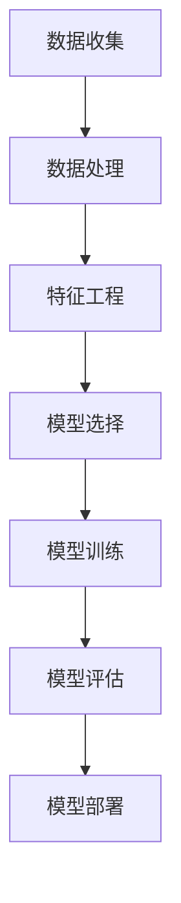
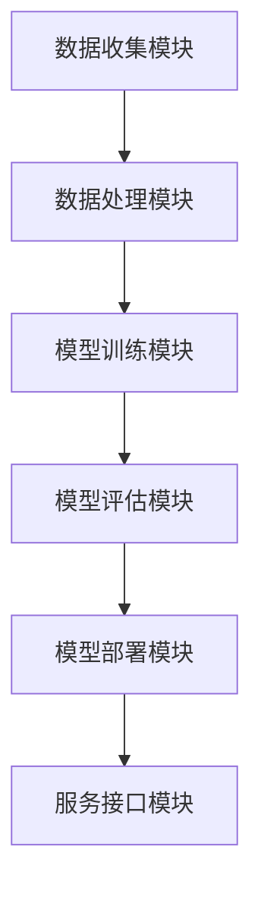
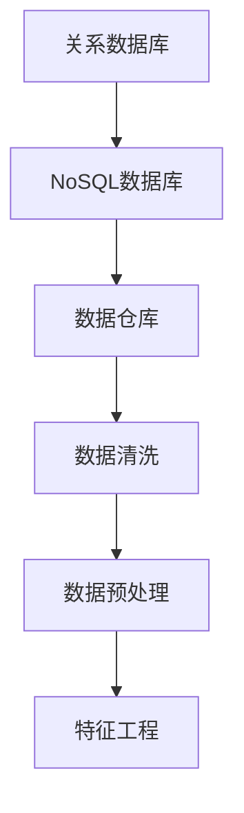
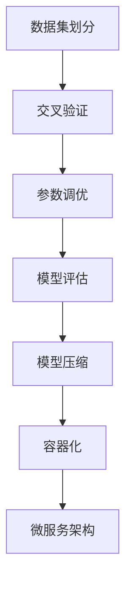
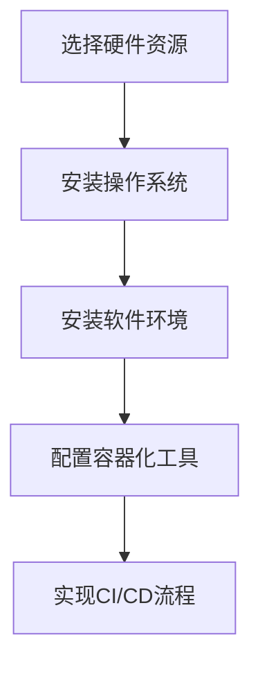
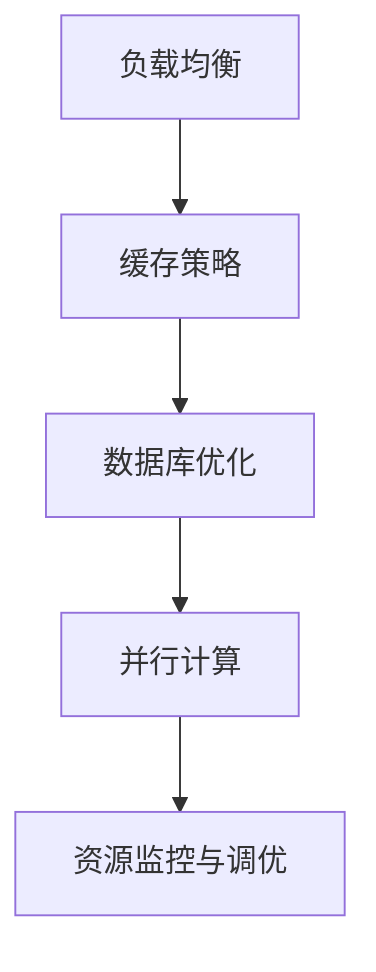
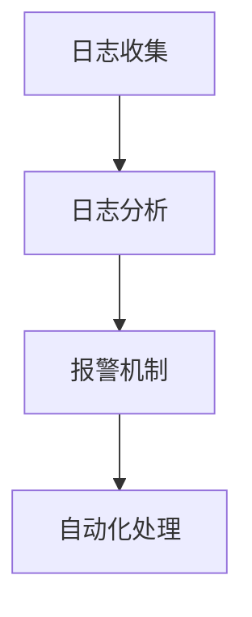
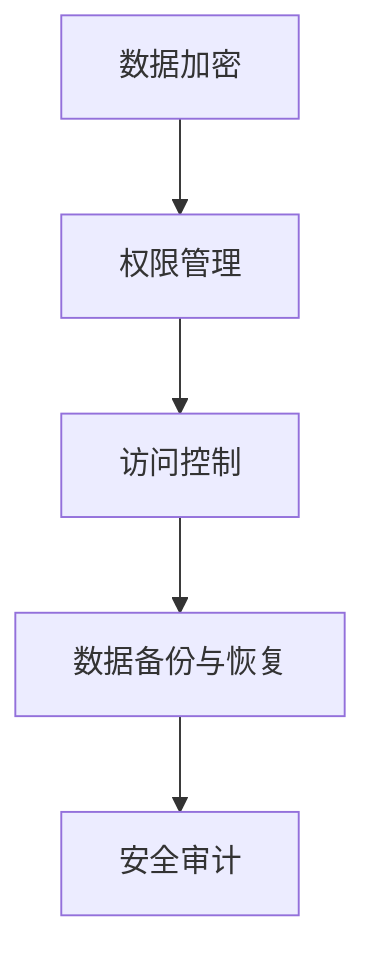

                 

# AI驱动的空气质量预测服务

## 关键词

- 空气质量预测
- 气象数据
- 机器学习
- 深度学习
- 预测服务
- 数据处理

## 摘要

空气质量是影响人类健康和生态环境的重要因素。随着城市化和工业化的加速发展，空气质量问题日益突出。本文将探讨AI驱动的空气质量预测服务，从空气质量监测与评价、环境数据与气象因素、空气质量预测模型构建以及空气质量预测服务应用与部署等方面，详细分析空气质量预测技术的核心概念、算法原理、模型构建与优化，以及实际应用中的挑战和未来发展方向。

## 目录大纲

### 第一部分：空气质量预测基础知识

#### 第1章：空气质量监测与评价

- 1.1 空气质量监测网络概述
- 1.2 空气质量评价标准与指标
- 1.3 空气质量数据的采集与处理
- 1.4 空气质量变化趋势分析

#### 第2章：环境数据与气象因素

- 2.1 环境数据源及其特征
- 2.2 气象因素对空气质量的影响
- 2.3 气象数据采集与处理
- 2.4 气象与空气质量关联分析

### 第二部分：空气质量预测模型构建

#### 第3章：空气质量预测算法概述

- 3.1 常见空气质量预测算法
- 3.2 算法性能评估指标
- 3.3 模型选择与调优策略

#### 第4章：基于统计学的空气质量预测模型

- 4.1 统计学模型原理
- 4.2 线性回归模型构建
- 4.3 回归模型参数调优
- 4.4 模型评估与验证

#### 第5章：基于机器学习的空气质量预测模型

- 5.1 机器学习模型原理
- 5.2 决策树模型构建
- 5.3 随机森林模型构建
- 5.4 支持向量机模型构建
- 5.5 模型集成与优化

#### 第6章：深度学习在空气质量预测中的应用

- 6.1 深度学习基础
- 6.2 卷积神经网络在空气质量预测中的应用
- 6.3 循环神经网络在空气质量预测中的应用
- 6.4 长短期记忆网络在空气质量预测中的应用
- 6.5 深度学习模型调优与优化

### 第三部分：空气质量预测服务应用与部署

#### 第7章：空气质量预测服务架构设计

- 7.1 预测服务整体架构
- 7.2 数据存储与处理架构
- 7.3 模型训练与部署策略
- 7.4 服务接口设计与API规范

#### 第8章：空气质量预测服务的部署与运维

- 8.1 部署环境搭建
- 8.2 服务性能优化
- 8.3 日志监控与报警
- 8.4 数据安全与隐私保护

#### 第9章：空气质量预测服务案例实战

- 9.1 案例背景与需求分析
- 9.2 数据采集与预处理
- 9.3 模型选择与训练
- 9.4 模型部署与上线
- 9.5 实际应用效果评估与优化

#### 第10章：未来展望与挑战

- 10.1 空气质量预测技术的发展趋势
- 10.2 存在的问题与挑战
- 10.3 未来研究方向与展望

### 附录：参考资料与工具集

- 附录A：参考资料
- 附录B：空气质量预测相关工具介绍
- 附录C：数据集获取与预处理方法

#### 梅里迪安流程图：空气质量预测模型构建流程



#### 伪代码：空气质量预测模型调优

```python
# 参数调优伪代码

def optimize_parameters(model, dataset):
    best_score = float('inf')
    best_params = None
    
    for param in parameters_space:
        model.set_params(param)
        score = evaluate_model(model, dataset)
        
        if score < best_score:
            best_score = score
            best_params = param
            
    return best_params
```

#### 数学公式与讲解

**空气质量预测中的线性回归公式：**

$$
y = \beta_0 + \beta_1 \cdot x + \epsilon
$$

- $y$：预测的空气质量指数（AQI）
- $\beta_0$：截距
- $\beta_1$：斜率
- $x$：输入特征（如PM2.5浓度）
- $\epsilon$：误差项

**解释与举例：**

假设我们有一个空气质量预测模型，输入特征为PM2.5浓度，预测目标是空气质量指数（AQI）。我们可以通过线性回归模型来建立它们之间的关系。例如，当PM2.5浓度为50时，预测的AQI为75。公式中的$\beta_0$和$\beta_1$是通过模型训练得到的参数，用于调整预测的准确性。误差项$\epsilon$代表了预测值与真实值之间的差异。通过优化这些参数，我们可以提高模型的预测性能。

----------------------------------------------------------------

### 第1章：空气质量监测与评价

空气质量监测与评价是空气质量预测服务的基础。通过建立完善的空气质量监测网络，我们可以实时获取空气质量数据，并进行评价，为后续的空气质量预测提供数据支持。

#### 1.1 空气质量监测网络概述

空气质量监测网络是指由多个监测站点组成，用于实时监测空气质量状况并收集相关数据的网络。这些站点通常分布在不同地理位置，包括城市中心、工业区、郊区等。监测网络的建设需要考虑以下因素：

- 监测点密度：监测点应尽可能均匀分布，以覆盖更广泛的区域。
- 监测指标：根据空气质量评价标准，选择适当的监测指标，如PM2.5、PM10、SO2、NO2、CO等。
- 监测设备：选择高精度、稳定的监测设备，确保数据的准确性。

#### 1.2 空气质量评价标准与指标

空气质量评价标准是用于衡量空气质量状况的标准和指标。常见的空气质量评价标准包括世界卫生组织（WHO）和各国制定的空气质量标准。以下是一些常用的空气质量评价指标：

- 空气质量指数（AQI）：用于表示空气污染程度的指数，通常采用分等级的方式表示，如优、良、轻度污染等。
- 超标率：表示监测点空气质量超标的比例，用于衡量空气污染的严重程度。
- 平均浓度：表示一段时间内空气污染物的平均浓度，用于评估空气质量状况的稳定性。

#### 1.3 空气质量数据的采集与处理

空气质量数据的采集是空气质量监测与评价的关键步骤。数据采集过程通常包括以下环节：

- 数据采集设备：使用高精度、稳定的监测设备，如颗粒物采样器、气体分析仪等。
- 数据传输：将监测数据实时传输至数据中心，可采用有线或无线传输方式。
- 数据存储：将采集到的数据存储在数据库中，以便后续处理和分析。

空气质量数据的处理包括以下步骤：

- 数据清洗：去除噪声和异常值，确保数据的质量。
- 数据预处理：对数据进行标准化、归一化等处理，为后续建模提供合适的输入。
- 数据融合：整合不同监测点的数据，提高数据的完整性和可靠性。

#### 1.4 空气质量变化趋势分析

空气质量变化趋势分析是了解空气质量状况的重要手段。通过对空气质量数据的变化趋势进行分析，可以揭示空气质量的影响因素和变化规律。

- 时间序列分析：分析空气质量随时间的变化趋势，识别季节性、周期性等特征。
- 关联分析：分析空气质量与其他因素（如气象因素、人类活动等）之间的关联关系。
- 空间分布分析：分析空气质量在不同区域的变化规律，识别污染热点区域。

空气质量监测与评价是空气质量预测服务的基础，通过建立完善的空气质量监测网络、采用科学的空气质量评价标准、进行有效的数据采集与处理，以及深入分析空气质量变化趋势，可以为后续的空气质量预测提供可靠的数据支持。

### 第2章：环境数据与气象因素

空气质量不仅受本地污染物排放的影响，还受到气象条件的强烈影响。因此，环境数据和气象因素在空气质量预测中起着至关重要的作用。

#### 2.1 环境数据源及其特征

环境数据源主要包括以下几种：

- **地面监测数据**：这是最直接获取空气质量信息的途径。地面监测站点分布在城市、郊区、乡村等不同地区，能够实时监测和记录各种污染物（如PM2.5、PM10、SO2、NO2、CO等）的浓度。
- **卫星遥感数据**：利用卫星传感器从空间获取地表的空气质量信息。卫星遥感数据具有大范围、高时空分辨率的特点，适用于污染源识别和区域性空气质量监测。
- **气象数据**：包括温度、湿度、风速、风向、气压等气象参数。气象数据对于理解空气流动和污染物扩散模式至关重要。
- **交通流量数据**：用于评估城市交通排放对空气质量的影响。交通流量数据可以通过车载GPS、智能交通系统等获取。
- **人口数据**：用于分析人类活动对空气质量的影响，如居住密度、工业活动等。

环境数据源的特点如下：

- **实时性**：地面监测数据和卫星遥感数据能够实时或近乎实时地提供空气质量信息。
- **空间分辨率**：卫星遥感数据具有高空间分辨率，可以用于大尺度空气质量监测。
- **时间分辨率**：气象数据和地面监测数据通常具有高时间分辨率，可以捕捉到空气质量变化的细节。

#### 2.2 气象因素对空气质量的影响

气象因素对空气质量的影响主要体现在以下几个方面：

- **温度**：温度会影响污染物的挥发和化学反应速率。高温通常会导致污染物浓度上升，特别是在挥发性有机化合物（VOCs）和氮氧化物（NOx）的转化过程中。
- **湿度**：湿度影响污染物的湿沉积速率和气溶胶的形成。高湿度条件下，颗粒物和气态污染物更容易沉积，从而降低空气中的浓度。
- **风速和风向**：风速和风向影响污染物的扩散和传输。强风可以有效地稀释污染物，而特定的风向可能导致污染物的集聚和扩散。
- **气压**：气压的变化会影响空气的密度和垂直混合，从而影响污染物的垂直分布。

#### 2.3 气象数据采集与处理

气象数据的采集通常通过以下设备进行：

- **气象站**：地面气象站可以提供全面的气象参数，包括温度、湿度、风速、风向等。
- **卫星遥感**：气象卫星从太空监测地球表面的气象条件。
- **雷达和激光雷达**：用于监测大气中的颗粒物和气溶胶浓度。

气象数据的处理包括：

- **数据校正**：校正设备误差、时间同步等问题。
- **数据融合**：整合来自不同来源的气象数据，提高数据的质量和一致性。
- **数据插值**：对于数据缺失的区域或时间点，使用插值方法填充数据。

#### 2.4 气象与空气质量关联分析

气象与空气质量的关联分析是空气质量预测服务中的重要环节。以下是一些常用的方法：

- **相关性分析**：分析气象参数与空气质量指标之间的相关性，确定哪些气象因素对空气质量有显著影响。
- **回归分析**：建立气象参数与空气质量指标之间的回归模型，预测特定气象条件下的空气质量。
- **时间序列分析**：分析气象参数和空气质量指标的时间序列特征，识别季节性、周期性等模式。

通过综合分析气象因素和环境数据，可以更准确地预测空气质量，为环境保护和公众健康提供科学依据。

### 第3章：空气质量预测算法概述

空气质量预测是环境科学和数据分析领域中的一个重要问题，它关系到公众健康、城市规划和环境保护。为了准确预测空气质量，我们需要选择合适的算法，并评估其性能。本节将介绍几种常见的空气质量预测算法，以及评估算法性能的指标和模型选择与调优策略。

#### 3.1 常见空气质量预测算法

空气质量预测算法可以分为以下几类：

- **基于统计学的算法**：这类算法通过分析历史数据和气象条件，建立简单的统计模型进行预测。常见的统计学算法包括线性回归、决策树和逻辑回归等。
- **基于机器学习的算法**：机器学习算法通过学习历史数据和气象条件之间的复杂关系，自动建立预测模型。常见的机器学习算法包括支持向量机（SVM）、随机森林（RF）、梯度提升机（GBM）等。
- **基于深度学习的算法**：深度学习算法通过多层神经网络学习数据中的复杂模式和关联。常见的深度学习算法包括卷积神经网络（CNN）、循环神经网络（RNN）和长短期记忆网络（LSTM）等。

#### 3.2 算法性能评估指标

评估空气质量预测算法性能的指标包括：

- **准确率（Accuracy）**：预测结果与实际结果完全匹配的比例。
- **召回率（Recall）**：实际结果为正类时，预测结果为正类的比例。
- **精确率（Precision）**：预测结果为正类时，实际结果也为正类的比例。
- **F1分数（F1 Score）**：精确率和召回率的加权平均，用于平衡精确率和召回率之间的矛盾。
- **均方误差（Mean Squared Error, MSE）**：预测值与真实值之间差的平方的平均值，用于回归问题。
- **平均绝对误差（Mean Absolute Error, MAE）**：预测值与真实值之间差的绝对值的平均值，用于回归问题。

#### 3.3 模型选择与调优策略

模型选择和调优是空气质量预测中的关键步骤，以下是一些常用的策略：

- **交叉验证**：通过将数据集划分为训练集和验证集，评估模型的性能。交叉验证可以避免过拟合和欠拟合问题。
- **网格搜索**：在预定义的参数空间内，系统性地评估不同参数组合的模型性能，选择最佳参数组合。
- **贝叶斯优化**：使用贝叶斯方法寻找参数的最优组合，通常比网格搜索更高效。
- **模型集成**：将多个模型结合起来，提高预测性能。常见的模型集成方法包括Bagging、Boosting和Stacking等。
- **特征选择**：通过分析特征的重要性，选择对预测任务最有影响的特征，提高模型性能。

空气质量预测算法的选择和调优需要综合考虑数据特性、预测目标和计算资源。通过合理选择算法和优化模型参数，可以显著提高空气质量预测的准确性和可靠性。

### 第4章：基于统计学的空气质量预测模型

基于统计学的空气质量预测模型是早期空气质量预测中常用的方法，它们依赖于历史数据和统计方法来建立预测模型。这一章将详细介绍几种常见的基于统计学的空气质量预测模型，包括线性回归模型、逻辑回归模型和多元线性回归模型，并探讨如何调优这些模型的参数以及如何评估模型的性能。

#### 4.1 统计学模型原理

统计学模型通过分析历史数据，试图找到变量之间的关系，并用数学公式来表示这些关系。在空气质量预测中，统计学模型通常用于分析污染物浓度与气象条件之间的线性或非线性关系。以下是一些常见的统计学模型：

- **线性回归模型**：线性回归模型是一种最简单的统计学模型，它假设响应变量（如空气质量指数 AQI）与自变量（如气象参数）之间存在线性关系。线性回归模型可以用以下公式表示：

  $$
  y = \beta_0 + \beta_1 \cdot x_1 + \beta_2 \cdot x_2 + ... + \beta_n \cdot x_n + \epsilon
  $$

  其中，$y$ 是预测的空气质量指数，$x_1, x_2, ..., x_n$ 是气象参数，$\beta_0, \beta_1, \beta_2, ..., \beta_n$ 是模型的参数，$\epsilon$ 是误差项。

- **逻辑回归模型**：逻辑回归模型用于处理分类问题，例如判断空气质量是否达到预警级别。逻辑回归模型使用逻辑函数（Sigmoid函数）将线性组合映射到概率空间。逻辑回归模型可以表示为：

  $$
  P(y=1) = \frac{1}{1 + e^{-(\beta_0 + \beta_1 x_1 + \beta_2 x_2 + ... + \beta_n x_n )}}
  $$

  其中，$P(y=1)$ 是空气质量达到预警级别的概率，其他符号与线性回归模型相同。

- **多元线性回归模型**：多元线性回归模型是对线性回归模型的扩展，它可以处理多个自变量。多元线性回归模型可以表示为：

  $$
  y = \beta_0 + \beta_1 \cdot x_1 + \beta_2 \cdot x_2 + ... + \beta_n \cdot x_n + \epsilon
  $$

  与简单线性回归模型类似，但需要考虑多个自变量之间的相互作用。

#### 4.2 线性回归模型构建

线性回归模型的构建步骤如下：

1. **数据收集**：收集空气质量历史数据和对应的气象数据。
2. **数据预处理**：对收集的数据进行清洗，处理缺失值、异常值，并进行标准化或归一化处理。
3. **特征选择**：通过相关性分析或其他方法选择对空气质量影响较大的气象参数作为自变量。
4. **模型训练**：使用训练集数据通过最小二乘法或其他优化算法求解模型参数。
5. **模型评估**：使用验证集评估模型性能，调整模型参数。

以下是一个线性回归模型构建的伪代码：

```python
# 线性回归模型构建伪代码

# 步骤1：数据收集
X_train, y_train = load_data('training_data.csv')

# 步骤2：数据预处理
X_train_processed = preprocess_data(X_train)

# 步骤3：特征选择
selected_features = select_features(X_train_processed, y_train)

# 步骤4：模型训练
model = LinearRegression()
model.fit(selected_features, y_train)

# 步骤5：模型评估
accuracy = model.evaluate(selected_features, y_train)
print('Model Accuracy:', accuracy)
```

#### 4.3 回归模型参数调优

为了提高线性回归模型的预测性能，通常需要调优模型参数。以下是一些常见的参数调优方法：

1. **最小二乘法**：使用最小二乘法（Ordinary Least Squares, OLS）求解模型参数。最小二乘法通过最小化预测值与实际值之间的误差平方和来优化模型参数。
2. **岭回归（Ridge Regression）**：当自变量之间存在多重共线性时，岭回归可以通过增加惩罚项来防止过拟合。
3. **Lasso回归（Lasso Regression）**：Lasso回归通过引入绝对值惩罚项，可以在降低模型复杂性的同时实现特征选择。

以下是一个岭回归参数调优的伪代码：

```python
# 岭回归参数调优伪代码

# 步骤1：数据收集
X_train, y_train = load_data('training_data.csv')

# 步骤2：数据预处理
X_train_processed = preprocess_data(X_train)

# 步骤3：划分训练集和验证集
X_val, y_val = split_data(X_train_processed, y_train)

# 步骤4：岭回归模型训练
alpha_range = [0.01, 0.1, 1, 10, 100]
best_alpha = None
best_score = float('inf')

for alpha in alpha_range:
    model = Ridge(alpha=alpha)
    model.fit(X_train_processed, y_train)
    score = model.evaluate(X_val, y_val)
    
    if score < best_score:
        best_score = score
        best_alpha = alpha

print('Best Alpha:', best_alpha)
```

#### 4.4 模型评估与验证

在构建和调优线性回归模型后，需要对模型进行评估和验证，以确保其预测性能。以下是一些常用的评估方法：

1. **交叉验证**：交叉验证是一种评估模型性能的有效方法。它将数据集划分为多个子集，每次使用其中一个子集作为验证集，其余子集作为训练集，重复多次计算平均值。
2. **ROC曲线和AUC（Area Under Curve）**：ROC曲线用于评估分类模型的性能。AUC值越大，模型的预测性能越好。
3. **均方误差（MSE）和平均绝对误差（MAE）**：MSE和MAE用于评估回归模型的预测误差。MSE越小，模型的预测精度越高。

以下是一个使用交叉验证进行模型评估的伪代码：

```python
# 交叉验证评估模型伪代码

from sklearn.model_selection import cross_val_score

# 步骤1：数据收集
X, y = load_data('data.csv')

# 步骤2：划分训练集和测试集
X_train, X_test, y_train, y_test = train_test_split(X, y, test_size=0.2, random_state=42)

# 步骤3：交叉验证
cv_scores = cross_val_score(model, X_train, y_train, cv=5)

# 步骤4：计算平均得分
average_score = np.mean(cv_scores)
print('Average CV Score:', average_score)
```

通过合理构建、调优和评估基于统计学的空气质量预测模型，可以实现对空气质量的准确预测，为环境保护和公众健康提供科学依据。

### 第5章：基于机器学习的空气质量预测模型

基于机器学习的空气质量预测模型利用历史数据和气象数据，通过学习数据中的复杂关系来实现空气质量预测。相比传统的统计模型，机器学习模型具有更强的鲁棒性和泛化能力。本章将介绍几种常见的基于机器学习的空气质量预测模型，包括决策树、随机森林和支持向量机，并讨论如何进行模型集成与优化。

#### 5.1 机器学习模型原理

机器学习模型通过训练数据集来学习特征和目标变量之间的关系，并使用这种关系进行预测。以下是一些常见的机器学习模型及其基本原理：

- **决策树（Decision Tree）**：决策树是一种树形结构，通过一系列的测试来划分数据。每个节点表示一个特征，每个分支表示该特征的不同取值，叶子节点表示预测结果。决策树易于理解和解释，但在面对大量数据时可能会出现过拟合现象。

- **随机森林（Random Forest）**：随机森林是一种集成学习方法，它通过构建多个决策树，并对这些决策树的结果进行投票来得出最终预测。随机森林可以有效地降低过拟合，提高模型的泛化能力。

- **支持向量机（Support Vector Machine, SVM）**：支持向量机是一种基于最大间隔原则的模型，它通过找到一个超平面，将不同类别的数据点分开。SVM在处理高维数据时表现良好，但在处理大规模数据时可能计算复杂度较高。

- **梯度提升机（Gradient Boosting Machine, GBM）**：梯度提升机通过迭代的方式优化模型，每次迭代通过学习前一轮预测的误差来更新模型。GBM具有较高的预测性能，但训练时间较长。

#### 5.2 决策树模型构建

决策树模型的构建步骤如下：

1. **数据收集**：收集历史空气质量和气象数据，确保数据的质量和完整性。
2. **数据预处理**：对数据进行清洗，处理缺失值和异常值，并进行特征工程，如编码、标准化等。
3. **特征选择**：选择对空气质量预测有显著影响的特征，可以使用信息增益、基尼系数等指标进行特征选择。
4. **模型训练**：使用训练数据集训练决策树模型，选择合适的分割准则（如信息增益、基尼系数等）和最大深度等参数。
5. **模型评估**：使用验证集评估模型性能，调整模型参数，避免过拟合。

以下是一个决策树模型构建的伪代码：

```python
# 决策树模型构建伪代码

# 步骤1：数据收集
X_train, y_train = load_data('training_data.csv')

# 步骤2：数据预处理
X_train_processed = preprocess_data(X_train)

# 步骤3：特征选择
selected_features = select_features(X_train_processed, y_train)

# 步骤4：模型训练
model = DecisionTreeClassifier(max_depth=5)
model.fit(selected_features, y_train)

# 步骤5：模型评估
accuracy = model.evaluate(selected_features, y_train)
print('Model Accuracy:', accuracy)
```

#### 5.3 随机森林模型构建

随机森林模型的构建步骤如下：

1. **数据收集**：与决策树相同，收集历史空气质量和气象数据。
2. **数据预处理**：对数据进行清洗和特征工程。
3. **特征选择**：与决策树类似，选择对空气质量预测有显著影响的特征。
4. **模型训练**：训练多个决策树，并使用随机森林进行集成。
5. **模型评估**：使用验证集评估模型性能，调整参数如树的数量、最大深度等。

以下是一个随机森林模型构建的伪代码：

```python
# 随机森林模型构建伪代码

# 步骤1：数据收集
X_train, y_train = load_data('training_data.csv')

# 步骤2：数据预处理
X_train_processed = preprocess_data(X_train)

# 步骤3：特征选择
selected_features = select_features(X_train_processed, y_train)

# 步骤4：模型训练
model = RandomForestClassifier(n_estimators=100, max_depth=5)
model.fit(selected_features, y_train)

# 步骤5：模型评估
accuracy = model.evaluate(selected_features, y_train)
print('Model Accuracy:', accuracy)
```

#### 5.4 支持向量机模型构建

支持向量机模型的构建步骤如下：

1. **数据收集**：与决策树和随机森林相同，收集历史空气质量和气象数据。
2. **数据预处理**：对数据进行清洗和特征工程。
3. **特征选择**：选择对空气质量预测有显著影响的特征。
4. **模型训练**：训练支持向量机模型，选择合适的核函数和惩罚参数。
5. **模型评估**：使用验证集评估模型性能，调整参数。

以下是一个支持向量机模型构建的伪代码：

```python
# 支持向量机模型构建伪代码

# 步骤1：数据收集
X_train, y_train = load_data('training_data.csv')

# 步骤2：数据预处理
X_train_processed = preprocess_data(X_train)

# 步骤3：特征选择
selected_features = select_features(X_train_processed, y_train)

# 步骤4：模型训练
model = SVC(kernel='rbf', C=1.0)
model.fit(selected_features, y_train)

# 步骤5：模型评估
accuracy = model.evaluate(selected_features, y_train)
print('Model Accuracy:', accuracy)
```

#### 5.5 模型集成与优化

模型集成是将多个模型结合起来，以提高预测性能和稳定性。以下是一些常见的模型集成方法：

- **Bagging**：Bagging通过训练多个独立的模型，并对预测结果进行投票来得出最终预测。随机森林就是Bagging的一种应用。
- **Boosting**：Boosting通过迭代地训练多个模型，每次迭代都强调错误分类的样本，从而提高整体模型的预测能力。梯度提升机就是Boosting的一种应用。
- **Stacking**：Stacking通过训练多个模型，并将它们的预测结果作为输入，训练一个更高层次的模型。Stacking可以提高模型的泛化能力。

以下是一个简单的模型集成与优化的伪代码：

```python
# 模型集成与优化伪代码

# 步骤1：训练多个基础模型
models = [
    DecisionTreeClassifier(),
    RandomForestClassifier(),
    SVC()
]

for model in models:
    model.fit(selected_features, y_train)

# 步骤2：集成模型预测
predictions = [model.predict(selected_features) for model in models]
ensemble_prediction = VotingClassifier(models).predict(selected_features)

# 步骤3：模型优化
best_model = VotingClassifier(models)
best_model.fit(selected_features, y_train)

# 步骤4：模型评估
accuracy = best_model.evaluate(selected_features, y_train)
print('Ensemble Model Accuracy:', accuracy)
```

通过构建和集成多种机器学习模型，并结合优化策略，可以实现更准确和可靠的空气质量预测，为环境保护和公共健康提供有力支持。

### 第6章：深度学习在空气质量预测中的应用

深度学习在处理复杂非线性问题时表现出色，近年来在空气质量预测领域也得到了广泛应用。本章将介绍深度学习的相关基础概念，并探讨卷积神经网络（CNN）、循环神经网络（RNN）和长短期记忆网络（LSTM）在空气质量预测中的应用，以及如何对这些深度学习模型进行调优与优化。

#### 6.1 深度学习基础

深度学习是一种基于多层神经网络的机器学习方法，通过逐层提取数据中的特征，从而实现高度复杂的模式识别和预测。深度学习的关键组成部分包括：

- **神经网络**：神经网络是由多个节点（神经元）组成的计算模型，每个节点接收输入，通过加权求和后应用激活函数产生输出。
- **激活函数**：激活函数用于引入非线性，使得神经网络能够拟合复杂的数据分布。常见的激活函数包括ReLU、Sigmoid和Tanh。
- **损失函数**：损失函数用于衡量预测值与真实值之间的差异，驱动神经网络优化模型参数。常见的损失函数包括均方误差（MSE）和交叉熵损失。
- **优化算法**：优化算法用于调整神经网络中的权重和偏置，以最小化损失函数。常见的优化算法有随机梯度下降（SGD）、Adam等。

#### 6.2 卷积神经网络（CNN）在空气质量预测中的应用

卷积神经网络（CNN）是处理图像数据的经典深度学习模型，但近年来也被应用于空气质量预测中。CNN通过卷积操作提取空间特征，特别适用于处理高维时空数据。

- **卷积层（Convolutional Layer）**：卷积层是CNN的核心组成部分，通过卷积操作提取数据中的局部特征。卷积层通常包含多个卷积核，每个卷积核提取一种特征。
- **池化层（Pooling Layer）**：池化层用于减小数据维度，提高模型的泛化能力。常见的池化操作有最大池化和平均池化。
- **全连接层（Fully Connected Layer）**：全连接层将卷积层和池化层提取的特征映射到输出结果，用于分类或回归任务。

以下是一个卷积神经网络模型构建的伪代码：

```python
# 卷积神经网络模型构建伪代码

# 步骤1：导入库
from keras.models import Sequential
from keras.layers import Conv2D, MaxPooling2D, Flatten, Dense

# 步骤2：构建模型
model = Sequential()
model.add(Conv2D(32, (3, 3), activation='relu', input_shape=(width, height, channels)))
model.add(MaxPooling2D(pool_size=(2, 2)))
model.add(Conv2D(64, (3, 3), activation='relu'))
model.add(MaxPooling2D(pool_size=(2, 2)))
model.add(Flatten())
model.add(Dense(64, activation='relu'))
model.add(Dense(1, activation='sigmoid'))

# 步骤3：编译模型
model.compile(optimizer='adam', loss='binary_crossentropy', metrics=['accuracy'])

# 步骤4：训练模型
model.fit(X_train, y_train, epochs=10, batch_size=32, validation_data=(X_val, y_val))
```

#### 6.3 循环神经网络（RNN）在空气质量预测中的应用

循环神经网络（RNN）是一种能够处理序列数据的神经网络，特别适用于时间序列预测任务。RNN通过在时间步之间传递信息，捕捉时间序列中的长期依赖关系。

- **隐藏状态（Hidden State）**：RNN在每个时间步生成一个隐藏状态，用于表示当前时间步的特征和上下文信息。
- **门控机制（Gate Mechanism）**：门控机制用于控制信息的传递和遗忘，包括输入门、遗忘门和输出门。

以下是一个循环神经网络模型构建的伪代码：

```python
# 循环神经网络模型构建伪代码

from keras.models import Sequential
from keras.layers import LSTM, Dense

# 步骤1：构建模型
model = Sequential()
model.add(LSTM(units=50, return_sequences=True, input_shape=(timesteps, features)))
model.add(LSTM(units=50))
model.add(Dense(1))

# 步骤2：编译模型
model.compile(optimizer='adam', loss='mean_squared_error')

# 步骤3：训练模型
model.fit(X_train, y_train, epochs=100, batch_size=32, validation_data=(X_val, y_val))
```

#### 6.4 长短期记忆网络（LSTM）在空气质量预测中的应用

长短期记忆网络（LSTM）是RNN的一种改进模型，特别适用于处理长序列数据，能够有效避免梯度消失问题。LSTM通过引入门控机制，使得模型能够记住长期依赖关系。

- **遗忘门（Forget Gate）**：遗忘门决定了哪些信息需要遗忘。
- **输入门（Input Gate）**：输入门决定了哪些新信息需要存储。
- **输出门（Output Gate）**：输出门决定了当前隐藏状态应该输出哪些信息。

以下是一个长短期记忆网络模型构建的伪代码：

```python
# 长短期记忆网络模型构建伪代码

from keras.models import Sequential
from keras.layers import LSTM, Dense

# 步骤1：构建模型
model = Sequential()
model.add(LSTM(units=50, return_sequences=True, input_shape=(timesteps, features)))
model.add(LSTM(units=50, return_sequences=False))
model.add(Dense(1))

# 步骤2：编译模型
model.compile(optimizer='adam', loss='mean_squared_error')

# 步骤3：训练模型
model.fit(X_train, y_train, epochs=100, batch_size=32, validation_data=(X_val, y_val))
```

#### 6.5 深度学习模型调优与优化

深度学习模型的调优与优化是提高模型性能的关键步骤，以下是一些常用的方法：

- **数据增强**：通过生成新的数据样本，增加模型的训练数据量，从而提高模型的泛化能力。
- **正则化**：引入正则化项，如L1或L2正则化，防止模型过拟合。
- **参数调优**：使用网格搜索、贝叶斯优化等算法，寻找最优的超参数组合。
- **批量大小**：调整批量大小，找到最优的训练效果。
- **学习率**：使用适当的学习率，避免模型过早收敛或发散。

以下是一个参数调优的伪代码：

```python
# 参数调优伪代码

from sklearn.model_selection import GridSearchCV
from keras.wrappers.scikit_learn import KerasClassifier

# 步骤1：定义模型
def create_model(optimizer='adam'):
    model = Sequential()
    model.add(LSTM(50, input_shape=(timesteps, features)))
    model.add(Dense(1))
    model.compile(loss='mean_squared_error', optimizer=optimizer)
    return model

model = KerasClassifier(build_fn=create_model, verbose=0)

# 步骤2：定义参数空间
param_grid = {
    'epochs': [100, 200],
    'batch_size': [16, 32],
    'optimizer': ['adam', 'rmsprop']
}

# 步骤3：进行网格搜索
grid = GridSearchCV(estimator=model, param_grid=param_grid, n_jobs=-1, cv=3)
grid_result = grid.fit(X_train, y_train)

# 步骤4：输出最佳参数
print("Best: %f using %s" % (grid_result.best_score_, grid_result.best_params_))
```

通过合理构建和优化深度学习模型，可以实现高精度的空气质量预测，为环境保护和公共健康提供有力支持。

### 第7章：空气质量预测服务架构设计

空气质量预测服务架构设计是确保空气质量预测系统能够高效、稳定、可靠地运行的关键。本章将详细介绍空气质量预测服务的整体架构，包括数据存储与处理架构、模型训练与部署策略，以及服务接口设计与API规范。

#### 7.1 预测服务整体架构

空气质量预测服务整体架构可分为以下几个模块：

1. **数据收集模块**：负责从各种数据源（如地面监测站、卫星遥感、气象站等）收集实时数据，并将数据传输至数据存储与处理架构。
2. **数据处理模块**：对收集到的数据进行清洗、预处理和特征工程，为模型训练提供高质量的数据输入。
3. **模型训练模块**：使用处理后的数据训练空气质量预测模型，包括统计模型、机器学习模型和深度学习模型等。
4. **模型评估模块**：评估训练好的模型性能，包括准确率、召回率、F1分数等指标，以确定模型是否达到预期效果。
5. **模型部署模块**：将训练好的模型部署到生产环境中，提供实时空气质量预测服务。
6. **服务接口模块**：提供API接口，使得外部用户可以通过网络请求空气质量预测服务。

以下是一个空气质量预测服务整体架构的梅里迪安流程图：



#### 7.2 数据存储与处理架构

数据存储与处理架构是空气质量预测服务架构的核心部分，它决定了数据存储的可靠性、高效性和扩展性。以下是一些关键组件和策略：

1. **数据存储**：
   - **关系数据库**：用于存储结构化数据，如气象数据、污染物浓度数据等。
   - **NoSQL数据库**：用于存储非结构化数据，如文本、图像等。
   - **数据仓库**：用于存储大量历史数据，支持复杂的查询和分析。

2. **数据处理**：
   - **数据清洗**：去除噪声和异常值，确保数据质量。
   - **数据预处理**：进行数据标准化、归一化等操作，为模型训练做准备。
   - **特征工程**：选择和构造对空气质量预测有重要影响的特征，提高模型性能。

以下是一个数据存储与处理架构的梅里迪安流程图：



#### 7.3 模型训练与部署策略

模型训练与部署策略决定了空气质量预测服务的性能和可靠性。以下是一些关键步骤和策略：

1. **模型训练**：
   - **数据集划分**：将数据集划分为训练集、验证集和测试集，用于训练、验证和测试模型性能。
   - **交叉验证**：使用交叉验证方法评估模型性能，防止过拟合和欠拟合。
   - **参数调优**：通过网格搜索、贝叶斯优化等策略，寻找最优模型参数。

2. **模型评估**：
   - **性能指标**：使用准确率、召回率、F1分数等指标评估模型性能。
   - **模型对比**：对比不同模型（如统计模型、机器学习模型、深度学习模型）的性能，选择最优模型。

3. **模型部署**：
   - **模型压缩**：通过模型压缩技术减小模型大小，提高部署效率。
   - **容器化**：使用容器（如Docker）封装模型和依赖库，实现快速部署和迁移。
   - **微服务架构**：采用微服务架构，将模型训练、部署和管理模块解耦，提高系统扩展性和可靠性。

以下是一个模型训练与部署策略的梅里迪安流程图：



#### 7.4 服务接口设计与API规范

服务接口设计与API规范是空气质量预测服务与外部系统交互的桥梁。以下是一些关键点：

1. **接口设计**：
   - **RESTful API**：采用RESTful设计风格，使得接口易于理解和扩展。
   - **URL规范**：定义清晰的URL结构，方便外部系统访问和调用。
   - **请求和响应格式**：定义统一的请求和响应格式，如JSON或XML。

2. **API规范**：
   - **参数定义**：明确定义API的输入参数及其数据类型、约束条件等。
   - **响应状态码**：定义API的响应状态码和错误信息，方便外部系统处理异常情况。
   - **安全措施**：实现API认证和授权机制，确保数据安全。

以下是一个API接口设计的示例：

```python
# 示例API接口设计

from flask import Flask, request, jsonify

app = Flask(__name__)

@app.route('/predict', methods=['POST'])
def predict():
    data = request.get_json()
    # 验证数据格式
    if not validate_data(data):
        return jsonify({"error": "Invalid data format"}), 400
    
    # 调用模型进行预测
    prediction = model.predict(data['input_data'])
    
    # 返回预测结果
    return jsonify({"prediction": prediction.tolist()})

def validate_data(data):
    # 实现数据验证逻辑
    return True

if __name__ == '__main__':
    app.run(debug=True)
```

通过合理设计空气质量预测服务架构，可以实现高效、稳定、可靠的空气质量预测服务，为环境保护和公共健康提供有力支持。

### 第8章：空气质量预测服务的部署与运维

空气质量预测服务的部署与运维是确保系统能够长期稳定运行、高效服务的重要环节。本章将详细介绍空气质量预测服务的部署环境搭建、服务性能优化、日志监控与报警，以及数据安全与隐私保护。

#### 8.1 部署环境搭建

部署环境搭建是空气质量预测服务上线前的关键步骤，主要包括以下内容：

1. **硬件资源**：根据预测服务的需求，选择合适的硬件资源，如计算节点、存储设备、网络设备等。对于高并发、大规模的数据处理和预测任务，可能需要分布式架构，使用多台服务器进行负载均衡。
2. **操作系统**：选择稳定、高效的操作系统，如Linux distributions（如Ubuntu、CentOS等），以支持各种开发工具和依赖库。
3. **软件环境**：安装和配置必要的软件环境，包括深度学习框架（如TensorFlow、PyTorch）、数据处理工具（如Pandas、NumPy）、服务器软件（如Flask、Django等）。
4. **容器化**：使用容器技术（如Docker）将应用程序及其依赖库封装，提高部署的灵活性和可移植性。容器化还可以简化环境配置，加快部署速度。
5. **持续集成与持续部署（CI/CD）**：实现代码的自动化测试、构建和部署，提高开发效率和系统稳定性。

以下是一个简单的部署环境搭建流程：



#### 8.2 服务性能优化

服务性能优化是提高空气质量预测服务响应速度和吞吐量的关键。以下是一些常用的优化方法：

1. **负载均衡**：使用负载均衡器（如Nginx、HAProxy）将请求分配到多个后端服务器，提高系统的并发处理能力。
2. **缓存策略**：使用缓存技术（如Redis、Memcached）存储频繁访问的数据，减少数据库查询次数，降低响应时间。
3. **数据库优化**：优化数据库性能，包括索引、查询优化、分库分表等，提高数据访问速度。
4. **并行计算**：利用多线程、异步IO等技术，提高数据处理和预测的效率。
5. **资源监控与调优**：监控系统的资源使用情况（如CPU、内存、磁盘等），根据负载情况动态调整资源配置，确保系统稳定运行。

以下是一个服务性能优化流程：



#### 8.3 日志监控与报警

日志监控与报警是确保空气质量预测服务稳定运行的重要手段。以下是一些关键步骤：

1. **日志收集**：使用日志收集工具（如ELK栈、Logstash等）收集系统日志，包括应用程序日志、系统日志、错误日志等。
2. **日志分析**：使用日志分析工具（如Kibana、Grafana等）对日志数据进行实时分析，识别潜在问题和异常行为。
3. **报警机制**：配置报警机制，当系统出现异常（如服务中断、性能恶化等）时，通过邮件、短信、电话等方式通知运维人员。
4. **自动化处理**：对于一些常见的异常情况，实现自动化处理，如自动重启服务、自动扩容等，减少人工干预。

以下是一个日志监控与报警流程：



#### 8.4 数据安全与隐私保护

数据安全与隐私保护是空气质量预测服务面临的重大挑战。以下是一些关键措施：

1. **数据加密**：对敏感数据进行加密存储和传输，防止数据泄露。
2. **权限管理**：实现严格的权限管理，确保只有授权用户可以访问和操作数据。
3. **访问控制**：使用访问控制列表（ACL）和防火墙等安全机制，限制外部访问和内部滥用。
4. **数据备份与恢复**：定期进行数据备份，并确保备份数据的安全性和可恢复性。
5. **安全审计**：定期进行安全审计，检查系统的安全配置和操作行为，发现潜在的安全隐患。

以下是一个数据安全与隐私保护流程：



通过合理部署和运维空气质量预测服务，可以确保系统的高效、稳定和安全运行，为环境保护和公共健康提供可靠支持。

### 第9章：空气质量预测服务案例实战

在本章中，我们将通过一个实际案例来详细展示如何开发和部署一个空气质量预测服务。这个案例将涵盖数据采集、预处理、模型选择与训练、模型部署与上线，以及实际应用效果评估与优化等关键步骤。

#### 9.1 案例背景与需求分析

某大型城市环境保护局希望开发一个空气质量预测系统，以实时监测和预测城市不同区域的空气质量状况。该系统旨在为城市居民提供实时的空气质量信息，帮助人们做出健康的生活决策，并为城市管理者提供科学依据，优化环境治理策略。

- **需求分析**：
  - **实时性**：系统需要能够实时接收和处理来自空气质量监测站点的数据，并快速生成预测结果。
  - **准确性**：系统需要具有较高的预测准确性，以减少预测误差。
  - **可扩展性**：系统架构应具备良好的扩展性，以便在监测站点增加或业务需求变化时，能够轻松进行扩展。
  - **用户友好性**：系统应提供用户友好的界面，方便用户获取空气质量信息。

#### 9.2 数据采集与预处理

数据采集是空气质量预测服务的基础，需要从多个来源获取相关的数据。以下是一个数据采集与预处理流程：

1. **数据来源**：
   - **地面监测数据**：从城市的多个空气质量监测站点获取PM2.5、PM10、SO2、NO2、CO等污染物的实时浓度数据。
   - **气象数据**：从气象站获取温度、湿度、风速、风向等气象参数。
   - **交通数据**：从智能交通系统获取交通流量数据。

2. **数据预处理**：
   - **数据清洗**：去除数据中的噪声和异常值，确保数据质量。
   - **数据标准化**：将不同来源的数据进行标准化处理，使数据具有相同的量纲和范围。
   - **特征工程**：根据空气质量预测的需求，选择和构造相关的特征，如污染物的时序特征、气象条件的组合特征等。

以下是一个数据采集与预处理过程的伪代码示例：

```python
# 数据采集与预处理伪代码

# 步骤1：数据收集
monitor_data = load_monitor_data('monitor_data.csv')
weather_data = load_weather_data('weather_data.csv')
traffic_data = load_traffic_data('traffic_data.csv')

# 步骤2：数据清洗
clean_monitor_data = clean_data(monitor_data)
clean_weather_data = clean_data(weather_data)
clean_traffic_data = clean_data(traffic_data)

# 步骤3：数据标准化
normalized_monitor_data = normalize_data(clean_monitor_data)
normalized_weather_data = normalize_data(clean_weather_data)
normalized_traffic_data = normalize_data(clean_traffic_data)

# 步骤4：特征工程
features = construct_features(normalized_monitor_data, normalized_weather_data, normalized_traffic_data)
```

#### 9.3 模型选择与训练

在选择和训练空气质量预测模型时，需要考虑多种机器学习和深度学习算法，并进行性能评估，以选择最优模型。

1. **模型选择**：
   - **统计模型**：线性回归、逻辑回归等。
   - **机器学习模型**：决策树、随机森林、支持向量机等。
   - **深度学习模型**：卷积神经网络（CNN）、循环神经网络（RNN）、长短期记忆网络（LSTM）等。

2. **模型训练**：
   - **数据集划分**：将数据集划分为训练集、验证集和测试集。
   - **交叉验证**：使用交叉验证方法评估模型性能。
   - **参数调优**：通过网格搜索、贝叶斯优化等策略调优模型参数。
   - **模型训练**：使用训练集数据训练模型，并使用验证集进行性能评估。

以下是一个模型选择与训练过程的伪代码示例：

```python
# 模型选择与训练伪代码

from sklearn.model_selection import train_test_split
from sklearn.ensemble import RandomForestRegressor
from keras.models import Sequential
from keras.layers import LSTM

# 步骤1：数据集划分
X, y = prepare_data(features)
X_train, X_val, y_train, y_val = train_test_split(X, y, test_size=0.2, random_state=42)

# 步骤2：统计模型训练
stat_model = RandomForestRegressor(n_estimators=100)
stat_model.fit(X_train, y_train)

# 步骤3：深度学习模型训练
dnn_model = Sequential()
dnn_model.add(LSTM(units=50, return_sequences=True, input_shape=(X_train.shape[1], X_train.shape[2])))
dnn_model.add(LSTM(units=50))
dnn_model.add(Dense(1))
dnn_model.compile(optimizer='adam', loss='mean_squared_error')
dnn_model.fit(X_train, y_train, epochs=100, batch_size=32, validation_data=(X_val, y_val))
```

#### 9.4 模型部署与上线

模型部署与上线是将训练好的模型应用到实际生产环境中的关键步骤。以下是一个模型部署与上线流程：

1. **模型压缩**：将深度学习模型进行压缩，减小模型大小，提高部署效率。
2. **容器化**：使用容器技术（如Docker）封装模型和依赖库，实现快速部署和迁移。
3. **微服务架构**：采用微服务架构，将模型训练、部署和管理模块解耦，提高系统扩展性和可靠性。
4. **API接口**：开发API接口，使得外部用户可以通过网络请求空气质量预测服务。

以下是一个模型部署与上线过程的伪代码示例：

```python
# 模型部署与上线伪代码

from keras.models import load_model

# 步骤1：模型压缩
compressed_model = compress_model(dnn_model)

# 步骤2：容器化
container = create_container(compressed_model, dependencies)

# 步骤3：部署到生产环境
deploy_to_production(container)

# 步骤4：API接口
from flask import Flask, request, jsonify

app = Flask(__name__)

@app.route('/predict', methods=['POST'])
def predict():
    data = request.get_json()
    prediction = container.predict(data)
    return jsonify({"prediction": prediction.tolist()})

if __name__ == '__main__':
    app.run(debug=True)
```

#### 9.5 实际应用效果评估与优化

在实际应用中，需要对空气质量预测服务的性能进行持续评估和优化，以确保其稳定性和准确性。以下是一些关键步骤：

1. **性能评估**：使用测试集评估模型的预测性能，包括准确率、召回率、F1分数等指标。
2. **效果分析**：分析预测结果与实际结果的差异，找出模型性能不足之处。
3. **优化策略**：根据效果分析结果，调整模型参数、特征选择、数据预处理等策略，以提高模型性能。
4. **持续迭代**：定期更新模型，以适应不断变化的数据和环境。

以下是一个实际应用效果评估与优化过程的伪代码示例：

```python
# 实际应用效果评估与优化伪代码

from sklearn.metrics import mean_squared_error

# 步骤1：性能评估
test_features, test_labels = load_test_data('test_data.csv')
predictions = dnn_model.predict(test_features)

# 步骤2：效果分析
mse = mean_squared_error(test_labels, predictions)
print("MSE:", mse)

# 步骤3：优化策略
# 调整模型参数、特征选择、数据预处理等策略
# ...

# 步骤4：持续迭代
# 定期更新模型，以适应不断变化的数据和环境
# ...
```

通过上述案例实战，我们可以看到如何开发和部署一个高质量的空气质量预测服务，并确保其稳定运行和持续优化。这为环境保护和公共健康提供了强有力的技术支持。

### 第10章：未来展望与挑战

空气质量预测技术正随着人工智能和数据科学的发展而不断进步，但同时也面临着一系列的问题和挑战。本节将讨论空气质量预测技术的发展趋势、存在的问题与挑战，以及未来研究方向与展望。

#### 10.1 空气质量预测技术的发展趋势

空气质量预测技术的发展趋势主要体现在以下几个方面：

- **深度学习的广泛应用**：随着深度学习算法的成熟和性能提升，越来越多的空气质量预测任务开始采用深度学习模型，如卷积神经网络（CNN）、循环神经网络（RNN）和长短期记忆网络（LSTM）。这些模型能够捕捉数据中的复杂模式，提供更高的预测准确性。
- **大数据与云计算的结合**：空气质量预测需要处理大量的数据，大数据技术和云计算平台（如AWS、Azure、Google Cloud等）提供了强大的计算能力和数据存储能力，使得大规模空气质量预测成为可能。
- **多源数据的融合**：空气质量预测不仅依赖于地面监测数据，还结合了卫星遥感数据、气象数据、交通数据等多源数据。这些多源数据的融合能够提供更全面、准确的预测结果。
- **实时预测与实时反馈**：随着物联网（IoT）技术的发展，空气质量监测设备和传感器变得更加普及和智能化。实时预测和实时反馈系统能够为环境保护决策提供即时的科学依据，提高环境治理的效率。

#### 10.2 存在的问题与挑战

尽管空气质量预测技术取得了显著进展，但仍然面临以下问题与挑战：

- **数据质量**：空气质量数据的准确性和完整性是预测准确性的基础。由于监测设备的精度和布点不均匀等因素，数据质量参差不齐，这会影响预测结果的可靠性。
- **模型可解释性**：深度学习模型具有强大的预测能力，但它们通常被视为“黑箱”，其内部机制难以解释。这给模型的应用和信任度带来了挑战，特别是在需要解释和监管的场景中。
- **计算资源需求**：深度学习模型通常需要大量的计算资源，特别是在训练和预测过程中。对于资源有限的机构或地区，这可能导致模型难以部署和扩展。
- **实时性和延迟**：实时空气质量预测需要快速响应，但深度学习模型训练时间较长，难以满足实时预测的需求。如何在保证预测精度的同时提高实时性是一个关键问题。

#### 10.3 未来研究方向与展望

为了克服现有挑战并推动空气质量预测技术的发展，未来可能的研究方向与展望包括：

- **数据增强与生成**：通过数据增强和生成技术，可以提升模型对异常值和噪声的鲁棒性，同时增加数据集的多样性和规模，提高模型性能。
- **可解释性深度学习**：研究可解释性深度学习模型，使得模型决策过程更加透明，增强用户对模型的信任度和接受度。
- **边缘计算与实时预测**：结合边缘计算技术，将部分计算任务转移到数据产生的源头，降低中心化服务的延迟，提高实时预测的响应速度。
- **跨领域合作**：促进环境科学、数据科学和计算机科学等领域的跨学科合作，共同推动空气质量预测技术的创新和发展。

通过不断探索和创新，空气质量预测技术有望在未来为环境保护和公共健康提供更加准确、可靠和高效的支持。

### 附录：参考资料与工具集

#### 附录A：参考资料

1. **世界卫生组织（WHO）空气质量指南**：提供了全球空气质量标准和评估方法。
2. **美国环境保护署（EPA）空气质量监测数据**：提供了详细的空气质量监测数据和评估标准。
3. **《机器学习》**：由Tom Mitchell所著，是机器学习领域的经典教材。
4. **《深度学习》**：由Ian Goodfellow、Yoshua Bengio和Aaron Courville所著，是深度学习领域的权威教材。
5. **《空气质量预测》**：一本专注于空气质量预测技术的研究专著。

#### 附录B：空气质量预测相关工具介绍

1. **TensorFlow**：一个开源的深度学习框架，适用于构建和训练深度学习模型。
2. **PyTorch**：一个流行的深度学习框架，具有灵活的动态计算图功能。
3. **Keras**：一个高层次的神经网络API，易于使用，适用于快速构建和实验深度学习模型。
4. **scikit-learn**：一个开源的机器学习库，提供了多种机器学习算法的实现。
5. **Pandas**：一个强大的数据处理库，适用于数据清洗、预处理和数据分析。

#### 附录C：数据集获取与预处理方法

1. **环境数据集**：
   - **UCI机器学习库**：提供了多个环境数据集，包括空气质量、气象数据等。
   - **Kaggle**：一个数据科学竞赛平台，提供了大量的空气质量相关数据集。

2. **气象数据集**：
   - **NOAA气候数据库**：提供了全球范围内的气象数据。
   - **NASA地球观测系统**：提供了丰富的气象卫星遥感数据。

3. **预处理方法**：
   - **数据清洗**：去除噪声、异常值和缺失值，提高数据质量。
   - **数据标准化**：将不同来源的数据进行标准化处理，便于模型训练。
   - **特征工程**：选择和构造对空气质量预测有显著影响的特征，提高模型性能。

### 附录D：梅里迪安流程图与伪代码

#### 梅里迪安流程图：空气质量预测模型构建流程


#### 伪代码：空气质量预测模型调优

```python
# 参数调优伪代码

def optimize_parameters(model, dataset):
    best_score = float('inf')
    best_params = None
    
    for param in parameters_space:
        model.set_params(param)
        score = evaluate_model(model, dataset)
        
        if score < best_score:
            best_score = score
            best_params = param
            
    return best_params
```

### 附录E：数学公式与讲解

#### 空气质量预测中的线性回归公式

$$
y = \beta_0 + \beta_1 \cdot x + \epsilon
$$

- $y$：预测的空气质量指数（AQI）
- $\beta_0$：截距
- $\beta_1$：斜率
- $x$：输入特征（如PM2.5浓度）
- $\epsilon$：误差项

#### 解释与举例

假设我们有一个空气质量预测模型，输入特征为PM2.5浓度，预测目标是空气质量指数（AQI）。我们可以通过线性回归模型来建立它们之间的关系。例如，当PM2.5浓度为50时，预测的AQI为75。公式中的$\beta_0$和$\beta_1$是通过模型训练得到的参数，用于调整预测的准确性。误差项$\epsilon$代表了预测值与真实值之间的差异。通过优化这些参数，我们可以提高模型的预测性能。

通过上述参考资料、工具集、流程图和伪代码，读者可以更好地理解和实践空气质量预测技术，为环境保护和公共健康贡献力量。

