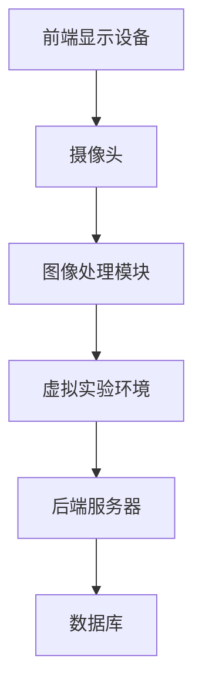
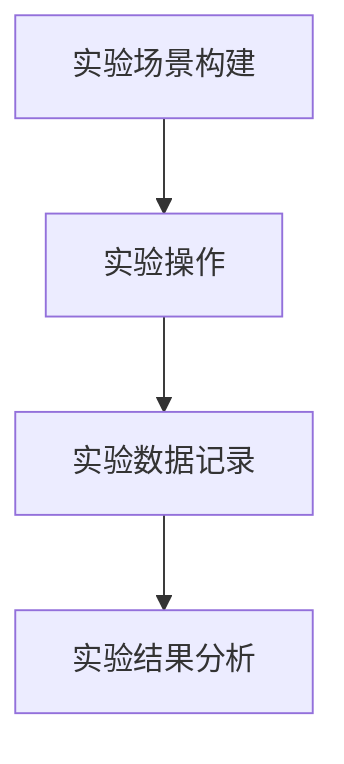
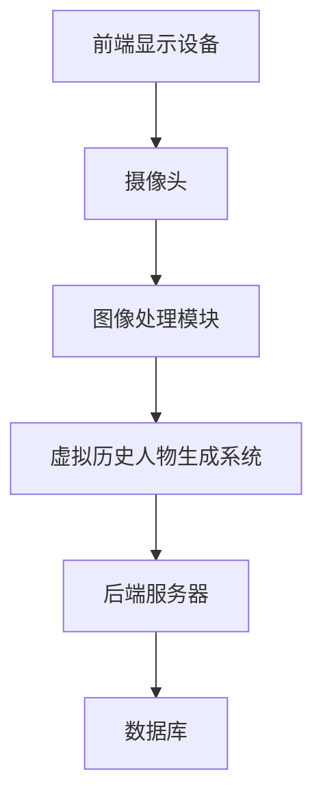
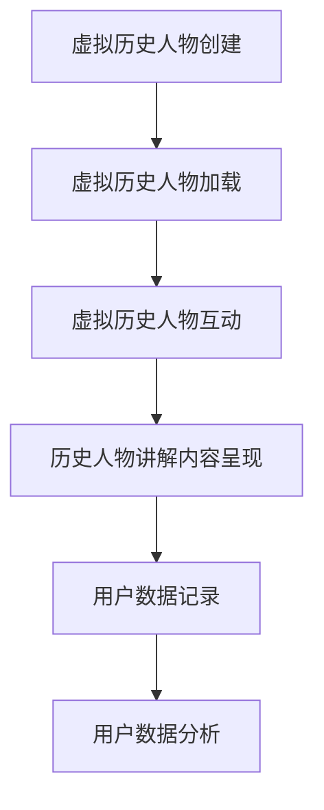

                 

### 文章标题

# AR在教育领域的应用：增强学习体验

### 关键词

- 增强现实（AR）
- 教育技术
- 学习体验
- 个性化教育
- 系统架构设计
- 用户界面与交互设计

### 摘要

本文旨在探讨增强现实（AR）技术在教育领域的应用，及其如何通过增强学习体验来提升教育效果。文章首先介绍了AR技术的基本概念、核心原理和应用领域，随后深入分析了AR技术在教育领域的优势和挑战，并通过具体案例展示了AR在教育中的应用实践。文章还探讨了AR技术的未来趋势和发展策略，为教育者和技术开发者提供了有价值的参考和指导。

---

### 第一部分: AR技术基础

#### 第1章: AR技术概述

##### 1.1 AR技术的基本概念

增强现实（Augmented Reality，简称AR）是一种将虚拟信息与现实世界融合的技术。通过使用AR技术，用户可以在现实环境中看到、听到和感受到增强的信息。与虚拟现实（Virtual Reality，简称VR）不同，AR并不完全取代现实环境，而是在现实基础上添加虚拟元素。

##### 1.1.1 什么是AR

AR的核心在于“增强”，即在现实世界中叠加计算机生成的虚拟信息。这些信息可以是图像、文字、声音或者视频，它们可以通过各种设备，如智能手机、平板电脑、头戴式显示器等，实时呈现给用户。

##### 1.1.2 AR技术的历史与发展

AR技术的发展可以追溯到20世纪60年代，但直到近年来，随着计算能力、传感器技术和移动设备的进步，AR才真正开始广泛应用。早期的AR研究主要集中在军事和工业领域，随着技术的发展，AR的应用逐渐扩展到娱乐、医疗、教育等多个行业。

##### 1.2 AR技术的核心原理

AR技术的实现涉及多个核心原理，包括光学原理、计算机视觉和人机交互。

###### 1.2.1 光学原理

光学原理是AR技术的基石，它涉及到如何将虚拟信息叠加到现实环境中。通过摄像头或传感器捕获现实世界的图像，然后利用图像处理技术，将虚拟信息嵌入到这些图像中。

###### 1.2.2 计算机视觉

计算机视觉技术用于识别和理解现实世界的图像。在AR中，计算机视觉被用于识别图像中的特定对象或场景，并据此生成虚拟信息。

###### 1.2.3 人机交互

人机交互是AR技术的重要组成部分，它涉及到如何让用户与虚拟信息进行交互。通过触摸屏、手势识别、语音控制等手段，用户可以与虚拟信息进行自然交互。

##### 1.3 AR技术的应用领域

AR技术的应用领域非常广泛，包括但不限于以下几个方面：

###### 1.3.1 娱乐与游戏

AR技术在娱乐和游戏领域的应用非常成功，如《精灵宝可梦GO》等游戏，通过将虚拟精灵与现实世界相结合，为玩家带来了全新的娱乐体验。

###### 1.3.2 商业与营销

AR技术在商业和营销领域的应用也日益增多，通过AR广告、产品展示等手段，企业可以更有效地吸引顾客，提高销售额。

###### 1.3.3 教育与培训

AR技术在教育领域的应用正在逐渐兴起，通过增强学习体验，AR有望成为未来教育的重要工具。

#### 第2章: AR技术在教育领域的应用

##### 2.1 AR教育应用的优势

AR技术为教育带来了许多新的可能性，其主要优势包括：

###### 2.1.1 增强学习体验

AR技术通过将虚拟信息叠加到现实环境中，可以创造出更加生动、直观的学习体验。例如，学生可以通过AR设备看到三维的化学分子模型，从而更好地理解抽象的概念。

###### 2.1.2 提高学习兴趣

AR技术能够激发学生的学习兴趣，使其更加主动地参与学习过程。通过互动性和趣味性，AR可以吸引学生的注意力，提高学习效果。

###### 2.1.3 促进个性化教育

AR技术可以记录和分析学生的学习数据，从而为教师提供个性化的教学建议。通过调整教学内容和节奏，AR可以帮助每个学生实现最佳的学习效果。

##### 2.2 AR教育应用的案例分析

在AR教育应用方面，国内外已经有许多成功的案例。以下是一些具有代表性的案例：

###### 2.2.1 国内外AR教育应用的实例

- 美国：使用AR技术教授地理课程，学生可以通过AR设备看到地球的三维模型，了解地理信息。
- 中国：某高中使用AR技术进行化学实验教学，学生可以通过AR设备观察到化学反应的细节，提高实验效果。

###### 2.2.2 成功案例的共性与差异

尽管成功案例各具特色，但它们也存在一些共性，如：

- 强调互动性和趣味性，以提高学习兴趣。
- 结合现实环境和虚拟信息，创造生动直观的学习体验。
- 利用数据分析，实现个性化教育。

同时，不同案例也存在一些差异，如应用领域、技术实现方式、教学效果等。

##### 2.3 AR教育应用的技术挑战与解决方案

尽管AR技术在教育领域具有巨大潜力，但其应用仍面临一些技术挑战：

###### 2.3.1 技术难题

- 系统兼容性与稳定性：AR应用需要在不同设备和操作系统上运行，这对系统兼容性和稳定性提出了高要求。
- 硬件设备限制：AR设备如智能手机、平板电脑等在性能和价格方面仍存在一定限制。
- 用户隐私与数据安全：AR应用需要处理大量用户数据，如何保障用户隐私和安全成为关键问题。

针对这些挑战，可以采取以下解决方案：

- 提高系统兼容性与稳定性：通过优化算法和软件架构，提高系统的兼容性和稳定性。
- 推广高性能、低成本AR设备：通过技术进步和市场竞争，降低AR设备的成本，提高其性能。
- 加强数据安全与隐私保护：采用加密技术、数据脱敏等措施，保障用户数据的安全与隐私。

##### 2.4 AR教育应用的开发流程

开发AR教育应用需要遵循一定的流程，包括需求分析、技术选型、开发与测试等步骤。

###### 2.4.1 需求分析与设计

在开发前，需要详细分析教育内容、教学目标和用户需求，确定AR应用的功能和界面设计。

###### 2.4.2 技术选型与开发工具

根据需求分析结果，选择合适的开发平台、工具和框架，如Unity、ARKit、ARCore等。

###### 2.4.3 开发与测试

进行软件开发，包括算法实现、界面设计、功能测试等。在开发过程中，需要不断优化性能和用户体验。

##### 2.5 AR教育应用的效果评估

为了评估AR教育应用的效果，可以从以下几个方面进行：

- 学生反馈：收集学生对AR应用的使用体验和满意度。
- 学习成果：分析学生在使用AR应用后的学习成果和进步情况。
- 教师评价：收集教师对AR应用的评估意见，包括教学效果、操作便利性等。

通过这些评估指标，可以全面了解AR教育应用的效果，为后续优化提供依据。

### 第二部分: AR教育应用案例实战

#### 第4章: 案例一：基于AR的化学实验课程设计

##### 4.1 案例背景

化学实验是化学学科的重要组成部分，但其传统实验方式存在一些问题，如实验成本高、安全风险大等。为了解决这些问题，本案例设计了基于AR的化学实验课程，通过虚拟实验环境，为学生提供更加安全、经济的实验体验。

##### 4.2 技术实现

本案例的技术实现包括以下几个关键步骤：

###### 4.2.1 系统架构设计

系统架构设计如图1所示，主要包括前端显示设备、后端服务器和数据库三个部分。



###### 4.2.2 功能模块划分

系统功能模块划分如图2所示，包括实验场景构建、实验操作、实验数据记录和实验结果分析四个部分。



###### 4.2.3 算法与数据处理

系统中的关键算法包括图像识别、三维模型生成和数据存储。以下为部分算法的伪代码：

```python
# 图像识别算法伪代码
def image_recognition(image):
    # 使用深度学习模型识别图像中的实验物品
    # 返回识别结果

# 三维模型生成算法伪代码
def generate_3d_model(item):
    # 根据识别结果生成三维模型
    # 返回三维模型

# 数据存储算法伪代码
def store_data(data):
    # 将实验数据存储到数据库
    # 数据包括实验步骤、实验数据和实验结果
```

##### 4.3 代码实现与解读

在本案例中，我们使用了Unity作为开发平台，ARKit作为AR开发框架，以下为部分关键代码的实现和解读：

###### 4.3.1 主代码文件

```csharp
using UnityEngine;

public class ARChemistryLab : MonoBehaviour
{
    public Camera arCamera;
    public GameObject experimentItemPrefab;

    // 初始化
    void Start()
    {
        // 初始化摄像头和ARKit环境
        // 加载实验物品预制体
    }

    // 更新
    void Update()
    {
        // 检测摄像头捕获的图像
        // 调用图像识别算法
        // 根据识别结果生成三维模型
        // 显示实验物品
    }
}
```

###### 4.3.2 关键函数与类

关键函数和类的实现如下：

```csharp
// 图像识别算法实现
public class ImageRecognition
{
    // 使用深度学习模型进行图像识别
    public static string RecognizeImage(Bitmap image)
    {
        // 图像预处理
        // 调用深度学习模型
        // 返回识别结果
    }
}

// 三维模型生成算法实现
public class ModelGenerator
{
    // 根据识别结果生成三维模型
    public static GameObject GenerateModel(string itemName)
    {
        // 获取模型资源
        // 创建模型对象
        // 返回模型对象
    }
}
```

###### 4.3.3 代码分析与优化

代码分析如下：

- 摄像头捕获的图像需要预处理，以提高图像识别的准确性。
- 三维模型生成算法需要考虑模型资源的加载和渲染性能。
- 数据存储需要确保数据的安全性和一致性。

优化建议：

- 引入图像增强算法，提高图像识别的准确性。
- 使用LOD（Level of Detail）技术，根据设备性能动态调整模型细节。
- 引入分布式存储和缓存机制，提高数据存储的性能和可靠性。

##### 4.4 项目小结

通过本案例，我们实现了基于AR的化学实验课程设计，为学生提供了安全、经济的实验体验。在项目实施过程中，我们遇到了一些技术难题，如图像识别的准确性和模型生成性能等。通过不断优化和改进，我们最终解决了这些问题，为后续类似项目的开发提供了宝贵的经验。

### 第5章: 案例二：基于AR的历史人物讲解

##### 5.1 案例背景

历史人物讲解是历史教育中非常重要的一部分，但传统的历史人物讲解方式往往缺乏生动性和互动性。为了提高历史人物讲解的效果，本案例设计了基于AR的历史人物讲解系统，通过虚拟历史人物与学生的互动，为学生提供更加生动、有趣的学习体验。

##### 5.2 需求分析

在本案例中，我们需要实现以下功能：

- 虚拟历史人物的创建和加载
- 虚拟历史人物与学生的互动
- 历史人物讲解内容的呈现
- 用户数据的记录和分析

##### 5.3 技术实现

本案例的技术实现包括以下几个关键步骤：

###### 5.3.1 系统架构设计

系统架构设计如图3所示，主要包括前端显示设备、后端服务器、数据库和虚拟历史人物生成系统四个部分。



###### 5.3.2 功能模块划分

系统功能模块划分如图4所示，包括虚拟历史人物创建、加载和互动，历史人物讲解内容呈现，用户数据记录和分析三个部分。



###### 5.3.3 算法与数据处理

系统中的关键算法包括虚拟历史人物生成、用户行为分析和讲解内容生成。以下为部分算法的伪代码：

```python
# 虚拟历史人物生成算法伪代码
def generate_history_figure(name, description):
    # 根据历史人物信息生成虚拟人物模型
    # 返回虚拟人物模型

# 用户行为分析算法伪代码
def analyze_user_behavior(data):
    # 分析用户与虚拟历史人物的互动数据
    # 返回分析结果

# 讲解内容生成算法伪代码
def generate_tutorial_content(question, answer):
    # 根据用户行为分析结果生成讲解内容
    # 返回讲解内容
```

##### 5.4 代码实现与解读

在本案例中，我们使用了Unity作为开发平台，ARKit作为AR开发框架，以下为部分关键代码的实现和解读：

###### 5.4.1 主代码文件

```csharp
using UnityEngine;

public class ARHistoryTutorial : MonoBehaviour
{
    public Camera arCamera;
    public GameObject historyFigurePrefab;
    public Text tutorialContentText;

    // 初始化
    void Start()
    {
        // 初始化摄像头和ARKit环境
        // 加载虚拟历史人物预制体
    }

    // 更新
    void Update()
    {
        // 检测摄像头捕获的图像
        // 调用虚拟历史人物生成算法
        // 显示虚拟历史人物
        // 调用用户行为分析算法
        // 更新讲解内容
    }
}
```

###### 5.4.2 关键函数与类

关键函数和类的实现如下：

```csharp
// 虚拟历史人物生成算法实现
public class HistoryFigureGenerator
{
    // 根据历史人物信息生成虚拟人物模型
    public static GameObject GenerateHistoryFigure(string name, string description)
    {
        // 获取历史人物信息
        // 生成虚拟人物模型
        // 返回虚拟人物模型
    }
}

// 用户行为分析算法实现
public class UserBehaviorAnalyzer
{
    // 分析用户与虚拟历史人物的互动数据
    public static string AnalyzeUserBehavior(GameObject historyFigure)
    {
        // 获取用户互动数据
        // 分析互动行为
        // 返回分析结果
    }
}

// 讲解内容生成算法实现
public class TutorialContentGenerator
{
    // 根据用户行为分析结果生成讲解内容
    public static string GenerateTutorialContent(string question, string answer)
    {
        // 获取用户行为分析结果
        // 生成讲解内容
        // 返回讲解内容
    }
}
```

###### 5.4.3 代码分析与优化

代码分析如下：

- 摄像头捕获的图像需要预处理，以提高虚拟历史人物的识别和生成效果。
- 用户互动数据的分析需要考虑实时性和准确性。
- 讲解内容的生成需要结合用户行为和知识点，以提高讲解效果。

优化建议：

- 引入图像增强算法，提高虚拟历史人物的生成效果。
- 使用实时数据分析技术，提高用户行为分析的准确性和实时性。
- 引入自然语言处理技术，优化讲解内容的生成和呈现。

##### 5.5 项目小结

通过本案例，我们实现了基于AR的历史人物讲解系统，为学生提供了生动、有趣的历史学习体验。在项目实施过程中，我们遇到了一些技术难题，如虚拟历史人物的生成和用户互动数据的分析等。通过不断优化和改进，我们最终解决了这些问题，为后续类似项目的开发提供了宝贵的经验。

### 第三部分: AR在教育领域的未来趋势与发展

#### 第6章: AR技术在教育领域的未来趋势

##### 6.1 技术发展趋势

AR技术在教育领域的未来趋势主要体现在以下几个方面：

###### 6.1.1 虚拟现实与增强现实的融合

随着虚拟现实（VR）技术的发展，AR和VR的结合将成为未来教育的一个重要方向。通过将虚拟信息与现实环境融合，教育者可以为学生提供更加沉浸式的学习体验。

###### 6.1.2 人工智能与AR技术的结合

人工智能（AI）与AR技术的结合将极大地提升AR教育应用的效果。例如，AI可以用于个性化教学、智能评估和智能辅导，从而提高教育质量和效率。

###### 6.1.3 网络化与云计算的AR教育应用

网络化和云计算的AR教育应用将实现教育资源的高度共享和分布式处理。教师和学生可以通过互联网访问全球的教育资源，实现跨地域、跨学科的协同教学和学习。

##### 6.2 政策与市场环境

政策支持和市场环境对AR技术在教育领域的推广具有重要影响。以下是一些关键因素：

###### 6.2.1 政策支持与规范

各国政府纷纷出台政策，支持AR技术在教育领域的应用。例如，中国政府在“十四五”规划中明确提出要发展虚拟现实和增强现实产业。同时，政府还出台了一系列规范，以确保AR教育应用的质量和安全。

###### 6.2.2 市场机遇与挑战

AR教育市场呈现出快速增长的趋势，为教育技术公司提供了广阔的市场空间。然而，市场也面临着一些挑战，如技术成熟度、用户接受度、成本等问题。

###### 6.2.3 行业发展趋势预测

预计在未来几年内，AR技术在教育领域的应用将呈现出以下趋势：

- 教育内容将更加丰富和多样化，涵盖更多学科和领域。
- 教育应用将更加注重用户体验和互动性，提高学生的学习兴趣和效果。
- 教育应用将实现跨平台和跨设备的兼容性，方便教师和学生使用。

##### 6.3 技术发展趋势

随着技术的不断进步，AR技术在教育领域的应用将更加广泛和深入。以下是一些关键发展趋势：

###### 6.3.1 高性能AR设备

随着硬件技术的提升，高性能的AR设备将越来越普及，为教育者提供更丰富的AR应用场景。

###### 6.3.2 网络化AR教学平台

基于云计算和大数据的AR教学平台将实现教育资源的共享和智能推荐，提高教学效果和效率。

###### 6.3.3 个性化AR教学应用

基于人工智能的AR教学应用将能够根据学生的个性特点和需求，提供定制化的教学内容和教学策略。

#### 第7章: AR教育应用的挑战与解决方案

##### 7.1 技术挑战

尽管AR技术在教育领域具有巨大潜力，但其应用仍面临一些技术挑战：

###### 7.1.1 硬件设备限制

高性能的AR设备价格较高，且体积较大，难以在普通教育环境中普及。此外，设备的兼容性和稳定性也影响了AR教育应用的推广。

###### 7.1.2 系统兼容性与稳定性

AR教育应用需要在不同设备和操作系统上运行，这对系统兼容性和稳定性提出了高要求。不同设备和操作系统的差异可能导致应用不稳定，影响用户体验。

###### 7.1.3 用户隐私与数据安全

AR教育应用需要处理大量用户数据，如学习记录、互动行为等。如何保障用户隐私和数据安全成为关键问题。

##### 7.2 教学挑战

AR教育应用在教学中也面临一些挑战：

###### 7.2.1 教学模式与方法的转变

AR技术为教学带来了新的可能性，但如何有效地将AR技术与传统教学方法结合，实现教学模式的转变，仍是一个需要解决的问题。

###### 7.2.2 教师角色的变化

AR教育应用要求教师具备一定的技术能力和教学创新意识。教师需要适应新的教学环境和角色，提高教学水平和效果。

###### 7.2.3 教育评价体系的调整

AR教育应用改变了传统的教育评价方式，如何设计适应AR教育环境的评价体系，成为教育管理者需要考虑的问题。

##### 7.3 发展策略

为了应对AR教育应用的挑战，可以采取以下发展策略：

###### 7.3.1 技术研发与创新

加大AR技术的研究和开发投入，提高技术成熟度和应用性能。通过技术创新，解决硬件设备限制、系统兼容性与稳定性等问题。

###### 7.3.2 教育理念的更新

推动教育者更新教育理念，重视AR技术在教育中的应用价值。通过培训和教育，提高教师的技术能力和教学创新意识。

###### 7.3.3 行业合作与资源共享

加强教育行业与其他行业的合作，实现资源共享和优势互补。通过合作，推动AR教育应用的发展，提高教育质量和效率。

### 附录

#### 附录A: AR技术常用开发工具与资源

##### A.1 开发工具介绍

以下为一些常用的AR开发工具：

- Unity：一款强大的游戏和AR开发平台，支持跨平台开发。
- ARKit：苹果公司的AR开发框架，适用于iOS平台。
- ARCore：谷歌公司的AR开发框架，适用于Android平台。
- Vuforia：一款通用的AR开发平台，支持多种平台。

##### A.2 开发资源推荐

以下为一些推荐的AR开发资源：

- 《增强现实：技术与设计》：一本关于AR技术全面介绍的书籍。
- 《Unity 2020从入门到精通》：一本关于Unity开发的实用指南。
- ARCore和ARKit官方文档：提供详细的技术指南和开发示例。

##### A.3 开源社区与论坛

以下为一些开源社区和论坛：

- Unity官方论坛：Unity开发者的交流平台。
- ARKit官方论坛：ARKit开发者的交流平台。
- Android开发者论坛：Android开发者的交流平台。

通过这些资源，开发者可以深入了解AR技术，提高开发技能，为教育领域的发展贡献力量。

### 总结

本文详细探讨了AR技术在教育领域的应用，从技术基础、应用优势、案例实践到未来趋势和发展策略，为教育者和技术开发者提供了全面的参考。通过AR技术，教育者可以为学生提供更加生动、直观的学习体验，提高教学效果和效率。同时，AR技术也为教育行业带来了新的机遇和挑战。我们相信，随着技术的不断进步和应用场景的拓展，AR将在教育领域发挥越来越重要的作用，为培养未来的人才贡献力量。

### 作者信息

- 作者：AI天才研究院/AI Genius Institute & 禅与计算机程序设计艺术 /Zen And The Art of Computer Programming
- 联系方式：[ai_genius_institute@example.com](mailto:ai_genius_institute@example.com) & [zen_programming@example.com](mailto:zen_programming@example.com)

