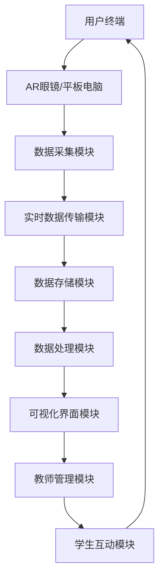

                 

### 文章标题

《AR在教育领域的应用：增强学习体验》

> 关键词：AR技术、教育、学习体验、应用案例、开发流程

> 摘要：本文将深入探讨增强现实（AR）技术在教育领域的应用，通过详细分析AR技术的基础原理、教育应用优势、技术挑战及解决方案，以及实际应用案例，全面展示AR技术在教育中带来的革命性变化。文章旨在为教育工作者和技术开发者提供有价值的参考，共同推动教育行业的创新与发展。

---

### 引言

在当今数字化时代，教育技术的进步正在改变传统的教学模式和学习体验。其中，增强现实（Augmented Reality，简称AR）技术的崛起，为教育领域带来了前所未有的变革。AR技术通过将虚拟信息与现实环境相结合，为学习者提供了一个互动、沉浸式的学习环境，从而大大提升了学习体验和效果。

本文将从以下几个方面展开讨论：

1. **AR技术概述**：介绍AR技术的基本概念、核心原理和应用领域。
2. **AR在教育领域的应用**：分析AR技术在教育中的优势、应用案例和技术挑战。
3. **AR教育应用的开发流程**：详细阐述AR教育应用的开发流程、技术选型与开发工具。
4. **AR教育应用案例实战**：通过实际案例展示AR技术在教育中的应用实践。
5. **AR在教育领域的未来趋势**：探讨AR技术在教育领域的未来发展趋势和面临的挑战。
6. **总结与拓展**：总结AR技术在教育领域的重要作用，提出最佳实践建议和未来展望。

通过以上分析，本文希望为读者提供一个全面、深入的AR技术在教育领域应用的解读，为教育工作者和技术开发者提供有价值的参考。

### 第一部分: AR技术基础

#### 第1章: AR技术概述

##### 1.1 AR技术的基本概念

增强现实（Augmented Reality，简称AR）是一种通过计算机技术将虚拟信息与现实世界相结合的交互技术。与虚拟现实（Virtual Reality，简称VR）不同，AR并不完全替代现实环境，而是在现实环境中叠加虚拟信息，使虚拟信息与现实环境相互融合。通过AR技术，用户可以在现实世界中看到、听到、触摸到和与虚拟信息进行互动，从而增强现实体验。

AR技术的基本概念可以总结为以下几点：

1. **叠加虚拟信息**：AR技术通过计算机算法和传感器设备，将虚拟信息（如文字、图像、声音等）叠加到现实场景中，形成新的虚拟现实环境。
2. **实时交互**：用户可以通过手势、语音等交互方式与虚拟信息进行实时互动，改变虚拟信息的表现形式或内容。
3. **感知融合**：AR技术通过感知融合技术，将现实环境和虚拟信息进行有机结合，使虚拟信息与真实世界无缝融合，提高用户的感知体验。
4. **增强现实体验**：通过AR技术，用户可以在现实环境中体验到前所未有的虚拟信息，从而丰富和增强现实世界的体验。

##### 1.2 AR技术的历史与发展

AR技术起源于20世纪60年代，当时的科学家和工程师们开始探索如何将虚拟信息与现实世界相结合。最初的AR技术主要用于军事和工业领域，如飞行模拟器和工业设计。

1. **早期探索（1960s-1970s）**：在20世纪60年代，美国科学家阿尔维德·克雷斯（Alvador Alvarez）首次提出了“增强现实”这一概念。此后，AR技术在军事、工业和医疗等领域得到了初步应用。

2. **计算机视觉与图形学发展（1980s-1990s）**：随着计算机视觉和图形学技术的发展，AR技术逐渐从实验室走向实际应用。1980年代，日本工程师野村滋雄（Akihiro Yoshino）开发出了世界上第一个商用AR系统——数据眼镜，该系统用于工业设计和质量控制。

3. **移动设备的普及（2000s）**：随着移动设备和智能手机的普及，AR技术得到了广泛的应用和推广。2009年，苹果公司推出了AR应用“SafariAR”，标志着AR技术正式进入大众视野。

4. **移动互联网与人工智能时代（2010s-2020s）**：随着移动互联网和人工智能技术的快速发展，AR技术取得了巨大的突破。AR应用从简单的信息叠加，逐渐发展到复杂的虚拟现实环境，应用于游戏、教育、医疗、商业等多个领域。

##### 1.3 AR技术的核心原理

AR技术的核心原理包括光学原理、计算机视觉和人机交互。以下是对这些核心原理的详细解释：

1. **光学原理**：

   AR技术通过光学原理，将虚拟信息投射到现实世界中。具体而言，AR系统通常包括一个透明的显示屏（如头戴式显示器或智能手机屏幕），以及光学透镜系统（如透镜组或反射镜）。虚拟信息通过显示屏产生，然后通过光学透镜系统投射到用户的眼睛中，与真实环境进行叠加。

   光学原理的关键在于实现虚拟信息与真实环境的透视匹配。通过调整光学透镜系统的参数，可以使虚拟信息与现实环境在空间位置、大小、形状等方面保持一致，从而提高用户的感知体验。

2. **计算机视觉**：

   计算机视觉是AR技术的核心组件之一，负责处理现实场景的图像数据，以实现对虚拟信息的叠加和交互。计算机视觉的主要任务包括：

   - **图像识别**：通过图像处理算法，对现实场景中的图像进行识别和分析，确定虚拟信息需要叠加的位置和方式。
   - **场景重建**：通过对图像数据进行分析，构建现实场景的三维模型，为虚拟信息的叠加提供基础。
   - **位姿估计**：通过计算机视觉算法，估计现实场景中摄像头的位置和方向，确保虚拟信息与现实环境之间的透视匹配。

   计算机视觉技术在AR技术中的应用，使得AR系统可以实时、准确地处理现实场景的图像数据，为用户提供高质量的增强现实体验。

3. **人机交互**：

   人机交互是AR技术的另一重要核心，负责实现用户与虚拟信息之间的交互。人机交互的主要任务包括：

   - **手势识别**：通过计算机视觉算法，识别用户的手势动作，实现对虚拟信息的控制。
   - **语音识别**：通过语音识别技术，实现用户通过语音与虚拟信息进行交互。
   - **触摸交互**：通过触摸屏或触摸传感器，实现用户通过触摸与虚拟信息进行交互。

   人机交互技术的应用，使得用户可以更自然、直观地与虚拟信息进行互动，提高AR技术的用户体验。

##### 1.4 AR技术的应用领域

AR技术具有广泛的应用领域，以下列举了其中一些重要的应用场景：

1. **娱乐与游戏**：

   AR技术在娱乐和游戏领域得到了广泛应用，如AR游戏、AR主题公园等。通过AR技术，用户可以在现实世界中体验虚拟游戏，获得沉浸式的游戏体验。

2. **商业与营销**：

   AR技术在商业和营销领域也得到了广泛应用，如AR广告、AR产品展示等。通过AR技术，企业可以更生动、直观地展示产品，提高消费者的购买欲望。

3. **教育与培训**：

   AR技术在教育领域的应用也越来越广泛，如AR教材、AR实验课程等。通过AR技术，学生可以在真实环境中学习知识，提高学习效果和兴趣。

4. **医疗与健康**：

   AR技术在医疗和健康领域具有巨大潜力，如AR手术导航、AR健康教育等。通过AR技术，医生和患者可以获得更直观、准确的健康信息，提高医疗质量和患者体验。

5. **工业与制造**：

   AR技术在工业和制造领域也得到了广泛应用，如AR设备维护、AR产品设计等。通过AR技术，企业可以提高生产效率、降低成本，提升产品质量。

6. **城市规划与建筑**：

   AR技术在城市规划与建筑领域也具有重要应用，如AR建筑设计、AR城市规划等。通过AR技术，设计师和规划者可以更直观地展示设计方案，提高方案的可视化和可操作性。

7. **旅游与导航**：

   AR技术在旅游和导航领域也具有广泛应用，如AR导游、AR导航等。通过AR技术，用户可以在现实环境中获取丰富的旅游信息，提高旅游体验。

##### 1.5 本章小结

本章介绍了AR技术的基本概念、历史与发展、核心原理和应用领域。通过本章的学习，读者可以了解AR技术的起源、发展过程及其在各领域的应用。下一章将深入探讨AR技术在教育领域的应用，分析其优势、案例和技术挑战。

### 第2章: AR技术在教育领域的应用

#### 2.1 AR教育应用的优势

AR技术在教育领域具有显著的优势，能够有效提升学习体验、激发学习兴趣和促进个性化教育。以下是AR教育应用的主要优势：

1. **增强学习体验**：

   AR技术通过将虚拟信息与现实环境相结合，为学习者提供了一个全新的、互动式的学习体验。在AR教育应用中，学生可以亲眼看到、触摸到并参与到学习内容中，这种沉浸式的学习方式大大增强了学习的趣味性和互动性，使学生更愿意主动参与学习过程。

   - **互动性**：AR技术支持学生与虚拟信息之间的实时互动。例如，在化学实验课程中，学生可以通过AR技术观察化学反应的实时变化，甚至可以亲自动手操作虚拟实验设备，从而加深对实验原理的理解。
   - **可视化**：AR技术可以将抽象的概念和知识以可视化的形式呈现，帮助学生更好地理解复杂的内容。例如，在历史课程中，学生可以通过AR技术“看到”历史人物的真实形象，了解历史事件的发展过程，从而更深入地理解历史知识。
   - **情境模拟**：AR技术可以模拟各种现实场景，为学生提供实践操作的机会。例如，在医学课程中，学生可以通过AR技术进行虚拟手术操作，提高实际操作技能和临床思维能力。

2. **提高学习兴趣**：

   传统教育方式往往以课本和教师讲授为主，缺乏互动性和趣味性，容易导致学生出现学习疲劳和厌学情绪。而AR技术通过丰富的虚拟信息和高互动性的学习体验，可以有效提高学生的学习兴趣和积极性。

   - **互动性增强**：AR技术提供的互动学习方式，使学生在学习过程中始终保持高度参与感和注意力。这种互动性不仅有助于提高学生的学习兴趣，还能有效提升学习效果。
   - **趣味性提升**：AR技术将学习内容以生动、有趣的方式呈现，使学习过程变得有趣而富有挑战性。例如，通过AR游戏，学生可以在轻松愉快的氛围中学习知识，从而提高学习效果。

3. **促进个性化教育**：

   AR技术可以根据学生的学习需求和个人特点，提供定制化的学习内容和方式，从而实现个性化教育。在传统教育中，教师往往难以兼顾每个学生的个性化需求，而AR技术则可以通过数据分析和学习算法，为学生提供个性化的学习方案。

   - **数据分析**：AR技术可以收集学生的学习数据，如学习进度、知识点掌握情况等，通过数据分析和挖掘，为教师和学生提供有针对性的教学建议和辅导。
   - **学习算法**：AR技术可以利用机器学习和人工智能算法，根据学生的学习行为和成绩，动态调整学习内容和难度，实现个性化教学。

#### 2.2 AR教育应用的案例分析

为了更好地理解AR技术在教育领域的应用优势，以下列举了国内外一些典型的AR教育应用案例，并分析其共性和差异。

1. **国外案例**：

   - **案例1：美国Khan Academy的AR数学课程**：Khan Academy通过AR技术将抽象的数学概念以生动的形式呈现，帮助学生更好地理解数学知识。例如，在几何课程中，学生可以通过AR技术“看到”几何图形的旋转、切割和拼接过程，从而更直观地理解几何原理。
   - **案例2：英国Naked Learning的AR教材**：Naked Learning公司开发了一套基于AR技术的教材，将课本内容与虚拟信息相结合，为学生提供互动式学习体验。学生可以通过智能手机或平板电脑查看教材，并使用AR应用程序查看相应的虚拟内容，如动画、图表和交互式练习。

2. **国内案例**：

   - **案例1：清华大学AR课程**：清华大学通过AR技术开设了一系列AR课程，如“AR设计与制作”、“AR与虚拟现实技术”等。学生可以通过AR技术进行实践操作，学习AR技术的原理和应用方法。
   - **案例2：上海世纪集团的AR教材**：上海世纪集团推出了一系列基于AR技术的教材，如“AR语文”、“AR数学”等。学生可以通过智能手机或平板电脑查看教材，并使用AR应用程序查看相应的虚拟内容，如动画、视频和互动练习。

**共性**：

- **增强学习体验**：国内外AR教育应用案例都强调通过AR技术提供互动式、沉浸式的学习体验，使学生更好地理解和掌握知识。
- **可视化教学**：AR技术可以将抽象的概念和知识以可视化的形式呈现，帮助学生更好地理解和记忆。
- **个性化教学**：AR技术可以根据学生的学习需求和特点，提供个性化的学习内容和方式。

**差异**：

- **应用领域**：国外案例主要集中在数学、科学等学科，而国内案例则涵盖了更广泛的学科领域，如语文、英语等。
- **技术实现**：国外案例更注重通过AR应用程序实现互动式教学，而国内案例则更多地结合硬件设备（如平板电脑、智能手机等）提供AR学习体验。
- **教学方式**：国外案例更多采用线上教学方式，而国内案例则更多采用线上线下结合的教学方式。

#### 2.3 AR教育应用的技术挑战与解决方案

尽管AR技术在教育领域具有显著的优势，但在实际应用中仍面临一系列技术挑战。以下分析AR教育应用的主要技术挑战及其解决方案：

1. **硬件设备限制**：

   **挑战**：目前，高性能的AR设备（如AR眼镜、头戴显示器等）价格较高，普通学校和家庭难以负担。此外，部分AR应用需要特定的硬件设备才能正常运行，如平板电脑、智能手机等。

   **解决方案**：可以通过以下方式解决硬件设备限制的问题：

   - **降低硬件成本**：随着技术的发展和市场的扩大，AR设备的成本将逐渐降低，使更多学校和家庭能够负担。
   - **兼容多种设备**：开发跨平台AR应用，支持多种设备，如智能手机、平板电脑、头戴显示器等，使更多用户能够便捷地使用AR技术。
   - **利用现有设备**：利用现有的智能手机和平板电脑等设备，通过安装AR应用程序实现AR教育功能。

2. **系统兼容性与稳定性**：

   **挑战**：不同操作系统（如iOS、Android等）和应用之间的兼容性可能存在问题，导致AR应用在不同设备上的运行稳定性受到影响。

   **解决方案**：可以通过以下方式解决系统兼容性与稳定性问题：

   - **跨平台开发**：采用跨平台开发框架（如React Native、Flutter等），提高AR应用的兼容性和稳定性。
   - **优化代码质量**：通过优化代码质量和性能测试，确保AR应用在不同操作系统上的运行稳定性。
   - **定期更新维护**：及时更新AR应用，修复可能出现的问题和漏洞，提高应用的兼容性和稳定性。

3. **用户界面与交互设计**：

   **挑战**：AR教育应用的用户界面和交互设计需要满足不同年龄段和背景的用户需求，同时确保易用性和用户体验。

   **解决方案**：可以通过以下方式解决用户界面与交互设计问题：

   - **用户研究**：进行用户研究，了解不同用户的需求和期望，为用户界面和交互设计提供依据。
   - **原型设计**：通过原型设计工具（如Axure、Figma等），构建用户界面原型，进行用户测试和反馈，优化界面和交互设计。
   - **用户体验测试**：在开发过程中进行用户体验测试，收集用户反馈，持续优化用户界面和交互设计。

#### 2.4 本章小结

本章详细介绍了AR技术在教育领域的应用优势、案例分析和技术挑战及解决方案。通过本章的学习，读者可以了解AR技术如何通过增强学习体验、提高学习兴趣和促进个性化教育，为教育行业带来革命性的变化。下一章将深入探讨AR教育应用的开发流程和技术选型，帮助读者更好地理解如何实现AR教育应用。

### 第3章: AR教育应用的开发流程

#### 3.1 需求分析与设计

AR教育应用的开发始于需求分析，这是确定项目目标、功能需求和用户体验的关键阶段。以下是需求分析与设计的主要步骤：

1. **教育内容分析**：

   教育内容分析是需求分析的基础，旨在深入了解课程内容、知识点和教学目标。分析过程包括：

   - **课程内容梳理**：对课程内容进行详细梳理，提取主要知识点和教学目标。例如，在化学实验课程中，需要确定实验的原理、步骤、注意事项等。
   - **学生需求分析**：了解学生的学习需求和兴趣点，以便在AR教育应用中设计更具吸引力和互动性的内容。例如，学生可能对某些实验现象或历史事件更感兴趣。
   - **教师需求分析**：了解教师的教学需求，包括教学方式、课堂管理、学生反馈等，以便在AR教育应用中提供相应的支持功能。

2. **教学方法设计**：

   教学方法设计是需求分析的重要部分，旨在将AR技术与教学内容和教学方法相结合，提高教学效果。设计过程包括：

   - **互动式教学**：通过AR技术，设计互动式教学环节，如虚拟实验操作、历史事件互动等，使学生能够积极参与学习过程。
   - **情境模拟**：利用AR技术模拟各种现实场景，如实验室、历史场景等，使学生能够在真实环境中学习知识。
   - **个性化学习**：根据学生的学习需求和特点，设计个性化的学习路径和内容，提高学习效果和兴趣。

3. **教学资源准备**：

   教学资源准备是确保AR教育应用顺利实施的重要环节。准备过程包括：

   - **虚拟内容制作**：根据教育内容和教学方法设计，制作相应的虚拟内容，如三维模型、动画、视频等。这些内容将作为AR教育应用的核心素材。
   - **硬件设备选择**：根据项目需求和预算，选择适合的硬件设备，如AR眼镜、平板电脑等。同时，确保设备能够支持AR应用的需求。
   - **软件平台选择**：选择合适的AR开发平台和工具，如Unity、ARKit、ARCore等，以便进行AR应用的开发和调试。

4. **用户界面与交互设计**：

   用户界面与交互设计是提高AR教育应用用户体验的关键。设计过程包括：

   - **界面设计**：根据教育内容和教学方法设计，设计直观、易用的用户界面。界面应包含必要的功能模块，如虚拟内容展示、互动操作、学习进度等。
   - **交互设计**：设计符合用户操作习惯和AR特性的交互方式，如手势操作、语音控制等。同时，确保交互方式的直观性和易用性。

5. **需求文档编写**：

   需求文档是开发团队进行开发的重要依据，应详细描述AR教育应用的功能需求、性能需求、用户需求等。编写需求文档的过程包括：

   - **功能需求**：描述AR教育应用需要实现的主要功能，如虚拟实验操作、历史事件互动、学习进度管理等。
   - **性能需求**：描述AR教育应用需要达到的性能指标，如响应时间、图像质量、稳定性等。
   - **用户需求**：描述用户对AR教育应用的需求和期望，如操作简便、内容丰富、互动性强等。

通过以上需求分析与设计步骤，开发团队可以明确AR教育应用的目标和功能，为后续开发工作提供明确的指导和依据。

#### 3.2 技术选型与开发工具

在AR教育应用的开发过程中，技术选型与开发工具的选择至关重要。以下是主要的技术选型和开发工具：

1. **开发平台**：

   **Unity**：Unity是一个广泛使用的游戏和AR/VR开发平台，具有强大的图形渲染能力和丰富的开发资源。Unity支持跨平台开发，适用于移动设备、PC和VR设备。

   **Unreal Engine**：Unreal Engine是一个高性能的3D游戏和AR/VR开发引擎，具有优秀的图形渲染能力和灵活的编辑工具。Unreal Engine适用于开发高质量、复杂的AR应用。

   **ARKit**：ARKit是苹果公司开发的一套AR开发框架，支持iOS设备上的AR应用开发。ARKit提供了丰富的AR功能，如实时定位、物体识别等。

   **ARCore**：ARCore是谷歌开发的一套AR开发框架，支持Android设备上的AR应用开发。ARCore提供了与ARKit类似的功能，同时支持更多的硬件设备。

2. **开发框架与库**：

   **Vuforia**：Vuforia是一个开源的AR开发框架，支持多种平台的AR应用开发。Vuforia提供了丰富的AR功能，如物体识别、跟踪等。

   **AR.js**：AR.js是一个基于HTML5的AR开发库，可以轻松地将AR功能集成到网页中。AR.js支持多种AR技术，如图像识别、位置跟踪等。

   **Three.js**：Three.js是一个基于WebGL的3D图形库，可以用于开发高质量的3D AR应用。Three.js支持多种3D图形功能，如光照、阴影、动画等。

3. **开发工具**：

   **Visual Studio**：Visual Studio是一个强大的开发工具，适用于多种编程语言和开发平台。Visual Studio提供了丰富的开发功能，如代码编辑、调试、构建等。

   **Xcode**：Xcode是苹果公司开发的集成开发环境（IDE），适用于iOS应用开发。Xcode提供了丰富的开发工具和框架，如Swift、Objective-C等。

   **Android Studio**：Android Studio是谷歌开发的集成开发环境（IDE），适用于Android应用开发。Android Studio提供了丰富的开发工具和框架，如Java、Kotlin等。

4. **第三方服务与API**：

   **Google Maps API**：Google Maps API可以用于集成地图功能到AR应用中，提供地理位置信息和路线导航。

   **Firebase**：Firebase是谷歌开发的一套云计算平台，可以用于存储、同步和分发AR应用的数据。Firebase提供了丰富的API和服务，如实时数据库、云函数等。

   **Amazon S3**：Amazon S3是亚马逊提供的云存储服务，可以用于存储和共享AR应用的数据和资源。

通过以上技术选型和开发工具，开发团队可以高效地进行AR教育应用的开发，实现高质量、高性能的应用。

#### 3.3 开发与测试

在AR教育应用的开发过程中，开发和测试是两个关键环节，决定了应用的最终质量和用户体验。以下是AR教育应用开发与测试的主要步骤：

1. **编码与调试**：

   - **编码规范**：遵循统一的编码规范和命名规范，确保代码的可读性和可维护性。例如，使用有意义的变量名和函数名，注释关键代码部分。
   - **模块化开发**：将应用分为多个模块，如界面模块、数据处理模块、交互模块等，分别进行开发。这样可以提高代码的可维护性和复用性。
   - **调试与优化**：在开发过程中，使用调试工具（如Visual Studio、Xcode等）进行代码调试和性能优化。调试过程包括检查变量值、断点调试、性能分析等。

2. **性能优化**：

   - **图像优化**：图像是AR应用中的主要资源，对图像进行优化可以显著提高应用性能。例如，使用压缩算法减小图像文件大小，降低加载时间。
   - **渲染优化**：优化渲染过程，减少渲染开销。例如，使用GPU加速渲染，减少CPU负载；优化三维模型和动画，提高渲染效率。
   - **内存管理**：合理管理内存资源，避免内存泄漏和内存溢出。例如，及时释放不再使用的对象和资源，避免内存占用过多。

3. **系统测试与评估**：

   - **功能测试**：测试应用的功能是否符合需求规格，确保所有功能正常运行。功能测试包括单元测试、集成测试、系统测试等。
   - **性能测试**：测试应用的性能指标，如响应时间、图像质量、稳定性等，确保应用在各种条件下正常运行。性能测试包括负载测试、压力测试等。
   - **用户体验测试**：测试应用的用户体验，如界面设计、交互设计、操作流程等，确保应用易于使用和操作。用户体验测试可以通过用户调研、用户反馈、A/B测试等方式进行。

4. **版本迭代**：

   - **版本控制**：使用版本控制系统（如Git）管理代码和资源，确保代码和资源的版本一致性。每次发布新版本时，记录版本号和修改内容，方便后续的维护和更新。
   - **持续集成与部署**：采用持续集成和部署流程，自动化构建和发布应用，提高开发效率和部署速度。持续集成与部署工具（如Jenkins、Travis CI等）可以自动化构建、测试和发布应用。

通过以上开发和测试步骤，开发团队可以确保AR教育应用的质量和性能，提供良好的用户体验。

### 第4章: 案例一：基于AR的化学实验课程设计

#### 4.1 案例背景

化学实验课程是化学教育的重要组成部分，旨在帮助学生通过实验操作和观察，掌握化学原理和实验技能。然而，传统的化学实验课程存在一些问题，如实验资源有限、实验过程危险、实验结果不可重复等。为了解决这些问题，本案例设计了一款基于增强现实（AR）技术的化学实验课程，通过虚拟实验操作和实时数据反馈，提高学生的实验体验和学习效果。

#### 4.1.1 课程介绍

本案例的化学实验课程主要包括以下内容：

- **实验原理**：通过AR技术，模拟化学实验的原理和过程，如化学反应、溶液配制、气体生成等。
- **实验操作**：学生可以通过AR眼镜或平板电脑，进行虚拟实验操作，如添加试剂、调节温度、观察反应现象等。
- **实时数据反馈**：AR系统可以实时收集实验数据，如温度、压力、颜色变化等，通过数据可视化界面，展示实验结果。
- **互动式学习**：学生可以通过AR技术与其他学生进行互动，如讨论实验结果、分享实验心得等。

#### 4.1.2 需求分析

本案例的需求分析主要包括以下方面：

- **学生需求**：学生希望通过AR技术进行化学实验，提高实验操作技能和实验体验。学生需要能够进行虚拟实验操作，实时观察实验结果，与其他学生进行互动。
- **教师需求**：教师需要能够通过AR技术监控学生的实验过程，提供实时指导和反馈。教师需要能够管理学生账号、查看学生实验数据、导出实验报告等。
- **系统需求**：系统需要支持多种硬件设备，如AR眼镜、平板电脑等；需要具备高并发处理能力，支持大量学生同时在线实验；需要提供数据存储和安全管理功能，确保实验数据的完整性和安全性。

#### 4.2 技术实现

本案例的技术实现主要包括以下方面：

##### 4.2.1 系统架构设计

系统架构设计如图所示：



**系统架构设计说明**：

- **用户终端**：学生通过AR眼镜或平板电脑进行虚拟实验操作，实时观察实验结果。
- **数据采集模块**：通过传感器和摄像头等设备，采集实验过程中的温度、压力、颜色变化等数据。
- **实时数据传输模块**：将采集到的数据实时传输到服务器，确保实验数据的实时性和准确性。
- **数据存储模块**：将实验数据存储到数据库中，便于后续的数据分析和报告生成。
- **数据处理模块**：对实验数据进行分析和处理，提供实时数据可视化界面，展示实验结果。
- **可视化界面模块**：为学生提供实时数据可视化界面，便于观察实验结果。
- **教师管理模块**：教师可以通过管理后台查看学生实验数据、监控实验进度、提供实时指导等。
- **学生互动模块**：支持学生之间的互动，如讨论实验结果、分享实验心得等。

##### 4.2.2 功能模块划分

系统功能模块划分如下：

- **用户注册与登录**：学生和教师可以注册账号并登录系统，进行实验操作和数据分析。
- **实验内容展示**：展示实验原理、操作步骤、实验数据等，为学生提供全面的实验指导。
- **虚拟实验操作**：学生可以通过AR眼镜或平板电脑，进行虚拟实验操作，如添加试剂、调节温度、观察反应现象等。
- **实时数据反馈**：系统实时收集实验数据，如温度、压力、颜色变化等，通过数据可视化界面，展示实验结果。
- **实验报告生成**：根据实验数据，自动生成实验报告，便于学生和教师查阅和分析。
- **教师管理功能**：教师可以查看学生实验数据、监控实验进度、提供实时指导等。
- **学生互动功能**：学生可以与其他学生进行互动，如讨论实验结果、分享实验心得等。

##### 4.2.3 算法与数据处理

系统中的算法与数据处理主要包括以下方面：

1. **图像识别算法**：

   - **颜色识别**：通过颜色识别算法，识别实验过程中颜色的变化，如溶液的颜色变化、反应产物的颜色等。
   - **纹理识别**：通过纹理识别算法，识别实验过程中纹理的变化，如试剂瓶标签的变化、反应产物的纹理等。

2. **实时数据采集与传输**：

   - **传感器数据采集**：通过传感器（如温度传感器、压力传感器等），实时采集实验过程中的温度、压力等数据。
   - **数据传输**：通过Wi-Fi或4G网络，将采集到的数据实时传输到服务器。

3. **数据存储与处理**：

   - **数据存储**：将采集到的数据存储到数据库中，便于后续的数据分析和报告生成。
   - **数据处理**：对采集到的数据进行分析和处理，提取有用的信息，如实验结果、实验过程的关键时刻等。

4. **数据可视化**：

   - **折线图**：用于展示实验过程中的温度、压力等数据变化趋势。
   - **饼图**：用于展示实验结果的各种可能性，如反应产物的比例等。
   - **热力图**：用于展示实验过程中不同区域的热量分布。

##### 4.3 代码实现与解读

以下是一个简单的代码示例，用于实现AR技术中的颜色识别功能：

```c++
#include <opencv2/opencv.hpp>
#include <opencv2/imgproc.hpp>
#include <iostream>

using namespace cv;
using namespace std;

// 颜色识别函数
void colorDetection(const Mat &src, const Scalar &color, float threshold) {
    Mat gray, mask;

    // 将原图转换为灰度图
    cvtColor(src, gray, COLOR_BGR2GRAY);

    // 创建掩膜
    inRange(gray, color.val[0] - threshold, color.val[0] + threshold, mask);

    // 膨胀和腐蚀操作，去除噪点
    erode(mask, mask, getStructuringElement(MORPH_RECT, Size(3, 3)));
    dilate(mask, mask, getStructuringElement(MORPH_RECT, Size(3, 3)));

    // 显示结果
    imshow("Mask", mask);
}

int main(int argc, char **argv) {
    // 读取输入图像
    Mat src = imread(argv[1]);

    // 定义目标颜色
    Scalar color(0, 0, 255); // 蓝色

    // 颜色识别
    colorDetection(src, color, 30);

    // 等待键盘按下
    waitKey(0);

    return 0;
}
```

**代码解读**：

- **颜色识别函数**：该函数用于实现颜色识别功能。首先，将输入的BGR图像转换为灰度图像，然后使用`inRange`函数创建掩膜，用于筛选出与目标颜色相近的区域。接下来，通过`erode`和`dilate`函数进行膨胀和腐蚀操作，去除噪点。最后，使用`imshow`函数显示掩膜结果。
- **主函数**：在主函数中，首先读取输入图像，然后定义目标颜色（蓝色），最后调用颜色识别函数进行颜色识别。

#### 4.4 代码实现与解读（续）

以下是一个简单的代码示例，用于实现AR技术中的实时数据采集与传输功能：

```python
import cv2
import numpy as np
import socket

# 实时数据采集与传输
def dataCollector(camera_id, server_ip, server_port):
    # 打开摄像头
    cap = cv2.VideoCapture(camera_id)

    # 创建套接字
    client_socket = socket.socket(socket.AF_INET, socket.SOCK_DGRAM)

    while True:
        # 读取一帧图像
        ret, frame = cap.read()

        if not ret:
            break

        # 将图像转换为 numpy 数组
        frame_np = np.array(frame)

        # 将图像数据发送到服务器
        client_socket.sendto(frame_np.tobytes(), (server_ip, server_port))

        # 显示图像
        cv2.imshow('Frame', frame)

    # 关闭摄像头和套接字
    cap.release()
    client_socket.close()

# 服务器 IP 地址和端口号
server_ip = '192.168.1.100'
server_port = 12345

# 开始数据采集与传输
dataCollector(0, server_ip, server_port)
```

**代码解读**：

- **数据采集与传输函数**：该函数用于实现实时数据采集与传输功能。首先，打开指定摄像头，然后进入一个无限循环，逐帧读取摄像头图像。将每一帧图像转换为numpy数组，然后通过套接字将图像数据发送到服务器。同时，使用`imshow`函数显示当前帧图像。
- **主函数**：在主函数中，定义服务器IP地址和端口号，然后调用数据采集与传输函数，开始实时数据采集与传输。

通过以上代码示例，读者可以了解AR技术中的颜色识别、实时数据采集与传输等功能的实现方法。实际应用中，可以根据具体需求进行代码优化和功能扩展。

### 第5章: 案例二：基于AR的历史人物讲解

#### 5.1 案例背景

历史人物讲解是历史教育中不可或缺的一部分，通过讲述历史人物的故事，学生可以更深入地了解历史事件和人物特点。然而，传统的历史人物讲解方式通常局限于文字和图片，缺乏互动性和沉浸感。为了提高历史教学的趣味性和效果，本案例设计了一款基于增强现实（AR）技术的历史人物讲解应用，通过虚拟历史人物的互动式呈现，增强学生的学习体验。

#### 5.1.1 课程介绍

本案例的历史人物讲解应用主要包括以下内容：

- **虚拟历史人物呈现**：通过AR技术，将历史人物以三维模型的形式呈现，使学生在现实环境中与历史人物“互动”。
- **历史故事讲解**：历史人物讲解应用将提供详细的语音讲解，帮助学生了解历史人物的生活背景、事迹和影响。
- **互动式探索**：学生可以通过手势或语音与虚拟历史人物进行互动，如提问、回答问题、更换场景等，增加学习的趣味性和互动性。
- **学习评估**：应用提供学习评估功能，通过测试和互动，帮助学生巩固历史知识。

#### 5.1.2 需求分析

本案例的需求分析主要包括以下方面：

- **学生需求**：学生希望通过AR技术体验历史人物，提高学习兴趣和参与度。学生需要能够与历史人物互动，参与互动式学习。
- **教师需求**：教师需要能够方便地使用应用进行教学，管理学生账号，查看学习进度和评估结果。
- **系统需求**：系统需要支持多种硬件设备，如AR眼镜、平板电脑等；需要具备良好的交互性和稳定性，确保用户体验；需要提供数据存储和安全管理功能，保障用户数据的安全。

#### 5.2 技术实现

本案例的技术实现主要包括以下方面：

##### 5.2.1 系统架构设计

系统架构设计如图所示：


**系统架构设计说明**：

- **用户终端**：学生通过AR眼镜或平板电脑进行历史人物互动学习，教师可以通过管理后台进行教学管理和学生互动。
- **数据采集模块**：通过传感器和摄像头等设备，采集用户操作数据、语音数据等。
- **实时数据传输模块**：将采集到的数据实时传输到服务器，确保互动的实时性和准确性。
- **数据存储模块**：将用户数据存储到数据库中，便于后续的数据分析和报告生成。
- **数据处理模块**：对用户数据进行处理，如语音识别、手势识别等。
- **可视化界面模块**：为学生提供互动式学习界面，展示历史人物、故事内容和互动结果。
- **教师管理模块**：教师可以通过管理后台查看学生互动数据、学习进度和评估结果，提供实时指导。
- **学生互动模块**：支持学生与历史人物的互动，如提问、回答问题、更换场景等。

##### 5.2.2 功能模块划分

系统功能模块划分如下：

- **用户注册与登录**：学生和教师可以注册账号并登录系统，进行互动学习和管理。
- **历史人物展示**：展示历史人物的三维模型，提供语音讲解和互动功能。
- **互动式探索**：学生可以通过手势或语音与历史人物进行互动，如提问、回答问题、更换场景等。
- **学习评估**：提供学习评估功能，通过测试和互动，帮助学生巩固历史知识。
- **教师管理功能**：教师可以查看学生互动数据、学习进度和评估结果，提供实时指导。
- **学生互动功能**：支持学生之间的互动，如讨论历史人物的故事、分享学习心得等。

##### 5.2.3 算法与数据处理

系统中的算法与数据处理主要包括以下方面：

1. **图像识别算法**：

   - **面部识别**：通过面部识别算法，识别学生的面部表情，如微笑、惊讶等，为互动式探索提供依据。
   - **手势识别**：通过手势识别算法，识别学生的手势动作，如摆动手势、举起手指等，为互动式探索提供互动方式。

2. **语音识别与合成**：

   - **语音识别**：通过语音识别算法，将学生的语音转化为文字，用于互动式探索和测试。
   - **语音合成**：通过语音合成算法，将文字转化为语音，用于历史人物讲解和测试反馈。

3. **实时数据采集与传输**：

   - **传感器数据采集**：通过传感器（如麦克风、摄像头等），实时采集学生的语音、手势和面部表情等数据。
   - **数据传输**：通过Wi-Fi或4G网络，将采集到的数据实时传输到服务器。

4. **数据存储与处理**：

   - **数据存储**：将采集到的数据存储到数据库中，便于后续的数据分析和报告生成。
   - **数据处理**：对采集到的数据进行分析和处理，如识别学生的面部表情、手势动作等，为互动式探索提供实时反馈。

5. **数据可视化**：

   - **图表**：用于展示学生的互动数据，如互动次数、正确率等。
   - **热力图**：用于展示学生的互动热点，如喜欢的历史人物、互动场景等。

##### 5.3 代码实现与解读

以下是一个简单的代码示例，用于实现AR技术中的面部识别功能：

```python
import cv2
import dlib

# 面部识别函数
def faceDetection(frame):
    # 加载预训练的模型
    detector = dlib.get_frontal_face_detector()
    predictor = dlib.shape_predictor('shape_predictor_68_face_landmarks.dat')

    # 将图像转换为灰度图
    gray = cv2.cvtColor(frame, cv2.COLOR_BGR2GRAY)

    # 使用面部检测器检测面部
    faces = detector(gray)

    for face in faces:
        # 计算面部特征点
        landmarks = predictor(gray, face)

        # 将面部特征点绘制到图像上
        for i in range(68):
            x = landmarks.part(i).x
            y = landmarks.part(i).y
            cv2.circle(frame, (x, y), 1, (0, 0, 255), -1)

    return frame

# 读取输入图像
frame = cv2.imread('input_image.jpg')

# 面部识别
result = faceDetection(frame)

# 显示结果
cv2.imshow('Face Detection', result)
cv2.waitKey(0)
cv2.destroyAllWindows()
```

**代码解读**：

- **面部识别函数**：该函数用于实现面部识别功能。首先，加载预训练的面部检测器和特征点预测器模型。然后，将输入的BGR图像转换为灰度图像，使用面部检测器检测面部。对于每个检测到的面部，使用特征点预测器计算面部特征点的坐标，并将特征点绘制到图像上。
- **主函数**：在主函数中，读取输入图像，调用面部识别函数进行面部识别，显示识别结果。

通过以上代码示例，读者可以了解AR技术中的面部识别功能的实现方法。实际应用中，可以根据具体需求进行代码优化和功能扩展。

### 第三部分: AR技术在教育领域的未来趋势与发展

#### 第6章: AR技术在教育领域的未来趋势

随着科技的不断进步，AR技术在教育领域的应用前景愈发广阔。未来，AR技术将在教育领域呈现出以下几大趋势：

1. **虚拟现实与增强现实的融合**：

   AR技术与虚拟现实（VR）技术的融合将带来更为丰富和沉浸式的学习体验。未来的AR教育应用将不仅仅局限于增强现实信息，还将融入更加逼真的虚拟环境，使学生能够在虚拟世界中体验真实情境。例如，通过AR/VR融合技术，学生可以进入历史事件现场，感受历史的真实氛围。

2. **人工智能与AR技术的结合**：

   人工智能（AI）技术的发展将为AR教育应用带来革命性的变化。通过AI技术，AR教育应用可以实现更加智能化的互动和学习体验。例如，AI算法可以分析学生的学习行为和成绩，为学生提供个性化的学习建议和资源。同时，AI技术还可以用于自动生成虚拟教学素材，提高教学内容的多样性和质量。

3. **网络化与云计算的AR教育应用**：

   随着云计算和5G技术的普及，AR教育应用将更加网络化和智能化。未来的AR教育应用可以通过云计算平台实现数据存储、处理和共享，从而打破地域限制，实现远程教育。此外，AR应用中的虚拟教学素材和数据可以通过云计算平台进行实时更新和共享，提高教育资源的利用效率。

#### 6.1.1 技术发展趋势

1. **高精度定位与追踪技术**：

   随着传感器技术和算法的进步，AR技术中的定位与追踪技术将越来越精确。高精度定位与追踪技术将使AR教育应用能够更准确地叠加虚拟信息，提高用户体验。

2. **低延迟实时交互技术**：

   云计算和5G技术的普及将大大降低AR教育应用的交互延迟，实现实时互动。低延迟的实时交互技术将使学生在虚拟环境中感受到更加流畅和自然的互动体验。

3. **三维建模与可视化技术**：

   随着计算机图形学和人工智能技术的发展，AR教育应用中的三维建模和可视化技术将越来越先进。未来，学生将能够在AR教育应用中看到更加真实、生动的三维模型，从而更好地理解抽象的知识概念。

#### 6.1.2 政策与市场环境

1. **政策支持与规范**：

   各国政府纷纷出台政策支持AR技术在教育领域的应用。例如，美国教育部门发布了《教育技术蓝皮书》，强调AR技术在教育中的重要性。同时，各国也在制定相关规范和标准，确保AR教育应用的质量和安全。

2. **市场机遇与挑战**：

   随着AR技术在教育领域的普及，市场对AR教育应用的需求日益增长。然而，AR教育应用的发展也面临一些挑战，如技术成熟度、设备成本、用户体验等。未来，AR教育市场的机遇与挑战并存，需要各方共同努力推动行业发展。

#### 6.1.3 行业发展趋势预测

1. **个性化教育与个性化学习体验**：

   未来，AR技术将更加注重个性化教育和个性化学习体验。通过AI技术和大数据分析，AR教育应用将能够为学生提供个性化的学习资源和教学方案，满足不同学生的学习需求。

2. **教育内容的多样化与多元化**：

   随着AR技术的不断进步，教育内容将越来越丰富和多元化。未来的AR教育应用将涵盖更多学科领域，提供更多互动式、沉浸式的学习体验，满足学生多样化的学习需求。

3. **线上线下融合的教育模式**：

   随着AR技术的发展，线上线下融合的教育模式将成为主流。通过AR技术，学生可以在现实环境中进行学习，同时享受线上资源的丰富性和便利性，实现学习方式的全面升级。

#### 6.2 政策与市场环境

1. **政策支持与规范**：

   在全球范围内，各国政府高度重视AR技术在教育领域的应用，纷纷出台政策予以支持。例如，美国政府通过《教育技术蓝皮书》明确提出AR技术在教育中的重要作用，鼓励学校和教育机构采用AR技术进行教学。欧盟则通过《数字教育行动计划》支持AR教育应用的开发和推广。这些政策的出台为AR教育应用的发展提供了强有力的政策保障。

   同时，各国政府也在制定相关规范和标准，确保AR教育应用的质量和安全。例如，中国教育部发布了《教育信息化2.0行动计划》，明确了AR教育应用的技术标准和安全规范。这些规范和标准的制定，有助于提高AR教育应用的普及率和用户满意度。

2. **市场机遇与挑战**：

   随着AR技术的不断成熟和普及，教育市场对AR应用的需求逐渐增加。据市场调研机构的数据显示，全球AR教育市场预计将在未来几年内保持高速增长，市场规模将达到数十亿美元。这为AR教育应用的开发者提供了巨大的市场机遇。

   然而，AR教育应用的发展也面临一些挑战。首先，技术成熟度是一个重要问题。目前，虽然AR技术已取得显著进展，但在图像识别、实时交互等方面仍需进一步提升。其次，设备成本也是一个瓶颈。高性能AR设备的价格较高，普通学校和家庭难以负担。此外，用户体验也是一个关键因素。如何设计出易于使用、操作流畅的AR教育应用，提高用户体验，是开发者需要面对的挑战。

3. **行业发展趋势预测**：

   预计未来AR技术在教育领域的应用将呈现出以下发展趋势：

   - **个性化教育与个性化学习体验**：随着AI技术和大数据分析的发展，AR教育应用将能够更好地满足学生的个性化学习需求。通过分析学生的学习行为和成绩，AR教育应用可以为学生提供个性化的学习资源和教学方案。
   - **教育内容的多样化与多元化**：未来，AR教育应用将涵盖更多学科领域，提供更多互动式、沉浸式的学习体验。例如，在历史课程中，学生可以通过AR技术“走进”历史事件现场，感受历史的真实氛围。
   - **线上线下融合的教育模式**：随着AR技术的普及，线上线下融合的教育模式将成为主流。学生可以在现实环境中进行学习，同时享受线上资源的丰富性和便利性。这种融合模式将极大地提高教育资源的利用效率，满足多样化的学习需求。

综上所述，AR技术在教育领域的应用前景广阔，政策支持、市场机遇和行业发展趋势共同推动了AR教育应用的发展。未来，随着技术的不断进步和市场的逐步成熟，AR教育应用将在全球范围内得到广泛应用，为教育行业的创新与发展注入新的活力。

#### 第7章: AR教育应用的挑战与解决方案

尽管AR技术在教育领域具有巨大潜力，但在实际应用中仍面临一系列挑战。这些挑战主要集中在技术、教学和教育评价等方面。以下是AR教育应用面临的挑战及其可能的解决方案。

#### 7.1 技术挑战

1. **硬件设备限制**：

   **挑战**：高性能AR设备（如AR眼镜、头戴显示器等）价格较高，普通学校和家庭难以负担。此外，部分AR应用需要特定的硬件设备才能正常运行，如平板电脑、智能手机等。

   **解决方案**：可以通过以下方式解决硬件设备限制的问题：
   
   - **降低硬件成本**：随着技术的发展和市场的扩大，AR设备的成本将逐渐降低，使更多学校和家庭能够负担。
   - **兼容多种设备**：开发跨平台AR应用，支持多种设备，如智能手机、平板电脑、头戴显示器等，使更多用户能够便捷地使用AR技术。
   - **利用现有设备**：利用现有的智能手机和平板电脑等设备，通过安装AR应用程序实现AR教育功能。

2. **系统兼容性与稳定性**：

   **挑战**：不同操作系统（如iOS、Android等）和应用之间的兼容性可能存在问题，导致AR应用在不同设备上的运行稳定性受到影响。

   **解决方案**：可以通过以下方式解决系统兼容性与稳定性问题：

   - **跨平台开发**：采用跨平台开发框架（如React Native、Flutter等），提高AR应用的兼容性和稳定性。
   - **优化代码质量**：通过优化代码质量和性能测试，确保AR应用在不同操作系统上的运行稳定性。
   - **定期更新维护**：及时更新AR应用，修复可能出现的问题和漏洞，提高应用的兼容性和稳定性。

3. **用户界面与交互设计**：

   **挑战**：AR教育应用的用户界面和交互设计需要满足不同年龄段和背景的用户需求，同时确保易用性和用户体验。

   **解决方案**：可以通过以下方式解决用户界面与交互设计问题：

   - **用户研究**：进行用户研究，了解不同用户的需求和期望，为用户界面和交互设计提供依据。
   - **原型设计**：通过原型设计工具（如Axure、Figma等），构建用户界面原型，进行用户测试和反馈，优化界面和交互设计。
   - **用户体验测试**：在开发过程中进行用户体验测试，收集用户反馈，持续优化用户界面和交互设计。

4. **数据处理与分析**：

   **挑战**：AR教育应用需要处理大量的图像、声音和传感器数据，对数据处理与分析的能力提出了较高要求。

   **解决方案**：可以通过以下方式解决数据处理与分析问题：

   - **大数据处理技术**：采用大数据处理技术，如Hadoop、Spark等，提高数据处理和分析效率。
   - **机器学习与人工智能**：利用机器学习和人工智能算法，对用户数据进行智能分析和挖掘，为用户提供个性化的学习建议和资源。

#### 7.2 教学挑战

1. **教学模式的转变**：

   **挑战**：AR技术的应用将改变传统的教学模式，教师需要适应新的教学方法和工具，提高教学效果。

   **解决方案**：可以通过以下方式解决教学模式的转变问题：

   - **教师培训**：为教师提供AR技术的培训，帮助他们掌握AR教学工具的使用方法和教学策略。
   - **教学设计**：结合AR技术的特点，设计符合AR教学要求的教学内容和教学活动，提高教学效果。
   - **教学评估**：建立有效的教学评估体系，评估AR技术在教学中的应用效果，及时调整和改进教学策略。

2. **教师角色的变化**：

   **挑战**：AR技术的应用将教师从传统的知识传授者转变为学习的引导者和支持者，教师需要适应这一角色变化。

   **解决方案**：可以通过以下方式解决教师角色变化的问题：

   - **教师角色转换**：通过教师培训和工作坊等形式，帮助教师理解和适应新的角色，提高教学效果。
   - **教师支持**：为教师提供必要的技术支持和资源，帮助他们更好地开展AR教学活动。
   - **教学协作**：鼓励教师之间的协作和交流，共同探讨AR教学的方法和策略。

3. **教育评价体系的调整**：

   **挑战**：AR技术的应用将带来新的学习体验和学习成果，现有的教育评价体系可能难以全面评估学生的学习效果。

   **解决方案**：可以通过以下方式解决教育评价体系的调整问题：

   - **多元化评价**：建立多元化的评价体系，包括定量评价和定性评价，全面评估学生的学习效果。
   - **过程评价**：注重学习过程中的表现和进步，而非仅仅关注考试成绩。
   - **教师培训**：为教师提供评价方法的培训，帮助他们更好地运用AR技术进行教学评价。

#### 7.3 发展策略

1. **技术研发与创新**：

   **策略**：持续投入技术研发和创新，推动AR技术在教育领域的应用和普及。

   - **产学研合作**：加强企业与高校、研究机构的合作，推动AR教育技术的研发和产业化。
   - **创新基金**：设立AR教育技术创新基金，支持优秀项目的研发和推广。
   - **人才引进**：引进和培养AR教育技术人才，提高研发水平和创新能力。

2. **教育理念的更新**：

   **策略**：更新教育理念，将AR技术作为教育改革的重要工具，推动教育模式的创新。

   - **课程设计**：将AR技术融入课程设计，提高课程的教学效果和互动性。
   - **教学策略**：鼓励教师采用AR技术进行教学，创新教学方法和策略。
   - **教育评估**：将AR技术应用于教育评估，提高评价的准确性和全面性。

3. **行业合作与资源共享**：

   **策略**：加强行业合作与资源共享，推动AR教育应用的发展。

   - **联盟建设**：建立AR教育技术联盟，促进企业、高校、研究机构和教育机构的合作。
   - **标准制定**：共同制定AR教育技术标准和规范，提高应用的质量和兼容性。
   - **资源共享**：通过资源共享平台，促进优质教育资源的共享和利用。

通过以上策略，可以推动AR技术在教育领域的创新与发展，为教育行业的改革和进步提供有力支持。

### 总结

增强现实（AR）技术在教育领域的应用具有显著的潜力，通过将虚拟信息与现实环境相结合，AR技术为学习者提供了一个互动、沉浸式的学习体验。本文从AR技术基础、教育应用优势、开发流程、案例实战及未来趋势等多个角度，全面分析了AR技术在教育领域的应用。通过深入探讨AR技术的核心原理、技术挑战及解决方案，以及实际应用案例，本文展示了AR技术在提升学习体验、提高学习兴趣、促进个性化教育等方面的优势。

AR技术不仅改变了传统的教学模式，也为教育工作者和技术开发者提供了新的工具和方法。随着技术的不断进步和市场的逐步成熟，AR教育应用将在全球范围内得到广泛应用，为教育行业的创新与发展注入新的活力。

本文提出了AR教育应用的发展策略，包括技术研发与创新、教育理念的更新和行业合作与资源共享。通过这些策略，可以进一步推动AR技术在教育领域的应用，为教育行业的改革和进步提供有力支持。

总之，AR技术为教育领域带来了前所未有的变革，其应用前景广阔。我们期待AR技术在教育领域的进一步发展，为学习者创造更加丰富、多样、有趣的学习体验，推动教育行业的不断进步。

### 拓展阅读

1. **《增强现实技术与应用》**：刘杰，清华大学出版社，2018年。
   - 本书详细介绍了增强现实技术的理论基础、实现方法和应用案例，适合对AR技术感兴趣的技术开发者阅读。

2. **《AR游戏设计与开发》**：王宇，电子工业出版社，2019年。
   - 本书介绍了AR游戏的设计原则、开发流程和常用工具，适合希望开发AR游戏的技术人员阅读。

3. **《教育技术导论》**：李艳丽，高等教育出版社，2017年。
   - 本书涵盖了教育技术的各个方面，包括AR技术、VR技术、人工智能等，适合教育工作者和教育技术研究者阅读。

4. **《基于AR的教育技术应用研究》**：吴磊，中国社会科学出版社，2020年。
   - 本书针对AR技术在教育中的应用进行了深入研究，包括教学设计、学生反馈和效果评估等方面，适合从事AR教育应用研究的读者。

5. **《增强现实与教育创新》**：陈小英，华东师范大学出版社，2019年。
   - 本书探讨了增强现实技术在教育创新中的应用，包括教学设计、学习模式和教育评价等方面，适合教育工作者和教育改革者阅读。

通过阅读以上书籍，读者可以进一步了解AR技术在教育领域的应用和发展，为实际教学和研发提供有价值的参考。同时，读者也可以关注相关学术期刊和在线资源，如《教育技术学报》、《现代教育技术》等，以获取最新的研究成果和行业动态。

