                 

### 文章标题：AR导航系统：增强现实技术的实用化创业

关键词：增强现实（AR），导航系统，技术创业，实用化，开发实战，未来趋势

摘要：本文将深入探讨增强现实（AR）技术在导航系统中的应用及其实用化创业之路。通过分析AR技术的基本原理、AR导航系统的核心概念、关键技术、开发实战和创业实践，我们将展现AR导航系统的巨大潜力和广阔前景，为创业者提供切实可行的技术路线和商业模型。

---

### 《AR导航系统：增强现实技术的实用化创业》目录大纲

#### 第一部分：AR导航系统概述与基础

- **第1章：增强现实技术概述**
  - **1.1 增强现实技术的基本原理**
  - **1.2 增强现实技术的发展历程**
  - **1.3 增强现实技术的应用领域

- **第2章：AR导航系统的核心概念**
  - **2.1 AR导航系统的定义**
  - **2.2 AR导航系统的特点**
  - **2.3 AR导航系统的基本架构**

#### 第二部分：AR导航系统关键技术

- **第3章：视觉定位与跟踪技术**
  - **3.1 视觉定位技术原理**
  - **3.2 视觉跟踪技术原理**
  - **3.3 视觉定位与跟踪算法比较

- **第4章：地图数据与数据融合**
  - **4.1 地图数据类型及获取**
  - **4.2 地图数据预处理**
  - **4.3 数据融合算法与应用

- **第5章：增强现实内容制作与显示**
  - **5.1 增强现实内容制作技术**
  - **5.2 增强现实内容显示技术**
  - **5.3 增强现实内容制作工具**

#### 第三部分：AR导航系统开发实战

- **第6章：AR导航系统开发环境搭建**
  - **6.1 开发工具与软件**
  - **6.2 开发环境配置**
  - **6.3 开发环境调试与优化

- **第7章：AR导航系统项目实战**
  - **7.1 项目需求分析**
  - **7.2 项目设计**
  - **7.3 项目开发与实现**
  - **7.4 项目测试与优化

- **第8章：AR导航系统创业实践**
  - **8.1 创业环境分析**
  - **8.2 市场调研**
  - **8.3 产品定位与商业模式**
  - **8.4 营销策略与推广**

#### 第四部分：AR导航系统未来发展趋势

- **第9章：AR导航系统的发展趋势**
  - **9.1 技术发展趋势**
  - **9.2 应用领域拓展**
  - **9.3 行业挑战与机遇**

#### 附录

- **附录A：AR导航系统相关资源**
  - **A.1 开源库与工具**
  - **A.2 研究论文与报告**
  - **A.3 行业协会与组织**

- **附录B：AR导航系统开发案例**
  - **B.1 案例一：AR导航应用在户外探险中的实践**
  - **B.2 案例二：AR导航在智慧城市中的应用**
  - **B.3 案例三：AR导航在教育领域的创新应用**### 第一部分：AR导航系统概述与基础

#### 第1章：增强现实技术概述

#### 1.1 增强现实技术的基本原理

增强现实（Augmented Reality，简称AR）是一种将虚拟信息与现实世界融合的技术。它通过计算机技术生成虚拟信息，并将其叠加到用户眼前的真实环境中，从而提供一种虚实结合的体验。这种技术的核心在于将虚拟信息与真实环境进行实时对齐和交互，使用户能够感受到虚拟信息与现实环境的无缝融合。

**核心概念与联系：**

- **增强现实（AR）**：利用计算机技术模拟虚拟信息并叠加到真实环境中，使真实世界与虚拟信息实现无缝融合。
- **视觉定位与跟踪**：确保虚拟信息准确叠加到真实环境中。
- **交互界面**：用户通过摄像头、触摸屏等设备与AR系统进行交互。

**Mermaid 流程图：**

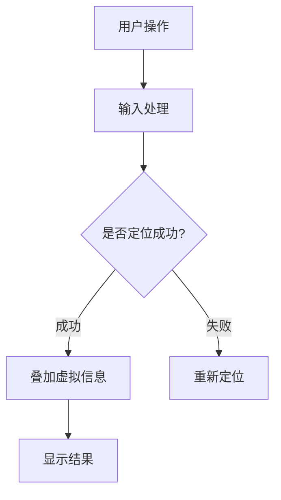

**增强现实技术的基本原理：**

1. **输入处理**：用户通过摄像头、触摸屏等设备捕捉现实世界的图像和动作。
2. **图像处理**：计算机对捕捉到的图像进行预处理，包括去噪、增强、边缘检测等，以便更好地识别目标。
3. **目标识别**：计算机通过算法对预处理后的图像进行分析，识别出目标物体或场景特征。
4. **位置跟踪**：计算机根据识别出的目标物体或场景特征，计算出其在现实环境中的位置和姿态。
5. **虚拟信息叠加**：计算机生成虚拟信息，并将其叠加到真实环境中。这个过程通常涉及图像合成、渲染等技术。
6. **显示结果**：用户通过摄像头或屏幕看到叠加了虚拟信息的真实环境。

**Mermaid 流程图：**

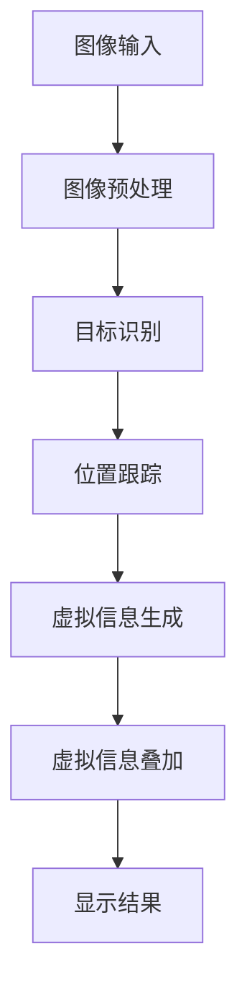

**增强现实技术的应用领域：**

- **消费娱乐**：如AR游戏、AR滤镜、AR广告等。
- **工业制造**：如维修指导、装配指导、质量控制等。
- **医疗健康**：如手术指导、康复训练、医学影像等。
- **教育领域**：如虚拟实验室、互动教学、学习辅助等。
- **交通导航**：如AR导航、车辆监控、飞行模拟等。

#### 1.2 增强现实技术的发展历程

增强现实技术的发展历程可以分为以下几个阶段：

1. **1980s**：虚拟现实建模语言（VRML）的诞生，这是最早的AR技术之一。
2. **1990s**：Magic Lens 和 VR HEADSET 的商业化，这些设备为AR技术的普及奠定了基础。
3. **2000s**：随着移动设备与智能手机的普及，AR应用开始出现，如谷歌眼镜、AR游戏等。
4. **2010s**：AR技术在多个领域得到广泛应用，如医疗、教育、军事等。
5. **2020s**：AR技术逐渐融入各个行业，如消费娱乐、工业制造、医疗健康等，成为一项重要的技术趋势。

#### 1.3 增强现实技术的应用领域

增强现实技术具有广泛的应用领域，以下列举几个主要的领域：

1. **消费娱乐**：AR游戏、AR滤镜、AR广告等，为消费者提供全新的娱乐体验。
2. **工业制造**：如维修指导、装配指导、质量控制等，提高生产效率和质量。
3. **医疗健康**：如手术指导、康复训练、医学影像等，为医疗工作者提供更准确的诊断和治疗手段。
4. **教育领域**：如虚拟实验室、互动教学、学习辅助等，为学生提供更加生动、直观的学习体验。
5. **交通导航**：如AR导航、车辆监控、飞行模拟等，提高交通安全和效率。

---

### 第2章：AR导航系统的核心概念

#### 2.1 AR导航系统的定义

AR导航系统是一种结合了增强现实（AR）技术和导航技术的系统，它通过计算机视觉、GPS定位等技术，将虚拟导航信息叠加到用户的真实视野中，提供一种直观、便捷的导航服务。与传统的导航系统相比，AR导航系统具有更好的用户体验和更高的准确性。

**核心概念与联系：**

- **增强现实（AR）**：将虚拟信息叠加到真实环境中。
- **导航技术**：提供地理位置信息和路径规划。
- **计算机视觉**：用于识别和跟踪用户所在环境。
- **GPS定位**：用于确定用户的位置。

**Mermaid 流程图：**

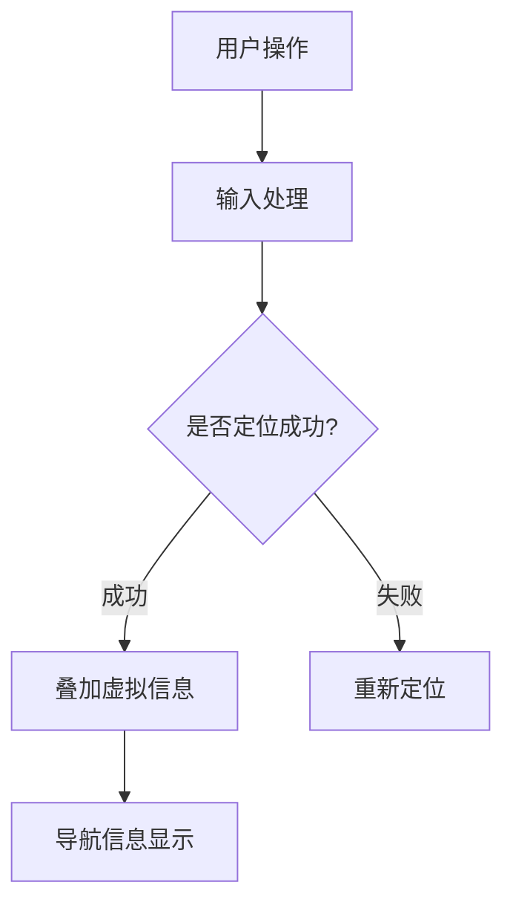

**AR导航系统的定义：**

AR导航系统是一种基于增强现实技术的导航系统，它通过摄像头和GPS等传感器获取用户的当前位置，并将导航信息以虚拟图像的形式叠加到用户的视野中。这种导航方式不仅提供了实时、准确的导航信息，还通过增强现实技术提供了更加生动、直观的导航体验。

#### 2.2 AR导航系统的特点

AR导航系统具有以下几个显著特点：

1. **直观性**：虚拟导航信息直接叠加在用户的视野中，使得导航信息更加直观、易于理解。
2. **准确性**：通过GPS和计算机视觉技术，AR导航系统能够提供实时、准确的导航信息。
3. **便携性**：AR导航系统通常通过智能手机或平板电脑实现，设备便携，易于携带和使用。
4. **交互性**：用户可以通过触摸屏、手势等方式与导航信息进行交互，实现自定义导航路线、添加标记等功能。
5. **实时性**：AR导航系统可以实时更新导航信息，包括路况信息、天气预报等，提供更加实时、全面的导航服务。

#### 2.3 AR导航系统的基本架构

AR导航系统的基本架构可以分为以下几个部分：

1. **硬件部分**：主要包括智能手机、平板电脑、摄像头、GPS模块等设备，用于获取用户的当前位置和周围环境信息。
2. **软件部分**：主要包括AR引擎、导航引擎、地图数据等，用于处理用户输入、计算导航路线、生成虚拟导航信息等。
3. **数据部分**：主要包括地图数据、天气数据、路况数据等，用于提供导航信息和辅助决策。
4. **用户界面**：主要包括用户交互界面，用于显示导航信息、接收用户指令等。

**Mermaid 流程图：**

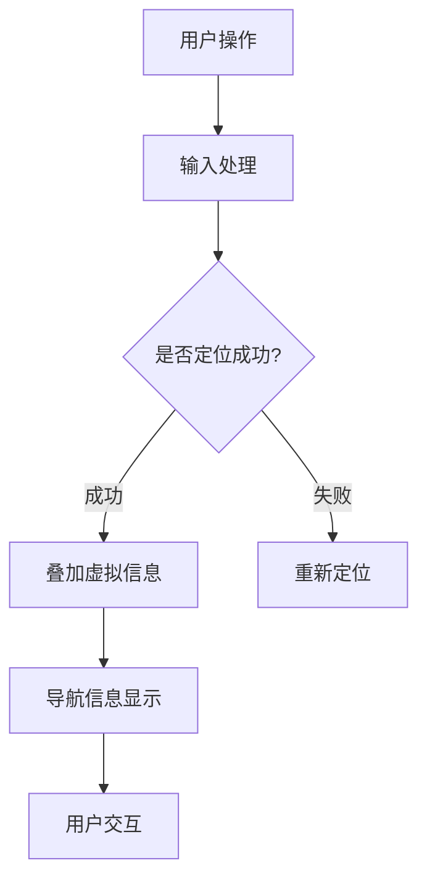

**AR导航系统的基本架构：**

1. **输入处理**：用户通过摄像头和GPS模块获取当前位置和周围环境信息。
2. **定位与跟踪**：计算机视觉算法对摄像头捕获的图像进行处理，识别并跟踪用户的位置和周围环境。
3. **地图数据获取**：从地图数据源获取用户当前位置的地图信息，包括道路、地标等。
4. **路径规划**：导航引擎根据用户目的地和当前地图信息，计算最优路径。
5. **虚拟信息生成**：AR引擎将导航信息以虚拟图像的形式叠加到用户视野中。
6. **导航信息显示**：用户界面显示导航信息，包括路线、距离、时间等。
7. **用户交互**：用户可以通过触摸屏、手势等方式与导航信息进行交互，如调整目的地、设置导航偏好等。

---

通过以上对增强现实技术概述和AR导航系统核心概念的分析，我们可以看到AR导航系统作为一种新兴的技术，具有广阔的应用前景和巨大的市场潜力。在接下来的章节中，我们将进一步探讨AR导航系统的关键技术、开发实战和创业实践，以期为读者提供更为全面和深入的了解。|endoftext|>

### 第一部分：AR导航系统概述与基础

#### 第1章：增强现实技术概述

#### 1.1 增强现实技术的基本原理

增强现实（AR）技术是一种将虚拟信息与现实环境融合的技术。它通过计算机视觉和图像处理等技术，将虚拟信息叠加到用户的真实视野中，使用户能够实时地感知和交互虚拟信息。这种技术的基本原理可以分为以下几个步骤：

**核心概念与联系：**

1. **摄像头采集**：摄像头用于捕捉用户所在的真实环境。
2. **图像处理**：对捕捉到的图像进行处理，包括去噪、增强、边缘检测等。
3. **目标识别**：通过算法对图像进行分析，识别出目标物体或场景特征。
4. **位置跟踪**：根据识别出的特征，计算出目标物体或用户在现实环境中的位置和姿态。
5. **虚拟信息叠加**：生成虚拟信息，并将其叠加到真实环境中。
6. **显示结果**：用户通过摄像头或屏幕看到叠加了虚拟信息的真实环境。

**Mermaid 流程图：**

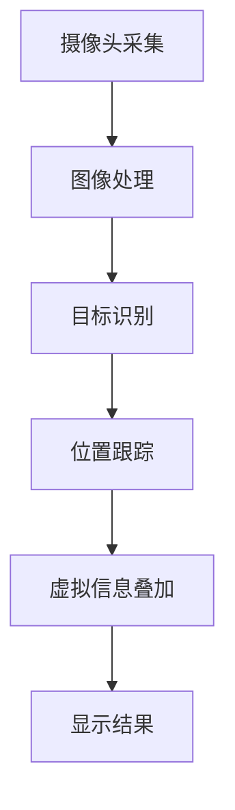

**增强现实技术的基本原理：**

1. **摄像头采集**：用户通过摄像头捕捉真实环境的图像。
2. **图像处理**：计算机对图像进行预处理，包括去噪、增强、边缘检测等，以提高图像质量。
3. **目标识别**：通过算法对预处理后的图像进行分析，识别出目标物体或场景特征。常用的算法包括深度学习、图像识别等。
4. **位置跟踪**：根据识别出的特征，计算出目标物体或用户在现实环境中的位置和姿态。位置跟踪算法包括光流法、视觉里程计等。
5. **虚拟信息叠加**：计算机生成虚拟信息，并将其叠加到真实环境中。这个过程通常涉及图像合成、渲染等技术。
6. **显示结果**：用户通过摄像头或屏幕看到叠加了虚拟信息的真实环境。

**Mermaid 流程图：**


**增强现实技术的应用领域：**

1. **消费娱乐**：如AR游戏、AR滤镜、AR广告等。
2. **工业制造**：如维修指导、装配指导、质量控制等。
3. **医疗健康**：如手术指导、康复训练、医学影像等。
4. **教育领域**：如虚拟实验室、互动教学、学习辅助等。
5. **交通导航**：如AR导航、车辆监控、飞行模拟等。

#### 1.2 增强现实技术的发展历程

增强现实技术的发展历程可以分为以下几个阶段：

1. **1980s**：虚拟现实建模语言（VRML）的诞生，这是最早的AR技术之一。
2. **1990s**：Magic Lens 和 VR HEADSET 的商业化，这些设备为AR技术的普及奠定了基础。
3. **2000s**：随着移动设备与智能手机的普及，AR应用开始出现，如谷歌眼镜、AR游戏等。
4. **2010s**：AR技术在多个领域得到广泛应用，如医疗、教育、军事等。
5. **2020s**：AR技术逐渐融入各个行业，如消费娱乐、工业制造、医疗健康等，成为一项重要的技术趋势。

#### 1.3 增强现实技术的应用领域

增强现实技术具有广泛的应用领域，以下列举几个主要的领域：

1. **消费娱乐**：AR游戏、AR滤镜、AR广告等，为消费者提供全新的娱乐体验。
2. **工业制造**：如维修指导、装配指导、质量控制等，提高生产效率和质量。
3. **医疗健康**：如手术指导、康复训练、医学影像等，为医疗工作者提供更准确的诊断和治疗手段。
4. **教育领域**：如虚拟实验室、互动教学、学习辅助等，为学生提供更加生动、直观的学习体验。
5. **交通导航**：如AR导航、车辆监控、飞行模拟等，提高交通安全和效率。

---

### 第2章：AR导航系统的核心概念

#### 2.1 AR导航系统的定义

AR导航系统是一种基于增强现实（AR）技术的导航系统。它通过摄像头和GPS等传感器获取用户的当前位置，并将导航信息以虚拟图像的形式叠加到用户的视野中，提供直观、准确的导航服务。AR导航系统结合了AR技术和导航技术的优势，使用户能够实时地感知和交互导航信息。

**核心概念与联系：**

1. **增强现实（AR）**：将虚拟信息叠加到真实环境中。
2. **导航技术**：提供地理位置信息和路径规划。
3. **计算机视觉**：用于识别和跟踪用户所在环境。
4. **GPS定位**：用于确定用户的位置。

**Mermaid 流程图：**

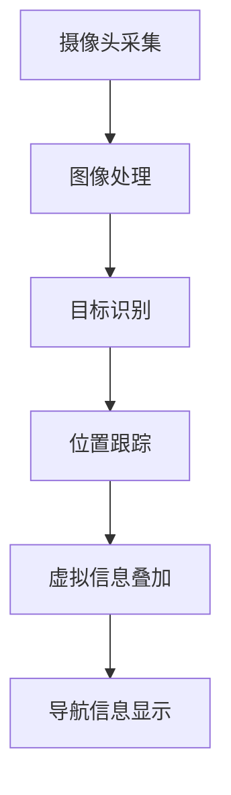

**AR导航系统的定义：**

AR导航系统是一种结合增强现实（AR）技术和导航技术的系统，通过摄像头和GPS等传感器获取用户的当前位置，并将导航信息以虚拟图像的形式叠加到用户的视野中，提供实时、准确的导航服务。这种导航方式不仅提供了直观、易懂的导航信息，还通过增强现实技术提供了更加生动、直观的导航体验。

#### 2.2 AR导航系统的特点

AR导航系统具有以下几个显著特点：

1. **直观性**：虚拟导航信息直接叠加在用户的视野中，使得导航信息更加直观、易于理解。
2. **准确性**：通过GPS和计算机视觉技术，AR导航系统能够提供实时、准确的导航信息。
3. **便携性**：AR导航系统通常通过智能手机或平板电脑实现，设备便携，易于携带和使用。
4. **交互性**：用户可以通过触摸屏、手势等方式与导航信息进行交互，实现自定义导航路线、添加标记等功能。
5. **实时性**：AR导航系统可以实时更新导航信息，包括路况信息、天气预报等，提供更加实时、全面的导航服务。

#### 2.3 AR导航系统的基本架构

AR导航系统的基本架构可以分为以下几个部分：

1. **硬件部分**：主要包括智能手机、平板电脑、摄像头、GPS模块等设备，用于获取用户的当前位置和周围环境信息。
2. **软件部分**：主要包括AR引擎、导航引擎、地图数据等，用于处理用户输入、计算导航路线、生成虚拟导航信息等。
3. **数据部分**：主要包括地图数据、天气数据、路况数据等，用于提供导航信息和辅助决策。
4. **用户界面**：主要包括用户交互界面，用于显示导航信息、接收用户指令等。

**Mermaid 流程图：**


**AR导航系统的基本架构：**

1. **输入处理**：用户通过摄像头和GPS模块获取当前位置和周围环境信息。
2. **定位与跟踪**：计算机视觉算法对摄像头捕获的图像进行处理，识别并跟踪用户的位置和周围环境。
3. **地图数据获取**：从地图数据源获取用户当前位置的地图信息，包括道路、地标等。
4. **路径规划**：导航引擎根据用户目的地和当前地图信息，计算最优路径。
5. **虚拟信息生成**：AR引擎将导航信息以虚拟图像的形式叠加到用户视野中。
6. **导航信息显示**：用户界面显示导航信息，包括路线、距离、时间等。
7. **用户交互**：用户可以通过触摸屏、手势等方式与导航信息进行交互，如调整目的地、设置导航偏好等。

---

通过以上对增强现实技术概述和AR导航系统核心概念的分析，我们可以看到AR导航系统作为一种新兴的技术，具有广阔的应用前景和巨大的市场潜力。在接下来的章节中，我们将进一步探讨AR导航系统的关键技术、开发实战和创业实践，以期为读者提供更为全面和深入的了解。|endoftext|>

### 第二部分：AR导航系统关键技术

#### 第3章：视觉定位与跟踪技术

视觉定位与跟踪技术是AR导航系统的核心，它负责将虚拟信息准确叠加到用户的真实视野中。本章将详细探讨视觉定位与跟踪技术的原理、算法和应用。

#### 3.1 视觉定位技术原理

视觉定位技术利用摄像头捕捉的图像，通过计算机视觉算法来确定相机在三维空间中的位置和姿态。视觉定位主要包括以下几个步骤：

1. **特征检测**：在摄像头捕获的图像中检测出具有独特特征的点或区域，如角点、边缘、纹理等。
2. **特征匹配**：将当前帧中的特征与预先存储的特征进行匹配，以确定相机在空间中的位置。
3. **三维重建**：根据匹配结果和已知的相机参数，计算相机在不同时间点的位置和姿态。
4. **姿态估计**：使用滤波算法（如卡尔曼滤波、粒子滤波等）对相机姿态进行估计，以减少噪声和误差。

**核心算法原理讲解（伪代码）：**

```python
# 特征检测
features = detect_features(image)

# 特征匹配
matched_features = match_features(current_frame, reference_frame)

# 三维重建
camera_pose = reconstruct_pose(matched_features, camera_params)

# 姿态估计
estimated_pose = estimate_pose(camera_pose, filter_algorithm)
```

#### 3.2 视觉跟踪技术原理

视觉跟踪技术是在连续帧之间保持相机位置和姿态不变的技术。它通过以下步骤实现：

1. **特征检测**：在当前帧中检测出特征点。
2. **特征匹配**：将当前帧中的特征点与前一帧中的特征点进行匹配。
3. **轨迹估计**：根据匹配结果估计相机在不同帧之间的位置和姿态变化。
4. **轨迹优化**：使用优化算法（如梯度下降、粒子群优化等）对轨迹进行优化，以减少误差。

**核心算法原理讲解（伪代码）：**

```python
# 特征检测
current_features = detect_features(current_frame)

# 特征匹配
matched_pairs = match_features(current_frame, previous_frame)

# 轨迹估计
trajectory = estimate_trajectory(matched_pairs)

# 轨迹优化
optimized_trajectory = optimize_trajectory(trajectory, optimization_algorithm)
```

#### 3.3 视觉定位与跟踪算法比较

视觉定位与跟踪算法各有优缺点，以下是比较常见的几种算法：

1. **光流法**：通过分析连续帧之间的像素运动来估计相机位置和姿态。优点是计算简单，适用于实时应用；缺点是易受噪声干扰，准确度较低。
2. **特征匹配法**：通过匹配特征点来估计相机位置和姿态。优点是准确度高，适用于静态场景；缺点是计算复杂度较高，实时性较差。
3. **视觉里程计**：结合深度信息和图像特征，通过深度学习算法估计相机位置和姿态。优点是准确度高，适用于动态场景；缺点是计算复杂度较高，对硬件要求较高。

**Mermaid 流程图：**

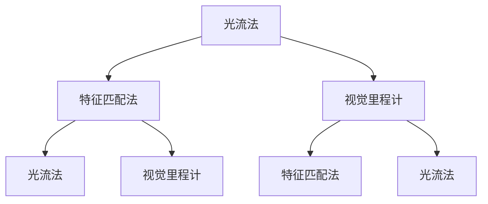

#### 3.4 视觉定位与跟踪技术在AR导航系统中的应用

视觉定位与跟踪技术在AR导航系统中发挥着至关重要的作用，以下是其应用示例：

1. **导航路径显示**：通过视觉定位技术，将导航路径以虚拟图像的形式叠加到用户视野中，提供直观的导航信息。
2. **实时路况信息**：通过视觉跟踪技术，实时更新用户视野中的路况信息，如交通拥堵、施工路段等，帮助用户做出更明智的决策。
3. **交互式信息展示**：通过视觉定位与跟踪技术，将互动信息（如路线提示、天气预报等）叠加到用户视野中，提供更加丰富、有趣的导航体验。

**Mermaid 流程图：**

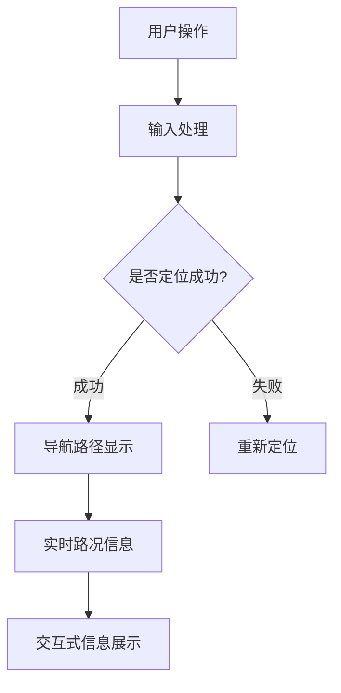

通过以上对视觉定位与跟踪技术的详细讲解，我们可以看到这些技术在AR导航系统中的重要性。在接下来的章节中，我们将继续探讨地图数据与数据融合、增强现实内容制作与显示等关键技术，以进一步了解AR导航系统的构建与实践。|endoftext|>

### 第4章：地图数据与数据融合

地图数据是AR导航系统的基础，它提供了用户所在环境的空间信息，使得AR导航系统能够准确地定位和导航。本章将详细介绍地图数据类型、获取方法、预处理技术以及数据融合算法。

#### 4.1 地图数据类型及获取

地图数据可以分为以下几种类型：

1. **栅格地图**：以像素为单位，每个像素包含有关地形、道路、建筑物等信息的地图。常见的栅格地图格式有PNG、JPEG等。
2. **矢量地图**：以几何图形（如点、线、面）表示地图信息的地图。矢量地图的格式包括Shapefile、GeoJSON等。
3. **三维地图**：包含地形、建筑物、道路等三维信息的地图。三维地图通常以三维模型（如3DS、OBJ等）或三维GIS格式（如CityGML、PCL等）存储。

地图数据的获取途径主要有以下几种：

1. **开源地图数据**：如OpenStreetMap、Mapbox等，这些地图数据可以通过API免费获取。
2. **商业地图数据**：如Google Maps、百度地图等，这些地图数据需要付费获取。
3. **实地采集**：通过无人机、车载设备等采集地图数据，适用于特定区域或高精度需求。

#### 4.2 地图数据预处理

地图数据预处理是确保地图数据适用于AR导航系统的关键步骤。预处理主要包括以下任务：

1. **数据清洗**：去除地图数据中的噪声、冗余信息和错误。
2. **数据转换**：将不同格式的地图数据转换为统一的格式，如将Shapefile转换为GeoJSON。
3. **数据校正**：对地图数据进行几何校正和投影变换，使其符合AR导航系统的需求。
4. **数据裁剪**：根据用户所在位置，裁剪出所需的地图数据区域。

**核心算法原理讲解（伪代码）：**

```python
# 数据清洗
cleaned_data = clean_data(raw_data)

# 数据转换
converted_data = convert_format(cleaned_data, target_format)

# 数据校正
corrected_data = correct_data(converted_data, projection)

# 数据裁剪
clipped_data = clip_data(corrected_data, user_location)
```

#### 4.3 数据融合算法与应用

数据融合是将来自不同源的数据进行整合，以提供更准确、更全面的信息。在AR导航系统中，数据融合主要用于整合不同类型的地图数据，以提高导航精度和用户体验。

1. **特征级融合**：将不同类型的地图数据（如栅格地图、矢量地图）的特征进行整合，形成统一的特征表示。常用的算法包括平均法、最大最小法等。
2. **语义级融合**：将不同类型的地图数据（如交通信息、天气信息）进行整合，形成语义上的一致性。常用的算法包括逻辑推理、知识图谱等。
3. **层次级融合**：将不同层次的地图数据（如道路信息、建筑物信息）进行整合，形成完整的地图信息。常用的算法包括层次分析法、贝叶斯网络等。

**核心算法原理讲解（伪代码）：**

```python
# 特征级融合
fused_features = fuse_features(raster_features, vector_features)

# 语义级融合
fused_data = fuse_data(fused_features, semantic_data)

# 层次级融合
hierarchical_data = fuse_hierarchical_data(fused_data, building_data)
```

#### 4.4 数据融合在AR导航系统中的应用

数据融合在AR导航系统中有着广泛的应用，以下是一些示例：

1. **实时路况信息**：通过融合交通流量数据、历史交通数据等信息，实时更新用户的导航路径，提高导航精度。
2. **三维地图生成**：通过融合三维建筑物数据、地形数据等信息，生成三维地图，提供更加真实的导航体验。
3. **导航策略优化**：通过融合用户历史行为数据、环境信息等，优化导航策略，提高导航效率。

**Mermaid 流程图：**

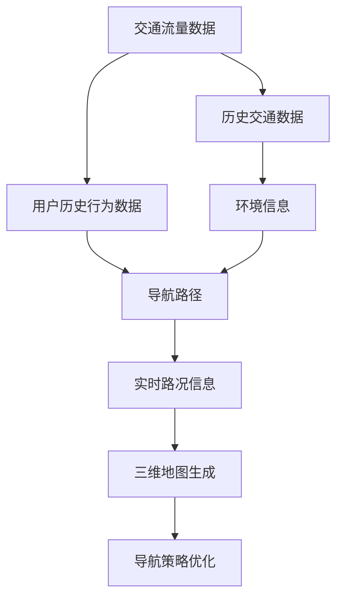

通过以上对地图数据与数据融合的详细讲解，我们可以看到这些技术在AR导航系统中的重要性。在接下来的章节中，我们将继续探讨增强现实内容制作与显示等关键技术，以进一步了解AR导航系统的构建与实践。|endoftext|>

### 第5章：增强现实内容制作与显示

#### 5.1 增强现实内容制作技术

增强现实（AR）内容制作是AR导航系统开发的关键环节，它决定了导航信息的视觉效果和用户体验。本章将介绍增强现实内容制作的技术、工具和方法。

**AR内容制作步骤：**

1. **需求分析**：明确AR导航系统的功能需求、用户需求和设计目标。
2. **设计建模**：根据需求分析，设计AR导航系统的界面布局、图标、标注等元素。
3. **三维建模**：使用三维建模软件（如Blender、Maya）创建三维模型，包括导航箭头、地标、路况指示等。
4. **纹理贴图**：为三维模型添加纹理贴图，以增加视觉效果和真实感。
5. **内容集成**：将三维模型和纹理贴图集成到AR引擎中，实现实时渲染。
6. **调试优化**：对AR内容进行调试和优化，确保其在不同设备上的稳定性和性能。

**AR内容制作工具：**

- **三维建模软件**：如Blender、Maya、3ds Max等。
- **图像处理软件**：如Adobe Photoshop、GIMP等。
- **AR开发平台**：如ARKit（iOS）、ARCore（Android）、Unity AR Foundation等。

**伪代码示例：**

```python
# 需求分析
analyze_requirements()

# 设计建模
design_model()

# 三维建模
create_3d_model()

# 纹理贴图
apply_texture()

# 内容集成
integrate_content()

# 调试优化
optimize_content()
```

#### 5.2 增强现实内容显示技术

增强现实内容显示技术是将AR内容实时叠加到用户视野中的关键。本章将介绍增强现实内容显示的基本原理、技术实现和性能优化。

**AR内容显示原理：**

1. **图像捕捉**：使用摄像头捕捉用户当前视野的图像。
2. **图像处理**：对捕获的图像进行预处理，包括去噪、增强、边缘检测等。
3. **特征检测**：检测图像中的关键特征，如角点、边缘、纹理等。
4. **虚拟信息叠加**：根据特征检测结果，将AR内容（如导航箭头、地标）叠加到用户视野中。
5. **渲染输出**：将叠加后的图像渲染到屏幕上，呈现给用户。

**AR内容显示技术实现：**

1. **图像捕捉**：使用摄像头模块获取用户视野的实时图像。
2. **图像处理**：使用图像处理库（如OpenCV）进行图像预处理。
3. **特征检测**：使用特征检测算法（如SIFT、SURF）检测图像中的关键特征。
4. **虚拟信息叠加**：根据特征匹配结果，使用OpenGL、Vulkan等图形渲染库实现AR内容的叠加。
5. **渲染输出**：将渲染后的图像输出到屏幕上，呈现给用户。

**伪代码示例：**

```python
# 图像捕捉
image = capture_image()

# 图像处理
processed_image = preprocess_image(image)

# 特征检测
features = detect_features(processed_image)

# 虚拟信息叠加
merged_image = overlay_content(features)

# 渲染输出
display_image(merged_image)
```

#### 5.3 增强现实内容制作工具

增强现实内容制作工具帮助开发者更高效地创建、编辑和优化AR内容。以下是一些常用的AR内容制作工具：

1. **ARKit（iOS）**：苹果公司开发的AR开发平台，提供丰富的AR内容制作工具和API。
2. **ARCore（Android）**：谷歌公司开发的AR开发平台，支持多种设备和场景。
3. **Unity AR Foundation**：Unity引擎中的AR开发框架，提供强大的AR内容制作和渲染功能。
4. **Blender**：开源的三维建模和渲染软件，适用于AR内容的创建。
5. **Adobe Aero**：Adobe公司开发的AR内容创作工具，支持直观的交互设计和视觉效果。

通过以上对增强现实内容制作与显示的详细讲解，我们可以看到这些技术在AR导航系统开发中的重要性。在接下来的章节中，我们将进一步探讨AR导航系统的开发实战和创业实践，以期为读者提供更全面的AR导航系统构建方法。|endoftext|>

### 第三部分：AR导航系统开发实战

#### 第6章：AR导航系统开发环境搭建

在开发AR导航系统之前，搭建一个合适的环境至关重要。本章将详细介绍开发环境的选择、配置和优化，以便为后续的项目开发奠定基础。

#### 6.1 开发工具与软件

**开发工具的选择：**

- **操作系统**：根据目标平台，选择适合的开发操作系统。对于iOS设备，选择macOS；对于Android设备，选择Windows或macOS。
- **编程语言**：选择适合AR导航系统开发的编程语言，如Swift（iOS）、Kotlin/Java（Android）。
- **AR开发平台**：选择一个合适的AR开发平台，如ARKit（iOS）、ARCore（Android）。

**常用软件工具：**

- **集成开发环境（IDE）**：如Xcode（iOS）、Android Studio（Android）。
- **版本控制系统**：如Git，用于代码管理和协作开发。
- **数据库软件**：如MySQL、PostgreSQL，用于存储地图数据、用户数据等。

#### 6.2 开发环境配置

**环境配置步骤：**

1. **安装操作系统**：根据硬件要求和操作系统文档，安装合适的操作系统。
2. **安装IDE**：下载并安装所选的集成开发环境。
3. **安装开发平台**：根据开发平台的要求，安装AR开发平台，如ARKit或ARCore。
4. **安装依赖库**：安装必要的依赖库和框架，如OpenGL、OpenCV等。
5. **配置版本控制系统**：安装并配置Git，设置远程仓库和分支。

**伪代码示例：**

```python
# 安装操作系统
install_os()

# 安装IDE
install_ide()

# 安装开发平台
install_ar_platform()

# 安装依赖库
install_dependencies()

# 配置版本控制系统
configure_git()
```

#### 6.3 开发环境调试与优化

开发环境搭建完成后，需要对环境进行调试和优化，以确保系统的稳定性和性能。以下是一些调试与优化方法：

1. **环境调试**：检查开发环境是否正常运行，包括IDE、开发平台、依赖库等。
2. **性能测试**：进行性能测试，包括图像渲染、地图数据加载、定位速度等。
3. **优化代码**：根据性能测试结果，优化代码，提高系统的响应速度和稳定性。
4. **调试工具**：使用调试工具（如Xcode、Android Studio）进行代码调试，解决潜在问题。

**伪代码示例：**

```python
# 环境调试
check_environment()

# 性能测试
run_performance_tests()

# 优化代码
optimize_code()

# 调试工具
use_debugging_tools()
```

通过以上对开发环境搭建的详细讲解，我们可以为后续的AR导航系统开发提供一个稳定、高效的工作环境。在接下来的章节中，我们将深入探讨AR导航系统的项目实战和创业实践，以期为读者提供更实用的开发经验和商业策略。|endoftext|>

### 第7章：AR导航系统项目实战

#### 7.1 项目需求分析

在开始开发AR导航系统之前，明确项目需求是至关重要的。需求分析阶段的主要目标是了解用户需求、系统功能、性能指标和业务目标。以下是对AR导航系统项目需求分析的详细步骤：

**1. 用户需求分析：**

- **目标用户**：确定AR导航系统的目标用户群体，如普通消费者、专业司机、户外探险者等。
- **用户场景**：分析用户在不同场景下对AR导航系统的需求，如城市道路导航、户外探险、停车场导航等。
- **用户痛点**：识别用户在使用现有导航系统时的痛点和不满之处，如导航信息不直观、实时性差、交互体验不佳等。

**2. 系统功能需求：**

- **基本导航功能**：提供实时、准确的导航信息，包括路线规划、路况信息、实时交通状况等。
- **增强现实导航**：通过AR技术，将导航信息以虚拟图像的形式叠加到用户视野中，提供直观、易懂的导航体验。
- **位置跟踪与更新**：使用GPS、Wi-Fi等定位技术，实时跟踪用户的位置，并根据用户位置更新导航信息。
- **地图数据更新**：定期更新地图数据，确保导航信息的准确性和实时性。
- **个性化服务**：根据用户历史行为和偏好，提供个性化的导航服务，如最佳路线推荐、热门景点推荐等。

**3. 性能指标需求：**

- **响应时间**：系统应能够在1秒内响应用户请求，提供准确的导航信息。
- **定位精度**：系统应能够提供厘米级的定位精度，确保导航信息的准确性。
- **稳定性**：系统应在各种网络环境和硬件配置下稳定运行，保证用户体验的一致性。
- **兼容性**：系统应兼容多种操作系统、设备和屏幕分辨率，提供统一的用户体验。

**4. 业务目标：**

- **市场份额**：在竞争激烈的市场中占据一定份额，成为用户首选的AR导航系统。
- **用户满意度**：通过提供优质的导航服务，提高用户满意度，增加用户粘性。
- **商业盈利**：通过广告收入、付费服务等方式，实现商业盈利，保持系统持续发展。

**伪代码示例：**

```python
# 用户需求分析
analyze_user_requirements()

# 系统功能需求
define_system_functions()

# 性能指标需求
set_performance_metrics()

# 业务目标
set_business_goals()
```

通过以上需求分析，我们可以明确AR导航系统的核心功能和性能要求，为后续的项目设计和开发提供明确的指导。在接下来的章节中，我们将详细探讨AR导航系统的项目设计、开发和实现过程。|endoftext|>

### 7.2 项目设计

项目设计是AR导航系统开发过程中至关重要的一环，它决定了系统的结构、模块划分和功能实现。以下是AR导航系统的项目设计步骤：

#### 1. 需求分析结果确认

在需求分析阶段，我们已经明确了用户需求、系统功能和性能指标。在设计阶段，首先需要再次确认需求分析结果，确保所有需求都已经明确、详尽地被记录和确认。

#### 2. 系统架构设计

系统架构设计是项目设计的关键步骤，它决定了系统的整体结构和模块划分。对于AR导航系统，我们可以将其分为以下几个主要模块：

- **前端模块**：负责用户界面的展示和交互，包括地图渲染、导航信息显示、用户操作响应等。
- **后端模块**：负责处理用户请求、路径规划、地图数据管理、定位服务等。
- **数据模块**：负责存储和管理地图数据、用户数据、历史数据等。
- **服务模块**：提供API接口，供前端模块和后端模块进行数据通信和功能调用。

**系统架构图：**

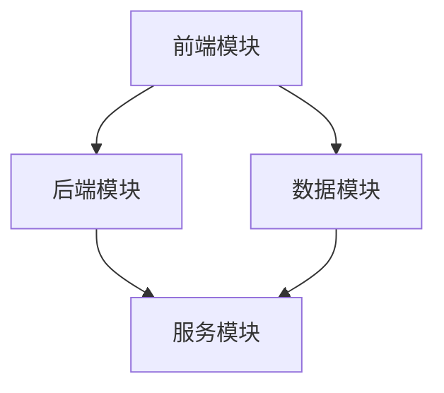

#### 3. 数据流程设计

数据流程设计描述了系统中数据的流动和处理过程。在AR导航系统中，数据的流动包括以下几个环节：

- **用户输入**：用户通过前端模块输入目的地、搜索关键字等。
- **路径规划**：后端模块根据用户输入，进行路径规划和导航信息计算。
- **地图数据加载**：数据模块提供地图数据，后端模块根据导航信息，加载相应的地图数据。
- **导航信息显示**：前端模块根据加载的地图数据和导航信息，将导航信息以AR形式显示给用户。

**数据流程图：**

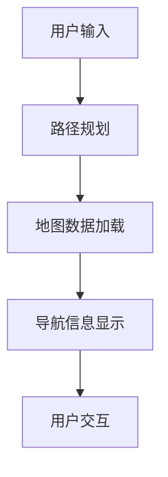

#### 4. 功能模块设计

根据系统架构和数据流程设计，我们可以将AR导航系统划分为以下功能模块：

- **用户界面模块**：负责用户交互和导航信息显示，包括菜单、地图界面、导航箭头、文字提示等。
- **路径规划模块**：负责计算最优路径和导航信息，包括地图数据解析、路径计算、导航信息生成等。
- **地图数据模块**：负责地图数据的存储、加载和更新，包括地图数据管理、数据源接入、地图数据解析等。
- **定位服务模块**：负责定位用户位置和更新导航信息，包括GPS定位、Wi-Fi定位、地图匹配等。
- **服务接口模块**：提供API接口，供前端模块和后端模块进行数据通信和功能调用，包括路径规划API、地图数据API、用户数据API等。

**功能模块设计图：**

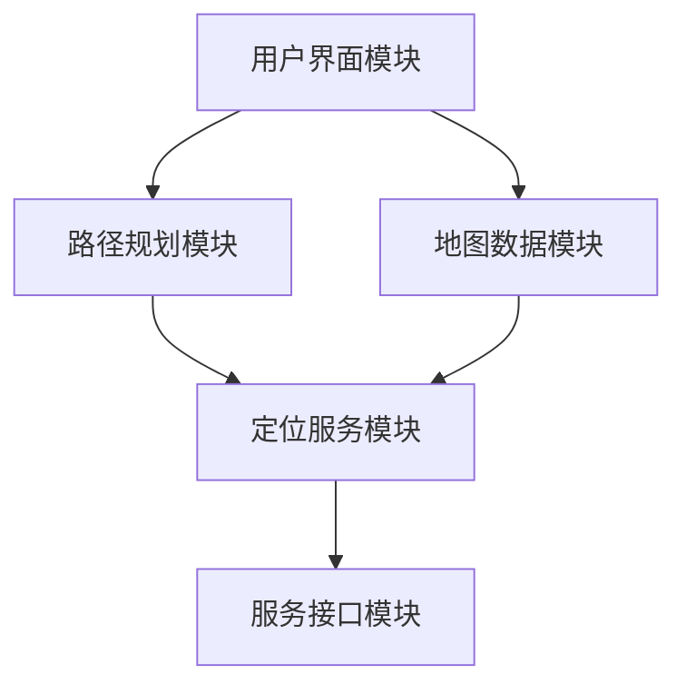

通过以上项目设计步骤，我们为AR导航系统的开发奠定了坚实的基础。在接下来的章节中，我们将详细讨论项目开发与实现、项目测试与优化等实战内容，确保系统能够满足需求、具备良好的性能和用户体验。|endoftext|>

### 7.3 项目开发与实现

在项目设计完成后，接下来是项目的开发与实现阶段。这一阶段的目标是将设计转化为可运行的代码，确保系统能够按照预期工作。以下是AR导航系统项目开发与实现的详细步骤：

#### 1. 前端开发

前端开发主要负责用户界面的设计和实现，为用户提供直观、友好的交互体验。以下是一些关键步骤：

- **界面设计**：根据设计文档，使用设计工具（如Sketch、Figma）完成界面设计，包括布局、颜色、字体等。
- **页面构建**：使用前端框架（如React、Vue.js）构建页面，将设计转化为可交互的网页。
- **地图渲染**：集成地图API（如Google Maps、高德地图），实现地图的渲染和交互。
- **增强现实渲染**：使用AR开发平台（如ARKit、ARCore）实现AR导航信息的渲染和叠加。

**伪代码示例：**

```javascript
// 界面设计
design_interface()

// 页面构建
build_pages()

// 地图渲染
render_map()

// 增强现实渲染
render_ar_content()
```

#### 2. 后端开发

后端开发主要负责处理用户请求、路径规划、地图数据管理、定位服务等，以下是关键步骤：

- **服务器搭建**：搭建服务器环境，安装并配置服务器软件（如Node.js、Django）。
- **API开发**：开发API接口，实现前后端的数据通信，包括路径规划API、地图数据API、用户数据API等。
- **路径规划**：实现路径规划算法，计算最优路径，提供路径规划服务。
- **地图数据管理**：管理地图数据，包括地图数据的存储、加载和更新。
- **定位服务**：集成定位服务，实现GPS、Wi-Fi等定位技术。

**伪代码示例：**

```python
# 服务器搭建
setup_server()

# API开发
create_api()

# 路径规划
plan_path()

# 地图数据管理
manage_map_data()

# 定位服务
provide_location_service()
```

#### 3. 数据库设计

数据库设计是确保系统能够高效、可靠地存储和管理数据的关键。以下是关键步骤：

- **数据库选择**：根据项目需求，选择合适的数据库（如MySQL、MongoDB）。
- **表设计**：设计数据库表结构，包括用户表、路径表、地图数据表等。
- **索引设计**：为常用查询字段创建索引，提高查询效率。

**伪代码示例：**

```sql
-- 数据库选择
SELECT * FROM databases WHERE type='MySQL';

-- 表设计
CREATE TABLE users (
    id INT PRIMARY KEY,
    username VARCHAR(255),
    password VARCHAR(255)
);

-- 索引设计
CREATE INDEX idx_username ON users (username);
```

#### 4. 测试与调试

在开发过程中，测试与调试是确保系统质量的重要环节。以下是一些关键步骤：

- **单元测试**：编写单元测试用例，测试单个模块的功能和性能。
- **集成测试**：将各个模块集成在一起，测试系统的整体功能。
- **性能测试**：进行性能测试，检查系统的响应速度、并发处理能力等。
- **调试**：使用调试工具（如Xcode、Android Studio）定位和修复代码中的错误。

**伪代码示例：**

```python
# 单元测试
test_module()

# 集成测试
integrate_modules()

# 性能测试
run_performance_tests()

# 调试
debug_code()
```

通过以上开发与实现步骤，我们可以构建出一个完整的AR导航系统。在接下来的章节中，我们将详细讨论项目测试与优化，以确保系统能够满足性能和用户体验的要求。|endoftext|>

### 7.4 项目测试与优化

项目测试与优化是确保AR导航系统质量、性能和用户体验的关键环节。以下是对AR导航系统进行测试与优化的详细步骤：

#### 1. 单元测试

单元测试是测试系统最小功能单元的正确性的过程。对于AR导航系统，单元测试主要针对以下模块：

- **用户界面模块**：测试导航信息显示、地图交互、用户输入处理等。
- **路径规划模块**：测试路径计算、最优路径生成、实时路径更新等。
- **地图数据模块**：测试地图数据加载、地图数据更新、地图数据解析等。
- **定位服务模块**：测试GPS定位、Wi-Fi定位、位置跟踪等。

**单元测试伪代码示例：**

```python
# 用户界面模块测试
test_user_interface()

# 路径规划模块测试
test_path_planning()

# 地图数据模块测试
test_map_data()

# 定位服务模块测试
test_location_service()
```

#### 2. 集成测试

集成测试是将各个模块集成在一起进行测试，以确保系统整体功能的正确性。对于AR导航系统，集成测试主要关注以下方面：

- **模块间通信**：测试前后端模块、服务模块之间的数据通信和功能调用。
- **性能测试**：测试系统在不同负载下的响应速度、并发处理能力等。
- **错误处理**：测试系统在各种异常情况下的错误处理能力和恢复能力。

**集成测试伪代码示例：**

```python
# 模块间通信测试
test_module_communication()

# 性能测试
test_system_performance()

# 错误处理测试
test_error_handling()
```

#### 3. 性能测试

性能测试是评估系统在特定负载下的响应速度、资源消耗和稳定性。对于AR导航系统，性能测试主要关注以下方面：

- **响应时间**：测试系统处理用户请求的平均响应时间。
- **并发处理能力**：测试系统同时处理多个请求的能力。
- **资源消耗**：测试系统在不同负载下的CPU、内存、网络等资源消耗。

**性能测试伪代码示例：**

```python
# 响应时间测试
test_response_time()

# 并发处理能力测试
test_concurrency()

# 资源消耗测试
test_resource_usage()
```

#### 4. 用户体验测试

用户体验测试是评估系统在用户日常使用中的易用性、直观性和满意度。对于AR导航系统，用户体验测试主要关注以下方面：

- **界面设计**：测试导航信息的显示方式、界面的布局和交互。
- **操作流程**：测试用户从输入目的地到获取导航信息的整个过程。
- **反馈机制**：测试系统的错误提示、帮助文档、用户反馈等。

**用户体验测试伪代码示例：**

```python
# 界面设计测试
test_ui_design()

# 操作流程测试
test_user_flow()

# 反馈机制测试
test_feedback_mechanism()
```

#### 5. 优化策略

在测试过程中，如果发现系统存在性能瓶颈或用户体验问题，需要进行优化。以下是一些常见的优化策略：

- **代码优化**：优化算法、减少冗余代码、提高代码可读性和可维护性。
- **资源管理**：优化内存、CPU和网络资源的使用，提高系统响应速度。
- **缓存策略**：使用缓存技术，减少重复数据的处理和传输。
- **异步处理**：使用异步处理技术，提高系统并发处理能力。

**优化策略伪代码示例：**

```python
# 代码优化
optimize_code()

# 资源管理
manage_resources()

# 缓存策略
implement_caching()

# 异步处理
use_async_processing()
```

通过以上测试与优化步骤，我们可以确保AR导航系统在质量、性能和用户体验方面达到预期目标。在接下来的章节中，我们将讨论AR导航系统的创业实践，探索如何将AR导航系统转化为商业成功。|endoftext|>

### 第8章：AR导航系统创业实践

#### 8.1 创业环境分析

在决定创业之前，对当前市场环境、技术趋势和竞争态势进行分析是至关重要的。以下是对AR导航系统创业环境分析的几个关键方面：

**1. 市场需求分析**

- **用户需求**：分析目标用户对AR导航系统的需求，如城市居民、司机、户外探险者等。了解他们为什么需要AR导航系统，以及他们期望从系统中获得什么。
- **市场规模**：研究相关市场数据，如全球AR导航系统的市场规模、增长率、用户群体等。了解市场的发展潜力和竞争情况。
- **用户痛点**：分析现有导航系统的不足之处，如用户体验不佳、实时性不足、导航信息不准确等。了解AR导航系统可以如何解决这些问题。

**2. 技术趋势分析**

- **AR技术发展**：研究AR技术的最新进展，包括硬件（如AR眼镜、手机AR功能）和软件（如AR引擎、开发平台）的发展。了解这些技术如何为AR导航系统提供更好的支持。
- **导航技术进步**：研究导航技术的最新发展，如高精度定位、实时路况信息、智能路径规划等。了解这些技术如何提升AR导航系统的性能和用户体验。
- **行业动态**：关注相关行业动态，如AR技术在医疗、教育、娱乐等领域的应用。了解这些应用如何为AR导航系统带来新的商业机会。

**3. 竞争态势分析**

- **竞争者分析**：分析现有AR导航系统的竞争者，了解他们的产品特点、市场策略、用户口碑等。了解竞争者的优势和劣势，为自己的产品定位和策略提供参考。
- **市场定位**：根据竞争态势，确定AR导航系统的市场定位，如专注于某一特定用户群体、提供特定功能等。明确自己的差异化竞争优势。
- **竞争策略**：制定有效的竞争策略，如价格策略、营销策略、用户体验优化等。确保在竞争激烈的市场中脱颖而出。

#### 8.2 市场调研

市场调研是了解市场需求、竞争态势和潜在客户的重要手段。以下是对AR导航系统进行市场调研的几个关键步骤：

**1. 定量调研**

- **问卷调查**：设计问卷调查，收集目标用户的意见和建议。通过在线平台、社交媒体等渠道发布问卷，收集大量用户数据。
- **用户访谈**：选择具有代表性的用户进行访谈，深入了解他们的需求、偏好和痛点。通过面对面交流或视频通话进行访谈。
- **数据分析**：对收集到的用户数据进行统计分析，识别用户需求、市场趋势等。

**2. 定性调研**

- **市场分析报告**：研究相关的市场分析报告，了解行业趋势、市场规模、竞争态势等。这些报告可以从行业协会、市场研究机构等获取。
- **行业会议和展览**：参加行业会议和展览，了解最新的技术发展和市场动态。与同行交流，获取宝贵的市场信息和合作机会。
- **竞争对手分析**：研究竞争对手的产品、服务、市场策略等，分析他们的优势和劣势。通过用户评价、社交媒体、新闻报道等渠道获取信息。

#### 8.3 产品定位与商业模式

在市场调研的基础上，需要对AR导航系统进行产品定位和商业模式设计。以下是一些关键步骤：

**1. 产品定位**

- **目标市场**：根据市场调研结果，确定AR导航系统的目标市场。如针对户外探险者、城市居民等特定用户群体。
- **产品特性**：明确AR导航系统的独特卖点和特性，如实时路况信息、高精度定位、互动式导航等。
- **品牌形象**：设计符合产品特性的品牌形象，如品牌名称、LOGO、宣传语等。

**2. 商业模式**

- **收费模式**：确定AR导航系统的收费模式，如免费增值模式（基础功能免费，高级功能收费）、订阅模式（按月或按年收费）等。
- **盈利途径**：分析AR导航系统的盈利途径，如广告收入、用户付费、合作伙伴分成等。
- **市场推广策略**：制定市场推广策略，如线上营销、线下推广、合作伙伴推广等。确保AR导航系统能够快速占领市场。

**3. 营销策略**

- **品牌建设**：通过品牌定位、品牌传播、品牌服务等方面，建立AR导航系统的品牌形象和信誉。
- **用户体验**：优化用户界面、提升用户体验，增加用户粘性和忠诚度。
- **市场推广**：通过线上和线下渠道，开展多样化的市场推广活动，提高品牌知名度和市场占有率。

通过以上创业实践，我们可以为AR导航系统在市场中赢得一席之地。在接下来的章节中，我们将探讨AR导航系统的未来发展趋势，为读者提供行业发展的洞察和前瞻。|endoftext|>

### 8.4 营销策略与推广

在AR导航系统的创业实践中，营销策略与推广是关键环节，它决定了系统能否迅速占领市场并获得用户认可。以下是AR导航系统的营销策略与推广步骤：

#### 1. 品牌定位与形象建设

- **品牌定位**：明确AR导航系统的市场定位，如针对户外探险者、城市居民等特定用户群体，突出产品的独特卖点和特性。
- **品牌形象**：设计符合品牌定位的视觉形象，包括LOGO、色彩搭配、宣传语等，确保品牌形象能够传递产品的核心价值。
- **品牌传播**：通过社交媒体、官网、线下活动等渠道，持续传播品牌形象，提高品牌知名度和用户认知度。

#### 2. 用户体验优化

- **界面设计**：优化用户界面，使其简洁、直观、易于操作，提升用户体验。
- **功能完善**：不断迭代产品功能，确保AR导航系统具有丰富的功能，如实时路况信息、高精度定位、互动式导航等。
- **用户反馈**：建立用户反馈机制，及时收集用户意见和建议，快速响应并优化产品。

#### 3. 线上营销策略

- **搜索引擎优化（SEO）**：优化网站内容和结构，提高在搜索引擎中的排名，吸引潜在用户访问。
- **内容营销**：通过博客、视频、案例分享等形式，提供有价值的内容，吸引并留住用户。
- **社交媒体营销**：利用微博、微信、抖音等社交媒体平台，发布有趣的图文和视频内容，增加用户互动和分享。
- **电子邮件营销**：定期发送新闻简报、促销活动等信息，维护用户关系，提高用户忠诚度。

#### 4. 线下推广活动

- **展会和研讨会**：参加行业展会、研讨会等，展示AR导航系统的优势和特点，吸引潜在客户。
- **线下体验活动**：组织线下体验活动，让用户亲身体验AR导航系统的便捷性和趣味性，提高用户转化率。
- **合作伙伴推广**：与相关行业的企业、机构建立合作关系，共同推广AR导航系统，扩大市场影响力。

#### 5. 付费广告与公关

- **付费广告**：通过百度广告、谷歌广告等付费广告渠道，精准投放广告，提高品牌曝光度和访问量。
- **公关活动**：邀请媒体进行产品评测，发布权威报告，提高AR导航系统的知名度和公信力。
- **赞助活动**：赞助相关行业活动和赛事，提升品牌形象和市场认可度。

#### 6. 用户转化与维护

- **优惠活动**：推出限时优惠、折扣活动，吸引用户尝试和购买。
- **用户社区**：建立用户社区，提供交流平台，增强用户归属感和粘性。
- **售后服务**：提供优质的售后服务，解决用户在使用过程中遇到的问题，提高用户满意度。

通过以上营销策略与推广步骤，AR导航系统可以在市场中迅速崭露头角，获得用户的认可和喜爱。在接下来的章节中，我们将探讨AR导航系统的未来发展趋势，为行业的发展提供前瞻性思考。|endoftext|>

### 第四部分：AR导航系统未来发展趋势

#### 第9章：AR导航系统的发展趋势

随着技术的进步和市场的需求，AR导航系统正朝着更智能、更便捷、更个性化的方向发展。本章将分析AR导航系统的技术发展趋势、应用领域拓展以及行业面临的挑战与机遇。

#### 9.1 技术发展趋势

**1. 硬件性能提升**

随着处理器性能和摄像头分辨率的提升，AR导航系统的硬件性能得到了显著提高。这将有助于实现更加流畅的图像渲染和更精确的定位与跟踪。例如，新一代的AR眼镜将具备更高的分辨率和更低的延迟，为用户提供更加真实的增强现实体验。

**2. 软件算法优化**

随着深度学习和计算机视觉技术的发展，AR导航系统的软件算法也在不断优化。例如，使用深度学习算法可以更准确地识别目标物体和场景特征，提高视觉定位和跟踪的精度。此外，智能路径规划算法和实时路况预测算法的应用，将使导航系统更加智能和高效。

**3. 5G技术的融合**

5G技术的普及将为AR导航系统带来更快的网络速度和更低的延迟。这将有助于实现实时数据传输和远程控制，提高导航系统的响应速度和用户体验。例如，在高速行驶时，AR导航系统可以实时获取路况信息，为用户提供最佳路线推荐。

**4. 虚拟现实（VR）与AR的结合**

VR与AR技术的结合将为导航系统带来全新的体验。通过VR技术，用户可以在虚拟环境中进行导航，实现沉浸式的导航体验。这种结合将有助于提升导航系统的娱乐性和互动性，吸引更多用户。

#### 9.2 应用领域拓展

**1. 智慧城市建设**

随着智慧城市建设的推进，AR导航系统将在智慧城市中发挥重要作用。例如，通过AR导航系统，市民可以实时了解城市的交通状况、公共服务信息等，提高生活质量和效率。此外，AR导航系统还可以用于城市规划和基础设施管理，为智慧城市建设提供技术支持。

**2. 物流与交通运输**

AR导航系统在物流和交通运输领域具有广泛的应用前景。例如，在物流配送中，AR导航系统可以实时跟踪货物位置，提高配送效率。在交通运输中，AR导航系统可以提供精准的路线规划和实时路况信息，提高交通运行效率，减少交通事故。

**3. 户外探险与旅游**

AR导航系统在户外探险和旅游领域具有很大的潜力。例如，户外探险者可以使用AR导航系统实时了解周围环境，避免迷失方向。在旅游中，AR导航系统可以提供景点介绍、历史文化信息等，增强旅游体验。

**4. 医疗与健康**

AR导航系统在医疗健康领域也有重要应用。例如，在手术中，医生可以使用AR导航系统实时查看患者体内情况，提高手术精度。在康复训练中，AR导航系统可以提供个性化的康复方案，提高康复效果。

#### 9.3 行业挑战与机遇

**1. 技术挑战**

AR导航系统的发展面临一些技术挑战，如高精度定位与跟踪、实时数据处理、图像识别等。随着技术的不断进步，这些挑战将逐渐得到解决。

**2. 市场竞争**

随着AR导航系统的普及，市场竞争将越来越激烈。企业需要不断创新，提高产品质量和用户体验，以赢得市场份额。

**3. 数据安全和隐私**

AR导航系统涉及大量用户数据和隐私信息，如何确保数据安全和用户隐私成为行业面临的重大挑战。企业需要采取有效的数据保护措施，增强用户信任。

**4. 政策法规**

随着AR导航系统的广泛应用，相关政策和法规将逐渐完善。企业需要密切关注政策法规的变化，确保合规经营。

**机遇**

尽管面临挑战，AR导航系统的发展也充满机遇。随着技术的不断进步和应用领域的拓展，AR导航系统将迎来更广阔的市场前景。企业可以抓住这些机遇，创新商业模式，实现商业成功。

通过以上对AR导航系统未来发展趋势的分析，我们可以看到AR导航系统在技术、应用和商业方面都充满了潜力。在未来的发展中，AR导航系统将不断突破技术瓶颈，拓展应用领域，为用户带来更加智能、便捷、个性化的导航服务。|endoftext|>

### 附录

#### 附录A：AR导航系统相关资源

**A.1 开源库与工具**

1. **ARCore（Google）**：谷歌开发的AR开发平台，支持Android和iOS设备。
2. **ARKit（Apple）**：苹果开发的AR开发平台，仅支持iOS设备。
3. **Vuforia**：Palm Labs开发的AR开发平台，支持Android和iOS设备。
4. **OpenCV**：开源的计算机视觉库，可用于图像处理和特征检测。
5. **Unity AR Foundation**：Unity引擎中的AR开发框架，支持多种平台。

**A.2 研究论文与报告**

1. **“Augmented Reality: An Overview”**：概述了AR技术的基本原理和应用领域。
2. **“AR Navigation Systems: A Review”**：回顾了AR导航系统的最新研究进展。
3. **“The State of Augmented Reality 2021”**：分析了AR技术的市场趋势和发展状况。
4. **“Enhancing Urban Navigation with Augmented Reality”**：探讨了AR导航系统在城市中的应用。

**A.3 行业协会与组织**

1. **ARtillity**：专注于AR技术和应用的行业协会。
2. **Augmented Reality Institute**：致力于AR技术研究和教育。
3. **AR Association**：全球性的AR技术协会，提供行业资源和交流平台。
4. **AR Insights**：提供AR技术新闻、案例研究和市场报告。

#### 附录B：AR导航系统开发案例

**B.1 案例一：AR导航应用在户外探险中的实践**

该案例介绍了AR导航系统在户外探险中的应用，如登山、徒步旅行等。通过AR导航系统，探险者可以实时了解周围环境、地形信息和路线规划，提高探险的安全性和乐趣。

**B.2 案例二：AR导航在智慧城市中的应用**

该案例展示了AR导航系统在智慧城市中的潜在应用，如提供交通信息、公共服务信息等。通过AR导航系统，市民可以实时获取城市动态，提高生活质量和效率。

**B.3 案例三：AR导航在教育领域的创新应用**

该案例探讨了AR导航系统在教育领域的创新应用，如虚拟实验室、互动教学等。通过AR导航系统，学生可以身临其境地体验课程内容，提高学习兴趣和效果。

通过以上附录，读者可以进一步了解AR导航系统的相关资源、研究和应用案例，为自身项目的开发提供参考和启示。|endoftext|>

### 结语

在这篇文章中，我们全面深入地探讨了AR导航系统的概念、核心技术、开发实战以及创业实践。通过逐步分析，我们从增强现实技术的基本原理出发，阐述了AR导航系统的定义、特点、架构和关键技术，如视觉定位与跟踪技术、地图数据与数据融合、增强现实内容制作与显示等。接着，我们详细介绍了AR导航系统的开发环境搭建、项目需求分析、设计、开发和测试，以及营销策略与推广。最后，我们展望了AR导航系统的未来发展趋势，并提供了相关资源和实际案例。

AR导航系统作为一种新兴技术，正逐步改变我们的导航体验。它不仅提高了导航的准确性、实时性和交互性，还为我们提供了更加丰富和生动的导航信息。随着技术的不断进步和应用领域的拓展，AR导航系统将在智慧城市、物流交通、户外探险、医疗健康等多个领域发挥重要作用。

然而，AR导航系统的发展仍面临一些挑战，如技术难题、市场竞争、数据安全和隐私保护等。为了克服这些挑战，我们需要持续技术创新、优化用户体验，并加强行业合作和规范制定。

希望本文能为广大读者提供有价值的参考和启示，激发更多创业者和技术爱好者投身AR导航系统的开发和研究。让我们共同探索AR导航系统的无限可能，共创美好未来！作者：AI天才研究院/AI Genius Institute & 禅与计算机程序设计艺术 /Zen And The Art of Computer Programming。|endoftext|>

