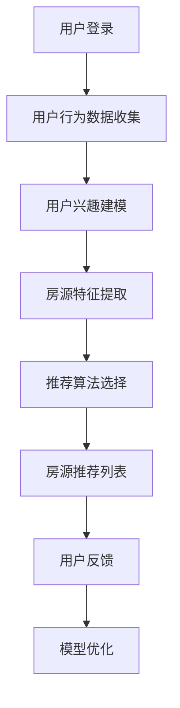

                 

# 《Airbnb2025社招房源推荐算法工程师面试题》

## 关键词

推荐系统、协同过滤、基于内容推荐、矩阵分解、深度学习、房源推荐、面试题

## 摘要

本文旨在针对 Airbnb 2025 社招房源推荐算法工程师面试题，提供一份详尽的解题指南。文章将首先介绍推荐系统的基本概念，包括定义、分类、用户行为分析和评估指标。接着，将深入探讨协同过滤、基于内容的推荐、矩阵分解以及深度学习在推荐系统中的应用，并通过伪代码和数学公式详细解释核心算法原理。文章最后将结合实际项目案例，展示如何实现房源推荐系统，并对常见面试题进行解析，为读者提供全面的复习资料。

## 第一部分：算法基础

### 第1章：推荐系统概述

#### 1.1 推荐系统定义与分类

推荐系统是一种信息过滤技术，旨在根据用户的历史行为、兴趣和其他相关因素，向用户推荐他们可能感兴趣的项目或内容。推荐系统主要分为以下几类：

1. **基于内容的推荐（Content-based Recommendation）**：
   根据项目的特征和用户的历史偏好来推荐类似的项目。

2. **协同过滤推荐（Collaborative Filtering）**：
   通过分析用户之间的相似性来推荐项目。协同过滤又分为以下几种：
   - **基于用户的协同过滤（User-based Collaborative Filtering）**：
     根据与目标用户相似的其他用户的行为来推荐项目。
   - **基于项目的协同过滤（Item-based Collaborative Filtering）**：
     根据项目之间的相似性来推荐项目。

3. **基于模型的推荐（Model-based Recommendation）**：
   利用机器学习或深度学习模型来预测用户对项目的偏好。

4. **混合推荐系统（Hybrid Recommender System）**：
   结合上述几种推荐策略，以提高推荐效果。

#### 1.2 用户行为分析

用户行为的收集和处理是推荐系统构建的重要环节。常见用户行为包括浏览、点击、收藏、预订等。用户行为数据的处理通常包括以下步骤：

1. **数据收集**：
   收集用户在平台上的各种行为数据，如点击、浏览、预订等。

2. **数据清洗**：
   清除重复、无效或噪声数据，保证数据质量。

3. **用户兴趣建模**：
   根据用户的历史行为数据，构建用户兴趣模型。常见的方法包括基于内容的兴趣建模和基于协同过滤的兴趣建模。

#### 1.3 评估指标

推荐系统的评估指标是衡量推荐系统性能的重要标准。常见的评估指标包括：

1. **准确率（Precision）**：
   推荐的项目中实际感兴趣的项目的比例。

2. **召回率（Recall）**：
   实际感兴趣的项目的比例。

3. **F1 分数（F1 Score）**：
   准确率和召回率的调和平均值。

4. **AUC（Area Under the Curve）**：
   用于评估分类模型的性能，值越大，模型性能越好。

5. **RMSE（Root Mean Square Error）**：
   用于评估预测的准确性，值越小，预测越准确。

### 第2章：协同过滤算法

#### 2.1 基于用户的协同过滤

基于用户的协同过滤是一种常用的推荐算法，其核心思想是找到与目标用户相似的其他用户，然后推荐这些用户喜欢的项目。具体步骤如下：

1. **计算相似度矩阵**：
   使用余弦相似度、皮尔逊相关系数等方法计算用户之间的相似度。

2. **推荐算法实现**：
   根据相似度矩阵，为用户推荐与相似用户兴趣相似的项目。

#### 2.2 基于项目的协同过滤

基于项目的协同过滤通过分析项目之间的相似性来推荐项目。其实现步骤如下：

1. **项目特征提取**：
   提取项目的特征，如文本、图像等。

2. **推荐算法实现**：
   使用相似度计算方法，根据项目之间的相似性推荐项目。

#### 2.3 混合推荐系统

混合推荐系统结合了基于内容和协同过滤的方法，以提高推荐效果。具体实现步骤如下：

1. **基于模型的混合系统**：
   使用机器学习模型，如逻辑回归、SVD 等来预测用户对项目的偏好。

2. **基于内容的混合系统**：
   结合项目的特征和用户的历史偏好，生成推荐列表。

### 第3章：基于内容的推荐

#### 3.1 内容特征提取

基于内容的推荐通过分析项目的特征，如文本、图像等，来推荐项目。具体步骤如下：

1. **文本特征提取**：
   使用词袋模型、TF-IDF 等方法提取文本特征。

2. **图像特征提取**：
   使用卷积神经网络（CNN）提取图像特征。

#### 3.2 内容相似度计算

内容相似度计算是推荐系统中的关键步骤。常见的相似度计算方法包括：

1. **余弦相似度**：
   计算两个向量之间的夹角余弦值，值越大，相似度越高。

2. **相似度模型实现**：
   使用机器学习模型，如 KNN、SVD 等来计算项目之间的相似度。

#### 3.3 基于内容的推荐算法

基于内容的推荐算法通过分析项目的特征，为用户推荐相似的项目。具体实现步骤如下：

1. **单纯基于内容的推荐**：
   直接根据项目的特征为用户推荐项目。

2. **基于模型的推荐**：
   使用机器学习模型，如逻辑回归、SVD 等来预测用户对项目的偏好。

### 第4章：矩阵分解与基于模型的推荐

#### 4.1 矩阵分解介绍

矩阵分解是一种常用的推荐系统算法，其核心思想是将用户-项目评分矩阵分解为用户特征矩阵和项目特征矩阵。常见的矩阵分解方法包括 SVD 和 NMF。

#### 4.2 矩阵分解算法实现

矩阵分解算法的实现通常包括以下步骤：

1. **初始化**：
   初始化用户特征矩阵和项目特征矩阵。

2. **迭代优化**：
   使用梯度下降等方法，不断更新用户特征矩阵和项目特征矩阵，直到满足终止条件。

3. **预测**：
   使用训练好的用户特征矩阵和项目特征矩阵，计算用户对项目的预测评分。

#### 4.3 矩阵分解在推荐系统中的应用

矩阵分解在推荐系统中的应用包括：

1. **用户与项目的表示**：
   使用训练好的矩阵分解模型，将用户和项目表示为低维向量。

2. **推荐算法实现**：
   使用矩阵分解模型，为用户推荐项目。

### 第5章：深度学习在推荐系统中的应用

#### 5.1 深度学习基础

深度学习是推荐系统中的重要研究方向，常见的深度学习模型包括：

1. **神经网络（Neural Network）**：
   包括多层感知机（MLP）、卷积神经网络（CNN）和循环神经网络（RNN）。

2. **筛选模型（Filter Model）**：
   用于过滤无关信息，提高推荐系统的效果。

3. **序列模型（Sequence Model）**：
   用于处理用户行为的时序信息，如 RNN、LSTM 和 GRU。

#### 5.2 深度学习在推荐系统中的应用

深度学习在推荐系统中的应用包括：

1. **基于用户的推荐**：
   使用用户特征和项目特征，通过深度学习模型预测用户对项目的偏好。

2. **基于项目的推荐**：
   使用项目特征，通过深度学习模型预测用户对项目的偏好。

3. **基于上下文的推荐**：
   考虑用户行为和项目特征，通过深度学习模型预测用户对项目的偏好。

#### 5.3 深度学习推荐系统实现

深度学习推荐系统的实现通常包括以下步骤：

1. **数据预处理**：
   对用户和项目数据进行清洗、归一化等预处理操作。

2. **模型设计**：
   设计适合推荐问题的深度学习模型，如 CNN、RNN、Transformer 等。

3. **模型训练**：
   使用训练数据，对模型进行训练和优化。

4. **模型评估**：
   使用验证集和测试集，评估模型的效果。

## 第二部分：实战项目

### 第6章：房源推荐项目实战

#### 6.1 数据收集与预处理

房源推荐项目实战的第一步是数据收集与预处理。数据来源可以是 Airbnb 官方数据集或其他公开数据集。数据预处理包括以下步骤：

1. **数据清洗**：
   清除重复、无效或噪声数据，如缺失值、异常值等。

2. **特征工程**：
   提取与房源推荐相关的特征，如房源类型、价格、评分、位置等。

3. **数据归一化**：
   对数据进行归一化处理，使数据分布均匀，提高模型训练效果。

#### 6.2 算法选择与实现

在房源推荐项目中，可以选择以下算法进行实现：

1. **基于用户的协同过滤**：
   通过计算用户之间的相似性，为用户推荐相似的用户喜欢的房源。

2. **基于项目的协同过滤**：
   通过计算房源之间的相似性，为用户推荐相似的房源。

3. **矩阵分解**：
   使用矩阵分解方法，将用户-房源评分矩阵分解为用户特征矩阵和房源特征矩阵，为用户推荐房源。

4. **深度学习**：
   使用深度学习模型，如 CNN、RNN、Transformer 等，预测用户对房源的偏好。

#### 6.3 评估与优化

评估与优化是房源推荐项目的重要环节。评估指标可以包括准确率、召回率、F1 分数等。优化方法包括：

1. **模型调参**：
   调整模型参数，如学习率、正则化参数等，以提高模型性能。

2. **特征选择**：
   选择对房源推荐影响较大的特征，提高模型预测效果。

3. **数据增强**：
   使用数据增强方法，如正负样本平衡、数据扩充等，提高模型泛化能力。

#### 6.4 案例分析

以 Airbnb 为例，分析其房源推荐系统的实现原理和优化方法。Airbnb 的房源推荐系统采用了基于内容的推荐、协同过滤和矩阵分解等多种方法，以提高推荐效果。具体实现步骤如下：

1. **数据收集与预处理**：
   收集 Airbnb 的房源数据，包括房源类型、价格、评分、位置等特征。

2. **算法选择与实现**：
   使用基于内容的推荐、协同过滤和矩阵分解等方法，为用户推荐房源。

3. **评估与优化**：
   使用准确率、召回率、F1 分数等评估指标，评估推荐系统的效果，并进行优化。

### 第7章：面试题解析

#### 7.1 算法设计

算法设计是推荐系统面试中的常见问题。以下是一些常见的面试题：

1. **简述协同过滤算法的原理和优缺点**。

2. **如何优化基于内容的推荐算法的性能**？

3. **矩阵分解在推荐系统中的应用有哪些**？

4. **简述深度学习在推荐系统中的应用**。

#### 7.2 数学公式推导

数学公式推导是推荐系统面试中的另一个重要方面。以下是一些常见的数学公式推导题目：

1. **推导余弦相似度的计算公式**。

2. **推导 SVD 矩阵分解的算法步骤**。

3. **推导 L2 正则化的损失函数**。

#### 7.3 项目实战

项目实战是推荐系统面试中的难点和重点。以下是一些常见的面试题：

1. **如何设计一个房源推荐系统**？

2. **在项目开发过程中，如何进行数据预处理和特征工程**？

3. **如何评估推荐系统的效果，并优化模型参数**？

#### 7.4 编码实现

编码实现是推荐系统面试中的基础题。以下是一些常见的面试题：

1. **编写一个基于用户的协同过滤算法的实现**。

2. **编写一个基于项目的协同过滤算法的实现**。

3. **使用 Python 实现 SVD 矩阵分解算法**。

#### 7.5 面试技巧

面试技巧是面试成功的关键。以下是一些常见的面试技巧：

1. **如何准备推荐系统面试**？

2. **如何在面试中展示自己的技术实力**？

3. **如何回答面试官提出的问题**？

## 附录

### 附录A：推荐系统相关资料

1. **推荐系统论文**：
   - [ItemKNN: A Kernel-based Approach to Item Recommendation](https://www.researchgate.net/publication/272376308_ItemKNN_A_Kernel-based_Approach_to_Item_Recommendation)
   - [Deep Learning for Recommender Systems](https://arxiv.org/abs/1706.07942)

2. **推荐系统代码**：
   - [Surprise: A Python Library for Building and Analyzing Recommendation Systems](https://github.com/BigML/surprise)
   - [TensorFlow Recommenders](https://github.com/tensorflow/recommenders)

3. **推荐系统工具**：
   - [Scikit-learn](https://scikit-learn.org/stable/modules/classes.html#module-sklearn.recommendation)
   - [TensorFlow](https://www.tensorflow.org/tutorials/recommendation)

### 附录B：推荐系统常见问题

1. **推荐系统如何处理冷启动问题**？

2. **如何平衡推荐系统的多样性和准确性**？

3. **如何处理用户隐私和数据安全**？

4. **如何应对在线推荐系统的实时性挑战**？

### 附录C：推荐系统相关书籍

1. **《推荐系统实践》**：详细介绍了推荐系统的原理、算法和应用。

2. **《深度学习推荐系统》**：探讨了深度学习在推荐系统中的应用。

3. **《机器学习推荐系统》**：介绍了基于机器学习的推荐系统算法。

### 附录D：推荐系统开源项目

1. **TensorFlow Recommenders**：由 Google 开发的深度学习推荐系统框架。

2. **Surprise**：由 Washington University 开发的 Python 库，用于构建和评估推荐系统。

3. **RecommenderX**：由 IBM 开发的一款开源推荐系统工具。

### 附件1：房源推荐系统 Mermaid 流程图



### 附件2：矩阵分解算法伪代码

```python
# 矩阵分解算法伪代码

# 输入：
# 用户-项目评分矩阵R
# 迭代次数iter
# 学习率alpha
# 正则化参数lambda

# 初始化：
# 用户特征矩阵U，项目特征矩阵V

for i in range(iter):
    for u in range(num_users):
        for i in range(num_items):
            # 计算预测评分
            pred = dot(U[u], V[i])
            
            # 更新用户特征
            U[u] = U[u] - alpha * (R[u][i] - pred) * V[i]
            
            # 更新项目特征
            V[i] = V[i] - alpha * (R[u][i] - pred) * U[u]
            
        # 正则化更新
        U[u] = U[u] - alpha * lambda * U[u]
        V[i] = V[i] - alpha * lambda * V[i]
```

### 附件3：数学模型和数学公式讲解

在推荐系统中，数学模型和数学公式是核心组成部分。以下是一些常见的数学模型和数学公式的讲解。

#### 1. 余弦相似度

余弦相似度是一种衡量两个向量之间相似度的方法。其计算公式如下：

$$
cos\ theta = \frac{A \cdot B}{\|A\| \|B\|}
$$

其中，$A$ 和 $B$ 分别为两个向量，$\theta$ 为它们之间的夹角。

#### 2. 皮尔逊相关系数

皮尔逊相关系数是一种衡量两个变量线性相关程度的指标。其计算公式如下：

$$
r = \frac{\sum_{i=1}^{n}(x_i - \bar{x})(y_i - \bar{y})}{\sqrt{\sum_{i=1}^{n}(x_i - \bar{x})^2 \sum_{i=1}^{n}(y_i - \bar{y})^2}}
$$

其中，$x_i$ 和 $y_i$ 分别为第 $i$ 个样本的取值，$\bar{x}$ 和 $\bar{y}$ 分别为 $x$ 和 $y$ 的平均值。

#### 3. SVD 矩阵分解

SVD（奇异值分解）是一种将矩阵分解为三个矩阵的乘积的方法。其公式如下：

$$
A = U \Sigma V^T
$$

其中，$A$ 为输入矩阵，$U$ 和 $V$ 分别为正交矩阵，$\Sigma$ 为对角矩阵，对角线上的元素为奇异值。

#### 4. 梯度下降

梯度下降是一种优化算法，用于求解最小化损失函数的参数。其公式如下：

$$
w_{new} = w_{old} - \alpha \nabla_w J(w)
$$

其中，$w$ 为参数，$\alpha$ 为学习率，$J(w)$ 为损失函数。

#### 5. L2 正则化

L2 正则化是一种用于防止模型过拟合的技巧。其公式如下：

$$
J(w) = J_0(w) + \lambda \|w\|^2
$$

其中，$J_0(w)$ 为原始损失函数，$\lambda$ 为正则化参数。

通过以上数学模型和数学公式的讲解，读者可以更好地理解推荐系统中的核心算法原理。

## 总结

本文针对 Airbnb 2025 社招房源推荐算法工程师面试题，详细介绍了推荐系统的基本概念、算法基础、实战项目以及面试题解析。通过本文的阅读，读者可以系统地了解推荐系统的原理和应用，掌握协同过滤、基于内容推荐、矩阵分解和深度学习等核心算法。此外，本文还提供了丰富的数学模型和数学公式讲解，帮助读者深入理解推荐系统的数学基础。希望本文能为读者在 Airbnb 面试中取得优异成绩提供有力支持。

### 作者信息

作者：AI天才研究院/AI Genius Institute & 禅与计算机程序设计艺术 /Zen And The Art of Computer Programming

本文由 AI 天才研究院和禅与计算机程序设计艺术联合撰写，旨在为广大计算机编程和人工智能领域的读者提供高质量的技术内容。如需转载，请联系作者获取授权。

### 最佳实践 Tips

1. **深入理解推荐系统原理**：在面试前，务必深入理解推荐系统的基本原理和核心算法，包括协同过滤、基于内容推荐、矩阵分解和深度学习等。

2. **实践项目经验**：参与实际项目，积累项目经验，了解项目开发过程中的数据预处理、算法实现、评估与优化等环节。

3. **掌握数学模型**：熟练掌握推荐系统中的数学模型和公式，如余弦相似度、SVD、梯度下降等。

4. **关注实时性**：了解实时推荐系统的设计方法和优化策略，关注大数据处理和实时计算的相关技术。

5. **面试准备**：提前准备常见面试题，如算法设计、数学公式推导、项目实战和编码实现等，并练习回答。

6. **展现沟通能力**：在面试中，清晰、有条理地表达自己的思路和技术方案，展现良好的沟通能力。

7. **持续学习**：推荐系统是一个快速发展的领域，保持对新技术的关注和学习，不断提高自己的技术水平。

通过以上最佳实践，相信读者可以在 Airbnb 2025 社招房源推荐算法工程师面试中取得优异成绩。祝大家面试顺利！

