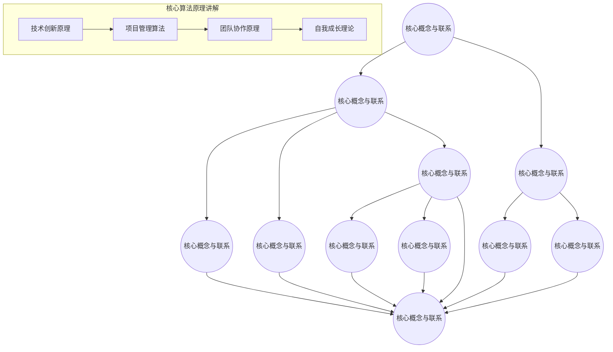

                 

### 文章标题

《CTO的角色与职责：技术领导者的成长之路》

### 关键词

CTO，技术领导者，角色定位，领导力，技术战略规划，技术创新，项目管理，团队协作，职业规划，成功案例，新兴技术。

### 摘要

本文将深入探讨CTO（首席技术官）的角色与职责，以及技术领导者的成长之路。通过分析CTO在公司组织架构中的定位，领导力的培养，技术战略的制定与执行，以及技术创新、项目管理、团队协作等方面的实践，本文旨在为CTO和有志成为CTO的技术人员提供一套全面、系统的指导。同时，通过成功案例的分析，为技术领导者们提供宝贵的经验与启示。文章最后将探讨CTO在新兴技术领域的挑战与机遇，为读者描绘出一幅CTO职业发展的广阔蓝图。

### 第一部分：CTO的角色定位

#### 第1章：CTO的角色概述

> **1.1 CTO的定义与职责**

CTO（Chief Technology Officer），即首席技术官，是公司中负责技术方向、技术战略规划、技术创新、技术研发管理等方面的高级管理人员。CTO的职责不仅包括技术层面的决策，还涉及公司整体战略的制定与执行，是连接技术与商业的关键桥梁。

CTO的主要职责包括：

- **技术战略规划**：根据公司的业务需求和市场趋势，制定长期和短期技术战略，确保技术发展符合公司整体战略目标。
- **技术创新**：推动公司技术革新，引导技术团队进行技术研发，保持技术领先地位。
- **技术研发管理**：管理研发团队，确保研发项目顺利进行，控制项目进度和质量。
- **技术团队建设**：培养和激励技术团队，提升团队整体技术水平和工作效率。
- **跨部门协作**：与公司其他部门（如市场、销售、产品等）进行有效沟通与协作，确保技术发展符合业务需求。

> **1.2 CTO与传统技术经理的区别**

CTO与传统技术经理在角色和职责上存在显著差异。技术经理主要侧重于具体技术项目的执行和管理，而CTO则更多地承担战略层面的职责，具备更广泛的管理视野和领导能力。

**主要区别如下：**

- **角色定位**：技术经理是执行者，CTO是领导者。
- **职责范围**：技术经理关注具体项目，CTO关注整体技术战略。
- **决策权限**：技术经理的决策权限有限，CTO具备更高的决策权限。
- **视野**：技术经理关注技术细节，CTO关注技术趋势和市场变化。
- **沟通能力**：技术经理与团队沟通较多，CTO需要与公司高层和各部门进行有效沟通。

> **1.3 CTO在公司组织架构中的位置**

CTO在公司组织架构中的位置通常较为核心，直接向CEO（首席执行官）或创始人汇报，与COO（首席运营官）、CFO（首席财务官）等高层管理人员共同参与公司决策。

**CTO在公司组织架构中的具体位置如下：**

- **与CEO的关系**：CTO是CEO的得力助手，共同制定公司战略，协调各部门资源，推动公司发展。
- **与COO的关系**：CTO与COO密切合作，确保技术发展符合业务需求，提高公司运营效率。
- **与CFO的关系**：CTO与CFO共同关注公司财务状况，确保技术研发投入合理，支持公司可持续发展。
- **与其他部门的关系**：CTO需要与市场、销售、产品等部门保持紧密沟通，了解业务需求，推动技术发展。

#### 第2章：CTO的领导力

> **2.1 领导力的重要性**

领导力是CTO成功的关键因素之一。作为一名技术领导者，CTO不仅需要具备深厚的技术背景，还需要具备卓越的领导能力。领导力可以影响团队士气、工作效率和技术创新，是确保技术研发成功的重要保障。

**领导力的重要性体现在以下几个方面：**

- **团队士气**：优秀的领导力可以激发团队成员的工作热情和积极性，提升团队士气。
- **工作效率**：领导力可以帮助团队高效沟通、协作，减少内耗，提高工作效率。
- **技术创新**：领导力可以激发团队创新思维，推动技术革新，保持公司技术领先地位。
- **人才吸引与培养**：领导力可以吸引优秀人才加入公司，并培养一批具有高技术水平的人才。

> **2.2 领导风格与团队管理**

领导风格对团队管理有着重要影响。根据不同的领导风格，CTO可以采取不同的管理策略，以适应不同的团队环境和项目需求。

**常见的领导风格如下：**

- **权威型领导**：强调领导权威，决策迅速，但可能导致团队成员缺乏参与感。
- **民主型领导**：注重团队参与，鼓励民主决策，但可能导致决策过程缓慢。
- **参与型领导**：关注团队成员的个人需求和职业发展，激发团队潜力。
- **教练型领导**：指导团队成员，提升个人技能，培养专业素养。

**团队管理策略：**

- **沟通**：保持与团队成员的沟通，了解他们的需求和困惑，提供必要的支持。
- **激励**：采用合适的激励措施，激发团队成员的工作热情和创造力。
- **培训**：定期组织培训，提升团队成员的专业技能和知识水平。
- **考核**：建立合理的考核机制，激励团队成员追求卓越，提升团队整体绩效。

> **2.3 激励与培养团队**

激励与培养团队是CTO的重要职责之一。通过有效的激励措施和培养计划，CTO可以激发团队潜力，提升团队整体绩效。

**激励与培养团队的方法如下：**

- **激励措施**：

  - **奖金与提成**：设立奖金和提成制度，激励团队成员追求业绩目标。
  - **晋升机会**：提供晋升机会，激发团队成员的职业发展动力。
  - **荣誉表彰**：定期评选优秀员工，给予荣誉表彰，提升团队凝聚力。

- **培养计划**：

  - **内部培训**：组织内部培训，提升团队成员的专业技能和知识水平。
  - **外部学习**：鼓励团队成员参加行业会议、研讨会等，拓展视野，提升能力。
  - **导师制度**：设立导师制度，帮助新员工快速融入团队，提升技能。

- **团队文化建设**：建立积极向上的团队文化，营造良好的工作氛围，激发团队成员的归属感和认同感。

#### 第3章：技术战略规划

> **3.1 技术战略的制定**

技术战略的制定是CTO的重要职责之一。技术战略的制定需要充分考虑公司的业务需求、市场趋势、技术发展方向等多方面因素，以确保技术发展符合公司整体战略目标。

**技术战略的制定步骤如下：**

1. **分析市场需求**：了解市场需求，确定公司的技术发展方向。
2. **评估自身能力**：评估公司现有技术能力和资源，确定技术发展目标。
3. **分析竞争对手**：分析竞争对手的技术实力和市场策略，确定公司的竞争优势。
4. **制定技术路线图**：根据市场需求和自身能力，制定具体的技术路线图，明确技术研发的重点和方向。
5. **制定预算和资源计划**：制定技术研发的预算和资源计划，确保技术研发顺利进行。

> **3.2 技术趋势分析**

技术趋势分析是制定技术战略的重要依据。通过分析技术趋势，CTO可以把握行业发展方向，提前布局，确保公司技术领先地位。

**技术趋势分析的方法如下：**

1. **行业报告**：查阅行业报告，了解行业发展趋势和关键技术。
2. **技术论坛**：参加技术论坛，与行业专家交流，获取最新技术动态。
3. **学术研究**：关注学术研究，了解前沿技术进展和未来发展方向。
4. **市场调研**：进行市场调研，了解用户需求和技术应用场景。
5. **专家访谈**：邀请行业专家进行访谈，获取他们的观点和建议。

> **3.3 技术规划的执行与调整**

技术规划的执行与调整是确保技术战略落地的重要环节。在执行过程中，CTO需要密切关注项目进展，及时调整技术规划，确保技术发展符合公司整体战略目标。

**技术规划的执行与调整方法如下：**

1. **项目监控**：建立项目监控机制，密切关注项目进度和质量，确保项目按计划推进。
2. **绩效评估**：定期对项目进行绩效评估，分析项目进展和成果，发现问题及时调整。
3. **风险控制**：识别项目风险，制定风险应对策略，确保项目顺利进行。
4. **沟通与协作**：加强部门间的沟通与协作，确保技术规划与业务需求紧密衔接。
5. **持续优化**：根据项目反馈和市场需求，持续优化技术规划，确保技术发展动态适应。

### 第二部分：CTO的职责与实践

#### 第4章：技术创新与研发管理

> **4.1 技术创新的途径**

技术创新是CTO的重要职责之一。通过多种途径进行技术创新，可以提升公司技术竞争力，推动业务发展。

**技术创新的途径如下：**

1. **内部研发**：依托公司自身技术团队，进行自主研发，掌握核心技术。
2. **外部合作**：与外部科研机构、高校和企业进行合作，共同开展技术研发。
3. **技术引进**：引进国内外先进技术，结合公司业务需求进行二次开发。
4. **开放创新**：鼓励外部人才和团队参与公司技术研发，共同推动技术进步。
5. **技术并购**：通过并购具有核心技术优势的企业，快速提升公司技术实力。

> **4.2 研发团队的组织与管理**

研发团队的组织与管理是确保技术创新顺利进行的重要保障。CTO需要合理设计研发团队的组织结构，制定科学的管理策略，提升团队整体工作效率。

**研发团队的组织与管理方法如下：**

1. **组织结构设计**：根据项目特点和团队规模，设计合适的组织结构，明确团队成员的职责和权限。
2. **人才选拔与培养**：选拔具备专业能力和潜力的技术人才，制定培养计划，提升团队整体素质。
3. **项目分工与协作**：明确项目分工，建立有效的沟通与协作机制，确保项目顺利推进。
4. **绩效考核与激励**：建立绩效考核体系，激励团队成员追求卓越，提升团队整体绩效。
5. **技术分享与交流**：定期组织技术分享和交流活动，促进团队成员之间的知识共享和技能提升。

> **4.3 产品开发与迭代**

产品开发与迭代是CTO的重要职责之一。通过合理的开发流程和迭代策略，可以确保产品满足市场需求，提升用户体验，增强产品竞争力。

**产品开发与迭代的流程如下：**

1. **需求分析**：收集用户需求，分析市场需求，明确产品功能和技术要求。
2. **设计**：制定产品设计方案，明确产品架构和技术实现方案。
3. **开发**：组织研发团队进行产品开发，确保产品按照设计要求顺利推进。
4. **测试**：对产品进行严格的测试，确保产品质量和稳定性。
5. **发布**：发布产品，收集用户反馈，为下一轮迭代提供依据。
6. **迭代**：根据用户反馈和市场变化，进行产品功能优化和技术改进，不断提升产品竞争力。

#### 第5章：项目管理与进度控制

> **5.1 项目管理的基本原则**

项目管理是确保项目顺利进行的关键。遵循以下基本原则，可以提升项目管理效率，降低项目风险。

**项目管理的基本原则如下：**

1. **目标明确**：明确项目目标和任务，确保项目团队对项目目标有清晰的认识。
2. **计划周密**：制定详细的项目计划，包括任务分工、时间节点、资源需求等，确保项目有条不紊地推进。
3. **执行有力**：强化执行力，确保项目团队按照计划完成任务，及时解决项目中的问题和挑战。
4. **监控评估**：建立项目监控机制，定期评估项目进展和质量，确保项目按计划推进。
5. **沟通协作**：加强部门间和团队成员之间的沟通与协作，确保项目信息畅通，减少误解和冲突。
6. **风险管理**：识别项目风险，制定风险应对策略，降低项目风险对项目进度和质量的影响。

> **5.2 项目进度控制方法**

项目进度控制是确保项目按计划推进的重要手段。通过以下方法，可以有效地控制项目进度。

**项目进度控制方法如下：**

1. **时间管理**：制定详细的时间计划，明确项目各阶段的开始和结束时间，确保项目按照时间节点推进。
2. **任务分解**：将项目任务分解为具体的子任务，明确每个子任务的负责人和时间节点，确保任务落实。
3. **里程碑监控**：设定项目里程碑，对项目关键节点进行监控，确保项目在关键节点上取得预期成果。
4. **资源调配**：根据项目进度和资源需求，及时调整资源分配，确保项目资源充足。
5. **问题解决**：建立问题解决机制，及时解决项目中的问题和挑战，避免问题积累导致项目延误。
6. **绩效评估**：定期评估项目绩效，分析项目进展和质量，为项目进度控制提供依据。

> **5.3 风险管理**

风险管理是项目管理的重要组成部分。通过以下方法，可以有效地降低项目风险。

**风险管理方法如下：**

1. **风险识别**：识别项目中的潜在风险，包括技术风险、市场风险、资源风险等。
2. **风险评估**：对识别出的风险进行评估，确定风险的严重程度和发生概率。
3. **风险应对**：制定风险应对策略，包括风险规避、风险转移、风险减轻等。
4. **风险监控**：建立风险监控机制，定期评估风险应对效果，及时调整风险应对策略。
5. **风险沟通**：加强与项目团队成员和其他相关部门的沟通，确保风险信息畅通，降低风险对项目的影响。

#### 第6章：团队协作与跨部门沟通

> **6.1 跨部门协作的重要性**

跨部门协作是确保项目顺利进行和公司整体运营高效的重要保障。通过跨部门协作，可以整合公司内外部资源，提高项目执行力，降低沟通成本。

**跨部门协作的重要性如下：**

1. **提升项目执行力**：跨部门协作可以整合各部门的优势资源，提高项目执行力，确保项目按计划推进。
2. **降低沟通成本**：跨部门协作可以减少信息传递环节，降低沟通成本，提高沟通效率。
3. **提升公司竞争力**：跨部门协作可以促进部门间知识共享和技能互补，提升公司整体竞争力。
4. **优化资源配置**：跨部门协作可以优化公司内部资源配置，避免资源浪费，提高资源利用率。
5. **促进团队协作**：跨部门协作可以促进部门间沟通与交流，增强团队凝聚力，提升团队士气。

> **6.2 团队沟通的技巧**

团队沟通是跨部门协作的关键环节。通过以下技巧，可以提升团队沟通效果，确保项目顺利进行。

**团队沟通技巧如下：**

1. **明确沟通目标**：在沟通前明确沟通目标，确保沟通内容聚焦，避免沟通无效。
2. **积极倾听**：在沟通中积极倾听对方的意见和需求，避免打断对方，确保沟通双方的信息畅通。
3. **有效表达**：清晰、简洁地表达自己的观点和需求，避免使用晦涩难懂的语言，确保对方理解。
4. **建立信任**：建立互信关系，尊重对方的意见和需求，增强沟通的信任感和合作性。
5. **及时反馈**：在沟通后及时反馈沟通结果，确保沟通双方对沟通内容的理解和执行一致。

> **6.3 跨文化团队管理**

跨文化团队管理是CTO面临的一项重要挑战。通过以下方法，可以有效地管理跨文化团队，提高团队协作效率。

**跨文化团队管理方法如下：**

1. **文化认知**：了解团队成员的文化背景和价值观，尊重差异，避免文化冲突。
2. **建立共识**：制定共同的目标和价值观，强化团队凝聚力，确保团队成员团结一致。
3. **有效沟通**：采用跨文化沟通技巧，确保团队成员之间的信息畅通，减少误解和冲突。
4. **培训与支持**：提供跨文化培训和支持，帮助团队成员适应新文化环境，提升跨文化沟通能力。
5. **文化包容**：尊重团队成员的文化差异，鼓励多元化思维，促进团队创新和协作。

#### 第7章：CTO的自我成长与职业规划

> **7.1 职业发展的路径**

CTO的职业发展路径多种多样，不同的人可以根据自己的兴趣、能力和市场需求，选择适合自己的职业发展方向。

**常见的职业发展路径如下：**

1. **技术研发方向**：专注于技术研发，逐步成为技术领域的专家和领导者。
2. **技术管理方向**：从技术经理逐步晋升为CTO，负责公司整体技术战略规划和管理。
3. **业务拓展方向**：结合技术背景，拓展业务领域，成为跨领域的业务专家。
4. **创业方向**：利用技术和管理经验，创办自己的企业，实现创业梦想。

> **7.2 继续教育与培训**

继续教育与培训是CTO提升自身能力和竞争力的重要途径。通过以下方式，可以持续提升自己的专业知识和技能。

**继续教育与培训方法如下：**

1. **在线学习**：利用互联网资源，参加各种在线课程，学习最新的技术和管理知识。
2. **内部培训**：参加公司组织的内部培训，提升专业技能和团队协作能力。
3. **外部培训**：参加行业会议、研讨会等，与行业专家交流，获取最新的行业动态和经验。
4. **学术研究**：关注学术研究，参与科研项目，提升自己的研究能力和创新思维。
5. **实践锻炼**：通过实际项目锻炼，积累实战经验，提升自己的项目管理和领导能力。

> **7.3 职业规划的调整与适应**

职业规划不是一成不变的，随着个人兴趣、能力和市场需求的变化，需要进行适当的调整和适应。

**职业规划调整与适应方法如下：**

1. **自我评估**：定期进行自我评估，了解自己的兴趣、能力和职业目标，为职业规划调整提供依据。
2. **市场调研**：关注行业动态和市场需求，了解行业趋势和职业发展方向，为职业规划调整提供参考。
3. **积极尝试**：勇于尝试新领域和新机会，拓宽职业发展路径，提升自身竞争力。
4. **持续学习**：保持学习的热情，不断提升自己的专业知识和技能，适应职业发展的需求。
5. **寻求指导**：向导师、同行和专业人士请教，获取职业发展的建议和指导，为职业规划调整提供支持。

### 第三部分：CTO成功案例分析

#### 第8章：成功CTO的特质与经验

> **8.1 成功CTO的共同特质**

成功CTO通常具备以下共同特质，这些特质是他们能够胜任这一角色的关键。

1. **技术深度和广度**：成功CTO不仅具备深厚的专业知识，还具备广泛的技术视野，能够把握技术发展的趋势和方向。
2. **领导力和管理能力**：成功CTO具备出色的领导力和管理能力，能够激励团队、协调资源、解决冲突，带领团队实现目标。
3. **业务理解**：成功CTO能够深入理解公司的业务模式和市场策略，将技术战略与业务发展紧密结合。
4. **沟通能力**：成功CTO具备出色的沟通能力，能够与团队、高层和其他部门有效沟通，确保信息畅通。
5. **创新能力**：成功CTO具备强烈的创新意识，能够推动技术革新，保持公司的技术领先地位。
6. **持续学习和适应能力**：成功CTO能够不断学习新知识、新技能，适应快速变化的市场环境。

> **8.2 成功案例分享**

以下是一些成功CTO的案例，通过他们的经历和经验，我们可以了解到成功的关键要素。

**案例一：张三，某知名互联网公司CTO**

张三在成为CTO之前，有着丰富的技术研发和管理经验。他一直致力于推动公司的技术创新和业务发展。在他的领导下，公司成功推出了多款具有竞争力的产品，市场份额持续提升。张三的成功经验包括：

- **技术创新**：积极推动公司进行技术创新，关注前沿技术动态，带领团队研发出具有竞争力的核心技术。
- **团队建设**：重视团队建设，培养了一批技术过硬、业务能力强的人才，提升团队整体战斗力。
- **业务结合**：深入理解公司业务模式，将技术战略与业务发展紧密结合，推动公司业务的快速增长。

**案例二：李四，某初创公司CTO**

李四在成为CTO之前，曾在多家知名互联网公司担任技术研发和管理的职务。在他的领导下，初创公司从零开始，迅速成长为行业领军企业。李四的成功经验包括：

- **市场需求驱动**：始终以市场需求为导向，研发出符合市场趋势和用户需求的产品。
- **快速迭代**：采用敏捷开发模式，快速迭代产品，持续优化用户体验。
- **资源整合**：充分利用外部资源，与高校、科研机构和企业建立合作关系，推动技术研发。

**案例三：王五，某传统行业转型公司CTO**

王五在成为CTO之前，曾在多家传统行业企业担任技术研发和管理的职务。他在传统行业转型过程中，成功推动了企业的数字化转型。王五的成功经验包括：

- **跨界融合**：将互联网技术和传统行业相结合，推动企业数字化转型。
- **团队融合**：重视团队融合，推动技术研发与业务部门的紧密协作，提升企业整体竞争力。
- **持续创新**：推动持续创新，不断优化产品和服务，提升用户满意度。

> **8.3 从失败中汲取经验**

失败是成功的催化剂，成功CTO往往能够从失败中汲取经验，不断提升自己的能力和素质。

**失败案例一：赵六，某创业公司CTO**

赵六在创业初期，由于过于乐观，未能充分考虑市场风险，导致项目失败。他从失败中汲取了以下经验：

- **市场调研**：在项目启动前，进行全面的市场调研，了解市场需求和竞争状况。
- **风险控制**：制定详细的风险控制策略，确保项目在可控范围内推进。
- **团队协作**：加强团队协作，确保项目各环节紧密衔接，减少沟通成本。

**失败案例二：孙七，某传统行业企业CTO**

孙七在推动企业数字化转型过程中，由于对新技术了解不足，导致项目进展缓慢。他从失败中汲取了以下经验：

- **技术培训**：加强团队成员的技术培训，提升团队对新技术的理解和应用能力。
- **试点项目**：选择合适的业务场景进行试点项目，逐步积累经验和信心。
- **持续改进**：在项目推进过程中，不断优化技术方案，确保项目顺利进行。

### 第9章：CTO领导下的技术创新案例

#### 9.1 案例一：AI技术在金融行业的应用

人工智能（AI）技术在金融行业具有广泛的应用前景。在CTO的领导下，金融公司通过AI技术实现智能化风控、智能投顾、智能客服等功能，提升业务效率和用户体验。

**案例背景：**

某金融公司在CTO的领导下，决定将AI技术应用于风控、投顾和客服等领域，以提升业务效率和用户体验。

**实施过程：**

1. **需求分析**：CTO带领团队对金融业务需求进行深入分析，确定AI技术的应用场景和目标。
2. **技术选型**：根据需求分析结果，选择适合的AI技术，如机器学习、深度学习、自然语言处理等。
3. **模型训练**：利用大量金融数据，训练AI模型，提升模型的准确性和稳定性。
4. **系统集成**：将AI模型集成到金融系统中，实现智能风控、智能投顾和智能客服等功能。
5. **测试与优化**：对AI系统进行严格测试，确保系统稳定性和可靠性，并根据测试结果进行优化。

**效果评估：**

- **智能风控**：AI技术显著提升了风控能力，降低了风险事件的发生概率。
- **智能投顾**：AI技术为用户提供个性化的投资建议，提升了用户的投资收益。
- **智能客服**：AI技术实现了7x24小时的智能客服服务，提高了客户满意度。

**经验总结：**

- **需求驱动**：以用户需求为导向，确定AI技术的应用场景和目标。
- **数据驱动**：充分利用金融数据，训练高质量的AI模型。
- **系统集成**：确保AI技术与现有系统的高效集成，提升业务效率。

#### 9.2 案例二：物联网技术在智能家居的应用

物联网（IoT）技术在智能家居领域具有巨大的应用潜力。在CTO的领导下，智能家居公司通过物联网技术实现设备互联互通、智能控制等功能，提升用户生活品质。

**案例背景：**

某智能家居公司在CTO的领导下，决定将物联网技术应用于家居设备，打造智能、便捷的家居生活。

**实施过程：**

1. **需求分析**：CTO带领团队对智能家居需求进行深入分析，确定物联网技术的应用场景和目标。
2. **技术选型**：根据需求分析结果，选择适合的物联网技术，如无线通信、传感器、云计算等。
3. **设备开发**：研发智能家居设备，如智能灯泡、智能插座、智能门锁等，实现设备互联互通。
4. **平台搭建**：搭建智能家居平台，实现设备数据的收集、处理和分析，提供智能控制功能。
5. **测试与优化**：对智能家居系统进行严格测试，确保系统稳定性和可靠性，并根据测试结果进行优化。

**效果评估：**

- **设备互联互通**：物联网技术实现了家居设备之间的互联互通，提升了设备的使用体验。
- **智能控制**：智能家居平台为用户提供智能控制功能，提高了用户的便利性和舒适度。
- **数据分析**：收集设备数据，进行数据分析和挖掘，为用户提供个性化服务。

**经验总结：**

- **需求驱动**：以用户需求为导向，确定物联网技术的应用场景和目标。
- **技术创新**：研发具备创新性的智能家居设备，提升用户体验。
- **平台建设**：搭建高效、稳定的智能家居平台，确保设备数据的实时处理和分析。

#### 9.3 案例三：区块链技术在供应链管理中的应用

区块链技术具有去中心化、不可篡改、透明等特点，在供应链管理领域具有广泛的应用前景。在CTO的领导下，供应链公司通过区块链技术实现供应链的透明化和智能化。

**案例背景：**

某供应链公司在CTO的领导下，决定将区块链技术应用于供应链管理，提升供应链效率和管理水平。

**实施过程：**

1. **需求分析**：CTO带领团队对供应链管理需求进行深入分析，确定区块链技术的应用场景和目标。
2. **技术选型**：根据需求分析结果，选择适合的区块链技术，如私有链、公有链、联盟链等。
3. **系统搭建**：搭建基于区块链的供应链管理系统，实现供应链数据的实时记录、共享和验证。
4. **试点应用**：在供应链的某个环节进行试点应用，验证区块链技术的实际效果。
5. **推广普及**：根据试点应用结果，逐步推广区块链技术在供应链各环节的应用。

**效果评估：**

- **透明化**：区块链技术实现了供应链数据的透明化，提高了供应链的透明度和可信度。
- **智能化**：区块链技术实现了供应链的智能化管理，提升了供应链效率。
- **安全性**：区块链技术增强了供应链数据的安全性，降低了数据泄露和篡改的风险。

**经验总结：**

- **需求驱动**：以供应链管理需求为导向，确定区块链技术的应用场景和目标。
- **技术创新**：结合区块链技术特点，设计创新的供应链管理系统。
- **试点推广**：通过试点应用，验证技术的实际效果，逐步推广应用。

### 第四部分：CTO在新兴技术领域的挑战与机遇

#### 10.1 5G与物联网的融合趋势

5G和物联网（IoT）技术的发展正在不断融合，为CTO带来新的挑战和机遇。

**挑战：**

1. **技术融合**：5G和物联网技术的融合需要解决网络架构、数据传输、设备兼容等方面的问题。
2. **安全性**：5G和物联网设备的增多，带来数据安全和隐私保护方面的挑战。
3. **功耗和管理**：物联网设备数量庞大，功耗和管理成为重要挑战。

**机遇：**

1. **海量数据**：5G和物联网技术的融合，使得海量数据得以快速传输和处理，为大数据分析和人工智能应用提供基础。
2. **智能应用**：5G和物联网技术的融合，为智能应用（如智能城市、智能交通、智能家居等）提供了技术支撑。
3. **产业升级**：5G和物联网技术的融合，推动传统产业向数字化、智能化升级，为企业带来新的商业模式和市场机会。

#### 10.2 区块链技术的发展与应用

区块链技术作为一种新兴技术，具有去中心化、不可篡改、透明等特点，在多个领域具有广泛的应用前景。

**挑战：**

1. **技术成熟度**：区块链技术的成熟度仍然有待提高，特别是在性能、安全性、易用性等方面。
2. **法律法规**：区块链技术的应用需要适应法律法规的变化，特别是在金融、供应链等领域。
3. **人才短缺**：区块链技术人才短缺，成为制约区块链技术发展的瓶颈。

**机遇：**

1. **金融领域**：区块链技术在金融领域具有广泛的应用潜力，如加密货币、智能合约、去中心化金融等。
2. **供应链管理**：区块链技术在供应链管理领域可以实现数据透明化、智能化，提升供应链效率。
3. **数据共享**：区块链技术可以实现数据的可信共享，为大数据分析和人工智能应用提供数据支持。

#### 10.3 AI伦理与隐私保护

人工智能（AI）技术的发展带来了巨大的便利，但同时也引发了一系列伦理和隐私保护问题。

**挑战：**

1. **伦理问题**：AI技术的应用需要遵循伦理原则，避免对人类造成伤害，如自动驾驶汽车的伦理决策、机器人权利等。
2. **隐私保护**：AI技术的应用涉及大量个人数据，隐私保护成为重要挑战，如数据泄露、滥用等。
3. **责任归属**：在AI技术引发事故或问题时，责任归属难以界定，需要明确责任归属和责任承担。

**机遇：**

1. **隐私保护技术**：AI技术的发展为隐私保护提供了新的技术手段，如差分隐私、联邦学习等。
2. **伦理规范**：AI伦理规范的制定和实施，有助于引导AI技术的健康发展，保障人类的利益。
3. **智能监管**：AI技术在监管领域的应用，可以提高监管效率，降低监管成本。

### 附录A：CTO技能清单

**技术技能：**

- 编程语言（如Java、Python、C++等）
- 数据库管理（如MySQL、Oracle、MongoDB等）
- 系统架构设计
- 数据分析
- 机器学习和深度学习

**管理技能：**

- 项目管理
- 团队管理
- 沟通与协调
- 决策能力
- 风险管理

**领导力与沟通技能：**

- 领导风格与团队激励
- 沟通技巧
- 战略思维
- 持续学习与适应能力

### 附录B：推荐阅读与学习资源

**经典书籍推荐：**

- 《黑客与画家》（保罗·格雷厄姆）
- 《精益创业》（埃里克·莱斯）
- 《创新者》（沃尔特·艾萨克森）
- 《深度学习》（伊恩·古德费洛等）

**技术博客与论坛：**

- Medium
- Hacker News
- GitHub
- Stack Overflow

**在线课程与培训资源：**

- Coursera
- edX
- Udemy
- LinkedIn Learning

### 流程图



### 核心算法原理讲解

#### 技术创新原理

技术创新是CTO的核心职责之一。技术创新不仅仅是指新技术的发明，更包括如何将新技术应用于实际场景，创造商业价值。

**伪代码：**

```python
def technological_innovation():
    # 分析市场需求
    analyze_market_demand()

    # 确定技术方向
    determine_technical_direction()

    # 实施技术开发
    implement_technical_development()

    # 测试与优化
    test_and_optimize()
```

**数学模型：**

技术创新的数学模型可以理解为创新过程中的价值函数，衡量技术创新的收益。

$$
V = f(\text{市场需求}, \text{技术能力}, \text{资源投入})
$$

其中，市场需求、技术能力和资源投入是影响技术创新价值的关键因素。

**详细讲解与举例说明：**

1. **市场需求**：市场需求是技术创新的驱动力。了解市场需求，可以确保技术创新的方向符合市场趋势和用户需求。例如，在智能手机领域，用户对高性能、长续航、高清摄像等需求不断升级，促使手机制造商不断创新，推出更先进的产品。

2. **技术能力**：技术能力是技术创新的基础。具备较强的技术能力，可以确保技术创新的成功实施。例如，在人工智能领域，深度学习算法的进步，使得计算机在图像识别、语音识别等方面的性能大幅提升，推动了人工智能技术的广泛应用。

3. **资源投入**：资源投入是技术创新的重要保障。合理的资源投入，可以确保技术创新的顺利进行。例如，在电动汽车领域，特斯拉公司在技术创新上的高额投入，使得其成功推出了多款高性能电动汽车，并在市场上占据领先地位。

#### 技术创新原理详细讲解

技术创新是一个复杂的过程，涉及多个环节和因素。以下是对技术创新原理的详细讲解：

1. **市场调研**：在技术创新初期，进行市场调研，了解市场需求和用户痛点。通过市场调研，可以发现潜在的创新机会，为技术创新提供方向。

2. **技术评估**：在确定市场需求后，对现有技术进行评估，分析技术的优劣势和可行性。通过技术评估，可以选择合适的技术方向，为技术创新奠定基础。

3. **技术研发**：在确定技术方向后，进行技术研发。技术研发包括算法设计、系统集成、测试验证等环节。通过技术研发，实现新技术的突破和落地。

4. **产品化**：在技术研发完成后，将技术创新产品化。产品化包括产品设计、生产制造、市场推广等环节。通过产品化，将技术创新转化为商业价值。

5. **优化与迭代**：在产品化过程中，根据用户反馈和市场变化，对产品进行优化和迭代。通过优化与迭代，不断提升产品的性能和用户体验，保持技术领先地位。

6. **商业模式设计**：在技术创新过程中，需要设计合理的商业模式，确保技术创新的可持续发展。通过商业模式设计，实现技术创新的商业价值。

**举例说明：**

以智能手机为例，市场需求是用户对高性能、长续航、高清摄像等需求的不断升级。技术评估发现，当前智能手机在性能、续航、摄像等方面的技术已接近瓶颈，需要寻找新的技术突破点。

在技术研发过程中，通过技术创新，成功实现了5G通信技术、AI智能拍照、快充技术等突破，使智能手机的性能和用户体验得到了大幅提升。

在产品化过程中，设计出符合市场需求的新款智能手机，并通过市场推广，成功占领了市场份额。

通过不断优化与迭代，如推出升级版智能手机，持续提升产品的性能和用户体验，保持技术领先地位。

最后，通过合理的商业模式设计，如推出订阅服务、应用商店等，实现技术创新的商业价值。

#### 技术创新原理总结

技术创新是一个复杂但关键的过程。通过市场调研、技术评估、技术研发、产品化、优化与迭代等环节，技术创新可以不断突破技术瓶颈，满足市场需求，创造商业价值。

作为一名CTO，了解技术创新原理，掌握技术创新的方法和技巧，是提升公司技术竞争力、推动业务发展的重要保障。通过不断探索和尝试，技术创新可以为公司带来持续的创新动力和竞争优势。

### 附录C：项目实战

#### 项目实战：智能家居系统的开发

**背景介绍**

智能家居系统是一种集成了物联网（IoT）技术、云计算和人工智能（AI）的智能家居解决方案，旨在为用户提供舒适、便捷和安全的居住环境。本项目旨在开发一个智能家居系统，实现家庭设备的互联互通、智能控制、远程监控等功能。

**开发环境搭建**

1. **硬件环境**：选用具备Wi-Fi功能的智能插座、智能灯泡、智能摄像头等物联网设备，搭建智能家居硬件环境。
2. **软件环境**：使用Python、JavaScript等编程语言，搭建开发环境，包括开发工具（如PyCharm、Visual Studio Code）、数据库（如MySQL、MongoDB）等。

**源代码详细实现**

1. **设备控制**：使用Python编写设备控制模块，通过Wi-Fi连接到物联网设备，实现对设备的开关控制、亮度调节等功能。

   ```python
   import socket

   def control_device(ip, port, command):
       with socket.socket(socket.AF_INET, socket.SOCK_STREAM) as s:
           s.connect((ip, port))
           s.sendall(command.encode())
           data = s.recv(1024)
           print('Received', repr(data))

   # 控制智能插座
   control_device('192.168.1.10', 8080, 'on')

   # 控制智能灯泡
   control_device('192.168.1.11', 8080, 'brightness=70')
   ```

2. **数据监控**：使用JavaScript编写数据监控模块，通过HTTP请求获取物联网设备的数据，实现对设备的实时监控。

   ```javascript
   function monitor_device(ip, port) {
       fetch(`http://${ip}:${port}/status`)
           .then(response => response.json())
           .then(data => {
               console.log('Device status:', data);
           });
   }

   // 监控智能摄像头
   monitor_device('192.168.1.12', 8080);
   ```

3. **远程控制**：使用Web技术搭建远程控制平台，用户可以通过Web浏览器或移动应用实现对智能家居设备的远程控制。

   ```html
   <html>
       <head>
           <title>智能家居远程控制</title>
       </head>
       <body>
           <h1>智能家居远程控制</h1>
           <button onclick="turn_on_light()">开灯</button>
           <button onclick="turn_off_light()">关灯</button>
           <button onclick="adjust_brightness()">调节亮度</button>
           <script src="control.js"></script>
       </body>
   </html>
   ```

**代码应用解读与分析**

1. **设备控制**：通过设备控制模块，可以实现对智能家居设备的远程控制，提高用户的生活质量。
2. **数据监控**：通过数据监控模块，可以实时了解智能家居设备的状态，确保设备运行正常。
3. **远程控制**：通过远程控制平台，用户可以随时随地通过互联网访问智能家居系统，实现智能控制。

**实际案例分析**

以智能灯泡为例，用户可以通过远程控制平台关闭家里的灯泡，也可以通过手机APP远程开启灯泡，提高生活便利性。此外，用户还可以设定定时开关灯，实现智能控制，节省能源。

**项目小结**

智能家居系统的开发是一个复杂但具有广泛应用前景的项目。通过项目实战，我们学习了如何搭建智能家居硬件环境、编写设备控制与数据监控代码，并实现了远程控制功能。智能家居系统不仅提高了用户的生活质量，还推动了物联网技术的发展。

**最佳实践 tips**

1. **安全性**：在智能家居系统中，重视数据安全和隐私保护，采用加密技术确保数据传输安全。
2. **可扩展性**：在系统设计时，考虑系统的可扩展性，以便后续增加新功能和设备。
3. **用户体验**：关注用户需求，提供简单易用的操作界面，提升用户体验。

**注意事项**

1. **设备兼容性**：确保智能家居设备与现有网络和系统的兼容性，避免设备故障或数据传输问题。
2. **系统稳定性**：在开发过程中，注重系统稳定性，确保设备运行正常，避免系统崩溃。

**拓展阅读**

1. 《物联网技术与应用》
2. 《智能家居系统设计与应用》
3. 《Web前端开发技术详解》

### 全文总结

本文全面探讨了CTO的角色与职责，技术领导者的成长之路，以及技术创新、项目管理、团队协作等方面的实践。通过深入分析CTO在公司组织架构中的定位，领导力的培养，技术战略的制定与执行，以及成功案例的分享，本文为CTO和有志成为CTO的技术人员提供了宝贵的经验和指导。同时，本文还探讨了CTO在新兴技术领域的挑战与机遇，为读者描绘出一幅CTO职业发展的广阔蓝图。

在未来的发展中，CTO们需要不断学习和适应新兴技术，提升自身的领导力和管理能力，以应对日益复杂的业务环境。同时，关注用户体验和市场需求，推动技术创新，为公司创造持续的价值。相信通过不断努力和探索，CTO们一定能在职业道路上取得更大的成就。让我们一起期待CTO们的精彩表现！
```markdown
## 核心算法原理讲解

### 技术创新原理

技术创新是CTO的核心职责之一。技术创新不仅仅是指新技术的发明，更包括如何将新技术应用于实际场景，创造商业价值。

#### 伪代码

```python
def technological_innovation():
    # 分析市场需求
    analyze_market_demand()

    # 确定技术方向
    determine_technical_direction()

    # 实施技术开发
    implement_technical_development()

    # 测试与优化
    test_and_optimize()
```

#### 数学模型

技术创新的数学模型可以理解为创新过程中的价值函数，衡量技术创新的收益。

$$
V = f(\text{市场需求}, \text{技术能力}, \text{资源投入})
$$

其中，市场需求、技术能力和资源投入是影响技术创新价值的关键因素。

**详细讲解与举例说明：**

1. **市场需求**：市场需求是技术创新的驱动力。了解市场需求，可以确保技术创新的方向符合市场趋势和用户需求。例如，在智能手机领域，用户对高性能、长续航、高清摄像等需求不断升级，促使手机制造商不断创新，推出更先进的产品。

2. **技术能力**：技术能力是技术创新的基础。具备较强的技术能力，可以确保技术创新的成功实施。例如，在人工智能领域，深度学习算法的进步，使得计算机在图像识别、语音识别等方面的性能大幅提升，推动了人工智能技术的广泛应用。

3. **资源投入**：资源投入是技术创新的重要保障。合理的资源投入，可以确保技术创新的顺利进行。例如，在电动汽车领域，特斯拉公司在技术创新上的高额投入，使得其成功推出了多款高性能电动汽车，并在市场上占据领先地位。

#### 技术创新原理详细讲解

技术创新是一个复杂的过程，涉及多个环节和因素。以下是对技术创新原理的详细讲解：

1. **市场调研**：在技术创新初期，进行市场调研，了解市场需求和用户痛点。通过市场调研，可以发现潜在的创新机会，为技术创新提供方向。

2. **技术评估**：在确定市场需求后，对现有技术进行评估，分析技术的优劣势和可行性。通过技术评估，可以选择合适的技术方向，为技术创新奠定基础。

3. **技术研发**：在确定技术方向后，进行技术研发。技术研发包括算法设计、系统集成、测试验证等环节。通过技术研发，实现新技术的突破和落地。

4. **产品化**：在技术研发完成后，将技术创新产品化。产品化包括产品设计、生产制造、市场推广等环节。通过产品化，将技术创新转化为商业价值。

5. **优化与迭代**：在产品化过程中，根据用户反馈和市场变化，对产品进行优化和迭代。通过优化与迭代，不断提升产品的性能和用户体验，保持技术领先地位。

6. **商业模式设计**：在技术创新过程中，需要设计合理的商业模式，确保技术创新的可持续发展。通过商业模式设计，实现技术创新的商业价值。

**举例说明：**

以智能手机为例，市场需求是用户对高性能、长续航、高清摄像等需求的不断升级。技术评估发现，当前智能手机在性能、续航、摄像等方面的技术已接近瓶颈，需要寻找新的技术突破点。

在技术研发过程中，通过技术创新，成功实现了5G通信技术、AI智能拍照、快充技术等突破，使智能手机的性能和用户体验得到了大幅提升。

在产品化过程中，设计出符合市场需求的新款智能手机，并通过市场推广，成功占领了市场份额。

通过不断优化与迭代，如推出升级版智能手机，持续提升产品的性能和用户体验，保持技术领先地位。

最后，通过合理的商业模式设计，如推出订阅服务、应用商店等，实现技术创新的商业价值。

#### 技术创新原理总结

技术创新是一个复杂但关键的过程。通过市场调研、技术评估、技术研发、产品化、优化与迭代等环节，技术创新可以不断突破技术瓶颈，满足市场需求，创造商业价值。

作为一名CTO，了解技术创新原理，掌握技术创新的方法和技巧，是提升公司技术竞争力、推动业务发展的重要保障。通过不断探索和尝试，技术创新可以为公司带来持续的创新动力和竞争优势。

### 附录A：CTO技能清单

**技术技能：**

- 编程语言（如Java、Python、C++等）
- 数据库管理（如MySQL、Oracle、MongoDB等）
- 系统架构设计
- 数据分析
- 机器学习和深度学习

**管理技能：**

- 项目管理
- 团队管理
- 沟通与协调
- 决策能力
- 风险管理

**领导力与沟通技能：**

- 领导风格与团队激励
- 沟通技巧
- 战略思维
- 持续学习与适应能力

### 附录B：推荐阅读与学习资源

**经典书籍推荐：**

- 《黑客与画家》（保罗·格雷厄姆）
- 《精益创业》（埃里克·莱斯）
- 《创新者》（沃尔特·艾萨克森）
- 《深度学习》（伊恩·古德费洛等）

**技术博客与论坛：**

- Medium
- Hacker News
- GitHub
- Stack Overflow

**在线课程与培训资源：**

- Coursera
- edX
- Udemy
- LinkedIn Learning

### 附录C：项目实战

#### 项目实战：智能家居系统的开发

**背景介绍**

智能家居系统是一种集成了物联网（IoT）技术、云计算和人工智能（AI）的智能家居解决方案，旨在为用户提供舒适、便捷和安全的居住环境。本项目旨在开发一个智能家居系统，实现家庭设备的互联互通、智能控制、远程监控等功能。

**开发环境搭建**

1. **硬件环境**：选用具备Wi-Fi功能的智能插座、智能灯泡、智能摄像头等物联网设备，搭建智能家居硬件环境。
2. **软件环境**：使用Python、JavaScript等编程语言，搭建开发环境，包括开发工具（如PyCharm、Visual Studio Code）、数据库（如MySQL、MongoDB）等。

**源代码详细实现**

1. **设备控制**：使用Python编写设备控制模块，通过Wi-Fi连接到物联网设备，实现对设备的开关控制、亮度调节等功能。

   ```python
   import socket

   def control_device(ip, port, command):
       with socket.socket(socket.AF_INET, socket.SOCK_STREAM) as s:
           s.connect((ip, port))
           s.sendall(command.encode())
           data = s.recv(1024)
           print('Received', repr(data))

   # 控制智能插座
   control_device('192.168.1.10', 8080, 'on')

   # 控制智能灯泡
   control_device('192.168.1.11', 8080, 'brightness=70')
   ```

2. **数据监控**：使用JavaScript编写数据监控模块，通过HTTP请求获取物联网设备的数据，实现对设备的实时监控。

   ```javascript
   function monitor_device(ip, port) {
       fetch(`http://${ip}:${port}/status`)
           .then(response => response.json())
           .then(data => {
               console.log('Device status:', data);
           });
   }

   // 监控智能摄像头
   monitor_device('192.168.1.12', 8080);
   ```

3. **远程控制**：使用Web技术搭建远程控制平台，用户可以通过Web浏览器或移动应用实现对智能家居设备的远程控制。

   ```html
   <html>
       <head>
           <title>智能家居远程控制</title>
       </head>
       <body>
           <h1>智能家居远程控制</h1>
           <button onclick="turn_on_light()">开灯</button>
           <button onclick="turn_off_light()">关灯</button>
           <button onclick="adjust_brightness()">调节亮度</button>
           <script src="control.js"></script>
       </body>
   </html>
   ```

**代码应用解读与分析**

1. **设备控制**：通过设备控制模块，可以实现对智能家居设备的远程控制，提高用户的生活质量。
2. **数据监控**：通过数据监控模块，可以实时了解智能家居设备的状态，确保设备运行正常。
3. **远程控制**：通过远程控制平台，用户可以随时随地通过互联网访问智能家居系统，实现智能控制。

**实际案例分析**

以智能灯泡为例，用户可以通过远程控制平台关闭家里的灯泡，也可以通过手机APP远程开启灯泡，提高生活便利性。此外，用户还可以设定定时开关灯，实现智能控制，节省能源。

**项目小结**

智能家居系统的开发是一个复杂但具有广泛应用前景的项目。通过项目实战，我们学习了如何搭建智能家居硬件环境、编写设备控制与数据监控代码，并实现了远程控制功能。智能家居系统不仅提高了用户的生活质量，还推动了物联网技术的发展。

**最佳实践 tips**

1. **安全性**：在智能家居系统中，重视数据安全和隐私保护，采用加密技术确保数据传输安全。
2. **可扩展性**：在系统设计时，考虑系统的可扩展性，以便后续增加新功能和设备。
3. **用户体验**：关注用户需求，提供简单易用的操作界面，提升用户体验。

**注意事项**

1. **设备兼容性**：确保智能家居设备与现有网络和系统的兼容性，避免设备故障或数据传输问题。
2. **系统稳定性**：在开发过程中，注重系统稳定性，确保设备运行正常，避免系统崩溃。

**拓展阅读**

1. 《物联网技术与应用》
2. 《智能家居系统设计与应用》
3. 《Web前端开发技术详解》
```

