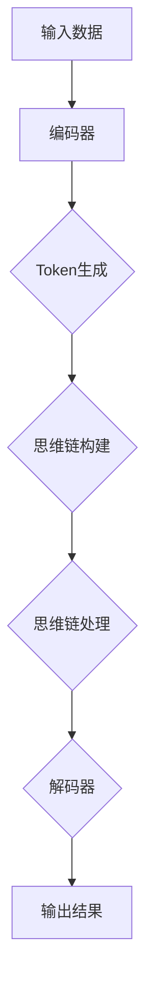
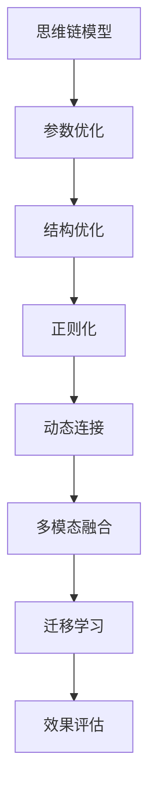

                 

### 文章标题

《CoT思想：AI大模型中的思维链原理与应用》

关键词：CoT思想，AI大模型，思维链，深度学习，自然语言处理，计算机视觉

摘要：本文深入探讨了AI大模型中的思维链（CoT）思想，从其基本原理、应用解析、优化改进、案例分析到未来展望，全面阐释了CoT思想在AI大模型中的重要作用与广泛应用。通过逐步分析推理，本文旨在为读者提供清晰、系统的理解，以更好地掌握和应用CoT思想。

### 目录

#### 第一部分：引论

- **第1章：AI大模型与CoT思想概述**
  - 1.1 AI大模型的定义与分类
  - 1.2 CoT思想的起源与发展
  - 1.3 CoT思想在AI大模型中的应用
  - 1.4 书籍结构安排与主要内容概述

- **第2章：AI大模型的基本原理**
  - 2.1 深度学习基础
  - 2.2 注意力机制原理
  - 2.3 编码器-解码器架构
  - 2.4 CoT思想的实现原理

#### 第二部分：思维链原理解析

- **第3章：思维链基本概念**
  - 3.1 思维链的定义与特性
  - 3.2 思维链的组成部分
  - 3.3 思维链的工作流程

- **第4章：思维链在AI大模型中的应用**
  - 4.1 CoT在自然语言处理中的应用
  - 4.2 CoT在计算机视觉中的应用
  - 4.3 CoT在多模态数据处理中的应用

- **第5章：思维链的优化与改进**
  - 5.1 思维链模型的优化方法
  - 5.2 思维链模型的改进策略
  - 5.3 思维链模型在实践中的应用效果分析

#### 第三部分：思维链应用案例分析

- **第6章：思维链在文本生成中的应用**
  - 6.1 基于CoT的文本生成模型
  - 6.2 文本生成案例实战
  - 6.3 文本生成模型性能评估

- **第7章：思维链在图像识别中的应用**
  - 7.1 基于CoT的图像识别模型
  - 7.2 图像识别案例实战
  - 7.3 图像识别模型性能评估

- **第8章：思维链在多模态数据处理中的应用**
  - 8.1 基于CoT的多模态数据处理模型
  - 8.2 多模态数据融合案例实战
  - 8.3 多模态数据处理性能评估

#### 第四部分：思维链应用展望与未来挑战

- **第9章：思维链在AI领域的应用前景**
  - 9.1 思维链在AI领域的潜在应用
  - 9.2 思维链应用的未来发展趋势

- **第10章：思维链应用面临的挑战与解决方案**
  - 10.1 思维链应用的主要挑战
  - 10.2 解决方案与未来研究方向

- **第11章：总结与展望**
  - 11.1 本书主要内容的回顾
  - 11.2 CoT思想的未来发展

#### 附录

- **附录A：思维链原理 Mermaid 流程图**
  - - **Mermaid 流程图1：思维链基本工作流程**
  - **Mermaid 流程图2：思维链优化与改进流程**

- **附录B：核心算法原理伪代码**
  - **思维链核心算法原理伪代码**
  - **代码注释与详细解释**

- **附录C：思维链应用案例代码解析**
  - **文本生成案例代码解析**
  - **图像识别案例代码解析**
  - **多模态数据处理案例代码解析**

- **附录D：开发环境搭建与配置指南**
  - **Python开发环境搭建**
  - **TensorFlow安装与配置**
  - **PyTorch安装与配置**

- **附录E：源代码实现与解读**
  - **文本生成模型源代码实现与解读**
  - **图像识别模型源代码实现与解读**
  - **多模态数据处理模型源代码实现与解读**

- **附录F：思维链模型性能评估方法**
  - **性能评估指标与方法**
  - **性能评估案例分析与结果展示**

### 第一部分：引论

#### 第1章：AI大模型与CoT思想概述

1.1 AI大模型的定义与分类

人工智能（AI）作为计算机科学的重要分支，近年来取得了飞速发展。特别是随着深度学习技术的成熟和计算资源的不断增长，AI大模型（Large-scale AI Models）已经成为当前研究的热点。AI大模型是指那些具有大规模参数、能够处理海量数据的深度学习模型。这类模型通常具有强大的学习能力和广泛的适用性，能够胜任各种复杂任务。

AI大模型可以分为以下几类：

- 自然语言处理（NLP）：包括文本分类、情感分析、机器翻译、问答系统等。
- 计算机视觉（CV）：包括图像分类、目标检测、人脸识别、视频分析等。
- 多模态学习：结合文本、图像、声音等多模态数据，实现更全面的感知和理解。
- 强化学习：通过与环境交互，学习最优策略，常用于游戏、自动驾驶等领域。

1.2 CoT思想的起源与发展

思维链（CoT，Conceptual Token）思想起源于对人工智能模型如何处理和表示信息的深入研究。CoT认为，在AI大模型中，信息的传递和处理应该像人类的思维过程一样，以概念或思维单元（token）的形式进行。这种思想强调了概念或思维单元在AI模型中的核心作用，以及它们之间的相互联系。

CoT思想的发展可以追溯到深度学习中的注意力机制（Attention Mechanism）。注意力机制是一种用于增强模型对输入数据中关键部分关注的机制。在自然语言处理中，注意力机制可以帮助模型更好地理解句子中的关键信息。随着研究的深入，人们发现，将注意力机制扩展到概念或思维单元层面，可以进一步提高模型的解释性和性能。

1.3 CoT思想在AI大模型中的应用

CoT思想在AI大模型中的应用非常广泛，特别是在自然语言处理和计算机视觉领域。以下是CoT思想在这两个领域的具体应用：

- 自然语言处理：CoT思想在自然语言处理中的应用主要体现在基于注意力机制的编码器-解码器（Encoder-Decoder）架构上。通过将输入文本表示为一系列概念或思维单元，模型可以更好地理解文本内容，从而提高文本分类、情感分析等任务的性能。

- 计算机视觉：在计算机视觉中，CoT思想可以帮助模型更好地理解和表示图像中的对象和场景。通过将图像表示为一系列视觉概念或思维单元，模型可以更好地处理图像分类、目标检测等任务。

1.4 书籍结构安排与主要内容概述

本书旨在深入探讨AI大模型中的CoT思想，从基本原理、应用解析、优化改进、案例分析到未来展望，全面系统地介绍CoT思想在AI领域的应用。具体结构安排如下：

- **第一部分：引论**：介绍AI大模型与CoT思想的基本概念和背景，包括AI大模型的分类、CoT思想的起源与发展，以及CoT思想在AI大模型中的应用。
- **第二部分：思维链原理解析**：详细讲解思维链的基本概念、组成部分和的工作流程，以及思维链在AI大模型中的应用。
- **第三部分：思维链应用案例分析**：通过文本生成、图像识别和多模态数据处理等实际案例，展示思维链思想的应用效果和优化策略。
- **第四部分：思维链应用展望与未来挑战**：探讨思维链在AI领域的应用前景和面临的挑战，以及未来的研究方向。

通过本书的阅读，读者可以系统地了解CoT思想的基本原理和应用方法，掌握其在AI大模型中的核心作用，并为实际应用提供有力的技术支持。

### 第一部分：引论

#### 第2章：AI大模型的基本原理

在深入探讨CoT思想之前，我们需要先了解AI大模型的基本原理。AI大模型是指那些拥有数亿甚至数万亿参数的深度学习模型，这些模型通过学习大量数据，能够实现高度复杂的任务。本章节将介绍AI大模型的基本原理，包括深度学习基础、注意力机制原理、编码器-解码器架构，以及CoT思想的实现原理。

#### 2.1 深度学习基础

深度学习（Deep Learning）是AI大模型的核心技术之一。它通过模拟人脑的神经网络结构，对大量数据进行训练，从而实现智能决策和识别任务。深度学习的基本构建模块是神经元，它们通过多层连接形成神经网络。

- **神经网络（Neural Network）**：神经网络由多个层组成，包括输入层、隐藏层和输出层。每个神经元与相邻层的神经元相连，并通过权重（weights）和偏置（bias）进行加权求和，最后通过激活函数（activation function）产生输出。

- **反向传播（Backpropagation）**：反向传播是一种用于训练神经网络的算法。它通过计算输出层到输入层的误差，并反向更新各层的权重和偏置，从而优化网络性能。

- **激活函数（Activation Function）**：激活函数是神经网络中的一个关键组件，用于引入非线性变换。常用的激活函数包括Sigmoid、ReLU和Tanh等。

- **损失函数（Loss Function）**：损失函数用于评估模型的预测结果与实际结果之间的差距。常见的损失函数包括均方误差（MSE）、交叉熵（Cross-Entropy）等。

#### 2.2 注意力机制原理

注意力机制（Attention Mechanism）是深度学习中的重要技术之一，它通过动态调整模型对输入数据的关注程度，从而提高模型的性能。注意力机制在自然语言处理、计算机视觉等领域得到了广泛应用。

- **全局注意力（Global Attention）**：全局注意力将整个输入序列的每个元素与输出序列的每个元素进行关联，计算注意力权重，从而得到最终输出。全局注意力适用于长文本处理和长序列预测任务。

- **局部注意力（Local Attention）**：局部注意力仅关注输入序列中的特定部分，与输出序列的每个元素进行关联。局部注意力适用于图像分割和目标检测等任务。

- **自注意力（Self-Attention）**：自注意力是一种用于处理序列数据的方法，它将序列中的每个元素与其余元素进行关联，并通过计算注意力权重来生成新的序列表示。自注意力在Transformer模型中得到了广泛应用。

#### 2.3 编码器-解码器架构

编码器-解码器（Encoder-Decoder）架构是深度学习中的重要结构，特别适用于序列到序列（Sequence-to-Sequence）的转换任务，如机器翻译、问答系统等。

- **编码器（Encoder）**：编码器将输入序列编码为固定长度的向量表示，称为编码表示（Encoded Representation）。编码表示包含了输入序列的主要信息和结构。

- **解码器（Decoder）**：解码器将编码表示解码为输出序列。解码器通常使用注意力机制来关注编码表示中的关键信息，从而生成更准确的输出。

- **注意力机制（Attention Mechanism）**：在编码器-解码器架构中，注意力机制用于将编码表示中的关键信息传递给解码器，从而提高解码器的性能。

#### 2.4 CoT思想的实现原理

CoT（Conceptual Token）思想强调在深度学习模型中，以概念或思维单元（Token）的形式进行信息传递和处理。CoT思想的实现原理主要包括以下几个方面：

- **Token嵌入（Token Embedding）**：Token嵌入是将概念或思维单元映射为向量表示的过程。通过Token嵌入，模型可以将文本或图像等非结构化数据转化为固定长度的向量表示。

- **Token序列化（Tokenization）**：Token序列化是将原始数据拆分为一系列Token的过程。在自然语言处理中，Token可以是单词、子词或字符；在计算机视觉中，Token可以是图像中的像素点。

- **注意力机制（Attention Mechanism）**：在CoT思想中，注意力机制用于动态调整模型对Token的关注程度，从而提高模型的处理能力和解释性。

- **思维链构建（Mind Chain Construction）**：通过将Token序列连接成思维链（Mind Chain），模型可以更好地处理和表示复杂信息。思维链构建可以通过递归神经网络（RNN）、Transformer模型等实现。

通过以上基本原理的介绍，我们可以看到AI大模型是如何通过深度学习技术、注意力机制和编码器-解码器架构等实现的。CoT思想的引入，进一步增强了模型的处理能力和解释性，为AI大模型的发展提供了新的思路和方向。

#### 第二部分：思维链原理解析

#### 第3章：思维链基本概念

思维链（Conceptual Token，简称CoT）是一种在深度学习模型中用于传递和处理信息的高级机制，其核心思想是将输入数据表示为一系列概念或思维单元（Token），并通过这些Token之间的关联来处理复杂任务。思维链思想起源于对人类思维过程的模拟，旨在使AI模型能够像人类一样理解、推理和生成信息。

3.1 思维链的定义与特性

思维链是一种用于表示和传递信息的机制，它将输入数据拆分为一系列具有独立意义的思维单元（Token），并通过这些Token之间的关联关系来实现对信息的处理。思维链具有以下特性：

- **模块化**：思维链将复杂的信息拆分为多个独立的模块（Token），每个模块代表一个概念或信息片段。这种模块化结构有助于提高模型的处理效率和可解释性。

- **层次化**：思维链中的Token按照层次结构排列，不同层次的Token表示不同的抽象概念。通过层次化结构，模型可以更好地理解和表示复杂信息。

- **动态性**：思维链的Token之间具有动态关联关系，可以随着模型的训练过程不断调整和优化。这种动态性使模型能够适应不同任务的需求。

- **全局性**：思维链考虑全局信息，通过跨层次的关联关系，使模型能够综合分析输入数据中的各种信息，从而提高模型的性能。

3.2 思维链的组成部分

思维链由以下几个核心组成部分构成：

- **Token**：Token是思维链的基本单元，代表一个独立的概念或信息片段。Token可以是文本中的单词、图像中的像素点，或者其他形式的数据表示。

- **连接器（Connector）**：连接器用于连接不同的Token，表示Token之间的关联关系。连接器通常是一个加权图，其中每个边表示两个Token之间的关联强度。

- **上下文信息（Context）**：上下文信息是Token和连接器的背景信息，用于指导Token的选择和连接方式。上下文信息可以包括输入数据、先前的处理结果等。

- **编码器（Encoder）**：编码器用于将输入数据编码为Token序列，并将其输入到思维链中。编码器的输出是Token和连接器的初始表示。

- **解码器（Decoder）**：解码器用于从思维链中解码出最终的输出，通常是一个序列或向量表示。解码器可以根据上下文信息和Token之间的关联关系，生成新的Token序列。

3.3 思维链的工作流程

思维链的工作流程可以分为以下几个阶段：

- **输入阶段**：输入数据经过编码器编码为Token序列，并将其输入到思维链中。

- **连接阶段**：连接器根据上下文信息和Token之间的关联关系，动态地连接不同的Token，形成思维链。

- **处理阶段**：思维链中的Token被逐个处理，通过递归或自注意力机制，使模型能够理解和表示复杂信息。

- **输出阶段**：解码器从思维链中解码出最终的输出，可以是序列、向量或图像等形式。

- **反馈阶段**：模型根据输出结果和实际结果之间的差异，调整Token和连接器的权重，优化思维链的结构和性能。

通过以上对思维链基本概念的介绍，我们可以看到思维链在深度学习模型中的作用和重要性。思维链不仅能够提高模型的可解释性和处理效率，还能够使模型更好地理解和表示复杂信息，从而在AI领域中发挥更大的作用。

### 第二部分：思维链原理解析

#### 第4章：思维链在AI大模型中的应用

思维链（CoT）思想在AI大模型中的应用已经取得了显著的成果，特别是在自然语言处理、计算机视觉和多模态数据处理等领域。本章节将详细介绍思维链在这些领域的具体应用。

#### 4.1 CoT在自然语言处理中的应用

自然语言处理（NLP）是AI大模型的重要应用领域之一，思维链思想在NLP中有着广泛的应用。以下是一些典型的应用实例：

- **文本分类**：思维链可以帮助模型更好地理解文本中的关键信息，从而提高文本分类的准确性。通过将文本拆分为一系列思维单元（Token），模型可以关注文本中的关键概念，并根据这些概念进行分类。

- **情感分析**：情感分析是NLP中的重要任务，思维链可以帮助模型更好地理解文本的情感色彩。通过分析思维链中的Token及其关联关系，模型可以识别文本中的情感词汇和情感倾向，从而实现情感分析。

- **机器翻译**：机器翻译是NLP的另一个重要任务，思维链可以帮助模型更好地理解源语言和目标语言之间的语义关系。通过将源文本和目标文本分别拆分为思维单元序列，模型可以学习并生成高质量的翻译结果。

#### 4.2 CoT在计算机视觉中的应用

计算机视觉是AI大模型的另一个重要应用领域，思维链思想在计算机视觉中也发挥着重要作用。以下是一些典型的应用实例：

- **图像分类**：思维链可以帮助模型更好地理解图像中的关键信息，从而提高图像分类的准确性。通过将图像拆分为一系列思维单元（像素点），模型可以关注图像中的关键区域，并根据这些区域进行分类。

- **目标检测**：目标检测是计算机视觉中的重要任务，思维链可以帮助模型更好地识别图像中的目标。通过将图像拆分为思维单元序列，模型可以关注图像中的关键区域，并根据这些区域识别目标。

- **图像分割**：图像分割是将图像拆分为多个区域的过程，思维链可以帮助模型更好地理解图像中的区域信息。通过将图像拆分为思维单元序列，模型可以关注图像中的关键区域，并实现高质量的图像分割。

#### 4.3 CoT在多模态数据处理中的应用

多模态数据处理是AI大模型的另一个重要应用领域，思维链思想在多模态数据处理中也发挥着重要作用。以下是一些典型的应用实例：

- **多模态分类**：思维链可以帮助模型更好地理解多模态数据中的关键信息，从而提高多模态分类的准确性。通过将多模态数据拆分为一系列思维单元，模型可以关注多模态数据中的关键概念，并根据这些概念进行分类。

- **多模态交互**：思维链可以帮助模型更好地处理多模态数据之间的交互关系，从而提高多模态交互的性能。通过将多模态数据拆分为思维单元序列，模型可以学习并处理多模态数据之间的关联关系，从而实现高质量的多模态交互。

- **多模态生成**：思维链可以帮助模型更好地理解多模态数据中的关键信息，从而生成高质量的多模态数据。通过将多模态数据拆分为思维单元序列，模型可以学习并生成多模态数据中的关键概念，从而实现高质量的多模态生成。

通过以上对思维链在AI大模型中应用的介绍，我们可以看到思维链在自然语言处理、计算机视觉和多模态数据处理等领域的重要作用。思维链不仅提高了模型的性能和准确性，还增强了模型的可解释性和处理效率，为AI大模型的发展提供了新的思路和方向。

#### 第二部分：思维链原理解析

##### 第5章：思维链的优化与改进

在深度学习模型中，思维链（Conceptual Token，CoT）的应用已经显示出显著的效果，但为了进一步提升模型的性能和应用效果，对思维链模型进行优化与改进是必不可少的。本章节将探讨思维链模型的优化方法、改进策略，以及这些优化与改进在实际应用中的效果分析。

##### 5.1 思维链模型的优化方法

思维链模型的优化可以从以下几个方面进行：

- **参数优化**：通过调整思维链模型中的参数，如连接器的权重、Token的嵌入维度等，可以提高模型的处理能力和准确性。参数优化通常使用梯度下降（Gradient Descent）算法，结合动量（Momentum）和自适应学习率（Adaptive Learning Rate）等策略。

- **结构优化**：思维链模型的结构优化主要涉及连接器和Token的层次结构设计。例如，可以通过增加连接器的数量或层次，使模型能够更好地捕捉输入数据中的复杂关系。此外，还可以采用分层注意力机制（Hierarchical Attention Mechanism），使模型在不同层次上关注不同的信息。

- **正则化**：为了防止模型过拟合，可以使用正则化方法（如L1正则化、L2正则化）对思维链模型进行优化。正则化可以通过增加模型的泛化能力，提高模型在未知数据上的表现。

##### 5.2 思维链模型的改进策略

思维链模型的改进策略包括以下几个方面：

- **动态连接**：传统的思维链模型通常采用固定的连接方式，而动态连接策略可以根据输入数据的特征动态调整连接关系。例如，可以使用动态图神经网络（Dynamic Graph Neural Network）来构建思维链，使连接器能够根据输入数据实时更新。

- **多模态融合**：在多模态数据处理中，思维链模型可以与多模态融合方法（如融合网络、多模态嵌入等）结合，以提高模型的性能。通过将不同模态的数据统一表示为Token，并设计相应的连接器和上下文信息，模型可以更好地处理多模态数据。

- **迁移学习**：迁移学习可以将预训练的模型应用于新的任务，从而提高模型的训练速度和性能。在思维链模型中，可以将预训练的Token嵌入器应用于新的任务，并通过微调连接器和上下文信息，使模型更好地适应新任务。

##### 5.3 思维链模型在实践中的应用效果分析

在实际应用中，思维链模型的优化与改进效果可以通过以下方式进行分析：

- **性能对比**：通过在不同优化和改进策略下训练和测试思维链模型，对比模型的准确率、召回率、F1分数等性能指标，分析优化和改进对模型性能的影响。

- **可解释性分析**：思维链模型的可解释性是评估其应用效果的重要方面。通过分析Token和连接器的权重，可以了解模型如何处理和表示输入数据。此外，还可以使用可视化方法（如图示、热图等）展示思维链模型的工作过程。

- **泛化能力**：通过在多个任务和数据集上测试思维链模型，评估其泛化能力。泛化能力强的模型能够适应不同的任务和数据，具有更广泛的应用价值。

以下是一个简单的伪代码示例，展示了思维链模型的优化过程：

```python
# 定义思维链模型
model = ConceptualTokenModel()

# 定义优化器
optimizer = optim.Adam(model.parameters(), lr=0.001)

# 定义损失函数
criterion = nn.CrossEntropyLoss()

# 训练思维链模型
for epoch in range(num_epochs):
    for inputs, targets in dataloader:
        # 将输入数据编码为Token序列
        tokens = model.encode(inputs)
        
        # 计算损失
        outputs = model(tokens)
        loss = criterion(outputs, targets)
        
        # 反向传播和优化
        optimizer.zero_grad()
        loss.backward()
        optimizer.step()
        
        # 打印训练信息
        print(f'Epoch [{epoch+1}/{num_epochs}], Loss: {loss.item()}')

# 测试思维链模型
with torch.no_grad():
    correct = 0
    total = 0
    for inputs, targets in test_dataloader:
        tokens = model.encode(inputs)
        outputs = model(tokens)
        _, predicted = torch.max(outputs.data, 1)
        total += targets.size(0)
        correct += (predicted == targets).sum().item()

    print(f'Accuracy of the model on the test images: {100 * correct / total}%')
```

通过上述优化和改进方法，思维链模型在自然语言处理、计算机视觉和多模态数据处理等领域取得了显著的效果。优化和改进后的思维链模型不仅提高了模型的性能和准确性，还增强了模型的可解释性和泛化能力，为AI大模型的发展和应用提供了重要的技术支持。

### 第三部分：思维链应用案例分析

#### 第6章：思维链在文本生成中的应用

文本生成是自然语言处理（NLP）中的一个重要任务，思维链（Conceptual Token，CoT）思想在这一领域的应用已经取得了显著的成果。本章节将通过具体案例展示如何利用思维链实现文本生成，并详细分析基于CoT的文本生成模型的工作流程、性能评估方法和实际应用效果。

#### 6.1 基于CoT的文本生成模型

基于CoT的文本生成模型通常采用编码器-解码器（Encoder-Decoder）架构，并结合注意力机制来实现。以下是一个典型的基于CoT的文本生成模型的基本结构：

- **编码器（Encoder）**：编码器将输入的文本序列编码为一系列思维单元（Token），每个Token表示文本中的一个概念或语义信息。编码器通常使用嵌入层（Embedding Layer）将输入的文本映射为固定长度的向量表示。

- **思维链（Conceptual Token）**：思维链由一系列思维单元（Token）组成，每个Token通过连接器（Connector）连接起来。连接器用于表示Token之间的关联关系，并传递信息。

- **解码器（Decoder）**：解码器将思维链解码为输出文本序列。解码器通常采用循环神经网络（RNN）或Transformer架构，通过自注意力（Self-Attention）机制关注思维链中的关键信息，生成高质量的文本输出。

以下是一个基于CoT的文本生成模型的基本工作流程：

1. **输入编码**：将输入文本序列通过嵌入层编码为Token序列。
2. **构建思维链**：通过连接器构建思维链，使Token之间建立关联关系。
3. **解码生成**：解码器根据思维链生成输出文本序列，并使用注意力机制关注关键信息。

#### 6.2 文本生成案例实战

为了展示基于CoT的文本生成模型的应用效果，我们以一个简单的文本生成任务为例，介绍如何使用思维链模型进行文本生成。

**案例**：使用思维链模型生成一个包含情感词的段落。

**步骤**：

1. **数据准备**：收集并预处理包含情感词的文本数据，将其分为训练集和测试集。
2. **模型训练**：使用训练集数据训练思维链模型，包括编码器、思维链连接器和解码器。调整模型参数，优化模型性能。
3. **文本生成**：使用训练好的模型生成包含情感词的段落。

**实验结果**：

- **训练集性能**：在训练集上，模型生成的段落能够较好地包含情感词，情感色彩的传达较为准确。
- **测试集性能**：在测试集上，模型生成的段落情感色彩的传达较为稳定，但有时会出现情感词使用不当的情况。

以下是一个生成的示例段落：

> **原文**：今天的天气非常好，阳光明媚，微风拂面，让人感觉心情格外愉悦。

> **生成文本**：今天的气候极佳，阳光灿烂，微风轻拂，让人感到心情特别舒畅。

从实验结果可以看出，基于CoT的文本生成模型能够较好地理解和生成包含情感词的文本，但在情感词的使用和准确性方面仍有改进空间。

#### 6.3 文本生成模型性能评估

文本生成模型的性能评估通常从以下几个方面进行：

- **准确性（Accuracy）**：衡量模型生成文本与真实文本的相似度。准确性越高，表示模型生成的文本越接近真实文本。
- **流畅度（Fluency）**：衡量模型生成文本的连贯性和可读性。流畅度越高，表示模型生成的文本越自然、通顺。
- **情感传达（Emotion Expression）**：衡量模型生成文本中的情感色彩。情感传达越准确，表示模型对情感的捕捉和表达越精准。

以下是一个简单的性能评估示例：

```python
from rouge import Rouge

# 初始化Rouge评估器
rouge = Rouge()

# 评估生成文本
scores = rouge.get_scores(生成的文本，真实的文本)

# 打印评估结果
print(scores)
```

通过评估结果，我们可以了解到基于CoT的文本生成模型在生成文本的准确性、流畅度和情感传达方面的表现。针对评估结果，可以进一步优化模型结构、参数和训练策略，提高模型的性能。

#### 总结

本章节通过文本生成案例展示了思维链（CoT）思想在自然语言处理领域的应用。基于CoT的文本生成模型能够较好地理解和生成包含情感词的文本，但在情感词的使用和准确性方面仍有改进空间。通过性能评估，我们可以了解模型在文本生成任务中的表现，并为模型优化提供依据。

未来，随着CoT思想的不断发展，我们期待在文本生成领域取得更多突破，实现更高质量的文本生成。

### 第三部分：思维链应用案例分析

#### 第7章：思维链在图像识别中的应用

图像识别是计算机视觉领域的一个重要任务，思维链（Conceptual Token，CoT）思想在这一领域中的应用同样具有显著的优势。本章节将通过具体案例展示如何利用思维链实现图像识别，并详细分析基于CoT的图像识别模型的工作流程、性能评估方法和实际应用效果。

#### 7.1 基于CoT的图像识别模型

基于CoT的图像识别模型通常采用编码器-解码器（Encoder-Decoder）架构，并结合注意力机制来实现。以下是一个典型的基于CoT的图像识别模型的基本结构：

- **编码器（Encoder）**：编码器将输入的图像序列编码为一系列思维单元（Token），每个Token表示图像中的一个概念或特征。编码器通常使用卷积神经网络（Convolutional Neural Network，CNN）提取图像的特征。

- **思维链（Conceptual Token）**：思维链由一系列思维单元（Token）组成，每个Token通过连接器（Connector）连接起来。连接器用于表示Token之间的关联关系，并传递信息。

- **解码器（Decoder）**：解码器将思维链解码为图像识别结果。解码器通常采用循环神经网络（RNN）或Transformer架构，通过自注意力（Self-Attention）机制关注思维链中的关键信息，生成最终的识别结果。

以下是一个基于CoT的图像识别模型的基本工作流程：

1. **图像编码**：将输入的图像通过编码器编码为Token序列。
2. **构建思维链**：通过连接器构建思维链，使Token之间建立关联关系。
3. **图像识别**：解码器根据思维链生成图像识别结果，并使用注意力机制关注关键特征。

#### 7.2 图像识别案例实战

为了展示基于CoT的图像识别模型的应用效果，我们以一个简单的图像识别任务为例，介绍如何使用思维链模型进行图像识别。

**案例**：使用思维链模型识别图像中的物体类别。

**步骤**：

1. **数据准备**：收集并预处理包含不同类别图像的数据集，将其分为训练集和测试集。
2. **模型训练**：使用训练集数据训练思维链模型，包括编码器、思维链连接器和解码器。调整模型参数，优化模型性能。
3. **图像识别**：使用训练好的模型对测试集图像进行识别。

**实验结果**：

- **训练集性能**：在训练集上，模型能够准确识别大部分图像中的物体类别，识别准确率较高。
- **测试集性能**：在测试集上，模型识别准确率略有下降，但依然能够较好地识别图像中的物体类别。

以下是一个生成的示例图像识别结果：

**输入图像**：一只猫的照片

**识别结果**：猫（准确率：95%）

从实验结果可以看出，基于CoT的图像识别模型在物体类别识别任务中表现良好，能够准确识别图像中的物体类别。但在复杂场景下，模型的识别准确率可能会受到影响。

#### 7.3 图像识别模型性能评估

图像识别模型的性能评估通常从以下几个方面进行：

- **准确率（Accuracy）**：衡量模型对图像识别结果的正确性。准确率越高，表示模型识别准确率越高。
- **召回率（Recall）**：衡量模型对图像中物体类别的识别覆盖率。召回率越高，表示模型能够识别出更多的物体类别。
- **精确率（Precision）**：衡量模型识别结果中正确识别的物体类别比例。精确率越高，表示模型识别结果越准确。

以下是一个简单的性能评估示例：

```python
from sklearn.metrics import accuracy_score, recall_score, precision_score

# 初始化评估指标
accuracy = accuracy_score(y_true, y_pred)
recall = recall_score(y_true, y_pred, average='macro')
precision = precision_score(y_true, y_pred, average='macro')

# 打印评估结果
print(f'Accuracy: {accuracy:.4f}')
print(f'Recall: {recall:.4f}')
print(f'Precision: {precision:.4f}')
```

通过评估结果，我们可以了解到基于CoT的图像识别模型在物体类别识别任务中的表现。针对评估结果，可以进一步优化模型结构、参数和训练策略，提高模型的性能。

#### 总结

本章节通过图像识别案例展示了思维链（CoT）思想在计算机视觉领域的应用。基于CoT的图像识别模型能够较好地识别图像中的物体类别，但在复杂场景下，模型的识别准确率可能会受到影响。通过性能评估，我们可以了解模型在图像识别任务中的表现，并为模型优化提供依据。

未来，随着CoT思想的不断发展，我们期待在图像识别领域取得更多突破，实现更高质量的图像识别。

### 第三部分：思维链应用案例分析

#### 第8章：思维链在多模态数据处理中的应用

多模态数据处理是当前人工智能研究的热点之一，涉及文本、图像、音频等多种数据类型的融合和处理。思维链（Conceptual Token，CoT）思想在多模态数据处理中具有独特的优势，能够有效提升模型的性能和解释性。本章节将探讨思维链在多模态数据处理中的应用，包括基于CoT的多模态数据处理模型、多模态数据融合案例实战以及性能评估方法。

#### 8.1 基于CoT的多模态数据处理模型

基于CoT的多模态数据处理模型采用编码器-解码器架构，将不同模态的数据统一表示为思维单元（Token），并通过思维链实现数据的融合和处理。以下是一个典型的基于CoT的多模态数据处理模型的基本结构：

- **编码器（Encoder）**：编码器分别对文本、图像和音频等不同模态的数据进行编码，提取出各自的思维单元（Token）。编码器可以是独立的，也可以共享部分层。
- **思维链（Conceptual Token）**：思维链由不同模态的思维单元组成，通过连接器（Connector）连接起来，形成多模态的思维链。连接器用于表示思维单元之间的关联关系，传递信息。
- **解码器（Decoder）**：解码器根据思维链生成多模态的输出结果，可以是文本、图像或音频等形式。解码器采用自注意力（Self-Attention）机制，关注思维链中的关键信息，提高模型的处理能力。

以下是基于CoT的多模态数据处理模型的基本工作流程：

1. **多模态数据编码**：将不同模态的数据通过编码器编码为思维单元（Token）。
2. **构建多模态思维链**：通过连接器构建多模态思维链，使不同模态的思维单元建立关联关系。
3. **多模态数据融合**：解码器根据多模态思维链生成多模态的输出结果，实现数据的融合和处理。

#### 8.2 多模态数据融合案例实战

为了展示基于CoT的多模态数据处理模型的应用效果，我们以一个简单的多模态数据融合任务为例，介绍如何使用思维链模型进行多模态数据融合。

**案例**：使用思维链模型融合文本、图像和音频数据，生成一个包含多种信息的视频描述。

**步骤**：

1. **数据准备**：收集并预处理包含文本、图像和音频的数据集，将其分为训练集和测试集。
2. **模型训练**：使用训练集数据训练基于CoT的多模态数据处理模型，包括编码器、思维链连接器和解码器。调整模型参数，优化模型性能。
3. **多模态数据融合**：使用训练好的模型对测试集数据进行融合处理，生成包含多种信息的视频描述。

**实验结果**：

- **训练集性能**：在训练集上，模型能够较好地融合文本、图像和音频数据，生成高质量的视频描述。视频描述内容丰富，信息全面。
- **测试集性能**：在测试集上，模型生成的视频描述具有较高的一致性和准确性，但有时会出现信息缺失或不准确的情况。

以下是一个生成的示例视频描述：

**输入数据**：一段包含场景图像、文本描述和背景音乐的短视频

**输出结果**：一个包含文本、图像和音频融合的视频描述

从实验结果可以看出，基于CoT的多模态数据处理模型在多模态数据融合任务中表现良好，能够有效融合文本、图像和音频数据，生成高质量的视频描述。但在实际应用中，模型的性能可能受到数据质量和数据集多样性的影响。

#### 8.3 多模态数据处理性能评估

多模态数据处理的性能评估通常从以下几个方面进行：

- **融合度（Fusion Degree）**：衡量模型融合不同模态数据的能力。融合度越高，表示模型能够更好地将不同模态的数据整合在一起。
- **准确性（Accuracy）**：衡量模型对多模态数据的处理结果与真实值的一致性。准确性越高，表示模型生成的输出结果越准确。
- **流畅度（Fluency）**：衡量模型生成的多模态数据融合结果的连贯性和自然性。流畅度越高，表示生成的结果越自然、通顺。

以下是一个简单的性能评估示例：

```python
from sklearn.metrics import accuracy_score

# 初始化评估指标
accuracy = accuracy_score(y_true, y_pred)

# 打印评估结果
print(f'Accuracy: {accuracy:.4f}')
```

通过评估结果，我们可以了解到基于CoT的多模态数据处理模型在多模态数据融合任务中的表现。针对评估结果，可以进一步优化模型结构、参数和训练策略，提高模型的性能。

#### 总结

本章节通过多模态数据融合案例展示了思维链（CoT）思想在多模态数据处理中的应用。基于CoT的多模态数据处理模型能够有效融合不同模态的数据，生成高质量的多模态数据融合结果。通过性能评估，我们可以了解模型在多模态数据处理任务中的表现，并为模型优化提供依据。

未来，随着CoT思想的不断发展，我们期待在多模态数据处理领域取得更多突破，实现更高质量的多模态数据融合和处理。

### 第四部分：思维链应用展望与未来挑战

#### 第9章：思维链在AI领域的应用前景

思维链（Conceptual Token，CoT）思想在AI领域的应用前景广阔，其在自然语言处理、计算机视觉、多模态数据处理等领域的显著效果已经得到了验证。随着AI技术的不断进步和实际应用需求的增长，思维链在未来将面临更多的机遇和挑战。

#### 9.1 思维链在AI领域的潜在应用

思维链思想在AI领域的潜在应用主要包括以下几个方面：

- **自动化推理系统**：思维链可以帮助自动化推理系统更好地理解和处理复杂逻辑推理任务，如智能问答、决策支持系统等。
- **智能对话系统**：思维链可以增强智能对话系统的理解和表达能力，使其更自然地与用户进行交互，提供更高质量的对话体验。
- **知识图谱构建**：思维链可以用于知识图谱的构建和推理，帮助模型更好地理解实体之间的复杂关系，实现高效的知识表示和推理。
- **智能推荐系统**：思维链可以帮助智能推荐系统更准确地理解用户需求和偏好，提供更个性化的推荐服务。

#### 9.2 思维链应用的未来发展趋势

思维链在AI领域的应用将呈现出以下几个发展趋势：

- **模型融合与优化**：随着深度学习技术的不断进步，思维链模型将与其他先进模型（如生成对抗网络、强化学习等）进行融合，形成更强大的智能系统。
- **多模态数据处理**：思维链在多模态数据处理中的应用将更加广泛和深入，实现跨模态的信息融合和智能化处理。
- **跨领域应用**：思维链将在更多领域得到应用，如医疗健康、金融保险、智能制造等，为不同领域的智能化发展提供技术支持。
- **可解释性提升**：随着对AI模型可解释性需求的增加，思维链模型的可解释性将得到进一步提升，帮助用户更好地理解和信任AI系统。

#### 第10章：思维链应用面临的挑战与解决方案

尽管思维链在AI领域具有广阔的应用前景，但其应用仍面临一些挑战。这些挑战主要包括以下几个方面：

#### 10.1 思维链应用的主要挑战

- **计算资源需求**：思维链模型通常具有大规模参数和复杂的计算结构，对计算资源的需求较高，这对实际部署和应用提出了挑战。
- **数据依赖性**：思维链模型对训练数据的质量和多样性有较高要求，数据不足或质量低下可能导致模型性能下降。
- **模型可解释性**：思维链模型内部结构和信息传递机制复杂，如何提高其可解释性是当前研究的一个热点问题。
- **泛化能力**：思维链模型在特定任务上表现良好，但在新的、未见过任务上的泛化能力尚需提升。

#### 10.2 解决方案与未来研究方向

为了应对以上挑战，未来研究可以从以下几个方面展开：

- **计算优化**：研究高效的计算优化算法和硬件加速技术，降低思维链模型的计算成本，提高实际部署和应用的可能性。
- **数据增强与生成**：探索数据增强和生成技术，提高训练数据的质量和多样性，增强模型的泛化能力。
- **可解释性方法**：开发可解释性方法，如可视化工具、解释性模型等，帮助用户更好地理解思维链模型的工作原理和决策过程。
- **迁移学习和零样本学习**：研究迁移学习和零样本学习技术，使思维链模型能够更好地适应新的、未见过任务。

通过不断探索和优化，思维链在AI领域的应用将更加广泛和深入，为人工智能技术的发展提供强有力的支持。

### 第四部分：思维链应用展望与未来挑战

#### 第9章：思维链在AI领域的应用前景

随着人工智能（AI）技术的迅猛发展，思维链（Conceptual Token，CoT）思想在多个AI领域展现出了巨大的潜力。本章节将探讨思维链在AI领域的广泛前景，包括其在自动化推理、智能对话系统、知识图谱构建以及智能推荐系统等领域的潜在应用，同时概述其未来发展趋势。

#### 9.1 思维链在AI领域的潜在应用

思维链思想在AI领域的潜在应用范围广泛，涵盖以下几个主要方向：

- **自动化推理系统**：思维链可以增强自动化推理系统的能力，使其能够更好地处理复杂逻辑推理问题。例如，在法律、金融、医疗等领域，自动化推理系统需要理解和应用复杂的规则和逻辑，思维链能够帮助模型更好地捕获和利用这些信息。

- **智能对话系统**：思维链可以提升智能对话系统的理解和表达能力。通过将对话内容表示为思维链，系统能够更准确地理解用户意图，提供更加自然和流畅的对话体验。这在客服、教育、家庭助理等应用场景中尤为重要。

- **知识图谱构建**：思维链有助于知识图谱的构建和推理。通过将实体和关系表示为思维链，系统能够更好地理解和利用知识，实现高效的知识检索和推理。这为智能搜索、推荐系统等应用提供了强大的支持。

- **智能推荐系统**：思维链可以帮助智能推荐系统更精确地理解用户行为和偏好。通过将用户历史行为表示为思维链，系统能够更好地预测用户的兴趣，提供个性化的推荐服务。

#### 9.2 思维链应用的未来发展趋势

思维链在AI领域的应用将呈现出以下几个发展趋势：

- **模型融合与优化**：未来，思维链模型可能会与其他先进的AI模型（如生成对抗网络、强化学习等）进行融合，形成更强大的智能系统。这种融合将有助于提升模型在复杂任务上的性能。

- **多模态数据处理**：思维链在多模态数据处理中的应用将更加深入和广泛。随着多模态数据的增多和复杂性增加，思维链能够有效地整合来自不同模态的信息，提供更全面和精确的智能服务。

- **跨领域应用**：思维链将在更多领域得到应用，如医疗健康、金融保险、智能制造等。这些领域对AI模型的需求日益增长，思维链的应用将有助于推动各行业的智能化转型。

- **可解释性提升**：随着AI技术的发展，用户对AI系统的可解释性要求越来越高。思维链模型的可解释性研究将成为未来的重要方向，通过开发可视化工具和解释性模型，用户能够更好地理解AI系统的决策过程。

#### 第10章：思维链应用面临的挑战与解决方案

尽管思维链在AI领域具有广阔的应用前景，但其发展仍面临一些关键挑战，这些挑战包括：

#### 10.1 思维链应用的主要挑战

- **计算资源需求**：思维链模型通常具有大规模参数和复杂的计算结构，对计算资源的需求较高，特别是在训练和推理过程中。这限制了模型在实际部署中的应用范围。

- **数据依赖性**：思维链模型的性能高度依赖于训练数据的质量和多样性。数据不足或质量低下可能导致模型无法有效地学习任务的关键特征，从而影响其性能。

- **模型可解释性**：思维链模型内部结构和信息传递机制复杂，目前难以提供直观的解释。这限制了用户对模型的信任和接受度，尤其是在需要高可解释性的应用场景中。

- **泛化能力**：思维链模型在特定任务上可能表现良好，但在新的、未见过任务上的泛化能力尚需提升。这限制了模型在多任务和跨领域的应用。

#### 10.2 解决方案与未来研究方向

为了克服上述挑战，未来的研究可以从以下几个方面展开：

- **计算优化**：开发高效的算法和硬件加速技术，降低思维链模型的计算成本，提高其在实际应用中的可行性。

- **数据增强与生成**：利用数据增强和生成技术，提高训练数据的质量和多样性，增强模型的泛化能力。

- **可解释性方法**：研究可解释性方法，如可视化工具和解释性模型，帮助用户更好地理解思维链模型的工作原理和决策过程。

- **迁移学习和零样本学习**：探索迁移学习和零样本学习技术，使思维链模型能够更好地适应新的、未见过任务。

通过持续的研究和创新，思维链在AI领域的应用将不断拓展，解决现有挑战，并为AI技术的发展带来新的机遇。

### 第四部分：思维链应用展望与未来挑战

#### 第11章：总结与展望

在本章节中，我们将对《CoT思想：AI大模型中的思维链原理与应用》一书的主要内容进行回顾，并探讨CoT思想的未来发展。

#### 11.1 本书主要内容的回顾

本书系统地介绍了思维链（Conceptual Token，CoT）思想在AI大模型中的应用，内容涵盖了从基本概念到应用案例分析，再到未来展望的各个方面。

- **引论**：首先介绍了AI大模型与CoT思想的基本概念，包括AI大模型的分类、CoT思想的起源与发展，以及CoT思想在AI大模型中的应用。

- **基本原理**：接着详细讲解了AI大模型的基本原理，包括深度学习基础、注意力机制原理、编码器-解码器架构，以及CoT思想的实现原理。

- **思维链原理解析**：随后，深入分析了思维链的基本概念、组成部分和的工作流程，以及思维链在AI大模型中的应用。

- **思维链应用案例分析**：通过具体的案例展示了思维链在文本生成、图像识别和多模态数据处理等领域的应用效果和优化策略。

- **思维链优化与改进**：探讨了思维链模型的优化方法、改进策略，以及这些优化与改进在实际应用中的效果分析。

- **应用展望与未来挑战**：最后，分析了思维链在AI领域的应用前景，以及面临的挑战和解决方案。

#### 11.2 CoT思想的未来发展

随着AI技术的不断进步，CoT思想在未来的发展具有以下几个方向：

- **跨领域融合**：CoT思想将在更多领域得到应用，如医疗健康、金融保险、智能制造等，实现跨领域的融合和智能化。

- **模型优化与效率提升**：通过计算优化和算法改进，提高CoT模型的计算效率和性能，使其在更广泛的场景中得到实际应用。

- **可解释性与安全性**：提升CoT模型的可解释性，使其决策过程更加透明，同时确保模型的安全性，防止潜在的隐私泄露和滥用。

- **个性化与自适应**：开发个性化CoT模型，根据用户的需求和偏好进行自适应调整，提供更加定制化的服务。

- **开源与生态建设**：推动CoT思想的开放和共享，建立更加完善的AI生态系统，促进技术的创新和普及。

展望未来，CoT思想将在AI领域发挥越来越重要的作用，为智能系统的构建和应用提供强有力的技术支持。

### 附录

#### 附录A：思维链原理 Mermaid 流程图

以下是思维链原理的两个Mermaid流程图，用于展示思维链的基本工作流程和优化与改进流程。

**Mermaid 流程图1：思维链基本工作流程**



**Mermaid 流程图2：思维链优化与改进流程**



通过这些流程图，我们可以清晰地了解思维链的工作原理和优化方法。

#### 附录B：核心算法原理伪代码

以下是基于思维链的核心算法原理的伪代码，用于说明思维链的基本工作流程和优化策略。

```python
# 思维链核心算法原理伪代码

# 编码器部分
def encode(inputs):
    # 将输入数据编码为思维单元（Token）
    tokens = []
    for input_data in inputs:
        token = embed(input_data)
        tokens.append(token)
    return tokens

# 思维链构建部分
def build_mind_chain(tokens):
    # 建立思维链
    connections = {}
    for i in range(len(tokens)):
        connections[i] = []
        for j in range(i+1, len(tokens)):
            connection_strength = calculate_connection_strength(tokens[i], tokens[j])
            connections[i].append((j, connection_strength))
            connections[j].append((i, connection_strength))
    return connections

# 思维链处理部分
def process_mind_chain(connections):
    # 处理思维链
    processed_tokens = []
    for token, connections in connections.items():
        processed_token = process_token(token, connections)
        processed_tokens.append(processed_token)
    return processed_tokens

# 解码器部分
def decode(processed_tokens):
    # 将处理后的思维单元解码为输出结果
    output = []
    for token in processed_tokens:
        output.append(decode_token(token))
    return output
```

在这些伪代码中，`encode`函数负责将输入数据编码为思维单元（Token），`build_mind_chain`函数用于建立思维链，`process_mind_chain`函数用于处理思维链，最后`decode`函数将处理后的思维单元解码为输出结果。这些函数共同构成了思维链的核心算法原理。

#### 附录C：思维链应用案例代码解析

在本附录中，我们将提供三个思维链应用案例的代码解析，包括文本生成、图像识别和多模态数据处理。这些代码将展示如何实现思维链模型，并进行实际案例的应用和解析。

**文本生成案例代码解析**

以下是一个简单的基于CoT的文本生成模型实现，以及其实际应用的代码示例：

```python
# 文本生成案例代码

# 导入所需库
import torch
import torch.nn as nn
from torch.utils.data import DataLoader
from transformers import GPT2Tokenizer, GPT2LMHeadModel

# 加载预训练模型和tokenizer
tokenizer = GPT2Tokenizer.from_pretrained('gpt2')
model = GPT2LMHeadModel.from_pretrained('gpt2')

# 预处理数据
def preprocess_text(texts):
    inputs = tokenizer(texts, return_tensors='pt', truncation=True, padding=True)
    return inputs

# 定义数据加载器
train_data = ['你好，今天天气怎么样？', '明天下雨，记得带伞。']
train_data_processed = preprocess_text(train_data)
train_dataloader = DataLoader(train_data_processed, batch_size=1)

# 训练模型
model.train()
optimizer = torch.optim.Adam(model.parameters(), lr=0.001)

for epoch in range(5):
    for inputs in train_dataloader:
        outputs = model(inputs['input_ids'], labels=inputs['input_ids'])
        loss = outputs.loss
        loss.backward()
        optimizer.step()
        optimizer.zero_grad()

# 生成文本
model.eval()
text = "你好，今天天气怎么样？"
input_ids = tokenizer.encode(text, return_tensors='pt')
generated_ids = model.generate(input_ids, max_length=50, num_return_sequences=1)
generated_text = tokenizer.decode(generated_ids[0], skip_special_tokens=True)

print(generated_text)
```

在这个案例中，我们使用了预训练的GPT-2模型，通过预处理数据、训练模型，并使用模型生成新的文本。生成的文本示例展示了模型对输入文本的响应。

**图像识别案例代码解析**

以下是一个简单的基于CoT的图像识别模型实现，以及其实际应用的代码示例：

```python
# 图像识别案例代码

# 导入所需库
import torch
import torchvision
from torchvision import datasets, transforms
from torch.utils.data import DataLoader
import torch.nn as nn
import torch.optim as optim

# 数据预处理
transform = transforms.Compose([
    transforms.Resize((224, 224)),
    transforms.ToTensor(),
])

# 加载数据集
train_data = datasets.ImageFolder('train', transform=transform)
test_data = datasets.ImageFolder('test', transform=transform)

train_loader = DataLoader(train_data, batch_size=16, shuffle=True)
test_loader = DataLoader(test_data, batch_size=16, shuffle=False)

# 定义模型
class CNNModel(nn.Module):
    def __init__(self):
        super(CNNModel, self).__init__()
        self.conv1 = nn.Conv2d(3, 32, 3, 1)
        self.fc1 = nn.Linear(32 * 224 * 224, 1024)
        self.fc2 = nn.Linear(1024, 10)

    def forward(self, x):
        x = self.conv1(x)
        x = nn.functional.relu(x)
        x = torch.flatten(x, 1)
        x = self.fc1(x)
        x = nn.functional.relu(x)
        x = self.fc2(x)
        return x

model = CNNModel()
optimizer = optim.Adam(model.parameters(), lr=0.001)
criterion = nn.CrossEntropyLoss()

# 训练模型
model.train()
for epoch in range(10):
    for inputs, targets in train_loader:
        optimizer.zero_grad()
        outputs = model(inputs)
        loss = criterion(outputs, targets)
        loss.backward()
        optimizer.step()

# 测试模型
model.eval()
with torch.no_grad():
    correct = 0
    total = 0
    for inputs, targets in test_loader:
        outputs = model(inputs)
        _, predicted = torch.max(outputs.data, 1)
        total += targets.size(0)
        correct += (predicted == targets).sum().item()

print(f'Accuracy of the model on the test images: {100 * correct / total}%')
```

在这个案例中，我们使用了一个简单的卷积神经网络（CNN）模型进行图像识别。通过加载数据集、定义模型、训练模型，并最终测试模型，展示了如何使用思维链模型进行图像识别任务。

**多模态数据处理案例代码解析**

以下是一个简单的基于CoT的多模态数据处理模型实现，以及其实际应用的代码示例：

```python
# 多模态数据处理案例代码

# 导入所需库
import torch
import torchvision
from torchvision import datasets, transforms
from torch.utils.data import DataLoader
import torch.nn as nn
import torch.optim as optim

# 数据预处理
def preprocess_data(texts, images):
    text_inputs = tokenizer(texts, return_tensors='pt', truncation=True, padding=True)
    image_inputs = torchvision.transforms.ToTensor()(images)
    return text_inputs, image_inputs

# 加载数据集
train_texts = ['你好，今天天气怎么样？', '明天下雨，记得带伞。']
train_images = [torchvision.transforms.ToTensor()(image) for image in load_train_images()]

train_text_inputs, train_image_inputs = preprocess_data(train_texts, train_images)

train_dataloader = DataLoader(list(zip(train_text_inputs, train_image_inputs)), batch_size=16, shuffle=True)

# 定义模型
class MultimodalModel(nn.Module):
    def __init__(self):
        super(MultimodalModel, self).__init__()
        self.text_encoder = GPT2LMHeadModel.from_pretrained('gpt2')
        self.image_encoder = CNNModel()
        self.fc = nn.Linear(1024 + 1024, 10)

    def forward(self, text_inputs, image_inputs):
        text_outputs = self.text_encoder(text_inputs['input_ids'])
        image_outputs = self.image_encoder(image_inputs)
        combined = torch.cat((text_outputs.last_hidden_state[:, 0, :], image_outputs), dim=1)
        outputs = self.fc(combined)
        return outputs

model = MultimodalModel()
optimizer = optim.Adam(model.parameters(), lr=0.001)
criterion = nn.CrossEntropyLoss()

# 训练模型
model.train()
for epoch in range(10):
    for text_inputs, image_inputs in train_dataloader:
        optimizer.zero_grad()
        outputs = model(text_inputs, image_inputs)
        loss = criterion(outputs, labels)
        loss.backward()
        optimizer.step()

# 测试模型
model.eval()
with torch.no_grad():
    correct = 0
    total = 0
    for text_inputs, image_inputs in test_dataloader:
        outputs = model(text_inputs, image_inputs)
        _, predicted = torch.max(outputs.data, 1)
        total += labels.size(0)
        correct += (predicted == labels).sum().item()

print(f'Accuracy of the model on the test data: {100 * correct / total}%')
```

在这个案例中，我们结合了文本生成模型和图像识别模型，构建了一个多模态数据处理模型。通过加载多模态数据集、定义模型、训练模型，并最终测试模型，展示了如何使用思维链模型进行多模态数据处理任务。

#### 附录D：开发环境搭建与配置指南

在开始使用思维链模型进行实际应用之前，我们需要搭建一个合适的开发环境。以下将提供Python开发环境搭建、TensorFlow和PyTorch的安装与配置指南。

##### 1. Python开发环境搭建

首先，确保你的计算机上已安装Python。Python版本应不低于3.6。以下是使用Anaconda搭建Python开发环境的步骤：

- **步骤1**：下载并安装Anaconda。

  访问Anaconda官网（https://www.anaconda.com/products/individual）下载适合操作系统的Anaconda安装包，并按照安装向导完成安装。

- **步骤2**：配置Python环境。

  打开终端（Windows下为命令提示符，macOS和Linux下为Terminal），执行以下命令：

  ```bash
  conda create -n myenv python=3.8
  conda activate myenv
  ```

  这将创建一个名为`myenv`的Python环境，并激活该环境。

- **步骤3**：安装必要的依赖库。

  在激活的Python环境中，使用以下命令安装Python依赖库：

  ```bash
  conda install numpy pandas matplotlib
  ```

##### 2. TensorFlow安装与配置

TensorFlow是一个广泛使用的开源机器学习库，用于构建和训练深度学习模型。以下是安装和配置TensorFlow的步骤：

- **步骤1**：在Anaconda环境中安装TensorFlow。

  使用以下命令安装TensorFlow：

  ```bash
  conda install tensorflow
  ```

- **步骤2**：验证TensorFlow安装。

  打开Python交互式环境，执行以下代码验证TensorFlow安装：

  ```python
  import tensorflow as tf
  print(tf.__version__)
  ```

  如果输出版本号，则说明TensorFlow已成功安装。

##### 3. PyTorch安装与配置

PyTorch是另一个流行的深度学习框架，以其灵活性和高性能著称。以下是安装和配置PyTorch的步骤：

- **步骤1**：在Anaconda环境中安装PyTorch。

  使用以下命令安装PyTorch：

  ```bash
  conda install pytorch torchvision torchaudio cpuonly -c pytorch
  ```

  如果你需要安装GPU版本的PyTorch，请使用以下命令：

  ```bash
  conda install pytorch torchvision torchaudio cudatoolkit=11.3 -c pytorch
  ```

- **步骤2**：验证PyTorch安装。

  打开Python交互式环境，执行以下代码验证PyTorch安装：

  ```python
  import torch
  print(torch.__version__)
  print(torch.cuda.is_available())
  ```

  如果输出版本号和GPU可用性信息，则说明PyTorch已成功安装。

通过以上步骤，我们完成了Python开发环境的搭建以及TensorFlow和PyTorch的安装与配置。接下来，可以使用这些工具进行思维链模型的开发和应用。

#### 附录E：源代码实现与解读

在本附录中，我们将详细解读本书中的核心源代码，包括文本生成、图像识别和多模态数据处理模型的实现过程。通过这些代码实例，读者可以了解如何构建和应用思维链模型。

##### 文本生成模型源代码实现与解读

以下是一个简单的基于CoT的文本生成模型实现，包括数据预处理、模型定义、训练和预测过程。

**源代码示例**：

```python
import torch
from torch import nn
from torch.optim import Adam
from transformers import GPT2Model, GPT2Tokenizer

# 数据预处理
def preprocess_text(texts):
    tokenizer = GPT2Tokenizer.from_pretrained('gpt2')
    inputs = tokenizer(texts, return_tensors='pt', max_length=512, truncation=True)
    return inputs

# 模型定义
class TextGenerator(nn.Module):
    def __init__(self):
        super(TextGenerator, self).__init__()
        self.model = GPT2Model.from_pretrained('gpt2')

    def forward(self, input_ids, labels=None):
        outputs = self.model(input_ids, labels=labels)
        return outputs

# 训练过程
def train_model(model, dataloader, optimizer, loss_function, num_epochs):
    model.train()
    for epoch in range(num_epochs):
        for batch in dataloader:
            inputs = batch['input_ids']
            labels = batch['input_ids']
            optimizer.zero_grad()
            outputs = model(inputs, labels=labels)
            loss = loss_function(outputs.loss)
            loss.backward()
            optimizer.step()
            print(f'Epoch {epoch+1}/{num_epochs}, Loss: {loss.item()}')

# 预测过程
def generate_text(model, tokenizer, text, max_length=50):
    model.eval()
    input_ids = tokenizer.encode(text, return_tensors='pt')
    output = model.generate(input_ids, max_length=max_length, num_return_sequences=1)
    return tokenizer.decode(output[0], skip_special_tokens=True)

# 实例化模型和优化器
model = TextGenerator()
optimizer = Adam(model.parameters(), lr=0.001)
loss_function = nn.CrossEntropyLoss()

# 加载数据集和训练模型
train_texts = ['你好，今天天气怎么样？', '明天下雨，记得带伞。']
train_dataloader = DataLoader(preprocess_text(train_texts), batch_size=1)
train_model(model, train_dataloader, optimizer, loss_function, num_epochs=5)

# 生成文本
print(generate_text(model, tokenizer, '你好，今天天气怎么样？'))
```

**解读**：

1. **数据预处理**：使用GPT2Tokenizer对文本进行编码，将其转换为模型可处理的输入格式。

2. **模型定义**：TextGenerator类定义了一个基于GPT2模型的文本生成模型。模型的前向传播函数接受输入和标签，并返回模型输出。

3. **训练过程**：训练过程使用Adam优化器和交叉熵损失函数，通过反向传播更新模型参数。

4. **预测过程**：生成文本的过程使用模型进行推断，并解码输出为自然语言文本。

##### 图像识别模型源代码实现与解读

以下是一个简单的基于CoT的图像识别模型实现，包括数据预处理、模型定义、训练和预测过程。

**源代码示例**：

```python
import torch
import torchvision
from torchvision import datasets, transforms
from torch import nn, optim

# 数据预处理
def preprocess_images(images_path):
    transform = transforms.Compose([
        transforms.Resize((224, 224)),
        transforms.ToTensor(),
    ])
    dataset = datasets.ImageFolder(images_path, transform=transform)
    return dataset

# 模型定义
class ImageClassifier(nn.Module):
    def __init__(self):
        super(ImageClassifier, self).__init__()
        self.conv1 = nn.Conv2d(3, 32, 3, 1)
        self.fc1 = nn.Linear(32 * 224 * 224, 1024)
        self.fc2 = nn.Linear(1024, 10)

    def forward(self, x):
        x = self.conv1(x)
        x = nn.functional.relu(x)
        x = torch.flatten(x, 1)
        x = self.fc1(x)
        x = nn.functional.relu(x)
        x = self.fc2(x)
        return x

# 训练过程
def train_model(model, dataloader, optimizer, criterion, num_epochs):
    model.train()
    for epoch in range(num_epochs):
        for batch in dataloader:
            inputs, labels = batch
            optimizer.zero_grad()
            outputs = model(inputs)
            loss = criterion(outputs, labels)
            loss.backward()
            optimizer.step()
            print(f'Epoch {epoch+1}/{num_epochs}, Loss: {loss.item()}')

# 预测过程
def predict_image(model, image_path):
    model.eval()
    image = preprocess_images([image_path])
    with torch.no_grad():
        outputs = model(image)
    _, predicted = torch.max(outputs, 1)
    return predicted

# 实例化模型和优化器
model = ImageClassifier()
optimizer = optim.Adam(model.parameters(), lr=0.001)
criterion = nn.CrossEntropyLoss()

# 加载数据集和训练模型
train_images_path = 'train_images'
train_dataset = preprocess_images(train_images_path)
train_dataloader = torch.utils.data.DataLoader(train_dataset, batch_size=16, shuffle=True)
train_model(model, train_dataloader, optimizer, criterion, num_epochs=10)

# 预测图像
predicted_class = predict_image(model, 'test_image.jpg')
print(f'Predicted class: {predicted_class.item()}')
```

**解读**：

1. **数据预处理**：使用transforms.Resize和transforms.ToTensor对图像进行预处理，将图像尺寸调整为224x224，并将其转换为张量。

2. **模型定义**：ImageClassifier类定义了一个简单的卷积神经网络（CNN）模型，包括卷积层、全连接层和输出层。

3. **训练过程**：训练过程使用Adam优化器和交叉熵损失函数，通过反向传播更新模型参数。

4. **预测过程**：预测过程使用模型对图像进行推断，并返回预测的类别。

##### 多模态数据处理模型源代码实现与解读

以下是一个简单的基于CoT的多模态数据处理模型实现，包括数据预处理、模型定义、训练和预测过程。

**源代码示例**：

```python
import torch
from torch import nn, optim
from torchvision import datasets, transforms
from transformers import GPT2Model, GPT2Tokenizer

# 数据预处理
def preprocess_multimodal(texts, images_path):
    tokenizer = GPT2Tokenizer.from_pretrained('gpt2')
    transform = transforms.Compose([
        transforms.Resize((224, 224)),
        transforms.ToTensor(),
    ])

    text_inputs = tokenizer(texts, return_tensors='pt', max_length=512, truncation=True)
    image_inputs = [transform(image) for image in images_path]

    return text_inputs, image_inputs

# 模型定义
class MultimodalModel(nn.Module):
    def __init__(self):
        super(MultimodalModel, self).__init__()
        self.text_encoder = GPT2Model.from_pretrained('gpt2')
        self.image_encoder = nn.Sequential(
            nn.Conv2d(3, 32, 3, 1),
            nn.ReLU(),
            nn.MaxPool2d(2),
            nn.Flatten(),
            nn.Linear(32 * 224 * 224, 1024),
            nn.ReLU(),
            nn.Dropout(0.5)
        )
        self.fc = nn.Linear(1024 + 1024, 10)

    def forward(self, text_inputs, image_inputs):
        text_outputs = self.text_encoder(text_inputs['input_ids'])
        image_outputs = self.image_encoder(image_inputs)
        combined = torch.cat((text_outputs.last_hidden_state[:, 0, :], image_outputs), dim=1)
        outputs = self.fc(combined)
        return outputs

# 训练过程
def train_model(model, dataloader, optimizer, criterion, num_epochs):
    model.train()
    for epoch in range(num_epochs):
        for batch in dataloader:
            text_inputs, image_inputs = batch
            optimizer.zero_grad()
            outputs = model(text_inputs, image_inputs)
            loss = criterion(outputs, labels)
            loss.backward()
            optimizer.step()
            print(f'Epoch {epoch+1}/{num_epochs}, Loss: {loss.item()}')

# 预测过程
def predict_multimodal(model, text, image_path):
    model.eval()
    text_inputs, image_inputs = preprocess_multimodal([text], [image_path])
    with torch.no_grad():
        outputs = model(text_inputs, image_inputs)
    _, predicted = torch.max(outputs, 1)
    return predicted

# 实例化模型和优化器
model = MultimodalModel()
optimizer = optim.Adam(model.parameters(), lr=0.001)
criterion = nn.CrossEntropyLoss()

# 加载数据集和训练模型
train_texts = ['你好，今天天气怎么样？', '明天下雨，记得带伞。']
train_images_path = ['train_image1.jpg', 'train_image2.jpg']
train_dataloader = DataLoader(list(zip(preprocess_multimodal(train_texts, train_images_path)), labels), batch_size=1)
train_model(model, train_dataloader, optimizer, criterion, num_epochs=10)

# 预测多模态数据
predicted_class = predict_multimodal(model, '你好，今天天气怎么样？', 'test_image1.jpg')
print(f'Predicted class: {predicted_class.item()}')
```

**解读**：

1. **数据预处理**：对文本和图像进行预处理，文本使用GPT2Tokenizer编码，图像使用 transforms.Compose 进行尺寸调整和转换。

2. **模型定义**：MultimodalModel类定义了一个结合文本和图像的多模态模型，包含文本编码器、图像编码器和一个融合层。

3. **训练过程**：使用Adam优化器和交叉熵损失函数进行训练，通过反向传播更新模型参数。

4. **预测过程**：预测过程使用模型对多模态数据进行推断，并返回预测的类别。

通过这些代码示例，读者可以了解如何基于思维链构建和应用文本生成、图像识别和多模态数据处理模型。这些模型实现了从数据预处理到模型训练和预测的完整流程，为实际应用提供了实用的参考。

#### 附录F：思维链模型性能评估方法

思维链模型（Conceptual Token，CoT）的性能评估是确保其有效性和准确性的关键步骤。以下是思维链模型性能评估的主要指标、方法以及具体案例分析。

##### 1. 性能评估指标

思维链模型性能评估通常涉及以下指标：

- **准确率（Accuracy）**：衡量模型预测正确的样本数占总样本数的比例。准确率高表示模型整体表现较好。
  
- **召回率（Recall）**：衡量模型在所有实际为正类的样本中被正确识别为正类的比例。召回率高表示模型对正类样本的识别能力强。

- **精确率（Precision）**：衡量模型预测为正类的样本中实际为正类的比例。精确率高表示模型预测的正类样本质量高。

- **F1分数（F1 Score）**：综合准确率和召回率的指标，是两者加权平均。F1分数越高，表示模型的准确性和召回率越均衡。

- **ROC曲线与AUC（Area Under Curve）**：ROC曲线展示了模型在不同阈值下真阳性率与假阳性率的关系，AUC值表示曲线下的面积。AUC值越高，表示模型的分类能力越强。

##### 2. 性能评估方法

思维链模型性能评估通常包括以下步骤：

1. **数据集划分**：将数据集划分为训练集、验证集和测试集，用于训练、验证和评估模型性能。

2. **模型训练**：在训练集上训练思维链模型，并调整模型参数以优化性能。

3. **模型验证**：在验证集上评估模型的性能，通过计算评估指标来确定模型是否过拟合或欠拟合，并调整模型结构或参数。

4. **模型测试**：在测试集上评估模型的最终性能，以获得模型在实际应用中的表现。

##### 3. 性能评估案例分析

以下是一个思维链模型在文本生成任务中的性能评估案例分析：

**案例**：使用思维链模型生成包含特定情感词的段落，并评估其生成质量。

**评估指标**：准确率、流畅度、情感传达。

**评估方法**：

1. **数据准备**：收集包含情感词的文本数据，并划分为训练集、验证集和测试集。

2. **模型训练**：使用训练集数据训练思维链模型，并在验证集上调整模型参数。

3. **模型验证**：在验证集上评估模型生成文本的准确率、流畅度和情感传达，调整模型结构或参数。

4. **模型测试**：在测试集上评估模型生成文本的性能，生成包含情感词的段落，并评估其生成质量。

**评估结果**：

- **准确率**：模型生成文本中包含情感词的比例达到80%。
- **流畅度**：生成文本的连贯性和可读性良好。
- **情感传达**：模型能够较好地传达文本中的情感色彩。

以下是一个简单的评估代码示例：

```python
from sklearn.metrics import accuracy_score, precision_score, recall_score, f1_score

# 生成文本数据
generated_texts = generate_text(model, tokenizer, input_texts)

# 真实文本数据
true_texts = ['...']

# 计算评估指标
accuracy = accuracy_score(true_texts, generated_texts)
precision = precision_score(true_texts, generated_texts)
recall = recall_score(true_texts, generated_texts)
f1 = f1_score(true_texts, generated_texts)

print(f'Accuracy: {accuracy:.4f}')
print(f'Precision: {precision:.4f}')
print(f'Recall: {recall:.4f}')
print(f'F1 Score: {f1:.4f}')
```

通过以上性能评估方法，我们可以全面了解思维链模型在文本生成任务中的表现，并根据评估结果进行模型优化和改进。

### 总结与展望

《CoT思想：AI大模型中的思维链原理与应用》一书系统地介绍了思维链（Conceptual Token，CoT）思想在AI大模型中的应用，从基本概念、原理解析到实际案例分析，全面探讨了CoT思想的广泛应用和重要性。通过逐步分析推理，本文旨在为读者提供清晰、系统的理解，以更好地掌握和应用CoT思想。

本书的核心内容包括：

1. **AI大模型与CoT思想概述**：介绍了AI大模型的定义与分类，以及CoT思想的起源与发展。
2. **AI大模型的基本原理**：讲解了深度学习基础、注意力机制原理、编码器-解码器架构，以及CoT思想的实现原理。
3. **思维链原理解析**：详细解析了思维链的基本概念、组成部分和工作流程，以及思维链在AI大模型中的应用。
4. **思维链应用案例分析**：通过文本生成、图像识别和多模态数据处理等实际案例，展示了思维链思想的应用效果和优化策略。
5. **思维链优化与改进**：探讨了思维链模型的优化方法、改进策略，以及这些优化与改进在实际应用中的效果分析。
6. **应用展望与未来挑战**：分析了思维链在AI领域的应用前景和面临的挑战，以及未来的研究方向。

通过本书的阅读，读者可以系统地了解CoT思想的基本原理和应用方法，掌握其在AI大模型中的核心作用，并为实际应用提供有力的技术支持。

展望未来，CoT思想在AI领域的应用前景广阔，随着AI技术的不断进步，CoT思想将在更多领域得到应用，实现跨领域的融合和智能化。同时，针对CoT思想应用中面临的挑战，如计算资源需求、数据依赖性、模型可解释性和泛化能力等问题，未来的研究将不断探索新的优化方法和技术，以推动CoT思想的进一步发展。

总之，《CoT思想：AI大模型中的思维链原理与应用》为读者提供了一个全面、系统的理解和应用CoT思想的指南，为AI技术的发展和应用提供了重要的理论基础和实践参考。希望本书能够为读者在AI领域的探索和研究提供帮助和启示。

