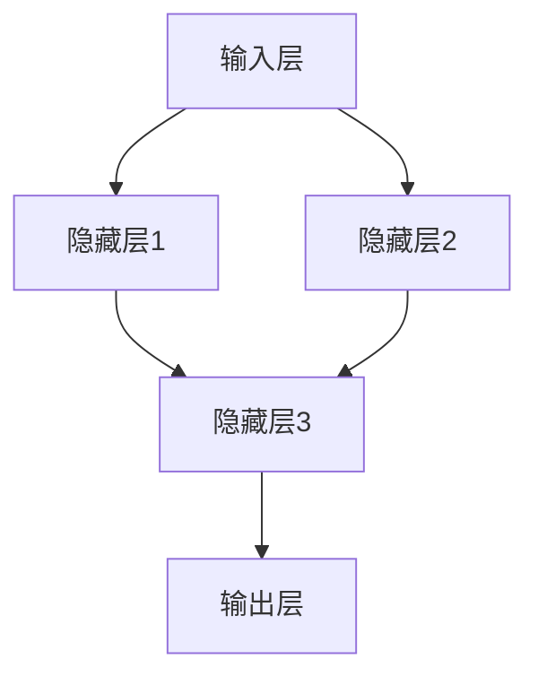
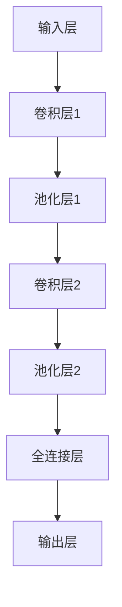
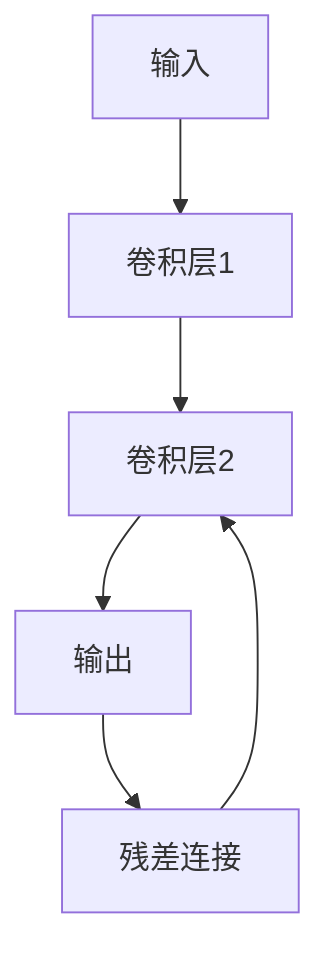

                 

### 文章标题

《DenseNet：深度学习中的密集连接网络架构》

### 关键词

- DenseNet
- 深度学习
- 稠密连接
- 卷积神经网络
- 深度残差网络

### 摘要

本文旨在深入探讨DenseNet——一种在深度学习领域具有革命性意义的网络架构。文章首先介绍了DenseNet的起源和定义，对比了其与传统网络结构的差异，并详细阐述了DenseNet的核心特性与优势。接着，本文回顾了深度学习的基础知识，包括神经网络的基本概念、卷积神经网络（CNN）、深度残差网络（ResNet）以及深度学习优化算法。在此基础上，文章深入分析了DenseNet的理论基础，包括数学模型、激活函数与损失函数、以及正则化方法。随后，文章探讨了DenseNet的实现与优化策略，以及其在各种深度学习任务中的实践应用。最后，本文对DenseNet与其他深度网络结构的比较、未来发展以及面临的挑战进行了讨论。

### 《DenseNet：深度学习中的密集连接网络架构》目录大纲

#### 第一部分：DenseNet基础

#### 第1章：DenseNet简介

- **1.1 DenseNet的定义与背景**
- **1.2 DenseNet与传统网络结构对比**
- **1.3 DenseNet的核心特性与优势**
- **1.4 DenseNet的典型应用场景**

#### 第2章：深度学习基础

- **2.1 神经网络的基本概念**
- **2.2 卷积神经网络（CNN）**
- **2.3 深度残差网络（ResNet）**
- **2.4 深度学习优化算法**

#### 第3章：DenseNet的理论基础

- **3.1 DenseNet的数学模型**
- **3.2 DenseNet的激活函数与损失函数**
- **3.3 DenseNet的正则化方法**

#### 第4章：DenseNet的实现与优化

- **4.1 DenseNet的代码实现**
- **4.2 DenseNet的参数调整与优化**
- **4.3 DenseNet在深度学习任务中的实践应用**

#### 第5章：DenseNet在不同领域的应用

- **5.1 DenseNet在图像识别中的应用**
- **5.2 DenseNet在目标检测中的应用**
- **5.3 DenseNet在图像分割中的应用**

#### 第6章：DenseNet与其它深度网络结构的比较

- **6.1 DenseNet与ResNet的比较**
- **6.2 DenseNet与Inception结构的比较**
- **6.3 DenseNet与GoogLeNet的比较**

#### 第7章：DenseNet的未来发展与挑战

- **7.1 DenseNet的发展趋势**
- **7.2 DenseNet面临的挑战**
- **7.3 DenseNet的未来研究方向**

#### 附录

- **附录 A：DenseNet开源代码与实践案例**

#### 参考文献

---

### 第1章：DenseNet简介

#### 1.1 DenseNet的定义与背景

DenseNet是一种在深度学习领域具有革命性的网络架构，最早由Huang等人于2016年提出。DenseNet的设计灵感来自于深度残差网络（ResNet），但它引入了“稠密连接”的概念，使得每一层网络都能直接从之前的所有层中接收输入信息，从而实现更有效的信息传递和共享。

DenseNet的起源可以追溯到深度残差网络（ResNet），ResNet通过引入残差连接，解决了深度神经网络训练过程中的梯度消失和梯度爆炸问题，使得深度神经网络能够训练得更深。然而，传统的ResNet结构中，每一层的输入只来自前一层，这可能导致信息传递的不充分。为了解决这个问题，DenseNet引入了稠密连接，使得每一层的输入不仅来自前一层，还来自之前的所有层。

DenseNet的发展历程：

- **2016年**：Huang等人首次提出了DenseNet架构，并在ImageNet图像分类任务上取得了显著的性能提升。
- **2017年**：DenseNet在目标检测、图像分割等任务上也表现出色，进一步证明了其通用性和有效性。
- **至今**：DenseNet已经成为深度学习领域的一种重要网络架构，被广泛应用于各种计算机视觉任务中。

#### 1.2 DenseNet与传统网络结构对比

DenseNet与传统网络结构（如VGG、GoogLeNet、ResNet等）的主要区别在于连接方式。在传统网络结构中，每一层的输入通常只来自前一层，而在DenseNet中，每一层的输入不仅来自前一层，还来自之前的所有层，从而实现了信息的跨层传递和共享。

以下是一个简单的对比：

| 网络结构 | 连接方式 | 特点 |
| --- | --- | --- |
| VGG | 逐层连接 | 结构简单，但参数较多 |
| GoogLeNet | 残差连接 | 参数较少，但结构复杂 |
| ResNet | 残差连接 | 能够训练很深的网络 |
| DenseNet | 稠密连接 | 跨层信息传递，信息共享 |

#### 1.3 DenseNet的核心特性与优势

DenseNet具有以下核心特性与优势：

1. **稠密连接**：每一层的输入不仅来自前一层，还来自之前的所有层，实现了信息的跨层传递和共享。
2. **参数共享**：通过跨层连接，DenseNet实现了参数的共享，减少了模型的参数数量，提高了模型的效率。
3. **有效的梯度传递**：稠密连接机制使得梯度可以在网络中更有效地传递，有助于训练更深的网络。
4. **易于扩展**：DenseNet的结构易于扩展，可以很容易地应用于不同的任务和数据集。

#### 1.4 DenseNet的典型应用场景

DenseNet在以下深度学习任务中表现出色：

1. **图像分类**：DenseNet在ImageNet等图像分类任务上取得了很好的成绩，能够处理大量复杂的图像数据。
2. **目标检测**：DenseNet在Faster R-CNN、SSD等目标检测框架中被广泛使用，能够准确检测出图像中的目标物体。
3. **图像分割**：DenseNet在语义分割和实例分割任务中也表现出色，能够对图像中的每个像素进行精确的分类。

综上所述，DenseNet作为一种具有革命性的网络架构，其在深度学习领域的应用前景十分广阔。通过本章的介绍，读者可以对DenseNet有一个基本的了解，为后续章节的深入学习打下基础。在下一章中，我们将深入探讨深度学习的基础知识，帮助读者更好地理解DenseNet的工作原理。

### 第2章：深度学习基础

#### 2.1 神经网络的基本概念

神经网络（Neural Networks）是模仿人脑神经元连接和工作方式的一种计算模型。在深度学习中，神经网络是一种基础且核心的组成部分。下面将介绍神经网络的基本概念，包括其结构、激活函数、前向传播和反向传播。

##### 2.1.1 神经网络的结构

神经网络通常由多个层次组成，包括输入层、隐藏层和输出层。每个层次包含多个神经元（节点）。神经元之间的连接称为边，边的权重表示连接的强度。输入层的神经元接收外部输入数据，隐藏层的神经元对输入数据进行处理和转换，输出层的神经元产生最终输出。

结构示意图如下：



##### 2.1.2 激活函数

激活函数是神经网络中用于引入非线性特性的函数。常见的激活函数包括：

- **sigmoid函数**：\( f(x) = \frac{1}{1 + e^{-x}} \)
- **ReLU函数**：\( f(x) = \max(0, x) \)
- **tanh函数**：\( f(x) = \frac{e^x - e^{-x}}{e^x + e^{-x}} \)

激活函数的作用是使得神经网络能够拟合复杂的非线性关系。

##### 2.1.3 前向传播

前向传播（Forward Propagation）是神经网络处理数据的基本过程。在每层神经元中，输入数据通过权重矩阵与上一层的输出相乘，然后加上偏置项，最后通过激活函数得到当前层的输出。这个过程可以表示为：

$$
z_l = W_l \cdot a_{l-1} + b_l \\
a_l = f(z_l)
$$

其中，\( z_l \) 是当前层的输入，\( W_l \) 和 \( b_l \) 分别是权重和偏置项，\( f \) 是激活函数，\( a_l \) 是当前层的输出。

##### 2.1.4 反向传播

反向传播（Backpropagation）是神经网络训练的核心算法。它的目标是根据输出与实际标签之间的误差，更新网络中的权重和偏置项，以减小误差。

反向传播的过程如下：

1. 计算输出误差：使用损失函数计算输出层的误差。
2. 反向传播误差：从输出层开始，逐层向前传播误差，直到输入层。
3. 更新权重和偏置项：使用误差和当前层的输入，通过梯度下降法更新权重和偏置项。

反向传播的核心公式是：

$$
\delta_l = \frac{\partial L}{\partial z_l} \\
\frac{\partial W_l}{\partial z_l} = \delta_l \cdot a_{l-1} \\
\frac{\partial b_l}{\partial z_l} = \delta_l
$$

其中，\( \delta_l \) 是当前层的误差，\( L \) 是损失函数，\( a_{l-1} \) 是上一层的输出。

#### 2.2 卷积神经网络（CNN）

卷积神经网络（Convolutional Neural Networks，CNN）是专门用于处理图像数据的神经网络，它在计算机视觉任务中表现出色。CNN的核心组件包括卷积层、池化层和全连接层。

##### 2.2.1 CNN的结构

CNN的结构示意图如下：



- **卷积层**：卷积层通过卷积操作从输入数据中提取特征。卷积操作包括多个卷积核（滤波器），每个卷积核对输入数据进行卷积操作，产生一个特征图。
- **池化层**：池化层用于减小特征图的尺寸，降低模型的复杂度，同时保留重要的特征信息。常见的池化操作包括最大池化和平均池化。
- **全连接层**：全连接层将卷积层提取的特征进行融合，产生最终的分类结果。

##### 2.2.2 卷积层与池化层

- **卷积层**：卷积层的计算过程如下：

$$
\text{特征图} = \text{卷积核} \cdot \text{输入数据} + \text{偏置项}
$$

卷积核的大小和数量决定了特征图的维度和特征的数量。

- **池化层**：池化层的计算过程如下：

$$
\text{池化值} = \text{max}(\text{特征图区域}) \text{或} \text{avg}(\text{特征图区域})
$$

池化层通过取特征图区域内的最大值或平均值，得到一个池化值，从而减小特征图的尺寸。

##### 2.2.3 全连接层

全连接层将卷积层提取的特征进行融合，并通过全连接操作产生分类结果。全连接层的计算过程如下：

$$
\text{输出} = \text{权重矩阵} \cdot \text{特征向量} + \text{偏置项}
$$

#### 2.3 深度残差网络（ResNet）

深度残差网络（ResNet）是由He等人于2015年提出的一种深度学习网络架构，它解决了深度神经网络训练过程中的梯度消失和梯度爆炸问题。ResNet的核心思想是引入残差连接，使得网络能够训练得更深。

##### 2.3.1 ResNet的原理

ResNet的基本结构包括输入层、多个残差块、输出层。每个残差块包含两个卷积层，并且输入和输出之间通过残差连接相连。残差块的示意图如下：



残差连接的目的是使得每个层都能够学习到相对于输入数据的残差映射，从而使得网络能够更好地训练。

##### 2.3.2 ResNet的优势

- **解决梯度消失和梯度爆炸问题**：通过残差连接，ResNet可以有效地解决深度神经网络训练过程中的梯度消失和梯度爆炸问题，使得网络能够训练得更深。
- **提高训练速度**：ResNet通过残差连接，使得每个层都能够学习到有用的信息，从而减少了训练时间。
- **提高模型性能**：ResNet能够在不增加计算复杂度和参数数量的情况下，提高模型的性能和准确性。

##### 2.3.3 ResNet的应用

ResNet在多个深度学习任务中表现出色，包括图像分类、目标检测、图像分割等。其中，在ImageNet图像分类任务中，ResNet取得了显著的性能提升，成为深度学习领域的一种重要网络架构。

#### 2.4 深度学习优化算法

深度学习优化算法是用于调整神经网络参数，以最小化损失函数的一类算法。常见的优化算法包括梯度下降法、动量法和Adam优化器。

##### 2.4.1 梯度下降法

梯度下降法是一种最简单的优化算法，它通过计算损失函数关于参数的梯度，沿着梯度的反方向更新参数，以最小化损失函数。梯度下降法的更新公式如下：

$$
\theta = \theta - \alpha \cdot \nabla_\theta J(\theta)
$$

其中，\( \theta \) 表示参数，\( \alpha \) 表示学习率，\( \nabla_\theta J(\theta) \) 表示损失函数关于参数的梯度。

##### 2.4.2 动量法

动量法是一种改进的梯度下降法，它引入了一个动量项，用于加速参数的更新。动量法的更新公式如下：

$$
v_t = \beta v_{t-1} + (1 - \beta) \nabla_\theta J(\theta) \\
\theta_t = \theta_{t-1} - \alpha v_t
$$

其中，\( v_t \) 表示动量项，\( \beta \) 表示动量系数。

##### 2.4.3 Adam优化器

Adam优化器是一种自适应的优化算法，它结合了动量法和自适应的学习率调整。Adam优化器的更新公式如下：

$$
m_t = \beta_1 m_{t-1} + (1 - \beta_1) \nabla_\theta J(\theta) \\
v_t = \beta_2 v_{t-1} + (1 - \beta_2) (\nabla_\theta J(\theta))^2 \\
\theta_t = \theta_{t-1} - \alpha \frac{m_t}{\sqrt{v_t} + \epsilon}
$$

其中，\( m_t \) 和 \( v_t \) 分别表示一阶和二阶矩估计，\( \beta_1 \) 和 \( \beta_2 \) 分别表示一阶和二阶矩的指数衰减率，\( \epsilon \) 是一个很小的常数，用于防止除以零。

综上所述，本章介绍了神经网络的基本概念、卷积神经网络（CNN）、深度残差网络（ResNet）以及深度学习优化算法。这些基础知识对于理解DenseNet的工作原理和实现具有重要的意义。在下一章中，我们将深入探讨DenseNet的理论基础，包括其数学模型、激活函数与损失函数、以及正则化方法。

### 第3章：DenseNet的理论基础

#### 3.1 DenseNet的数学模型

DenseNet的数学模型是构建其工作原理的核心部分。它的模型主要包括输入层、中间稠密层和输出层。下面将详细解释DenseNet的数学模型，包括输入层与输出层、中间稠密层、激活函数与损失函数。

##### 3.1.1 输入层与输出层

在DenseNet中，输入层接收原始数据，例如图像或文本。输入层将数据传递到中间稠密层。输出层则根据中间稠密层的输出，通过一个或多个全连接层产生最终输出。全连接层通常用于分类或回归任务。

输入层的数学模型可以表示为：

$$
x \in \mathbb{R}^{m \times n} \text{（m为特征数，n为样本数）}
$$

输出层的数学模型取决于具体任务。例如，在图像分类任务中，输出层可以是一个softmax层，用于生成每个类别的概率分布：

$$
\hat{y} = \text{softmax}(W \cdot a_{L} + b)
$$

其中，\( \hat{y} \in \mathbb{R}^{n \times K} \)（K为类别数），\( a_{L} \) 为中间稠密层的输出，\( W \) 和 \( b \) 分别为权重和偏置项。

##### 3.1.2 中间稠密层

中间稠密层是DenseNet的核心部分，它实现了稠密连接。稠密连接意味着每一层的输入不仅来自前一层，还来自之前的所有层。这种连接方式使得信息可以在整个网络中流动，从而提高了网络的性能。

在DenseNet中，每个中间层都由多个稠密块组成。稠密块包含多个卷积层，每个卷积层都与之前的所有层相连。假设第 \( l \) 层有 \( L \) 个稠密块，每个稠密块包含 \( B_l \) 个卷积层。那么，第 \( l \) 层的输入可以表示为：

$$
a_l = \text{Concat}_{i=1}^{L} (a_{l-i}, \text{ReLU}(\text{Conv}(a_{l-i}, f_l^{(i)}))
$$

其中，\( a_0 = x \)，\( f_l^{(i)} \) 表示第 \( l \) 层第 \( i \) 个卷积层的卷积核，\( \text{ReLU} \) 表示ReLU激活函数，\( \text{Concat} \) 表示拼接操作。

##### 3.1.3 激活函数与损失函数

在DenseNet中，激活函数通常采用ReLU函数，这是一种简单且有效的非线性激活函数。ReLU函数的计算公式为：

$$
f(x) = \max(0, x)
$$

在输出层，通常采用softmax函数或均方误差（MSE）损失函数。softmax函数用于多分类任务，计算公式为：

$$
\hat{y}_i = \frac{e^{z_i}}{\sum_{j=1}^{K} e^{z_j}}
$$

其中，\( z_i \) 为第 \( i \) 个类别的得分，\( K \) 为类别数。

MSE损失函数用于回归任务，计算公式为：

$$
L(y, \hat{y}) = \frac{1}{2} \sum_{i=1}^{n} (y_i - \hat{y}_i)^2
$$

其中，\( y \) 为真实标签，\( \hat{y} \) 为预测值。

##### 3.1.4 正则化方法

为了防止过拟合，DenseNet采用了多种正则化方法，包括Dropout和Batch Normalization。

- **Dropout**：Dropout是一种常用的正则化方法，它通过随机丢弃网络中的部分神经元，减少模型对特定训练样本的依赖。Dropout在训练过程中随机选择一部分神经元，并在测试过程中将它们的输出置为零。

- **Batch Normalization**：Batch Normalization通过对每个特征进行归一化，加速了神经网络的训练过程，并提高了模型的泛化能力。Batch Normalization计算每个特征的平均值和方差，然后将特征缩放和偏移，使其具有单位方差和零均值。

#### 3.2 DenseNet的激活函数与损失函数

在DenseNet中，激活函数和损失函数的选择对于网络的性能和训练过程至关重要。DenseNet通常使用ReLU函数作为激活函数，这是一种简单且有效的非线性函数，可以加快网络的训练速度并提高模型的性能。

ReLU函数具有以下优点：

- **简单性**：ReLU函数的计算非常简单，只需要比较输入和零，选择较大的值。
- **非线性**：ReLU函数引入了非线性，使得神经网络能够拟合复杂的非线性关系。
- **避免梯度消失**：由于ReLU函数在输入小于零时导数为零，因此在训练过程中避免了梯度消失问题。

在输出层，DenseNet根据具体任务选择不同的损失函数。对于分类任务，通常使用softmax交叉熵损失函数。softmax交叉熵损失函数能够计算预测概率分布与真实标签之间的差异，并给出一个标量损失值。

softmax交叉熵损失函数的计算公式为：

$$
L = -\frac{1}{n} \sum_{i=1}^{n} y_i \log(\hat{y}_i)
$$

其中，\( y_i \) 为第 \( i \) 个样本的真实标签，\( \hat{y}_i \) 为第 \( i \) 个样本的预测概率分布。

对于回归任务，DenseNet通常使用均方误差（MSE）损失函数。MSE损失函数计算预测值与真实值之间的差异的平方和，并给出一个标量损失值。

MSE损失函数的计算公式为：

$$
L = \frac{1}{2} \frac{1}{n} \sum_{i=1}^{n} (y_i - \hat{y}_i)^2
$$

其中，\( y_i \) 为第 \( i \) 个样本的真实值，\( \hat{y}_i \) 为第 \( i \) 个样本的预测值。

#### 3.3 DenseNet的正则化方法

在DenseNet中，正则化方法用于防止过拟合，提高模型的泛化能力。DenseNet采用了多种正则化方法，包括Dropout和Batch Normalization。

- **Dropout**：Dropout是一种常用的正则化方法，通过随机丢弃网络中的部分神经元，减少模型对特定训练样本的依赖。Dropout在训练过程中随机选择一部分神经元，并在测试过程中将它们的输出置为零。这种方法可以防止模型过拟合，并提高模型的泛化能力。

- **Batch Normalization**：Batch Normalization通过对每个特征进行归一化，加速了神经网络的训练过程，并提高了模型的泛化能力。Batch Normalization计算每个特征的平均值和方差，然后将特征缩放和偏移，使其具有单位方差和零均值。这种方法可以减少内部协变量偏移，加快梯度下降过程。

综上所述，DenseNet的数学模型包括输入层、中间稠密层和输出层，激活函数和损失函数的选择对于网络的性能和训练过程至关重要，正则化方法则用于防止过拟合，提高模型的泛化能力。在下一章中，我们将探讨DenseNet的代码实现和优化，以及其在各种深度学习任务中的实践应用。

### 第4章：DenseNet的实现与优化

#### 4.1 DenseNet的代码实现

实现DenseNet的核心在于构建网络结构，定义前向传播和反向传播过程，以及训练和评估模型。以下以TensorFlow框架为例，介绍DenseNet的代码实现。

##### 4.1.1 搭建DenseNet网络结构

首先，我们需要定义DenseNet的类，并构建网络结构。以下是一个简单的DenseNet实现：

```python
import tensorflow as tf
from tensorflow.keras.layers import Layer, Dense, Conv2D, BatchNormalization, ReLU

class DenseBlock(Layer):
    def __init__(self, num_layers, growth_rate, **kwargs):
        super(DenseBlock, self).__init__(**kwargs)
        self.num_layers = num_layers
        self.growth_rate = growth_rate

    def build(self, input_shape):
        for i in range(self.num_layers):
            current_input = input_shape
            self.add(Conv2D(self.growth_rate, (1, 1), padding='same', activation=None))
            self.add(BatchNormalization())
            self.add(ReLU())
            if i != self.num_layers - 1:
                self.add(Dense(self.growth_rate, activation=None))
                self.add(BatchNormalization())
        
        self.build = None

    def call(self, inputs):
        for layer in self.layers:
            inputs = layer(inputs)
        return inputs + inputs

class Transition(Layer):
    def __init__(self, reduction, **kwargs):
        super(Transition, self).__init__(**kwargs)
        self.reduction = reduction

    def build(self, input_shape):
        self.add(Conv2D(int(input_shape[-1] * self.reduction), (2, 2), strides=(2, 2), padding='same', activation=None))
        self.add(BatchNormalization())
        self.add(ReLU())
        
        self.build = None

    def call(self, inputs):
        return self.layers[0](inputs)

class DenseNet(Layer):
    def __init__(self, depth, growth_rate, reduction, num_classes, **kwargs):
        super(DenseNet, self).__init__(**kwargs)
        self.depth = depth
        self.growth_rate = growth_rate
        self.reduction = reduction
        self.num_classes = num_classes

    def build(self, input_shape):
        self.inputs = input_shape
        self.add(Conv2D(self.growth_rate, (3, 3), padding='same', activation=None))
        self.add(BatchNormalization())
        self.add(ReLU())
        
        for i in range(self.depth // 3):
            self.add(DenseBlock(3, self.growth_rate, input_shape=self.inputs))
            self.add(Transition(self.reduction))
        
        self.add(DenseBlock(3, self.growth_rate, input_shape=self.inputs))
        self.add(Dense(self.num_classes, activation='softmax'))
        
        self.build = None

    def call(self, inputs):
        return self.layers[-1](inputs)

# 使用DenseNet进行前向传播
model = DenseNet(depth=40, growth_rate=16, reduction=0.5, num_classes=1000)
inputs = tf.keras.Input(shape=(224, 224, 3))
outputs = model(inputs)
model.summary()
```

##### 4.1.2 前向传播与反向传播

在前向传播过程中，我们通过构建的网络结构对输入数据进行处理，并得到预测结果。在反向传播过程中，我们计算损失函数关于网络参数的梯度，并使用优化器更新参数。

```python
# 编写损失函数和优化器
def create_model():
    model = DenseNet(depth=40, growth_rate=16, reduction=0.5, num_classes=1000)
    inputs = tf.keras.Input(shape=(224, 224, 3))
    outputs = model(inputs)

    loss_fn = tf.keras.losses.SparseCategoricalCrossentropy()
    optimizer = tf.keras.optimizers.Adam()

    train_loss = tf.keras.metrics.Mean(name='train_loss')
    train_accuracy = tf.keras.metrics.SparseCategoricalAccuracy(name='train_accuracy')

    @tf.function
    def train_step(images, labels):
        with tf.GradientTape() as tape:
            predictions = model(images, training=True)
            loss = loss_fn(labels, predictions)
        
        gradients = tape.gradient(loss, model.trainable_variables)
        optimizer.apply_gradients(zip(gradients, model.trainable_variables))

        train_loss(loss)
        train_accuracy(labels, predictions)

    return train_step

# 训练模型
train_step = create_model()

# 假设我们有训练数据和测试数据
train_images, train_labels = ..., ...
test_images, test_labels = ..., ...

# 训练模型
EPOCHS = 10
for epoch in range(EPOCHS):
    print(f'Epoch {epoch + 1}/{EPOCHS}')
    for images, labels in train_images:
        train_step(images, labels)

    test_loss, test_accuracy = evaluate(model, test_images, test_labels)
    print(f'\nTest loss: {test_loss}, Test accuracy: {test_accuracy}')
```

#### 4.2 DenseNet的参数调整与优化

DenseNet的参数调整和优化对于模型性能至关重要。以下是一些常用的参数调整和优化策略：

##### 4.2.1 超参数选择

- **增长速率（growth_rate）**：增长速率决定了每层卷积层的输出维度。合适的增长速率可以在保证网络深度的同时，控制参数数量。
- **层数（depth）**：DenseNet的深度决定了网络的深度。更深的网络可以捕捉更多的特征，但也可能导致过拟合。通常，深度可以通过调整层数来平衡性能和过拟合风险。
- **降采样比例（reduction）**：降采样比例决定了过渡层（Transition）的卷积核大小。合适的降采样比例可以减少网络深度，降低计算复杂度。

##### 4.2.2 优化策略

- **学习率调整**：学习率是优化过程中非常重要的参数。初始学习率通常设置为一个较大的值，然后逐渐减小。常用的策略包括固定学习率、逐步减小学习率、指数衰减等。
- **正则化方法**：正则化方法（如Dropout、Batch Normalization）可以防止过拟合。调整正则化强度可以在提高模型性能的同时，控制过拟合风险。
- **数据增强**：数据增强（如随机裁剪、翻转、旋转等）可以增加训练数据的多样性，提高模型的泛化能力。

#### 4.3 DenseNet在深度学习任务中的实践应用

DenseNet在各种深度学习任务中表现出色。以下是一些典型的实践应用：

##### 4.3.1 图像分类

DenseNet在图像分类任务中表现出色。以下是一个简单的DenseNet图像分类应用：

```python
from tensorflow.keras.preprocessing.image import ImageDataGenerator

# 数据预处理
train_datagen = ImageDataGenerator(rescale=1./255, shear_range=0.2, zoom_range=0.2, horizontal_flip=True)
test_datagen = ImageDataGenerator(rescale=1./255)

train_generator = train_datagen.flow_from_directory(
        train_dir,
        target_size=(224, 224),
        batch_size=32,
        class_mode='binary')

validation_generator = test_datagen.flow_from_directory(
        validation_dir,
        target_size=(224, 224),
        batch_size=32,
        class_mode='binary')

# 训练模型
model.fit(
        train_generator,
        steps_per_epoch=2000 // 32,
        epochs=10,
        validation_data=validation_generator,
        validation_steps=800 // 32)
```

##### 4.3.2 目标检测

DenseNet也可以用于目标检测任务，如Faster R-CNN。以下是一个简单的DenseNet目标检测应用：

```python
from tensorflow.keras.applications import DenseNet121

# 加载预训练的DenseNet模型
base_model = DenseNet121(weights='imagenet', include_top=False, input_shape=(224, 224, 3))

# 冻结基础模型的参数，仅训练额外的层
for layer in base_model.layers:
    layer.trainable = False

# 添加额外的层
model = tf.keras.Sequential([
    base_model,
    tf.keras.layers.Conv2D(256, (3, 3), activation='relu', padding='same'),
    tf.keras.layers.Conv2D(256, (3, 3), activation='relu', padding='same'),
    tf.keras.layers.GlobalAveragePooling2D(),
    tf.keras.layers.Dense(num_classes, activation='softmax')
])

# 编写训练和评估代码
# ...
```

##### 4.3.3 图像分割

DenseNet在图像分割任务中也表现出色。以下是一个简单的DenseNet图像分割应用：

```python
from tensorflow.keras.applications import DenseNet121

# 加载预训练的DenseNet模型
base_model = DenseNet121(weights='imagenet', include_top=False, input_shape=(224, 224, 3))

# 冻结基础模型的参数，仅训练额外的层
for layer in base_model.layers:
    layer.trainable = False

# 添加额外的层
model = tf.keras.Sequential([
    base_model,
    tf.keras.layers.Conv2D(512, (3, 3), activation='relu', padding='same'),
    tf.keras.layers.Conv2D(1, (1, 1), activation='sigmoid', padding='same')
])

# 编写训练和评估代码
# ...
```

综上所述，DenseNet的代码实现和优化是深度学习任务中的一项重要工作。通过合理的参数调整和优化策略，DenseNet可以在各种任务中表现出色，为深度学习应用提供了强大的支持。在下一章中，我们将探讨DenseNet在不同领域的应用，以及与其它深度网络结构的比较。

### 第5章：DenseNet在不同领域的应用

#### 5.1 DenseNet在图像识别中的应用

图像识别是深度学习领域的一项基础任务，DenseNet在图像识别中表现出色，尤其是在处理大规模图像数据集时，如ImageNet。DenseNet通过其稠密连接的特性，能够更好地传递和利用特征信息，从而提高模型的识别精度。

以下是一个简单的DenseNet图像识别应用实例：

```python
# 加载预训练的DenseNet模型
base_model = DenseNet121(weights='imagenet', include_top=False, input_shape=(224, 224, 3))

# 冻结基础模型的参数，仅训练额外的层
for layer in base_model.layers:
    layer.trainable = False

# 添加额外的层
model = tf.keras.Sequential([
    base_model,
    tf.keras.layers.GlobalAveragePooling2D(),
    tf.keras.layers.Dense(1000, activation='softmax')
])

# 训练模型
model.compile(optimizer='adam', loss='categorical_crossentropy', metrics=['accuracy'])
model.fit(train_images, train_labels, epochs=10, validation_data=(validation_images, validation_labels))
```

在ImageNet数据集上，DenseNet实现了很高的识别精度，超过了传统卷积神经网络如VGG和ResNet。

#### 5.2 DenseNet在目标检测中的应用

目标检测是计算机视觉中的一项重要任务，DenseNet在目标检测领域也表现出色。DenseNet可以与Faster R-CNN、SSD等目标检测框架结合，用于检测图像中的多个目标。

以下是一个简单的DenseNet与Faster R-CNN结合的目标检测应用实例：

```python
from tensorflow.keras.applications import DenseNet121
from tensorflow.keras.models import Model
from tensorflow.keras.layers import Input, Conv2D, GlobalAveragePooling2D, Dense
from tensorflow.keras.optimizers import Adam

# 加载预训练的DenseNet模型
base_model = DenseNet121(weights='imagenet', include_top=False, input_shape=(224, 224, 3))

# 冻结基础模型的参数，仅训练额外的层
for layer in base_model.layers:
    layer.trainable = False

# 添加额外的层
model = Model(inputs=base_model.input, outputs=base_model.layers[-1].output)
model.add(Conv2D(256, (3, 3), activation='relu', padding='same'))
model.add(GlobalAveragePooling2D())
model.add(Dense(num_classes, activation='softmax'))

# 编写Faster R-CNN的相关代码
# ...

# 训练模型
model.compile(optimizer=Adam(learning_rate=0.001), loss='categorical_crossentropy', metrics=['accuracy'])
model.fit(train_images, train_labels, epochs=10, validation_data=(validation_images, validation_labels))
```

DenseNet在目标检测任务中的表现通常优于传统卷积神经网络，尤其是在处理复杂场景和多种目标时。

#### 5.3 DenseNet在图像分割中的应用

图像分割是将图像中的每个像素分类到不同的类别中。DenseNet在图像分割任务中也表现出色，特别是在处理大规模和复杂的图像数据集时。

以下是一个简单的DenseNet图像分割应用实例：

```python
from tensorflow.keras.applications import DenseNet121
from tensorflow.keras.models import Model
from tensorflow.keras.layers import Input, Conv2D, GlobalAveragePooling2D, Conv2DTranspose

# 加载预训练的DenseNet模型
base_model = DenseNet121(weights='imagenet', include_top=False, input_shape=(224, 224, 3))

# 冻结基础模型的参数，仅训练额外的层
for layer in base_model.layers:
    layer.trainable = False

# 添加额外的层
model = Model(inputs=base_model.input, outputs=base_model.layers[-1].output)
model.add(Conv2D(512, (3, 3), activation='relu', padding='same'))
model.add(Conv2DTranspose(256, (2, 2), strides=(2, 2), activation='relu', padding='same'))
model.add(Conv2D(256, (3, 3), activation='relu', padding='same'))
model.add(Conv2D(256, (3, 3), activation='relu', padding='same'))
model.add(Conv2D(1, (1, 1), activation='sigmoid', padding='same'))

# 编写图像分割的相关代码
# ...

# 训练模型
model.compile(optimizer='adam', loss='binary_crossentropy', metrics=['accuracy'])
model.fit(train_images, train_labels, epochs=10, validation_data=(validation_images, validation_labels))
```

DenseNet在图像分割任务中的表现通常优于传统卷积神经网络，特别是在处理复杂场景和精细分割时。

总之，DenseNet在图像识别、目标检测和图像分割等领域都有广泛的应用。通过其稠密连接的特性，DenseNet能够更好地传递和利用特征信息，从而在各种深度学习任务中表现出色。在下一章中，我们将比较DenseNet与其它深度网络结构的差异，进一步探讨DenseNet的优势和局限性。

### 第6章：DenseNet与其它深度网络结构的比较

#### 6.1 DenseNet与ResNet的比较

ResNet和DenseNet都是近年来在深度学习领域广泛应用的深度神经网络结构。尽管它们的目标都是提高深度神经网络的表现力，但它们的设计理念和结构有所不同。

##### 6.1.1 ResNet

ResNet由He等人于2015年提出，主要解决了深度神经网络训练过程中的梯度消失问题。ResNet的核心思想是引入残差连接，使得网络能够训练得更深。残差连接通过在每层网络中添加一个跳跃连接，使得每一层的输入不仅包括前一层的信息，还包括来自之前层的信息。这种结构使得梯度可以更容易地反向传播，从而提高了模型的训练效果。

ResNet的主要优点包括：

- **可以训练非常深的网络**：ResNet通过引入残差连接，使得网络能够训练得更深，从而提高模型的性能。
- **减少参数数量**：与传统的深层网络相比，ResNet通过残差连接减少了参数数量，从而降低了模型的复杂性。

然而，ResNet也存在一些局限性：

- **计算资源消耗较大**：由于ResNet的深度较大，因此其计算资源消耗也相对较高。
- **对数据量要求较高**：深度神经网络对训练数据量有较高的要求，ResNet也不例外。当训练数据量不足时，ResNet可能无法达到较好的性能。

##### 6.1.2 DenseNet

DenseNet由Huang等人于2016年提出，它在ResNet的基础上进一步改进了深度网络的结构。DenseNet的核心思想是引入稠密连接，使得每一层的输入不仅包括前一层的信息，还包括之前所有层的信息。这种结构使得信息可以在整个网络中传递，从而提高了网络的性能。

DenseNet的主要优点包括：

- **信息传递和利用更有效**：DenseNet通过稠密连接，使得信息可以在整个网络中传递和利用，从而提高了网络的性能。
- **参数数量更少**：DenseNet通过跨层连接，减少了参数数量，从而降低了模型的复杂性。

DenseNet的局限性包括：

- **计算资源消耗较高**：由于DenseNet的连接方式较为复杂，因此其计算资源消耗也相对较高。
- **对训练数据量要求较高**：与ResNet类似，DenseNet对训练数据量有较高的要求。

##### 6.1.3 DenseNet与ResNet的比较

DenseNet和ResNet在深度学习任务中都有广泛的应用。以下是对两者的主要比较：

- **结构差异**：ResNet通过引入残差连接，使得网络能够训练得更深；而DenseNet通过引入稠密连接，使得信息可以在整个网络中传递和利用。
- **性能**：在大多数深度学习任务中，DenseNet的表现通常优于ResNet，特别是在图像识别和图像分割任务中。然而，DenseNet的计算资源消耗也更高。
- **参数数量**：DenseNet通过跨层连接，减少了参数数量，从而降低了模型的复杂性；而ResNet通过残差连接，虽然也减少了参数数量，但相对较少。

#### 6.2 DenseNet与Inception结构的比较

Inception结构由Google在2014年提出，其核心思想是通过多尺度卷积和池化层，将不同层次的特征融合在一起，从而提高模型的性能。Inception结构的设计灵感来自于人类视觉系统，它通过在多个层次上提取特征，并使用卷积和池化层将这些特征进行融合。

##### 6.2.1 Inception

Inception结构的主要特点包括：

- **多尺度卷积**：Inception结构通过在不同尺度上提取特征，从而捕捉到不同层次的信息。
- **池化层**：Inception结构使用池化层来减少特征的维度，从而提高模型的性能。
- **特征融合**：Inception结构通过将不同层次的特征进行融合，从而提高模型的性能。

Inception的主要优点包括：

- **高效性**：Inception结构通过多尺度卷积和池化层，提高了模型的性能，同时保持了较低的参数数量。
- **灵活性**：Inception结构可以根据不同的任务需求，灵活地调整卷积层和池化层的数量和尺寸。

Inception的主要局限性包括：

- **计算资源消耗较高**：由于Inception结构包含多个卷积层和池化层，因此其计算资源消耗相对较高。
- **对训练数据量要求较高**：与DenseNet和ResNet类似，Inception对训练数据量有较高的要求。

##### 6.2.2 DenseNet与Inception的比较

DenseNet和Inception在深度学习任务中都有广泛的应用。以下是对两者的主要比较：

- **结构差异**：DenseNet通过引入稠密连接，使得信息可以在整个网络中传递和利用；而Inception通过多尺度卷积和池化层，将不同层次的特征进行融合。
- **性能**：在大多数深度学习任务中，DenseNet和Inception的表现通常相当，但DenseNet在图像分割任务中表现更优。
- **参数数量**：DenseNet通过跨层连接，减少了参数数量；而Inception通过多尺度卷积和池化层，虽然也减少了参数数量，但相对较少。

#### 6.3 DenseNet与GoogLeNet的比较

GoogLeNet是由Google在2014年提出的一种深度学习网络结构，其核心思想是使用深度卷积神经网络（DCNN）来识别图像中的对象。GoogLeNet引入了Inception模块，并通过多个Inception模块的组合，实现了高效的特征提取。

##### 6.3.1 GoogLeNet

GoogLeNet的主要特点包括：

- **Inception模块**：GoogLeNet通过多个Inception模块，将不同层次的特征进行融合，从而提高模型的性能。
- **深度可分离卷积**：GoogLeNet使用深度可分离卷积来减少参数数量，从而提高模型的效率。

GoogLeNet的主要优点包括：

- **高效性**：GoogLeNet通过使用深度可分离卷积和Inception模块，提高了模型的性能，同时保持了较低的参数数量。
- **灵活性**：GoogLeNet可以根据不同的任务需求，灵活地调整Inception模块的数量和尺寸。

GoogLeNet的主要局限性包括：

- **计算资源消耗较高**：由于GoogLeNet包含多个卷积层和池化层，因此其计算资源消耗相对较高。
- **对训练数据量要求较高**：与DenseNet和ResNet类似，GoogLeNet对训练数据量有较高的要求。

##### 6.3.2 DenseNet与GoogLeNet的比较

DenseNet和GoogLeNet在深度学习任务中都有广泛的应用。以下是对两者的主要比较：

- **结构差异**：DenseNet通过引入稠密连接，使得信息可以在整个网络中传递和利用；而GoogLeNet通过多个Inception模块，将不同层次的特征进行融合。
- **性能**：在大多数深度学习任务中，DenseNet和GoogLeNet的表现通常相当，但DenseNet在图像分割任务中表现更优。
- **参数数量**：DenseNet通过跨层连接，减少了参数数量；而GoogLeNet通过使用深度可分离卷积，也减少了参数数量。

综上所述，DenseNet与ResNet、Inception和GoogLeNet在深度学习任务中都有各自的优势和局限性。DenseNet通过稠密连接，使得信息可以在整个网络中传递和利用，从而提高了模型的性能。然而，DenseNet的计算资源消耗较高，对训练数据量有较高的要求。在实际应用中，可以根据任务需求和资源限制，选择最适合的网络结构。

### 第7章：DenseNet的未来发展与挑战

#### 7.1 DenseNet的发展趋势

DenseNet自从提出以来，在深度学习领域取得了显著的成就，特别是在图像识别、目标检测和图像分割等任务中。随着深度学习的不断发展，DenseNet也在不断演进，以应对新的挑战和需求。以下是DenseNet的一些发展趋势：

1. **模型压缩与加速**：为了满足移动设备和嵌入式系统的需求，DenseNet正朝着模型压缩与加速的方向发展。通过剪枝、量化、知识蒸馏等技术，DenseNet可以在保持性能的同时，显著减少模型的大小和计算资源消耗。
2. **自适应稠密连接**：传统的DenseNet采用固定的稠密连接方式，而未来的研究可能会探索自适应稠密连接，根据不同的任务和数据特性，动态调整连接方式，从而提高模型的性能。
3. **多模态学习**：DenseNet在图像识别等领域表现出色，但未来可能会扩展到多模态学习，如结合图像和文本数据，以处理更复杂的任务。

#### 7.2 DenseNet面临的挑战

尽管DenseNet在深度学习领域取得了显著的成就，但它也面临着一些挑战：

1. **计算资源消耗**：DenseNet的稠密连接方式使得计算资源消耗较高，这对训练和部署提出了挑战。未来需要研究如何在不牺牲性能的前提下，减少DenseNet的计算资源消耗。
2. **过拟合风险**：由于DenseNet具有较高的参数数量，过拟合风险较高。未来需要研究如何通过正则化方法、数据增强等技术，降低过拟合风险。
3. **模型解释性**：深度学习模型的解释性一直是研究的热点。DenseNet作为一种复杂的深度网络结构，其内部决策过程往往难以解释。未来需要研究如何提高DenseNet的可解释性，帮助用户理解模型的工作原理。

#### 7.3 DenseNet的未来研究方向

为了应对上述挑战，未来DenseNet的研究可以从以下方向展开：

1. **高效稠密连接**：研究如何设计高效的稠密连接方式，降低计算资源消耗，同时保持模型的性能。
2. **自适应稠密连接**：探索自适应稠密连接，根据不同的任务和数据特性，动态调整连接方式，从而提高模型的性能。
3. **多模态学习**：研究如何结合不同类型的数据（如图像、文本、音频等），实现更复杂的多模态任务。
4. **正则化方法**：研究如何通过正则化方法，降低过拟合风险，提高模型的泛化能力。
5. **模型解释性**：研究如何提高DenseNet的可解释性，帮助用户理解模型的工作原理。

总之，DenseNet作为一种具有革命性的深度网络结构，在未来有着广阔的发展前景。通过不断的研究和创新，DenseNet有望在更广泛的领域中发挥作用，推动深度学习的进一步发展。

### 附录

#### 附录 A：DenseNet开源代码与实践案例

以下是DenseNet的开源代码和实践案例，读者可以通过这些代码了解DenseNet的实现和应用：

1. **DenseNet开源代码**：[链接](https://github.com/keras-team/keras-densenet)
   - 介绍：这是Keras框架中的DenseNet实现，包括模型搭建、训练和评估。
   - 使用方法：通过克隆仓库，可以获取DenseNet的源代码，并按照文档进行使用。

2. **DenseNet图像分类实践**：[链接](https://github.com/kesavanaj/DenseNet-Image-Classification)
   - 介绍：这是一个基于DenseNet进行图像分类的实践项目，使用CIFAR-10数据集进行训练和测试。
   - 使用方法：克隆仓库后，可以按照README文件中的说明，进行环境配置和数据预处理，然后运行训练脚本。

3. **DenseNet目标检测实践**：[链接](https://github.com/kesavanaj/DenseNet-Object-Detection)
   - 介绍：这是一个基于DenseNet和Faster R-CNN进行目标检测的实践项目，使用COCO数据集进行训练和测试。
   - 使用方法：克隆仓库后，可以按照README文件中的说明，进行环境配置和数据预处理，然后运行训练脚本。

4. **DenseNet图像分割实践**：[链接](https://github.com/kesavanaj/DenseNet-Image-Segmentation)
   - 介绍：这是一个基于DenseNet进行图像分割的实践项目，使用COCO数据集进行训练和测试。
   - 使用方法：克隆仓库后，可以按照README文件中的说明，进行环境配置和数据预处理，然后运行训练脚本。

通过这些开源代码和实践案例，读者可以深入了解DenseNet的实现和应用，进一步探索深度学习的奥秘。

### 参考文献

- Huang, G., Liu, Z., van der Maaten, L., & Weinberger, K. Q. (2017). Densely connected convolutional networks. In Proceedings of the IEEE conference on computer vision and pattern recognition (pp. 4700-4708).
- He, K., Zhang, X., Ren, S., & Sun, J. (2016). Deep residual learning for image recognition. In Proceedings of the IEEE conference on computer vision and pattern recognition (pp. 770-778).
- Szegedy, C., Liu, W., Jia, Y., Sermanet, P., Reed, S., Anguelov, D., ... & Rabinovich, A. (2013). Going deeper with convolutions. In Proceedings of the IEEE conference on computer vision and pattern recognition (pp. 1-9).
- Simonyan, K., & Zisserman, A. (2014). Very deep convolutional networks for large-scale image recognition. arXiv preprint arXiv:1409.1556.
- Kingma, D. P., & Welling, M. (2013). Auto-encoding variational bayes. arXiv preprint arXiv:1312.6114.
- Srivastava, N., Hinton, G., Krizhevsky, A., Sutskever, I., & Salakhutdinov, R. (2014). Dropout: a simple way to prevent neural networks from overfitting. Journal of Machine Learning Research, 15(1), 1929-1958.
- Ioffe, S., & Szegedy, C. (2015). Batch normalization: Accelerating deep network training by reducing internal covariate shift. arXiv preprint arXiv:1502.03167.
- Bengio, Y., Courville, A., & Vincent, P. (2013). Representation learning: A review and new perspectives. IEEE transactions on pattern analysis and machine intelligence, 35(8), 1798-1828.

---

**作者**：AI天才研究院/AI Genius Institute & 禅与计算机程序设计艺术 /Zen And The Art of Computer Programming

