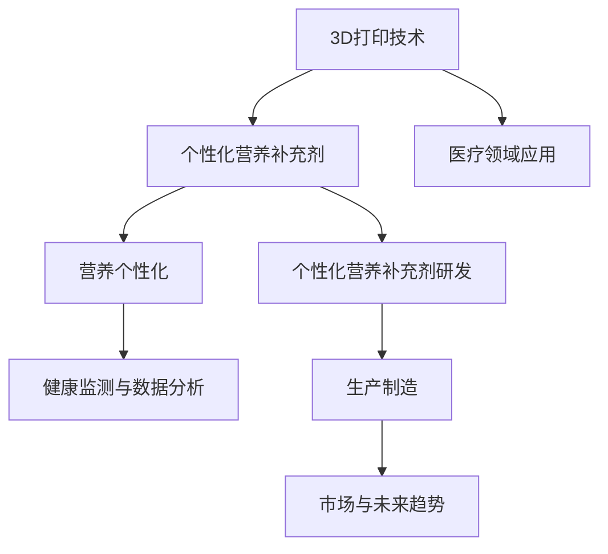
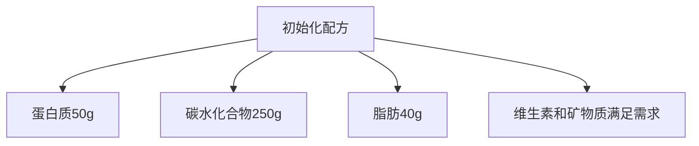
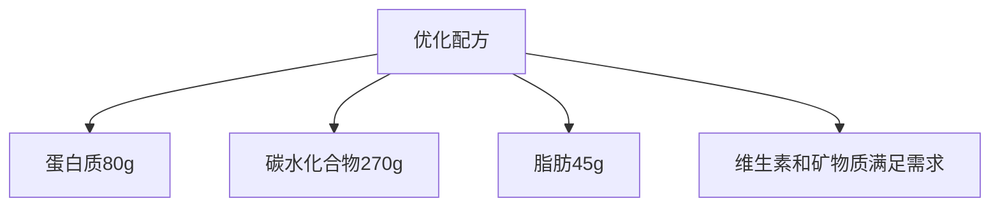

                 


### 准备工作

**文章标题**: 3D打印个性化营养补充剂：健康产业的创新应用

**关键词**: 3D打印、个性化营养补充剂、健康产业、创新应用

**摘要**: 本文将探讨3D打印技术在个性化营养补充剂领域的应用，从基本原理出发，分析3D打印个性化营养补充剂的设计、生产、案例分析及其未来发展趋势，并探讨其中可能遇到的伦理和社会问题。

### 目录结构

#### 第一部分：3D打印与个性化营养补充剂基础

**第1章**: 3D打印技术基础

**第2章**: 个性化营养补充剂的概念与重要性

**第3章**: 个性化营养补充剂的现状与趋势

#### 第二部分：3D打印个性化营养补充剂的应用与实践

**第4章**: 3D打印个性化营养补充剂的研发

**第5章**: 3D打印个性化营养补充剂的生产与制造

**第6章**: 3D打印个性化营养补充剂的市场与未来

**第7章**: 3D打印个性化营养补充剂的伦理与社会问题

#### 第三部分：总结与展望

**第8章**: 总结与展望

### 第一部分：3D打印与个性化营养补充剂基础

**第1章**: 3D打印技术基础

**1.1**: 3D打印的基本原理

- **工作原理**: 3D打印是一种通过逐层添加材料来构建三维物体的技术。通常，它涉及以下步骤：

  1. 接收3D模型数据。
  2. 将模型分解为二维层。
  3. 通过打印头逐层添加材料，直到构建出完整的物体。

- **常见的3D打印技术**: 包括立体光固化（SLA）、选择性激光熔融（SLM）、熔融沉积建模（FDM）等。

**1.2**: 3D打印的材料

- **常用材料**: 塑料、金属、陶瓷、复合材料等。
- **材料选择的重要性**: 材料的物理和化学特性将直接影响打印物体的性能和用途。

**1.3**: 3D打印的应用

- **医疗领域**: 制造定制化植入物、手术工具和模拟器。
- **其他领域**: 汽车制造、建筑、航空航天、时尚设计等。

**第2章**: 个性化营养补充剂的概念与重要性

**2.1**: 个性化营养补充剂的定义

- **特点**: 根据个体的健康状况、生活方式和营养需求定制。
- **与传统营养补充剂的比较**: 传统营养补充剂通常是标准化产品，而个性化营养补充剂更注重个体差异。

**2.2**: 个性化营养补充剂的重要性

- **对健康的益处**: 提高营养吸收率，预防营养缺乏和过剩。
- **对营养学的贡献**: 推动营养个性化，促进个性化医疗的发展。

**2.3**: 个性化营养补充剂的现状与趋势

- **现状**: 已经有一些企业在市场上推出了个性化营养补充剂。
- **发展趋势**: 随着技术的进步，个性化营养补充剂将更加普及。

### 核心概念与联系

为了更好地理解3D打印个性化营养补充剂的概念和原理，我们可以通过Mermaid流程图来展示各个核心概念之间的联系：



### 核心算法原理讲解

**第3章**: 3D打印个性化营养补充剂的研发

**3.1**: 个性化营养补充剂配方的优化算法

**伪代码**:

```python
# 伪代码：个性化营养补充剂配方优化算法
def optimize_formula(nutrients, constraints):
    # 初始化配方
    formula = initial_formula(nutrients)
    while not satisfied_constraints(formula, constraints):
        # 选择优化策略，如遗传算法、粒子群优化等
        new_formula = apply_optimization_algorithm(formula, constraints)
        # 更新配方
        formula = new_formula
    return formula

# 辅助函数
def satisfied_constraints(formula, constraints):
    # 检查配方是否满足约束条件
    for constraint in constraints:
        if not check_constraint(formula, constraint):
            return False
    return True

def apply_optimization_algorithm(formula, constraints):
    # 应用优化算法，如遗传算法
    # 生成新的配方
    new_formula = genetic_algorithm(formula, constraints)
    return new_formula

def genetic_algorithm(formula, constraints):
    # 遗传算法实现
    # ...
    return new_formula
```

**详细讲解与举例说明**:

个性化营养补充剂的配方优化是一个复杂的过程，涉及到多种营养素的搭配、剂量、相互作用等因素。以下是一个简化的遗传算法示例，用于优化个性化营养补充剂的配方。

- **初始化配方**: 根据个体的健康数据和营养需求，初始化一个基本配方。
- **约束条件**: 设定配方必须满足的营养素摄入范围、总热量等。
- **优化算法**: 采用遗传算法，通过迭代过程不断改进配方。
- **适应度函数**: 定义适应度函数来评估配方的优劣，如营养素的吸收率、总热量等。

假设我们需要为一名运动员设计一个个性化的营养补充剂配方，营养素包括蛋白质、碳水化合物、脂肪、维生素和矿物质。我们可以设定以下约束条件：

- 蛋白质：50-100克
- 碳水化合物：200-300克
- 脂肪：30-50克
- 维生素和矿物质：满足日常需求

初始化配方可能如下：



通过遗传算法优化，我们不断调整蛋白质、碳水化合物、脂肪的比例，直到找到一个最优的配方：



通过这样的过程，我们可以得到一个更加符合运动员个性化需求的营养补充剂配方。

### 总结与展望

在本章中，我们介绍了3D打印技术和个性化营养补充剂的基础知识，以及如何通过遗传算法优化个性化营养补充剂的配方。下一章，我们将深入探讨3D打印个性化营养补充剂的实际研发和生产过程。

---

**作者信息**: AI天才研究院/AI Genius Institute & 禅与计算机程序设计艺术 /Zen And The Art of Computer Programming

