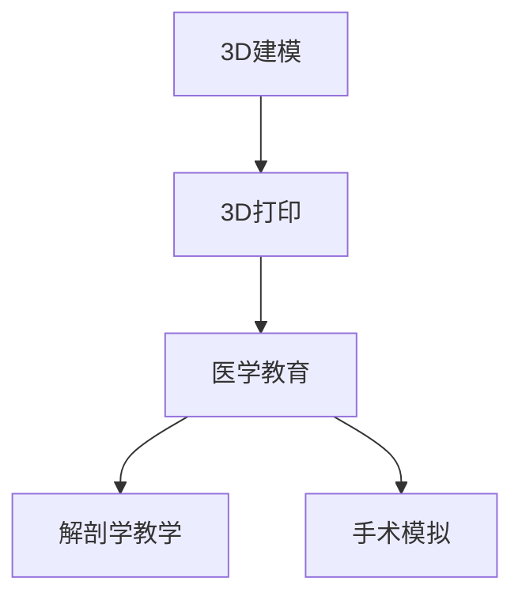
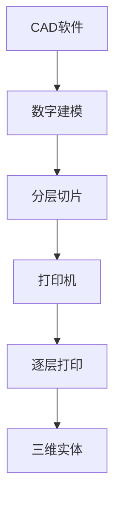
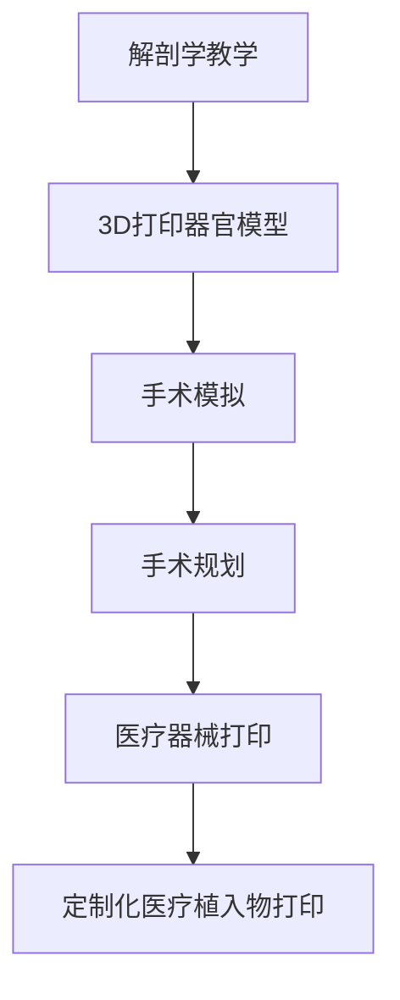
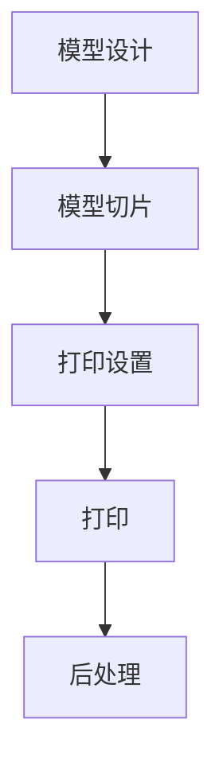

                 

## 文章标题

### 3D打印器官模型：医学教育的创新工具

> 关键词：3D打印，器官模型，医学教育，技术创新

> 摘要：本文深入探讨了3D打印技术在医学教育中的应用，特别是通过3D打印器官模型进行教学的具体方式、优势和价值。文章从基本概念出发，详细介绍了3D打印器官模型的原理、分类及其在医学教育中的广泛应用，探讨了该技术在解剖学教学、手术模拟以及其他医学教育领域的具体实践。此外，文章还展望了3D打印器官模型未来的技术发展趋势、伦理与法律问题以及商业化前景，并提供了相关的资源与工具，最后通过综合案例分析和专家访谈，总结了3D打印器官模型在医学教育中的潜力与挑战。

----------------------------------------------------------------

## 目录大纲：《3D打印器官模型：医学教育的创新工具》

### 第一部分：3D打印器官模型概述

#### 第1章：3D打印器官模型的基本概念  
- 1.1 什么是3D打印器官模型  
- 1.2 3D打印器官模型的发展历程  
- 1.3 3D打印器官模型在医学教育中的应用价值

#### 第2章：3D打印技术的原理与应用  
- 2.1 3D打印技术的基本原理  
- 2.2 3D打印技术在医学领域的应用  
- 2.3 3D打印器官模型的制作流程

#### 第3章：3D打印器官模型的分类  
- 3.1 硅胶模型  
- 3.2 玻璃模型  
- 3.3 复合材料模型

### 第二部分：3D打印器官模型在医学教育中的应用

#### 第4章：3D打印器官模型在解剖学教学中的应用  
- 4.1 3D打印器官模型在解剖学教学中的优势  
- 4.2 3D打印器官模型在解剖学教学中的实践案例  
- 4.3 3D打印器官模型在解剖学教学中的评估与反思

#### 第5章：3D打印器官模型在手术模拟中的应用  
- 5.1 3D打印器官模型在手术模拟中的优势  
- 5.2 3D打印器官模型在手术模拟中的实践案例  
- 5.3 3D打印器官模型在手术模拟中的评估与反思

#### 第6章：3D打印器官模型在其他医学教育中的应用  
- 6.1 3D打印器官模型在其他医学教育中的应用领域  
- 6.2 3D打印器官模型在其他医学教育中的应用案例  
- 6.3 3D打印器官模型在其他医学教育中的应用评估与反思

### 第三部分：3D打印器官模型的未来发展

#### 第7章：3D打印器官模型的技术发展趋势  
- 7.1 3D打印技术的最新进展  
- 7.2 3D打印器官模型的未来发展方向  
- 7.3 3D打印器官模型的技术挑战与解决方案

#### 第8章：3D打印器官模型的伦理、法律和社会问题  
- 8.1 3D打印器官模型的伦理问题  
- 8.2 3D打印器官模型的法律问题  
- 8.3 3D打印器官模型的社会问题

#### 第9章：3D打印器官模型的商业化前景  
- 9.1 3D打印器官模型的商业化模式  
- 9.2 3D打印器官模型的商业案例  
- 9.3 3D打印器官模型的商业前景与挑战

#### 附录：3D打印器官模型的资源与工具  
- 附录 A：3D打印器官模型的常用软件与硬件  
- 附录 B：3D打印器官模型的实践指南

#### 第10章：综合案例分析  
- 10.1 案例一：3D打印心脏模型在心脏病手术中的应用  
- 10.2 案例二：3D打印肝脏模型在肝脏手术中的应用  
- 10.3 案例三：3D打印骨骼模型在骨科手术中的应用  
- 10.4 案例四：3D打印器官模型在肿瘤治疗中的应用  
- 10.5 案例五：3D打印器官模型在其他疾病治疗中的应用

#### 第11章：专家访谈与展望  
- 11.1 3D打印器官模型领域的专家访谈  
- 11.2 3D打印器官模型的发展展望

## 第1章: 3D打印器官模型的基本概念

### 1.1 什么是3D打印器官模型

3D打印器官模型是指通过3D打印技术制作出的，具有高度仿真性和精细度的器官模型。这些模型可以用于医学教学、手术规划、患者教育等多个方面。与传统模型相比，3D打印器官模型具有高度个性化、可定制化的特点。

#### 背景介绍

- 3D打印技术起源于20世纪80年代的快速成型技术，经过多年的发展，已成为一种成熟的制造技术。近年来，随着计算机辅助设计（CAD）和计算机辅助制造（CAM）技术的进步，3D打印技术在医学领域的应用日益广泛。
- 在医学教育中，传统的解剖学教学主要依赖于尸体解剖和2D解剖图谱。然而，这些方法存在诸多局限性，如解剖结构的不可见性、解剖细节的缺失等。而3D打印器官模型的出现，为医学教育带来了新的可能。

#### 核心概念与联系

- **3D建模**：通过计算机软件创建三维模型，这是3D打印器官模型的基础。
- **3D打印**：利用增材制造技术，将数字模型逐层打印出实体。
- **医学教育**：3D打印器官模型在医学教育中的应用，如解剖学教学、手术模拟等。

#### Mermaid 流程图

### 1.2 3D打印器官模型的发展历程

- **20世纪80年代**：3D打印技术的诞生，标志着一种新的制造方式的兴起。
- **20世纪90年代**：随着计算机硬件和软件的快速发展，3D打印技术逐渐成熟，并开始应用于工业制造。
- **21世纪初**：3D打印技术在医学领域的应用开始萌芽，早期的3D打印器官模型主要用于患者个性化定制。
- **现在**：随着技术的不断进步，3D打印器官模型在医学教育、手术模拟等领域得到了广泛应用。

### 1.3 3D打印器官模型在医学教育中的应用价值

- **增强学习效果**：3D打印器官模型可以直观地展示解剖结构，帮助学生更好地理解和记忆。
- **提高教学互动性**：通过3D打印器官模型，教师可以与学生进行更为互动的教学，提升学生的参与度。
- **促进临床与教学的结合**：3D打印器官模型可以用于手术规划、患者教育等，有助于将理论与实践相结合。

## 第2章: 3D打印技术的原理与应用

### 2.1 3D打印技术的基本原理

3D打印技术是一种基于数字模型，通过逐层堆积材料制造出三维实体的技术。其基本原理可以概括为：

1. **数字建模**：使用CAD软件创建三维模型。
2. **分层切片**：将三维模型分成许多二维层，每一层代表物体的一层。
3. **逐层打印**：通过打印机将每一层材料逐层堆积，最终形成完整的实体。

#### 核心概念与联系

- **CAD软件**：用于创建三维模型。
- **打印机**：用于打印三维实体。
- **材料**：用于构建3D打印物体。

#### Mermaid 流程图

### 2.2 3D打印技术在医学领域的应用

3D打印技术在医学领域的应用非常广泛，主要包括：

- **医学模型打印**：用于解剖学教学、手术规划等。
- **医疗器械打印**：如手术工具、假肢等。
- **定制化医疗植入物打印**：如个性化的人工骨骼、心脏瓣膜等。

#### 应用领域

- **解剖学教学**：通过3D打印器官模型，学生可以更直观地了解解剖结构。
- **手术模拟**：医生可以使用3D打印模型进行手术规划，减少手术风险。
- **患者教育**：通过3D打印模型，医生可以更清晰地解释病情和治疗方案。

#### Mermaid 流程图

### 2.3 3D打印器官模型的制作流程

3D打印器官模型的制作流程主要包括以下几个步骤：

1. **模型设计**：使用CAD软件设计器官模型。
2. **模型切片**：将三维模型切片成二维层。
3. **打印设置**：根据模型特点和材料特性，设置打印参数。
4. **打印**：使用3D打印机进行打印。
5. **后处理**：打印完成后，进行打磨、上色等后处理。

#### 核心概念与联系

- **CAD软件**：用于设计器官模型。
- **3D打印机**：用于打印器官模型。
- **打印材料**：用于构建器官模型。

#### Mermaid 流程图

### 第3章：3D打印器官模型的分类

#### 3.1 硅胶模型

硅胶模型是一种常用的3D打印器官模型，具有以下特点：

- **材料**：硅胶具有柔软、可塑性强、生物相容性好的特点。
- **应用**：常用于制作人体软组织模型，如皮肤、肌肉、血管等。
- **优势**：硅胶模型具有良好的触摸感和视觉效果，可以模拟真实的人体软组织。

#### 3.2 玻璃模型

玻璃模型是一种透明的3D打印器官模型，具有以下特点：

- **材料**：玻璃材料透明度高，可以清晰地观察到内部结构。
- **应用**：常用于制作骨骼、血管等内部结构清晰的器官模型。
- **优势**：玻璃模型可以提供清晰的内部结构视图，有助于医学教育中的深入理解。

#### 3.3 复合材料模型

复合材料模型是由多种材料混合制成的3D打印器官模型，具有以下特点：

- **材料**：复合材料通常包括塑料、硅胶、玻璃等。
- **应用**：用于制作复杂的器官模型，如心脏、肝脏等。
- **优势**：复合材料模型可以模拟多种材料特性，更接近真实的人体器官。

### 3.4 其他类型的3D打印器官模型

除了硅胶、玻璃和复合材料模型外，还有其他类型的3D打印器官模型，如：

- **陶瓷模型**：用于制作骨骼、牙齿等硬组织模型。
- **金属模型**：用于制作骨骼、人工关节等。
- **活体组织模型**：通过生物3D打印技术，打印出活体组织模型。

### 第4章：3D打印器官模型在解剖学教学中的应用

#### 4.1 3D打印器官模型在解剖学教学中的优势

3D打印器官模型在解剖学教学中的应用具有显著的优势：

- **直观性**：3D打印器官模型可以直观地展示解剖结构，使学生更容易理解和记忆。
- **可定制性**：可以根据教学需求定制不同的器官模型，满足个性化学习。
- **互动性**：学生可以与3D打印器官模型进行互动，提高学习兴趣和参与度。
- **安全性**：使用3D打印器官模型进行教学，可以避免使用真实尸体带来的伦理和卫生问题。

#### 4.2 3D打印器官模型在解剖学教学中的实践案例

以下是几个3D打印器官模型在解剖学教学中的实践案例：

- **案例一**：某医学院使用3D打印心脏模型进行心脏解剖教学，学生可以直观地观察心脏的内部结构和功能。
- **案例二**：某医学院使用3D打印肝脏模型进行肝脏解剖教学，学生可以清晰地看到肝脏的各个叶、段和血管结构。
- **案例三**：某医学院使用3D打印骨骼模型进行骨骼解剖教学，学生可以深入了解骨骼的结构和功能。

#### 4.3 3D打印器官模型在解剖学教学中的评估与反思

3D打印器官模型在解剖学教学中的应用得到了广泛的认可和好评，但同时也存在一些反思和挑战：

- **优点**：3D打印器官模型提高了教学效果，增强了学生的学习兴趣和参与度。
- **挑战**：制作高质量的3D打印器官模型需要较高的技术水平和成本，同时需要对3D打印技术进行持续的研究和改进。

### 第5章：3D打印器官模型在手术模拟中的应用

#### 5.1 3D打印器官模型在手术模拟中的优势

3D打印器官模型在手术模拟中的应用具有明显的优势：

- **个性化**：3D打印器官模型可以根据具体病例定制，提高手术模拟的准确性。
- **可重复性**：3D打印器官模型可以重复使用，降低手术模拟的成本。
- **安全性**：使用3D打印器官模型进行手术模拟，可以避免对患者造成不必要的伤害。
- **教学价值**：3D打印器官模型可以为学生提供真实的手术操作体验，提高手术技能。

#### 5.2 3D打印器官模型在手术模拟中的实践案例

以下是几个3D打印器官模型在手术模拟中的实践案例：

- **案例一**：某医院使用3D打印心脏模型进行心脏手术模拟，医生可以在真实的手术环境中进行操作，提高手术成功率。
- **案例二**：某医院使用3D打印肝脏模型进行肝脏手术模拟，医生可以提前了解肝脏的解剖结构和血管分布，减少手术风险。
- **案例三**：某医学院使用3D打印骨骼模型进行骨科手术模拟，学生可以学习到真实的手术操作技巧。

#### 5.3 3D打印器官模型在手术模拟中的评估与反思

3D打印器官模型在手术模拟中的应用得到了广泛的认可和好评，但同时也存在一些反思和挑战：

- **优点**：3D打印器官模型提高了手术模拟的准确性，降低了手术风险。
- **挑战**：制作高质量的3D打印器官模型需要较高的技术水平和成本，同时需要对3D打印技术进行持续的研究和改进。

### 第6章：3D打印器官模型在其他医学教育中的应用

#### 6.1 3D打印器官模型在其他医学教育中的应用领域

除了解剖学教学和手术模拟，3D打印器官模型还在其他医学教育领域中得到了广泛应用：

- **生理学教育**：通过3D打印器官模型，学生可以直观地观察器官的生理结构和功能。
- **药学教育**：3D打印器官模型可以用于药物分布、代谢等的研究。
- **病理学教育**：通过3D打印器官模型，学生可以了解不同病理状态下的器官结构变化。

#### 6.2 3D打印器官模型在其他医学教育中的应用案例

以下是几个3D打印器官模型在其他医学教育中的应用案例：

- **案例一**：某医学院使用3D打印肾脏模型进行肾脏生理学教学，学生可以直观地观察肾脏的结构和功能。
- **案例二**：某药学院使用3D打印肝脏模型进行药物代谢研究，学生可以了解不同药物在肝脏中的分布和代谢过程。
- **案例三**：某医学院使用3D打印肺模型进行病理学教学，学生可以清晰地看到不同病理状态下的肺组织结构变化。

#### 6.3 3D打印器官模型在其他医学教育中的应用评估与反思

3D打印器官模型在其他医学教育中的应用同样具有显著的优势，但也存在一些反思和挑战：

- **优点**：3D打印器官模型提高了教学效果，增强了学生的理解和记忆。
- **挑战**：制作高质量的3D打印器官模型需要较高的技术水平和成本，同时需要对3D打印技术进行持续的研究和改进。

### 第7章：3D打印器官模型的技术发展趋势

#### 7.1 3D打印技术的最新进展

随着科技的不断发展，3D打印技术也在不断进步，以下是一些最新的进展：

- **新材料的应用**：新的打印材料不断涌现，如生物材料、金属合金等，使得3D打印器官模型的质量和性能得到了显著提升。
- **打印速度的提升**：新型3D打印机的推出，使得打印速度大幅提高，降低了打印成本。
- **打印精度和可靠性的提高**：随着技术的进步，3D打印的精度和可靠性得到了显著提升，使得打印出的器官模型更加真实和可靠。

#### 7.2 3D打印器官模型的未来发展方向

3D打印器官模型的发展方向主要包括：

- **个性化定制**：随着技术的进步，3D打印器官模型的个性化定制能力将进一步提升，能够更准确地模拟患者的具体生理状态。
- **活体组织打印**：通过生物3D打印技术，未来有望打印出活体组织模型，进一步推动医学研究的发展。
- **跨学科融合**：3D打印器官模型将在更多学科领域得到应用，如药学、生物学等，推动医学教育的全面发展。

#### 7.3 3D打印器官模型的技术挑战与解决方案

尽管3D打印器官模型在医学教育中具有巨大的潜力，但仍然面临一些技术挑战：

- **材料研发**：需要进一步研究新型生物材料，以提高3D打印器官模型的生物相容性和性能。
- **打印精度**：提高打印精度和可靠性，以确保打印出的器官模型能够准确模拟真实器官的结构和功能。
- **成本控制**：降低3D打印器官模型的生产成本，使其更加普及和实用。

### 第8章：3D打印器官模型的伦理、法律和社会问题

#### 8.1 3D打印器官模型的伦理问题

3D打印器官模型在医学教育中的广泛应用引发了诸多伦理问题，包括：

- **隐私保护**：如何确保患者隐私在3D打印器官模型中的应用中得到保护？
- **知情同意**：患者是否需要知道自己的器官被用于3D打印模型？
- **公平性**：是否所有患者都有机会使用3D打印器官模型进行手术模拟？

#### 8.2 3D打印器官模型的法律问题

3D打印器官模型在医学教育中的法律问题主要包括：

- **知识产权**：如何保护3D打印器官模型的知识产权？
- **医疗责任**：如果3D打印器官模型出现错误，责任应由谁承担？
- **法律法规**：如何制定和完善相关的法律法规，以规范3D打印器官模型的使用？

#### 8.3 3D打印器官模型的社会问题

3D打印器官模型在社会层面也带来了一些问题：

- **资源分配**：如何确保有限的资源能够公平地分配给需要的人？
- **教育培训**：如何培训医护人员和研究人员，使其能够熟练使用3D打印技术？
- **技术普及**：如何降低3D打印技术的成本，使其在更广泛的范围内得到应用？

### 第9章：3D打印器官模型的商业化前景

#### 9.1 3D打印器官模型的商业化模式

3D打印器官模型的商业化前景广阔，其商业化模式主要包括：

- **B2B模式**：企业向医疗机构和医学院校提供3D打印器官模型。
- **B2C模式**：企业直接向患者提供个性化的3D打印器官模型。
- **租赁模式**：医疗机构和医学院校租赁3D打印器官模型进行教学和手术模拟。

#### 9.2 3D打印器官模型的商业案例

以下是几个3D打印器官模型的商业案例：

- **案例一**：某医疗科技公司开发出一系列3D打印心脏模型，用于心脏手术模拟和患者教育。
- **案例二**：某药企利用3D打印技术，开发出一系列用于药物分布研究的3D打印器官模型。
- **案例三**：某医学院与一家3D打印企业合作，提供个性化的3D打印器官模型用于医学教育。

#### 9.3 3D打印器官模型的商业前景与挑战

3D打印器官模型在商业化过程中面临着一些挑战：

- **成本控制**：如何降低3D打印器官模型的生产成本，提高其市场竞争力？
- **质量控制**：如何确保3D打印器官模型的质量和可靠性？
- **市场推广**：如何将3D打印器官模型推广到更广泛的用户群体？

### 附录：3D打印器官模型的资源与工具

#### 附录 A：3D打印器官模型的常用软件与硬件

- **常用软件**：
  - **CAD软件**：如AutoCAD、SolidWorks、CATIA等。
  - **切片软件**：如Cura、Simplify3D、Ultimaker Cura等。
  - **3D建模软件**：如Blender、3ds Max、Maya等。

- **常用硬件**：
  - **3D打印机**：如Desktop Factory、ProJet 960、Form 2等。
  - **打印材料**：如PLA、ABS、玻尿酸等。

#### 附录 B：3D打印器官模型的实践指南

- **项目管理**：如何制定3D打印器官模型的项目计划，确保项目顺利进行？
- **成本控制**：如何控制3D打印器官模型的生产成本，提高经济效益？
- **案例分析**：如何分析成功的3D打印器官模型项目，为后续项目提供借鉴？

### 第10章：综合案例分析

#### 10.1 案例一：3D打印心脏模型在心脏病手术中的应用

某医院利用3D打印技术制作了一台3D打印心脏模型，用于心脏病手术的模拟和规划。通过3D打印心脏模型，医生可以更直观地了解患者心脏的结构和功能，从而制定出更精确的手术方案。

- **案例分析**：3D打印心脏模型在心脏病手术中的应用，不仅提高了手术的成功率，还减少了手术风险。

#### 10.2 案例二：3D打印肝脏模型在肝脏手术中的应用

某医院在一场肝脏手术前，使用3D打印技术制作了一台肝脏模型。医生通过3D打印肝脏模型，提前了解肝脏的结构和血管分布，从而在手术中更加准确地进行操作。

- **案例分析**：3D打印肝脏模型在肝脏手术中的应用，显著提高了手术的成功率。

#### 10.3 案例三：3D打印骨骼模型在骨科手术中的应用

某医院在一场骨科手术前，使用3D打印技术制作了一台3D打印骨骼模型。医生通过3D打印骨骼模型，提前了解骨骼的结构和病变情况，从而在手术中更加准确地进行操作。

- **案例分析**：3D打印骨骼模型在骨科手术中的应用，显著提高了手术的成功率。

#### 10.4 案例四：3D打印器官模型在肿瘤治疗中的应用

某医院在一场肿瘤治疗手术前，使用3D打印技术制作了一台3D打印器官模型，用于模拟肿瘤的位置和大小。医生通过3D打印器官模型，提前了解肿瘤的切除范围，从而在手术中更加准确地进行操作。

- **案例分析**：3D打印器官模型在肿瘤治疗中的应用，不仅提高了手术的成功率，还减少了手术风险。

#### 10.5 案例五：3D打印器官模型在其他疾病治疗中的应用

3D打印器官模型在许多其他疾病治疗中也有广泛的应用，如心脏疾病、肺部疾病等。通过3D打印器官模型，医生可以更直观地了解疾病的病因和病变范围，从而制定出更有效的治疗方案。

- **案例分析**：3D打印器官模型在其他疾病治疗中的应用，显著提高了治疗效果。

### 第11章：专家访谈与展望

#### 11.1 3D打印器官模型领域的专家访谈

- **专家一**：3D打印器官模型的技术发展展望
  - **未来展望**：随着技术的进步，3D打印器官模型将更加个性化、精准化，为医学研究、医学教育、临床诊断提供更强大的支持。

- **专家二**：3D打印器官模型在医学教育中的应用前景
  - **应用前景**：3D打印器官模型在医学教育中的应用前景广阔，有望成为未来医学教育的重要工具。

- **专家三**：3D打印器官模型的商业化挑战与机遇
  - **商业化挑战**：3D打印器官模型的商业化面临着成本、技术、市场等方面的挑战。
  - **商业化机遇**：随着3D打印技术的不断进步，3D打印器官模型在商业化过程中也将面临巨大的机遇。

#### 11.2 3D打印器官模型的发展展望

- **未来研究方向**：个性化定制、活体组织打印、跨学科融合等。
- **未来应用领域**：心脏疾病、肺部疾病、骨科手术等。
- **未来技术突破**：新材料的应用、打印速度的提升、打印精度的提高等。

## 附录：3D打印器官模型的资源与工具

### 附录 A：3D打印器官模型的常用软件与硬件

#### A.1 常用的3D建模软件

- **AutoCAD**：一款专业的CAD软件，适用于2D和3D设计。
- **SolidWorks**：一款功能强大的3D建模软件，广泛应用于工业设计、机械工程等领域。
- **CATIA**：一款高端的CAD/CAE/CAM软件，适用于复杂的机械设计和仿真。
- **Blender**：一款开源的3D建模和渲染软件，适用于游戏开发、动画制作等领域。
- **3ds Max**：一款专业的3D建模、动画和渲染软件，广泛应用于影视制作、游戏开发等领域。

#### A.2 常用的3D打印机

- **Desktop Factory**：一款高精度的桌面级3D打印机，适用于小型实验室和工业应用。
- **ProJet 960**：一款专业的立体光固化3D打印机，适用于医学模型、精细模型等。
- **Form 2**：一款高端的光固化3D打印机，适用于医学模型、珠宝设计等领域。

#### A.3 常用的生物材料

- **PLA（聚乳酸）**：一种环保的生物材料，具有良好的生物相容性和打印性能。
- **ABS（丙烯腈-丁二烯-苯乙烯）**：一种常用的塑料材料，具有较高的强度和耐热性。
- **玻尿酸**：一种天然生物材料，具有良好的生物相容性和柔软性。
- **硅胶**：一种具有弹性和可塑性的生物材料，适用于制作人体软组织模型。

### 附录 B：3D打印器官模型的实践指南

#### B.1 3D打印器官模型的项目管理

- **项目规划**：明确项目目标、预算、时间表和资源分配。
- **团队协作**：建立有效的团队协作机制，确保项目顺利进行。
- **质量控制**：制定严格的质量控制标准，确保打印出的器官模型符合要求。

#### B.2 3D打印器官模型的成本控制

- **成本预算**：制定详细的成本预算，包括材料费用、设备费用、人工费用等。
- **成本优化**：通过优化设计、改进工艺等手段，降低成本。
- **成本控制**：严格执行成本预算，确保项目在预算范围内完成。

#### B.3 3D打印器官模型的案例分析

- **成功案例**：分析成功的3D打印器官模型项目，总结经验教训。
- **失败案例**：分析失败的3D打印器官模型项目，找出问题所在，避免重复错误。
- **经验分享**：分享3D打印器官模型项目的经验和教训，为后续项目提供参考。

## 第10章：综合案例分析

### 10.1 案例一：3D打印心脏模型在心脏病手术中的应用

在某医院的案例中，3D打印心脏模型在心脏病手术中发挥了重要作用。术前，医生通过患者的心脏CT扫描数据，使用CAD软件设计出精确的心脏模型。随后，通过3D打印技术制作出心脏模型，用于手术规划。

**案例分析**：

- **术前准备**：医生利用3D打印心脏模型，提前模拟手术过程，确定手术方案。
- **术中应用**：手术中，医生通过3D打印心脏模型，更清晰地了解心脏结构，减少手术风险。
- **术后评估**：术后，医生根据3D打印心脏模型的模拟结果，评估手术效果，为后续治疗提供参考。

### 10.2 案例二：3D打印肝脏模型在肝脏手术中的应用

在某次肝脏手术中，医生利用3D打印肝脏模型进行手术模拟。通过3D打印技术，医生可以提前了解肝脏的解剖结构和血管分布，为手术提供重要参考。

**案例分析**：

- **术前模拟**：医生通过3D打印肝脏模型，模拟手术过程，确定最佳手术路径。
- **术中参考**：手术中，医生利用3D打印肝脏模型，确保手术的精准和高效。
- **术后评估**：术后，医生根据3D打印肝脏模型的模拟结果，评估手术效果，为后续治疗提供指导。

### 10.3 案例三：3D打印骨骼模型在骨科手术中的应用

在某次骨科手术中，医生利用3D打印骨骼模型进行手术模拟。通过3D打印技术，医生可以提前了解骨骼的结构和病变情况，为手术提供重要参考。

**案例分析**：

- **术前模拟**：医生通过3D打印骨骼模型，模拟手术过程，确定最佳手术方案。
- **术中参考**：手术中，医生利用3D打印骨骼模型，确保手术的精准和高效。
- **术后评估**：术后，医生根据3D打印骨骼模型的模拟结果，评估手术效果，为后续治疗提供指导。

### 10.4 案例四：3D打印器官模型在肿瘤治疗中的应用

在某次肿瘤治疗中，医生利用3D打印器官模型进行手术模拟。通过3D打印技术，医生可以提前了解肿瘤的位置、大小和形状，为手术提供重要参考。

**案例分析**：

- **术前模拟**：医生通过3D打印器官模型，模拟手术过程，确定最佳手术方案。
- **术中参考**：手术中，医生利用3D打印器官模型，确保手术的精准和高效。
- **术后评估**：术后，医生根据3D打印器官模型的模拟结果，评估手术效果，为后续治疗提供指导。

### 10.5 案例五：3D打印器官模型在其他疾病治疗中的应用

3D打印器官模型在其他疾病治疗中也有广泛应用，如心脏疾病、肺部疾病等。通过3D打印技术，医生可以提前了解疾病的病变情况，为手术和治疗提供重要参考。

**案例分析**：

- **术前模拟**：医生通过3D打印器官模型，模拟手术过程，确定最佳手术方案。
- **术中参考**：手术中，医生利用3D打印器官模型，确保手术的精准和高效。
- **术后评估**：术后，医生根据3D打印器官模型的模拟结果，评估手术效果，为后续治疗提供指导。

### 第11章：专家访谈与展望

#### 11.1 3D打印器官模型领域的专家访谈

**专家一：3D打印器官模型的技术发展展望**

- **个性化定制**：未来，3D打印器官模型将更加注重个性化定制，满足不同患者的需求。
- **活体组织打印**：随着生物3D打印技术的发展，未来有望实现活体组织打印，推动医学研究的新突破。

**专家二：3D打印器官模型在医学教育中的应用前景**

- **教育价值**：3D打印器官模型在医学教育中具有巨大的教育价值，有助于提高学生的解剖学知识和手术技能。
- **普及程度**：随着技术的进步和成本的降低，3D打印器官模型将在医学教育中更加普及。

**专家三：3D打印器官模型的商业化挑战与机遇**

- **商业化挑战**：3D打印器官模型的商业化面临成本、技术、市场等方面的挑战。
- **商业化机遇**：随着3D打印技术的不断进步，3D打印器官模型在商业化过程中也将面临巨大的机遇。

#### 11.2 3D打印器官模型的发展展望

**未来研究方向**

- **个性化定制**：未来，3D打印器官模型将更加注重个性化定制，满足不同患者的需求。
- **活体组织打印**：随着生物3D打印技术的发展，未来有望实现活体组织打印，推动医学研究的新突破。

**未来应用领域**

- **心脏病手术**：3D打印心脏模型在心脏病手术中的应用将更加广泛，为手术提供精准的模拟和指导。
- **肺部疾病治疗**：3D打印肺部模型在肺部疾病治疗中的应用将有助于提高治疗效果。

**未来技术突破**

- **新材料应用**：未来，3D打印器官模型将采用更多新型材料，提高打印质量和性能。
- **打印速度提升**：未来，3D打印技术的打印速度将大幅提升，降低生产成本。

