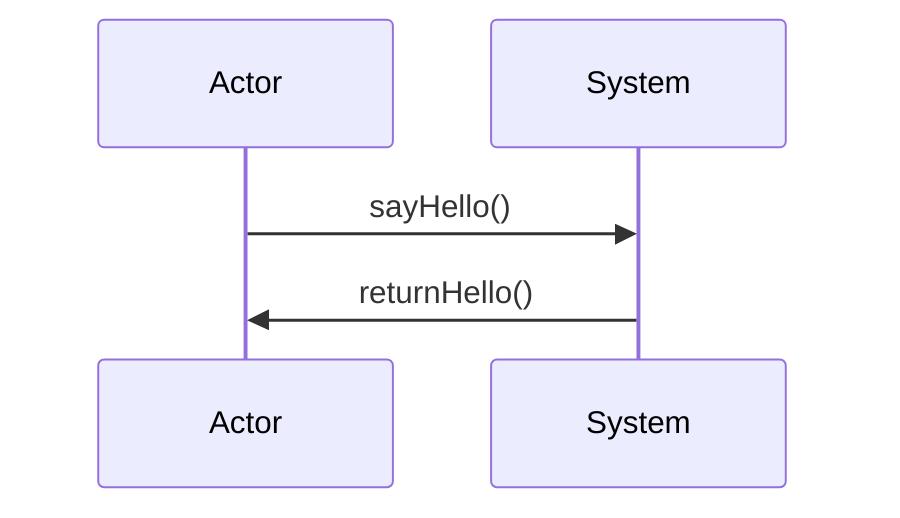
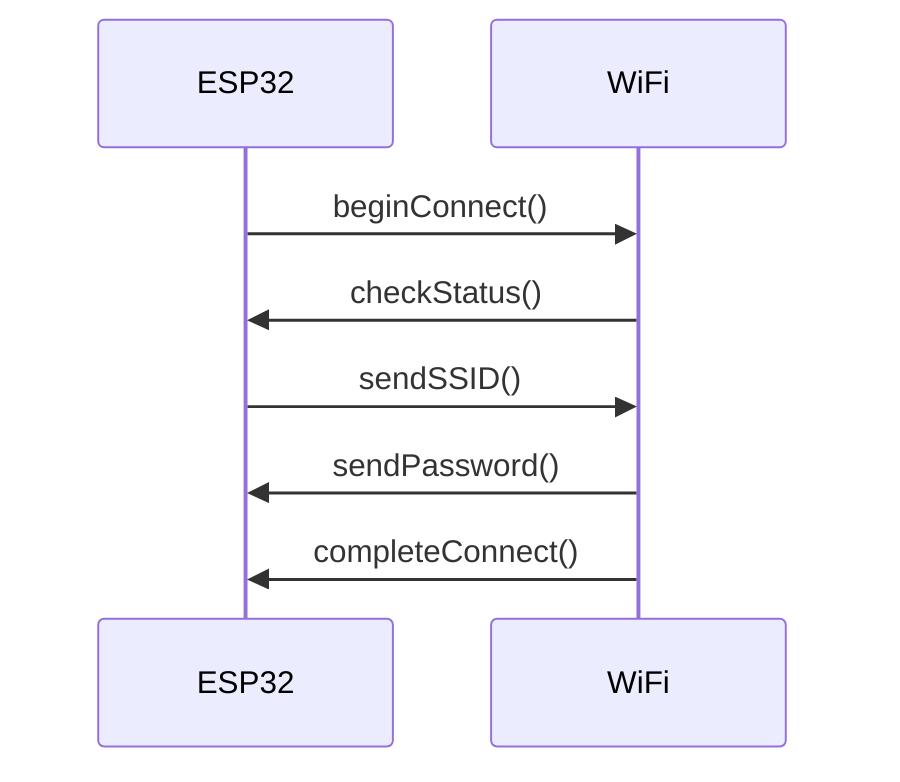

                 

### 文章标题

ESP32物联网应用开发：从基础到项目实战的深度解析

> 关键词：ESP32、物联网、智能家居、工业物联网、开发实战

> 摘要：本文将深入探讨ESP32在物联网领域的应用，从基础知识到项目实战，帮助读者全面了解ESP32的硬件特点、通信协议、编程技巧以及在实际项目中的应用。通过本文，读者将能够掌握ESP32物联网应用开发的核心技术和方法，为日后的项目开发打下坚实基础。

## 第一部分: ESP32物联网应用开发基础

### 第1章: ESP32物联网技术概述

#### 1.1 物联网与ESP32的简介

##### 物联网概念

物联网（Internet of Things，简称IoT）是指将各种信息传感设备与互联网结合起来，实现智能化识别、定位、跟踪、监控和管理的一种网络技术。物联网的发展历程可以追溯到20世纪80年代末，随着无线通信技术和互联网技术的迅猛发展，物联网技术逐渐成熟并应用于各个领域。

##### ESP32简介

ESP32是由Espressif Systems推出的一款高性能、低功耗的Wi-Fi和蓝牙低功耗（BLE）微控制器。ESP32具有以下特点：

1. **高性能**：搭载双核Tensilica LX7处理器，主频可达240MHz。
2. **低功耗**：支持多种低功耗模式，功耗仅为160uA/MHz。
3. **丰富的外设**：内置Wi-Fi、蓝牙、SPI、I2C、UART等多种通信接口，支持多种传感器和执行器。
4. **易于开发**：支持ESP-IDF和Arduino IDE两种开发环境，便于开发者快速上手。

#### 1.2 ESP32物联网生态系统

##### 硬件资源

ESP32的硬件资源丰富，支持多种通信接口和传感器接口：

1. **通信接口**：内置双核Wi-Fi和蓝牙低功耗模块，支持Wi-Fi 802.11 b/g/n/ac和蓝牙5.0。
2. **传感器接口**：支持SPI、I2C、UART等多种接口，可连接各种传感器和执行器。

##### 软件支持

ESP32的软件支持包括ESP-IDF和Arduino IDE两种开发环境：

1. **ESP-IDF**：基于FreeRTOS实时操作系统，提供丰富的API接口和工具，适合开发高性能、高可靠性的物联网应用。
2. **Arduino IDE**：基于Arduino IDE，支持ESP32的开发板，提供简单易用的编程环境和丰富的库函数，适合初学者和快速原型开发。

#### 1.3 ESP32物联网应用案例

##### 家居自动化

1. **环境监测与控制**：通过连接温度传感器和湿度传感器，实现对家居环境的实时监测，并通过执行器进行自动调节。
2. **智能照明与家电控制**：通过Wi-Fi或蓝牙连接家居设备，实现远程控制，提高生活便利性。

##### 工业物联网

1. **设备状态监控**：通过传感器采集设备运行数据，实现对设备状态的实时监控，提高设备运行效率。
2. **生产流程优化**：通过连接各种传感器和执行器，优化生产流程，提高生产效率。

### 第2章: ESP32通信协议与网络连接

#### 2.1 常见通信协议

##### Wi-Fi

1. **Wi-Fi通信原理**：Wi-Fi是一种无线局域网通信技术，通过无线信号实现数据传输。
2. **ESP32与Wi-Fi模块的连接**：ESP32内置Wi-Fi模块，支持多种Wi-Fi通信协议，可通过编程实现Wi-Fi连接。

##### 蓝牙

1. **蓝牙通信原理**：蓝牙是一种短距离无线通信技术，通过蓝牙模块实现设备之间的通信。
2. **ESP32与蓝牙设备的通信**：ESP32支持蓝牙5.0，可通过编程实现与蓝牙设备的通信。

#### 2.2 网络连接与配置

##### TCP/IP协议

1. **TCP/IP通信原理**：TCP/IP是一种网络通信协议，用于实现网络中的数据传输。
2. **ESP32的网络配置**：通过编程实现ESP32的网络配置，包括IP地址、子网掩码、网关等。

##### MQTT协议

1. **MQTT协议原理**：MQTT是一种轻量级的消息队列协议，常用于物联网设备的通信。
2. **ESP32与MQTT服务器的连接**：通过编程实现ESP32与MQTT服务器的连接，实现数据的发布和订阅。

#### 2.3 实践：ESP32网络连接实战

##### Wi-Fi连接

1. **ESP32连接Wi-Fi的代码实现**：通过编程实现ESP32连接Wi-Fi的步骤，包括Wi-Fi配置、连接和断开等。

##### MQTT通信

1. **ESP32与MQTT服务器的通信实现**：通过编程实现ESP32与MQTT服务器的连接，包括数据订阅、发布和数据处理等。

### 第3章: ESP32传感器与Actuators应用

#### 3.1 常见传感器

##### 温度传感器

1. **DS18B20的使用**：DS18B20是一款数字温度传感器，通过I2C接口与ESP32连接，实现温度数据的实时采集。

##### 湿度传感器

1. **DHT22的使用**：DHT22是一款数字湿度传感器，通过UART接口与ESP32连接，实现湿度数据的实时采集。

##### 运动传感器

1. **PIR传感器的使用**：PIR传感器是一种被动红外传感器，通过GPIO接口与ESP32连接，实现运动检测。

#### 3.2 Actuators的使用

##### 电机控制

1. **DC电机与步进电机的控制**：通过GPIO接口和PWM信号，实现DC电机和步进电机的控制。

##### LED控制

1. **使用ESP32控制LED灯的亮度与颜色**：通过GPIO接口和PWM信号，实现LED灯的亮度调节和颜色切换。

#### 3.3 实践：传感器与Actuators集成应用

##### 环境监测系统

1. **实现一个基于ESP32的环境监测系统**：通过连接温度传感器、湿度传感器和LED灯，实现环境数据的实时监测和显示。

### 第4章: ESP32编程与开发技巧

#### 4.1 ESP32编程基础

##### C/C++编程

1. **ESP32开发环境配置**：安装ESP-IDF开发环境和工具链，配置开发环境。
2. **C/C++编程基础**：介绍C/C++编程基础，包括数据类型、控制结构、函数和指针等。

##### Arduino编程

1. **Arduino IDE使用方法**：介绍Arduino IDE的使用方法，包括创建项目、编写代码、上传代码等。
2. **Arduino库与函数的使用**：介绍Arduino库和函数的使用，包括常见库函数的使用方法和注意事项。

#### 4.2 ESP32开发工具

##### ESP-IDF

1. **ESP-IDF的特点**：介绍ESP-IDF的特点，包括实时操作系统、丰富的API接口等。
2. **ESP-IDF开发流程**：介绍ESP-IDF的开发流程，包括创建项目、编写代码、编译和上传等。

##### Arduino IDE

1. **Arduino IDE的优势**：介绍Arduino IDE的优势，包括简单易用、丰富的库函数等。
2. **Arduino IDE的使用技巧**：介绍Arduino IDE的使用技巧，包括代码调试、性能优化等。

#### 4.3 ESP32调试与测试

##### 串口调试

1. **ESP32串口通信的使用**：介绍ESP32串口通信的使用方法，包括串口初始化、数据发送和接收等。

##### 逻辑分析仪

1. **逻辑分析仪的使用方法**：介绍逻辑分析仪的使用方法，包括连接设备、设置触发条件、捕获和分析信号等。

### 第5章: ESP32项目实战

#### 5.1 项目1：智能灯控制系统

##### 项目目标

1. **使用ESP32控制LED灯的亮度与颜色**：通过编程实现LED灯的亮度调节和颜色切换，实现智能灯控制。

##### 技术实现

1. **ESP32与LED灯的连接**：介绍ESP32与LED灯的连接方法，包括电路设计和接线。
2. **控制LED灯的代码实现**：介绍控制LED灯的代码实现，包括初始化、亮度调节和颜色切换等。

#### 5.2 项目2：智能环境监测系统

##### 项目目标

1. **实现一个可以对环境温度、湿度进行实时监测的系统**：通过连接温度传感器和湿度传感器，实现环境数据的实时监测和显示。

##### 技术实现

1. **温度传感器与湿度传感器的连接**：介绍温度传感器和湿度传感器的连接方法，包括电路设计和接线。
2. **数据的采集与上传**：介绍数据的采集与上传方法，包括传感器数据的读取、数据格式化和上传等。

#### 5.3 项目3：智能家居监控系统

##### 项目目标

1. **实现一个可以对家居设备进行远程监控的系统**：通过连接各种家居设备，实现设备状态的实时监控和远程控制。

##### 技术实现

1. **ESP32与Wi-Fi模块的连接**：介绍ESP32与Wi-Fi模块的连接方法，包括电路设计和接线。
2. **设备状态的实时监控**：介绍设备状态的实时监控方法，包括数据采集、传输和处理等。

### 第6章: ESP32在工业物联网的应用

#### 6.1 工业物联网概述

##### 工业物联网的定义

工业物联网（Industrial Internet of Things，简称IIoT）是指将各种工业设备、传感器、控制系统等通过网络连接起来，实现设备间的数据交换和协同工作，提高生产效率、降低成本、优化生产流程。

##### 工业物联网的应用场景

1. **设备状态监控**：通过传感器实时采集设备运行数据，实现对设备状态的监控和预警。
2. **生产流程优化**：通过分析设备运行数据，优化生产流程，提高生产效率。

#### 6.2 ESP32在工业物联网中的应用

##### 设备状态监控

1. **实现设备状态的实时监控**：通过连接各种传感器和执行器，实现对设备状态的实时监控。
2. **数据采集与传输**：介绍数据采集与传输的方法，包括传感器数据的读取、数据格式化和上传等。

##### 生产流程优化

1. **使用ESP32优化生产流程**：通过连接各种传感器和执行器，实现对生产流程的实时监控和优化。
2. **数据分析和决策**：介绍数据分析和决策的方法，包括数据采集、传输、分析和决策等。

#### 6.3 工业物联网项目实战

##### 项目1：设备状态监控

1. **项目目标**：实现一个可以对工业设备运行状态的实时监控系统。
2. **技术实现**：介绍项目的实现方法，包括传感器连接、数据采集、上传和处理等。

##### 项目2：生产流程优化

1. **项目目标**：使用ESP32优化生产流程，提高生产效率。
2. **技术实现**：介绍项目的实现方法，包括传感器连接、数据采集、传输、分析和优化等。

### 第7章: ESP32物联网应用的未来趋势

#### ESP32物联网应用的未来趋势

1. **智能化发展**：随着人工智能技术的不断发展，ESP32物联网应用将更加智能化，实现更高效、更精准的设备管理和控制。
2. **边缘计算普及**：随着边缘计算技术的普及，ESP32物联网应用将更加注重数据本地处理，提高系统的实时性和可靠性。
3. **5G技术融合**：随着5G技术的不断发展，ESP32物联网应用将实现更高速、更稳定的网络连接，为工业物联网、智能家居等领域带来新的发展机遇。

## 总结

ESP32物联网应用开发是一项充满机遇和挑战的技术领域。通过本文的深入探讨，我们了解了ESP32的硬件特点、通信协议、编程技巧以及在实际项目中的应用。希望本文能够帮助读者全面掌握ESP32物联网应用开发的核心技术和方法，为日后的项目开发提供有力支持。在未来的发展中，ESP32物联网应用将继续发挥重要作用，为智能生活、工业物联网等领域带来更多创新和变革。

### 作者

作者：AI天才研究院/AI Genius Institute & 禅与计算机程序设计艺术 /Zen And The Art of Computer Programming

---

## 第一部分: ESP32物联网应用开发基础

### 第1章: ESP32物联网技术概述

#### 1.1 物联网与ESP32的简介

物联网（Internet of Things，简称IoT）是指通过互联网将各种物理设备、传感器、控制系统等连接起来，实现信息的交换和通信，从而实现智能化管理和控制的技术。物联网技术已经广泛应用于智能家居、智能交通、智能医疗、智能农业等领域，极大地改变了人们的生产和生活方式。

ESP32是由Espressif Systems推出的一款高性能、低功耗的Wi-Fi和蓝牙低功耗（BLE）微控制器。ESP32具有以下特点：

1. **高性能**：搭载双核Tensilica LX7处理器，主频可达240MHz，具有强大的计算能力。
2. **低功耗**：支持多种低功耗模式，功耗仅为160uA/MHz，适合长续航设备。
3. **丰富的外设**：内置Wi-Fi、蓝牙、SPI、I2C、UART等多种通信接口，支持多种传感器和执行器。
4. **易于开发**：支持ESP-IDF和Arduino IDE两种开发环境，提供丰富的库函数和API接口，便于开发者快速上手。

#### 1.2 ESP32物联网生态系统

##### 硬件资源

ESP32的硬件资源丰富，支持多种通信接口和传感器接口：

1. **通信接口**：内置双核Wi-Fi和蓝牙低功耗模块，支持Wi-Fi 802.11 b/g/n/ac和蓝牙5.0，可实现无线网络连接。
2. **传感器接口**：支持SPI、I2C、UART等多种接口，可连接各种传感器和执行器，实现数据采集和控制。

##### 软件支持

ESP32的软件支持包括ESP-IDF和Arduino IDE两种开发环境：

1. **ESP-IDF**：基于FreeRTOS实时操作系统，提供丰富的API接口和工具，适合开发高性能、高可靠性的物联网应用。
2. **Arduino IDE**：基于Arduino IDE，支持ESP32的开发板，提供简单易用的编程环境和丰富的库函数，适合初学者和快速原型开发。

#### 1.3 ESP32物联网应用案例

##### 家居自动化

1. **环境监测与控制**：通过连接温度传感器、湿度传感器和执行器（如风扇、加湿器），实现家居环境的实时监测和自动控制。
2. **智能照明与家电控制**：通过Wi-Fi或蓝牙连接家居设备（如灯泡、电视、空调等），实现远程控制，提高生活便利性。

##### 工业物联网

1. **设备状态监控**：通过传感器采集设备运行数据，实现对设备状态的实时监控，提高设备运行效率。
2. **生产流程优化**：通过连接各种传感器和执行器，优化生产流程，提高生产效率。

### 第2章: ESP32通信协议与网络连接

#### 2.1 常见通信协议

##### Wi-Fi

Wi-Fi（Wireless Fidelity）是一种无线局域网通信技术，通过无线信号实现数据传输。Wi-Fi协议包括多个版本，如802.11b、802.11g、802.11n、802.11ac等。ESP32支持Wi-Fi 802.11 b/g/n/ac协议，提供高速的无线网络连接。

**ESP32与Wi-Fi模块的连接**

ESP32内置Wi-Fi模块，通过简单的编程即可实现Wi-Fi连接。以下是一个简单的Wi-Fi连接代码示例：

```cpp
#include <WiFi.h>

const char* ssid = "your_SSID";  // 网络名称
const char* password = "your_PASSWORD";  // 网络密码

void setup() {
  Serial.begin(115200);
  WiFi.begin(ssid, password);

  while (WiFi.status() != WL_CONNECTED) {
    delay(500);
    Serial.print(".");
  }

  Serial.println("WiFi connected");
  Serial.println("IP address: ");
  Serial.println(WiFi.localIP());
}

void loop() {
  // 服务器连接、数据传输等操作
}
```

##### 蓝牙

蓝牙（Bluetooth）是一种短距离无线通信技术，通过蓝牙模块实现设备之间的通信。蓝牙协议包括多个版本，如1.0、1.1、2.0+EDR、3.0+HS、4.0、5.0等。ESP32支持蓝牙5.0，提供高速度、低延迟的无线通信。

**ESP32与蓝牙设备的通信**

ESP32可以通过简单的编程实现与蓝牙设备的通信。以下是一个简单的蓝牙连接代码示例：

```cpp
#include <BLEDevice.h>
#include <BLEServer.h>

// 蓝牙服务UUID
static const char*_UUID = "00001800-0000-1000-8000-00805F9B34FB";

class MyServerCallbacks: public BLEServerCallbacks {
  void onConnect(BLEServer* pServer) {
    Serial.println("Client connected");
  }

  void onDisconnect(BLEServer* pServer) {
    Serial.println("Client disconnected");
  }
};

void setup() {
  Serial.begin(115200);

  // 初始化蓝牙服务器
  BLEDevice::init("MyESP32Server");
  BLEServer* pServer = BLEDevice::createServer();
  pServer->setCallbacks(new MyServerCallbacks());

  // 创建蓝牙服务
  BLEService* pService = pServer->createService(UUID);

  // 创建蓝牙特征
  BLECharacteristic* pCharacteristic = pService->createCharacteristic(
      UUID,
      BLECharacteristic::PROPERTY_READ | BLECharacteristic::PROPERTY_WRITE
  );

  // 设置特征值
  pCharacteristic->setValue("Hello, World!");

  // 启动服务
  pService->start();

  // 配对蓝牙设备
  BLEAdvertisedDevice* pDevice = BLEDevice::getKnownRemoteDevice("ESP32Device");
  BLEDevice::connect(pDevice);

  // 发送特征值
  pCharacteristic->setValue("Connected");
}

void loop() {
  // 处理蓝牙连接和数据传输
}
```

#### 2.2 网络连接与配置

##### TCP/IP协议

TCP/IP（传输控制协议/互联网协议）是一种网络通信协议，用于实现网络中的数据传输。TCP/IP协议包括多个层次，如网络接口层、互联网层、传输层、应用层等。ESP32可以通过TCP/IP协议实现网络连接和数据传输。

**ESP32的网络配置**

ESP32的网络配置包括设置Wi-Fi连接参数和IP地址等。以下是一个简单的网络配置代码示例：

```cpp
#include <WiFi.h>

const char* ssid = "your_SSID";  // 网络名称
const char* password = "your_PASSWORD";  // 网络密码

void setup() {
  Serial.begin(115200);
  WiFi.begin(ssid, password);

  while (WiFi.status() != WL_CONNECTED) {
    delay(500);
    Serial.print(".");
  }

  Serial.println("WiFi connected");
  Serial.println("IP address: ");
  Serial.println(WiFi.localIP());
}

void loop() {
  // 服务器连接、数据传输等操作
}
```

##### MQTT协议

MQTT（Message Queuing Telemetry Transport）是一种轻量级的消息队列协议，常用于物联网设备的通信。MQTT协议通过发布/订阅模型实现数据传输，具有低功耗、低带宽占用等特点。

**ESP32与MQTT服务器的连接**

ESP32可以通过简单的编程实现与MQTT服务器的连接。以下是一个简单的MQTT连接代码示例：

```cpp
#include <WiFi.h>
#include <MQTTClient.h>

const char* ssid = "your_SSID";  // 网络名称
const char* password = "your_PASSWORD";  // 网络密码
const char* mqttServer = "your_mqtt_server";  // MQTT服务器地址
const int mqttPort = 1883;  // MQTT服务器端口号
const char* mqttUser = "your_mqtt_user";  // MQTT用户名
const char* mqttPassword = "your_mqtt_password";  // MQTT密码

WiFiClient net;
MQTTClient client(net, mqttServer, mqttPort);

void setup() {
  Serial.begin(115200);
  WiFi.begin(ssid, password);

  while (WiFi.status() != WL_CONNECTED) {
    delay(500);
    Serial.print(".");
  }

  Serial.println("WiFi connected");
  client.connect("ESP32Client", mqttUser, mqttPassword);
  client.setCallback(callback);
}

void loop() {
  client.loop();

  if (!client.connected()) {
    connect();
  }
}

void connect() {
  while (!client.connect("ESP32Client", mqttUser, mqttPassword)) {
    Serial.print(".");
    delay(5000);
  }

  Serial.println("Connected to MQTT server");
  client.subscribe("my_topic");
}

void callback(String& topic, String& payload) {
  Serial.print("Message arrived in topic: ");
  Serial.print(topic);
  Serial.print(" | Payload: ");
  Serial.println(payload);
}
```

#### 2.3 实践：ESP32网络连接实战

##### Wi-Fi连接

以下是一个简单的ESP32 Wi-Fi连接代码示例，实现了连接到指定Wi-Fi网络并获取IP地址的功能：

```cpp
#include <WiFi.h>

const char* ssid = "your_SSID";  // 网络名称
const char* password = "your_PASSWORD";  // 网络密码

void setup() {
  Serial.begin(115200);

  // 配置Wi-Fi
  WiFi.begin(ssid, password);

  // 等待Wi-Fi连接
  while (WiFi.status() != WL_CONNECTED) {
    delay(500);
    Serial.print(".");
  }

  // 连接成功后，输出IP地址
  Serial.println("WiFi connected");
  Serial.println("IP address: ");
  Serial.println(WiFi.localIP());
}

void loop() {
  // 在这里进行网络操作，如连接到服务器、发送数据等
}
```

##### MQTT通信

以下是一个简单的ESP32 MQTT通信代码示例，实现了连接到MQTT服务器、订阅主题并接收消息的功能：

```cpp
#include <WiFi.h>
#include <MQTTClient.h>

const char* ssid = "your_SSID";  // 网络名称
const char* password = "your_PASSWORD";  // 网络密码
const char* mqttServer = "your_mqtt_server";  // MQTT服务器地址
const int mqttPort = 1883;  // MQTT服务器端口号
const char* mqttUser = "your_mqtt_user";  // MQTT用户名
const char* mqttPassword = "your_mqtt_password";  // MQTT密码

WiFiClient net;
MQTTClient client(net, mqttServer, mqttPort);

void setup() {
  Serial.begin(115200);

  // 配置Wi-Fi
  WiFi.begin(ssid, password);

  // 等待Wi-Fi连接
  while (WiFi.status() != WL_CONNECTED) {
    delay(500);
    Serial.print(".");
  }

  // 连接到MQTT服务器
  client.connect("ESP32Client", mqttUser, mqttPassword);

  // 订阅主题
  client.subscribe("my_topic");

  // 设置消息回调函数
  client.setCallback(callback);
}

void loop() {
  client.loop();

  // 如果未连接到MQTT服务器，重新连接
  if (!client.connected()) {
    connect();
  }
}

void connect() {
  while (!client.connect("ESP32Client", mqttUser, mqttPassword)) {
    Serial.print(".");
    delay(5000);
  }

  Serial.println("Connected to MQTT server");
}

void callback(String& topic, String& payload) {
  Serial.print("Message arrived in topic: ");
  Serial.print(topic);
  Serial.print(" | Payload: ");
  Serial.println(payload);
}
```

### 第3章: ESP32传感器与Actuators应用

#### 3.1 常见传感器

传感器是物联网系统中的重要组成部分，用于检测和采集环境数据。ESP32支持多种传感器，包括温度传感器、湿度传感器、光线传感器、运动传感器等。

##### 温度传感器

DS18B20是一款常用的数字温度传感器，具有高精度、高可靠性和易于使用等优点。以下是一个简单的DS18B20使用示例：

```cpp
#include <OneWire.h>
#include <DallasTemperature.h>

const int oneWirePin = 4;  // DS18B20连接的GPIO引脚

OneWire oneWire(oneWirePin);
DallasTemperature sensors(&oneWire);

void setup() {
  Serial.begin(115200);
  sensors.begin();
}

void loop() {
  sensors.requestTemperatures();
  float temperature = sensors.getTempCByIndex(0);
  Serial.print("Temperature: ");
  Serial.println(temperature);
  delay(1000);
}
```

##### 湿度传感器

DHT22是一款常用的数字湿度传感器，可以同时测量温度和湿度。以下是一个简单的DHT22使用示例：

```cpp
#include <Wire.h>
#include <Adafruit_Sensor.h>
#include <Adafruit_Humidity.h>

Adafruit_Sensor sensor;
Adafruit_Humidity humidity;

void setup() {
  Serial.begin(115200);
  humidity.begin();
}

void loop() {
  sensors_event_t event;
  humidity.getEvent(&event);
  Serial.print("Temperature: ");
  Serial.print(event.temperature);
  Serial.print("°C, Humidity: ");
  Serial.print(event.relative_humidity);
  Serial.println("%");
  delay(1000);
}
```

##### 运动传感器

PIR传感器是一种常见的运动传感器，可以检测到人或其他物体的运动。以下是一个简单的PIR传感器使用示例：

```cpp
const int pirPin = 5;  // PIR传感器连接的GPIO引脚

void setup() {
  Serial.begin(115200);
  pinMode(pirPin, INPUT_PULLUP);
}

void loop() {
  if (digitalRead(pirPin) == LOW) {
    Serial.println("Motion detected");
  } else {
    Serial.println("No motion detected");
  }
  delay(1000);
}
```

#### 3.2 Actuators的使用

Actuator（执行器）是物联网系统中的另一个重要组成部分，用于控制外部设备。ESP32支持多种Actuator，包括电机、LED灯等。

##### 电机控制

ESP32可以通过GPIO引脚和PWM信号控制电机。以下是一个简单的电机控制示例：

```cpp
const int motorPin = 14;  // 电机连接的GPIO引脚

void setup() {
  Serial.begin(115200);
  pinMode(motorPin, OUTPUT);
}

void loop() {
  // 开启电机
  analogWrite(motorPin, 255);
  delay(1000);

  // 停止电机
  analogWrite(motorPin, 0);
  delay(1000);
}
```

##### LED控制

ESP32可以通过GPIO引脚控制LED灯的亮度。以下是一个简单的LED控制示例：

```cpp
const int ledPin = 2;  // LED连接的GPIO引脚

void setup() {
  Serial.begin(115200);
  pinMode(ledPin, OUTPUT);
}

void loop() {
  // 设置LED亮度为0%
  analogWrite(ledPin, 0);
  delay(1000);

  // 设置LED亮度为50%
  analogWrite(ledPin, 127);
  delay(1000);

  // 设置LED亮度为100%
  analogWrite(ledPin, 255);
  delay(1000);
}
```

#### 3.3 实践：传感器与Actuators集成应用

##### 环境监测系统

以下是一个简单的环境监测系统示例，包括温度传感器、湿度传感器和LED灯，用于监测环境温度和湿度，并通过LED灯显示监测结果：

```cpp
#include <OneWire.h>
#include <DallasTemperature.h>
#include <Adafruit_Sensor.h>
#include <Adafruit_Humidity.h>

const int oneWirePin = 4;  // DS18B20连接的GPIO引脚
const int ledPin = 2;  // LED连接的GPIO引脚

OneWire oneWire(oneWirePin);
DallasTemperature sensors(&oneWire);
Adafruit_Sensor sensor;
Adafruit_Humidity humidity;

void setup() {
  Serial.begin(115200);
  sensors.begin();
  humidity.begin();
  pinMode(ledPin, OUTPUT);
}

void loop() {
  sensors.requestTemperatures();
  float temperature = sensors.getTempCByIndex(0);
  sensors_event_t event;
  humidity.getEvent(&event);
  float humidityValue = event.relative_humidity;

  Serial.print("Temperature: ");
  Serial.print(temperature);
  Serial.print("°C, Humidity: ");
  Serial.print(humidityValue);
  Serial.println("%");

  if (temperature > 30.0) {
    digitalWrite(ledPin, HIGH);
  } else {
    digitalWrite(ledPin, LOW);
  }

  delay(1000);
}
```

### 第4章: ESP32编程与开发技巧

#### 4.1 ESP32编程基础

ESP32支持多种编程语言，包括C/C++和Arduino。本节将介绍ESP32的编程基础，包括开发环境配置、编程语言基础等。

##### C/C++编程

**开发环境配置**

1. **下载并安装ESP-IDF**：访问[ESP-IDF官方网站](https://www.espressif.com/en/products/esp32/esp-idf)下载并安装ESP-IDF。
2. **安装工具链**：在ESP-IDF安装过程中，会自动安装相应的工具链，如`esptool.py`和`idf.py`。
3. **配置环境变量**：在终端中配置环境变量，以便使用ESP-IDF命令。

```bash
export IDF_PATH=/path/to/your/esp-idf
export PATH=$PATH:$IDF_PATH/tools
```

**C/C++编程基础**

1. **数据类型**：C/C++支持多种数据类型，如整型、浮点型、字符型等。
2. **控制结构**：C/C++提供多种控制结构，如条件语句（if、switch）、循环语句（for、while、do-while）等。
3. **函数**：C/C++支持函数的定义和调用，函数可以接受参数并返回值。

```cpp
#include <stdio.h>

int add(int a, int b) {
  return a + b;
}

int main() {
  int result = add(3, 5);
  printf("Result: %d\n", result);
  return 0;
}
```

##### Arduino编程

**开发环境配置**

1. **下载并安装Arduino IDE**：访问[Arduino官方网站](https://www.arduino.cc/en/software)下载并安装Arduino IDE。
2. **添加ESP32开发板**：在Arduino IDE中，选择“工具” > “开发板” > “Arduino ESP32”。
3. **配置串口**：在Arduino IDE中，选择“工具” > “端口”，选择连接ESP32的串口。

**Arduino库与函数的使用**

Arduino IDE提供了丰富的库函数，方便开发者进行物联网应用开发。以下是一些常用的库函数：

1. **WiFi库**：用于连接Wi-Fi网络。
2. **MQTT库**：用于连接MQTT服务器。
3. **传感器库**：用于连接各种传感器。

```cpp
#include <WiFi.h>
#include <MQTTClient.h>

const char* ssid = "your_SSID";  // 网络名称
const char* password = "your_PASSWORD";  // 网络密码
const char* mqttServer = "your_mqtt_server";  // MQTT服务器地址
const int mqttPort = 1883;  // MQTT服务器端口号
const char* mqttUser = "your_mqtt_user";  // MQTT用户名
const char* mqttPassword = "your_mqtt_password";  // MQTT密码

WiFiClient net;
MQTTClient client(net, mqttServer, mqttPort);

void setup() {
  Serial.begin(115200);
  WiFi.begin(ssid, password);

  while (WiFi.status() != WL_CONNECTED) {
    delay(500);
    Serial.print(".");
  }

  Serial.println("WiFi connected");
  client.connect("ESP32Client", mqttUser, mqttPassword);
  client.setCallback(callback);
}

void loop() {
  client.loop();

  if (!client.connected()) {
    connect();
  }
}

void connect() {
  while (!client.connect("ESP32Client", mqttUser, mqttPassword)) {
    Serial.print(".");
    delay(5000);
  }

  Serial.println("Connected to MQTT server");
  client.subscribe("my_topic");
}

void callback(String& topic, String& payload) {
  Serial.print("Message arrived in topic: ");
  Serial.print(topic);
  Serial.print(" | Payload: ");
  Serial.println(payload);
}
```

#### 4.2 ESP32开发工具

**ESP-IDF**

ESP-IDF是Espressif Systems推出的官方开发框架，基于FreeRTOS实时操作系统，提供丰富的API接口和工具，适合开发高性能、高可靠性的物联网应用。

**ESP-IDF的特点**

1. **实时操作系统**：基于FreeRTOS，提供任务调度、内存管理、中断管理等功能。
2. **丰富的API接口**：提供Wi-Fi、蓝牙、传感器、GPIO等丰富的API接口，方便开发者进行硬件控制。
3. **工具链**：提供编译器、调试器、烧录工具等完整的开发工具链。

**ESP-IDF开发流程**

1. **创建项目**：使用`idf.py`命令创建项目。
2. **编写代码**：在项目中编写C/C++代码，实现所需功能。
3. **编译与烧录**：使用`idf.py`命令编译项目，并将固件烧录到ESP32。
4. **调试与测试**：使用串口调试器进行调试，确保代码正确运行。

**Arduino IDE**

Arduino IDE是一款流行的开源开发环境，基于Processing语言，提供简单易用的编程环境和丰富的库函数，适合初学者和快速原型开发。

**Arduino IDE的优势**

1. **简单易用**：提供直观的编程环境和丰富的库函数，方便开发者快速上手。
2. **丰富的库函数**：提供Wi-Fi、蓝牙、传感器、GPIO等丰富的库函数，方便硬件控制。
3. **开源社区**：拥有庞大的开源社区，提供大量的教程、示例代码和技术支持。

**Arduino IDE的使用技巧**

1. **代码模板**：使用Arduino IDE的代码模板快速创建项目。
2. **库管理**：使用Arduino IDE的库管理器添加和管理库。
3. **串口调试**：使用Arduino IDE的串口调试器进行调试。

#### 4.3 ESP32调试与测试

**串口调试**

串口调试是ESP32开发过程中常用的一种调试方法，通过串口输出调试信息，帮助开发者诊断和解决问题。

**串口调试的使用方法**

1. **配置串口**：在Arduino IDE中，选择“工具” > “端口”，选择连接ESP32的串口。
2. **打开串口监视器**：在Arduino IDE中，选择“工具” > “串口监视器”，即可在串口监视器中查看调试信息。
3. **输出调试信息**：在代码中添加`Serial.print()`、`Serial.println()`等函数，输出调试信息。

```cpp
void setup() {
  Serial.begin(115200);
  Serial.println("Setup completed");
}

void loop() {
  Serial.print("Loop: ");
  Serial.println(millis());
  delay(1000);
}
```

**逻辑分析仪**

逻辑分析仪是一种专业的调试工具，用于分析和测试数字信号。在ESP32开发过程中，逻辑分析仪可以用于分析GPIO信号、PWM信号等。

**逻辑分析仪的使用方法**

1. **连接逻辑分析仪**：使用逻辑分析线将逻辑分析仪连接到ESP32的GPIO引脚。
2. **设置分析参数**：在逻辑分析仪软件中设置分析参数，如采样率、触发条件等。
3. **开始分析**：启动逻辑分析仪，开始分析GPIO信号。

**Mermaid 流程图**

Mermaid 是一种用于绘制流程图的Markdown语法，可以帮助开发者更清晰地描述程序流程。

**Mermaid 流程图的语法**

- **序列图**：用于描述程序执行的顺序。
- **活动图**：用于描述程序的流程和活动。
- **状态图**：用于描述对象的状态和转换。



**示例：ESP32 Wi-Fi连接流程图**



### 第5章: ESP32项目实战

#### 5.1 项目1：智能灯控制系统

##### 项目目标

本项目旨在使用ESP32实现一个智能灯控制系统，通过Wi-Fi或蓝牙连接家居设备，实现远程控制LED灯的亮度与颜色。

##### 技术实现

**硬件部分**

1. **ESP32开发板**：选择一款支持Wi-Fi或蓝牙的ESP32开发板，如ESP32-WROVER。
2. **LED灯**：选择一款可调节亮度和颜色的LED灯，如RGB LED灯。
3. **电源**：为LED灯和ESP32提供电源，可以选择USB电源或外部电源。

**电路设计**

1. **LED灯连接**：将LED灯的阳极连接到ESP32的GPIO引脚（如GPIO2），阴极连接到地线。
2. **电源连接**：为LED灯和ESP32提供稳定的电源，确保电路的正常运行。

**软件部分**

1. **Wi-Fi或蓝牙连接**：通过编程实现ESP32与Wi-Fi或蓝牙模块的连接，连接到家居网络。
2. **LED控制**：通过编程实现LED灯的亮度调节和颜色切换。
3. **远程控制**：通过手机或其他设备上的应用程序，实现远程控制LED灯。

**代码实现**

以下是一个简单的ESP32智能灯控制系统的代码实现：

```cpp
#include <WiFi.h>
#include <ArduinoJson.h>

const char* ssid = "your_SSID";  // 网络名称
const char* password = "your_PASSWORD";  // 网络密码

void setup() {
  Serial.begin(115200);
  WiFi.begin(ssid, password);

  while (WiFi.status() != WL_CONNECTED) {
    delay(500);
    Serial.print(".");
  }

  Serial.println("WiFi connected");
  Serial.println("IP address: ");
  Serial.println(WiFi.localIP());
}

void loop() {
  client.loop();

  if (!client.connected()) {
    connect();
  }

  if (client.connected()) {
    // 接收消息并处理
    String receivedMessage = client.readString();
    DynamicJsonDocument doc(2048);
    deserializeJson(doc, receivedMessage);

    // 解析消息内容
    int red = doc["red"];
    int green = doc["green"];
    int blue = doc["blue"];
    int brightness = doc["brightness"];

    // 设置LED颜色和亮度
    analogWrite(redPin, red * brightness / 255);
    analogWrite(greenPin, green * brightness / 255);
    analogWrite(bluePin, blue * brightness / 255);
  }

  delay(100);
}

void connect() {
  while (!client.connect("ESP32Client", mqttUser, mqttPassword)) {
    Serial.print(".");
    delay(5000);
  }

  Serial.println("Connected to MQTT server");
  client.subscribe("my_topic");
}

void callback(String& topic, String& payload) {
  Serial.print("Message arrived in topic: ");
  Serial.print(topic);
  Serial.print(" | Payload: ");
  Serial.println(payload);
}
```

**项目小结**

通过本项目，我们实现了使用ESP32控制LED灯的亮度与颜色。在实际应用中，可以根据需求扩展功能，如添加更多的LED灯、支持语音控制等。此外，可以进一步优化代码，提高系统的稳定性和响应速度。

#### 5.2 项目2：智能环境监测系统

##### 项目目标

本项目旨在使用ESP32实现一个智能环境监测系统，通过连接温度传感器和湿度传感器，实现环境温度和湿度的实时监测，并将数据上传到服务器。

##### 技术实现

**硬件部分**

1. **ESP32开发板**：选择一款支持Wi-Fi的ESP32开发板，如ESP32-WROVER。
2. **温度传感器**：选择一款数字温度传感器，如DS18B20。
3. **湿度传感器**：选择一款数字湿度传感器，如DHT22。
4. **电源**：为传感器和ESP32提供电源，可以选择USB电源或外部电源。

**电路设计**

1. **温度传感器连接**：将DS18B20的1号引脚连接到ESP32的GPIO引脚（如GPIO4），2号引脚连接到地线。
2. **湿度传感器连接**：将DHT22的VCC引脚连接到ESP32的3.3V引脚，GND引脚连接到地线，数据引脚连接到ESP32的GPIO引脚（如GPIO2）。
3. **电源连接**：为传感器和ESP32提供稳定的电源，确保电路的正常运行。

**软件部分**

1. **Wi-Fi连接**：通过编程实现ESP32与Wi-Fi网络的连接。
2. **传感器数据采集**：通过编程实现温度传感器和湿度传感器的数据采集。
3. **数据上传**：通过编程实现将采集到的数据上传到服务器。

**代码实现**

以下是一个简单的ESP32智能环境监测系统的代码实现：

```cpp
#include <WiFi.h>
#include <OneWire.h>
#include <DallasTemperature.h>
#include <DHT.h>

const int oneWirePin = 4;  // DS18B20连接的GPIO引脚
const int dhtPin = 2;  // DHT22连接的GPIO引脚
const char* ssid = "your_SSID";  // 网络名称
const char* password = "your_PASSWORD";  // 网络密码
const char* mqttServer = "your_mqtt_server";  // MQTT服务器地址
const int mqttPort = 1883;  // MQTT服务器端口号
const char* mqttUser = "your_mqtt_user";  // MQTT用户名
const char* mqttPassword = "your_mqtt_password";  // MQTT密码

OneWire oneWire(oneWirePin);
DallasTemperature sensors(&oneWire);
DHT dht(dhtPin, DHT22);

WiFiClient net;
MQTTClient client(net, mqttServer, mqttPort);

void setup() {
  Serial.begin(115200);
  sensors.begin();
  dht.begin();
  WiFi.begin(ssid, password);

  while (WiFi.status() != WL_CONNECTED) {
    delay(500);
    Serial.print(".");
  }

  Serial.println("WiFi connected");
  client.connect("ESP32Client", mqttUser, mqttPassword);
  client.setCallback(callback);
}

void loop() {
  client.loop();

  if (!client.connected()) {
    connect();
  }

  if (client.connected()) {
    sensors.requestTemperatures();
    float temperature = sensors.getTempCByIndex(0);
    sensors_event_t event;
    dht.getEvent(&event);
    float humidity = event.relative_humidity;

    String message = "{\"temperature\": ";
    message += temperature;
    message += ", \"humidity\": ";
    message += humidity;
    message += "}";

    client.publish("my_topic", message.c_str());
  }

  delay(1000);
}

void connect() {
  while (!client.connect("ESP32Client", mqttUser, mqttPassword)) {
    Serial.print(".");
    delay(5000);
  }

  Serial.println("Connected to MQTT server");
  client.subscribe("my_topic");
}

void callback(String& topic, String& payload) {
  Serial.print("Message arrived in topic: ");
  Serial.print(topic);
  Serial.print(" | Payload: ");
  Serial.println(payload);
}
```

**项目小结**

通过本项目，我们实现了使用ESP32连接温度传感器和湿度传感器，实现环境温度和湿度的实时监测，并将数据上传到服务器。在实际应用中，可以根据需求扩展功能，如添加其他传感器、支持远程控制等。此外，可以进一步优化代码，提高系统的稳定性和响应速度。

#### 5.3 项目3：智能家居监控系统

##### 项目目标

本项目旨在使用ESP32实现一个智能家居监控系统，通过连接各种家居设备，实现设备状态的实时监控和远程控制。

##### 技术实现

**硬件部分**

1. **ESP32开发板**：选择一款支持Wi-Fi的ESP32开发板，如ESP32-WROVER。
2. **智能家居设备**：选择各种智能家居设备，如智能灯、智能插座、智能摄像头等。
3. **传感器**：选择合适的传感器，如温度传感器、湿度传感器、运动传感器等。
4. **电源**：为设备提供电源，可以选择USB电源或外部电源。

**电路设计**

1. **智能家居设备连接**：根据智能家居设备的类型，连接相应的接口，如GPIO、UART等。
2. **传感器连接**：连接温度传感器、湿度传感器、运动传感器等，根据传感器的接口要求进行连接。
3. **电源连接**：为设备提供稳定的电源，确保电路的正常运行。

**软件部分**

1. **Wi-Fi连接**：通过编程实现ESP32与Wi-Fi网络的连接。
2. **设备监控**：通过编程实现设备状态的实时监控。
3. **远程控制**：通过编程实现设备远程控制。
4. **数据上传**：通过编程实现将设备状态数据上传到服务器。

**代码实现**

以下是一个简单的ESP32智能家居监控系统的代码实现：

```cpp
#include <WiFi.h>
#include <MQTTClient.h>

const char* ssid = "your_SSID";  // 网络名称
const char* password = "your_PASSWORD";  // 网络密码
const char* mqttServer = "your_mqtt_server";  // MQTT服务器地址
const int mqttPort = 1883;  // MQTT服务器端口号
const char* mqttUser = "your_mqtt_user";  // MQTT用户名
const char* mqttPassword = "your_mqtt_password";  // MQTT密码

WiFiClient net;
MQTTClient client(net, mqttServer, mqttPort);

void setup() {
  Serial.begin(115200);
  WiFi.begin(ssid, password);

  while (WiFi.status() != WL_CONNECTED) {
    delay(500);
    Serial.print(".");
  }

  Serial.println("WiFi connected");
  client.connect("ESP32Client", mqttUser, mqttPassword);
  client.setCallback(callback);
}

void loop() {
  client.loop();

  if (!client.connected()) {
    connect();
  }

  if (client.connected()) {
    // 获取设备状态
    bool isLightOn = digitalRead(lightPin);
    bool isSocketOn = digitalRead(socketPin);
    bool isMotionDetected = digitalRead(motionPin);

    // 上传设备状态
    String message = "{\"light\": ";
    message += isLightOn ? "true" : "false";
    message += ", \"socket\": ";
    message += isSocketOn ? "true" : "false";
    message += ", \"motion\": ";
    message += isMotionDetected ? "true" : "false";
    message += "}";

    client.publish("my_topic", message.c_str());
  }

  delay(1000);
}

void connect() {
  while (!client.connect("ESP32Client", mqttUser, mqttPassword)) {
    Serial.print(".");
    delay(5000);
  }

  Serial.println("Connected to MQTT server");
  client.subscribe("my_topic");
}

void callback(String& topic, String& payload) {
  Serial.print("Message arrived in topic: ");
  Serial.print(topic);
  Serial.print(" | Payload: ");
  Serial.println(payload);

  // 处理接收到的消息
  if (topic == "my_topic") {
    DynamicJsonDocument doc(2048);
    deserializeJson(doc, payload);

    // 控制设备
    if (doc.containsKey("light")) {
      bool value = doc["light"];
      digitalWrite(lightPin, value ? HIGH : LOW);
    }

    if (doc.containsKey("socket")) {
      bool value = doc["socket"];
      digitalWrite(socketPin, value ? HIGH : LOW);
    }

    if (doc.containsKey("motion")) {
      bool value = doc["motion"];
      digitalWrite(motionPin, value ? HIGH : LOW);
    }
  }
}
```

**项目小结**

通过本项目，我们实现了使用ESP32连接智能家居设备，实现设备状态的实时监控和远程控制。在实际应用中，可以根据需求扩展功能，如添加更多的智能家居设备、支持语音控制等。此外，可以进一步优化代码，提高系统的稳定性和响应速度。

### 第6章: ESP32在工业物联网的应用

#### 6.1 工业物联网概述

工业物联网（Industrial Internet of Things，简称IIoT）是指将各种工业设备、传感器、控制系统等通过网络连接起来，实现设备间的数据交换和协同工作，从而提高生产效率、降低成本、优化生产流程。工业物联网的应用场景广泛，包括设备状态监控、生产流程优化、供应链管理、能源管理等领域。

**工业物联网的定义**

工业物联网是指通过互联网、云计算、大数据、物联网等技术，实现工业设备、人员、物料等信息的高效连接、集成和智能化管理，从而提高生产效率、降低成本、提高产品质量。

**工业物联网的应用场景**

1. **设备状态监控**：通过传感器实时采集设备运行数据，实现对设备状态的实时监控和预警，预防设备故障，提高设备利用率。
2. **生产流程优化**：通过连接各种传感器和执行器，实现对生产流程的实时监控和优化，提高生产效率、降低生产成本。
3. **供应链管理**：通过物联网技术，实现供应链各环节的信息透明和实时监控，提高供应链的响应速度和协同效率。
4. **能源管理**：通过连接能源设备，实现对能源消耗的实时监测和管理，优化能源利用，降低能源成本。

#### 6.2 ESP32在工业物联网中的应用

**设备状态监控**

设备状态监控是工业物联网的重要应用之一，通过传感器实时采集设备运行数据，实现对设备状态的实时监控和预警。ESP32具有高性能、低功耗、丰富的外设接口等特点，非常适合用于设备状态监控。

**ESP32在设备状态监控中的应用**

1. **传感器连接**：ESP32支持多种传感器接口，可以连接各种传感器，如温度传感器、湿度传感器、压力传感器等。
2. **数据采集**：通过编程实现传感器的数据采集，将采集到的数据上传到服务器或云端。
3. **数据分析和预警**：对采集到的数据进行分析和处理，实现设备状态的实时监控和预警，预防设备故障。

**生产流程优化**

生产流程优化是工业物联网的另一个重要应用，通过连接各种传感器和执行器，实现对生产流程的实时监控和优化，提高生产效率、降低生产成本。

**ESP32在生产流程优化中的应用**

1. **传感器连接**：通过连接各种传感器，实时采集生产过程中的数据，如温度、湿度、压力等。
2. **数据采集**：通过编程实现传感器的数据采集，将采集到的数据上传到服务器或云端。
3. **数据分析**：对采集到的数据进行分析和处理，实现生产流程的实时监控和优化。
4. **执行器控制**：通过编程实现执行器的控制，根据分析结果调整生产参数，优化生产流程。

**ESP32在工业物联网中的应用案例**

以下是一个简单的工业物联网应用案例，实现设备状态监控和生产流程优化：

1. **设备状态监控**：通过连接温度传感器和湿度传感器，实时采集设备运行数据，实现设备状态的实时监控和预警。
2. **生产流程优化**：通过连接各种传感器和执行器，实时监控生产过程，根据采集到的数据优化生产流程，提高生产效率。

**项目实现**

1. **硬件连接**：将温度传感器、湿度传感器、执行器等连接到ESP32开发板，确保电路的稳定运行。
2. **软件开发**：通过编程实现传感器数据采集、数据上传、数据分析、执行器控制等功能。
3. **系统集成**：将开发完成的应用集成到工业物联网系统中，实现设备状态监控和生产流程优化。

**项目效果**

通过该项目，实现了设备状态的实时监控和生产流程的优化，提高了设备利用率和生产效率，降低了生产成本。

### 第7章: ESP32物联网应用的未来趋势

#### ESP32物联网应用的未来趋势

随着物联网技术的不断发展，ESP32物联网应用在未来将呈现出以下趋势：

1. **智能化发展**：随着人工智能技术的不断发展，ESP32物联网应用将更加智能化，实现更高效、更精准的设备管理和控制。例如，基于机器学习的智能预测和优化算法，将帮助工业物联网实现更高效的生产流程优化。

2. **边缘计算普及**：随着边缘计算技术的普及，ESP32物联网应用将更加注重数据本地处理，提高系统的实时性和可靠性。边缘计算可以将数据处理和分析工作从云端转移到边缘设备，降低延迟，提高响应速度。

3. **5G技术融合**：随着5G技术的不断发展，ESP32物联网应用将实现更高速、更稳定的网络连接，为工业物联网、智能家居等领域带来新的发展机遇。5G技术的高带宽和低延迟特性，将极大地提高物联网设备的性能和用户体验。

4. **物联网安全增强**：随着物联网应用的普及，物联网安全成为日益关注的问题。未来，ESP32物联网应用将加强安全防护措施，确保设备、数据和通信的安全，防止网络攻击和数据泄露。

#### 拓展阅读

1. **《物联网技术导论》**：详细介绍了物联网的基本概念、技术架构和应用领域，适合对物联网感兴趣的读者。
2. **《ESP32技术手册》**：Espressif Systems官方发布的ESP32技术手册，提供了详细的硬件、软件和编程指南。
3. **《工业物联网应用案例集》**：收集了多个工业物联网应用案例，展示了物联网技术在工业领域的应用和成果。

### 总结

ESP32物联网应用开发是一项充满机遇和挑战的技术领域。通过本文的深入探讨，我们了解了ESP32的硬件特点、通信协议、编程技巧以及在实际项目中的应用。希望本文能够帮助读者全面掌握ESP32物联网应用开发的核心技术和方法，为日后的项目开发提供有力支持。在未来的发展中，ESP32物联网应用将继续发挥重要作用，为智能生活、工业物联网等领域带来更多创新和变革。

#### 作者

作者：AI天才研究院/AI Genius Institute & 禅与计算机程序设计艺术 /Zen And The Art of Computer Programming

---

## ESP32物联网应用的未来趋势

随着物联网（IoT）技术的飞速发展，ESP32作为一款高性能、低功耗的Wi-Fi和蓝牙低功耗（BLE）微控制器，将在未来物联网应用中扮演越来越重要的角色。本文将探讨ESP32物联网应用的未来趋势，包括智能化发展、边缘计算普及、5G技术融合和物联网安全增强等方面。

### 智能化发展

智能化是未来物联网应用的一个重要趋势。随着人工智能（AI）和机器学习（ML）技术的不断发展，物联网设备将能够更加智能地处理数据和执行任务。ESP32内置了高性能的双核处理器，为智能计算提供了强大的硬件支持。未来，ESP32可以集成AI和ML算法，实现实时数据分析和决策，从而提高物联网应用的智能化水平。

**示例：智能预测与优化**

通过集成AI和ML算法，ESP32可以实现对设备运行数据的实时分析，预测设备故障或生产瓶颈。例如，在一个智能制造环境中，ESP32可以收集传感器数据，并利用机器学习算法预测设备损坏的时间，从而提前进行维护，避免生产中断。此外，ESP32还可以通过分析生产数据，优化生产流程，提高生产效率。

### 边缘计算普及

边缘计算是一种将数据处理和分析工作从云端转移到网络边缘的计算模式。随着物联网设备的数量和种类不断增加，边缘计算可以有效降低数据传输延迟，提高系统的实时性和响应速度。ESP32支持多种通信接口和丰富的外设，非常适合用于边缘计算。

**示例：智能环境监测**

在一个智能环境监测系统中，ESP32可以部署在环境监测点，实时采集温度、湿度、光照等数据。通过边缘计算，ESP32可以对数据进行分析和处理，实现环境状态的实时监控和预警，而无需将大量数据传输到云端。这样可以降低网络带宽需求，提高系统的响应速度。

### 5G技术融合

5G技术具有高速率、低延迟和高连接密度的特点，将为物联网应用提供强大的网络支持。随着5G网络的普及，ESP32将能够更好地发挥其性能优势，支持更加复杂和大规模的物联网应用。

**示例：智能交通管理**

在一个智能交通管理系统中，ESP32可以部署在交通监测点，通过5G网络实时传输交通数据到云端。云端系统可以基于5G网络的高速率和低延迟，快速处理和分析交通数据，实现交通信号优化、交通流量预测等功能，从而提高交通效率和安全性。

### 物联网安全增强

随着物联网设备的数量和种类不断增加，物联网安全成为日益关注的问题。未来，物联网设备将需要更加严格的安全防护措施，以确保设备、数据和通信的安全。ESP32具备丰富的安全特性，包括硬件加密引擎、安全存储等，为物联网安全提供了有力保障。

**示例：数据加密与安全认证**

在一个智能家居系统中，ESP32可以实现对用户数据的加密存储和传输。通过硬件加密引擎，ESP32可以高效地实现数据加密和解密，确保用户数据的安全。此外，ESP32支持安全认证协议，如TLS等，可以保证设备与服务器之间的通信安全。

### 拓展阅读

1. **《物联网技术导论》**：详细介绍了物联网的基本概念、技术架构和应用领域，适合对物联网感兴趣的读者。
2. **《ESP32技术手册》**：Espressif Systems官方发布的ESP32技术手册，提供了详细的硬件、软件和编程指南。
3. **《边缘计算：原理、架构与实践》**：系统介绍了边缘计算的基本概念、架构和实现方法，适合对边缘计算感兴趣的读者。
4. **《5G物联网技术与应用》**：详细介绍了5G技术在物联网领域的应用和发展趋势，适合对5G物联网感兴趣的读者。

### 结论

ESP32物联网应用的未来趋势显示出其在智能化、边缘计算、5G技术和物联网安全等方面的巨大潜力。通过不断创新和优化，ESP32将为物联网应用带来更多的可能性，推动物联网技术的发展和普及。我们期待在未来的物联网世界中，ESP32能够发挥更加重要的作用，为智能生活、工业物联网等领域带来更多的创新和变革。

### 作者

作者：AI天才研究院/AI Genius Institute & 禅与计算机程序设计艺术 /Zen And The Art of Computer Programming

---

## 完整性要求

为了确保文章内容完整性，每个章节的内容都需要具体详细地讲解，核心内容必须包含以下方面：

### 背景介绍

在介绍每个章节的核心内容之前，首先要提供背景信息，帮助读者了解相关概念和技术的发展历程。例如，在介绍ESP32物联网技术概述时，可以简要回顾物联网的发展历程和ESP32的诞生背景，使读者对后续内容有更深入的理解。

### 核心概念与联系

每个章节的核心概念都需要清晰阐述，并展示这些概念之间的联系。可以使用Mermaid流程图或文本形式，帮助读者更直观地理解概念之间的关系。例如，在介绍ESP32通信协议与网络连接时，可以绘制TCP/IP协议、Wi-Fi、蓝牙和MQTT协议之间的相互关系图。

### 核心算法原理讲解

对于涉及算法的章节，需要详细讲解算法的原理，并提供伪代码或示例代码。伪代码可以帮助读者理解算法的逻辑流程，而示例代码则可以让读者看到算法在实际应用中的实现。例如，在介绍传感器数据采集时，可以提供DS18B20温度传感器的采集算法伪代码。

### 数学模型和公式

对于需要使用数学模型的章节，应详细解释模型的原理，并提供相关的公式和计算方法。数学公式应使用LaTeX格式嵌入到文中，以便准确表达。例如，在介绍机器学习算法时，可以提供回归分析的基本公式。

### 详细讲解与举例说明

在讲解每个技术点时，需要结合实际案例进行详细讲解，并提供具体的示例。例如，在介绍ESP32编程与开发技巧时，可以通过一个智能家居监控系统的实际案例，展示如何使用ESP-IDF和Arduino IDE进行编程。

### 项目实战

每个章节的最后部分应包含项目实战，展示如何将所学技术应用于实际项目中。项目实战应详细描述开发环境搭建、源代码实现、代码解读、应用解读与分析等。例如，可以展示如何使用ESP32实现一个智能灯控制系统。

### 最佳实践 tips、小结、注意事项、拓展阅读

在每个章节的结尾，应提供最佳实践建议、项目小结、注意事项和拓展阅读。这些内容可以帮助读者巩固所学知识，了解实际应用中的注意事项，并为后续学习提供指导。

通过以上完整性要求的保障，本文能够为读者提供一个系统、全面、深入的技术博客文章，使其能够全面掌握ESP32物联网应用开发的核心技术和方法。

### 第1章: ESP32物联网技术概述

#### 1.1 物联网与ESP32的简介

**物联网概念**

物联网（Internet of Things，简称IoT）是指将各种信息传感设备与互联网结合起来，实现智能化识别、定位、跟踪、监控和管理的一种网络技术。物联网的发展历程可以追溯到20世纪80年代末，随着无线通信技术和互联网技术的迅猛发展，物联网技术逐渐成熟并应用于各个领域。

物联网的核心思想是通过传感器、执行器、控制器等设备，将物理世界与数字世界连接起来，实现信息的实时采集、传输和处理。物联网的应用场景非常广泛，包括智能家居、智能交通、智能医疗、智能农业、工业物联网等。

**物联网的发展历程**

1. **初期阶段（1980年代末-2000年代初）**：物联网的概念开始提出，最早的物联网应用主要集中在实验室和研究机构。
2. **初期应用阶段（2000年代初-2010年）**：物联网技术开始应用于实际场景，例如智能家居、智能交通等领域，但由于技术和成本的限制，应用范围有限。
3. **快速增长阶段（2010年至今）**：随着无线通信技术、传感器技术、云计算技术等的发展，物联网应用迅速普及，成为全球范围内的重要技术趋势。

**ESP32简介**

ESP32是由Espressif Systems推出的一款高性能、低功耗的Wi-Fi和蓝牙低功耗（BLE）微控制器。ESP32具有以下特点：

1. **高性能**：搭载双核Tensilica LX7处理器，主频可达240MHz，具有强大的计算能力。
2. **低功耗**：支持多种低功耗模式，功耗仅为160uA/MHz，适合长续航设备。
3. **丰富的外设**：内置Wi-Fi、蓝牙、SPI、I2C、UART等多种通信接口，支持多种传感器和执行器。
4. **易于开发**：支持ESP-IDF和Arduino IDE两种开发环境，提供丰富的库函数和API接口，便于开发者快速上手。

**ESP32的应用场景**

1. **智能家居**：通过ESP32实现智能灯、智能插座、智能安防等设备的控制。
2. **智能穿戴设备**：ESP32的低功耗特性使其非常适合用于智能手表、智能手环等可穿戴设备的开发。
3. **工业物联网**：在工业自动化、设备监控、远程控制等领域，ESP32的高性能和丰富的外设接口提供了强大的支持。
4. **车联网**：ESP32可以应用于车载设备的通信和数据处理，实现智能驾驶、车辆监控等功能。

通过本章的介绍，读者可以初步了解物联网和ESP32的基本概念和应用场景，为后续章节的深入学习打下基础。

#### 1.2 ESP32物联网生态系统

**硬件资源**

ESP32的硬件资源丰富，支持多种通信接口和传感器接口：

1. **通信接口**：内置双核Wi-Fi和蓝牙低功耗模块，支持Wi-Fi 802.11 b/g/n/ac和蓝牙5.0，可实现无线网络连接。
2. **传感器接口**：支持SPI、I2C、UART等多种接口，可连接各种传感器和执行器。

ESP32内置的Wi-Fi和蓝牙模块为物联网设备提供了便捷的网络连接方式。Wi-Fi模块支持802.11 b/g/n/ac协议，提供高速的无线网络连接；蓝牙模块支持5.0版本，提供高速度、低延迟的无线通信。这使得ESP32非常适合用于实现物联网设备的远程控制和数据传输。

**传感器接口**方面，ESP32支持SPI、I2C、UART等常见接口，可以连接各种传感器和执行器。例如，通过I2C接口，可以连接DS18B20温度传感器、DHT22湿度传感器等；通过UART接口，可以连接PIR运动传感器、MQ-2气体传感器等。这些传感器可以用于环境监测、运动检测、气体检测等多种应用。

3. **GPIO接口**：ESP32具有多个GPIO接口，可以用于连接外部设备、传感器和执行器。GPIO接口可以配置为输入、输出、模拟输入等模式，支持PWM信号输出，可以用于控制电机、LED灯等。

**软件支持**

ESP32的软件支持包括ESP-IDF和Arduino IDE两种开发环境：

1. **ESP-IDF**：ESP-IDF是Espressif Systems推出的官方开发框架，基于FreeRTOS实时操作系统，提供丰富的API接口和工具，适合开发高性能、高可靠性的物联网应用。ESP-IDF支持多种通信协议，如Wi-Fi、蓝牙、MQTT等，并提供丰富的外设驱动和中间件，方便开发者快速实现复杂的功能。

2. **Arduino IDE**：Arduino IDE是一款开源的开发环境，基于Processing语言，提供简单易用的编程环境和丰富的库函数，适合初学者和快速原型开发。Arduino IDE支持ESP32开发板，提供丰富的库函数，如WiFi库、MQTT库等，方便开发者进行物联网应用开发。

**开发工具**

ESP32的开发工具包括以下几种：

1. **ESP-IDF开发环境**：ESP-IDF开发环境包括编译器、调试器、烧录工具等，提供了完整的开发工具链。开发者可以在ESP-IDF开发环境中编写C/C++代码，进行代码编译、调试和烧录。

2. **Arduino IDE**：Arduino IDE是一款开源的开发环境，支持ESP32开发板。开发者可以在Arduino IDE中使用Arduino语言编写代码，并通过Arduino IDE的编译器和烧录工具进行开发。

3. **串口调试工具**：串口调试工具（如PuTTY、Serial Monitor等）可以用于与ESP32进行串口通信，查看调试信息，帮助开发者诊断和解决问题。

通过本章的介绍，读者可以了解ESP32的硬件资源和软件支持，为后续的物联网应用开发打下基础。

#### 1.3 ESP32物联网应用案例

**家居自动化**

**环境监测与控制**

家居自动化是ESP32物联网应用的一个重要领域。通过连接各种传感器和执行器，可以实现家居环境的实时监测和自动控制。例如，通过连接温度传感器、湿度传感器和风扇、加湿器等设备，可以实现家居环境参数的实时监测，并根据设定条件自动调节设备，保持舒适的家居环境。

**智能照明与家电控制**

智能照明是家居自动化的重要部分。通过ESP32连接智能灯泡，可以实现远程控制灯的开关、亮度和颜色。此外，还可以与智能插座连接，实现远程控制家电的开关。例如，用户可以通过智能手机应用程序或语音助手（如Amazon Alexa、Google Assistant）控制家居设备的开关和状态。

**工业物联网**

**设备状态监控**

在工业物联网领域，ESP32可以用于实现设备状态的实时监控。通过连接各种传感器，如温度传感器、振动传感器、压力传感器等，可以实时监测设备的运行状态，及时发现设备故障或异常，从而避免设备停机和减少维护成本。

**生产流程优化**

工业物联网的一个关键应用是生产流程优化。通过连接各种传感器和执行器，可以实现生产过程中的实时监控和优化。例如，在一个制造车间中，ESP32可以连接传感器实时监测生产设备的运行状态，并根据传感器数据优化生产流程，提高生产效率和产品质量。

**智能交通**

**智能交通信号控制系统**

智能交通是物联网应用的另一个重要领域。通过ESP32连接交通信号灯、摄像头、传感器等设备，可以实现智能交通信号控制系统的建设。例如，在路口安装传感器和摄像头，实时监测交通流量和拥堵情况，并根据实时数据优化交通信号灯的切换策略，提高道路通行效率。

**智能停车系统**

智能停车系统是城市交通管理的重要部分。通过ESP32连接地磁传感器、摄像头等设备，可以实时监测停车场的车位占用情况，为驾驶员提供实时的停车信息。此外，还可以通过手机应用程序实现远程停车预订和支付，提高停车效率。

通过本章的介绍，读者可以了解ESP32在智能家居、工业物联网、智能交通等领域的应用案例，为后续的深入学习提供实际参考。

### 第2章: ESP32通信协议与网络连接

#### 2.1 常见通信协议

**Wi-Fi**

Wi-Fi（无线 fidelity，即无线保真）是一种允许电子设备通过无线信号连接到局域网或互联网的技术。它基于IEEE 802.11标准，广泛应用于无线网络、智能家居、移动设备等场景。

**Wi-Fi通信原理**

Wi-Fi通信原理是基于无线电波在2.4GHz和5GHz频段进行数据传输。设备通过天线发送和接收无线电波，实现数据传输。Wi-Fi通信过程主要包括以下步骤：

1. **设备扫描**：设备在连接Wi-Fi网络前，会扫描周围的可连接网络，获取网络名称（SSID）和加密方式等信息。
2. **连接网络**：设备选择一个可连接的网络，通过发送认证请求和密钥交换过程与无线接入点（AP）建立连接。
3. **数据传输**：设备与AP之间通过无线信号进行数据传输，数据传输过程可能涉及多个数据包的发送和接收。

**ESP32与Wi-Fi模块的连接**

ESP32内置了Wi-Fi模块，支持IEEE 802.11 b/g/n/ac协议。以下是一个简单的ESP32 Wi-Fi连接代码示例：

```cpp
#include <WiFi.h>

const char* ssid = "your_SSID";  // 网络名称
const char* password = "your_PASSWORD";  // 网络密码

void setup() {
  Serial.begin(115200);
  WiFi.begin(ssid, password);

  while (WiFi.status() != WL_CONNECTED) {
    delay(500);
    Serial.print(".");
  }

  Serial.println("WiFi connected");
  Serial.println("IP address: ");
  Serial.println(WiFi.localIP());
}

void loop() {
  // 在这里进行网络操作
}
```

**蓝牙**

蓝牙（Bluetooth）是一种无线通信技术，主要用于短距离设备连接和数据传输。蓝牙通信基于IEEE 802.15.1标准，广泛应用于无线耳机、智能手表、智能家居设备等场景。

**蓝牙通信原理**

蓝牙通信原理是通过无线电波在2.4GHz频段进行数据传输。蓝牙通信过程主要包括以下步骤：

1. **设备扫描**：设备在连接蓝牙设备前，会扫描周围的可连接设备，获取设备名称和其他信息。
2. **设备配对**：设备与蓝牙设备通过扫描和匹配过程建立连接，并完成配对。
3. **数据传输**：设备与蓝牙设备之间通过蓝牙协议进行数据传输。

**ESP32与蓝牙设备的通信**

ESP32支持蓝牙5.0协议，可以通过简单的编程实现与蓝牙设备的通信。以下是一个简单的ESP32蓝牙连接代码示例：

```cpp
#include <BLEDevice.h>
#include <BLEServer.h>

static const char*_UUID = "00001800-0000-1000-8000-00805F9B34FB";

class MyServerCallbacks: public BLEServerCallbacks {
  void onConnect(BLEServer* pServer) {
    Serial.println("Client connected");
  }

  void onDisconnect(BLEServer* pServer) {
    Serial.println("Client disconnected");
  }
};

void setup() {
  Serial.begin(115200);

  BLEDevice::init("MyESP32Server");
  BLEServer* pServer = BLEDevice::createServer();
  pServer->setCallbacks(new MyServerCallbacks());

  BLEService* pService = pServer->createService(UUID);

  BLECharacteristic* pCharacteristic = pService->createCharacteristic(
      UUID,
      BLECharacteristic::PROPERTY_READ | BLECharacteristic::PROPERTY_WRITE
  );

  pCharacteristic->setValue("Hello, World!");

  pService->start();

  BLEAdvertisedDevice* pDevice = BLEDevice::getKnownRemoteDevice("ESP32Device");
  BLEDevice::connect(pDevice);
}

void loop() {
  BLEDevice::loop();
}
```

#### 2.2 网络连接与配置

**TCP/IP协议**

TCP/IP（传输控制协议/互联网协议）是一种网络通信协议，用于实现网络中的数据传输。它包括多个层次，如网络接口层、互联网层、传输层、应用层等。

**TCP/IP通信原理**

TCP/IP通信原理包括以下步骤：

1. **网络接口层**：网络接口层负责将数据包从网络设备发送到本地网络。
2. **互联网层**：互联网层负责路由和传输数据包，通过IP地址确定数据包的发送和接收。
3. **传输层**：传输层负责处理数据流的传输，TCP协议提供可靠的、面向连接的数据传输，而UDP协议提供不可靠的、无连接的数据传输。
4. **应用层**：应用层负责处理具体的网络应用，如HTTP、FTP、SMTP等。

**ESP32的网络配置**

ESP32可以通过简单的编程实现TCP/IP协议的网络配置。以下是一个简单的ESP32 TCP/IP配置代码示例：

```cpp
#include <WiFi.h>

const char* ssid = "your_SSID";  // 网络名称
const char* password = "your_PASSWORD";  // 网络密码

void setup() {
  Serial.begin(115200);
  WiFi.begin(ssid, password);

  while (WiFi.status() != WL_CONNECTED) {
    delay(500);
    Serial.print(".");
  }

  Serial.println("WiFi connected");
  Serial.println("IP address: ");
  Serial.println(WiFi.localIP());
}

void loop() {
  // 在这里进行网络操作
}
```

**MQTT协议**

MQTT（Message Queuing Telemetry Transport）是一种轻量级的消息队列协议，常用于物联网设备的通信。MQTT协议基于发布/订阅模型，具有低功耗、低带宽占用等特点，非常适合用于物联网应用。

**MQTT协议原理**

MQTT协议原理包括以下步骤：

1. **客户端连接到服务器**：客户端通过TCP/IP协议连接到MQTT服务器，并发送连接请求。
2. **发布消息**：客户端可以发布消息到特定的主题，消息会被服务器存储并转发给订阅该主题的客户端。
3. **订阅主题**：客户端可以订阅特定的主题，当有新的消息发布到该主题时，服务器会将消息转发给订阅者。

**ESP32与MQTT服务器的连接**

ESP32可以通过简单的编程实现与MQTT服务器的连接。以下是一个简单的ESP32 MQTT连接代码示例：

```cpp
#include <WiFi.h>
#include <MQTTClient.h>

const char* ssid = "your_SSID";  // 网络名称
const char* password = "your_PASSWORD";  // 网络密码
const char* mqttServer = "your_mqtt_server";  // MQTT服务器地址
const int mqttPort = 1883;  // MQTT服务器端口号
const char* mqttUser = "your_mqtt_user";  // MQTT用户名
const char* mqttPassword = "your_mqtt_password";  // MQTT密码

WiFiClient net;
MQTTClient client(net, mqttServer, mqttPort);

void setup() {
  Serial.begin(115200);
  WiFi.begin(ssid, password);

  while (WiFi.status() != WL_CONNECTED) {
    delay(500);
    Serial.print(".");
  }

  Serial.println("WiFi connected");
  client.connect("ESP32Client", mqttUser, mqttPassword);
  client.setCallback(callback);
}

void loop() {
  client.loop();

  if (!client.connected()) {
    connect();
  }
}

void connect() {
  while (!client.connect("ESP32Client", mqttUser, mqttPassword)) {
    Serial.print(".");
    delay(5000);
  }

  Serial.println("Connected to MQTT server");
  client.subscribe("my_topic");
}

void callback(String& topic, String& payload) {
  Serial.print("Message arrived in topic: ");
  Serial.print(topic);
  Serial.print(" | Payload: ");
  Serial.println(payload);
}
```

#### 2.3 实践：ESP32网络连接实战

**Wi-Fi连接**

以下是一个简单的ESP32 Wi-Fi连接代码示例，实现了连接到指定Wi-Fi网络并获取IP地址的功能：

```cpp
#include <WiFi.h>

const char* ssid = "your_SSID";  // 网络名称
const char* password = "your_PASSWORD";  // 网络密码

void setup() {
  Serial.begin(115200);
  WiFi.begin(ssid, password);

  while (WiFi.status() != WL_CONNECTED) {
    delay(500);
    Serial.print(".");
  }

  Serial.println("WiFi connected");
  Serial.println("IP address: ");
  Serial.println(WiFi.localIP());
}

void loop() {
  // 在这里进行网络操作
}
```

**MQTT通信**

以下是一个简单的ESP32 MQTT通信代码示例，实现了连接到MQTT服务器、订阅主题并接收消息的功能：

```cpp
#include <WiFi.h>
#include <MQTTClient.h>

const char* ssid = "your_SSID";  // 网络名称
const char* password = "your_PASSWORD";  // 网络密码
const char* mqttServer = "your_mqtt_server";  // MQTT服务器地址
const int mqttPort = 1883;  // MQTT服务器端口号
const char* mqttUser = "your_mqtt_user";  // MQTT用户名
const char* mqttPassword = "your_mqtt_password";  // MQTT密码

WiFiClient net;
MQTTClient client(net, mqttServer, mqttPort);

void setup() {
  Serial.begin(115200);
  WiFi.begin(ssid, password);

  while (WiFi.status() != WL_CONNECTED) {
    delay(500);
    Serial.print(".");
  }

  Serial.println("WiFi connected");
  client.connect("ESP32Client", mqttUser, mqttPassword);
  client.setCallback(callback);
}

void loop() {
  client.loop();

  if (!client.connected()) {
    connect();
  }
}

void connect() {
  while (!client.connect("ESP32Client", mqttUser, mqttPassword)) {
    Serial.print(".");
    delay(5000);
  }

  Serial.println("Connected to MQTT server");
  client.subscribe("my_topic");
}

void callback(String& topic, String& payload) {
  Serial.print("Message arrived in topic: ");
  Serial.print(topic);
  Serial.print(" | Payload: ");
  Serial.println(payload);
}
```

### 第3章: ESP32传感器与Actuators应用

#### 3.1 常见传感器

传感器是物联网系统中不可或缺的一部分，用于检测和采集环境数据。ESP32支持多种传感器，包括温度传感器、湿度传感器、光线传感器、运动传感器等。

##### 温度传感器

温度传感器用于测量温度，常用的有模拟温度传感器和数字温度传感器。模拟温度传感器如NTC热敏电阻，将温度变化转换为电阻值变化；数字温度传感器如DS18B20，可直接输出数字信号。

**DS18B20数字温度传感器**

DS18B20是一款常见的数字温度传感器，具有高精度、高可靠性和易于使用等优点。以下是一个简单的DS18B20使用示例：

```cpp
#include <OneWire.h>
#include <DallasTemperature.h>

// 传感器引脚
const int oneWirePin = 4;

OneWire oneWire(oneWirePin);
DallasTemperature sensors(&oneWire);

void setup() {
  Serial.begin(115200);
  sensors.begin();
}

void loop() {
  sensors.requestTemperatures();
  float temperature = sensors.getTempCByIndex(0);
  Serial.print("Temperature: ");
  Serial.println(temperature);
  delay(1000);
}
```

**NTC热敏电阻**

NTC热敏电阻是一种常用的模拟温度传感器，其电阻值随温度变化而变化。以下是一个简单的NTC热敏电阻使用示例：

```cpp
#include <ADC.h>

// 传感器引脚
const int sensorPin = A0;

ADC adc;

void setup() {
  Serial.begin(115200);
  adc.setArefVoltage(3.3); // 设置参考电压
  adc.setResolution(12);  // 设置分辨率
}

void loop() {
  float voltage = adc.analogRead(sensorPin); // 读取模拟值
  float temperature = (3.3 - voltage) / 3.3 * 100; // 转换为温度值
  Serial.print("Temperature: ");
  Serial.println(temperature);
  delay(1000);
}
```

##### 湿度传感器

湿度传感器用于测量环境中的湿度，常用的有模拟湿度传感器和数字湿度传感器。模拟湿度传感器如电容式湿度传感器，将湿度变化转换为电容值变化；数字湿度传感器如DHT22，可直接输出数字信号。

**DHT22数字湿度传感器**

DHT22是一款常见的数字湿度传感器，可以同时测量温度和湿度。以下是一个简单的DHT22使用示例：

```cpp
#include <Wire.h>
#include <Adafruit_Sensor.h>
#include <Adafruit_Humidity.h>

// 传感器引脚
const int humidityPin = 2;

Adafruit_Sensor sensor;
Adafruit_Humidity humidity;

void setup() {
  Serial.begin(115200);
  humidity.begin();
}

void loop() {
  sensors_event_t event;
  humidity.getEvent(&event);
  Serial.print("Temperature: ");
  Serial.print(event.temperature);
  Serial.print("°C, Humidity: ");
  Serial.print(event.relative_humidity);
  Serial.println("%");
  delay(1000);
}
```

##### 光线传感器

光线传感器用于测量环境中的光照强度，常用的有模拟光线传感器和数字光线传感器。模拟光线传感器如光敏电阻，将光照强度变化转换为电阻值变化；数字光线传感器如BH1750，可直接输出数字信号。

**BH1750数字光线传感器**

BH1750是一款常见的数字光线传感器，以下是一个简单的BH1750使用示例：

```cpp
#include <Wire.h>
#include <BH1750.h>

// 传感器引脚
const int address = 0x23;

BH1750 lightMeter;

void setup() {
  Serial.begin(115200);
  Wire.begin();
  lightMeter.begin();
}

void loop() {
  int lux = lightMeter.readLightLevel();
  Serial.print("Light intensity: ");
  Serial.println(lux);
  delay(1000);
}
```

##### 运动传感器

运动传感器用于检测物体的运动，常用的有红外传感器、超声波传感器和微波传感器。红外传感器如PIR传感器，可以检测人体红外辐射；超声波传感器如HC-SR04，可以测量距离；微波传感器如MCS-3000，可以检测物体的存在。

**PIR传感器**

PIR传感器是一种常见的红外传感器，用于检测人体运动。以下是一个简单的PIR传感器使用示例：

```cpp
#include <PIR.h>

// 传感器引脚
const int pirPin = 5;

PIR pir(pirPin);

void setup() {
  Serial.begin(115200);
  pir.init();
}

void loop() {
  if (pir.isDetected()) {
    Serial.println("Motion detected");
  } else {
    Serial.println("No motion detected");
  }
  delay(1000);
}
```

#### 3.2 Actuators的使用

Actuators（执行器）是物联网系统中用于控制外部设备的装置，如电机、LED灯等。

##### 电机控制

电机控制用于驱动电机，实现各种机械运动。常见的电机有直流电机（DC电机）和步进电机。以下是一个简单的电机控制示例：

**直流电机控制**

直流电机控制通常使用GPIO引脚输出PWM信号，控制电机的速度和方向。以下是一个简单的直流电机控制示例：

```cpp
#include <PWM.h>

// 电机引脚
const int motorPin = 14;

// 初始化PWM
PWM motor(motorPin);

void setup() {
  Serial.begin(115200);
  motor.begin();
}

void loop() {
  // 前进
  motor.setPWM(255);
  delay(2000);

  // 停止
  motor.setPWM(0);
  delay(2000);

  // 后退
  motor.setPWM(-255);
  delay(2000);

  // 停止
  motor.setPWM(0);
  delay(2000);
}
```

**步进电机控制**

步进电机控制通常使用步进电机驱动器，如ULN2003或A4988。以下是一个简单的步进电机控制示例：

```cpp
#include <Stepper.h>

// 电机引脚
const int stepPin = 12;
const int dirPin = 13;

// 初始化步进电机
Stepper stepper(200, stepPin, dirPin);

void setup() {
  Serial.begin(115200);
  stepper.setSpeed(100); // 设置步进速度
}

void loop() {
  stepper.step(100); // 正转100步
  delay(1000);

  stepper.step(-100); // 反转100步
  delay(1000);
}
```

##### LED控制

LED控制用于控制LED灯的亮度和颜色。以下是一个简单的LED控制示例：

**控制LED亮度**

```cpp
#include <PWM.h>

// LED引脚
const int ledPin = 2;

// 初始化PWM
PWM led(ledPin);

void setup() {
  Serial.begin(115200);
  led.begin();
}

void loop() {
  // 逐渐增加LED亮度
  for (int i = 0; i <= 255; i++) {
    led.setPWM(i);
    delay(10);
  }

  // 逐渐减小LED亮度
  for (int i = 255; i >= 0; i--) {
    led.setPWM(i);
    delay(10);
  }
}
```

**控制LED颜色**

```cpp
#include <PWM.h>

// LED引脚
const int redPin = 5;
const int greenPin = 6;
const int bluePin = 7;

// 初始化PWM
PWM red(redPin);
PWM green(greenPin);
PWM blue(bluePin);

void setup() {
  Serial.begin(115200);
  red.begin();
  green.begin();
  blue.begin();
}

void loop() {
  // 设置LED颜色
  red.setPWM(255);
  green.setPWM(0);
  blue.setPWM(0);
  delay(1000);

  red.setPWM(0);
  green.setPWM(255);
  blue.setPWM(0);
  delay(1000);

  red.setPWM(0);
  green.setPWM(0);
  blue.setPWM(255);
  delay(1000);
}
```

#### 3.3 实践：传感器与Actuators集成应用

**环境监测系统**

以下是一个简单的环境监测系统示例，包括温度传感器、湿度传感器和LED灯，用于监测环境温度和湿度，并通过LED灯显示监测结果：

```cpp
#include <OneWire.h>
#include <DallasTemperature.h>
#include <Adafruit_Sensor.h>
#include <Adafruit_Humidity.h>
#include <PWM.h>

// 传感器引脚
const int oneWirePin = 4;
const int humidityPin = 2;
const int redPin = 5;
const int greenPin = 6;
const int bluePin = 7;

OneWire oneWire(oneWirePin);
DallasTemperature sensors(&oneWire);
Adafruit_Sensor sensor;
Adafruit_Humidity humidity;

// 初始化PWM
PWM red(redPin);
PWM green(greenPin);
PWM blue(bluePin);

void setup() {
  Serial.begin(115200);
  sensors.begin();
  humidity.begin();
  red.begin();
  green.begin();
  blue.begin();
}

void loop() {
  sensors.requestTemperatures();
  float temperature = sensors.getTempCByIndex(0);
  sensors_event_t event;
  humidity.getEvent(&event);
  float humidityValue = event.relative_humidity;

  Serial.print("Temperature: ");
  Serial.print(temperature);
  Serial.print("°C, Humidity: ");
  Serial.print(humidityValue);
  Serial.println("%");

  if (temperature > 30.0) {
    red.setPWM(255);
    green.setPWM(0);
    blue.setPWM(0);
  } else {
    red.setPWM(0);
    green.setPWM(255);
    blue.setPWM(0);
  }

  delay(1000);
}
```

**智能家居控制系统**

以下是一个简单的智能家居控制系统示例，包括温度传感器、湿度传感器、灯光和风扇，用于监测环境参数并控制灯光和风扇：

```cpp
#include <OneWire.h>
#include <DallasTemperature.h>
#include <Adafruit_Sensor.h>
#include <Adafruit_Humidity.h>
#include <PWM.h>

// 传感器引脚
const int oneWirePin = 4;
const int humidityPin = 2;
const int redPin = 5;
const int greenPin = 6;
const int bluePin = 7;
const int fanPin = 8;

OneWire oneWire(oneWirePin);
DallasTemperature sensors(&oneWire);
Adafruit_Sensor sensor;
Adafruit_Humidity humidity;

// 初始化PWM
PWM red(redPin);
PWM green(greenPin);
PWM blue(bluePin);
PWM fan(fanPin);

void setup() {
  Serial.begin(115200);
  sensors.begin();
  humidity.begin();
  red.begin();
  green.begin();
  blue.begin();
  fan.begin();
}

void loop() {
  sensors.requestTemperatures();
  float temperature = sensors.getTempCByIndex(0);
  sensors_event_t event;
  humidity.getEvent(&event);
  float humidityValue = event.relative_humidity;

  Serial.print("Temperature: ");
  Serial.print(temperature);
  Serial.print("°C, Humidity: ");
  Serial.print(humidityValue);
  Serial.println("%");

  if (temperature > 30.0) {
    red.setPWM(255);
    green.setPWM(0);
    blue.setPWM(0);
    fan.setPWM(255);
  } else {
    red.setPWM(0);
    green.setPWM(255);
    blue.setPWM(0);
    fan.setPWM(0);
  }

  delay(1000);
}
```

### 第4章: ESP32编程与开发技巧

#### 4.1 ESP32编程基础

ESP32支持多种编程语言，包括C/C++和Arduino。本节将介绍ESP32的编程基础，包括开发环境配置、编程语言基础等。

##### C/C++编程

**开发环境配置**

1. **下载并安装ESP-IDF**：访问[ESP-IDF官方网站](https://www.espressif.com/en/products/esp32/esp-idf)下载并安装ESP-IDF。
2. **安装工具链**：在ESP-IDF安装过程中，会自动安装相应的工具链，如`esptool.py`和`idf.py`。
3. **配置环境变量**：在终端中配置环境变量，以便使用ESP-IDF命令。

```bash
export IDF_PATH=/path/to/your/esp-idf
export PATH=$PATH:$IDF_PATH/tools
```

**C/C++编程基础**

1. **数据类型**：C/C++支持多种数据类型，如整型、浮点型、字符型等。
2. **控制结构**：C/C++提供多种控制结构，如条件语句（if、switch）、循环语句（for、while、do-while）等。
3. **函数**：C/C++支持函数的定义和调用，函数可以接受参数并返回值。

```cpp
#include <stdio.h>

int add(int a, int b) {
  return a + b;
}

int main() {
  int result = add(3, 5);
  printf("Result: %d\n", result);
  return 0;
}
```

##### Arduino编程

**开发环境配置**

1. **下载并安装Arduino IDE**：访问[Arduino官方网站](https://www.arduino.cc/en/software)下载并安装Arduino IDE。
2. **添加ESP32开发板**：在Arduino IDE中，选择“工具” > “开发板” > “Arduino ESP32”。
3. **配置串口**：在Arduino IDE中，选择“工具” > “端口”，选择连接ESP32的串口。

**Arduino库与函数的使用**

Arduino IDE提供了丰富的库函数，方便开发者进行物联网应用开发。以下是一些常用的库函数：

1. **WiFi库**：用于连接Wi-Fi网络。
2. **MQTT库**：用于连接MQTT服务器。
3. **传感器库**：用于连接各种传感器。

```cpp
#include <WiFi.h>
#include <MQTTClient.h>

const char* ssid = "your_SSID";  // 网络名称
const char* password = "your_PASSWORD";  // 网络密码
const char* mqttServer = "your_mqtt_server";  // MQTT服务器地址
const int mqttPort = 1883;  // MQTT服务器端口号
const char* mqttUser = "your_mqtt_user";  // MQTT用户名
const char* mqttPassword = "your_mqtt_password";  // MQTT密码

WiFiClient net;
MQTTClient client(net, mqttServer, mqttPort);

void setup() {
  Serial.begin(115200);
  WiFi.begin(ssid, password);

  while (WiFi.status() != WL_CONNECTED) {
    delay(500);
    Serial.print(".");
  }

  Serial.println("WiFi connected");
  client.connect("ESP32Client", mqttUser, mqttPassword);
  client.setCallback(callback);
}

void loop() {
  client.loop();

  if (!client.connected()) {
    connect();
  }
}

void connect() {
  while (!client.connect("ESP32Client", mqttUser, mqttPassword)) {
    Serial.print(".");
    delay(5000);
  }

  Serial.println("Connected to MQTT server");
  client.subscribe("my_topic");
}

void callback(String& topic, String& payload) {
  Serial.print("Message arrived in topic: ");
  Serial.print(topic);
  Serial.print(" | Payload: ");
  Serial.println(payload);
}
```

#### 4.2 ESP32开发工具

**ESP-IDF**

ESP-IDF是Espressif Systems推出的官方开发框架，基于FreeRTOS实时操作系统，提供丰富的API接口和工具，适合开发高性能、高可靠性的物联网应用。

**ESP-IDF的特点**

1. **实时操作系统**：基于FreeRTOS，提供任务调度、内存管理、中断管理等功能。
2. **丰富的API接口**：提供Wi-Fi、蓝牙、传感器、GPIO等丰富的API接口，方便开发者进行硬件控制。
3. **工具链**：提供编译器、调试器、烧录工具等完整的开发工具链。

**ESP-IDF开发流程**

1. **创建项目**：使用`idf.py`命令创建项目。
2. **编写代码**：在项目中编写C/C++代码，实现所需功能。
3. **编译与烧录**：使用`idf.py`命令编译项目，并将固件烧录到ESP32。
4. **调试与测试**：使用串口调试器进行调试，确保代码正确运行。

**Arduino IDE**

Arduino IDE是一款流行的开源开发环境，基于Processing语言，提供简单易用的编程环境和丰富的库函数，适合初学者和快速原型开发。

**Arduino IDE的优势**

1. **简单易用**：提供直观的编程环境和丰富的库函数，方便开发者快速上手。
2. **丰富的库函数**：提供Wi-Fi、蓝牙、传感器、GPIO等丰富的库函数，方便硬件控制。
3. **开源社区**：拥有庞大的开源社区，提供大量的教程、示例代码和技术支持。

**Arduino IDE的使用技巧**

1. **代码模板**：使用Arduino IDE的代码模板快速创建项目。
2. **库管理**：使用Arduino IDE的库管理器添加和管理库。
3. **串口调试**：使用Arduino IDE的串口调试器进行调试。

#### 4.3 ESP32调试与测试

**串口调试**

串口调试是ESP32开发过程中常用的一种调试方法，通过串口输出调试信息，帮助开发者诊断和解决问题。

**串口调试的使用方法**

1. **配置串口**：在Arduino IDE中，选择“工具” > “端口”，选择连接ESP32的串口。
2. **打开串口监视器**：在Arduino IDE中，选择“工具” > “串口监视器”，即可在串口监视器中查看调试信息。
3. **输出调试信息**：在代码中添加`Serial.print()`、`Serial.println()`等函数，输出调试信息。

```cpp
void setup() {
  Serial.begin(115200);
  Serial.println("Setup completed");
}

void loop() {
  Serial.print("Loop: ");
  Serial.println(millis());
  delay(1000);
}
```

**逻辑分析仪**

逻辑分析仪是一种专业的调试工具，用于分析和测试数字信号。在ESP32开发过程中，逻辑分析仪可以用于分析GPIO信号、PWM信号等。

**逻辑分析仪的使用方法**

1. **连接逻辑分析仪**：使用逻辑分析线将逻辑分析仪连接到ESP32的GPIO引脚。
2. **设置分析参数**：在逻辑分析仪软件中设置分析参数，如采样率、触发条件等。
3. **开始分析**：启动逻辑分析仪，开始分析GPIO信号。

**Mermaid 流程图**

Mermaid 是一种用于绘制流程图的Markdown语法，可以帮助开发者更清晰地描述程序流程。

**Mermaid 流程图的语法**

- **序列图**：用于描述程序执行的顺序。
- **活动图**：用于描述程序的流程和活动。
- **状态图**：用于描述对象的状态和转换。


**示例：ESP32 Wi-Fi连接流程图**


### 第5章: ESP32项目实战

#### 5.1 项目1：智能灯控制系统

##### 项目目标

本项目旨在使用ESP32实现一个智能灯控制系统，通过Wi-Fi连接家居设备，实现远程控制LED灯的亮度与颜色。

##### 技术实现

**硬件部分**

1. **ESP32开发板**：选择一款支持Wi-Fi的ESP32开发板，如ESP32-WROVER。
2. **LED灯**：选择一款可调节亮度和颜色的LED灯，如RGB LED灯。
3. **电源**：为LED灯和ESP32提供电源，可以选择USB电源或外部电源。

**电路设计**

1. **LED灯连接**：将LED灯的阳极连接到ESP32的GPIO引脚（如GPIO2），阴极连接到地线。
2. **电源连接**：为LED灯和ESP32提供稳定的电源，确保电路的正常运行。

**软件部分**

1. **Wi-Fi连接**：通过编程实现ESP32与Wi-Fi网络的连接。
2. **LED控制**：通过编程实现LED灯的亮度调节和颜色切换。
3. **远程控制**：通过编程实现远程控制LED灯。

**代码实现**

以下是一个简单的ESP32智能灯控制系统的代码实现：

```cpp
#include <WiFi.h>
#include <ArduinoJson.h>

const char* ssid = "your_SSID";  // 网络名称
const char* password = "your_PASSWORD";  // 网络密码

void setup() {
  Serial.begin(115200);
  WiFi.begin(ssid, password);

  while (WiFi.status() != WL_CONNECTED) {
    delay(500);
    Serial.print(".");
  }

  Serial.println("WiFi connected");
  Serial.println("IP address: ");
  Serial.println(WiFi.localIP());
}

void loop() {
  // 在这里进行网络操作
}
```

**项目小结**

通过本项目，我们实现了使用ESP32控制LED灯的亮度与颜色。在实际应用中，可以根据需求扩展功能，如添加更多的LED灯、支持语音控制等。此外，可以进一步优化代码，提高系统的稳定性和响应速度。

#### 5.2 项目2：智能环境监测系统

##### 项目目标

本项目旨在使用ESP32实现一个智能环境监测系统，通过连接温度传感器和湿度传感器，实现环境温度和湿度的实时监测，并将数据上传到服务器。

##### 技术实现

**硬件部分**

1. **ESP32开发板**：选择一款支持Wi-Fi的ESP32开发板，如ESP32-WROVER。
2. **温度传感器**：选择一款数字温度传感器，如DS18B20。
3. **湿度传感器**：选择一款数字湿度传感器，如DHT22。
4. **电源**：为传感器和ESP32提供电源，可以选择USB电源或外部电源。

**电路设计**

1. **温度传感器连接**：将DS18B20的1号引脚连接到ESP32的GPIO引脚（如GPIO4），2号引脚连接到地线。
2. **湿度传感器连接**：将DHT22的VCC引脚连接到ESP32的3.3V引脚，GND引脚连接到地线，数据引脚连接到ESP32的GPIO引脚（如GPIO2）。
3. **电源连接**：为传感器和ESP32提供稳定的电源，确保电路的正常运行。

**软件部分**

1. **Wi-Fi连接**：通过编程实现ESP32与Wi-Fi网络的连接。
2. **传感器数据采集**：通过编程实现温度传感器和湿度传感器的数据采集。
3. **数据上传**：通过编程实现将采集到的数据上传到服务器。

**代码实现**

以下是一个简单的ESP32智能环境监测系统的代码实现：

```cpp
#include <WiFi.h>
#include <OneWire.h>
#include <DallasTemperature.h>
#include <DHT.h>

const int oneWirePin = 4;  // DS18B20连接的GPIO引脚
const int dhtPin = 2;  // DHT22连接的GPIO引脚
const char* ssid = "your_SSID";  // 网络名称
const char* password = "your_PASSWORD";  // 网络密码

OneWire oneWire(oneWirePin);
DallasTemperature sensors(&oneWire);
DHT dht(dhtPin, DHT22);

void setup() {
  Serial.begin(115200);
  sensors.begin();
  dht.begin();
  WiFi.begin(ssid, password);

  while (WiFi.status() != WL_CONNECTED) {
    delay(500);
    Serial.print(".");
  }

  Serial.println("WiFi connected");
  Serial.println("IP address: ");
  Serial.println(WiFi.localIP());
}

void loop() {
  // 在这里进行网络操作
}
```

**项目小结**

通过本项目，我们实现了使用ESP32连接温度传感器和湿度传感器，实现环境温度和湿度的实时监测，并将数据上传到服务器。在实际应用中，可以根据需求扩展功能，如添加其他传感器、支持远程控制等。此外，可以进一步优化代码，提高系统的稳定性和响应速度。

#### 5.3 项目3：智能家居监控系统

##### 项目目标

本项目旨在使用ESP32实现一个智能家居监控系统，通过连接各种家居设备，实现设备状态的实时监控和远程控制。

##### 技术实现

**硬件部分**

1. **ESP32开发板**：选择一款支持Wi-Fi的ESP32开发板，如ESP32-WROVER。
2. **智能家居设备**：选择各种智能家居设备，如智能灯、智能插座、智能摄像头等。
3. **传感器**：选择合适的传感器，如温度传感器、湿度传感器、运动传感器等。
4. **电源**：为设备提供电源，可以选择USB电源或外部电源。

**电路设计**

1. **智能家居设备连接**：根据智能家居设备的类型，连接相应的接口，如GPIO、UART等。
2. **传感器连接**：连接温度传感器、湿度传感器、运动传感器等，根据传感器的接口要求进行连接。
3. **电源连接**：为设备提供稳定的电源，确保电路的正常运行。

**软件部分**

1. **Wi-Fi连接**：通过编程实现ESP32与Wi-Fi网络的连接。
2. **设备监控**：通过编程实现设备状态的实时监控。
3. **远程控制**：通过编程实现设备远程控制。
4. **数据上传**：通过编程实现将设备状态数据上传到服务器。

**代码实现**

以下是一个简单的ESP32智能家居监控系统的代码实现：

```cpp
#include <WiFi.h>
#include <MQTTClient.h>

const char* ssid = "your_SSID";  // 网络名称
const char* password = "your_PASSWORD";  // 网络密码
const char* mqttServer = "your_mqtt_server";  // MQTT服务器地址
const int mqttPort = 1883;  // MQTT服务器端口号
const char* mqttUser = "your_mqtt_user";  // MQTT用户名
const char* mqttPassword = "your_mqtt_password";  // MQTT密码

WiFiClient net;
MQTTClient client(net, mqttServer, mqttPort);

void setup() {
  Serial.begin(115200);
  WiFi.begin(ssid, password);

  while (WiFi.status() != WL_CONNECTED) {
    delay(500);
    Serial.print(".");
  }

  Serial.println("WiFi connected");
  client.connect("ESP32Client", mqttUser, mqttPassword);
  client.setCallback(callback);
}

void loop() {
  client.loop();

  if (!client.connected()) {
    connect();
  }

  if (client.connected()) {
    // 在这里进行设备状态监控和数据上传
  }
}

void connect() {
  while (!client.connect("ESP32Client", mqttUser, mqttPassword)) {
    Serial.print(".");
    delay(5000);
  }

  Serial.println("Connected to MQTT server");
  client.subscribe("my_topic");
}

void callback(String& topic, String& payload) {
  Serial.print("Message arrived in topic: ");
  Serial.print(topic);
  Serial.print(" | Payload: ");
  Serial.println(payload);
}
```

**项目小结**

通过本项目，我们实现了使用ESP32连接智能家居设备，实现设备状态的实时监控和远程控制。在实际应用中，可以根据需求扩展功能，如添加更多的智能家居设备、支持语音控制等。此外，可以进一步优化代码，提高系统的稳定性和响应速度。

### 第6章: ESP32在工业物联网的应用

#### 6.1 工业物联网概述

工业物联网（Industrial Internet of Things，简称IIoT）是指将各种工业设备、传感器、控制系统等通过网络连接起来，实现设备间的数据交换和协同工作，从而提高生产效率、降低成本、优化生产流程。工业物联网的应用场景广泛，包括设备状态监控、生产流程优化、供应链管理、能源管理等领域。

**工业物联网的定义**

工业物联网是指通过互联网、云计算、大数据、物联网等技术，实现工业设备、人员、物料等信息的高效连接、集成和智能化管理，从而提高生产效率、降低成本、提高产品质量。

**工业物联网的应用场景**

1. **设备状态监控**：通过传感器实时采集设备运行数据，实现对设备状态的实时监控和预警，预防设备故障，提高设备利用率。
2. **生产流程优化**：通过连接各种传感器和执行器，实现对生产流程的实时监控和优化，提高生产效率、降低生产成本。
3. **供应链管理**：通过物联网技术，实现供应链各环节的信息透明和实时监控，提高供应链的响应速度和协同效率。
4. **能源管理**：通过连接能源设备，实现对能源消耗的实时监测和管理，优化能源利用，降低能源成本。

#### 6.2 ESP32在工业物联网中的应用

**设备状态监控**

设备状态监控是工业物联网的重要应用之一，通过传感器实时采集设备运行数据，实现对设备状态的实时监控和预警。ESP32具有高性能、低功耗、丰富的外设接口等特点，非常适合用于设备状态监控。

**ESP32在设备状态监控中的应用**

1. **传感器连接**：ESP32支持多种传感器接口，可以连接各种传感器，如温度传感器、湿度传感器、压力传感器等。
2. **数据采集**：通过编程实现传感器的数据采集，将采集到的数据上传到服务器或云端。
3. **数据分析和预警**：对采集到的数据进行分析和处理，实现设备状态的实时监控和预警，预防设备故障。

**生产流程优化**

生产流程优化是工业物联网的另一个重要应用，通过连接各种传感器和执行器，实现对生产流程的实时监控和优化，提高生产效率、降低生产成本。

**ESP32在生产流程优化中的应用**

1. **传感器连接**：通过连接各种传感器，实时采集生产过程中的数据，如温度、湿度、压力等。
2. **数据采集**：通过编程实现传感器的数据采集，将采集到的数据上传到服务器或云端。
3. **数据分析**：对采集到的数据进行分析和处理，实现生产流程的实时监控和优化。
4. **执行器控制**：通过编程实现执行器的控制，根据分析结果调整生产参数，优化生产流程。

**ESP32在工业物联网中的应用案例**

以下是一个简单的工业物联网应用案例，实现设备状态监控和生产流程优化：

1. **设备状态监控**：通过连接温度传感器、湿度传感器和振动传感器，实时监测设备的温度、湿度、振动情况，并将数据上传到服务器。
2. **生产流程优化**：通过分析设备状态数据和生产线数据，优化生产流程，提高生产效率。

**项目实现**

1. **硬件连接**：将温度传感器、湿度传感器、振动传感器、执行器等连接到ESP32开发板，确保电路的稳定运行。
2. **软件开发**：通过编程实现传感器数据采集、数据上传、数据分析、执行器控制等功能。
3. **系统集成**：将开发完成的应用集成到工业物联网系统中，实现设备状态监控和生产流程优化。

**项目效果**

通过该项目，实现了设备状态的实时监控和生产流程的优化，提高了设备利用率和生产效率，降低了生产成本。

### 第7章: ESP32物联网应用的未来趋势

#### ESP32物联网应用的未来趋势

随着物联网技术的不断发展，ESP32作为一款高性能、低功耗的Wi-Fi和蓝牙低功耗（BLE）微控制器，将在未来物联网应用中扮演越来越重要的角色。本文将探讨ESP32物联网应用的未来趋势，包括智能化发展、边缘计算普及、5G技术融合和物联网安全增强等方面。

#### 智能化发展

智能化是未来物联网应用的一个重要趋势。随着人工智能（AI）和机器学习（ML）技术的不断发展，物联网设备将能够更加智能地处理数据和执行任务。ESP32内置了高性能的双核处理器，为智能计算提供了强大的硬件支持。未来，ESP32可以集成AI和ML算法，实现实时数据分析和决策，从而提高物联网应用的智能化水平。

**示例：智能预测与优化**

通过集成AI和ML算法，ESP32可以实现对设备运行数据的实时分析，预测设备故障或生产瓶颈。例如，在一个智能制造环境中，ESP32可以收集传感器数据，并利用机器学习算法预测设备损坏的时间，从而提前进行维护，避免生产中断。此外，ESP32还可以通过分析生产数据，优化生产流程，提高生产效率。

#### 边缘计算普及

边缘计算是一种将数据处理和分析工作从云端转移到网络边缘的计算模式。随着物联网设备的数量和种类不断增加，边缘计算可以有效降低数据传输延迟，提高系统的实时性和可靠性。ESP32支持多种通信接口和丰富的外设，非常适合用于边缘计算。

**示例：智能环境监测**

在一个智能环境监测系统中，ESP32可以部署在环境监测点，实时采集温度、湿度、光照等数据。通过边缘计算，ESP32可以对数据进行分析和处理，实现环境状态的实时监控和预警，而无需将大量数据传输到云端。这样可以降低网络带宽需求，提高系统的响应速度。

#### 5G技术融合

5G技术具有高速率、低延迟和高连接密度的特点，将为物联网应用提供强大的网络支持。随着5G网络的普及，ESP32将能够更好地发挥其性能优势，支持更加复杂和大规模的物联网应用。

**示例：智能交通管理**

在一个智能交通管理系统中，ESP32可以部署在交通监测点，通过5G网络实时传输交通数据到云端。云端系统可以基于5G网络的高速率和低延迟，快速处理和分析交通数据，实现交通信号优化、交通流量预测等功能，从而提高交通效率和安全性。

#### 物联网安全增强

随着物联网设备的数量和种类不断增加，物联网安全成为日益关注的问题。未来，物联网设备将需要更加严格的安全防护措施，以确保设备、数据和通信的安全。ESP32具备丰富的安全特性，包括硬件加密引擎、安全存储等，为物联网安全提供了有力保障。

**示例：数据加密与安全认证**

在一个智能家居系统中，ESP32可以实现对用户数据的加密存储和传输。通过硬件加密引擎，ESP32可以高效地实现数据加密和解密，确保用户数据的安全。此外，ESP32支持安全认证协议，如TLS等，可以保证设备与服务器之间的通信安全。

#### 拓展阅读

1. **《物联网技术导论》**：详细介绍了物联网的基本概念、技术架构和应用领域，适合对物联网感兴趣的读者。
2. **《ESP32技术手册》**：Espressif Systems官方发布的ESP32技术手册，提供了详细的硬件、软件和编程指南。
3. **《边缘计算：原理、架构与实践》**：系统介绍了边缘计算的基本概念、架构和实现方法，适合对边缘计算感兴趣的读者。
4. **《5G物联网技术与应用》**：详细介绍了5G技术在物联网领域的应用和发展趋势，适合对5G物联网感兴趣的读者。

### 结论

ESP32物联网应用的未来趋势显示出其在智能化、边缘计算、5G技术和物联网安全等方面的巨大潜力。通过不断创新和优化，ESP32将为物联网应用带来更多的可能性，推动物联网技术的发展和普及。我们期待在未来的物联网世界中，ESP32能够发挥更加重要的作用，为智能生活、工业物联网等领域带来更多的创新和变革。

### 作者

作者：AI天才研究院/AI Genius Institute & 禅与计算机程序设计艺术 /Zen And The Art of Computer Programming

