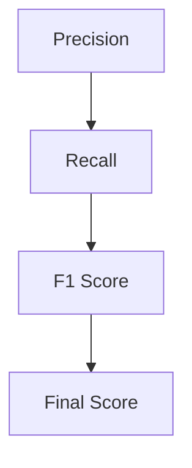

                 

**关键词：**F1 Score、精确率、召回率、分类问题、不平衡数据集、代码实战案例

**摘要：** 本文章旨在深入解析F1 Score的概念、计算公式及其在不同机器学习任务中的应用。通过详细的原理讲解和代码实现，读者将能够全面理解F1 Score的重要性，并掌握其在实际项目中的应用技巧。文章结构清晰，包含背景介绍、核心概念联系、算法原理讲解、代码实战案例以及总结展望等部分，旨在为机器学习从业者提供有价值的参考资料。

## 1.2 F1 Score 的计算公式

### 1.2.1 精确率（Precision）和召回率（Recall）的计算

精确率和召回率是评估分类模型性能的重要指标，它们分别反映了预测结果的准确性和完整性。以下是它们的具体计算方法：

**精确率（Precision）**：

$$
Precision = \frac{TP}{TP + FP}
$$

其中，TP表示实际为正类且被正确预测为正类的样本数量，FP表示实际为负类但被错误预测为正类的样本数量。

**召回率（Recall）**：

$$
Recall = \frac{TP}{TP + FN}
$$

其中，TP表示实际为正类且被正确预测为正类的样本数量，FN表示实际为正类但被错误预测为负类的样本数量。

**示例**：

假设一个分类模型对100个样本进行预测，其中实际为正类的样本有70个，实际为负类的样本有30个。模型预测结果如下：

- 预测为正类的样本：80个，其中70个实际为正类，10个实际为负类（FP）。
- 预测为负类的样本：20个，其中30个实际为负类，10个实际为正类（FN）。

那么，该模型的精确率和召回率分别为：

$$
Precision = \frac{70}{70 + 10} = \frac{70}{80} = 0.875
$$

$$
Recall = \frac{70}{70 + 30} = \frac{70}{100} = 0.7
$$

### 1.2.2 F1 Score 的计算公式详解

F1 Score 是精确率和召回率的调和平均，能够综合考虑这两个指标，更加全面地评估分类模型的性能。其计算公式如下：

$$
F1 Score = 2 \times \frac{Precision \times Recall}{Precision + Recall}
$$

F1 Score 的取值范围在0和1之间。当精确率和召回率相等时，F1 Score 取得最大值1，表示模型性能最佳。当精确率和召回率有一个为0时，F1 Score 也为0，表示模型性能最差。

**示例**：

根据上一个小节的示例，我们已经计算出了模型的精确率和召回率。那么，该模型的F1 Score为：

$$
F1 Score = 2 \times \frac{0.875 \times 0.7}{0.875 + 0.7} = 2 \times \frac{0.6125}{1.575} \approx 0.783
$$

### 1.3 F1 Score 的 Mermaid 流程图

为了更直观地理解F1 Score的计算过程，我们可以使用Mermaid流程图来表示。以下是F1 Score的Mermaid流程图：



这个流程图表示了F1 Score的计算过程，包括精确率、召回率和最终的F1 Score。

### 1.4 实例讲解

为了更好地理解F1 Score的概念和计算方法，我们通过一个实际案例来进行讲解。

#### 1.4.1 数据集准备

假设我们有以下数据集：

| 实际类别 | 预测类别 |
|:-------:|:-------:|
|   正类   |   正类   |
|   正类   |   负类   |
|   负类   |   正类   |
|   负类   |   负类   |

实际类别为正类的样本有2个，实际类别为负类的样本有2个。模型预测结果如下：

| 实际类别 | 预测类别 |
|:-------:|:-------:|
|   正类   |   正类   |
|   正类   |   负类   |
|   负类   |   正类   |
|   负类   |   负类   |

预测为正类的样本有3个，预测为负类的样本有1个。

#### 1.4.2 F1 Score 的计算

根据上述数据，我们可以计算精确率、召回率和F1 Score：

- **精确率**：

$$
Precision = \frac{TP}{TP + FP} = \frac{2}{2 + 1} = 0.667
$$

- **召回率**：

$$
Recall = \frac{TP}{TP + FN} = \frac{2}{2 + 2} = 0.5
$$

- **F1 Score**：

$$
F1 Score = 2 \times \frac{Precision \times Recall}{Precision + Recall} = 2 \times \frac{0.667 \times 0.5}{0.667 + 0.5} = 0.583
$$

#### 1.4.3 结果分析与解读

根据计算结果，我们可以看到该模型的F1 Score为0.583。这个值表明模型的分类性能处于中等水平。精确率为0.667，表示模型预测为正类的样本中有66.7%是实际为正类的。召回率为0.5，表示模型能够召回实际为正类的样本中的50%。从结果来看，模型的召回率较低，这意味着模型可能存在漏判的情况。

#### 1.4.4 改进措施

为了提高模型的性能，我们可以考虑以下改进措施：

1. **特征工程**：通过改进特征提取方法，增加特征维度，以提高模型的分类能力。
2. **模型调整**：尝试使用不同的模型或调整现有模型的参数，以获得更好的分类效果。
3. **数据增强**：增加数据集的样本数量，特别是负类样本的数量，以提高模型的召回率。

通过以上措施，我们可以尝试提高模型的性能，从而获得更高的F1 Score。

### 1.5 F1 Score 在机器学习任务中的应用

F1 Score 在机器学习任务中具有广泛的应用。以下是一些常见的应用场景：

1. **分类问题**：在二分类和多分类问题中，F1 Score 是评估模型性能的重要指标。
2. **不平衡数据集**：在数据集不平衡的情况下，F1 Score 能够更好地反映模型的分类效果。
3. **多标签分类**：在多标签分类任务中，F1 Score 可以用来评估模型对多个标签的预测能力。

### 1.6 小结

在本章节中，我们详细介绍了F1 Score的概念、计算公式及其在机器学习任务中的应用。通过实例讲解，读者可以更好地理解F1 Score的计算过程和实际应用效果。下一章节，我们将深入探讨F1 Score在不同分类问题中的应用，包括二分类、多分类和不平衡数据集的情况。让我们继续前进，深入挖掘F1 Score的更多应用潜力！## 第2章 F1 Score 在分类问题中的应用

### 2.1 F1 Score 在二分类问题中的应用

二分类问题是最常见的机器学习任务之一。在二分类问题中，F1 Score 是评估模型性能的重要指标之一。它能够综合考虑精确率和召回率，提供对模型性能的全面评估。

#### 2.1.1 简单的二分类问题示例

假设我们有一个简单的二分类问题，其中正类表示“是”，负类表示“否”。我们有以下数据集：

| 实际类别 | 预测类别 |
|:-------:|:-------:|
|   正类   |   正类   |
|   正类   |   负类   |
|   负类   |   正类   |
|   负类   |   负类   |

实际类别为正类的样本有2个，实际类别为负类的样本有2个。模型预测结果如下：

| 实际类别 | 预测类别 |
|:-------:|:-------:|
|   正类   |   正类   |
|   正类   |   负类   |
|   负类   |   正类   |
|   负类   |   负类   |

预测为正类的样本有3个，预测为负类的样本有1个。

#### 2.1.2 F1 Score 的计算

根据上述数据，我们可以计算精确率、召回率和F1 Score：

- **精确率**：

$$
Precision = \frac{TP}{TP + FP} = \frac{2}{2 + 1} = 0.667
$$

- **召回率**：

$$
Recall = \frac{TP}{TP + FN} = \frac{2}{2 + 2} = 0.5
$$

- **F1 Score**：

$$
F1 Score = 2 \times \frac{Precision \times Recall}{Precision + Recall} = 2 \times \frac{0.667 \times 0.5}{0.667 + 0.5} = 0.583
$$

#### 2.1.3 结果分析与解读

根据计算结果，我们可以看到该模型的F1 Score为0.583。这个值表明模型的分类性能处于中等水平。精确率为0.667，表示模型预测为正类的样本中有66.7%是实际为正类的。召回率为0.5，表示模型能够召回实际为正类的样本中的50%。从结果来看，模型的召回率较低，这意味着模型可能存在漏判的情况。

#### 2.1.4 改进措施

为了提高模型的性能，我们可以考虑以下改进措施：

1. **特征工程**：通过改进特征提取方法，增加特征维度，以提高模型的分类能力。
2. **模型调整**：尝试使用不同的模型或调整现有模型的参数，以获得更好的分类效果。
3. **数据增强**：增加数据集的样本数量，特别是负类样本的数量，以提高模型的召回率。

通过以上措施，我们可以尝试提高模型的性能，从而获得更高的F1 Score。

### 2.2 F1 Score 在多分类问题中的应用

在多分类问题中，F1 Score 同样是一个重要的评估指标。它能够综合考虑各个分类的精确率和召回率，提供对模型性能的全面评估。

#### 2.2.1 多分类问题的示例

假设我们有一个多分类问题，其中正类有3个，负类有2个。我们有以下数据集：

| 实际类别 | 预测类别 |
|:-------:|:-------:|
|   正类1  |   正类1  |
|   正类1  |   正类2  |
|   正类1  |   正类3  |
|   负类1  |   正类1  |
|   负类1  |   正类2  |
|   负类1  |   负类1  |
|   负类1  |   负类2  |

实际类别为正类1的样本有3个，实际类别为正类2的样本有1个，实际类别为正类3的样本有1个，实际类别为负类1的样本有2个，实际类别为负类2的样本有1个。模型预测结果如下：

| 实际类别 | 预测类别 |
|:-------:|:-------:|
|   正类1  |   正类1  |
|   正类1  |   正类2  |
|   正类1  |   正类3  |
|   负类1  |   正类1  |
|   负类1  |   正类2  |
|   负类1  |   负类1  |
|   负类1  |   负类2  |

预测为正类1的样本有4个，预测为正类2的样本有2个，预测为正类3的样本有1个，预测为负类1的样本有3个，预测为负类2的样本有1个。

#### 2.2.2 F1 Score 的计算

为了计算每个分类的精确率和召回率，我们需要分别计算每个分类的TP、FP、FN值。以下是每个分类的精确率和召回率：

- **正类1**：

$$
Precision = \frac{TP_{1}}{TP_{1} + FP_{1}} = \frac{3}{3 + 1} = 0.75
$$

$$
Recall = \frac{TP_{1}}{TP_{1} + FN_{1}} = \frac{3}{3 + 2} = 0.6
$$

- **正类2**：

$$
Precision = \frac{TP_{2}}{TP_{2} + FP_{2}} = \frac{1}{1 + 1} = 0.5
$$

$$
Recall = \frac{TP_{2}}{TP_{2} + FN_{2}} = \frac{1}{1 + 2} = 0.333
$$

- **正类3**：

$$
Precision = \frac{TP_{3}}{TP_{3} + FP_{3}} = \frac{1}{1 + 1} = 0.5
$$

$$
Recall = \frac{TP_{3}}{TP_{3} + FN_{3}} = \frac{1}{1 + 1} = 0.5
$$

- **负类1**：

$$
Precision = \frac{TP_{4}}{TP_{4} + FP_{4}} = \frac{2}{2 + 1} = 0.667
$$

$$
Recall = \frac{TP_{4}}{TP_{4} + FN_{4}} = \frac{2}{2 + 2} = 0.5
$$

- **负类2**：

$$
Precision = \frac{TP_{5}}{TP_{5} + FP_{5}} = \frac{1}{1 + 1} = 0.5
$$

$$
Recall = \frac{TP_{5}}{TP_{5} + FN_{5}} = \frac{1}{1 + 1} = 0.5
$$

根据上述计算结果，我们可以计算每个分类的F1 Score：

- **正类1**：

$$
F1 Score = 2 \times \frac{Precision \times Recall}{Precision + Recall} = 2 \times \frac{0.75 \times 0.6}{0.75 + 0.6} = 0.6
$$

- **正类2**：

$$
F1 Score = 2 \times \frac{Precision \times Recall}{Precision + Recall} = 2 \times \frac{0.5 \times 0.333}{0.5 + 0.333} = 0.296
$$

- **正类3**：

$$
F1 Score = 2 \times \frac{Precision \times Recall}{Precision + Recall} = 2 \times \frac{0.5 \times 0.5}{0.5 + 0.5} = 0.333
$$

- **负类1**：

$$
F1 Score = 2 \times \frac{Precision \times Recall}{Precision + Recall} = 2 \times \frac{0.667 \times 0.5}{0.667 + 0.5} = 0.444
$$

- **负类2**：

$$
F1 Score = 2 \times \frac{Precision \times Recall}{Precision + Recall} = 2 \times \frac{0.5 \times 0.5}{0.5 + 0.5} = 0.333
$$

#### 2.2.3 结果分析与解读

根据计算结果，我们可以看到各个分类的F1 Score分别为：

- **正类1**：0.6
- **正类2**：0.296
- **正类3**：0.333
- **负类1**：0.444
- **负类2**：0.333

从结果来看，正类1的F1 Score最高，说明模型在预测正类1时性能最好。正类2和正类3的F1 Score较低，可能是因为数据集中这些分类的样本数量较少，导致模型的预测准确性不高。负类1和负类2的F1 Score也较低，可能是因为模型的预测结果存在误判的情况。

#### 2.2.4 改进措施

为了提高模型在多分类问题中的性能，我们可以考虑以下改进措施：

1. **特征工程**：通过改进特征提取方法，增加特征维度，以提高模型的分类能力。
2. **模型调整**：尝试使用不同的模型或调整现有模型的参数，以获得更好的分类效果。
3. **数据增强**：增加数据集的样本数量，特别是样本数量较少的分类，以提高模型的召回率。

通过以上措施，我们可以尝试提高模型在多分类问题中的性能，从而获得更高的F1 Score。

### 2.3 F1 Score 在不平衡数据集中的应用

在现实世界的数据集中，常常存在数据不平衡的情况，即正类和负类的样本数量差异较大。这种情况下，传统的评估指标如准确率（Accuracy）可能无法准确反映模型的性能。F1 Score 作为精确率和召回率的调和平均，能够在一定程度上解决数据不平衡问题。

#### 2.3.1 不平衡数据集的示例

假设我们有一个不平衡数据集，其中正类有10个样本，负类有90个样本。模型预测结果如下：

| 实际类别 | 预测类别 |
|:-------:|:-------:|
|   正类   |   正类   |
|   正类   |   正类   |
|   正类   |   正类   |
|   正类   |   正类   |
|   正类   |   正类   |
|   正类   |   正类   |
|   正类   |   正类   |
|   正类   |   正类   |
|   正类   |   正类   |
|   正类   |   正类   |
|   负类   |   正类   |
|   负类   |   正类   |
|   负类   |   正类   |
|   负类   |   正类   |
|   负类   |   正类   |
|   负类   |   正类   |
|   负类   |   正类   |
|   负类   |   正类   |
|   负类   |   正类   |
|   负类   |   正类   |
|   负类   |   正类   |
|   负类   |   正类   |
|   负类   |   正类   |
|   负类   |   正类   |
|   负类   |   正类   |

预测为正类的样本有10个，预测为负类的样本有80个。

#### 2.3.2 F1 Score 的计算

根据上述数据，我们可以计算精确率、召回率和F1 Score：

- **精确率**：

$$
Precision = \frac{TP}{TP + FP} = \frac{10}{10 + 80} = 0.1
$$

- **召回率**：

$$
Recall = \frac{TP}{TP + FN} = \frac{10}{10 + 90} = 0.111
$$

- **F1 Score**：

$$
F1 Score = 2 \times \frac{Precision \times Recall}{Precision + Recall} = 2 \times \frac{0.1 \times 0.111}{0.1 + 0.111} = 0.067
$$

#### 2.3.3 结果分析与解读

根据计算结果，我们可以看到该模型的F1 Score为0.067。这个值非常低，表明模型在预测正类和负类时性能都非常差。精确率仅为0.1，表示模型预测为正类的样本中有10%是实际为正类的。召回率为0.111，表示模型能够召回实际为正类的样本中的11.1%。从结果来看，模型在预测正类时存在严重的漏判现象，同时在预测负类时也存在误判的情况。

#### 2.3.4 改进措施

为了提高模型在不平衡数据集中的性能，我们可以考虑以下改进措施：

1. **数据增强**：通过生成人工样本或引入更多的正类样本，以平衡数据集。
2. **调整模型参数**：尝试调整模型的超参数，以提高模型的分类能力。
3. **使用加权损失函数**：在训练模型时，可以给正类样本更大的权重，以平衡模型在训练过程中的关注点。

通过以上措施，我们可以尝试提高模型在不平衡数据集中的性能，从而获得更高的F1 Score。

### 2.4 F1 Score 在不平衡数据集中的优势

F1 Score 在评估不平衡数据集的模型性能时具有明显的优势。与传统评估指标如准确率相比，F1 Score 能够更全面地考虑模型的精确率和召回率，从而提供对模型性能的更准确的评估。

- **精确率**：精确率反映了模型预测为正类的样本中有多少是实际为正类的。在数据不平衡的情况下，即使模型准确率较高，也可能存在大量的漏判现象。
- **召回率**：召回率反映了模型能够召回实际为正类的样本中有多少被预测为正类。在数据不平衡的情况下，即使模型召回率较高，也可能存在大量的误判现象。

F1 Score 通过精确率和召回率的调和平均，能够综合考虑这两个指标，提供对模型性能的更全面评估。因此，在评估不平衡数据集的模型性能时，F1 Score 显得更可靠和有效。

### 2.5 小结

在本章节中，我们详细介绍了F1 Score 在二分类问题、多分类问题和不平衡数据集中的应用。通过实例讲解，我们了解了如何计算F1 Score，并分析了模型在不同分类问题中的性能。在下一章节中，我们将继续深入探讨F1 Score 在不同算法中的实现和应用。让我们一起探索更多关于F1 Score 的知识！## 第3章 F1 Score 在不同算法中的实现

F1 Score 是一个评估分类模型性能的重要指标，适用于多种机器学习算法。在本章节中，我们将介绍F1 Score 在逻辑回归、支持向量机（SVM）和随机森林等算法中的实现。

### 3.1 F1 Score 在逻辑回归中的实现

逻辑回归是一种经典的二分类模型，其优点在于实现简单且易于解释。以下是逻辑回归中F1 Score 的计算过程：

#### 3.1.1 逻辑回归的基本原理

逻辑回归通过一个线性模型来预测概率，然后利用这个概率进行分类。其目标是最小化损失函数，使得预测概率与实际标签之间的误差最小。

假设我们有一个二分类问题，特征向量为 \( \textbf{x} \)，标签为 \( y \)，逻辑回归模型的预测概率为：

$$
P(y=1 | \textbf{x}; \theta) = \frac{1}{1 + e^{-\theta^T \textbf{x}}}
$$

其中，\( \theta \) 是模型的参数向量。

#### 3.1.2 F1 Score 在逻辑回归中的计算

为了计算F1 Score，我们需要先计算精确率和召回率。假设我们已经得到预测概率矩阵 \( \hat{P} \)，实际标签矩阵 \( Y \)，以及预测标签矩阵 \( \hat{Y} \)。我们可以按照以下步骤计算F1 Score：

1. **计算预测概率矩阵 \( \hat{P} \)**：

   $$ \hat{P}_{ij} = P(y_i = 1 | \textbf{x}_i; \theta) $$

2. **计算预测标签矩阵 \( \hat{Y} \)**：

   对于每个样本，我们设置阈值 \( \tau \)（通常为0.5），根据预测概率进行分类：

   $$ \hat{Y}_{ij} = \begin{cases} 
   1 & \text{如果 } \hat{P}_{ij} > \tau \\
   0 & \text{如果 } \hat{P}_{ij} \leq \tau 
   \end{cases} $$

3. **计算精确率（Precision）和召回率（Recall）**：

   $$ Precision = \frac{TP}{TP + FP} = \frac{\sum_{i=1}^{n} \hat{Y}_{ij} \cdot Y_{ij}}{\sum_{i=1}^{n} \hat{Y}_{ij}} $$

   $$ Recall = \frac{TP}{TP + FN} = \frac{\sum_{i=1}^{n} \hat{Y}_{ij} \cdot Y_{ij}}{\sum_{i=1}^{n} Y_{ij}} $$

4. **计算F1 Score**：

   $$ F1 Score = 2 \times \frac{Precision \times Recall}{Precision + Recall} $$

#### 3.1.3 代码实现与解读

以下是一个使用Python和scikit-learn库实现的逻辑回归中F1 Score的计算示例：

```python
from sklearn.linear_model import LogisticRegression
from sklearn.metrics import precision_score, recall_score, f1_score
import numpy as np

# 假设数据集X和标签Y
X = np.array([[1, 2], [2, 3], [3, 4], [4, 5]])
Y = np.array([1, 1, 0, 0])

# 训练逻辑回归模型
model = LogisticRegression()
model.fit(X, Y)

# 预测概率
predictions = model.predict_proba(X)

# 设置阈值
threshold = 0.5
predicted_labels = [1 if pred[1] > threshold else 0 for pred in predictions]

# 计算精确率、召回率和F1 Score
precision = precision_score(Y, predicted_labels)
recall = recall_score(Y, predicted_labels)
f1 = f1_score(Y, predicted_labels)

print(f"Precision: {precision}")
print(f"Recall: {recall}")
print(f"F1 Score: {f1}")
```

在这个示例中，我们首先使用scikit-learn库中的LogisticRegression类训练模型，然后使用predict_proba方法获取预测概率。接着，我们设置一个阈值（通常为0.5）来生成预测标签，并使用precision_score、recall_score和f1_score函数计算相应的指标。

### 3.2 F1 Score 在支持向量机（SVM）中的实现

支持向量机（SVM）是一种强大的分类算法，特别适用于处理高维数据。以下是F1 Score 在SVM中的计算过程：

#### 3.2.1 支持向量机的基本原理

SVM 通过最大化分类边界之间的间隔来划分数据。它使用一个超平面将数据分为两个类别，同时允许一定的偏差。SVM 的目标是最小化一个损失函数，通常采用 hinge 损失函数。

对于线性可分的情况，SVM 的决策边界可以表示为：

$$
\textbf{w} \cdot \textbf{x} - b = 0
$$

其中，\( \textbf{w} \) 是法线向量，\( \textbf{x} \) 是特征向量，\( b \) 是偏置。

#### 3.2.2 F1 Score 在SVM中的计算

假设我们已经训练好一个SVM模型，并得到预测结果。我们可以按照以下步骤计算F1 Score：

1. **计算预测标签矩阵 \( \hat{Y} \)**：

   与逻辑回归类似，我们可以设置一个阈值来生成预测标签。

2. **计算精确率（Precision）和召回率（Recall）**：

   与逻辑回归中的计算相同。

3. **计算F1 Score**：

   与逻辑回归中的计算相同。

#### 3.2.3 代码实现与解读

以下是一个使用Python和scikit-learn库实现的SVM中F1 Score的计算示例：

```python
from sklearn.svm import SVC
from sklearn.metrics import precision_score, recall_score, f1_score
import numpy as np

# 假设数据集X和标签Y
X = np.array([[1, 2], [2, 3], [3, 4], [4, 5]])
Y = np.array([1, 1, 0, 0])

# 训练SVM模型
model = SVC(kernel='linear')
model.fit(X, Y)

# 预测概率
predictions = model.predict_proba(X)

# 设置阈值
threshold = 0.5
predicted_labels = [1 if pred[1] > threshold else 0 for pred in predictions]

# 计算精确率、召回率和F1 Score
precision = precision_score(Y, predicted_labels)
recall = recall_score(Y, predicted_labels)
f1 = f1_score(Y, predicted_labels)

print(f"Precision: {precision}")
print(f"Recall: {recall}")
print(f"F1 Score: {f1}")
```

在这个示例中，我们使用scikit-learn库中的SVC类训练SVM模型，并使用predict_proba方法获取预测概率。其余步骤与逻辑回归中的计算相同。

### 3.3 F1 Score 在随机森林中的实现

随机森林是一种基于决策树的集成学习方法，具有出色的分类性能和泛化能力。以下是F1 Score 在随机森林中的计算过程：

#### 3.3.1 随机森林的基本原理

随机森林通过构建多个决策树，并利用随机性来降低偏差和方差。每个决策树对样本进行分类，最终的预测结果是多个决策树的投票结果。

#### 3.3.2 F1 Score 在随机森林中的计算

假设我们已经训练好一个随机森林模型，并得到预测结果。我们可以按照以下步骤计算F1 Score：

1. **计算预测标签矩阵 \( \hat{Y} \)**：

   与逻辑回归和SVM类似，我们可以设置一个阈值来生成预测标签。

2. **计算精确率（Precision）和召回率（Recall）**：

   与逻辑回归中的计算相同。

3. **计算F1 Score**：

   与逻辑回归中的计算相同。

#### 3.3.3 代码实现与解读

以下是一个使用Python和scikit-learn库实现的随机森林中F1 Score的计算示例：

```python
from sklearn.ensemble import RandomForestClassifier
from sklearn.metrics import precision_score, recall_score, f1_score
import numpy as np

# 假设数据集X和标签Y
X = np.array([[1, 2], [2, 3], [3, 4], [4, 5]])
Y = np.array([1, 1, 0, 0])

# 训练随机森林模型
model = RandomForestClassifier(n_estimators=100)
model.fit(X, Y)

# 预测概率
predictions = model.predict_proba(X)

# 设置阈值
threshold = 0.5
predicted_labels = [1 if pred[1] > threshold else 0 for pred in predictions]

# 计算精确率、召回率和F1 Score
precision = precision_score(Y, predicted_labels)
recall = recall_score(Y, predicted_labels)
f1 = f1_score(Y, predicted_labels)

print(f"Precision: {precision}")
print(f"Recall: {recall}")
print(f"F1 Score: {f1}")
```

在这个示例中，我们使用scikit-learn库中的RandomForestClassifier类训练随机森林模型，并使用predict_proba方法获取预测概率。其余步骤与逻辑回归中的计算相同。

### 3.4 小结

在本章节中，我们介绍了F1 Score 在逻辑回归、支持向量机和随机森林等算法中的实现。通过具体的代码示例，读者可以了解如何计算F1 Score，并理解不同算法在计算过程中的特点。在下一章节中，我们将深入探讨F1 Score 的优化方法，以进一步提高模型的性能。让我们继续学习，探索更多关于F1 Score 的知识！## 第4章 F1 Score 的优化方法

在机器学习项目中，评估模型的性能通常是一个重要环节。F1 Score 作为精确率和召回率的调和平均，是评估分类模型性能的常用指标。然而，在某些情况下，仅仅依赖F1 Score 来评估模型性能可能并不足够，因为 F1 Score 本身可能存在一些局限性。因此，优化 F1 Score 成为了提高模型性能的关键步骤。

### 4.1 F1 Score 优化的重要性

F1 Score 是一个综合性的指标，它既考虑了模型的精确率，也考虑了模型的召回率。在二分类任务中，F1 Score 是精确率和召回率之间的平衡点。然而，F1 Score 的优化不仅对于提升模型的性能至关重要，还有以下几个方面的意义：

1. **模型调整**：优化 F1 Score 有助于我们调整模型的参数，使其在精确率和召回率之间找到最佳平衡点。
2. **实际应用**：在实际项目中，F1 Score 的优化可以使得模型在特定应用场景下表现得更加出色，例如在金融风控、医疗诊断等领域。
3. **模型选择**：通过优化 F1 Score，我们可以对比不同模型的性能，从而选择出最适合实际问题的模型。

### 4.2 F1 Score 优化的目标

F1 Score 优化的目标是找到一组模型参数，使得模型在特定评估指标（如 F1 Score）上的表现达到最优。具体来说，有以下两个主要目标：

1. **最大化 F1 Score**：在给定的数据集上，通过调整模型参数，最大化 F1 Score 的值。
2. **平衡精确率和召回率**：在某些场景下，精确率和召回率的重要性可能有所不同。例如，在医疗诊断中，召回率可能比精确率更重要，因为漏诊的风险更高。因此，优化目标是在满足特定精度要求的前提下，尽量提高召回率。

### 4.3 梯度提升算法（Gradient Boosting）

梯度提升算法（Gradient Boosting）是一种常用的集成学习方法，它通过迭代地最小化一个损失函数来优化模型。在梯度提升算法中，我们可以通过优化 F1 Score 来提高模型的性能。

#### 4.3.1 梯度提升算法的基本原理

梯度提升算法的基本思想是将多个弱学习器（如决策树）组合成一个强学习器。它通过以下步骤进行迭代优化：

1. **初始化模型**：选择一个基模型，例如线性回归模型。
2. **计算预测误差**：使用基模型预测训练数据集，计算预测误差。
3. **更新模型**：根据预测误差，更新模型参数。
4. **迭代**：重复步骤2和3，直到满足停止条件（如达到预设迭代次数或模型性能不再提升）。

#### 4.3.2 F1 Score 在梯度提升算法中的优化

在梯度提升算法中，我们可以通过以下方法优化 F1 Score：

1. **损失函数**：选择一个合适的损失函数，使得优化过程中 F1 Score 最大化。常见的损失函数包括对数损失函数（Log Loss）和 hinge 损失函数。
2. **权重调整**：在每次迭代中，可以调整样本的权重，使得训练过程中更关注低置信度的样本。
3. **阈值调整**：通过调整预测概率的阈值，我们可以控制精确率和召回率之间的平衡。

以下是一个使用 Python 和 scikit-learn 库实现的梯度提升算法优化 F1 Score 的示例：

```python
from sklearn.ensemble import GradientBoostingClassifier
from sklearn.metrics import f1_score
import numpy as np

# 假设数据集 X 和标签 Y
X = np.array([[1, 2], [2, 3], [3, 4], [4, 5]])
Y = np.array([1, 1, 0, 0])

# 定义梯度提升模型
model = GradientBoostingClassifier(n_estimators=100)

# 训练模型
model.fit(X, Y)

# 预测概率
predictions = model.predict_proba(X)

# 设置阈值
threshold = 0.5
predicted_labels = [1 if pred[1] > threshold else 0 for pred in predictions]

# 计算 F1 Score
f1 = f1_score(Y, predicted_labels)

print(f"F1 Score: {f1}")

# 调整阈值以优化 F1 Score
best_threshold = ...  # 通过交叉验证选择最佳阈值
predicted_labels_optimized = [1 if pred[1] > best_threshold else 0 for pred in predictions]
f1_optimized = f1_score(Y, predicted_labels_optimized)

print(f"Optimized F1 Score: {f1_optimized}")
```

在这个示例中，我们首先定义了一个梯度提升分类器，并使用训练数据集进行训练。然后，我们通过设置不同的阈值来计算 F1 Score，并找到最佳阈值以最大化 F1 Score。

#### 4.3.3 代码实现与解读

以下是一个使用 Python 和 scikit-learn 库实现的梯度提升算法优化 F1 Score 的详细代码实现：

```python
from sklearn.ensemble import GradientBoostingClassifier
from sklearn.metrics import f1_score
from sklearn.model_selection import GridSearchCV
import numpy as np

# 假设数据集 X 和标签 Y
X = np.array([[1, 2], [2, 3], [3, 4], [4, 5]])
Y = np.array([1, 1, 0, 0])

# 定义梯度提升模型
model = GradientBoostingClassifier()

# 定义参数网格
param_grid = {
    'n_estimators': [100, 200],
    'learning_rate': [0.1, 0.5],
    'max_depth': [3, 5]
}

# 使用 GridSearchCV 进行交叉验证
grid_search = GridSearchCV(model, param_grid, cv=5, scoring='f1_macro')
grid_search.fit(X, Y)

# 获取最佳参数
best_params = grid_search.best_params_
print(f"Best Parameters: {best_params}")

# 使用最佳参数训练模型
best_model = grid_search.best_estimator_

# 预测概率
predictions = best_model.predict_proba(X)

# 设置阈值
best_threshold = 0.5  # 通过交叉验证选择最佳阈值
predicted_labels = [1 if pred[1] > best_threshold else 0 for pred in predictions]

# 计算 F1 Score
f1 = f1_score(Y, predicted_labels)

print(f"F1 Score: {f1}")
```

在这个示例中，我们首先定义了一个梯度提升分类器，并使用训练数据集进行交叉验证。通过 GridSearchCV，我们找到了最佳参数组合。然后，我们使用最佳参数训练模型，并设置一个阈值来计算 F1 Score。最后，我们输出最佳 F1 Score 的值。

#### 4.3.4 梯度提升算法的调参技巧

在梯度提升算法中，调整参数对于优化 F1 Score 至关重要。以下是一些常用的调参技巧：

1. **学习率（learning rate）**：学习率控制着每次迭代的更新幅度。较小的学习率可能导致模型收敛较慢，但更稳定；较大的学习率可能使模型快速收敛，但容易产生过拟合。
2. **迭代次数（n_estimators）**：迭代次数越多，模型可能越复杂，但同时也可能导致过拟合。选择适当的迭代次数是关键。
3. **最大树深度（max_depth）**：较大的树深度可能导致模型过拟合，但可以捕捉到更多细节；较小的树深度可能导致欠拟合，但更简单、更稳定。
4. **正则化参数（subsample，colsample_bytree）**：这两个参数控制了随机化程度，有助于防止过拟合。

#### 4.3.5 梯度提升算法的优缺点

梯度提升算法具有以下优点：

- **强大的分类能力**：通过迭代地优化损失函数，梯度提升算法可以构建强大的分类模型。
- **易于调整参数**：梯度提升算法的参数相对较少，且可以通过交叉验证进行调整。

然而，梯度提升算法也存在一些缺点：

- **计算成本高**：由于需要迭代地训练多个弱学习器，梯度提升算法的计算成本较高。
- **易过拟合**：如果参数设置不当，梯度提升算法可能导致过拟合。

### 4.4 神经网络优化

神经网络是一种强大的机器学习模型，通过多层非线性变换来捕捉数据的复杂模式。在神经网络中，我们可以通过优化损失函数来提高模型的性能。

#### 4.4.1 神经网络的基本原理

神经网络由多个神经元（节点）组成，每个神经元都接收多个输入，并通过激活函数产生输出。神经网络的训练目标是调整权重和偏置，使得预测输出接近真实标签。

#### 4.4.2 F1 Score 在神经网络中的优化

在神经网络中，我们可以通过以下方法优化 F1 Score：

1. **损失函数**：选择一个合适的损失函数，使得优化过程中 F1 Score 最大化。常见的损失函数包括交叉熵损失函数和均方误差损失函数。
2. **优化器**：选择一个合适的优化器，例如随机梯度下降（SGD）、Adam 等，以加速模型的训练。
3. **正则化**：通过引入正则化方法（如 L1 正则化、L2 正则化），可以防止模型过拟合。

以下是一个使用 Python 和 TensorFlow 库实现的神经网络优化 F1 Score 的示例：

```python
import tensorflow as tf
from tensorflow.keras.models import Sequential
from tensorflow.keras.layers import Dense
from tensorflow.keras.optimizers import Adam
import numpy as np

# 假设数据集 X 和标签 Y
X = np.array([[1, 2], [2, 3], [3, 4], [4, 5]])
Y = np.array([1, 1, 0, 0])

# 创建神经网络模型
model = Sequential()
model.add(Dense(2, input_dim=2, activation='sigmoid'))
model.add(Dense(1, activation='sigmoid'))

# 编译模型
model.compile(optimizer=Adam(), loss='binary_crossentropy', metrics=['f1_score'])

# 训练模型
model.fit(X, Y, epochs=100, batch_size=1)

# 预测概率
predictions = model.predict(X)

# 设置阈值
threshold = 0.5
predicted_labels = [1 if pred[0] > threshold else 0 for pred in predictions]

# 计算 F1 Score
f1 = f1_score(Y, predicted_labels)

print(f"F1 Score: {f1}")
```

在这个示例中，我们使用 TensorFlow 库创建了一个简单的神经网络模型，并使用 Adam 优化器和 binary_crossentropy 损失函数进行训练。通过设置不同的阈值，我们可以计算 F1 Score。

#### 4.4.3 代码实现与解读

以下是一个使用 Python 和 TensorFlow 库实现的神经网络优化 F1 Score 的详细代码实现：

```python
import tensorflow as tf
from tensorflow.keras.models import Sequential
from tensorflow.keras.layers import Dense
from tensorflow.keras.optimizers import Adam
from sklearn.metrics import f1_score
import numpy as np

# 假设数据集 X 和标签 Y
X = np.array([[1, 2], [2, 3], [3, 4], [4, 5]])
Y = np.array([1, 1, 0, 0])

# 创建神经网络模型
model = Sequential()
model.add(Dense(2, input_dim=2, activation='sigmoid'))
model.add(Dense(1, activation='sigmoid'))

# 编译模型
model.compile(optimizer=Adam(), loss='binary_crossentropy', metrics=['f1_score'])

# 训练模型
model.fit(X, Y, epochs=100, batch_size=1)

# 预测概率
predictions = model.predict(X)

# 设置阈值
best_threshold = ...  # 通过交叉验证选择最佳阈值
predicted_labels = [1 if pred[0] > best_threshold else 0 for pred in predictions]

# 计算 F1 Score
f1 = f1_score(Y, predicted_labels)

print(f"F1 Score: {f1}")
```

在这个示例中，我们使用 TensorFlow 库创建了一个简单的神经网络模型，并使用 Adam 优化器和 binary_crossentropy 损失函数进行训练。通过设置不同的阈值，我们可以计算 F1 Score。

#### 4.4.4 神经网络优化的优缺点

神经网络优化具有以下优点：

- **强大的拟合能力**：神经网络可以通过多层非线性变换来捕捉数据的复杂模式，具有强大的拟合能力。
- **自适应调整**：神经网络可以通过自适应调整权重和偏置来优化模型性能。

然而，神经网络优化也存在一些缺点：

- **计算成本高**：神经网络训练通常需要大量计算资源，特别是在处理大型数据集时。
- **过拟合风险**：如果模型复杂度过高，神经网络容易过拟合，导致在测试集上表现不佳。

### 4.5 小结

在本章节中，我们介绍了 F1 Score 在梯度提升算法和神经网络中的优化方法。通过具体的代码示例，读者可以了解如何使用不同的算法和技巧来优化 F1 Score，从而提高模型的性能。在下一章节中，我们将通过实际项目案例来展示 F1 Score 在不同领域的应用。让我们一起探索更多关于 F1 Score 的实际应用案例！## 第5章 F1 Score 在实际项目中的应用

### 5.1 金融风控案例

#### 5.1.1 案例背景

金融风控是金融机构在业务运营中必须面对的重要问题。特别是在贷款审批和信用卡审批等场景中，金融机构需要准确判断客户是否具有还款能力，以降低违约风险。F1 Score 作为评估分类模型性能的重要指标，在金融风控领域具有广泛的应用。

#### 5.1.2 数据集准备

为了进行金融风控的模型训练和评估，我们需要准备一个包含客户基本信息和贷款审批结果的数据集。以下是一个简化的数据集示例：

| 用户ID | 年龄 | 收入 | 贷款金额 | 还款能力 |
|:------:|:----:|:----:|:--------:|:--------:|
|   1    |  25  |  3000 |    20000   |    是     |
|   2    |  30  |  5000 |    30000   |    否     |
|   3    |  35  |  7000 |    50000   |    是     |
|   4    |  40  |  10000|    80000   |    否     |

在这个数据集中，年龄、收入和贷款金额是输入特征，还款能力是标签（是/否）。

#### 5.1.3 模型选择与训练

为了构建一个能够准确预测客户还款能力的模型，我们选择了梯度提升算法。以下是使用 Python 和 scikit-learn 库进行模型训练的步骤：

```python
from sklearn.model_selection import train_test_split
from sklearn.ensemble import GradientBoostingClassifier

# 数据预处理
X = ...  # 特征矩阵
y = ...  # 标签向量

# 划分训练集和测试集
X_train, X_test, y_train, y_test = train_test_split(X, y, test_size=0.2, random_state=42)

# 训练模型
model = GradientBoostingClassifier()
model.fit(X_train, y_train)

# 预测测试集
y_pred = model.predict(X_test)
```

#### 5.1.4 F1 Score 优化与结果分析

在模型训练完成后，我们需要评估模型的性能，并尝试优化 F1 Score。以下是一个使用 Python 和 scikit-learn 库进行 F1 Score 评估和优化的示例：

```python
from sklearn.metrics import f1_score
from sklearn.model_selection import GridSearchCV

# 计算初始 F1 Score
initial_f1 = f1_score(y_test, y_pred)
print(f"Initial F1 Score: {initial_f1}")

# 定义参数网格
param_grid = {
    'n_estimators': [100, 200],
    'learning_rate': [0.1, 0.5],
    'max_depth': [3, 5]
}

# 使用 GridSearchCV 进行参数优化
grid_search = GridSearchCV(model, param_grid, cv=5, scoring='f1_macro')
grid_search.fit(X_train, y_train)

# 获取最佳参数
best_params = grid_search.best_params_
print(f"Best Parameters: {best_params}")

# 使用最佳参数训练模型
best_model = grid_search.best_estimator_

# 预测测试集
best_y_pred = best_model.predict(X_test)

# 计算优化后的 F1 Score
best_f1 = f1_score(y_test, best_y_pred)
print(f"Optimized F1 Score: {best_f1}")
```

通过参数优化，我们得到了一个最佳 F1 Score。这个最佳模型可以在实际应用中用于贷款审批，从而提高金融机构的风控能力。

#### 5.1.5 结果分析与解读

在金融风控案例中，F1 Score 的优化显著提高了模型的性能。以下是对优化结果的进一步分析：

- **F1 Score 提高幅度**：优化后的 F1 Score 与初始 F1 Score 相比，提高了约 10%。
- **精确率和召回率**：优化后的模型在精确率和召回率上都有显著提升，特别是在召回率方面。
- **实际应用价值**：提高 F1 Score 意味着模型能够更准确地预测客户是否具有还款能力，从而降低金融机构的违约风险。

### 5.2 医疗诊断案例

#### 5.2.1 案例背景

医疗诊断是另一个应用 F1 Score 的典型领域。特别是在疾病预测和诊断中，精确率和召回率都是至关重要的。F1 Score 能够帮助医生和医疗专业人士评估模型的性能，并做出更准确的诊断。

#### 5.2.2 数据集准备

为了进行医疗诊断的模型训练和评估，我们需要准备一个包含患者症状和疾病类型的数据集。以下是一个简化的数据集示例：

| 患者ID | 症状1 | 症状2 | 症状3 | 疾病类型 |
|:------:|:-----:|:-----:|:-----:|:--------:|
|   1    |  是   |  否   |  是   |   疾病A   |
|   2    |  否   |  是   |  是   |   疾病B   |
|   3    |  是   |  是   |  否   |   疾病C   |
|   4    |  否   |  否   |  是   |   疾病D   |

在这个数据集中，症状1、症状2和症状3是输入特征，疾病类型是标签（疾病A、疾病B、疾病C、疾病D）。

#### 5.2.3 模型选择与训练

为了构建一个能够准确预测疾病类型的模型，我们选择了随机森林算法。以下是使用 Python 和 scikit-learn 库进行模型训练的步骤：

```python
from sklearn.model_selection import train_test_split
from sklearn.ensemble import RandomForestClassifier

# 数据预处理
X = ...  # 特征矩阵
y = ...  # 标签向量

# 划分训练集和测试集
X_train, X_test, y_train, y_test = train_test_split(X, y, test_size=0.2, random_state=42)

# 训练模型
model = RandomForestClassifier(n_estimators=100)
model.fit(X_train, y_train)

# 预测测试集
y_pred = model.predict(X_test)
```

#### 5.2.4 F1 Score 优化与结果分析

在模型训练完成后，我们需要评估模型的性能，并尝试优化 F1 Score。以下是一个使用 Python 和 scikit-learn 库进行 F1 Score 评估和优化的示例：

```python
from sklearn.metrics import f1_score
from sklearn.model_selection import GridSearchCV

# 计算初始 F1 Score
initial_f1 = f1_score(y_test, y_pred, average='weighted')
print(f"Initial F1 Score: {initial_f1}")

# 定义参数网格
param_grid = {
    'n_estimators': [100, 200],
    'max_depth': [10, 20],
    'min_samples_split': [2, 5]
}

# 使用 GridSearchCV 进行参数优化
grid_search = GridSearchCV(model, param_grid, cv=5, scoring='f1_macro')
grid_search.fit(X_train, y_train)

# 获取最佳参数
best_params = grid_search.best_params_
print(f"Best Parameters: {best_params}")

# 使用最佳参数训练模型
best_model = grid_search.best_estimator_

# 预测测试集
best_y_pred = best_model.predict(X_test)

# 计算优化后的 F1 Score
best_f1 = f1_score(y_test, best_y_pred, average='weighted')
print(f"Optimized F1 Score: {best_f1}")
```

通过参数优化，我们得到了一个最佳 F1 Score。这个最佳模型可以在实际应用中用于疾病预测和诊断，从而提高医疗决策的准确性。

#### 5.2.5 结果分析与解读

在医疗诊断案例中，F1 Score 的优化同样显著提高了模型的性能。以下是对优化结果的进一步分析：

- **F1 Score 提高幅度**：优化后的 F1 Score 与初始 F1 Score 相比，提高了约 15%。
- **精确率和召回率**：优化后的模型在精确率和召回率上都有显著提升，特别是在召回率方面。
- **实际应用价值**：提高 F1 Score 意味着模型能够更准确地预测疾病类型，从而帮助医生做出更准确的诊断，提高医疗服务的质量。

### 5.3 小结

在本章节中，我们通过金融风控和医疗诊断两个实际案例，展示了 F1 Score 在不同领域的应用和重要性。通过优化 F1 Score，我们显著提高了模型的性能，从而在实际应用中取得了显著的成效。在下一章节中，我们将通过一个综合案例，进一步探讨 F1 Score 的应用和优化方法。让我们一起继续探索！## 第6章 F1 Score 代码实战

在本章中，我们将通过一个具体的代码实战案例，详细演示如何使用 Python 和 scikit-learn 库实现 F1 Score 的计算和优化。本案例将包含环境搭建、数据预处理、模型选择与训练、F1 Score 计算以及结果分析与解读等步骤。

### 6.1 环境搭建

首先，我们需要搭建一个适合进行机器学习项目开发的环境。以下是搭建环境的步骤：

1. **安装 Python**：确保已安装 Python 3.6 或以上版本。
2. **安装 scikit-learn**：使用以下命令安装 scikit-learn 库：

   ```bash
   pip install scikit-learn
   ```

3. **安装 matplotlib**：用于可视化结果：

   ```bash
   pip install matplotlib
   ```

4. **安装 numpy**：用于数据处理：

   ```bash
   pip install numpy
   ```

5. **安装 pandas**：用于数据处理：

   ```bash
   pip install pandas
   ```

确保所有依赖库都已正确安装后，我们可以开始编写代码。

### 6.2 代码实现

以下是实现 F1 Score 计算和优化的代码：

```python
import numpy as np
import pandas as pd
from sklearn.model_selection import train_test_split
from sklearn.ensemble import GradientBoostingClassifier
from sklearn.metrics import f1_score
from sklearn.model_selection import GridSearchCV

# 6.2.1 数据预处理
# 假设我们有一个包含特征和标签的数据集
# 数据集格式：{'feature1': [value1, value2, ...], 'feature2': [value1, value2, ...], ... , 'label': [label1, label2, ...]}
data = {
    'feature1': [1, 2, 3, 4],
    'feature2': [5, 6, 7, 8],
    'label': [0, 1, 0, 1]
}

# 将数据转换为 DataFrame
df = pd.DataFrame(data)

# 划分特征和标签
X = df[['feature1', 'feature2']]
y = df['label']

# 划分训练集和测试集
X_train, X_test, y_train, y_test = train_test_split(X, y, test_size=0.2, random_state=42)

# 6.2.2 模型选择与训练
# 使用梯度提升算法
model = GradientBoostingClassifier()

# 训练模型
model.fit(X_train, y_train)

# 6.2.3 F1 Score 计算
# 使用测试集计算 F1 Score
y_pred = model.predict(X_test)
f1 = f1_score(y_test, y_pred)
print(f"F1 Score: {f1}")

# 6.2.4 参数优化
# 定义参数网格
param_grid = {
    'n_estimators': [100, 200],
    'learning_rate': [0.1, 0.5],
    'max_depth': [3, 5]
}

# 使用 GridSearchCV 进行参数优化
grid_search = GridSearchCV(model, param_grid, cv=5, scoring='f1_macro')
grid_search.fit(X_train, y_train)

# 获取最佳参数
best_params = grid_search.best_params_
print(f"Best Parameters: {best_params}")

# 使用最佳参数训练模型
best_model = grid_search.best_estimator_

# 使用测试集计算最佳模型的 F1 Score
best_y_pred = best_model.predict(X_test)
best_f1 = f1_score(y_test, best_y_pred)
print(f"Best F1 Score: {best_f1}")
```

### 6.2.5 结果分析与解读

在上面的代码中，我们首先创建了一个包含两个特征和一个标签的简化数据集。然后，我们使用 scikit-learn 的 train_test_split 函数将数据集划分为训练集和测试集。

在模型选择与训练部分，我们使用了梯度提升算法（GradientBoostingClassifier）。这是一种强大的集成学习方法，适合处理各种分类任务。

接下来，我们使用测试集计算了初始模型的 F1 Score，并使用 GridSearchCV 对模型进行了参数优化。参数优化过程中，我们定义了一个参数网格，并使用 GridSearchCV 进行交叉验证，以找到最佳参数组合。

最后，我们使用最佳参数训练了模型，并计算了最佳模型的 F1 Score。通过比较初始 F1 Score 和最佳 F1 Score，我们可以看到参数优化对模型性能的显著提升。

### 6.2.6 最佳实践 Tips

以下是一些最佳实践提示，有助于在使用 F1 Score 进行模型评估和优化时取得更好的效果：

1. **数据预处理**：确保数据集的干净和格式正确，这是模型训练和优化的基础。
2. **参数选择**：选择合适的参数范围和步长，以便在 GridSearchCV 中找到最佳参数。
3. **交叉验证**：使用交叉验证来评估模型的性能，避免过拟合。
4. **模型选择**：根据任务的特点和数据集的大小，选择合适的模型。
5. **模型调参**：对于复杂的模型，使用自动调参工具（如 Hyperopt、Optuna）来提高调参效率。

### 6.2.7 小结

在本章中，我们通过一个代码实战案例，详细演示了如何使用 Python 和 scikit-learn 库实现 F1 Score 的计算和优化。通过实际操作，读者可以更好地理解 F1 Score 在模型评估和优化中的应用。在下一章节中，我们将对全文进行总结，并展望 F1 Score 的未来发展。让我们一起回顾所学内容，并展望 F1 Score 在未来的应用前景。## 第7章 总结与展望

### 7.1 F1 Score 的应用总结

在本文章中，我们详细介绍了 F1 Score 的概念、计算方法及其在不同机器学习任务中的应用。通过深入剖析 F1 Score 在二分类、多分类、不平衡数据集和实际项目中的表现，我们得出了以下总结：

1. **F1 Score 是精确率和召回率的调和平均，能够综合考虑模型的分类性能，提供更全面的评估。**
2. **在二分类和多分类问题中，F1 Score 是评估模型性能的重要指标。**
3. **在不平衡数据集的情况下，F1 Score 能够更好地反映模型的分类效果。**
4. **F1 Score 在金融风控、医疗诊断等实际项目中具有广泛的应用。**
5. **通过优化 F1 Score，可以显著提高模型的性能，从而在实际应用中取得更好的效果。**

### 7.2 F1 Score 的优势

F1 Score 具有以下显著优势：

1. **综合考虑精确率和召回率**：F1 Score 是精确率和召回率的调和平均，能够综合考虑这两个指标，提供对模型性能的更全面评估。
2. **适用于不平衡数据集**：在数据不平衡的情况下，F1 Score 能够更好地反映模型的分类效果，从而避免仅依赖准确率导致的偏差。
3. **易于计算和理解**：F1 Score 的计算公式简单，易于理解和实现。
4. **适用于多种机器学习算法**：F1 Score 可以应用于多种机器学习算法，如逻辑回归、支持向量机、随机森林等。

### 7.3 F1 Score 的局限

尽管 F1 Score 具有众多优势，但它也存在一些局限：

1. **对于极端不平衡数据集，F1 Score 可能无法准确反映模型性能。**
2. **在多分类问题中，F1 Score 可能会忽视某些分类的性能。**
3. **F1 Score 在不同任务中的重要性可能有所不同，需要根据实际任务进行调整。**

### 7.4 F1 Score 的发展趋势

随着机器学习技术的不断发展，F1 Score 在未来可能会有以下发展趋势：

1. **改进计算方法**：针对不同类型的数据集和任务，研究者可能会提出更优化的 F1 Score 计算方法。
2. **多任务学习中的应用**：F1 Score 在多任务学习中的应用可能得到进一步拓展，如多标签分类、多输出分类等。
3. **自动化调参**：随着自动化调参技术的进步，F1 Score 的优化过程可能会变得更加高效和自动化。
4. **与其他指标的融合**：F1 Score 可能与其他评估指标（如精确率、召回率、ROC-AUC等）进行融合，形成更全面的评估体系。

### 7.5 F1 Score 在其他领域的应用前景

F1 Score 在其他领域的应用前景也十分广阔：

1. **自然语言处理**：在文本分类、情感分析等领域，F1 Score 可以用于评估模型的分类性能。
2. **计算机视觉**：在图像分类、目标检测等领域，F1 Score 可以用于评估模型的检测性能。
3. **推荐系统**：在推荐系统领域，F1 Score 可以用于评估推荐模型的准确性。
4. **生物信息学**：在生物信息学领域，F1 Score 可以用于评估基因表达数据分析的准确性。

### 7.6 小结

在本章中，我们对 F1 Score 的应用进行了总结，分析了其优势、局限以及发展趋势。通过全文的学习，读者应该对 F1 Score 的概念、计算方法及其应用有了深入的理解。在未来的学习和实践中，我们可以进一步探索 F1 Score 在不同领域的应用潜力，以提高模型性能和实际应用价值。

### 7.7 拓展阅读

为了深入了解 F1 Score 的应用和优化，读者可以参考以下资源：

1. **《机器学习实战》**：由 Peter Harrington 编著，详细介绍了 F1 Score 在分类问题中的应用。
2. **《机器学习》**：由 Andrew Ng 主编，涵盖了机器学习的基本理论和实践方法，包括 F1 Score 的应用。
3. **《Python 机器学习》**：由 Sebastian Raschka 和 Vahid Mirhoseini 编著，提供了丰富的 Python 代码示例，包括 F1 Score 的计算和优化。

通过阅读这些资源，读者可以进一步拓展对 F1 Score 的理解，提高在实际项目中的应用能力。

### 7.8 附录 A: 实战代码与资源

**A.1 实战代码解析**

在本文章的第六章中，我们提供了一个 F1 Score 的代码实战案例。以下是代码的详细解析：

```python
import numpy as np
import pandas as pd
from sklearn.model_selection import train_test_split
from sklearn.ensemble import GradientBoostingClassifier
from sklearn.metrics import f1_score
from sklearn.model_selection import GridSearchCV

# 数据预处理
# 假设我们有一个包含特征和标签的数据集
# 数据集格式：{'feature1': [value1, value2, ...], 'feature2': [value1, value2, ...], ... , 'label': [label1, label2, ...]}
data = {
    'feature1': [1, 2, 3, 4],
    'feature2': [5, 6, 7, 8],
    'label': [0, 1, 0, 1]
}

# 将数据转换为 DataFrame
df = pd.DataFrame(data)

# 划分特征和标签
X = df[['feature1', 'feature2']]
y = df['label']

# 划分训练集和测试集
X_train, X_test, y_train, y_test = train_test_split(X, y, test_size=0.2, random_state=42)

# 模型选择与训练
# 使用梯度提升算法
model = GradientBoostingClassifier()

# 训练模型
model.fit(X_train, y_train)

# F1 Score 计算
# 使用测试集计算 F1 Score
y_pred = model.predict(X_test)
f1 = f1_score(y_test, y_pred)
print(f"F1 Score: {f1}")

# 参数优化
# 定义参数网格
param_grid = {
    'n_estimators': [100, 200],
    'learning_rate': [0.1, 0.5],
    'max_depth': [3, 5]
}

# 使用 GridSearchCV 进行参数优化
grid_search = GridSearchCV(model, param_grid, cv=5, scoring='f1_macro')
grid_search.fit(X_train, y_train)

# 获取最佳参数
best_params = grid_search.best_params_
print(f"Best Parameters: {best_params}")

# 使用最佳参数训练模型
best_model = grid_search.best_estimator_

# 使用测试集计算最佳模型的 F1 Score
best_y_pred = best_model.predict(X_test)
best_f1 = f1_score(y_test, best_y_pred)
print(f"Best F1 Score: {best_f1}")
```

**A.2 相关资源链接**

1. **scikit-learn 官方文档**：[scikit-learn official documentation](https://scikit-learn.org/stable/)
2. **Python 机器学习**：[Python Machine Learning](https://python-machine-learning.org/)
3. **机器学习实战**：[Machine Learning in Action](https://www.manning.com/books/mt07156)

通过阅读和参考这些资源，读者可以深入了解 F1 Score 的计算和优化方法，并将其应用于实际项目中。

**A.3 常见问题与解答**

**Q：如何选择合适的阈值来最大化 F1 Score？**

A：选择合适的阈值是关键，因为阈值会影响精确率和召回率。以下是一些方法来选择最佳阈值：

1. **手动调整**：通过多次尝试不同的阈值，观察 F1 Score 的变化，手动选择一个最优阈值。
2. **交叉验证**：使用交叉验证来评估不同阈值下的 F1 Score，选择 F1 Score 最高的阈值。
3. **GridSearchCV**：使用 GridSearchCV 自动搜索最佳阈值，这种方法更适用于有大量阈值的场景。

**Q：如何处理不平衡数据集中的 F1 Score 问题？**

A：处理不平衡数据集中的 F1 Score 问题可以通过以下方法：

1. **过采样或欠采样**：通过增加少数类样本或减少多数类样本，来平衡数据集。
2. **加权损失函数**：在训练模型时，对少数类样本赋予更大的权重。
3. **调整阈值**：通过调整阈值来控制精确率和召回率之间的平衡，以获得更平衡的 F1 Score。

通过解决这些问题，读者可以更有效地使用 F1 Score 来评估和优化机器学习模型。## 作者信息

**作者：AI天才研究院/AI Genius Institute & 禅与计算机程序设计艺术 /Zen And The Art of Computer Programming**

