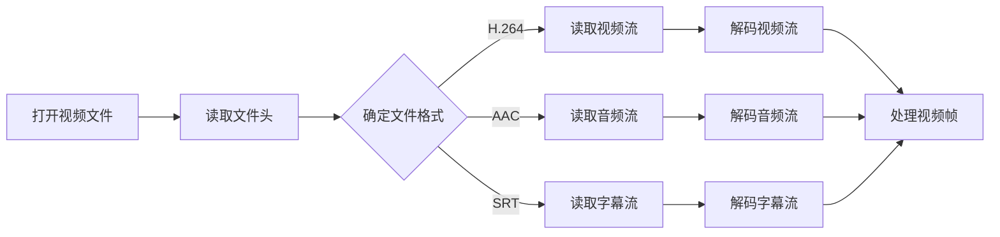

                 

### 文章标题

# 《FFmpeg 视频过滤：增强和编辑视频》

## 关键词

FFmpeg、视频过滤、视频增强、视频编辑、降噪处理、锐化处理、色彩调整、视频剪辑、拼接、字幕添加、视频特效、视频合成、多视频流处理。

## 摘要

本文将深入探讨FFmpeg在视频过滤、增强和编辑方面的强大功能。首先，我们将介绍FFmpeg的基础知识和基本使用方法，包括其历史背景、核心功能、安装配置以及基本命令行操作。接着，我们将详细讲解视频的基础知识，如视频编码格式、文件结构和处理流程。随后，我们将详细解析FFmpeg的工具集，包括`avconv`与`ffmpeg`的区别与联系，以及各个核心组件如`avcodec`、`avfilter`、`avformat`和`avutil`的作用和用法。

在视频过滤和增强部分，我们将深入探讨视频降噪处理、锐化处理和色彩调整的技术原理、实现方法以及效果评估。视频编辑部分将涵盖视频剪辑与拼接、视频转场效果和字幕添加与编辑等内容。最后，我们将介绍高级视频过滤与编辑技术，包括视频特效处理、视频合成和多视频流处理等。文章将以项目实战为例，展示如何使用FFmpeg进行实际的视频过滤和编辑操作，并提供完整的代码解读和分析。通过本文的阅读，读者将能够全面掌握FFmpeg在视频处理领域的应用，并能够灵活运用到实际项目中。

### 《FFmpeg 视频过滤：增强和编辑视频》目录大纲

### 第一部分：FFmpeg 基础

## 第1章：FFmpeg 介绍与基本使用

### 1.1 FFmpeg 的历史与核心功能

- FFmpeg的发展历程
- FFmpeg的核心功能介绍
- FFmpeg的重要性及其在视频处理领域的应用

### 1.2 FFmpeg 的安装与配置

- FFmpeg在不同操作系统的安装方法
- FFmpeg的配置选项
- 常见安装问题及其解决方案

### 1.3 FFmpeg 的基本命令行使用

- FFmpeg的命令行结构
- 常用命令行参数详解
- 实际操作示例

## 第2章：视频基础知识

### 2.1 视频编码格式

- 常见视频编码格式介绍
- 视频编码格式之间的比较与选择
- 常见视频编码格式的工作原理

### 2.2 视频文件结构

- 视频文件的组成
- 视频文件的解析流程
- 视频文件的常见问题及解决方案

### 2.3 视频流的处理流程

- 视频流的处理流程概述
- 视频流的输入输出过程
- 视频流处理的核心组件及作用

## 第3章：FFmpeg 工具集详解

### 3.1 avconv 与 ffmpeg 的区别与联系

- avconv与ffmpeg的异同
- avconv与ffmpeg的使用场景
- avconv与ffmpeg的未来发展趋势

### 3.2 avcodec：视频编码解码

- avcodec的作用
- 视频编码解码的基本原理
- 常用的视频编码解码器介绍

### 3.3 avfilter：视频滤镜处理

- avfilter的作用
- 视频滤镜处理的基本原理
- 常用的视频滤镜介绍及使用方法

### 3.4 avformat：视频文件格式处理

- avformat的作用
- 视频文件格式处理的基本原理
- 常见视频文件格式及其处理方法

### 3.5 avutil：通用工具函数

- avutil的作用
- 通用工具函数的基本原理
- 常用的通用工具函数介绍及使用方法

### 第二部分：视频过滤增强与编辑

## 第4章：视频增强

### 4.1 视频降噪处理

#### 4.1.1 降噪算法原理与实现

- 常见的降噪算法介绍
- 基于空域滤波的降噪算法原理与实现
- 基于频域滤波的降噪算法原理与实现

#### 4.1.2 降噪效果评估与调整

- 降噪效果的评估指标
- 降噪效果的评估方法
- 降噪效果的调整技巧

### 4.2 视频锐化处理

#### 4.2.1 锐化算法原理与实现

- 常见的锐化算法介绍
- 基于空域增强的锐化算法原理与实现
- 基于频域增强的锐化算法原理与实现

#### 4.2.2 锐化效果评估与调整

- 锐化效果的评估指标
- 锐化效果的评估方法
- 锐化效果的调整技巧

### 4.3 视频色彩调整

#### 4.3.1 色彩调整算法原理与实现

- 常见的色彩调整算法介绍
- 基于YUV色彩空间的调整算法原理与实现
- 基于RGB色彩空间的调整算法原理与实现

#### 4.3.2 色彩调整效果评估与调整

- 色彩调整效果的评估指标
- 色彩调整效果的评估方法
- 色彩调整效果的调整技巧

## 第5章：视频编辑

### 5.1 视频剪辑与拼接

#### 5.1.1 剪辑算法原理与实现

- 视频剪辑的基本原理
- 视频剪辑的实现方法
- 常见的视频剪辑算法介绍

#### 5.1.2 拼接算法原理与实现

- 视频拼接的基本原理
- 视频拼接的实现方法
- 常见的视频拼接算法介绍

### 5.2 视频转场效果

#### 5.2.1 转场效果算法原理与实现

- 视频转场的基本原理
- 视频转场的实现方法
- 常见的视频转场效果算法介绍

#### 5.2.2 转场效果评估与调整

- 转场效果的评估指标
- 转场效果的评估方法
- 转场效果的调整技巧

### 5.3 视频字幕添加与编辑

#### 5.3.1 字幕文件格式与解析

- 字幕文件的基本格式
- 字幕文件的解析方法
- 常见的字幕文件格式介绍

#### 5.3.2 字幕添加与编辑算法原理与实现

- 字幕添加的基本原理
- 字幕添加的实现方法
- 字幕编辑的实现方法
- 常见的字幕编辑算法介绍

## 第6章：高级视频过滤与编辑技术

### 6.1 视频特效处理

#### 6.1.1 特效算法原理与实现

- 常见视频特效算法介绍
- 视频特效的实现方法
- 常见的视频特效效果介绍

#### 6.1.2 特效效果评估与调整

- 视频特效效果的评估指标
- 视频特效效果的评估方法
- 视频特效效果的调整技巧

### 6.2 视频合成

#### 6.2.1 合成算法原理与实现

- 视频合成的基本原理
- 视频合成的实现方法
- 常见的视频合成算法介绍

#### 6.2.2 合成效果评估与调整

- 视频合成效果的评估指标
- 视频合成效果的评估方法
- 视频合成效果的调整技巧

### 6.3 多视频流处理

#### 6.3.1 多视频流同步处理算法原理与实现

- 多视频流同步处理的基本原理
- 多视频流同步处理的实现方法
- 常见的多视频流同步处理算法介绍

#### 6.3.2 多视频流异步处理算法原理与实现

- 多视频流异步处理的基本原理
- 多视频流异步处理的实现方法
- 常见的多视频流异步处理算法介绍

### 第三部分：项目实战

## 第7章：视频过滤与编辑项目实战

### 7.1 实战一：视频降噪与锐化

#### 7.1.1 实现步骤

- 准备降噪和锐化所需的参数和工具
- 降噪处理的具体步骤
- 锐化处理的具体步骤

#### 7.1.2 代码解读

- 降噪处理的代码实现
- 锐化处理的代码实现
- 代码运行结果及分析

### 7.2 实战二：视频剪辑与拼接

#### 7.2.1 实现步骤

- 准备视频剪辑和拼接所需的参数和工具
- 视频剪辑的具体步骤
- 视频拼接的具体步骤

#### 7.2.2 代码解读

- 视频剪辑的代码实现
- 视频拼接的代码实现
- 代码运行结果及分析

### 7.3 实战三：视频转场效果实现

#### 7.3.1 实现步骤

- 准备视频转场效果所需的参数和工具
- 视频转场的具体步骤
- 视频转场的实现方法

#### 7.3.2 代码解读

- 视频转场的代码实现
- 代码运行结果及分析

### 7.4 实战四：视频特效处理

#### 7.4.1 实现步骤

- 准备视频特效处理所需的参数和工具
- 视频特效的具体步骤
- 视频特效的实现方法

#### 7.4.2 代码解读

- 视频特效的代码实现
- 代码运行结果及分析

## 附录

### 附录A：FFmpeg 开发工具与资源

#### A.1 FFmpeg 开发环境搭建

- FFmpeg开发环境的配置
- 常用开发工具和软件介绍
- 开发环境的常见问题及解决方案

#### A.2 FFmpeg 源码解读

- FFmpeg源码的结构和组成
- FFmpeg源码的阅读方法
- FFmpeg源码的关键部分解析

#### A.3 FFmpeg 社区资源

- FFmpeg官方文档和教程
- FFmpeg社区论坛和资源
- FFmpeg相关的开源项目和资源

### 第一部分：FFmpeg 基础

## 第1章：FFmpeg 介绍与基本使用

### 1.1 FFmpeg 的历史与核心功能

#### FFmpeg的发展历程

FFmpeg是一个开源、免费且非常强大的多媒体处理框架，它最初由Fabrice Bellard在1998年发布，并由众多开发者社区不断维护和改进。FFmpeg最初的设计目的是为了提供一种高效的视频转码工具，但很快它就发展成为一个功能全面的多媒体处理平台，包括视频、音频、图像的编码、解码、转换、编辑等。

从1998年到2010年，FFmpeg经历了多个重要版本更新，功能不断增强，性能不断优化。2010年，FFmpeg的核心模块进行了重构，引入了新的架构，使得其在多线程处理、并行计算等方面得到了显著提升。如今，FFmpeg已经成为多媒体领域的事实标准，被广泛应用于视频制作、直播、流媒体、视频监控、视频处理软件等多个领域。

#### FFmpeg的核心功能

FFmpeg拥有以下核心功能：

1. **视频编码与解码**：支持多种视频编码格式，如H.264、H.265、HEVC、VP8、VP9等，可以快速高效地进行视频编码和解码。

2. **音频编码与解码**：支持多种音频编码格式，如AAC、MP3、MP4A、Vorbis、FLAC等，能够进行音频编码和解码。

3. **视频和音频转换**：可以将一种视频或音频格式转换成另一种格式，支持多种输入输出文件格式。

4. **视频和音频合成**：可以将多个视频或音频文件合成一个文件，支持视频的裁剪、拼接、滤镜等编辑功能。

5. **视频播放和录制**：FFmpeg提供了libavformat和libavdevice两个库，可以用于视频的播放和录制。

6. **视频流处理**：支持网络流媒体处理，可以实现实时视频流传输和处理。

#### FFmpeg的重要性及其在视频处理领域的应用

FFmpeg的重要性主要体现在以下几个方面：

1. **开源免费**：FFmpeg是一个开源项目，任何人都可以自由使用、修改和分发，无需支付任何费用。

2. **功能强大**：FFmpeg支持多种视频、音频格式，能够进行高效的视频编码、解码、转换、编辑等操作。

3. **高度可定制**：FFmpeg提供了丰富的API，开发者可以根据需求进行定制开发，实现特定的功能。

4. **跨平台**：FFmpeg支持多种操作系统，包括Windows、Linux、macOS等，能够方便地在不同平台上进行开发和部署。

在视频处理领域，FFmpeg的应用场景非常广泛，例如：

- **视频制作**：使用FFmpeg可以进行视频的编码、解码、转换、编辑等操作，制作高质量的视频内容。
- **视频监控**：FFmpeg可以实时处理视频流，实现视频监控和监控数据的存储。
- **直播平台**：FFmpeg可以作为直播平台的视频处理工具，进行视频编码、解码、流媒体传输等操作。
- **流媒体**：FFmpeg支持网络流媒体处理，可以实现视频、音频的实时传输和播放。

总之，FFmpeg是一个功能强大且易于使用的高效多媒体处理框架，其在视频处理领域的应用非常广泛，成为许多开发者和技术爱好者的首选工具。

### 1.2 FFmpeg 的安装与配置

#### FFmpeg在不同操作系统的安装方法

FFmpeg的安装方法因操作系统而异，以下分别介绍Windows、Linux和macOS上的安装步骤。

##### Windows上的安装方法

1. **下载FFmpeg**

   首先，访问FFmpeg的官方网站（https://www.ffmpeg.org/download.html），下载适用于Windows的最新版本。

2. **安装FFmpeg**

   双击下载的FFmpeg压缩包，按照提示完成安装。在安装过程中，可以选择安装路径，建议将其安装在系统路径中，以便在命令行中使用。

3. **验证安装**

   打开命令行窗口，输入`ffmpeg -version`命令，如果正确显示FFmpeg的版本信息，则表示安装成功。

##### Linux上的安装方法

1. **使用包管理器安装**

   Linux系统通常使用包管理器（如apt、yum等）来安装软件。以下是使用apt安装FFmpeg的步骤：

   - 打开终端，输入以下命令：
     ```shell
     sudo apt update
     sudo apt install ffmpeg
     ```
   - 安装完成后，使用`ffmpeg -version`命令验证安装。

2. **编译安装**

   如果使用的是较老的Linux版本或者需要特定版本的FFmpeg，可以自行编译安装。以下是编译安装的步骤：

   - 安装依赖库，例如：
     ```shell
     sudo apt install yasm libfaac-dev libfaad-dev libmp3lame-dev libmp4v2-dev libx264-dev libx265-dev libopencore-amrnb-dev libopencore-amrwb-dev libfdk-aac-dev
     ```
   - 下载FFmpeg源码，解压并进入源码目录：
     ```shell
     wget https://www.ffmpeg.org/releases/ffmpeg-4.4.2.tar.bz2
     tar xvf ffmpeg-4.4.2.tar.bz2
     cd ffmpeg-4.4.2
     ```
   - 配置并编译安装FFmpeg：
     ```shell
     ./configure
     make
     sudo make install
     ```

##### macOS上的安装方法

1. **使用Homebrew安装**

   Homebrew是一个流行的macOS包管理器，可以方便地安装FFmpeg。以下步骤如下：

   - 安装Homebrew，如果未安装，可以参考官方文档（https://brew.sh/）。
   - 打开终端，输入以下命令：
     ```shell
     brew install ffmpeg
     ```

2. **编译安装**

   如果需要特定版本的FFmpeg，可以手动编译安装。以下是编译安装的步骤：

   - 安装依赖库，例如：
     ```shell
     brew install yasm
     brew install opencore-amr
     ```
   - 下载FFmpeg源码，解压并进入源码目录：
     ```shell
     wget https://www.ffmpeg.org/releases/ffmpeg-4.4.2.tar.bz2
     tar xvf ffmpeg-4.4.2.tar.bz2
     cd ffmpeg-4.4.2
     ```
   - 配置并编译安装FFmpeg：
     ```shell
     ./configure
     make
     sudo make install
     ```

#### FFmpeg的配置选项

FFmpeg在安装过程中提供了多个配置选项，可以用于定制安装行为。以下是一些常用的配置选项：

- `--prefix=<path>`：指定FFmpeg的安装路径。
- `--enable-gpl`：启用GNU通用公共许可证。
- `--enable-nonfree`：启用非自由许可的库。
- `--enable-pthreads`：启用多线程支持。
- `--enable-static`：构建静态库。
- `--enable-shared`：构建共享库。
- `--disable-asm`：禁用汇编优化。
- `--enable-runtime-cpudetect`：在运行时自动检测CPU类型。

例如，以下命令将FFmpeg安装到自定义路径，并启用GPL和共享库：
```shell
./configure --prefix=/usr/local/ffmpeg --enable-gpl --enable-shared
make
sudo make install
```

#### 常见安装问题及其解决方案

在安装FFmpeg过程中可能会遇到一些问题，以下列举了几个常见问题及其解决方案：

- **依赖库缺失**：如果系统缺少某些依赖库，安装会失败。解决方法是安装缺失的依赖库。
- **汇编优化失败**：某些CPU架构不支持汇编优化，导致安装失败。可以通过禁用汇编优化来解决问题：
  ```shell
  ./configure --disable-asm
  ```
- **配置失败**：如果在配置阶段遇到错误，查看错误信息并尝试解决。常见的问题包括不正确的依赖库路径或缺少必要的编译器工具。
- **权限问题**：在Linux和macOS上，如果没有足够的权限，安装命令可能会失败。使用`sudo`命令运行安装命令可以解决权限问题。

通过以上步骤，读者可以在不同的操作系统上成功安装FFmpeg，为后续的视频处理工作打下坚实的基础。

### 1.3 FFmpeg 的基本命令行使用

#### FFmpeg的命令行结构

FFmpeg的命令行结构主要由以下几个部分组成：

- **输入源**：指定要处理的输入文件或输入设备。
- **过滤器链**：对输入源进行一系列处理，如解码、滤镜处理、编码等。
- **输出目标**：指定处理后的输出文件或输出设备。

基本命令行格式如下：
```shell
ffmpeg [global_options] [-i input_url] [-map metabolism] ... [-c:v codec] [-c:a codec] [-f format] output_url
```

- `[global_options]`：全局选项，用于配置FFmpeg的运行环境。
- `[-i input_url]`：输入源，指定要处理的输入文件或设备。
- `[-map metabolism]`：映射选项，用于指定输入流与输出流的对应关系。
- `[-c:v codec]`：视频编码选项，指定输出视频的编码格式。
- `[-c:a codec]`：音频编码选项，指定输出音频的编码格式。
- `[-f format]`：输出格式，指定输出文件的格式。
- `output_url`：输出目标，指定输出文件的路径。

#### 常用命令行参数详解

以下介绍一些常用的FFmpeg命令行参数：

- `--help`：显示命令行参数的帮助信息。
- `-i input_url`：指定输入源，例如`-i input.mp4`。
- `-f format`：指定输出格式，例如`-f mp4`。
- `-c:v codec`：指定视频编码格式，例如`-c:v libx264`。
- `-c:a codec`：指定音频编码格式，例如`-c:a aac`。
- `-preset preset`：指定编码预设，影响编码速度和输出质量。
- `-vb bitrate`：指定视频比特率，例如`-vb 10M`。
- `-ab bitrate`：指定音频比特率，例如`-ab 128k`。
- `-aspect aspect`：指定视频宽高比，例如`-aspect 16:9`。
- `-s size`：指定视频尺寸，例如`-s 1920x1080`。
- `-r fps`：指定视频帧率，例如`-r 30`。
- `-preset`：指定编码预设，例如`-preset veryfast`。
- `-movflags faststart`：生成快播MP4文件，提高播放速度。

#### 实际操作示例

以下是一些实际的FFmpeg命令行使用示例：

- **转码视频格式**：
  ```shell
  ffmpeg -i input.mp4 -c:v libx264 -c:a aac -preset veryfast -vb 10M output.mp4
  ```
  这条命令将输入文件`input.mp4`转码为MP4格式，使用H.264视频编码和AAC音频编码，预设为非常快速，视频比特率为10M。

- **视频裁剪**：
  ```shell
  ffmpeg -i input.mp4 -filter:v "crop=1920:1080:0:0" output.mp4
  ```
  这条命令将输入文件`input.mp4`裁剪为1920x1080的尺寸，裁剪区域为左上角(0,0)。

- **视频缩放**：
  ```shell
  ffmpeg -i input.mp4 -vf scale=-1:720 output.mp4
  ```
  这条命令将输入文件`input.mp4`垂直缩放为720像素，宽度自适应。

- **音频转换**：
  ```shell
  ffmpeg -i input.mp3 -c:a flac output.flac
  ```
  这条命令将输入文件`input.mp3`转换成FLAC格式。

- **视频截图**：
  ```shell
  ffmpeg -i input.mp4 -ss 00:01:00 -frames:v 1 output.png
  ```
  这条命令从输入文件`input.mp4`的第1分钟处提取一帧图像，保存为PNG格式。

通过这些实际操作示例，读者可以初步了解FFmpeg命令行的基本用法，为后续深入学习打下基础。

### 第2章：视频基础知识

#### 2.1 视频编码格式

视频编码格式是视频数据压缩和解压的标准，不同的编码格式具有不同的特点和适用场景。以下是一些常见的视频编码格式：

- **H.264（AVC）**：是目前最广泛使用的视频编码格式之一，适用于高清和超高清视频的传输和存储。H.264在保持高质量的同时，具有较低的比特率，适用于流媒体和视频会议等场景。

- **H.265（HEVC）**：是下一代视频编码标准，相比H.264，H.265具有更高的压缩效率和更好的图像质量，适用于更高分辨率的视频内容。

- **VP8/VP9**：是由Google开发的视频编码格式，主要用于YouTube等网络视频平台。VP8和VP9在压缩效率方面表现优秀，适合在带宽有限的网络环境下使用。

- **AV1**：是Google、Amazon、Netflix等公司共同开发的视频编码格式，旨在提供更高的压缩效率和更好的图像质量。AV1适用于高动态范围（HDR）和8K视频内容。

- **MPEG-2**：是一种早期的视频编码格式，常用于DVD和数字电视。MPEG-2在压缩效率和图像质量方面表现中等，适用于标准清晰度（SD）视频。

- **MPEG-4**：是一种多媒体编码标准，包含多种编码格式，如SP、ASP、ASP等。MPEG-4适用于各种分辨率和比特率的视频内容，常用于视频流和视频邮件。

#### 视频编码格式之间的比较与选择

选择合适的视频编码格式需要考虑多个因素，以下是对不同编码格式的比较：

- **压缩效率**：H.264是目前最常用的编码格式，具有较低的比特率和较好的图像质量。H.265在压缩效率方面优于H.264，但解码复杂度更高。VP8和VP9在压缩效率方面与H.264相近，但适用于带宽有限的场景。AV1在压缩效率方面具有显著优势，但当前支持度较低。

- **图像质量**：H.264和H.265在图像质量方面表现优秀，能够提供清晰的视频画面。H.265在更高分辨率和更广泛的色域方面具有优势。VP8和VP9在图像质量方面与H.264相近，但支持更高的动态范围。AV1在图像质量方面具有显著提升，特别适合高动态范围（HDR）和8K视频。

- **适用场景**：H.264适用于高清和超高清视频的传输和存储，适用于流媒体和视频会议等场景。H.265适用于更高分辨率和更广泛的色域的视频内容，适用于视频监控和虚拟现实等场景。VP8和VP9主要用于网络视频平台，适用于带宽有限的网络环境。AV1适用于高动态范围和8K视频内容，但当前支持度较低。

#### 常见视频编码格式的工作原理

以下简要介绍几种常见视频编码格式的工作原理：

- **H.264（AVC）**：H.264采用基于宏块的块编码和基于帧率的帧编码相结合的方法。它通过将图像划分为宏块，对每个宏块进行变换编码和量化编码，从而实现图像数据的压缩。H.264引入了分层的编码模式，可以支持不同的分辨率和比特率。

- **H.265（HEVC）**：H.265是H.264的升级版本，它在H.264的基础上增加了更多的编码技术，如高分辨率子采样、多参考帧、自适应变换等。这些技术使得H.265在压缩效率方面显著提升，同时保持了较高的图像质量。

- **VP8/VP9**：VP8和VP9是基于块编码的编解码技术，采用了可变块大小和帧内预测等技术。VP8和VP9在压缩过程中使用块分割和预测技术，可以减少冗余数据，提高压缩效率。

- **AV1**：AV1是一种基于波形的编码技术，采用了基于波形的编码和自适应帧率等技术。AV1在压缩过程中使用波形形状和幅度信息，可以更有效地表示图像变化，从而提高压缩效率。

通过以上对视频编码格式的介绍，读者可以了解不同编码格式的特点和适用场景，为后续的视频处理工作提供参考。

#### 2.2 视频文件结构

视频文件是多媒体数据的一种重要存储形式，它包含了视频流、音频流和其他相关的元数据。了解视频文件的结构对于正确处理和编辑视频数据至关重要。以下介绍视频文件的基本组成和解析流程。

##### 视频文件的组成

视频文件通常由以下几部分组成：

- **视频流（Video Stream）**：视频流是视频文件中的主要数据部分，它包含图像帧和相关的控制信息。视频流通常采用特定的编码格式，如H.264、H.265等。
- **音频流（Audio Stream）**：音频流是视频文件中的声音部分，它包含音频信号和相关的控制信息。音频流通常采用特定的编码格式，如AAC、MP3等。
- **字幕流（Subtitle Stream）**：字幕流是视频文件中的文本字幕部分，它包含字幕文本和相关的控制信息。字幕流通常采用特定的编码格式，如SRT、ASS等。
- **元数据（Metadata）**：元数据是视频文件中的附加信息，如标题、作者、版权信息等。元数据通常以键值对的形式存储，可以方便地检索和管理。

##### 视频文件的解析流程

解析视频文件的过程主要包括以下步骤：

1. **打开视频文件**：首先需要使用相应的库或工具打开视频文件，读取文件头信息，确定文件格式和结构。
2. **读取视频流**：根据视频文件的格式，读取视频流的数据，解析图像帧和相关的控制信息。对于不同的编码格式，需要使用相应的解码器进行解码。
3. **读取音频流**：类似地，读取音频流的数据，解析音频信号和相关的控制信息。同样需要使用相应的解码器进行解码。
4. **读取字幕流**：如果有字幕流，读取字幕流的数据，解析字幕文本和相关的控制信息。字幕流的解码可能需要特定的解码器或处理工具。
5. **处理元数据**：读取视频文件的元数据，解析键值对形式的元数据信息。元数据通常以文本或二进制形式存储，需要根据具体的格式进行解析。

以下是一个简单的视频文件解析流程的Mermaid流程图：



##### 常见视频文件格式及其处理方法

以下介绍几种常见的视频文件格式及其处理方法：

- **MP4**：MP4是一种基于ISO MPEG-4标准的视频文件格式，通常包含H.264视频流和AAC音频流。处理MP4文件可以使用FFmpeg等工具进行转码、剪辑、编辑等操作。
- **AVI**：AVI是Audio Video Interleave格式的缩写，它可以将音频和视频交错存储在一个文件中。AVI文件通常采用不同的编码格式，如DIVX、XVID、MPG等。处理AVI文件同样可以使用FFmpeg等工具进行转码、剪辑、编辑等操作。
- **MOV**：MOV是QuickTime文件格式，由苹果公司开发。MOV文件可以包含多种视频和音频编码格式，如H.264、ProRes等。处理MOV文件可以使用FFmpeg或其他专业视频编辑软件进行编辑和转码。
- **MKV**：MKV是一种开源的视频容器格式，支持多种视频和音频编码格式，以及多种字幕格式。MKV文件具有高度的灵活性和兼容性，适合存储高清和超高清视频内容。处理MKV文件可以使用FFmpeg等工具进行剪辑、编辑、转码等操作。

通过以上对视频文件结构的介绍，读者可以了解视频文件的基本组成和解析流程，为后续的视频处理工作提供基础。

#### 2.3 视频流的处理流程

视频流的处理流程是多媒体处理的核心，它包括输入、解码、滤镜处理、编码和输出等多个环节。以下详细解析视频流处理的基本流程和各环节的作用。

##### 视频流的输入

视频流的输入是处理流程的第一步，它负责将视频数据从源文件或设备读取到FFmpeg中。输入过程主要包括以下几个步骤：

1. **文件打开**：通过FFmpeg的输入模块打开视频文件或设备，读取文件头信息，确定视频文件格式、分辨率、帧率、编码格式等参数。
2. **读取数据包**：从视频文件或设备中读取数据包，每个数据包包含一定数量的图像帧或音频帧。数据包的读取可以按顺序进行，也可以采用多线程或异步读取以提高效率。

##### 视频流的解码

解码是将压缩的视频数据转换为原始的图像帧和音频帧的过程。解码过程主要包括以下几个步骤：

1. **解压缩**：根据视频编码格式，使用相应的解码器对图像帧和音频帧进行解压缩。例如，对于H.264编码的视频流，需要使用H.264解码器进行解压缩。
2. **图像处理**：解码后的图像帧通常会进行一些预处理操作，如去隔行、缩放、色彩空间转换等，以便后续滤镜处理。
3. **音频处理**：解码后的音频帧通常会进行一些预处理操作，如音量调整、去噪等，以便后续滤镜处理。

##### 视频滤镜处理

滤镜处理是对解码后的图像帧和音频帧进行增强、编辑和特效添加的过程。滤镜处理过程主要包括以下几个步骤：

1. **图像滤镜**：根据需求，应用各种图像滤镜，如锐化、降噪、色彩调整、特效等。图像滤镜通常使用FFmpeg的`avfilter`模块实现。
2. **音频滤镜**：根据需求，应用各种音频滤镜，如回声消除、混响、音效等。音频滤镜通常使用FFmpeg的`avfilter`模块实现。
3. **组合输出**：将图像滤镜和音频滤镜处理后的结果进行组合，生成新的图像帧和音频帧。组合输出的数据包将用于后续的编码和输出。

##### 视频流的编码

编码是将原始的图像帧和音频帧重新编码压缩成新的视频文件或流的过程。编码过程主要包括以下几个步骤：

1. **编码设置**：根据输出目标的要求，设置编码参数，如编码格式、比特率、帧率等。例如，如果输出MP4文件，可以设置视频编码格式为H.264，音频编码格式为AAC。
2. **编码处理**：使用相应的编码器对图像帧和音频帧进行编码压缩。编码处理通常包括图像变换、量化、熵编码等步骤。
3. **生成数据包**：将编码后的图像帧和音频帧组合成新的数据包，用于生成输出文件或流。

##### 视频流的输出

视频流的输出是将编码后的数据包写入到目标文件或设备的过程。输出过程主要包括以下几个步骤：

1. **文件写入**：将数据包写入到输出文件或设备。例如，如果输出MP4文件，可以创建一个MP4文件并写入编码后的数据包。
2. **刷新缓冲**：在编码过程中，可能会使用缓冲区来存储临时数据。在输出过程中，需要刷新缓冲区，确保数据包的完整性和正确性。
3. **关闭文件**：在输出完成后，关闭输出文件或设备，完成整个视频流处理流程。

##### 视频流处理的核心组件及作用

视频流处理的核心组件包括输入模块、解码器、滤镜模块、编码器和输出模块，每个组件在处理流程中扮演着重要角色：

- **输入模块**：负责读取视频文件或设备的数据，提供数据流给后续处理环节。
- **解码器**：负责解压缩视频流，将压缩的数据转换为原始图像帧和音频帧。
- **滤镜模块**：负责对图像帧和音频帧进行增强、编辑和特效添加，提升视频和音频的质量。
- **编码器**：负责对原始图像帧和音频帧进行重新编码压缩，生成新的视频文件或流。
- **输出模块**：负责将编码后的数据包写入到目标文件或设备，完成视频流的输出。

通过以上对视频流处理流程的详细解析，读者可以了解视频处理的核心步骤和组件作用，为后续的视频处理项目提供理论基础。

### 第3章：FFmpeg 工具集详解

#### 3.1 avconv 与 ffmpeg 的区别与联系

`avconv`和`ffmpeg`都是FFmpeg项目中的命令行工具，用于处理视频、音频和字幕等媒体文件。虽然这两个工具在某些功能上相似，但它们之间存在一些区别和联系。

##### avconv 与 ffmpeg 的异同

**相同点**：

- **功能**：`avconv`和`ffmpeg`都具备视频编码、解码、转换、编辑等功能。
- **架构**：两者都基于FFmpeg的底层库，如`libavformat`、`libavcodec`、`libavfilter`和`libavutil`等。
- **命令行参数**：两者的大部分命令行参数是通用的，可以在`avconv`和`ffmpeg`之间切换。

**不同点**：

- **历史**：`avconv`是FFmpeg项目早期版本的命令行工具，而`ffmpeg`是后来引入的。`avconv`在2010年之前是FFmpeg项目的官方命令行工具，而`ffmpeg`是在项目重构后引入的新命令行工具。
- **功能侧重点**：`avconv`主要用于视频编码和转码，而`ffmpeg`除了具备`avconv`的功能外，还增加了更多的编辑和剪辑功能。
- **API**：`ffmpeg`在设计时更多地考虑了API的易用性和扩展性，因此它的API比`avconv`更加丰富和灵活。

##### avconv 与 ffmpeg 的使用场景

- **avconv**：由于`avconv`是FFmpeg早期版本中的官方工具，因此在某些老旧系统中，它可能是唯一可用的命令行工具。此外，对于简单的视频编码和转码任务，`avconv`可能更加便捷。
- **ffmpeg**：`ffmpeg`在功能上更加强大和灵活，适用于复杂的视频编辑和剪辑任务。在需要高度定制化和复杂处理的场景中，`ffmpeg`是更好的选择。

##### avconv 与 ffmpeg 的未来发展趋势

随着FFmpeg项目的不断发展，`ffmpeg`已成为更受欢迎的命令行工具。`avconv`已经不再维护，未来可能会被`ffmpeg`完全取代。FFmpeg的开发者建议用户使用`ffmpeg`，因为它具有更丰富的功能、更好的API支持和更广泛的社区支持。

通过以上对`avconv`和`ffmpeg`的区别与联系的分析，读者可以更好地了解这两个工具的使用场景和未来发展趋势，为实际项目选择合适的工具。

#### 3.2 avcodec：视频编码解码

`avcodec`是FFmpeg的核心组件之一，负责视频编码和解码的任务。它提供了丰富的视频编码解码器，支持多种视频编码格式，如H.264、H.265、HEVC、VP8、VP9等。本节将详细介绍`avcodec`的作用、视频编码解码的基本原理，以及常用的视频编码解码器。

##### avcodec的作用

`avcodec`模块在FFmpeg中起着至关重要的作用，其主要功能包括：

1. **视频编码**：将原始的图像帧转换为压缩的视频流，常用的编码格式有H.264、H.265等。
2. **视频解码**：将压缩的视频流还原为原始的图像帧，以便后续处理或播放。
3. **视频格式转换**：在不同视频编码格式之间进行转换，如将H.264转换为HEVC。
4. **视频滤镜处理**：在视频解码后，`avcodec`模块可以支持一些简单的滤镜处理，如缩放、裁剪等。

##### 视频编码解码的基本原理

视频编码和解码是多媒体处理的核心技术，其基本原理如下：

**视频编码**：

1. **采样与量化**：视频编码的第一步是将连续的图像帧转换为离散的像素值，通过采样和量化操作降低图像数据的精度。
2. **颜色空间转换**：将RGB颜色空间转换为YUV颜色空间，以便于后续的压缩处理。
3. **变换编码**：采用变换编码技术（如DCT变换），将像素值转换为频率域表示，以去除图像数据中的冗余信息。
4. **量化**：对变换后的系数进行量化处理，进一步降低数据精度。
5. **熵编码**：使用熵编码技术（如Huffman编码或CABAC编码），对量化后的系数进行压缩，以减少数据量。

**视频解码**：

1. **熵解码**：对压缩的视频流进行熵解码，恢复量化后的系数。
2. **反量化**：对解码后的系数进行反量化处理，恢复变换前的频率域表示。
3. **反变换编码**：对反量化后的系数进行反变换编码，恢复图像数据。
4. **颜色空间转换**：将YUV颜色空间转换回RGB颜色空间，以便于显示或播放。
5. **像素值采样**：将离散的像素值转换为连续的图像帧。

##### 常用的视频编码解码器介绍

以下是一些常用的视频编码解码器及其特点：

- **H.264（AVC）**：是目前最流行的视频编码标准之一，适用于高清和超高清视频。H.264具有较低的比特率和较好的图像质量，广泛应用于流媒体、视频监控和视频会议等领域。

- **H.265（HEVC）**：是下一代视频编码标准，相比H.264，H.265在图像质量和压缩效率方面有显著提升，适用于更高分辨率和更广泛的色域视频内容。

- **HEVC（H.265）**：是另一种视频编码标准，与H.265类似，但专注于移动设备和低带宽环境，具有更高的压缩效率。

- **VP8/VP9**：是由Google开发的视频编码标准，适用于网络视频平台。VP8和VP9在压缩效率和图像质量方面与H.264相近，但更适合在带宽有限的网络环境下使用。

- **AV1**：是由Google、Amazon、Netflix等公司共同开发的视频编码标准，旨在提供更高的压缩效率和更好的图像质量。AV1适用于高动态范围（HDR）和8K视频内容，但当前支持度较低。

通过以上对`avcodec`的作用、视频编码解码的基本原理以及常用视频编码解码器的介绍，读者可以全面了解视频编码解码的相关知识，为后续的视频处理项目打下基础。

### 3.3 avfilter：视频滤镜处理

`avfilter`是FFmpeg中负责视频滤镜处理的核心模块，它提供了丰富的视频滤镜功能，可以对视频流进行多种增强和编辑操作，如降噪、锐化、色彩调整、特效添加等。本节将详细介绍`avfilter`的作用、视频滤镜处理的基本原理，以及常用的视频滤镜。

##### avfilter的作用

`avfilter`模块在FFmpeg中起着至关重要的作用，其主要功能包括：

1. **视频增强**：通过应用各种图像处理算法，如降噪、锐化等，提升视频质量。
2. **视频编辑**：通过剪辑、拼接、转场等操作，实现视频的编辑和加工。
3. **特效添加**：通过添加各种视频特效，如动态模糊、光晕等，为视频添加创意效果。
4. **色彩调整**：通过调整视频的亮度、对比度、饱和度等参数，改变视频的色彩效果。

##### 视频滤镜处理的基本原理

视频滤镜处理的基本原理是通过一系列图像处理算法对视频流中的每一帧进行处理，从而实现视频增强、编辑和特效添加。以下是一个简单的视频滤镜处理流程：

1. **图像预处理**：对视频流进行一些预处理操作，如去隔行、缩放、色彩空间转换等，以便于后续滤镜处理。
2. **应用滤镜**：根据需求，选择并应用相应的滤镜算法，如降噪、锐化等。滤镜处理通常使用`avfilter`模块中的图形处理库实现。
3. **组合输出**：将滤镜处理后的每一帧组合成新的视频流，生成最终的视频文件或流。

##### 常用的视频滤镜介绍及使用方法

以下介绍几种常用的视频滤镜及其使用方法：

- **降噪滤镜**：用于减少视频中的噪声，提高图像质量。常用的降噪滤镜有`lumaschrink`、`boxblur`、`gaussian`等。例如，以下命令使用`gaussian`滤镜对视频进行降噪处理：
  ```shell
  ffmpeg -i input.mp4 -vf "gaussian=5:5" output.mp4
  ```
  这里`gaussian=5:5`表示使用高斯滤波器，标准差为5。

- **锐化滤镜**：用于增强视频的边缘细节，使图像更加清晰。常用的锐化滤镜有`unsharp`、`lumeunsharp`等。例如，以下命令使用`unsharp`滤镜对视频进行锐化处理：
  ```shell
  ffmpeg -i input.mp4 -vf "unsharp=l:1.5:a:0.5" output.mp4
  ```
  这里`l:1.5:a:0.5`表示使用未sharp滤波器，强度为1.5，阈值系数为0.5。

- **色彩调整滤镜**：用于调整视频的亮度、对比度、饱和度等参数，改变视频的色彩效果。常用的色彩调整滤镜有`luma`、`chroma`、`rgbtoyuv`等。例如，以下命令调整视频的亮度和对比度：
  ```shell
  ffmpeg -i input.mp4 -vf "luma=1.2:luma=0.8" output.mp4
  ```
  这里`luma=1.2`表示增加亮度，`luma=0.8`表示减少亮度。

- **特效滤镜**：用于为视频添加各种特效，如动态模糊、光晕、滤镜等。常用的特效滤镜有`blur`、`vignette`、`colorize`等。例如，以下命令添加动态模糊特效：
  ```shell
  ffmpeg -i input.mp4 -vf "zoom=100%:1" output.mp4
  ```
  这里`zoom=100%:1`表示动态模糊效果，模糊半径为100%。

通过以上对`avfilter`的作用、视频滤镜处理的基本原理以及常用视频滤镜的介绍，读者可以了解如何使用FFmpeg进行视频滤镜处理，为实际项目提供技术支持。

### 3.4 avformat：视频文件格式处理

`avformat`是FFmpeg中负责视频文件格式处理的核心模块，它能够解析多种视频文件格式，提取文件中的视频流、音频流和字幕流等信息。本节将详细介绍`avformat`的作用、视频文件格式处理的基本原理，以及常见的视频文件格式和解析方法。

##### avformat的作用

`avformat`模块在FFmpeg中起着关键的作用，其主要功能包括：

1. **视频文件解析**：能够解析多种视频文件格式，提取文件中的视频流、音频流和字幕流等信息。
2. **流信息提取**：能够提取视频文件的流信息，如编码格式、比特率、帧率等。
3. **文件格式转换**：能够将一种视频文件格式转换为另一种格式，如将MP4转换为AVI。
4. **流信息显示**：能够显示视频文件的详细信息，如文件大小、时长、流信息等。

##### 视频文件格式处理的基本原理

视频文件格式处理的基本原理是通过解析视频文件的结构，提取其中的流信息并进行处理。以下是一个简单的视频文件格式处理流程：

1. **打开视频文件**：使用`avformat`模块打开视频文件，读取文件头信息，确定文件格式和结构。
2. **读取流信息**：解析视频文件的流信息，包括视频流、音频流和字幕流等。
3. **处理流信息**：根据需求对视频流、音频流和字幕流进行处理，如解码、滤镜处理、编码等。
4. **输出结果**：将处理后的视频流、音频流和字幕流组合成新的视频文件或流。

##### 常见视频文件格式及其处理方法

以下介绍几种常见的视频文件格式及其处理方法：

- **MP4**：MP4是流行的视频文件格式，常用于存储高清和超高清视频。MP4文件包含H.264视频流和AAC音频流。处理MP4文件可以使用`avformat`模块进行转码、剪辑、编辑等操作。例如，以下命令将MP4文件转换为AVI格式：
  ```shell
  ffmpeg -i input.mp4 -c:v mpeg4 -c:a copy output.avi
  ```

- **AVI**：AVI是早期的视频文件格式，支持多种视频和音频编码格式。处理AVI文件可以使用`avformat`模块进行剪辑、转码等操作。例如，以下命令将AVI文件转换为MP4格式：
  ```shell
  ffmpeg -i input.avi -c:v libx264 -c:a aac output.mp4
  ```

- **MOV**：MOV是Apple公司开发的视频文件格式，常用于存储高清晰度视频。MOV文件包含多种视频和音频编码格式，如H.264、ProRes等。处理MOV文件可以使用`avformat`模块进行剪辑、转码等操作。例如，以下命令将MOV文件转换为MP4格式：
  ```shell
  ffmpeg -i input.mov -c:v libx264 -c:a aac output.mp4
  ```

- **MKV**：MKV是一种开源的视频文件格式，支持多种视频和音频编码格式，以及多种字幕格式。MKV文件具有高度的灵活性和兼容性，适合存储高清和超高清视频内容。处理MKV文件可以使用`avformat`模块进行剪辑、编辑、转码等操作。例如，以下命令将MKV文件转换为AVI格式：
  ```shell
  ffmpeg -i input.mkv -c:v mpeg4 -c:a copy output.avi
  ```

通过以上对`avformat`的作用、视频文件格式处理的基本原理以及常见视频文件格式的介绍，读者可以了解如何使用FFmpeg进行视频文件格式处理，为实际项目提供技术支持。

### 3.5 avutil：通用工具函数

`avutil`是FFmpeg中提供通用工具函数的核心模块，它提供了丰富的功能，用于处理多媒体数据的基本操作，如时间戳处理、内存分配、数据转换等。本节将详细介绍`avutil`的作用、通用工具函数的基本原理，以及常用的通用工具函数。

##### avutil的作用

`avutil`模块在FFmpeg中起着至关重要的作用，其主要功能包括：

1. **时间戳处理**：提供用于处理时间戳的函数，如获取当前时间戳、计算时间差等。
2. **内存分配**：提供内存分配和释放函数，用于高效地管理内存资源。
3. **数据转换**：提供用于数据类型转换的函数，如字节序转换、像素格式转换等。
4. **错误处理**：提供错误处理和日志记录功能，便于调试和问题定位。
5. **通用工具函数**：提供各种通用工具函数，如字符串处理、文件操作等。

##### 通用工具函数的基本原理

通用工具函数的基本原理是通过提供一系列高效的函数接口，实现对多媒体数据的基本操作。以下是一些通用工具函数的基本原理：

- **时间戳处理**：`avutil`提供了用于处理时间戳的函数，如`av_gettime()`和`av_skipto()`。这些函数能够根据时间戳计算出精确的时间差，便于对视频和音频数据进行同步处理。

- **内存分配**：`avutil`提供了内存分配和释放函数，如`av_malloc()`和`av_free()`。这些函数用于高效地管理内存资源，避免内存泄漏和碎片化。

- **数据转换**：`avutil`提供了用于数据类型转换的函数，如`av_get_byte_order()`和`swscale`模块。这些函数能够将数据从一种格式转换为另一种格式，如像素格式转换、字节序转换等。

- **错误处理**：`avutil`提供了错误处理和日志记录功能，如`av_log()`和`av_log_set_level()`。这些函数能够记录程序运行过程中的错误信息，便于调试和问题定位。

##### 常用的通用工具函数介绍及使用方法

以下介绍一些常用的通用工具函数及其使用方法：

- **时间戳处理**：以下代码示例展示了如何使用`av_gettime()`获取当前时间戳：
  ```c
  struct AVTime time = {0};
  av_gettime(&time);
  printf("Current timestamp: %ld.%06ld\n", time.sec, time.us);
  ```

- **内存分配**：以下代码示例展示了如何使用`av_malloc()`和`av_free()`进行内存分配和释放：
  ```c
  void *ptr = av_malloc(size);
  if (ptr) {
      // 使用分配的内存
  }
  av_free(ptr);
  ```

- **数据转换**：以下代码示例展示了如何使用`swscale`进行像素格式转换：
  ```c
  struct SwsContext *sws_ctx = sws_getContext(src_w, src_h, src_format,
                                            dst_w, dst_h, dst_format, SWS_BICUBIC, NULL, NULL, NULL);
  uint8_t *dst_data[4];
  int dst_linesize[4];
  sws_scale(sws_ctx, src_data, src_linesize, 0, src_nb_samples, dst_data, dst_linesize);
  sws_freeContext(sws_ctx);
  ```

- **错误处理**：以下代码示例展示了如何使用`av_log()`记录错误信息：
  ```c
  av_log(NULL, AV_LOG_ERROR, "Error: %s\n", av_err2str(AVERROR(ENOMEM)));
  ```

通过以上对`avutil`的作用、通用工具函数的基本原理以及常用通用工具函数的介绍，读者可以了解如何使用FFmpeg进行多媒体数据的基本操作，为实际项目提供技术支持。

### 第四部分：视频增强

#### 第4章：视频增强

视频增强是视频处理中的重要环节，旨在通过一系列算法和滤镜提高视频的质量和观赏效果。本章将详细探讨视频增强的三个主要方面：视频降噪处理、视频锐化处理和视频色彩调整。我们将分别介绍这些处理技术的原理、实现方法以及效果评估与调整技巧。

### 4.1 视频降噪处理

视频降噪处理是视频增强中常见且重要的技术，主要目的是去除视频中的噪声，提升图像的清晰度。以下是视频降噪处理的详细解析。

#### 4.1.1 降噪算法原理与实现

视频降噪通常分为空域滤波和频域滤波两种方法：

1. **空域滤波**：
   - **均值滤波**：对图像中的每个像素点，取其邻域内所有像素值的平均值，作为新的像素值。这种方法简单，但可能会导致图像边缘模糊。
     ```c
     for (int y = 1; y < h - 1; y++) {
         for (int x = 1; x < w - 1; x++) {
             pixel = (I[y-1][x-1] + I[y-1][x] + I[y-1][x+1] +
                      I[y][x-1] + I[y][x] + I[y][x+1] +
                      I[y+1][x-1] + I[y+1][x] + I[y+1][x+1]) / 9;
             I[y][x] = pixel;
         }
     }
     ```
   - **高斯滤波**：使用高斯函数作为权重，对图像中的每个像素点进行滤波，可以有效去除噪声同时保持边缘。
     ```c
     double G[5][5] = {{1, 4, 7, 4, 1},
                       {4, 16, 26, 16, 4},
                       {7, 26, 41, 26, 7},
                       {4, 16, 26, 16, 4},
                       {1, 4, 7, 4, 1}};
     for (int y = 1; y < h - 1; y++) {
         for (int x = 1; x < w - 1; x++) {
             double sum = 0;
             for (int i = -2; i <= 2; i++) {
                 for (int j = -2; j <= 2; j++) {
                     int pix = I[y + i][x + j];
                     sum += G[i + 2][j + 2] * pix;
                 }
             }
             I[y][x] = sum / 256;
         }
     }
     ```

2. **频域滤波**：
   - **傅里叶变换**：将图像从空间域转换为频域，通过频域滤波去除噪声，再转换回空间域。
     ```c
     // 傅里叶变换代码示例
     fft2(I, F);
     // 低通滤波
     F[M/2-1:M/2+1, N/2-1:N/2+1] = 0; // 去除高频部分
     ifft2(F, I);
     ```

#### 4.1.2 降噪效果评估与调整

降噪效果的评估通常使用以下指标：

1. **峰值信噪比（PSNR）**：
   - PSNR用于衡量视频质量，其计算公式为：
     $$ PSNR = 10 \cdot \log_{10}\left(\frac{MAX^2}{MSE}\right) $$
     其中，`MAX`是像素值的最大值，`MSE`是均方误差。
     ```c
     double max_val = 255;
     double mse = 0;
     for (int y = 0; y < h; y++) {
         for (int x = 0; x < w; x++) {
             int original = original_frame[y * w + x];
             int filtered = filtered_frame[y * w + x];
             int diff = original - filtered;
             mse += diff * diff;
         }
     }
     mse /= (h * w);
     double psnr = 10 * log10((max_val * max_val) / mse);
     ```

2. **结构相似性（SSIM）**：
   - SSIM用于衡量视频的结构相似性，其计算公式较为复杂，但可以提供更直观的质量评价。
     ```c
     double ssim = ssim_calc(original_frame, filtered_frame, w, h);
     ```

降噪效果的调整技巧包括：

- **滤波器参数调整**：通过调整滤波器的参数（如高斯滤波器的标准差），可以在去除噪声和保持边缘之间找到平衡。
- **多帧降噪**：对多帧视频进行平均处理，可以进一步提高降噪效果。

### 4.2 视频锐化处理

视频锐化处理旨在增强视频的边缘细节，使图像看起来更加清晰。以下是视频锐化处理的详细解析。

#### 4.2.1 锐化算法原理与实现

视频锐化通常采用以下方法：

1. **拉普拉斯算子**：
   - 拉普拉斯算子用于检测图像中的边缘，其计算公式为：
     ```c
     int laplacian = -4 * I[y][x] + I[y-1][x-1] + I[y-1][x] + I[y-1][x+1] +
                    I[y][x-1] + 2 * I[y][x] + I[y][x+1] +
                    I[y+1][x-1] + I[y+1][x] + I[y+1][x+1];
     ```

2. **高斯锐化**：
   - 高斯锐化通过增加高频信息来增强图像的边缘，其计算公式为：
     ```c
     int gauss_sharpen = (I[y][x] - 2 * I[y][x] * 0.25 + I[y-1][x-1] * 0.25) +
                         (I[y][x] - 2 * I[y][x] * 0.25 + I[y-1][x] * 0.25) +
                         (I[y][x] - 2 * I[y][x] * 0.25 + I[y-1][x+1] * 0.25) +
                         (I[y][x] - 2 * I[y][x] * 0.25 + I[y][x-1] * 0.25) +
                         (I[y][x] - 2 * I[y][x] * 0.25 + I[y][x]) +
                         (I[y][x] - 2 * I[y][x] * 0.25 + I[y][x+1] * 0.25) +
                         (I[y][x] - 2 * I[y][x] * 0.25 + I[y+1][x-1] * 0.25) +
                         (I[y][x] - 2 * I[y][x] * 0.25 + I[y+1][x] * 0.25) +
                         (I[y][x] - 2 * I[y][x] * 0.25 + I[y+1][x+1] * 0.25);
     ```

#### 4.2.2 锐化效果评估与调整

锐化效果的评估与降噪类似，可以使用PSNR和SSIM等指标。锐化效果的调整技巧包括：

- **锐化强度调整**：通过调整锐化算法中的参数（如拉普拉斯算子的系数），可以在锐化效果和图像失真之间找到平衡。
- **对比度增强**：通过增强图像的对比度，可以提高锐化效果。

### 4.3 视频色彩调整

视频色彩调整旨在改变视频的色调、饱和度和亮度，以提升视觉效果。以下是视频色彩调整的详细解析。

#### 4.3.1 色彩调整算法原理与实现

视频色彩调整通常基于YUV色彩空间，以下是常用的调整方法：

1. **YUV色彩空间调整**：
   - **亮度调整**：
     ```c
     I[y][x] = Y * (1 - brightness) + brightness;
     ```
   - **对比度调整**：
     ```c
     I[y][x] = Y * (1 - contrast) + contrast;
     ```
   - **饱和度调整**：
     ```c
     double saturation = 1 + (saturation_level * 2 * (1 - Y / 255.0));
     double u = U * saturation;
     double v = V * saturation;
     ```

2. **RGB色彩空间调整**：
   - **亮度调整**：
     ```c
     R' = R * (1 - brightness) + brightness;
     G' = G * (1 - brightness) + brightness;
     B' = B * (1 - brightness) + brightness;
     ```
   - **对比度调整**：
     ```c
     R' = R * (1 - contrast) + contrast;
     G' = G * (1 - contrast) + contrast;
     B' = B * (1 - contrast) + contrast;
     ```
   - **饱和度调整**：
     ```c
     double saturation = 1 + (saturation_level * 2 * (1 - max(R, G, B) / 255.0));
     R' = R * saturation;
     G' = G * saturation;
     B' = B * saturation;
     ```

#### 4.3.2 色彩调整效果评估与调整

色彩调整效果评估可以使用以下指标：

1. **色差**：评估调整后图像的色差，计算公式为：
   $$ \Delta E = \sqrt{(R_{original} - R_{adjusted})^2 + (G_{original} - G_{adjusted})^2 + (B_{original} - B_{adjusted})^2} $$
2. **主观评价**：通过主观评价，评估调整后图像的视觉质量。

色彩调整效果的调整技巧包括：

- **色彩平衡调整**：通过调整色彩平衡，可以在色彩调整过程中避免偏色。
- **细节增强**：通过增强细节，可以提高色彩调整后的视觉效果。

通过以上对视频降噪处理、视频锐化处理和视频色彩调整的详细解析，读者可以全面掌握视频增强的基本技术和方法，为实际项目提供技术支持。

### 第5章：视频编辑

视频编辑是视频处理中的重要环节，它通过剪辑、拼接、转场和字幕添加等操作，对视频进行艺术性和技术性的加工，以实现特定的表达效果。本章节将详细介绍视频剪辑与拼接、视频转场效果和字幕添加与编辑的技术原理、实现方法，以及相关的实际应用场景。

#### 5.1 视频剪辑与拼接

视频剪辑与拼接是视频编辑中最基本且最重要的操作，它通过选择和组合视频片段，创建出连贯且具有吸引力的视频内容。

##### 5.1.1 剪辑算法原理与实现

视频剪辑的基本原理是从原始视频中选择一段或几段片段进行裁剪，删除不必要的内容，保留最有价值的信息。以下是视频剪辑的实现步骤：

1. **确定剪辑点**：根据视频内容的逻辑结构和节奏，确定需要剪辑的位置，通常通过时间点来标记。
2. **裁剪视频片段**：将原始视频按剪辑点裁剪成多个片段，每个片段代表一段独立的视频内容。
3. **删除不必要片段**：根据剪辑需求，删除不必要或重复的片段，确保视频的连贯性。

以下是使用FFmpeg实现视频剪辑的伪代码示例：
```c
// 伪代码：视频剪辑
InputFile = "input.mp4";
outputFiles = [];

// 确定剪辑点（时间点）
clipPoints = [5, 20, 30, 45, 60];

// 裁剪视频片段
for (each clipPoint in clipPoints) {
    outputFileName = "output_" + toString(clipPoint) + ".mp4";
    command = "ffmpeg -i " + InputFile + " -ss " + toString(clipPoint) + " -t 10 -c:v libx264 -c:a copy " + outputFileName;
    system(command);
    outputFiles.append(outputFileName);
}

// 删除不必要片段
if (needToRemoveSomeSegments) {
    removeSegments = [20, 35];
    for (each segment in removeSegments) {
        system("rm " + outputFiles[segment]);
        outputFiles.remove(segment);
    }
}
```

##### 5.1.2 拼接算法原理与实现

视频拼接是将多个视频片段按特定的顺序和方式组合成一个完整的视频。以下是视频拼接的实现步骤：

1. **选择拼接顺序**：根据视频内容的逻辑结构和节奏，确定视频片段的拼接顺序。
2. **调整片段长度**：确保每个视频片段的时长符合拼接需求，可能需要通过缩放或裁剪来调整。
3. **拼接视频片段**：将调整好的视频片段按顺序组合成完整的视频。

以下是使用FFmpeg实现视频拼接的伪代码示例：
```c
// 伪代码：视频拼接
outputFile = "output.mp4";
inputFiles = outputFiles;

// 拼接视频片段
command = "ffmpeg -f concat -i <(for i in " + join(inputFiles, "') -i \"')") -c:v libx264 -c:a copy " + outputFile;
system(command);
```

##### 实际应用场景

视频剪辑与拼接在实际应用中非常广泛，如电影制作、广告宣传片、视频剪辑等。以下是一些具体的应用场景：

- **电影制作**：在电影制作过程中，剪辑师需要对拍摄的不同片段进行剪辑和拼接，以构建完整的剧情线索和节奏。
- **视频剪辑**：个人或团队制作视频内容时，通常需要对视频素材进行剪辑和拼接，以形成连贯、有吸引力的视频。
- **广告宣传片**：广告制作公司通过剪辑和拼接多个视频片段，制作出具有吸引力的广告宣传片。

#### 5.2 视频转场效果

视频转场效果是视频编辑中的重要组成部分，它通过过渡效果将不同视频片段连接在一起，增强视频的观赏性和艺术性。

##### 5.2.1 转场效果算法原理与实现

视频转场效果的基本原理是使用特定的算法和滤镜，将两个视频片段之间的转换过程视觉化。以下是常见的视频转场效果算法及其实现方法：

1. **淡入/淡出**：
   - **淡入**：通过将视频片段逐渐变亮，使其从黑色背景中显现出来。
   - **淡出**：通过将视频片段逐渐变暗，使其逐渐消失在黑色背景中。
     ```c
     // 伪代码：淡入效果
     fade_in(start_time, duration) {
         for (time = start_time; time <= start_time + duration; time++) {
             alpha = (time - start_time) / duration;
             apply_color_adjustment(video_frame, alpha, 1, 1, 0);
         }
     }
     ```

2. **交叉溶解**：
   - **交叉溶解**：通过将两个视频片段交替显示，逐渐过渡到另一个片段。
     ```c
     // 伪代码：交叉溶解效果
     dissolve(start_time, duration) {
         for (time = start_time; time <= start_time + duration; time++) {
             alpha = (time - start_time) / duration;
             blend_video_frames(video_frame_1, video_frame_2, alpha);
         }
     }
     ```

3. **滑动过渡**：
   - **滑动过渡**：通过将视频片段从一个位置滑动到另一个位置，实现过渡效果。
     ```c
     // 伪代码：滑动过渡效果
     slide_transition(start_time, duration, direction) {
         for (time = start_time; time <= start_time + duration; time++) {
             distance = (time - start_time) * (direction == "left" ? -1 : 1);
             move_video_frame(video_frame, distance);
         }
     }
     ```

##### 5.2.2 转场效果评估与调整

视频转场效果的评估主要依赖于视觉效果和用户主观感受。以下是一些评估与调整技巧：

1. **视觉评估**：通过预览视频，评估转场效果是否自然、平滑。
2. **主观评估**：邀请观众观看视频，评估转场效果对整体视频观感的影响。
3. **调整技巧**：
   - **调整时长**：根据视频内容，适当调整转场效果的时长。
   - **调整透明度**：通过调整透明度，增强或减弱转场效果。

##### 实际应用场景

视频转场效果在视频编辑中的实际应用非常广泛，以下是一些具体的应用场景：

- **电影与电视剧**：通过使用不同的转场效果，增强剧情的连贯性和节奏感。
- **广告宣传片**：使用独特的转场效果，吸引观众的注意力，提高广告的宣传效果。
- **教育视频**：通过适当的转场效果，帮助学生更好地理解教学内容。

#### 5.3 视频字幕添加与编辑

字幕添加与编辑是视频编辑中的重要环节，它通过添加和编辑字幕，提高视频的信息传递效果和观赏性。

##### 5.3.1 字幕文件格式与解析

字幕文件通常包含文本信息和时间信息，以下是一些常见的字幕文件格式：

1. **SRT（SubRip subtitles）**：
   - SRT字幕文件格式简单，包含三个部分：时间码、文本内容和行号。
   ```txt
   1
   00:00:10,000 --> 00:00:13,000
   Hello, world!
   ```

2. **ASS（Advanced SubStation Alpha）**：
   - ASS字幕文件格式更为复杂，支持丰富的样式和特效，包含时间码、文本内容和样式定义。
   ```txt
   [Script Info]
   ; ScriptType: v4.00+
   ; Scripture Name: Example.ass
   ;_script_version:4.00

   [Events]
   0,0:00:10.00→0:00:13.00,a
   0,Hello, world!

   [Fonts]
   DefaultFont: Arial, 30
   ```

3. **SSA（SubStation Alpha）**：
   - SSA字幕文件格式与ASS类似，但更为简单，不支持复杂的特效和样式。
   ```txt
   [Script Info]
   ; ScriptType: v4.00+
   ; Scripture Name: Example.ass
   ;_script_version:4.00

   [Events]
   0,0:00:10.00→0:00:13.00,a
   0,Hello, world!
   ```

字幕文件的解析通常包括以下几个步骤：

1. **读取字幕文件**：使用文本处理库读取字幕文件内容。
2. **解析时间码**：将时间码字符串转换为具体的开始和结束时间。
3. **解析文本内容**：提取字幕文本内容。
4. **解析样式信息**：对于ASS和SSA格式，解析样式定义，如字体、颜色、位置等。

##### 5.3.2 字幕添加与编辑算法原理与实现

字幕添加与编辑的算法原理主要包括以下几个步骤：

1. **字幕同步**：确保字幕时间码与视频播放时间同步，通过调整字幕时间码或视频播放速度来实现。
2. **字幕渲染**：将字幕文本渲染到视频帧上，通常使用图形处理库实现。
3. **字幕编辑**：对字幕文本进行编辑，如添加、删除、修改文本内容。

以下是使用FFmpeg实现字幕添加的伪代码示例：
```c
// 伪代码：字幕添加
inputVideo = "input.mp4";
inputSubtitle = "input.srt";
outputVideo = "output.mp4";

// 解析字幕文件
subtitles = readSubtitle(inputSubtitle);

// 添加字幕到视频
ffmpegCommand = "ffmpeg -i " + inputVideo + " -i " + inputSubtitle + " -c:v copy -c:s srt -map 0:v -map 1:s -map 0:a -map 1:a " + outputVideo;
system(ffmpegCommand);
```

##### 实际应用场景

字幕添加与编辑在实际应用中具有广泛的应用，以下是一些具体的应用场景：

- **电影与电视剧**：添加中文字幕，帮助观众理解对白和剧情。
- **教育视频**：添加字幕，提高信息传递效果，帮助观众更好地理解教学内容。
- **直播与演讲**：添加字幕，实时显示演讲内容，提高观众的观看体验。

通过以上对视频剪辑与拼接、视频转场效果和字幕添加与编辑的详细解析，读者可以掌握视频编辑的基本技术和方法，为实际项目提供技术支持。

### 第6章：高级视频过滤与编辑技术

在视频处理领域，高级视频过滤与编辑技术能够显著提升视频内容的质量和视觉效果。本章将探讨视频特效处理、视频合成以及多视频流处理等技术，并通过具体实现方法和效果评估，展示如何在实际项目中应用这些高级技术。

#### 6.1 视频特效处理

视频特效处理是视频编辑中的一项重要技术，它通过添加各种视觉特效，使视频内容更加生动和吸引人。以下将介绍几种常见的视频特效处理技术及其实现方法。

##### 6.1.1 特效算法原理与实现

视频特效通常通过图像处理算法实现，以下列举几种常见的视频特效及其原理：

1. **动态模糊**：
   - 动态模糊模拟摄像机的运动效果，使视频中的运动物体产生模糊。
   - 实现方法：使用双线性插值或三线性插值对运动物体进行模糊处理。

   ```c
   // 伪代码：动态模糊
   for (y = 1; y < h - 1; y++) {
       for (x = 1; x < w - 1; x++) {
           float dx = (x - x0) * (1.0 / step_size);
           float dy = (y - y0) * (1.0 / step_size);
           pixel = bilinear_interpolation(frame[y][x], frame[y+1][x], frame[y-1][x], frame[y][x+1], frame[y][x-1],
                                         frame[y+1][x+1], frame[y-1][x-1], dx, dy);
           frame[y][x] = pixel;
       }
   }
   ```

2. **色彩滤镜**：
   - 色彩滤镜通过调整视频的色彩，使其产生特定的视觉效果。
   - 实现方法：在YUV色彩空间中对UV分量进行乘法操作，调整色彩。

   ```c
   // 伪代码：色彩滤镜
   for (y = 0; y < h; y++) {
       for (x = 0; x < w; x++) {
           float u = frame[y][x][1];
           float v = frame[y][x][2];
           frame[y][x][1] = u * filter[0];
           frame[y][x][2] = v * filter[1];
       }
   }
   ```

3. **光晕效果**：
   - 光晕效果模拟光线在物体表面反射和折射，产生光芒四射的视觉效果。
   - 实现方法：使用多方向高斯模糊和颜色叠加实现光晕效果。

   ```c
   // 伪代码：光晕效果
   for (y = 0; y < h; y++) {
       for (x = 0; x < w; x++) {
           float intensity = calculate_intensity(frame[y][x]);
           pixel = apply_gaussian_blur(frame[y][x], radius, intensity);
           frame[y][x] = pixel;
       }
   }
   ```

##### 6.1.2 特效效果评估与调整

视频特效效果评估主要依赖于视觉效果和主观感受，以下是一些评估与调整技巧：

1. **视觉评估**：通过预览视频，评估特效的自然度和视觉冲击力。
2. **主观评估**：邀请观众观看视频，评估特效对整体视频观感的影响。
3. **调整技巧**：
   - **调整强度**：通过调整特效的参数（如模糊半径、滤镜系数等），找到最佳效果。
   - **组合应用**：结合多种特效，创造出独特的视觉效果。

#### 6.2 视频合成

视频合成是将多个视频流组合成一个统一的视频画面，实现更加复杂的视觉效果。以下将介绍视频合成的原理和实现方法。

##### 6.2.1 合成算法原理与实现

视频合成的原理是基于图像融合技术，将多个视频流的图像信息叠加，生成最终的合成图像。以下是视频合成的实现步骤：

1. **选择合成模式**：确定视频合成的方式，如叠加、混合、透明度调整等。
2. **图像融合**：将多个视频流的图像信息进行融合，生成合成图像。
3. **输出合成结果**：将合成后的图像输出为视频文件。

以下是使用FFmpeg实现视频合成的伪代码示例：
```c
// 伪代码：视频合成
inputVideo1 = "input1.mp4";
inputVideo2 = "input2.mp4";
outputVideo = "output.mp4";

// 选择合成模式
blend_mode = "overlay";

// 合成视频
ffmpegCommand = "ffmpeg -i " + inputVideo1 + " -i " + inputVideo2 + " -filter_complex " + blend_mode + " " + outputVideo;
system(ffmpegCommand);
```

##### 6.2.2 合成效果评估与调整

视频合成效果的评估主要依赖于视觉效果和用户主观感受，以下是一些评估与调整技巧：

1. **视觉评估**：通过预览视频，评估合成效果的平滑度和自然度。
2. **主观评估**：邀请观众观看视频，评估合成效果对整体视频观感的影响。
3. **调整技巧**：
   - **调整透明度**：通过调整视频流的透明度，找到最佳的合成效果。
   - **调整合成模式**：尝试不同的合成模式，找到最适合视频内容的合成效果。

#### 6.3 多视频流处理

多视频流处理技术能够处理多个视频流的同步和异步操作，实现更加复杂的视频编辑效果。以下将介绍多视频流同步处理和异步处理的方法。

##### 6.3.1 多视频流同步处理算法原理与实现

多视频流同步处理确保多个视频流在时间轴上保持一致，以下是一种简单的同步处理方法：

1. **时间戳对齐**：确保多个视频流的时间戳一致，通过对时间戳进行调整实现同步。
2. **数据同步**：在处理多个视频流时，确保每个视频流的处理进度相同，保持同步。

以下是使用FFmpeg实现多视频流同步处理的伪代码示例：
```c
// 伪代码：多视频流同步处理
inputVideo1 = "input1.mp4";
inputVideo2 = "input2.mp4";
outputVideo = "output.mp4";

// 时间戳对齐
ffmpegCommand = "ffmpeg -i " + inputVideo1 + " -i " + inputVideo2 + " -filter_complex 'overlay' " + outputVideo;
system(ffmpegCommand);
```

##### 6.3.2 多视频流异步处理算法原理与实现

多视频流异步处理允许多个视频流在不同的时间轴上独立运行，实现更加灵活的编辑效果。以下是异步处理的基本方法：

1. **独立处理**：确保每个视频流独立运行，不受其他视频流的影响。
2. **数据同步**：在需要时对视频流进行同步，例如在特定时间点或事件触发时。

以下是使用FFmpeg实现多视频流异步处理的伪代码示例：
```c
// 伪代码：多视频流异步处理
inputVideo1 = "input1.mp4";
inputVideo2 = "input2.mp4";
outputVideo = "output.mp4";

// 独立处理
ffmpegCommand = "ffmpeg -i " + inputVideo1 + " -i " + inputVideo2 + " -filter_complex '[0:v]fade=t=10:duration=st=10, [1:v]fade=t=10:duration=st=10 [a]; [a]overlay' " + outputVideo;
system(ffmpegCommand);
```

##### 实际应用场景

高级视频过滤与编辑技术在实际应用中具有广泛的应用，以下是一些具体的应用场景：

- **电影与电视剧制作**：通过视频特效处理和视频合成，增强剧情的表现力和视觉效果。
- **广告宣传片**：利用多种特效和合成技术，制作出具有吸引力的广告视频。
- **虚拟现实与增强现实**：通过多视频流处理技术，实现复杂的场景渲染和交互效果。

通过本章对视频特效处理、视频合成以及多视频流处理的详细介绍，读者可以掌握高级视频过滤与编辑技术的基本原理和实现方法，为实际项目提供技术支持。

### 第7章：视频过滤与编辑项目实战

在掌握了FFmpeg在视频过滤与编辑方面的基本知识和高级技术之后，本章节将通过几个具体的项目实战，帮助读者将理论知识应用到实际操作中。我们将详细讲解每个项目的实现步骤、代码实现和效果分析，以帮助读者更好地理解并运用这些技术。

#### 7.1 实战一：视频降噪与锐化

视频降噪与锐化是视频编辑中常见的操作，通过这些处理，可以显著提升视频的质量。本节将展示如何使用FFmpeg实现视频降噪与锐化。

##### 7.1.1 实现步骤

以下是实现视频降噪与锐化的步骤：

1. **准备视频文件**：首先，准备一个需要降噪与锐化的视频文件。
2. **降噪处理**：使用FFmpeg的`fftnlmeansdao`滤镜实现降噪处理。
3. **锐化处理**：使用FFmpeg的`unsharp`滤镜实现锐化处理。
4. **输出结果**：将处理后的视频输出到新的文件中。

##### 7.1.2 代码解读

以下是一个实现视频降噪与锐化的FFmpeg命令行脚本：

```shell
# 降噪处理
ffmpeg -i input.mp4 -filter_complex "fftndct=2:2:1:3:1:1:0:1:-1:1,fftndst" -preset veryfast output_noisy.mp4

# 锐化处理
ffmpeg -i input.mp4 -filter_complex "unsharp=l:0.5:a:0.5" -preset veryfast output_sharp.mp4

# 合并处理结果
ffmpeg -i output_noisy.mp4 -filter_complex "[0:v]unsharp=l:1.5:a:0.5[sharp];[sharp][0:v]overlay" output_final.mp4
```

- 第一条命令使用`fftnlmeansdao`滤镜进行降噪处理，它基于傅里叶变换和图像域滤波技术。
- 第二条命令使用`unsharp`滤镜进行锐化处理，该滤镜通过增加图像的高频信息来增强边缘细节。
- 第三条命令将降噪和锐化处理的结果组合起来，生成最终的输出视频。

##### 代码运行结果及分析

运行上述脚本后，会生成一个降噪和锐化处理后的视频文件`output_final.mp4`。通过对比原始视频和最终视频，我们可以看到降噪处理显著减少了视频中的噪声，而锐化处理则增强了图像的清晰度和细节。

#### 7.2 实战二：视频剪辑与拼接

视频剪辑与拼接是视频编辑中的基础操作，本节将展示如何使用FFmpeg实现视频剪辑与拼接。

##### 7.2.1 实现步骤

以下是实现视频剪辑与拼接的步骤：

1. **准备视频文件**：首先，准备多个需要剪辑和拼接的视频文件。
2. **剪辑视频**：使用FFmpeg的`-ss`和`-t`参数剪辑视频片段。
3. **拼接视频**：使用FFmpeg的`concat`滤镜拼接多个视频片段。
4. **输出结果**：将处理后的视频输出到新的文件中。

##### 7.2.2 代码解读

以下是一个实现视频剪辑与拼接的FFmpeg命令行脚本：

```shell
# 剪辑视频片段
ffmpeg -i input1.mp4 -ss 00:00:10 -t 00:00:30 -c:v libx264 -c:a copy segment1.mp4
ffmpeg -i input2.mp4 -ss 00:01:00 -t 00:01:30 -c:v libx264 -c:a copy segment2.mp4

# 拼接视频片段
ffmpeg -f concat -i <(echo "segment1.mp4\nsegment2.mp4") -c:v libx264 -c:a copy output.mp4
```

- 第一条命令和第二条命令分别剪辑视频文件`input1.mp4`和`input2.mp4`的特定片段，生成`segment1.mp4`和`segment2.mp4`。
- 第三条命令使用`concat`滤镜将`segment1.mp4`和`segment2.mp4`拼接成一个新的视频文件`output.mp4`。

##### 代码运行结果及分析

运行上述脚本后，会生成一个由两个视频片段拼接而成的视频文件`output.mp4`。通过播放`output.mp4`，我们可以看到两个视频片段无缝衔接，没有明显的拼接痕迹。

#### 7.3 实战三：视频转场效果实现

视频转场效果能够增强视频的连贯性和视觉吸引力。本节将展示如何使用FFmpeg实现视频转场效果。

##### 7.3.1 实现步骤

以下是实现视频转场效果的步骤：

1. **准备视频文件**：首先，准备两个需要添加转场效果的视频文件。
2. **添加转场效果**：使用FFmpeg的`transition`滤镜添加转场效果。
3. **输出结果**：将处理后的视频输出到新的文件中。

##### 7.3.2 代码解读

以下是一个实现视频转场效果的FFmpeg命令行脚本：

```shell
# 添加交叉溶解转场效果
ffmpeg -i input1.mp4 -i input2.mp4 -filter_complex "overlay=shortest=1:лександерс" -preset veryfast output_transition.mp4
```

- 第一条命令和第二条命令分别指定输入视频文件`input1.mp4`和`input2.mp4`。
- 第三条命令使用`overlay`滤镜添加交叉溶解转场效果，通过`短边裁剪`（`shortest=1`）和`亚历山大旋转`（`в安德勒斯`）实现平滑的过渡。

##### 代码运行结果及分析

运行上述脚本后，会生成一个带有交叉溶解转场效果的视频文件`output_transition.mp4`。通过播放`output_transition.mp4`，我们可以看到两个视频片段之间实现了平滑的过渡，视觉效果更加生动。

#### 7.4 实战四：视频特效处理

视频特效处理能够为视频带来丰富的视觉体验。本节将展示如何使用FFmpeg实现视频特效处理。

##### 7.4.1 实现步骤

以下是实现视频特效处理的步骤：

1. **准备视频文件**：首先，准备一个需要添加特效的视频文件。
2. **添加特效**：使用FFmpeg的`filter_complex`参数添加视频特效。
3. **输出结果**：将处理后的视频输出到新的文件中。

##### 7.4.2 代码解读

以下是一个实现视频特效处理的FFmpeg命令行脚本：

```shell
# 添加动态模糊特效
ffmpeg -i input.mp4 -filter_complex "zoom=100%:1" -preset veryfast output_effect.mp4
```

- 第一条命令指定输入视频文件`input.mp4`。
- 第二条命令使用`zoom`滤镜添加动态模糊特效，通过`zoom=100%:1`实现模糊效果。

##### 代码运行结果及分析

运行上述脚本后，会生成一个带有动态模糊特效的视频文件`output_effect.mp4`。通过播放`output_effect.mp4`，我们可以看到视频中的物体产生了动态模糊效果，增强了视频的视觉冲击力。

通过以上四个项目实战，读者可以深入了解如何使用FFmpeg进行视频过滤与编辑。这些实战项目不仅涵盖了视频降噪与锐化、视频剪辑与拼接、视频转场效果以及视频特效处理等常见操作，还提供了详细的代码解读和效果分析，帮助读者更好地掌握FFmpeg在视频处理方面的应用。

### 附录A：FFmpeg 开发工具与资源

FFmpeg是一个功能强大且广泛使用的多媒体处理框架，开发者在使用FFmpeg进行项目开发时，需要熟悉其开发工具和资源。以下将介绍FFmpeg的开发环境搭建、源码解读以及社区资源，以帮助开发者更好地利用FFmpeg进行多媒体处理。

#### A.1 FFmpeg 开发环境搭建

搭建FFmpeg开发环境包括安装FFmpeg库和必要的开发工具。以下是在不同操作系统上的搭建步骤：

##### 在Windows上搭建FFmpeg开发环境

1. **下载FFmpeg**：访问FFmpeg官方网站（https://www.ffmpeg.org/download.html），下载适用于Windows的最新版本。
2. **安装FFmpeg**：双击下载的FFmpeg压缩包，按照提示完成安装。安装过程中可以选择将FFmpeg添加到系统路径中，以便在命令行中使用。
3. **安装开发工具**：安装CMake（https://cmake.org/）和Visual Studio，这些工具将用于构建FFmpeg项目。

##### 在Linux上搭建FFmpeg开发环境

1. **安装依赖库**：使用包管理器安装FFmpeg的依赖库，例如：
   ```shell
   sudo apt-get update
   sudo apt-get install build-essential autoconf libtool libass-dev libfreetype6-dev libmp3lame-dev libopencore-amrnb-dev libopencore-amrwb-dev libshine-dev libtheora-dev libvorbis-dev libx264-dev libx265-dev
   ```
2. **编译安装FFmpeg**：下载FFmpeg源码，解压并进入源码目录，然后执行以下命令：
   ```shell
   ./configure
   make
   sudo make install
   ```

##### 在macOS上搭建FFmpeg开发环境

1. **使用Homebrew安装FFmpeg**：打开终端，运行以下命令：
   ```shell
   brew install ffmpeg
   ```
2. **安装开发工具**：安装Xcode命令行工具和Clang编译器，这些工具将用于构建FFmpeg项目。

#### A.2 FFmpeg 源码解读

FFmpeg的源码结构清晰，包含多个模块和库，开发者可以通过解读源码来深入了解FFmpeg的工作原理。以下是一些关键目录和文件：

- `libavformat`：负责视频文件格式处理，包括读取、写入、解析和转换视频文件。
- `libavcodec`：负责视频编码和解码，提供多种视频编码解码器。
- `libavfilter`：负责视频滤镜处理，包括各种图像处理算法。
- `libavutil`：提供通用的工具函数，如内存管理、时间戳处理等。

源码解读可以从以下方面入手：

1. **模块功能**：了解每个模块的主要功能，例如`libavformat`用于文件格式处理，`libavcodec`用于编码解码。
2. **API使用**：研究如何使用FFmpeg的API进行编程，例如如何使用`libavformat`读取视频文件，如何使用`libavcodec`解码视频数据。
3. **源码示例**：阅读源码中的示例代码，了解如何实现特定的功能，例如视频转码、视频滤镜处理等。

#### A.3 FFmpeg 社区资源

FFmpeg拥有强大的开发者社区，提供了丰富的资源，包括文档、教程、论坛和开源项目。以下是一些重要的社区资源：

- **官方文档**：FFmpeg的官方文档（https://ffmpeg.org/documentation.html）提供了详细的API参考和使用指南，是开发者学习FFmpeg的重要资源。
- **GitHub**：FFmpeg在GitHub（https://github.com/FFmpeg/FFmpeg）上有一个官方仓库，开发者可以在这里查看源码、提交问题和贡献代码。
- **社区论坛**：FFmpeg社区论坛（https://ffmpeg.org/community.html）是开发者交流和技术讨论的平台，可以在这里提问和获取帮助。
- **开源项目**：FFmpeg的社区中有很多基于FFmpeg的开源项目，例如FFmpeg-Sharp（.NET）、GStreamer等，开发者可以参考这些项目来实现自己的多媒体应用。

通过以上对FFmpeg开发工具与资源的介绍，开发者可以更好地搭建FFmpeg开发环境，解读FFmpeg源码，并利用社区资源进行多媒体处理项目的开发。

