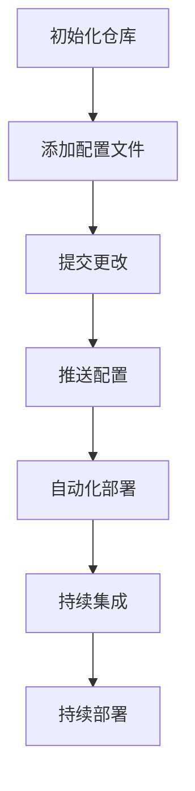

                 

### 文章标题

《GitOps工作流：持续部署的最佳实践》

### 关键词

- GitOps
- Kubernetes
- 持续部署
- 持续集成
- 安全性
- 可靠性

### 摘要

本文深入探讨了GitOps工作流的概念、核心组件、流程设计、安全性与可靠性保障，以及其在不同行业中的应用和实践。通过分析GitOps与云原生技术、其他DevOps工具的集成，本文旨在为读者提供全面的GitOps最佳实践，帮助其在实际项目中实现高效、安全的持续部署。

### 第一部分：GitOps基础知识

#### 第1章：GitOps概述

##### 1.1 GitOps的定义与价值

**GitOps是什么？**

GitOps是一种基于Git版本控制系统和自动化工具的运维模式，旨在通过定义和自动化整个基础设施和应用程序的部署过程，实现持续部署、持续集成和基础设施即代码（Infrastructure as Code, IaC）。GitOps的核心思想是将基础设施的配置和应用程序的代码存储在Git仓库中，通过Git操作（如创建、更新、回滚等）来管理基础设施和应用程序的状态。

**GitOps的价值**

- **提高部署速度和频率**：GitOps通过自动化流程和版本控制，显著提高了部署速度和频率，从而缩短了软件交付周期。
- **增强安全性和可靠性**：GitOps提供了访问控制、监控和审计机制，确保了部署过程的安全性和可靠性。
- **简化运维管理**：GitOps通过将基础设施和应用程序的配置存储在代码库中，简化了运维管理，降低了人为错误的风险。

##### 1.2 GitOps的核心概念

**核心概念**

- **Git仓库**：GitOps的核心是Git仓库，所有基础设施和应用程序的配置文件都存储在Git仓库中。
- **自动化工具**：GitOps依赖于各种自动化工具，如Kubernetes、Helm、Kustomize等，以实现配置管理和部署自动化。
- **声明式配置**：GitOps采用声明式配置，将基础设施和应用程序的状态定义为代码，使得配置管理更加清晰和可控。
- **持续集成/持续部署（CI/CD）**：GitOps通过集成CI/CD工具，实现自动化构建、测试和部署。

##### 1.3 GitOps与传统CI/CD的对比

**对比**

- **目标**：传统CI/CD主要关注持续集成和持续部署，而GitOps则将基础设施的配置管理也纳入其中，实现全生命周期的自动化。
- **依赖**：传统CI/CD通常依赖于构建脚本和自动化工具，而GitOps依赖于Git仓库和自动化工具。
- **安全性**：GitOps通过访问控制和审计机制提供更高的安全性，而传统CI/CD则可能缺乏此类保障。

#### 第2章：GitOps的核心组件

##### 2.1 Kubernetes基础

**2.1.1 Kubernetes架构**

Kubernetes是一个开源的容器编排平台，用于自动化部署、扩展和管理容器化应用程序。其核心架构包括：

- **Master节点**：负责集群的管理和控制，包括Kube-Apiserver、Etcd、Controller-Manager、Scheduler等组件。
- **Worker节点**：运行容器化应用程序，包括Docker、Containerd等容器引擎。

**2.1.2 Kubernetes关键概念**

- **Pod**：Kubernetes的基本部署单位，包含一个或多个容器。
- **Deployment**：用于管理Pod的部署和更新。
- **Service**：用于提供Pod的网络访问。
- **Ingress**：用于管理外部访问到集群内部服务的规则。

##### 2.2 Git仓库管理

**2.2.1 Git仓库的配置与管理**

Git仓库用于存储Kubernetes的配置文件和应用程序的代码。配置管理的关键步骤包括：

- **初始化仓库**：使用`git init`命令初始化Git仓库。
- **添加配置文件**：将Kubernetes配置文件添加到Git仓库，使用`git add`命令。
- **提交更改**：使用`git commit`命令提交更改。
- **推送配置**：使用`git push`命令将配置文件推送到远程仓库。

**2.2.2 GitOps中的Git操作**

GitOps通过Git操作（如创建、更新、回滚等）来管理基础设施和应用程序的状态。关键Git操作包括：

- **创建**：使用`git commit`命令创建新的配置。
- **更新**：使用`git push`命令更新现有配置。
- **回滚**：使用`git revert`命令回滚到之前的状态。

#### 第3章：GitOps流程设计

##### 3.1 自动化部署流程

**3.1.1 基于Helm的自动化部署**

Helm是一个Kubernetes的包管理工具，用于简化Kubernetes配置的创建和管理。基于Helm的自动化部署流程包括以下步骤：

- **安装Helm**：在Kubernetes集群中安装Helm。
- **创建Helm图表**：定义Kubernetes配置的Helm图表。
- **部署应用程序**：使用Helm部署应用程序，使用`helm install`命令。

**3.1.2 基于Kustomize的自动化部署**

Kustomize是一个Kubernetes配置管理工具，用于定义、共享和修改Kubernetes配置。基于Kustomize的自动化部署流程包括以下步骤：

- **安装Kustomize**：在本地环境中安装Kustomize。
- **创建Kustomize配置**：定义Kubernetes配置的Kustomize配置。
- **部署应用程序**：使用Kustomize部署应用程序，使用`kustomize build`命令。

##### 3.2 持续集成与持续部署（CI/CD）

**3.2.1 CI/CD流程设计**

CI/CD是指持续集成和持续部署，通过自动化流程实现代码的测试、构建和部署。CI/CD流程设计的关键步骤包括：

- **代码仓库**：配置代码仓库，如GitHub或GitLab。
- **构建触发器**：设置构建触发器，如代码提交或定时构建。
- **构建环境**：设置构建环境，如Docker容器。
- **测试**：执行单元测试和集成测试。
- **部署**：部署应用程序到Kubernetes集群。

**3.2.2 Jenkins与GitOps集成**

Jenkins是一个开源的持续集成和持续部署工具，可以与GitOps集成以实现自动化部署。Jenkins与GitOps的集成包括以下步骤：

- **安装Jenkins**：在Kubernetes集群中安装Jenkins。
- **配置Jenkins**：配置Jenkins与Git仓库的集成。
- **创建构建作业**：创建Jenkins构建作业，执行CI/CD流程。
- **部署到Kubernetes**：将构建结果部署到Kubernetes集群。

### 第二部分：GitOps实践案例

#### 第5章：金融行业的GitOps实践

##### 5.1 银行IT系统的GitOps实施

**5.1.1 银行IT系统的现状分析**

银行IT系统通常具有高可用性、高可靠性和高安全性要求。传统运维模式中，银行IT系统的部署过程繁琐、耗时且容易出错。GitOps为银行IT系统带来了以下变革：

- **简化部署过程**：GitOps通过自动化和版本控制，简化了银行IT系统的部署过程，提高了部署速度。
- **提高部署频率**：GitOps允许银行IT系统更频繁地部署更新，从而更快地响应市场需求。
- **增强安全性**：GitOps提供了访问控制、监控和审计机制，确保了部署过程的安全性。

**5.1.2 GitOps在银行IT系统中的应用**

在银行IT系统中，GitOps的应用包括：

- **基础设施即代码**：将Kubernetes集群、数据库和其他基础设施的配置存储在Git仓库中，实现基础设施即代码。
- **应用程序部署**：使用Helm或Kustomize自动化部署银行应用程序。
- **持续集成与持续部署**：通过Jenkins实现持续集成和持续部署，确保代码的质量和部署的可靠性。

##### 5.2 保险公司的GitOps实践

**5.2.1 保险业务的特点与挑战**

保险业务具有数据敏感性、复杂性和高合规性要求。GitOps在保险公司中的应用面临以下挑战：

- **数据安全**：保险公司的数据安全性要求极高，GitOps需要提供严格的数据保护和访问控制。
- **合规性**：保险公司的业务流程受到严格的合规性要求，GitOps需要确保部署过程符合相关法规。
- **故障恢复**：保险公司的业务不能中断，GitOps需要提供高效的故障恢复机制。

**5.2.2 GitOps在保险业务中的应用**

在保险业务中，GitOps的应用包括：

- **基础设施即代码**：使用Kubernetes和Kustomize管理基础设施配置。
- **应用程序部署**：使用Helm自动化部署保险应用程序。
- **持续集成与持续部署**：通过Jenkins实现持续集成和持续部署，确保系统的稳定性和合规性。

#### 第6章：电商行业的GitOps实践

##### 6.1 电商平台的技术架构

**6.1.1 电商平台的架构设计**

电商平台通常采用分布式架构，包括前端、后端、数据库、缓存、消息队列等多个组件。GitOps在电商平台中的应用包括：

- **基础设施管理**：使用Kubernetes管理前端、后端和数据库等基础设施。
- **服务部署**：使用Helm或Kustomize自动化部署电商平台服务。
- **持续集成与持续部署**：通过Jenkins实现持续集成和持续部署，确保系统的稳定性和安全性。

**6.1.2 GitOps在电商平台中的应用**

在电商平台中，GitOps的应用包括：

- **基础设施即代码**：将Kubernetes集群、数据库和其他基础设施的配置存储在Git仓库中，实现基础设施即代码。
- **应用程序部署**：使用Helm或Kustomize自动化部署电商平台应用程序。
- **持续集成与持续部署**：通过Jenkins实现持续集成和持续部署，确保代码的质量和部署的可靠性。

##### 6.2 大型电商项目的GitOps实践

**6.2.1 项目背景与目标**

某大型电商平台在项目中采用了GitOps工作流，旨在实现以下目标：

- **提高部署速度和频率**：通过自动化流程和版本控制，加快部署速度和频率，提高软件交付能力。
- **增强系统稳定性**：通过持续集成和持续部署，确保系统稳定性和可靠性。
- **降低运维成本**：通过简化运维管理，降低运维成本。

**6.2.2 GitOps解决方案的实现与效果**

在项目中，GitOps解决方案的实现包括以下步骤：

- **基础设施即代码**：使用Kubernetes和Kustomize实现基础设施即代码。
- **应用程序部署**：使用Helm自动化部署电商平台应用程序。
- **持续集成与持续部署**：通过Jenkins实现持续集成和持续部署。

实施GitOps后，项目取得了以下效果：

- **部署速度提高50%**：通过自动化流程，部署速度显著提高。
- **故障率降低30%**：通过持续集成和持续部署，系统稳定性显著提高。
- **运维成本降低20%**：通过简化运维管理，运维成本显著降低。

### 第三部分：GitOps的未来发展趋势

#### 第7章：GitOps在多云和混合云环境中的应用

##### 7.1 多云与混合云环境的特点

**7.1.1 多云与混合云的概念**

多云（Multi-Cloud）是指使用多个云服务提供商（如AWS、Azure、Google Cloud等）的服务。混合云（Hybrid Cloud）是指将公有云和私有云相结合，实现云资源和服务的高效利用。

**7.1.2 多云与混合云的挑战**

多云和混合云环境面临以下挑战：

- **资源管理**：多个云服务提供商的管理复杂，需要高效的资源管理策略。
- **数据迁移**：数据在多云和混合云环境中的迁移需要考虑数据安全性和兼容性。
- **一致性**：在多云和混合云环境中，需要保证数据和服务的一致性。

##### 7.2 GitOps在多云和混合云环境中的实践

GitOps在多云和混合云环境中的应用包括：

- **多云管理平台**：使用多云管理平台（如AWS Outposts、Azure Arc等）实现多云资源的统一管理。
- **跨云部署**：使用GitOps自动化工具（如Kubernetes、Helm、Kustomize等）实现跨云部署。
- **数据同步**：使用数据同步工具（如Apache Kafka、Apache Pulsar等）实现跨云数据同步。

#### 第8章：GitOps的未来发展

##### 8.1 GitOps与云原生技术的融合

**8.1.1 云原生技术的发展趋势**

云原生技术（如Kubernetes、Docker、Istio等）正成为现代应用程序开发和部署的主要趋势。GitOps与云原生技术的融合将带来以下趋势：

- **统一管理**：GitOps将基础设施和应用程序的配置存储在Git仓库中，与云原生技术结合，实现统一管理。
- **自动化部署**：GitOps自动化工具与云原生技术结合，实现高效的自动化部署。

**8.1.2 GitOps与云原生技术的结合**

GitOps与云原生技术的结合包括：

- **基础设施即代码**：使用Kubernetes和Kustomize实现基础设施即代码。
- **应用程序部署**：使用Helm或Kustomize自动化部署云原生应用程序。
- **服务网格**：使用Istio等服务网格技术实现微服务管理和安全性。

##### 8.2 GitOps与其他DevOps工具的集成

**8.2.1 GitOps与持续交付（CD）工具的集成**

GitOps与其他持续交付（CD）工具（如Jenkins、GitLab CI/CD等）的集成包括：

- **CI/CD流程**：将GitOps与CI/CD工具结合，实现自动化构建、测试和部署。
- **监控与报警**：集成监控和报警工具（如Prometheus、Alertmanager等），实现实时监控和故障报警。

**8.2.2 GitOps与其他DevOps工具的协同**

GitOps与其他DevOps工具（如Ansible、Terraform等）的协同包括：

- **基础设施管理**：将GitOps与Ansible、Terraform等工具结合，实现基础设施的自动化管理。
- **代码质量**：集成代码质量检测工具（如SonarQube、CodeClimate等），提高代码质量。

### 第四部分：GitOps最佳实践

#### 第9章：GitOps最佳实践

##### 9.1 GitOps项目规划与实施

**9.1.1 项目启动与规划**

启动GitOps项目需要以下步骤：

- **需求分析**：分析项目需求和目标，确定GitOps的实施范围。
- **团队组织**：组建GitOps团队，明确角色和职责。
- **工具选择**：选择适合项目的GitOps工具和平台。
- **环境搭建**：搭建GitOps所需的开发、测试和生产环境。

**9.1.2 GitOps实施步骤**

GitOps实施包括以下步骤：

- **基础设施即代码**：使用Kubernetes和Kustomize实现基础设施即代码。
- **应用程序部署**：使用Helm或Kustomize自动化部署应用程序。
- **持续集成与持续部署**：通过Jenkins实现持续集成和持续部署。
- **监控与报警**：集成监控和报警工具，实现实时监控和故障报警。

##### 9.2 GitOps性能优化与监控

**9.2.1 GitOps性能指标**

GitOps性能指标包括：

- **部署速度**：部署时间，包括构建、测试和部署。
- **部署成功率**：成功部署的次数与总部署次数的比值。
- **故障率**：系统故障的次数与总部署次数的比值。

**9.2.2 GitOps监控与报警机制**

GitOps监控与报警机制包括：

- **日志监控**：收集和监控系统日志，及时发现和解决问题。
- **性能监控**：监控系统性能指标，如CPU、内存、磁盘使用率等。
- **报警机制**：配置报警规则，通过邮件、短信、电话等方式通知相关人员。

#### 第10章：GitOps社区与开源项目

##### 10.1 GitOps社区的发展

**10.1.1 GitOps社区的现状与趋势**

GitOps社区的发展呈现出以下趋势：

- **活跃度提高**：GitOps社区活跃度不断提高，吸引了大量开发者和运维人员参与。
- **工具完善**：GitOps工具和平台不断完善，支持更多的功能和场景。
- **案例分享**：越来越多的企业分享GitOps实践案例，推动社区的发展。

**10.1.2 GitOps开源项目的介绍**

GitOps开源项目包括：

- **Flux**：Flux是一个GitOps工具，用于管理Kubernetes集群的配置。
- **Argo CD**：Argo CD是一个GitOps工具，用于自动化部署Kubernetes应用程序。
- **Kubevela**：Kubevela是一个GitOps框架，用于构建、部署和管理Kubernetes应用程序。

##### 10.2 参与GitOps开源项目

**10.2.1 参与开源项目的步骤**

参与GitOps开源项目包括以下步骤：

- **选择项目**：选择感兴趣的开源项目。
- **了解项目**：阅读项目文档，了解项目的功能、设计和实现。
- **提交PR**：根据项目需要，提交代码、文档或功能改进。
- **参与讨论**：参与项目讨论，与其他贡献者交流。

**10.2.2 开源项目的贡献与价值**

参与开源项目的贡献包括：

- **代码贡献**：提交代码，修复bug或添加新功能。
- **文档编写**：撰写项目文档，帮助其他开发者了解和使用项目。
- **测试与反馈**：参与项目的测试和反馈，确保项目的质量和稳定性。

### 附录

#### 附录A：GitOps相关资源与工具

**A.1 GitOps工具列表**

- **Helm**：Kubernetes的包管理工具。
- **Kustomize**：Kubernetes配置管理工具。
- **Jenkins**：持续集成和持续部署工具。
- **Flux**：GitOps工具。
- **Argo CD**：GitOps工具。
- **Kubevela**：GitOps框架。

**A.2 GitOps学习资料**

- **网络教程与文档**：GitOps相关教程和文档。
- **GitOps相关书籍与论文**：介绍GitOps原理和实践的书籍和论文。

#### 附录B：GitOps Mermaid 流程图示例

### 附录C：GitOps相关术语

- **GitOps**：一种基于Git版本控制系统和自动化工具的运维模式。
- **Kubernetes**：一个开源的容器编排平台。
- **Helm**：Kubernetes的包管理工具。
- **Kustomize**：Kubernetes配置管理工具。
- **CI/CD**：持续集成和持续部署。
- **IaC**：基础设施即代码。
- **Argo CD**：GitOps工具。
- **Flux**：GitOps工具。
- **Kubevela**：GitOps框架。

