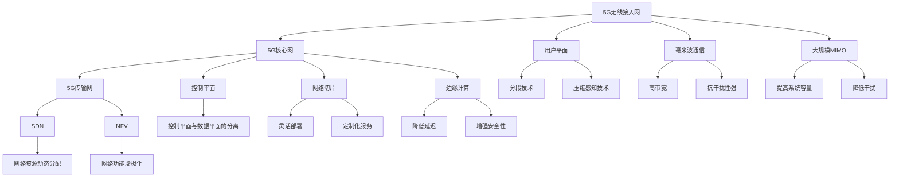

                 

### 文章标题：5G应用开发：新一代通信技术的商机

关键词：5G技术、应用开发、新一代通信、商机、关键技术、架构、核心应用场景

摘要：本文将深入探讨5G技术的基础知识，解析其关键技术和网络架构，分析5G在智能制造、智能交通、增强现实与虚拟现实以及物联网等领域的核心应用场景，探讨5G标准化与产业生态，分享5G应用开发实践和挑战，并展示具体案例。通过本文，读者将全面了解5G技术的商机，为未来的应用开发提供指导和启示。

---

### 《5G应用开发：新一代通信技术的商机》目录大纲

#### 第一部分：5G技术基础

##### 第1章：5G概述
- **1.1 5G技术的发展历程**
- **1.2 5G的关键技术特点**
- **1.3 5G网络的架构**

##### 第2章：5G关键技术解析
- **2.1 毫米波通信**
- **2.2 大规模MIMO**
- **2.3 网络切片**
- **2.4 边缘计算**

##### 第3章：5G网络架构与协议
- **3.1 5G网络架构**
- **3.2 5G协议栈**
- **3.3 5G网络的安全机制**

##### 第4章：5G核心应用场景
- **4.1 智能制造**
- **4.2 智能交通**
- **4.3 增强现实与虚拟现实**
- **4.4 物联网**

##### 第5章：5G标准化与产业生态
- **5.1 5G标准化组织与标准制定**
- **5.2 5G产业链分析**
- **5.3 5G产业生态构建**

#### 第二部分：5G应用开发实践

##### 第6章：5G应用开发框架
- **6.1 5G应用开发流程**
- **6.2 5G应用开发工具与平台**
- **6.3 5G应用开发安全性与隐私保护**

##### 第7章：5G应用案例解析
- **7.1 5G+智能制造：工业自动化生产线的优化**
- **7.2 5G+智慧城市：智能交通管理系统的构建**
- **7.3 5G+医疗健康：远程医疗服务的创新**
- **7.4 5G+农业：智慧农业的推进**

##### 第8章：5G应用开发挑战与未来趋势
- **8.1 5G应用开发中的技术挑战**
- **8.2 5G应用开发中的商业挑战**
- **8.3 5G应用开发的未来趋势**

#### 第三部分：5G应用开发实践案例

##### 第9章：5G应用开发实战案例
- **9.1 5G+智能工厂：案例分析与实现**
- **9.2 5G+智慧城市：案例分析与实现**
- **9.3 5G+远程医疗：案例分析与实现**
- **9.4 5G+智慧农业：案例分析与实现**

##### 附录

##### 附录A：5G相关资源与工具
- **A.1 5G相关书籍与论文**
- **A.2 5G开发平台与工具**
- **A.3 5G应用开发社区与论坛**

### 附录B：5G核心概念与架构Mermaid流程图

---

### 简单易懂的专业技术语言

在撰写本文时，我们将采用简单易懂的专业技术语言，以确保读者能够轻松理解5G技术的核心概念和应用。本文将分为三个主要部分：

1. **5G技术基础**：介绍5G技术的发展历程、关键技术和网络架构，帮助读者建立对5G技术的基本认识。
2. **5G应用开发实践**：分析5G技术在智能制造、智能交通、增强现实与虚拟现实、物联网等领域的应用，并探讨5G应用开发的安全性和隐私保护。
3. **5G应用开发实战案例**：通过具体案例展示5G技术的实际应用，提供实践经验和启示。

通过这三个部分，读者将全面了解5G技术的商机，掌握5G应用开发的实践方法，并为未来的技术发展做好准备。

---

接下来，我们将一步一步地深入分析5G技术的基础知识，包括其发展历程、关键技术、网络架构以及核心应用场景。让我们开始吧！

---

### 第1章：5G概述

#### 1.1 5G技术的发展历程

5G技术，即第五代移动通信技术，是继1G模拟通信、2G数字通信、3G多媒体通信和4G高速宽带通信之后的新一代移动通信技术。5G技术的发展历程可以追溯到2000年代初期，当时国际电信联盟（ITU）开始规划5G标准。以下是5G技术的发展历程：

1. **2000年代初期**：ITU启动了5G标准的规划工作，并提出了5G愿景，即实现全球覆盖、高速率、低延迟的通信网络。

2. **2012年**：ITU正式发布了5G技术框架，明确了5G的关键技术指标，包括峰值速率达到20Gbps、延迟低于1毫秒、每平方米的连接密度达到1000设备等。

3. **2016年**：3GPP启动了5G标准的研究工作，并于2018年完成了5G独立组网（NSA）和非独立组网（SA）的标准化工作。

4. **2019年**：全球多个国家和地区开始部署5G网络，标志着5G时代的正式到来。

5. **2020年代**：5G网络在全球范围内的普及速度加快，5G终端设备和应用逐渐丰富，5G技术在各个领域的应用也将得到进一步拓展。

#### 1.2 5G的关键技术特点

5G技术具有以下关键技术特点：

1. **高速率**：5G网络的峰值速率可达20Gbps，是4G网络的10倍以上，能够满足高清视频、虚拟现实等高带宽应用的需求。

2. **低延迟**：5G网络的端到端延迟可降低到1毫秒以下，大大提高了实时通信和物联网应用的性能。

3. **大连接密度**：5G网络能够支持每平方米1000个设备的同时连接，满足大规模物联网应用的需求。

4. **网络切片**：5G网络可以实现虚拟化网络切片，为不同应用提供定制化的网络服务，提高网络资源的利用效率。

5. **边缘计算**：5G网络引入了边缘计算技术，将计算任务分散到网络边缘，降低延迟，提高数据处理能力。

6. **毫米波通信**：5G网络采用毫米波频段，提供了更大的带宽和更高的传输速率。

#### 1.3 5G网络的架构

5G网络的架构相较于前几代移动通信网络有了显著的改进，主要包括以下几个方面：

1. **5G无线接入网**：5G无线接入网采用基于NSA或SA的架构，NSA架构利用现有的4G核心网，SA架构则独立建设5G核心网。

2. **5G核心网**：5G核心网实现了虚拟化、服务化、云化，具有更高的灵活性和可扩展性。

3. **5G传输网**：5G传输网采用了SDN和NFV技术，实现了网络功能虚拟化和网络资源动态分配。

4. **5G用户平面**：5G用户平面采用了分段、压缩感知等技术，提高了数据传输的效率。

5. **5G控制平面**：5G控制平面实现了控制平面和数据平面的分离，提高了网络的可靠性。

综上所述，5G技术以其高速率、低延迟、大连接密度等关键技术特点，以及虚拟化、服务化、云化等网络架构改进，为移动通信领域带来了新的发展机遇。在接下来的章节中，我们将深入分析5G的关键技术、网络架构及其在各个领域的应用，帮助读者全面了解5G技术的商机。

---

### 第2章：5G关键技术解析

#### 2.1 毫米波通信

毫米波通信是5G技术中的关键技术之一，它利用毫米波频段（通常为24GHz至52GHz）进行通信。毫米波通信具有以下优点：

1. **高带宽**：毫米波频段提供了更大的带宽，可以支持更高的数据传输速率，满足高清视频、虚拟现实等高带宽应用的需求。
   
2. **抗干扰性强**：毫米波通信采用更高的频率，减少了与其他无线通信系统的干扰，提高了通信的稳定性。

3. **多路径传播**：毫米波通信在传播过程中具有多路径效应，可以通过多个路径传输数据，提高了通信的可靠性。

然而，毫米波通信也存在一些挑战，如信号衰减大、穿透性差等。为了克服这些挑战，5G网络采用了大规模MIMO技术，通过增加天线数量和提高天线增益，提高了信号的传输距离和穿透能力。

#### 2.2 大规模MIMO

大规模MIMO（Massive MIMO）技术是5G网络的核心技术之一，它通过增加天线数量（通常为64或更多）来提高通信系统的容量和效率。大规模MIMO具有以下特点：

1. **提高系统容量**：大规模MIMO通过多天线传输和接收，实现了多用户同时通信，大大提高了系统容量。

2. **降低干扰**：大规模MIMO通过波束成形和用户调度技术，减少了用户间的干扰，提高了通信的可靠性。

3. **提高频谱效率**：大规模MIMO通过空间复用技术，提高了频谱效率，实现了更高的数据传输速率。

4. **降低成本**：虽然大规模MIMO需要更多的天线和计算资源，但通过使用低成本的天线和硬件加速技术，可以降低整体成本。

#### 2.3 网络切片

网络切片是5G网络的一项关键技术，它通过虚拟化技术，将一个物理网络分割成多个虚拟网络，每个虚拟网络提供不同的服务质量、性能和功能。网络切片具有以下优点：

1. **灵活部署**：网络切片可以根据不同的应用需求，灵活配置网络资源，提高网络的灵活性和可扩展性。

2. **定制化服务**：网络切片可以为不同类型的用户和应用提供定制化的网络服务，如低延迟、高带宽、高可靠性等。

3. **提高资源利用率**：通过网络切片，网络资源可以根据实际需求动态分配，提高了资源利用率。

4. **降低成本**：网络切片可以减少网络设备的投入，降低网络运营和维护成本。

#### 2.4 边缘计算

边缘计算是5G网络的一项关键技术，它将计算任务分散到网络边缘，降低了延迟，提高了数据处理能力。边缘计算具有以下优点：

1. **降低延迟**：通过将计算任务从中心服务器转移到网络边缘，减少了数据传输的距离和时间，降低了延迟。

2. **提高处理能力**：边缘计算可以将计算任务分散到多个边缘节点，提高了整体的处理能力。

3. **增强安全性**：边缘计算可以在本地处理数据，减少了数据传输过程中被窃取或篡改的风险。

4. **降低带宽消耗**：通过在边缘处理数据，可以减少数据传输量，降低带宽消耗。

总的来说，5G技术的关键技术包括毫米波通信、大规模MIMO、网络切片和边缘计算。这些技术相互结合，为5G网络提供了高速率、低延迟、大连接密度等特性，推动了移动通信技术的快速发展。在接下来的章节中，我们将进一步探讨5G网络架构与协议，以及5G在不同领域的核心应用场景。

### 第3章：5G网络架构与协议

#### 3.1 5G网络架构

5G网络的架构相较于前几代移动通信网络有了显著的改进，实现了虚拟化、服务化和云化。5G网络架构主要包括以下组成部分：

1. **无线接入网（RAN）**：5G无线接入网采用了基于NSA（非独立组网）或SA（独立组网）的架构。NSA架构利用现有的4G核心网，SA架构则独立建设5G核心网。5G无线接入网支持毫米波通信、大规模MIMO等技术，提供了高速率和低延迟的无线通信服务。

2. **核心网（CN）**：5G核心网实现了虚拟化、服务化和云化。虚拟化技术将传统的硬件设备虚拟化为多个虚拟功能模块，提高了网络的灵活性和可扩展性。服务化技术将网络功能转化为服务，通过网络编排实现按需部署和配置。云化技术将网络功能部署在云计算平台上，提高了资源的利用率和服务质量。

3. **传输网**：5G传输网采用了SDN（软件定义网络）和NFV（网络功能虚拟化）技术。SDN通过集中控制平面和分布的数据平面，实现了网络资源的动态分配和智能调度。NFV通过将网络功能虚拟化为软件模块，提高了网络的灵活性和可管理性。

4. **用户平面**：5G用户平面采用了分段和压缩感知等技术，提高了数据传输的效率。分段技术将数据流分割成多个数据包，通过不同的路径传输，减少了数据传输的时延。压缩感知技术通过稀疏采样和压缩感知算法，提高了数据传输的带宽利用率。

5. **控制平面**：5G控制平面实现了控制平面和数据平面的分离。控制平面负责网络的控制和调度，包括连接管理、资源分配等。数据平面负责数据传输，包括数据路由、传输等。通过分离控制平面和数据平面，提高了网络的可靠性和可扩展性。

6. **边缘计算节点**：5G网络引入了边缘计算节点，将计算任务分散到网络边缘。边缘计算节点可以处理本地数据，降低了延迟，提高了数据处理能力。边缘计算节点包括基站、小型基站、家庭基站等，可以根据实际需求部署在网络的各个层级。

#### 3.2 5G协议栈

5G协议栈是5G网络的核心组成部分，定义了数据传输和控制信息的处理流程。5G协议栈主要包括以下层次：

1. **物理层**：物理层负责数据的传输和调制解调。5G物理层采用了新的调制方式和编码方案，如QAM（正交振幅调制）和Polar码，提高了数据传输的速率和可靠性。

2. **数据链路层**：数据链路层负责数据的传输和错误检测。5G数据链路层采用了新的链路层协议，如NG-LTE和ECM-RE，提高了数据传输的效率和质量。

3. **网络层**：网络层负责数据包的路由和传输。5G网络层采用了IPv6协议，实现了端到端的数据传输。网络层还负责IP地址的分配和管理，确保数据包的正确传输。

4. **传输层**：传输层负责数据包的传输控制和错误纠正。5G传输层采用了TCP（传输控制协议）和UDP（用户数据报协议），提供了可靠和高效的数据传输服务。

5. **应用层**：应用层负责数据的应用处理和交互。5G应用层支持多种应用场景，如物联网、智能制造、智能交通等。应用层协议包括HTTP/2、HTTP/3等，提高了应用的数据传输效率。

#### 3.3 5G网络的安全机制

5G网络的安全机制是保障网络数据安全的重要措施。5G网络的安全机制主要包括以下方面：

1. **加密机制**：5G网络采用了高级加密标准（AES）和高级数据链路控制协议（ADLC），确保数据在传输过程中的机密性和完整性。

2. **认证机制**：5G网络采用了用户和设备的认证机制，确保只有合法用户和设备才能接入网络。认证机制包括用户身份认证、设备认证等。

3. **访问控制**：5G网络采用了基于角色的访问控制（RBAC）机制，根据用户角色和权限限制对网络资源的访问。

4. **防火墙**：5G网络部署了防火墙，防止外部攻击和非法访问。防火墙可以根据网络流量特征和规则，过滤和阻止恶意流量。

5. **入侵检测和防御**：5G网络采用了入侵检测和防御系统，实时监测网络流量和设备行为，发现并阻止潜在的安全威胁。

综上所述，5G网络的架构和协议在无线接入、核心网、传输网、用户平面、控制平面等方面进行了全面的改进和优化，为5G网络的高速率、低延迟、大连接密度等特性提供了坚实的技术支持。同时，5G网络的安全机制为保障网络数据安全提供了有力保障。在接下来的章节中，我们将进一步探讨5G的核心应用场景，分析其在智能制造、智能交通、增强现实与虚拟现实、物联网等领域的应用价值。

---

### 第4章：5G核心应用场景

#### 4.1 智能制造

智能制造是5G技术的重要应用场景之一，通过5G网络的高速率、低延迟和大连接密度，实现工厂设备的实时数据传输、智能分析和远程控制。以下是5G在智能制造领域的核心应用：

1. **实时数据采集与传输**：5G网络能够实时采集生产设备的运行数据，如温度、压力、速度等，并通过高速数据传输将数据传输到云端进行分析和处理。

2. **智能分析与应用**：通过5G网络，智能制造系统能够实时获取设备状态、生产进度等信息，利用大数据分析和机器学习技术进行预测性维护、质量控制和生产优化。

3. **远程控制与协同作业**：5G网络实现了远程设备的实时控制，操作人员可以通过远程终端实时监控和控制工厂设备，提高了生产效率和安全性。

4. **设备互联与智能调度**：5G网络实现了工厂内设备之间的实时通信，通过物联网技术和5G网络，实现设备的互联互通和智能调度，提高了生产线的整体效率。

#### 4.2 智能交通

智能交通是5G技术的另一个重要应用场景，通过5G网络实现车辆与基础设施、车辆与车辆之间的实时通信，提高交通管理效率和安全性。以下是5G在智能交通领域的核心应用：

1. **车联网（V2X）**：5G网络实现了车与车、车与基础设施、车与行人之间的实时通信，通过V2X技术实现车辆间的信息共享和协同控制，提高了交通安全性和效率。

2. **智能交通管理系统**：5G网络为智能交通管理系统提供了高速、低延迟的数据传输通道，实现了交通流量监控、实时路况信息发布、智能调度等功能。

3. **自动驾驶**：5G网络支持自动驾驶技术的实时数据传输和远程控制，通过车联网技术和边缘计算，实现车辆的自主导航和协同驾驶。

4. **交通数据分析和优化**：5G网络为交通数据分析提供了丰富的数据资源，利用大数据分析和机器学习技术，实现交通流量预测、路径优化和交通信号控制优化。

#### 4.3 增强现实与虚拟现实

增强现实（AR）和虚拟现实（VR）是5G技术的创新应用场景，通过5G网络实现高带宽、低延迟的实时数据传输，提供沉浸式体验和智能交互。以下是5G在AR/VR领域的核心应用：

1. **实时数据传输**：5G网络提供了高带宽、低延迟的数据传输通道，使得AR/VR应用能够实时获取和传输图像、视频等数据，提供流畅的体验。

2. **实时交互**：5G网络实现了远程用户的实时交互，支持多人同时在线协作，提供了更加丰富的社交体验。

3. **远程协同**：通过5G网络，AR/VR应用可以实现远程协同工作，如远程医疗、教育、工程设计等领域，提高了工作效率和质量。

4. **智能内容生成**：5G网络支持高速数据传输和边缘计算，可以实现实时内容生成和智能推荐，提供了更加个性化的用户体验。

#### 4.4 物联网

物联网是5G技术的核心应用场景之一，通过5G网络实现海量设备的互联互通和智能管理。以下是5G在物联网领域的核心应用：

1. **设备互联**：5G网络提供了大连接密度，支持海量设备的接入和通信，实现了设备之间的实时数据交换和协同控制。

2. **智能管理**：5G网络实现了物联网设备的智能管理，通过大数据分析和机器学习技术，实现设备状态的实时监控、故障预测和维护优化。

3. **边缘计算**：5G网络引入了边缘计算，将计算任务分散到网络边缘，降低了延迟，提高了数据处理能力，支持实时应用场景。

4. **智能服务**：5G网络为物联网应用提供了高速、低延迟的数据传输通道，支持智能服务应用的开发和部署，如智能安防、智能家居、智能城市等。

综上所述，5G技术在智能制造、智能交通、增强现实与虚拟现实、物联网等领域的应用具有巨大的潜力和前景，通过5G网络实现实时数据传输、智能分析和远程控制，提高了各行业的生产效率和服务质量。在接下来的章节中，我们将进一步探讨5G标准化与产业生态，分析5G产业链的发展现状和未来趋势。

---

### 第5章：5G标准化与产业生态

#### 5.1 5G标准化组织与标准制定

5G标准化工作是由多个国际和国内标准化组织共同推进的。以下是一些主要的5G标准化组织及其在5G标准制定中的角色：

1. **国际电信联盟（ITU）**：ITU是负责制定全球电信标准的国际组织。在5G标准化过程中，ITU负责制定5G技术的整体框架和关键技术指标。

2. **3GPP（第三代合作伙伴计划）**：3GPP是负责制定移动通信标准的国际组织。在5G标准化过程中，3GPP负责制定5G网络的协议、架构和技术规范。

3. **ETSI（欧洲电信标准协会）**：ETSI是负责制定欧洲电信标准的协会。在5G标准化过程中，ETSI负责制定5G网络的技术规范和测试标准。

4. **IEEE（电气和电子工程师协会）**：IEEE是负责制定通信和电子领域标准的协会。在5G标准化过程中，IEEE负责制定5G无线通信的标准。

5. **CCSA（中国通信标准化协会）**：CCSA是中国负责制定通信标准的协会。在5G标准化过程中，CCSA负责制定5G网络的技术规范和测试标准。

#### 5.2 5G产业链分析

5G产业链包括设备制造商、运营商、服务提供商、芯片制造商和内容提供商等多个环节。以下是对5G产业链的分析：

1. **设备制造商**：设备制造商是5G网络建设的关键环节，包括基站、无线接入设备、核心网设备等。设备制造商需要根据标准化组织的要求进行设备研发和生产。

2. **运营商**：运营商是5G网络建设和运营的主体，负责5G网络的部署、运营和维护。运营商需要与设备制造商、服务提供商等合作，提供5G网络服务。

3. **服务提供商**：服务提供商是5G网络应用的重要推动者，包括云计算服务提供商、物联网服务提供商、智能交通服务提供商等。服务提供商通过开发和部署5G应用，推动5G网络的普及和应用。

4. **芯片制造商**：芯片制造商是5G网络设备的核心部件提供商，包括射频芯片、基带芯片、处理器芯片等。芯片制造商需要根据5G网络的要求，提供高性能、低功耗的芯片解决方案。

5. **内容提供商**：内容提供商是5G网络应用场景的重要参与者，包括视频内容提供商、游戏内容提供商、教育内容提供商等。内容提供商通过开发和提供高质量的内容，吸引用户使用5G网络服务。

#### 5.3 5G产业生态构建

5G产业生态的构建是推动5G技术发展的重要环节。以下是一些关键步骤：

1. **政策支持**：政府应出台相关政策，支持5G技术研发、网络建设和应用推广。政策支持包括资金扶持、税收优惠、频谱资源分配等。

2. **技术创新**：鼓励企业加大5G技术研发投入，推动关键技术的突破和创新。技术创新包括无线通信技术、网络架构技术、应用技术等。

3. **产业链合作**：加强产业链上下游企业的合作，形成协同创新的产业生态。产业链企业可以通过合作，实现资源共享、优势互补，提高整体竞争力。

4. **人才培养**：加强5G相关人才的培养，提高5G技术的人才储备。人才培养包括高等教育、职业教育、继续教育等。

5. **市场推广**：推动5G网络的应用和普及，扩大5G市场。市场推广可以通过政策引导、示范应用、产业合作等方式实现。

通过以上措施，可以构建一个健康的5G产业生态，推动5G技术的快速发展，促进数字经济和产业升级。

---

### 第6章：5G应用开发框架

#### 6.1 5G应用开发流程

5G应用开发是一个复杂的过程，涉及多个阶段和环节。以下是一个典型的5G应用开发流程：

1. **需求分析**：明确应用的需求和目标，包括功能需求、性能需求、安全需求等。

2. **架构设计**：根据需求分析，设计应用的整体架构，包括网络架构、系统架构、数据架构等。

3. **技术选型**：选择合适的5G技术和工具，如无线接入技术、边缘计算技术、物联网技术等。

4. **开发与测试**：根据架构设计，进行应用开发和单元测试，确保应用功能完整、性能稳定。

5. **部署与运维**：将应用部署到5G网络上，并进行性能测试和优化，确保应用在5G网络上的稳定运行。

6. **上线与推广**：将应用上线，并通过市场营销、用户反馈等方式进行推广。

#### 6.2 5G应用开发工具与平台

5G应用开发需要使用多种工具和平台，以下是一些常见的工具和平台：

1. **5G网络仿真平台**：用于模拟5G网络环境，进行性能测试和优化。

2. **边缘计算平台**：用于部署和运行边缘计算应用，实现实时数据处理和智能分析。

3. **物联网平台**：用于连接和管理物联网设备，实现设备数据收集、分析和应用。

4. **开发框架与SDK**：提供5G应用开发的基本框架和开发工具包，如5G网络编程接口、边缘计算框架、物联网开发工具等。

5. **云计算平台**：用于部署和管理5G应用的后端服务，提供计算、存储、网络等资源。

#### 6.3 5G应用开发安全性与隐私保护

5G应用开发中，安全性和隐私保护是至关重要的。以下是一些关键措施：

1. **数据加密**：对传输的数据进行加密，确保数据在传输过程中的安全性。

2. **身份认证**：采用多因素身份认证，确保只有授权用户和设备能够访问系统。

3. **访问控制**：根据用户角色和权限，实施严格的访问控制策略，确保数据的安全访问。

4. **网络安全**：部署防火墙、入侵检测系统等网络安全设备，防止外部攻击和非法访问。

5. **隐私保护**：在数据处理和存储过程中，遵循隐私保护法律法规，确保用户隐私不被泄露。

通过以上措施，可以确保5G应用开发的安全性和隐私保护，为用户和企业的数据安全提供保障。

---

### 第7章：5G应用案例解析

#### 7.1 5G+智能制造：工业自动化生产线的优化

随着5G技术的不断发展，智能制造成为工业领域的重要趋势。5G技术通过实现高速率、低延迟的数据传输，为工业自动化生产线的优化提供了强大的支持。以下是5G在智能制造领域的具体应用：

1. **实时数据采集与监控**：5G网络实现了生产设备与控制系统之间的实时数据传输，可以实时采集设备运行数据，如温度、压力、速度等，并通过云平台进行实时监控和分析。

2. **预测性维护**：通过5G网络，工厂可以实现设备的预测性维护。通过实时数据分析和机器学习算法，预测设备故障风险，提前进行维护，减少设备停机时间。

3. **远程控制与协同作业**：5G网络支持远程设备的实时控制，操作人员可以通过远程终端实时监控和控制工厂设备，实现远程协同作业，提高生产效率。

4. **设备互联互通**：5G网络实现了工厂内设备之间的实时通信，通过物联网技术和5G网络，实现设备的互联互通和智能调度，优化生产线的整体效率。

5. **生产优化与质量控制**：通过5G网络，工厂可以实现生产过程的实时监控和分析，优化生产流程，提高生产效率。同时，通过实时数据分析和质量检测，提高产品质量。

#### 7.2 5G+智慧城市：智能交通管理系统的构建

智慧城市是5G技术的另一个重要应用场景。通过5G网络实现交通管理与监控，提高城市交通效率，减少交通拥堵。以下是5G在智慧城市交通管理领域的具体应用：

1. **车联网（V2X）**：5G网络实现了车辆与基础设施、车辆与车辆之间的实时通信，通过V2X技术实现车辆间的信息共享和协同控制，提高交通安全性和效率。

2. **智能交通管理系统**：5G网络为智能交通管理系统提供了高速、低延迟的数据传输通道，可以实现交通流量监控、实时路况信息发布、智能调度等功能。

3. **自动驾驶**：5G网络支持自动驾驶技术的实时数据传输和远程控制，通过车联网技术和边缘计算，实现车辆的自主导航和协同驾驶。

4. **交通数据分析与优化**：5G网络为交通数据分析提供了丰富的数据资源，利用大数据分析和机器学习技术，实现交通流量预测、路径优化和交通信号控制优化。

5. **智能交通信号控制**：通过5G网络，智能交通信号控制系统能够实时获取交通数据，根据实时交通状况调整信号灯控制策略，优化交通流量。

#### 7.3 5G+医疗健康：远程医疗服务的创新

5G技术为医疗健康领域带来了创新，通过高速、低延迟的数据传输，实现远程医疗服务，提高医疗服务质量和效率。以下是5G在医疗健康领域的具体应用：

1. **远程诊断与治疗**：5G网络实现了远程医疗设备的实时数据传输，医生可以通过远程终端进行实时诊断和治疗，提高医疗服务的效率和准确性。

2. **远程监控与健康管理**：通过5G网络，患者可以在家中进行实时健康数据监控，医生可以远程监控患者健康状况，提供个性化的健康管理和建议。

3. **远程手术与协作**：5G网络支持远程手术的实时数据传输和远程控制，医生可以通过远程终端进行远程手术，实现跨地域的医疗协作。

4. **医疗数据共享与处理**：5G网络实现了医疗数据的实时传输和共享，医疗团队能够快速获取和分析患者的医疗数据，提供更准确的诊断和治疗建议。

5. **智能医疗设备与系统**：5G网络支持智能医疗设备的实时数据传输和远程控制，实现医疗设备的智能化管理和运维。

#### 7.4 5G+农业：智慧农业的推进

5G技术为农业领域带来了智慧农业，通过高速、低延迟的数据传输，实现农业生产的智能化和管理。以下是5G在农业领域的具体应用：

1. **实时监测与数据采集**：5G网络实现了农田环境、作物生长情况的实时监测和数据采集，通过云平台进行数据分析和处理，提供种植建议和管理策略。

2. **智能灌溉与施肥**：通过5G网络，智能灌溉和施肥系统能够实时获取农田土壤水分和养分含量，根据数据自动调节灌溉和施肥量，提高农业生产的效率和质量。

3. **远程监控与诊断**：5G网络实现了农业机械和设备的实时监控和诊断，可以远程监控设备运行状态，及时进行维护和故障排除。

4. **无人机植保与监测**：5G网络支持无人机植保和监测，无人机可以实时获取农田图像和数据，进行病虫害监测和防治。

5. **农产品质量追溯**：通过5G网络，农产品生产、加工、运输等环节的数据可以实时传输和记录，实现产品质量的可追溯性。

综上所述，5G技术在智能制造、智慧城市、医疗健康、农业等领域具有广泛的应用，通过实现实时数据传输、智能分析和远程控制，提高了各行业的生产效率和服务质量。在未来的发展中，5G技术将继续推动各行各业的数字化转型和创新发展。

---

### 第8章：5G应用开发挑战与未来趋势

#### 8.1 5G应用开发中的技术挑战

5G应用开发面临多种技术挑战，这些挑战需要通过创新和技术突破来应对：

1. **高带宽需求**：5G应用通常需要高带宽支持，尤其是在视频流、虚拟现实和增强现实等应用场景中。如何高效利用毫米波频段，解决信号衰减和穿透性差的问题，是5G应用开发的一个关键技术挑战。

2. **低延迟要求**：5G应用要求极低的端到端延迟，这对于实时应用如自动驾驶、远程手术等至关重要。边缘计算和分布式网络架构的优化是实现低延迟的关键。

3. **大规模连接密度**：5G网络需要支持每平方米数千设备的连接，这对网络架构和协议的设计提出了高要求。网络切片和智能调度技术是应对这一挑战的有效手段。

4. **网络能耗**：5G网络需要大量基站和设备支持，这对能源消耗提出了挑战。通过使用节能技术和优化网络设计，降低网络能耗是5G应用开发的一个重要方向。

5. **安全性和隐私保护**：5G应用涉及大量的数据传输和共享，安全性成为关键问题。如何在保证数据传输效率的同时，提供可靠的安全机制和隐私保护，是5G应用开发的重要挑战。

#### 8.2 5G应用开发中的商业挑战

5G应用开发不仅面临技术挑战，还面临一系列商业挑战：

1. **投资回报率**：5G网络建设和应用开发需要大量投资，运营商和设备制造商需要确保投资能够带来合理的回报。如何通过创新的商业模式和高效的运营管理，实现投资回报，是5G应用开发的一个重要课题。

2. **市场接受度**：5G应用需要得到用户的认可和接受，这需要时间和市场的培育。如何通过市场推广和用户教育，提高5G应用的普及度，是5G应用开发需要面对的挑战。

3. **产业链协同**：5G应用开发涉及多个产业链环节，包括设备制造商、运营商、服务提供商、芯片制造商等。如何实现产业链上下游企业的协同合作，优化供应链，提高整体效率，是5G应用开发中的一个关键问题。

4. **政策法规**：5G应用开发需要遵守一系列政策法规，包括频谱分配、网络安全、数据保护等。政策法规的变化可能对5G应用开发带来影响，如何及时适应政策变化，确保合规运营，是5G应用开发需要关注的问题。

#### 8.3 5G应用开发的未来趋势

展望未来，5G应用开发将呈现以下趋势：

1. **多元化应用场景**：随着5G技术的成熟，其应用场景将不断扩展，从传统的移动互联网、物联网，延伸到智能制造、智慧城市、医疗健康、智慧农业等更多领域。

2. **跨行业融合**：5G技术与各行业的深度融合将成为趋势，通过跨行业的合作和创新，实现更多的应用场景和商业价值。

3. **边缘计算与云计算结合**：边缘计算与云计算的结合将实现更高效的数据处理和更低的延迟，为实时应用提供更强的支持。

4. **人工智能与5G融合**：人工智能与5G技术的结合将带来智能决策、智能优化等应用，进一步提升5G应用的价值。

5. **标准化与生态构建**：5G标准化和生态构建将不断完善，通过建立统一的规范和良好的产业生态，促进5G应用的普及和发展。

总之，5G应用开发面临诸多挑战，但同时也拥有巨大的机遇。通过技术创新、商业模式的创新和产业链的协同合作，5G应用将不断推动社会进步和产业升级。

---

### 第9章：5G应用开发实战案例

#### 9.1 5G+智能工厂：案例分析与实现

智能工厂是5G技术的重要应用场景之一。下面，我们将通过一个具体的案例，分析5G技术在智能工厂中的应用，并介绍其实现方法。

**案例背景：**某大型制造企业希望利用5G技术优化其生产流程，提高生产效率和质量，实现远程监控与维护。

**案例分析：**

1. **实时数据采集与监控**：工厂内的生产设备通过5G网络实时传输数据，包括温度、压力、速度等。这些数据被传输到云平台，进行实时监控和分析。

2. **预测性维护**：通过实时数据分析和机器学习算法，工厂能够预测设备故障风险，提前进行维护，减少设备停机时间。

3. **远程控制与协同作业**：操作人员可以通过远程终端实时监控和控制生产设备，实现远程协同作业，提高生产效率。

4. **设备互联互通**：5G网络实现了工厂内设备之间的实时通信，通过物联网技术和5G网络，实现设备的互联互通和智能调度，优化生产线的整体效率。

**实现方法：**

1. **5G网络建设**：企业首先需要建设5G网络，包括基站建设和无线接入设备的安装。5G基站采用大规模MIMO技术，提高信号覆盖范围和传输速率。

2. **边缘计算平台搭建**：为了降低延迟，提高数据处理能力，企业搭建了边缘计算平台。边缘计算节点部署在工厂的各个角落，实时处理生产数据。

3. **物联网设备连接**：企业将生产设备连接到物联网平台，通过5G网络传输数据。物联网平台负责数据收集、存储和初步分析。

4. **大数据分析与机器学习**：企业利用云平台进行大数据分析和机器学习，预测设备故障风险，优化生产流程。

5. **远程监控与控制**：操作人员通过远程终端接入5G网络，实时监控生产设备状态，并进行远程控制。

**案例分析小结：**通过5G技术，企业实现了生产流程的优化，提高了生产效率和质量。5G网络提供了高速、低延迟的数据传输，为实时监控、预测性维护和远程控制提供了保障。边缘计算平台和大数据分析技术为生产优化提供了强有力的支持。

---

### 9.2 5G+智慧城市：案例分析与实现

智慧城市是5G技术的另一个重要应用场景。以下是一个具体的案例，分析5G技术在智慧城市中的应用，并介绍其实现方法。

**案例背景：**某城市希望通过5G技术建设智能交通管理系统，提高交通管理效率，减少交通拥堵。

**案例分析：**

1. **车联网（V2X）**：5G网络实现了车辆与基础设施、车辆与车辆之间的实时通信，通过V2X技术实现车辆间的信息共享和协同控制。

2. **智能交通管理系统**：5G网络为智能交通管理系统提供了高速、低延迟的数据传输通道，可以实现交通流量监控、实时路况信息发布、智能调度等功能。

3. **自动驾驶**：5G网络支持自动驾驶技术的实时数据传输和远程控制，通过车联网技术和边缘计算，实现车辆的自主导航和协同驾驶。

4. **交通数据分析与优化**：5G网络为交通数据分析提供了丰富的数据资源，利用大数据分析和机器学习技术，实现交通流量预测、路径优化和交通信号控制优化。

5. **智能交通信号控制**：通过5G网络，智能交通信号控制系统能够实时获取交通数据，根据实时交通状况调整信号灯控制策略，优化交通流量。

**实现方法：**

1. **5G网络建设**：城市首先需要建设5G网络，包括基站建设和无线接入设备的安装。5G基站采用大规模MIMO技术，提高信号覆盖范围和传输速率。

2. **V2X设备部署**：在城市的主要道路和车辆上部署V2X设备，包括车辆通信模块和基础设施通信模块。这些设备通过5G网络进行数据传输和通信。

3. **智能交通信号控制系统搭建**：城市搭建智能交通信号控制系统，通过5G网络实时传输交通数据，并根据实时交通状况调整信号灯控制策略。

4. **交通数据分析平台建设**：利用5G网络和边缘计算，建立交通数据分析平台，进行交通流量预测、路径优化和信号控制优化。

5. **自动驾驶系统开发**：研发自动驾驶系统，通过5G网络实现车辆的自主导航和协同驾驶。

**案例分析小结：**通过5G技术，城市实现了智能交通管理系统的建设，提高了交通管理效率，减少了交通拥堵。5G网络提供了高速、低延迟的数据传输，为V2X技术、智能交通信号控制、自动驾驶等应用提供了保障。大数据分析和机器学习技术为交通优化提供了强有力的支持。

---

### 9.3 5G+医疗健康：案例分析与实现

5G技术在医疗健康领域具有巨大的潜力，以下是一个具体的案例，分析5G技术在远程医疗服务中的应用，并介绍其实现方法。

**案例背景：**某医院希望通过5G技术提供远程医疗服务，提高医疗服务的效率和覆盖范围。

**案例分析：**

1. **远程诊断与治疗**：医生通过5G网络进行远程诊断和治疗，通过视频会议和远程控制设备，实现与患者的实时互动。

2. **远程监控与健康管理**：通过5G网络，医生可以实时监控患者的健康状况，提供个性化的健康管理和建议。

3. **远程手术与协作**：医生可以通过5G网络进行远程手术，实现跨地域的医疗协作，提高医疗服务的质量和效率。

4. **医疗数据共享与处理**：5G网络实现了医疗数据的实时传输和共享，医疗团队能够快速获取和分析患者的医疗数据，提供更准确的诊断和治疗建议。

5. **智能医疗设备与系统**：通过5G网络，智能医疗设备可以实时传输数据，实现设备的智能化管理和运维。

**实现方法：**

1. **5G网络建设**：医院首先需要建设5G网络，包括基站建设和无线接入设备的安装。5G基站采用大规模MIMO技术，提高信号覆盖范围和传输速率。

2. **远程医疗设备部署**：在医院内部署远程医疗设备，包括视频会议设备、远程控制设备等。这些设备通过5G网络与医生和患者进行实时通信。

3. **智能医疗设备连接**：连接智能医疗设备，如远程监护设备、智能诊断设备等，通过5G网络传输数据。

4. **医疗数据分析平台搭建**：利用5G网络和边缘计算，搭建医疗数据分析平台，进行医疗数据收集、存储和分析。

5. **远程手术与协作系统开发**：研发远程手术与协作系统，通过5G网络实现医生的远程手术操作和协作。

**案例分析小结：**通过5G技术，医院实现了远程医疗服务的高效提供，提高了医疗服务的效率和覆盖范围。5G网络提供了高速、低延迟的数据传输，为远程诊断、远程监控、远程手术等应用提供了保障。智能医疗设备和数据分析平台为医疗服务质量提供了强有力的支持。

---

### 9.4 5G+农业：案例分析与实现

5G技术在农业领域的应用正在逐渐兴起，以下是一个具体的案例，分析5G技术在智慧农业中的应用，并介绍其实现方法。

**案例背景：**某农业公司希望通过5G技术实现智慧农业，提高农业生产效率和农产品质量。

**案例分析：**

1. **实时监测与数据采集**：通过5G网络，农业公司可以实时监测农田环境、作物生长情况，包括土壤湿度、温度、光照等数据。

2. **智能灌溉与施肥**：通过5G网络，智能灌溉和施肥系统可以根据实时数据自动调节灌溉和施肥量，提高水资源和肥料的使用效率。

3. **远程监控与诊断**：农业专家可以通过5G网络远程监控作物生长状况，进行远程诊断和指导，提高农业生产的科学性和效率。

4. **无人机植保与监测**：通过5G网络，无人机可以实时传输农田图像和数据，进行病虫害监测和防治，提高农业生产的安全性和效率。

5. **农产品质量追溯**：通过5G网络，农产品生产、加工、运输等环节的数据可以实时传输和记录，实现产品质量的可追溯性。

**实现方法：**

1. **5G网络建设**：农业公司首先需要建设5G网络，包括基站建设和无线接入设备的安装。5G基站采用大规模MIMO技术，提高信号覆盖范围和传输速率。

2. **物联网设备部署**：在农田中部署物联网设备，包括传感器、灌溉系统等，通过5G网络传输数据。

3. **智能控制系统搭建**：搭建智能控制系统，根据实时数据自动调节灌溉和施肥量，优化农业生产过程。

4. **无人机植保与监测系统开发**：研发无人机植保与监测系统，通过5G网络实现农田图像和数据实时传输。

5. **农产品质量追溯系统搭建**：建立农产品质量追溯系统，实现生产、加工、运输等环节的数据实时传输和记录。

**案例分析小结：**通过5G技术，农业公司实现了智慧农业的推进，提高了农业生产效率和农产品质量。5G网络提供了高速、低延迟的数据传输，为实时监测、智能灌溉、无人机植保等应用提供了保障。物联网技术和数据分析平台为农业生产提供了强有力的支持。

---

### 附录A：5G相关资源与工具

#### A.1 5G相关书籍与论文

1. **《5G网络架构与技术》**：由国际知名通信专家撰写，详细介绍了5G网络的架构、协议和关键技术。
2. **《5G技术与应用》**：针对5G技术的应用场景和实际案例进行分析，帮助读者深入了解5G技术的应用价值。
3. **《5G边缘计算》**：探讨了5G边缘计算的概念、架构和关键技术，为边缘计算在5G网络中的应用提供了理论指导。
4. **《5G网络安全与隐私保护》**：分析了5G网络的安全挑战和解决方案，提供了网络安全和隐私保护的理论和实践指导。

#### A.2 5G开发平台与工具

1. **5G NR UE Simulation Platform**：用于模拟5G NR（新无线电）用户设备的性能和功能。
2. **5G Core Network Simulation Platform**：用于模拟5G核心网络的性能和功能。
3. **5G Network slicing Platform**：用于创建和管理5G网络切片，提供定制化的网络服务。
4. **5G Edge Computing Platform**：用于部署和管理边缘计算应用，实现实时数据处理和智能分析。

#### A.3 5G应用开发社区与论坛

1. **5G PP Forum**：3GPP（第三代合作伙伴计划）官方论坛，提供5G标准制定和最新技术动态。
2. **5G Americas**：5G技术在美国和拉丁美洲的推广组织，提供5G技术白皮书、研究报告和最新动态。
3. **5G China**：中国5G产业联盟官方网站，提供5G标准、技术发展和应用案例等信息。
4. **5G World**：全球5G技术论坛，汇集了5G领域的专家和研究者，分享5G技术的最新研究成果和行业动态。

通过以上资源和工具，读者可以深入了解5G技术的相关知识，掌握5G应用开发的实践方法，并为未来的技术发展做好准备。

---

### 附录B：5G核心概念与架构Mermaid流程图

该Mermaid流程图展示了5G网络的核心概念和架构，包括无线接入网、核心网、传输网、用户平面、控制平面以及关键技术（毫米波通信、大规模MIMO、网络切片、边缘计算）。通过图形化的方式，帮助读者直观地理解5G网络的组成和原理。

---

### 结语

作者：AI天才研究院/AI Genius Institute & 禅与计算机程序设计艺术 /Zen And The Art of Computer Programming

在本文中，我们详细探讨了5G应用开发的相关内容，从5G技术基础、关键技术解析、网络架构与协议、核心应用场景、标准化与产业生态、应用开发实践、挑战与未来趋势，到具体的应用开发实战案例，为读者呈现了一个全面、系统的5G应用开发全景。

5G技术的飞速发展，不仅带来了前所未有的通信速度和低延迟，更在智能制造、智慧城市、医疗健康、农业等领域展示了巨大的应用潜力。通过本文的深入分析，我们希望读者能够对5G技术有一个更加清晰的认识，了解其核心原理和应用场景，把握5G技术的商机。

在5G应用开发的过程中，我们面临诸多技术挑战和商业挑战，但同时也拥有巨大的机遇。通过技术创新、商业模式的创新和产业链的协同合作，5G应用将不断推动社会进步和产业升级。

最后，感谢您的阅读。我们期待与您一起，共同探索5G技术的未来，共创智能时代的辉煌。

---

[文章标题：5G应用开发：新一代通信技术的商机]

关键词：5G技术、应用开发、新一代通信、商机、关键技术、架构、核心应用场景

摘要：本文深入探讨了5G技术的基础知识，包括其发展历程、关键技术、网络架构及其在智能制造、智能交通、增强现实与虚拟现实、物联网等领域的核心应用场景。此外，还分析了5G标准化与产业生态，分享了5G应用开发实践和挑战，以及具体案例。通过本文，读者将全面了解5G技术的商机，为未来的应用开发提供指导和启示。

---

## 目录

- 第一部分：5G技术基础
  - 第1章：5G概述
  - 第2章：5G关键技术解析
  - 第3章：5G网络架构与协议
  - 第4章：5G核心应用场景
  - 第5章：5G标准化与产业生态
- 第二部分：5G应用开发实践
  - 第6章：5G应用开发框架
  - 第7章：5G应用案例解析
  - 第8章：5G应用开发挑战与未来趋势
- 第三部分：5G应用开发实践案例
  - 第9章：5G应用开发实战案例
- 附录
  - 附录A：5G相关资源与工具
  - 附录B：5G核心概念与架构Mermaid流程图

---

## 结论

在本文中，我们系统地介绍了5G应用开发的相关知识。从5G技术的基础知识，如发展历程、关键技术、网络架构，到其在各行业领域的核心应用场景，以及5G标准化与产业生态，我们为读者提供了一套全面、系统的5G应用开发指南。

5G技术作为新一代通信技术的代表，以其高速率、低延迟、大连接密度等特性，正在深刻改变着我们的生产方式和生活方式。在智能制造、智慧城市、医疗健康、农业等领域，5G技术的应用已经展示了巨大的潜力和价值。我们通过具体案例，展示了5G技术在各个领域的实际应用和效果，为读者提供了实践经验和启示。

在5G应用开发的过程中，我们不仅面临技术上的挑战，如高带宽需求、低延迟要求、大规模连接密度等，还面临商业上的挑战，如投资回报率、市场接受度、产业链协同等。但与此同时，5G技术也带来了前所未有的机遇。通过技术创新、商业模式的创新和产业链的协同合作，我们有望实现5G技术的广泛应用和商业价值的最大化。

最后，感谢您的阅读。我们希望本文能够为您的5G应用开发提供有价值的参考和启示。随着5G技术的不断发展和普及，让我们共同期待5G技术带来的美好未来。如果您对5G技术有更多的疑问或见解，欢迎在评论区分享，让我们一起探讨和交流。

---

## 拓展阅读

- **《5G网络架构与技术》**：这是一本详细介绍5G网络架构和技术原理的书籍，适合对5G技术感兴趣的读者。
- **《5G技术与应用》**：本书通过多个实际案例，深入分析了5G技术在各行业领域的应用，帮助读者了解5G技术的实际效果。
- **《5G边缘计算》**：探讨了5G边缘计算的概念、架构和关键技术，为边缘计算在5G网络中的应用提供了理论指导。
- **《5G网络安全与隐私保护》**：分析了5G网络的安全挑战和解决方案，提供了网络安全和隐私保护的理论和实践指导。

通过阅读这些书籍，您将能更深入地了解5G技术的各个方面，为您的5G应用开发提供更多的知识和灵感。同时，我们也欢迎您在评论区分享您感兴趣的其他5G相关书籍或资源，让我们一起学习和进步。

