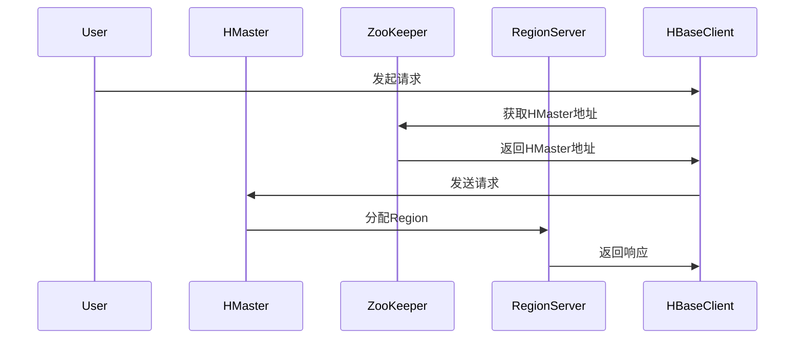
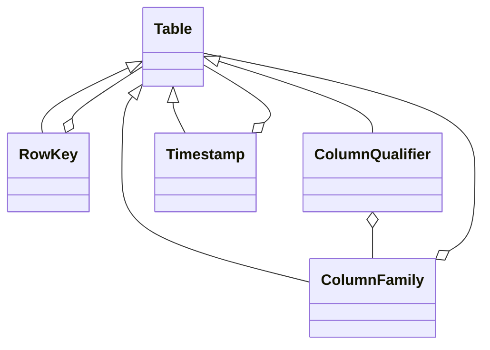

                 

# 文章标题

《HBase原理与代码实例讲解》

> 关键词：HBase，分布式存储，NoSQL数据库，数据模型，数据压缩，事务管理，性能优化，实战应用

> 摘要：本文将深入探讨HBase的原理及其在分布式存储环境下的应用。通过详细讲解HBase的数据模型、架构、核心功能、性能优化策略以及实战应用，帮助读者全面理解HBase的工作机制和最佳实践。本文结构紧凑，内容丰富，适合对HBase感兴趣的程序员和技术爱好者。

### 《HBase原理与代码实例讲解》目录大纲

# 第一部分：HBase基础

## 1.1 HBase概述

### 1.1.1 HBase的起源与背景

HBase是Apache软件基金会的一个开源分布式存储系统，最初由Google的Bigtable论文启发，由Facebook在2008年开发，并于2010年贡献给Apache软件基金会。HBase的设计目标是为大数据应用提供高性能的随机读写访问能力，特别适合于实时数据分析。

### 1.1.2 HBase的核心概念

- **HBase表**：类似于关系数据库的表，但无需固定表结构。
- **行键（Row Key）**：表中每行数据的主键。
- **列族（Column Family）**：一组的列的集合，每个列族在HBase中独立存储。
- **列限定符（Column Qualifier）**：在列族内部的具体列。
- **时间戳（Timestamp）**：每行每列的数据具有一个时间戳，用于数据版本控制。

### 1.1.3 HBase的应用场景

HBase广泛应用于需要海量数据存储和实时访问的场景，如日志分析、实时排行榜、社交网络数据存储等。

## 1.2 HBase架构与组成部分

### 1.2.1 HBase架构简介

HBase基于Google的Bigtable设计，具有分布式、高可靠性和高性能的特点。它由多个RegionServer组成的集群管理，每个RegionServer负责管理一个或多个Region。

### 1.2.2 HMaster与RegionServer

- **HMaster**：主节点，负责监控RegionServer的健康状态、负载均衡、Region分配等。
- **RegionServer**：工作节点，负责存储和管理数据Region。

### 1.2.3 ZooKeeper在HBase中的作用

ZooKeeper用于协调分布式系统的各个组件，HMaster和RegionServer都依赖于ZooKeeper进行注册和监控。

### 1.2.4 Mermaid图：HBase架构流程



## 1.3 HBase数据模型

### 1.3.1 HBase表结构与行格式

HBase中的数据以表的形式存储，每个表可以有多个列族，每个列族下可以有多个列限定符。

### 1.3.2 列族与列限定符

列族是一组列的集合，具有统一的存储和压缩策略。列限定符是列族中的具体列。

### 1.3.3 Mermaid图：HBase数据模型流程



## 1.4 HBase权限控制

### 1.4.1 权限控制机制

HBase提供了基于角色的权限控制机制，可以使用HBase的命令行或API来设置权限。

### 1.4.2 实战：设置表级与列簇级权限

```shell
# 设置表级权限
hbase> grant 'user1', 'RW', 'mytable'

# 设置列簇级权限
hbase> grant 'user2', 'R', 'mytable', 'cf1'
```

## 1.5 HBase客户端编程基础

### 1.5.1 HBase客户端API

HBase提供了Java、Python等多种语言的客户端库，方便开发人员进行编程。

### 1.5.2 实战：创建表、插入数据、查询数据

```java
// 创建表
TableDescriptor td = TableDescriptorBuilder.newBuilder(TableName.valueOf("mytable"))
    .addFamily(ColumnFamilyDescriptorBuilder.newBuilder("cf1").build())
    .build();
admin.createTable(td);

// 插入数据
Put put = new Put(Bytes.toBytes("row1"))
    .addColumn(Bytes.toBytes("cf1"), Bytes.toBytes("column1"), Bytes.toBytes("value1"));
table.put(put);

// 查询数据
Get get = new Get(Bytes.toBytes("row1"));
Result result = table.get(get);
String value = Bytes.toString(result.getValue(Bytes.toBytes("cf1"), Bytes.toBytes("column1")));
```

# 第二部分：HBase核心功能详解

## 2.1 HBase数据存储与压缩

### 2.1.1 HFile格式与HBase数据存储

HBase使用HFile格式存储数据，HFile是一种高度优化的二进制格式，支持快速读写。

### 2.1.2 数据压缩技术

HBase支持多种数据压缩技术，如Gzip、LZO和Snappy，可以根据应用场景选择合适的压缩算法。

### 2.1.3 实战：配置与优化数据压缩

```shell
# 配置数据压缩算法
hbase> create 'mytable', 'cf1', {SPLITS => ['A', 'B', 'C'], 'COMPRESS' => 'LZO'}

# 优化数据压缩
hbase> set <table_name>, 'cf1', 'COMPRESSION', 'LZO'
```

## 2.2 HBase事务管理

### 2.2.1 HBase中的事务模型

HBase提供了基于快照隔离级别的事务管理，支持对多个操作进行原子性操作。

### 2.2.2 MVCC机制

HBase使用多版本并发控制（MVCC）机制，提供了一致的读视图，提高了并发性能。

### 2.2.3 实战：实现多行事务操作

```java
// 启用事务
Connection connection = ConnectionFactory.createConnection();
Table table = connection.getTable(TableName.valueOf("mytable"));
table.setWriteToWAL(false);  // 关闭WAL日志

// 执行多行事务
TransactionManager manager = connection.getTransactionManager();
manager.begin();
Put put1 = new Put(Bytes.toBytes("row1")).addColumn(Bytes.toBytes("cf1"), Bytes.toBytes("column1"), Bytes.toBytes("value1"));
Put put2 = new Put(Bytes.toBytes("row2")).addColumn(Bytes.toBytes("cf1"), Bytes.toBytes("column2"), Bytes.toBytes("value2"));
table.put(put1);
table.put(put2);
manager.commit();

// 回滚事务
manager.abort();
```

## 2.3 HBase缓存机制

### 2.3.1 MemStore与BlockCache

HBase使用MemStore作为内存缓存，用于加速数据的写入操作。BlockCache用于缓存读取的数据块，减少磁盘访问。

### 2.3.2 实战：缓存策略优化与性能调优

```shell
# 配置MemStore大小
hbase> create 'mytable', 'cf1', {SPLITS => ['A', 'B', 'C'], 'MEMSTORE_FLUSHSIZE' => '128m'}

# 配置BlockCache大小
hbase> set <table_name>, 'hbase.hregion.memstoreflushsize', '128m'
hbase> set <table_name>, 'hbase.hregion.server.blockcache.size', '128m'
```

## 2.4 HBase集群管理与运维

### 2.4.1 HMaster的启动与监控

HMaster是HBase集群的管理节点，负责集群的监控和管理工作。

### 2.4.2 RegionServer的负载均衡

HMaster负责在RegionServer之间进行负载均衡，确保集群的稳定运行。

### 2.4.3 实战：集群扩容与故障转移

```shell
# 集群扩容
hbase> start-regionserver

# 故障转移
hbase> stop-regionserver <regionserver_name>
hbase> start-regionserver
```

## 2.5 HBase性能优化

### 2.5.1 数据模型优化

合理设计数据模型可以显著提高HBase的性能，如使用合适的行键设计。

### 2.5.2 写入与读取优化

通过优化HBase的写入和读取策略，可以显著提高系统性能。

### 2.5.3 实战：性能调优实战案例

通过实际案例，展示如何进行HBase的性能调优。

# 第三部分：HBase应用实战

## 3.1 HBase与Hadoop生态整合

### 3.1.1 HBase与HDFS的关系

HBase的数据存储依赖于HDFS，两者紧密结合，提供了强大的数据存储和访问能力。

### 3.1.2 HBase与Spark集成

HBase与Spark的集成，可以实现大规模数据的高效处理和分析。

### 3.1.3 实战：搭建HBase与Spark整合环境

通过实际操作，展示如何搭建HBase与Spark的整合环境。

## 3.2 HBase在金融领域的应用

### 3.2.1 金融数据处理需求

金融领域需要处理大量结构化和半结构化数据，HBase提供了高效的数据存储和访问能力。

### 3.2.2 HBase在金融风险管理中的应用

HBase在金融风险管理中的应用，如实时风险评估、反欺诈检测等。

### 3.2.3 实战：金融风控数据存储与查询优化

通过实际案例，展示如何优化金融风控数据存储与查询。

## 3.3 HBase在电商领域的应用

### 3.3.1 电商数据处理挑战

电商领域需要处理海量用户行为数据和商品数据，HBase提供了高效的数据存储和访问能力。

### 3.3.2 HBase在用户行为分析中的应用

HBase在用户行为分析中的应用，如实时推荐、广告投放优化等。

### 3.3.3 实战：电商用户行为数据存储与查询优化

通过实际案例，展示如何优化电商用户行为数据存储与查询。

## 3.4 HBase开源社区与生态系统

### 3.4.1 HBase开源社区介绍

HBase开源社区的介绍，包括社区组织、贡献者、会议等。

### 3.4.2 HBase相关开源工具与框架

介绍与HBase相关的开源工具和框架，如Apache Phoenix、Apache HBase Shell等。

### 3.4.3 实战：搭建HBase测试环境与开发环境

通过实际操作，展示如何搭建HBase测试环境与开发环境。

# 第四部分：HBase高级话题

## 4.1 HBase分布式系统原理

### 4.1.1 分布式系统基本概念

介绍分布式系统的基本概念，如数据一致性、容错性、负载均衡等。

### 4.1.2 HBase分布式数据存储

详细讲解HBase如何实现分布式数据存储，包括Region的分配、负载均衡等。

### 4.1.3 实战：分布式环境下的数据一致性保障

通过实际案例，展示如何在分布式环境下保障数据一致性。

## 4.2 HBase安全性

### 4.2.1 HBase安全性需求

介绍HBase在安全性方面的需求，如数据加密、权限控制等。

### 4.2.2 安全模式与权限控制

详细讲解HBase的安全模式与权限控制机制。

### 4.2.3 实战：配置HBase加密机制

通过实际操作，展示如何配置HBase的加密机制。

## 4.3 HBase监控与运维

### 4.3.1 HBase监控工具

介绍常用的HBase监控工具，如HBase Shell、HBase REST API等。

### 4.3.2 日志分析与故障诊断

详细讲解HBase的日志分析与故障诊断方法。

### 4.3.3 实战：运维自动化工具使用与编写

通过实际操作，展示如何使用和编写HBase运维自动化工具。

## 4.4 HBase性能调优与故障排除

### 4.4.1 性能调优策略

介绍HBase的性能调优策略，包括数据模型优化、缓存策略优化等。

### 4.4.2 常见性能瓶颈与解决方案

详细讲解HBase常见的性能瓶颈与解决方案。

### 4.4.3 实战：性能调优实战案例

通过实际案例，展示如何进行HBase的性能调优。

# 第五部分：HBase案例研究

## 5.1 案例一：构建高效日志分析系统

### 5.1.1 需求分析

分析日志分析系统的需求，包括数据量、查询频率、实时性等。

### 5.1.2 数据模型设计

设计日志分析系统的数据模型，包括表结构、列族、列限定符等。

### 5.1.3 系统架构设计

设计日志分析系统的架构，包括HDFS、HBase、Spark等组件。

### 5.1.4 实现与优化

通过实际操作，展示如何实现和优化日志分析系统。

## 5.2 案例二：实现实时社交图谱构建

### 5.2.1 需求分析

分析实时社交图谱的需求，包括数据量、查询频率、实时性等。

### 5.2.2 数据模型设计

设计实时社交图谱的数据模型，包括表结构、列族、列限定符等。

### 5.2.3 系统架构设计

设计实时社交图谱的系统架构，包括HDFS、HBase、Spark等组件。

### 5.2.4 实现与优化

通过实际操作，展示如何实现和优化实时社交图谱。

## 5.3 案例三：优化电商平台推荐系统

### 5.3.1 需求分析

分析电商平台推荐系统的需求，包括数据量、查询频率、实时性等。

### 5.3.2 数据模型设计

设计电商平台推荐系统的数据模型，包括表结构、列族、列限定符等。

### 5.3.3 系统架构设计

设计电商平台推荐系统的架构，包括HDFS、HBase、Spark等组件。

### 5.3.4 实现与优化

通过实际操作，展示如何实现和优化电商平台推荐系统。

## 附录

## 附录A：HBase

提供HBase的详细配置、常用命令、FAQ等资料，以供参考。

# 作者信息

作者：AI天才研究院/AI Genius Institute & 禅与计算机程序设计艺术 /Zen And The Art of Computer Programming

