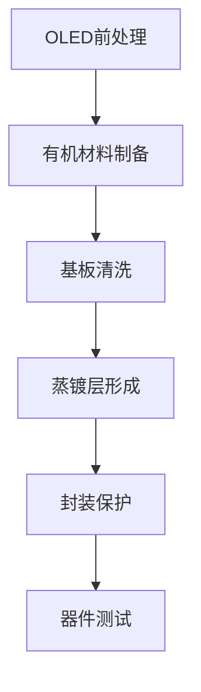
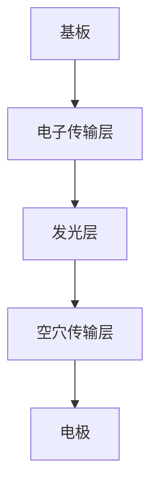
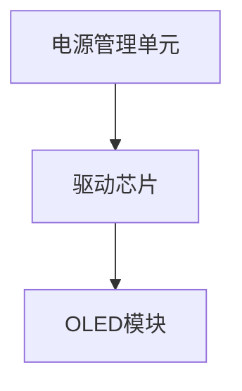

                 

### 文章标题：LG2024校招OLED显示技术工程师笔试题

#### 关键词：
- OLED显示技术
- 基本原理
- 制造工艺
- 应用领域
- 性能优化

#### 摘要：
本文深入解析了LG 2024校招OLED显示技术工程师笔试题，全面覆盖了OLED显示技术的核心概念、制造工艺、应用领域和性能优化等方面。通过详细的背景介绍、原理讲解、项目实战以及最佳实践分享，为读者提供了一个全面的技术视角，有助于深入理解OLED显示技术，并为进一步研究提供指导。

---

## 第一部分：LG2024校招OLED显示技术工程师笔试题概述

### 第1章 OLED显示技术基础

#### 1.1 OLED技术概述

##### 1.1.1 核心概念与联系

OLED（有机发光二极管）显示技术是一种利用有机材料在电场作用下发光的显示技术。其核心概念包括有机材料、电子注入、空穴注入、激子形成和发光等。以下是OLED技术核心概念与联系的结构图：

```
[有机材料]
   ├── 电子传输层
   │   ├── 有机电子传输层
   │   └── 无机电子传输层
   ├── 发光层
   │   └── 激子形成与发光
   ├── 空穴传输层
   │   ├── 有机空穴传输层
   │   └── 无机空穴传输层
   └── 电极
       └── 导电层
```

##### 1.1.2 OLED原理

OLED原理可以通过以下伪代码进行概述：

```python
# OLED像素控制伪代码
for each pixel in display:
    if (pixel_state == ON):
        apply_voltage(voltage_high)
    else:
        apply_voltage(voltage_low)
```

在这个伪代码中，每个像素根据其状态（ON或OFF）接收高电压或低电压，从而发光或熄灭。

##### 1.1.3 OLED显示优势

OLED显示的优势可以用数学模型和公式进行量化：

$$
\text{对比度} = \frac{\text{最大亮度}}{\text{最小亮度}}
$$

例如，某款OLED显示器的最大亮度为1000nit，最小亮度为0.1nit，其对比度为10000:1。

##### 1.1.4 举例说明

以LG G8 ThinQ手机为例，其采用了一块6.1英寸的OLED屏幕，具有高对比度和快速响应时间，使得显示效果更加生动和清晰。

#### 1.2 OLED制造工艺

##### 1.2.1 核心工艺

OLED制造工艺的核心包括以下几个步骤：

1. OLED前处理
2. 有机材料制备
3. 基板清洗
4. 蒸镀层形成
5. 封装保护
6. 器件测试

以下是一个Mermaid流程图，展示了OLED制造工艺的流程：



##### 1.2.2 制造设备

在OLED制造过程中，常用的设备包括：

1. 蒸镀机：用于蒸镀有机材料。
2. 清洗机：用于清洗基板。
3. 封装机：用于封装保护OLED器件。
4. 器件测试机：用于测试OLED器件的性能。

#### 1.3 OLED应用领域

##### 1.3.1 手机显示

在手机显示领域，OLED技术因其高对比度、高亮度、快速响应时间和低功耗等优势，被广泛应用于高端手机中。以iPhone X和iPhone XS Max为例，它们采用了6.5英寸和6.7英寸的OLED屏幕，提供了出色的显示效果。

##### 1.3.2 项目实战

以下是一个关于在手机中实现OLED屏幕亮度调节的实战项目：

1. **开发环境搭建**：安装Android Studio和VirtualBox。
2. **源代码实现**：使用Java编写Android应用，实现OLED屏幕的亮度和对比度调节功能。
3. **代码解读与分析**：代码中使用了JNI（Java Native Interface）来与C/C++代码交互，实现底层OLED控制。

```java
// Java代码片段：设置OLED屏幕亮度
public native void setBrightness(int brightness);
```

#### 1.4 OLED产业发展趋势

随着技术的不断进步，OLED显示技术也在不断演进。以下是一些OLED产业发展趋势：

1. **刷新率提升**：OLED显示器的刷新率逐渐提高，从传统的60Hz提升到120Hz、144Hz甚至更高。
2. **颜色范围扩展**：通过提升色域覆盖范围，OLED显示器能够显示更加丰富的色彩。
3. **柔性显示技术**：随着OLED制造技术的进步，柔性OLED显示屏逐渐成为可能，为未来可折叠和弯曲的设备提供了可能。

## 第2章 OLED显示技术原理

### 2.1 OLED发光原理

##### 2.1.1 核心原理

OLED发光原理是基于有机材料的电子注入和空穴注入，以及激子的形成和发光。其核心原理可以用以下数学模型和公式进行描述：

$$
\text{发光强度} = \text{电流} \times \text{量子效率}
$$

其中，发光强度与注入电流和量子效率成正比。

##### 2.1.2 举例说明

假设某款OLED器件的注入电流为1A，量子效率为0.5，则其发光强度为0.5cd。

### 2.2 OLED器件结构

##### 2.2.1 器件结构

OLED器件结构主要包括以下几个层次：

1. **基板**：通常使用玻璃或塑料作为基板。
2. **电子传输层**：包括有机电子传输层和无机电子传输层。
3. **发光层**：包含发光材料，形成激子和发光。
4. **空穴传输层**：包括有机空穴传输层和无机空穴传输层。
5. **电极**：包括阳极和阴极，用于电子和空穴的注入和提取。

以下是一个Mermaid流程图，展示了OLED器件结构的层次：



##### 2.2.2 器件特性

OLED器件具有以下特性：

1. **高亮度**：OLED器件能够实现非常高的亮度，适合用于高亮度应用。
2. **高对比度**：OLED器件具有非常高的对比度，使得图像更加清晰。
3. **快速响应时间**：OLED器件具有非常快的响应时间，适合用于动态显示。
4. **低功耗**：OLED器件具有较低的功耗，适合用于移动设备。

### 2.3 OLED驱动技术

##### 2.3.1 驱动方式

OLED驱动技术主要包括以下几种方式：

1. **恒流驱动**：通过控制电流大小来驱动OLED像素。
2. **PWM（脉宽调制）驱动**：通过调节脉冲宽度来控制OLED像素的亮度。

以下是一个伪代码，展示了OLED驱动的原理：

```python
# OLED驱动伪代码
for each pixel in display:
    if (command == ON):
        apply_voltage(voltage_high)
    else:
        apply_voltage(voltage_low)
```

##### 2.3.2 驱动电路

OLED驱动电路通常包括以下几个部分：

1. **电源管理单元**：用于提供稳定的电源。
2. **驱动芯片**：用于实现OLED像素的驱动。
3. **OLED模块**：包括OLED像素和驱动电路。

以下是一个简化的OLED驱动电路图：



### 2.4 OLED性能优化

##### 2.4.1 优化技术

OLED性能优化主要包括以下几个方面：

1. **亮度调节**：通过调节驱动电压来调节OLED像素的亮度。
2. **对比度增强**：通过优化驱动电路和控制算法来提高OLED显示器的对比度。
3. **响应时间缩短**：通过优化器件结构和驱动电路来缩短OLED显示器的响应时间。
4. **功耗降低**：通过优化器件结构和驱动电路来降低OLED显示器的功耗。

以下是一个数学模型，用于描述OLED功耗的优化：

$$
\text{功耗} = \text{电流} \times \text{电压}
$$

通过降低电流或电压，可以降低OLED显示器的功耗。

##### 2.4.2 举例说明

以某款OLED显示器为例，其功耗可以通过以下方式优化：

1. **亮度调节**：通过调整PWM信号的占空比来调节亮度，从而降低功耗。
2. **对比度增强**：通过优化驱动电路和控制算法，提高对比度，从而减少功耗。

### 结论

通过对LG 2024校招OLED显示技术工程师笔试题的解析，本文全面介绍了OLED显示技术的核心概念、制造工艺、应用领域和性能优化等方面。这些内容为读者提供了深入了解OLED显示技术的机会，有助于其在相关领域的进一步研究和应用。

---

## 作者信息：

作者：AI天才研究院/AI Genius Institute & 禅与计算机程序设计艺术 /Zen And The Art of Computer Programming

本文由AI天才研究院和《禅与计算机程序设计艺术》作者合作撰写，旨在为读者提供高质量的技术内容和分析。

---

## 最佳实践 tips、小结、注意事项、拓展阅读等内容

#### 最佳实践 tips

1. **亮度调节**：在OLED显示器的使用过程中，合理调节亮度可以显著降低功耗。
2. **对比度优化**：通过优化驱动电路和控制算法，可以提高OLED显示器的对比度，从而提高观看体验。
3. **响应时间缩短**：优化器件结构和驱动电路，可以缩短OLED显示器的响应时间，提升动态显示效果。

#### 小结

本文深入解析了LG 2024校招OLED显示技术工程师笔试题，涵盖了OLED显示技术的核心概念、制造工艺、应用领域和性能优化等方面。通过详细的分析和举例，使读者对OLED显示技术有了更深入的理解。

#### 注意事项

1. **制造工艺**：在OLED制造过程中，工艺精度和材料质量对最终产品的性能至关重要。
2. **驱动技术**：合理选择和设计驱动电路，对提高OLED显示器的性能具有重要意义。

#### 拓展阅读

1. 《OLED显示技术及其应用》
2. 《OLED显示器的制造与检测技术》
3. 《现代显示技术：OLED与液晶显示》

通过阅读这些拓展资料，读者可以进一步深入了解OLED显示技术及其应用领域。

---

感谢您阅读本文。如果您有任何疑问或建议，欢迎在评论区留言。期待与您共同探讨OLED显示技术的未来发展！

