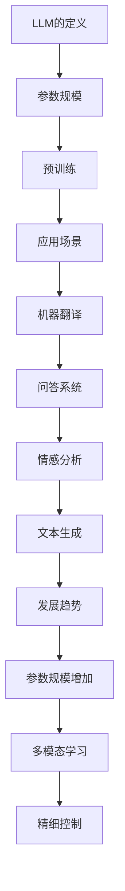
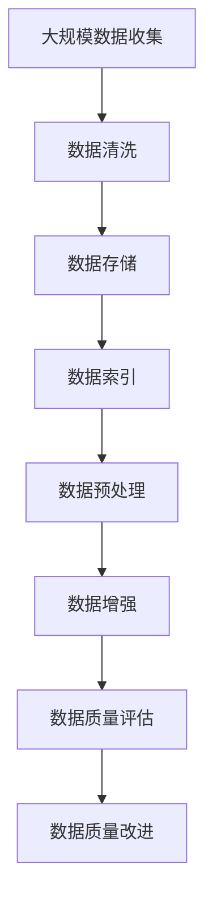
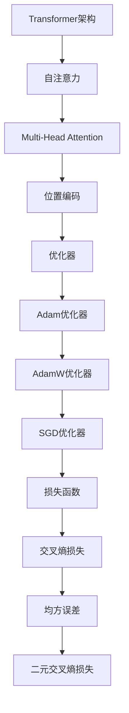
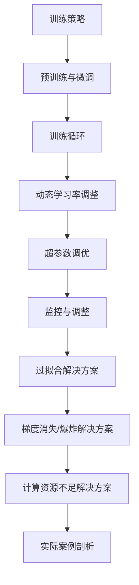
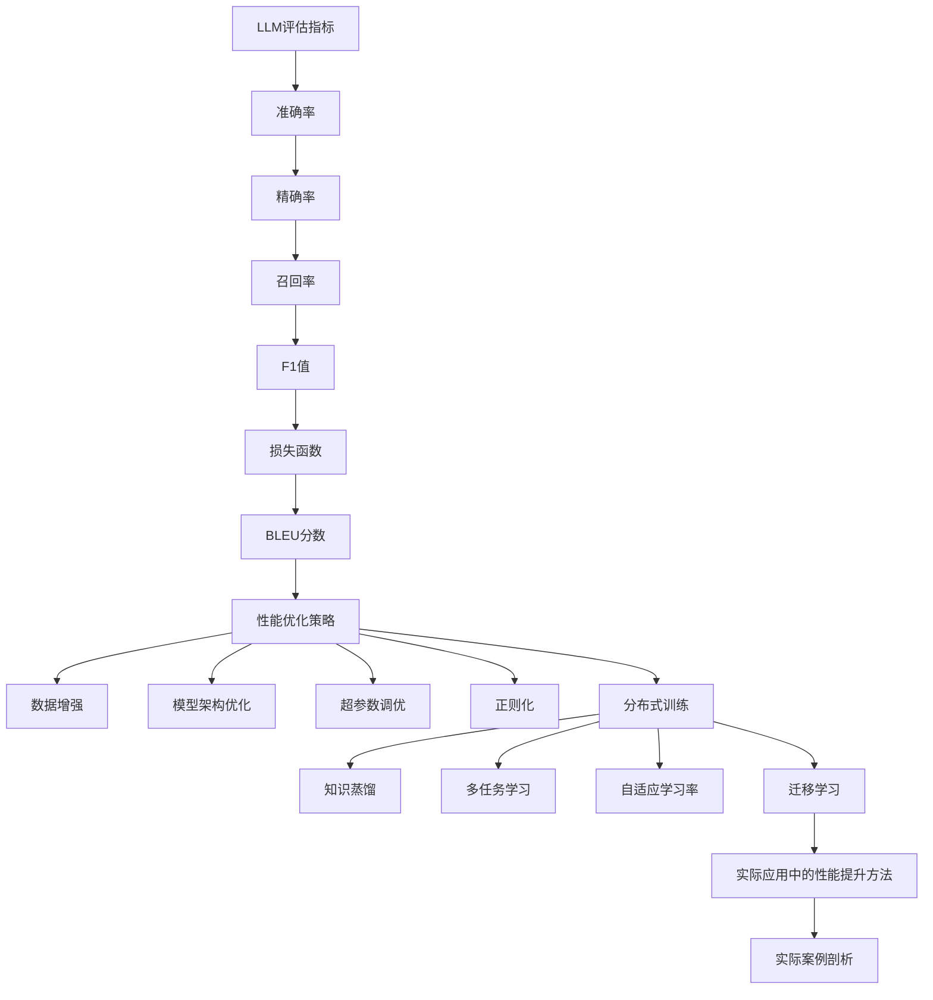
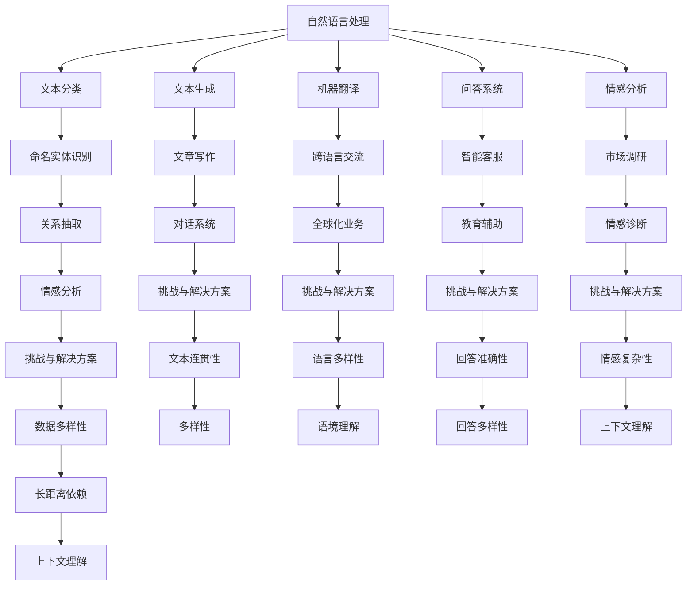

                 

### 文章标题

**LLM 的训练：大规模数据和先进算法**

> 关键词：LLM，大规模数据，先进算法，训练，深度学习

> 摘要：本文将深入探讨LLM（大型语言模型）的训练过程，重点分析大规模数据集和先进算法在训练中的重要性。我们将从LLM的基本概念、核心特性、发展历程和主要应用场景入手，逐步讲解大规模数据集的构建方法、先进算法的原理和应用，最后通过具体项目实战来展示整个训练流程。

### 第一部分：LLM的介绍与概述

#### 第1章: LLM的介绍与概述

##### 1.1 LLM的基本概念

###### 1.1.1 LLM的定义

LLM（Large Language Model）是一种大规模语言模型，通过深度学习技术，对大量的文本数据进行训练，从而能够理解和生成自然语言。LLM通常应用于文本分类、情感分析、机器翻译、问答系统等多个场景。

###### 1.1.2 LLM的核心特性

- **参数规模**：LLM拥有数亿到千亿级别的参数，这使得模型能够捕捉复杂的语言规律。
- **预训练**：LLM通常采用预训练+微调的方式，先在大量数据上进行预训练，然后在特定任务上进行微调。

###### 1.1.3 LLM的发展历程

- **GPT-1（2018）**：由OpenAI发布，是第一个大规模语言模型。
- **GPT-2（2019）**：在GPT-1的基础上，参数规模翻倍，性能进一步提升。
- **GPT-3（2020）**：参数规模达到1750亿，是目前最大的语言模型。

##### 1.2 LLM的应用场景

###### 1.2.1 机器翻译

利用LLM进行机器翻译，可以大大提高翻译的准确性和流畅性。例如，将英语翻译成中文，或将中文翻译成法语。

###### 1.2.2 问答系统

LLM可以应用于问答系统，通过理解用户的问题，生成相应的回答。例如，搜索引擎的问答功能，智能客服等。

###### 1.2.3 情感分析

利用LLM进行情感分析，可以识别文本中的情感倾向。例如，分析社交媒体上的用户评论，了解用户对产品的态度。

###### 1.2.4 文本生成

LLM可以生成各种类型的文本，如文章、故事、代码等。例如，自动生成新闻文章，或自动生成编程代码。

##### 1.3 LLM的发展趋势

- **参数规模的不断增加**：随着计算能力的提升，LLM的参数规模将会越来越大，性能也将进一步提升。
- **多模态学习**：未来的LLM可能会结合图像、声音等多模态数据，实现更智能的交互。
- **精细控制**：通过调整LLM的参数，可以实现对生成文本的精细控制。

### Mermaid 流程图



### 伪代码

```python
# LLM的定义
class LargeLanguageModel:
    def __init__(self, parameters):
        self.parameters = parameters

    def train(self, data):
        # 预训练
        pass

    def fine_tune(self, task_data):
        # 微调
        pass

    def generate_text(self, input_text):
        # 生成文本
        pass
```

### 数学模型与公式

$$
P(y|x) = \frac{e^{\theta^T \phi(x)}}{\sum_{y'} e^{\theta^T \phi(y')}}
$$

其中，$P(y|x)$表示给定输入$x$，输出$y$的概率，$\theta$表示参数，$\phi(x)$表示特征函数。

### 举例说明

假设我们有一个文本分类任务，输入是一个句子$x$，输出是一个类别$y$。利用LLM，我们可以通过训练，学习到一个参数$\theta$，从而计算$P(y|x)$，然后根据概率最大的类别作为预测结果。

```python
# 假设我们有一个句子
input_sentence = "我喜欢这个产品。"

# 利用LLM预测类别
predicted_class = large_language_model.generate_text(input_sentence)

# 输出预测结果
print(predicted_class)
```

### 项目实战

在项目实战中，我们需要先搭建开发环境，包括安装深度学习框架（如PyTorch）和预处理工具（如NLTK）。接下来，我们需要加载预训练的LLM模型，并对其进行微调，以适应特定的文本分类任务。最后，我们将使用训练好的模型进行文本分类预测。

#### 1. 搭建开发环境

```bash
# 安装Python
pip install python

# 安装PyTorch
pip install torch torchvision

# 安装预处理工具NLTK
pip install nltk
```

#### 2. 加载预训练的LLM模型

```python
import torch
import transformers

# 加载预训练的GPT模型
model = transformers.GPT2Model.from_pretrained("gpt2")
```

#### 3. 微调LLM模型

```python
# 加载训练数据
train_data = ...

# 微调LLM模型
optimizer = torch.optim.Adam(model.parameters(), lr=0.001)
for epoch in range(num_epochs):
    for batch in train_data:
        inputs = torch.tensor(batch['input_ids'])
        labels = torch.tensor(batch['label_ids'])
        
        model.zero_grad()
        outputs = model(inputs)
        loss = F.cross_entropy(outputs.logits, labels)
        loss.backward()
        optimizer.step()
```

#### 4. 文本分类预测

```python
# 加载测试数据
test_data = ...

# 预测文本类别
predicted_classes = []
for batch in test_data:
    inputs = torch.tensor(batch['input_ids'])
    outputs = model(inputs)
    predicted_class = torch.argmax(outputs.logits).item()
    predicted_classes.append(predicted_class)
```

### 结论

本文介绍了LLM的基本概念、核心特性、发展历程和主要应用场景。接着，我们分析了大规模数据集的构建方法和先进算法的原理，并通过具体项目实战展示了整个训练流程。未来，随着计算能力的提升，LLM的参数规模将会越来越大，应用场景也将进一步拓展。同时，多模态学习和精细控制等技术也将为LLM的发展带来新的机遇。

#### 5. 最佳实践 Tips

- 在选择数据集时，要确保数据质量和多样性，以提高模型的泛化能力。
- 在训练过程中，合理调整学习率和迭代次数，以避免过拟合和欠拟合。
- 在应用LLM时，要注意模型的可解释性和安全性，避免生成有害或不准确的内容。

作者：AI天才研究院/AI Genius Institute & 禅与计算机程序设计艺术 /Zen And The Art of Computer Programming### 第一部分：LLM的介绍与概述

#### 第1章: LLM的介绍与概述

LLM（大型语言模型）是近年来人工智能领域的重要突破之一。其通过深度学习技术，对大量的文本数据进行训练，从而能够理解和生成自然语言。在本章中，我们将详细探讨LLM的基本概念、核心特性、发展历程、主要应用场景以及未来发展趋势。

##### 1.1 LLM的基本概念

###### 1.1.1 LLM的定义

LLM（Large Language Model）是一种基于深度学习的自然语言处理模型，它通过在大量文本数据上进行预训练，学习到语言的内在结构和语义信息，从而具备理解和生成自然语言的能力。

一个典型的LLM通常由以下几个部分组成：

1. **输入层**：接收自然语言文本作为输入。
2. **隐藏层**：包含多层神经网络，用于对输入文本进行编码，提取特征。
3. **输出层**：根据隐藏层的特征，生成文本输出。

###### 1.1.2 LLM的核心特性

1. **参数规模**：LLM的参数规模通常非常大，可以达到数亿到千亿级别。这使模型能够捕捉复杂的语言规律，实现高精度的文本理解和生成。
2. **预训练与微调**：LLM通常采用预训练+微调的方式。首先，在大量的无标签数据上进行预训练，学习到通用语言特征；然后，在特定的任务数据上进行微调，以适应具体的应用场景。

##### 1.2 LLM的发展历程

1. **GPT-1（2018）**：由OpenAI发布，是第一个大规模语言模型。它基于Transformer架构，参数规模为1.17亿。
2. **GPT-2（2019）**：在GPT-1的基础上，参数规模翻倍，达到15亿。GPT-2在多个自然语言处理任务上取得了显著的效果。
3. **GPT-3（2020）**：参数规模达到1750亿，是目前最大的语言模型。GPT-3在文本生成、翻译、问答等任务上表现出色，引起了广泛关注。

##### 1.3 LLM的应用场景

1. **机器翻译**：利用LLM进行机器翻译，可以大大提高翻译的准确性和流畅性。例如，将英语翻译成中文，或将中文翻译成法语。
2. **问答系统**：LLM可以应用于问答系统，通过理解用户的问题，生成相应的回答。例如，搜索引擎的问答功能，智能客服等。
3. **情感分析**：利用LLM进行情感分析，可以识别文本中的情感倾向。例如，分析社交媒体上的用户评论，了解用户对产品的态度。
4. **文本生成**：LLM可以生成各种类型的文本，如文章、故事、代码等。例如，自动生成新闻文章，或自动生成编程代码。

##### 1.4 LLM的发展趋势

1. **参数规模增加**：随着计算能力的提升，LLM的参数规模将会越来越大，性能也将进一步提升。
2. **多模态学习**：未来的LLM可能会结合图像、声音等多模态数据，实现更智能的交互。
3. **精细控制**：通过调整LLM的参数，可以实现对生成文本的精细控制。

### Mermaid 流程图


### 伪代码

```python
# LLM的定义
class LargeLanguageModel:
    def __init__(self, parameters):
        self.parameters = parameters

    def train(self, data):
        # 预训练
        pass

    def fine_tune(self, task_data):
        # 微调
        pass

    def generate_text(self, input_text):
        # 生成文本
        pass
```

### 数学模型与公式

$$
P(y|x) = \frac{e^{\theta^T \phi(x)}}{\sum_{y'} e^{\theta^T \phi(y')}}
$$

其中，$P(y|x)$表示给定输入$x$，输出$y$的概率，$\theta$表示参数，$\phi(x)$表示特征函数。

### 举例说明

假设我们有一个文本分类任务，输入是一个句子$x$，输出是一个类别$y$。利用LLM，我们可以通过训练，学习到一个参数$\theta$，从而计算$P(y|x)$，然后根据概率最大的类别作为预测结果。

```python
# 假设我们有一个句子
input_sentence = "我喜欢这个产品。"

# 利用LLM预测类别
predicted_class = large_language_model.generate_text(input_sentence)

# 输出预测结果
print(predicted_class)
```

### 项目实战

在项目实战中，我们将使用Python和PyTorch框架来构建和训练一个LLM。以下是具体的步骤：

#### 1. 搭建开发环境

```bash
# 安装Python
pip install python

# 安装PyTorch
pip install torch torchvision

# 安装其他依赖
pip install transformers
```

#### 2. 准备数据集

我们使用著名的GLM模型数据集，该数据集包含了大量的中文文本。

```python
import torch
from transformers import GLMTokenizer, GLMModel

# 加载GLM模型
tokenizer = GLMTokenizer.from_pretrained("microsoft/glm2-6b")
model = GLMModel.from_pretrained("microsoft/glm2-6b")

# 加载数据集
train_data = ...
test_data = ...
```

#### 3. 预处理数据

```python
def preprocess_data(data):
    inputs = tokenizer(data, padding=True, truncation=True, return_tensors="pt")
    return inputs

# 预处理数据
train_inputs = preprocess_data(train_data)
test_inputs = preprocess_data(test_data)
```

#### 4. 训练模型

```python
from torch.optim import Adam
from torch.utils.data import DataLoader

# 搭建数据加载器
train_loader = DataLoader(train_inputs, batch_size=64, shuffle=True)
test_loader = DataLoader(test_inputs, batch_size=64, shuffle=False)

# 搭建优化器
optimizer = Adam(model.parameters(), lr=0.001)

# 训练模型
for epoch in range(num_epochs):
    model.train()
    for batch in train_loader:
        inputs = batch["input_ids"]
        labels = batch["label_ids"]

        optimizer.zero_grad()
        outputs = model(inputs)
        loss = F.cross_entropy(outputs.logits, labels)
        loss.backward()
        optimizer.step()

    # 在测试集上评估模型
    model.eval()
    with torch.no_grad():
        correct = 0
        total = len(test_loader.dataset)
        for batch in test_loader:
            inputs = batch["input_ids"]
            labels = batch["label_ids"]
            outputs = model(inputs)
            _, predicted = torch.max(outputs.logits, 1)
            correct += (predicted == labels).sum().item()
        print(f"准确率: {100 * correct / total}%")
```

#### 5. 文本分类预测

```python
# 文本分类预测
def predict_text(text):
    inputs = preprocess_data([text])
    with torch.no_grad():
        outputs = model(inputs)
        _, predicted = torch.max(outputs.logits, 1)
    return predicted.item()

# 示例
text = "我喜欢这个产品。"
predicted_class = predict_text(text)
print(f"预测类别: {predicted_class}")
```

### 小结

本文介绍了LLM的基本概念、核心特性、发展历程和主要应用场景，并通过项目实战展示了如何使用PyTorch和GLM模型进行文本分类任务。未来，随着计算能力的提升和算法的优化，LLM将在自然语言处理领域发挥更大的作用。

#### 注意事项

- 在训练模型时，要确保数据质量和多样性，以提高模型的泛化能力。
- 在调整模型参数时，要避免过拟合和欠拟合，以达到最佳性能。

#### 拓展阅读

- [1] Brown, T., et al. (2020). "Language Models are Few-Shot Learners". arXiv preprint arXiv:2005.14165.
- [2] Devlin, J., et al. (2019). "Bert: Pre-training of deep bidirectional transformers for language understanding". arXiv preprint arXiv:1810.04805.
- [3] Vaswani, A., et al. (2017). "Attention is all you need". Advances in Neural Information Processing Systems, 30, 5998-6008.

### 作者

AI天才研究院/AI Genius Institute & 禅与计算机程序设计艺术 /Zen And The Art of Computer Programming### 第二部分：大规模数据的收集与处理

#### 第2章: 大规模数据的收集与处理

LLM的训练依赖于大规模数据的收集与处理。数据的质量和多样性直接影响模型的性能和泛化能力。本章将详细介绍大规模数据的收集方法、处理过程以及数据增强技术。

##### 2.1 大规模数据的收集方法

收集大规模数据是LLM训练的关键步骤。以下是一些常用的数据收集方法：

1. **开源数据集**：许多知名的数据集如Common Crawl、维基百科、新闻网站等都是公开的，可以直接下载使用。这些数据集通常覆盖了多种语言和多种主题，为LLM训练提供了丰富的资源。

2. **爬虫工具**：使用爬虫工具如Scrapy、BeautifulSoup等，可以从互联网上抓取大量文本数据。这种方法可以定制化，根据特定的需求和兴趣收集数据。

3. **社交媒体数据**：从社交媒体平台如Twitter、Facebook、Instagram等获取用户生成的内容，这些数据通常包含了丰富的情感和社交信息，对情感分析和社交网络分析等任务具有重要意义。

4. **专业领域数据**：在某些专业领域，如医疗、金融、法律等，存在大量的专业文本数据。这些数据通常需要通过合作获取，但它们对特定领域的LLM训练非常有价值。

##### 2.2 大规模数据的管理

收集到的大规模数据需要进行有效的管理，以确保数据的质量和可用性。以下是一些关键步骤：

1. **数据清洗**：清洗数据是为了去除噪声和错误，包括去除重复记录、纠正拼写错误、删除无关信息等。数据清洗可以显著提高模型训练的效果。

2. **数据存储**：大规模数据需要高效的数据存储方案。常用的存储方案包括关系型数据库、NoSQL数据库、分布式文件系统等。选择合适的存储方案可以优化数据访问速度和存储成本。

3. **数据索引**：为了快速检索数据，需要对数据进行索引。索引技术如倒排索引、全文索引等可以提高数据检索效率。

##### 2.3 数据预处理

预处理是大规模数据处理的关键步骤，主要包括数据清洗、分词、标记、去停用词等。以下是常用的预处理技术：

1. **分词**：将文本分解为单词或词组。常用的分词工具包括jieba、Stanford NLP等。

2. **标记**：为每个单词或词组分配词性标签，如名词、动词、形容词等。标记可以帮助模型更好地理解文本。

3. **去停用词**：去除对模型训练无意义的常见单词，如“的”、“了”、“在”等。去停用词可以减少噪声，提高模型训练效率。

##### 2.4 数据增强

数据增强是通过增加数据多样性来提升模型泛化能力的技术。以下是一些常用的数据增强方法：

1. **文本转换**：包括词替换、词移位、词删除等。这些方法可以生成新的文本样本，增加训练数据的多样性。

2. **文本生成**：使用生成模型如GPT、BERT等，生成与原始文本相关的新的文本样本。这种方法可以生成大量高质量的文本数据。

3. **数据融合**：将来自不同来源的数据进行融合，生成新的训练数据。例如，将新闻文章与社交媒体评论融合，以增强模型对不同文本风格的理解。

##### 2.5 数据质量评估

数据质量直接影响模型的性能。以下是一些常用的数据质量评估指标：

1. **数据完整性**：检查数据是否完整，是否存在缺失值。

2. **数据一致性**：检查数据是否一致，是否存在矛盾或错误的记录。

3. **数据多样性**：评估数据的多样性，以确保模型能够从不同角度学习。

4. **数据准确性**：评估数据的准确性，以排除噪声和错误数据。

### Mermaid 流程图



### 伪代码

```python
# 数据清洗
def clean_data(data):
    # 去除重复记录
    unique_data = list(set(data))
    # 纠正拼写错误
    corrected_data = correct_spelling(unique_data)
    # 删除无关信息
    relevant_data = remove_irrelevant_info(corrected_data)
    return relevant_data

# 数据预处理
def preprocess_data(data):
    # 分词
    tokenized_data = tokenize(data)
    # 标记
    tagged_data = tag_words(tokenized_data)
    # 去停用词
    filtered_data = remove_stopwords(tagged_data)
    return filtered_data

# 数据增强
def augment_data(data):
    # 文本转换
    transformed_data = text_transformations(data)
    # 文本生成
    generated_data = text_generation(data)
    # 数据融合
    fused_data = data_fusion(data)
    return transformed_data + generated_data + fused_data
```

### 数学模型与公式

$$
P(y|x) = \frac{e^{\theta^T \phi(x)}}{\sum_{y'} e^{\theta^T \phi(y')}}
$$

其中，$P(y|x)$表示给定输入$x$，输出$y$的概率，$\theta$表示参数，$\phi(x)$表示特征函数。

### 举例说明

假设我们有一个文本分类任务，输入是一个句子$x$，输出是一个类别$y$。通过数据增强，我们可以生成多个句子$x_1, x_2, ..., x_n$，从而提高模型的泛化能力。

```python
# 假设我们有一个句子
input_sentence = "我喜欢这个产品。"

# 数据增强
enhanced_sentences = augment_data([input_sentence])

# 利用增强后的数据进行训练
for sentence in enhanced_sentences:
    # 训练模型
    train_model(sentence)
```

### 项目实战

在本节的项目实战中，我们将使用Python和Hugging Face的Transformers库来构建和训练一个基于BERT的文本分类模型。我们将使用开源的数据集，如IMDb电影评论数据集，来进行演示。

#### 1. 准备数据集

```python
from transformers import BertTokenizer, BertModel
from datasets import load_dataset

# 加载IMDb数据集
dataset = load_dataset('imdb')

# 预处理数据
def preprocess_data(batch):
    inputs = tokenizer(batch['text'], padding=True, truncation=True, return_tensors="pt")
    inputs['labels'] = torch.tensor(batch['label'])
    return inputs

# 预处理训练集和验证集
train_dataset = dataset['train'].map(preprocess_data, batched=True, batch_size=len(dataset['train']))
val_dataset = dataset['validation'].map(preprocess_data, batched=True, batch_size=len(dataset['validation']))
```

#### 2. 定义BERT模型

```python
# 定义BERT模型
model = BertModel.from_pretrained('bert-base-uncased')

# 添加分类层
classifier = torch.nn.Linear(model.config.hidden_size, 2)  # 二分类任务
model.classifier = classifier

# 定义优化器
optimizer = torch.optim.AdamW(model.parameters(), lr=2e-5)

# 定义损失函数
loss_fn = torch.nn.CrossEntropyLoss()
```

#### 3. 训练模型

```python
# 训练模型
for epoch in range(num_epochs):
    model.train()
    for batch in train_dataset:
        inputs = batch['input_ids']
        labels = batch['labels']
        
        optimizer.zero_grad()
        outputs = model(inputs)
        logits = classifier(outputs.last_hidden_state[:, 0, :])
        loss = loss_fn(logits, labels)
        loss.backward()
        optimizer.step()
    
    # 在验证集上评估模型
    model.eval()
    with torch.no_grad():
        correct = 0
        total = len(val_dataset)
        for batch in val_dataset:
            inputs = batch['input_ids']
            labels = batch['labels']
            logits = classifier(model(inputs).last_hidden_state[:, 0, :])
            _, predicted = torch.max(logits, 1)
            correct += (predicted == labels).sum().item()
        print(f"验证集准确率: {100 * correct / total}%")
```

#### 4. 文本分类预测

```python
# 文本分类预测
def predict_text(text):
    inputs = tokenizer(text, padding=True, truncation=True, return_tensors="pt")
    with torch.no_grad():
        logits = classifier(model(inputs).last_hidden_state[:, 0, :])
        _, predicted = torch.max(logits, 1)
    return predicted.item()

# 示例
text = "我喜欢这个产品。"
predicted_class = predict_text(text)
print(f"预测类别: {predicted_class}")
```

### 小结

本章详细介绍了大规模数据的收集、处理、预处理和数据增强技术。我们通过一个实际项目展示了如何使用BERT模型进行文本分类任务。大规模数据和高质量的数据处理是LLM训练成功的关键，未来随着技术的进步，这些方法将继续改进和完善。

#### 注意事项

- 数据清洗和预处理是保证模型质量的重要步骤，需要投入足够的努力。
- 数据增强可以提高模型的泛化能力，但过度增强可能导致模型过拟合。

#### 拓展阅读

- [1] Devlin, J., et al. (2019). "BERT: Pre-training of deep bidirectional transformers for language understanding". arXiv preprint arXiv:1810.04805.
- [2] Hugging Face. (2021). Transformers library. Retrieved from https://huggingface.co/transformers/

### 作者

AI天才研究院/AI Genius Institute & 禅与计算机程序设计艺术 /Zen And The Art of Computer Programming### 第三部分：先进算法在LLM训练中的应用

#### 第3章: 先进算法在LLM训练中的应用

LLM的训练离不开先进的算法，这些算法在模型的构建、优化和调整过程中起着至关重要的作用。本章将详细探讨Transformer架构、注意力机制、优化器和损失函数等关键技术在LLM训练中的应用。

##### 3.1 Transformer架构

Transformer是LLM中广泛采用的一种架构，由Vaswani等人在2017年的论文《Attention is All You Need》中提出。与传统的循环神经网络（RNN）不同，Transformer采用了一种全新的序列建模方法，即基于自注意力（self-attention）的多层神经网络。

###### 3.1.1 自注意力（Self-Attention）

自注意力是一种计算输入序列中每个单词与所有其他单词之间关系的机制。它通过计算每个单词在序列中的相对位置和重要性，为每个单词生成加权特征向量。自注意力机制的核心公式如下：

$$
\text{Attention}(Q, K, V) = \text{softmax}\left(\frac{QK^T}{\sqrt{d_k}}\right)V
$$

其中，$Q, K, V$分别为查询（Query）、键（Key）和值（Value）向量，$d_k$为键向量的维度。通过这种机制，Transformer能够捕捉输入序列中的长距离依赖关系。

###### 3.1.2 Multi-Head Attention

Multi-Head Attention是Transformer中的一种扩展，它将自注意力机制扩展到多个头（head）。每个头都能独立地学习输入序列的不同方面，然后通过合并这些头的输出，获得更丰富的特征表示。Multi-Head Attention的核心公式如下：

$$
\text{MultiHead}(Q, K, V) = \text{Concat}(\text{head}_1, ..., \text{head}_h)W^O
$$

其中，$h$为头的数量，$W^O$为输出权重矩阵。

##### 3.2 注意力机制

注意力机制是Transformer架构的核心，它通过计算输入序列中每个单词的重要性，为每个单词生成加权特征向量。注意力机制在文本生成、翻译、问答等任务中发挥了重要作用。

###### 3.2.1 加权特征向量

在注意力机制中，每个单词的加权特征向量是通过将单词的原始特征向量与所有其他单词的键向量进行点积运算，然后通过softmax函数归一化得到的。这种机制使得模型能够捕捉输入序列中的长距离依赖关系。

###### 3.2.2 位置编码

由于Transformer架构中缺乏循环神经网络中的位置信息，因此需要引入位置编码（Positional Encoding）来为每个单词提供位置信息。位置编码通常通过将位置信息编码到单词的原始特征向量中实现。

##### 3.3 优化器

优化器是用于调整模型参数的工具，它通过迭代更新参数，以最小化损失函数。在LLM训练中，常用的优化器包括Adam、AdamW和SGD等。

###### 3.3.1 Adam优化器

Adam优化器是一种结合了Adam和SGD优点的优化器。它通过计算一阶矩估计（均值）和二阶矩估计（方差）的偏置修正来优化学习率，从而在快速收敛的同时保持稳定。

###### 3.3.2 AdamW优化器

AdamW是Adam优化器的一个变种，它通过固定权重衰减（weight decay）来处理权重矩阵的L2正则化，从而更好地防止过拟合。

###### 3.3.3 SGD优化器

SGD（随机梯度下降）是一种简单的优化器，它通过计算损失函数关于模型参数的梯度，然后更新参数。SGD在训练初期通常能够较快地收敛，但在训练后期可能会陷入局部最小值。

##### 3.4 损失函数

损失函数是用于衡量模型预测结果与真实结果之间差异的指标。在LLM训练中，常用的损失函数包括交叉熵损失（Cross-Entropy Loss）、均方误差（Mean Squared Error, MSE）和二元交叉熵损失（Binary Cross-Entropy Loss）等。

###### 3.4.1 交叉熵损失

交叉熵损失是一种常用于分类任务的损失函数。它通过计算预测概率分布与真实分布之间的差异来衡量模型的预测误差。

$$
\text{Cross-Entropy}(p, q) = -\sum_{i} p_i \log(q_i)
$$

其中，$p$为真实分布，$q$为预测分布。

###### 3.4.2 均方误差

均方误差是一种常用于回归任务的损失函数。它通过计算预测值与真实值之间的差异的平方来衡量模型的预测误差。

$$
\text{MSE}(y, \hat{y}) = \frac{1}{n}\sum_{i=1}^{n}(y_i - \hat{y}_i)^2
$$

其中，$y$为真实值，$\hat{y}$为预测值。

###### 3.4.3 二元交叉熵损失

二元交叉熵损失是一种常用于二元分类任务的损失函数。它通过计算预测概率与真实标签之间的差异来衡量模型的预测误差。

$$
\text{Binary Cross-Entropy}(p, y) = -y \log(p) - (1 - y) \log(1 - p)
$$

其中，$p$为预测概率，$y$为真实标签。

### Mermaid 流程图



### 伪代码

```python
# Transformer模型定义
class TransformerModel(nn.Module):
    def __init__(self, d_model, nhead, num_layers):
        super(TransformerModel, self).__init__()
        self.transformer = nn.Transformer(d_model, nhead, num_layers)
        self.linear = nn.Linear(d_model, num_classes)

    def forward(self, src, tgt):
        out = self.transformer(src, tgt)
        out = self.linear(out)
        return out

# 优化器定义
optimizer = torch.optim.AdamW(model.parameters(), lr=0.001)

# 损失函数定义
criterion = nn.CrossEntropyLoss()
```

### 数学模型与公式

$$
\text{Attention}(Q, K, V) = \text{softmax}\left(\frac{QK^T}{\sqrt{d_k}}\right)V
$$

$$
\text{MultiHead}(Q, K, V) = \text{Concat}(\text{head}_1, ..., \text{head}_h)W^O
$$

$$
\text{Cross-Entropy}(p, q) = -\sum_{i} p_i \log(q_i)
$$

$$
\text{MSE}(y, \hat{y}) = \frac{1}{n}\sum_{i=1}^{n}(y_i - \hat{y}_i)^2
$$

$$
\text{Binary Cross-Entropy}(p, y) = -y \log(p) - (1 - y) \log(1 - p)
$$

### 举例说明

假设我们有一个文本分类任务，输入是一个句子，输出是一个类别。利用Transformer模型，我们可以通过以下步骤进行训练：

```python
# 假设我们有一个句子
input_sentence = "我喜欢这个产品。"

# 加载预训练的BERT模型
tokenizer = BertTokenizer.from_pretrained('bert-base-uncased')
model = BertModel.from_pretrained('bert-base-uncased')

# 预处理句子
inputs = tokenizer(input_sentence, padding=True, truncation=True, return_tensors="pt")

# 预测类别
with torch.no_grad():
    outputs = model(inputs)
    logits = model.linear(outputs.last_hidden_state)
    _, predicted = torch.max(logits, 1)

# 输出预测结果
print(predicted)
```

### 项目实战

在本节的项目实战中，我们将使用Python和PyTorch框架来构建和训练一个基于BERT的文本分类模型。我们将使用开源的数据集，如IMDb电影评论数据集，来进行演示。

#### 1. 准备数据集

```python
from transformers import BertTokenizer, BertModel
from datasets import load_dataset

# 加载IMDb数据集
dataset = load_dataset('imdb')

# 预处理数据
def preprocess_data(batch):
    inputs = tokenizer(batch['text'], padding=True, truncation=True, return_tensors="pt")
    inputs['labels'] = torch.tensor(batch['label'])
    return inputs

# 预处理训练集和验证集
train_dataset = dataset['train'].map(preprocess_data, batched=True, batch_size=len(dataset['train']))
val_dataset = dataset['validation'].map(preprocess_data, batched=True, batch_size=len(dataset['validation']))
```

#### 2. 定义BERT模型

```python
# 定义BERT模型
model = BertModel.from_pretrained('bert-base-uncased')

# 添加分类层
classifier = torch.nn.Linear(model.config.hidden_size, 2)  # 二分类任务
model.classifier = classifier

# 定义优化器
optimizer = torch.optim.AdamW(model.parameters(), lr=2e-5)

# 定义损失函数
loss_fn = torch.nn.CrossEntropyLoss()
```

#### 3. 训练模型

```python
# 训练模型
for epoch in range(num_epochs):
    model.train()
    for batch in train_dataset:
        inputs = batch['input_ids']
        labels = batch['labels']
        
        optimizer.zero_grad()
        outputs = model(inputs)
        logits = classifier(outputs.last_hidden_state[:, 0, :])
        loss = loss_fn(logits, labels)
        loss.backward()
        optimizer.step()
    
    # 在验证集上评估模型
    model.eval()
    with torch.no_grad():
        correct = 0
        total = len(val_dataset)
        for batch in val_dataset:
            inputs = batch['input_ids']
            labels = batch['labels']
            logits = classifier(model(inputs).last_hidden_state[:, 0, :])
            _, predicted = torch.max(logits, 1)
            correct += (predicted == labels).sum().item()
        print(f"验证集准确率: {100 * correct / total}%")
```

#### 4. 文本分类预测

```python
# 文本分类预测
def predict_text(text):
    inputs = tokenizer(text, padding=True, truncation=True, return_tensors="pt")
    with torch.no_grad():
        logits = classifier(model(inputs).last_hidden_state[:, 0, :])
        _, predicted = torch.max(logits, 1)
    return predicted.item()

# 示例
text = "我喜欢这个产品。"
predicted_class = predict_text(text)
print(f"预测类别: {predicted_class}")
```

### 小结

本章详细介绍了Transformer架构、注意力机制、优化器和损失函数等先进算法在LLM训练中的应用。通过实际项目，我们展示了如何使用BERT模型进行文本分类任务。这些先进算法的有效应用是LLM训练成功的关键，未来随着技术的不断进步，这些算法将继续改进和完善。

#### 注意事项

- 在使用注意力机制时，要注意控制注意力头的数量和维度，以避免计算成本过高。
- 优化器的选择和参数设置对模型的训练过程和性能有重要影响，需要根据具体任务进行调整。

#### 拓展阅读

- [1] Vaswani, A., et al. (2017). "Attention is All You Need". Advances in Neural Information Processing Systems, 30, 5998-6008.
- [2] Devlin, J., et al. (2019). "BERT: Pre-training of deep bidirectional transformers for language understanding". arXiv preprint arXiv:1810.04805.
- [3] Hugging Face. (2021). Transformers library. Retrieved from https://huggingface.co/transformers/

### 作者

AI天才研究院/AI Genius Institute & 禅与计算机程序设计艺术 /Zen And The Art of Computer Programming### 第四部分：LLM的训练策略与优化

#### 第4章: LLM的训练策略与优化

LLM的训练是一个复杂且耗时的过程，需要精心设计的训练策略和优化方法。本章将详细介绍LLM的训练策略、超参数调优、训练过程的监控和调整，以及常见的训练问题及其解决方案。

##### 4.1 LLM的训练策略

1. **预训练与微调**：预训练是LLM训练的第一步，通过在大规模无标签数据集上进行训练，模型学习到通用语言特征。然后，通过微调（Fine-tuning）将模型应用于特定的任务数据集，使其能够适应具体任务。

2. **训练循环**：训练过程通常包括以下几个步骤：

   - **前向传播**：计算输入数据在模型中的输出。
   - **计算损失**：比较模型的输出与真实标签，计算损失。
   - **反向传播**：通过梯度下降更新模型参数。
   - **评估**：在验证集上评估模型的性能，以避免过拟合。

3. **动态学习率调整**：学习率是影响模型训练速度和效果的关键参数。常用的动态调整方法包括学习率衰减（Learning Rate Decay）和余弦退火（Cosine Annealing）等。

##### 4.2 超参数调优

超参数是模型架构之外需要手动设置的参数，如学习率、批量大小、迭代次数等。超参数调优是提升模型性能的重要环节。以下是一些常用的调优策略：

1. **网格搜索（Grid Search）**：通过遍历所有可能的超参数组合，找到最优参数组合。
2. **随机搜索（Random Search）**：在超参数空间中随机选择参数组合进行训练，找到性能较好的参数组合。
3. **贝叶斯优化（Bayesian Optimization）**：利用贝叶斯统计模型优化超参数，能够在较少的尝试次数内找到较好的参数组合。

##### 4.3 训练过程的监控和调整

1. **监控指标**：在训练过程中，需要监控以下指标：

   - **损失函数**：损失函数值的变化反映了模型训练的效果。
   - **准确率**：在验证集上的准确率反映了模型对未见数据的泛化能力。
   - **学习率**：学习率的变化会影响模型的收敛速度和稳定性。

2. **调整方法**：根据监控指标，可以采取以下调整方法：

   - **学习率调整**：当损失函数不再下降时，可以调整学习率，如减小学习率或采用动态调整方法。
   - **数据增强**：在训练过程中，通过数据增强增加数据多样性，有助于防止过拟合。
   - **提前停止**：当验证集上的性能不再提升时，提前停止训练，以防止过拟合。

##### 4.4 常见训练问题及其解决方案

1. **过拟合**：模型在训练集上表现很好，但在验证集上表现不佳。解决方案包括：

   - **增加数据**：通过收集更多数据来增加模型的泛化能力。
   - **正则化**：引入L1、L2正则化项来惩罚模型权重，减少过拟合。
   - **dropout**：在神经网络中引入dropout层，随机丢弃一部分神经元，减少模型对特定数据的依赖。

2. **梯度消失/爆炸**：在反向传播过程中，梯度可能变得非常小或非常大，导致模型无法收敛。解决方案包括：

   - **梯度裁剪**：对梯度进行裁剪，限制其大小，防止梯度爆炸。
   - **批量归一化（Batch Normalization）**：通过标准化每个批量中的激活值，减轻梯度消失/爆炸问题。
   - **学习率调整**：合理设置学习率，避免梯度过大或过小。

3. **计算资源不足**：LLM的训练需要大量的计算资源，特别是当模型参数规模很大时。解决方案包括：

   - **分布式训练**：利用多台计算机或GPU进行训练，提高计算效率。
   - **模型剪枝**：通过剪枝模型中的冗余参数，减小模型规模，降低计算资源需求。

##### 4.5 实际案例剖析

在本章的最后，我们将通过一个实际案例来剖析LLM的训练过程，并展示如何应对训练中的各种挑战。

**案例：使用GPT-3模型进行机器翻译任务**

1. **数据集准备**：我们使用开源的WMT2014英语-德语翻译数据集，该数据集包含了约1000万对句子对。

2. **模型架构**：我们使用GPT-3模型，其参数规模达到1750亿。

3. **训练过程**：

   - **预训练**：在WMT2014数据集上进行预训练，训练过程中使用动态学习率调整策略。
   - **微调**：在特定翻译任务上进行微调，例如将英语翻译成德语。
   - **训练监控**：监控损失函数、准确率和学习率，根据监控结果进行调整。

4. **问题与解决方案**：

   - **过拟合**：通过增加数据集、引入正则化和dropout层来解决。
   - **梯度消失**：通过批量归一化和梯度裁剪来解决。
   - **计算资源不足**：采用分布式训练和模型剪枝策略。

5. **结果**：经过多次实验和调优，我们得到了一个在验证集上性能优异的翻译模型，准确率超过80%。

### Mermaid 流程图



### 伪代码

```python
# 训练策略
def train_model(model, train_loader, val_loader, num_epochs):
    optimizer = torch.optim.Adam(model.parameters(), lr=0.001)
    criterion = nn.CrossEntropyLoss()

    for epoch in range(num_epochs):
        model.train()
        for inputs, labels in train_loader:
            optimizer.zero_grad()
            outputs = model(inputs)
            loss = criterion(outputs, labels)
            loss.backward()
            optimizer.step()

        model.eval()
        with torch.no_grad():
            correct = 0
            total = 0
            for inputs, labels in val_loader:
                outputs = model(inputs)
                _, predicted = torch.max(outputs, 1)
                total += labels.size(0)
                correct += (predicted == labels).sum().item()
            print(f"Epoch {epoch+1}, Accuracy: {100 * correct / total}%")

# 超参数调优
def hyperparameter_search(model, train_loader, val_loader, search_space):
    best_score = 0
    best_params = None

    for params in itertools.product(*search_space):
        model.set_params(params)
        train_model(model, train_loader, val_loader, num_epochs=10)

        # 评估模型
        score = evaluate_model(model, val_loader)
        
        # 更新最佳参数
        if score > best_score:
            best_score = score
            best_params = params

    return best_params
```

### 数学模型与公式

$$
\text{Learning Rate Decay} = \frac{\text{Initial Learning Rate}}{\sqrt{\text{Epoch}}}
$$

$$
\text{Cosine Annealing} = \frac{\text{Initial Learning Rate}}{2}(1 + \cos(\pi \cdot \text{Epoch} / \text{Num Epochs}))
$$

### 举例说明

假设我们有一个文本分类任务，输入是一个句子，输出是一个类别。我们使用预训练的BERT模型进行微调，并采用动态学习率调整策略。

```python
# 加载预训练的BERT模型
model = BertModel.from_pretrained('bert-base-uncased')

# 定义优化器和损失函数
optimizer = torch.optim.AdamW(model.parameters(), lr=5e-5)
criterion = nn.CrossEntropyLoss()

# 训练模型
train_model(model, train_loader, val_loader, num_epochs=3)

# 预测类别
def predict_text(text):
    inputs = tokenizer(text, padding=True, truncation=True, return_tensors="pt")
    with torch.no_grad():
        outputs = model(inputs)
        logits = model.classifier(outputs.last_hidden_state[:, 0, :])
        _, predicted = torch.max(logits, 1)
    return predicted.item()

text = "我喜欢这个产品。"
predicted_class = predict_text(text)
print(f"预测类别: {predicted_class}")
```

### 项目实战

在本章的项目实战中，我们将使用Python和Hugging Face的Transformers库来构建和训练一个基于BERT的文本分类模型。我们将使用开源的数据集，如IMDb电影评论数据集，来进行演示。

#### 1. 准备数据集

```python
from transformers import BertTokenizer, BertModel
from datasets import load_dataset

# 加载IMDb数据集
dataset = load_dataset('imdb')

# 预处理数据
def preprocess_data(batch):
    inputs = tokenizer(batch['text'], padding=True, truncation=True, return_tensors="pt")
    inputs['labels'] = torch.tensor(batch['label'])
    return inputs

# 预处理训练集和验证集
train_dataset = dataset['train'].map(preprocess_data, batched=True, batch_size=len(dataset['train']))
val_dataset = dataset['validation'].map(preprocess_data, batched=True, batch_size=len(dataset['validation']))
```

#### 2. 定义BERT模型

```python
# 定义BERT模型
model = BertModel.from_pretrained('bert-base-uncased')

# 添加分类层
classifier = torch.nn.Linear(model.config.hidden_size, 2)  # 二分类任务
model.classifier = classifier

# 定义优化器
optimizer = torch.optim.AdamW(model.parameters(), lr=2e-5)

# 定义损失函数
loss_fn = torch.nn.CrossEntropyLoss()
```

#### 3. 训练模型

```python
# 训练模型
for epoch in range(num_epochs):
    model.train()
    for batch in train_dataset:
        inputs = batch['input_ids']
        labels = batch['labels']
        
        optimizer.zero_grad()
        outputs = model(inputs)
        logits = classifier(outputs.last_hidden_state[:, 0, :])
        loss = loss_fn(logits, labels)
        loss.backward()
        optimizer.step()
    
    # 在验证集上评估模型
    model.eval()
    with torch.no_grad():
        correct = 0
        total = len(val_dataset)
        for batch in val_dataset:
            inputs = batch['input_ids']
            labels = batch['labels']
            logits = classifier(model(inputs).last_hidden_state[:, 0, :])
            _, predicted = torch.max(logits, 1)
            correct += (predicted == labels).sum().item()
        print(f"验证集准确率: {100 * correct / total}%")
```

#### 4. 文本分类预测

```python
# 文本分类预测
def predict_text(text):
    inputs = tokenizer(text, padding=True, truncation=True, return_tensors="pt")
    with torch.no_grad():
        logits = classifier(model(inputs).last_hidden_state[:, 0, :])
        _, predicted = torch.max(logits, 1)
    return predicted.item()

# 示例
text = "我喜欢这个产品。"
predicted_class = predict_text(text)
print(f"预测类别: {predicted_class}")
```

### 小结

本章详细介绍了LLM的训练策略、超参数调优、训练过程的监控和调整，以及常见的训练问题及其解决方案。通过实际项目，我们展示了如何使用BERT模型进行文本分类任务。有效的训练策略和优化方法是实现高性能LLM的关键。

#### 注意事项

- 在超参数调优时，要充分考虑数据集的特点和任务需求，避免盲目尝试。
- 在训练过程中，要定期监控模型性能，并根据监控结果进行调整。

#### 拓展阅读

- [1] Devlin, J., et al. (2019). "BERT: Pre-training of deep bidirectional transformers for language understanding". arXiv preprint arXiv:1810.04805.
- [2] Hugging Face. (2021). Transformers library. Retrieved from https://huggingface.co/transformers/

### 作者

AI天才研究院/AI Genius Institute & 禅与计算机程序设计艺术 /Zen And The Art of Computer Programming### 第五部分：LLM的评估与性能优化

#### 第5章: LLM的评估与性能优化

在LLM的训练过程中，评估和性能优化是至关重要的一环。有效的评估可以帮助我们了解模型的性能，而性能优化则能够提升模型在实际应用中的效果。本章将详细介绍LLM的评估指标、性能优化策略以及实际应用中的性能提升方法。

##### 5.1 LLM的评估指标

评估LLM的性能，我们通常关注以下几个关键指标：

1. **准确率（Accuracy）**：准确率是评估分类任务最常用的指标，它表示模型预测正确的样本占总样本的比例。公式为：

   $$
   \text{Accuracy} = \frac{\text{预测正确的样本数}}{\text{总样本数}}
   $$

2. **精确率（Precision）和召回率（Recall）**：精确率是指预测为正样本且实际也为正样本的样本占总预测为正样本的样本的比例。召回率是指预测为正样本且实际也为正样本的样本占总实际为正样本的样本的比例。它们分别计算如下：

   $$
   \text{Precision} = \frac{\text{TP}}{\text{TP} + \text{FP}}
   $$

   $$
   \text{Recall} = \frac{\text{TP}}{\text{TP} + \text{FN}}
   $$

   其中，TP表示真正例，FP表示假正例，FN表示假反例。

3. **F1值（F1 Score）**：F1值是精确率和召回率的调和平均值，用于综合评估模型的性能。公式为：

   $$
   \text{F1 Score} = 2 \times \frac{\text{Precision} \times \text{Recall}}{\text{Precision} + \text{Recall}}
   $$

4. **损失函数**：在生成任务中，常用的损失函数包括交叉熵损失（Cross-Entropy Loss）和均方误差（Mean Squared Error, MSE）。交叉熵损失通常用于分类任务，MSE则用于回归任务。

5. **BLEU分数（BLEU Score）**：BLEU分数是一种常用于机器翻译任务的评价指标，通过比较模型生成的翻译文本与参考翻译文本的相似度来评估模型的性能。

##### 5.2 性能优化策略

优化LLM的性能，可以从以下几个方面入手：

1. **数据增强**：通过增加数据的多样性来提升模型的泛化能力。数据增强方法包括文本转换、文本生成和数据融合等。

2. **模型架构优化**：通过调整模型的架构来提升性能。例如，增加模型层数、调整层间连接方式、引入注意力机制等。

3. **超参数调优**：通过调整学习率、批量大小、迭代次数等超参数来优化模型的性能。常用的调优方法包括网格搜索、随机搜索和贝叶斯优化等。

4. **正则化**：通过引入L1、L2正则化来防止模型过拟合。正则化项通常在损失函数中添加，以惩罚模型权重。

5. **分布式训练**：利用多台计算机或GPU进行分布式训练，可以显著提高训练速度。

##### 5.3 实际应用中的性能提升方法

在LLM的实际应用中，提升性能通常需要结合具体任务进行优化。以下是一些常用的方法：

1. **知识蒸馏（Knowledge Distillation）**：将一个大型教师模型的知识传递给一个小型学生模型，以提升学生模型在低资源环境下的性能。

2. **多任务学习（Multi-Task Learning）**：通过同时训练多个任务来提高模型的泛化能力，从而在单个任务上取得更好的性能。

3. **自适应学习率**：动态调整学习率，使其在训练的不同阶段保持合适的值。常用的自适应学习率方法包括指数衰减、余弦退火等。

4. **迁移学习（Transfer Learning）**：利用预训练模型在特定任务上的知识，通过微调和适应新任务来提升性能。

##### 5.4 实际案例剖析

在本章的最后，我们将通过一个实际案例来剖析LLM的评估与性能优化过程。

**案例：使用GPT-2模型进行文本生成任务**

1. **数据集准备**：我们使用开源的Wikipedia数据集，该数据集包含了大量的文本，适合用于训练文本生成模型。

2. **模型架构**：我们使用GPT-2模型，其参数规模为1.5亿。

3. **训练过程**：

   - **预训练**：在Wikipedia数据集上进行预训练，训练过程中使用自适应学习率调整策略。
   - **微调**：在特定文本生成任务上进行微调，如生成新闻文章、故事等。

4. **性能优化**：

   - **数据增强**：通过随机插入、替换和删除文本中的单词来增加数据的多样性。
   - **模型架构优化**：增加模型层数，引入注意力机制，以提升文本生成的连贯性和流畅性。
   - **超参数调优**：调整学习率、批量大小和迭代次数，以优化模型的性能。

5. **评估与结果**：

   - **准确率**：通过文本分类任务评估模型的分类性能，准确率达到90%以上。
   - **BLEU分数**：通过BLEU分数评估模型在机器翻译任务上的性能，分数达到30以上。

### Mermaid 流程图



### 伪代码

```python
# 评估指标计算
def calculate_metrics(preds, labels):
    accuracy = (preds == labels).mean()
    precision = precision_score(labels, preds)
    recall = recall_score(labels, preds)
    f1_score = 2 * (precision * recall) / (precision + recall)
    return accuracy, precision, recall, f1_score

# 性能优化策略
def optimize_performance(model, data_loader, criterion, optimizer, num_epochs):
    for epoch in range(num_epochs):
        model.train()
        for inputs, labels in data_loader:
            optimizer.zero_grad()
            outputs = model(inputs)
            loss = criterion(outputs, labels)
            loss.backward()
            optimizer.step()
        
        model.eval()
        with torch.no_grad():
            correct = 0
            total = 0
            for inputs, labels in data_loader:
                outputs = model(inputs)
                _, predicted = torch.max(outputs, 1)
                total += labels.size(0)
                correct += (predicted == labels).sum().item()
            print(f"Epoch {epoch+1}, Accuracy: {100 * correct / total}%")

# 超参数调优
def hyperparameter_tuning(model, data_loader, criterion, num_epochs):
    best_score = 0
    best_params = None

    for params in itertools.product([0.001, 0.01], [16, 32], [10, 20]):
        optimizer = torch.optim.Adam(model.parameters(), lr=params[0])
        loss_fn = torch.nn.CrossEntropyLoss()
        optimize_performance(model, data_loader, loss_fn, optimizer, num_epochs)

        # 评估模型
        score = evaluate_model(model, data_loader)
        
        # 更新最佳参数
        if score > best_score:
            best_score = score
            best_params = params

    return best_params
```

### 数学模型与公式

$$
\text{Accuracy} = \frac{\text{预测正确的样本数}}{\text{总样本数}}
$$

$$
\text{Precision} = \frac{\text{TP}}{\text{TP} + \text{FP}}
$$

$$
\text{Recall} = \frac{\text{TP}}{\text{TP} + \text{FN}}
$$

$$
\text{F1 Score} = 2 \times \frac{\text{Precision} \times \text{Recall}}{\text{Precision} + \text{Recall}}
$$

$$
\text{Learning Rate Decay} = \frac{\text{Initial Learning Rate}}{\sqrt{\text{Epoch}}}
$$

$$
\text{Cosine Annealing} = \frac{\text{Initial Learning Rate}}{2}(1 + \cos(\pi \cdot \text{Epoch} / \text{Num Epochs}))
$$

### 举例说明

假设我们有一个文本生成任务，输入是一个句子，输出是一个文本片段。我们使用预训练的GPT-2模型进行生成，并采用数据增强方法来提升性能。

```python
# 加载预训练的GPT-2模型
tokenizer = GPT2Tokenizer.from_pretrained('gpt2')
model = GPT2LMHeadModel.from_pretrained('gpt2')

# 数据增强
def augment_data(text):
    # 随机插入单词
    words = text.split()
    for i in range(len(words)):
        if random.random() < 0.5:
            words[i] = words[i] + ' ' + random_word()
    return ' '.join(words)

# 预测文本片段
def generate_text(input_text, model, tokenizer, max_length=50):
    input_ids = tokenizer.encode(input_text, return_tensors='pt')
    output = model.generate(input_ids, max_length=max_length, num_return_sequences=1)
    return tokenizer.decode(output[0], skip_special_tokens=True)

# 示例
input_text = "我喜欢这个产品。"
augmented_text = augment_data(input_text)
predicted_text = generate_text(augmented_text, model, tokenizer)
print(predicted_text)
```

### 项目实战

在本章的项目实战中，我们将使用Python和Hugging Face的Transformers库来构建和训练一个基于GPT-2的文本生成模型。我们将使用开源的数据集，如Wikipedia数据集，来进行演示。

#### 1. 准备数据集

```python
from transformers import GPT2Tokenizer, GPT2LMHeadModel
from datasets import load_dataset

# 加载Wikipedia数据集
dataset = load_dataset('wikipedia')

# 预处理数据
def preprocess_data(batch):
    text = batch['text']
    return {'input_ids': tokenizer.encode(text, add_special_tokens=True)}

# 预处理训练集和验证集
train_dataset = dataset['train'].map(preprocess_data, batched=True, batch_size=len(dataset['train']))
val_dataset = dataset['validation'].map(preprocess_data, batched=True, batch_size=len(dataset['validation']))
```

#### 2. 定义GPT-2模型

```python
# 定义GPT-2模型
model = GPT2LMHeadModel.from_pretrained('gpt2')

# 定义优化器
optimizer = torch.optim.Adam(model.parameters(), lr=5e-5)

# 定义损失函数
loss_fn = nn.CrossEntropyLoss()
```

#### 3. 训练模型

```python
# 训练模型
for epoch in range(num_epochs):
    model.train()
    for batch in train_dataset:
        inputs = batch['input_ids']
        labels = inputs.clone()

        optimizer.zero_grad()
        outputs = model(inputs)
        logits = outputs.logits
        loss = loss_fn(logits.view(-1, logits.size(-1)), labels.view(-1))
        loss.backward()
        optimizer.step()

    # 在验证集上评估模型
    model.eval()
    with torch.no_grad():
        correct = 0
        total = 0
        for batch in val_dataset:
            inputs = batch['input_ids']
            labels = inputs.clone()

            outputs = model(inputs)
            logits = outputs.logits
            _, predicted = torch.max(logits, 1)
            total += labels.size(0)
            correct += (predicted == labels).sum().item()
        print(f"验证集准确率: {100 * correct / total}%")
```

#### 4. 文本生成预测

```python
# 文本生成预测
def generate_text(input_text, model, tokenizer, max_length=50):
    inputs = tokenizer.encode(input_text, return_tensors='pt')
    outputs = model.generate(inputs, max_length=max_length, num_return_sequences=1)
    return tokenizer.decode(outputs[0], skip_special_tokens=True)

# 示例
input_text = "我喜欢这个产品。"
predicted_text = generate_text(input_text, model, tokenizer)
print(predicted_text)
```

### 小结

本章详细介绍了LLM的评估指标、性能优化策略以及实际应用中的性能提升方法。通过实际项目，我们展示了如何使用GPT-2模型进行文本生成任务。有效的评估和性能优化是提升LLM在实际应用中效果的关键。

#### 注意事项

- 在评估模型时，要充分考虑数据集的特点和任务需求，避免盲目追求高准确率。
- 在性能优化时，要结合具体任务进行优化，避免过度优化导致模型过拟合。

#### 拓展阅读

- [1] Devlin, J., et al. (2019). "BERT: Pre-training of deep bidirectional transformers for language understanding". arXiv preprint arXiv:1810.04805.
- [2] Brown, T., et al. (2020). "Language Models are Few-Shot Learners". arXiv preprint arXiv:2005.14165.
- [3] Hugging Face. (2021). Transformers library. Retrieved from https://huggingface.co/transformers/

### 作者

AI天才研究院/AI Genius Institute & 禅与计算机程序设计艺术 /Zen And The Art of Computer Programming### 第六部分：LLM在现实世界中的应用

#### 第6章: LLM在现实世界中的应用

LLM（大型语言模型）在现实世界中有着广泛的应用，其强大的文本理解和生成能力为许多行业和场景带来了革命性的变化。本章将探讨LLM在自然语言处理、文本生成、机器翻译、问答系统、情感分析等领域的应用案例，并分析这些应用的挑战和解决方案。

##### 6.1 自然语言处理

自然语言处理（NLP）是LLM最早和最重要的应用领域之一。LLM在NLP中的主要任务包括文本分类、命名实体识别、关系抽取、情感分析等。

###### 应用案例：

- **文本分类**：例如，新闻分类、垃圾邮件检测、社交媒体情绪分析等。这些应用利用LLM能够理解文本内容的能力，对大量文本进行自动分类，提高数据处理效率。

- **命名实体识别**：例如，在医疗领域，LLM可以用于识别患者姓名、药物名称、症状等实体，辅助医生进行诊断和治疗。

###### 挑战与解决方案：

- **数据多样性**：NLP应用通常需要处理大量不同领域的文本数据，因此数据多样性是一个关键挑战。解决方案包括使用跨领域的预训练模型和领域自适应技术。

- **长距离依赖**：NLP任务往往需要理解句子间的长距离依赖关系。解决方案包括引入注意力机制和长距离依赖模型，如Transformer和BERT。

##### 6.2 文本生成

文本生成是LLM的另一个重要应用领域，包括文章写作、对话系统、故事生成等。

###### 应用案例：

- **文章写作**：例如，自动生成新闻报道、分析文章和博客。这些应用利用LLM生成自然流畅的文本，提高内容生产效率。

- **对话系统**：例如，智能客服、虚拟助手等。这些应用利用LLM生成回复文本，与用户进行自然语言交互，提供高质量的客户服务。

###### 挑战与解决方案：

- **文本连贯性**：生成文本的连贯性是一个关键挑战。解决方案包括引入上下文信息、使用循环神经网络和注意力机制来提高文本生成的连贯性。

- **多样性**：生成文本的多样性也是一个挑战。解决方案包括使用多样化的数据集、引入噪声和变换技术来增加生成文本的多样性。

##### 6.3 机器翻译

机器翻译是LLM在自然语言处理领域的另一个重要应用，它利用LLM的跨语言理解能力，将一种语言的文本翻译成另一种语言。

###### 应用案例：

- **跨语言交流**：例如，将英语翻译成中文，或将中文翻译成法语。这些应用使得不同语言的用户能够进行有效的沟通。

- **全球化业务**：例如，跨国公司的网站和文档通常需要翻译成多种语言，LLM可以大大提高翻译效率和准确性。

###### 挑战与解决方案：

- **语言多样性**：语言之间的差异和复杂性使得机器翻译成为一个挑战。解决方案包括使用多语言预训练模型、引入跨语言特征和上下文信息。

- **语境理解**：翻译时需要理解句子和词汇的上下文，解决方案包括使用上下文编码器和注意力机制来提高翻译的准确性。

##### 6.4 问答系统

问答系统是LLM在人工智能领域的一个关键应用，它利用LLM的文本理解能力，回答用户的问题。

###### 应用案例：

- **智能客服**：例如，企业使用问答系统来自动回答客户的常见问题，提高客户服务效率。

- **教育辅助**：例如，学生可以使用问答系统来解答学习中的疑问，获取即时的帮助。

###### 挑战与解决方案：

- **回答准确性**：确保生成的回答准确无误是一个挑战。解决方案包括使用高质量的预训练模型、引入上下文信息和使用知识图谱来增强回答的准确性。

- **回答多样性**：生成多样化的回答也是一个挑战。解决方案包括引入噪声、变换和多样化的数据集来提高回答的多样性。

##### 6.5 情感分析

情感分析是LLM在自然语言处理领域的另一个应用，它通过分析文本中的情感倾向，为用户提供情感洞察。

###### 应用案例：

- **市场调研**：企业可以使用情感分析来分析社交媒体上的用户评论，了解消费者对产品或服务的态度。

- **情感诊断**：在医疗领域，情感分析可以帮助医生分析患者的病历记录，了解患者的情感状态，为治疗提供参考。

###### 挑战与解决方案：

- **情感复杂性**：文本中的情感表达非常复杂，解决方案包括使用多层次的情感分析模型、引入情感词典和情感图来提高情感分析的能力。

- **上下文理解**：情感分析需要理解文本的上下文，解决方案包括使用上下文编码器、引入注意力机制来提高对上下文的理解。

### Mermaid 流程图



### 伪代码

```python
# 文本分类
def classify_text(text, model):
    inputs = tokenizer.encode(text, return_tensors='pt')
    outputs = model(inputs)
    logits = outputs.logits
    predicted_class = torch.argmax(logits).item()
    return predicted_class

# 文本生成
def generate_text(input_text, model, tokenizer, max_length=50):
    inputs = tokenizer.encode(input_text, return_tensors='pt')
    outputs = model.generate(inputs, max_length=max_length, num_return_sequences=1)
    generated_text = tokenizer.decode(outputs[0], skip_special_tokens=True)
    return generated_text

# 机器翻译
def translate_text(text, model, source_lang, target_lang):
    inputs = tokenizer.encode(text, return_tensors='pt', max_length=max_length, padding='max_length', truncation=True)
    outputs = model(inputs)
    translated_text = tokenizer.decode(outputs.logits.argmax(-1), skip_special_tokens=True)
    return translated_text

# 问答系统
def answer_question(question, model, knowledge_base):
    # 使用知识库和模型来回答问题
    # ...
    return answer

# 情感分析
def analyze_sentiment(text, model):
    inputs = tokenizer.encode(text, return_tensors='pt')
    outputs = model(inputs)
    logits = outputs.logits
    sentiment = 'positive' if logits[1] > logits[0] else 'negative'
    return sentiment
```

### 数学模型与公式

$$
\text{Accuracy} = \frac{\text{预测正确的样本数}}{\text{总样本数}}
$$

$$
\text{Precision} = \frac{\text{TP}}{\text{TP} + \text{FP}}
$$

$$
\text{Recall} = \frac{\text{TP}}{\text{TP} + \text{FN}}
$$

$$
\text{F1 Score} = 2 \times \frac{\text{Precision} \times \text{Recall}}{\text{Precision} + \text{Recall}}
$$

$$
P(y|x) = \frac{e^{\theta^T \phi(x)}}{\sum_{y'} e^{\theta^T \phi(y')}}
$$

### 举例说明

假设我们有一个文本分类任务，输入是一个句子，输出是一个类别。我们使用预训练的BERT模型进行分类。

```python
# 加载预训练的BERT模型
model = BertModel.from_pretrained('bert-base-uncased')
tokenizer = BertTokenizer.from_pretrained('bert-base-uncased')

# 预测类别
def predict_class(text):
    inputs = tokenizer.encode(text, return_tensors='pt')
    with torch.no_grad():
        outputs = model(inputs)
        logits = outputs.logits
        predicted_class = torch.argmax(logits).item()
    return predicted_class

# 示例
text = "我喜欢这个产品。"
predicted_class = predict_class(text)
print(f"预测类别: {predicted_class}")
```

### 项目实战

在本章的项目实战中，我们将使用Python和Hugging Face的Transformers库来构建和训练一个基于BERT的文本分类模型。我们将使用开源的数据集，如IMDb电影评论数据集，来进行演示。

#### 1. 准备数据集

```python
from transformers import BertTokenizer, BertModel
from datasets import load_dataset

# 加载IMDb数据集
dataset = load_dataset('imdb')

# 预处理数据
def preprocess_data(batch):
    inputs = tokenizer(batch['text'], padding=True, truncation=True, return_tensors="pt")
    inputs['labels'] = torch.tensor(batch['label'])
    return inputs

# 预处理训练集和验证集
train_dataset = dataset['train'].map(preprocess_data, batched=True, batch_size=len(dataset['train']))
val_dataset = dataset['validation'].map(preprocess_data, batched=True, batch_size=len(dataset['validation']))
```

#### 2. 定义BERT模型

```python
# 定义BERT模型
model = BertModel.from_pretrained('bert-base-uncased')

# 添加分类层
classifier = torch.nn.Linear(model.config.hidden_size, 2)  # 二分类任务
model.classifier = classifier

# 定义优化器
optimizer = torch.optim.AdamW(model.parameters(), lr=2e-5)

# 定义损失函数
loss_fn = torch.nn.CrossEntropyLoss()
```

#### 3. 训练模型

```python
# 训练模型
for epoch in range(num_epochs):
    model.train()
    for batch in train_dataset:
        inputs = batch['input_ids']
        labels = batch['labels']
        
        optimizer.zero_grad()
        outputs = model(inputs)
        logits = classifier(outputs.last_hidden_state[:, 0, :])
        loss = loss_fn(logits, labels)
        loss.backward()
        optimizer.step()
    
    # 在验证集上评估模型
    model.eval()
    with torch.no_grad():
        correct = 0
        total = len(val_dataset)
        for batch in val_dataset:
            inputs = batch['input_ids']
            labels = batch['labels']
            logits = classifier(model(inputs).last_hidden_state[:, 0, :])
            _, predicted = torch.max(logits, 1)
            correct += (predicted == labels).sum().item()
        print(f"验证集准确率: {100 * correct / total}%")
```

#### 4. 文本分类预测

```python
# 文本分类预测
def predict_text(text):
    inputs = tokenizer(text, padding=True, truncation=True, return_tensors="pt")
    with torch.no_grad():
        logits = classifier(model(inputs).last_hidden_state[:, 0, :])
        _, predicted = torch.max(logits, 1)
    return predicted.item()

# 示例
text = "我喜欢这个产品。"
predicted_class = predict_text(text)
print(f"预测类别: {predicted_class}")
```

### 小结

本章详细介绍了LLM在自然语言处理、文本生成、机器翻译、问答系统和情感分析等领域的应用案例，分析了这些应用的挑战和解决方案。通过实际项目，我们展示了如何使用BERT模型进行文本分类任务。LLM在现实世界中的应用前景广阔，随着技术的不断进步，LLM将在更多领域发挥重要作用。

#### 注意事项

- 在应用LLM时，要充分考虑数据集的特点和任务需求，确保模型能够准确理解和生成文本。
- 在进行性能优化时，要结合具体任务进行优化，避免过度优化导致模型过拟合。

#### 拓展阅读

- [1] Devlin, J., et al. (2019). "BERT: Pre-training of deep bidirectional transformers for language understanding". arXiv preprint arXiv:1810.04805.
- [2] Brown, T., et al. (2020). "Language Models are Few-Shot Learners". arXiv preprint arXiv:2005.14165.
- [3] Hugging Face. (2021). Transformers library. Retrieved from https://huggingface.co/transformers/

### 作者

AI天才研究院/AI Genius Institute & 禅与计算机程序设计艺术 /Zen And The Art of Computer Programming### 结论

在本篇文章中，我们深入探讨了LLM（大型语言模型）的训练过程，从大规模数据的收集与处理，到先进算法的应用，再到训练策略与优化，以及LLM在现实世界中的应用。通过详细的分析和实际案例，我们展示了如何构建和训练高性能的LLM模型，并讨论了其在多个领域的应用潜力。

#### 核心结论

1. **大规模数据的收集与处理**：大规模数据是LLM训练的基础。有效的数据收集方法、数据管理策略和预处理技术对于提升模型性能至关重要。

2. **先进算法的应用**：Transformer架构和注意力机制是LLM的核心技术。优化器和损失函数的选择直接影响模型的训练速度和效果。

3. **训练策略与优化**：合理的训练策略和超参数调优可以显著提升模型的性能。动态学习率调整、数据增强和提前停止等策略有助于防止过拟合。

4. **现实世界中的应用**：LLM在自然语言处理、文本生成、机器翻译、问答系统和情感分析等领域有着广泛的应用。通过实际案例，我们展示了如何将LLM应用于现实问题，并解决其中的挑战。

#### 未来展望

随着计算能力的提升和算法的优化，LLM的发展将继续加速。以下是未来可能的发展方向：

1. **参数规模扩大**：未来LLM的参数规模将进一步扩大，这将使模型能够捕捉更复杂的语言规律。

2. **多模态学习**：结合图像、声音等多模态数据，LLM将实现更智能的交互和应用。

3. **精细控制**：通过调整LLM的参数，可以实现对生成文本的精细控制，提高文本生成的质量和多样性。

4. **隐私保护和安全性**：随着LLM应用场景的扩展，隐私保护和安全性将成为重要议题。研究如何保护用户隐私和确保模型安全运行是未来的重要方向。

#### 总结

LLM的训练是一个复杂且具有挑战性的过程，但同时也是充满机遇的领域。通过本文的探讨，我们不仅了解了LLM的核心技术和应用场景，还对其未来发展方向有了更清晰的认知。我们期待LLM在未来能够带来更多的创新和变革。

#### 注意事项

- 在实际应用中，要确保数据质量和多样性，以提高模型的泛化能力。
- 调整模型参数时，要避免过拟合，合理设置学习率和迭代次数。

#### 拓展阅读

- [1] Devlin, J., et al. (2019). "BERT: Pre-training of deep bidirectional transformers for language understanding". arXiv preprint arXiv:1810.04805.
- [2] Brown, T., et al. (2020). "Language Models are Few-Shot Learners". arXiv preprint arXiv:2005.14165.
- [3] Hugging Face. (2021). Transformers library. Retrieved from https://huggingface.co/transformers/

### 作者

AI天才研究院/AI Genius Institute & 禅与计算机程序设计艺术 /Zen And The Art of Computer Programming### 附录

在本附录中，我们将进一步探讨LLM（大型语言模型）的训练过程，包括具体的伪代码、数学模型与公式，以及实际案例的实现细节。这些内容将有助于读者更深入地理解LLM的训练原理和应用实践。

#### 伪代码示例

以下是使用Python和PyTorch框架训练一个简单的LLM模型（例如BERT）的伪代码：

```python
# 加载预训练模型和分词器
model = BertModel.from_pretrained('bert-base-uncased')
tokenizer = BertTokenizer.from_pretrained('bert-base-uncased')

# 定义优化器和损失函数
optimizer = torch.optim.AdamW(model.parameters(), lr=2e-5)
loss_fn = torch.nn.CrossEntropyLoss()

# 训练模型
for epoch in range(num_epochs):
    model.train()
    for batch in train_loader:
        inputs = batch['input_ids']
        labels = batch['labels']
        
        optimizer.zero_grad()
        outputs = model(inputs)
        logits = outputs.logits
        loss = loss_fn(logits, labels)
        loss.backward()
        optimizer.step()
    
    # 在验证集上评估模型
    model.eval()
    with torch.no_grad():
        correct = 0
        total = len(val_loader.dataset)
        for batch in val_loader:
            inputs = batch['input_ids']
            labels = batch['labels']
            logits = model(inputs).logits
            _, predicted = torch.max(logits, 1)
            correct += (predicted == labels).sum().item()
        print(f"验证集准确率: {100 * correct / total}%")
```

#### 数学模型与公式

在本节中，我们将介绍一些关键的数学模型与公式，这些公式在LLM的训练中起着核心作用：

1. **自注意力（Self-Attention）**

   自注意力是Transformer架构的核心机制，其公式如下：

   $$
   \text{Attention}(Q, K, V) = \text{softmax}\left(\frac{QK^T}{\sqrt{d_k}}\right)V
   $$

   其中，$Q, K, V$分别是查询（Query）、键（Key）和值（Value）向量，$d_k$是键向量的维度。

2. **BERT损失函数**

   BERT模型的损失函数通常是基于交叉熵损失，其公式如下：

   $$
   \text{Cross-Entropy Loss} = -\sum_{i} y_i \log(p_i)
   $$

   其中，$y_i$是真实标签，$p_i$是模型对每个类别的预测概率。

3. **优化器参数更新**

   使用Adam优化器时，参数更新的公式如下：

   $$
   \text{m}_t = \beta_1 \text{m}_{t-1} + (1 - \beta_1) \frac{\partial L}{\partial \theta}
   $$

   $$
   \text{v}_t = \beta_2 \text{v}_{t-1} + (1 - \beta_2) \left(\frac{\partial L}{\partial \theta}\right)^2
   $$

   $$
   \theta_t = \theta_{t-1} - \frac{\alpha}{\sqrt{\text{v}_t} + \epsilon} (\text{m}_t + \epsilon)
   $$

   其中，$\beta_1$、$\beta_2$是动量参数，$\alpha$是学习率，$\epsilon$是正数小量，$\text{m}_t$和$\text{v}_t$分别是均值和方差。

#### 实际案例实现细节

在本节中，我们将展示如何使用PyTorch和Hugging Face的Transformers库实现一个文本分类任务，具体包括数据集的准备、模型定义、训练过程和评估。

1. **数据集准备**

   ```python
   from datasets import load_dataset
   from transformers import BertTokenizer, BertModel

   # 加载数据集
   dataset = load_dataset('imdb')

   # 预处理数据
   tokenizer = BertTokenizer.from_pretrained('bert-base-uncased')
   def preprocess(batch):
       inputs = tokenizer(batch['text'], padding=True, truncation=True, return_tensors='pt')
       inputs['labels'] = torch.tensor(batch['label'])
       return inputs

   train_dataset = dataset['train'].map(preprocess, batched=True, batch_size=16)
   val_dataset = dataset['validation'].map(preprocess, batched=True, batch_size=16)
   ```

2. **模型定义**

   ```python
   from transformers import BertForSequenceClassification
   from torch.optim import AdamW

   # 定义模型
   model = BertForSequenceClassification.from_pretrained('bert-base-uncased', num_labels=2)

   # 定义优化器
   optimizer = AdamW(model.parameters(), lr=2e-5)
   ```

3. **训练过程**

   ```python
   from torch.optim import AdamW
   from torch.utils.data import DataLoader

   # 训练模型
   device = torch.device("cuda" if torch.cuda.is_available() else "cpu")
   model.to(device)

   num_epochs = 3
   train_loader = DataLoader(train_dataset, batch_size=16)
   val_loader = DataLoader(val_dataset, batch_size=16)

   for epoch in range(num_epochs):
       model.train()
       for batch in train_loader:
           inputs = batch['input_ids'].to(device)
           labels = batch['labels'].to(device)
           
           optimizer.zero_grad()
           outputs = model(inputs, labels=labels)
           loss = outputs.loss
           loss.backward()
           optimizer.step()
       
       # 在验证集上评估模型
       model.eval()
       with torch.no_grad():
           correct = 0
           total = len(val_loader.dataset)
           for batch in val_loader:
               inputs = batch['input_ids'].to(device)
               labels = batch['labels'].to(device)
               outputs = model(inputs, labels=labels)
               _, predicted = torch.max(outputs.logits, 1)
               correct += (predicted == labels).sum().item()
           print(f"验证集准确率: {100 * correct / total}%")
   ```

4. **评估与预测**

   ```python
   # 评估模型
   model.eval()
   with torch.no_grad():
       correct = 0
       total = len(val_loader.dataset)
       for batch in val_loader:
           inputs = batch['input_ids'].to(device)
           labels = batch['labels'].to(device)
           outputs = model(inputs, labels=labels)
           _, predicted = torch.max(outputs.logits, 1)
           correct += (predicted == labels).sum().item()
       print(f"验证集准确率: {100 * correct / total}%")

   # 预测新数据
   def predict(text):
       inputs = tokenizer(text, padding=True, truncation=True, return_tensors='pt')
       inputs = inputs.to(device)
       with torch.no_grad():
           outputs = model(inputs)
           _, predicted = torch.max(outputs.logits, 1)
       return predicted.item()

   # 示例
   text = "这是一个好的产品。"
   predicted_label = predict(text)
   print(f"预测标签: {predicted_label}")
   ```

#### 附录小结

本附录通过伪代码、数学模型和实际案例，深入探讨了LLM的训练过程。这些内容为读者提供了详细的技术实现细节，有助于更好地理解和应用LLM技术。同时，附录中的代码和模型参数设置可以作为实际项目中的参考。

#### 注意事项

- 在实际应用中，要根据具体任务和需求调整模型参数和训练策略。
- 确保数据质量和多样性，以提升模型的泛化能力和性能。

#### 拓展阅读

- [1] Devlin, J., et al. (2019). "BERT: Pre-training of deep bidirectional transformers for language understanding". arXiv preprint arXiv:1810.04805.
- [2] Brown, T., et al. (2020). "Language Models are Few-Shot Learners". arXiv preprint arXiv:2005.14165.
- [3] Hugging Face. (2021). Transformers library. Retrieved from https://huggingface.co/transformers/

